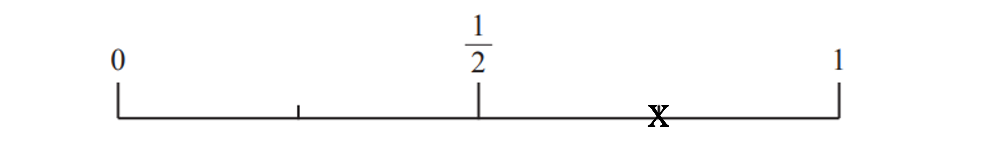
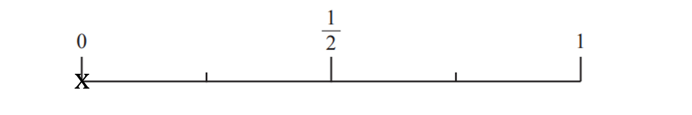

# Mark Schemes — Introduction to Probability
**6. Statistics & Probability** · Edexcel IGCSE Maths A (4MA1) — 18/Foundation

## Q1 — medium — 5 marks · exam-questions

### 5((a)) — 3 marks
(i)

> *There are 3 blue sections out of 6*

> *Write this as a fraction*

`table row cell 3 over 6 end cell equals cell 1 half end cell end table`

**Final answer:** **D**

**[B1]**

(ii)

> *There are 2 green sections out of 6*

> *Write this as a fraction*

`table row blank blank cell 2 over 6 end cell end table`

> *Look for the letter that is placed 2 interval parts out of 6 across the probability scale*

**Final answer:** **C**

**[B1]**

(iii)

> *There are no purple sections on the spinner*

> *Therefore the probability is 0*

> *Look for the letter that is placed at the start of the probability scale, representing 0*

**Final answer:** **A**

**[B1]**

### 5((b)) — 2 marks
> **[exam-tip]**
> This is the type of question that is best approached using trial and improvement. Start with a combination that may not work and then adjust to satisfy the given criteria.

> *Assume to start with that all of the colours appear an equal number of times on the spinner*

*8 sections *$\div$*4 colours = 2 sections of each colour*

> *The probability that the spinner will land on black is equal to the probability of white but yellow is not twice the probability of pink*

> *Changing one each of black and white to yellow will ensure that the number of yellow is now double pink to give:*

*black, white, pink, pink, yellow, yellow, yellow, yellow*

*P(B)=*$\frac{1}{8}$* ,  P(w)=*$\frac{1}{8}$* ,  P(P)=*$\frac{2}{8}$* ,  P(Y)=*$\frac{4}{8}$

**[B1 B1]**

> **[mark-scheme]**
> **B1**: Is gained for letter placement on the diagram that satisfies equal number of black and white labelled sections or double the amount of yellow to pink sections.
> 
> **B1**: Correct number of labelled sections for black, white, link and yellow.
> 
> It does not matter the order in which the letters appear on the spinner diagram.

## Q2 — easy — 4 marks · exam-questions

### 8((a)) — 2 marks
> *Add together pairs of scores, spinner A score and spinner B score, to complete the table*

|   | Spinner **A** |   |   |   |
|---|---|---|---|---|
| **1** | **2** | **3** |   |   |
| Spinner **B** | **2** | 3 | **Final answer:** **4** | **Final answer:** **5** |
| **4** | **Final answer:** **5** | 6 | **Final answer:** **7** |   |
| **6** | **Final answer:** **7** | 8 | 9 |   |
| **8** | **Final answer:** **9** | **Final answer:** **10** | **Final answer:** **11** |   |

**[M1 A1]**

> **[mark-scheme]**
> **M1**: Is awarded for 3 to 7 correct answers in the table.
> 
> **A1**: Is awarded for all 8 correct answers in the table.

### 8((b)) — 2 marks
> **[exam-tip]**
> Probability is typically best written as a fraction as the number of successful outcomes out of the total number of outcomes.
> 
> You are not expected to simplify a fraction for probability, although a correctly simplified fraction will still gain the mark.

(i)

> *Using the table, there is one successful outcome of scoring an 8*

> *There are 12 possible outcomes, therefore the probability is written as:*

$\frac{1}{12}$

**[B1]**

(ii)

> *Using the table, there are 5 successful outcomes of scoring less than 7 (these are 3, 4, 5, 5, 6)*

> *There are 12 possible outcomes, therefore the probability is written as:*

$\frac{5}{12}$

**[B1]**

> **[mark-scheme]**
> Either mark is still awarded for answers that have been correctly written using incorrect values in table from part (a).

## Q3 — easy — 3 marks · exam-questions

### 7() — 3 marks
(i)

> *Count the number of green sections on the spinner*

> *There is only one out of six so it is not very likely it will land on green*

**Final answer:** **Unlikely**

**[B1]**

(ii)

> *Count the number of yellow sections*

> *There are three out of six*

> *Half of the spinner is yellow so this has a 50/50 chance*

**Final answer:** **Evens**

**[B1]**

(iii)

> *Count the number of blue sections*

> *There are none, so the spinner cannot land on blue*

**Final answer:** **Impossible**

**[B1]**

## Q4 — hard — 6 marks · exam-questions

### 16((a)) — 3 marks
> *Calculate the combined probability of green and orange, using the fact that mutually exclusive outcomes sum to 1*

`table row cell straight P open parentheses G space or space O close parentheses end cell equals cell 1 minus open parentheses straight P open parentheses R close parentheses plus straight P open parentheses B close parentheses close parentheses end cell row blank equals cell 1 minus open parentheses 0.26 plus 0.3 close parentheses end cell row blank equals cell 0.44 end cell end table`

**[M1]**

> *Given that the number of green and orange bricks are equal, the probabilities must be equal*

$0.44\div2=0.22$

**[M1]**

**Final answer:** **0.22**

**[A1]**

> **[mark-scheme]**
> **M1**: Awarded for correct calculation or value of 0.44 given.
> 
> **M1**: You will gain this mark for dividing your previously calculated value (either 0.44 or an incorrect value) by 2.
> 
> **A1**: Any form equivalent to 0.22 will gain this mark (e.g. $\frac{11}{50}$).

### 16((b)) — 3 marks
> *Work out the total number of bricks, *$N$

> *The probability of R is equal to the number of red bricks out of the total number of bricks, giving:*

`straight P open parentheses R close parentheses equals 0.26 equals 91 over N`

> *Rearrange to calculate the total number of bricks, *$N$

* *$N=\frac{91}{0.26}$

$91\div0.26=350$

**[M1]**

> *Work out the number of blue bricks*

$0.3\times350=105$

> *Work out the total number of red and blue bricks*

$91+105=196$

> *Work out the number of layers*

$196\div4=49$

**[M1]**

**Final answer:** **49 layers**

**[A1]**

## Q5 — medium — 4 marks · exam-questions

### 10((a)) — 1 marks
> *The probability is the number of purple counters out of the total number of counters in the bag*

$\frac{13}{30}$

**[B1]**

### 10((b)) — 1 marks
> *Work out how many red counters are in the bag by subtracting the number of purple and white*

*30-13-11=6*

> *The probability is the number of red counters out of the total number of counters in the bag*

$\frac{6}{30}$

**[B1]**

> **[mark-scheme]**
> **B1**: A simplified fraction, $\frac{1}{5}$, or a decimal answer, 0.2, will also get the mark here.

### 10((c)) — 2 marks
> *After the 10 are added there are 40 counters in the bag in total*

> *Scale up the probability of white to a fraction with 40 as the denominator*

$\frac{2}{5}=\frac{?}{40}$

> *We multiply 5 by 8 to get 40 so do the same to the numerator*

$\frac{2}{5}=\frac{16}{40}$

**[M1]**

> *This means there are now 16 white counters in the bag*

> *Subtract the original number of white counters to find out how many have been added*

$16-11=5$

**Final answer:** **5**

**[A1]**

## Q6 — medium — 3 marks · exam-questions

### 18() — 3 marks
> *The probabilities should add up to 1 so subtract the other probabilities to get the probability of spinning pink*

$1-0.32-0.13-0.28=0.27$

**[M1]**

> *Multiply the probability of pink by the number of spins*

$0.27\times200=54$

**[M1]**

**Final answer:** **54**

**[A1]**

## Q7 — medium — 4 marks · exam-questions

### 18((a)) — 2 marks
> *Probability adds up to *$1$* so work out the remaining probability*

$1-0.58=0.42$

**[M1]**

> *Form an equation*

$2x+x=0.42$

> *Collect like terms*

$3x=0.42$

> *Divide by *$3$

$x=0.14$

**[A1]**

> **[mark-scheme]**
> Working is not required, so correct answer scores full marks.

### 18((b)) — 2 marks
> *Multiply the probability by the number of trials*

$0.58\times250$

**[M1]**

$145$

**[A1]**

> **[mark-scheme]**
> Working is not required, so correct answer scores full marks.

## Q8 — easy — 2 marks · exam-questions

### 5() — 2 marks
(i)

> *Express the probability as a fraction to decide where to place it on the number line*

$\frac{6}{8}=\frac{3}{4}$

**[B1]**

(ii)

> *There are no yellow counters so the probability is 0*

**[B1]**

## Q9 — medium — 2 marks · exam-questions

### 1() — 2 marks
There are 6 stores that have 2 turkeys left.

- There are 30 stores altogether (add up the frequency)

$\frac{6}{30}$

**[M1]**

Simplify the fraction

$\frac{1}{5}$

**[A1]**

## Q10 — easy — 5 marks · exam-questions

### 1() — 3 marks
(i)

Write the number of ways of getting a 6 over the total number of options

$\frac{1}{7}$

**[B1]**

(ii)

There are 3 even numbers (2, 4, 6), write this over the total number of options

$\frac{3}{7}$

**[B1]**

(iii)

There are 4 prime numbers (2, 3, 5, 7), write this over the total number of options

$\frac{4}{7}$

**[B1]**

### 2() — 2 marks
Half of the sections are yellow

$10\div2=5$

One section is red

Calculate the number of sections remaining

$10-5-1=4$

Green and blue are equal

$4\div2=2$

** [B1 B1]**

> **[mark-scheme]**
> **B1: **For either equal B or G or five Y.
> 
> **B1: **Correct answer.

## Q11 — medium — 7 marks · exam-questions

### 1() — 3 marks
Subtract the existing probabilities from 1

$1-0.18-0.4=0.42$

**[M1]**

Divide the leftover probability by 2

$0.42\div2$

**[M1]**

**Final answer:** **0.21**

**[A1]**

> **[mark-scheme]**
> **M1**: For subtracting the given probabilities from 1 to find the combined probability of black and white counters (0.42).
> 
> **M1**: For dividing the remaining probability by 2.
> 
> **A1**: For the correct answer of 0.21.

### 2() — 2 marks
Divide the frequency of reds by the probability

$54\div0.18$

**[M1]**

**Final answer:** **300**

**[A1]**

> **[mark-scheme]**
> **M1**: For a correct method. You can also use a ratio method by setting 0.18:1 equal to 54:*x* and solving for *x*.
> 
> **A1**: Correct answer.

### 3() — 2 marks
Work out how many white counters there were before

$0.21\times300=63\mathrm{counters}$

**[M1]**

Add the 7 counters and divide by the new total number of counters

$\frac{70}{307}$

**[A1]**
