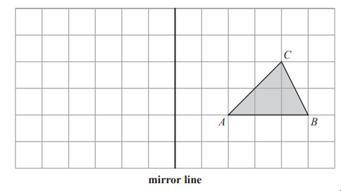
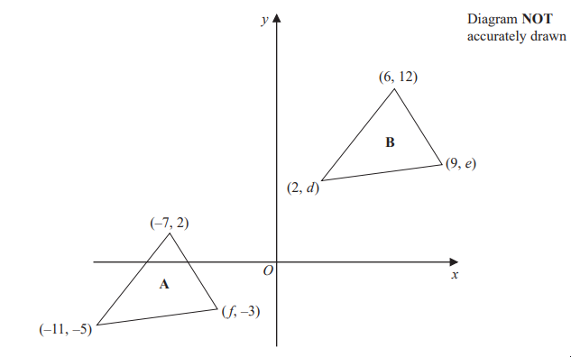
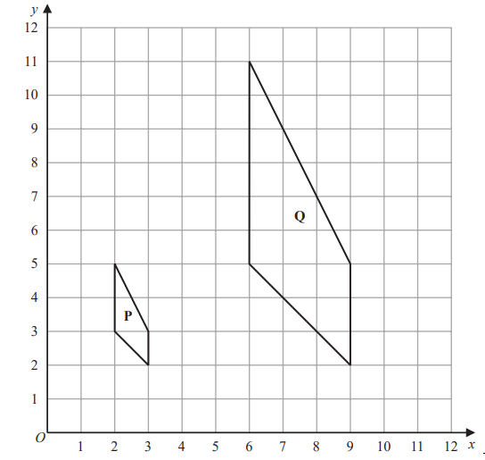
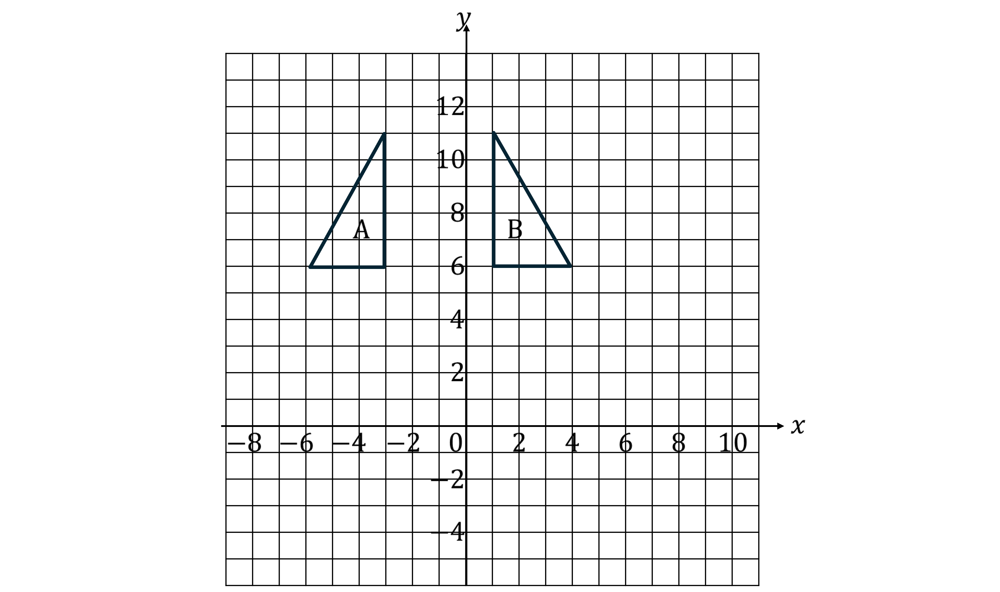
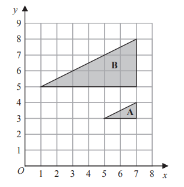

# Exam Questions — Transformations
**5. Vectors & Transformation Geometry** · Edexcel IGCSE Maths A (4MA1) — 18/Foundation
> Source: [https://www.savemyexams.com/igcse/maths/edexcel/a/18/foundation/topic-questions/vectors-and-transformation-geometry/transformations/exam-questions/](https://www.savemyexams.com/igcse/maths/edexcel/a/18/foundation/topic-questions/vectors-and-transformation-geometry/transformations/exam-questions/) · 6 questions · total 24 marks

## Q1 — medium — 2 marks · exam-questions

### 10((a)) — 2 marks — command: reflect — structured — from paper Specimen paper · 4MA1/1F
Triangle $ABC$ is drawn on a centimetre grid.

Reflect triangle $ABC$ in the mirror line.

## Q2 — easy — 2 marks · exam-questions

### 10() — 2 marks — command: describe — structured — from paper Specimen paper · 4MA1/2F

Describe fully the single transformation that maps triangle **P** onto triangle **Q**.

## Q3 — medium — 8 marks · exam-questions

### 19((a)) — 3 marks — command: work_out — structured — from paper 2023 June · 4MA1/1F
The diagram shows a sketch of triangle **A** and triangle **B** on a coordinate grid.

Given that triangle **A** has been translated to give triangle** B**, work out the value of $d$, the value of $e$ and the value of $f$

### 19((b)) — 3 marks — command: describe — structured — from paper 2023 June · 4MA1/1F
The diagram shows shape **P** and shape **Q** drawn on a grid.

Describe fully the single transformation that maps shape **P** onto shape **Q**

### 19((c)) — 2 marks — command: rotate — structured — from paper 2023 June · 4MA1/1F
On the grid above, rotate shape **P **90° clockwise about (3, 5) 
Label your shape **R**

## Q4 — easy — 2 marks · exam-questions

### 1() — 2 marks — command: describe — structured

Describe fully the single transformation that maps triangle A onto triangle B.

## Q5 — medium — 5 marks · exam-questions

### 19((a)) — 2 marks — command: reflect — structured — from paper 2023 Nov · 4MA1/2F

Reflect shape **T** in the line $y=x$

### 19((b)) — 3 marks — command: describe — structured — from paper 2023 Nov · 4MA1/2F

Describe fully the single transformation that maps triangle **A** onto triangle **B**

## Q6 — medium — 5 marks · exam-questions

### 1() — 1 mark — command: plot — structured
Points A, B and C are plotted on the grid below.

Plot point D on the grid to make the parallelogram ABDC.

### 2() — 2 marks — command: redraw — structured
Reflect ABDC in the $x$ axis.

### 3() — 2 marks — command: write — structured
In a different parallelogram, EFGH, the length EF is  11 cm and angle EFG = $35^{\circ}$.

Parallelogram EFGH is enlarged by a scale factor of 3.

For the enlarged parallelogram, write down

(i) the length of the enlarged side that corresponds to EF

(ii) the size of the angle that corresponds to angle EFG
