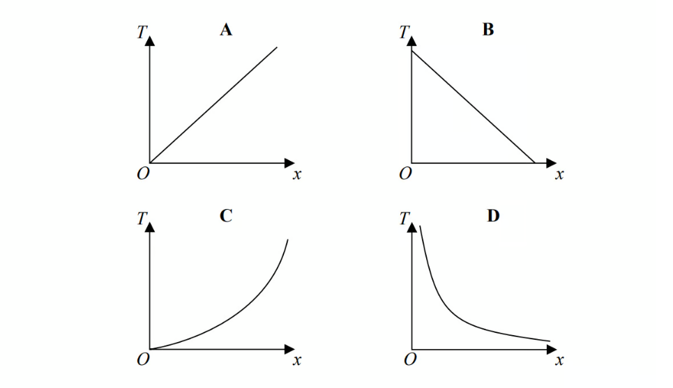
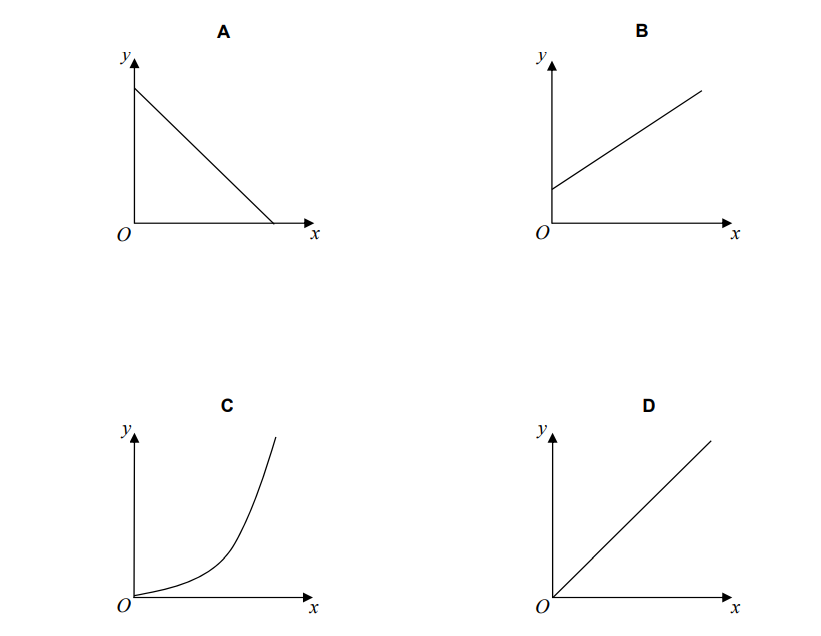
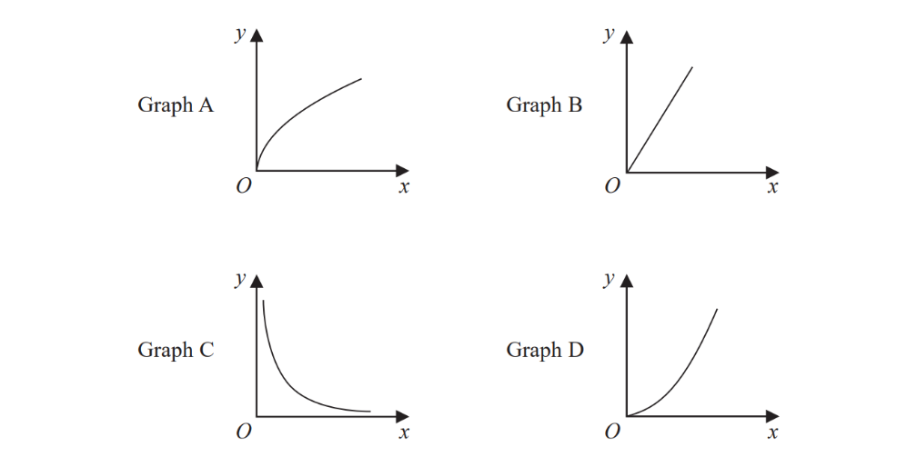
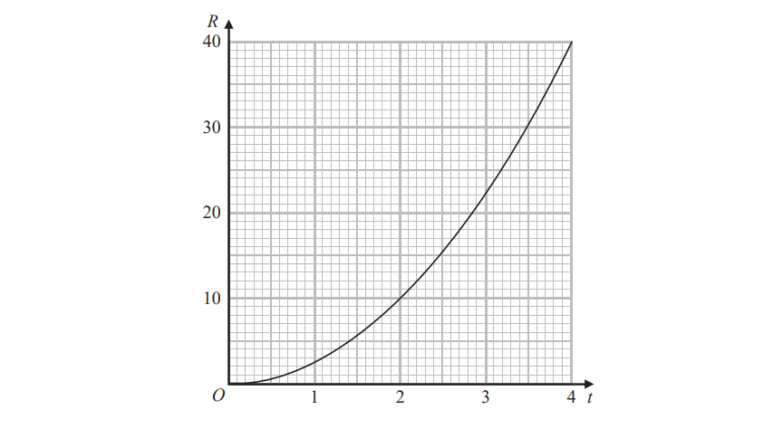
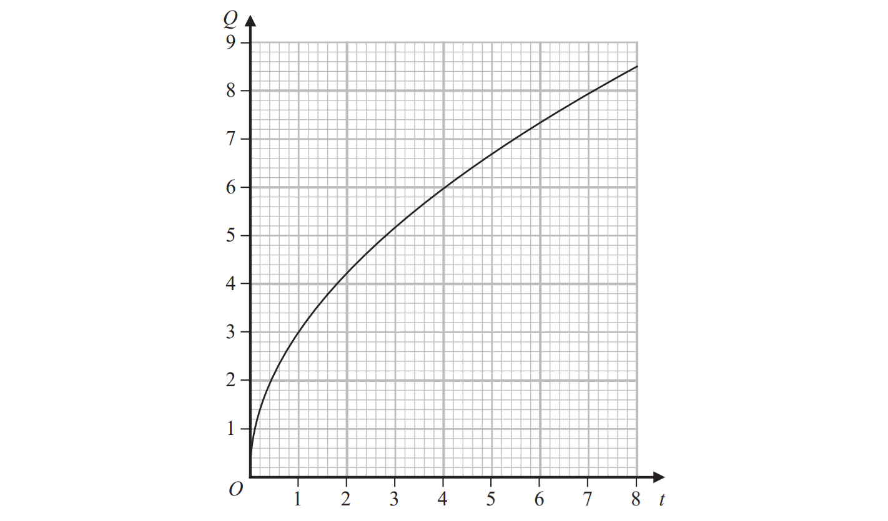
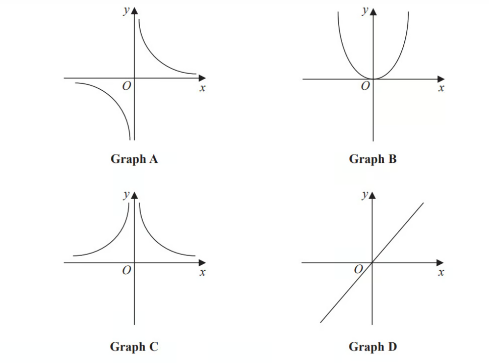

# Exam Questions — Direct & Inverse Proportion
**Numbers & the Number System** · Edexcel IGCSE Maths A (4MA1) — 18/Higher
> Source: [https://www.savemyexams.com/igcse/maths/edexcel/a/18/higher/topic-questions/1-numbers-and-the-number-system/direct-and-inverse-proportion/exam-questions/](https://www.savemyexams.com/igcse/maths/edexcel/a/18/higher/topic-questions/1-numbers-and-the-number-system/direct-and-inverse-proportion/exam-questions/) · 55 questions · total 203 marks

## Q1 — medium — 3 marks · exam-questions

### 9() — 3 marks — command: how — structured — from paper 2017	November · 1MA1/2H
Yesterday it took $5$ cleaners $4\frac{1}{2}$  hours to clean all the rooms in a hotel.

There are only $3$ cleaners to clean all the rooms in the hotel today.

Each cleaner is paid £$8.20$ for each hour or part of an hour they work.

How much will each cleaner be paid today?

## Q2 — medium — 3 marks · exam-questions

### 24() — 3 marks — command: find — structured — from paper June 2014 · 1MA0/2H
$p$is inversely proportional to $t$.

When $t=4,p=12$

Find the value of $p$ when  $t=6$

## Q3 — medium — 3 marks · exam-questions

### 13() — 3 marks — command: find — structured — from paper Sample 2015 · 1MA1/2H
$d$ is inversely proportional to $c$

When $c=280,d=25$

Find the value of $d$ when $c=350$

## Q4 — medium — 3 marks · exam-questions

### 10() — 3 marks — command: find — structured — from paper Spec2 2015 · 1MA1/1H
$y$ is inversely proportional to $x$

When$x=1.5,y=36$

Find the value of $y$ when $x=6$

## Q5 — medium — 4 marks · exam-questions

### 6((a)) — 3 marks — command: work_out — structured — from paper Spec2 2015 · 1MA1/3H
At a depth of $x$ metres, the temperature of the water in an ocean is $T^{\circ}C$. At depths below $900$metres, $T$ is inversely proportional to$x$.

$T$ is given by

$T=\frac{4500}{x}$

Work out the difference in the temperature of the water at a depth of $1200$ metres and the temperature of the water at a depth of $2500$metres.

### 6((b)) — 1 mark — command: write — structured — from paper Spec2 2015 · 1MA1/3H
Here are four graphs.

One of the graphs could show that $T$ is inversely proportional to $x$.

Write down the letter of this graph.

## Q6 — medium — 4 marks · exam-questions

### 17((a)) — 3 marks — command: find — structured — from paper Jan 2019 · 4MA1/1H
$T$ is directly proportional to the cube of  $r$

$T=21.76$ when $r=4$

Find a formula for $T$ in terms of $r$

### 17((b)) — 1 mark — command: work_out — structured — from paper Jan 2019 · 4MA1/1H
Work out the value of $T$ when $r=6$

## Q7 — medium — 2 marks · exam-questions

### 10() — 2 marks — command: complete — structured — from paper June 2018 · 8300/1H
$y$is inversely proportional to $x$.

Complete the table.

| $x$ | 12 | 6 |   |
|---|---|---|---|
| $y$ |   | 4 | 8 |

## Q8 — medium — 4 marks · exam-questions

### 9() — 4 marks — structured — from paper Nov 2018 · 8300/2H
The diagrams show the position of a tap when off and fully on.

The tap is fully on when the angle of turn is 180°

When fully on, water flows out of the tap at 14 litres per minute. The rate at which water flows out is in direct proportion to the angle of turn. 
The tap is turned 135°

The water flows into a tank with a capacity of 79.8 litres. Will it take **less than** $7\frac{1}{2}$ minutes to fill the tank?

You **must** show your working.

## Q9 — medium — 4 marks · exam-questions

### 17((a)) — 3 marks — command: how — structured — from paper Specimen 2015 · 8300/1H
To complete a task in 15 days a company needs

4 people each working for 8 hours per day.

The company decides to have

5 people each working for 6 hours per day.

Assume that each person works at the same rate.

How many days will the task take to complete? 
You **must **show your working.

### 17((a)) — 1 mark — command: comment — structured — from paper Specimen 2015 · 8300/1H
Comment on how the assumption affects your answer to part (a).

## Q10 — medium — 1 marks · exam-questions

### 4() — 1 mark — command: which — structured — from paper Specimen 2015 · 8300/3H
$y$ is directly proportional to $x$.

Which graph shows this?

Circle the correct letter.

## Q11 — medium — 5 marks · exam-questions

### 1() — 5 marks — command: explain — structured — from paper Nov 2019 · J560/04
Carol makes birthday cards. Each card takes the same amount of time to make.

She makes 3 cards in 48 minutes. She has an order for 80 cards.

Can she complete this order in 3 days if she works 8 hours each day? 
Show how you decide.

..................... because ....................................................................................................

## Q12 — medium — 3 marks · exam-questions

### 6() — 3 marks — command: find — structured — from paper June 2018 · J560/06
*y* is inversely proportional to *x*. 
*y* = 0.04 when *x *= 80.

Find the value of *y* when *x* = 32.

*y *= ...................

## Q13 — medium — 2 marks · exam-questions

### 16() — 2 marks — command: prove — structured — from paper June 2019 · J560/04
The table shows values of *x* and *y*.

| *x* | 4 | 16 | 36 |
|---|---|---|---|
| *y* | 6 | 3 | 2 |

Show that these values fit the relationship that *y* is inversely proportional to $\sqrt{x}$ .

## Q14 — medium — 8 marks · exam-questions

### 2((a)) — 2 marks — command: how — structured — from paper Specimen 2015 · J560/05
Sam and two friends put letters in envelopes on Monday. The three of them take two hours to put 600 letters in envelopes.

On Tuesday Sam has three friends helping.

Working at the same rate, how many letters should the **four** of them be able to put in envelopes in two hours?

### 2((b)) — 4 marks — command: how — structured — from paper Specimen 2015 · J560/05
Working at the same rate, how much longer would it take **four** people to put 1000 letters in envelopes than it would take **five** people?

### 2((c)) — 2 marks — command: why — structured — from paper Specimen 2015 · J560/05
Sam says

| It took two hours for three people to put 600 letters in envelopes. |
|---|
| If I assume they work all day, then in one day three people will put 7200 letters in envelopes because 600 × 12 = 7200. |

Why is Sam’s assumption not reasonable? What effect has Sam’s assumption had on her answer?

## Q15 — medium — 6 marks · exam-questions

### 1() — 5 marks — command: use — structured — from paper Nov 2017 · J560/04
Donald swims 3 lengths of a swimming pool in 93 seconds.

i) Use this information to show that he could swim 100 lengths in under 55 minutes.

[4]

ii) What assumption did you make in part **(i)**?

[1]

### 1((c)) — 1 mark — command: suggest — structured — from paper Nov 2017 · J560/04
Donald tries to swim the 100 lengths in under 55 minutes.

Suggest one reason why he might not achieve this.

## Q16 — medium — 4 marks · exam-questions

### 1() — 4 marks — command: work_out — structured
3 kilograms of bananas cost £4.20.

700 grams of cherries and 5 kilograms of bananas cost £10.40

Work out the cost of 1 kilogram of cherries.

## Q17 — hard — 4 marks · exam-questions

### 21() — 4 marks — command: find — structured — from paper November 2013 · 1MA0/1H
$y$ is directly proportional to the square of $x$.

When $x=3,y=36$

Find the value of $y$ when $x=5$

## Q18 — hard — 5 marks · exam-questions

### 1() — 3 marks — command: find — structured
$Q$ is directly proportional to the cube root of $t$.

$Q=14.7$ when  $t=343$

Find a formula for $Q$ in terms of $t$.

### 2() — 2 marks — command: find — structured
Find the value of t when $Q=16.8$

## Q19 — hard — 3 marks · exam-questions

### 22() — 3 marks — command: find — structured — from paper June 2013 · 1MA0/2H
$h$ is inversely proportional to the square of $r$.

When $r=5,h=3.4$

Find the value of $h$ when $r=8$

## Q20 — hard — 4 marks · exam-questions

### 24() — 4 marks — command: complete — structured — from paper June 2016 · 1MA0/1H
Given that $y\propto\frac{1}{x^{2}}$, complete this table of values.

| $x$ | 1 | 2 | 5 | 10 |
|---|---|---|---|---|
| $y$ |   |   |   | 1 |

## Q21 — hard — 3 marks · exam-questions

### 24() — 3 marks — command: work_out — structured — from paper November 2016 · 1MA0/1H
The intensity of the sound, $I$ watts/m2, received from a loudspeaker is inversely proportional to the square of the distance, $d$ metres, from the loudspeaker.

When $d=2,I=30$ Work out the value of $I$ when $d=10$

## Q22 — hard — 3 marks · exam-questions

### 20() — 3 marks — command: find — structured — from paper June 2017 · 1MA0/2H
$T$ is inversely proportional to $d^{2}$
$T=12$when $d=8$

Find the value of $T$ when $d=0.5$

## Q23 — hard — 2 marks · exam-questions

### 12() — 2 marks — command: match — structured — from paper June 2018 · 1MA1/2H

The graphs of $y$ against $x$ represent four different types of proportionality.

Match each type of proportionality in the table to the correct graph.

| **Type of proportionality** | **Graph letter** |
|---|---|
| $y\proptox$ |   |
| $y\proptox^{2}$ |   |
| $y\propto\sqrt{x}$ |   |
| $y\propto\frac{1}{x}$ |   |

## Q24 — hard — 3 marks · exam-questions

### 9() — 3 marks — command: work_out — structured — from paper June 2019 · 1MA1/3H
A company has to make a large number of boxes.

The company has 6 machines. 
All the machines work at the same rate. 
When all the machines are working, they can make all the boxes in 9 days.

The table gives the number of machines working each day.

|   | day 1 | day 2 | day 3 | all other days |
|---|---|---|---|---|
| **Number of machines working** | 3 | 4 | 5 | 6 |

Work out the total number of days taken to make all the boxes.

## Q25 — hard — 3 marks · exam-questions

### 15() — 3 marks — command: calculate — structured — from paper Jan 2022 · 4MA1/1H
$A$ is inversely proportional to $C^{2}$

$A$ = 40 when $C$ = 1.5

Calculate the value of $C$ when $A$ = 1000

$C$= ...................................................

## Q26 — hard — 5 marks · exam-questions

### 16((a)) — 3 marks — command: find — structured — from paper June 2018 · 4MA1/2H
$R$ is proportional to $t^{2}$ 
The graph shows the relationship between $R$ and $t$ for `0 space less-than or slanted equal to space t space less-than or slanted equal to space 4`

Find $a$ formula for $R$ in terms of $t$.

### 16((b)) — 2 marks — command: prove — structured — from paper June 2018 · 4MA1/2H
Given also that $R=\frac{8}{5x}$ 
show that $t$ is inversely proportional to $\sqrt{x}$ for $t>0$

## Q27 — hard — 3 marks · exam-questions

### 14() — 3 marks — command: find — structured — from paper Nov 2020 · 4MA1/1H
$F$ is inversely proportional to the square of $v.$

Given that $F=6.5$ when $v=4$

find a formula for $F$ in terms of $v.$

## Q28 — hard — 4 marks · exam-questions

### 20((a)) — 3 marks — command: find — structured — from paper Nov 2020 · 4MA1/2HR
$T$ is inversely proportional to $m^{2}$

$T=30$ when $m=0.5$

Find a formula for $T$ in terms of $m$.

### 20((b)) — 1 mark — command: work_out — structured — from paper Nov 2020 · 4MA1/2HR
Work out the value of $T$ when $m=0.1$

## Q29 — hard — 5 marks · exam-questions

### 16((a)) — 3 marks — command: find — structured — from paper June 2019 · 4MA1/2HR
The following table gives values of $x$and $y$ where $y$ is inversely proportional to the square of $x$.

| $x$ | 1.5 | 2 | 3 | 4 |
|---|---|---|---|---|
| $y$ | 16 | 9 | 4 | 2.25 |

Find a formula for $y$ in terms of $x$.

### 16((b)) — 2 marks — command: find — structured — from paper June 2019 · 4MA1/2HR
Given that $x>0$

find the value of $x$ when $y=144$

## Q30 — hard — 5 marks · exam-questions

### 15((a)) — 3 marks — command: find — structured — from paper Specimen 2016 · 4MA1/1H
$P$  is inversely proportional to $\sqrt{q}$
 $P$  = 10 when $q=0.0064$

Find a formula for $P$ in terms of $q$.

### 15((b)) — 2 marks — command: find — structured — from paper Specimen 2016 · 4MA1/1H
Find the value of $q$ when  $P$ = 20

## Q31 — hard — 5 marks · exam-questions

### 21((a)) — 3 marks — command: work_out — structured — from paper Nov 2018 · 8300/2H
$y$ is inversely proportional to $\sqrt{x}$

$y=4$     when     $x=9$

Work out an equation connecting $y$ and $x$.

### 21((b)) — 2 marks — command: work_out — structured — from paper Nov 2018 · 8300/2H
Work out the value of $y$ when $x=25$

## Q32 — hard — 3 marks · exam-questions

### 25() — 3 marks — command: how — structured — from paper Nov 2017 · 8300/1H
15 machines work at the same rate. Together, the 15 machines can complete an order in 8 hours.

3 of the machines break down after working for 6 hours. The other machines carry on working until the order is complete.

In total, how many hours does **each** of the other machines work?

............................hours

## Q33 — hard — 1 marks · exam-questions

### 12() — 1 mark — command: which — structured — from paper Nov 2019 · 8300/1H
$V=\frac{k}{H}$  where k is a constant. Which **two **statements are correct?

Tick **two **boxes.

| `square` | $V$ is directly proportional to $H$ |
|---|---|
| `square` | $V$ is inversely proportional to $H$ |
| `square` | $V$ is directly proportional to $\frac{1}{H}$ |
| `size 26px square` | $V$ is inversely proportional to $\frac{1}{H}$ |

## Q34 — hard — 1 marks · exam-questions

### 14() — 1 mark — command: circle — structured — from paper June 2017 · 8300/3H
$xy=c$ where $c$ is a constant. Circle the correct statement.

| $y$ is directly proportional to $x$ | $y$ is directly proportional to $\frac{1}{x}$ |
|---|---|
| $y$ is inversely proportional to $\frac{1}{x}$ | $x$ is directly proportional to $y$ |

## Q35 — hard — 4 marks · exam-questions

### 3() — 4 marks — command: how — structured — from paper Nov 2020 · J560/04
Three people take $2\frac{1}{2}$ hours to deliver leaflets to 270 houses.

Assuming all people deliver leaflets at the same rate, how long will it take five people to deliver leaflets to 405 houses? 
Give your answer in hours and minutes.

................. hours ................. minutes

## Q36 — hard — 3 marks · exam-questions

### 14() — 3 marks — command: find — structured — from paper Nov 2018 · J560/04
*y* is inversely proportional to the square root of *x*. 
*y* is 40 when x is 9.

Find a formula linking *x* and* y*.

## Q37 — hard — 3 marks · exam-questions

### 15((d)) — 3 marks — command: find — structured — from paper June 2017 · J560/04
The graph shows the speed, *v* metres per second (m/s), of a car at time *t *seconds.

The speed of this car is directly proportional to the square of the time. 
Find a formula linking *v *and *t*.

## Q38 — hard — 5 marks · exam-questions

### 15((a)) — 3 marks — command: find — structured — from paper Specimen paper · 4MA1/1H
$P$* *is inversely proportional to* *$\sqrt{q}$
$P$ = 10 when 
$q$ = 0.0064

Find a formula for $P$ in terms of $q$.

### 15((b)) — 2 marks — command: find — structured — from paper Specimen paper · 4MA1/1H
Find the value of $q$ when  $P=20$

## Q39 — hard — 5 marks · exam-questions

### 16((a)) — 3 marks — command: find — structured — from paper 2023 June · 4MA1/2H
$Q$ is directly proportional to $\sqrt{t}$.
The graph shows the relationship between $Q$ and $t$ for $0<t<8$.

Find a formula for  $Q$ in terms of  $t$.

### 16((b)) — 2 marks — command: find — structured — from paper 2023 June  · 4MA1/2H
$Q$ is increased by 20%.

Find the percentage increase in  $t$.

## Q40 — very_hard — 4 marks · exam-questions

### 13((a)) — 2 marks — command: find — structured — from paper June 2017 · 1MA1/1H
The table shows a set of values for $x$ and $y$.

| $x$ | $1$ | $2$ | $3$ | $4$ |
|---|---|---|---|---|
| $y$ | $9$ | $2\frac{1}{4}$ | $1$ | $\frac{9}{16}$ |

$y$ is inversely proportional to the square of $x$.

Find an equation for $y$ in terms of $x$.

### 13((b)) — 2 marks — command: find — structured — from paper June 2017 · 1MA1/1H
Find the positive value of $x$ when $y=16$

## Q41 — very_hard — 3 marks · exam-questions

### 16() — 3 marks — command: find — structured — from paper November 2017 · 1MA1/1H
$y$ is directly proportional to `cube root of x`

$y=1\frac{1}{6}$ when  $x=8$

Find the value of $y$ when $x=64$

## Q42 — very_hard — 5 marks · exam-questions

### 14() — 5 marks — command: find — structured — from paper June 2018 · 1MA1/1H
$y$ is inversely proportional to $d^{2}$ 
When $d=10,y=4$

$d$ is directly proportional to $x^{2}$ 
When $x=2,d=24$

Find a formula for $y$ in terms of $x$. 
Give your answer in its simplest form.

## Q43 — very_hard — 3 marks · exam-questions

### 15() — 3 marks — command: work_out — structured — from paper Spec1 2015 · 1MA1/2H
A pendulum of length $L$ cm has time period $T$ seconds. 
$T$ is directly proportional to the square root of $L$.

The length of the pendulum is increased by 40%.

Work out the percentage increase in the time period.

## Q44 — very_hard — 1 marks · exam-questions

### 14() — 1 mark — command: explain — structured — from paper Spec2 2015 · 1MA1/2H
$D$ is directly proportional to the cube of $n$. 
Mary says that when $n$ is doubled, the value of $D$ is multiplied by 6

Mary is wrong. 
Explain why.

## Q45 — very_hard — 2 marks · exam-questions

### 16() — 2 marks — command: match — structured — from paper Spec1 2015 · 1MA1/1H
These graphs show four different proportionality relationships between $y$ and $x$.

Match each graph with a statement in the table below.

| **Proportionality relationship** | **Graph letter** |
|---|---|
| $y$ is directly proportional to $x$ |   |
| $y$ is inversely proportional to $x$ |   |
| $y$ is proportional to the square of $x$ |   |
| $y$ is inversely proportional to the square of $x$ |   |

## Q46 — very_hard — 4 marks · exam-questions

### 20() — 4 marks — command: find — structured — from paper June 2019 · 1MA1/1H
$h$ is inversely proportional to $p$

$p$ is directly proportional to $\sqrt{t}$

Given that $h=10$ and $t=144$ when $p=6$ 
find a formula for $h$ in terms of $t$

## Q47 — very_hard — 4 marks · exam-questions

### 20() — 4 marks — command: find — structured — from paper Jan 2022 · 4MA1/2HR
$y$ is inversely proportional to $\sqrt{x}$ 
$x$ is directly proportional to $T^{3}$

Given that$y=8$ when $T=25$ 
find the exact value of $T$when $y=27$

$T=$.......................................................

## Q48 — very_hard — 5 marks · exam-questions

### 17((a)) — 3 marks — command: find — structured — from paper June 2019 · 4MA1/2H
$y$ is directly proportional to the cube of $x$

$y=20h$when $x=h(h\neq0)$

Find a formula for $y$ in terms of $x$and $h$

$y$ = .....................

### 17((b)) — 2 marks — command: find — structured — from paper June 2019 · 4MA1/2H
Find $x$ in terms of $h$ when $y=67.5h$ 
Give your answer in its simplest form.

$x$=.......................

## Q49 — very_hard — 6 marks · exam-questions

### 16((a)) — 3 marks — command: find — structured — from paper June 2021 · 4MA1/2H
$A$ is inversely proportional to the square of $r$.

$A=5$when $r=0.3$.

Find a formula for $A$ in terms of $r$.

### 16((b)) — 3 marks — command: find — structured — from paper June 2021 · 4MA1/2H
Find the value of $A$ when$r=7.5A$

$A=$..............................................

## Q50 — very_hard — 4 marks · exam-questions

### 18() — 4 marks — command: how — structured — from paper Nov 2018 · 8300/1H
Beth and Mia translate documents from Spanish into English. 
A set of documents that would take Beth 8 days would take Mia 10 days.

Beth starts to translate the documents.
 After 2 days Beth and Mia both work on translating the documents.

How many **more** days will it take to complete the work? 
You **must** show your working.

......................days

## Q51 — very_hard — 4 marks · exam-questions

### 22((a)) — 3 marks — command: work_out — structured — from paper Nov 2020 · 8300/1H
$y$ is directly proportional to $x^{3}$

$y=17$   when   $x=4$

Work out an equation connecting $y$ and $x$.

### 22((b)) — 1 mark — command: circle — structured — from paper Nov 2020 · 8300/1H
$m$ is inversely proportional to $\sqrt{r}$.

The value of $r$is multiplied by 4.

Circle what happens to the value of $m$.

| $\times2$ | $\times16$ | $\div2$ | $\div16$ |
|---|---|---|---|

## Q52 — very_hard — 5 marks · exam-questions

### 26() — 5 marks — command: work_out — structured — from paper Nov 2019 · 8300/2H
$P,Q$ and $R$have positive values.

$P$ is directly proportional to the square of $Q$. 
When $P=1.25,Q=0.5$ 
$Q$ is inversely proportional to $R$. 
When $Q=0.5,R=6$

Work out the value of $R$ when $P=0.8$

## Q53 — very_hard — 4 marks · exam-questions

### 11() — 4 marks — command: find — structured — from paper June 2018 · J560/04
*y* is directly proportional to the square of *x*.

Find the percentage increase in *y* when *x* is increased by 15%.

## Q54 — very_hard — 4 marks · exam-questions

### 15() — 4 marks — structured — from paper Specimen 2015 · J560/04
At a constant temperature, the volume of a gas V is inversely proportional to its pressure *p*. 
By what percentage will the pressure of a gas change if its volume increases by 25%?

## Q55 — very_hard — 4 marks · exam-questions

### 9() — 4 marks — command: find — structured — from paper Nov 2020 · J560/06
*x* is directly proportional to *y*. 
*y* is directly proportional to *z*.

When *x* = 10, *y* = 60. 
When *y* = 8, *z* = 1.6.

Find a formula for *z* in terms of *x*.
