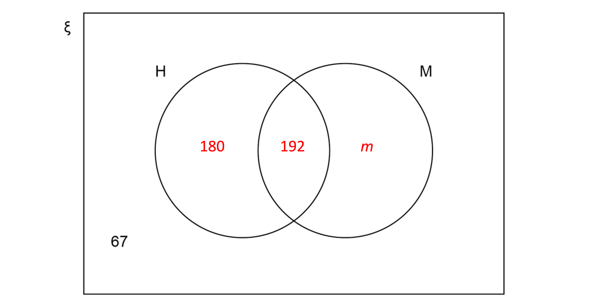

# Mark Schemes — Fractions, Decimals & Percentages
**Numbers & the Number System** · Edexcel IGCSE Maths A (4MA1) — 18/Higher

## Q1 — easy — 4 marks · exam-questions

### 2() — 4 marks
> *Find 15% of 240 students by using a multiplier of 0.15*

*240 × 0.15 = 36 students want to go to college*

**[1]**

> *Find *$\frac{3}{4}$* of 240 students*

$\frac{3}{4}$* × 240 =  180 students want to stay at school*

**[1]**

> *Find the total of the students so far*

*36 + 180 = 216 students*

> *There are 240 students in total, and the rest do not know*

*240 - 216*

**[1]**

**24** **[1]**

## Q2 — easy — 2 marks · exam-questions

### 10() — 2 marks
> *Find 62 out of 80 as a percentage*

`62 over 80 cross times 100 equals 77.5 percent sign`

**[1]**

> *This is in the middle row of the table*

**Merit** **[1]**

## Q3 — easy — 2 marks · exam-questions

### 2() — 2 marks
> *Find 32 out of 80 as a percentage*

`32 over 80 cross times 100 equals 40 percent sign`

**[1]**

> *Compare the percentage in English and Maths*

*40% > 38%*

**Higher percentage in**** Maths** **[1]**

## Q4 — easy — 4 marks · exam-questions

### 5() — 4 marks
> *Find 65% of 80 minutes*

*0.65 × 80 = 52 minutes*

**[1]**

> *Celina sings for 52 minutes*

> *Find *$\frac{5}{8}$* of 80 minutes, can type the below straight into your calculator*

$\frac{5}{8}\times80=50$

**[1]**

> *Zoe sings for 50 minutes*

> *Find the difference*

*52 - 50*

**[1]**

**2 minutes** **[1]**

## Q5 — easy — 2 marks · exam-questions

### 15() — 2 marks
> *Let *$x$* be the recurring decimal*

$x=0.2555555555...$

> *Multiply both sides by 10*

$10x=2.5555555555...$

> *Multiply both sides by 10 again*

$100x=25.55555555555...$

> *These two equations both contain the trail of recurring 5s, so we can find *$100x-10x$* to eliminate the recurring part*

$100x-10x=25.55555...-2.55555...$

**[1]**

> *Simplifying*

$90x=23$

> *Divide both sides by 90*

$x=\frac{23}{90}$ **[1]**

## Q6 — easy — 2 marks · exam-questions

### 1() — 2 marks
> *Let *$x$* be the recurring decimal*

$x=0.1777777...$

> *Multiply both sides by 10*

$10x=1.777777...$

> *Multiply both sides by 10 again*

$100x=17.7777777....$

> *These two equations both contain the trail of recurring 7s, so we can find *$100x-10x$* to eliminate the recurring part*

$100x-10x=17.77777...-1.77777...$

**[1]**

> *Simplifying*

$90x=16$

> *Divide both sides by 90*

$x=\frac{16}{90}$

> *Simplify the fraction by dividing the top and bottom by 2*

$x=\frac{8}{45}$** ****[1]**

## Q7 — easy — 2 marks · exam-questions

### 1() — 2 marks
> *Let *$x$* be the recurring decimal*

$x=0.388888...$

> *Multiply both sides by 10*

$10x=3.88888...$

> *Multiply both sides by 10 again*

$100x=38.888888....$

> *These two equations both contain the trail of recurring 8s, so we can find *$100x-10x$* to eliminate the recurring part*

$100x-10x=38.88888...-3.88888...$

**[1]**

> *Simplifying*

$90x=35$

> *Divide both sides by 90*

$x=\frac{35}{90}$

> *Simplify the fraction by dividing the top and bottom by 5*

$x=\frac{7}{18}$ **[1]**

## Q8 — easy — 2 marks · exam-questions

### 1() — 2 marks
> *Let *$x$* be the recurring decimal*

$x=0.266666...$

> *Multiply both sides by 10*

$10x=2.66666...$

> *Multiply both sides by 10 again*

$100x=26.66666....$

> *These two equations both contain the trail of recurring 6s, so we can find *$100x-10x$* to eliminate the recurring part*

$100x-10x=26.66666...-2.66666...$

**[1]**

> *Simplifying*

$90x=24$

> *Divide both sides by 90*

$x=\frac{24}{90}$

> *Simplify the fraction by dividing the top and bottom by 6*

$x=\frac{4}{15}$ **[1]**

## Q9 — easy — 2 marks · exam-questions

### 15((a)) — 2 marks
For now, ignore the 4 and consider how we can write `0.5 with dot on top 7 with dot on top` as $\frac{19}{33}$

> *Let *$x$* be the recurring decimal*

$x=0.57575757...$

> *Multiply both sides by 10*

$10x=5.757575...$

> *Multiply both sides by 10 again*

$100x=57.575757....$

> *The two equations for *$100x$* and *$x$* both contain the trail of .575757... , so we can find *$100x-x$* to eliminate the recurring part*

$100x-x=57.575757...-0.5757575...$

**[1]**

> *Simplifying*

$99x=57$

> *Divide both sides by 99*

$x=\frac{57}{99}$

> *Simplify the fraction by dividing the top and bottom by 3*

$x=\frac{19}{33}$

> *Now add on the whole part, the 4, again*

`bold 4 bold. bold 5 with bold dot on top bold 7 with bold dot on top bold equals bold 4 bold 19 over bold 33` **[1]**

## Q10 — easy — 6 marks · exam-questions

### 5() — 6 marks
*Use the ratio 3:5 to find how many girls and boys there are* 
*There are 8 parts in total; 3 parts out of 8 are girls, and 5 parts out of 8 are boys*

$\frac{3}{8}\times120=45\mathrm{girls}$ 
$\frac{5}{8}\times120=75\mathrm{boys}$

**[2]**

> $\frac{16}{25}$* of the boys go climbing, which means *$\frac{9}{25}$* of the boys go sailing *`open parentheses 1 minus 16 over 25 equals 9 over 25 close parentheses`

$\frac{9}{25}\times75=27\mathrm{boys} \mathrm{go} \mathrm{sailing}$

**[1]**

*Twice as many girls go sailing as go climbing, so the 45 girls are divided in the ratio 2:1, with the 2-part representing the number who went sailing* 
*This means 2 thirds of the girls went sailing*

$\frac{2}{3}\times45=30\mathrm{girls} \mathrm{go} \mathrm{sailing}$

**[1]**

> *We can now find the total number of children who go sailing*

*27 + 30*

**[1]**

**57 children go sailing** **[1]**

## Q11 — easy — 3 marks · exam-questions

### 5() — 3 marks
*The shaded area of rectangle B is equal to one whole rectangle, minus the white area of rectangle A, minus the white area of rectangle C* 
*So if we can find the white areas of rectangles A and C, we can find the shaded area of B*

> $\frac{5}{8}$* of rectangle A is shaded, therefore*

$1-\frac{5}{8}=\frac{3}{8}$* of rectangle A is white*

> *80% of rectangle C is shaded, therefore*

*100% - 80% = 20% of rectangle C is white (or *$\frac{1}{5}$*)*

**Either **$\frac{3}{8}$** or **$\frac{1}{5}$** found**** [1]**

> *Therefore the shaded area of rectangle B is*

$1-\frac{3}{8}-\frac{1}{5}$

**[1]**

> *Use a common denominator of 40 (8×5) to evaluate this*

$\frac{40}{40}-\frac{3\times5}{8\times5}-\frac{1\times8}{5\times8}=\frac{40}{40}-\frac{15}{40}-\frac{8}{40}=\frac{17}{40}$

$\frac{17}{40}$ **[1]**

## Q12 — easy — 1 marks · exam-questions

### 2() — 1 marks
> *To compare the numbers, we could write them in a column and examine the value of the second and third decimal places.*

`table row cell 0.5 with dot on top end cell equals cell 0.5555.... end cell row cell space space space space 0.55 space end cell equals cell 0.55 end cell row cell 0.545 end cell equals cell 0.545 end cell row cell 0.5 4 with dot on top 5 with dot on top end cell equals cell 0.5454545... end cell end table`

> *We can see that *`0.5 with dot on top`* has the highest value in the second and third decimal places (it is *`0.00 5 with dot on top`* higher than the second option, 0.55).*

**The first option is correct, **`bold 0 bold. bold 5 with bold dot on top`* ***[1]**

## Q13 — easy — 4 marks · exam-questions

### 6() — 4 marks
> **[exam-tip]**
> Remember the difference between "off" and "of". $\frac{1}{6}$ off means that $\frac{1}{6}$ of the price has been subtracted. This means the sale price is $\frac{5}{6}$ of the normal price.

> *Work out the normal price of ticket A*

`5 over 6 space equals space 140 €`

**[M1]**

> *Divide both sides by *$5$

`1 over 6 space equals space 28 €`

> *Multiply both sides by *$6$* *

`6 over 6 space equals space 168 €`

> *The normal price of ticket A is *`168 €`

**[M1]**

> *Work out the normal price of ticket B*

> **[exam-tip]**
> 20% off the normal price means the sale price is 80% of the normal price.

`80 percent sign space equals space 136 €`

> *Divide by *$8$* to work out *`10 percent sign`

`10 percent sign space equals space 17 €`

> *Multiply by *$10$* to work out *`100 percent sign`

`100 percent sign space equals space 170 €`

> *The normal price of ticket B is *`170 €`

**[M1]**

> *Work out the difference*

$170-168=2$

$2$

**[A1]**

> **[mark-scheme]**
> -2 would also be accepted.

## Q14 — medium — 4 marks · exam-questions

### 4() — 4 marks
> *To find the price of the adult ticket, we need to reduce £24 by *$\frac{1}{3}$

> *Find *$\frac{1}{3}$* of £24, and then subtract this from £24*

`1 third space of space £ 24 space equals space £ 8`

`£ 24 space minus space £ 8 space equals space £ 16`

**[1]**

> *The adult ticket costs £16 when using the Family Railcard*

> *To find the price of a child ticket, we need to reduce £12 by 60%*

> *This is the same as finding 40% of the price, as 100% - 60% = 40%*

> *We can use a multiplier of 0.4 to find 40%*

*£12 × 0.4 = £4.80*

**[1]**

> *Children's tickets cost £4.80 with the Family Railcard*

> *Find the total cost for 1 adult and 2 children*

*£16 + £4.80 + £4.80*

**[1]**

**£25.60** **[1]**

## Q15 — medium — 2 marks · exam-questions

### 8() — 2 marks
> *Write out each number in a longer form, to make comparing them easier*

`0.2 4 with dot on top 6 with dot on top space equals space 0.24646464646...
0.24 6 with dot on top space equals space 0.24666666666...
0.2 with dot on top 4 6 with dot on top space equals space 0.246246246246...
0.246 space equals space 0.246000000000...`

**Correct use of recurring symbol ****[1]**

> *The numbers are the same up to the 3rd decimal place, but are different from the 4th decimal place onwards*

`0.2 4 with dot on top 6 with dot on top space equals space 0.246 bold 46464646 bold. bold. bold.
0.24 6 with dot on top space equals space 0.246 bold 66666666 bold. bold. bold.
0.2 with dot on top 4 6 with dot on top space equals space 0.246 bold 246246246 bold. bold. bold.
0.246 space equals space 0.246 bold 000000000 bold. bold. bold.`

> *Putting the numbers in order, with the smallest first*

$0.246000000....\,0.246246246246...\,0.24646464646464...\,0.2466666666...$

`bold 0 bold. bold 246 bold comma bold space bold 0 bold. bold 2 with bold dot on top bold 4 bold 6 with bold dot on top bold comma bold space bold 0 bold. bold 2 bold 4 with bold dot on top bold 6 with bold dot on top bold comma bold space bold 0 bold. bold 24 bold 6 with bold dot on top` **[1]**

## Q16 — medium — 3 marks · exam-questions

### 23() — 3 marks
> *Let *$x$* be the recurring decimal*

$x=0.36363636...$

> *Multiply both sides by 10*

$10x=3.6363636...$

> *Multiply both sides by 10 again*

$100x=36.363636....$

**[1]**

> *The two equations for *$100x$* and *$x$* both contain the trail of .363636... , so we can find *$100x-x$* to eliminate the recurring part*

$100x-x=36.36363636...-0.36363636...$

**[1]**

> *Simplifying*

$99x=36$

> *Divide both sides by 99*

$x=\frac{36}{99}$

> *Simplify the fraction by dividing the top and bottom by 9*

$x=\frac{4}{11}$ **[1]**

## Q17 — medium — 2 marks · exam-questions

### 1() — 2 marks
> *Let *$x$* be the recurring decimal*

$x=0.396396396396396...$

> *Multiply both sides by 10*

$10x=3.963963963963...$

> *Multiply both sides by 10 again*

$100x=39.639639639....$

> *There is still no pair of equations with a matching decimal part, so multiply by 10 again*

$1000x=396.396396396396...$

> *The two equations for *$1000x$* and *$x$* both contain the trail of .396396396... , so we can find *$1000x-x$* to eliminate the recurring part*

$1000x-x=396.396396396...-0.396396396...$

**[1]**

> *Simplifying*

$999x=396$

> *Divide both sides by 999*

$x=\frac{396}{999}$

> *Simplify the fraction by dividing the top and bottom by 9*

$x=\frac{44}{111}$** [1]**

## Q18 — medium — 2 marks · exam-questions

### 1() — 2 marks
> *Let *$x$* be the recurring decimal*

$x=0.417417417417...$

> *Multiply both sides by 10*

$10x=4.174174174174...$

> *Multiply both sides by 10 again*

$100x=41.741741741741....$

> *There is still no pair of equations with a matching decimal part, so multiply by 10 again*

$1000x=417.417417417417...$

> *The two equations for *$1000x$* and *$x$* both contain the trail of .417417417... , so we can find *$1000x-x$* to eliminate the recurring part*

$1000x-x=417.417417417...-0.417417417...$

**[1]**

> *Simplifying*

$999x=417$

> *Divide both sides by 999*

$x=\frac{417}{999}$

> *Simplify the fraction by dividing the top and bottom by 3*

$x=\frac{139}{333}$** [1]**

## Q19 — medium — 3 marks · exam-questions

### 10() — 3 marks
> *The ratio of team A to team B is 3:4, this means that*

$\frac{3}{7}$* are in team A*
 $\frac{4}{7}$* are in team B*

> $\frac{4}{5}$* of team A work full time, so we need to find *$\frac{4}{5}$* of *$\frac{3}{7}$

$\frac{4}{5}\times\frac{3}{7}=\frac{4\times3}{5\times7}=\frac{12}{35}$

*24% of team B work full time, so we need to find 24% of *$\frac{4}{7}$ 
*24% is equal to *$\frac{24}{100}$* which simplifies to *$\frac{6}{25}$

$\frac{6}{25}\times\frac{4}{7}=\frac{6\times4}{25\times7}=\frac{24}{175}$

**Finding either **$\frac{12}{35}$** or **$\frac{24}{175}$** [1]**

> *We can now find the total fraction of the company work full time by adding these together*

$\frac{12}{35}+\frac{24}{175}=\frac{12\times5}{35\times5}+\frac{24}{175}=\frac{60}{175}+\frac{24}{175}=\frac{84}{175}$

**[1]**

> *Simplify by dividing the top and bottom by 7*

$\frac{12}{25}$ **[1]**

## Q20 — medium — 5 marks · exam-questions

### 10() — 5 marks
*We need to find out how many cakes of each type were sold* 
*First, divide the 80 cakes in the ratio 3:2:5* 
*This means there are 10 parts in total*

$\frac{3}{10}\times80=24$* chocolate cakes*
 $\frac{2}{10}\times80=16$* lemon cakes*
 $\frac{5}{10}\times80=40$* fruit cakes*

**[3]**

> *Alex sells all of the chocolate cakes*

*24 chocolate cakes sold*

> * *$\frac{3}{4}$* of the lemon cakes*

$\frac{3}{4}\times16=12$* lemon cakes sold*

> $\frac{7}{8}$* of the fruit cakes*

$\frac{7}{8}\times40=35$* fruit cakes sold*

**[1]**

> *We can now multiply the numbers of each cake sold, by the profit Alex makes on each type of cake using the table provided in the question*

*Chocolate cake profit: 24 × £2.00 = £48.00* 
*Lemon cake profit: 12 × £1.70 = £20.40* 
*Fruit cake profit: 35 × £2.40 = £84.00*

*Total profit = £48.00 + £20.40 + £84.00 = £152.40*

**£152.40** **[1]**

## Q21 — medium — 2 marks · exam-questions

### 15() — 2 marks
> *Let *$x$* be the recurring decimal*

$x=0.254545454...$

> *Multiply both sides by 10*

$10x=2.54545454...$

> *Multiply both sides by 10 again*

$100x=25.45454545....$

> *Multiply both sides by 10 again*

$1000x=254.54545454....$

> *The two equations for *$1000x$* and *$10x$* both contain the trail of .545454... , *
*so we can find *$1000x-10x$* to eliminate the recurring part*

$1000x-10x=254.545454...-2.545454...$

**[1]**

> *Simplifying*

$990x=252$

> *Divide both sides by 990*

$x=\frac{252}{990}$

> *Simplify the fraction by dividing the top and bottom by 18*

$x=\frac{14}{55}$ **[1]**

## Q22 — medium — 5 marks · exam-questions

### 5((a)) — 5 marks
> *120 books are bought for £4 each*

*120 × £4 = £480 spent*

**[1]**

> $\frac{1}{2}$* of the books are sold for £5 each*

$\frac{1}{2}\times120=60$* books* 
*60 × £5 = £300 income*

**Income for at least one of the selling prices ****[1]**

> *40% are sold for £7 each*

*0.4 × 120 = 48 books* 
*48 × £7 = £336 income*

> *The rest are sold for £8 each*

$\frac{1}{2}$* (50%) were sold at £5, and 40% were sold at £7, which adds up to 90%. So 10% remain* 
*0.1 × 120 = 12 books* 
*12 × £8 = £96 income*

> *Find the total income*

*£300 + £336 + £96 = £732*

**Method to find total income ****[1]**

> *Find the percentage profit using *$\frac{\mathrm{Income}-\mathrm{Amount} \mathrm{Spent}}{\mathrm{Amount} \mathrm{Spent}}\times100$

`fraction numerator 732 space minus space 480 over denominator 480 end fraction cross times 100 equals 52.5 percent sign`

**Method to find percentage profit ****[1]**

**52.5%** **[1]**

## Q23 — medium — 3 marks · exam-questions

### 8() — 3 marks
*As Ahmed has 20% more money than Behnaz, we can use a multiplier of 1.2 to show this* 
*i.e. Ahmed has 120% of the money that Behnaz has*

`circle enclose 1 space space space 1.2 cross times B equals A`

> *Carmen has *$\frac{7}{8}$* of the amount that Behnaz has, so we can write*

`circle enclose 2 space space space C equals 7 over 8 cross times B`

> *Finally, we are told that Carmen has 31.50 euros, so we can write*

$C=31.50$

> *We can then substitute this into equation *`circle enclose 2`

$31.50=\frac{7}{8}\timesB$

> *Multiply both sides by 8, and then divide both sides by 7, to find B*

`table row 252 equals cell 7 B end cell row 36 equals B end table`

**[1]**

> *We can then substitute this into equation *`circle enclose 1`

`table row cell 1.2 cross times 36 end cell equals A end table`

**[1]**

$43.2=A$

**Ahmed has 43.20 euros** **[1]**

## Q24 — medium — 4 marks · exam-questions

### 2() — 4 marks
> *The total of James' marks is the sum of the numerators for Paper 1 and Paper 2, plus *$x$* if we let *$x$* be his Paper 3 mark.*

*James' total mark*$=43+38+x=81+x$

> *The total marks available in all three papers is the sum of the denominators for Papers 1 and 2, plus 95.*

*Total marks available = 80 + 65 + 95 = 240*

**[1]**

> *The percentage of the three papers is James' total mark (*$81+x$*) over the the total marks available (240). Make an equation equating this to 60% (60% is 0.6).*

$\frac{81+x}{240}=0.6$

> *Solve. Start by multiplying both sides by 240 to clear the fraction.*

$81+x=240\times0.6\,81+x=144$

**[1]**

> *Subtract 81 from both sides.*

$x=144-81$

**[1]**

**Answer = 63 marks** **[1]**

## Q25 — medium — 5 marks · exam-questions

### 14((a)) — 3 marks
> *Let *$x$* be the recurring decimal*

$x=0.19191919...$

> *Multiply both sides by 10*

$10x=1.91919191...$

> *Multiply both sides by 10 again*

$100x=19.191919....$

**[1]**

> *The two equations for *$100x$* and *$x$* both contain the trail of .191919... , so we can find *$100x-x$* to eliminate the recurring part*

$100x-x=19.191919...-0.19191919...$

**[1]**

> *Simplifying*

$99x=19$

> *Divide both sides by 99*

$x=\frac{19}{99}$ **[1]**

### 14((b)) — 2 marks
> $\frac{19}{990}$* is *$\frac{19}{99}$* divided by 10. So it is also *`0.1 with dot on top 9 with dot on top`* divided by 10.*

`19 over 990 equals 0 dot 1 with dot on top 9 with dot on top divided by 10`

**this line or an equivalent statement must be seen to score any marks ****[1]**

**Answer =**** **`bold 0 bold dot bold 0 bold 1 with bold dot on top bold 9 with bold dot on top`** [1]**
** No marks are scored in this question unless the method is shown!**

## Q26 — medium — 3 marks · exam-questions

### 5() — 3 marks
> *Calculate the proportions of rectangle A and rectangle C that are unshaded*

`table row cell 1 minus 5 over 8 end cell equals cell 3 over 8 end cell row cell 100 percent sign minus 80 percent sign end cell equals cell 20 percent sign end cell end table`

**[M1]**

> *Label the shaded and unshaded parts for rectangle A and rectangle C using the diagram provided (as shown below)*

> *Use the diagram to work out the calculation that gives the shaded section for rectangle B*

`5 over 8 minus 20 percent sign`

**[M1]**

> *Convert both numbers in the calculation to the same form (working in fractions, decimals or percentages will give the same result)*

$\frac{5}{8}-\frac{1}{5}=\frac{17}{40}$

$\frac{17}{40}$

**[A1]**

> **[mark-scheme]**
> **M1**: The first mark is awarded for showing the unshaded part for *either* rectangle A *or* rectangle C  (this can be in equivalent fraction, decimal or percentage form) *or *for calculating the unshaded part in rectangle C i.e.$\frac{1}{5}+\frac{3}{8}=\frac{23}{40}$
> 
> **M1**: Any equivalent calculation in fraction, decimal or percentage form will gain this mark.
> 
> **A1**: The answer must be a fraction as stated in the question.

## Q27 — medium — 3 marks · exam-questions

### 8() — 3 marks
> *Calculate the amount Behnaz has*

`7 over 8 equals 31.50
1 over 8 equals 31.50 divided by 7
8 over 8 equals open parentheses 31.50 divided by 7 close parentheses cross times 8`

*Behnaz=36 euros*

**[M1]**

> *Represent a 20% increase as a decimal multiplier*

`table row cell 100 percent sign plus 20 percent sign end cell equals cell 120 percent sign end cell row cell 120 divided by 100 end cell equals cell 1.2 end cell end table`

> *Calculate the amount Ahmed has using the decimal multiplier to increase 36 by 20%*

$36\times1.2=43.2$

**[M1]**

**Final answer:** **43.20 euros**

**[A1]**

> **[mark-scheme]**
> 43.2 will gain the final mark.

## Q28 — hard — 3 marks · exam-questions

### 24() — 3 marks
> *Let *$x$* be the recurring decimal*

$x=0.281818181...$

> *Multiply both sides by 10*

$10x=2.81818181...$

> *Multiply both sides by 10 again*

$100x=28.18181818....$

> *There is still no pair of equations with a matching decimal part, so multiply by 10 again*

$1000x=281.8181818181...$

**[1]**

> *The two equations for *$1000x$* and *$10x$* both contain the trail of .81818181... , so we can find *$1000x-10x$* to eliminate the recurring part*

$1000x-10x=281.81818181...-2.81818181...$

**[1]**

> *Simplifying*

$990x=279$

> *Divide both sides by 990*

$x=\frac{279}{990}$

> *Simplify the fraction by dividing the top and bottom by 9*

$x=\frac{31}{110}$ **[1]**

## Q29 — hard — 3 marks · exam-questions

### 21() — 3 marks
> *Let *$x$* be the recurring decimal*

$x=0.04545454545...$

> *Multiply both sides by 10*

$10x=0.45454545...$

> *Multiply both sides by 10 again*

$100x=4.54545454....$

> *There is still no pair of equations with a matching decimal part, so multiply by 10 again*

$1000x=45.45454545...$

**[1]**

> *The two equations for *$1000x$* and *$10x$* both contain the trail of .45454545... , so we can find *$1000x-10x$* to eliminate the recurring part*

$1000x-10x=45.45454545...-0.45454545...$

**[1]**

> *Simplifying*

$990x=45$

> *Divide both sides by 990*

$x=\frac{45}{990}$

> *Simplify the fraction by dividing the top and bottom by 45*

$x=\frac{1}{22}$ **[1]**

## Q30 — hard — 3 marks · exam-questions

### 16() — 3 marks
> *We can rewrite both numbers as fractions, and then multiply them, to find the desired result*

> *First we can rewrite *`0.1 3 with dot on top 6 with dot on top`* as a fraction*

> *Let *$x$* be *`0.1 3 with dot on top 6 with dot on top`

$x=0.136363636...$

> *Multiply both sides by 10*

$10x=1.36363636...$

> *Multiply both sides by 10 again*

$100x=13.6363636....$

> *There is still no pair of equations with a matching decimal part, so multiply by 10 again*

$1000x=136.363636...$

> *The two equations for *$1000x$* and *$10x$* both contain the trail of .36363636... , so we can find *$1000x-10x$* to eliminate the recurring part*

$1000x-10x=136.36363636...-1.36363636...$

**Method for finding recurring decimal as fraction**** [1]**

> *Simplifying*

$990x=135$

> *Divide both sides by 990*

$x=\frac{135}{990}$

> *Simplify the fraction by dividing the top and bottom by 45*

$x=\frac{3}{22}$

> *The other number, *`0.2 with dot on top`*, can be rewritten*

`0.2 with dot on top equals 2 over 9`

**[1]**

> *Multiply the two fractions together*

$\frac{3}{22}\times\frac{2}{9}=\frac{3\times2}{22\times9}=\frac{6}{198}$

> *Simplify, by dividing the top and bottom by 6*

$\frac{1}{33}$ **[1]** 
**Must include full working as it is a "prove" question**

## Q31 — hard — 3 marks · exam-questions

### 15() — 3 marks
> *Let *$x$* be the recurring decimal*

$x=0.436363636...$

> *Multiply both sides by 10*

$10x=4.36363636...$

> *Multiply both sides by 10 again*

$100x=43.6363636....$

> *There is still no pair of equations with a matching decimal part, so multiply by 10 again*

$1000x=436.36363636...$

**[1]**

> *The two equations for *$1000x$* and *$10x$* both contain the trail of .36363636... , so we can find *$1000x-10x$* to eliminate the recurring part*

$1000x-10x=436.363636...-4.363636...$

**[1]**

> *Simplifying*

$990x=432$

> *Divide both sides by 990*

$x=\frac{432}{990}$

> *Simplify the fraction by dividing the top and bottom by 18*

$x=\frac{24}{55}$ **[1]**

## Q32 — hard — 2 marks · exam-questions

### 19() — 2 marks
> *Let *$x$* be the recurring decimal*

$x=0.318181818...$

> *Multiply both sides by 10*

$10x=3.18181818...$

> *Multiply both sides by 10 again*

$100x=31.81818181....$

> *There is still no pair of equations with a matching decimal part, so multiply by 10 again*

$1000x=318.18181818...$

**[1]**

> *The two equations for *$1000x$* and *$10x$* both contain the trail of .181818... , so we can find *$1000x-10x$* to eliminate the recurring part*

$1000x-10x=318.181818...-3.181818...$

**[1]**

> *Simplifying*

$990x=315$

> *Divide both sides by 990*

$x=\frac{315}{990}$

> *Simplify the fraction by dividing the top and bottom by 45*

$x=\frac{7}{22}$ **[1]**

## Q33 — hard — 2 marks · exam-questions

### 1() — 2 marks
> *Let *$x$* be the recurring decimal*

$x=0.0151515...$

> *Multiply both sides by 10*

$10x=0.15151515...$

> *Multiply both sides by 10 again*

$100x=1.51515151....$

> *There is still no pair of equations with a matching decimal part, so multiply by 10 again*

$1000x=15.15151515...$

> *The two equations for *$1000x$* and *$10x$* both contain the trail of .151515... , so we can find *$1000x-10x$* to eliminate the recurring part*

$1000x-10x=15.151515...-0.151515...$

**[1]**

> *Simplifying*

$990x=15$

> *Divide both sides by 990*

$x=\frac{15}{990}$

> *Simplify the fraction by dividing the top and bottom by 15*

$x=\frac{1}{66}$ **[1]**

## Q34 — hard — 2 marks · exam-questions

### 17() — 2 marks
> *Let *$x$* be the recurring decimal*

$x=0.2813131313...$

> *Multiply both sides by 10*

$10x=2.81313131...$

> *Multiply both sides by 10 again*

$100x=28.131313....$

> *There is still no pair of equations with a matching decimal part, so multiply by 10 again*

$1000x=281.313131...$

> *There is still no pair of equations with a matching decimal part, so multiply by 10 again*

$10000x=2813.131313...$

> *The two equations for *$10000x$* and *$100x$* both contain the trail of .131313... , so we can find *$10000x-100x$* to eliminate the recurring part*

$10000x-100x=2813.131313...-28.131313...$

**[1]**

> *Simplifying*

$9900x=2785$

> *Divide both sides by 9900*

$x=\frac{2785}{9900}$

> *Simplify the fraction by dividing the top and bottom by 5*

$x=\frac{557}{1980}$ **[1]**

## Q35 — hard — 2 marks · exam-questions

### 1() — 2 marks
Let $x=0.7\overset{.}{1}\overset{.}{6}$

Multiply by powers of 10 until you get two numbers which have the same decimal part

$10x=7.\overset{.}{1}\overset{.}{6}$

$100x=71.\overset{.}{6}\overset{.}{1}$

$1000x=716.\overset{.}{1}\overset{.}{6}$

**[M1]**

Subtract 10x from 1000x

`table row cell 1000 x space end cell equals cell 716.1 with. on top 6 with. on top end cell row cell negative 10 x end cell equals cell negative 7.1 with. on top 6 with. on top end cell row cell 990 x end cell equals 709 end table`

divide both sides to get the fraction given in the question

$x=\frac{709}{990}$

**[A1]**

> **[mark-scheme]**
> **M1: **For showing 10x = or 1000x =...
> 
> **A1: **For showing the final fraction with no errors.

## Q36 — hard — 3 marks · exam-questions

### 18() — 3 marks
*Note that in this question *`0.4 x with dot on top`* means that *`x with dot on top`* is a recurring digit; it is not 0.4 multiplied by *$x$* or *`x with dot on top` 
*e.g. It could be 0.4111111... or 0.488888... etc*

> *Let *$y$* be the recurring decimal*

$y=0.4xxxxxx...$

> *Multiply both sides by 10*

$10y=4.xxxxx...$

> *Multiply both sides by 10 again*

$100y=4x.xxxxx...$

> *The two equations for *$100y$* and *$10y$* both contain the trail of *$.xxxxxx...$*, so we can find *$100y-10y$* to eliminate the recurring part*

$100y-10y=4x.xxxxx...-4.xxxxx...$

**[1]**

> *We can simplify the *$y$* terms, and the recurring decimal parts will be eliminated, leaving*

$90y=4x-4$

> *It is important to understand that *$4x$* does not mean 4 multiplied by *$x$* in this context, it means 4 tens and *$x$* units (ones)*

$90y=40+x-4\,90y=36+x$

**[1]**

> *Divide both sides by 90 to find an expression for *$y$

$y=\frac{36+x}{90}$ **[1]**

## Q37 — hard — 2 marks · exam-questions

### 14((a)) — 2 marks
> *Let *$x$* be the recurring decimal*

$x=0.324242424...$

> *Multiply both sides by 10*

$10x=3.24242424...$

> *Multiply both sides by 10 again*

$100x=32.424242....$

> *There is still no pair of equations with a matching decimal part, so multiply by 10 again*

$1000x=324.24242424...$

> *The two equations for *$1000x$* and *$10x$* both contain the trail of .242424... , so we can find *$1000x-10x$* to eliminate the recurring part*

$1000x-10x=324.24242424...-3.24242424...$

**[1]**

> *Simplifying*

$990x=321$

> *Divide both sides by 990*

$x=\frac{321}{990}$

> *Simplify the fraction by dividing the top and bottom by 3*

$x=\frac{107}{330}$ **[1]**

## Q38 — hard — 5 marks · exam-questions

### 6() — 5 marks
> *Complete the Venn diagram. The 67 who visit the garden only are already in the diagram.*

> *40% of 480 visit the house **and** museum.*

*0.4 × 480 = 192*

**[1]**

> $\frac{3}{8}$* visit the house only.*

$\frac{3}{8}$*× 480 = 180*

**[1]**

> *We can put these numbers into the Venn diagram.*

> *The number of people who visit the museum only is labelled **m** in the Venn diagram above.*

**m*** = 480 − (180 + 192 + 67) = 41*

**[1]**

> *Now work out the total paid by multiplying the 180 people who visited the house only by £8, the 192 people who visited the house and museum by £12.50 and the 41 people who visited the museum only by £7.*

*Total paid = [180 × 8] + [192 × 12.5] + [41 × 7]*

> *(the square brackets above aren't necessary, they are just to make the method here a little clearer)*

**[1]**

**Final answer:** **Answer = £4127 ****[1]**

## Q39 — hard — 3 marks · exam-questions

### 27() — 3 marks
> *Let *$x$* be the recurring decimal*

$x=2.75555...$

> *Multiply both sides by 10*

$10x=27.5555...$

> *Multiply both sides by 10 again*

$100x=275.5555...$

**[1]**

> *The two equations for *$100x$* and *$10x$* both contain the trail of .5555... , so we can find *$100x-10x$* to eliminate the recurring part*

$100x-10x=275.5555...-27.5555...$

**[1]**

> *Simplifying*

$90x=248$

> *Divide both sides by 90 and then simplify by dividing numerator and denominator by 2*

$x=\frac{248}{90}=\frac{124}{45}$** ** **[1]**

## Q40 — hard — 3 marks · exam-questions

### 18() — 3 marks
> *Let *$x$* be the recurring decimal.*

$x=0.416161616...$

> *Multiply both sides by 10.*

$10x=4.16161616...$

> *Multiply both sides by 10 again.*

$100x=42.61616161....$

> *There is still no pair of equations with a matching decimal part, so multiply by 10 again.*

$1000x=416.16161616...$

**[1]**

> *The two equations for *$1000x$* and *$10x$* both contain the trail of .161616... , so we can find *$1000x-10x$* to eliminate the recurring part.*

$1000x-10x=416.161616...-4.16161616...$

**[1]**

> *Simplifying.*

$990x=412$

> *Divide both sides by 990.*

$x=\frac{412}{990}$

> *Simplify the fraction by dividing the top and bottom by 2.*

$x=\frac{206}{495}$ **[1]**

## Q41 — hard — 2 marks · exam-questions

### 14((a)) — 2 marks
> **[exam-tip]**
> The question has specifically asked you to use algebra so you cannot use your calculator to convert the decimal to the fraction.
> 
> Always start with the decimal and show that this is equivalent to the stated fraction.

> *Define the variable that you will use in the question*

*Let *`x equals 0.3 2 with dot on top 4 with dot on top`

> *Use multiplication by powers of 10 to isolate the recurring digits in the number in two separate equations*

`table row cell 10 x end cell equals cell 3.2 with dot on top 4 with dot on top end cell row cell 1000 x end cell equals cell 324.2 with dot on top 4 with dot on top end cell end table`

**[M1]**

> *Use subtraction of the equations to eliminate the recurring digits*

`table row cell 1000 x minus 10 x end cell equals cell 324.2 with dot on top 4 with dot on top minus 3.2 with dot on top 4 with dot on top end cell row cell 990 x end cell equals 321 end table`

> *Solve for *$x$

$x=\frac{321}{990}$

**[A1]**

> *Simplify the fraction by dividing by the highest common factor of 3*

**Final answer:** $x=\frac{107}{330}$**as required**

> **[mark-scheme]**
> Showing $x=\frac{321}{990}$will get you the final mark.

## Q42 — hard — 2 marks · exam-questions

### 15((a)) — 2 marks
> *Let *`x space equals space 0.3 7 with dot on top 2 with dot on top`*, and write out several decimal places*

$x=0.372727272...$

> *Multiply both sides by 10 *

$10x=3.72727272...$

> *Multiply this by 100 so that the repeated numbers line up*

$1000x=372.72727272...$

**[M1]**

> *Subtract these two*

`table row cell 1000 x space end cell equals cell space 372.72727272... end cell row cell negative space 10 x space end cell equals cell space minus 3.72727272... end cell row cell space space space 990 x space end cell equals cell space 369 end cell end table`

> *Divide both sides by 990*

$x=\frac{369}{990}$

> *Simplify*

$x=\frac{41}{110}$

$x=\frac{41}{110}$

**[A1]**
