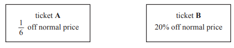
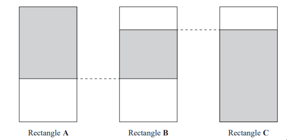
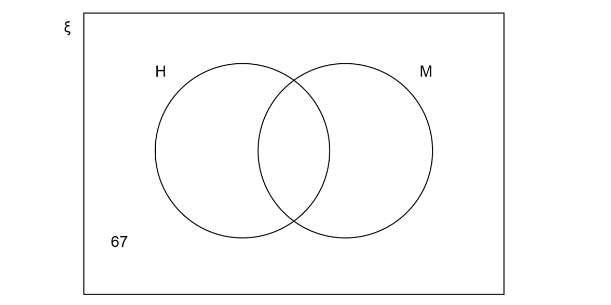

# Exam Questions — Fractions, Decimals & Percentages
**Numbers & the Number System** · Edexcel IGCSE Maths A (4MA1) — 18/Higher
> Source: [https://www.savemyexams.com/igcse/maths/edexcel/a/18/higher/topic-questions/1-numbers-and-the-number-system/fractions-decimals-and-percentages/exam-questions/](https://www.savemyexams.com/igcse/maths/edexcel/a/18/higher/topic-questions/1-numbers-and-the-number-system/fractions-decimals-and-percentages/exam-questions/) · 42 questions · total 122 marks

## Q1 — easy — 4 marks · exam-questions

### 2() — 4 marks — command: work_out — structured — from paper 2013	June · 1MA0/1H
Mr Mason asks $240$Year $11$ students what they want to do next year. `15 percent sign` of the students want to go to college.
 $\frac{3}{4}$  of the students want to stay at school. 
The rest of the students do not know. 
Work out the number of students who do not know.

## Q2 — easy — 2 marks · exam-questions

### 10() — 2 marks — command: what — structured — from paper 2013	November · 1MA0/2H
Sasha takes a music exam. 
The table shows the result that Sasha can get for different percentages in her music exam.

| **Percentage** | **Result** |
|---|---|
| 50% - 69% | Pass |
| 70% - 84% | Merit |
| 85% - 100% | Distinction |

Sasha gets 62 out of 80 in her music exam.

What result does Sasha get? 
You must show your working.

## Q3 — easy — 2 marks · exam-questions

### 2() — 2 marks — structured — from paper 2014	November · 1MA0/1H
Karen got 32 out of 80 in a maths test. 
She got 38% in an English test.

Karen wants to know if she got a higher percentage in maths or in English. 
Did Karen get a higher percentage in maths or in English?

## Q4 — easy — 4 marks · exam-questions

### 5() — 4 marks — command: work_out — structured — from paper 2015	November · 1MA0/2H
Celina and Zoe both sing in a band.

One evening the band plays for $80$minutes. 
Celina sings for `65 percent sign` of the $80$minutes.

Zoe sings for $\frac{5}{8}$ of the $80$minutes. 
Celina sings for more minutes than Zoe sings.

Work out for how many more minutes. 
You must show all your working.

## Q5 — easy — 2 marks · exam-questions

### 15() — 2 marks — command: prove — structured — from paper 2015	Sample · 1MA1/2H
Prove algebraically that the recurring decimal $0.2\overset{.}{5}$ has the value $\frac{23}{90}$

## Q6 — easy — 2 marks · exam-questions

### 1() — 2 marks — command: prove — structured
Show that the recurring decimal $0.1\overset{.}{7}$$=\frac{8}{45}$

## Q7 — easy — 2 marks · exam-questions

### 1() — 2 marks — command: use — structured
Use algebra to show that the recurring decimal $0.3\overset{.}{8}$ $=\frac{7}{18}$

## Q8 — easy — 2 marks · exam-questions

### 1() — 2 marks — command: use — structured
Use algebra to show that the recurring decimal $0.2\overset{.}{6}$ $=\frac{4}{15}$

## Q9 — easy — 2 marks · exam-questions

### 15((a)) — 2 marks — command: use — structured — from paper Jan 2021 · 4MA1/1HR
Use algebra to show that `4.5 with dot on top 7 with dot on top equals 4 19 over 33`

## Q10 — easy — 6 marks · exam-questions

### 5() — 6 marks — command: work_out — structured — from paper Jan 2020 · 4MA1/1H
120 children go on an activity holiday. 
The ratio of the number of girls to the number of boys is $3:5$.

On Sunday, all the children either go sailing or go climbing. 
$\frac{16}{25}$ of the boys go climbing.

Twice as many girls go sailing as go climbing.

Work out how many children go sailing on Sunday.

## Q11 — easy — 3 marks · exam-questions

### 5() — 3 marks — command: what — structured — from paper Specimen 2016 · 4MA1/1H
The diagram shows three identical rectangles.

$\frac{5}{8}$ of rectangle $A$ is shaded.

80% of rectangle $C$ is shaded.

What fraction of rectangle $B$ is shaded?

## Q12 — easy — 1 marks · exam-questions

### 2() — 1 mark — command: circle — structured — from paper Nov 2021 · 8300/3H
Circle the largest number.

| `0.5 with bold dot on top` | $0.55$ | $0.545$ | `0.5 4 with bold dot on top 5 with bold dot on top` |
|---|---|---|---|

## Q13 — easy — 4 marks · exam-questions

### 6() — 4 marks — command: work_out — structured — from paper 2023 Nov · 4MA1/1H
Juan wants to buy a ticket to fly from Madrid to Berlin.

He finds two different types of ticket he can buy in a sale, ticket **A **and ticket **B**

The sale price of ticket **A** is 140 euros.
The sale price of ticket **B** is 136 euros.

Work out the difference between the normal price of ticket** A** and the normal price of ticket **B**

## Q14 — medium — 4 marks · exam-questions

### 4() — 4 marks — command: work_out — structured — from paper 2014	June · 1MA0/1H
Mr Brown and his 2 children are going to London by train.

An adult ticket costs £24 
A child ticket costs £12

Mr Brown has a Family Railcard.

| **Family Railcard gives**  $\frac{1}{3}$ off adult tickets `space 60 percent sign space` off child tickets |
|---|

Work out the total cost of the tickets when Mr Brown uses his Family Railcard.

## Q15 — medium — 2 marks · exam-questions

### 8() — 2 marks — command: write — structured — from paper 2017	November · 1MA1/1H
Write these numbers in order of size. 
Start with the smallest number.

| $0.2\overset{.}{4}\overset{.}{6}$ | $0.24\overset{.}{6}$ | $0.\overset{.}{24}\overset{.}{6}$ | $0.246$ |
|---|---|---|---|

## Q16 — medium — 3 marks · exam-questions

### 23() — 3 marks — command: prove — structured — from paper 2009	November · 1380/3H
Prove that the recurring decimal $0.\overset{.}{3}\overset{.}{6}=\frac{4}{11}$

## Q17 — medium — 2 marks · exam-questions

### 1() — 2 marks — command: prove — structured
Show that the recurring decimal $0.\overset{.}{3}9\overset{.}{6}$ $=\frac{44}{111}$

## Q18 — medium — 2 marks · exam-questions

### 1() — 2 marks — command: use — structured
Use algebra to show that the recurring decimal $0.\overset{.}{4}1\overset{.}{7}=\frac{139}{333}$

## Q19 — medium — 3 marks · exam-questions

### 10() — 3 marks — command: work_out — structured — from paper Jan 2021 · 4MA1/2H
The people working for a company work in Team $A$ or in Team $B$.

number of people in Team $A$ : number of people in Team $B$ = 3 : 4

$\frac{4}{5}$ of Team $A$ work full time. 
24% of Team $B$ work full time.

Work out what fraction of the people working for the company work full time. 
Give your fraction in its simplest form.

## Q20 — medium — 5 marks · exam-questions

### 10() — 5 marks — command: work_out — structured — from paper Nov 2020 · 4MA1/1HR
Alex makes $80$ cakes to sell. He makes chocolate cakes, lemon cakes and fruit cakes where

| number of chocolate cakes: | number of lemon cakes: | number of fruit cakes | = | $3:2:5$ |
|---|---|---|---|---|

Alex sells

all of the chocolate cakes

$\frac{3}{4}$ of the lemon cakes

$\frac{7}{8}$ of the fruit cakes

The profit he makes on each cake he sells is shown in the table.

| **Type of cake** | **Profit per cake he sells** |
|---|---|
| chocolate | `£ 2.00` |
| lemon | `£ 1.70` |
| fruit | `£ 2.40` |

Work out the total profit that Alex makes from the cakes he sells.

£.............................................

## Q21 — medium — 2 marks · exam-questions

### 15() — 2 marks — command: use — structured — from paper June 2019 · 4MA1/1H
Use algebra to show that the recurring decimal `0.2 5 with bold dot on top 4 with bold dot on top` = $\frac{14}{55}$

## Q22 — medium — 5 marks · exam-questions

### 5((a)) — 5 marks — command: calculate — structured — from paper June 2019 · 4MA1/2H
Josh buys and sells books for a living.

He buys 120 books for £4 each.

He sells $\frac{1}{2}$  of the books for £5 each.

He sells 40% of the books for £7 each. 
He sells the rest of the books for £8 each.

Calculate Josh’s percentage profit.

## Q23 — medium — 3 marks · exam-questions

### 8() — 3 marks — command: work_out — structured — from paper Specimen 2016 · 4MA1/2H
Ahmed, Behnaz and Carmen each have some money. Ahmed has 20% more money than Behnaz.

Carmen has $\frac{7}{8}$ of the amount of money that Behnaz has.

Carmen has 31.50 euros. 
Work out how much money Ahmed has.

.......................euros

## Q24 — medium — 4 marks · exam-questions

### 2() — 4 marks — command: find — structured — from paper Nov 2020 · J560/04
James is taking three examination papers in Spanish. Here are his first two results.

Paper 1:   $\frac{43}{80}$         Paper 2:   $\frac{38}{65}$

Paper 3 is out of 95. 
The marks in each of the three papers are added together.

Find the lowest mark that James needs in Paper 3 to achieve 60% of the total marks.

## Q25 — medium — 5 marks · exam-questions

### 14((a)) — 3 marks — command: prove — structured — from paper Nov 2018 · J560/06
**Without using a calculator**, show that `0.1 with bold dot on top 9 with bold dot on top` o can be written as $\frac{19}{99}$.

### 14((b)) — 2 marks — command: explain — structured — from paper Nov 2018 · J560/06
Explain how `19 over 99 space equals space 0.1 with bold dot on top 9 with bold dot on top` can be used to find $\frac{19}{990}$ as a decimal and write down its value.

$\frac{19}{990}$ = ...............

## Q26 — medium — 3 marks · exam-questions

### 5() — 3 marks — command: what — structured — from paper Specimen paper · 4MA1/1H
The diagram shows three identical rectangles.

$\frac{5}{8}$of rectangle **A** is shaded.

80% of rectangle **C** is shaded.

What fraction of rectangle **B** is shaded?

## Q27 — medium — 3 marks · exam-questions

### 8() — 3 marks — command: work_out — structured — from paper Specimen paper · 4MA1/2H
Ahmed, Behnaz and Carmen each have some money.

Ahmed has 20% more money than Behnaz.

Carmen has  $\frac{7}{8}$ of the amount of money that Behnaz has.

Carmen has 31.50 euros.

Work out how much money Ahmed has.

## Q28 — hard — 3 marks · exam-questions

### 24() — 3 marks — command: express — structured — from paper 2012	June · 1MA0/1H
Express the recurring decimal $0.2\overset{.}{8}\overset{.}{1}$ as a fraction in its simplest form.

## Q29 — hard — 3 marks · exam-questions

### 21() — 3 marks — command: prove — structured — from paper 2015	June · 1MA0/1H
$x=0.0\overset{.}{4}\overset{.}{5}$

Prove algebraically that $x$ can be written as $\frac{1}{22}$

## Q30 — hard — 3 marks · exam-questions

### 16() — 3 marks — command: prove — structured — from paper 2017	June · 1MA1/2H
Using algebra, prove that $0.1\overset{.}{3}\overset{.}{6}\times0.\overset{.}{2}$  is equal in value to $\frac{1}{33}$

## Q31 — hard — 3 marks · exam-questions

### 15() — 3 marks — command: prove — structured — from paper 2017	November · 1MA1/1H
$x=0.4\overset{.}{3}\overset{.}{6}$

Prove algebraically that $x$ can be written as $\frac{24}{55}$

## Q32 — hard — 2 marks · exam-questions

### 19() — 2 marks — command: prove — structured — from paper 2015	Spec2 · 1MA1/3H
Prove algebraically that the recurring decimal $0.3\overset{.}{1}\overset{.}{8}$ can be written as $\frac{7}{22}$

## Q33 — hard — 2 marks · exam-questions

### 1() — 2 marks — command: prove — structured
Show that the recurring decimal $0.0\overset{.}{1}\overset{.}{5}=\frac{1}{66}$

## Q34 — hard — 2 marks · exam-questions

### 17() — 2 marks — command: use — structured — from paper June 2021 · 4MA1/1H
Use algebra to show that the recurring decimal `0.28 1 with dot on top 3 with dot on top equals 557 over 1980`

## Q35 — hard — 2 marks · exam-questions

### 1() — 2 marks — command: show — structured
Use algebra to show that $0.7\overset{.}{1}\overset{.}{6}=\frac{709}{990}$

## Q36 — hard — 3 marks · exam-questions

### 18() — 3 marks — command: find — structured — from paper Nov 2021 · 4MA1/1H
`0.4 space x with bold dot on top` is a recurring decimal.

$x$ is a whole number such that `1 space less-than or slanted equal to space x space less-than or slanted equal to space 9`

Find, in terms of $x$, the recurring decimal `0.4 space x with dot on top` as a fraction. 
Give your fraction in its simplest form. 
Show clear algebraic working.

## Q37 — hard — 2 marks · exam-questions

### 14((a)) — 2 marks — command: use — structured — from paper Specimen 2016 · 4MA1/2H
Use algebra to show that `0.3 2 with bold dot on top 4 with bold dot on top space equals 107 over 330`

## Q38 — hard — 5 marks · exam-questions

### 6() — 5 marks — structured — from paper Nov 2021 · 8300/3H
At a country park there is a house, a museum and a garden.

The table shows the prices per person to visit the park.

|   | **Price per person** |
|---|---|
| Garden only | Free |
| House and museum | £12.50 |
| House only | £8 |
| Museum only | £7 |

One day, 480 people visit the park.

67 visit the garden **only**. 
40% visit the house **and **the museum.
$\frac{3}{8}$ visit the house **only**.
 The rest visit the museum **only**.

In total, how much do the 480 people pay to visit the park? 
You may use the Venn diagram to help you.

## Q39 — hard — 3 marks · exam-questions

### 27() — 3 marks — command: prove — structured — from paper June 2018 · 8300/2H
Prove algebraically that `2.7 5 with bold dot on top` converts to the fraction $\frac{124}{45}$

## Q40 — hard — 3 marks · exam-questions

### 18() — 3 marks — command: write — structured — from paper Nov 2020 · J560/06
Write `0.4 1 with dot on top 6 with dot on top` as a fraction in its simplest form. 
You must **show full working** in support of your answer.

## Q41 — hard — 2 marks · exam-questions

### 14((a)) — 2 marks — command: show — structured — from paper Specimen paper · 4MA1/2H
Use algebra to show that  `0.3 2 with dot on top 4 with dot on top equals 107 over 330`

## Q42 — hard — 2 marks · exam-questions

### 15((a)) — 2 marks — command: show — structured — from paper 2023 Nov · 4MA1/2H
Use algebra to show that `0.3 7 with dot on top 2 with dot on top equals 41 over 110`
