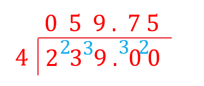

# Mark Schemes — Number Toolkit
**Numbers & the Number System** · Edexcel IGCSE Maths A (4MA1) — 18/Higher

## Q1 — easy — 4 marks · exam-questions

### 3((a)) — 4 marks
> *Identify the correct calculation that needs to be carried out.*

> *Electricity used = new reading - old reading.*

*Electricity used = 7155 - 7095*

**[1]**

> *Write as a column and subtract the numbers in the units column.*

`stack attributes charalign center stackalign right end attributes 7155 row minus none 7095 end row horizontal line 0 end stack`

> *5-9 would be negative, so we need to borrow from the next column. This turns the 1 into a 0. We can then continue subtracting as normal.*

`stack attributes charalign center stackalign right end attributes row 0 none none end row row 7 up diagonal strike 1 blank presuperscript 1 55 end row row minus none 7095 end row horizontal line 0060 end stack`

> *Gary uses 60 units and they cost 15 pence each.*

`bottom enclose 15
cross times 60 end enclose
00
bottom enclose 900
900`

** ****Correct method ****[1] **
**Correct answer ****[1]**

> *Convert 900 pence into pounds using** **£1 = 100 pence.*

*900 pence = £9*

**£9**** ****[1]**

## Q2 — easy — 1 marks · exam-questions

### 2() — 1 marks
*The inequality *$-2<x\leq4$* means "numbers that are greater than -2, and less than or equal to 4"* 
*This means that -2 **will** **not be** included, and 4 **will be** included*

**The bottom-right option; -1, 0, 1, 2, 3, 4 ****[1]**

## Q3 — easy — 1 marks · exam-questions

### 11((a)) — 1 marks
> *Thinking of an example of a sum that can be done with even numbers only can help.*

**Final answer:** **0 can be divided exactly by 2 ****[1]**

**Other correct statements that will be accepted include:** 
**-1 and 1 are both odd and either side of 0** 
**Numbers that end in 0 are even** 
**Zero remainder when divided by 2** 
**Next number in the pattern of even numbers 8 6 4 2** 
**Added to an even number it gives an even answer and added to an odd number it gives an odd answer**

## Q4 — easy — 2 marks · exam-questions

### 3((b)) — 2 marks
> *49 is an odd square number, 7**2**=49*

**Factors of 49**
 **49, 1** 
**7, 7**
 **So there are 3 factors; 1, 7, 49**
 **So the statement is correct in this case**

**[1]**

> *1 is an odd square number, 1**2**=1*

**Factors of 1**
 **1, 1**
 **So there is only one factor; 1** 
**So the statement is not correct in this case**

**[1]**

**There are of course other examples, for example 1089 is 33****2****, and has far more than 3 factors** 
**Factors of 1089: 1, 3, 9, 11, 33, 99, 121, 363, 1089**

## Q5 — easy — 1 marks · exam-questions

### 1() — 1 marks
> *Consider the place value of each part*

*two hundred thousand = 200 000* *and seventeen = 17*

> *two hundred thousand + seventeen = 200 000 + 17*

**200 017** **[1]**

## Q6 — easy — 1 marks · exam-questions

### 2() — 1 marks
> *If the temperature has fallen by 26°C then you need to subtract 26°C from the starting temperature.*

*21 - 26*

**-5 °C** **[1]**

## Q7 — easy — 3 marks · exam-questions

### 1((a)) — 3 marks
i) *Multiples of 8 are numbers that are in the 8 times table. *
*4 × 8 = 32.*

**The multiple of 8 is 32 ****[1]**

ii) *Square numbers are numbers that can be made by multiplying an integer by itself.* 
*6**2** = 6 × 6 = 36.*

**The square number is 36** **[1]**

iii) *Prime numbers are positive integers that have exactly two factors: 1 and itself. *
*Ignore the numbers that have other factors.*

> *32, 34, 36, 38 all have 2 as a factor. *
*33, 36, 39 all have 3 as a factor. *
*35 has 5 as a factor.*

**The prime number is 37** **[1]**

## Q8 — easy — 1 marks · exam-questions

### 4((a)) — 1 marks
> *Think about the numbers in chunks, 15 000 and 60*

**Fifteen thousand and sixty**** ****[1]**

## Q9 — easy — 1 marks · exam-questions

### 1() — 1 marks
*Turn the statements into a calculation.* 
*Be careful with the negatives!*

$-3-7$

$-10^{\circ}C$ **[1]**

## Q10 — easy — 2 marks · exam-questions

### 3((a)) — 2 marks
i) *A cube number is the result of multiplying a number by itself 3 times.*

$3^{3}=27$

$27$** [1]**

ii) *A prime number is a number with exactly one factor pair, 1 and itself.*

$47$** [1]**

## Q11 — easy — 3 marks · exam-questions

### 12((a)) — 3 marks
i) *A number that divides by 7 to give an integer (whole number)*

**28** **[1]**

ii) *A number that is the product of three identical numbers, e.g. 3×3×3=27*

**27** **[1]**

iii) *A number that is only divisible by itself and 1*

**29 (or 31)*** ***[1]**

## Q12 — easy — 1 marks · exam-questions

### 1() — 1 marks
*-3 °C is 11 °C higher than the temperature at 01 00. Therefore the temperature at 01 00 is 11* *°C lower than -3 °C.* *Subtract 11 from -3.*

*-3 - 11*

**-14 °C** **[1]**

## Q13 — easy — 1 marks · exam-questions

### 6((a)) — 1 marks
> *Write each section of the number out separately*

> *Five million is*

*5 000 000*

> *Two hundred is*

*200*

> *Seven is*

*7*

> *Add these parts together  *

*5 000 000 + 200 + 7*

**5 000 207** **[1]**

## Q14 — easy — 1 marks · exam-questions

### 1() — 1 marks
> *Subtract 11° from 6°*

$6-11=-5$

$-5^{\circ}$ **[1]**

## Q15 — easy — 2 marks · exam-questions

### 4() — 2 marks
> *Count up from 3 to 18, checking each number to see if it divides into 36 without a remainder. E.g.:*

$36\div3=12,\mathrm{so}3\mathrm{and}12\mathrm{are} \mathrm{factors}\,36\div4=9,\mathrm{so}4\mathrm{and}9\mathrm{are} \mathrm{factors}\,36\div5=7\mathrm{remainder}1,\mathrm{so}5\mathrm{is} \mathrm{not}a\mathrm{factor}\,36\div6=6,\mathrm{so}6\mathrm{is}a\mathrm{factor}$

> *As 6 already appeared and 7 would be the next one to check which has also already appeared you can stop and list out all the factors*

$3,4,6,9,12,18$  **[2]**

**You need at least 4 correct factors to score 1 mark**

## Q16 — medium — 6 marks · exam-questions

### 2((a)) — 3 marks
> *Find the number of paving slabs needed to cover the length.*

*length = 3.6 m = 360 cm *
*360 ÷ 60 = 6*

> *Find the number of paving slabs needed to cover the width.*

*width = 3 m = 300 cm *
*300 ÷ 60 = 5*

** ****Correct method for either length or width ****[1]**

> *Find the number of paving slabs needed to cover the whole area.*

*Area = length × width = 6 × 5*

**[1]**

**30 paving slabs are needed so yes he bought enough ****[1]**

### 2((b)) — 3 marks
> *Identify the correct calculation that needs to be carried out.*

> *Total cost = number of paving slabs × cost of paving slabs.*

*Total cost = 32 × 8.63 *

> *Ignore the decimal and choose a method to multiply the numbers 32 and 863 together. *

`bottom enclose stack attributes charalign center stackalign right end attributes 863 row cross times none 32 end row horizontal line 1726 25890 end stack end enclose
2 space 7 space 6 space 1 space 6`

** ****Correct method ****[1] **
**Correct answer ****[1]**

> *There are two digits after the decimal point in the question so place two digits after the decimal point in the answer.*

*32 × 8.63 = 276.16*

**£276.16**** ****[1]**

## Q17 — medium — 2 marks · exam-questions

### 6() — 2 marks
> *Identify the correct calculation that needs to be carried out.*

> *Total cost = number of plants × cost of each plant.*

*Total cost = 27 × 5.54 *

**[1]**

> *There are two digits after the decimal point in the question so place two digits after the decimal point in the answer.*

*27 × 5.54 = 149.58*

**£149.58 ****[1]**

## Q18 — medium — 4 marks · exam-questions

### 2() — 4 marks
> *Identify the correct calculation that needs to be carried out.*

> *Total cost = number of days worked × cost of each ticket.*

*Total cost = 18 × 6.45 *

> *Ignore the decimal and choose a method to multiply the numbers 18 and 645 together.  *
*Column method is shown here.*

`bottom enclose stack attributes charalign center stackalign right end attributes 645 row cross times none 18 end row horizontal line 5160 row none 6450 end row end stack end enclose
11 space 6 space 1 space 0`

**[1]**

> *There are two digits after the decimal point in the question so place two digits after the decimal point in the answer.*

*18 × 6.45 =  116.10*

> *Find the difference by subtracting the cost of a monthly ticket.*

*116.10 - 98.50*

> *Write as a column and subtract the numbers in each column, borrowing if needed.*

`stack attributes charalign center stackalign right end attributes row 0 space scriptbase 5 presuperscript 1 end scriptbase presuperscript blank none none end row row 1 up diagonal strike 1 up diagonal strike 6. blank presuperscript 1 1 end row row minus none 098.5 end row horizontal line row 17.6 end row end stack`

** ****Correct method ****[1] **
**Correct answer ****[1]**

**£17.60 ****[1]**

## Q19 — medium — 5 marks · exam-questions

### 4() — 5 marks
> *First find the price at Kirsty's Plants. *
*To do 2.39 × 25 you can either use a long multiplication technique such as lattice method or you can multiply 2.39 by 100 and divide this by 4 (as 100 ÷ 4 = 25).*

$\mathrm{Kirsty}'s\mathrm{Plants}:2.39\times100\div4=239\div4$

> *Use the bus stop method to divide 239 by 4.*

** ****Any complete method to multiply 2.39 by 25 ****[1] **
**Correct calculation (ignoring decimal)**** [1]**

> *At Kirsty's Plants the plants will cost £59.75.*

> *Find the cost of the 25 plants (1 pack) at Hedge World by adding the 20% VAT to the total price of £52.50.*

> *Find 20% of 52.5. It is easiest to find 10% first and then multiply it by 2.*

`10 percent sign space of space 52.50 space equals space 52.5 space divided by space 10 space equals space 5.25
20 percent sign space of space 52.50 space equals space 5.25 space cross times space 2 space equals space 10.50 space`

> *Now we need to add the 20% to the total.*

`52.50 space plus space 10.50 space equals space 63.00
Hedge space World colon space £ 63`

**[1]**

> *Interpret your results in the context of the question.*

**The price is £59.75 at Kirsty's Plants and £63 at Hedge World.  So Tom should buy from Kirsty's World.****  **** **
**Both prices correct**** [1]**
**Conclusion correct ****[1]**

## Q20 — medium — 1 marks · exam-questions

### 1() — 1 marks
> *You should know the first 5 cube numbers but could use your calculator to check. *

*4**3 **= 4 × 4 × 4 = 64*

**64**** [1]**

## Q21 — medium — 1 marks · exam-questions

### 4((a)) — 1 marks
*A square number is the result when a positive integer is multiplied by itself.* *The first few square numbers are 1, 4, 9, 16, 25, 36, ...*

**16** **[1]** 
**Any square number bigger than 10 is accepted**

## Q22 — medium — 1 marks · exam-questions

### 1() — 1 marks
*Turn the statements into a calculation.* 
*Be careful with the negatives!*

$-57+63.8$

$6.8^{\circ}C$ **[1]**

## Q23 — medium — 1 marks · exam-questions

### 1() — 1 marks
> *A prime number is only divisible by 1 and itself*

**53** **[1]** 
**59 also correct**

## Q24 — medium — 1 marks · exam-questions

### 6((a)) — 1 marks
*Can use a calculator for this question if you need to, as not instructed otherwise* 
*You should however know that a negative divided by a negative, will result in a positive answer*

$6$** ****[1]**

## Q25 — medium — 1 marks · exam-questions

### 1() — 1 marks
> *A prime number is an integer that has no factors except itself and one*

**23 ****or**** 29 ****[1]**

**You only need to write one of these two numbers to get the mark**

## Q26 — medium — 2 marks · exam-questions

### 5() — 2 marks
> *A prime number is a number that is only divisible by itself and one. Identify the two prime numbers in the list. It helps to know that they must be odd (the only even prime number is 2).*

*The two prime numbers are 17 and 41*

** ****Either 17 or 41 identified ****[1]**

> *Subtract 17 from 41 to find the difference.*

`table row cell 41 minus 17 end cell equals cell space 24 end cell row blank blank blank end table`

$24$** [1****]**

## Q27 — hard — 1 marks · exam-questions

### 17() — 1 marks
*N = (prime)**2** + (prime × even)*

> *A prime number multiplied by an even number, will always be an even number*

> *A prime number squared, can be either odd or even e.g. 3**2**=9 or 2**2**=4*

> *Therefore we have an odd or even number, plus an even number*

> *This can result in either an odd or even number*

**The top-left option, "could be even or odd"** **[1]**

## Q28 — hard — 1 marks · exam-questions

### 8((a)) — 1 marks
> *The answers must be multiples of all of the numbers given.*

> *Consider the rules of the multiples of each value. *

*All multiples of 5 end in either 0 or 5, so the answer must be either 0 or 5.  *
*All multiples of 2 end in 0, 2, 4, 6, or 8 so it is not possible for the answer to be 5.*

> *Therefore the answer must be 0.*

**0**** [1]**

## Q29 — hard — 4 marks · exam-questions

### 6((a)) — 3 marks
> *First, check whether it is cheaper to use large packs or small packs, per tile*

*Large: £18 ÷ 40 = £0.45 per tile*
*Small: £14 ÷ 28 = £0.50 per tile*

> *So we should aim to use large packs where possible, rather than small packs.*

> *To buy over 100 tiles, we can either purchase*

*Option A: 3 large packs*
*3×40=120 tiles*
*Option B: 2 large packs, and 1 small pack*
*(2×40)+28=108 tiles*

> *Find the cost of option A*

*3×£18 = £54*

> *Apply the 25% reduction when buying 3 or more large packs, using a multiplier of 0.75*

*£54 × 0.75 = ****£40.50***

**[1]**

> *Find the cost of option B*

*(2×£18) + £14 = ****£50***

**Finding either £50 or £54**** [1]**

> *So option A is cheaper, buying 3 large packs*

**£40.50** **[1]**

### 6((b)) — 1 marks
**He is correct that 15 tiles will fit along the length of the floor, and 6 tiles will fit along the width of the floor, however this would only give one line of tiles along the length, and one line of tiles along the width. He also needs to fill in the middle of the floor! The correct calculation is 15×6=90 tiles** **[1]**

## Q30 — hard — 4 marks · exam-questions

### 6() — 4 marks
> *Calculate the total number of combinations that the prizes could be awarded by multiplying the number of options in each category.*

*4 x 4 = 16 combinations*

**[1]**

> *Work out the number of combinations of winners if Alice wins the Mathematics prize.*

| Mathematics | English |
|---|---|
| *Alice* | *Alice* |
| *Alice* | *Claire* |
| *Alice* | *Gabi* |
| *Alice* | *Simon* |

*4 ways*

> *Work out the number of combinations of winners if Alice wins the English prize, excluding any combinations that have already been counted.*

| Mathematics | English |
|---|---|
| *Ben* | *Alice* |
| *Emma* | *Alice* |
| *Paddy* | *Alice* |

*3 ways (Alice, Alice has already been counted)*

**[1]**

> *Find the percentage of combinations of prize winners that include Alice having at least one prize.*

$\frac{3+4}{16}=\frac{7}{16}$

> *Convert the fraction into a decimal by completing the division and multiplying by 100%.*

`7 divided by 16 equals 0.4375
0.4375 cross times 100 percent sign`

**[1]**

**43.75 %*** ***[1]**

**43.8 % will also be accepted**

## Q31 — hard — 1 marks · exam-questions

### 2() — 1 marks
> *Using your calculator could help here.*

$7-(5-3)+4=9$ **[1]**
