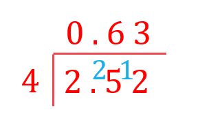
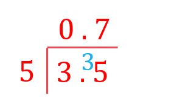

# Mark Schemes — Powers, Roots & Standard Form
**Numbers & the Number System** · Edexcel IGCSE Maths A (4MA1) — 18/Higher

## Q1 — easy — 2 marks · exam-questions

### 19() — 2 marks
> *Find the value of each number.*

> *Use the index law *$a^{-1}=\frac{1}{a}$*.*

$5^{-1}=\frac{1}{5}=0.2$

> *Any number raised to the power of zero is always 1.*

*5**0 **= 1*

> *Write the numbers out.*

$5^{-1}=0.20.5-55^{0}=1$

> *Order the numbers.*

$-55^{-1}=0.20.55^{0}=1$

> *Write the numbers in order of size in their original form.*

$-5,5^{-1},0.5,5^{0}$** **** **
**At least one of 5****-1**** or 5****0 ****evaluated correctly ****[1] **** **
**Fully correct answer ****[1]**

## Q2 — easy — 1 marks · exam-questions

### 11() — 1 marks
> *Simplify using the index law: *`a to the power of m n end exponent space equals open parentheses a to the power of m close parentheses to the power of n`*.*

`open parentheses 125 close parentheses to the power of 2 over 3 end exponent space equals 125 to the power of blank to the power of 1 third cross times 2 end exponent end exponent to the power of space equals space open parentheses open parentheses 125 close parentheses to the power of 1 third end exponent close parentheses squared`

> *Simplify using the index law:  *`a to the power of 1 third end exponent space equals cube root of a`* and 5**3** = 125.*

`open parentheses cube root of 125 close parentheses squared space equals space open parentheses 5 close parentheses squared`

**25**** [1]**

## Q3 — easy — 1 marks · exam-questions

### 14((b)) — 1 marks
> *Simplify using the index law: *$a^{-x}=\frac{1}{a^{x}}.$* *

$3^{-2}=\frac{1}{3^{2}}$

$\frac{1}{9}$**[1]**

## Q4 — easy — 2 marks · exam-questions

### 19((a)) — 1 marks
> $10^{-4}=\frac{1}{10^{4}}=\frac{1}{10000}$*, so 7.8 × 10**-4 **is the same as *$7.8\times\frac{1}{10000}=7.8\div10000$* *

$7.8\div10000=0.00078$

> *Check your answer by counting how many times you need to move the decimal point to get from where it is in the question to where it is in the answer.  *
*n **= -4 so this should be 4 units.*

**0.00078**** ****[1]**

### 19((b)) — 1 marks
> *Standard form will be written as **a** × 10**n**. *
*Ignore the place value and find the value of **a, a **must be a number greater than 1 and less than 10.*

**a*** = 9.56*

> *The original number is greater than 1 so **n** will be positive. Count how many times you need to multiply **a** by 10 to get to the original number.*

*95 600 000  = 9.56 × 10 000 000*

> *10 000 000 = 10**7**, therefore **n** = 7.*

** 9.56 × 10****7**** ****[1]**

## Q5 — easy — 2 marks · exam-questions

### 16() — 2 marks
> *Type the problem into your calculator, use the standard form buttons and the arrow keys to type the whole expression in in one go.*

$7.5\times10^{4}\times2.5\times10^{3}=187500000$

** ****[1]**

> *Convert to standard form. Standard form will be written as **a** × 10**n**, **where 1 ≤ **a **< 10, therefore **a **= 1.875.*

`table row cell 187500000 space end cell equals cell space 1.875 space cross times space 100000000 end cell row blank equals cell 1.875 space cross times space 10 to the power of 8 end cell end table`

**1.875 × 10****8**** ****[1]**

## Q6 — easy — 1 marks · exam-questions

### 8() — 1 marks
> *Standard form will be written as **a** × 10**n**, where 1 ≤ **a **< 10. Ignore the place value and find the leading non-zero digit. Use this to find the value of **a**.*

**a*** = 6.8*

> *The original number is smaller than 1 so **n** will be negative. Count how many times you need to divide **a** by 10 to get the original number.*

*0.000068 = 6.8 ÷ 10 ÷ 10 ÷ 10 ÷ 10 ÷ 10*

> *Therefore **n** = -5.*

**6.8 × 10****-5**** ****[1]**

## Q7 — easy — 2 marks · exam-questions

### 19((a)) — 1 marks
> *Standard form will be written as **a** × 10**n**. *
*Ignore the place value and find the leading non-zero digit. Use this to find the value of **a**.*

**a*** = 4.23*

> *The original number is smaller than 1 so **n** will be negative. Count how many times you need to divide **a** by 10 to get the original number. *
*The easiest way to do this is to see how many places the decimal point would have to move from where it is in the question to where it is in the answer. *

*0.000423 = 4.23 ÷ 10 ÷ 10 ÷ 10 ÷ 10*

> *Therefore **n** = -4.*

**4.23 × 10****-4**** ****[1]**

### 19((b)) — 1 marks
> *4.5 × 10**4  **= 4.5 × 10 × 10 × 10 × 10 = 4.5 × 10 000*

$4.5\times10000=45000$

> *Check your answer by counting how many times you need to move the decimal point to get from where it is in the question to where it is in the answer.  *
*n **= 4 so this should be 4 units.*

**45000 ****[1]**

## Q8 — easy — 2 marks · exam-questions

### 8((a)) — 1 marks
> *Standard form will be written as **a** × 10**n**, **where 1 ≤ **a **< 10. Ignore the place value and find the leading non-zero digit. Use this to find the value of **a**.*

**a*** = 5.62*

> *The original number is smaller than 1 so **n** will be negative. Count how many times you need to divide **a** by 10 to get the original number. The easiest way to do this is to see how many places the decimal point would have to move from where it is in the question to where it is in the answer. *

*0.00562 = 5.62 ÷ 10 ÷ 10 ÷ 10*

> *Therefore **n** = -3.*

**5.62 × 10****-3**** ****[1]**

### 8((b)) — 1 marks
> *1.452 × 10**3  **= 1.452 × 10 × 10 × 10 = 1.452 × 1000*

$1.452\times1000=1452$

> *Check your answer by counting how many times you need to move the decimal point to get from where it is in the question to where it is in the answer.  *
*n **= 3 so this should be 3 units to the right.*

**1452 ****[1]**

## Q9 — easy — 1 marks · exam-questions

### 14((a)) — 1 marks
> *The reciprocal of *$a$* is *$\frac{1}{a}$*.*

$\frac{1}{5}$**[1]**

## Q10 — easy — 1 marks · exam-questions

### 1((a)) — 1 marks
> *Use the law of indices that *$x^{a}\timesx^{b}=x^{a+b}$*.*

$5^{17}\times5^{2}=5^{17+2}$

**5****19** **[1]**

## Q11 — easy — 4 marks · exam-questions

### 1((a)) — 1 marks
> *Use the law of indices that *$x^{a}\timesx^{b}=x^{a+b}$*.*

$3^{4}\times3^{5}=3^{4+5}=3^{9}$

> *Write the value of *$m$*.*

$m=9$ **[1] **
**Note that the answer is the value of ****m****, not "3****9****"**

### 1((b)) — 1 marks
> *Use the law of indices that *`open parentheses x to the power of a close parentheses to the power of b equals x to the power of a b end exponent`*.*

`open parentheses 5 cubed close parentheses to the power of 7 equals 5 to the power of 3 cross times 7 end exponent equals 5 to the power of 21`

> *Write the value of *$n$*.*

$n=21$ **[1] **
**Note that the answer is the value of ****n****, not "5****21****"**

### 1((c)) — 2 marks
> *Use the index law that *$x^{a}\timesx^{b}=x^{a+b}$* to simplify the numerator.*

`table row cell 7 to the power of 10 over 7 to the power of p end cell equals cell 7 to the power of 6 end cell end table`

**[1]**

> *Rearrange so that 7**p** appears on its own side.*

`table row cell 7 to the power of 10 end cell equals cell 7 to the power of 6 cross times 7 to the power of p end cell row cell 7 to the power of 10 over 7 to the power of 6 end cell equals cell 7 to the power of p end cell end table`

> *And use the index law that *$\frac{x^{a}}{x^{b}}=x^{a-b}$* to simplify the left hand side to a single power of 7.*

`table row cell 7 to the power of 4 end cell equals cell 7 to the power of p end cell end table`

> *Write the value of *$p$*.*

$p=4$ **[1]**

## Q12 — easy — 2 marks · exam-questions

### 3((a)) — 1 marks
> *2.46 × 10**6** is the same as 2.46 × 1 000 000.*

*2.46 × 1 000 000 = 2 460 000*

**2 460 000** **[1]**

### 4((b)) — 1 marks
> *Standard form will be written as **a** × 10**n**. *
*Ignore the place value and find the value of **a, a **must be a number greater than 1 and less than 10.*

**a*** = 7.4*

> *The original number is less than 1 so **n** will be negative. Count how many times you need to divide **a** by 10 to get to the original number.*

*0.000 74  = 7.4 ÷ 10 000*

> *10 000 = 10**4**, therefore **n** = −4.*

**7.4 × 10****−4**** ****[1]**

## Q13 — easy — 1 marks · exam-questions

### 3() — 1 marks
> *For a number to be in standard form; *$a\times10^{n}$* where *$1\leqa<10$* and *$n>0$* or *$n<0$

> *The first option, 0.9 × 10**-3**, has a value of **a** which is too small*

> *The second option, 6 × 10**0.5**, has** **a value of **n** which is not an integer*

> *The fourth option, 12 × 10**7**, has a value of **a** which is too large*

> *The third option, 5.2 × 10**-4**, has a value of **a** which is between 1 and 10, and an integer, non-zero, power of 10*

**The third option, 5.2 × 10****-4 ****is correct ****[1]**

## Q14 — easy — 1 marks · exam-questions

### 4() — 1 marks
> *Let's use a test value of **a** = -2, which satisfies **a** < -1*

*The first option, *`1 half a equals 1 half open parentheses negative 2 close parentheses equals negative 1`

*The second option, *$a=-2$

*The third option, *`a squared equals open parentheses negative 2 close parentheses squared equals 4`

*The fourth option, *`a cubed equals open parentheses negative 2 close parentheses cubed equals negative 8`

**The third option, **$a^{2}$**, is the largest value ****[1]**

## Q15 — easy — 3 marks · exam-questions

### 1((a)) — 2 marks
> *i) Standard form will be written as **a** × 10**n**, **where 1 ≤ **a **< 10. Ignore the place value and find the leading non-zero digit. Use this to find the value of **a**.*

**a*** = 6.5*

> *The original number is larger than 1 so **n** will be positive. Count how many times you need to multiply **a** by 10 to get the original number. *
*The easiest way to do this is to see how many places the decimal point would have to move from where it is in the question to where it is in the answer. *

*6500 = 6.5 × 10 × 10 × 10*

> *Therefore **n** = 3.*

**6.5 × 10****3**** ****[1]**

> *ii) Follow the same process for 0.0584, except **n** will be negative as the number is smaller than 1*

**a*** = 5.84*

*0.0584 = 5.84 ÷ 10 ÷ 10*

**5.84 × 10****-2**** ****[1]**

### 1((b)) — 1 marks
> *You should be able to enter this calculation directly into your calculator, but you may also wish to rewrite it as follows to make it easier to work out*

`open parentheses 4.2 space cross times 10 to the power of 5 close parentheses cross times open parentheses 1.8 cross times 10 to the power of negative 2 end exponent close parentheses space equals space 4.2 space cross times space 1.8 space cross times space 10 to the power of 5 space cross times space 10 to the power of negative 2 end exponent`

> *Combining the first two terms*

$7.56\times10^{5}\times10^{-2}$

> *Combining the second two terms using the indices law; *$x^{m}\timesx^{n}=x^{m+n}$

$7.56\times10^{5+-2}=7.56\times10^{3}$

> *This answer is in standard form as the leading number is between 1 and 10, and the power of 10 is an integer*

$7.56\times10^{3}$ **[1]**

## Q16 — easy — 3 marks · exam-questions

### 1((a)) — 2 marks
> *We want to find out how many times 6.48×10**-5** kg fits into 0.35 kg*

$\frac{0.35}{6.48\times10^{-5}}=5401.234568...$

**[1]**

**5401 ****[1]**

### 1((b)) — 1 marks
**The weight for a grain of salt is only an average; each grain may weigh more or less which would result in a different value for the number of grains of salt ****[1]**

## Q17 — easy — 4 marks · exam-questions

### 2() — 4 marks
> *We will find the weight per seed, in grams. This is already done for poppy seeds*

> *250 pumpkin seeds weigh 21 grams, so we can find the weight per seed*

$\frac{21}{250}=0.084\mathrm{grams}=8.4\times10^{-2}\mathrm{grams}$

**[1]**

*One sesame seed weighs *$3.64\times10^{-6}$* kilograms* *There are 1000 grams in 1 kilogram, so we need to multiply by 1000 to go from kilograms to grams e.g. 3kg=3000g*

$3.64\times10^{-6}\times1000=3.64\times10^{-6}\times10^{3}=3.64\times10^{-3}\mathrm{grams}$

**[1]**

> *We now know that*

*Poppy seeds weigh *$3\times10^{-4}$* grams* 
*Pumpkin seeds weigh *$8.4\times10^{-2}$* grams* 
*Sesame seeds weigh *$3.64\times10^{-3}$* grams*

**All written in same format (either standard form or as ordinary numbers) ****[1]**

> *Putting these in order, with the lightest first*

**Poppy seeds, Sesame seeds, Pumpkin seeds** **[1]**

## Q18 — easy — 5 marks · exam-questions

### 3() — 5 marks
> *We want to find out how many times 2.7×10**-11** grams fits in to 3.5 kilograms*
*First of all, we need them to be in the same units; either grams or kilograms*
*There are 1000 grams in 1 kilogram*

*3.5 kilograms = 3.5 × 1000 = 3500 grams*

**[1]**

> *Now find how many times 2.7×10**-11** grams fits in to 3500 grams*

$\frac{3500}{2.7\times10^{-11}}=1.29629\times10^{14}$

**Method and answer**** [2]**

> *Round to 2 significant figures*

$1.3\times10^{14}$ **[2]** 
**Answer must be in standard form, and rounded to 2 significant figures**

## Q19 — easy — 2 marks · exam-questions

### 6((a)) — 1 marks
> *Count the number of places after the 7 to get the power of 10*

$7.6\times10^{7}$

**[B1]**

### 6((b)) — 1 marks
> *Counting the zero before the decimal point, the number of zeros in front of the 5 will be the same as the power of 10*

**Final answer:** **0.00054**

**[B1]**

## Q20 — easy — 4 marks · exam-questions

### 9((a)) — 1 marks
> *This is the same as *$5.87\times0.0001$

$5.87\times0.0001=0.000587$

$0.000587$

**[B1]**

### 9((b)) — 1 marks
> *Standard form is written as *$a\times10^{n}$*, **where *$1\leqa<10$

> *Ignore the place value and find the leading non-zero digit*

> *Use this to find the value of *$a$

$a=8.4$

> *Count how many times you need to multiply *$a$* by *$10$* **to get the original number*

$8.4\times10^{7}$

**[B1]**

### 9((c)) — 2 marks
> $K$* is the number of times the number of neurons in a monkey brain needs to be multiplied to get the number of neurons in a human brain. Use the inverse operation to work it out*

`open parentheses 8.5 space cross times space 10 to the power of 10 close parentheses space divided by space open parentheses 1.47 space cross times space 10 to the power of 9 close parentheses`

**[M1]**

$=57.82...$

> *Round to 1 decimal place*

$57.8$

**[A1]**

## Q21 — medium — 3 marks · exam-questions

### 15() — 3 marks
> *Identify the calculation you will need to work out.*

*Thickness of 500 sheets = 500 × thickness of one sheet = 500 × (9 × 10**-3**)*

> *Evaluate by multiplying 9 by 500.*

*500 × 9 × 10**-3 **= 4500 × 10**-3*

**[1]**

> *This is not in standard form as **a** is not in the interval 1 ≤ **a **< 10. Convert to standard form by first converting 4500 to standard form.*

*4500 × 10**-3 **= 4.5 × 10**3** × 10**-3*

**[1]**

> *Simplify using the law of indices **a**m** **×** a**n **= **a**m+n**.*

*Thickness of 500 sheets = 4.5 × 10**3-3 **= 4.5 × 10**0**  = 4.5 × 1 = 4.5 cm*

**No, the paper tray is not deep enough as 500 sheets are 4.5 cm thick ****[1]**

## Q22 — medium — 4 marks · exam-questions

### 1() — 1 marks
Type into your calculator or move the numbers three place values to the right

**Final answer:** **0.0045**

**[B1]**

### 2() — 1 marks
The number is 3.4289

Count the number of times you need to multiply this by 10 to get the original number

$3.4289\times10^{5}$

**[B1]**

### 3() — 2 marks
Subtract the population of Hungary from the population of Indonesia

$2.43\times10^{8}-9.6\times10^{7}=$

**[M1]**

$1.47\times10^{8}$

**[A1]**

## Q23 — medium — 2 marks · exam-questions

### 20() — 2 marks
> *Convert each number to an ordinary number to make comparing them easier.*

> *0.038 × 10**2**.*

$0.038\times100=3.8$

> *3800 × 10**-4**.*

$3800\div10000=0.38$

> *0.38 × 10**-1**.*

$0.38\div10=0.038$

> *Write the numbers out.*

$0.038\times10^{2}=3.83800\times10^{-4}=0.383800.38\times10^{-1}=0.038$

> *Order the numbers.*

$0.38\times10^{-1}=0.0383800\times10^{-4}=0.380.038\times10^{2}=3.8380$

> *Write the numbers in order of size in their original form.*

$0.38\times10^{-1},3800\times10^{-4},0.038\times10^{2},380$** **** **
**At least one evaluated correctly, or three in correct order ****[1] **** Fully correct answer ****[1]**

## Q24 — medium — 4 marks · exam-questions

### 17((a)) — 1 marks
> *Any number raised to the power of zero is always 1.*

**10****0**** = 1 ****[1]**

### 17((b)) — 1 marks
> *Simplify using the index law: *$a^{-x}=\frac{1}{a^{x}}.$* *

$10^{-2}=\frac{1}{10^{2}}$

$\frac{1}{100}$**[1]**

### 17((c)) — 2 marks
> *Convert each number to an ordinary number to make comparing them easier.*

> *2.73 × 10**3**.*

$2.73\times1000=2730$

> *27.3 × 10**-3**.*

$27.3\div1000=0.0273$

> *273 × 10**2**.*

$273\times100=27300$

> *Write the numbers out.*

$2.73\times10^{3}=273027.3\times10^{-3}=0.0273273\times10^{2}=273000.00273$

> *Order the numbers.*

$0.0027327.3\times10^{-3}=0.02732.73\times10^{3}=2730273\times10^{2}=27300$

> *Write the numbers in order of size in their original form.*

$0.00273,27.3\times10^{-3},2.73\times10^{3},273\times10^{2}$** **** **
**At least one evaluated correctly, or three in correct order ****[1] **** Fully correct answer ****[1]**

## Q25 — medium — 3 marks · exam-questions

### 10((a)) — 1 marks
> *Simplify using the index law:  *$a^{\frac{1}{2}}=\sqrt{a}$* and 10**2** = 100.*

`root index blank of 100 space equals space 10`

**10**** [1]**

### 10((b)) — 2 marks
> *Simplify using the index law: *`a to the power of m n end exponent space equals open parentheses a to the power of m close parentheses to the power of n`*.*

`open parentheses 125 close parentheses to the power of 2 over 3 end exponent space equals 125 to the power of blank to the power of 1 third cross times 2 end exponent end exponent to the power of space equals space open parentheses open parentheses 125 close parentheses to the power of 1 third end exponent close parentheses squared`

> *Simplify using the index law:  *`a to the power of 1 third end exponent space equals cube root of a`* and 5**3** = 125.*

`open parentheses cube root of 125 close parentheses squared space equals space open parentheses 5 close parentheses squared`

**25**** [1]**

## Q26 — medium — 4 marks · exam-questions

### 9((a)) — 1 marks
> *Simplify using the index law:  *$a^{\frac{1}{2}}=\sqrt{a}$* and 6**2** = 36.*

`root index blank of 36 space equals space 6`

**6**** [1]**

### 9((b)) — 1 marks
> *Any number raised to the power of zero is always 1.*

**23****0**** = 1 ****[1]**

### 9((c)) — 2 marks
> *Simplify using the index law: *$a^{-x}=\frac{1}{a^{x}}.$* *

`open parentheses 27 close parentheses to the power of negative 2 over 3 end exponent equals 1 over open parentheses 27 close parentheses to the power of 2 over 3 end exponent space`

**[1]**

> *Simplify using the index law: *`a to the power of m n end exponent space equals open parentheses a to the power of m close parentheses to the power of n`*.*

$\frac{1}{27^{^{\frac{2}{3}}}}=\frac{1}{27^{^{\frac{1}{3}\times2}}}^{}$

> *Simplify using the index law:  *`a to the power of 1 third end exponent space equals cube root of a`* and 3**3** = 27.*

`1 over open parentheses cube root of 27 close parentheses squared space equals space 1 over 3 squared`

$\frac{1}{9}$**[1]**

## Q27 — medium — 4 marks · exam-questions

### 10((a)) — 1 marks
> *All of the masses are given in standard form, **a **× 10**n** **, where 1 ≤ **a **< 10, so the planet with the greatest mass is the planet with the greatest value of **n.** *

**Jupiter**** [1]**

### 10((b)) — 1 marks
> *Identify the calculation.*

*Mass (Venus) - mass (Mercury) = 4.869 × 10**24** - 3.302 × 10**23*

> *Type the problem directly into your calculator.*

*4.869 × 10**24** - 3.302 × 10**23** = 4.5388 × 10**24*

**4.5388 × 10****24**** kg ****[1]**

### 10((c)) — 2 marks
> *Find the scale factor by dividing the distance of Neptune from Earth by the distance of Venus from Earth.*

$\frac{\mathrm{Distance}(\mathrm{Neptune})}{\mathrm{Distance}(\mathrm{Venus})}=\frac{4.35\times10^{9}}{4.14\times10^{7}}$

> *Type the problem directly into your calculator.*

$\frac{4.35\times10^{9}}{4.14\times10^{7}}=105.072...$

**[1] **
**Yes, because 105.07... > 100  ****[1]**

## Q28 — medium — 2 marks · exam-questions

### 7() — 2 marks
> *You should be able to type directly into your calculator.*

`table row cell open parentheses 13.8 cross times 10 to the power of 7 close parentheses space cross times open parentheses 5.4 cross times 10 to the power of negative 12 end exponent close parentheses space end cell equals cell space 7.452 cross times 10 to the power of negative 4 end exponent end cell end table`

**[1]**

> *Convert to an ordinary number.*

`table row cell 7.452 cross times 10 to the power of negative 4 end exponent space end cell equals cell space 7.452 space cross times space 0.0001 space equals space 0.0007452 end cell end table`

$0.0007452$**[1]**

## Q29 — medium — 4 marks · exam-questions

### 17((a)) — 1 marks
> *Any number raised to the power of zero is always 1.*

**10****0**** = 1 ****[1]**

### 17((b)) — 1 marks
> $10^{-5}=\frac{1}{10^{5}}=\frac{1}{100000}=0.00001$*, so 6.7 × 10**-5 **is the same as *$6.7\times0.00001$* *

$6.7\times0.00001=0.000067$

> *Check your answer by counting how many times you need to move the decimal point to get from where it is in the question to where it is in the answer.  *
*n **= -5 so this should be 5 units.*

**0.000067**** ****[1]**

### 17((c)) — 2 marks
> *Evaluate the number parts first by multiplying 3 by 9.*

`table row cell open parentheses 3 space cross times space 10 to the power of 7 close parentheses space cross times space open parentheses 9 space cross times space 10 to the power of 6 close parentheses space end cell equals cell space open parentheses 3 space cross times space 9 close parentheses space cross times space open parentheses 10 to the power of 7 space cross times space 10 to the power of 6 close parentheses end cell row blank equals cell space 27 space cross times space open parentheses 10 to the power of 7 space cross times space 10 to the power of 6 close parentheses end cell end table`

**[1]**

> *Evaluate the powers using the law of indices **a**m** × a**n **= **a**m+n**.*

`27 cross times space open parentheses 10 to the power of 7 space end exponent cross times space 10 to the power of 6 close parentheses equals 27 cross times 10 to the power of open parentheses 7 plus 6 close parentheses end exponent space equals 27 space cross times space 10 to the power of 13`

> *This is not in standard form as **a** is not in the interval 1 ≤ **a **< 10. Convert to standard form by first converting 27 to standard form.*

*27 × 10**13 **= 2.7 × 10**1** × 10**13*

> *Simplify using the law of indices **a**m** **×** a**n **= **a**m+n**.*

**2.7 × 10****14**** ****[1]**

## Q30 — medium — 2 marks · exam-questions

### 14((c)) — 2 marks
> *Evaluate the number parts first by multiplying 3 by 9.*

`table row cell 9 space cross times space 10 to the power of 4 space cross times space 3 space cross times space 10 cubed space end cell equals cell space 9 space cross times space 3 space cross times space 10 to the power of 4 space cross times space 10 cubed end cell row blank equals cell space 27 space cross times space open parentheses 10 to the power of 4 space cross times space 10 cubed close parentheses end cell end table`

**[1]**

> *Evaluate the powers using the law of indices **a**m** × a**n **= **a**m+n**.*

`27 cross times space open parentheses 10 to the power of 4 space end exponent cross times space 10 cubed close parentheses equals 27 cross times 10 to the power of open parentheses 4 plus 3 close parentheses end exponent space equals 27 space cross times space 10 to the power of 7`

> *This is not in standard form as **a** is not in the interval 1 ≤ **a **< 10. Convert to standard form by first converting 27 to standard form.*

*27 × 10**7 **= 2.7 × 10**1** × 10**7*

> *Simplify using the law of indices **a**m** **×** a**n **= **a**m+n**.*

**2.7 × 10****8**** ****[1]**

## Q31 — medium — 2 marks · exam-questions

### 9() — 2 marks
> *Evaluate the number parts first by multiplying 3 by 9.*

`table row cell open parentheses 9 space cross times space 10 to the power of negative 4 end exponent close parentheses space cross times space open parentheses 3 space cross times space 10 to the power of 7 close parentheses space end cell equals cell space open parentheses 9 space cross times space 3 close parentheses space cross times space open parentheses 10 to the power of negative 4 end exponent space cross times space 10 to the power of 7 close parentheses end cell row blank equals cell space 27 space cross times space open parentheses 10 to the power of negative 4 end exponent space cross times space 10 to the power of 7 close parentheses end cell end table`

**[1]**

> *Evaluate the powers using the law of indices **a**m** × a**n **= **a**m+n**.*

`27 cross times space open parentheses 10 to the power of negative 4 end exponent cross times space 10 to the power of 7 close parentheses equals 27 cross times 10 to the power of open parentheses negative 4 plus 7 close parentheses end exponent space equals 27 space cross times space 10 cubed`

> *This is not in standard form as **a** is not in the interval 1 ≤ **a **< 10. Convert to standard form by first converting 27 to standard form.*

*27 × 10**3 **= 2.7 × 10**1** × 10**3*

> *Simplify using the law of indices **a**m** **×** a**n **= **a**m+n**.*

**2.7 × 10****4**** ****[1]**

## Q32 — medium — 3 marks · exam-questions

### 15((a)) — 1 marks
> *Simplify using the index law: *$a^{-x}=\frac{1}{a^{x}}.$* *

$25^{-3}=\frac{1}{25^{3}}$

> *Use your calculator to evaluate the answer.*

$\frac{1}{15625}$**[1] **
**The answer in standard form of 6.4 × 10****-5 ****is also accepted**

### 15((b)) — 2 marks
> *Type into your calculator. *

$350^{3}=42875000$

**[1]**

> *Convert to standard form.*

$42875000=4.2875\times10000000$

$4.2875\times10^{7}$**[1]**

## Q33 — medium — 1 marks · exam-questions

### 12() — 1 marks
$64^{\frac{1}{4}}$** means **`fourth root of 64`** not **$\frac{1}{4}\times64$ **[1]**

## Q34 — medium — 3 marks · exam-questions

### 10((a)) — 2 marks
> *Identify the calculation.*

*Surface area of Atlantic Ocean − Surface area of Indian Ocean = 1.06 × 10**8** − 6.86 × 10**7*

> *Type the calculation directly into your calculator.*

*1.06 × 10**8** − 6.86 × 10**7 **= 37 400 000*

**[1]**

> *Convert this answer to standard form. Standard form will be written as **a** × 10**n**. *
*Ignore the place value and find the value of **a, a **must be a number greater than 1 and less than 10.*

**a*** = 3.74*

> *Count how many times you need to multiply **a** by 10 to get to the original number.*

*37 400 000  = 3.74 × 10**7*

**3.74 × 10****7**** ****[1]**

### 10((b)) — 1 marks
> *Form an equation from the information.*

`table row cell surface space area space of space Pacific space Ocean end cell equals cell k cross times open square brackets surface space area space of space Arctic space Ocean close square brackets end cell row cell 1.56 cross times 10 to the power of 8 end cell equals cell k open parentheses 1.41 cross times 10 to the power of 7 close parentheses end cell end table`

> *Solve the equation by dividing both sides by 1.41 × 10**7**.*

`table row k equals cell fraction numerator 1.56 cross times 10 to the power of 8 over denominator 1.41 cross times 10 to the power of 7 end fraction equals open parentheses 1.56 cross times 10 to the power of 8 close parentheses divided by open parentheses 1.41 cross times 10 to the power of 7 close parentheses end cell end table`

> *Type this directly into your calculator, in either of the two forms above.*

`table attributes columnalign right center left columnspacing 0px end attributes row k equals cell 11.06382979... end cell end table`

> *Round your answer to the nearest whole number as requested.*

`table row bold italic k bold equals bold 11 end table`* ***[1]**

## Q35 — medium — 3 marks · exam-questions

### 14() — 3 marks
> *Rewrite 8 as 2**3*

`open parentheses fourth root of 2 cubed end root close parentheses to the power of 5`

**[1]**

> *A fourth-root, *`fourth root of blank`*, can be rewritten as a power of *$\frac{1}{4}$

`open parentheses open parentheses 2 cubed close parentheses to the power of 1 fourth end exponent close parentheses to the power of 5`

> *Use the law of indices; *`open parentheses x to the power of m close parentheses to the power of n equals x to the power of m cross times n end exponent`

`open parentheses open parentheses 2 cubed close parentheses to the power of 1 fourth end exponent close parentheses to the power of 5 equals open parentheses 2 to the power of 3 cross times 1 fourth end exponent close parentheses to the power of 5 equals open parentheses 2 to the power of 3 over 4 end exponent close parentheses to the power of 5`

**[1]**

> *Apply the same rule again*

`open parentheses 2 to the power of 3 over 4 end exponent close parentheses to the power of 5 equals 2 to the power of 3 over 4 cross times 5 end exponent equals 2 to the power of 15 over 4 end exponent`

$2^{\frac{15}{4}}$ **[1]**

## Q36 — medium — 3 marks · exam-questions

### 11((b)) — 3 marks
> *Rewrite 9 as a power of 3 using 9=3**2*

`3 to the power of n equals 177147 cross times open parentheses 3 squared close parentheses to the power of 5`

**[1]**

> *Use the law of indices; *`open parentheses x to the power of n close parentheses to the power of m equals x to the power of n cross times m end exponent`

$3^{n}=177147\times3^{2\times5}\,3^{n}=177147\times3^{10}$

**[1]**

> *Use the fact that we were told; *$177147=3^{11}$

$3^{n}=3^{11}\times3^{10}$

> *Use the law of indices; *$x^{m}\timesx^{n}=x^{m+n}$

$3^{n}=3^{11+10}=3^{21}$

> *Compare both sides of the equation to see the value of *$n$

$n=21$ **[1]**

## Q37 — medium — 9 marks · exam-questions

### 5((a)) — 2 marks
> *We need to find out how many sweets there are per packet, which will be the number of sweets, shared between (divided by) the total number of packets*

$\frac{1.47\times10^{7}}{3.5\times10^{5}}$

**[1]**

**42** **[1]**

### 5((b)) — 3 marks
> *There are 288 days where sweets are made each year, and 1.47×10**7** sweets made each day*

*288 × 1.47×10**7*

**[1]**

*= 4 233 600 000*

**[1]**

> *Write in standard form*

**4.2336×10****9** **[1]** 
**The number at the front needs to be at least 1 decimal place**

### 5((c)) — 4 marks
> *i) 1.47×10**7** sweets are made every day, and the machines operate for 15 hours each day*

*1.47×10**7 **÷ 15 = 980 000 sweets per hour*

**[1]**

> *There are 152 machines*

*980 000 ÷ 152 = 6447.368...*

**[1]**

> *Round to the nearest 10*

**6450** **[1]**

> *ii) *

**This assumes that all the machines work at the same rate** **[1]**

## Q38 — medium — 4 marks · exam-questions

### 8((a)) — 1 marks
> *Use place value to convert out of standard form by by multiplying 9.3 by 10 000 000 (which is equivalent to *$10^{7}$*)*

> *One power of 10 turns 9.3 to 93, and then you need 6 zeroes after that for the other 6 powers of 10*

**Final answer:** **93 000 000**

**[B1]**

### 8((b)) — 1 marks
> *First look for the numbers with the smallest power of 10*

$9.8\times10^{6}$* (Hungary)*

$5.7\times10^{6}$* (Singapore)*

> *Then select the number with the smallest starting value*

$5.7<9.8$

**Final answer:** **Singapore**

**[B1]**

### 8((c)) — 2 marks
> *Use subtraction to calculate the difference in populations (a calculator can be used to solve the calculation)*

$1.382\times10^{9}-1.327\times10^{9}=55000000$

**[M1]**

> *Write the answer in standard form as stated in the question*

$5.5\times10^{7}$

**[A1]**

## Q39 — hard — 2 marks · exam-questions

### 22((a)) — 1 marks
> *Simplify using the index law: *$a^{-x}=\frac{1}{a^{x}}.$* *

$2^{-3}=\frac{1}{2^{3}}=\frac{1}{8}$

$\frac{1}{8}$**[1]**

### 22((b)) — 1 marks
> *Simplify using the index laws  *$a^{\frac{1}{2}}=\sqrt{a}$* and *$a^{1}=a$*.*

$5\sqrt{5}=5^{1}\times5^{\frac{1}{2}}$

> *Simplify using the index laws  *$a^{m}\timesa^{n}=a^{m+n}$*.*

`5 to the power of 1 space end exponent cross times space 5 to the power of 1 half space end exponent equals space 5 to the power of open parentheses 1 space plus 1 half close parentheses end exponent space equals space 5 to the power of 1 1 half end exponent`

$k=1\frac{1}{2}$**[1]**

## Q40 — hard — 4 marks · exam-questions

### 12((a)) — 2 marks
> *Simplify using the index law: *$a^{-x}=\frac{1}{a^{x}}.$* *

$81^{-\frac{1}{2}}=\frac{1}{81^{\frac{1}{2}}}$

**[1]**

> *Simplify using the index law: *$a^{\frac{1}{2}}=\sqrt{a}$*.*

$\frac{1}{81^{\frac{1}{2}}}=\frac{1}{\sqrt{81}}=\frac{1}{9}$

$\frac{1}{9}$**[1]**

### 12((b)) — 2 marks
> *Simplify using the index law: *`a to the power of m n end exponent space equals open parentheses a to the power of m close parentheses to the power of n`*.*

`open parentheses 64 over 125 close parentheses to the power of blank to the power of 2 over 3 end exponent end exponent space equals open parentheses 64 over 125 close parentheses to the power of blank to the power of 1 third cross times 2 end exponent space end exponent equals space open parentheses open parentheses 64 over 125 close parentheses to the power of blank to the power of 1 third end exponent end exponent close parentheses squared`

**[1]**

> *Simplify using the index law:  *`a to the power of 1 third end exponent space equals cube root of a`*.*

`open parentheses fraction numerator cube root of 64 over denominator cube root of 125 end fraction close parentheses squared space equals space open parentheses 4 over 5 close parentheses squared`

> *Square the numerator and the denominator separately.*

$\frac{16}{25}$**[1]**

## Q41 — hard — 3 marks · exam-questions

### 10((a)) — 1 marks
> *Simplify using the index law: *$a^{\frac{1}{2}}=\sqrt{a}$*.*

$64^{\frac{1}{2}}=\sqrt{64}=8$

$8$ **[1]**

### 10((b)) — 2 marks
> *Simplify using the index law: *$a^{-x}=\frac{1}{a^{x}}.$* *

`open parentheses 8 over 125 close parentheses to the power of negative 2 over 3 end exponent equals 1 over open parentheses 8 over 125 close parentheses to the power of 2 over 3 end exponent space equals space open parentheses 125 over 8 close parentheses to the power of 2 over 3 end exponent`

**[1]**

> *Simplify using the index law: *`a to the power of m n end exponent space equals open parentheses a to the power of m close parentheses to the power of n`*.*

`open parentheses 125 over 8 close parentheses to the power of blank to the power of 2 over 3 end exponent end exponent space equals open parentheses 125 over 8 close parentheses to the power of blank to the power of 1 third cross times 2 end exponent space end exponent equals space open parentheses open parentheses 125 over 8 close parentheses to the power of 1 third end exponent close parentheses squared`

> *Simplify using the index law:  *`a to the power of 1 third end exponent space equals cube root of a`*.*

`open parentheses fraction numerator cube root of 125 over denominator cube root of 8 end fraction close parentheses squared space equals space open parentheses 5 over 2 close parentheses squared`

> *Square the numerator and the denominator separately.*

$\frac{25}{4}$**[1]**

## Q42 — hard — 5 marks · exam-questions

### 15((a)) — 1 marks
> *Separate the problem using the index law: *$\sqrt{a\timesb}=\sqrt{a}\times\sqrt{b}$*.*

`cube root of 8 space cross times space 10 to the power of 6 space end exponent end root space equals space cube root of 8 cross times space cube root of 10 to the power of 6 end root`

> *Evaluate the cube root of 8 using 2**3** = 8 and simplify using the index law:  *`a to the power of 1 third end exponent space equals cube root of a`*.*

`cube root of 8 cross times space cube root of 10 to the power of 6 end root space equals space 2 space cross times space open parentheses 10 to the power of 6 close parentheses to the power of 1 third end exponent`

> *Simplify using the index law: *`a to the power of m n end exponent space equals open parentheses a to the power of m close parentheses to the power of n`*.*

$2\times10^{\frac{6}{3}}=2\times10^{2}$

> *Evaluate the answer using 10**2** = 100. *

**200** **[1]**

### 15((b)) — 2 marks
> *Simplify using the index law: *$a^{-x}=\frac{1}{a^{x}}.$* *

$144^{\frac{1}{2}}\times64^{-\frac{1}{3}}=144^{\frac{1}{2}}\times\frac{1}{64^{\frac{1}{3}}}$

**[1]**

> *Simplify using the index laws *$a^{\frac{1}{2}}=\sqrt{a}$* and *`a to the power of 1 third end exponent space equals cube root of a`*.*

`144 to the power of 1 half end exponent space cross times 1 over 64 to the power of 1 third end exponent space equals space square root of 144 space cross times fraction numerator space 1 over denominator cube root of 64 end fraction space`

> *Evaluate the square root of 144 and the cube root of 64 using 12**2 **= 144 and 4**3** = 64.*

`square root of 144 space cross times fraction numerator space 1 over denominator cube root of 64 end fraction space equals space 12 space cross times 1 fourth space equals 12 over 4 space equals space 3`

**3 ****[1]**

### 15((c)) — 2 marks
> *This equation can be solved by making the bases the same on both sides. Change 81 so that it has a base of 3.*

`81 equals 9 to the power of 2 space end exponent equals space open parentheses 3 squared close parentheses squared space equals space 3 to the power of 4 space to the power of space`

> *Use the index law *$a^{-x}=\frac{1}{a^{x}}$* to rewrite *$\frac{1}{81}$* with a base of 3 and a negative index.*

$\frac{1}{81}=\frac{1}{3^{4}}=3^{-4}$

**[1]**

> *Set each side equal to each other. If the bases are the same then the indices must be the same, therefore if*

$3^{-4}=3^{2x}$

> *then*

$2x=-4$

> *Solve the equation by dividing both sides by 2.*

$x=\frac{-4}{2}$

$x=-2$**[1]**

## Q43 — hard — 3 marks · exam-questions

### 16((a)) — 1 marks
> *Standard form will be written as **a** × 10**n**. Ignore the place value and find the leading non-zero digit. Use this to find the value of **a**.*

**a*** = 6.4*

> *The original number is greater than 1 so **n** will be positive. Count how many times you need to multiply **a** by 10 to get to the original number.*

*640 000 000  = 6.4 × 100 000 000*

> *100 000 000 = 10**8**, therefore **n** = 8.*

** 6.4 × 10****8**** ****[1]**

### 16((b)) — 2 marks
> *You should be able to type directly into your calculator.*

`table row cell open parentheses 3 cross times 10 to the power of 7 close parentheses space divided by open parentheses 6 cross times 10 to the power of 4 close parentheses space end cell equals cell space 500 end cell end table`

**[1]**

> *Convert to standard form.*

$500=5\times100=5\times10\times10$

$5\times10^{2}$* ***[1]**

## Q44 — hard — 4 marks · exam-questions

### 18((a)) — 1 marks
> *Standard form will be written as **a** × 10**n**. *
*a **must be a number greater than 1 and less than 10. Ignore the zeroes to find the value of **a.*

**a*** = 5.4*

> *The original number is greater than 1 so **n** will be positive. Count how many times you need to multiply **a** by 10 to get to the original number.*

*5400 000  = 5.4 ×  1 000 000*

> *1 000 000 = 10**6**, therefore **n** = 6.*

** 5.4 × 10****6**** ****[1]**

### 18((b)) — 1 marks
> $10^{-4}=\frac{1}{10^{4}}=\frac{1}{10000}$*, so 3.2 × 10**-4 **is the same as *$3.2\times\frac{1}{10000}=3.2\div10000$* *

$3.2\div10000=0.00032$

> *Check your answer by counting how many times you need to move the decimal point to get from where it is in the question to where it is in the answer.  *
*n **= -4 so this should be 4 units.*

**0.00032**** ****[1]**

### 18((c)) — 2 marks
> *Identify the calculation you will need to work out.*

*Mass (star) = 315 × mass (sun) = 315 × (2 × 10**30**)*

> *Evaluate by multiplying 2 by 315.*

*315 × 2 × 10**30 **= 630 × 10**30*

**[1]**

> *This is not in standard form as **a** is not in the interval 1 ≤ **a **< 10. Convert to standard form by first converting 630 to standard form.*

*630 × 10**30 **= 6.3 × 10**2** × 10**30*

> *Simplify using the law of indices **a**m** **×** a**n **= **a**m+n**.*

**6.3 × 10****32**** kg ****[1]**

## Q45 — hard — 3 marks · exam-questions

### 8((a)) — 1 marks
> $10^{-6}=\frac{1}{10^{6}}=\frac{1}{1000000}$*, so 7.97 × 10**-6 **is the same as *$7.97\times\frac{1}{1000000}=7.97\div1000000$* *

$7.97\div1000000=0.00000797$

> *Check your answer by counting how many times you need to move the decimal point to get from where it is in the question to where it is in the answer.  *
*n **= -6 so this should be 6 units.*

**0.00000797**** ****[1]**

### 8((b)) — 2 marks
> *Write the problem as a fraction.*

$\frac{2.52\times10^{5}}{4\times10^{-3}}$

> *Evaluate the number parts first by dividing 2.52 by 4. Use the bus stop method.*

**[1]**

> *Evaluate the powers using the law of indices **a**m** ÷ a**n **= **a**m-n**.*

`0.63 space cross times fraction numerator space 10 to the power of 5 over denominator 10 to the power of negative 3 end exponent end fraction space equals 0.63 space cross times space 10 to the power of 5 space end exponent divided by space 10 to the power of negative 3 end exponent space equals space 0.63 space cross times 10 to the power of open parentheses 5 minus negative 3 close parentheses end exponent space equals 0.63 space cross times space 10 to the power of 8`

> *This is not in standard form as **a** is not in the interval 1 ≤ **a **< 10. Convert to standard form by first converting 0.63 to standard form.*

*0.63 × 10**8 **= 6.3 × 10**-1** × 10**8*

> *Simplify using the law of indices **a**m** **×** a**n **= **a**m+n**.*

**6.3 × 10****7**** ****[1]**

## Q46 — hard — 3 marks · exam-questions

### 19() — 3 marks
> *Make **p** the subject by taking the square-root of both sides. *

$p=\sqrt{\frac{x-y}{xy}}$

> *Substitute the values given for **x **and **y **into the expression for p.*

`p space equals square root of fraction numerator space 8.5 space cross times space 10 to the power of 9 space minus space 4 space cross times 10 to the power of 8 over denominator open parentheses 8.5 space cross times space 10 to the power of 9 close parentheses open parentheses 4 space cross times space 10 to the power of 8 close parentheses end fraction end root`

> *Type the problem into your calculator, use the square root, fraction, standard form buttons and the arrow keys to type the whole expression in in one go.*

`square root of fraction numerator space 8.5 space cross times space 10 to the power of 9 space minus space 4 space cross times 10 to the power of 8 over denominator open parentheses 8.5 space cross times space 10 to the power of 9 close parentheses open parentheses 4 space cross times space 10 to the power of 8 close parentheses end fraction end root space equals space 4.880935... space cross times space 10 to the power of negative 5 end exponent`

** Either part of the fraction evaluated correctly ****[1] **** **
**Both parts of the fraction evaluated correctly ****[1]**

> *Round your answer to 2 significant figures.*

**4.9 × 10****-5**** ****[1]**

## Q47 — hard — 4 marks · exam-questions

### 9((a)) — 2 marks
> *Substitute the values given for **w **and **d **into the expression for **T**.*

`T space equals square root of fraction numerator space 5.6 space cross times space 10 to the power of negative 5 end exponent over denominator open parentheses 1.4 space cross times space 10 to the power of negative 4 end exponent close parentheses cubed end fraction end root`

> *Type the problem into your calculator, use the square root, fraction, standard form buttons and the arrow keys to type the whole expression in in one go.*

`square root of fraction numerator space 5.6 space cross times space 10 to the power of negative 5 end exponent over denominator open parentheses 1.4 space cross times space 10 to the power of negative 4 end exponent close parentheses cubed end fraction end root equals space 4517.5395...`

** ****[1]**

> *Convert to standard form.*

`table row cell 4517.5395... space end cell equals cell space 4.517539... space cross times space 1000 end cell row blank equals cell 4.517539... space cross times space 10 cubed end cell end table`

** ****[1]**

> *Round your answer to 3 significant figures. *
*The third significant figure is the digit 1, however this is followed by a 7 which is greater than 5 s round it up to a 2.*

**4.52 × 10****3**** ****[1]**

### 9((b)) — 2 marks
> *To increase **w** by 10%, multiply it by 1.1 and to increase **d** by 5% multiply it by 1.05.*

> *Therefore **T **will become:*

> `T space equals space square root of fraction numerator w space cross times space 1.1 over denominator open parentheses d space cross times space 1.05 close parentheses cubed end fraction end root space equals space square root of fraction numerator 5.6 space cross times space 10 to the power of negative 5 end exponent space cross times space 1.1 over denominator open parentheses 1.4 space cross times space 10 to the power of negative 4 end exponent space cross times space 1.05 close parentheses cubed end fraction end root space equals space 4403.66....`* *

**[1]**

> *The increase of 5% on the denominator is cubed, whilst the increase on the numerator is not, therefore the scale factor is less than 1 so **T **decreases.*

**4.40... × 10****3****  <  4.51... × 10****3 **
**T ****has decreased ****[1]**

## Q48 — hard — 4 marks · exam-questions

### 16((a)) — 1 marks
> *8.2 × 10**5  **= 8.2 × 10 × 10 × 10 × 10 × 10  = 8.2 × 100 000*

$8.2\times100000=820000$

> *Check your answer by counting how many times you need to move the decimal point to get from where it is in the question to where it is in the answer.  *
*n **= 5 so this should be 5 units.*

**820 000 ****[1]**

### 16((b)) — 1 marks
> *Standard form will be written as **a** × 10**n**, where 1 ≤ **a **< 10. Ignore the place value and find the leading non-zero digit. Use this to find the value of **a**.*

**a*** = 3.76*

> *The original number is smaller than 1 so **n** will be negative. Count how many times you need to divide **a** by 10 to get the original number.*

*0.000 376  = 3.76  ÷ 10 ÷ 10 ÷ 10 ÷ 10*

> *Therefore **n** = -4.*

**3.76 × 10****-4**** ****[1]**

### 16((c)) — 2 marks
> *Write the problem as a fraction.*

$\frac{2.3\times10^{12}}{4.6\times10^{3}}$

> *Evaluate the number parts first by recognising that 2.3 divided by 4.6 = 0.5.*

$\frac{2.3}{4.6}=\frac{23}{46}=\frac{1}{2}$

**[1]**

> *Evaluate the powers using the law of indices **a**m** ÷ a**n **= **a**m-n**.*

`1 half cross times space open parentheses 10 to the power of 12 space end exponent divided by space 10 cubed close parentheses equals 1 half cross times 10 to the power of open parentheses 12 minus 3 close parentheses end exponent space equals 0.5 space cross times space 10 to the power of 9`

> *This is not in standard form as **a** is not in the interval 1 ≤ **a **< 10. Convert to standard form by first converting 0.5 to standard form.*

*0.5 × 10**9 **= 5 × 10**-1** × 10**9*

> *Simplify using the law of indices **a**m** **×** a**n **= **a**m+n**.*

**5 × 10****8**** ****[1]**

## Q49 — hard — 2 marks · exam-questions

### 16() — 2 marks
> *Write the problem as a fraction.*

$\frac{3.5\times10^{6}}{5\times10^{-3}}$

> *Evaluate the number parts first by dividing 3.5 by 5. Use the bus stop method.*

**[1]**

> *Evaluate the powers using the law of indices **a**m** ÷ a**n **= **a**m-n**.*

`0.7 space cross times space open parentheses 10 to the power of 6 space end exponent divided by space 10 to the power of negative 3 end exponent close parentheses equals 0.7 cross times 10 to the power of open parentheses 6 minus negative 3 close parentheses end exponent space equals 0.7 space cross times space 10 to the power of 9`

> *This is not in standard form as **a** is not in the interval 1 ≤ **a **< 10. Convert to standard form by first converting 0.7 to standard form.*

*0.7 × 10**9 **= 7 × 10**-1** × 10**9*

> *Simplify using the law of indices **a**m** **×** a**n **= **a**m+n**.*

**7 × 10****8**** ****[1]**

## Q50 — hard — 3 marks · exam-questions

### 19((a)) — 3 marks
> *Rewrite the bases, 8 and 4, as powers of 2 with brackets around them.*

`open parentheses 2 cubed close parentheses squared cross times cube root of open parentheses 2 squared close parentheses to the power of 6 end root`

**[1]**

> *Apply the index law *`open parentheses a to the power of m close parentheses to the power of n equals a to the power of m n end exponent`*.*

`equals 2 to the power of 6 cross times cube root of 2 to the power of 12 end root`

> *Use the index law *`n-th root of a equals a to the power of 1 over n end exponent`* to rewrite in index form and then simplify again.*

`equals 2 to the power of 6 cross times open parentheses 2 to the power of 12 close parentheses to the power of 1 third end exponent
equals 2 to the power of 6 cross times 2 to the power of 4`

**[1]**

> *Finally, use the index law to write *$a^{m}\timesa^{n}=a^{m+n}$* in the form asked for.*

**Answer = 2****10**** [1]**

## Q51 — hard — 3 marks · exam-questions

### 20() — 3 marks
> *First write *$a^{\frac{3}{2}}$* in terms of **n**.*

`open parentheses 25 cross times 10 to the power of 14 n end exponent close parentheses to the power of 3 over 2 end exponent`

> *Apply the distributive law to the terms in the brackets.*

`equals 25 to the power of 3 over 2 end exponent cross times open parentheses 10 to the power of 14 n end exponent close parentheses to the power of 3 over 2 end exponent`

> *Put "*$25^{\frac{3}{2}}$*" directly into your calculator.*

`equals 125 cross times open parentheses 10 to the power of 14 n end exponent close parentheses to the power of 3 over 2 end exponent`

**"125" or "10****21n****" (see below)**** [1]**

> *Use the law *`open parentheses a to the power of m close parentheses to the power of n equals a to the power of m n end exponent`* to rewrite *`open parentheses 10 to the power of 14 n end exponent close parentheses to the power of 3 over 2 end exponent`*.*

$=125\times10^{21n}$

**[1]**

> *Convert to standard form.*

$=1.25\times10^{2}\times10^{21n}\,=1.25\times10^{21n+2}$

$1.25\times10^{21n+2}$ **[1]**

## Q52 — hard — 3 marks · exam-questions

### 17() — 3 marks
*81 can be rewritten as a power of 3*

- *81=3**4*

`fraction numerator cube root of 81 over denominator 3 end fraction equals fraction numerator cube root of 3 to the power of 4 end root over denominator 3 end fraction`

**[1]**

> *A cube-root can be rewritten as a power of *$\frac{1}{3}$

`fraction numerator cube root of 3 to the power of 4 end root over denominator 3 end fraction equals open parentheses 3 to the power of 4 close parentheses to the power of 1 third end exponent over 3`

> *Simplify the top of the fraction, using the indices law *`open parentheses x to the power of m close parentheses to the power of n equals x to the power of m cross times n end exponent`

`open parentheses 3 to the power of 4 close parentheses to the power of begin display style 1 third end style end exponent over 3 equals 3 to the power of begin display style 4 over 3 end style end exponent over 3`

**[1]**

*Simplify using *$x^{m}\divx^{n}=x^{m-n}$ *Remember that 3=3**1*

$\frac{3^{\frac{4}{3}}}{3}=3^{\frac{4}{3}-1}=3^{\frac{1}{3}}$

$3^{\frac{1}{3}}$ **[1]** 
**Full working must be shown for final answer mark**

## Q53 — hard — 3 marks · exam-questions

### 15((b)) — 3 marks
> *Change 4% into a decimal multiplier*

$0.04\times4.5\times10^{157}$

**[M1]**

> *Convert 0.04 into standard form or multiply 0.04 and 4.5*

$4\times10^{-2}\times4.5\times10^{157}\mathrm{or}0.18\times10^{157}$

**[M1]**

> *Calculate the answer*

$1.8\times10^{156}$

**[A1]**
