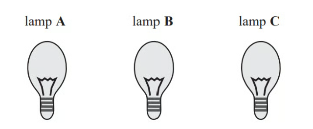

# Exam Questions — Prime Factors, HCF & LCM
**Numbers & the Number System** · Edexcel IGCSE Maths A (4MA1) — 18/Higher
> Source: [https://www.savemyexams.com/igcse/maths/edexcel/a/18/higher/topic-questions/1-numbers-and-the-number-system/prime-factors-hcf-and-lcm/exam-questions/](https://www.savemyexams.com/igcse/maths/edexcel/a/18/higher/topic-questions/1-numbers-and-the-number-system/prime-factors-hcf-and-lcm/exam-questions/) · 52 questions · total 164 marks

## Q1 — easy — 3 marks · exam-questions

### 5() — 3 marks — command: write — structured — from paper 2013	June · 1MA0/1H
Write 525 as a product of its prime factors.

## Q2 — easy — 2 marks · exam-questions

### 2() — 2 marks — command: express — structured — from paper 2017	June · 1MA1/1H
Express 56 as the product of its prime factors.

## Q3 — easy — 2 marks · exam-questions

### 1() — 2 marks — command: write — structured — from paper 2017	November · 1MA1/1H
Write 36 as a product of its prime factors.

## Q4 — easy — 3 marks · exam-questions

### 8() — 3 marks — command: what — structured — from paper 2013	March · 1MA0/1H
Trams leave Piccadilly

to Eccles every 9 minutes
to Didsbury every 12 minutes

A tram to Eccles and a tram to Didsbury both leave Piccadilly at 9 am. 
At what time will a tram to Eccles and a tram to Didsbury next leave Piccadilly at the same time?

## Q5 — easy — 3 marks · exam-questions

### 1() — 3 marks — command: write — structured — from paper June 2021 · 4MA1/2H
Write 600 as a product of powers of its prime factors. 
Show your working clearly.

## Q6 — easy — 2 marks · exam-questions

### 10() — 2 marks — command: write — structured — from paper June 2019 · 4MA1/1H
$A$ = $2^{n}\times3\times5^{m}$

Write $8A$ as a product of powers of its prime factors.

## Q7 — easy — 4 marks · exam-questions

### 5((a)) — 3 marks — command: write — structured — from paper June 2019 · 4MA1/1HR
Write 720 as a product of its prime factors. Show your working clearly.

### 5((b)) — 1 mark — command: find — structured — from paper June 2019 · 4MA1/1HR
Find the smallest whole number that 720 can be multiplied by to give a square number.

[1]

## Q8 — easy — 3 marks · exam-questions

### 7() — 3 marks — command: write — structured — from paper Nov 2021 · 4MA1/1H
Write $3.6\times10^{3}$ as a product of powers of its prime factors.

Show your working clearly.

## Q9 — easy — 2 marks · exam-questions

### 1((b)) — 2 marks — command: write — structured — from paper Jan 2020 · 4MA1/2HR
Write 800 as a product of its prime factors. 
Show your working clearly.

## Q10 — easy — 3 marks · exam-questions

### 2() — 3 marks — command: give — structured — from paper Nov 2020 · 4MA1/2HR
Write $880$as a product of powers of its prime factors. 
Show your working clearly.

## Q11 — easy — 2 marks · exam-questions

### 3((a)) — 2 marks — command: find — structured — from paper Specimen 2016 · 4MA1/1H
Find the Highest Common Factor (HCF) of 140 and 245

## Q12 — easy — 1 marks · exam-questions

### 2() — 1 mark — command: circle — structured — from paper June 2019 · 8300/3H
Circle the lowest common multiple (LCM) of 5, 15 and 25

| 5 | 45 | 75 | 150 |
|---|---|---|---|

## Q13 — easy — 1 marks · exam-questions

### 4() — 1 mark — command: work_out — structured — from paper Nov 2018 · 8300/3H
Work out the lowest common multiple (LCM) of 20, 30 and 40

Circle your answer.

| 10 | 120 | 240 | 24 000 |
|---|---|---|---|

## Q14 — easy — 3 marks · exam-questions

### 3((a)) — 3 marks — command: write — structured — from paper June 2017 · J560/04
Write 504 as the product of its prime factors.

## Q15 — easy — 3 marks · exam-questions

### 11() — 3 marks — command: write — structured — from paper June 2019 · J560/06
You are given that $177147=3^{11}$

Write 177 147 000 000 as a product of its prime factors.

## Q16 — easy — 3 marks · exam-questions

### 2() — 3 marks — command: what — structured — from paper Nov 2017 · J560/06
Carla runs every 3 days. 
She swims every Thursday. 
On Thursday 9 November, Carla both runs and swims.

What will be the next date on which she both runs and swims?

## Q17 — medium — 3 marks · exam-questions

### 7() — 3 marks — structured — from paper 2012	June · 1MA0/1H
Buses to Acton leave a bus station every 24 minutes. Buses to Barton leave the same bus station every 20 minutes.

A bus to Acton and a bus to Barton both leave the bus station at 9.00 am.

When will a bus to Acton and a bus to Barton next leave the bus station at the same time?

## Q18 — medium — 4 marks · exam-questions

### 7() — 4 marks — command: how — structured — from paper 2013	November · 1MA0/1H
Rita is going to make some cheeseburgers for a party. She buys some packets of cheese slices and some boxes of burgers. There are 20 cheese slices in each packet. There are 12 burgers in each box. Rita buys exactly the same number of cheese slices and burgers.

i) How many packets of cheese slices and how many boxes of burgers does she buy?

[3]

Rita wants to put one cheese slice and one burger into each bread roll. She wants to use all the cheese slices and all the burgers.

ii) How many bread rolls does Rita need?

[1]

## Q19 — medium — 3 marks · exam-questions

### 9() — 3 marks — command: work_out — structured — from paper 2013	June · 1MA0/1H
Matt and Dan cycle around a cycle track.

Each lap Matt cycles takes him 50 seconds. 
Each lap Dan cycles takes him 80 seconds.

Dan and Matt start cycling at the same time at the start line.

Work out how many laps they will each have cycled when they are next at the start line together.

## Q20 — medium — 5 marks · exam-questions

### 13((a)) — 3 marks — command: express — structured — from paper 2014	November · 1MA0/1H
Express 180 as a product of its prime factors.

### 13((b)) — 2 marks — command: write — structured — from paper 2014	November · 1MA0/1H
Martin thinks of two numbers.

He says,

"The Highest Common Factor (HCF) of my two numbers is 6 
The Lowest Common Multiple (LCM) of my two numbers is a multiple of 15"

Write down **two **possible numbers that Martin is thinking of.

## Q21 — medium — 2 marks · exam-questions

### 3() — 2 marks — command: find — structured — from paper June 2019 · 1MA1/1H
Find the highest common factor (HCF) of 72 and 90.

## Q22 — medium — 5 marks · exam-questions

### 1() — 2 marks — command: find — structured
Find the Highest Common Factor (HCF) of 180 and 320

### 2() — 3 marks — command: find — structured
Clara is hosting a party. The cups are in packs of 24 and the plates are in packs of 80. Clara needs the same amount of cups and plates.

Find the smallest number of packs of cups and packs of plates she can buy without having any left over.

............ packs of cups

............ packs of plates

## Q23 — medium — 4 marks · exam-questions

### 10((a)) — 3 marks — command: write — structured — from paper Jan 2019 · 4MA1/1HR
$N=480\times10^{9}$

Write $N$ as a product of powers of its prime factors. 
Show your working clearly.

### 10((b)) — 1 mark — command: find — structured — from paper Jan 2019 · 4MA1/1HR
Find the largest factor of $N$ that is an odd number.

## Q24 — medium — 4 marks · exam-questions

### 8((a)) — 2 marks — command: find — structured — from paper June 2019 · 4MA1/2HR
$A=3^{2}\times5^{4}\times7B=3^{4}\times5^{3}\times7\times11$

Find the highest common factor (HCF) of $A$ and $B$.

### 8((b)) — 2 marks — command: find — structured — from paper June 2019 · 4MA1/2HR
Find the lowest common multiple (LCM) of $A$ and $B$.

## Q25 — medium — 2 marks · exam-questions

### 8((a)) — 2 marks — command: find — structured — from paper June 2018 · 4MA1/1H
$A=3^{5}\times5\times7^{3}\,B=2^{3}\times3\times7^{4}$

i) Find the Highest Common Factor (HCF) of $A$ and $B$.

ii) Find the Lowest Common Multiple (LCM) of $A$and $B$.

## Q26 — medium — 2 marks · exam-questions

### 6((a)) — 2 marks — command: work_out — structured — from paper Jan 2022 · 4MA1/1HR
Work out the lowest common multiple (LCM) of 36 and 120

## Q27 — medium — 2 marks · exam-questions

### 9() — 2 marks — command: find — structured — from paper Jan 2021 · 4MA1/2H
`table row blank blank cell A space equals space 2 cubed cross times 3 squared cross times 5 squared cross times 11
B space equals space 2 to the power of 4 cross times 3 cross times 5 to the power of 4 cross times 13 end cell end table`

Find the lowest common multiple (LCM) of $A$and $B$. Give your answer as a product of powers of prime numbers.

## Q28 — medium — 3 marks · exam-questions

### 3((b)) — 3 marks — command: find — structured — from paper Specimen 2016 · 4MA1/1H
A machine has a buzzer that sounds every 50 minutes. The machine also has a bell that sounds every 80 minutes.

The buzzer and the bell sound together at 10 am.

Find the time at which they next sound together.

## Q29 — medium — 2 marks · exam-questions

### 6() — 2 marks — command: work_out — structured — from paper Nov 2020 · 8300/2H
Work out the highest common factor (HCF) of 75 and 105

## Q30 — medium — 2 marks · exam-questions

### 5() — 2 marks — command: work_out — structured — from paper Nov 2019 · 8300/2H
Work out the lowest common multiple (LCM) of 120 and 144

## Q31 — medium — 3 marks · exam-questions

### 9((a)) — 2 marks — command: write — structured — from paper Specimen 2015 · 8300/2H
Written as the product of its prime factors

$672=2^{5}\times3\times7$

Write 252 as the product of its prime factors.

### 9((b)) — 1 mark — command: work_out — structured — from paper Specimen 2015 · 8300/2H
Work out the value of the highest common factor of 672 and 252

## Q32 — medium — 4 marks · exam-questions

### 3() — 4 marks — command: when — structured — from paper Nov 2019 · J560/04
At a railway station, trains are either eastbound or westbound. 
An eastbound train leaves the station every 25 minutes. 
A westbound train leaves the station every 45 minutes.

An eastbound train and a westbound train both leave the station at 8am.

When is the next time that two trains leave the station together?

## Q33 — medium — 5 marks · exam-questions

### 4((a)) — 4 marks — command: when — structured — from paper June 2019 · J560/04
A bus timetable shows the following information.

- A bus following route T leaves for the train station every 20 minutes.
- A bus following route A leaves for the airport every 18 minutes.
- A bus following route T and a bus following route A both leave at 8.37 am.

When is the next time one of each bus is timetabled to leave at the same time?

### 4((b)) — 1 mark — command: write — structured — from paper June 2019 · J560/04
Write down one assumption that was necessary to solve this problem.

## Q34 — medium — 7 marks · exam-questions

### 3((a)) — 5 marks — command: find — structured — from paper June 2018 · J560/04
i) Write 120 as a product of its prime factors.

[3]

ii) The lowest common multiple (LCM) of *x* and 120 is 360. Find the smallest possible value of *x*.

[2]

### 3((b)) — 2 marks — command: find — structured — from paper June 2018 · J560/04
Two numbers, $A$ and $B$, are written as a product of prime factors.

$A=2^{4}\times3^{2}\times7^{2}$      $B=2^{3}\times3\times5\times7$

Find the highest common factor (HCF) of $A$ and $B$.

## Q35 — medium — 2 marks · exam-questions

### 3((b)) — 2 marks — command: find — structured — from paper June 2017 · J560/04
Find the lowest common multiple (LCM) of 180 and 504.

## Q36 — medium — 5 marks · exam-questions

### 3((a)) — 2 marks — command: find — structured — from paper Specimen paper · 4MA1-1H
Find the Highest Common Factor (HCF) of 140 and 245.

### 3((b)) — 3 marks — command: find — structured — from paper Specimen paper · 4ma1-1H
A machine has a buzzer that sounds every 50 minutes. 
The machine also has a bell that sounds every 80 minutes.

The buzzer and the bell sound together at 10 am.

Find the time at which they next sound together.

## Q37 — medium — 4 marks · exam-questions

### 8((a)) — 2 marks — command: write — structured — from paper 2023 June · 4MA1/1H
Write 300 as a product of its prime factors.
Show your working clearly

### 8((b)) — 2 marks — command: find — structured — from paper 2023 June · 4MA1/1H
$A=2\times2\times2\times3\times3\times5$
$B=2\times2\times3\times3\times3\times5$

Find the lowest common multiple (LCM) of 5*A* and 7*B*
Show your working clearly.

## Q38 — medium — 2 marks · exam-questions

### 7() — 2 marks — command: find — structured — from paper 2023 Nov · 4MA1/1H
$A=5^{3}\times7^{3}\times11^{6}$ and  $B=5^{6}\times7^{2}\times11^{4}$

Find the highest common factor (HCF) of  $A$and $B$
Give your answer as a product of powers of its prime factors.

## Q39 — hard — 3 marks · exam-questions

### 2((a)) — 2 marks — command: find — structured — from paper 2018	June · 1MA1/2H
Find the lowest common multiple (LCM) of 40 and 56.

### 2((b)) — 1 mark — structured — from paper 2018	June · 1MA1/2H
*A*=23× 3 × 5     *B*=22×3×52

Write down the highest common factor (HCF) of *A* and *B*.

## Q40 — hard — 3 marks · exam-questions

### 10() — 3 marks — command: how — structured — from paper 2018 June · 1MA1/3H
Here are three lamps.

Lamp **A** flashes every 20 seconds. 
Lamp **B** flashes every 45 seconds. 
Lamp **C** flashes every 120 seconds.

The three lamps start flashing at the same time.

How many times in one hour will the three lamps flash at the same time?

## Q41 — hard — 5 marks · exam-questions

### 14() — 5 marks — command: what — structured — from paper 2014	June · 1MA0/2H
Ali is planning a party.

He wants to buy some cakes and some sausage rolls.

The cakes are sold in boxes. 
There are 12 cakes in each box. 
Each box of cakes costs £2.50

The sausage rolls are sold in packs. 
There are 8 sausage rolls in each pack. 
Each pack of sausage rolls costs £1.20

Ali wants to buy more than 60 cakes and more than 60 sausage rolls. 
He wants to buy exactly the same number of cakes as sausage rolls.

What is the least amount of money Ali will have to pay?

## Q42 — hard — 3 marks · exam-questions

### 9() — 3 marks — command: how — structured — from paper 2015	June · 1MA0/1H
John buys some boxes of pencils and some packets of pens for people to use at a conference.

There are 40 pencils in a box. 
There are 15 pens in a packet.

John gives one pencil and one pen to each person at the conference. 
He has no pencils left. 
He has no pens left.

How many boxes of pencils and how many packets of pens did John buy?

## Q43 — hard — 3 marks · exam-questions

### 6() — 3 marks — command: how — structured — from paper 2015	Sample · 1MA1/3H
Liz buys packets of coloured buttons.

There are 8 red buttons in each packet of red buttons.
There are 6 silver buttons in each packet of silver buttons. 
There are 5 gold buttons in each packet of gold buttons.

Liz buys equal numbers of red buttons, silver buttons and gold buttons.

How many packets of each colour of buttons did Liz buy?

................................. packets of red buttons

............................ packets of silver buttons

............................... packets of gold buttons

## Q44 — hard — 4 marks · exam-questions

### 6((a)) — 2 marks — command: find — structured — from paper Jan 2019 · 4MA1/2H
Find the highest common factor $(\mathrm{HCF})$ of $96$ and $120$

### 6((b)) — 2 marks — command: find — structured — from paper Jan 2019 · 4MA1/2H
`table row cell A space end cell equals cell space 2 cubed space cross times space 5 space cross times space 7 squared space cross times space 11 space end cell row cell B space end cell equals cell space 2 to the power of 4 space cross times space 7 space cross times space 11 space end cell row cell C space end cell equals cell space 3 space cross times space 5 squared end cell end table`

Find the lowest common multiple $(\mathrm{LCM})$ of $A,B$ and $C.$

## Q45 — hard — 2 marks · exam-questions

### 6((b)) — 2 marks — command: find — structured — from paper Jan 2022 · 4MA1/1HR
$A=5^{2}\times7^{4}\times11^{p}$ 
$B=5^{m}\times7^{n--5}\times11$

$m,n$and $p$ are integers such that 
$m>2$ 
$n>10$ 
$p>1$

Find the highest common factor (HCF) of $A$ and $B$ 
Give your answer as a product of powers of its prime factors.

## Q46 — hard — 2 marks · exam-questions

### 8((b)) — 2 marks — command: find — structured — from paper June 2018 · 4MA1/1H
`table row cell A space end cell equals cell space 3 to the power of 5 cross times space 5 space cross times space 7 cubed space end cell row cell B space end cell equals cell space 2 cubed cross times space 3 space cross times space 7 to the power of 4 space end cell row cell C space end cell equals cell space 2 to the power of p cross times space 5 to the power of q cross times space 7 to the power of r end cell end table`

Given that

the HCF of $B$ and $C$ is 23× 7 
the LCM of $A$ and $C$ is 24× 35× 52× 73

Find the value of $p,$ the value of $q$ and the value of $r$.

$p=$ .......................................................      
 $q=$ .......................................................      
 $r=$ ............................................................

## Q47 — hard — 4 marks · exam-questions

### 5() — 4 marks — command: work_out — structured — from paper June 2018 · 8300/3H
$a$ is a common factor of 72 and 120

$b$ is a common multiple of 6 and 9

Work out the highest possible value of  $\frac{a}{b}$

## Q48 — hard — 3 marks · exam-questions

### 21() — 3 marks — command: work_out — structured — from paper Nov 2017 · 8300/3H
$N$ is a number.

As a product of prime factors in index form    $N=2\times3^{4}\timesy^{3}$

Work out $3N^{2}$ as a product of prime factors in index form.

Give your answer in terms of $y$.

## Q49 — hard — 2 marks · exam-questions

### 11((a)) — 2 marks — command: find — structured — from paper June 2019 · J560/06
You are given that

$90=3^{2}\times2\times5$ and $177147=3^{11}$

Find the lowest common multiple (LCM) of 270 and 177147. Give your answer using power notation and as an ordinary number.

using power notation ............................................................. 
as an ordinary number ..................................................... ....

## Q50 — hard — 10 marks · exam-questions

### 8((a)) — 4 marks — command: work_out — structured — from paper Nov 2018 · J560/04
Two numbers, $P$ and $Q$, are written as products of their prime factors

$P=2^{5}\times3^{2}\times5^{3}\times11$         $Q=2^{4}\times3\times5^{4}\times7$

i) Find the lowest common multiple (LCM) of $P$ and $Q$.

[2]

ii) The number $C$ is written as the product of its prime factors.

$C=2^{3}\times3\times5^{2}$

Work out $P\divC$ , leaving your answer as a product of powers of prime numbers.

[2]

### 8((b)) — 6 marks — command: find — structured — from paper Nov 2018 · J560/04
i) Write 450 as a product of its prime factors.

[3]

ii) Find the highest common factor (HCF) of 270 and 450.

[3]

## Q51 — hard — 4 marks · exam-questions

### 3((c)) — 4 marks — command: find — structured — from paper Specimen 2015 · J560/06
Here are some properties of a number.

- It is a common factor of 288 and 360.
- It is a common multiple of 4 and 6.
- It is larger than 25.

Find the **two** possible numbers with these properties.

## Q52 — hard — 1 marks · exam-questions

### 20() — 1 mark — command: find — structured — from paper 2020 Nov · 1MA1/3H
Here is a list of five numbers.

$98^{53}98^{64}98^{73}98^{88}98^{91}$

Find the lowest common multiple of these five numbers.
