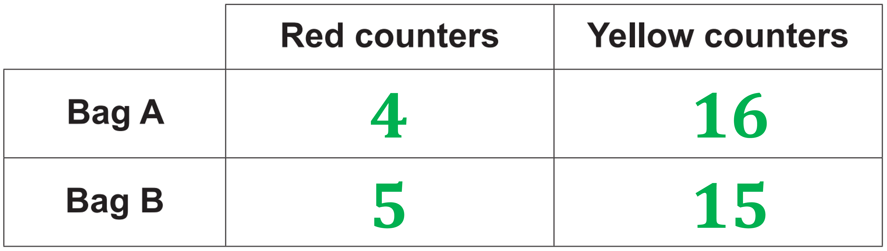

# Mark Schemes — Ratio Toolkit
**Numbers & the Number System** · Edexcel IGCSE Maths A (4MA1) — 18/Higher

## Q1 — easy — 4 marks · exam-questions

### 1((a)) — 2 marks
> *First divide 120 g by 10 to find out how much flour is used for 1 pancake:*

`table row cell 120 space divided by space 10 space end cell equals cell space 12 end cell end table`

**[1]**

> *Then multiply that by 30 to see how much is needed for 30 pancakes:*

`table row cell 12 space cross times space 30 space end cell equals cell space 360 end cell end table`

**360 g**** [1]**

### 1((b)) — 2 marks
> *First divide 300 ml by 10 to find out how much milk is used for 1 pancake:*

`table row cell 300 space divided by space 10 space end cell equals cell space 30 end cell end table`

**[1]**

> *Then divide 750 ml by that to see how many pancakes she made:*

`table row cell 750 space divided by space 30 space end cell equals cell space 25 end cell end table`

**25 pancakes**** ****[1]**

## Q2 — easy — 3 marks · exam-questions

### 1() — 3 marks
> *Divide how many gingerbread men he wants to make (24) by the number of gingerbread men in the recipe (16) to find the 'scale factor' for scaling up the recipe:*

`table row cell 24 space divided by space 16 space end cell equals cell space space 1.5 end cell end table`

**[1]**

> *The scale factor is 1.5. That means you need 1.5 times the original amount for each ingredient.*

*1.5 × 180 = 270* 
*1.5 × 40 = 60* 
*1.5 × 110 = 165* 
*1.5 × 15 = 45*

**270 g flour **
**60 g ginger**** **** **
**165 g butter **
**45 g sugar**** ****[2]**

**One mark for ****at least two**** answers correct. Two marks for ****all four**** correct.**

## Q3 — easy — 3 marks · exam-questions

### 1() — 3 marks
> *Divide the number of people he wants to serve (6) by the number of people the recipe is for (4) to find the 'scale factor' for scaling up the recipe:*

`table row cell 6 space divided by space 4 space end cell equals cell space 1.5 end cell end table`

**[1]**

> *The scale factor is 1.5. That means you need 1.5 times the original amount for each ingredient.*

*1.5 × 60 = 90* 
*1.5 × 300 = 450* 
*1.5 × 150 = 225* 
*1.5 × 1 = 1.5* 
*1.5 × 640 = 960*

**90 g butter  **
**450 g chicken **
**225 ml cream**** **
**1.5 onions**
**960 ml chicken stock**** [2]**

**One mark for ****at least three**** answers correct.  Two marks ****all five**** correct.**

## Q4 — easy — 3 marks · exam-questions

### 2() — 3 marks
> *First divide 225 g by 9 to find out how much flour is used for 1 cake:*

`table row cell 225 space divided by space 9 space end cell equals cell space 25 end cell end table`

**[1]**

> *Then multiply that by 20 to see how much is needed for 20 cakes:*

`table row cell 25 space cross times space 20 space end cell equals cell space 500 end cell end table`

**[1]**

> *Finally state your conclusion, being sure to refer to the context of the question.*

**Marian does not have enough flour to make 20 cakes.   **
**She would need 500 g of flour and she only has 475 g.****  ****[1]**

## Q5 — easy — 3 marks · exam-questions

### 6() — 3 marks
> *The wall is the same height everywhere, so how many bricks he needs only depends on the length of the wall. *
*First divide 300 by 5 to find out how how many bricks he needs for 1 metre of wall:*

`table row cell 300 space divided by space 5 space end cell equals cell space 60 end cell end table`

**[1]**

> *Then multiply that by 8 to see how many are needed for 8 metres of wall:*

`table row cell 60 space cross times space 8 space end cell equals cell space 480 end cell end table`

**[1]**

> *Be careful now!  The question doesn't ask how many bricks he needs in total, but how many **more** bricks he needs to complete the wall. *
*Subtract 300 from 480 to find out how many more bricks he needs:*

`table row cell 480 space minus space 300 space end cell equals cell space 180 end cell end table`

**180 more bricks****  [1]**

## Q6 — easy — 5 marks · exam-questions

### 2((a)) — 2 marks
> *First divide £700 by 2 to find out how much they each originally get. *
*Then work out the amounts after Ellie gives £125 to Maddie, and write as a ratio.*

`table row cell 700 space divided by space 2 space end cell equals cell space 350 end cell row blank blank blank row cell 350 space minus space 125 space end cell equals cell space 225 end cell row blank blank blank row cell 350 space plus space 125 space end cell equals cell space 475 end cell end table`

**[1]**

**225 : 475****  [1] **
**You can also simplify that to ****9 : 19****, but the question doesn't say you have to.**

### 2((b)) — 3 marks
> *First add the ratio numbers together to find out the total number of 'parts'. *
*Then divide £630 by that to find what one part is.*

`table row cell 5 space plus space 13 space end cell equals cell space 18 end cell row blank blank blank row cell 630 space divided by space 18 space end cell equals cell space 35 end cell end table`

**[1]**

> *Multiply by how many parts each child got to find the answers:*

$\mathrm{Daniel}:35\times5=175\,\,\mathrm{Rose}:35\times13=455$

**[1] **
**Daniel gets £175, Rose gets £455****  [1]**

**It's a good idea to check that the shared amounts add up to the original amount:  175 + 455 = 630**

## Q7 — easy — 3 marks · exam-questions

### 8() — 3 marks
> *First add the ratio numbers together to find out the total number of 'parts'. *
*Then divide 153 cm by that to find what one part is.*

$4+2+3=9\,\,153\div9=17$

**[1]**

> *Multiply by how many parts belong to each length of string to find the answers:*

$17\times4=68\,\,17\times2=34\,\,17\times3=51$

**[1] **
**68 cm, 34 cm, 51 cm**** [1]**

**It's a good idea to check that the shared amounts add up to the original amount:  68 + 34 + 51 = 153**

## Q8 — easy — 3 marks · exam-questions

### 1() — 3 marks
> *Add up the ratio numbers to find the total number of parts that the ratio divides the 5400 yen into. *
*Then divide 5400 by that sum to find the size of 1 part.*

$5+3+4=12\,\,5400\div12=450$

**[1]**

> *Aiko's, Max's and Pau's numbers in the ratio are 5, 3 and 4 respectively. *
*So multiply 450 by those numbers to find out how much each receives.*

$450\times5=2250\,\,450\times3=1350\,\,450\times4=1800$

**[1] **
**The mark here is for multiplying the size of 1 part by 5, 3 ****or**** 4**

> *Now just be careful to assign the right numbers to the right people!*

**Final answer:** **Aiko 2250 yen       **

**Final answer:** **Max 1350 yen       **

**Pau 1800 yen *** ***[1]**

**It's good to check that the three amounts add back up to the original total. **
**2250 + 1350 + 1800 = 5400, so we're okay there!**

## Q9 — easy — 1 marks · exam-questions

### 2() — 1 marks
> *Write the statement out as an equation.*

$A=\frac{1}{2}B$

> *So the ratio of *$B$* to *$A$* is 2 to 1 and the ratio of *$A$* to *$B$* is 1 to 2.*

**The answer is the first option, 1 : 2  ****[1]**

## Q10 — easy — 4 marks · exam-questions

### 1((a)) — 2 marks
> *Start by converting 5 metres into centimetres, so that everything is in the same units. *
*Remember that there are 100 centimetres in a metre!*

$5\mathrm{metres}=5\times100=500\mathrm{centimetres}$

**[1]**

> *That gives a ratio of 2 :500. *
*But the question wants the ratio in the form 1 : **n**. *
*So 'scale down' the ratio by a factor of 2 (i.e., divide both sides of the ratio by 2). *
*That will turn 2 into 1, and 500 into **n**.*

`2 space colon space 500 space equals space open parentheses 2 divided by 2 close parentheses space colon space open parentheses 500 divided by 2 close parentheses space equals space 1 space colon space 250`

**n**** = 250**** [****1]**

### 1((b)) — 2 marks
> *First add the ratio numbers together to find out the total number of 'parts' that the ratio divides £7200 into. *
*Then divide £7200 by that sum to find what one part is.*

`1 space plus space 2 space plus space 5 space equals space 8

7200 space divided by space 8 space equals space £ 900`

**[1]**

> *So one part is £900. *
*Multiply that by 5 (Harry's number in the ratio) to find how much Harry receives.*

$900\times5=4500$

**Harry receives £4500**** [1]**

## Q11 — easy — 2 marks · exam-questions

### 2() — 2 marks
> *Start by converting 1 kilogram into grams, so that everything is in the same units. *
*Remember that there are 1000 grams in a kilogram!*

$1\mathrm{kilogram}=1000\mathrm{grams}$

**[1]**

> *That gives a ratio of 50 :1000. *
*But the question wants the ratio in the form 1 : **n**. *
*So 'scale down' the ratio by a factor of 50 (i.e., divide both sides of the ratio by 50). *
*That will turn 50 into 1, and 1000 into **n**.*

`50 space colon space 1000 space equals space open parentheses 50 divided by 50 close parentheses space colon space open parentheses 1000 divided by 50 close parentheses

1000 over 50 space equals space 100 over 5 space equals space 20

50 space colon space 1000 space equals space 1 space colon space 20`

**n**** = 20**** [1]**

## Q12 — easy — 3 marks · exam-questions

### 1() — 3 marks
> *First find out how many calories are in 1 gram of rice cakes. *
*To do this, divide 329 (the number of calories) by 100 (the number of grams).*

$329\div100=3.29$

> *So there are 3.29 calories in each gram. *
*Multiply that by 130 to find out how many calories are in 130 grams.*

$3.29\times130=427.7$

**[1]**

> *Therefore there are 427.7 calories in 18 rice cakes (130 grams). *
*Divide by 18 to find how many calories are in 1 rice cake.*

$427.7\div18=23.761111...$

**[1]**

> *Round off your final answer to a sensible degree of accuracy. *
*3 significant figures is usually a good idea, as long as the question doesn't say otherwise.*

**23.8 calories (3 s.f.)**** ****[1]**

**Answers between 23.6 and 23.8 will get the mark.**

## Q13 — easy — 3 marks · exam-questions

### 1() — 3 marks
> *Add the ratio parts*

*5 + 3 + 4 = 12*

> *Divide the amount by the total parts*

$5400\div12=450$

**[M1]**

> *Multiply this by each ratio part*

$450\times5=2250\,450\times3=1350\,450\times4=1800$

**[M1]**

**Final answer:** **Aiko = 2250 yen, Max = 1350 yen, Pau = 1800 yen**

**[A1]**

## Q14 — medium — 4 marks · exam-questions

### 6((a)) — 2 marks
> *First divide 25 ml by 10 ml (the amount in the recipe) to find the 'scale factor' for what Liz made:*

`table row cell 25 space divided by space 10 space end cell equals cell space 2.5 end cell end table`

**[1]**

> *Then multiply that by 12 to see how many shortcakes she made. Remember, 12 *$\times$*2.5  is 'two twelves, plus half of twelve'.*

`table row cell 12 space cross times space 2.5 space end cell equals cell space 12 space plus space 12 space plus space 6 space equals space 30 end cell end table`

**30 shortcakes****  [1]**

### 6((b)) — 2 marks
> *First divide the amounts Robert has by the amounts in the recipe to find a 'scale factor' for each ingredient.*

$\mathrm{sugar}:500\div50=10\,\,\mathrm{butter}:1000\div200=5\,\,\mathrm{flour}:1000\div200=5\,\,\mathrm{milk}:500\div10=50$

**[1]**

> *The **smallest **scale factor (5) is the one that will work for **all **the ingredients. Multiply that by 12 to find the greatest number of shortcakes he can make,*

`table row cell 12 space cross times space 5 space end cell equals cell space 60 end cell end table`

**60 shortcakes****  [1]**

## Q15 — medium — 4 marks · exam-questions

### 2() — 4 marks
> *First divide 45 by 18 (the number of  mince pies in the recipe) to find the 'scale factor' for what Elaine wants to make:*

`table row cell 45 space divided by space 18 space end cell equals cell space 2.5 end cell end table`

**[1]**

> *Then multiply that scale factor by the amount of each ingredient in the recipe, to find out how much of each she would need.*

$\mathrm{butter}:225\times2.5=562.5g\,\,\mathrm{flour}:350\times2.5=875g\,\,\mathrm{sugar}:100\times2.5=250g\,\,\mathrm{mincemeat}:280\times2.5=700g\,\,\mathrm{eggs}:1\times2.5=2.5\mathrm{eggs}$

**[2]**

**1 mark for using 2.5 as a multiplier, then 1 mark for getting the amount for each ingredient correct (2 eggs or 3 eggs would also get that mark)**

> *Finally interpret your results in the context of the question.*

**Elaine has enough butter, flour, sugar, and eggs.  **
**But she only has 600 g of mincemeat, and she would need 700 g.****  [2]**

## Q16 — medium — 3 marks · exam-questions

### 5() — 3 marks
> *First divide the amounts Tariq has by the amounts in the recipe to find a 'scale factor' for each ingredient.*

$\mathrm{butter}:330\div120=2\frac{90}{120}=2\frac{3}{4}=2.75\,\,\mathrm{caster} \mathrm{sugar}:200\div60=3\frac{20}{60}=3\frac{1}{3}=3.333333....\,\,\mathrm{flour}:450\div180=2\frac{90}{180}=2\frac{1}{2}=2.5$

**[1]**

> *The **smallest **scale factor (2.5) is the one that will work for **all **the ingredients. *
*Multiply that by 8 (the number of biscuits in the recipe) to find out how many biscuits Tariq can make. *
*Remember, 8 *$\times$*2.5  is 'two eights, plus half of eight'.*

`table row cell 8 space cross times space 2.5 space end cell equals cell space 8 space plus space 8 space plus space 4 space equals space 20 end cell end table`

**[1]**

**20 shortbread biscuits**** [1]**

## Q17 — medium — 3 marks · exam-questions

### 7() — 3 marks
> *Divide 210 cm by 160 cm to find a 'scale factor' to scale up the weight with.*

$210\div160=1.3125$

**[1]**

> *Multiply that by 17.8 g to find the weight of the 210 cm wire.*

`table row cell 17.8 space cross times space 1.3125 space end cell equals cell space 23.3625 end cell end table`

**[1]**

**23.4 g (3 s.f.)****  [1]**

**Answers in the range 23.3 - 23.4 will get the mark**

## Q18 — medium — 3 marks · exam-questions

### 7() — 3 marks
> *First divide 1200 by 60 to find a 'scale factor' to scale up the numbers in Kate's sample.*

$1200\div60=20$

**[1]**

> *Multiply the scale factor by 20 (the number of students who said they wanted ham pizza) to find an estimate for the total number of students who would want ham pizza.*

`table row cell 20 space cross times space 20 space end cell equals cell space 400 end cell end table`

**[1]**

> *Interpret your answer in the context of the question. Don't forget to state your assumptions!*

**Assuming that all 1200 students go to the party and that Kate's sample is representative of all students, then Kate will need enough ham pizza to provide 400 portions.****  [1]**

## Q19 — medium — 3 marks · exam-questions

### 19() — 3 marks
> *First make sure the units in both measurements are the same! Remember there are 1000 metres in a kilometre.*

`open parentheses 8 space cross times space 10 to the power of 8 close parentheses space cross times space 1000 space equals space 8 space cross times space 10 to the power of 11 space metres`

**[1]**

> *The 'raw' ratio is  *$16:8\times10^{11}$*. *
*Divide  *$8\times10^{11}$* by *$16$* to get the **n** that the question is asking for.*

`table row blank blank cell open parentheses 8 space cross times space 10 to the power of 11 space close parentheses divided by space 16 space equals space 5 space cross times space 10 to the power of 10 end cell end table`

**[1]**

> *Write down your answer in ratio form.*

$1:5\times10^{10}$**  [1]**

$1:50000000000$** (make sure there are 10 zeroes!) will also get the mark**

## Q20 — medium — 3 marks · exam-questions

### 1() — 3 marks
> *The 'Girls' number in the ratio is 5, so 95 girls represents 5 of the 'parts' that the total number of students was divided into. Divide 95 by 5 to find the size of one part.*

$95\div5=19$

**[1]**

> *Add together 4 and 5 (the two ratio numbers) to find the total number of parts. *
*Then multiply 19 by that sum to find the total number of students.*

$4+5=9\,\,19\times9=171$

**[1]**

**171 students**** [1]**

## Q21 — medium — 4 marks · exam-questions

### 12() — 4 marks
> *The 'Boys' number in the ratio is 1, so 16 boys represents 1 of the 'parts' that the total number of students from the first school was divided into. *
*The girls represent 2 parts (their number in the ratio), so multiply 16 by 2 to find the number of girls.*

$16\times2=32$

**[1]**

> *Add 16 and 32 (the numbers of boys and girls) to find the **total** number of students from the first school.*

$16+32=48$

**[1]**

> *There were 5 schools in total, and each sent the same number of students. *
*So multiply 48 by 5 to find the total number of students sent to the conference.*

$48\times5=240$

**[1]**

** **

**240 students****  [1]**

## Q22 — medium — 6 marks · exam-questions

### 6((a)) — 3 marks
> *The 'Nuts' number in the ratio is 3, so 60 grams of nuts represents 3 of the 'parts' that the total weight of cereal was divided into. *
*Divide 60 by 3 to find the size of one part.*

$60\div3=20$

**[1]**

> *To find the amount of raisins and oats, multiply 20 by 2 (the raisins' number in the ratio) and 5 (the oats' number).*

$20\times2=40\,\,20\times5=100$

**[1]**

**40 grams raisins, 100 grams oats****  [1]**

### 6((b)) — 3 marks
> *Add together the ratio numbers to find the number of 'parts' that the total cereal weight is divided into. *
*Divide 300 grams by that sum to find the size of 1 part. *
*Multiply that by 3 (the nuts' number in the ratio) to find the weight of nuts used in 300 grams of cereal.*

$3+2+5=10\,\,300\div10=30\,\,30\times3=90$

**[1]**

> *So there are 90 grams of nuts in the 300 grams of cereal. *
*Divide £8 by 500 to find the price of 1 gram of nuts. *
*Then multiply by 90 to find the price of 90 grams of nuts.*

$8.00\div500=0.016\,\,0.016\times90=1.44$

**[1]**

**£1.44****  [1]**

## Q23 — medium — 4 marks · exam-questions

### 13() — 4 marks
> *Add up the ratio numbers to find the number of 'parts' that the total weight of concrete is divided into. *
*Then divide 180 kg by that sum to find the size of one part.*

$1+3+5=9\,\,180\div9=20$

**[1]**

> *So one part is 20 kg. *
*To find the amount of each component needed, multiply 20 kg by the respective ratio numbers.*

$\mathrm{cement}:20\times1=20\mathrm{kg}\,\,\mathrm{sand}:20\times3=60\mathrm{kg}\,\,\mathrm{gravel}:20\times5=100\mathrm{kg}$

**[2]**

**1 mark is for using 20 as a multiplier.  1 mark is for getting the three quantities correct.**

**He has enough sand and gravel.  But he only has 15 kg of cement, and he needs 20 kg.****  [1]**

## Q24 — medium — 4 marks · exam-questions

### 8((a)) — 2 marks
> *First write down the ratio in 'raw' form.  Make sure you get 'width' and 'height' the right way round!*

$\mathrm{width}:\mathrm{height}=720:540$

**[1]**

> *Now simplify the ratio by removing common factors.*

$720:540=180\times4:180\times3=4:3$

**  ****4 : 3  ****[1]**

**If you put the fraction **$\frac{720}{540}$** into your calculator and hit '=', it will simplify it for you to **$\frac{4}{3}$**.  That simplified fraction gives you the simplified ratio numbers.**

### 8((b)) — 2 marks
> *The 'Width' number in the ratio is 3, so 720 pixels (the width) represents 3 of the 'parts' that are being compared in the ratio. So divide 720 by 3 to find the size of one part.*

$720\div3=240$

**[1]**

> *To find the height of the photo, multiply 240 by 2 (the height's number in the ratio).*

$240\times2=480$ ** **

**480 pixels****  [1]**

## Q25 — medium — 5 marks · exam-questions

### 2((a)) — 3 marks
> *Find the scale factor needed to go from 15 biscuits to 60 biscuits*

$60\div15=4$

**[1]**

> *Multiply by 4 to get the amount of sugar needed for 60 biscuits*

$50g\times4=200g$

**[1]**

> *Triple this to find the amount of flour needed*

$3\times200g=600g$

**600g** **[1]**

### 2((b)) — 2 marks
> *Double the amount of sugar to find the amount of butter needed*

$2\times200g=400g$

**[1]**

> *1 pack is not enough but 2 packs gives 500g*

**2 packs** **[1]**

## Q26 — medium — 4 marks · exam-questions

### 6() — 4 marks
> *Find a ratio for the number of pens rather than packs*

$B:R:G=14:15:24$

**[1]**

> *Find the total number of parts*

$14+15+24=53$

> *Divide the total number of pens by the number of parts*

$212\div53=4$

**[1]**

> *Multiply this by the number of parts for green pens*

$4\times24=96$

**[1]**

**96 green pens** **[1]**

## Q27 — medium — 3 marks · exam-questions

### 1() — 3 marks
> *Together** Asha and Julie receive 2 + 6 = 8 of the parts that the ratio divides the money into. *
*Those 8 parts are represented by the \$36 that the two of them receive in total. *
*So divide \$36 by 8 to find the size of 1 part.*

$2+6=8\,\,36\div8=4.5$

**[1]**

> *Therefore 1 part is 4.5 (i.e. \$4.50). *
*Brendon receives 3 parts (his number in the ratio). *
*So multiply 4.5 (or 4.50) by 3 to find out how much Brendon receives.*

$4.5\times3=13.5$

**[1]**

> *Give your final answer to 2 decimal places, as this is a money question!*

**\$13.50*** [***1]**

## Q28 — medium — 3 marks · exam-questions

### 1() — 3 marks
> *The question asks for the final answer in centimetres, so start by converting the length of the plane to centimetres. *
*There are 100 cm in a metre, so **multiply **73 by 100.*

$73\times100=7300$

**[1]**

> *Therefore the plane has a length of 7300 cm. *
*The 1:200 ratio tells us that each 200 cm on the plane is represented by 1 cm on the model. *
*So **divide** 7300 by 200 to find the length of the model.*

$7300\div200=36.5$

**[1]**

> *Remember to give the units with your answer.*

**36.5 cm*** [***1]**

## Q29 — medium — 3 marks · exam-questions

### 7() — 3 marks
> *Add together the ratio numbers to find the total number of parts that the ratio divides the 55 games into. *
*Then divide 55 by that sum to find the size of 1 part.*

$6+3+2=11\,\,55\div11=5$

**[1]**

> *So 1 part is 5 games. *
*To find the number won multiply that by 6 (the 'won' number in the ratio). *
*To find the number lost multiply that by 2 (the 'lost' number in the ratio). Then subtract to find the difference.*

$5\times6=30\,\,5\times2=10\,\,30-10=20$

**[1]**

**They won 20 more games than they lost*** [***1]**

## Q30 — medium — 4 marks · exam-questions

### 6() — 4 marks
i) *The fraction of red counters is the 'red' number in the ratio divided by the **sum** of **all** the ratio numbers.*

$\frac{1}{1+4}=\frac{1}{5}$

**Final answer:** $\frac{1}{5}$** of the counters are red, not **$\frac{1}{4}$** **** [1]**

ii) I*n bag A the counters are divided into fifths: 1/5 red and 4/5 yellow.*
*In bag B the counters are divided into fourths: 1/4 red and 3/4 yellow.*
*Since each bag has the same number of counters, that number must be a multiple of 4 and of 5.*
*The most obvious possibility is therefore  4 × 5 = 20 counters in each bag.*
*Then you just need to figure how many red are in each bag, and subtract that from 20 to find how many yellow.*

$\mathrm{Assume} \mathrm{there} \mathrm{are}20\mathrm{counters}.\,\,20\times\frac{1}{5}=4\mathrm{red}\,20-4=16\mathrm{yellow}\,\,20\times\frac{1}{4}=5\mathrm{red}\,20-5=15\mathrm{yellow}$

**  [3]**

**1 mark for any pair of 'Bag A' numbers in the ratio 1 : 4.**
**1 mark for any pair of 'Bag B' numbers in the ratio 1 : 3.**
**Then 1 more mark if the 'Bag A' and 'Bag B' numbers add up to the same total number of counters.**

**Any answer that multiplies ALL the numbers in the above table by the same integer is also a correct answer and will get the marks.  For example 8 red, 32 yellow in Bag A and 10 red, 30 yellow in Bag B, etc.**

## Q31 — medium — 3 marks · exam-questions

### 1() — 3 marks
> *Calculate how much one share is*

*Simon has three shares more than Arjun, so 3 shares = 12 goals*

**[M1]**

> *Divide 12 by 3 to find the number of goals in one share*

$12\div3=4$

**[M1]**

> *Kath has 8 shares in the ratio, so*

$8\times4=32$

**Final answer:** **32 goals**

**[A1]**

## Q32 — medium — 4 marks · exam-questions

### 5() — 4 marks
> *Calculate how many pence one lot of the ratio is*

$1\times2+3\times5=17$

**[M1]**

> *Calculate how many multiples of this you need to make 85p*

$85\div17=5$

> *Scale up to get the number of each coin*

$1\times5=5$*  2p coins*

$3\times5=15$*  5p coins*

**[M1]**

> *Calculate the difference in the number of coins*

*15 - 5*

**[M1]**

**Final answer:** **10**

**[A1]**

## Q33 — hard — 5 marks · exam-questions

### 11() — 5 marks
> *First multiply £3.50 by 5 (the number of days at work each week) to find the amount he pays for parking.*

`table row cell 3.50 space cross times space 5 space end cell equals cell space £ 17.50 space parking end cell end table`

**[1]**

> *Multiply 18 miles by 2 (the number of journeys per day) by 5 (the number of days worked per week) to find the total miles driven per week. *
*Then divide that by 45.2 to find the number of gallons of petrol required.*

$18\times2\times5=180\mathrm{miles} \mathrm{per} \mathrm{week}\,\,180\div45.2=\frac{450}{113}=3.9823...\mathrm{gallons} \mathrm{petrol}$

**[1]**

> *Multiply the gallons of petrol required by 4.546 to get the number of litres required*

$\frac{450}{113}\times4.546=18.10...\mathrm{litres} \mathrm{petrol}$

**[1]**

> *Multiply the number of litres required by 136.9p (the cost per litre) to find the total cost of the petrol.*

`open parentheses 450 over 113 space cross times space 4.546 close parentheses space cross times space 136.9 space equals space 2478.3... straight p space equals space £ 24.78 space for space petrol space open parentheses to space nearest space penny close parentheses space`

**[1]**

> *Finally add the cost for parking to the cost for petrol to find the total cost for the week.*

`17. space 50 space plus space 24.78 space equals space £ 42.28 space`** **

**£42.28****  [1]**

**Answers between  £42.26 and £42.30 will get the mark**

## Q34 — hard — 5 marks · exam-questions

### 20((a)) — 2 marks
> *1000 is the cm to km 'scale factor' for planet diameters, so multiply 12.1 by 1000 to find the real diameter of Venus.*

$12.1\times1000=12100\mathrm{km}$

**[1]**

> *Then convert your answer to standard form.*

$1.21\times10^{4}\mathrm{km}$**  [1]**

### 20((b)) — 3 marks
> $1000000$* (or *$1\times10^{6}$* in standard form) is the m to km 'scale factor' for planet distances from the sun. *
*We're going from the 'big' distance to the 'small' distance, so **divide** *$4.503\times10^{9}$* by *$1\times10^{6}$* to find the distance in William's model.*

`space open parentheses 4.503 space cross times space 10 to the power of 9 close parentheses space divided by space open parentheses 1 space cross times space 10 to the power of 6 close parentheses space equals space space 4.503 space cross times space 10 cubed space equals space 4503 space straight m`

**[1]**

> *The question asks for the distance in km. *
*There are 1000 m in 1 km, so divide 4503 by 1000 to find the distance in km.*

$4503\div1000=4.503\mathrm{km}$

**[1]**

> *Finally round to 1 d.p., as asked for in the question.*

$4.5\mathrm{km}$**  [1]**

## Q35 — hard — 4 marks · exam-questions

### 3((a)) — 2 marks
> *The 'Yellow' number in the ratio is 5, so the 20 yellow counters represent 5 of the 'parts' that the ratio divides the counters into. Divide 20 by 5 to find the size of one part.*

$20\div5=4$

**[1]**

> *The red counters represent 1 part (the 'Red' number from the ratio). *
*Multiply 4 by 1 to find the number of red counters.*

$4\times1=4$

**4 red counters**** [1]**

### 3((b)) — 2 marks
> *The 'Yellow' number in the ratio is now 2, so now the 20 yellow counters only represent 2 of the 'parts' that the ratio divides the counters into. *
*Divide 20 by 2 to find the size of one part under the new ratio, and go on to find the new number of red counters in the same way as in part (a). *
*Then subtract 4 (the original number of red counters) to see how many more red counters Janet puts in the bag.*

$20\div2=10\,\,10\times1=10\mathrm{red} \mathrm{counters} \mathrm{total}\,\,10-4=6$

**[1]**

**She puts in 6 more red counters****  [1]**

## Q36 — hard — 3 marks · exam-questions

### 1() — 3 marks
> *From their respective numbers in the ratio, Seth got 7 of the 'parts' they divided the sweets into and Frank got 4 parts. *
*So Seth got 3 more parts than Frank, which is equivalent to 18 sweets. *
*Divide 18 by 3 to find the size of 1 part.*

$7-4=3\,\,18\div3=6$

**[1]**

> *So there were 6 sweets per part. *
*Add up the ratio numbers to find the total number of parts, and then multiply by 6 to find the total number of sweets.*

$4+5+7=16\,\,16\times6=96$

**[1]**

**96 sweets**** [1]**

## Q37 — hard — 4 marks · exam-questions

### 10((a)) — 2 marks
> *The 'Yellow' number in the ratio is 6, so the 30 yellow counters represent 6 of the 'parts' that the ratio divides the counters into. Divide 30 by 6 to find the size of one part.*

$30\div6=5$

**[1]**

> *The red counters represent 1 part (the red number from the ratio). Multiply 5 by 1 to find the number of red counters.*

$5\times1=5$

**5 red counters****  [1]**

### 10((b)) — 2 marks
> *The 'Yellow' number in the ratio is now 2, so now the 30 yellow counters only represent 2 of the 'parts' that the ratio divides the counters into. *
*Divide 30 by 2 to find the size of one part under the new ratio, and go on to find the new number of red counters in the same way as in part (a). *
*Then subtract 5 (the original number of red counters) to see how many more red counters Riza puts in the bag.*

$30\div2=15\,\,15\times1=15\mathrm{red} \mathrm{counters} \mathrm{total}\,\,15-5=10$

**[1]**

**She puts in 10 more red counters**** [1]**

## Q38 — hard — 4 marks · exam-questions

### 8() — 4 marks
> *First add up the ratio numbers to find how many 'parts' the ratio divides the perimeter into. *
*Then divide the perimeter by that sum to find the size of one part.*

$3+4+5=12\,\,72\div12=6$

**[1]**

> *So each part is 6 cm. *
*Now multiply that by the ratio numbers to find the sizes of the three sides of the triangle.*

$3\times6=18\mathrm{cm}4\times6=24\mathrm{cm}5\times6=30\mathrm{cm}$

**[1]**

> *Now use the  *$\frac{1}{2}\times\mathrm{base}\times\mathrm{height}$*  formula for the area of a triangle. *
*In a right-angled triangle the two sides that are **not **the hypotenuse are the 'base' and 'height' for that formula. *
*And the longest side is the hypotenuse, so use 18 and 24 as the base and height.*

`table row cell Area space end cell equals cell space 1 half space cross times space 18 space cross times space 24 space end cell row blank equals cell space 9 space cross times space 24 space end cell row blank equals cell space open parentheses 9 space cross times space 20 close parentheses space plus space open parentheses 9 space cross times space 4 close parentheses space end cell row blank equals cell space 180 space plus space 36 space end cell row blank equals cell space 216 end cell end table`

**[1]**

$216\mathrm{cm}^{2}$**  [1]**

## Q39 — hard — 4 marks · exam-questions

### 6() — 4 marks
> *The weight of nuts and seeds in each bag next week is divided in the ratio 4 : 5. *
*4 + 5 = 9 so there are 9 parts in total. *
*So find the weight of one part by dividing 19.35 kg by 9.*

$19.35\div9=2.15$

**[1]**

> *5 is the 'seeds' number in the ratio. *
*So multiply 2.15 by 5 to find the weight of seeds next week.*

$2.15\times5=10.75$

**[1]**

> *So each bag next week will contain 10.75 kg of seeds. *
*Find the decrease in weight of seeds from last week to next week by subtracting 10.75 kg from 12 kg.*

$12-10.75=1.25$

> *Now calculate this as a percentage of last week's 12 kg.*

`fraction numerator 1.25 over denominator 12 end fraction space cross times space 100 space equals space 10.416666... percent sign`

**[1]**

> *Finally round your answer to 1 decimal place, as asked for in the question.*

**10.4% decrease***  ***[1]**

**Answers between 10.4 and 10.42 will get the mark here.**

## Q40 — hard — 4 marks · exam-questions

### 7() — 4 marks
> *Andreas receives 3 parts of the money, and Isla and Paolo **together** receive 2 + 5 = 7 parts. *
*That means Isla and Paolo together receive 7 - 3 = 4 parts more than Andreas. *
*Those 4 parts represent the £76 more that they receive compared to Andreas. *
*Divide £76 by 4 to find the size of 1 part.*

$5+2-3=4\,\,76\div4=19$

**[1]**

> *So 1 part is £19. *
*Andreas received 3 parts (his number in the ratio). *
*Multiply £19 by 3 to find out how much money Andreas received.*

$19\times3=57$

**[1]**

> *So Andreas received £57. *
*Subtract £48.50 from that to find out how much he had left after buying the video game.*

$57-48.50=8.5$

**[1]**

> *Remember to give your final answer to 2 decimal places, as it's a money question!*

**£8.50*** [***1]**

## Q41 — hard — 3 marks · exam-questions

### 2() — 3 marks
> *Add together the ratio numbers to find the total number of parts that the ratio divides the 3450 yen into. *
*Then divide 3450 by that sum to find the size of 1 part.*

$2+6+7=15\,\,3450\div15=230$

**[1]**

> *So 1 part is 230 yen. *
*To find the smallest share multiply that by 2 (the smallest number in the ratio). *
*To find the largest share multiply that by 7 (the largest number in the ratio). *
*Then subtract to find the difference.*

$230\times2=460\,\,230\times7=1610\,\,1610-460=1150$

**[1]**

**1150 yen*** [***1]**

## Q42 — hard — 3 marks · exam-questions

### 7() — 3 marks
> *Add the ratio numbers together to find the number of 'parts' the money is divided into. *
*Then divide £270 by that sum to find the size of one part.*

$2.6+1=3.6\,\,270\div3.6=75$

**[1]**

> *So one part is £75. *
*Multiply that by the two ratio numbers to see how much each of them gets.*

`Jeff colon space space 75 space cross times space 2.6 space equals space £ 195

Kaz colon space space 75 space cross times space 1 space equals space £ 75`

**[1]**

> *Finally subtract to find the difference.*

$195-75=120$

**Jeff gets £120 more**** [1]**

## Q43 — hard — 3 marks · exam-questions

### 11() — 3 marks
> *Use your calculator to work out the value of the cube root of 512.*

`cube root of 512 space equals space 8`

**[1]**

> *Then work out the reciprocal of 0.4. (Remember that the reciprocal of a number is equal to 1 over the number.)*

$\frac{1}{0.4}=2.5$

**[1]**

> *Write the two numbers as a ratio. *
*Then divide both sides by 2.5 to change into a ratio in the requested form.*

$8:2.5=\frac{8}{2.5}:\frac{2.5}{2.5}=3.2:1$

**3.2 : 1****  [1]**

## Q44 — hard — 3 marks · exam-questions

### 11() — 3 marks
> *If Yan used **all** the red paint, find out how much blue paint Yan would need.*

> *Divide the 30 litres of red paint by their 5 ratio parts...*

*30 ÷ 5 = 6*

> *... and multiply by 2 (the red paint ratio parts).*

*6 × 2 = 12*

> *So Yan would need 12 litres of blue paint; Yan does not have enough blue paint to use all the red paint as he only has 9 litres of blue.*

> *Therefore the **maximum** amount of purple paint he can make is **by using all of the blue paint.*

> *Using all the blue paint, find out how much red paint Yan will use.*

> *Divide the 9 litres of blue paint by their 2 ratio parts...*

*9 ÷ 2 = 4.5*

**this or "30 ÷ 5"  as above**** [1]**

> *... and multiply by 5 (the red paint ratio parts).*

*4.5 × 5 = 22.5*

**this or "6 × 2"  as above**** [1]**

> *Using 9 litres of blue paint requires 22.5 litres of red paint. Add these two amounts together to get the maximum amount of purple paint made.*

*Maximum amount of purple paint = 9 + 22.5*

**Answer = 31.5 litres** **[1]**

## Q45 — hard — 3 marks · exam-questions

### 8() — 3 marks
> *You could do this by trial and error, adding £4.50 and £4 to their respective totals over and over and checking each time whether the ratio has become 15 : 8. *
*That could take a long time, however, so it's better to use a more algebraic approach.*

> *Call the number of weeks from the start "**N **". *
*Then write a formula in terms of **N** for how much they each have after **N** weeks.*

$\mathrm{Theo}:18+4.5N\,\,\mathrm{James}:4N$

**[1]**

> *Next turn the ratio we are looking for into an equation with the expressions for James' and Theo's money. *
*Begin solving the equation.*

`Theo over James space equals space fraction numerator 18 plus 4.5 N over denominator 4 N end fraction space equals space 15 over 8

8 space cross times space open parentheses 18 plus 4.5 N close parentheses space equals space 15 space cross times space 4 N

144 space plus space 36 N space equals space 60 space N`

**[1]**

> *Finish solving the equation to find the value of **N**.*

$144=60N-36N\,\,144=24N\,\,N=144\div24=6$

**6 weeks**** [1]**

## Q46 — hard — 5 marks · exam-questions

### 19() — 5 marks
> *Start by working out how many of each size cake she makes. Add up the ratio numbers to find the number of 'parts' that the 192 cakes are divided into. *
*Then divide 192 by that sum to find the size of one part.*

$7+6+11=24\,\,192\div24=8$

**[1]**

> *So one part is 8 cakes. *
*To find the amount of each size of cake, multiply 8 by the respective ratio numbers.*

$\mathrm{small}:8\times7=56\,\,\mathrm{medium}:8\times6=48\,\,\mathrm{large}:8\times11=88$

**[1]**

> *Call the profit for one small cake "**x** ". *
*Then the profit for a medium cake is 2**x**, and the profit for a large cake is 3**x. *
*Use this and the numbers of cakes from above to set up an equation equal to the total profit. *
*Begin to solve the equation.*

`open parentheses 56 cross times x close parentheses space plus space open parentheses 48 cross times 2 x close parentheses space plus space open parentheses 88 cross times 3 x close parentheses space equals space 532.48

56 x space plus space 96 x space plus 264 x space equals space 532.48

416 x space equals space 532.48`

**[1] **
**The mark here is for setting up a correct equation.**

> *Finish solving the equation to find the value of **x**  (which is also the profit for one small cake).*

$x=532.48\div416=1.28$

**[1]**

**£1.28**** [1]**

## Q47 — hard — 8 marks · exam-questions

### 4() — 3 marks
> *First find what fraction of the mixture is sand. *
*This will be the 'sand' number in the ratio divided by the sum of all three ratio numbers.*

$\frac{2}{1+2+3}=\frac{2}{6}=\frac{1}{3}\mathrm{sand}$

**[1]**

> *Now find out how much sand is in each one of the 30 kg bags. I.e., what is 1/3 of 30 kg?*

$30\times\frac{1}{3}=10\mathrm{kg} \mathrm{sand} \mathrm{per} \mathrm{bag}$

**[1]**

> *Now just multiply 10 kg per bag by 50 bags to get the total amount of sand needed.*

**For 50 bags, 50 × 10 = 500 kg sand**** ****[1]**

### 4((b)) — 5 marks
> *Now figure out how much cement and stone Bob needs for the 50 bags.*

> *From the ratio, we know there is only half as much cement as sand.*

$500\div2=250\mathrm{kg} \mathrm{cement}$

> *Also from the ratio, we know there is three times as much stone as cement.*

$250\times3=750\mathrm{kg} \mathrm{stone}$

> *Now divide the quantity needed by the quantity per bag to find out how many bags of each ingredient Bob needs.*

$\frac{250}{25}=10\mathrm{bags} \mathrm{cement}\,\,\frac{500}{20}=25\mathrm{bags} \mathrm{sand}\,\,\frac{750}{15}=50\mathrm{bags} \mathrm{stone}$

**[1] **
**1 mark for a correct method to find any one of those numbers of bags**

> *Now multiply the number of bags by the price per bag to find the cost for each ingredient.*

`10 space cross times space 5.50 space equals space £ 55 space cement

25 space cross times space 2.00 space equals space £ 50 space sand

50 space cross times space 3.90 space equals space £ 195 space stone`

**[1]**

**1 mark for a correct method to find the cost of any one of those ingredients**

> *Now add those together to find Bob's total cost for the 50 bags of dry concrete.*

`55 space plus space 50 space plus space 195 space equals space £ 300`

**[1]**

> *Subtract £300 from £396 to find Bob's total profit. *
*Then divide that by his cost (£300) and multiply by 100 to find his percentage profit.*

$396-300=96\,\,\frac{96}{300}\times100=0.32\times100=32$

**[1]**

> * *

**32% profit**** ****[1]**

## Q48 — very_hard — 4 marks · exam-questions

### 13((a)) — 2 marks
> *4 out of the 15 pies he checked were chicken, i.e., 4/15 of the pies he checked were chicken. *
*That is the same as the proportion of all the pies made that day that were chicken. *
*So you need to find 4/15 of 450.*

$\frac{4}{15}\times450=120$

**[1]**

**120 chicken pies**** [1]**

### 13((b)) — 2 marks
> *Start by writing down the upper and lower bounds of '6 correct to the nearest whole number'.*

$\mathrm{Sample} \mathrm{lower} \mathrm{bound}:5.5\mathrm{Sample} \mathrm{upper} \mathrm{bound}:6.5$

**[1]**

> *If the proportion of chicken pies in the sample matches the proportion of all pies that are chicken, then the same thing must also be true about steak pies.  (This is because there are only two options - steak and chicken.) *
*The lower bound of the **proportion** of steak pies in the sample is 5.5/15, so that must also be the lower bound of the proportion of **all** pies that are steak pies. *
*And the proportion of all pies that are steak pies is (when expressed as a fraction) the same as the probability of a randomly selected pie out of the 450 being a steak pie.*

$\frac{5.5}{15}=\frac{5.5\times2}{15\times2}=\frac{11}{30}$

$\frac{11}{30}$**  [1]**

**Any equivalent fraction, for example  **$\frac{165}{450}$**, will also get the mark here.**

## Q49 — very_hard — 5 marks · exam-questions

### 11() — 5 marks
> *The sum of the numbers in the Small : Large ratio will be the number of 'parts' that the ratio divides the 200 letters into. *
*Divide 200 by that sum to find the size of one part.*

$3+2=5\,\,200\div5=40$

**[1]**

> *Now multiply 40 by 3 and by 2 (the 'Small' and 'Large' numbers in the ratio) to find the numbers of small and large letters.*

$40\times3=120\mathrm{small} \mathrm{letters}\,\,40\times2=80\mathrm{large} \mathrm{letters}$

**[1]**

> *Multiply 80 by 0.7 (i.e., 70%) to find the number of large letters that weigh 0-100 g.*

$80\times0.7=56$

**[1]**

> *That means 80 - 56 = 24 large letters weigh 101-250 g. *
*Multiply the numbers of each type of letter by the respective prices and add them all together to get the total cost.*

`open parentheses 120 space cross times space 0.60 close parentheses space plus space open parentheses 56 space cross times space 1.00 close parentheses space plus space open parentheses 24 space cross times space 1.50 close parentheses space equals space 164`

**[1]**

**£164**** [1]**

## Q50 — very_hard — 3 marks · exam-questions

### 10() — 3 marks
> *First substitute the Earth's mass and radius into the formula to find the surface gravity of Earth.*

`g subscript E a r t h end subscript space equals fraction numerator open parentheses 6.67 space cross times space 10 to the power of negative 11 end exponent close parentheses space cross times space open parentheses 5.98 space cross times space 10 to the power of 24 close parentheses over denominator open parentheses 6.378 space cross times space 10 to the power of 6 close parentheses squared end fraction space equals space 9.805234...`

**[1]**

> *Now substitute to find the surface gravity of Jupiter. Then write the surface gravity of Earth to the surface gravity of Jupiter as a ratio. *
*Finally, divide the surface gravity of Jupiter by the surface gravity of Earth to find the value of **n **asked for in the question.*

`g subscript J u p i t e r end subscript space equals fraction numerator open parentheses 6.67 space cross times space 10 to the power of negative 11 end exponent close parentheses space cross times space open parentheses 1.90 space cross times space 10 to the power of 27 close parentheses over denominator open parentheses 7.149 space cross times space 10 to the power of 7 close parentheses squared end fraction space equals space 24.796411...

g subscript E a r t h end subscript space colon space g subscript J u p i t e r end subscript space equals space 9.805234... space colon space 24.796411...

fraction numerator 24.796411... over denominator 9.805234... end fraction space equals space 2.528895...`

**[1]**

$g_{Earth}:g_{Jupiter}=1:2.53(3s.f.)$**  [1]**

**Values of n between 2.528 and 2.53 will get the mark here.**

## Q51 — very_hard — 3 marks · exam-questions

### 2() — 3 marks
> *Find the difference between the number of parts for Gabriel and Hadley in the ratio.*

$9-5=4$

> *This shows that 4 'parts' of the money that was divided is represented by 196 euros. Divide 196 by 4 to find how much money there is per part.*

$4x=196\,x=\frac{196}{4}=49$

**[1]**

> *Danil receives 3 parts, so multiply 49 by 3.*

$49\times3=147$

**[1]**

$147\mathrm{euros}$**  [1]**

## Q52 — very_hard — 3 marks · exam-questions

### 14() — 3 marks
> *Write the equivalent ratios out one above the other.*

$y+x:y-x\,\,k:1$

> *The ratios are in proportion, so dividing the parts on the right hand side is equal to dividing the parts on the left hand side.*

$\frac{y+x}{k}=\frac{y-x}{1}$

> *Multiply both sides by *$k.$

`y space plus space x space equals space space k open parentheses y space minus space x close parentheses`

**[1]**

> *Expand the brackets on the right hand side.*

$y+x=ky-kx$

> *Keep an eye on the form that the question asks you to give the answer in. You need to make *$y$* the subject so begin by getting all terms with *$y$* in to one side and all other terms to the other side. *

$x+kx=ky-y$

**[1]**

> *Factorise out *$x$* on the left hand side and *$y$* on the right hand side.*

`x open parentheses 1 space plus space k close parentheses space space equals space y open parentheses k space minus space 1 close parentheses`

> *Divide by *$k-1$* to make *$y$* the subject.*

`fraction numerator x open parentheses 1 space plus space k close parentheses space over denominator open parentheses k space minus space 1 close parentheses end fraction space equals space y`

** **

$y=\frac{x(k+1)}{k-1}$** **** [1]**

## Q53 — very_hard — 4 marks · exam-questions

### 21() — 4 marks
> *Find the volume of the small bottle using the ratio 2 : 5.*

> *The volume of the large bottle is 1125 ml. Divide 1125 by 5 to find the volume of one part.*

$1125\div5=225$

> *Multiply the answer by 2 to find the volume of a small bottle.*

$225\times2=450$

**[1]**

> *The volume of a small bottle is equal to the volume of 6 small glasses. *
*Find the volume of 1 small glass by dividing the volume of a small bottle by 6. *

$450\div6=75$

> *Find the volume of a large glass using the ratio 4 : 7.*

> *The volume of a small glass is 75 ml. Divide 75 by 4 to find the volume of one part.*

$75\div4=18.75$

> *Multiply the answer by 7 to find the volume of a large glass.*

$18.75\times7=131.25$

**[1]**

> *Divide the volume of a large bottle (1125 ml) by the volume of a large glass (131.25 ml) *

$1125\div131.25=8.5714...$

**[1]**

**8 full large glasses can be filled**** [1]**

## Q54 — very_hard — 2 marks · exam-questions

### 8() — 2 marks
> *Because some women leave and some men arrive, the new numbers of people at the party must have less than 48 women and more than 42 men.*

> *The trick here is to realise that by scaling the ratio numbers up whole numbers of times, you get the possible actual numbers of people that are represented by the ratio.*

> *By trying out a few of these, it becomes obvious that only one meets the 'number of women goes down, number of men goes up' requirement.*

$\mathrm{From} \mathrm{the} \mathrm{ratio} \mathrm{numbers},\mathrm{the} \mathrm{possibilities} \mathrm{now} \mathrm{are}:\,\,10\mathrm{women},11\mathrm{men}\,20\mathrm{women},22\mathrm{men}\,30\mathrm{women},33\mathrm{men}\,40\mathrm{women},44\mathrm{men}\,50\mathrm{women},55\mathrm{men}\,\mathrm{etc}.\,\,\mathrm{But} \mathrm{only}'40\mathrm{women},44\mathrm{men}'\mathrm{has} \mathrm{the} \mathrm{number} \mathrm{of} \mathrm{women} \mathrm{decreasing}\,\mathrm{and} \mathrm{the} \mathrm{number} \mathrm{of} \mathrm{men} \mathrm{increasing}.\,\,\mathrm{So} \mathrm{there} \mathrm{must} \mathrm{now} \mathrm{be}40+44=84\mathrm{people} \mathrm{at} \mathrm{the} \mathrm{party}.$

**[1]**

**No (there are not more than 90 people at the party now)****  ****[1]**

## Q55 — very_hard — 3 marks · exam-questions

### 16() — 3 marks
> *We don't know how many counters there are, all we know is that the number of counters is the same at the start and at the end.*

> *If we can get the **sum** of the ratio numbers in the two ratios to be the same, however, we can use that to compare the amount of counters each player has at the start and at the end.  (This is because the total number of parts the ratios divide the counters into is then the same.)   *
*If a player's number in the ratio goes up, they have more counters at the end.  *
*If it goes down they have less counters at the end. *

> *The sum of the 'start' ratio numbers is 5 + 6 + 7 = 18. *
*The sum of the 'end' ratio numbers is 7 + 9 + 8 = 24. So scale the 'start' ratio up by a factor of 4, and scale the 'end' ratio up by a factor of 3. *
*Then the two sums will be the same (72).*

`At space start comma space space Rob space colon space Tim space colon space Zak space equals space open parentheses 5 cross times 4 close parentheses space colon space open parentheses 6 cross times 4 close parentheses space colon space open parentheses 7 cross times 4 close parentheses space equals space 20 space colon space 24 space colon space 28

At space end comma space space Rob space colon space Tim space colon space Zak space equals space open parentheses 7 cross times 3 close parentheses space colon space open parentheses 9 cross times 3 close parentheses space colon space open parentheses 8 cross times 3 close parentheses space equals space 21 space colon space 27 space colon space 24`

**[2] **
**1 mark for scaling up both ratios to have the same sum. 1 mark for having at least one of the scaled-up 'Rob' numbers correct.**

> *State your conclusion.*

**With the counters divided into 72 parts, Rob had 20 parts at the start and 21 parts at the end.  Therefore he ended the game with more counters than he started with.****  ****[1]**

**You could also do this (and get the marks) by showing that at the start Rob had 5/18 (=27.7...%) of the counters, whereas at the end he had 7/24 (=29.16...%) of the counters.  Because the total number of counters hasn't changed, that must mean he has more counters at the end.**

## Q56 — very_hard — 4 marks · exam-questions

### 11() — 4 marks
> *Start by finding the mean of Set A.*

$\mathrm{mean} \mathrm{of} \mathrm{Set}A=\frac{200+160+104+100}{4}=\frac{564}{4}=141$

**[1]**

> *Now turn the ratio statement about Set A and Set B into an equation. Rearrange the equation to make 'mean of Set B' the subject. Then substitute to find the value of the mean of Set B.*

$\frac{\mathrm{mean} \mathrm{of} \mathrm{Set}B}{\mathrm{mean} \mathrm{of} \mathrm{Set}A}=\frac{8}{3}\,\,\mathrm{mean} \mathrm{of} \mathrm{Set}B=\frac{8}{3}\times\mathrm{mean} \mathrm{of} \mathrm{set}A=\frac{8}{3}\times141=376$

**[1]**

> *Now set up an equation for the mean of Set B, and begin to solve it for **x**.*

$\frac{270+400+483+300+x}{5}=376\,\,270+400+483+300+x=376\times5$

**[1]**

> *Finish solving to find the value of **x**.*

$1453+x=1880\,\,x=1880-1453$

**x**** = 427**** **** [1]**

## Q57 — very_hard — 5 marks · exam-questions

### 21() — 5 marks
> *Start by working out how much of each colour he needs to make 5 litres. Add up the ratio numbers to find the number of 'parts' that the 5 litres is divided into. *
*Then divide 5 by that sum to find the size of one part.*

$7+3=10\,\,5\div10=0.5$

**[1]**

> *So one part is 0.5 litres. *
*To find the amount of each colour, multiply 0.5 by the respective ratio numbers.*

$\mathrm{blue}:0.5\times7=3.5\mathrm{litres}\,\,\mathrm{yellow}:0.5\times3=1.5\mathrm{litres}$

**[1]**

> *Now find Hanif's cost per litre for blue and yellow paint. *
*Multiply those costs by 3.5 and 1.5 respectively to work out how much he pays for the paint in a 5-litre tin.*

`blue colon space space space 225 space divided by space 50 space equals space £ 4.50 space space per space litre
4.50 space cross times space 3.5 space equals space £ 15.75

yellow colon space space space 80 space divided by space 20 space equals space £ 4.00 space space per space litre
4 space cross times space 1.5 space equals space £ 6.00`

**[1]**

> *Add those amounts together to find Hanif's cost for 5 litres of green paint. '40% profit' means he has to increase that cost by 40% to find his selling price. So multiply the sum by 1.4 to make that percentage increase.*

$15.75+6=21.75\,\,21.75\times1.4=30.45$

**[1]**

**£30.45****  [1]**

## Q58 — very_hard — 4 marks · exam-questions

### 24() — 4 marks
> *Substitute the given radii and height into the formulae for sphere and cone, and equate the two.*

`4 over 3 pi open parentheses 2 x close parentheses cubed space equals space 1 third pi open parentheses 3 x close parentheses squared h`

** [2] **
**1 mark for correct substitution into the sphere or the cone formula** 
**1 mark for two correct substitutions and formulae set equal to each other as above**

> *Expand the brackets and simplify.*

$\frac{4}{3}π\times8x^{3}=\frac{1}{3}π\times9x^{2}h\,\,\frac{32}{3}πx^{3}=3πx^{2}h$

> *Multiply both sides by 3 to clear the fraction.*

$32πx^{3}=9πx^{2}h$

> *Cancel like terms on either side (or divide both sides by *$πx^{2}$*).*

`table row cell 32 up diagonal strike pi x to the power of up diagonal strike 3 end exponent space end cell equals cell space 9 up diagonal strike pi up diagonal strike x squared end strike h end cell row cell 32 x space end cell equals cell space 9 h end cell end table`

**[1]**

> *Multiply both sides by *$\frac{3}{32}$* to get '*$3x$*' on its own on one side, as the radius of the cone (the left side of the ratio required) is *$3x$*.*

`table row cell 3 over 32 space cross times space 32 x space end cell equals cell space 3 over 32 space cross times space 9 h end cell row cell 3 x space end cell equals cell space 27 over 32 h end cell end table`

> *Therefore;*

$\mathrm{radius} \mathrm{of} \mathrm{cone}=\frac{27}{32}h\,\,\frac{\mathrm{radius} \mathrm{of} \mathrm{cone}}{h}=\frac{27}{32}\,\,\mathrm{radius} \mathrm{of} \mathrm{cone}:\mathrm{perpendicular} \mathrm{height} \mathrm{of} \mathrm{cone}=27:32$

**27 : 32** **[1]**

**A common error is to write "32 : 27" as the final answer. Remember, if the radius of the cone is **$\frac{27}{32}\times$**the height, then the radius is smaller than the height.  So the radius must be the smaller part of the ratio.**
