# Mark Schemes — Set Notation & Venn Diagrams
**Numbers & the Number System** · Edexcel IGCSE Maths A (4MA1) — 18/Higher

## Q1 — easy — 3 marks · exam-questions

### 1() — 2 marks
(i)* *

> *List the letters that appear in set **A **'and' set **B**.*

**p, r, a** **[1]**

** **

(ii)* *

> *List the letters that appear in set **B **or set **C**.*

> *Note that some letters appear in both words, e.g. "p" and "a" but you should only write these letters once, writing it twice is not correct and you would not be awarded the mark*

**p, r, a, i, s, b, u, d, e, t** **[1]**

### 2() — 1 marks
> *Identify which set has no letters in common with set **A*

`A space intersection space box enclose space space E space space end enclose equals empty set`

**Set E; Prague and Lisbon have no letters in common**** [1]**
**Correct letter and explanation required for the mark**

## Q2 — easy — 2 marks · exam-questions

### 1() — 1 marks
> *Since both 4 and 8 are in the intersection of set **B** they must both be in set **B**.*

> *Set **B** contains 3 elements and the universal set is even numbers, so any even number that is not in set **A** could be the third number in set **B**.*

**4, 8, 12**** ****[1] **

### 2() — 1 marks
> *The universal set contains even numbers.*

> *There is no intersection between set **A** and set **C**, so any elements that are in set **A** cannot be in set **C**.*

> *List and three even numbers that are not in set **A**.*

**14, 16, 18**** ****[1]**

## Q3 — easy — 2 marks · exam-questions

### 1() — 1 marks
> *List the elements that are in set **S**  'and' in set **V**.*

**Final answer:** **i, a**** [1]**

### 2() — 1 marks
> *List the elements that are in set **S ** 'or' set **V**.*

**Final answer:** **c, h, i, n, a, t, l, y**** [1]**

## Q4 — easy — 3 marks · exam-questions

### 1() — 1 marks
> *Write down the elements that appear in set **A** 'or' set **B**.*

*1, 2, 3, 4, 5, 6, 7, 9*

> *Write down the number of elements in the list.*

**8**** [1]**

### 2() — 2 marks
> *The elements in the universal set are integers between 1 and 10.*

> *The elements in the intersection of set **A** and set **C**  must be in set **C**.*

> *There are 4 elements in set **C**, so list 4 and 5 from the intersection along with two other integers between 1 and 10 that do not appear in set **A**.*

**4, 5, 8, 10**** [1]**

## Q5 — easy — 3 marks · exam-questions

### 1() — 3 marks
> *The number of people who don't own a cat or a dog can be written outside the circles but inside the box.*

*Add up the the number of people who owned a cat, owned a dog and owned neither.* 
*Subtract it from the total number of people who were surveyed to find the number of people who owned both a cat and a dog.*

*30 + 25 + 6 = 61*

*61 - 50 = 11*

> *Find the number of people who owned a cat only by subtracting the number of people who owned a cat and a dog from the number of people who owned a cat.*

*30 - 11 = 19*

> *Find the number of people who owned a dog only by subtracting the number of people who owned a cat and a dog from the number of people who owned a dog.*

*25 - 11 = 14*

> *Write the values in the appropriate sections of the Venn diagram.*

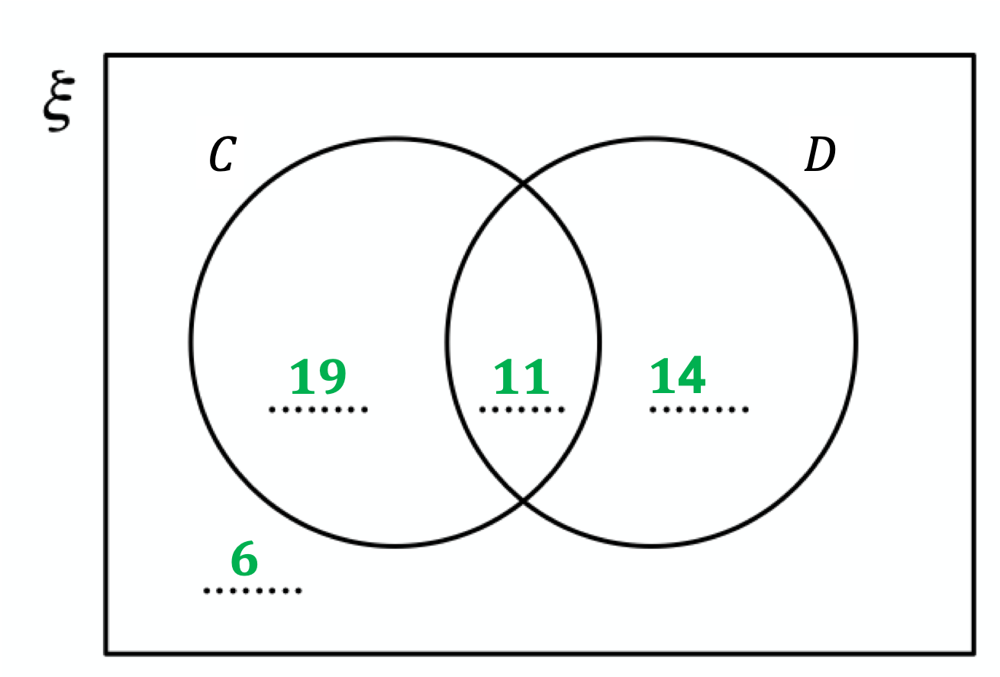

**Correct value for the intersection**** [1]** 
**Correct value in another section**** [1]** 
**Fully correct Venn diagram**** [1]**

## Q6 — easy — 2 marks · exam-questions

### 4() — 2 marks
i) *List the members of the set that are in **A** "and" **B**; the odd multiples of 3.*

**21, 27** **[1]**

ii) *List the members of the set that are in **A** "or" **B**; that are odd or are multiples of 3 (or both).*

**21, 23, 24, 25, 27, 29** **[1]**

## Q7 — easy — 3 marks · exam-questions

### 3((a)) — 2 marks
i) *List the members of the set that are in **A** "and" **B.*

**24, 30** **[1]**
**It is helpful, though not essential, to realise that ****A**** is the set of even numbers and ****B**** is the set of multiples of 3.**

ii) *List the members of the set that are not in **A.*

**21, 23, 25, 27, 29** **[1] **
**It is helpful, though not essential, to realise that ****A**** is the set of even numbers so ****A****' is the odd numbers.**

### 3((b)) — 1 marks
> *23, 25, 29 are not in **A** or **B**.*

$(A\cupB)'$** ****or **$A'\capB'$** ****[1] **
**Writing **$(A\capB)'$** is a common mistake here which will receive no marks**

## Q8 — easy — 3 marks · exam-questions

### 4() — 2 marks
i) $B\cupI$ *means the members of set **B** or set **I**. Write the letters that are in brazil or in ireland, without repeats.*

**b, r, a, z, i, l, e, n, d** **[1]**
**the letters can be given in any order but must not contain repeats**

ii) $B\capI'$ *means the members of set **B** that are not in set **I**. Write the letters that are in brazil and not in ireland.*

**b, z**** ****[1]**
**the letters can be given in either order**

### 4((b)) — 1 marks
> *"*$B\capK=\emptyset$*" means "*$B\capK$* is an empty set". In other words, there are no letters that appear in both brazil and in kenya.*

**"a" appears in both Brazil and Kenya so **$B\capK$** is not an empty set** **[1]**

## Q9 — easy — 3 marks · exam-questions

### 4((a)) — 2 marks
i) $B\cupG$ *means the members of set **B** or set **G.** Write the letters that are in blue or in grey, without repeats.*

**b, l, u, e, g, r, y** **[1]**
**the letters can be given in any order but must not contain repeats**

ii)$W\capG'$ *means the members of set **B** that are not in set **G**. Write the letters that are in white and not in grey.*

**w, h, i, t** **[1]**
**the letters can be given in any order**

### 4((b)) — 1 marks
> *"*$B\capG\capW=\emptyset$*" means "*$B\capG\capW$* is an empty set". In other words, there are no letters that appear in blue and in grey and in white.*

**No, because "e" appears in all three words (**$B\capG\capW$** is not an empty set)**** **
**"Serena's statement is not correct" plus a valid reason**** [1]**

## Q10 — easy — 2 marks · exam-questions

### 1((a)) — 2 marks
i) $A\capB$ *means the elements that are in both set **A **and set **B.*

**2, 4, 6, 12** **[1]**

ii) $B'$ *means the elements that are not in set **B.*

**5, 7, 8, 9, 10, 11, 13, 14** **[1] **
**These elements can be written in any order**

## Q11 — easy — 4 marks · exam-questions

### 3((a)) — 1 marks
> $A\capB=\emptyset$* means *$A\capB$* is an empty set, in other words there are no elements that appear in both **A** and **B.*

**Because there are no numbers which appear in both**** ****A ****and**** B****  ****[1]**

### 3((b)) — 1 marks
> *"*$x\inE$*" means that **x** is a member of the universal set and "*$x\notinA\cupB$*" means that **x** is not a member of set **A** or set **B.** *

**1 and 9** **[1]**

### 3((c)) — 2 marks
> *You might find it useful to draw a Venn diagram to represent the information given.*

> `table row cell A space union space B space union space C space end cell equals cell space calligraphic E end cell end table`* tells you there are no numbers outside *$A\cupB\cupC$

> `table row cell A space intersection space C space end cell equals cell space open curly brackets 2 close curly brackets end cell end table`* tells you that 2 appears in both **A** and **C**.*

> `table row cell B space intersection space C apostrophe space end cell equals cell space open curly brackets 4 space comma space 6 space comma space 10 close curly brackets end cell end table`* tells you that neither 4, 6 nor 10 appear in C (but 8 does as 8 is in **B**).*

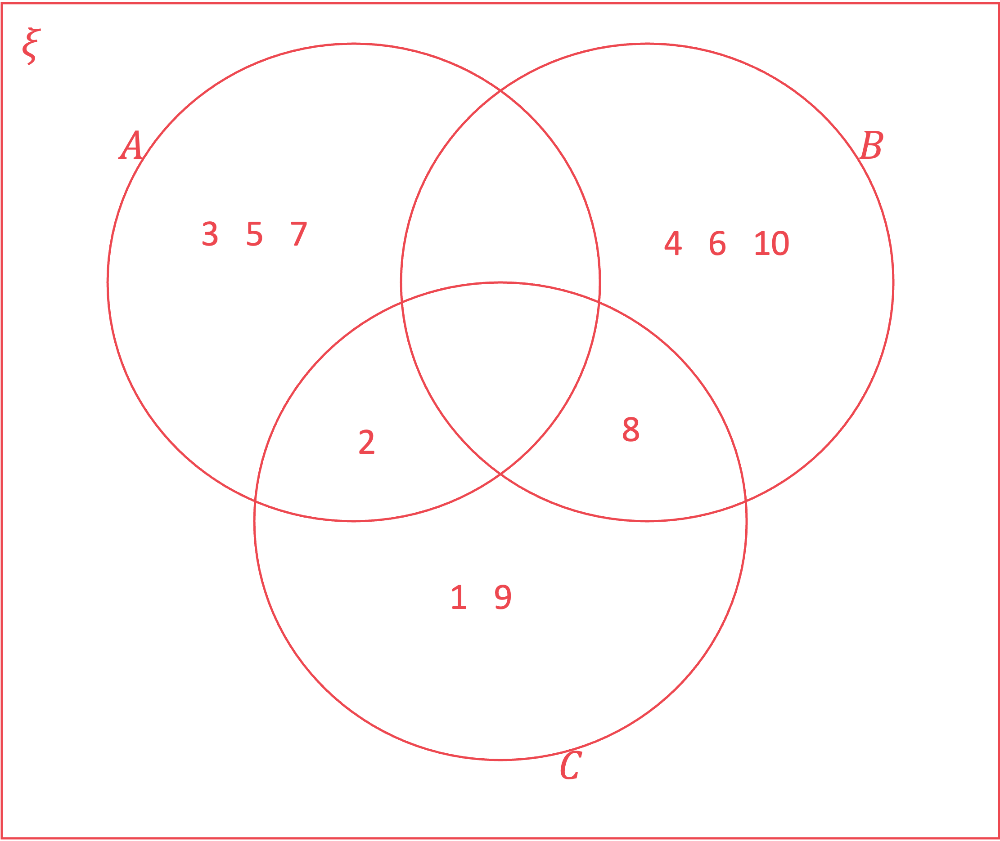

**correct Venn diagram, or 3 correct values in final answer**** [1]**

> *Write down all the values in **C** as the final answer.*

**1, 2, 8, 9 ****[1] **
**The values may be written in any order**

## Q12 — easy — 3 marks · exam-questions

### 1((a)) — 1 marks
> *The members of set *$A$* are all of the numbers in circle *$A$

**Final answer:** **5, 7, 9, 11, 13, 15**

**[B1]**

> **[mark-scheme]**
> **B1: **Numbers can be in any order.

### 1((b)) — 1 marks
> $A\capB$* is the part where the circles overlap*

**Final answer:** **5, 15**

**[B1]**

### 1((c)) — 1 marks
> $A\cupB$* is anything contained in the circles so *`open parentheses A space union space B close parentheses apostrophe`* is anything outside of the circles*

**Final answer:** **6, 8, 12, 14, 16**

**[B1]**

## Q13 — medium — 2 marks · exam-questions

### 1() — 2 marks
> *First list out all the possible factors.*

*Factors of 8: 1, 2, 4, 8* 
*Factors of 20: 1, 2, 4, 5, 10, 20*

> *The universal set states that only even numbers can be used, so list the even factors.*

*Set ***A***: 2, 4, 8* 
*Set ***B***: 2, 4, 10, 20*

**[1]**

> *Find the numbers that appear in **A** 'or' **B, *`open parentheses A union B close parentheses`*.*

**2, 4, 8, 10, 20*** ***[1]**

## Q14 — medium — 3 marks · exam-questions

### 1() — 3 marks
Fill in the numbers from the given information

- Start in the middle by placing 13
- 20 have a starter and a main

  - Subtract 13 from 20 to get 7 who only have a starter and a main
- 55 have a main and a dessert

  - Subtract 13 from 55 to get 42 who only have a main and a dessert
- Everyone who has a starter has a main

  - 0 have just a starter
  - 0 have only a starter and dessert
- 98 have a main

  - Subtract 7, 13 and 42 from 98 to get 36 who only have a main

- Everyone has at least one item

  - 0 people have no items
- There are 100 people in total

  - Subtract all numbers in the Venn diagram to find the number of people who only have a dessert

*100 - 13 - 7 - 42 - 36 = 2*

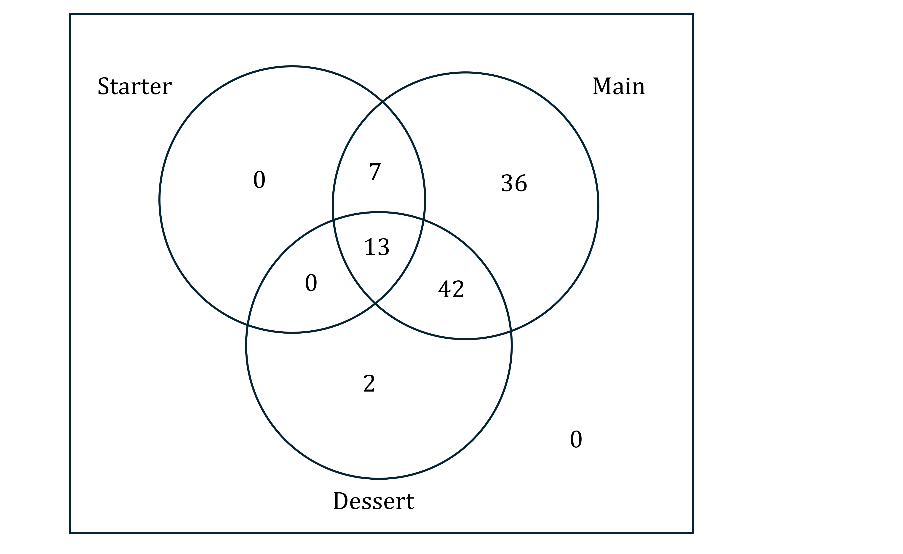

> **[mark-scheme]**
> **M1: **For at least 2 correct numbers in the Venn Diagram.
> 
> **M1: **For at least 4 correct numbers in the Venn diagram.
> 
> **A1: **For all correct numbers in the diagram.

## Q15 — medium — 4 marks · exam-questions

### 1() — 1 marks
> $\emptyset$* is an empty set; a set that contains no elements.*

**No students study German and Maths ****[1]**

### 2() — 1 marks
> $\notin$* means an element not contained in a set.*

**Preety does not study French** **[1]**

### 3() — 2 marks
> *Using *`A intersection B equals open curly brackets 2 comma space 4 close curly brackets`*, **A** and **B** must both contain 2 and 4.*

> *Using *`A union B equals open curly brackets 1 comma space 2 comma space 3 comma space 4 comma space 6 comma space 8 comma space 10 close curly brackets`*, if 1 and 3 are not in **A** but are in **A **'or' **B**, they must be in **B**.*

`bold italic B bold equals stretchy left curly bracket 1 comma space 2 comma space 3 comma space 4 stretchy right curly bracket`**[1]**

## Q16 — medium — 3 marks · exam-questions

### 1() — 2 marks
(i)* **List all the elements in **A** 'and' **B**.*

**u, p, e, r ****[1]**

** **

(ii)* **List all the elements in **A** 'or' **B**.*

**s, u, p, e, r, c, o, m, t ****[1]**

### 2() — 1 marks
> $X\capY\neq\emptyset$*, the intersection of **X** and **Y** is not an empty set.*

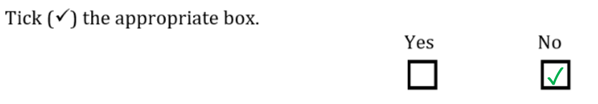

**2 and 3 are both prime AND factors of 12** **[1]**

**Both tick and explanation are required for the mark**

## Q17 — medium — 1 marks · exam-questions

### 1() — 1 marks
> *List all of the elements that are in set **A** 'and' set **B**,** **all the numbers that are both odd 'and' prime.*

**3, 5, 7, 11*** ***[1]**

## Q18 — medium — 3 marks · exam-questions

### 1() — 2 marks
> $A\capB=\emptyset$*, means that there is no intersection between sets **A** and **B**, so they must not overlap.*

> $C\subsetA$*, means that **C** is a subset of **A**, so set **C** must be inside set **A**.*

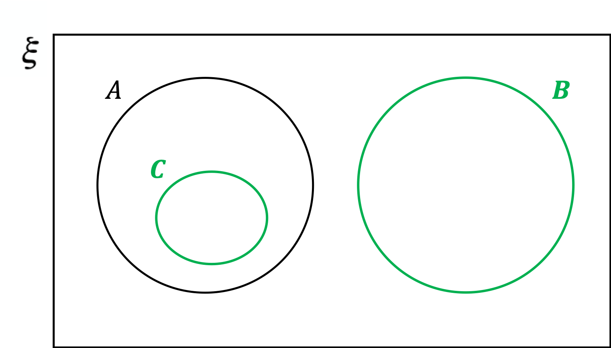

**Separate circle for**** ****B**** [1] **
**Circle for**** ****C is inside A**** [1]**

### 2() — 1 marks
> *Shade the region inside by **A** 'and' not in **C**.*

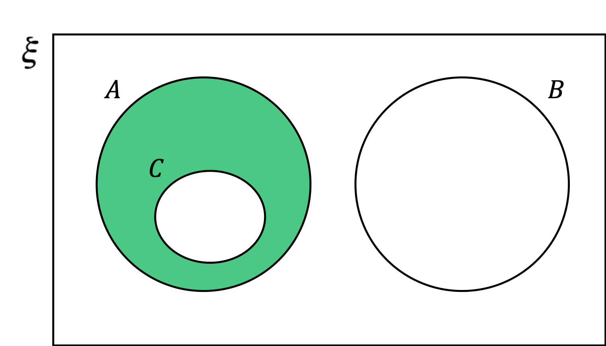

**Correct region shaded**** [1]**

## Q19 — medium — 4 marks · exam-questions

### 1() — 1 marks
> *Find the number of elements that are in set **A** or set **B**.*

*7 + 6 + 3 + 2 = 18*

**18 ****[1]**

### 2() — 1 marks
> *Find the number of elements that are not in set **A**.*

*3 + 2 + 10 = 15*

**15** **[1]**

### 3() — 1 marks
> *Find the number of elements that are in set **B** 'and' not in set **C**.*

*6 + 3 = 9*

**9** **[1]**

### 4() — 1 marks
> *Find the number of elements not in set **A** 'or' not in set **B** or not in either set*

- *3, 2 and 10 are not in **A*
- *7 and 10 are not in **B*
- *10 is not in both **A** and **B*

> **[exam-tip]**
> This is all the elements that are not in **both **set *A* and *B*.

*7 + 3 + 2 + 10 = 22*

**22** **[1]**

## Q20 — medium — 2 marks · exam-questions

### 1() — 2 marks
> *List the factors of 100.*

*Factors of 100: 1, 2, 4, 5, 10, 20, 25, 50, 100*

**List any factors of 100 or multiples of 5 ****[1]**

> *List the factors of 100 that are also multiples of 5.*

**5, 10, 20, 25, 50, 100*** ***[1]**

## Q21 — medium — 4 marks · exam-questions

### 1() — 1 marks
> $\emptyset$* is an empty set; a set that contains no elements.*

**No numbers are in both set ****A**** and set ****B*** * **[1]**

### 2() — 1 marks
> $x\inξ$*, means that *$x$* is an element in the universal set.*

> $x\notinA\cupB$*, means that *$x$* is an element not in set **A** 'or' in set **B**.*

> *9 is the only number in the universal set that is not in set **A** 'or' set **B**.*

**9** **[1]**

### 3() — 2 marks
> $A\cupB\cupC=ξ$* that all of the numbers in the universal set are contains within **A, B** or **C**.*

> *9 is the only number that is not in set **A** 'or' **B**, so it must be in set **C**.*

> `A intersection C equals open curly brackets 3 comma space 7 close curly brackets`* and *`B intersection C equals open curly brackets 8 close curly brackets`*, tell us that set **C** also contains 3, 7 and 8.*

**3, 7, 8, 9 ****[1]**

## Q22 — medium — 3 marks · exam-questions

### 1() — 2 marks
(i)* **List the elements in set **A** 'and' not in set **B**, (odd numbers that are not multiples of 5).*

**1, 3, 7, 9, 11, 13, 17** **[1]**

** **

(ii)* **List the elements in set **B** 'or' in set **B**, (multiples of 4 or multiples of 5).*

**4, 5, 8, 10, 12, 15, 16** **[1]**

### 2() — 1 marks
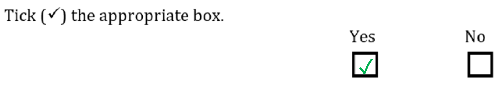

**Because no multiples of 4 are prime ****[1]**

> **[mark-scheme]**
> Both the tick and the explanation are required for the mark.
> 
> Accept any explanation conveying that no multiple of 4 is prime, e.g. every multiple of 4 is divisible by 2 so cannot be prime / C and D share no elements because multiples of 4 are not prime.

> **[exam-tip]**
> Make sure your explanation clearly justifies why the sets share no elements, not just what one set contains.

## Q23 — medium — 4 marks · exam-questions

### 1() — 1 marks
> *List the elements that are not in set **B**, numbers that are not multiples of 3.*

**Final answer:** **1, 2, 4, 5, 7, 8, 10**** [1]**

### 2() — 1 marks
> *List the number of elements that are not in set **A** 'and' are in set **B**, numbers that are not even and are multiples of 3.*

*3, 9*

> *Write down the number of elements in the list.*

**2 ****[1]**

### 3() — 2 marks
> $x\inB$* means that *$x$* is an element of **B**, so *$x$* could be any multiple of 3 between 1 and 10.*

*3, 6, 9*

**[1]**

> $x\notinA$* means that *$x$* is an element that is not in set **A**, so *$x$* cannot be even.*

> *3 and 9 are the only odd multiples of 3 between 1 and 10.*

**3, 9**** [1]**

## Q24 — medium — 5 marks · exam-questions

### 1() — 3 marks
> `straight n open parentheses A intersection B close parentheses equals 8`* means that there are 8 elements in the intersection of **A** and **B**.*

> *Find the number of elements that are in **B** but not in **A** by subtracting the number of elements that are in both **A ** and **B** from the number of elements in **B**.*

*21 - 8 = 13*

> *Find the number of elements that are not in set **A** 'or' in set **B** by subtracting the number of elements that are in set **B** but not set **A** from the number of elements that are not in set **A**.*

*18 - 13 = 5*

> *Find the number of elements that are in set **A** but not in set **B** by subtracting all of thevalues in the other sections of the Venn diagram from the number of elements in the universal set.*

*36 - 8 - 13 - 5 = 10*

> *Fill in the values in the appropriate parts of the Venn diagram.*

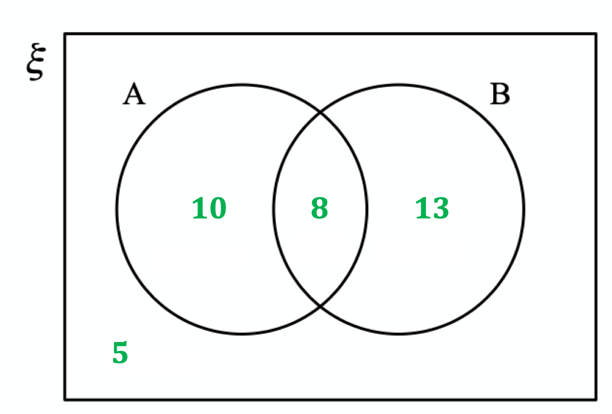

**Correct value for the number of elements in set B but not in set A**** [1]** 
**Correct value for either the number of elements in set A but not set B OR correct value for the number of elements not in set A or set B ****[1]** 
**All values correct ****[1]**

### 2() — 2 marks
*(i) **Find the number of elements that are in set **A** 'or' in set **B**.*

*10 + 8 + 13 = 31*

**31**** ****[1]**

** **

*(ii) **Find the number of elements that are in set **A** 'and' not in set **B**.*

**10**** ****[1]**

## Q25 — medium — 4 marks · exam-questions

### 1() — 2 marks
> *Find the number of elements that are in **Z**  but not in **X ** 'or' **Y**  by subtracting the number of elements that are in **Y** only, the number of elements that are in **Y ** 'and' **Z**  'and' not **X** and the number of elements that are not in **X**, **Y ** 'or' **Z **from the number of elements that are not in **X**.*

*14 -3 - 3 - 2 = 6*

> *Find the number of elements that are in **X**  'and' in **Z  **'and' not in **Y **by subtracting the number of elements in all of the other sections in **Z** from the number of elements in **Z**.*

*14 - 0 - 3 - 6 = 5*

> *Complete the Venn diagram putting the values in the appropriate places.*

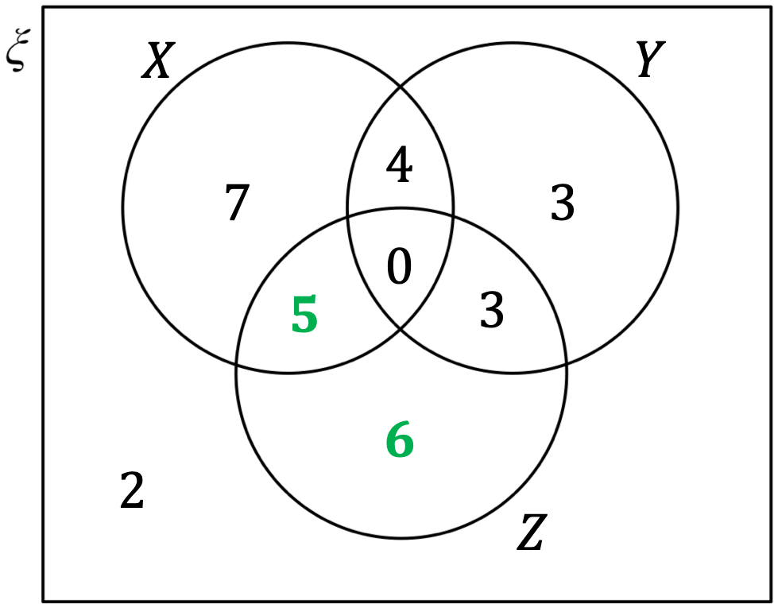

**Any correct missing value in Venn diagram**** [1]** 
**Venn diagram completed with all correct values ****[1]**

### 2() — 2 marks
*(i) **The number of elements that are in set **X**  'or' in set **Z**.*

*7 + 4 + 5 + 6 + 3 = 25*

**25**** ****[1]**

*(ii) **The number of elements that are in set **X ** 'and' not in set **Y**.*

*7 + 5 = 12*

**12**** [1]**

## Q26 — medium — 4 marks · exam-questions

### 17() — 1 marks
> $n(A\cupB)$* means the number of elements in **A** **or **B.** It is everything shaded below.*

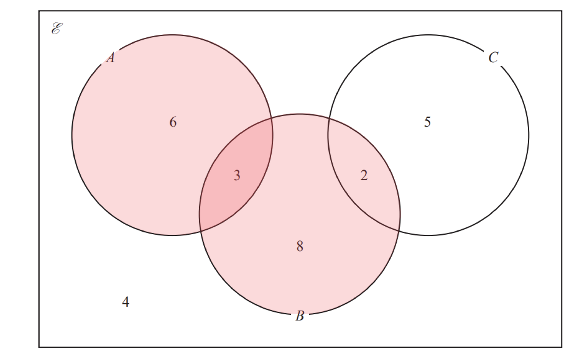

$n(A\cupB)=6+3+8+2$

**Answer = 19 ****[1]**

### 17((i)) — 1 marks
> $n(A\capB)$* means the number of elements in **A** **and **B.** It is the overlapping shaded part below.*

**Answer = 3 ****[1]**

### 17() — 1 marks
> $n(B\capC')$* means the number of elements in **B** **and not** in **C.** It is everything shaded below.*

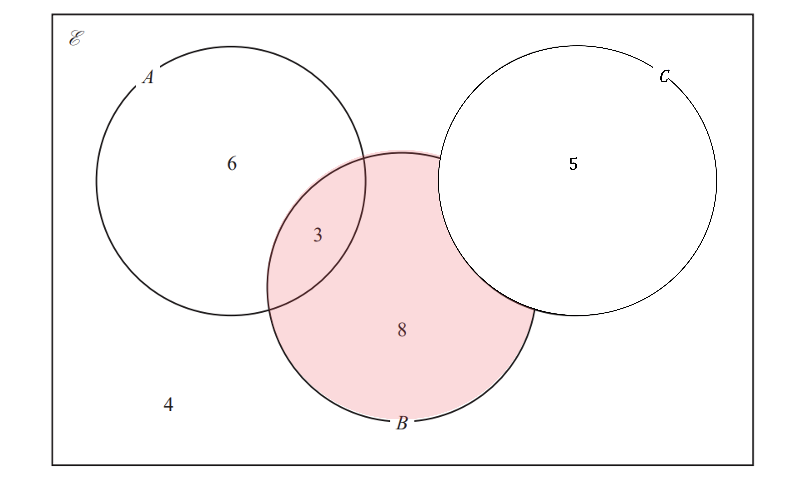

$n(B\capC')=3+8$

**Answer = 11 ****[1]**

### 17() — 1 marks
> $n(A'\cupB'\cupC')$* means the number of elements that are either not in **A** or not in **B **or not in **C**. None of the elements are in **A**, **B** and **C** at the same time, so all of the elements are either not in **A** or not in **B **or not in **C.*

> *Add all the numbers in the diagram.*

$n(A'\cupB'\cupC')=6+3+8+2+5+4$

**Answer = 28 ****[1]**

## Q27 — medium — 3 marks · exam-questions

### 19() — 3 marks
i) `n open parentheses A union B close parentheses`* means the number of elements in **A** "or" **B**.*

`n open parentheses A union B close parentheses equals 12 plus 10 plus 5 plus 6 plus 9 plus 3`

**Answer = 45**** ****[1]**

ii) `n open parentheses A apostrophe intersection space B apostrophe close parentheses`* means the number of elements that are not in **A** **and** are not in **B**. It is represented by the shaded area in the diagram below.*

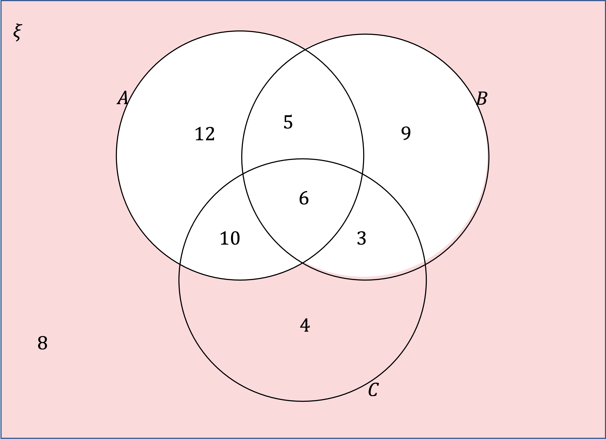

`n open parentheses A apostrophe intersection space B apostrophe close parentheses equals 4 plus 8`

**Answer = 12**** ****[1]**

iii) `n open parentheses open square brackets A intersection B close square brackets union space C close parentheses`* means the number of elements that are in **A** **and** B, **or** **in **C.** It is represented by all the shaded area in the diagram below.*

> *(*`n open parentheses open square brackets A intersection B close square brackets intersection space C close parentheses`* would be the overlapping shaded area below, or 6)*

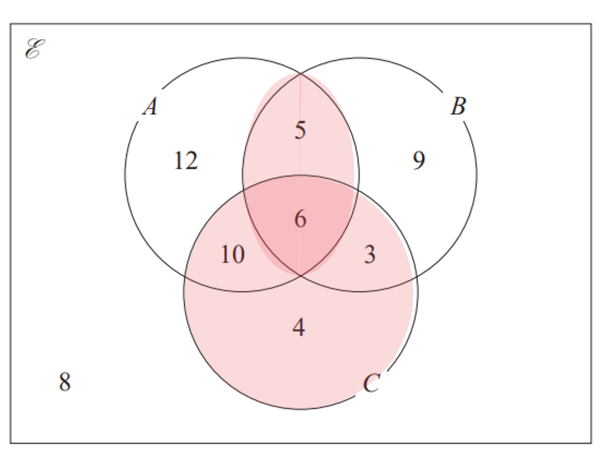

`n open parentheses open square brackets A intersection space B close square brackets union C close parentheses equals 5 plus 6 plus 10 plus 3 plus 4`

**Answer = 28**** ****[1]**

## Q28 — hard — 4 marks · exam-questions

### 1() — 2 marks
> *The intersection of A and B is 12, so place that in the appropriate place on the diagram.*

> *Subtract the number of elements in the intersection of **A** and **B** from the number of elements in set **A** to find the number of elements that are only in set **A**.*

$22-12=10$

> *Subtract the number of elements in set **A** from the number of elements in the union of **A** and **B** to find the number of elements that are only in set **B**.*

$30-22=8$

> *Subtract the number of elements in the union of **A** and **B** from the number of elements in the universal set to find the number of elements that are not in set **A** or **B**.*

$37-30=7$

**Finding any correct missing value**** [1] **
**All values correct**** [1]**

### 2() — 2 marks
(i) *The number of elements that are in **A** 'and' not in **B**.*

**10**** ****[1]**

** **

(ii) *The number of elements that are not in **A** 'or' not in **B**.*

$10+8+7=25$

**25*** ***[1]**

## Q29 — hard — 4 marks · exam-questions

### 1() — 4 marks
> *6 students study neither French nor Spanish, so put 6 outside both sets.*

> *Add together the number of students studying French, Spanish and no languages, and compare it to the total number of students in the class.*

$17+15+6=38$

$38-31=7$

**[1]**

> *There must be 7 students who study both French and Spanish, place 7 in the intersection of the two sets.*

> *Find the number of students who study French only by subtracting the number who study both languages from the number who study French.*

$17-7=10$

> *Find the number of students who study Spanish only by subtracting the number who study both languages from the number who study Spanish.*

$15-7=8$

**[1]**

> *Write all values in the appropriate places of a Venn diagram.*

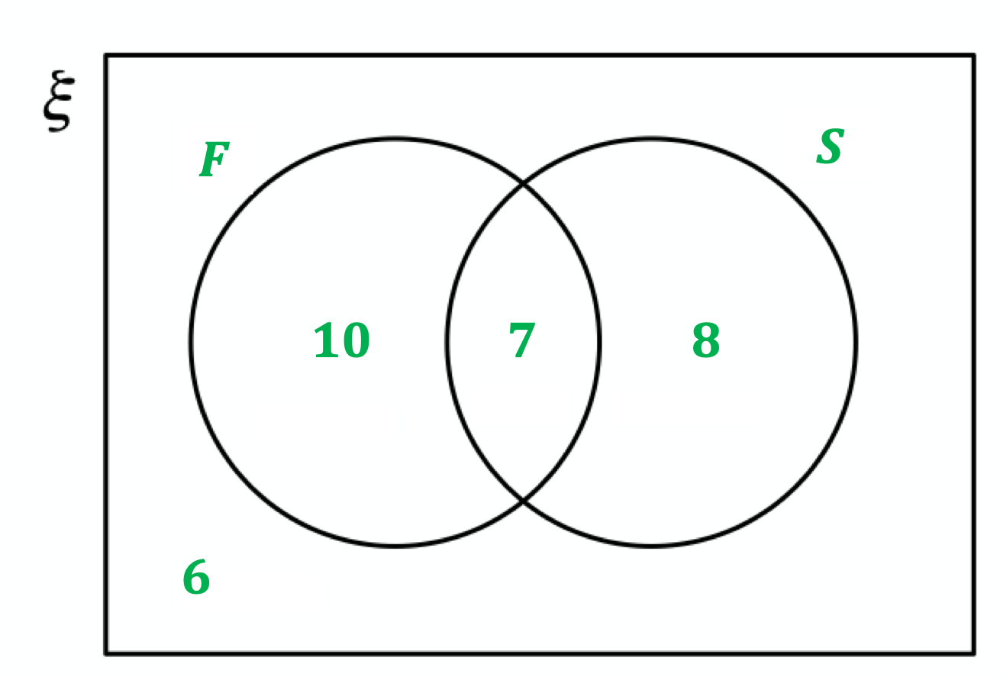

**[1]**

> *Now answer the question by adding the values in the "French only" and "Spanish only" sections of the Venn diagram.*

$10+8=18$

**18** **[1]**

## Q30 — hard — 4 marks · exam-questions

### 1() — 4 marks
> *No cars had steering 'and' lighting faults, so insert a 0 both relevant parts of the diagram. Then follow through looking at each of the other statements in turn.*

> *2 cars had braking faults 'and' steering faults.*

$2-0=2$

> *3 cars had braking faults and lighting faults.*

$3-0=3$

> *7 cars had lighting faults.*

$7-3=4$

> *9 cars had steering faults.*

$9-2=7$

> *11 cars had braking faults.*

$11-3-2=6$

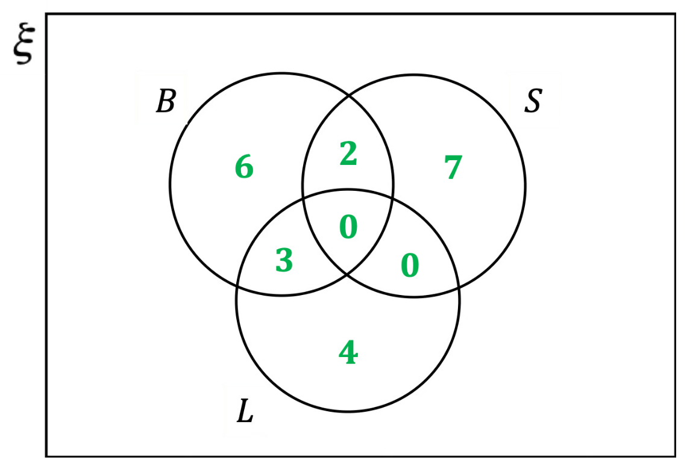

**Correct values in intersections**** [1]** 
**Correct values in other sections**** [1]** 
**All values correct**** [1]**

*Total Fails = 6 + 2 + 7 + 3 + 4 = 22*

**22**** ****[1]**

## Q31 — hard — 3 marks · exam-questions

### 1() — 2 marks
(i)* **List the numbers that are not in **A** 'and' not in **B**, (numbers that are not even 'and' not multiples of 3).*

**1, 5, 7, 11*** ***[1]**

** **

(ii) *List the numbers that are in **B** or in **C**, (prime numbers 'or' multiples of 3).*

**2, 3, 5, 6, 7, 9, 11, 12*** ***[1]**

### 2() — 1 marks
> *Set **A** contains even numbers but the universal set only goes up to 13.*

**The set only contains even numbers less than 13** **[1]**

## Q32 — hard — 4 marks · exam-questions

### 1() — 1 marks
> *There is no overlap between sets **A ** and **B** so the intersection of **A** and **B** is an empty set.*

**0**** [1]**

### 2() — 1 marks
> *The number of elements not contained in **B**.*

$2+4+7+10$

$23$** [1]**

### 3() — 1 marks
> *The number of elements contained in **A**  'and' not in **C**.*

**2 ****[1]**

### 4() — 1 marks
> *The number of elements not in **B ** 'and' not in **C**.*

**12 ****[1]**

## Q33 — hard — 4 marks · exam-questions

### 1() — 1 marks
> *List the elements that are not in **A**.*

**1, 4, 5, 6, 7** **[1]**

### 2() — 1 marks
> *The number of elements that are not in (**A** 'and' **B**).*

*1, 2, 3, 4, 5, 6, 7, 10*

**8** **[1]**

### 3() — 1 marks
> *List the elements that are in the intersection (**A** 'and' **B**).*

*8, 9*

> *List the elements that are not in (**A** 'or' **B**).*

*1, 4, 7*

> *List the elements that are either in (**A** 'and' **B**) 'or' not in (**A** 'or' **B**).*

**1, 4, 7, 8, 9** **[1]**

### 4() — 1 marks
> *No elements are in **A** 'and' **C**, so **C** cannot contain 2, 3, 8, 9, 10.*

> *All numbers in either **B**  'or' **C** are 5, 6, 7, 8, 9.*

> *C** contains just three numbers.*

**5, 6, 7** **[1]**

## Q34 — hard — 4 marks · exam-questions

### 1() — 2 marks
> *Shade the union of **A** and **B, *`open parentheses A union B close parentheses`*.*

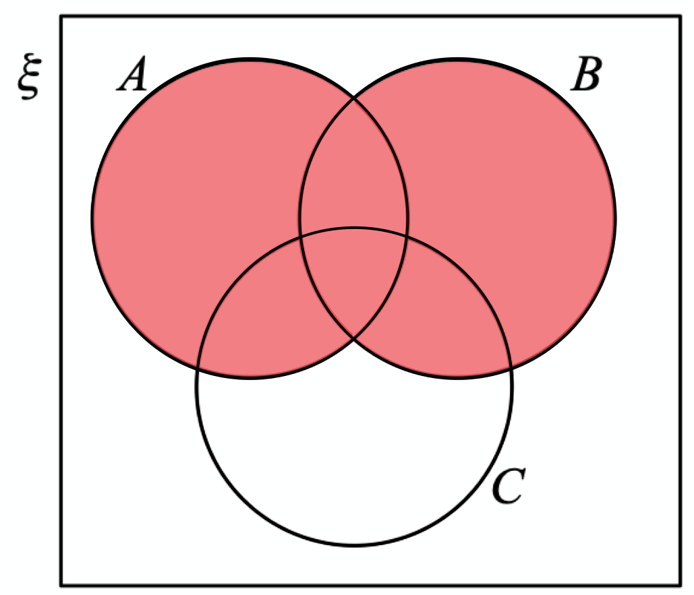

> *Shade** *$C'$*.*

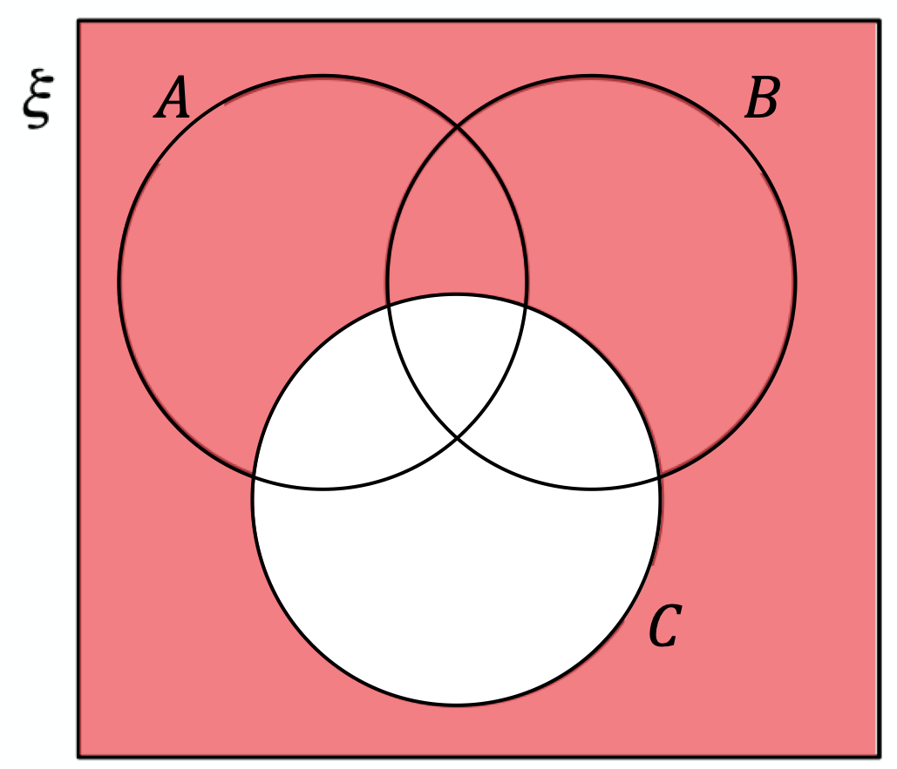

> *Shade a new diagram that shows the intersection of these two sets, *`open parentheses A union B close parentheses intersection C apostrophe`*.*

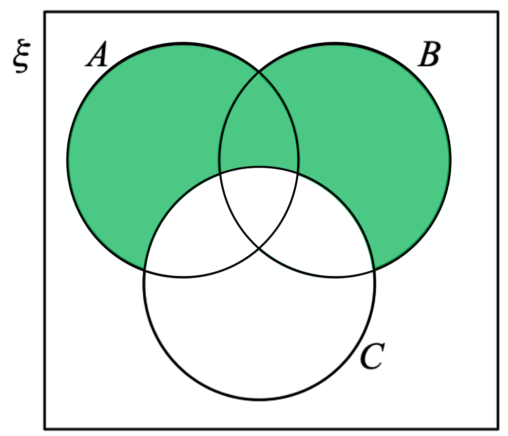

**Any region that satisfies part of the set ****[1]** 
**All correct regions shaded**** [1]**

### 2() — 2 marks
> *Method 1*

> *All of the shaded parts are within set **E**, where it overlaps with sets **D** and **F**.*

> *It is the union of the intersection of **D** and **E ** and the intersection of **E** and **F**.*

$(D\capE)\cup(E\capF)$

`open parentheses D intersection E close parentheses` **[1]** 
`open parentheses E intersection F close parentheses`** [1]**

> *Method 2*

> *Imagine the the union of **D** and **F**.*

> *The region shown is the intersection of that union with **E**.*

$(D\cupF)\capE$ **[2]**

## Q35 — hard — 5 marks · exam-questions

### 1() — 2 marks
> *6 appears in set **B** and set **C**.*

> *1, 4 and 10 are in the universal set but do not appear in any of the sets **A, B** or **C**.*

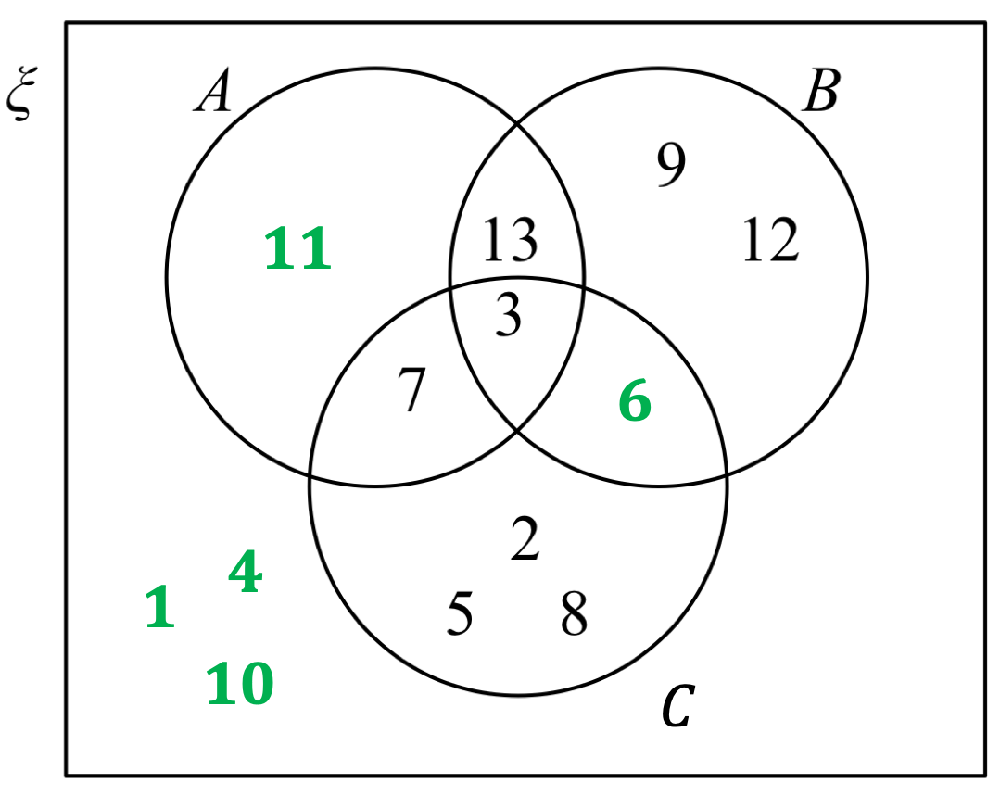

**Any 2 or 3 values correct**** [1]**
 **All values correct ****[1]**

### 2() — 1 marks
> *List the elements that are not in **B**  'and' are in **C**.*

**2, 5, 7, 8** **[1]**

### 3() — 1 marks
> *List the elements that are not in (**A** 'or' **C**) 'and' are in **B**.*

**9, 12 ****[1]**

### 4() — 1 marks
> *Identify which elements are not in **A** 'and' not in **B**.*

*2, 5, 8, 1, 4, 10*

**6** **[1]**

## Q36 — hard — 3 marks · exam-questions

### 1() — 3 marks
> *Work through each statement, one at a time.*

> *5 students have all three, place 5 in the intersection of all three sets.*

> *Find the number of students who have both a laptop and a tablet but not a desktop by subtracting the number who have all three from the 7 students who have both a laptop and a tablet.*

$7-5=2$

> *Find the number of students who have both a desktop and a tablet but not a laptop by subtracting the number who have all three from the 11 students who have both a desktop and a tablet.*

$11-5=6$

> *Find the number of students who have both a desktop and a  laptop but not a tablet by subtracting the number who have all three from the 9 students who have both a desktop and a laptop.*

$9-5=4$

> *Find the number of students who have a tablet only by subtracting the number who have a tablet and another item from the 16 students who have a tablet.*

$16-6-5-2=3$

> *Find the number of students who have a laptop only by subtracting the number who have a laptop and another item from the 17 students who have a laptop.*

$17-4-5-2=6$

> *Find the number of students who have a desktop only by subtracting the number who have a desktop and another item from the 19 students who have a desktop.*

$19-4-5-6=4$

> *Find the number of students who have none of the items by subtracting the values within all the remaining sections of the Venn diagram from the total number of students in the group.*

$32-5-6-4-2-6-4-3=2$

> *Label the different parts of the Venn diagram with the appropriate values.*

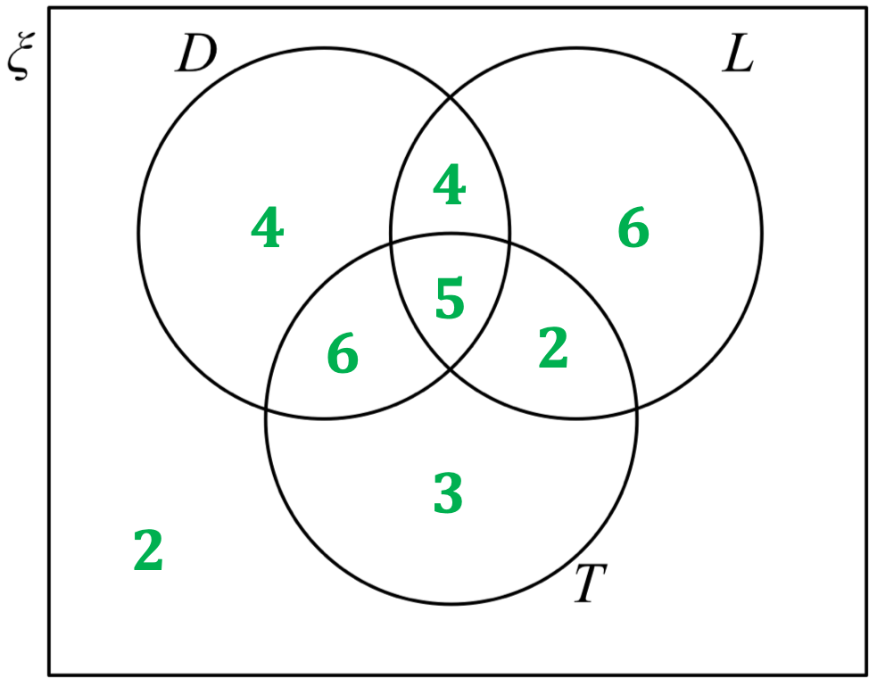

**Correct values for the intersections ****[1]*** *
**Correct values for the remaining sections ****[1]*** *
**Venn diagram fully correct**** [1]**

## Q37 — hard — 6 marks · exam-questions

### 16((a)) — 3 marks
> *Start by filling in the centre and the section outside the circles as you know these numbers.*

> *Subtract the number of people that study all three from the numbers that study two to find the numbers that study exactly two.*

*10 - 4 = 6 study Russian and French only* 
*13 - 4 = 9 study French and German only* 
*6 - 4 = 2 study Russian and German only*

> *Subtract the people that study German and another language from the people that study German to find the number that study only German.*

*24 - 4 - 9 - 2 = 9 study German only*

> *Double the number that study French only to find the number that study Russian only, leave this in terms of **x**.*

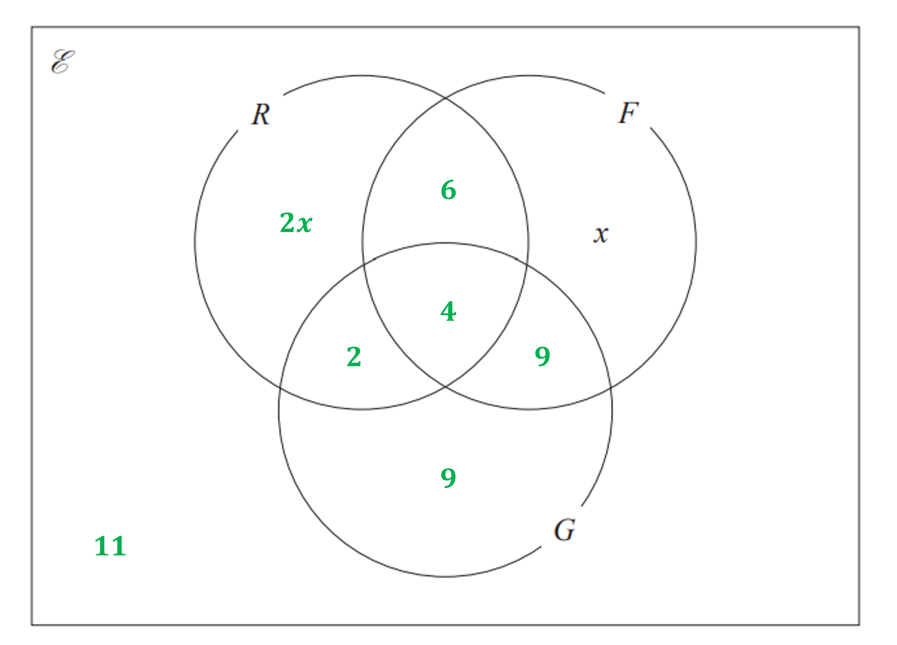

** ****3 sections correct**** [1]  **
**5 sections correct**** [1]  **
**All sections correct**** [1]**

** **

### 16((b)) — 3 marks
> *Form an equation by adding together the number in all the sections and making this equal 80.*

$4+2+6+9+9+2x+x+11=80$

**[1]**

> *Simplify and solve.*

`table attributes columnalign right center left columnspacing 0px end attributes row cell 3 x plus 41 end cell equals 80 row cell 3 x end cell equals 39 row x equals 13 end table`

**[1]**

> *Find the number of people that study Russian by adding together the numbers in that circle.*

`2 open parentheses 13 close parentheses plus 6 plus 2 plus 4`

**38 study Russian** **[1]**

## Q38 — hard — 3 marks · exam-questions

### 7() — 3 marks
> *Start by completing the information for *$A\capB$*.*

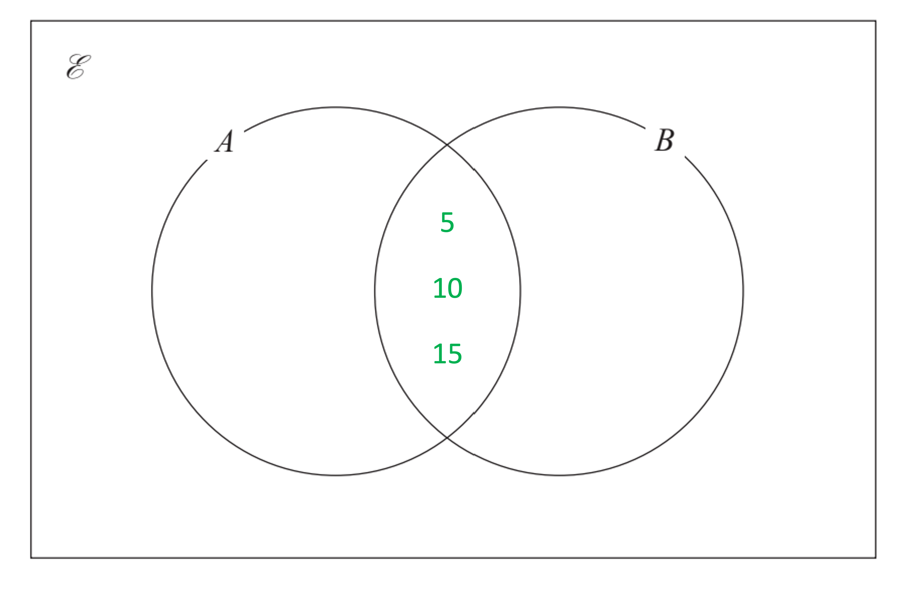

**[1]**

> *If we consider *$B'$* and *$A'$*, 7, 8 and 14 are not in **B** or in **A**, so put 7, 8 and 14 in *`open parentheses A union B close parentheses apostrophe`*.*

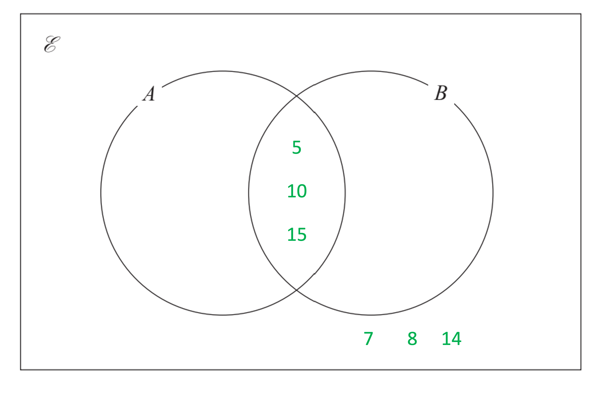

**[1]**

> *From the list of *$B'$*, place the remaining numbers in *$A\capB'$*.*

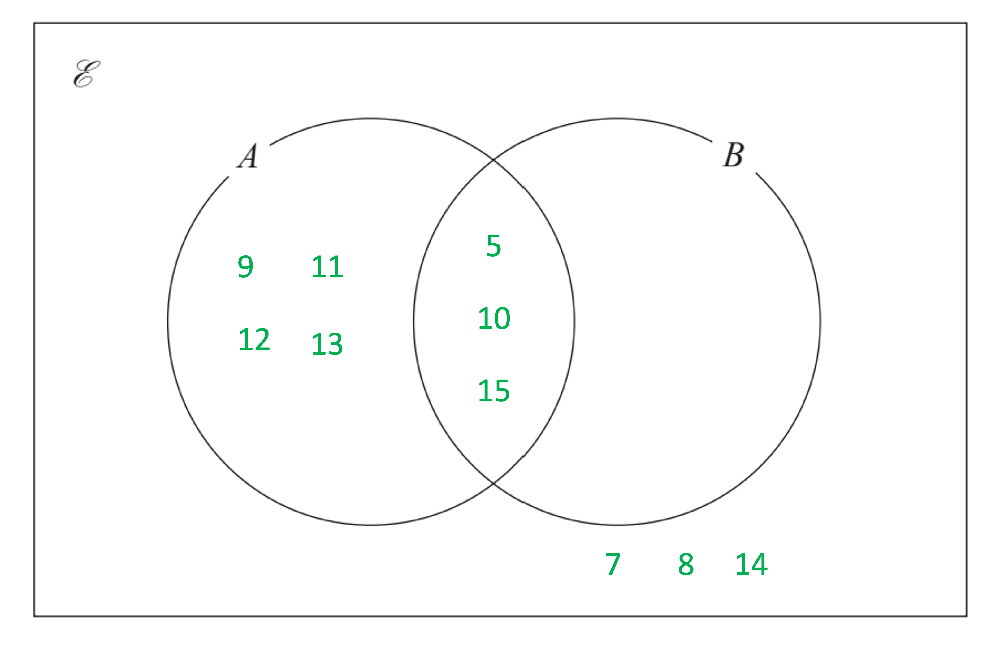

> *From the list of *$A'$*, place the remaining numbers in *$B\capA'$*.*

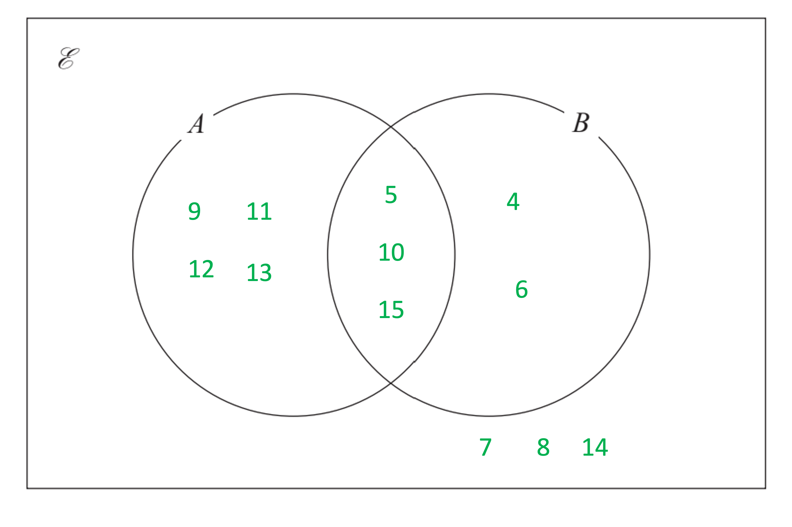

**[1]**

## Q39 — hard — 6 marks · exam-questions

### 17((a)) — 3 marks
> *Start by adding to the diagram the 5 students who have neither a dog or a cat or a rabbit, and the 6 who have a dog, a cat and a rabbit.*

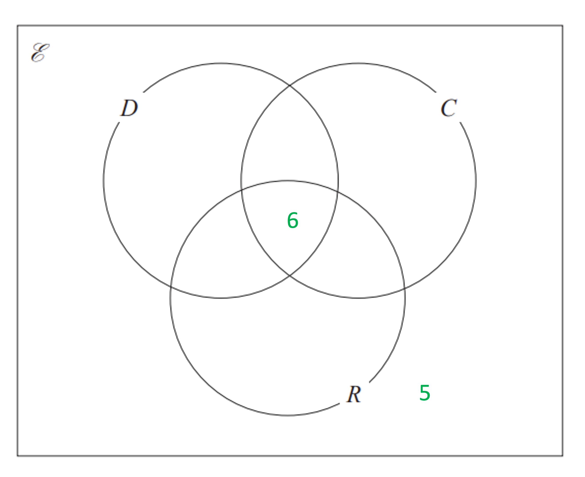

**2 or 3 correct values inserted**** [1]**

> *Work outwards; next add the students who have two types of pet.*

> $x$* have both a dog and a cat but this includes the 6 students in the centre who have all three type of pet, so enter *$x-6$* here*

> *9 have both a dog and a rabbit but this includes the 6 students in the centre who have all three type of pet, so enter 3 here*

> *8 have both a cat and a rabbit but this includes the 6 students in the centre who have all three type of pet, so enter 2 here*

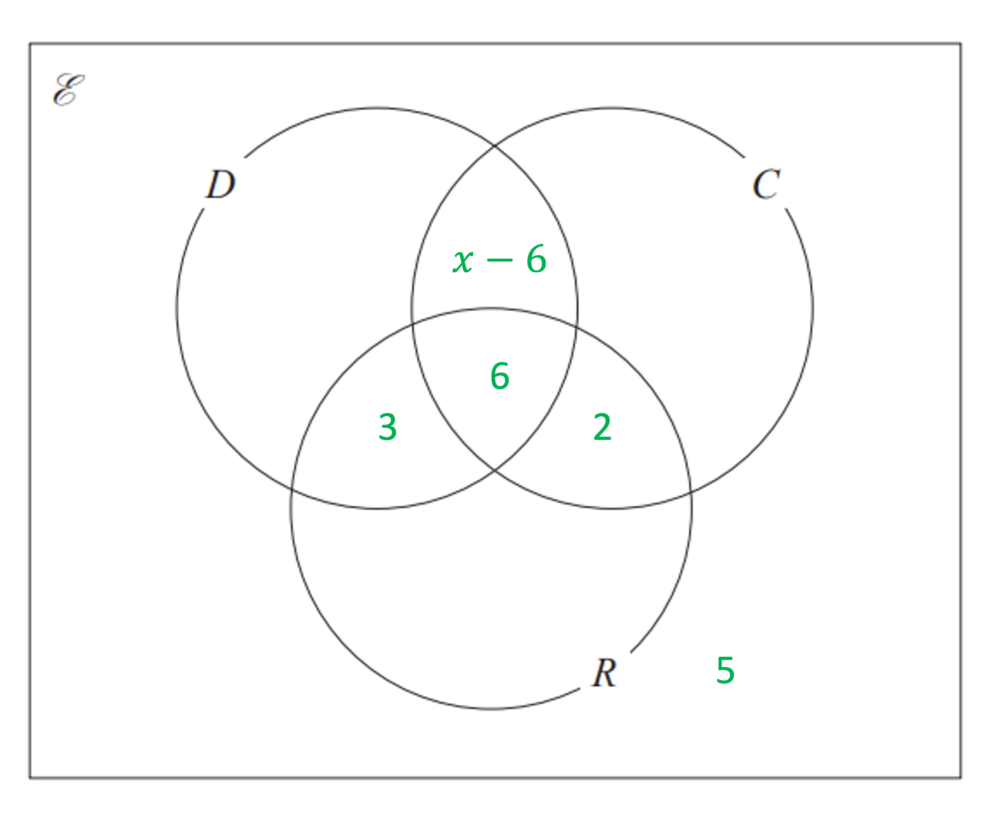

**4 to 7 correct values inserted**** [1]**

*Now add the students who have only one type of pet.* *20 students have a rabbit; use the Venn diagram so far to work out how many students have **only** a rabbit.*

*only a rabbit = 20 − (3 + 6 + 2) = 9*

> *18 students have a cat; use the Venn diagram so far to work out how many students have **only** a cat.*

*only a cat = 18 − (2 + 6 + *$x$* − 6) = 18 − (2 + *$x$*) = 16 − *$x$

> *28 students have a dog; use the Venn diagram so far to work out how many students have **only** a dog.*

*only a dog = 28 − (3 + 6 + *$x$* − 6) = 28 −(3 + *$x$*) = 25 − *$x$

* *

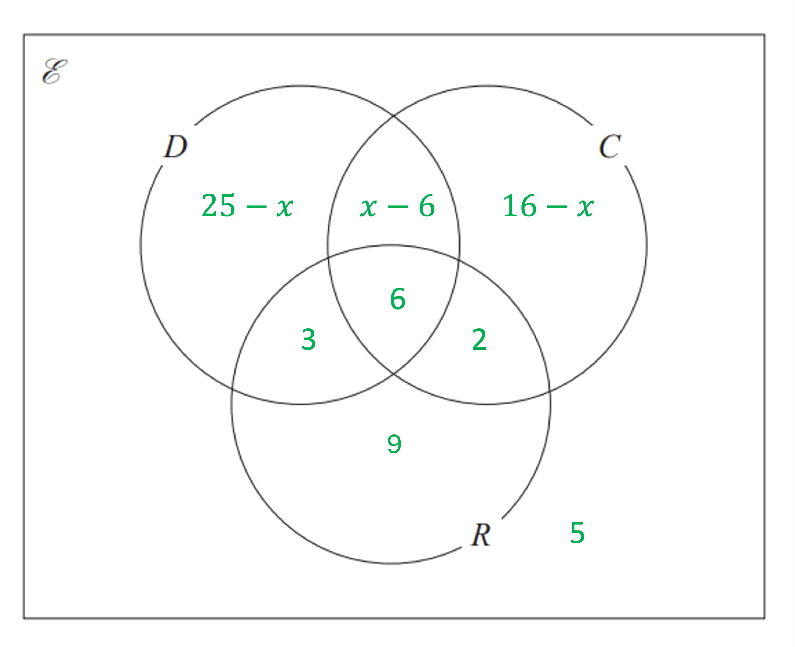

**all values inserted correctly**** [1]**

### 17((b)) — 2 marks
> *Add together all the values in the Venn diagram from (a) and equate to 50.*

$25-x+x-6+16-x+6+3+2+9+5=50$

**correctly summing together all the values in the Venn**** diagram [1]** 
**equating this sum to 50**** [1]**

> *Now collect like terms and solve.*

`table attributes columnalign right center left columnspacing 0px end attributes row cell 60 minus x end cell equals 50 row 10 equals x end table`

**10**** ****[1]**

### 17((c)) — 1 marks
> $n(Cʹ\capDʹ)$* means the number of students who do not have a cat and who do not have a dog (i.e. only have a rabbit, or have no pet, circled in the diagram below)*

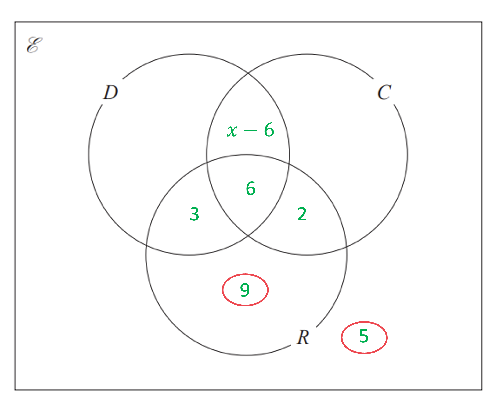

*9 + 5 = 14*

**14** **[1]**

## Q40 — hard — 3 marks · exam-questions

### 13() — 3 marks
> *7 can be placed in the centre of the Venn diagram*

> *Calculate the number that study only German and French*

$10-7=3$

> *Calculate the number that study only Spanish and German*

$12-7=5$

> *Calculate the number that study only French and Spanish*

$9-7=2$

> *Place values into the Venn diagram as below*

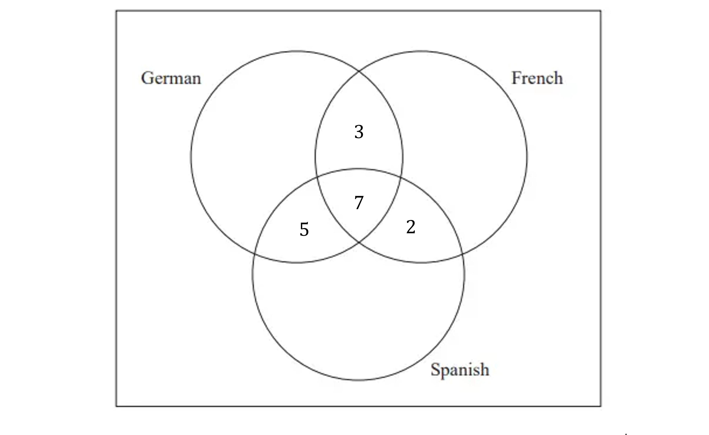

**[M1]**

> *Calculate the number that study only Spanish*

`16 minus open parentheses 5 plus 7 plus 2 close parentheses equals 2`

> *Calculate the number that study only German*

`18 minus open parentheses 5 plus 7 plus 3 close parentheses equals 3`

> *Calculate the number that study only French*

`30 minus open parentheses 3 plus 7 plus 5 plus 2 plus 2 plus 3 close parentheses equals 8`

**[M1]**

> *Place all values into the Venn diagram as below*

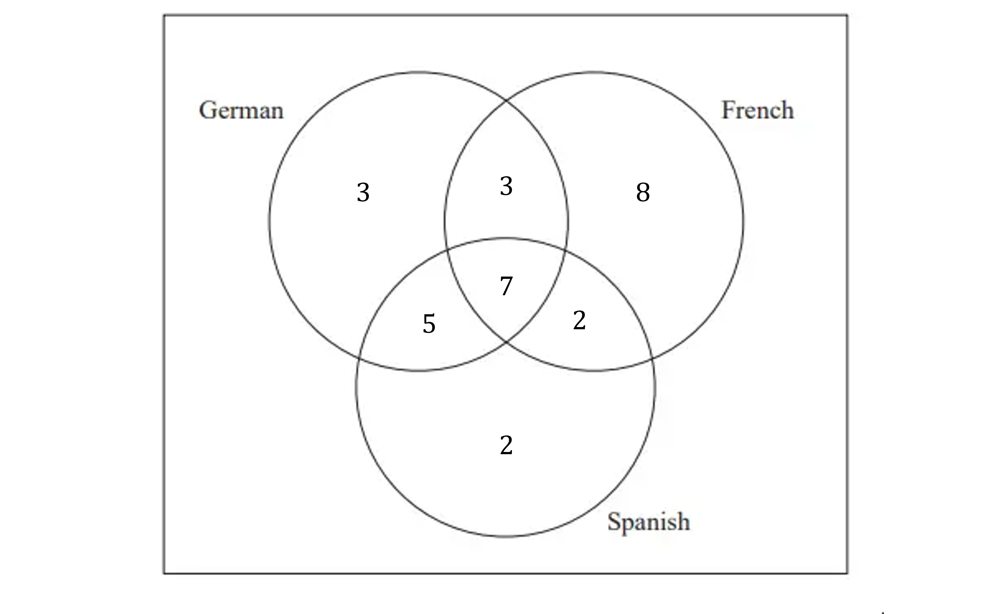

> *Calculate the total number that study French by adding the values contained within the circle for French*

$8+3+7+2=20$

**Final answer:** **20**

**[A1]**

> **[mark-scheme]**
> **M1**: For at least 3 values placed correctly into the Venn diagram.
> 
> **M1**: For a correct method for calculating the number of people that study only French.
> 
> **A1**: For a correct answer of 20.

## Q41 — hard — 3 marks · exam-questions

### 16((a)) — 1 marks
> *Add up all of the numbers in the circles of A and B and subtract the total from 42*

$9+5+3+12+7+x=42$

$36+x=42$

$x=6$

**Final answer:** **6**

**[B1]**

### 16((b)) — 1 marks
> *Add up all the numbers not in the circle of A*

*7 + 12 + 10 + 7 = 36*

**Final answer:** **36**

**[B1]**

### 16((c)) — 1 marks
> *Add up the numbers that are in the circle of C but are not also in the circle of B*

*5 + 10 = 15*

**Final answer:** **15**

**[B1]**
