# Exam Questions — Set Notation & Venn Diagrams
**Numbers & the Number System** · Edexcel IGCSE Maths A (4MA1) — 18/Higher
> Source: [https://www.savemyexams.com/igcse/maths/edexcel/a/18/higher/topic-questions/1-numbers-and-the-number-system/set-notation-and-venn-diagrams/exam-questions/](https://www.savemyexams.com/igcse/maths/edexcel/a/18/higher/topic-questions/1-numbers-and-the-number-system/set-notation-and-venn-diagrams/exam-questions/) · 41 questions · total 138 marks

## Q1 — easy — 3 marks · exam-questions

### 1() — 2 marks — command: list — structured
*A* = {p, r, a, g, u, e}

*B* = {p, a, r, i, s}

*C* = {b, u, d, a, p, e, s, t}

List the members of the set

i) *A* ∩ *B*,

[1]

ii) *B *∪* C*.

[1]

### 2() — 1 mark — command: explain — structured
*A* = {p, r, a, g, u, e}

*D* = {r, o, m, e}

*E *= {l, i, s, b, o, n}

*F* = {b, e, r, l, i, n}

Put one of the letters *D*, *E* or *F* in the box below to make the statement correct.

`A \cap \boxed{ } = \emptyset`

Explain your answer.

## Q2 — easy — 2 marks · exam-questions

### 1() — 1 mark — command: list — structured
*ξ* = {even numbers}

*A* = {2, 4, 6, 8, 10}

*B* is a set such that *A* ∩ *B* = {4, 8} 
The set *B* has 3 members.

List the members of one possible set *B*.

### 2() — 1 mark — command: list — structured
*C *is a set such that *A* ∩ *C* = ∅ 
The set *C* has 3 members.

List the members of one possible set *C*.

## Q3 — easy — 2 marks · exam-questions

### 1() — 1 mark — command: list — structured
*S *= {c, h, i, n, a}

*V* = {i, t, a, l, y}

List the elements of the set

*S *$\cap$* V*

### 2() — 1 mark — structured
*S *$\cup$* V*

## Q4 — easy — 3 marks · exam-questions

### 1() — 1 mark — command: find — structured
$ξ$ = {1, 2, 3, 4, 5, 6, 7, 8, 9, 10}

*A* = {1, 2, 3, 4, 5, 6}

*B* = {odd numbers}

Find* n(A *$\cup$* B)*

### 2() — 2 marks — command: list — structured
*C* is a set such that *A *$\cap$* C* = {4, 5} 
The set *C* has 4 members

List the members of one possible set *C*.

## Q5 — easy — 3 marks · exam-questions

### 1() — 3 marks — command: complete — structured
In a survey of 50 people,

30 owned a cat 
25 owned a dog 
6 owned neither a cat or a dog

Complete the Venn diagram to show this information.

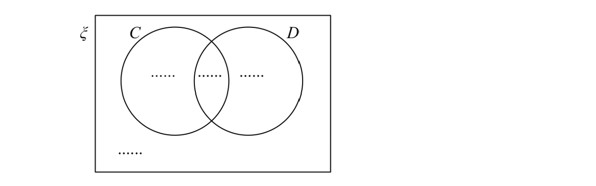

## Q6 — easy — 2 marks · exam-questions

### 4() — 2 marks — command: list — structured — from paper Jan 2021 · 4MA1/1H
$E$ = {20, 21, 22, 23, 24, 25, 26, 27, 28, 29}

$A$ = {odd numbers}

$B$ = {multiples of 3}

List the members of the set

i) $A\capB$

[1]

ii) $A\cupB$

[1]

## Q7 — easy — 3 marks · exam-questions

### 3((a)) — 2 marks — command: list — structured — from paper Jan 2021 · 4MA1/2HR
$E$ = {21, 22, 23, 24, 25, 26, 27, 28, 29, 30}

$A$ = {22, 24, 26, 28, 30}

$B$ = {21, 24, 27, 30}

List the members of the set

i) $A\capB$

[1]

ii) $A'$

[1]

### 3((b)) — 1 mark — command: find — structured — from paper Jan 2021 · 4MA1/2HR
$C$ = {23, 25, 29}

Using set notation, find an expression for $C$ in terms of $A$ and $B$.

## Q8 — easy — 3 marks · exam-questions

### 4() — 2 marks — command: list — structured — from paper June 2021 · 4MA1/2H
$E$= {letters of the alphabet} 
$B$ = {b, r, a, z, i, l} 
$I$ = {i, r, e, l, a, n, d}

List the members of the set

i) $B\cupI$

[1]

ii) $B\capIʹ$

[1]

### 4((b)) — 1 mark — command: explain — structured — from paper June 2021 · 4MA1/2H
$K$ = {k, e, n, y, a}

Cody writes down the statement $B\capK=\emptyset$ Cody’s statement is wrong.

Explain why.

## Q9 — easy — 3 marks · exam-questions

### 4((a)) — 2 marks — command: list — structured — from paper Jan 2020 · 4MA1/1HR
`table attributes columnalign right center left columnspacing 0px end attributes row B equals cell open curly brackets straight b comma straight l comma straight u comma straight e close curly brackets end cell row G equals cell open curly brackets straight g comma straight r comma straight e comma straight y close curly brackets end cell row W equals cell open curly brackets straight w comma straight h comma straight i comma straight t comma straight e close curly brackets end cell end table`

List all the members of the set

i) $B\cupG$

[1]

ii) $W\capG'$

[1]

### 4((b)) — 1 mark — command: give — structured — from paper Jan 2020 · 4MA1/1HR
Serena writes down the statement $B\capG\capW=\emptyset$

Is Serena’s statement correct? 
You must give a reason for your answer.

## Q10 — easy — 2 marks · exam-questions

### 1((a)) — 2 marks — command: list — structured — from paper Nov 2020 · 4MA1/1H
The numbers from $1$ to $14$ are shown in the Venn diagram.

i) List the members of the set $A\capB$

[1]

ii) List the members of the set $Bʹ$

[1]

## Q11 — easy — 4 marks · exam-questions

### 3((a)) — 1 mark — command: explain — structured — from paper June 2019 · 4MA1/2H
`table attributes columnalign right center left columnspacing 0px end attributes row cell calligraphic E space end cell equals cell space open curly brackets 1 comma 2 comma 3 comma 4 comma 5 comma 6 comma 7 comma 8 comma 9 comma 10 close curly brackets end cell row cell A space end cell equals cell space open curly brackets 2 comma 3 comma 5 comma 7 close curly brackets end cell row cell B space end cell equals cell thin space open curly brackets 4 comma 6 comma 8 comma 10 close curly brackets end cell end table`

Explain why $A\capB=\emptyset$

### 3((b)) — 1 mark — command: write — structured — from paper June 2019 · 4MA1/2H
$x\inE$and $x\notinA\cupB$

Write down the **two** possible values of $x$.

### 3((c)) — 2 marks — command: list — structured — from paper June 2019 · 4MA1/2H
Set $C$ is such that

`table row cell A space union space B space union space C space end cell equals cell space calligraphic E end cell row cell A space intersection space C space end cell equals cell space open curly brackets 2 close curly brackets end cell row cell B space intersection space C apostrophe space end cell equals cell space open curly brackets 4 space comma space 6 space comma space 10 close curly brackets end cell row blank blank blank end table`

List all the members of set $C$.

## Q12 — easy — 3 marks · exam-questions

### 1((a)) — 1 mark — command: list — structured — from paper 2023 Nov · 4MA1/1H
Here is a Venn diagram.

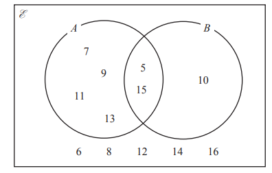

List the members of the set $A$.

### 1((b)) — 1 mark — command: list — structured — from paper 2023 Nov · 4MA1/1H
List the members of the set $A\capB$.

### 1((c)) — 1 mark — command: list — structured — from paper 2023 Nov · 4MA1/1H
List the members of the set `open parentheses A union B close parentheses apostrophe`.

## Q13 — medium — 2 marks · exam-questions

### 1() — 2 marks — command: list — structured
*ξ* = {even numbers}

*A* = {factors of 8}

*B *= {factors of 20}

List the members of the set *A* ∪ *B.*

## Q14 — medium — 3 marks · exam-questions

### 1() — 3 marks — command: complete — structured
In a restaurant, customers must choose at least one item on the menu from a starter, a main or a dessert. There are 100 customers in the restaurant. Of these customers

13 have a starter, a main and a dessert

20 have both a starter and a main

55 have both a main and a dessert

All customers who have a starter also have a main

98 have a main

Complete the Venn Diagram to show this information.

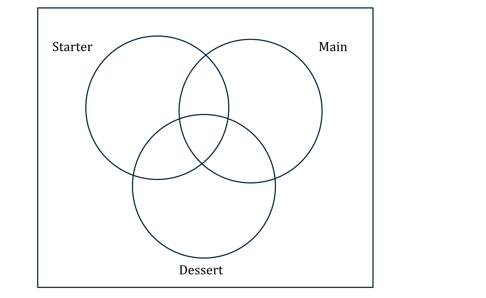

## Q15 — medium — 4 marks · exam-questions

### 1() — 1 mark — command: write — structured
*ξ* = {Students in year 12}

*G* = {Students who study German}

*F* = {Students who study French}

*M* = {Students who study Maths}

*G* ∩ *M* = ∅

Use this information to write a statement about the students who study German in Year 12.

### 2() — 1 mark — command: use — structured
Preety is a student in Year 12,

Preety ∉ *F*.

Use this information to write a statement about Preety.

### 3() — 2 marks — command: list — structured
*A* = {2, 4, 6, 8, 10}

*A* ∩ *B* = {2, 4}

*A* ∪* B* = {1, 2, 3, 4, 6, 8, 10}

List all the members of set *B*.

## Q16 — medium — 3 marks · exam-questions

### 1() — 2 marks — command: list — structured
*A* = {s, u, p, e, r}

*B* = {c, o, m, p, u, t, e, r}

List the members of the set

i) *A* ∩ *B*,

[1]

ii) *A *∪* B*.

[1]

### 2() — 1 mark — command: explain — structured
*X* = {prime numbers}

*Y* = {factors of 12}

Is it true that *X* ∩ *Y* = ∅?

Tick (✔) the appropriate box.

◻  Yes           ◻ No

Explain your answer.

## Q17 — medium — 1 marks · exam-questions

### 1() — 1 mark — command: list — structured
*ξ* = {1, 2, 3, 4, 5, 6, 7, 8, 9, 10, 11, 12}

*A* = {odd numbers}

*P* = {prime number}

List the members of the set *A* ∩ *P*.

## Q18 — medium — 3 marks · exam-questions

### 1() — 2 marks — command: complete — structured
*A*, *B* and *C* are three sets.

*A* ∩ *B* = ∅ and *C* ⊂ *A*

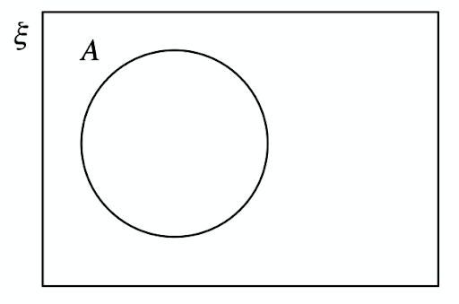

Complete the Venn diagram to show the sets *B* and *C*.

### 2() — 1 mark — structured
On the Venn diagram, shade the region that represents *A* ∩ *C’.*

## Q19 — medium — 4 marks · exam-questions

### 1() — 1 mark — command: find — structured
The Venn diagram shows a universal set *ξ* and three sets *A*, *B* and *C.*

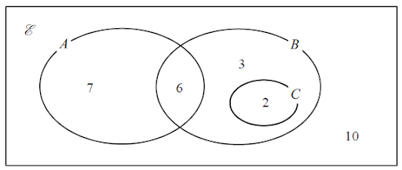

7, 6, 3, 2 and 10 represent the **number** of elements in each set.

Find

n(*A* ∪ *B*)

### 2() — 1 mark — structured
n(*A’*)

### 3() — 1 mark — structured
n(*B* ∩ *C’*)

### 4() — 1 mark — structured
n(*A'* ∪* B’*)

## Q20 — medium — 2 marks · exam-questions

### 1() — 2 marks — command: list — structured
*ξ* = {whole numbers}

*A* = {factors of 100}

*B* = {multiples of 5}

List the members of the set *A* ∩ *B.*

## Q21 — medium — 4 marks · exam-questions

### 1() — 1 mark — command: explain — structured
*ξ* = {1, 2, 3, 4, 5, 6, 7, 8, 9}

*A* = {1, 3, 5, 7}

*B* = {2, 4, 6, 8}

Explain why *A* ∩ *B* = ∅.

### 2() — 1 mark — command: write — structured
*x* ∈ *ξ**** ***and *x* ∉ *A* ∪* B.*

Write down the value of *x*.

*x *= ………………………………………

### 3() — 2 marks — command: list — structured
*A* ∩ *C* = {3, 7}, *B* ∩ *C* = {8} and *A* ∪* B *∪* C* = *ξ.*

List all the members of *C.*

## Q22 — medium — 3 marks · exam-questions

### 1() — 2 marks — command: list — structured
*ξ* = {positive whole numbers **less than** 19}

*A* = {odd numbers}

*B *= {multiples of 5}

*C* = {multiples of 4}

List the members of the set

i) *A* ∩ *B’*,

ii) *B *∪* C*.

### 2() — 1 mark — command: explain — structured
*D *= {prime numbers}

Is it true that *C* ∩ *D *= ∅?

Tick (✔) the appropriate box.

◻ Yes       ◻ No

Explain your answer.

## Q23 — medium — 4 marks · exam-questions

### 1() — 1 mark — command: list — structured
*ξ* = {1, 2, 3, 4, 5, 6, 7, 8, 9, 10}

*A* = {even numbers}

*B* = {multiples of 3}

List the members of set *B’*.

### 2() — 1 mark — command: find — structured
Find n(*A’* ∩ *B*).

### 3() — 2 marks — command: what — structured
*x* is a member of *ξ,*

*x* ∈* B, *

*x *∉* A.*

What are the possible values of *x*?

## Q24 — medium — 5 marks · exam-questions

### 1() — 3 marks — command: complete — structured
*A* and *B* are two sets.

n(*ξ*) = 36

n(*B*) = 21

n(*A* ∩ *B*) = 8

n(*A*’) = 18

Complete the Venn diagram to show the **number of elements** in each region.

### 2() — 2 marks — command: find — structured
Find

i) n(*A* ∪ *B*)

ii) n(*A *∩ *B’*)

## Q25 — medium — 4 marks · exam-questions

### 1() — 2 marks — command: complete — structured
The Venn diagram shows a universal set *ξ* and three sets *X*, *Y* and *Z.*

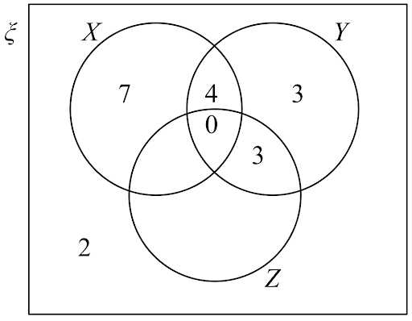

The numbers shown represent the **numbers** of elements.

n(*X*’) = 14

*n(Z) = 14*

Complete the Venn diagram.

### 2() — 2 marks — command: find — structured
Find

i) n(*X* ∪ *Z*)

ii) n(*X *∩ *Y’*)

## Q26 — medium — 4 marks · exam-questions

### 17() — 1 mark — command: find — structured — from paper Jan 2022 · 4MA1/1HR
The Venn diagram shows a universal set $E$ and three sets $A,B$ and $C$.

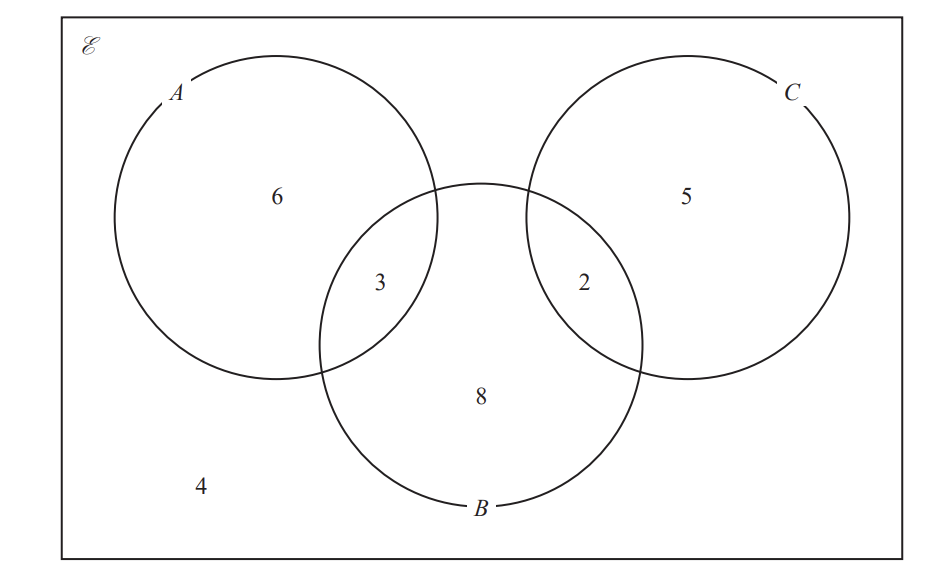

6, 3, 8, 2, 5 and 4 represent the **numbers **of elements.

Find

$n(A\cupB)$

### 17((i)) — 1 mark — structured — from paper Jan 2022 · 4MA1/1HR
$n(A\capB)$

### 17() — 1 mark — structured — from paper Jan 2022 · 4MA1/1HR
$n(B\capC')$

### 17() — 1 mark — structured — from paper Jan 2022 · 4MA1/1HR
$n(A'\cupB'\cupC')$

## Q27 — medium — 3 marks · exam-questions

### 19() — 3 marks — command: find — structured — from paper June 2021 · 4MA1/1H
The Venn diagram shows a universal set, $E$ and sets $A,B$ and $C.$

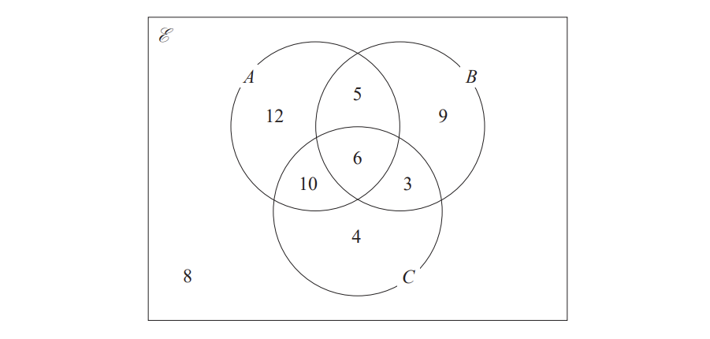

12, 5, 9, 10, 6, 3, 4 and 8 represent the **numbers **of elements.

Find

i) $n(A\cupB)$

[1]

ii) $n(Aʹ\capBʹ)$

[1]

iii) `n left parenthesis left square bracket A space intersection space B right square bracket space union space C right parenthesis`

[1]

## Q28 — hard — 4 marks · exam-questions

### 1() — 2 marks — command: complete — structured
*A* and *B* are two sets.

n(*ξ*) = 37

n(*A*) = 22

n(*A* ∩ *B*) = 12

n(*A* ∪* B*) = 30

Complete the Venn diagram to show the **number of elements** in each region.

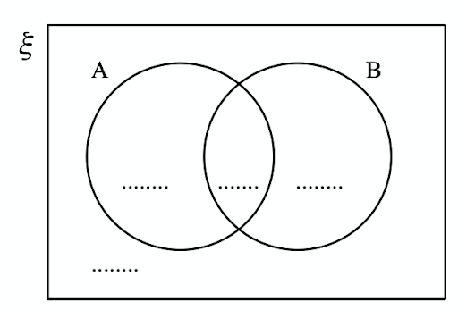

### 2() — 2 marks — command: find — structured
Find

i) n(*A* ∩ *B′*)

ii) n(*A′* ∪* B′*)

## Q29 — hard — 4 marks · exam-questions

### 1() — 4 marks — command: work_out — structured
There are 31 students in a class.

The only languages available for the class to study are French and Spanish.

17 students study French.

15 students study Spanish.

6 students study neither French not Spanish.

Using a Venn diagram, or otherwise, work out how many students study only one language.

## Q30 — hard — 4 marks · exam-questions

### 1() — 4 marks — command: find — structured
A garage tests cars for faults.** **

There are three types of fault – braking, steering and lighting.

A car fails the test if it has one or more of these three types of fault.

Last week, 11 cars had breaking faults,

9 cars had steering faults,

7 cars had lighting faults,

no car had both steering faults and lighting faults,

2 cars had both braking faults and steering faults,

3 cars had both braking faults and lighting faults.

By drawing a Venn diagram, or otherwise, find the number of cars which failed the test last week.

## Q31 — hard — 3 marks · exam-questions

### 1() — 2 marks — command: list — structured
*ξ* = {positive whole numbers **less than** 13}

*A* = {even numbers}

*B *= {multiples of 3}

*C* = {prime numbers}

List the members of the set

i) *A′* ∩ *B′*,

ii) *B *∪* C*.

### 2() — 1 mark — command: explain — structured
Is it true that 14 ∈ *A*?

Tick (✔) the appropriate box.

◻ Yes         ◻ No

Explain your answer.

## Q32 — hard — 4 marks · exam-questions

### 1() — 1 mark — command: find — structured
The Venn diagram shows a universal set *ξ* and three sets *A*, *B* and *C.*

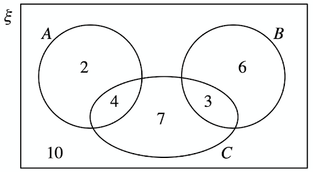

2, 4, 7, 3, 6 and 10 represent the **number** of elements in each set.

Find

n(*A* ∩ *B*)

### 2() — 1 mark — structured
n(*B′*)

### 3() — 1 mark — structured
n(*A* ∩ *C′*)

### 4() — 1 mark — structured
n(*B′* ∩ *C′*)

## Q33 — hard — 4 marks · exam-questions

### 1() — 1 mark — command: write — structured
The Venn diagram shows all of the elements in sets *A*, *B* and *ξ*.

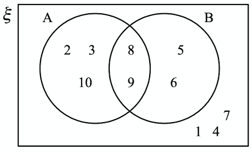

Write down the elements in *A′*,

### 2() — 1 mark — command: find — structured
Find n(*A* ∩ *B*)′,

### 3() — 1 mark — command: find — structured
Find the elements in (*A* ∩ *B*) ∪ (*A* ∪ *B*)′,

### 4() — 1 mark — command: write — structured
*A* ∩ *C* = ∅

*B* ∪ *C* = {5, 6, 7, 8, 9}

n(*C*) = 3

Write down the elements in *C*.

## Q34 — hard — 4 marks · exam-questions

### 1() — 2 marks — structured
On the Venn diagram, shade the set (*A* ∪ *B*) ∩ *C′*.

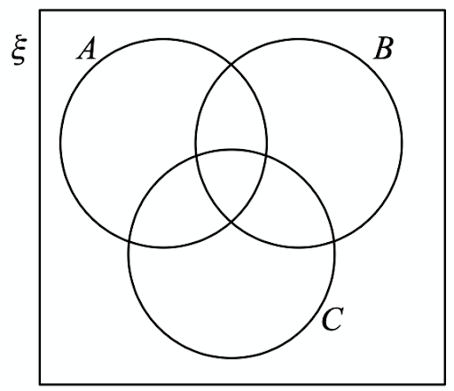

### 2() — 2 marks — command: use — structured
Use set notation to describe the shaded region in the Venn diagram below.

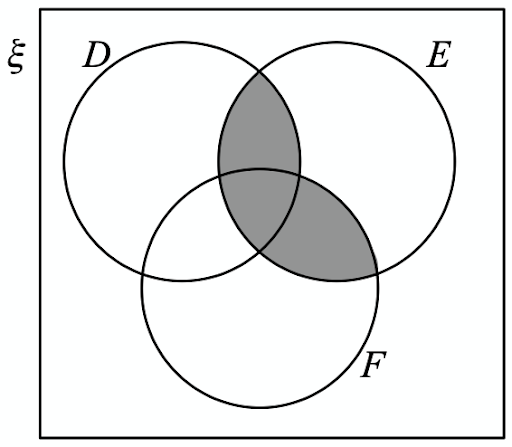

## Q35 — hard — 5 marks · exam-questions

### 1() — 2 marks — command: complete — structured
*ξ* = {1, 2, 3, 4, 5, 6, 7, 8, 9, 10, 11, 12, 13}

*A* = {3, 7, 11, 13}

*B *= {3, 6, 9, 12, 13}

*C* = {2, 3, 5, 6, 7, 8}

Complete the Venn diagram

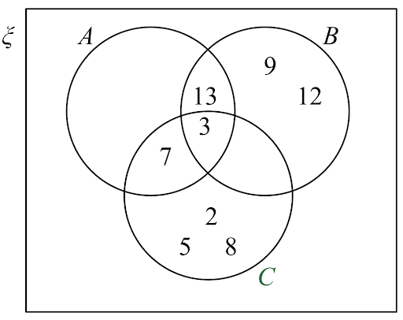

### 2() — 1 mark — command: list — structured
List the members of the set *B′ *∩ *C.*

### 3() — 1 mark — command: list — structured
List the members of the set (*A* ∪ *C*)′ ∩ *B*.

### 4() — 1 mark — command: find — structured
Find n(*A′*∩ *B′)*

## Q36 — hard — 3 marks · exam-questions

### 1() — 3 marks — command: complete — structured
Each student in a group of 32 students was asked the following question.

“Do you have a desktop computer (*D*), a laptop (*L*) or a tablet (*T*)?”

Their answers showed that,

19 students have a desktop computer,

17 students have a laptop,

16 students have a tablet,

9 students have both a desktop computer and a laptop,

11 students have both a desktop computer and a tablet,

7 students have both a laptop and a tablet,

5 students have all three.

Using this information, complete the Venn diagram to show the number of students in each appropriate subset.

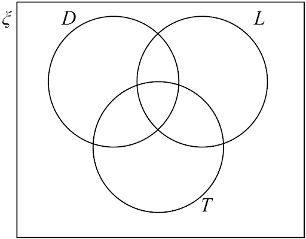

## Q37 — hard — 6 marks · exam-questions

### 16((a)) — 3 marks — structured — from paper Jan 2021 · 4MA1/2H
Some students were asked the following question.

“Which of the subjects Russian (*R*), French (*F*) and German (*G*) do you study?”

Of these students

4 study all three of Russian, French and German 
10 study Russian and French 
13 study French and German 
6 study Russian and German 
24 study German 
11 study none of the three subjects 
the number who study Russian only is twice the number who study French only.

Let $x$ be the number of students who study French only.

Show all this information on the Venn diagram, giving the number of students in each appropriate subset, in terms of $x$ where necessary.

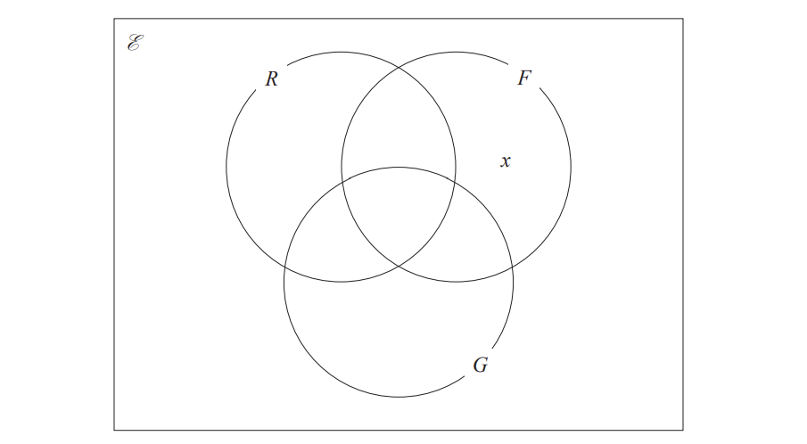

### 16((b)) — 3 marks — command: work_out — structured — from paper Jan 2021 · 4MA1/2H
Given that the number of students who were asked the question was 80, work out the number of these students that study Russian.

## Q38 — hard — 3 marks · exam-questions

### 7() — 3 marks — command: complete — structured — from paper Jan 2022 · 4MA1/1H
$E$ = {4, 5, 6, 7, 8, 9, 10, 11, 12, 13, 14, 15}

$A\capB$ = {5, 10, 15}

$B'$= {7, 8, 9, 11, 12, 13, 14}

$A'$= {4, 6, 7, 8, 14}

Complete the Venn diagram for this information.

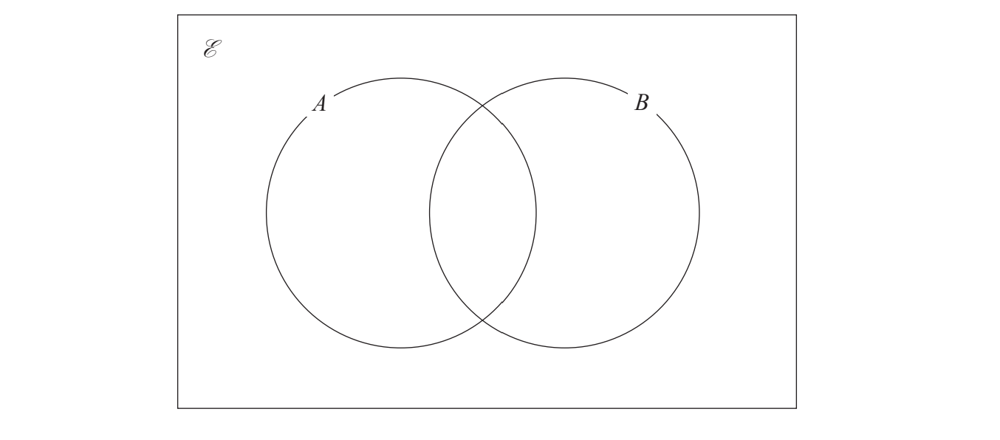

## Q39 — hard — 6 marks · exam-questions

### 17((a)) — 3 marks — command: complete — structured — from paper Jan 2020 · 4MA1/2HR
Some students in a school were asked the following question.

“Do you have a dog ($D$), a cat ($C$) or a rabbit ($R$)?”

Of these students

28 have a dog    
18 have a cat    
20 have a rabbit     
8 have both a cat and a rabbit     
9 have both a dog and a rabbit     
$x$ have both a dog and a cat     
6 have a dog, a cat and a rabbit     
5 have not got a dog or a cat or a rabbit

Using this information, complete the Venn diagram to show the number of students in each appropriate subset. Give the numbers in terms of $x$ where necessary.

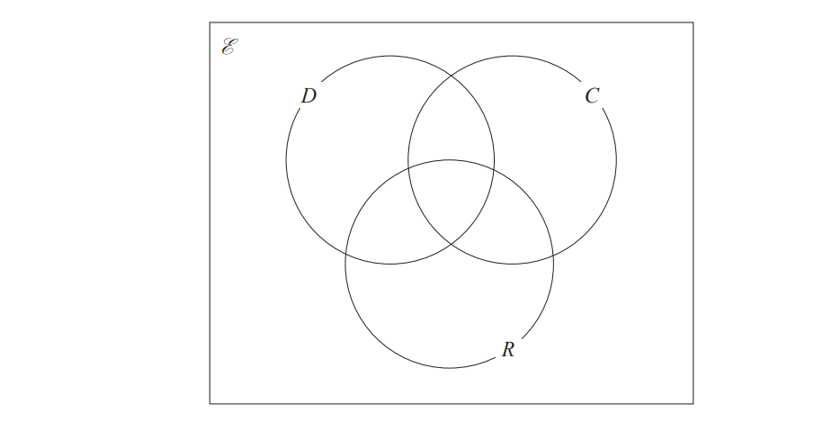

### 17((b)) — 2 marks — command: work_out — structured — from paper Jan 2020 · 4MA1/2HR
Given that a total of 50 students answered the question,

work out the value of $x$.

$x$ = ........................

### 17((c)) — 1 mark — command: find — structured — from paper Jan 2020 · 4MA1/2HR
Find  $n(Cʹ\capDʹ)$

## Q40 — hard — 3 marks · exam-questions

### 13() — 3 marks — command: work_out — structured — from paper Specimen paper · 4MA1/2H
In a school, students must study at least one language from German, French and Spanish.

There are 30 students in a class of this school.
Of these students

7 study all three of the languages 
10 study both German and French 
12 study both Spanish and German 
9 study both French and Spanish 
16 study Spanish 
18 study German

Work out the total number of the students in the class who study French. 
You may use the Venn diagram to help with your calculations.

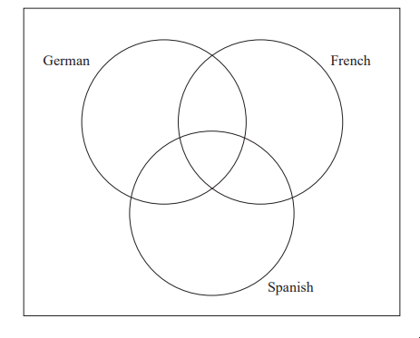

## Q41 — hard — 3 marks · exam-questions

### 16((a)) — 1 mark — command: find — structured — from paper 2023 June · 4MA1/1H
The Venn diagram shows a universal set $E$ and sets $A,B$ and $C$.

The numbers and the letter $x$ represent **numbers** of elements.

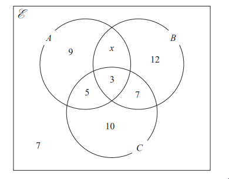

Given that `straight n open parentheses A union B close parentheses` = 42

find the value of $x$.

### 16((b)) — 1 mark — command: find — structured — from paper 2023 June · 4MA1/1H
Find  `n open parentheses A apostrophe close parentheses`

### 16((c)) — 1 mark — command: find — structured — from paper 2023 June · 4MA1/1H
Find `straight n open parentheses B apostrophe intersection C close parentheses`
