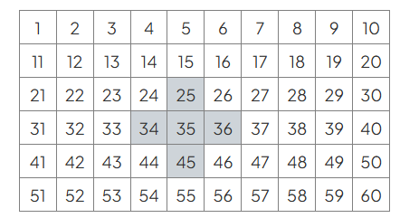

# Exam Questions — Algebraic Proof
**Equations, Formulae & Identities** · Edexcel IGCSE Maths A (4MA1) — 18/Higher
> Source: [https://www.savemyexams.com/igcse/maths/edexcel/a/18/higher/topic-questions/2-equations-formulae-and-identities/algebraic-proof/exam-questions/](https://www.savemyexams.com/igcse/maths/edexcel/a/18/higher/topic-questions/2-equations-formulae-and-identities/algebraic-proof/exam-questions/) · 41 questions · total 142 marks

## Q1 — medium — 3 marks · exam-questions

### 21((b)) — 3 marks — command: prove — structured — from paper 2014 June · 1MA0/2H
Prove algebraically that

$(2n+1)^{2}-(2n+1)$ is an even number

for all positive integer values of $n$.

## Q2 — medium — 3 marks · exam-questions

### 20() — 3 marks — command: prove — structured — from paper 2015	June · 1MA0/2H
Show that `open parentheses n plus 3 close parentheses squared space minus space open parentheses n minus 3 close parentheses squared`  is an even number for all positive integer values of $n$.

## Q3 — medium — 4 marks · exam-questions

### 16() — 4 marks — command: prove — structured — from paper 2017	June · 1MA1/1H
$n$ is an integer greater than $1$

Prove algebraically that  `n squared space minus space 2 space minus space open parentheses space n minus 2 close parentheses squared` is always an even number.

## Q4 — medium — 3 marks · exam-questions

### 17() — 3 marks — command: prove — structured — from paper Jan 2020 · 4MA1/2H
Prove that the difference between two consecutive square numbers is always an odd number. 
Show clear algebraic working.

## Q5 — medium — 3 marks · exam-questions

### 25() — 3 marks — command: prove — structured — from paper Jan 2020 · 4MA1/2HR
$N$ is a multiple of 5

`table row cell A space end cell equals cell space N space plus space 1 end cell row cell B space end cell equals cell space N space – space 1 end cell end table`

Prove, using algebra, that $A^{2}--B^{2}$ is always a multiple of 20

## Q6 — medium — 2 marks · exam-questions

### 5() — 2 marks — command: give — structured — from paper June 2018 · 4MA1/1HR
$E=n^{2}+n+5$

Ali thinks that the value of $E$ will be a prime number for any whole number value of $n$.

Is Ali correct? 
You must give a reason for your answer.

## Q7 — medium — 4 marks · exam-questions

### 10() — 4 marks — command: tick — structured — from paper Nov 2021 · 8300/2H
$p$ is a positive number.

$n$ is a negative number.

For each statement, tick the correct box.

|   | **Always true** | **Sometimes true** | **Never true** |
|---|---|---|---|
| $p+n$ is positive | `square` | `square` | `square` |
| $p-n$ is positive | `square` | `square` | `square` |
| $p^{2}+n^{2}$ is positive | `square` | `square` | `square` |
| $p^{3}\divn^{3}$ is positive | `square` | `square` | `square` |

## Q8 — medium — 4 marks · exam-questions

### 21() — 4 marks — command: prove — structured — from paper Nov 2021 · 8300/2H
$x$ is an integer.

Prove that  $35+(3x+1)^{2}--2x(4x--3)$  is a square number.

## Q9 — medium — 1 marks · exam-questions

### 1() — 1 mark — command: which — structured — from paper Nov 2020 · 8300/2H
Which of these is a correct identity?

Circle your answer.

| $x+4x\equiv5x$ | $6x\equiv18$ | $2x+1\equiv7$ | $7x+9\equivx$ |
|---|---|---|---|

## Q10 — medium — 3 marks · exam-questions

### 7() — 3 marks — command: prove — structured — from paper Nov 2018 · 8300/3H
$k=n^{2}+9n+1$

Mo says,    “$k$ will be a prime number for all integer values of $n$ from 1 to 9”

Show that Mo is wrong. 
You **must** show that your value of $k$ is **not** prime.

## Q11 — medium — 1 marks · exam-questions

### 12((b)) — 1 mark — command: give — structured — from paper Specimen 2015 · 8300/3H
Tick whether the following statement is true or false.

Give a reason for your answer.

When $n$ is a positive integer, the value of $2n$ is **always** a factor of the value of $20n$.

True    `begin mathsize 26px style square end style`      False    `begin mathsize 26px style square end style`

## Q12 — medium — 4 marks · exam-questions

### 13() — 4 marks — command: prove — structured — from paper June 2019 · J560/06
Prove that the mean of any four consecutive even integers is an integer.

## Q13 — medium — 5 marks · exam-questions

### 8((a)) — 3 marks — command: prove — structured — from paper Specimen 2015 · J560/06
Prove that the sum of four consecutive whole numbers is always even.

### 8((b)) — 2 marks — command: give — structured — from paper Specimen 2015 · J560/06
Give an example to show that the sum of four consecutive integers is **not** always divisible by 4.

## Q14 — hard — 3 marks · exam-questions

### 1() — 3 marks — command: prove — structured
Prove that

`open parentheses 2 n space plus space 3 close parentheses squared space minus space open parentheses 2 n space minus space 3 close parentheses squared`  is a multiple of $8$

for all positive integer values of $n$.

## Q15 — hard — 4 marks · exam-questions

### 12() — 4 marks — command: prove — structured — from paper 2018 June · 1MA1/1H
Prove that the square of an odd number is always 1 more than a multiple of 4

## Q16 — hard — 4 marks · exam-questions

### 24() — 4 marks — command: prove — structured — from paper 2016 November · 1MA0/2H
Prove that , for all positive values of $n$,

`fraction numerator open parentheses n space plus 2 space close parentheses squared space minus space open parentheses n space plus 1 close parentheses squared over denominator 2 n squared space plus space 3 n end fraction space equals space 1 over n`

## Q17 — hard — 4 marks · exam-questions

### 1() — 4 marks — command: prove — structured
Prove algebraically that the difference between the squares of any two consecutive integers is equal to the sum of these two integers.

## Q18 — hard — 4 marks · exam-questions

### 15() — 4 marks — command: prove — structured — from paper Jan 2021 · 4MA1/2HR
Prove algebraically that the product of any two odd numbers is always an odd number.

## Q19 — hard — 4 marks · exam-questions

### 24((a)) — 1 mark — command: prove — structured — from paper June 2018 · 4MA1/1HR
Show that `x left parenthesis x space minus space 1 right parenthesis space open parentheses x space plus space 1 close parentheses equals space x cubed space minus space x`

### 24((b)) — 3 marks — command: prove — structured — from paper June 2018 · 4MA1/1HR
Prove that the difference between a whole number and the cube of this number is always a multiple of $6$

## Q20 — hard — 4 marks · exam-questions

### 20() — 4 marks — command: prove — structured — from paper Specimen 2016 · 4MA1/1H
Prove algebraically that the difference between the squares of any two consecutive odd numbers is always a multiple of 8

## Q21 — hard — 4 marks · exam-questions

### 21() — 4 marks — command: prove — structured — from paper Nov 2019 · 8300/2H
$n$ is the middle integer of three consecutive positive integers.

The three integers are multiplied to give a product.

$n$ is then added to the product.

Prove that the result is a cube number.

## Q22 — hard — 4 marks · exam-questions

### 20() — 4 marks — command: prove — structured — from paper June 2019 · 8300/2H
Expressions for consecutive triangular numbers are

`fraction numerator n open parentheses n plus 1 close parentheses over denominator 2 end fraction` and `fraction numerator open parentheses n plus 1 close parentheses open parentheses n plus 2 close parentheses over denominator 2 end fraction`

Prove that the sum of two consecutive triangular numbers is always a square number.

## Q23 — hard — 3 marks · exam-questions

### 20() — 3 marks — command: prove — structured — from paper Nov 2018 · 8300/2H
$n$ is a positive integer.

Prove algebraically that  `2 n squared open parentheses 3 over n plus space n close parentheses space plus space 6 n space open parentheses n squared space minus 1 close parentheses` is a cube number.

## Q24 — hard — 2 marks · exam-questions

### 26() — 2 marks — command: why — structured — from paper Nov 2017 · 8300/3H
$a^{2}--b^{2}\equiv(a+b)(a--b)$

$a$ and $b$ are positive whole numbers with $a>b$

$a^{2}--b^{2}$ is a **prime** number.

Why are $a$ and $b$ consecutive numbers?

## Q25 — hard — 3 marks · exam-questions

### 16() — 3 marks — command: prove — structured — from paper Specimen 2015 · 8300/2H
$c$ is a positive integer.

Prove that  $\frac{6c^{3}+30c}{3c^{2}+15}$  is an even number.

## Q26 — hard — 3 marks · exam-questions

### 11((b)) — 3 marks — command: prove — structured — from paper Specimen 2015 · J560/04
The lengths of the sides of a right-angled triangle are all integers. Prove that if the lengths of the two shortest sides are even, then the length of the third side must also be even.

## Q27 — hard — 4 marks · exam-questions

### 20((a)) — 2 marks — command: simplify — structured — from paper Specimen 2015 · J560/04
Express as a single fraction.

$\frac{m+1}{n+1}-\frac{m}{n}$

Simplify your answer.

### 20((b)) — 2 marks — command: prove — structured — from paper Specimen 2015 · J560/04
Using your answer to part (**a**), prove that if m and n are positive integers and $m<n$, then

$\frac{m+1}{n+1}-\frac{m}{n}>0$

## Q28 — hard — 4 marks · exam-questions

### 20() — 4 marks — command: prove — structured — from paper Specimen paper · 4MA1/1H
Prove algebraically that the difference between the squares of any two consecutive odd numbers is always a multiple of 8

## Q29 — very_hard — 3 marks · exam-questions

### 14((c)) — 3 marks — command: factorise — structured — from paper 2012 November · 1MA0/2H
(i) Factorise $2t^{2}+5t+2$.

[2]

(ii) $t$ is a positive whole number.

The expression $2t^{2}+5t+2$ can never have a value that is a prime number.
Explain why.

[1]

## Q30 — very_hard — 2 marks · exam-questions

### 17() — 2 marks — command: prove — structured — from paper 2017	November · 1MA1/1H
$n$ is an integer.

Prove algebraically that the sum of  $\frac{1}{2}n(n+1)$ and $\frac{1}{2}(n+1)(n+2)$ is always a square number.

## Q31 — very_hard — 6 marks · exam-questions

### 22() — 6 marks — command: prove — structured — from paper 2015 Spec1 · 1MA1/3H
Here are the first five terms of an arithmetic sequence.

7      13      19      25      31

Prove that the difference between the squares of any two terms of the sequence is always a multiple of 24.

## Q32 — very_hard — 2 marks · exam-questions

### 13() — 2 marks — command: prove — structured — from paper June 2019 · 1MA1/1H
Given that $n$ can be any integer such that $n>1$, prove that $n^{2}-n$ is never an odd number.

## Q33 — very_hard — 3 marks · exam-questions

### 1() — 3 marks — command: prove — structured — from paper 2015	Spec2 · 17
The product of two consecutive positive integers is added to the larger of the two integers.

Prove that the result is always a square number.

## Q34 — very_hard — 4 marks · exam-questions

### 1() — 4 marks — command: show — structured
A square ABCD is in a circle with the corners touching the circumference.

Use algebraic proof to show that the fraction of the circle that is taken up by square is $\frac{2}{π}$.

## Q35 — very_hard — 3 marks · exam-questions

### 18() — 3 marks — command: prove — structured — from paper Jan 2022 · 4MA1/2H
Prove that when the sum of the squares of any two consecutive odd numbers is divided by 8, the remainder is always 2 
Show clear algebraic working.

## Q36 — very_hard — 3 marks · exam-questions

### 15() — 3 marks — command: prove — structured — from paper Jan 2022 · 4MA1/1HR
Using algebra, prove that, given any 3 consecutive whole numbers, the sum of the square of the smallest number and the square of the largest number is always 2 more than twice the square of the middle number.

## Q37 — very_hard — 3 marks · exam-questions

### 17() — 3 marks — command: prove — structured — from paper June 2021 · 4MA1/1H
Using algebra, prove that, given any 3 consecutive even numbers, the difference between the square of the largest number and the square of the smallest number is always 8 times the middle number.

## Q38 — very_hard — 5 marks · exam-questions

### 12((a)) — 2 marks — command: write — structured — from paper Jan 2019 · 4MA1/1HR
Here are the first four terms of a sequence of fractions.

$\frac{1}{1}\frac{2}{3}\frac{3}{5}\frac{4}{7}$

The numerators of the fractions form the sequence of whole numbers $1234...$ 
The denominators of the fractions form the sequence of odd numbers $1357...$

Write down an expression, in terms of $n$, for the $n\mathrm{th}$ term of this sequence of fractions.

### 13((b)) — 3 marks — command: prove — structured — from paper Jan 2019 · 4MA1/1HR
Using algebra, prove that when the square of any odd number is divided by $4$ the remainder is $1$

## Q39 — very_hard — 4 marks · exam-questions

### 17() — 4 marks — command: prove — structured — from paper June 2019 · 4MA1/2HR
The table gives information about the first six terms of a sequence of numbers.

| **  Term number** | 1 | 2 | 3 | 4 | 5 | 6 |
|---|---|---|---|---|---|---|
| **  Term of sequence** | $\frac{1\times2}{2}$ | $\frac{2\times3}{2}$ | $\frac{3\times4}{2}$ | $\frac{4\times5}{2}$ | $\frac{5\times6}{2}$ | $\frac{6\times7}{2}$ |

Prove algebraically that the sum of any two consecutive terms of this sequence is always a square number.

## Q40 — very_hard — 3 marks · exam-questions

### 27() — 3 marks — command: prove — structured — from paper June 2017 · 8300/3H
Prove that $x^{2}+x+1$ is always positive.

## Q41 — very_hard — 7 marks · exam-questions

### 14((a)) — 2 marks — command: prove — structured — from paper Nov 2017 · J560/06
The diagram shows a cross placed on a number grid.

$L$ is the product of the left and right numbers of the cross.
 $T$ is the product of the top and bottom numbers of the cross.
 $M$ is the middle number of the cross.

Show that when $M=35,L--T=99.$

### 14((b)) — 5 marks — command: prove — structured — from paper Nov 2017 · J560/06
Prove that, for any position of the cross on the number grid above, $L--T=99.$
