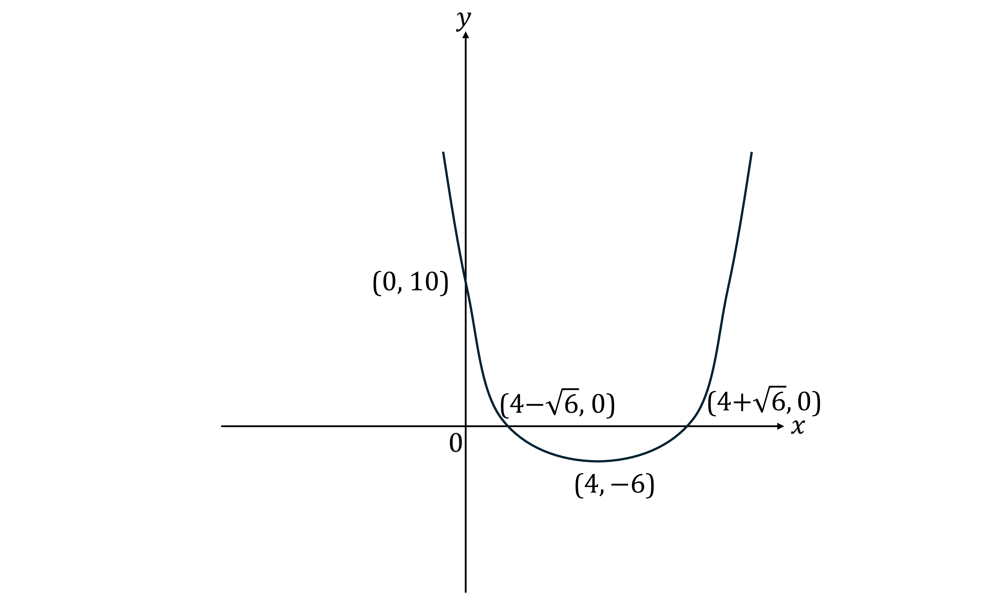
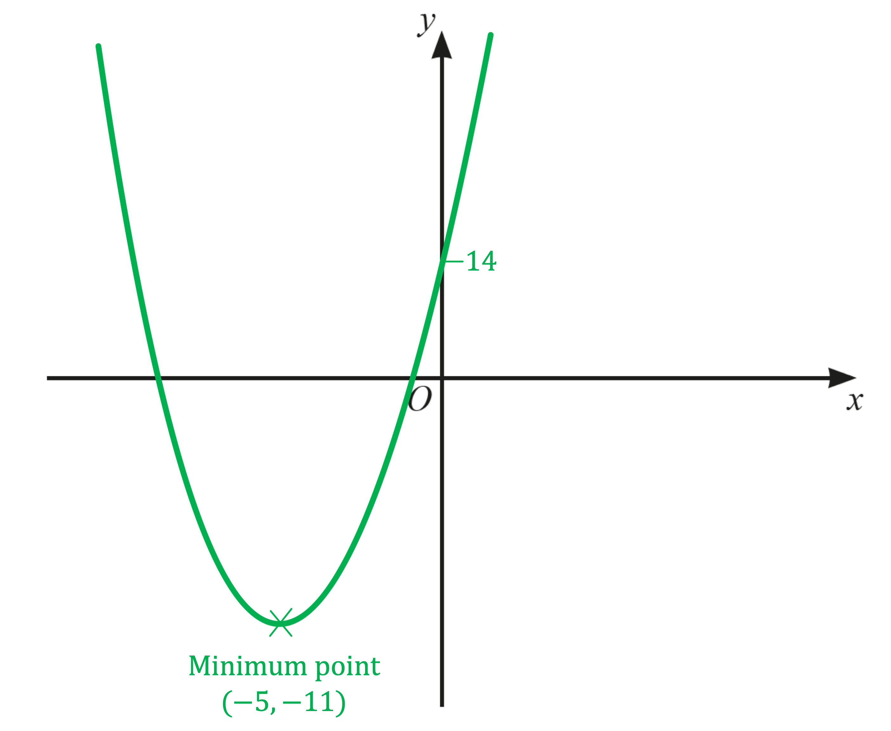

# Mark Schemes — Completing the Square
**Equations, Formulae & Identities** · Edexcel IGCSE Maths A (4MA1) — 18/Higher

## Q1 — medium — 2 marks · exam-questions

### 13() — 2 marks
> *The formula for completing the square for a quadratic in the form*$x^{2}+bx+c$*is*`space space open parentheses x space plus space b over 2 close parentheses squared space space minus space open parentheses b over 2 close parentheses squared space plus space c`*.*

> *Complete the square by dividing the middle term (6) by 2.*

`table row cell x squared space plus space 6 x space minus space 7 space end cell equals cell space open parentheses x space plus 6 over 2 close parentheses to the power of 2 space end exponent minus open parentheses 6 over 2 close parentheses squared space minus space 7 space end cell row blank equals cell space open parentheses x space plus space 3 close parentheses squared space minus space 3 squared space minus space 7 end cell end table`

**Correct expression in the brackets**** [1]**

> *Simplify.*

`table row blank blank cell open parentheses x space plus space 3 close parentheses squared space minus 9 space minus space 7 end cell end table`

`open parentheses bold italic x space plus space 3 close parentheses squared space minus space 16`* ***[1]**

## Q2 — medium — 2 marks · exam-questions

### 11() — 2 marks
> *The formula for completing the square for a quadratic in the form*$x^{2}+bx+c$*is*`space space open parentheses x space plus space b over 2 close parentheses squared space space minus space open parentheses b over 2 close parentheses squared space plus space c`*.*

> *Complete the square by dividing the middle term (2) by 2.*

`table row cell x squared space plus space 2 x space minus space 8 space end cell equals cell space open parentheses x space plus 2 over 2 close parentheses to the power of 2 space end exponent minus open parentheses 2 over 2 close parentheses squared space minus 8 end cell row blank equals cell space open parentheses x space plus space 1 close parentheses squared space minus space 1 squared space minus space 8 end cell end table`

**Correct expression in the brackets**** [1]**

> *Simplify.*

`table row blank blank cell open parentheses x space plus space 1 close parentheses squared space minus 1 space minus space 8 end cell end table`

`open parentheses bold italic x space plus space 1 close parentheses squared space minus space 9`* ***[1]**

## Q3 — medium — 2 marks · exam-questions

### 16((b)) — 2 marks
> *The formula for completing the square for a quadratic in the form*$x^{2}+bx+c$*is*`space space open parentheses x space plus space b over 2 close parentheses squared space space minus space open parentheses b over 2 close parentheses squared space plus space c`*.*

> *Complete the square by dividing the middle term (-10) by 2.*

`table row cell x squared minus 10 x plus 40 end cell equals cell space open parentheses x minus 10 over 2 close parentheses to the power of 2 space end exponent minus open parentheses 10 over 2 close parentheses squared plus 40 space end cell row blank equals cell space open parentheses x minus 5 close parentheses squared minus 5 squared plus 40 end cell end table`

**[1]**

> *Simplify.*

`open parentheses x minus 5 close parentheses squared minus 25 plus 40 equals open parentheses x minus 5 close parentheses squared plus 15`

`open parentheses bold italic x minus 5 close parentheses squared plus 15`* ***[1]**

## Q4 — medium — 1 marks · exam-questions

### 23() — 1 marks
*Quadratic curves given in the form **y** = (**x** + **p**)**2** + **q** have turning points at (-**p**, **q**)* *Use this rule on **y** = (**x** + 3)**2** + 5*

**p*** = -3,  ***q*** = 5*

**(-3, 5)** **[1]**

## Q5 — medium — 3 marks · exam-questions

### 19((a)) — 3 marks
> *The format required is in completed square form. *

> *Compare the given expression to the perfect square (**x -** 5)**2 **= **x**2** - 10**x** + 25. *

> *This has same same first two terms as the given expression, but the third term is 3 more (22 + 3 = 25) so we need to subtract 3 from the perfect square.*

`table row cell x squared space minus space 10 x space plus space 22 space end cell equals cell space open parentheses x space minus space 5 close parentheses squared space minus space 3 end cell end table`

** ****Comparing with (x-5)****2**** [1] **
**Comparing 22 with 25**** [1]**

> *Check by expanding and simplifying.*

`table row cell open parentheses x space minus space 5 close parentheses squared space minus space 3 space end cell equals cell space open parentheses x minus 5 close parentheses open parentheses x minus 5 close parentheses space minus 3 end cell row blank equals cell space x squared space minus space 10 x space plus space 25 space minus space 3 end cell row blank equals cell space x squared space minus space 10 x space plus space 22 end cell end table`

`equation` **[1]**

## Q6 — medium — 3 marks · exam-questions

### 20((a)) — 3 marks
> *The formula for completing the square for a quadratic in the form*$x^{2}+bx+c$*is*`space space open parentheses x space plus space b over 2 close parentheses squared space space minus space open parentheses b over 2 close parentheses squared space plus space c`*.*

> *Complete the square by dividing the middle term (6) by 2.*

`table row cell x squared space minus space 6 x space plus space 11 space end cell equals cell space open parentheses x space minus 6 over 2 close parentheses to the power of 2 space end exponent minus space open parentheses 6 over 2 close parentheses squared space plus space 11 space end cell row blank equals cell space open parentheses x space minus space 3 close parentheses squared space minus space 3 squared space plus space 11 end cell end table`

**Correct expression in the brackets**** [1] **
**Correct comparison outside of brackets**** [1]**

> *Simplify.*

`table row blank blank cell open parentheses x space minus space 3 close parentheses squared space minus 9 space plus space 11 end cell end table`

`open parentheses bold italic x space minus space 3 close parentheses squared space plus space 2`* ***[1]**

## Q7 — medium — 4 marks · exam-questions

### 17((a)) — 4 marks
> *The format required is in completed square form. *

> *Compare the given expression to the perfect square (**x **+ 4)**2 **= **x**2 **+ 8**x** + 16. *

> *This has same same first two terms as the given expression, but the third term is 13 more (16 - 3 = 13) so we need to subtract 13 from the perfect square.*

`table row cell x squared space plus space 8 x space plus space 3 space end cell equals cell space open parentheses x space plus space 4 close parentheses squared space minus space 16 space plus space 3 end cell row blank equals cell space open parentheses x space plus space 4 close parentheses squared space minus space 13 end cell end table`

** ****Comparing with (x+4)****2**** [1]**
**Comparing 16 with 3**** [1]**

> *Check by expanding and simplifying.*

`table row cell open parentheses x space plus space 4 close parentheses squared space minus space 13 space end cell equals cell space open parentheses x plus 4 close parentheses open parentheses x plus 4 close parentheses space minus 13 end cell row blank equals cell space x squared space plus space 8 x space plus space 16 space minus space 13 end cell row blank equals cell space x squared space plus space 8 x space plus space 3 end cell end table`

`equation` **[1]**

## Q8 — medium — 3 marks · exam-questions

### 16() — 3 marks
> *The format required is in completed square form. *

> *Compare the given expression to the perfect square using half of the middle term. *

> *Compare **x**2 **- 10**x** + 16 to (**x **- 5)**2 **= **x**2 **- 10**x** + 25. *

> *This has same same first two terms as the given expression, but the third term is 9 more (25 - 16 = 9) so we need to subtract 9 from the perfect square.*

`table row cell x squared space minus space 10 x space plus space 16 end cell equals cell space open parentheses x space minus space 5 close parentheses squared space minus space 9 end cell end table`

** ****Comparing with (x-5)****2**** [1] **
**Comparing 16 with 9**** [1]**

> *Check by expanding and simplifying.*

`table row cell open parentheses x space minus space 5 close parentheses squared space minus space 9 space end cell equals cell space open parentheses x minus 5 close parentheses open parentheses x minus 5 close parentheses space minus 9 end cell row blank equals cell space x squared space minus space 10 x space plus space 25 space minus space 9 end cell row blank equals cell space x squared space minus space 10 x space plus space 16 end cell end table`

`equation` **[1]**

## Q9 — medium — 2 marks · exam-questions

### 8((c)) — 2 marks
*The result required is in completed square form.*

> *To complete the square, set up a squared bracket with two terms; *$x$* and half of the coefficient of the *$x$* term - in this case 5. *

> *The squared brackets would then produce an extra, unwanted constant term, so we need to subtract this; in this case the unwanted constant would be 5**2** = 25.*

`table attributes columnalign right center left columnspacing 0px end attributes row cell x squared plus 10 x plus 14 end cell equals cell open parentheses x plus 5 close parentheses squared minus 25 plus 14 end cell end table`

**[1]**

`table row blank equals cell open parentheses x plus 5 close parentheses squared minus 11 end cell end table`

`equation` **[1]**

## Q10 — medium — 3 marks · exam-questions

### 13() — 3 marks
> *This question is effectively asking you to "complete the square"*

> *Halve the coefficient of *$x$* and put it in a bracket, squared*

$(x+2)^{2}$

**[1]**

> *Subtract the number in the bracket, squared*

$(x+2)^{2}-4$

> *This is equivalent to *$x^{2}+4x$* (you could check by expanding it), so we just need to subtract 9 to make it equivalent to the original expression*

$(x+2)^{2}-4-9\,(x+2)^{2}-13$

$a=2$**              **
$b=-13$ **[2]**

**3 marks for fully correct answer, 2 marks if either a or b correct**

## Q11 — hard — 4 marks · exam-questions

### 25((a)) — 3 marks
> *The formula for completing the square for a quadratic in the form*$x^{2}+bx+c$*is*`space space open parentheses x space plus space b over 2 close parentheses squared space space minus space open parentheses b over 2 close parentheses squared space plus space c`*.*

> *Complete the square by dividing the middle term (-8) by 2.*

`table row cell x squared space minus space 8 x space plus space 21 space end cell equals cell space open parentheses x space minus space 8 over 2 close parentheses to the power of 2 space end exponent minus open parentheses 8 over 2 close parentheses squared space plus space 21 space end cell row blank equals cell space open parentheses x space minus space 4 close parentheses squared space minus space 4 squared space plus space 21 end cell end table`

**Correct expression in the brackets**** [1] **
**Correct values outside of the brackets (may be simplified) ****[1]**

> *Simplify.*

`table row cell open parentheses x space minus space 4 close parentheses squared space minus space 4 squared space plus space 21 space end cell equals cell space open parentheses x space minus space 4 close parentheses squared space minus space 16 space plus space 21 space end cell row blank equals cell space open parentheses x space minus space 4 close parentheses squared space plus space 5 end cell end table`

$a=4,b=5$* ***[1]**

### 25((b)) — 1 marks
> *M** is the minimum point, or the turning point of the graph. The turning point of *`open parentheses x space minus space a close parentheses to the power of 2 space end exponent plus space b space`*is at the point *$(a,b).$

$a=4,b=5$

$(4,5)$* ***[1]**

## Q12 — hard — 3 marks · exam-questions

### 19() — 3 marks
i) *The expression for the answer is in the form for completing the square.*

> *The formula for completing the square for a quadratic in the form*$x^{2}+bx+c$*is*`space space open parentheses x space plus space b over 2 close parentheses squared space space minus space open parentheses b over 2 close parentheses squared space plus space c`*.*

> *Complete the square by dividing the middle term (-6) by 2.*

`table row cell x squared space minus space 6 x space plus space 1 space end cell equals cell space open parentheses x space minus 6 over 2 close parentheses to the power of 2 space end exponent minus open parentheses 6 over 2 close parentheses squared space plus space 1 space end cell row blank equals cell space open parentheses x space minus space 3 close parentheses squared space minus space 3 squared space plus space 1 end cell end table`

**[1]**

> *Simplify.*

`table row cell open parentheses x space minus space 3 close parentheses squared space minus 3 squared space plus space 1 space end cell equals cell space open parentheses x space minus space 3 close parentheses squared space minus space 9 space plus space 1 space end cell row blank equals cell space open parentheses x space minus space 3 close parentheses squared space minus space 8 end cell end table`

$a=3,b=8$* ***[1]**

ii) *The turning point of *`open parentheses x space minus space a close parentheses to the power of 2 space end exponent minus space b space`*is at the point *$(a,-b).$

$a=3,b=8$

$(3,-8)$* ***[1]**

## Q13 — hard — 2 marks · exam-questions

### 19((b)) — 2 marks
> *The formula for completing the square for a quadratic in the form*$ax^{2}+bx+c$* is *`space space a open parentheses x plus fraction numerator b over denominator 2 a end fraction close parentheses squared minus fraction numerator b squared over denominator 4 a end fraction plus c`*. Applying this formula gives*

`3 x squared plus 12 x plus 19 equals 3 open parentheses x plus fraction numerator 12 over denominator 2 cross times 3 end fraction close parentheses squared minus fraction numerator 12 squared over denominator 4 cross times 3 end fraction plus 19`

**[1]**

> *Simplify.*

`table attributes columnalign right center left columnspacing 0px end attributes row cell 3 x squared plus 12 x plus 19 end cell equals cell 3 open parentheses x plus 2 close parentheses squared minus 12 plus 19 end cell row blank equals cell 3 open parentheses x plus 2 close parentheses squared plus 7 end cell end table`

`therefore 3 bold italic x squared plus 12 bold italic x plus 19 equals 3 open parentheses bold italic x plus 2 close parentheses squared plus 7`* ***[1]**

**i.e.  **$a=3,b=2,c=7$**.**

## Q14 — hard — 3 marks · exam-questions

### 17((c)) — 3 marks
> *The formula for completing the square for a quadratic in the form*$ax^{2}+bx+c$* is *`space space a open parentheses x plus fraction numerator b over denominator 2 a end fraction close parentheses squared minus fraction numerator b squared over denominator 4 a end fraction plus c`*. Applying this formula gives*

`4 x squared minus 8 x plus 7 equals 4 open parentheses x plus fraction numerator negative 8 over denominator 2 cross times 4 end fraction close parentheses squared minus fraction numerator open parentheses negative 8 close parentheses squared over denominator 4 cross times 4 end fraction plus 7`

**[1]**

> *Simplify.*

`table attributes columnalign right center left columnspacing 0px end attributes row cell 4 x squared minus 8 x plus 7 end cell equals cell 4 open parentheses x minus 1 close parentheses squared minus 4 plus 7 end cell row blank equals cell 4 open parentheses x minus 1 close parentheses squared plus 3 end cell end table`

**[1]**

** **`therefore 4 bold italic x squared minus 8 bold italic x plus 7 equals 4 open parentheses bold italic x minus 1 close parentheses squared plus 3`* ***[1]**

**i.e.  **$a=4,b=-1,c=3$**.**

## Q15 — hard — 4 marks · exam-questions

### 23((a)) — 3 marks
> *The formula for completing the square for a quadratic in the form*$ax^{2}+bx+c$* is *`space space a open parentheses x plus fraction numerator b over denominator 2 a end fraction close parentheses squared minus fraction numerator b squared over denominator 4 a end fraction plus c`*. *

> *Applying this formula gives*

`3 x squared minus 12 x plus 7 equals 3 open parentheses x plus fraction numerator negative 12 over denominator 2 cross times 3 end fraction close parentheses squared minus fraction numerator open parentheses negative 12 close parentheses squared over denominator 4 cross times 3 end fraction plus 7`

**[1]**

> *Simplify.*

`table row cell 3 x squared minus 12 x plus 7 end cell equals cell 3 open parentheses x minus 2 close parentheses squared minus 12 plus 7 end cell row blank equals cell 3 open parentheses x minus 2 close parentheses squared minus 5 end cell end table`

**[1] **

`therefore 3 bold italic x squared minus 12 bold italic x plus 7 equals 3 open parentheses bold italic x minus 2 close parentheses squared minus 5`* ***[1]**

**i.e.  **$a=3,b=-2,c=-5$**.**

### 23((b)) — 1 marks
> *Quadratic graphs are parabolas that have a line of symmetry that passes through the turning point.*

> *The quadratic graph *$y=3x^{2}-12x+7$* is a positive quadratic (positive x**2** term) so its turning point will be a minimum point.*

> *The minimum point is found by completing the square.*

`3 x squared minus 12 x plus 7 equals 3 open parentheses x minus 2 close parentheses squared minus 5`

> *The minimum point of *`a open parentheses x plus b close parentheses squared plus c`* is *`open parentheses negative b comma space c close parentheses`*.*

`therefore Min. space point space is space open parentheses 2 comma space minus 5 close parentheses`

*The line of symmetry will be a vertical line passing through this point, but we need its equation for the answer.*

> *Vertical lines have equations of the form *$x=k$*.*

**The line of symmetry L has equation**** **$x=2$ **[1]**

**You could sketch the graph if it helps you to see the symmetry.**

## Q16 — hard — 2 marks · exam-questions

### 21((c)) — 2 marks
> *The formula for **completing the square** for a quadratic in the form*$x^{2}+bx+c$*is*`space space open parentheses x space plus space b over 2 close parentheses squared space space minus space open parentheses b over 2 close parentheses squared space plus space c`*.*

> *Apply the formula, dividing the middle term (*$6\sqrt{2}$*) by 2.  Try not be put off by the surd!*

`table row cell x squared plus 6 square root of 2 x minus 1 end cell equals cell open parentheses x plus fraction numerator 6 square root of 2 over denominator 2 end fraction close parentheses squared minus open parentheses fraction numerator 6 square root of 2 over denominator 2 end fraction close parentheses squared minus 1 space end cell row blank equals cell space open parentheses x plus 3 square root of 2 close parentheses squared space minus space open parentheses 3 square root of 2 close parentheses squared space minus 1 end cell end table`

**[1]**

> *Simplify.*

`table row cell open parentheses x plus 3 square root of 2 close parentheses squared minus open parentheses 3 square root of 2 close parentheses squared plus 1 end cell equals cell space open parentheses x plus 3 square root of 2 close parentheses squared minus 18 minus 1 space end cell row blank equals cell space open parentheses x plus 3 square root of 2 close parentheses squared minus 19 end cell end table`

$\thereforex^{2}+6\sqrt{2}x-1=(x+3\sqrt{2})^{2}-19$* ***[1]**

**i.e.  **$a=3\sqrt{2},b=-19$

## Q17 — hard — 3 marks · exam-questions

### 25() — 3 marks
> *The formula for completing the square for a quadratic in the form*$x^{2}+bx+c$*is*`space space open parentheses x space plus space b over 2 close parentheses squared space space minus space open parentheses b over 2 close parentheses squared space plus space c`*.*

> *Complete the square by dividing the middle term (14) by 2.*

`table row cell x squared space plus 14 x space plus space 52 space end cell equals cell space open parentheses x space plus space 14 over 2 close parentheses to the power of 2 space end exponent minus open parentheses 14 over 2 close parentheses squared space plus space 52 space end cell row blank equals cell space open parentheses x space plus 7 close parentheses squared space minus space 7 squared space plus space 52 end cell end table`

**Correct expression in the brackets**** [1] **
**Correct values outside of the brackets (may be simplified) ****[1]**

> *Simplify.*

`table row cell open parentheses x space plus space 7 close parentheses squared space minus space 7 squared space plus space 52 space end cell equals cell space open parentheses x space plus space 7 close parentheses squared space minus space 49 space plus space 52 end cell row blank equals cell space open parentheses x space plus space 7 close parentheses squared space plus space 3 end cell end table`**  **

*Quadratic curves given in the form **y** = (**x** + **p**)**2** + **q** have turning points at (-**p**, **q**)* *Use this rule on **y** = (**x** + 7)**2** + 3*

**p*** = -7,  ***q*** = 3*

**(-7, 3)** **[1]**

## Q18 — hard — 7 marks · exam-questions

### 18((a)) — 7 marks
i) *The format required is in completed square form.*

> *The formula for completing the square for a quadratic in the form*$x^{2}+bx+c$*is*`space space open parentheses x space plus space b over 2 close parentheses squared space space minus space open parentheses b over 2 close parentheses squared space plus space c`*.*

> *Complete the square by dividing the middle term (4) by 2.*

`table row cell x squared space plus space 4 x space minus space 16 space end cell equals cell space open parentheses x space plus 4 over 2 close parentheses to the power of 2 space end exponent minus open parentheses 4 over 2 close parentheses squared space minus space 16 end cell row blank equals cell space open parentheses x space plus space 2 close parentheses squared space minus space 2 squared space minus space 16 end cell end table`

**Correct expression in the brackets**** [1] **
**Comparison outside of brackets**** [1]**

> *Simplify.*

`table row blank blank cell open parentheses x space plus space 2 close parentheses squared space minus 4 space minus space 16 end cell end table`

`open parentheses bold italic x space plus space 2 close parentheses squared space minus space 20`* ***[1]**

ii) *The expression has already been converted into completed square form so the easiest way to solve it is to use this form.*

> *Substitute **x**2 **+ 4**x **- 16 for the form found in part (i).*

`table row cell open parentheses x space plus space 2 close parentheses squared space space minus space 20 space end cell equals cell space 0 end cell end table`

> *Add 20 to both sides of the equation.*

`table attributes columnalign right center left columnspacing 0px end attributes row cell open parentheses x space plus space 2 close parentheses squared space space end cell equals cell space 20 end cell end table`

**[1]**

> *Take the square root of both sides of the equation.*

`table row cell open parentheses x space plus space 2 close parentheses squared space end cell equals cell space 20 end cell row cell square root of blank end root space space space space space space space space space space space space space space space space space space space space end cell equals cell space space space space space space space space space space space space square root of blank end root end cell row cell x space plus space 2 space end cell equals cell space plus-or-minus square root of 20 end cell end table`

**[1]**

> *Solve by subtracting 2 from each side.*

`table row cell x space end cell equals cell space plus-or-minus square root of 20 space minus space 2 end cell end table`

**[1]**

> *This is solved but not in the simplest form as the surd can still be simplified.  *

> *Simplify the surd by looking for the biggest factor of 20 that is a square number.*

`table row cell x space end cell equals cell space plus-or-minus space square root of 20 space minus 2 space equals plus-or-minus space square root of 4 space cross times space 5 end root space minus space 2 space equals space plus-or-minus space square root of 4 square root of 5 space minus 2 end cell end table`

> *Write the answer as simply as possible.*

$x=2\sqrt{5}-2\mathrm{or}x=-2\sqrt{5}-2$** [1]**

** **

## Q19 — hard — 3 marks · exam-questions

### 16() — 3 marks
*Method 1*

*Expand the right-hand side and collect the *$bx$*terms* * *

`table attributes columnalign right center left columnspacing 0px end attributes row cell open parentheses x plus b close parentheses squared end cell equals cell open parentheses x plus b close parentheses open parentheses x plus b close parentheses end cell row blank equals cell x squared plus b x plus b x plus b squared end cell row blank equals cell x squared plus 2 b x plus b squared end cell end table` * *

*Make *$x^{2}-12x+a$* equal to *$x^{2}+2bx+b^{2}$* by comparing each term* *The *$x^{2}$* terms are equal* *The *$x$* terms are equal if*

$-12=2b$

*Solve this equation to find *$b$* (by dividing both sides by 2)*

`table attributes columnalign right center left columnspacing 0px end attributes row cell negative 12 over 2 end cell equals b row cell negative 6 end cell equals b end table`

$b=-6$ **[1]**

*The number terms on the end are equal if*

$a=b^{2}$

**[1]**

*Substitute in *$b=-6$

`a equals open parentheses negative 6 close parentheses squared
a equals 36`

$a=36$ **[1]**

*Method 2*

*Complete the square on *$x^{2}-12x+a$* by replacing *$x^{2}-12x$* with *`open parentheses x minus 6 close parentheses squared minus 36`

`x squared minus 12 x plus a equals open parentheses x minus 6 close parentheses squared minus 36 plus a`

`open parentheses x minus 6 close parentheses squared minus 36 plus a`* must equal *`open parentheses x plus b close parentheses squared` *The brackets are equal if*

$b=-6$

$b=-6$ **[1]**

*The numbers outside the brackets are equal if*

$-36+a=0$

**[1]**

*Solve the equation to find *$a$* (by adding *$36$* to both sides)*

$a=36$

$a=36$ **[1]**

## Q20 — hard — 4 marks · exam-questions

### 9((a)) — 4 marks
i) *Halve the coefficient of **x **and this will be the value of **k**.*

$k=\frac{8}{2}=4$

**[1]**

> *Expand *`open parentheses x plus 4 close parentheses squared`* by multiplying out *`open parentheses x plus 4 close parentheses open parentheses x plus 4 close parentheses.`

`open parentheses x plus 4 close parentheses squared equals x squared plus 4 x plus 4 x plus 16
open parentheses x plus 4 close parentheses squared equals x squared plus 8 x plus 16`

> *You want the constant term to be -9 so subtract 16 from sides to get rid of the constant term. Then subtract 9 from both sides to make the constant term -9.*

`open parentheses x plus 4 close parentheses squared minus 16 minus 9 equals x squared plus 8 x minus 9`

> *Find the value of **h** by simplifying the term at the end.*

$h=-16-9=-25$

$(x+4)^{2}-25$ **[1]**

ii) *Rewrite the equation using the solution from part (i).*

`open parentheses x plus 4 close parentheses squared minus 25 equals 0`

> *Add 25 to both sides.*

`open parentheses x plus 4 close parentheses squared equals 25`

> *Square root both sides. Remember there are two values, a positive and a negative.*

$x+4=\pm\sqrt{25}\,x+4=\pm5$

**[1]**

> *Subtract 4 from both sides.*

$x=-4\pm5$

> *Work out the two values separately.*

`table row x equals cell negative 4 plus 5 equals 1 end cell row x equals cell negative 4 minus 5 equals negative 9 end cell end table`

$x=-9$** ****or**** **$x=1$**[1]**

## Q21 — hard — 4 marks · exam-questions

### 18((a)) — 2 marks
> *Halve the coefficient of **x **and this will be the value of **k**.*

$k=\frac{-18}{2}=-9$

**[1]**

> *Expand *`open parentheses x minus 9 close parentheses squared`* by multiplying out *`open parentheses x minus 9 close parentheses open parentheses x minus 9 close parentheses.`

`open parentheses x minus 9 close parentheses squared equals x squared minus 9 x minus 9 x plus 81
open parentheses x minus 9 close parentheses squared equals x squared minus 18 x plus 81`

> *You want the constant term to be -27 so subtract 81 from sides to get rid of the constant term. *

> *Then subtract 27 from both sides to make the constant term -27.*

`open parentheses x minus 9 close parentheses squared minus 81 minus 27 equals x squared minus 18 x minus 27`

> *Find the value of **h** by simplifying the term at the end.*

$h=-81-27=-108$

$(x-9)^{2}-108$ **[1]**

### 18((b)) — 2 marks
> *Rewrite the equation using the solution from part (a).*

`open parentheses x minus 9 close parentheses squared minus 108 equals 0`

> *Add 108 to both sides.*

`open parentheses x minus 9 close parentheses squared equals 108`

> *Square root both sides. Remember there are two values, a positive and a negative.*

$x-9=\pm\sqrt{108}$

**[1]**

> *Add 9 to both sides.*

$x=9\pm\sqrt{108}$

> *Simplify the expressions using your calculator.*

$x=9+6\sqrt{3}$** ****or**** **$x=9-6\sqrt{3}$**[1]**

**Rounding to 3sf is acceptable: **$x=19.4$** or **$x=-1.39$

## Q22 — hard — 6 marks · exam-questions

### 1() — 6 marks
Start the process to complete the square

`open parentheses x minus 4 close parentheses squared minus 16 space plus space 10 space`

**[M1]**

Simplify

`open parentheses x minus 4 close parentheses squared minus 6`

**[A1]**

Use the completed square form to find the coordinates of the turning point

`open parentheses 4 comma space minus 6 close parentheses`

Find the roots using the completed square

`table row cell open parentheses x minus 4 close parentheses squared minus 6 end cell equals 0 row cell open parentheses x minus 4 close parentheses squared end cell equals 6 row cell x minus 4 space end cell equals cell plus-or-minus square root of 6 end cell row cell x space end cell equals cell space 4 plus-or-minus square root of 6 end cell end table`

**[M1 A1]**

Sketch the graph with labelled intersections

- When $x=0$, $y=10$

**[B1 B1]**

> **[mark-scheme]**
> **M1 : **Process to complete the square.
> 
> **A1: **Correct completed square.
> 
> **M1: **Method to solve the completed square for $x$.
> 
> **B1: **For curve intercepting y axis at (0, 10).
> 
> **B1: **For a fully correct labelled graph.

## Q23 — hard — 5 marks · exam-questions

### 8((c)) — 2 marks
*The result required is in completed square form.* 
*To complete the square, set up a squared bracket with two *
*terms; *$x$* and half of the coefficient of the *$x$* term - in this case 5. *
*The squared brackets would then produce an extra, unwanted constant term, so we need to subtract this; in this case the unwanted constant would be 5**2** = 25.*

`table row cell x squared plus 10 x plus 14 end cell equals cell open parentheses x plus 5 close parentheses squared minus 25 plus 14 end cell end table`

**[1]**

`table row blank equals cell open parentheses x plus 5 close parentheses squared minus 11 end cell end table`

`equation` **[1]**

### 8((c)) — 3 marks
*This is a positive quadratic (U-shape) so the turning point will be a minimum point.* 
*Using the answer to part i)*

*the minimum point has coordinates (-5, -11)*

> *(*`open parentheses x plus 5 close parentheses squared greater or equal than 0`* for all values of *$x$* and is minimum when *`open parentheses x plus 5 close parentheses equals 0`*, *$x=-5$*.) *

> *No other points are required but to get the graph in the correct location we do need to know the *$y$*-axis intercept - which is when *$x=0$* - which is 14.*

**U-shape graph**** [1]*** *
**Turning point**** [1]*** *
**Graph in correct place**** [1]**

## Q24 — hard — 3 marks · exam-questions

### 19() — 3 marks
**Method 1**

> *To complete the square, start by taking a factor of 3 out of the first two terms*

`3 x squared minus 6 x plus 5 equals 3 open parentheses x squared minus 2 x close parentheses plus 5`

**[M1]**

> *Then complete the square on the function in the brackets*

- *Halve the coefficient of  *$x$* for the constant inside the curved brackets*
- *and subtract that value squared*

`3 open square brackets open parentheses x minus 1 close parentheses squared minus 1 squared close square brackets plus 5`

**[M1]**

> *Expand the square brackets and simplify*

`equals 3 open parentheses x minus 1 close parentheses squared minus 3 plus 5
equals 3 open parentheses x minus 1 close parentheses squared plus 2`

> *That's in the form required, with *$a=3$*, *$b=1$* and *$c=2$

`3 open parentheses x minus 1 close parentheses squared plus 2`

**[A1]**

**Method 2**

> *You could expand the *$a(x--b)^{2}+c$* and compare coefficients*

`table row cell a left parenthesis x space – space b right parenthesis squared plus c end cell equals cell a open parentheses x squared minus 2 b x plus b squared close parentheses plus c end cell row blank equals cell a x squared minus 2 a b x plus a b squared plus c end cell end table`

**[M1]**

> *Set that equal to the original quadratic*

$3x^{2}-6x+5=ax^{2}-2abx+ab^{2}+c$

> *Comparing coefficients*

$a=3$

`table row cell negative 2 a b end cell equals cell negative 6 end cell row cell negative 2 cross times 3 cross times b end cell equals cell negative 6 end cell row b equals 1 end table`

`table row cell a b squared plus c end cell equals 5 row cell 3 cross times 1 squared plus c end cell equals 5 row cell c plus 3 end cell equals 5 row c equals 2 end table`

**[M1]**

`3 open parentheses x minus 1 close parentheses squared plus 2`

**[A1]**

> **[mark-scheme]**
> For Method 2:
> 
> **M1**: For expanding the expression correctly.
> 
> **M1**: For equating the coefficients of at least two of these.
> 
> **A1**: For writing the correct answer with *a*, *b* and *c* in the right places.

## Q25 — very_hard — 4 marks · exam-questions

### 23((a)) — 3 marks
> *The result required is in completed square form. As the coefficient of **x**2 **is not 1, begin by factorising the number 2 from the first two terms of the expression. *

`table row cell 2 x squared space plus space 16 x space plus space 35 end cell equals cell 2 open parentheses x to the power of 2 space end exponent plus space 8 x close parentheses space plus space 35 end cell end table`

**[1]**

> *Complete the square on the expression in the brackets. *

> *Set up a squared bracket with two terms; *$x$* and half of the coefficient of the *$x$* term - in this case 4. *

> *Considering that (**x **+ 4)**2 **= **x**2 **+ 8**x** + 16, we need to subtract 16.*

`table row cell 2 open parentheses x to the power of 2 space end exponent plus space 8 x close parentheses space plus space 35 space end cell equals cell space 2 open square brackets open parentheses x space plus space 4 close parentheses squared space minus space 16 close square brackets space plus space 25 end cell end table`

> *Multiply out the 2.*

`table row cell 2 x squared space plus space 16 x space plus space 35 space end cell equals cell space 2 open square brackets open parentheses x space plus space 4 close parentheses squared space minus space 16 close square brackets space plus space 35 end cell row blank equals cell space 2 open parentheses x plus space 4 close parentheses squared space minus space 32 space plus space 35 end cell end table`

**[1]**

`table row blank equals cell 2 open parentheses x space plus space 4 close parentheses squared space plus space 3 end cell end table`

`table row cell bold italic a bold space end cell bold equals cell bold space bold 2 bold comma bold space bold italic b bold space bold equals bold space bold 4 bold comma bold space bold italic c bold space bold equals bold space bold 3 end cell end table` **[1]**

### 23((b)) — 1 marks
> *The turning point of *`a open parentheses x space plus space b close parentheses to the power of 2 space end exponent plus space c space`*is at the point *$(-b,c).$

$b=4,c=3$

$(-4,3)$* ***[1]**

## Q26 — very_hard — 4 marks · exam-questions

### 20((a)) — 3 marks
*Completing the square is easiest when dealing with a single, positive **x**2** term, so take a factor of -3.*

> *To avoid fractions, take this factor out of the **x**2** and **x** terms only.*

`7 plus 12 x minus 3 x squared equals 7 minus 3 open parentheses x squared minus 4 x close parentheses`

**[1]**

> *Complete the square for the part in brackets.*

`7 minus 3 open parentheses x squared minus 4 x close parentheses equals 7 minus 3 open square brackets open parentheses x minus 2 close parentheses squared minus 4 close square brackets`

**[1]**

> *Expand and rearrange into the required form.*

`table attributes columnalign right center left columnspacing 0px end attributes row cell 7 minus 3 open square brackets open parentheses x minus 2 close parentheses squared minus 4 close square brackets end cell equals cell 7 minus 3 open parentheses x minus 2 close parentheses squared plus 12 end cell row blank equals cell 19 minus 3 open parentheses x minus 2 close parentheses squared end cell end table`

$\therefore7+12x-3x^{2}=19-3(x-2)^{2}$ **[1]**

**i.e. **$a=19,b=-3,c=-2$**.**

### 20((b)) — 1 marks
> *The maximum point is found by completing the square.*

`7 plus 12 x minus 3 x squared minus 12 x plus 7 equals 19 minus 3 open parentheses x minus 2 close parentheses squared`

> *The maximum point of *`a plus b open parentheses x plus c close parentheses squared`* is *`open parentheses negative c comma space a close parentheses`*.*

`therefore Max. space point space is space open parentheses 2 comma space 19 close parentheses`

> *You can also deduce this logically - the maximum value will be when *`open parentheses x minus 2 close parentheses equals 0`* as this will be the least amount possible to subtract from 19.  *$x-2=0$* when *$x=2$* and of course *$19-0=19$*.*

**The coordinates of A, the maximum point are **$(2,19)$ **[1]**

## Q27 — very_hard — 3 marks · exam-questions

### 23() — 3 marks
*Completing the square is easiest when dealing with a single, positive **x**2** term, so take a factor of -2.*

> *To avoid fractions, take this factor out of the **x**2** and **x** terms only.*

`7 minus 12 x minus 2 x squared equals 7 minus 2 open parentheses x squared plus 6 x close parentheses`

**[1]**

> *Complete the square for the part in brackets.*

`7 minus 2 open parentheses x squared plus 6 x close parentheses equals 7 minus 2 open square brackets open parentheses x plus 3 close parentheses squared minus 9 close square brackets`

**[1]**

> *Expand and rearrange into the required form.*

`table row cell 7 minus 2 open square brackets open parentheses x plus 3 close parentheses squared minus 9 close square brackets end cell equals cell 7 minus 2 open parentheses x plus 3 close parentheses squared plus 18 end cell row blank equals cell 25 minus 2 open parentheses x plus 3 close parentheses squared end cell end table`

$\therefore7-12x-2x^{2}=25-2(x+3)^{2}$ **[1]**

**i.e. **$a=25,b=-2,c=3$**.**

## Q28 — very_hard — 2 marks · exam-questions

### 27((a)) — 2 marks
*Completing the square is easiest when dealing with a single, positive **x**2** term, so take a factor of -1.*

> *This is only necessary for the **x**2** and **x** terms so leave 5 as it is.*

`5 plus 6 x minus x squared equals 5 minus open parentheses x squared minus 6 x close parentheses`

> *Complete the square for the part in brackets.*

`5 minus open parentheses x squared minus 6 x close parentheses equals 5 minus open square brackets open parentheses x minus 3 close parentheses squared minus 9 close square brackets`

**[1]**

> *Expand and rearrange into the required form.*

`table attributes columnalign right center left columnspacing 0px end attributes row cell 5 minus open square brackets open parentheses x minus 3 close parentheses squared minus 9 close square brackets end cell equals cell 5 minus open parentheses x minus 3 close parentheses squared plus 9 end cell row blank equals cell 14 minus open parentheses x minus 3 close parentheses squared end cell end table`

$\thereforef(x)=5+6x-x^{2}=14-(x-3)^{2}$ **[1]**

**i.e. **$p=14,q=3$**.**

## Q29 — very_hard — 4 marks · exam-questions

### 22() — 4 marks
*Completing the square is easiest when dealing with a single, positive **x**2** term, so take a factor of -2.*

> *To avoid fractions, take this factor out of the **x**2** and **x** terms only.*

`5 plus 12 x minus 2 x squared equals 5 minus 2 open parentheses x squared minus 6 x close parentheses`

**[1]**

> *Complete the square for the part in brackets.*

`5 minus 2 open parentheses x squared minus 6 x close parentheses equals 5 minus 2 open square brackets open parentheses x minus 3 close parentheses squared minus 9 close square brackets`

**[1]**

> *Expand and rearrange into the required form.*

`table attributes columnalign right center left columnspacing 0px end attributes row cell 5 minus 2 open square brackets open parentheses x minus 3 close parentheses squared minus 9 close square brackets end cell equals cell 5 minus 2 open parentheses x minus 3 close parentheses squared plus 18 end cell row blank equals cell 23 minus 2 open parentheses x minus 3 close parentheses squared end cell end table`

**[1]**

** **$\therefore5+12x-2x^{2}=23-2(x-3)^{2}$ **[1]**

**i.e. **$a=23,b=-2,c=-3$**.**

## Q30 — very_hard — 2 marks · exam-questions

### 29((a)) — 2 marks
*Completing the square is easiest when dealing with a single, positive **x**2** term, so take a factor of -1.*

> *This is only necessary for the **x**2** and **x** terms so leave 7 as it is.*

`7 minus 4 x minus x squared equals 7 minus open parentheses x squared plus 4 x close parentheses`

> *Complete the square for the part in brackets.*

`7 minus open parentheses x squared plus 4 x close parentheses equals 7 minus open square brackets open parentheses x plus 2 close parentheses squared minus 4 close square brackets`

**[1]**

> *Expand and rearrange into the required form.*

`table row cell 7 minus open square brackets open parentheses x plus 2 close parentheses squared minus 4 close square brackets end cell equals cell 7 minus open parentheses x plus 2 close parentheses squared plus 4 end cell row blank equals cell 11 minus open parentheses x plus 2 close parentheses squared end cell end table`

$\therefore7-4x-x^{2}=11-(x+2)^{2}$ **[1]**

**i.e. **$p=11,q=2$**.**

## Q31 — very_hard — 3 marks · exam-questions

### 25((a)) — 3 marks
*Factorise the 2 out of the first two terms* * *

`2 open square brackets x squared minus 3 x close square brackets plus 5`

**[1]**

*Complete the square on the expression inside the square brackets (by writing it as (**x** + **p**)**2** - **p**2 **where **p** is half of -3)* * *

`2 open square brackets open parentheses x minus 3 over 2 close parentheses squared minus open parentheses negative 3 over 2 close parentheses squared close square brackets plus 5
equals 2 open square brackets open parentheses x minus 3 over 2 close parentheses squared minus 9 over 4 close square brackets plus 5`

**correct inside square-shaped brackets**** [1] **

*Expand the square-shaped brackets* * *

`2 open parentheses x minus 3 over 2 close parentheses squared minus 9 over 2 plus 5` * *

*Simplify *$-\frac{9}{2}+5$* into one number* * *

`2 open parentheses x minus 3 over 2 close parentheses squared plus 1 half` * *

*This is in the form **a**(**x** - **b**)**2** + **c** * *Read off **a**, **b** and **c** (**b** will be positive, as the negative sign is already given in **x** - **b**)*

$a=2,b=\frac{3}{2},c=\frac{1}{2}$ **[1]**

**a**** = 2, ****b**** = 1.5 and ****c**** = 0.5 are also accepted**

## Q32 — very_hard — 4 marks · exam-questions

### 25() — 4 marks
> *The formula for completing the square for a quadratic in the form*$x^{2}+bx+c$*is*`space space open parentheses x space plus space b over 2 close parentheses squared space space minus space open parentheses b over 2 close parentheses squared space plus space c`*.*

> *Complete the square.*

`open parentheses x space plus space 2 close parentheses to the power of 2 space end exponent minus 4 space minus space 3 space`

**Correct expression in the brackets**** [1] **
**Correct values outside of the brackets (may be simplified) ****[1]**

> *Simplify.*

`open parentheses x space plus space 2 close parentheses to the power of 2 space end exponent minus 7`

**[1]**

> *The turning point of *`open parentheses x space plus space a close parentheses to the power of 2 space end exponent minus b space`*is at the point *$(-a,b)$

$(-2,-7)$* ***[1]**
