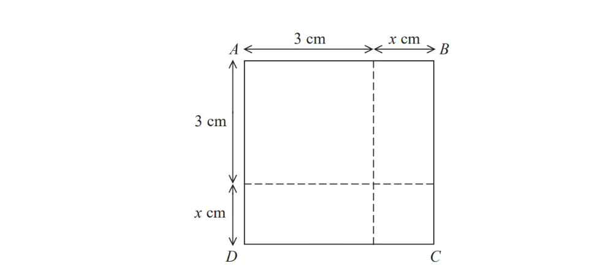

# Exam Questions — Expanding Brackets
**Equations, Formulae & Identities** · Edexcel IGCSE Maths A (4MA1) — 18/Higher
> Source: [https://www.savemyexams.com/igcse/maths/edexcel/a/18/higher/topic-questions/2-equations-formulae-and-identities/expanding-brackets/exam-questions/](https://www.savemyexams.com/igcse/maths/edexcel/a/18/higher/topic-questions/2-equations-formulae-and-identities/expanding-brackets/exam-questions/) · 53 questions · total 123 marks

## Q1 — easy — 1 marks · exam-questions

### 8((a)) — 1 mark — command: expand — structured — from paper 2012	June · 1MA0/1H
Expand    $3(2y-5)$

## Q2 — easy — 3 marks · exam-questions

### 11((a)) — 1 mark — command: expand — structured — from paper 2012	November · 1MA0/1H
Expand  $4(3x+5)$

### 11((b)) — 2 marks — command: simplify — structured — from paper 2012	November · 1MA0/1H
Expand and simplify      `2 open parentheses x minus 4 close parentheses space plus thin space 3 open parentheses x plus 5 close parentheses`

## Q3 — easy — 3 marks · exam-questions

### 4((a)) — 1 mark — command: expand — structured — from paper 2013	June · 1MA0/1H
Expand       `3 open parentheses 2 plus t close parentheses`

### 4((b)) — 2 marks — command: expand — structured — from paper 2013	June · 1MA0/1H
Expand    `3 x open parentheses 2 x plus 5 close parentheses`

## Q4 — easy — 1 marks · exam-questions

### 4((c)) — 1 mark — command: expand — structured — from paper 2013	November · 1MA0/1H
Expand      `4 open parentheses x plus 2 close parentheses`

## Q5 — easy — 1 marks · exam-questions

### 6((a)) — 1 mark — command: expand — structured — from paper 2014	June · 1MA0/1H
Expand       `2 m open parentheses m plus 3 close parentheses`

## Q6 — easy — 2 marks · exam-questions

### 3((c)) — 2 marks — command: simplify — structured — from paper 2014	November · 1MA0/2H
Expand and simplify      `5 open parentheses y minus 2 close parentheses space plus space 2 open parentheses y minus 3 close parentheses`

## Q7 — easy — 3 marks · exam-questions

### 10((a)) — 1 mark — command: expand — structured — from paper 2015	November · 1MA0/1H
Expand      `x open parentheses x plus 2 close parentheses`

### 10((b)) — 2 marks — command: simplify — structured — from paper 2015	November · 1MA0/1H
Expand and simplify        `3 open parentheses y plus 2 close parentheses space plus thin space 4 open parentheses x minus 1 close parentheses`

## Q8 — easy — 1 marks · exam-questions

### 2((c)) — 1 mark — command: expand — structured — from paper 2016	June · 1MA0/2H
Expand      $x(x-3)$

## Q9 — easy — 2 marks · exam-questions

### 3((a)) — 2 marks — command: simplify — structured — from paper 2015	Spec2 · 1MA1/2H
Expand and simplify       `3 open parentheses y minus 2 close parentheses space plus space 5 open parentheses 2 y plus 1 close parentheses`

## Q10 — easy — 1 marks · exam-questions

### 7((b)) — 1 mark — command: expand — structured — from paper 2015	June · 1MA0/2H
Expand     $3y(4y-3)$

## Q11 — easy — 2 marks · exam-questions

### 11((a)) — 2 marks — command: simplify — structured — from paper 2013	March · 1MA0/2H
Expand and simplify       `3 open parentheses x plus 4 close parentheses space plus space 2 open parentheses 5 x minus 1 close parentheses`

## Q12 — easy — 1 marks · exam-questions

### 7() — 1 mark — command: expand — structured — from paper 2015	June · 1MA0/2H
Expand    $7(x+5)$

## Q13 — easy — 2 marks · exam-questions

### 1((c)) — 2 marks — command: expand — structured — from paper Jan 2021 · 4MA1/2HR
Expand  $4t(3t--2)$

## Q14 — easy — 1 marks · exam-questions

### 1() — 1 mark — command: expand — structured — from paper Nov 2019 · 8300/2H
Expand $4x^{2}(3x+5)$

Circle your answer.

| $32x^{3}$ | $12x^{3}+20x^{2}$ | $7x^{3}+9x^{2}$ | $12x^{2}+5$ |
|---|---|---|---|

## Q15 — easy — 1 marks · exam-questions

### 3() — 1 mark — command: circle — structured — from paper Nov 2019 · 8300/3H
$(2x--4)(3x+5)$is expanded and simplified. 
Circle the term which is part of the answer.

| $2x$ | $-2x$ | $22x$ | $-22x$ |
|---|---|---|---|

## Q16 — easy — 2 marks · exam-questions

### 5() — 2 marks — command: simplify — structured — from paper Nov 2017 · 8300/3H
Multiply out and simplify `open parentheses x minus 8 close parentheses squared`

## Q17 — medium — 2 marks · exam-questions

### 4((d)) — 2 marks — command: simplify — structured — from paper 2016	June · 1MA0/1H
Expand and simplify       `3 open parentheses m plus 4 close parentheses minus space 2 left parenthesis 4 m space plus space 1 right parenthesis`

## Q18 — medium — 2 marks · exam-questions

### 2() — 2 marks — command: simplify — structured — from paper 2018	June · 1MA1/3H
Expand and simplify         `5 open parentheses p plus 3 close parentheses space minus space 2 open parentheses 1 minus 2 p close parentheses`

## Q19 — medium — 2 marks · exam-questions

### 14((a)) — 2 marks — command: simplify — structured — from paper 2012	June · 1MA0/2H
Expand and simplify     `open parentheses p plus 9 close parentheses open parentheses p minus 4 close parentheses`

## Q20 — medium — 2 marks · exam-questions

### 11((c)) — 2 marks — command: simplify — structured — from paper 2012	November · 1MA0/1H
Expand and simplify        $(x+4)(x+6)$

## Q21 — medium — 2 marks · exam-questions

### 4((c)) — 2 marks — command: simplify — structured — from paper 2013	June · 1MA0/1H
Expand and simplify  `open parentheses m plus 3 close parentheses open parentheses m plus 10 close parentheses`

## Q22 — medium — 2 marks · exam-questions

### 1() — 2 marks — command: simplify — structured
Expand and simplify `open parentheses p minus 6 close parentheses open parentheses p plus 11 close parentheses`

## Q23 — medium — 2 marks · exam-questions

### 4((d)) — 2 marks — command: simplify — structured — from paper 2013	November · 1MA0/1H
Expand and simplify         `open parentheses x minus 5 close parentheses open parentheses x plus 3 close parentheses`

## Q24 — medium — 2 marks · exam-questions

### 21((a)) — 2 marks — command: simplify — structured — from paper 2014	June · 1MA0/2H
Expand and simplify            `open parentheses y minus 2 close parentheses open parentheses y minus 5 close parentheses`

## Q25 — medium — 2 marks · exam-questions

### 19((a)) — 2 marks — command: simplify — structured — from paper 2016	November · 1MA0/2H
Expand and simplify           `open parentheses y plus 2 close parentheses open parentheses y plus 5 close parentheses`

## Q26 — medium — 2 marks · exam-questions

### 2() — 2 marks — command: simplify — structured — from paper 2015	Sample · 1MA1/1H
Expand and simplify        `open parentheses m plus 7 close parentheses open parentheses m plus 3 close parentheses`

## Q27 — medium — 2 marks · exam-questions

### 11((b)) — 2 marks — command: simplify — structured — from paper 2013	March · 1MA0/2H
Expand and simplify                        `open parentheses 2 x plus 1 close parentheses open parentheses x minus 4 close parentheses`

## Q28 — medium — 2 marks · exam-questions

### 12((c)) — 2 marks — command: simplify — structured — from paper 2014	November · 1MA0/1H
Expand and simplify      `open parentheses 2 x plus 3 close parentheses open parentheses x minus 8 close parentheses`

## Q29 — medium — 2 marks · exam-questions

### 10((c)) — 2 marks — command: simplify — structured — from paper 2015	November · 1MA0/1H
Expand and simplify                `open parentheses 2 t minus 3 close parentheses open parentheses t plus 5 close parentheses`

## Q30 — medium — 2 marks · exam-questions

### 8((e)) — 2 marks — command: simplify — structured — from paper 2017	June · 1MA0/2H
Expand and simplify               `open parentheses w minus 5 close parentheses squared`

## Q31 — medium — 2 marks · exam-questions

### 1((a)) — 2 marks — command: simplify — structured — from paper Jan 2022 · 4MA1/2H
Expand and simplify  `open parentheses y plus 4 close parentheses open parentheses 2 minus y close parentheses`

## Q32 — medium — 2 marks · exam-questions

### 5((a)) — 2 marks — command: simplify — structured — from paper June 2021 · 4MA1/1H
Expand and simplify  $3x(2x+3)--x(3x+5)$

## Q33 — medium — 2 marks · exam-questions

### 10() — 2 marks — command: simplify — structured — from paper Nov 2020 · 8300/3H
Expand and simplify fully  $4(2c+3)--(5c--1)$

## Q34 — medium — 2 marks · exam-questions

### 1() — 2 marks — command: expand — structured
Expand and simplify  `open parentheses m plus 9 close parentheses open parentheses m – 5 close parentheses`

## Q35 — hard — 3 marks · exam-questions

### 10() — 3 marks — command: prove — structured — from paper 2017	June · 1MA1/1H
Show that $(x+1)(x+2)(x+3)$ can be written in the form $ax^{3}+bx^{2}+cx+d$ where  $a,b,c$ and $d$ are positive integers.

## Q36 — hard — 3 marks · exam-questions

### 13() — 3 marks — command: prove — structured — from paper 2015	Spec1 · 1MA1/2H
Show that

`open parentheses 3 x minus 1 close parentheses open parentheses x plus 5 close parentheses open parentheses 4 x minus 3 close parentheses space equals space 12 x cubed space plus space 47 x squared space minus space 62 x space plus space 15`

for all values of $x$.

## Q37 — hard — 3 marks · exam-questions

### 18() — 3 marks — command: simplify — structured — from paper 2015	Spec2 · 1MA1/2H
Simplify fully `open parentheses square root of a plus square root of 4 b end root space close parentheses open parentheses square root of a minus 2 square root of b close parentheses`

## Q38 — hard — 6 marks · exam-questions

### 18((a)) — 3 marks — command: prove — structured — from paper June 2019 · 1MA1/3H
Show that $(2x+1)(x+3)(3x+7)$ can be written in the form $ax^{3}+bx^{2}+cx+d$   where $a,b,c$ and $d$ are integers.

### 18((b)) — 3 marks — command: solve — structured — from paper June 2019 · 1MA1/3H
Solve           `open parentheses 1 minus x close parentheses squared space less than space 9 over 25`

## Q39 — hard — 3 marks · exam-questions

### 4() — 3 marks — command: prove — structured — from paper June 2017 · 1MA1/1H

The area of square $ABCD$ is $10$ cm2.

Show that $x^{2}+6x=1$

## Q40 — hard — 3 marks · exam-questions

### 13((a)) — 3 marks — command: simplify — structured — from paper Jan 2022 · 4MA1/1H
Expand and simplify            `5 x open parentheses x plus 2 close parentheses open parentheses 3 x minus 4 close parentheses`

## Q41 — hard — 3 marks · exam-questions

### 18() — 3 marks — command: find — structured — from paper Jan 2021 · 4MA1/1H
Given that `open parentheses 8 minus square root of x close parentheses open parentheses 5 plus square root of x close parentheses equals y square root of x plus 21`  where $x$ is a prime number and $y$ is an integer,

find the value of $x$ and the value of $y$.

Show each stage of your working clearly.

x = .............................................................

y = ............................................................

## Q42 — hard — 3 marks · exam-questions

### 9((b)) — 3 marks — command: solve — structured — from paper June 2021 · 4MA1/1H
Solve $(2x+5)^{2}=(2x+3)(2x--1)$

$x=$ ......................................

## Q43 — hard — 3 marks · exam-questions

### 17((b)) — 3 marks — command: solve — structured — from paper Jan 2021 · 4MA1/2HR
The functions $f$and $g$ are defined as

`table row cell straight f left parenthesis x right parenthesis space end cell equals cell space x squared space plus space 6 space end cell row cell straight g left parenthesis x right parenthesis space end cell equals cell space x space – space 10 end cell end table`

Solve the equation $\mathrm{fg}(x)=f(x)$

Show clear algebraic working.

## Q44 — hard — 3 marks · exam-questions

### 14() — 3 marks — command: simplify — structured — from paper Nov 2020 · 4MA1/1HR
Expand and simplify $(4x+1)(x--3)(5x+6)$

## Q45 — hard — 1 marks · exam-questions

### 24((a)) — 1 mark — command: prove — structured — from paper June 2018 · 4MA1/1HR
Show that `x left parenthesis x space minus space 1 right parenthesis space open parentheses x space plus space 1 close parentheses equals space x cubed space minus space x`

## Q46 — hard — 3 marks · exam-questions

### 25() — 3 marks — command: simplify — structured — from paper Nov 2021 · 8300/3H
Expand and simplify fully `open parentheses x minus 3 close parentheses open parentheses x plus 2 close parentheses open parentheses x plus 5 close parentheses`

## Q47 — hard — 3 marks · exam-questions

### 8() — 3 marks — command: work_out — structured — from paper Nov 2019 · 8300/2H
Here is an identity.

$a(3x--10)\equiv21x+2b$

Work out the values of $a$ and $b$.

## Q48 — hard — 3 marks · exam-questions

### 26() — 3 marks — command: work_out — structured — from paper June 2019 · 8300/2H
$(x+5)(x+2)(x+a)\equivx^{3}+bx^{2}+cx--30$

Work out the values of the integers $a,b$and $c$.

`table row cell a space end cell equals cell space space...................... end cell row cell b space end cell equals cell space space...................... end cell row cell c space end cell equals cell space space...................... end cell end table`

## Q49 — hard — 4 marks · exam-questions

### 18() — 4 marks — command: simplify — structured — from paper Nov 2017 · 8300/3H
Expand and simplify $(3x^{2}+2)(2x+5)--6x(x^{2}--3)$

## Q50 — hard — 3 marks · exam-questions

### 17() — 3 marks — command: simplify — structured — from paper Nov 2020 · J560/04
Expand and simplify.

`open parentheses x plus 1 close parentheses open parentheses x minus 1 close parentheses open parentheses x plus 2 close parentheses`

## Q51 — hard — 4 marks · exam-questions

### 13((b)) — 4 marks — command: simplify — structured — from paper Nov 2017 · J560/04
Expand and simplify.

$(2x-1)(x+5)(3x-2)$

## Q52 — hard — 3 marks · exam-questions

### 17((a)) — 3 marks — command: expand — structured — from paper 2023 June · 4MA1/2H
Expand and simplify $(x+6)(3x--2)(x+6)$

## Q53 — hard — 3 marks · exam-questions

### 16() — 3 marks — command: expand — structured — from paper 2023 Nov · 4MA1/2H
Expand and simplify `open parentheses 2 x plus 3 close parentheses open parentheses x minus 5 close parentheses open parentheses x plus 4 close parentheses`
