# Exam Questions — Forming & Solving Equations
**Equations, Formulae & Identities** · Edexcel IGCSE Maths A (4MA1) — 18/Higher
> Source: [https://www.savemyexams.com/igcse/maths/edexcel/a/18/higher/topic-questions/2-equations-formulae-and-identities/forming-and-solving-equations/exam-questions/](https://www.savemyexams.com/igcse/maths/edexcel/a/18/higher/topic-questions/2-equations-formulae-and-identities/forming-and-solving-equations/exam-questions/) · 56 questions · total 226 marks

## Q1 — easy — 3 marks · exam-questions

### 3() — 3 marks — command: work_out — structured — from paper 2016	June · 1MA0/2H
The diagram shows a rectangle.

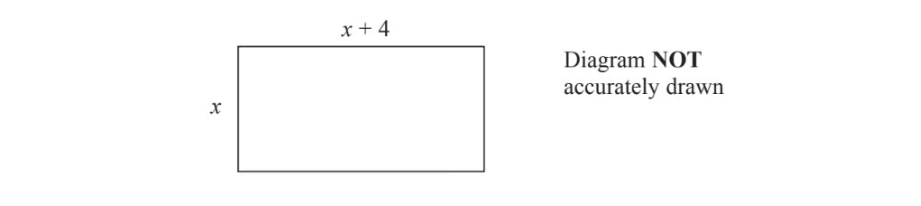

All measurements are given in centimetres.

The perimeter of the rectangle is 45 cm.

Work out the value of $x.$

## Q2 — easy — 3 marks · exam-questions

### 4() — 3 marks — command: write — structured — from paper November 2014 · 1MA0/1H
Kalinda buys $x$ packs of currant buns and $y$ boxes of iced buns.

There are 6 currant buns in a pack of currant buns.
 There are 8 iced buns in a box of iced buns.

Kalinda buys a total of $T$ buns.
 Write down a formula for $T$ in terms of $x$ and $y$.

## Q3 — easy — 3 marks · exam-questions

### 9() — 3 marks — command: write — structured — from paper June 2016 · 1MA0/1H
A shop sells packets of envelopes.

There are 5 envelopes in a small packet. 
There are 20 envelopes in a large packet.

There is a total of $T$ envelopes in $x$ small packets and $y$ large packets.

Write down a formula for $T$ in terms of $x$ and $y$.

## Q4 — easy — 3 marks · exam-questions

### 3() — 3 marks — command: work_out — structured — from paper November 2016 · 1MA0/2H
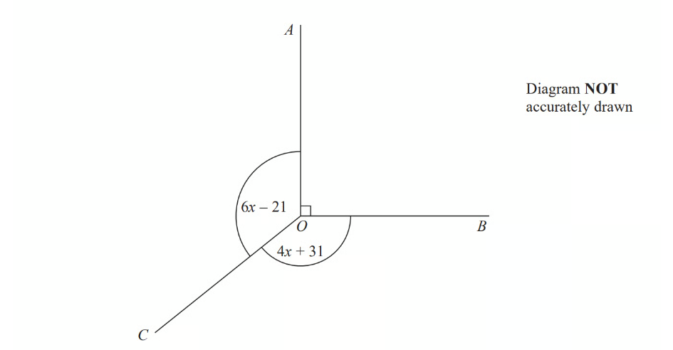

In the diagram, all angles are in degrees.

Angle $AOB$is a right angle.
 Angle $AOC$= Angle $BOC$.

Work out the value of $x$.

## Q5 — easy — 3 marks · exam-questions

### 4() — 3 marks — command: prove — structured — from paper June 2017 · 1MA1/1H
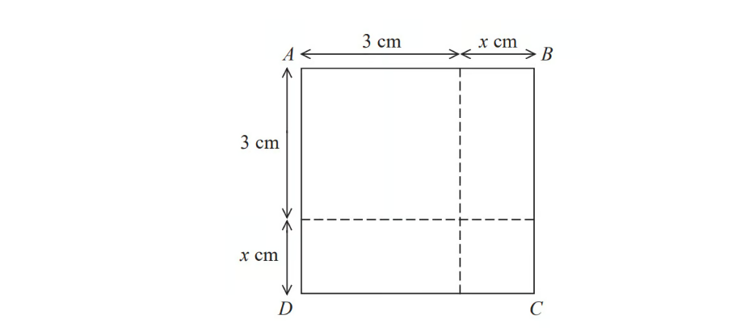

The area of square $ABCD$ is $10\mathrm{cm}^{2}$.

Show that $x^{2}+6x=1$

## Q6 — easy — 4 marks · exam-questions

### 4() — 4 marks — command: work_out — structured — from paper Jan 2020 · 4MA1/2H
The diagram shows a triangle.

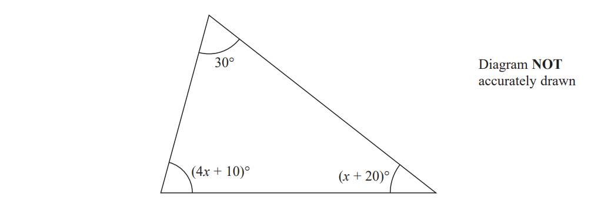

Work out the value of $x$.

$x$ = ..................

## Q7 — easy — 4 marks · exam-questions

### 3() — 4 marks — command: work_out — structured — from paper Jan 2020 · 4MA1/2HR
Three tins, $A$, $B$and $C$ , each contain buttons.

Tin $A$ contains $x$buttons. 
Tin $B$ contains 4 times the number of buttons that tin $A$ contains. Tin $C$ contains 7 fewer buttons than tin $A$.

The total number of buttons in the three tins is 137

Work out the number of buttons in tin $C$.

## Q8 — easy — 1 marks · exam-questions

### 1() — 1 mark — command: circle — structured — from paper Nov 2021 · 8300/3H
$b$ is 3 more than the square root of $a$.

Circle the correct equation.

| $b=\sqrt{a}+3$ | $b=\sqrt{a}-3$ | $b=\sqrt{a+3}$ | $b=\sqrt{a-3}$ |
|---|---|---|---|

## Q9 — easy — 3 marks · exam-questions

### 19() — 3 marks — command: work_out — structured — from paper Nov 2017 · 8300/2H
The length of a rectangle is five times the width. The area of the rectangle is 1620 cm2

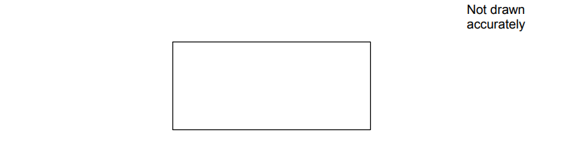

Work out the width of the rectangle.

......................cm

## Q10 — easy — 4 marks · exam-questions

### 2((b)) — 4 marks — command: work_out — structured — from paper 2023 Nov · 4MA1/1H
There are 56 metal bars in a box. 
Each metal bar is gold or silver or zinc.

- $y$ metal bars are gold.
- $(3y+7)$ metal bars are silver.
- `open parentheses 2 y minus 5 close parentheses` metal bars are zinc.

Work out the number of metal bars that are zinc. 
Show clear algebraic working

## Q11 — medium — 5 marks · exam-questions

### 16() — 5 marks — command: work_out — structured — from paper November 2016 · 1MA0/2H
Julie and Liam write down the same number.

Julie multiplies the number by 5 and then adds 4 to the result. She writes down her answer.

Liam subtracts the number from 10
 He writes down his answer.

Julie's answer is two thirds of Liam's answer.

Work out the number that Julie and Liam started with. 
You must show your working.

## Q12 — medium — 4 marks · exam-questions

### 4() — 4 marks — command: find — structured — from paper spec1 2015 · 1MA1/1H
A pattern is made using identical rectangular tiles.

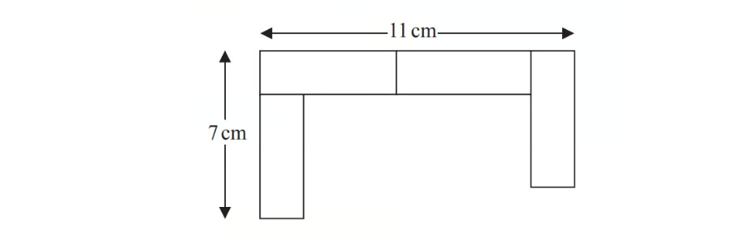

Find the total area of the pattern.

## Q13 — medium — 4 marks · exam-questions

### 9() — 4 marks — command: work_out — structured — from paper June 2014 · 1MA0/2H
The diagram shows a trapezium.

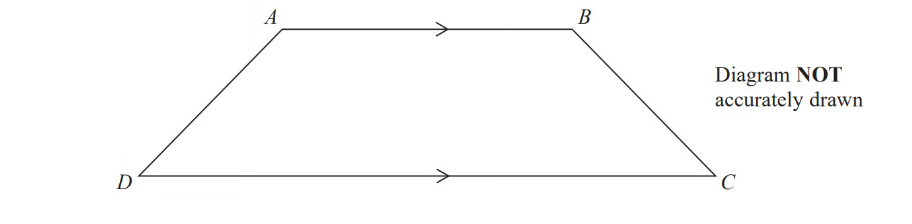

$AD$ = $x$ cm.

$BC$is the same length as $AD$.

$AB$ is twice the length of $AD$.

$DC$ is 4 cm longer than $AB$.

The perimeter of the trapezium is 38 cm.

Work out the length of $AD$.

## Q14 — medium — 4 marks · exam-questions

### 10() — 4 marks — command: work_out — structured — from paper June 2017 · 1MA0/2H
Gemma has the same number of sweets as Betty.

Gemma gives 24 of her sweets to Betty. 
Betty now has 5 times as many sweets as Gemma.

Work out the total number of sweets that Gemma and Betty have.

## Q15 — medium — 3 marks · exam-questions

### 9() — 3 marks — command: prove — structured — from paper Spec2 2015 · 1MA1/1H
Here is a cuboid.

All measurements are in centimetres.

$x$ is an integer.

The total volume of the cuboid is less than 900 cm3

Show that $x$`less-than or slanted equal to` 5

## Q16 — medium — 4 marks · exam-questions

### 14() — 4 marks — command: work_out — structured — from paper June 2017 · 1MA0/1H
3 kg of potatoes and 4 kg of carrots have a total cost of 440p. 
4 kg of potatoes and 3 kg of carrots have a total cost of 470p.

Work out the total cost of 1 kg of potatoes and 1 kg of carrots.

## Q17 — medium — 3 marks · exam-questions

### 11() — 3 marks — command: work_out — structured — from paper 2012	June · 1MA0/1H
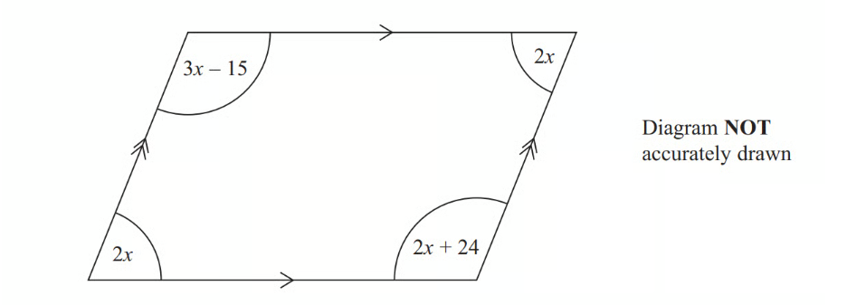

The diagram shows a parallelogram.

The sizes of the angles, in degrees, are

$2x\,3x-15\,2x\,2x+24$

Work out the value of $x$.

## Q18 — medium — 4 marks · exam-questions

### 10() — 4 marks — command: work_out — structured — from paper 2013	June · 1MA0/1H
The diagram shows a garden in the shape of a rectangle.

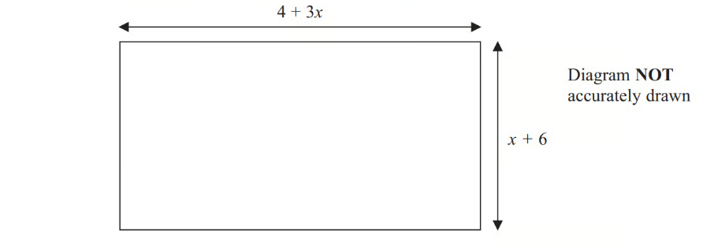

All measurements are in metres. 
The perimeter of the garden is 32 metres.

Work out the value of $x$.

## Q19 — medium — 3 marks · exam-questions

### 1() — 3 marks — command: work_out — structured — from paper 2015	Spec1 · 1MA1/1H
The diagram shows a right-angled triangle.

All the angles are in degrees.

Work out the size of the smallest angle of the triangle.

## Q20 — medium — 5 marks · exam-questions

### 8() — 5 marks — command: work_out — structured — from paper 2013	November · 1MA0/1H
$ABC$is a triangle.

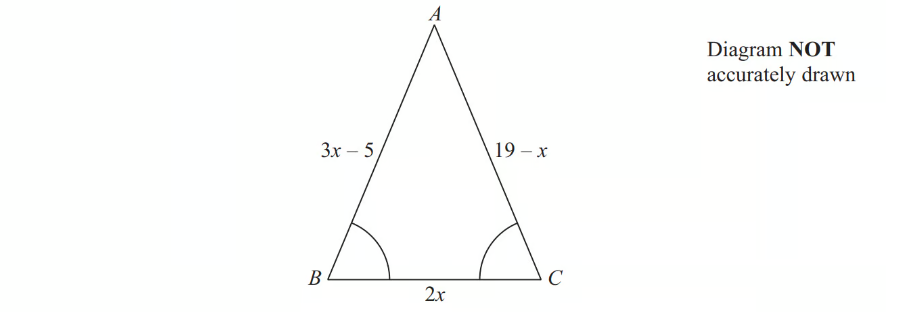

Angle $ABC$=  angle $BCA$.

The length of side $AB$is $(3x---5)$ cm. 
The length of side $AC$is $(19---x)$ cm. 
The length of side $BC$is $2x$ cm.

Work out the perimeter of the triangle. 
Give your answer as a number of centimetres.

## Q21 — medium — 5 marks · exam-questions

### 5() — 5 marks — command: work_out — structured — from paper 2015	June · 1MA0/2H
Redlands School sent $x$ students to a revision day.

St Samuel's School sent twice as many students as Redlands    School.    
Francis Long School sent 7 fewer students than Redlands School.

Each student paid £ 15 for the revision day.    The students paid a total of £1155

Work out how many students were sent by each school to the revision day.   
You must show all your working.

## Q22 — medium — 3 marks · exam-questions

### 1() — 3 marks — command: find — structured
The diagram below shows a triangle $PRQ$ and straight line $PQS$. The diagram is not drawn to scale.

- Angle `P R Q equals open parentheses 8 x plus 2 close parentheses degree`
- Angle `Q P R equals open parentheses 11 x plus 10 close parentheses degree`
- Angle `R Q S equals open parentheses 15 x plus 32 close parentheses degree`

Find the value of $x$

## Q23 — medium — 4 marks · exam-questions

### 6() — 4 marks — command: prove — structured — from paper 2017	November · 1MA1/1H
Here is a rectangle.

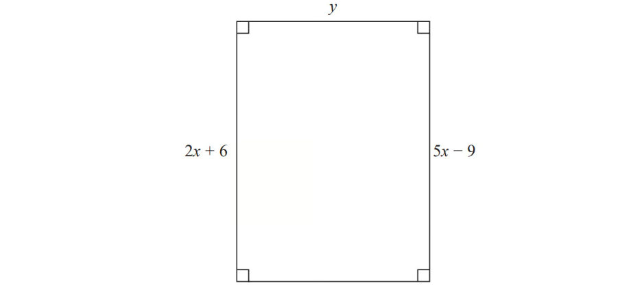

All measurements are in centimetres. 
The area of the rectangle is 48 cm2. 
Show that  $y=3$

## Q24 — medium — 4 marks · exam-questions

### 3() — 4 marks — command: work_out — structured — from paper 2015	November · 1MA0/2H
Ali is $y$ years old.

Bhavara is twice as old as Ali.

Ceris is 3 years younger than Ali.

The total of their ages is 125 years.

Work out the age of each person.

## Q25 — medium — 4 marks · exam-questions

### 18((a)) — 3 marks — command: prove — structured — from paper Nov 2019 · 8300/2H
Kate has the following question for homework.

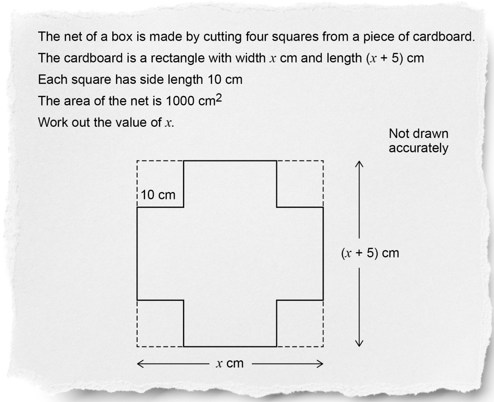

Show that Kate can form the equation   $x^{2}+5x--1400=0$

### 18((b)) — 1 mark — command: give — structured — from paper Nov 2019 · 8300/2H
Kate correctly factorises the equation to get $(x+40)(x--35)=0$

Her answer to the homework question is $x=--40\mathrm{or}x=35$

Is her answer correct?

Tick a box.

`square` Yes         `begin mathsize 26px style square end style` No

Give a reason for your answer.

## Q26 — medium — 3 marks · exam-questions

### 12() — 3 marks — structured — from paper Nov 2021 · 8300/2H
$A,B$ and $C$ are three points on a circle.

The radii from $A,B$ and $C$ are shown.

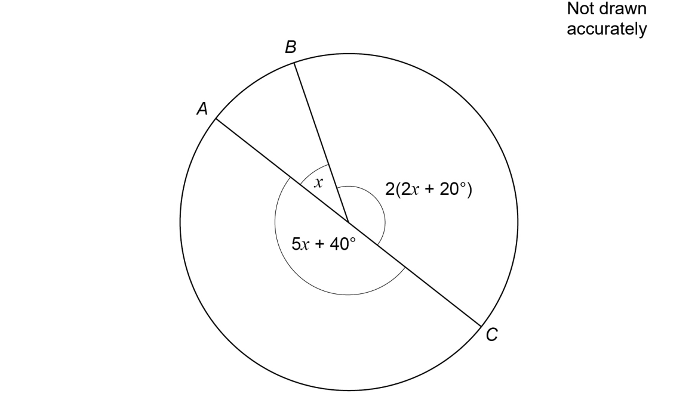

Is $AC$ a diameter of the circle? 
You **must **show your working.

## Q27 — medium — 4 marks · exam-questions

### 3() — 4 marks — command: find — structured — from paper 2023 June · 4MA1/2H
$ABCD$ is a trapezium.

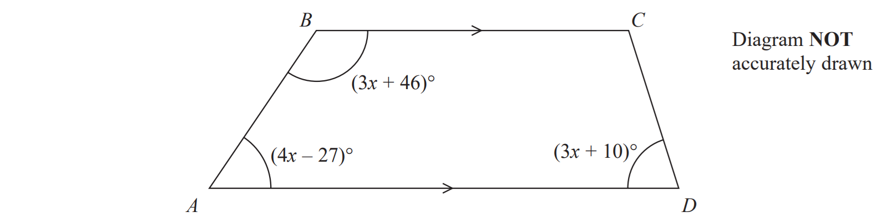

$BC$ is parallel to $AD$

Find the size of the largest angle inside the trapezium.

## Q28 — hard — 4 marks · exam-questions

### 16() — 4 marks — command: work_out — structured — from paper November 2012 · 1MA0/1H
The diagram shows a triangle.

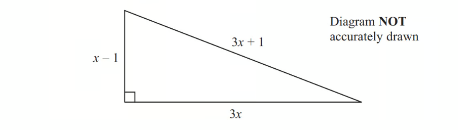

In the diagram, all the measurements are in metres.

The perimeter of the triangle is 56 m. 
The area of the triangle is A m2.

Work out the value of A.

## Q29 — hard — 3 marks · exam-questions

### 7() — 3 marks — command: prove — structured — from paper Spec2 2015 · 1MA1/3H
Here is a right-angled triangle.

Four of these triangles are joined to enclose the square $ABCD$ as shown below.

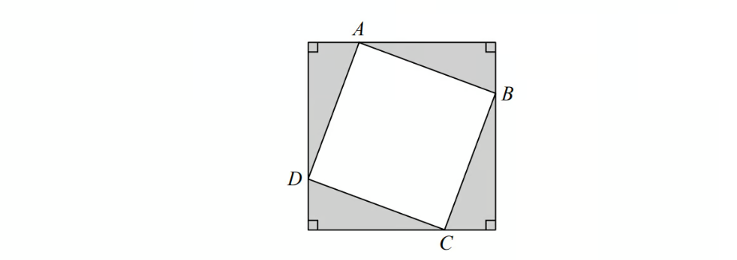

Show that the area of the square $ABCD$is $x^{2}+y^{2}$

## Q30 — hard — 3 marks · exam-questions

### 7() — 3 marks — structured — from paper Spec1 2015 · 1MA1/2H
Becky has some marbles. 
Chris has two times as many marbles as Becky. 
Dan has seven more marbles than Chris.

They have a total of 57 marbles.

Dan says, 
"If I give some marbles to Becky, each of us will have the same number of marbles."

Is Dan correct? 
You must show how you get your answer.

## Q31 — hard — 5 marks · exam-questions

### 6() — 5 marks — command: work_out — structured — from paper November 2017 · 1MA1/3H
Here is a rectangle.

The length of the rectangle is 7 cm longer than the width of the rectangle.

4 of these rectangles are used to make this 8-sided shape.

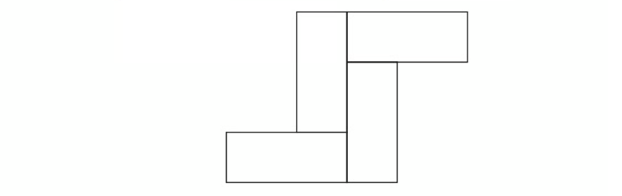

The perimeter of the 8-sided shape is 70 cm. 
Work out the area of the 8-sided shape.

## Q32 — hard — 5 marks · exam-questions

### 9() — 5 marks — command: work_out — structured — from paper Sample 2015 · 1MA1/2H
$ABCD$ is a rectangle.

$EFGH$is a trapezium.

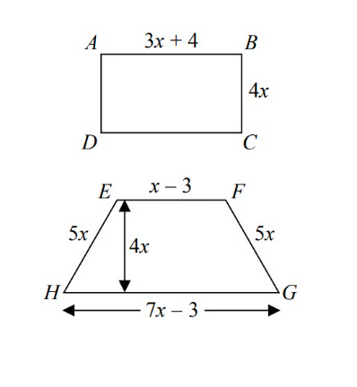

All measurements are in centimetres.

The perimeters of these two shapes are the same.

Work out the area of the rectangle.

## Q33 — hard — 5 marks · exam-questions

### 23() — 5 marks — command: find — structured — from paper November 2017 · 1MA1/1H
Here is a rectangle and a right-angled triangle.

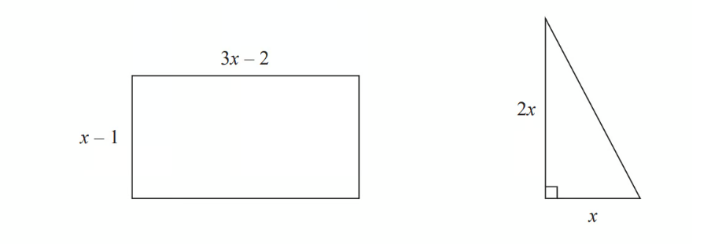

All measurements are in centimetres.

The area of the rectangle is greater than the area of triangle.

Find the set of possible values of $x$.

## Q34 — hard — 4 marks · exam-questions

### 15() — 4 marks — command: work_out — structured — from paper November 2014 · 1MA0/2H
A cinema sells adult tickets and child tickets.

The total cost of 3 adult tickets and 1 child ticket is £30    
    The total cost of 1 adult ticket and  3 child tickets is £22

Work out the cost of an adult ticket and the cost of a child ticket.

## Q35 — hard — 4 marks · exam-questions

### 11() — 4 marks — command: work_out — structured — from paper November 2017 · 1MA1/1H
3 teas and 2 coffees have a total cost of £7.80 
5 teas and 4 coffees have a total cost of £14.20

Work out the cost of one tea and the cost of one coffee.

## Q36 — hard — 5 marks · exam-questions

### 22((a)) — 2 marks — command: prove — structured — from paper November 2013 · 1MA0/2H
The diagram shows a trapezium.

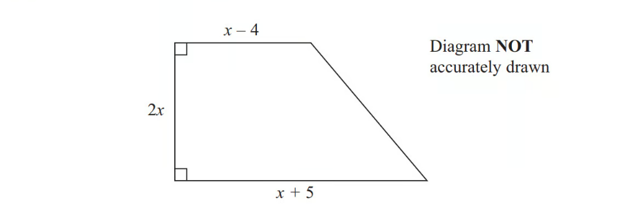

All the measurements are in centimetres.

The area of the trapezium is 351 cm2.

Show that  $2x^{2}+x---351=0$

### 22((b)) — 3 marks — command: work_out — structured — from paper November 2013 · 1MA0/2H
Work out the value of $x$.

## Q37 — hard — 4 marks · exam-questions

### 7() — 4 marks — command: work_out — structured — from paper 2014	November · 1MA0/1H
The diagram shows the plan of a floor.

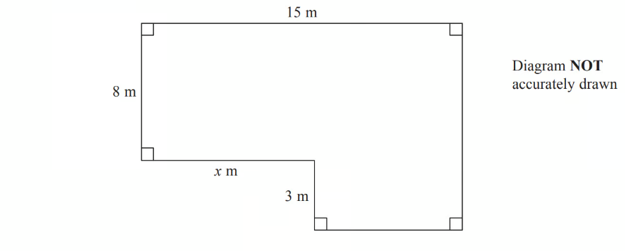

The area of the floor is 138 m2.

Work out the value of $x$.

## Q38 — hard — 5 marks · exam-questions

### 16() — 5 marks — command: work_out — structured — from paper 2015	November · 1MA0/1H
$ABCD$ is a trapezium.

$STUV$ is a rectangle.

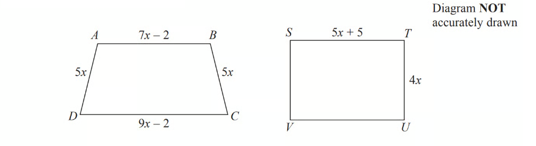

All measurements are in centimetres.

The two shapes have the same perimeter.

Work out the length of  $ST$.

## Q39 — hard — 4 marks · exam-questions

### 17() — 4 marks — command: find — structured — from paper June 2019 · 1MA1/1H
Given that

`x squared space colon space open parentheses 3 x plus 5 close parentheses space equals space 1 space colon space 2`

find the possible values of $x$.

## Q40 — hard — 5 marks · exam-questions

### 19((a)) — 2 marks — command: prove — structured — from paper Nov 2018 · 8300/1H
In a chess club, there are $x$ boys and $y$ girls.

If 5 more boys and 8 more girls join, there would be half as many boys as girls.

Show that $y=2x+2$

### 19((b)) — 3 marks — command: work_out — structured — from paper Nov 2018 · 8300/1H
If instead,

10 more boys and 1 more girl join, there would be the same number of boys and girls.

Work out $x$ and $y$.

$x$ = ...................

$y$ = ...................

## Q41 — hard — 4 marks · exam-questions

### 10((a)) — 2 marks — command: work_out — structured — from paper Nov 2017 · 8300/1H
Three identical isosceles triangles are joined to make this trapezium.

Each triangle has base $b$ cm and perpendicular height $h$ cm

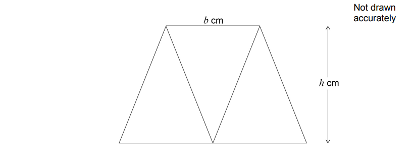

Work out an expression, in terms of $b$ and $h$, for the area of the trapezium.

Give your answer in its simplest form.

......................................cm2

### 10((b)) — 2 marks — command: work_out — structured — from paper Nov 2017 · 8300/1H
This diagram shows the same trapezium.

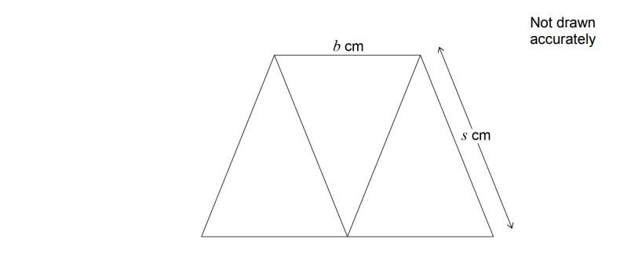

$b:s=2:3$

Work out an expression, in terms of $b$, for the perimeter of the trapezium.

...........................cm

## Q42 — hard — 3 marks · exam-questions

### 8() — 3 marks — command: how — structured — from paper June 2018 · 8300/2H
Theo starts with savings of £18

James starts with no savings.

Each week from now,

Theo will save £4.50 and James will save £4

In how many weeks will Theo and James have savings in the ratio 15 : 8 ?

## Q43 — hard — 5 marks · exam-questions

### 19() — 5 marks — command: work_out — structured — from paper June 2017 · 8300/2H
Rana sells 192 cakes in the ratio    small : medium : large    =    7 : 6 : 11

The profit for one medium cake is twice the profit for one small cake. 
The profit for one large cake is three times the profit for one small cake.

Her total profit is £532.48

Work out the profit for one small cake.

£.....................

## Q44 — hard — 4 marks · exam-questions

### 7() — 4 marks — command: find — structured — from paper Nov 2019 · J560/05
Sundip and Emma have some money. 
The ratio of Sundip’s money to Emma’s money is 3 : 5. 
Emma spends £450 of her money.
 The ratio of Sundip’s money to Emma’s money is now 2 : 3.

Find how much money Sundip has.

£ ...........................................................

## Q45 — hard — 5 marks · exam-questions

### 10() — 5 marks — command: work_out — structured — from paper 2023 Nov · 4MA1/2H
The diagram shows a hexagon $ABCDEF$

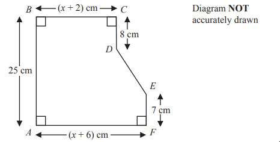

$AB=25\mathrm{cm}BC=(x+2)\mathrm{cm}CD=8\mathrm{cm}EF=7\mathrm{cm}AF=(x+6)\mathrm{cm}$

The area of hexagon $ABCDEF$  is 258 cm²

Work out the value of $x$

## Q46 — very_hard — 4 marks · exam-questions

### 20() — 4 marks — command: find — structured — from paper June 2013 · 1MA0/1H
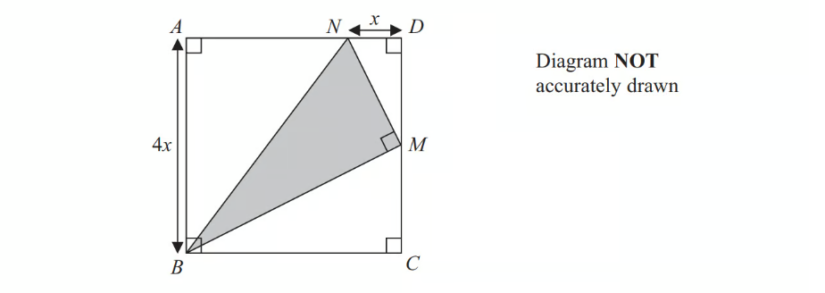

$ABCD$ is a square with a side length of $4x$ 
$M$ is the midpoint of $DC$. 
$N$ is the point on $AD$ where $ND=x$

$BMN$ is a right-angled triangle.

Find an expression, in terms of $x$, for the area of triangle $BMN$. Give your expression in its simplest form.

## Q47 — very_hard — 5 marks · exam-questions

### 19() — 5 marks — command: find — structured — from paper June 2018 · 1MA1/3H
Here are two right-angled triangles.

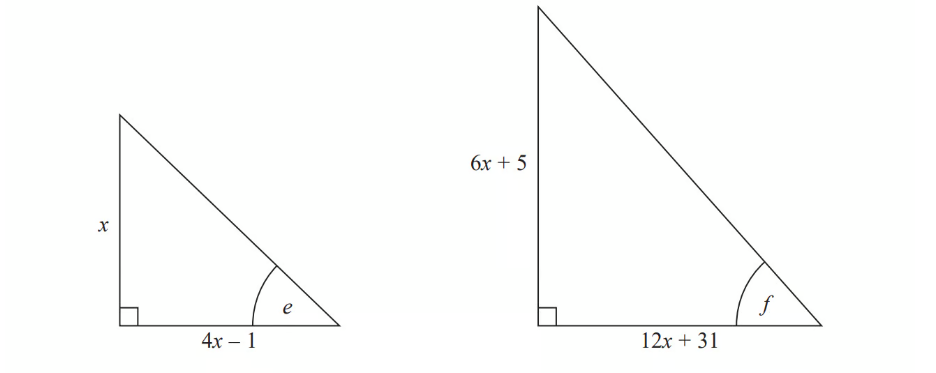

Given that

$\mathrm{tan}e=\mathrm{tan}f$

find the value of $x$.

You must show all your working.

## Q48 — very_hard — 5 marks · exam-questions

### 25() — 5 marks — command: work_out — structured — from paper March 2013 · 1MA0/2H
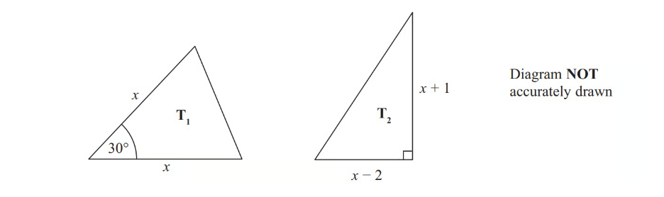

The lengths of the sides are in centimetres.

The area of triangle $T_{1}$ is equal to the area of triangle $T_{2}$. 
Work out the value of $x$, giving your answer in the form $a+\sqrt{b}$ where $a$ and $b$ are integers.

## Q49 — very_hard — 5 marks · exam-questions

### 22() — 5 marks — command: find — structured — from paper June 2019 · 1MA1/1H
There are only $r$ red counters and $g$ green counters in a bag.

A counter is taken at random from the bag.

The probability that the counter is green is $\frac{3}{7}$

The counter is put back in the bag.

2 more red counters and 3 more green counters are put in the bag. 
A counter is taken at random from the bag.

The probability that the counter is green is $\frac{6}{13}$

Find the number of red counters and the number of green counters that were in the bag originally.

## Q50 — very_hard — 4 marks · exam-questions

### 14() — 4 marks — command: work_out — structured — from paper June 2019 · 1MA1/3H
The diagram shows a rectangle, $ABDE$ , and two congruent triangles, $AFE$and $BCD$.

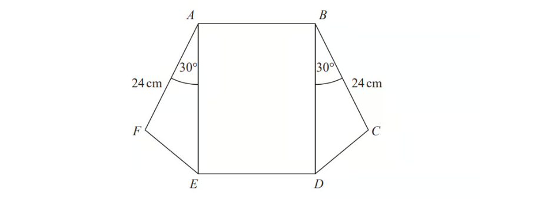

area of rectangle $ABDE$ = area of triangle $AFE$ + area of triangle $BCD$

$AB:AE=1:3$

Work out the length of $AE$.

.....................................cm

## Q51 — very_hard — 6 marks · exam-questions

### 19() — 6 marks — command: find — structured — from paper Spec 1 2015 · 1MA1/2H
Here is a right-angled triangle.

All measurements are in centimetres. 
The area of the triangle is 2.5 cm2 .

Find the perimeter of the triangle. 
Give your answer correct to 3 significant figures. 
You must show all of your working.

## Q52 — very_hard — 4 marks · exam-questions

### 18() — 4 marks — command: find — structured — from paper Jan 2019 · 4MA1/1H
The total surface area of a solid hemisphere is equal to the curved surface area of a cylinder.

The radius of the hemisphere is $r$ cm.

The radius of the cylinder is twice the radius of the hemisphere.

Given that

$\mathrm{volume} \mathrm{of} \mathrm{hemisphere}:\mathrm{volume} \mathrm{of} \mathrm{cylinder}=1:m$

find the value of $m$.

## Q53 — very_hard — 3 marks · exam-questions

### 19((a)) — 3 marks — command: prove — structured — from paper Nov 2021 · 4MA1/1H
$ABCED$ is a five-sided shape.

$ABCD$ is a rectangle. 
$CED$ is an equilateral triangle.

$AB=x\mathrm{cm}BC=y\mathrm{cm}$

The perimeter of $ABCED$is 100 cm. 
The area of $ABCED$is $R$ cm2

Show that `R equals x over 4 open parentheses 200 minus open square brackets 6 minus square root of 3 close square brackets x close parentheses`

## Q54 — very_hard — 6 marks · exam-questions

### 22() — 6 marks — command: find — structured — from paper Jan 2021 · 4MA1/2H
The diagram shows a sector $OBC$ of a circle with centre $O$ and radius $(6+x)\mathrm{cm}$.

$A$ is the point on $OB$ and $D$ is the point on $OC$ such that $OA=OD=6\mathrm{cm}$

Angle $BOC=50^{\circ}$

Given that

the perimeter of sector $OBC=2\times$the perimeter of triangle $OAD$

find the value of $x$.

Give your answer correct to 3 significant figures.

## Q55 — very_hard — 6 marks · exam-questions

### 20() — 6 marks — command: work_out — structured — from paper Jan 2019 · 4MA1/1H
A bowl contains $n$ pieces of fruit.

Of these, $4$ are oranges and the rest are apples.

Two pieces of fruit are going to be taken at random from the bowl.

The probability that the bowl will then contain $(n--6)$ apples is $\frac{1}{3}$

Work out the value of $n$ Show your working clearly.

## Q56 — very_hard — 4 marks · exam-questions

### 24() — 4 marks — command: work_out — structured — from paper Nov 2018 · 8300/3H
A sphere has radius $2x\mathrm{cm}$

A cone has

radius $3x\mathrm{cm}$    
   perpendicular height $h\mathrm{cm}$

The sphere and the cone have the same volume.

Work out    radius of cone : perpendicular height of cone

Give your answer in the form $a:b$where $a$ and $b$ are integers.
