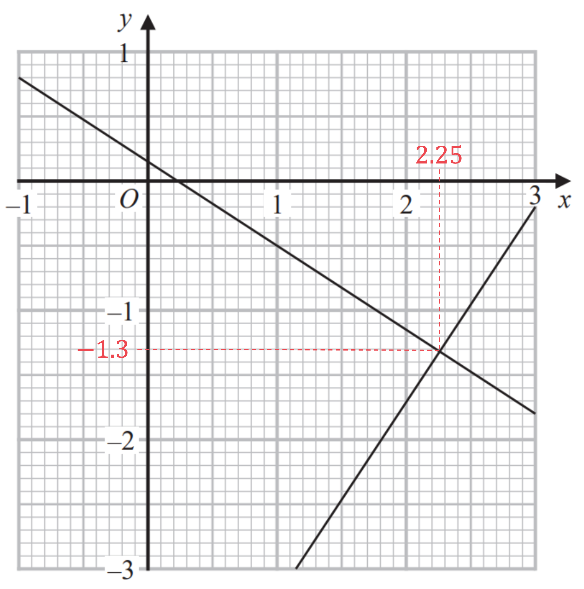
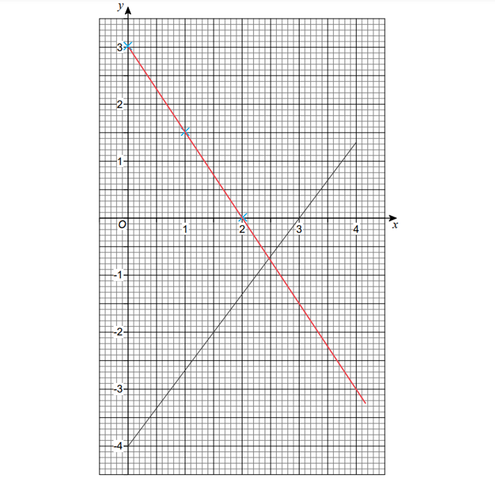
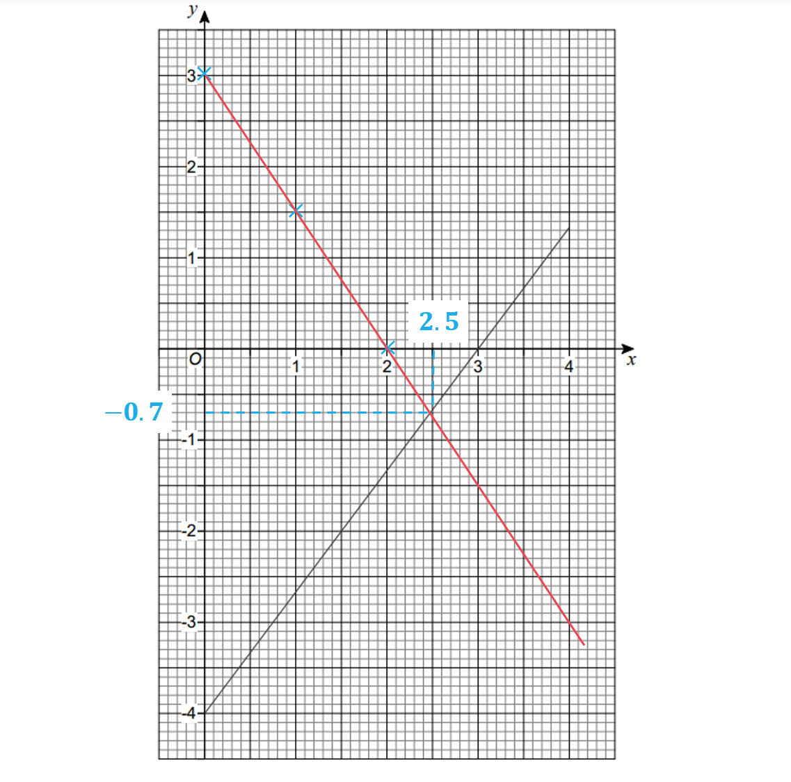
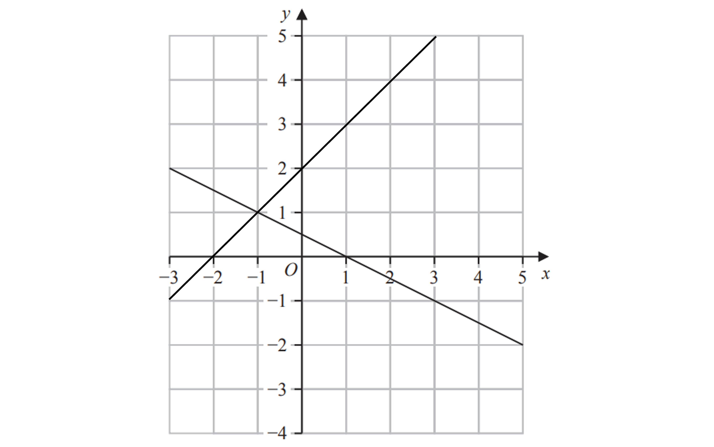
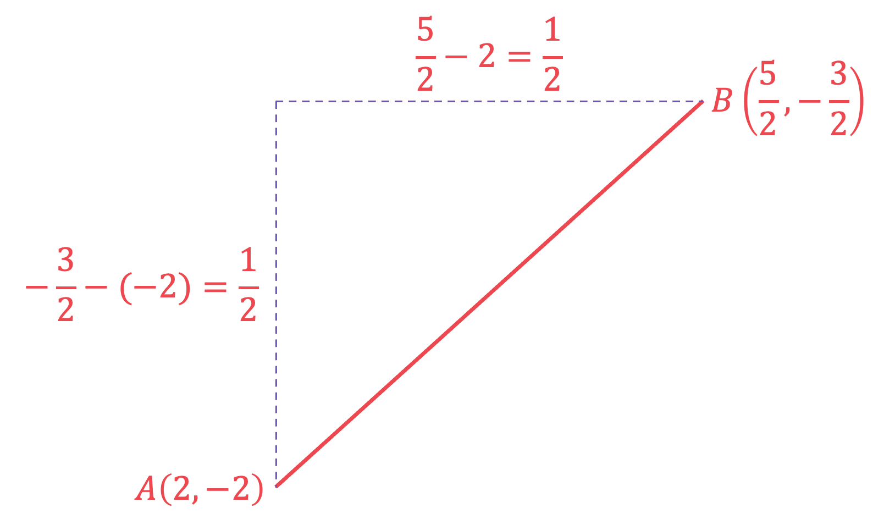

# Mark Schemes — Simultaneous Equations
**Equations, Formulae & Identities** · Edexcel IGCSE Maths A (4MA1) — 18/Higher

## Q1 — easy — 3 marks · exam-questions

### 18() — 3 marks
> *Number the equations.*

> `table row cell 4 x space plus space y space end cell equals cell space 25 space space space space space space space space space space open parentheses 1 close parentheses end cell row cell x space minus space 3 y space end cell equals cell space 16 space space space space space space space space space space open parentheses 2 close parentheses end cell end table`* *

> *Make the **y** terms equal by multiplying all parts of equation (1) by 3.*

`table row cell 12 x space plus space 3 y space end cell equals cell space 75 space space space space space space space space space space open parentheses 3 close parentheses end cell row cell x space minus space 3 y space end cell equals cell space 16 space space space space space space space space space space open parentheses 2 close parentheses end cell end table`

> *Eliminate the **y** terms by adding equation (3) to equation (2). Be careful to add every term. *

> *The coefficients of **y** are the same but with different signs, so add them.*

`space space space space space space space space space space 12 x space plus space 3 y space equals space 75 space space space space space space space space space space space space
bottom enclose plus space space space space open parentheses space space space space space space x space minus space 3 y space equals space 16 close parentheses space space space space space space end enclose
space space space space space space space space space space space 13 x space space space space space space space space space space space equals space 91 space`

**[1]**

> *Solve the equation to find** x  **by dividing both sides by 13.*

`table row cell x space end cell equals cell space 91 over 13 space equals space 7 end cell end table`

> *Substitute *$x=7$* into either of the two original equations**.*

`open parentheses 1 close parentheses space space space space space 4 open parentheses 7 close parentheses space plus space y space equals space 25`

**[1]**

> *Solve this equation to find** y.*

`table row cell 4 open parentheses 7 close parentheses space plus space y space end cell equals cell space 25 end cell row cell 28 space plus space y space end cell equals cell space 25 end cell row cell y space end cell equals cell space 25 space minus space 28 space equals space minus 3 end cell end table`

> *Substitute **x** = 7  and **y** = - 3 into the other equation to check that they are correct*

`table row cell open parentheses 2 close parentheses space space space space space x space minus space 3 y space end cell equals cell space 16 end cell row cell open parentheses 7 close parentheses space minus space 3 open parentheses negative 3 close parentheses space end cell equals cell space 16 end cell row cell space 7 space plus space 9 space end cell equals cell space 16 end cell row cell 16 space end cell equals cell space 16 end cell end table`

$x=7,y=-3$* ***[1]**

## Q2 — easy — 3 marks · exam-questions

### 19() — 3 marks
> *Number the equations.*

> `table row cell 2 x space minus space y space end cell equals cell space 13 space space space space space space space space space space open parentheses 1 close parentheses end cell row cell x space minus space 2 y space end cell equals cell space 11 space space space space space space space space space space open parentheses 2 close parentheses end cell end table`* *

> *Make the **y** terms equal by multiplying all parts of equation (1) by 2.*

`table row cell 4 x space minus space 2 y space end cell equals cell space 26 space space space space space space space space space space open parentheses 3 close parentheses end cell row cell x space minus space 2 y space end cell equals cell space 11 space space space space space space space space space space open parentheses 2 close parentheses end cell end table`

> *Eliminate the **y** terms by subtracting equation (2) from equation (3). Be careful to subtract every term. The coefficients of **y** are the same with the same signs, so subtract them.*

`space space space space space space space space space space 4 x space minus space 2 y space equals space 26 space space space space space space space space space space space space
bottom enclose negative space space space open parentheses space space space space space x space minus space 2 y space equals space 11 close parentheses space space space space space space end enclose
space space space space space space space space space space space space 3 x space space space space space space space space space space space equals space 15 space`

**[1]**

> *Solve the equation to find** x  **by dividing both sides by 3.*

`table row cell x space end cell equals cell space 15 over 3 space equals space 5 end cell end table`

> *Substitute *$x=5$* into either of the two original equations**.*

`open parentheses 1 close parentheses space space space space space 2 open parentheses 5 close parentheses space minus space y space equals space 13`

**[1]**

> *Solve this equation to find** y.*

`table row cell 10 space minus space y space end cell equals cell space 13 end cell row cell negative space y space end cell equals cell space 13 space minus space 10 space equals space 3 end cell row cell y space end cell equals cell space minus 3 end cell end table`

> *Substitute **x** = 5 and **y** = -3 into the other equation to check that they are correct*

`table row cell open parentheses 2 close parentheses space space space space space x space minus space 2 y space end cell equals cell space 11 end cell row cell open parentheses 5 close parentheses space minus space 2 open parentheses negative 3 close parentheses space end cell equals cell space 11 end cell row cell space 5 space plus space 6 space end cell equals cell space 11 end cell row cell 11 space end cell equals cell space 11 end cell end table`

$x=5,y=-3$* ***[1]**

## Q3 — easy — 3 marks · exam-questions

### 2() — 3 marks
> *Number the equations.*

> `3 x space plus space y space equals space minus 4 space space space space space space space open parentheses 1 close parentheses
3 x space minus space 4 y space equals space 6 space space space space space space space space space open parentheses 2 close parentheses`* *

> *Eliminate the **x** terms by subtracting equation (2) from equation (1). Be careful to subtract every term. *

> *The coefficients of **x** are the same with the same signs, so subtract them.*

`space space space space space space space 3 x space plus space y space equals negative 4 space space space
bottom enclose negative space open parentheses 3 x space minus space 4 y space equals space 6 close parentheses end enclose
space space space space space space space space space space space space space space space space 5 y space equals space minus 10`

**[1]**

> *Solve the equation to find** y **by dividing both sides by 5.*

`table row cell y space end cell equals cell space fraction numerator negative 10 over denominator 5 end fraction space equals space minus 2 end cell end table`

> *Substitute *$y=-2$* into either of the two original equations**.*

`open parentheses 1 close parentheses space space space space space 3 x space plus space open parentheses negative 2 close parentheses space equals space minus 4`

**[1]**

> *Solve this equation to find** y.*

`table row cell 3 x space minus space 2 space end cell equals cell space minus 4 end cell row cell 3 x space end cell equals cell space minus 4 space plus space 2 space end cell row cell 3 x space end cell equals cell space minus 2 space end cell row x equals cell space minus 2 over 3 end cell end table`

> *Substitute *$x=-\frac{2}{3}$* and *$y=-2$* into the other equation to check that they are correct.*

`table row cell open parentheses 2 close parentheses space space space space space space space space space 3 x space minus space 4 y space end cell equals cell space 6 end cell row cell 3 open parentheses negative 2 over 3 close parentheses space minus space 4 open parentheses negative 2 close parentheses space end cell equals cell space 6 end cell row cell space minus 2 space plus space 8 space end cell equals cell space 6 end cell row cell 6 space end cell equals cell space 6 end cell end table`

$x=-\frac{2}{3},y=-2$* ***[1]**

## Q4 — easy — 3 marks · exam-questions

### 10() — 3 marks
> *We could use the method of making the **x** terms equal (multiply second equation by 2) or by making the **y** terms equal (multiply the second equation by 5).*

> *Alternatively, as one of the equation has a single **y** term, we can rearrange it to make **y** the subject and then substitute into the other equation.*

> *Start by rearranging the second equation.*

`table row cell 2 x end cell equals cell 9 plus y end cell row y equals cell 2 x minus 9 end cell end table`

> *Substitute this rearrangement into the first equation.*

`4 x plus 5 open parentheses 2 x minus 9 close parentheses equals 4`

**[1]**

> *Expand and simplify to form an equation in **x**.*

`table attributes columnalign right center left columnspacing 0px end attributes row cell 4 x plus 10 x minus 45 minus 4 end cell equals 0 row cell 14 x minus 49 end cell equals 0 end table`

> *Solve for **x**.*

`table row cell 14 x end cell equals 49 row x equals cell 49 over 14 equals 3.5 end cell end table`

*Substitute this value of **x** into either of the original equations to find **y**.*

> *(In this case it will actually be easiest to use our rearranged *$y=2x-9$*.)*

$y=2\times3.5-9=-2$

**[1]**

> *Write the final answer down, making sure **x** and **y** are the correct way round!*

$x=3.5,y=-2$ **[1]**

## Q5 — easy — 3 marks · exam-questions

### 8() — 3 marks
> *We could use the method of making the **x** terms equal (multiply second equation by 4) or by making the **y** terms equal (multiply the first equation by 2).*

> *Alternatively, as one of the equation has a single **x** term, we can rearrange it to make **x** the subject and then substitute into the other equation.*

> *Start by rearranging the second equation to isolate **x** by adding 4**y** to both sides.*

`table row x equals cell 9 plus 4 y end cell row x equals cell 4 y plus 9 end cell end table`

> *Substitute this rearrangement into the first equation.*

`4 open parentheses 4 y plus 9 close parentheses plus 2 y equals 9`

**[1]**

> *Expand and simplify to form an equation in **y**.*

`table row cell 16 y plus 36 plus 2 y minus 9 end cell equals 0 row cell 18 y plus 27 end cell equals 0 end table`

> *Solve for **y**.*

`table row cell 18 y end cell equals cell negative 27 end cell row y equals cell fraction numerator negative 27 over denominator 18 end fraction equals negative 1.5 end cell end table`

*Substitute this value of **y** into either of the original equations to find **x**.*

> *(In this case it will actually be easiest to use our rearranged *$x=4y+9$*.)*

$x=4\times-1.5+9=3$

**[1]**

> *Write the final answer down, making sure **x** and **y** are the correct way round!*

$x=3,y=-1.5$ **[1]**

## Q6 — easy — 3 marks · exam-questions

### 9() — 3 marks
> *We could use the method of making the **x** terms equal (multiply the first equation by 7) or by making the **y** terms equal (multiply the first equation by 5).*

> *Alternatively, as one of the equation has a single **x** term (and a single **y** term), we can rearrange it to make **x** (or **y**) the subject and then substitute into the other equation.*

> *Start by rearranging the first equation to isolate **x** by subtracting **y** from both sides.*

`table row x equals cell 15 minus y end cell end table`

> *Substitute this rearrangement into the second equation.*

`7 open parentheses 15 minus y close parentheses minus 5 y equals 3`

**[1]**

> *Expand and simplify to form an equation in **y**.*

`table row cell 105 minus 7 y minus 5 y minus 3 end cell equals 0 row cell negative 12 y plus 102 end cell equals 0 end table`

> *It would be nice to have a positive **y** term to make the equation easier to solve, and we can also divide through by 6.*

> * Another way of thinking of this is dividing the equation by -6.*

$2y-17=0$

> *Solve for **y**.*

`table attributes columnalign right center left columnspacing 0px end attributes row y equals cell 8.5 end cell end table`

*Substitute this value of **y** into either of the original equations to find **x**.*

> *(In this case it will actually be easiest to use our rearranged *$x=15-y$*.)*

`x equals 15 minus open parentheses 8.5 close parentheses equals 6.5`

**[1]**

> *Write the final answer down, making sure **x** and **y** are the correct way round!*

$x=6.5,y=8.5$ **[1]**

## Q7 — easy — 3 marks · exam-questions

### 9() — 3 marks
> *Number the equations.*

> `x plus 2 y equals negative 0.5 space space space space space space open parentheses 1 close parentheses
3 x minus y equals 16 space space space space space space space space space space space space open parentheses 2 close parentheses`* *

> *Multiply equation (2) by 2 so both equations have the same number of **y**'s in them (don't worry about signs at this stage).*

`6 x minus 2 y equals 32 space space space space space space space space space space space space open parentheses 3 close parentheses`

> *Considering equations (1) and (3) we can eliminate **y** by adding these together (signs of the **y** terms are opposite so add).*

`table row cell x plus 2 y end cell equals cell negative 0.5 end cell row cell 6 x minus 2 y end cell equals 32 row cell 7 x end cell equals cell 31.5 end cell end table`

**[1]**

> *Solve this equation to find** x **by dividing both sides by 7.*

`table row x equals cell fraction numerator 31.5 over denominator 7 end fraction equals 9 over 2 equals 4.5 end cell end table`

> *Substitute *$x=4.5$* into either of the two original equations**.*

`open parentheses 1 close parentheses space space space space space 4.5 plus 2 y equals negative 0.5`

**[1]**

> *Solve this equation to find** y **(subtract 4.5 from both sides and then divide by 2)**.*

`table row cell 2 y end cell equals cell negative 5 end cell row y equals cell negative 2.5 space end cell end table`

> *Substitute *$x=4.5$* and *$y=-2.5$* into the other original equation to check that they are correct.*

`table row cell open parentheses 2 close parentheses space space space space space space space space space space space space space space space space space space 3 x minus y end cell equals 16 row cell 3 open parentheses 4.5 close parentheses minus open parentheses negative 2.5 close parentheses end cell equals cell 13.5 plus 2.5 end cell row blank equals 16 row blank blank space end table`

$x=4.5,y=-2.5$* ***[1]**

## Q8 — easy — 3 marks · exam-questions

### 7() — 3 marks
> *Number the equations.*

> `3 x plus 5 y equals 6 space space space space space space space space space space space space open parentheses 1 close parentheses
7 x minus 5 y equals negative 11 space space space space space open parentheses 2 close parentheses`* *

> *Eliminate the **y** terms by adding equation (2) to equation (1) as the **y** terms have opposite signs.*

`table row cell 3 x plus 5 y end cell equals 6 row cell 7 x minus 5 y end cell equals cell negative 11 end cell row cell 10 x end cell equals cell negative 5 end cell end table`

**[1]**

> *Solve the equation to find** x **by dividing both sides by 10.*

`table row x equals cell fraction numerator negative 5 over denominator 10 end fraction equals negative 0.5 end cell end table`

> *Substitute *$x=-0.5$* into either of the two original equations**.*

`open parentheses 1 close parentheses space space space space space 3 open parentheses negative 0.5 close parentheses plus 5 y equals 6`

> *Solve this equation to find** y.*

`table row cell negative 1.5 plus 5 y end cell equals 6 row cell 5 y end cell equals cell 7.5 end cell row y equals cell 1.5 end cell end table`

> *Substitute *$x=-0.5$* and *$y=1.5$* into the other original equation to check that they are correct.*

`table row cell open parentheses 2 close parentheses space space space space space space space space space 7 x space minus space 5 y space end cell equals cell space 7 open parentheses negative 0.5 close parentheses minus 5 open parentheses 1.5 close parentheses end cell row blank equals cell negative 3.5 minus 7.5 end cell row blank equals cell negative 11 end cell end table`

> *Be sure to get **x** and **y** the right way round for your final answer!*

> $x=-0.5,y=1.5$* *

**One mark for each**** [2]**

## Q9 — easy — 1 marks · exam-questions

### 13() — 1 marks
> *The point **P** is on *$y=-1$* so takes the form *`open parentheses... space comma space minus 1 close parentheses`* so we can immediately rule out the second and third options.*

> *Substitute *$y=-1$* into *$y=3x$* as **P **is where these two lines meet.*

$-1=3x$

> *Solve for *$x$* by dividing both sides by 3.*

$x=-\frac{1}{3}$

> *Therefore ...*

**the fourth option is correct, **$(-\frac{1}{3},-1)$** ****[1]**

## Q10 — easy — 1 marks · exam-questions

### 16() — 1 marks
> *To find the intersection of two straight lines graphs we would solve their equations simultaneously.*

`table row y equals cell negative 4 x end cell row y equals 3 end table`

> *We can immediately see that the **y**-coordinate is 3, and all the possible answers have 3 as their **y**-coordinate.*

> *To find the **x**-coordinate we can either subtract one equation from the other to eliminate **y**, or substitute the second equation, *$y=3$*, into the first equation, *$y=-4x$* and solve for **x**.*

$3=-4x\,x=-\frac{3}{4}$

**The answer is the first option, **$(-\frac{3}{4},3)$** ****[1]**

## Q11 — easy — 3 marks · exam-questions

### 10() — 3 marks
*Spot that both equations have the same number (but different signs) of **y**'s.*

> *As the signs are different, we can add the equations to eliminate **y**.*

$2x+x=18+6$

> *Simplify and solve for **x.*

`table row cell 3 x end cell equals 24 row cell divided by 3 space space space space space space space end cell equals cell space space space space space space space divided by 3 end cell row x equals 8 end table`

> *Substitute this value of **x** into either of the original equations to find **y**. We've used the second equation.*

`table attributes columnalign right center left columnspacing 0px end attributes row cell 8 minus y end cell equals 6 row y equals cell 8 minus 6 end cell row y equals 2 end table`

$x=8,y=2$* ***[1]**

## Q12 — easy — 3 marks · exam-questions

### 5() — 3 marks
> *Number the equations.*

> `7 x space plus space 2 y space equals space 36 space space space space space space space space space open parentheses 1 close parentheses
3 x space plus space 2 y space equals space 16 space space space space space space space space space open parentheses 2 close parentheses`* *

> *Eliminate the **y** terms by subtracting equation (2) from equation (1). Be careful to subtract every term. *

> *The coefficients of **y** are the same with the same signs, so subtract them.*

`space space space space space space space 7 x space plus space 2 y space equals space 36 space space space
bottom enclose negative space space open parentheses 3 x space plus space 2 y space equals space 16 close parentheses end enclose
space space space space space space space 4 x space space space space space space space space space space space space equals space 20`

**[1]**

> *Solve the equation to find** x  **by dividing both sides by 4.*

`table row cell x space end cell equals cell space 20 over 4 space equals space 5 end cell end table`

**[1]**

> *Substitute *$x=5$* into either of the two original equations**.*

`open parentheses 1 close parentheses space space space space space 7 open parentheses 5 close parentheses space plus space 2 y space equals space 36`

> *Solve this equation to find** y.*

`table row cell 35 space plus space 2 y space end cell equals cell space 36 end cell row cell space 2 y space end cell equals cell space 35 space minus space 35 end cell row cell 2 y space end cell equals cell space 1 space end cell row cell y space end cell equals cell space 1 half end cell end table`

> *Substitute *$x=5$* and *$y=\frac{1}{2}$* into the other equation to check that they are correct.*

`table row cell open parentheses 2 close parentheses space space space space space space space space space 3 x space plus space 2 y space end cell equals 16 row cell 3 open parentheses 5 close parentheses space plus space 2 open parentheses 1 half close parentheses space end cell equals cell space 16 end cell row cell space 15 space plus space 1 space end cell equals cell space 16 end cell row cell 16 space end cell equals cell space 16 end cell end table`

$x=5,y=\frac{1}{2}$* ***[1]**

## Q13 — easy — 3 marks · exam-questions

### 2((c)) — 3 marks
> *Number the equations.*

> `4 x space plus space 3 y space equals space 5 space space space space space space space space space open parentheses 1 close parentheses
2 x space plus space 3 y space equals space 1 space space space space space space space space space open parentheses 2 close parentheses`* *

> *Eliminate the **y** terms by subtracting equation (2) from equation (1). Be careful to subtract every term.*

`space space space space space space space space space space space 4 x space plus space 3 y space equals space 5 space space space
bottom enclose negative space space space space space space open parentheses 2 x space plus space 3 y space equals space 1 close parentheses end enclose
space space space space space space space space space space space space 2 x space space space space space space space space space space equals space 4`

**[1]**

> *Solve the equation to find** x **by dividing both sides by 2.*

`table row cell x space end cell equals cell space 4 over 2 space equals space 2 end cell end table`

> *Substitute *$x=2$* into either of the two original equations**.*

`open parentheses 1 close parentheses space space space space space 4 open parentheses 2 close parentheses space plus space 3 y space equals space 5`

**[1]**

> *Solve this equation to find** y.*

`table row cell 8 space space plus space 3 y space end cell equals cell space 5 end cell row cell 3 y space end cell equals cell space minus 3 end cell row cell y space end cell equals cell space minus 1 end cell end table`

> *Substitute *$x=2$* and *$y=-1$* into the other equation to check that they are correct.*

`table row cell open parentheses 2 close parentheses space space space space space space space space space space space space space space 2 x space plus space 3 y space end cell equals cell space 1 end cell row cell 2 open parentheses 2 close parentheses space plus space 3 open parentheses negative 1 close parentheses space end cell equals cell space 1 end cell row cell 4 space minus space 3 space end cell equals cell space 1 end cell row cell 1 space end cell equals cell space 1 end cell end table`

$x=2,y=-1$* ***[1]**

## Q14 — medium — 4 marks · exam-questions

### 11() — 4 marks
> *Number the equations.*

> `table row cell 2 x space minus space 4 y space end cell equals cell space 19 space space space space space space space space space space open parentheses 1 close parentheses end cell row cell 3 x space plus space 5 y space end cell equals cell space 1 space space space space space space space space space space space space open parentheses 2 close parentheses end cell end table`* *

> *Make the **x** terms equal by multiplying all parts of equation (1) by 3 and all parts of equation (2) by 2.*

`table row cell 6 x space minus space 12 y space end cell equals cell space 57 space space space space space space space space space space open parentheses 3 close parentheses end cell row cell 6 x space plus space 10 y space end cell equals cell space 2 space space space space space space space space space space space space open parentheses 4 close parentheses end cell end table`

> *Eliminate the **x** terms by subtracting equation (3) from equation (4). Be careful to subtract every term.*

`space space space space space space space space space space 6 x space plus space 10 y space equals space 2 space space space space space space space space space space space space
bottom enclose space space space space minus open parentheses 6 x space minus space 12 y space equals space 57 close parentheses space space space space space space end enclose
space space space space space space space space space space space space space space space space space space space space space 22 y space equals space minus 55 space`

**[1]**

> *Solve the equation to find** y  **by dividing both sides by 22.*

`table attributes columnalign right center left columnspacing 0px end attributes row y equals cell fraction numerator negative 55 over denominator 22 end fraction space space equals space minus 5 over 2 space equals space minus 2.5 end cell end table`

**[1]**

> *Substitute *$y=-\frac{5}{2}$* into either of the two original equations**.*

`open parentheses 1 close parentheses space space space space space 2 x space minus space 4 open parentheses negative 5 over 2 close parentheses space equals space 19`

**[1]**

> *Solve this equation to find** x.*

`table row cell 2 x space minus space 4 open parentheses negative 5 over 2 close parentheses space end cell equals cell space 19 end cell row cell 2 x space plus space 10 space end cell equals cell space 19 end cell row cell 2 x space end cell equals cell space 9 space end cell row cell x space end cell equals cell 9 over 2 space equals space 4.5 end cell end table`

> *Substitute **x** = 4.5  and **y** = - 2.5 into the other equation to check that they are correct*

`table row cell open parentheses 2 close parentheses space space space space space 3 x space plus space 5 y space end cell equals cell space 1 end cell row cell 3 open parentheses 4.5 close parentheses space plus space 5 open parentheses negative 2.5 close parentheses space end cell equals cell space 1 end cell row cell 13.5 space minus 12.5 space end cell equals cell space 1 end cell row cell 1 space end cell equals cell space 1 end cell end table`

$x=\frac{9}{2},y=-\frac{5}{2}$* ***[1]**

## Q15 — medium — 4 marks · exam-questions

### 20() — 4 marks
> *Number the equations.*

> `table row cell 5 x space plus space 2 y space end cell equals cell space 11 space space space space space space space space space space space space open parentheses 1 close parentheses end cell row cell 4 x space minus space 3 y space end cell equals cell space 18 space space space space space space space space space space space space open parentheses 2 close parentheses end cell end table`* *

> *Make the **y** terms equal by multiplying all parts of equation (1) by 3 and all parts of equation (2) by 2. *

> *This will give two 6**y **terms with different signs. The question could also be done by making the **x **terms equal by multiplying all parts of equation (1) by 4 and all parts of equation (2) by 5, and subtracting the equations.*

`table row cell 15 x space plus space 6 y space end cell equals cell space 33 space space space space space space space space space space open parentheses 3 close parentheses end cell row cell 8 x space minus space 6 y space end cell equals cell space 36 space space space space space space space space space space open parentheses 4 close parentheses end cell end table`

> *The 6y terms have different signs, so they can be eliminated by adding equation (4) to equation (3). *

`space space space space space space space space space space 15 x space plus space 6 y space equals space 33 space space space space space space space space space space space space
bottom enclose space plus open parentheses space space space space space space 8 x space minus space 6 y space equals space 36 close parentheses space end enclose
space space space space space space space space space space 23 x space space space space space space space space space space space space space equals space 69 space`

**[1]**

> *Solve the equation to find** x  **by dividing both sides by 23.*

`table row cell x space end cell equals cell space 69 over 23 equals space 3 end cell end table`

**[1]**

> *Substitute *$x=3$* into either of the two original equations**.*

`open parentheses 1 close parentheses space space space space space 5 open parentheses 3 close parentheses space plus space 2 y space equals space 11`

**[1]**

> *Solve this equation to find** y.*

`table row cell 15 space plus space 2 y space end cell equals cell space 11 end cell row cell 2 y space end cell equals cell space 11 space minus space 15 end cell row cell 2 y space end cell equals cell space minus 4 space end cell row cell y space end cell equals cell fraction numerator negative 4 over denominator 2 end fraction space equals space minus 2 end cell end table`

> *Substitute **x** = 3  and **y** = - 2 into the other equation to check that they are correct*

`table row cell open parentheses 2 close parentheses space space space space space 4 x space minus space 3 y space end cell equals cell space 18 end cell row cell 4 open parentheses 3 close parentheses space minus space 3 open parentheses negative 2 close parentheses space end cell equals cell space 18 end cell row cell 12 space minus open parentheses negative 6 close parentheses space end cell equals cell space 18 end cell row cell 18 space end cell equals cell space 18 end cell end table`

$x=3,y=-2$* ***[1]**

## Q16 — medium — 4 marks · exam-questions

### 22() — 4 marks
> *Number the equations.*

> `table row cell 3 x space plus space 2 y space end cell equals cell space 4 space space space space space space space space space space space space space space open parentheses 1 close parentheses end cell row cell 4 x space plus space 5 y space end cell equals cell space 17 space space space space space space space space space space space space open parentheses 2 close parentheses end cell end table`* *

> *Make the **x** terms equal by multiplying all parts of equation (1) by 4 and all parts of equation (2) by 3. *

> *This will give two 12**x **terms with the same signs. The question could also be done by making the **y **terms equal by multiplying all parts of equation (1) by 5 and all parts of equation (2) by 2.*

`table row cell 12 x space plus space 8 y space end cell equals cell space 16 space space space space space space space space space space open parentheses 3 close parentheses end cell row cell 12 x plus 15 y space end cell equals cell space 51 space space space space space space space space space space open parentheses 4 close parentheses end cell end table`

> *Eliminate the **x** terms by subtracting equation (4) from equation (3). Be careful to subtract every term.*

`space space space space space space space space space space 12 x space plus space space space 8 y space equals space 16 space space space space space space space space space space space space
bottom enclose space minus open parentheses space space space 12 x space plus space 15 y space equals space 51 close parentheses space end enclose
space space space space space space space space space space space space space space space space space space space space space minus 7 y space equals space minus 35 space`

**[1]**

> *Solve the equation to find** y  **by dividing both sides by -7.*

`table row cell y space end cell equals cell space fraction numerator negative 35 over denominator negative 7 end fraction equals space 5 end cell end table`

**[1]**

> *Substitute *$y=5$* into either of the two original equations**.*

`open parentheses 1 close parentheses space space space space space 3 x space plus space 2 open parentheses 5 close parentheses space equals space 4`

**[1]**

> *Solve this equation to find** x.*

`table row cell 3 x space plus space 10 space end cell equals cell space 4 end cell row cell space 3 x space end cell equals cell space 4 space minus space 10 end cell row cell 3 x space end cell equals cell space minus 6 space end cell row cell x space end cell equals cell fraction numerator negative 6 over denominator 3 end fraction space equals space minus 2 end cell end table`

> *Substitute **x** = -2  and **y** = 5 into the other equation to check that they are correct*

`table row cell open parentheses 2 close parentheses space space space space space 4 x space plus space 5 y space end cell equals cell space 17 end cell row cell 4 open parentheses negative 2 close parentheses space plus space 5 open parentheses 5 close parentheses space end cell equals cell space 17 end cell row cell space minus 8 space plus space 25 space end cell equals cell space 17 end cell row cell 17 space end cell equals cell space 17 end cell end table`

$x=-2,y=5$* ***[1]**

## Q17 — medium — 4 marks · exam-questions

### 18() — 4 marks
> *Number the equations.*

> `table row cell 4 x space plus space 7 y space end cell equals cell space 1 space space space space space space space space space space space space space space open parentheses 1 close parentheses end cell row cell 3 x space plus space 10 y space end cell equals cell space 15 space space space space space space space space space space space space open parentheses 2 close parentheses end cell end table`* *

> *Make the **x** terms equal by multiplying all parts of equation (1) by 3 and all parts of equation (2) by 4. *

> *This will give two 12**x **terms with the same signs. The question could also be done by making the **y **terms equal by multiplying all parts of equation (1) by 7 and all parts of equation (2) by 10.*

`table row cell 12 x space plus space 21 y space end cell equals cell space 3 space space space space space space space space space space space space open parentheses 3 close parentheses end cell row cell 12 x space plus space 40 y space end cell equals cell space 60 space space space space space space space space space space open parentheses 4 close parentheses end cell end table`

> *Eliminate the **x** terms by subtracting equation (3) from equation (4). Be careful to subtract every term.*

`space space space space space space space space space space 12 x space plus space 40 y space equals space 60 space space space space space space space space space space space space
bottom enclose space minus open parentheses space space space 12 x space plus space 21 y space equals space space space 3 close parentheses space end enclose
space space space space space space space space space space space space space space space space space space space space space space space 19 y space equals space 57 space`

**[1]**

> *Solve the equation to find** y  **by dividing both sides by 19.*

`table row cell y space end cell equals cell space 57 over 19 equals space 3 end cell end table`

**[1]**

> *Substitute *$y=3$* into either of the two original equations**.*

`open parentheses 1 close parentheses space space space space space 4 x space plus space 7 open parentheses 3 close parentheses space equals space 1`

**[1]**

> *Solve this equation to find** x.*

`table row cell 4 x space plus space 21 space end cell equals cell space 1 end cell row cell space 4 x space end cell equals cell space 1 space minus space 21 end cell row cell 4 x space end cell equals cell space minus 20 space end cell row cell x space end cell equals cell fraction numerator negative 20 over denominator 4 end fraction space equals space minus 5 end cell end table`

> *Substitute **x** = -5  and **y** = 3 into the other equation to check that they are correct*

`table row cell open parentheses 2 close parentheses space space space space space 3 x space plus space 10 y space end cell equals cell space 15 end cell row cell 3 open parentheses negative 5 close parentheses space plus space 10 open parentheses 3 close parentheses space end cell equals cell space 15 end cell row cell space minus 15 space plus space 30 space end cell equals cell space 15 end cell row cell 15 space end cell equals cell space 15 end cell end table`

$x=-5,y=3$* ***[1]**

## Q18 — medium — 4 marks · exam-questions

### 15() — 4 marks
> *Number the equations.*

> `table row cell 3 x space plus space 4 y space end cell equals cell space 5 space space space space space space space space space space space space open parentheses 1 close parentheses end cell row cell 2 x space minus space 3 y space end cell equals cell space 9 space space space space space space space space space space space space open parentheses 2 close parentheses end cell end table`* *

> *Make the **x** terms equal by multiplying all parts of equation (1) by 2 and all parts of equation (2) by 3. *

> *This will give two 6**x **terms with the same signs. The question could also be done by making the **y **terms equal by multiplying all parts of equation (1) by 3 and all parts of equation (2) by 4.*

`table row cell 6 x space plus space 8 y space end cell equals cell space 10 space space space space space space space space space space open parentheses 3 close parentheses end cell row cell 6 x space minus space 9 y space end cell equals cell space 27 space space space space space space space space space space open parentheses 4 close parentheses end cell end table`

> *Eliminate the **x** terms by subtracting equation (4) from equation (3). Be careful to subtract every term and remember that subtracting minus 9 is the same as adding it.*

`space space space space space space space space space space 6 x space plus space 8 y space equals space 10 space space space space space space space space space space space space
bottom enclose space minus open parentheses space space space 6 x space minus space 9 y space equals space 27 close parentheses space end enclose
space space space space space space space space space space space space space space space space space space 17 y space equals space minus 17 space`

**[1]**

> *Solve the equation to find** y  **by dividing both sides by 17.*

`table row cell y space end cell equals cell space fraction numerator negative 17 over denominator 17 end fraction equals space minus 1 end cell end table`

**[1]**

> *Substitute *$y=-1$* into either of the two original equations**.*

`open parentheses 1 close parentheses space space space space space 3 x space plus space 4 open parentheses negative 1 close parentheses space equals space 5`

**[1]**

> *Solve this equation to find** x.*

`table row cell 3 x space minus space 4 space end cell equals cell space 5 end cell row cell space 3 x space end cell equals cell space 5 space plus space 4 end cell row cell 3 x space end cell equals cell space 9 space end cell row cell x space end cell equals cell 9 over 3 space equals space 3 end cell end table`

> *Substitute **x** = 3 and **y** = -1 into the other equation to check that they are correct*

`table row cell open parentheses 2 close parentheses space space space space space 2 x space minus space 3 y space end cell equals cell space 9 end cell row cell 2 open parentheses 3 close parentheses space minus space 3 open parentheses negative 1 close parentheses space end cell equals cell space 9 end cell row cell space 6 space minus space minus 3 space end cell equals cell space 9 end cell row cell 9 space end cell equals cell space 9 space end cell end table`

$x=3,y=-1$* ***[1]**

## Q19 — medium — 2 marks · exam-questions

### 10() — 2 marks
*Find where the two straight line graphs intersect.* 
*Draw lines from the point of intersection to the **x** and **y** axes.*

> *Use a ruler to be as accurate as possible. (Even though the final answers will be estimates, we want them to be good estimates!)*

> *Read the scale carefully, especially where negative numbers are involved and make sure to get your **x** and **y** values the right way round.*

`table attributes columnalign right center left columnspacing 0px end attributes row bold italic x bold equals cell bold 2 bold. bold 25 end cell row bold italic y bold equals cell bold minus bold 1 bold. bold 3 end cell end table`** **
**One mark for each**** [2]**

**Values of 2.2 to 2.3 inclusive are allowed for ****x****. **
**Values of -1.4 to -1.3 inclusive are allowed for ****y****.**

## Q20 — medium — 4 marks · exam-questions

### 4() — 4 marks
> *To find the area, the length and the width of the individual tiles needs to be found.*

> *Begin by labelling each part of the pattern with the length (**l **) and the width (**w **) of each tile.*

> *Use the given dimensions (7 cm and 11 cm) to form two equations in terms of **l ** and **w.*

`table row cell l space plus space w space end cell equals cell space 7 end cell row cell l space plus space l space plus space w space end cell equals cell space 11 end cell end table`

**Either correct**** [1]**

> *Simplify and number the equations.*

> `table row cell l space plus space w space end cell equals cell space 7 space space space space space space space space space space space space open parentheses 1 close parentheses end cell row cell 2 l space plus space w space end cell equals cell space 11 space space space space space space space space space space open parentheses 2 close parentheses end cell end table`* *

> *Eliminate the **w** terms by subtracting equation (1) from equation (2).*

> * Be careful to subtract every term.*

`space space space space space space space space space space 2 l space plus space w space equals space 11 space space space space space space space space space space space space
bottom enclose negative space space space space open parentheses space space space space l space plus space w space equals space 7 close parentheses space space space space space space end enclose
space space space space space space space space space space space space space l space space space space space space space space space space equals space 4`

**[1]**

> *Substitute *$l=4$* into either of the two original equations**.*

`open parentheses 1 close parentheses space space space space space 4 space plus space w space equals space 7`

> *Solve this equation to find** w.*

`table row cell w space end cell equals cell space 7 space minus space 4 space equals space 3 end cell end table`

> *So  **w**  =  3  and **l** = -4. Use this to find the area of one tile*

`table row cell Area subscript open parentheses o n e space t i l e close parentheses end subscript space end cell equals cell space 4 space cross times space 3 space equals space 12 space cm squared end cell end table`

> *The total area of the pattern will be the area of 4 tiles.*

`table row cell Area subscript open parentheses p a t t e r n close parentheses end subscript space end cell equals cell space 4 space cross times space 12 space equals space 48 space cm squared end cell end table`

**[1]**

$48\mathrm{cm}^{2}$** ****[1]**

## Q21 — medium — 4 marks · exam-questions

### 12() — 4 marks
> *Number the equations.*

> `table row cell 2 x plus 7 y end cell equals cell 17 space space space space space space space space space space space space open parentheses 1 close parentheses end cell row cell 5 x plus 3 y end cell equals cell negative 1 space space space space space space space space space space open parentheses 2 close parentheses end cell end table`* *

> *Make the **x** terms equal by multiplying all parts of equation (1) by 5 and all parts of equation (2) by 2. *

> *This will give two 10**x **terms with the same signs. *

> *(The question could also be done by making the **y **terms equal by multiplying all parts of equation (1) by 3 and all parts of equation (2) by 7.)*

`table row cell 10 x plus 35 y end cell equals cell 85 space space space space space space space space space space open parentheses 3 close parentheses end cell row cell 10 x plus 6 y end cell equals cell negative 2 space space space space space space space space open parentheses 4 close parentheses end cell end table`

> *Eliminate the **x** terms by subtracting equation (4) from equation (3). *

> *Be careful to subtract every term and that subtracting -2 is the same as adding 2.*

$29y=87$

**[1]**

> *Solve the equation to find** y  **by dividing both sides by 29.*

`table attributes columnalign right center left columnspacing 0px end attributes row y equals cell 87 over 29 equals 3 end cell end table`

> *Substitute *$y=3$* into either of the two original equations**.*

`open parentheses 1 close parentheses space space space space space 2 x plus 7 open parentheses 3 close parentheses equals 17`

**[1]**

> *Solve this equation to find** x.*

`table row cell 2 x plus 21 end cell equals 17 row cell 2 x end cell equals cell negative 4 end cell row x equals cell negative 2 end cell end table`

> *Substitute *$x=-2$* and *$y=3$* into the other original equation to check that they are correct.*

`table row cell open parentheses 2 close parentheses space space space space space 5 x plus 3 y end cell equals cell 5 open parentheses negative 2 close parentheses plus 3 open parentheses 3 close parentheses end cell row blank equals cell negative 10 plus 9 end cell row blank equals cell negative 1 end cell end table`

> *Be sure to get **x** and **y** the right way round for the final answer!*

$x=-2,y=3$* *
**One mark for each**** [2]**

## Q22 — medium — 4 marks · exam-questions

### 1() — 4 marks
**Method 1**

Make the y values the same by multiplying the top equation by 3 and the bottom equation by 10

`table row cell 9 x space plus space 15 y space end cell equals cell space 36 end cell row cell 25 x space plus space 15 y space end cell equals cell space 80 end cell end table`

Subtract the bottom equation from the top equation

$-16x=-44$

**[M1]**

Solve

$x=2.75$

**[M1]**

Find the second variable by substituting in x to the first equation

`3 space open parentheses 2.75 close parentheses space plus space 5 y space equals space 12
8.25 space plus thin space 5 y space equals space 12
5 y space equals space 3.75`

**[M1]**

$y=0.75,x=2.75$

**[A1]**

**Method 2**

Make the x values the same by multiplying the top equation by 5 and the bottom equation by 6

$15x+25y=60\,15x+9y=48$

Subtract the bottom equation from the top equation

$16y=12$

**[M1]**

$y=0.75$

**[M1]**

Find the second variable by substituting in x to the first equation

`3 x space plus 5 open parentheses 0.75 close parentheses space equals space 12
3 x space plus 3.75 equals space 12
3 x space equals space 8.25`

**[M1]**

$y=0.75,x=2.75$

**[A1]**

## Q23 — medium — 3 marks · exam-questions

### 8() — 3 marks
> *Number the equations.*

> `table row cell 5 a plus 2 c end cell equals cell 10 space space space space space space space space space space space space open parentheses 1 close parentheses end cell row cell 2 a minus 4 c end cell equals cell 7 space space space space space space space space space space space space space space open parentheses 2 close parentheses end cell end table`* *

> *Make the **c** terms equal by multiplying all parts of equation (1) by 2 and leaving the second equation as it is. *

> *This will give two 4**c **terms with opposite signs.*

`table row cell 10 a plus 4 c end cell equals cell 20 space space space space space space space space space space open parentheses 3 close parentheses end cell end table`

**[1]**

> *Eliminate the **x** terms by adding equations (2) and (3). *

> *Be careful to add every term and that adding -4**c** is the same as subtracting 4**c**.*

$12a=27$

> *Solve the equation to find** a  **by dividing both sides by 12.*

`table row a equals cell 27 over 12 equals 9 over 4 equals 2.25 end cell end table`

> *Substitute *$a=2.25$* into either of the two original equations**.*

`open parentheses 1 close parentheses space space space space space 5 open parentheses 2.25 close parentheses plus 2 c equals 10`

> *Solve this equation to find** c.*

`table row cell 11.25 plus 2 c end cell equals 10 row cell 2 c end cell equals cell negative 1.25 end cell row c equals cell negative 0.625 end cell end table`

**[1]**

> *Substitute *$a=2.25$* and *$c=-0.625$* into the other original equation to check that they are correct.*

`table row cell open parentheses 2 close parentheses space space space space space 2 a minus 4 c end cell equals cell 2 open parentheses 2.25 close parentheses minus 4 open parentheses negative 0.625 close parentheses end cell row blank equals cell 4.5 plus 2.5 end cell row blank equals 7 end table`

> *Be sure to get **a** and **c** the right way round for the final answer!*

$a=2.25,c=-0.625$** [1]**

## Q24 — medium — 4 marks · exam-questions

### 15() — 4 marks
> *Number the equations.*

> `table row cell 7 x minus 2 y end cell equals cell 34 space space space space space space space space space space space space open parentheses 1 close parentheses end cell row cell 3 x plus 5 y end cell equals cell negative 3 space space space space space space space space space space open parentheses 2 close parentheses end cell end table`* *

> *Make the **y** terms equal by multiplying all parts of equation (1) by 5 and multiplying all parts of equation (2) by 2. *

> *This will give two 10**y **terms with opposite signs.*

`table row cell 35 x minus 10 y end cell equals cell 170 space space space space space space space space space space open parentheses 3 close parentheses end cell row cell 6 x plus 10 y end cell equals cell negative 6 space space space space space space space space space space open parentheses 4 close parentheses end cell end table`

**[1]**

> *Eliminate the **y** terms by adding (as they have opposite signs) equations (3) and (4). *

> *Be careful to add every term and that adding -6 is the same as subtracting 6.*

$41x=164$

> *Solve the equation to find** x **by dividing both sides by 41.*

`table attributes columnalign right center left columnspacing 0px end attributes row x equals cell 164 over 41 equals 4 end cell end table`

> *Substitute *$x=4$* into either of the two original equations**.*

`open parentheses 1 close parentheses space space space space space 7 open parentheses 4 close parentheses minus 2 y equals 34`

> *Solve this equation to find** y.*

`table attributes columnalign right center left columnspacing 0px end attributes row cell 28 minus 2 y end cell equals 34 row cell 2 y end cell equals cell negative 6 end cell row y equals cell negative 3 end cell end table`

**[1]**

> *Substitute *$x=4$* and *$y=-3$* into the other original equation to check that they are correct.*

`table row cell open parentheses 2 close parentheses space space space space space 3 x plus 5 y end cell equals cell 3 open parentheses 4 close parentheses plus 5 open parentheses negative 3 close parentheses end cell row blank equals cell 12 minus 15 end cell row blank equals cell negative 3 end cell end table`

> *Be sure to get **x** and **y** the right way round for the final answer!*

$x=4,y=-3$** [1]**

## Q25 — medium — 4 marks · exam-questions

### 18() — 4 marks
> *Number the equations.*

> `table row cell 2 x space plus space 4 y space end cell equals cell space minus 9 space space space space space space space space space space space space space space space space space space space open parentheses 1 close parentheses end cell row cell space 2 y space end cell equals cell space 4 x space minus space 7 space space space space space space space space space space space space open parentheses 2 close parentheses end cell end table`* *

> *This can be done either by changing one equation and eliminating a variable, or by substituting equation (2) directly into equation (1).  *

> *For the substitution method, begin by multiplying equation (2) by 2 to make it equal to 4**y.*

`space 2 open parentheses 2 close parentheses space space space space space space space 2 open parentheses 2 y space equals space 4 x space minus space 7 close parentheses space space space space space space space space
space space space space space space space space space space space space space space space space space space space 4 y space equals space 8 x space minus space 14 space space space space space space space space space space space space open parentheses 3 close parentheses`

> *Substitute equation (3) into equation (1).*

`2 x space plus space open parentheses 8 x space minus space 14 close parentheses space equals space minus 9`

**[1]**

> *Simplify.*

$10x-14=-9$

> *Solve the equation to find** x  **by adding 14 and then dividing both sides by 10.*

`table row cell 10 x space end cell equals cell space minus 9 space plus space 14 space end cell row cell 10 x space end cell equals cell space 5 end cell row cell x space end cell equals cell space 5 over 10 end cell row cell x space end cell equals cell space 1 half end cell end table`

**[1]**

> *Substitute *$x=\frac{1}{2}$* into either of the two original equations**.*

`open parentheses 2 close parentheses space space space space space 2 y space equals space 4 open parentheses 1 half close parentheses space minus space 7`

**[1]**

> *Solve this equation to find** y.*

`table row cell 2 y space end cell equals cell space 2 space minus space 7 end cell row cell 2 y space end cell equals cell space minus 5 end cell row cell y space end cell equals cell space minus 5 over 2 end cell end table`

> *Substitute *$x=\frac{1}{2}$*  and *$y=-\frac{5}{2}$* into the other equation to check that they are correct*

`table row cell open parentheses 1 close parentheses space space space space space space space space space space 2 x space plus space 4 y space end cell equals cell space minus 9 end cell row cell 2 open parentheses 1 half close parentheses space plus space 4 open parentheses negative 5 over 2 close parentheses space end cell equals cell space minus 9 end cell row cell space 1 space minus fraction numerator space 20 space over denominator 2 end fraction end cell equals cell space minus 9 end cell row cell 1 space minus space 10 space end cell equals cell space minus 9 end cell row cell negative 9 space end cell equals cell space minus 9 end cell end table`

$x=\frac{1}{2},y=-\frac{5}{2}$* ***[1]**

## Q26 — medium — 3 marks · exam-questions

### 8() — 3 marks
> *The second graph that needs to be drawn is the graph of *$3x+2y=6$*.*

> *Rearrange the equation to the form *$y=mx+c$* so that the equation can be drawn using the gradient and **y-** intercept.*

`table row cell 3 x space plus space 2 y space end cell equals cell space 6 end cell row cell negative 3 x space space space space space space space space space space space space space end cell equals cell space space space space space space space space space space space space space space minus 3 x space end cell row cell 2 y space end cell equals cell space minus 3 x space plus space 6 end cell row cell divided by 2 space space space space space space space space space space space space space end cell equals cell space space space space space space space space space space space space space space divided by 2 space end cell row cell y space end cell equals cell space fraction numerator negative 3 over denominator 2 end fraction x space plus space 3 end cell end table`

*The **y **intercept is at (0, 3) so plot this point. The gradient is -1.5, so from (0, 3), count 1 unit to the right and and 1.5 units down. Mark a new point at (1, 1.5).*

> *Repeat: from (1, 1.5), count 1 unit to the right and and 1.5 units down. Mark a new point at (2, 0).*

**At least two points marked correctly**** [1]**

> *Using a ruler or straight edge, draw a straight line through the three points, making sure your line extends in both directions between **x** = 0 and **x** = 4.*

**fully correct line**** [1]**

*Find where the two straight line graphs intersect.* *Draw lines from the point of intersection to the **x** and **y** axes.*

> *Use a ruler to be as accurate as possible. (Even though the final answers will be estimates, we want them to be good estimates!)*

> *Read the scale carefully, especially where negative numbers are involved and make sure to get your **x** and **y** values the right way round.*

`table row bold italic x bold equals cell bold 2 bold. bold 5 bold space bold space bold and bold space bold space bold italic y bold equals bold minus bold 0 bold. bold 7 end cell end table`  **[1]**

## Q27 — medium — 4 marks · exam-questions

### 10() — 4 marks
> *Use multiplication to equate the coefficients of one of the variables in both equations*

> **[exam-tip]**
> The method used here equates the coefficients of $y$  but equating the coefficients of $x$ will also lead to the correct solution.

`table row cell 7 x plus 3 y end cell equals cell 20 space space space space open parentheses cross times 5 close parentheses end cell row cell 3 x plus 5 y end cell equals cell 3 space space space space space space open parentheses cross times 3 close parentheses end cell row blank blank blank row cell 35 x plus 15 y end cell equals 100 row cell 9 x plus 15 y end cell equals 9 end table`

> *Subtract the second equation from the first equation to eliminate the 'equated' variable, in this case the '*$y$*' variable*

`space space space space 35 x plus 15 y equals 100
minus open parentheses 9 x plus 15 y equals 9 close parentheses
minus negative negative negative negative negative negative
space space space space space space space space space space space space space space space 26 x equals 91
`

**[M1]**

> *Solve for one variable, in this case '*$x$*'*

`table row x equals cell 91 divided by 26 end cell row blank equals cell 3.5 end cell end table`

**[A1]**

> *Substitute the value into either of the equations and solve to find the second variable*

`table row cell 7 open parentheses 3.5 close parentheses plus 3 y end cell equals 20 row cell 24.5 plus 3 y end cell equals 20 row cell 3 y end cell equals cell negative 4.5 end cell row y equals cell negative 1.5 end cell end table`

**[M1]**

> **[exam-tip]**
> It's a good idea to use the original equation you *didn't* use to find the $y$ value, to check your solution:
> 
> `table row cell 3 open parentheses 3.5 close parentheses plus 5 open parentheses negative 1.5 close parentheses end cell equals 3 row cell 10.5 minus 7.5 end cell equals 3 row 3 equals cell 3 space space space ✔ end cell end table`

**Final answer:** $x=3.5$** and **$y=-1.5$

**[A1]**

> **[mark-scheme]**
> **M1**: This mark is awarded for a correct method to eliminate one variable (*x* or *y*) and is still awarded if there is one arithmetic error in working.
> 
> **A1**: A correct solution for one variable will gain this mark; the mark is only awarded if the first M1 mark is gained.
> 
> **M1**: A correct substitution of 'your' value of the first variable into one of the equations. This mark is only awarded if the first M1 mark is gained.
> 
> **A1**:This mark is awarded for both variables correct and is only awarded if at least one of the M1 marks is gained.

## Q28 — medium — 3 marks · exam-questions

### 9() — 3 marks
> *Multiply the second equation by 3 to make the coefficients of y the same*

$21x+9y=24$

> *Subtract the original first equation from your new second equation to eliminate y*

`space space space space space 21 x space plus space 9 y space equals space 24
minus open parentheses 2 x space plus space 9 y space equals space 14.5 close parentheses
minus negative negative negative negative negative negative negative negative negative
space space space space space space space space space space space space space space space 19 x equals 9.5`

**[M1]**

> *Solve for **x*

$x=\frac{9.5}{19}=0.5$

> *Substitute back into one of the original equations and solve to get y*

`table row cell 2 open parentheses 0.5 close parentheses space plus space 9 y space end cell equals cell space 14.5 end cell row cell 9 y space end cell equals cell space 13.5 end cell row y equals cell fraction numerator 13.5 over denominator 9 end fraction end cell row y equals cell 1.5 end cell end table`

**[M1]**

> **[exam-tip]**
> It is a good idea to check your answers, by substituting them into the original equation you didn't use to find $y$:
> 
> `table row cell 7 open parentheses 0.5 close parentheses plus 3 open parentheses 1.5 close parentheses end cell equals 8 row cell 3.5 plus 4.5 end cell equals 8 row 8 equals cell 8 space space space ✔ end cell end table`

$x=0.5,y=1.5$

**[A1]**

> **[mark-scheme]**
> **A1**: Equivalent answers, e.g. $x=\frac{1}{2}$ and $y=\frac{3}{2}$, will also get the mark.

## Q29 — hard — 4 marks · exam-questions

### 17() — 4 marks
> *Number the equations.*

> `table row cell 2 x space plus space 3 y space end cell equals cell space 2 over 3 space space space space space space space space space space space space open parentheses 1 close parentheses end cell row cell 3 x space minus space 4 y space end cell equals cell space 18 space space space space space space space space space space space space open parentheses 2 close parentheses end cell end table`* *

> *Make the **x** terms equal by multiplying all parts of equation (1) by 3 and all parts of equation (2) by 2.*

> * Choosing 3 is a good idea as it will also get rid of the fraction in equation (1), making the problem easier to deal with.*

`table row cell 6 x space plus space 9 y space end cell equals cell space 2 space space space space space space space space space space space space open parentheses 3 close parentheses end cell row cell 6 x space minus space 8 y space end cell equals cell space 36 space space space space space space space space space space open parentheses 4 close parentheses end cell end table`

> *Eliminate the **x** terms by subtracting equation (4) from equation (3). Be careful to subtract every term and remember that subtracting minus 8 is the same as adding it.*

`space space space space space space space space space space 6 x space plus space 9 y space equals space 2 space space space space space space space space space space space space
bottom enclose space minus open parentheses space space space 6 x space minus space 8 y space equals space 36 close parentheses space end enclose
space space space space space space space space space space space space space space space space space space 17 y space equals space minus 34 space`

**[1]**

> *Solve the equation to find** y  **by dividing both sides by 17.*

`table row cell y space end cell equals cell space fraction numerator negative 34 over denominator 17 end fraction equals space minus 2 end cell end table`

**[1]**

> *Substitute *$y=-2$* into either of the two original equations**.*

`open parentheses 2 close parentheses space space space space space 3 x space minus space 4 open parentheses negative 2 close parentheses space equals space 18`

**[1]**

> *Solve this equation to find** x.*

`table row cell 3 x space minus space minus 8 space end cell equals cell space 18 end cell row cell space 3 x space plus space 8 space end cell equals cell space 18 end cell row cell 3 x space end cell equals cell space 10 space end cell row cell x space end cell equals cell 10 over 3 end cell end table`

> *Substitute *$x=\frac{10}{3}$* and *$y=-2$* into the other equation to check that they are correct*

`table row cell open parentheses 1 close parentheses space space space space space space space space space space space space space space 2 x space plus space 3 y space end cell equals cell space 2 over 3 end cell row cell 2 open parentheses 10 over 3 close parentheses space plus space 3 open parentheses negative 2 close parentheses space end cell equals cell 2 over 3 end cell row cell fraction numerator space 20 space over denominator 3 end fraction minus space 6 space end cell equals cell 2 over 3 end cell row cell fraction numerator space 20 space over denominator 3 end fraction minus 18 over 3 space end cell equals cell 2 over 3 end cell row cell 2 over 3 end cell equals cell 2 over 3 end cell end table`

$x=\frac{10}{3},y=-2$* ***[1]**

## Q30 — hard — 5 marks · exam-questions

### 26() — 5 marks
> *Number the equations.*

> `x squared space plus space y squared space equals space 36 space space space space space space space space space space space space open parentheses 1 close parentheses
x space equals space 2 y space plus space 6 space space space space space space space space space space space space space space space space open parentheses 2 close parentheses`* *

> *There is one quadratic equation and one linear equation so this must be done by substitution.*

> *Equation (2) is equal to *$x$* so this can be eliminated by substituting it into the *$x$* part for equation (1). *

> *Substitute *$x=2y+6$* into equation (1).*

`open parentheses 2 y space plus space 6 close parentheses squared space plus space y squared space equals space 36`

**[1]**

> *Expand the brackets, remember that a bracket squared should be treated the same as double brackets.*

`open parentheses 2 y space plus space 6 close parentheses open parentheses 2 y space plus space 6 close parentheses space space plus space y squared space equals space 36
4 y to the power of 2 space end exponent plus space 6 open parentheses 2 y close parentheses space plus space 6 open parentheses 2 y close parentheses space plus space 6 squared space plus space y to the power of 2 space end exponent equals space 36`

**[1]**

> *Simplify.*

`table row cell 4 y to the power of 2 space end exponent plus space 12 y space plus space 12 y space plus space 36 space plus space y to the power of 2 space end exponent end cell equals cell space 36 end cell row cell 5 y to the power of 2 space end exponent plus space 24 y space plus space 36 space end cell equals cell space 36 end cell end table`

**[1]**

> *Rearrange to form a quadratic equation that is equal to zero.*

`table row cell 5 y to the power of 2 space end exponent plus space 24 y space plus space 36 space minus space 36 space end cell equals cell space 0 end cell row cell 5 y squared space plus space 24 y space end cell equals cell space 0 end cell end table`

> *The question does not give a specified degree of accuracy, so this can be factorised. *

> *Take out the common factor of *`table row blank blank y end table`*.*

`table row cell y open parentheses 5 y space plus space 24 close parentheses space end cell equals cell space 0 end cell end table`

> *Solve to find the values of *$y$*.*

> * **Let each factor be equal to 0 and solve.*

`table row cell y subscript 1 space end cell equals cell space 0 space space space space space space space space space space space space space space end cell row cell 5 y subscript 2 space plus space 24 space end cell equals cell space 0 space space rightwards double arrow space space y subscript 2 equals space minus 24 over 5 space equals space minus 4.8 end cell end table`

**[1]**

> *Substitute the values of *$y$* **into one of the equations (the linear equation is easier) to find the values of *$x$*.*

`x subscript 1 space equals space 2 left parenthesis 0 right parenthesis space plus space 6 space equals space 6 space space space space space space space space space space space space x subscript 2 space equals space 2 open parentheses negative 24 over 5 close parentheses space plus space 6 space equals space minus 9.6 space plus space 6`

$x_{1}=6,y_{1}=0$**     **
**  **$x_{2}=-3.6,y_{2}=-4.8$** [1]**

## Q31 — hard — 6 marks · exam-questions

### 25() — 6 marks
> *Number the equations.*

> `table row cell x squared space plus space y squared space end cell equals cell space 9 space space space space space space space space space space space space space space space space open parentheses 1 close parentheses end cell row cell x space plus space y space end cell equals cell space 2 space space space space space space space space space space space space space space space space open parentheses 2 close parentheses end cell end table`* *

> *There is one quadratic equation and one linear equation so this must be done by substitution.*

> *Rearrange equation (2) so that the subject is either *$x$* or *$y$*. *

> *In this case the subject is *$y$*.*

`table row cell y space end cell equals cell space 2 space minus space x space space space space space space space space space space space space space space space space open parentheses 2 close parentheses end cell end table`

> *Substitute this into equation (1) to eliminate *$y$*. *

`x squared space plus space open parentheses 2 space minus space x close parentheses squared space equals space 9`

**[1]**

> *Expand the brackets, remember that a bracket squared should be treated the same as double brackets.*

`space x squared space plus space open parentheses 2 space minus space x close parentheses open parentheses 2 space minus space x close parentheses space space equals space 9
x to the power of 2 space end exponent plus space 4 space minus 2 x space minus 2 x plus space x to the power of 2 space end exponent equals space 9`

> *Simplify.*

`table row cell x to the power of 2 space end exponent plus space 4 space minus 4 x space plus space x to the power of 2 space end exponent end cell equals cell space 9 end cell row cell 2 x to the power of 2 space end exponent minus space 4 x space plus space 4 space end cell equals cell space 9 end cell end table`

** ****Correct expansion**** [1]**

> *Rearrange to form a quadratic equation that is equal to zero.*

`table row cell 2 x to the power of 2 space end exponent minus space 4 x space plus space 4 space minus space 9 space end cell equals cell space 0 end cell row cell 2 x to the power of 2 space end exponent minus space 4 x space minus space 5 space end cell equals cell space 0 end cell end table`

**[1]**

> *The question asks for answers to be given correct to 2 decimal places. This is a hint that the quadratic cannot be factorised and the quadratic formula should be used. *

> *The quadratic formula is *$x=\frac{-b\pm\sqrt{b^{2}-4ac}}{2a}$* where *$ax^{2}+bx+c=0$*. Find the values of *$a$*, *$b$* and *$c$*.*

$a=2,b=-4,c=-5$

> *Substitute into the quadratic formula.*

`x equals fraction numerator negative open parentheses negative 4 close parentheses plus-or-minus square root of open parentheses negative 4 close parentheses squared minus 4 cross times 2 cross times open parentheses negative 5 close parentheses end root over denominator 2 space cross times space 2 end fraction`

**[1]**

`x space equals space fraction numerator 4 space plus-or-minus space square root of 16 space minus space open parentheses negative 40 close parentheses end root over denominator 4 end fraction space equals space fraction numerator 4 space plus-or-minus space square root of 56 over denominator 4 end fraction`

$x=2.870828...,x=-0.870828...$

**[1]**

> *Substitute the values of *$x$* **into one of the equations (the linear equation is easier) to find the values of *$y$*. *

> *Use more than 2 decimal places so that your answers for *$y$* are accurate.*

*       *`table row cell open parentheses 2 close parentheses space space space space space y subscript 1 space end cell equals cell space 2 space minus space x subscript 1 space equals space 2 space minus space 2.870828... space space space space space space space space space space space space end cell row cell y subscript 2 space end cell equals cell space 2 space minus space x subscript 2 equals space space 2 space minus space open parentheses negative 0.870828... space close parentheses end cell end table`

*Round your answers to **two decimal places.***             **

$x=2.87,y=-0.87$**    **
**   **** or **** **$x=-0.87,y=2.87$* *** [1]**

## Q32 — hard — 5 marks · exam-questions

### 20() — 5 marks
> *Number the equations.*

> `table row cell x squared space plus space y squared space end cell equals cell space 25 space space space space space space space space space space space space space space space space open parentheses 1 close parentheses end cell row cell space y space minus space 3 x space end cell equals cell space 13 space space space space space space space space space space space space space space space space open parentheses 2 close parentheses end cell end table`* *

> *There is one quadratic equation and one linear equation so this must be done by substitution.*

> *Rearrange equation (2) so that the subject is either *$x$* or *$y$*, *$y$*will be the easiest to work with here.*

`table row cell y space end cell equals cell space 13 space plus space 3 x space space space space space space space space space space space space space space space space open parentheses 2 close parentheses end cell end table`

> *Substitute this into equation (1) to eliminate *$y$*. *

`x squared space plus space open parentheses 13 space plus space 3 x close parentheses squared space equals space 25`

**[1]**

> *Expand the brackets, remember that a bracket squared should be treated the same as double brackets.*

`space x squared space plus space open parentheses 13 space plus space 3 x close parentheses open parentheses 13 space plus space 3 x close parentheses space space equals space 25
x to the power of 2 space end exponent plus space open parentheses 13 close parentheses squared space plus 13 open parentheses 3 x close parentheses space plus space 13 open parentheses 3 x close parentheses space plus space open parentheses 3 x close parentheses to the power of 2 space end exponent equals space 25`

> *Simplify.*

`table row cell x to the power of 2 space end exponent plus space 169 space plus space 39 x space plus space 39 x space plus space 9 x to the power of 2 space end exponent end cell equals cell space 25 end cell row cell 10 x to the power of 2 space end exponent plus space 78 x space plus space 169 space end cell equals cell space 25 end cell end table`

** ****Correct expansion**** [1]**

> *Rearrange to form a quadratic equation that is equal to zero.*

`table row cell 210 x to the power of 2 space end exponent plus space 78 x space plus space 169 space minus space 25 end cell equals cell space 0 end cell row cell 10 x to the power of 2 space end exponent plus space 78 x space plus space 144 space end cell equals cell space 0 end cell end table`

**[1]**

> *No degree of accuracy is asked for in the question, so the quadratic is likely to be able to be factorised.  *

> *Make the problem easier to deal with by dividing every term by 2.*

`table row cell 5 x to the power of 2 space end exponent plus space 39 x space plus space 72 space end cell equals cell space 0 end cell end table`

> *We need a pair of numbers that multiply to *$ac$* which in this case is *$5\times72=360$*, and add to *$b$*, which in this case is 39.*

> *15 and 24 satisfy these conditions*

> *Rewrite the middle term using 15 and 24.*

`table row cell 5 x to the power of 2 space end exponent plus space open parentheses 15 space plus space 24 close parentheses x space plus space 72 space end cell equals cell space 0 end cell row cell 5 x to the power of 2 space end exponent plus space 15 x space plus space 24 x space plus space 72 space end cell equals cell space 0 end cell end table`

> *Factorise the first two terms, using *$5x$* as the highest common factor, and the second two terms using 24 as the factor.*

`5 x open parentheses x space plus space 3 close parentheses space plus space 24 open parentheses x space plus space 3 close parentheses equals 0`

> *Note that these now have the same factor of *`open parentheses x space plus space 3 close parentheses`* so this can be used as a common factor.*

`open parentheses 5 x space plus space 24 close parentheses open parentheses x space plus space 3 close parentheses equals 0`

**[1]**

> *Once you get to this spot it may be worth expanding the brackets to check your answer.*

> *When two numbers are multiplied and the result is zero, at least one of them must be zero, so we can say that*

$5x+24=0\mathrm{or}x+3=0$

> *Solving both of these equations to find the values for *$x$*.*

`table row cell x subscript 1 space end cell equals cell space minus 24 over 5 space end cell row cell x subscript 2 space end cell equals cell space minus 3 end cell end table`

> *Substitute the values of *$x$* **into one of the equations (the linear equation is easier) to find the values of *$y$*. *

> *Leaving the value of *$x_{1}$* as a fraction makes is easier to calculate with.*

`y subscript 1 space equals space 13 space plus space 3 open parentheses negative 24 over 5 close parentheses space equals space 13 space minus space 72 over 5 space equals space 13 space minus space 14 2 over 5 space equals space minus 1 2 over 5 space space space space space
y subscript 2 space equals space 13 space plus space 3 open parentheses negative 3 close parentheses space equals space 13 space minus space 9 space equals space 4`

$x_{1}=-\frac{24}{5},y_{1}=-\frac{7}{5}$**    **
**   **$x_{2}=-3,y_{2}=4$** [****1]**

## Q33 — hard — 5 marks · exam-questions

### 20() — 5 marks
> *Number the equations.*

> `table row cell x squared space plus space y squared space end cell equals cell space 25 space space space space space space space space space space space space open parentheses 1 close parentheses end cell row cell y space minus space 2 x space end cell equals cell space 5 space space space space space space space space space space space space space space open parentheses 2 close parentheses end cell end table`* *

> *There is one quadratic equation and one linear equation so this must be done by substitution.*

> *Rearrange equation (2) so that the subject is either *$x$* or *$y$*, *$y$*will be the easiest to work with here.*

`table row cell y space end cell equals cell space 5 space plus space 2 x space space space space space space space space space space space space space space space space open parentheses 2 close parentheses end cell end table`

> *Substitute this into equation (1) to eliminate *$y$*. *

`x squared space plus space open parentheses 5 space plus space 2 x close parentheses squared space equals space 25`

**[1]**

> *Expand the brackets, remember that a bracket squared should be treated the same as double brackets.*

`space x squared space plus space open parentheses 5 space plus space 2 x close parentheses open parentheses 5 space plus space 2 x close parentheses space space equals space 25
x to the power of 2 space end exponent plus space open parentheses 5 close parentheses squared space plus 5 open parentheses 2 x close parentheses space plus space 5 open parentheses 2 x close parentheses space plus space open parentheses 2 x close parentheses to the power of 2 space end exponent equals space 25`

> *Simplify.*

`table row cell x to the power of 2 space end exponent plus space 25 space plus space 10 x space plus space 10 x space plus space 4 x to the power of 2 space end exponent end cell equals cell space 25 end cell row cell 5 x to the power of 2 space end exponent plus space 20 x space plus space 25 space end cell equals cell space 25 end cell end table`

** [1]**

> *Rearrange to form a quadratic equation that is equal to zero.*

`table row cell 5 x to the power of 2 space end exponent plus space 20 x space plus space 25 space minus space 25 space end cell equals cell space 0 end cell row cell 5 x squared space plus space 20 x space end cell equals cell space 0 end cell end table`

> *The question does not give a specified degree of accuracy, so this can be factorised. Take out the common factor of *`table attributes columnalign right center left columnspacing 0px end attributes row blank blank cell 5 x end cell end table`*.*

`table row cell 5 x open parentheses x space plus space 4 close parentheses space end cell equals cell space 0 end cell end table`

**[1]**

> *Solve to find the values of *$x$*. **Let each factor be equal to 0 and solve.*

`table row cell 5 x subscript 1 space end cell equals cell space 0 space space rightwards double arrow space space x subscript 1 equals space 0 space space space space space space space space end cell row cell x subscript 2 space plus space 4 space end cell equals cell space 0 space space rightwards double arrow space space x subscript 2 equals space minus 4 space end cell end table`

**[1]**

> *Substitute the values of *$x$* **into one of the equations (the linear equation is easier) to find the values of *$y$*.*

`y subscript 1 space equals space 5 space plus space 2 open parentheses x subscript 1 close parentheses space equals space 5 space plus space 2 open parentheses 0 close parentheses space equals space 5
y subscript 2 space equals space 5 space plus space 2 open parentheses x subscript 2 close parentheses space equals space 5 space plus space 2 open parentheses negative 4 close parentheses space equals space 5 space minus space 8 space equals space minus 3`

$x_{1}=0,y_{1}=5$**     **
**  **$x_{2}=-4,y_{2}=-3$** [1]**

## Q34 — hard — 4 marks · exam-questions

### 14() — 4 marks
> *Method 1*

> *Let potatoes be **p** and carrots be **c. *

> *Use the information in the question to write two equations:*

> *3 kg of potatoes = 3**p, **4 kg of carrots = 4**c *

$3p+4c=440$

> *4 kg of potatoes = 4**p, **3 kg of carrots = 3**c *

$4p+3c=470$

> *Number the equations.*

> `table row cell 3 p space plus space 4 c space end cell equals cell space 440 space space space space space space space space space space space space open parentheses 1 close parentheses end cell row cell 4 p space plus space 3 c space end cell equals cell space 470 space space space space space space space space space space space space open parentheses 2 close parentheses end cell end table`* *

**[1]**

> *The easiest method is to spot that adding the two equations will give an equal number of potatoes and carrots - the question asks for the price of 1 kg of potatoes and 1 kg of carrots, so there is no need to find their individual prices.*

> *Add equation (1) to equation (2).*

`table row cell space space space space space space 3 p space plus space 4 c space equals space 440 space end cell row cell bottom enclose plus space open parentheses 4 p space plus space 3 c space equals space 470 space close parentheses end enclose
space space space space space space 7 p space plus space 7 c space equals space 910 space end cell end table space space space space space space space space space space space space`

**[1]**

> *This gives the cost of 7 kg of potatoes and 7 kg of carrots. Find the cost of 1 kg of each by dividing by 7.*

`space space 7 p space plus space 7 c space equals space 910 space
7 open parentheses p space plus space c close parentheses space equals space 910 space
space space space space space p space plus space c space equals fraction numerator space 910 over denominator 7 end fraction`

**[1]**

> *This finds the total cost of 1 kg of carrots and 1 kg of potatoes.*

$p+c=130p$* ***[1]**

> *Method 2*

> *Let potatoes be **p** and carrots be **c. *

> *Use the information in the question to write two equations:*

> *3 kg of potatoes = 3**p, **4 kg of carrots = 4**c *

$3p+4c=440$

> *4 kg of potatoes = 4**p, **3 kg of carrots = 3**c *

$4p+3c=470$

> *Number the equations.*

> `table row cell 3 p space plus space 4 c space end cell equals cell space 440 space space space space space space space space space space space space open parentheses 1 close parentheses end cell row cell 4 p space plus space 3 c space end cell equals cell space 470 space space space space space space space space space space space space open parentheses 2 close parentheses end cell end table`* *

**[1]**

> *Make the **p** terms equal by multiplying all parts of equation (1) by 4 and all parts of equation (2) by 3.*

`table row blank blank cell 4 open parentheses 1 close parentheses space space space space space space space space space space space space 4 open parentheses 3 p space plus space 4 c space equals space 440 close parentheses space end cell row blank blank cell 3 open parentheses 2 close parentheses space space space space space space space space space space space space 3 open parentheses 4 p space plus space 3 c space equals space 470 close parentheses space space space space end cell end table`*  *

> *This gives the two new equations:*

`table row cell 12 p space plus 16 c space end cell equals cell space 1760 space space space space space space space space space space space space space open parentheses 3 close parentheses end cell row cell 12 p space plus space space 9 c space end cell equals cell space 1410 space space space space space space space space space space space space space open parentheses 4 close parentheses end cell end table`

> *Eliminate the **p** terms by subtracting equation (4) from equation (3).*

`space space space space space space 12 p plus space 16 c space equals space 1760 space space space space space space space space space space space space
bottom enclose space minus open parentheses 12 p space plus space 9 c space equals space 1410 close parentheses space end enclose
space space space space space space space space space space space space space space space space space space space 7 c space equals space 350 space`

**[1]**

> *Solve the equation to find** c  **by dividing both sides by 7.*

`table row cell c space end cell equals cell space 350 over 7 equals space 50 end cell end table`

> *Substitute *$c=50$* into either of the two original equations**.*

`table row cell open parentheses 2 close parentheses space space space space space 3 p space plus space 4 c space end cell equals cell space 440 end cell row cell 3 p space plus space 4 open parentheses 50 close parentheses space end cell equals cell space 440 space end cell row cell 3 p space plus space 200 space end cell equals cell space 440 end cell end table`

> *Solve this equation to find** p.*

`table row cell 3 p space plus space 200 space end cell equals cell space 440 end cell row cell 3 p space end cell equals cell space 240 end cell row cell p space end cell equals cell 240 over 3 space equals 80 space end cell end table`

**[1]**

> *This means that 1 kg of carrots is 50p and 1 kg of potatoes is 80p.*

> *Add them together to get the total.*

$p+c=130p$* ***[1]**

## Q35 — hard — 4 marks · exam-questions

### 15() — 4 marks
> *Let adult tickets be **a** and child tickets be **c. *

> *Use the information in the question to write two equations.*

> *3 adult tickets = 3**a, **1 child ticket = **c,** add these and set equal to 30. *

$3a+c=30$

> *1 adult ticket = **a, **3 child tickets = 3**c,** add these and set equal to 22. *

$a+3c=22$

**[1]**

> *Number the equations.*

> `table row cell 3 a space plus space c space end cell equals cell space 30 space space space space space space space space space space space space open parentheses 1 close parentheses end cell row cell a space plus space 3 c space end cell equals cell space 22 space space space space space space space space space space space space open parentheses 2 close parentheses end cell end table`* *

> *Make the **c** terms equal by multiplying all parts of equation (1) by 3.*

`3 open parentheses 1 close parentheses space space space space space space space space space space space space 3 open parentheses 3 a space plus space c space equals space 30 close parentheses space
space space open parentheses 2 close parentheses space space space space space space space space space space space space space space space space a space plus space 3 c space equals space 22 space space space space`*  *

> *This gives the two equation with the same coefficient of **c.*

`table row cell 9 a space plus 3 c space end cell equals cell space 90 space space space space space space space space space space space space space open parentheses 3 close parentheses end cell row cell a space plus space 3 c space end cell equals cell space 22 space space space space space space space space space space space space space open parentheses 2 close parentheses end cell end table`

> *Eliminate the **c** terms by subtracting equation (2) from equation (3).*

`space space space space space space space space space table row blank blank 9 end table table row blank blank a end table table row blank blank space end table table row blank blank plus end table table row blank blank 3 end table table row blank blank c end table table row blank blank space end table table row blank equals blank end table table row blank blank space end table table row blank blank 90 end table space space space space space space space space space space space space
bottom enclose space minus space space space open parentheses table row cell space a space plus 3 c space end cell equals cell space 22 end cell end table close parentheses space end enclose
space space space space space space space space 8 a space space space space space space space space space space space equals space 68 space`

**[1]**

> *Solve the equation to find** a  **by dividing both sides by 8.*

`table row cell a space end cell equals cell space 68 over 8 equals space 8.5 end cell end table`

> *Substitute *$a=8.5$* into either of the two original equations**.*

`table row cell open parentheses 1 close parentheses space space space space space 3 a space plus space c space end cell equals cell space 30 end cell row cell 3 open parentheses 8.5 close parentheses space plus space c space end cell equals cell space 30 space end cell row cell 25.5 space plus space c space end cell equals cell space 30 end cell end table`

**[1]**

> *Solve this equation to find** c.*

`table row cell c space plus space 25.5 space end cell equals cell space 30 end cell row cell c space end cell equals cell space 30 space minus space 25.5 end cell row cell c space end cell equals cell space 4.5 space end cell end table`

> *This means that 1 adult ticket costs £8.50 and 1 child ticket costs £4.50. *

**Adult ticket = £8.50   **
**  Child ticket =  £4.50 ****[1]**

## Q36 — hard — 4 marks · exam-questions

### 11() — 4 marks
> *Let the cost of a tea be **t** and the cost of a coffee be **c. *

> *Use the information in the question to write two equations.*

> *3 teas = 3**t, **2 coffees = 2**c,** add these and set equal to 7.8 (£7.80). *

$3t+2c=7.8$

> *5 teas = 5**t, **4 coffees = 4**c,** add these and set equal to 14.2 (£14.20). *

$5t+4c=14.2$

**[1]**

> *Number the equations.*

> `table row cell 3 t space plus space 2 c space end cell equals cell space 7.8 space space space space space space space space space space space space space space open parentheses 1 close parentheses end cell row cell space 5 t space plus space 4 c space end cell equals cell space 14.2 space space space space space space space space space space space space open parentheses 2 close parentheses end cell end table`* *

> *Make the **c** terms equal by multiplying all parts of equation (1) by 2.*

`2 open parentheses 1 close parentheses space space space space space space space space space space space space 2 open parentheses 3 t space plus space 2 c space equals 7.8 close parentheses space
space space open parentheses 2 close parentheses space space space space space space space space space space space space space space space table attributes columnalign right center left columnspacing 0px end attributes row blank blank space end table table attributes columnalign right center left columnspacing 0px end attributes row blank blank 5 end table table attributes columnalign right center left columnspacing 0px end attributes row blank blank t end table table attributes columnalign right center left columnspacing 0px end attributes row blank blank space end table table attributes columnalign right center left columnspacing 0px end attributes row blank blank plus end table table attributes columnalign right center left columnspacing 0px end attributes row blank blank space end table table attributes columnalign right center left columnspacing 0px end attributes row blank blank 4 end table table attributes columnalign right center left columnspacing 0px end attributes row blank blank c end table table attributes columnalign right center left columnspacing 0px end attributes row blank blank space end table table attributes columnalign right center left columnspacing 0px end attributes row blank equals blank end table table attributes columnalign right center left columnspacing 0px end attributes row blank blank space end table table attributes columnalign right center left columnspacing 0px end attributes row blank blank 14 end table table attributes columnalign right center left columnspacing 0px end attributes row blank blank. end table table attributes columnalign right center left columnspacing 0px end attributes row blank blank 2 end table space space`*  *

> *This gives two equations with the same coefficient of **c.*

`table row cell 6 t space plus space 4 c space end cell equals cell space 15.6 space space space space space space space space space space space space open parentheses 3 close parentheses end cell row cell space 5 t space plus space 4 c space end cell equals cell space 14.2 space space space space space space space space space space space space open parentheses 2 close parentheses end cell end table`

> *Eliminate the **c** terms by subtracting equation (2) from equation (3).*

`space space space space space space space space space table row blank blank space end table table row blank blank space end table table row blank blank 6 end table table row blank blank t end table table row blank blank space end table table row blank blank plus end table table row blank blank space end table table row blank blank 4 end table table row blank blank c end table table row blank blank space end table table row blank equals blank end table table row blank blank space end table table row blank blank 15 end table table row blank blank. end table table row blank blank 6 end table space space space space space space space space
bottom enclose space minus space space space open parentheses table row cell space 5 t space plus space 4 c space end cell equals cell space 14.2 end cell end table close parentheses space end enclose
space space space space space space space space space space space space space space t space space space space space space space space space space space equals space 1.4`

**[1]**

> *Substitute *$t=1.4$* into either of the two original equations**.*

`table row cell open parentheses 1 close parentheses space space space space space 3 t space plus 2 c space end cell equals cell space 7.8 end cell row cell 3 open parentheses 1.4 close parentheses space plus space 2 c space end cell equals cell space 7.8 space end cell row cell 4.2 space plus space 2 c space end cell equals cell space 7.8 end cell end table`

**[1]**

> *Solve this equation to find** c.*

`table row cell 2 c space end cell equals cell space 7.8 space minus space 4.2 end cell row cell 2 c space end cell equals cell space 3.6 end cell row cell c space end cell equals cell fraction numerator 3.6 over denominator 2 end fraction space equals space 1.8 end cell end table`

> *This means that 1 tea costs £1.40 and 1 coffee costs £1.80. *

**One tea = £1.40  **
**     One coffee = £1.80 ****[1]**

## Q37 — hard — 3 marks · exam-questions

### 10() — 3 marks
> *Number the equations.*

> `table row cell 3 x plus 5 y end cell equals cell 3.1 space space space space space space space space space space space space open parentheses 1 close parentheses end cell row cell 6 x plus 3 y end cell equals cell 3.75 space space space space space space space space space space open parentheses 2 close parentheses end cell end table`* *

> *It is easiest to make the **x** terms equal by multiplying all parts of equation (1) by 2 and leaving the second equation as it is.*

`table attributes columnalign right center left columnspacing 0px end attributes row cell 6 x plus 10 y end cell equals cell 6.2 space space space space space space space space space space space space open parentheses 3 close parentheses end cell end table`

> *Eliminate the **x** terms by subtracting equation (1) from equation (3).*

`table row cell 6 x plus 10 y end cell equals cell 6.2 end cell row cell 6 x plus 3 y end cell equals cell 3.75 end cell row cell 7 y end cell equals cell 2.45 end cell end table`

**[1]**

> *Solve the equation to find** y  **by dividing both sides by 7.*

`table attributes columnalign right center left columnspacing 0px end attributes row y equals cell fraction numerator 2.45 over denominator 7 end fraction equals 0.35 end cell end table`

> *Substitute *$y=0.35$* into either of the two original equations**.*

`open parentheses 1 close parentheses space space space space space 3 x plus 5 open parentheses 0.35 close parentheses equals 3.1`

**[1]**

> *Solve this equation to find** x.*

`table row cell 3 x plus 5 open parentheses 0.35 close parentheses end cell equals cell 3.1 end cell row cell space 3 x plus 1.75 end cell equals cell 3.1 end cell row cell 3 x end cell equals cell 1.35 space end cell row x equals cell 0.45 end cell end table`

> *Substitute *$x=0.45$* and *$y=0.35$* into the other original equation to check that they are correct.*

`table row cell open parentheses 2 close parentheses space space space space space space space space space space space space space space 6 x plus 3 y end cell equals cell 6 open parentheses 0.45 close parentheses plus 3 open parentheses 0.35 close parentheses end cell row blank equals cell 2.7 plus 1.05 end cell row blank equals cell 3.75 end cell row blank blank blank end table`

$x=0.45,y=0.35$* ***[1]**

## Q38 — hard — 5 marks · exam-questions

### 18() — 5 marks
> *The intersections of two graphs can be found by solving their equations simultaneously. *

> *Notice in this question that one of the equations is linear, the other is quadratic. *

> *The technique here is to rearrange the linear and substitute it into the quadratic.*

> *To avoid fractions, it is easiest to rearrange the linear equation into the form " **x** = ... " by subtracting 1 from both sides.*

`table attributes columnalign right center left columnspacing 0px end attributes row cell 2 y end cell equals cell x plus 1 end cell row cell 2 y minus 1 end cell equals x end table`

> *Substitute this into the quadratic equation.*

`3 y squared plus 7 y plus 16 equals open parentheses 2 y minus 1 close parentheses squared minus open parentheses 2 y minus 1 close parentheses`

**[1]**

> *Expand and simplify to a quadratic equation in **y**.*

`table row cell 3 y squared plus 7 y plus 16 end cell equals cell 4 y squared minus 4 y plus 1 minus 2 y plus 1 end cell row cell 3 y squared plus 7 y plus 16 end cell equals cell 4 y squared minus 6 y plus 2 end cell row cell y squared minus 13 y minus 14 end cell equals 0 end table`

**[1]**

> *Solve this by factorising.*

`open parentheses y minus 14 close parentheses open parentheses y plus 1 close parentheses equals 0
y equals 14 comma space space space space y equals negative 1`

**[1]**

> *Substitute these into the (rearranged) linear equation to find **x**.*

`table row x equals cell 2 y minus 1 space space space space space space space space space space space space space end cell row x equals cell 2 open parentheses 14 close parentheses minus 1 space space space space space space space x equals 2 open parentheses negative 1 close parentheses minus 1 end cell row x equals cell 27 space space space space space space space space space space space space space space space space space x equals negative 3 end cell end table`

**[1]**

> *The final answer is required as coordinates (of points **A** and **B**). Be careful to match **x** values and **y** values up correctly and make sure the **x**'s and **y**'s are the right way round!*

**The coordinates of A and B are (27, 14) and (-3, -1) ****[1]**

**In this case it doesn't matter which point is ****A**** and which is ****B****.**

## Q39 — hard — 4 marks · exam-questions

### 21() — 4 marks
> *Number the equations.*

> `table row cell 2 x space plus space 3 y space end cell equals cell space 5 p space space space space space space space space space space space space space space space space space space space space space open parentheses 1 close parentheses end cell row cell space y space end cell equals cell space 2 x space plus space p space space space space space space space space space space space space open parentheses 2 close parentheses end cell end table`* *

> *This can be done either by changing one equation and eliminating a variable, or by substituting equation (2) directly into equation (1).  *

> *For the substitution method, begin by substituting the expression given for **y **in equation (2) into equation (1).*

`2 x space plus space 3 open parentheses 2 x space plus space p close parentheses space equals space 5 p`

**[1]**

> *Expand the brackets and simplify.*

`table row cell 2 x space plus space 6 x space plus space 3 p space end cell equals cell space 5 p end cell row cell 8 x space plus thin space 3 p space end cell equals cell space 5 p end cell end table`

> *Rearrange the equation to get the** x  **terms on one side and the **p **terms on the other by subtracting 3**p **from both sides. *

`table row cell 8 x space end cell equals cell space 5 p space minus space 3 p space end cell row cell 8 x space end cell equals cell space 2 p end cell end table`

**[1]**

> *Solve the equation to find** x  **in terms of **p**. *

`table attributes columnalign right center left columnspacing 0px end attributes row cell x space end cell equals cell space fraction numerator 2 p over denominator 8 end fraction end cell row cell x space end cell equals cell space fraction numerator space p over denominator 4 end fraction end cell end table`

**[1]**

> *Substitute *$x=\frac{p}{4}$* into either of the two original equations**.*

`open parentheses 2 close parentheses space space space space space y space equals space 2 open parentheses p over 4 close parentheses space plus space p`

> *Simplify and solve this equation to find** y **in terms of **p.*

`table row cell y space end cell equals cell space p over 2 space plus space p end cell row cell y space end cell equals cell fraction numerator space p over denominator 2 end fraction space plus fraction numerator space 2 p over denominator 2 end fraction end cell row cell y space end cell equals cell space fraction numerator 3 p over denominator 2 end fraction end cell end table`

> *If you have time in the exam, substitute *$x=\frac{p}{4}$*  and *$y=\frac{3p}{2}$* into the other equation to check that they are correct*

`table row cell open parentheses 1 close parentheses space space space space space space space space space space 2 x space plus space 3 y space end cell equals cell space 5 p end cell row cell 2 open parentheses p over 4 close parentheses space plus space 3 open parentheses fraction numerator 3 p over denominator 2 end fraction close parentheses space end cell equals cell space 5 p end cell row cell 2 open parentheses fraction numerator up diagonal strike p over denominator 4 end fraction close parentheses space plus space 3 open parentheses fraction numerator 3 up diagonal strike p over denominator 2 end fraction close parentheses space end cell equals cell space 5 up diagonal strike p end cell row cell 1 half space plus space 9 over 2 space end cell equals cell space 5 end cell row blank blank blank row cell fraction numerator 10 space over denominator 2 end fraction end cell equals cell space 5 end cell row cell 5 space end cell equals cell space 5 end cell end table`

$x=\frac{p}{4},y=\frac{3p}{2}$* ***[1]**

## Q40 — hard — 4 marks · exam-questions

### 20() — 4 marks
> *Continue the pattern in the sequence to find the fifth term. The **a **part is staying the same but the **b **part is increasing by 4**b **each time.*

`table row cell Fifth space term colon space a space plus space 10 b space plus space 4 b space plus space 4 b space end cell equals cell space a space plus space 18 b end cell end table`

**[1]**

> *Write an equation in terms of **a **and **b **for the 2nd term of the sequence by setting the second expression in the sequence equal to 8. *

* *`table row cell a space plus space 6 b space end cell equals cell space 8 end cell end table`

> *Find an equation in terms of **a **and **b **for the 5th term of the sequence by setting the expression found for the fifth term in the sequence equal to 44.*

* *`table row cell a space plus space 18 b space end cell equals cell space 44 end cell end table`

**Both  equations correct*** ***[1]**

> *Solve the two equations simultaneously to find the values of **a **and **b**.  *

`bottom enclose space space space space space space space space space space space space space space space space space a plus 18 b space equals space 44
open parentheses minus close parentheses space space space space space space space space a space plus space 6 b space equals space 8 space space end enclose
space space space space space space space 12 b space equals space 36
b space equals space 3 space space`

**[1]**

> *Substitute **b **= 3 into one of the equations to find **a.*

`table row cell space a space plus space 6 open parentheses 3 close parentheses space end cell equals cell space 8 end cell row cell a space plus space 18 space end cell equals cell space 8 end cell row cell a space end cell equals cell space 8 space minus space 18 end cell row cell a space end cell equals cell space minus 10 end cell end table`

$a=-10.b=3$ **[1]**

## Q41 — hard — 6 marks · exam-questions

### 20() — 6 marks
> *Number the equations.*

> `table row cell x squared plus y squared end cell equals cell 34 space space space space space space space space space space space space space open parentheses 1 close parentheses end cell row y equals cell x plus 2 space space space space space space space space open parentheses 2 close parentheses end cell end table`* *

> *There is one quadratic equation and one linear equation so this must be done by substitution.*

> *Equation (2) already has **y** as the subject so we can substitute this into equation (1) without rearranging and this will eliminate **y**.*

`x squared plus open parentheses x plus 2 close parentheses squared equals 34`

**[1]**

> *Expand the brackets, remember that a bracket squared should be treated the same as double brackets.*

`x squared plus open parentheses x plus 2 close parentheses open parentheses x plus 2 close parentheses equals 34
x to the power of 2 space end exponent plus x squared plus 2 x plus 2 x plus 4 equals 34`

**[1]**

> *Simplify, including subtracting 34 from both sides so it becomes a quadratic equation that is equal to zero.*

`table row cell 2 x squared plus 4 x minus 30 end cell equals 0 end table`

** [1]**

> *If you spot it, there is a factor of 2 we can divide through by to make the numbers smaller and easier to work with.*

`table row cell x squared plus 2 x minus 15 end cell equals 0 end table`

> *The question does not give a specified degree of accuracy, so it is very likely this can be factorised. *

> *However if you cannot spot the factors you can still complete the square or use the formula.*

`table attributes columnalign right center left columnspacing 0px end attributes row cell open parentheses x plus 5 close parentheses open parentheses x minus 3 close parentheses end cell equals 0 end table`

**[1]**

> *Solve to find the values of *$x$*. **Let each factor be equal to 0 and solve.*

`table row cell x subscript 1 plus 5 end cell equals cell 0 space space rightwards double arrow space space x subscript 1 equals negative 5 space space space space space space space space end cell row cell x subscript 2 minus 3 end cell equals cell 0 space space rightwards double arrow space space x subscript 2 equals 3 space end cell end table`

**[1]**

> *Substitute the values of *$x$* **into one of the original equations (the linear equation is easier) to find the values of *$y$*.*

$y_{1}=x_{1}+2=-5+2=-3\,y_{2}=x_{2}+2=3+2=5$

$x_{1}=-5,y_{1}=-3$**  **
**     **$x_{2}=3,y_{2}=5$** [1]**

## Q42 — hard — 5 marks · exam-questions

### 8() — 5 marks
> *Let adult tickets be **a** and child tickets be **c. *

> *Use the information in the question to write two equations.*

> *For the first group of people, 5 adult tickets = 5**a, **4 child tickets = 4**c,** add these and set equal to 78. *

$5a+4c=78$

**[1]**

> *For the second group of people, 3 adult tickets = 3**a, **6 child tickets = 6**c,** add these and set equal to 63. *

$3a+6c=63$

**[1]**

> *Now solve these two equations simultaneously. *

> *Number the equations.*

> `table row cell 5 a plus 4 c end cell equals cell 78 space space space space space space space space space space space space open parentheses 1 close parentheses end cell row cell 3 a plus 6 c end cell equals cell 63 space space space space space space space space space space space space open parentheses 2 close parentheses end cell end table`* *

> *Make the **c** terms equal by multiplying all parts of equation (1) by 3 and all parts of equation (2) by 2.*

`table row blank blank cell 3 open parentheses 1 close parentheses space space space space space space space space space space space space 3 open parentheses 5 a plus 4 c equals 78 close parentheses space end cell row blank blank cell 2 open parentheses 2 close parentheses space space space space space space space space space space space space 2 open parentheses 3 a plus 6 c equals 63 close parentheses space space space space end cell end table`

**[1] **

> *This gives the two equation with the same coefficient of **c.*

`table row cell 15 a plus 12 c end cell equals cell 234 space space space space space space space space space space space space space open parentheses 3 close parentheses end cell row cell 6 a plus 12 c end cell equals cell 126 space space space space space space space space space space space space space open parentheses 4 close parentheses end cell end table`

> *Eliminate the **c** terms by subtracting equation (4) from equation (3).*

`table row cell 15 a plus 12 c end cell equals 234 row cell 6 a plus 12 c end cell equals 126 row cell 9 a plus 12 c end cell equals 108 end table`

**[1]**

> *Solve the equation to find** a  **by dividing both sides by 9.*

`table attributes columnalign right center left columnspacing 0px end attributes row a equals cell 108 over 9 equals 12 end cell end table`

> *Substitute *$a=12$* into either of the two original equations**.*

`table attributes columnalign right center left columnspacing 0px end attributes row cell open parentheses 1 close parentheses space space space space space space space 5 a plus 4 c end cell equals 78 row cell 5 open parentheses 12 close parentheses plus 4 c end cell equals cell 78 space end cell row cell 60 plus 4 c end cell equals 78 end table`

> *If  you spot it you can divide every term in this question by 2 to make the numbers smaller and easier to deal with.*

$30+2c=39$

> *Solve this equation to find** c.*

`table row cell 30 plus 2 c end cell equals 39 row cell negative 30 space space space space space space space space space space space space space space space space end cell equals cell space space space space space minus 30 end cell row cell 2 c end cell equals 9 row cell divided by 2 space space space space space space space end cell equals cell space space space space divided by 2 end cell row c equals cell 4.5 end cell row blank blank blank end table`

> *Remember that the question is about money so non-whole number answers will need to be given to two decimal places.*

**Adult ticket ( £****a ****) = £12    **
** Child ticket ( £****c ****) = £4.50 ****[1]**

## Q43 — hard — 5 marks · exam-questions

### 20((b)) — 5 marks
*This is a vector equation.*

> *m** and **n** are scalars.*

*The 'top row' would give as an equation in **m** and **n** by considering the **x**-direction of the vector.*

> *The 'bottom row' would give us an equation in **m** and **n** by considering the **y**-direction of the vector.*

`table row cell 4 m plus 5 n end cell equals 12 row cell m plus 2 n end cell equals 6 end table`

**One for each equation ****[2]**

> *As **m** is already isolated in the second equation, the easiest method to solve these equations simultaneously would be to rearrange the second to make **m** the subject, and then substitute that into the first equation.*

$m=6-2n$

`therefore 4 open parentheses 6 minus 2 n close parentheses plus 5 n equals 12`

**[1]**

> *Expand, simplify and solve this equation to find **n**.*

`table row cell 24 minus 8 n plus 5 n end cell equals 12 row cell 24 minus 3 n end cell equals 12 row cell 3 n end cell equals 12 row n equals 4 end table`

**[1]**

> *Substitute **n** = 4 into either of the original equations (second one is easiest) to find **m**.*

`table row cell m plus 2 open parentheses 4 close parentheses end cell equals 6 row m equals cell 6 minus 8 end cell row m equals cell negative 2 end cell end table`

$\thereforem=-2,n=4$* ***[1]**

## Q44 — hard — 5 marks · exam-questions

### 21() — 5 marks
> *Substitute the expression for  *$x$* into the first equation to eliminate *$x$

`table row cell 2 open parentheses 3 y minus 1 close parentheses squared plus 3 y squared end cell equals 11 end table`

**[M1]**

> *Expand the brackets and simplify the equation*

`table row cell 2 open parentheses 9 y squared minus 6 y plus 1 close parentheses plus 3 y squared end cell equals 11 row cell 18 y squared minus 12 y plus 2 plus 3 y squared end cell equals 11 row cell 21 y squared minus 12 y plus 2 end cell equals 11 end table`

> *Make the quadratic equal to 0 by subtracting 11 from both sides*

$21y^{2}-12y-9=0$

**[M1]**

> *Divide the equation by 3 to make it easier to solve*

$7y^{2}-4y-3=0$

> *Either factorise or use the quadratic formula to solve for **y**, showing your method clearly*

`open parentheses 7 y plus 3 close parentheses open parentheses y minus 1 close parentheses equals 0`

$y=-\frac{3}{7},y=1$

> *or*

`y equals fraction numerator negative open parentheses negative 4 close parentheses plus-or-minus square root of open parentheses negative 4 close parentheses squared minus 4 cross times 7 cross times open parentheses negative 3 close parentheses end root over denominator 14 end fraction`

$y=-\frac{3}{7},y=1$

**[M1]**

> *Substitute your values for **y** into the original second equation and solve to find  *$x$

*When *$y=1$

$x=3\times1-1=2$
* *

*When *$y=-\frac{3}{7}$

`x equals 3 cross times open parentheses negative 3 over 7 close parentheses minus 1 equals negative 16 over 7`

**[M1]**

> *When writing the final answers, make sure the correct **x** and **y** solutions go together!*

$x=2,y=1\mathrm{or}x=-\frac{16}{7},y=-\frac{3}{7}$

**[A1]**

## Q45 — hard — 3 marks · exam-questions

### 14() — 3 marks
> *First rearrange the other equation to the form *$y=mx+c$

$y=x+2$

> *Plot a line with a gradient of 1 and a y-intercept of 2 on the axes*

**[M1]**

> *The solution is where the two lines cross*

$x=-1,y=1$

**[A1 A1]**

> **[mark-scheme]**
> Using an algebraic method to solve would not be accepted.

## Q46 — hard — 5 marks · exam-questions

### 21() — 5 marks
> *Rearrange the equation of the line first to make it easier to substitute*

$x=5-2y$

> *Solve the equations simultaneously by substituting the equation of the line into the equation of the curve*

`open parentheses 5 space minus space 2 y close parentheses squared space plus thin space 3 y squared space equals space 13`

**[M1]**

> *Expand the brackets and simplify*

$25-10y-10y+4y^{2}+3y^{2}=13$

$7y^{2}-20y+25=13$

$7y^{2}-20y+12=0$

**[M1]**

> **[exam-tip]**
> A quadratic equation must be equal to 0 before it can be solved.

> *Factorise the quadratic (or use the quadratic formula) and solve*

`open parentheses 7 y space minus space 6 close parentheses open parentheses y space minus space 2 close parentheses space equals space 0`

$y=\frac{6}{7},y=2$

**[M1]**

> *Substitute these values into the equation of the line to get the corresponding *$x$* values*

`y space equals space 6 over 7 space rightwards double arrow space x equals space 5 space minus space 2 open parentheses 6 over 7 close parentheses space equals fraction numerator space 23 over denominator 7 end fraction`

`y space equals space 2 space rightwards double arrow space x space equals space 5 space minus space 2 open parentheses 2 close parentheses space equals space 1`

**[M1]**

> *Express the final answer as co-ordinates*

`open parentheses 23 over 7 comma 6 over 7 close parentheses space and space open parentheses 1 space comma space 2 close parentheses`

**[A1]**

> **[exam-tip]**
> You could have also rearranged the equation of the line to make $y$ the subject, followed the same process, and you should have ended up with the same set of co-ordinates. However, this method would have resulted in dealing with fractions.

## Q47 — very_hard — 5 marks · exam-questions

### 20() — 5 marks
> *The first equation is quadratic so rearrange the linear equation into either *$x=$* or *$y=$* form and substitute.*

`table row cell 4 y end cell equals cell 7 minus 3 x end cell row y equals cell 7 over 4 minus 3 over 4 x end cell end table`

> *Substitute this into the quadratic equation.*

`x squared minus 4 open parentheses 7 over 4 minus 3 over 4 x close parentheses squared equals 9`

**[1]**

> *Expand and simplify.*

`table attributes columnalign right center left columnspacing 0px end attributes row cell x squared minus 4 open parentheses 49 over 16 minus 42 over 16 x plus 9 over 16 x squared close parentheses minus 9 end cell equals 0 row cell x squared minus 9 over 4 x squared plus 42 over 4 x minus 49 over 4 minus 9 end cell equals 0 row cell negative 5 over 4 x squared plus 42 over 4 x minus 85 over 4 end cell equals 0 end table`

**Correct expansion**** [1] **
**Forming a quadratic to solve**** [1]**

> *Multiply by -4 to remove fractions and make the **x**2** term positive.*

$5x^{2}-42x+85=0$

> *Forming a[1]This does factorise but if you don't spot it you can use the quadratic formula (or your calculator).  Then solve for **x**.*

`open parentheses 5 x minus 17 close parentheses open parentheses x minus 5 close parentheses equals 0
x equals 17 over 5 comma space space space space space x equals 5`

**Method of solving quadratic**** [1]**

> *Substitute these **x** values into any of the original equations (the rearranged linear equation is usually easiest) to find the **y** values.*

`y equals 7 over 4 minus 3 over 4 open parentheses 17 over 5 close parentheses equals negative 16 over 20 equals negative 4 over 5`*  **and**  *`y equals 7 over 4 minus 3 over 4 open parentheses 5 close parentheses equals negative 8 over 4 equals negative 2`

> *Be careful to pair up the final answers correctly.*

$x=\frac{17}{5},y=-\frac{4}{5}\,x=5,y=-2$

**[1]**

## Q48 — very_hard — 5 marks · exam-questions

### 1() — 5 marks
> *Solve the simultaneous equations *$x^{2}+y^{2}=20$* and *$x-2y=10$*; as a tangent meets a circle at only one point, if there is **only one solution** then we have proved the line is a **tangent*

> *Start by rearranging *$x-2y=10$* to get *$x$* on its own*

$x=2y+10$

> *Now replace the *$x$* in *$x^{2}+y^{2}=20$* with *$2y+10$

`open parentheses 2 y plus 10 close parentheses squared plus y squared equals 20`

**[1]**

> *Expand the brackets*

$4y^{2}+40y+100+y^{2}=20$

**[1]**

> *Collect like terms and make the right hand side equal to 0, so that the quadratic equation is in a form you are used to solving*

$5y^{2}+40y+80=0$

**[1]**

> *Before reaching for the quadratic formula, look for common factors. 5 is a common factor so divide all terms by 5*

$y^{2}+8y+16=0$

> *This factorises to *

`open parentheses y plus 4 close parentheses open parentheses y plus 4 close parentheses equals 0 space` *or  *`open parentheses x plus 4 close parentheses squared equals 0 space`

> *Therefore the only solution is when*

$y=-4$

**[1]**

> *Write a concluding statement to show you understand; the key point is that there is **only one solution*

**Final answer:** **There is only one solution so **$x-2y=10$** is a tangent ****[1]**

## Q49 — very_hard — 11 marks · exam-questions

### 3((a)) — 1 marks
> *We have 7 terms, to find the 8th term, add the 6th and 7th terms together*

*8th term = 8 + 13 = 21*

> *To find the 9th term, add the 7th and 8th terms together*

*9th term = 13 + 21 = 34*

**21, 34  ****[1]**

### 3((b)) — 2 marks
> *Writing the sequence and missing terms as "**u**1**,  **u**2**,  3,  11,  14"*

`table attributes columnalign right center left columnspacing 0px end attributes row cell u subscript 2 plus 3 end cell equals 11 row cell u subscript 2 end cell equals cell 11 minus 3 equals 8 end cell end table`

> *Now replace **u**2** with 8 and repeat *

`table row cell u subscript 1 plus 8 end cell equals 3 row cell u subscript 1 end cell equals cell 3 minus 8 equals negative 5 end cell end table`

**−5, 8** **[2]**

**one mark each**

### 3((c)) — 8 marks
i) *By adding two previous terms to find the next term, write two equations*

`2 plus d equals e space space space space space space space space space space circle enclose 1
d plus e equals 10 space space space space space space space space circle enclose 2`

> *We now have two simultaneous equations, which we can solve by substitution or by elimination. In the solution below, we will use substitution *

> *In *`circle enclose 2`*, replace "**e**" with "2 + **d** "*

$d+2+d=10$

**[1]**

> *Collect like terms and solve*

$2d+2=10\,2d=8$

$d=4$* ***[1]**

> *Substitute the found value of **d** (or **e** depending on the method used) into one of the simultaneous equations to find the remaining variable. For example, substituting **d** = 4 into *`circle enclose 1`

$2+4=e$

$e=6$** [1]**

ii) *By adding two previous terms to find the next term, write three equations*

`negative 33 plus x equals y space space space circle enclose 1
x plus y equals z space space space space space space space space space circle enclose 2
y plus z equals 18 space space space space space space space circle enclose 3`

> *We have three simultaneous equations, which we can solve by substitution or by elimination. In the solution below, we will use substitution *

> *In *`circle enclose 2`*, replace "**y**" with "−33 + **x**"*

`x plus open parentheses negative 33 plus x close parentheses equals z
2 x minus 33 equals z space space space space space space space space circle enclose 4`

**[1]**

> *In *`circle enclose 3`*, replace "**y**" with "-33 + **x**" and "**z**" with "2**x** − 33". (The brackets in the line below are not necessary, they are just to make the substitutions clearer)*

`open parentheses negative 33 plus x close parentheses plus open parentheses 2 x minus 33 close parentheses equals 18`

**[1]**

> *Simplify and solve*

`table attributes columnalign right center left columnspacing 0px end attributes row cell negative 33 plus x plus 2 x minus 33 end cell equals 18 row cell 3 x minus 66 end cell equals 18 row cell 3 x end cell equals 84 end table`

$x=28$** [1]**

> *Substitute "**x** = 28" into *`circle enclose 4`* to find **z*

`table row cell 2 open parentheses 28 close parentheses minus 33 end cell equals z row cell 56 minus 33 end cell equals z end table`

$z=23$** [1]**

> *Substitute "**x** = 28" into *`circle enclose 1`*  to find **y*

$-33+28=y$

$y=-5$* ***[1]**

**This question could also be solved using elimination, or using **

**substitution in a different order**

## Q50 — very_hard — 5 marks · exam-questions

### 22() — 5 marks
> *Write equations for both the first and second situation.*

*For the first situation, there are *$g$* green counters and *`open parentheses r plus g close parentheses`* counters in total.*

`therefore straight P open parentheses green close parentheses equals fraction numerator g over denominator r plus g end fraction equals 3 over 7`

**[1]**

> *For the second situation there are *`open parentheses g plus 3 close parentheses`* green counters and *`open parentheses r plus 2 plus g plus 3 close parentheses`* counters in total.*

`therefore straight P open parentheses green close parentheses equals fraction numerator g plus 3 over denominator r plus 2 plus g plus 3 end fraction equals 6 over 13`

**[1]**

> *Simplifying both of the above and we have two simultaneous equations to solve.*

$\frac{g}{r+g}=\frac{3}{7}$

> *and*

$\frac{g+3}{r+g+5}=\frac{6}{13}$

> *Multiply by denominators to remove fractions (cross-multiply) for both equations.*

`7 g equals 3 open parentheses r plus g close parentheses`

> *and*

`13 open parentheses g plus 3 close parentheses equals 6 open parentheses r plus g plus 5 close parentheses`

**[1]**

> *Expand and simplify.*

`table row cell 7 g end cell equals cell 3 r plus 3 g end cell row cell 3 r minus 4 g end cell equals cell 0 space space space space space space space space space space space space space space space space space space space space circle enclose 1 end cell end table`

> *and*

`table row cell 13 g plus 39 end cell equals cell 6 r plus 6 g plus 30 end cell row cell 6 r minus 7 g end cell equals cell 9 space space space space space space space space space space space space space space space space space space space space circle enclose 2 end cell end table`

> *Solve *`circle enclose 1`* and *`circle enclose 2`* simultaneously.*

`table row cell circle enclose 1 space space space space space 3 r end cell equals cell 4 g end cell row r equals cell 4 over 3 g end cell end table`

> *Substitute into *`circle enclose 2`*.*

`table row cell 6 open parentheses 4 over 3 g close parentheses minus space 7 g end cell equals 9 row g equals 9 end table`

**[1]**

> *Find **r **by substituting this value of **g** back into equation** *`circle enclose 1`*.*

`r equals 4 over 3 open parentheses 9 close parentheses equals 12`

> *Now we can answer the question.*

**There were originally 12 red and 9 green counters in the bag**** ****[1]**

## Q51 — very_hard — 5 marks · exam-questions

### 19() — 5 marks
> *The first equation is quadratic so substitute the linear equation - that is already in *$y=$* form - into it.*

`3 x squared plus open parentheses 2 x minus 3 close parentheses squared minus x open parentheses 2 x minus 3 close parentheses equals 5`

**[1]**

> *Expand and simplify.*

`table row cell 3 x squared plus 4 x squared minus 12 x plus 9 minus 2 x squared plus 3 x minus 5 end cell equals 0 row cell 5 x squared minus 9 x plus 4 end cell equals 0 end table`

**[1]**

> *This does factorise but if you don't spot it you can use the quadratic formula (or your calculator).  Then solve for **x**.*

`open parentheses 5 x minus 4 close parentheses open parentheses x minus 1 close parentheses equals 0
x equals 4 over 5 equals 0.8 comma space space space space space x equals 1`

**[1]**

> *Substitute these **x** values into any of the original equations (the linear equation is usually easiest) to find the **y** values.*

`y equals 2 open parentheses 0.8 close parentheses minus 3 equals negative 1.4`*  **and**  *`y equals 2 open parentheses 1 close parentheses minus 3 equals negative 1`

**[1]**

> *Be careful to pair up the final answers correctly.*

> $x=0.8,y=-1.4\,x=1,y=-1$* *

**[1]**

## Q52 — very_hard — 5 marks · exam-questions

### 19() — 5 marks
> *The first equation is quadratic so rearrange the linear equation into x = or y = form and substitute.*

$x=1-2y$

> *Substitute this into the first (quadratic) equation.*

`open parentheses 1 minus 2 y close parentheses squared minus 9 y minus open parentheses 1 minus 2 y close parentheses equals 2 y squared minus 12`

**[1]**

> *Expand and simplify.*

`table row cell 1 minus 4 y plus 4 y squared minus 9 y minus 1 plus 2 y minus 2 y squared plus 12 end cell equals 0 row cell 2 y squared minus 11 y plus 12 end cell equals 0 end table`

**[1]**

> *This does factorise but if you don't spot it you can use the quadratic formula (or your calculator).  Then solve for **y**.*

`open parentheses 2 y minus 3 close parentheses open parentheses y minus 4 close parentheses equals 0
y equals 3 over 2 equals 1.5 comma space space space space space y equals 4`

**[1]**

> *Substitute these **y** values into any of the original equations (the rearranged linear equation is usually easiest) to find the **x** values.*

`x equals 1 minus 2 open parentheses 1.5 close parentheses equals negative 2`*  **and**  *`x equals 1 minus 2 open parentheses 4 close parentheses equals negative 7`

**[1]**

> *Be careful to pair up the final answers correctly.*

$x=-2,y=1.5\,x=-7,y=4$* ***[1]**

## Q53 — very_hard — 6 marks · exam-questions

### 19() — 6 marks
> *To find the intersection of two graphs we solve their equations simultaneously.*

> *The second equation is quadratic so rearrange the first (linear) equation into **x =** or **y =** form and substitute.*

$x=y+3$

**[1]**

> *Substitute this into the second (quadratic) equation.*

`3 open parentheses y plus 3 close parentheses squared minus y squared plus open parentheses y plus 3 close parentheses y equals 9`

**[1]**

> *Expand and simplify.*

`table row cell 3 open parentheses y squared plus 6 y plus 9 close parentheses minus y squared plus y squared plus 3 y minus 9 end cell equals 0 row cell 3 y squared plus 21 y plus 18 end cell equals 0 end table`

**[1]**

> *If you spot it, we can divide this equation by 3 to simplify the values involved.*

$y^{2}+7y+6=0$

> *Solve this by factorising, or if you can't spot the factors, use the quadratic formula (or your calculator).*

`open parentheses y plus 6 close parentheses open parentheses y plus 1 close parentheses equals 0
y equals negative 6 comma space space space space y equals negative 1`

**[1]**

> *Substitute these **y** values into any of the original equations (the rearranged linear equation is usually easiest) to find the **x** values.*

$x=-6+3=-3$*  **and**  *$x=-1+3=2$

**[1]**

> *Be careful to pair up the final answers correctly but the pairs of answers form the coordinates of points **P** and **Q**. *

> *(It doesn't matter which round **P** and **Q** are.)*

`P space open parentheses negative 3 comma space minus 6 close parentheses
Q space open parentheses 2 comma space minus 1 close parentheses`

> *The midpoint of a line between two points is given by taking the (mean) averages of the coordinates.*

*Midpoint of ***PQ*** is *`open parentheses fraction numerator negative 3 plus 2 over denominator 2 end fraction comma space fraction numerator negative 6 plus negative 1 over denominator 2 end fraction close parentheses equals open parentheses negative 1 half comma space minus 7 over 2 close parentheses equals open parentheses negative 0.5 comma space minus 3.5 close parentheses`

**The coordinates of the midpoint of PQ are **$(-0.5,-3.5)$* ***[1]**

## Q54 — very_hard — 5 marks · exam-questions

### 17() — 5 marks
> *The second equation is quadratic so rearrange the first (linear) equation into **x** = or **y** = form and substitute. *

> *Add 6**y** to both sides of the first equation.*

$x=6y+5$

> *Substitute this into the second (quadratic) equation.*

`open parentheses 6 y plus 5 close parentheses y minus 2 y squared equals 6`

**[1]**

> *Expand and simplify.*

`table attributes columnalign right center left columnspacing 0px end attributes row cell 6 y squared plus 5 y minus 2 y squared minus 6 end cell equals 0 row cell 4 y squared plus 5 y minus 6 end cell equals 0 end table`

**[1]**

> *This does factorise but if you don't spot it you can use the quadratic formula (or your calculator).  *

> *Then solve for **y**.*

`open parentheses 4 y minus 3 close parentheses open parentheses y plus 2 close parentheses equals 0
y equals 0.75 comma space space space space space y equals negative 2`

** ****Method of solving quadratic equation**** [1] **
**Both y values correct**** [1]**

> *Substitute these **y** values into any of the original equations (the rearranged linear equation is usually easiest) to find the **x** values.*

`x equals 6 open parentheses 0.75 close parentheses plus 5 equals 9.5`*  **and**  *`x equals 6 open parentheses negative 2 close parentheses plus 5 equals negative 7`

> *Be careful to pair up the final answers correctly.*

**Final answer:** $x=9.5,y=0.75\,x=-7,y=-2$** **

**[1]**

**You can check both pairs of answer by substituting them into any of the original equations.**

## Q55 — very_hard — 5 marks · exam-questions

### 19() — 5 marks
> *The second equation is quadratic so we would normally look to rearrange the first (linear) equation into **x** = or **y** = form and substitute.*

> *However the linear equation is already in the form **y** = so there is no need to rearrange. *

> *So substitute this into the second (quadratic) equation.*

`x squared plus open parentheses 3 minus 2 x close parentheses squared equals 18`

**[1]**

> *Expand and simplify.*

`table row cell x squared plus 9 minus 12 x plus 4 x squared minus 18 end cell equals 0 row cell 5 x squared minus 12 x minus 9 end cell equals 0 end table`

**[1]**

> *This does factorise but if you don't spot it you can use the quadratic formula (or your calculator).  *

> *Then solve for **y**.*

`open parentheses 5 x plus 3 close parentheses open parentheses x minus 3 close parentheses equals 0
x equals negative 0.6 comma space space space space space x equals 3`

** ****Method of solving quadratic equation**** [1] **
**Both x values correct**** [1]**

> *Substitute these **x** values into any of the original equations (the linear equation is usually easiest) to find the **y** values.*

`y equals 3 minus 2 open parentheses negative 0.6 close parentheses equals 4.2`*  **and**  *`y equals 3 minus 2 open parentheses 3 close parentheses equals negative 3`

> *Be careful to pair up the final answers correctly.*

> $x=-0.6,y=4.2\,x=3,y=-3$* *

**[1]**

**You can check both pairs of answer by substituting them into any of the original equations.**

## Q56 — very_hard — 6 marks · exam-questions

### 26() — 6 marks
> *To find the intersection of two graphs we solve their equations simultaneously.*

> *The first equation is quadratic so rearrange the second (linear) equation into **x =** or **y =** form and substitute. *

> *Add **y** to both sides of the linear equation.*

$x=y-4$

> *Substitute this into the first (quadratic) equation.*

`open parentheses y minus 4 close parentheses squared minus open parentheses y minus 4 close parentheses plus y squared equals 10`

**[1]**

> *Expand and simplify.*

`table row cell open parentheses y squared minus 8 y plus 16 close parentheses minus y plus 4 plus y squared minus 10 end cell equals 0 row cell 2 y squared minus 9 y plus 10 end cell equals 0 end table`

**[1]**

> *Solve this by factorising, or if you can't spot the factors, use the quadratic formula (or your calculator).*

`open parentheses 2 y minus 5 close parentheses open parentheses y minus 2 close parentheses equals 0
y equals 5 over 2 comma space space space space y equals 2`

**[1]**

> *Substitute these **y** values into any of the original equations (the rearranged linear equation is usually easiest) to find the **x** values.*

$x=\frac{5}{2}-4=-\frac{3}{2}$*  **and**  *$x=2-4=-2$

> *Be careful to pair up the final answers correctly but the pairs of answers form the coordinates of points **A** and **B.** *

> *(It doesn't matter which round **A** and **B** are.)*

`A space open parentheses 2 comma space minus 2 close parentheses
B space open parentheses 5 over 2 comma space minus 3 over 2 close parentheses`

**[1]**

> *The length of a line between two points is found by applying Pythagoras' theorem to the difference between the coordinates. *

> *As a formula this is " *`square root of open parentheses x subscript 2 minus x subscript 1 close parentheses squared plus open parentheses y subscript 2 minus y subscript 1 close parentheses squared end root`* ", where *`open parentheses x subscript 1 comma space y subscript 1 close parentheses`* and *`open parentheses x subscript 2 comma space y subscript 2 close parentheses`* are the coordinates of the two points. *

> *Sketching a diagram of a right-angled triangle with **AB** as the hypotenuse may help.*

*Length of ***AB*** is*

`table row cell square root of open parentheses 5 over 2 minus 2 close parentheses squared plus open parentheses negative 3 over 2 minus open parentheses negative 2 close parentheses close parentheses squared end root end cell equals cell square root of open parentheses 1 half close parentheses squared plus open parentheses 1 half close parentheses squared end root end cell row blank equals cell square root of 1 fourth plus 1 fourth end root end cell row blank equals cell square root of 1 half end root end cell row blank equals cell fraction numerator 1 over denominator square root of 2 end fraction end cell end table`

**[1]**

> *To get this into the correct form we need to rationalise the denominator.  Your calculator may do this for you.*

$\frac{1}{\sqrt{2}}=\frac{1}{\sqrt{2}}\times\frac{\sqrt{2}}{\sqrt{2}}=\frac{\sqrt{2}}{2}$

**Therefore the length of ****AB**** is **$\frac{\sqrt{2}}{2}$* ***[1]**

## Q57 — very_hard — 8 marks · exam-questions

### 27((a)) — 3 marks
*To find the intersections of the two graphs we solve their equations simultaneously.*

*As one of the equations is quadratic, rearrange the linear equation into either '**x** =' or '**y** =' form and substitute into the quadratic equation.*

> *We can see that the linear equation is already in '**y** =' form.  Substituting into the quadratic gives*

`x squared plus open parentheses 3 x plus p close parentheses squared equals 53`

**[1]**

> *Expand and simplify to get the given result.*

`table row cell x squared plus 9 x squared plus 3 p x plus 3 p x plus p squared end cell equals 53 row cell 10 x squared plus 6 p x plus p squared minus 53 end cell equals 0 end table`

**Correct expansion**** [1]**

**Thus, the ****x****-coordinates of points A and B satisfy the equation **$10x^{2}+6px+p^{2}-53=0$**[1]**

### 27((b)) — 5 marks
> *The **x**-coordinate of **A**, *$x=2$*, will satisfy the equation *$10x^{2}+6px+p^{2}-53=0$* so we can use this to find the value of **p**.*

`table attributes columnalign right center left columnspacing 0px end attributes row cell 10 open parentheses 2 close parentheses squared plus 6 p open parentheses 2 close parentheses plus p squared minus 53 end cell equals 0 row cell 40 plus 12 p plus p squared minus 53 end cell equals 0 row cell p squared plus 12 p minus 13 end cell equals 0 end table`

> *This is a quadratic equation in **p**, and it factorises.*

`open parentheses p plus 13 close parentheses open parentheses p minus 1 close parentheses equals 0
p equals negative 13 comma space space p equals 1`

> *We are told that **p** is a positive integer so we can reject *$p=-13$* as a solution.*

$p=1$

**[1]**

> *This means the quadratic equation the **x**-coordinates of the intersects (points **A** and **B**) satisfy is*

`table row cell 10 x squared plus 6 open parentheses 1 close parentheses x plus open parentheses 1 close parentheses squared minus 53 end cell equals 0 row cell 10 x squared plus 6 x minus 52 end cell equals 0 end table`

**[1]**

> *We can divide through by 2 to make numbers easy to deal with.*

$5x^{2}+3x-26=0$

> *We can factorise this to find the two **x**-coordinates, but we already know that one is *$x=2$*, so we already know one of the factors is *`open parentheses x minus 2 close parentheses`*.*

`5 x squared plus 3 x minus 26 equals open parentheses x minus 2 close parentheses open parentheses 5 x plus 13 close parentheses`

**[1]**

> *Find the other **x**-coordinate by solving *$5x+13=0$*.*

`table row cell 5 x end cell equals cell negative 13 end cell row x equals cell negative 13 over 5 equals negative 2.6 end cell end table`

**[1]**

> *Remember to find the **y**-coordinate of **B** as well ! *

> *Substitute *$x=-2.6$* into either of the original equations; the linear equation is usually easiest.*

`table row y equals cell 3 x plus p end cell row y equals cell 3 x plus 1 end cell row y equals cell 3 open parentheses negative 2.6 close parentheses plus 1 end cell row y equals cell negative 6.8 end cell end table`

**The coordinates of ****B**** are (-2.6, 6.8)*** ***[1]**

**Use the quadratic formula to solve**$10x^{2}+6x-52=0$** if you do not spot the factors.**

## Q58 — very_hard — 3 marks · exam-questions

### 13() — 3 marks
> *Start by turning the **x** : **y** ratio into an equation with **x** in terms of **y**.*

$\frac{x}{y}=\frac{7}{4}\,\,x=\frac{7}{4}y$

**[1]**

> *Now substitute that into the  **x** + **y** = 88  equation.*

$\frac{7}{4}y+y=88$

**[1]**

> *Now solve that equation for **y**. *

> *Then use  *$x=\frac{7}{4}y$* to find the value of **x**. *

> *And finally work out the value of **x - y**.*

`11 over 4 y space equals space 88

y space equals space 88 space divided by space 11 over 4 space equals space 88 space cross times space 4 over 11 space equals space 4 space cross times space 88 over 11 space equals space 4 space cross times space 8 space equals space 32

x space equals space 7 over 4 open parentheses 32 close parentheses space equals space 7 space cross times space 32 over 4 space equals space 7 space cross times space 8 space equals space 56

x space minus space y space equals space 56 space minus space 32 space equals space 24`

**24****  [1]**

## Q59 — very_hard — 4 marks · exam-questions

### 26() — 4 marks
> *To find the intersection of two graphs we solve their equations simultaneously.*

> *The equation of the curve is a quadratic and the line is linear and both are in the form **y =** ... so **y** can be eliminated by setting the two equations equal to each other.*

> *Substitute *$y=x+2$* into the first (quadratic) equation.*

$x+2=4x^{2}+5x+3$

**[1]**

> *Rearrange to form a quadratic equation equal to zero.*

`table row cell 4 x squared space plus space 5 x space plus space 3 space minus space x space minus space 2 space end cell equals cell space 0 end cell end table`

**[1]**

> *Simplify by collecting the like terms.*

`table row cell 4 x squared space plus space 4 x space plus space 1 space end cell equals cell space 0 end cell end table`

> *This can be factorised. Use the hint on the question that there is only one solution, so you know the factors will be the same. The two brackets should be the same, with the product of the coefficient of **x **equaling 4 and the product of the constant term equaling 1. *

`open parentheses 2 x space plus space 1 close parentheses open parentheses 2 x space plus space 1 close parentheses equals 0`

**[1]**

> *Set one of the brackets equal to zero and solve to find the value of **x.*

`table row cell 2 x space plus space 1 space end cell equals cell space 0 end cell row cell 2 x space end cell equals cell space minus 1 end cell row cell x space end cell equals cell space minus 1 half end cell end table`

**There is only one solution at the point where **$x=-\frac{1}{2}$** ****[1]**

> *It is not necessary to find the **y **value to answer the question, as you have already shown that there is only one solution, however if you wanted to, substitute the **x** value into any of the original equations (the linear equation is usually easiest).*

> $y=x+2\,y=-\frac{1}{2}+2\,y=\frac{3}{2}$*  *

## Q60 — very_hard — 6 marks · exam-questions

### 19() — 6 marks
> *The way the question is worded, **x** and **y** can be used to represent the prices of the two phones.*

> *Start by rewriting the ratio information in algebraic form with **x** and **y**.*

`open parentheses x plus 20 close parentheses space colon space open parentheses y plus 20 close parentheses space equals space 5 space colon space 2

open parentheses x minus 5 close parentheses space colon space open parentheses y minus 5 close parentheses space equals space 5 space colon space 1`

**[1]**

> *Turn the first ratio into an equation with fractions. Then rearrange the equation to get rid of any fractions.*

`fraction numerator x plus 20 over denominator y plus 20 end fraction space equals space 5 over 2

2 space cross times space open parentheses x plus 20 close parentheses space equals space 5 space cross times space open parentheses y plus 20 close parentheses
2 x space plus space 40 space equals space 5 y space plus space 100
2 x space minus space 5 y space equals space 60`

**[1] **

**This mark is for correctly changing the first ratio into an equation with fractions.**

> *Turn the second ratio into an equation with fractions. *
*Then rearrange the equation to get rid of any fractions.*

`fraction numerator x minus 5 over denominator y minus 5 end fraction space equals space 5 over 1

1 space cross times space open parentheses x minus 5 close parentheses space equals space 5 space cross times space open parentheses y minus 5 close parentheses
x space minus space 5 space equals space 5 y space minus space 25
x space minus space 5 y space equals space minus 20`

**[1] ****This mark is for correctly changing the second ratio into an equation with fractions.**

> *2**x** - 5**y** = 60  and  **x** - 5**y** = -20  are two simultaneous equations describing **x** and **y**. *

> *Subtract the second equation from the first one to get rid of **y**.*

`space space space space space 2 x space minus space 5 y space equals space 60
minus open parentheses space x space minus space 5 y space equals space minus 20 close parentheses
minus negative negative negative negative negative negative negative negative
space space space space space space space space space space space space space space space space space space x space equals space 80`

**[2] **

**1 mark for a correct method to solve the simultaneous equations.**
** 1 mark for finding the correct value of x or y.**

> *Now use one of the simultaneous equations to find the value of **y**. *

> *Then write the ratio **x** : **y**  and simplify down to lowest terms.*

> `table row cell 2 open parentheses 80 close parentheses space minus space 5 y space end cell equals cell space 60 end cell row cell 160 space minus space 5 y space end cell equals cell space 60 end cell row cell 160 space minus space 60 space end cell equals cell space 5 y end cell row cell 100 space end cell equals cell space 5 y end cell row cell 20 space end cell equals cell space y end cell end table`* *

`x space colon space y space equals space 80 space colon space 20 space equals space open parentheses 80 divided by 20 close parentheses space colon space open parentheses 20 divided by 20 close parentheses space equals space 4 space colon space 1`

**x**** : ****y**** = 4 : 1****  [1]**

## Q61 — very_hard — 4 marks · exam-questions

### 8() — 4 marks
> *Let "**R** " be the original number of red bricks.*

> *After the first brick is chosen there will be **t** - 1 bricks left in total. And if the first brick is red, there will be **R** -1 red bricks left. *

> *Or if the first brick is blue there will still be **R** red bricks left.*

> *This lets us set up two equations in **R** and **t** using the given probabilities.*

`table row cell fraction numerator R minus 1 over denominator t minus 1 end fraction space end cell equals cell space 2 over 3 end cell row cell 3 space cross times open parentheses R minus 1 close parentheses space end cell equals cell space 2 space cross times open parentheses t minus 1 close parentheses end cell row cell 3 R space minus space 3 space end cell equals cell space 2 t space minus space 2 end cell row cell 2 t space end cell equals cell space 3 R space minus 1 end cell row blank blank blank row cell fraction numerator R over denominator t minus 1 end fraction space end cell equals cell space 7 over 10 end cell row cell R space end cell equals cell space 7 over 10 open parentheses t minus 1 close parentheses end cell end table`

**[2] **

**1 mark for either original probability equation correct. **
**1 mark for simplifying both equations to get t out of the denominators.**

> *That gives a pair of simultaneous equations in **t **and **R.** *

> *Now substitute  *`table row cell R space end cell equals cell space 7 over 10 open parentheses t minus 1 close parentheses end cell end table`*  into  *`table row cell 2 t space end cell equals cell space 3 R space minus 1 end cell end table`*, and solve to find the value of **t**.*

`2 t space equals space 3 open parentheses 7 over 10 open parentheses t minus 1 close parentheses close parentheses space minus 1

2 t space equals space 21 over 10 open parentheses t minus 1 close parentheses space minus 1

now space multiply space both space sides space by space 10

20 t space equals space 21 open parentheses t minus 1 close parentheses space minus space 10

20 t space equals space 21 t space minus space 21 space minus space 10

20 t space equals space 21 t space minus space 31

31 space equals space 21 t space minus space 20 t

31 space equals space t`

**[1] **

**This mark is for any correct method for trying to solve the simultaneous equations in order to find the value of t.**

**t**** = 31****  [1]**

## Q62 — very_hard — 6 marks · exam-questions

### 19() — 6 marks
> *The equations are both equal to *$y$* so eliminate *$y$* by setting the two expressions equal to each other.*

`table row cell 2 x squared space minus space 7 x space plus space 4 space end cell equals cell space 4 x space minus 1 end cell end table`

**[1]**

> *Rearrange this into the form of a quadratic equation equal to 0.*

`table row cell 2 x squared space minus space 7 x space plus space 4 space minus space 4 x space plus space 1 space end cell equals cell space 0 end cell end table`

> *Simplify.*

`table row cell 2 x squared space minus space 11 x space plus space 5 space end cell equals cell space 0 end cell end table`

** [1]**

> *Factorise if you can, or use the quadratic formula.*

`open parentheses 2 x space minus space 1 close parentheses open parentheses x space minus space 5 close parentheses equals 0`

**Method of solving quadratic**** [1] **
**Method correct ****[1]**

> *Solve to find the values of **x**.*

$2x-1=0\Rightarrowx=\frac{1}{2}\,\mathrm{or}\,\,x-5=0\Rightarrowx=5$

**[1]**

> *Substitute these **x** values into the linear equation to find the **y** values. *

> *Be careful not to mix up which **y **value goes with which **x **value**.*

`y space equals space 4 open parentheses 1 half close parentheses space minus 1 space equals space 2 space minus space 1 space equals space 1
and space

y space equals space 4 open parentheses 5 close parentheses space minus 1 space equals space 20 space minus space 1 space equals space 19`

> *Be careful to pair up the final answers correctly.*

$x=\frac{1}{2},y=1\,x=5,y=19$

**All values correct and paired correctly**** [1]**

## Q63 — very_hard — 5 marks · exam-questions

### 17() — 5 marks
> *To find the intersections of two graphs we solve their equations simultaneously.*

*In this case one of the equations is quadratic so we substitute the linear equation into it.*

> *The linear equation already has **y** as its subject, so there is no rearranging necessary.*

`therefore x squared plus open parentheses 2 x close parentheses squared equals 30`

**[1]**

> *Expand, simplify and rearrange to get a quadratic equation in **x** only.*

`table row cell x squared plus 4 x squared end cell equals 30 row cell 5 x squared minus 30 end cell equals 0 end table`

**[1]**

*Factorise.  You may notice you can write one of the factors as the difference of two squares.*

> *Doing this may help you from falling into the trap of forgetting to take positive and negative square roots!*

`table row cell 5 open parentheses x squared minus 6 close parentheses end cell equals 0 row cell 5 open parentheses x plus square root of 6 close parentheses open parentheses x minus square root of 6 close parentheses end cell equals 0 end table`

**[1]**

*Exact answers are required so you must use surds, which ever method you use to solve this equation.*

> *We can now write down the solutions for **x** - i.e. the **x** coordinates of the points of intersection between the line and the circle.*

$x=-\sqrt{6},x=\sqrt{6}$

**[1]**

> *Substitute these into any of the original equations (the linear one is usually easiest) to find the **y**-coordinates.*

$x=-\sqrt{6},y=2\times-\sqrt{6}=-2\sqrt{6}$

$x=\sqrt{6},y=2\times\sqrt{6}=2\sqrt{6}$

> *Make sure you write your final answers as coordinates and pair them up correctly!*

**The coordinates of the points of intersection are **$(-\sqrt{6},-2\sqrt{6})$** and **$(\sqrt{6},2\sqrt{6})$ **[1]**

## Q64 — very_hard — 6 marks · exam-questions

### 9((a)) — 5 marks
> *Let the number of times Dan drives route X per week be **x** and the number of times he drives route Y per week be **y**.*

> *Use the information in the question to write two equations in **x** and **y**.*

> *In the first week Dan drives route X three times, so **x** = 3, and route Y twice, so **y** =2**;** add these and set equal to 134. *

$3x+2y=134$

**[1]**

> *For the second week Dan drives route X twice, so **x** = 2, and route Y five times, so **y** = 5; add these and set equal to 203.*

$2x+5y=203$

**[1]**

> *Now solve these two equations simultaneously. Number the equations.*

> `table row cell 3 x plus 2 y end cell equals cell 134 space space space space space space space space space space space space open parentheses 1 close parentheses end cell row cell 2 x plus 5 y end cell equals cell 203 space space space space space space space space space space space space open parentheses 2 close parentheses end cell end table`* *

> *Make the **y** terms equal by multiplying all parts of equation (1) by 5 and all parts of equation (2) by 2.*

`5 open parentheses 1 close parentheses space space space space space space space space 5 open parentheses 3 x plus 2 y equals 134 close parentheses
2 open parentheses 2 close parentheses space space space space space space space space 2 open parentheses 2 x plus 5 y equals 203 close parentheses`

**[1] **

> *This gives the two equation with the same coefficient of **c.*

`table row cell 15 x plus 10 y end cell equals cell 670 space space space space space space space space space space space space space open parentheses 3 close parentheses end cell row cell 4 x plus 10 y end cell equals cell 406 space space space space space space space space space space space space space open parentheses 4 close parentheses end cell end table`

> *Eliminate the **y** terms by subtracting equation (4) from equation (3).*

`table row cell 15 x plus 10 y end cell equals 670 row cell 4 x plus 10 y end cell equals 406 row cell 11 x plus 12 c end cell equals 264 end table`

**[1]**

> *Solve the equation to find** x  **by dividing both sides by 11.*

`table attributes columnalign right center left columnspacing 0px end attributes row x equals cell 264 over 11 equals 24 end cell end table`

> *Substitute *$x=24$* into either of the two original equations**.*

`table row cell open parentheses 1 close parentheses space space space space space space space 3 x plus 2 y end cell equals 134 row cell 3 open parentheses 24 close parentheses plus 2 y end cell equals cell 134 space end cell row cell 72 plus 2 y end cell equals 134 end table`

> *If  you spot it you can divide every term in this question by 2 to make the numbers smaller and easier to deal with.*

$36+y=67$

> *Solve this equation to find** y.*

`table row cell 36 plus y end cell equals 67 row cell negative 36 space space space space space space space space space space space space space space space space end cell equals cell space space space space space minus 36 end cell row y equals 31 row blank blank blank end table`

> *Be careful to get your final answers the correct way round!*

**route X = 24 miles **[1]** **
**route Y = 31 miles ****[1]**

### 9((b)) — 1 marks
**An assumption made in part (a) is that Dan does not drive any other routes in those weeks as that would affect the total distance driven for the weeks** **[1]**
