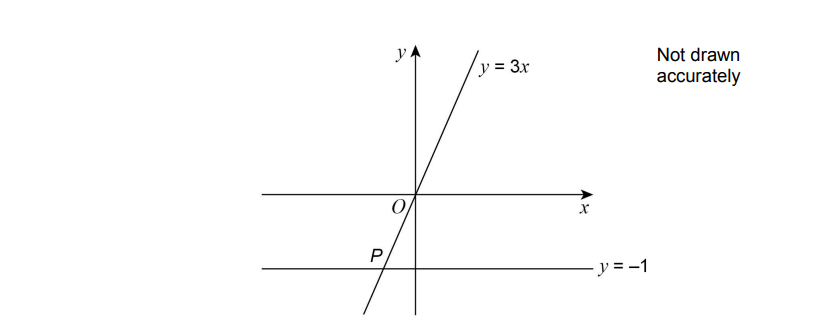
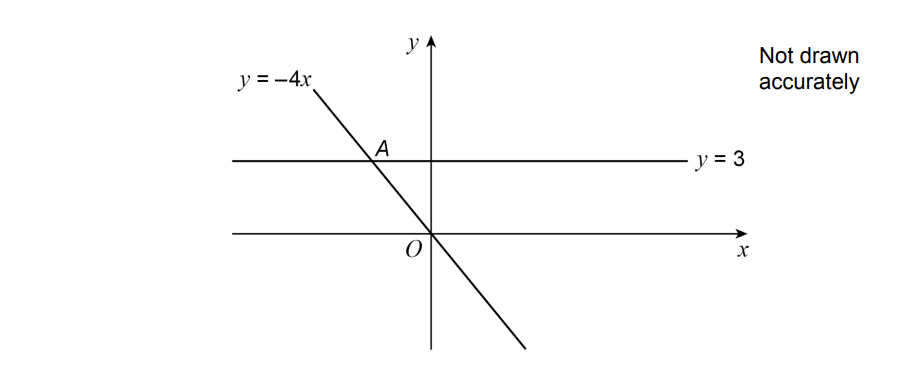
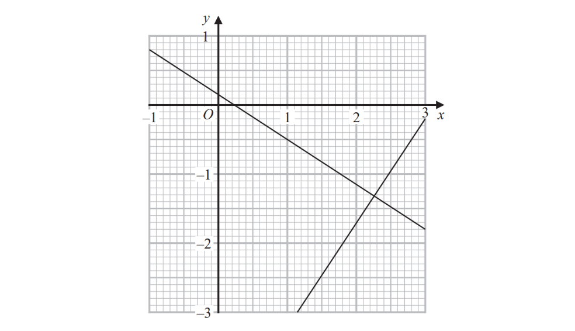
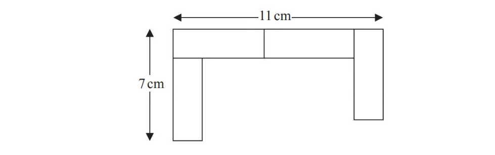
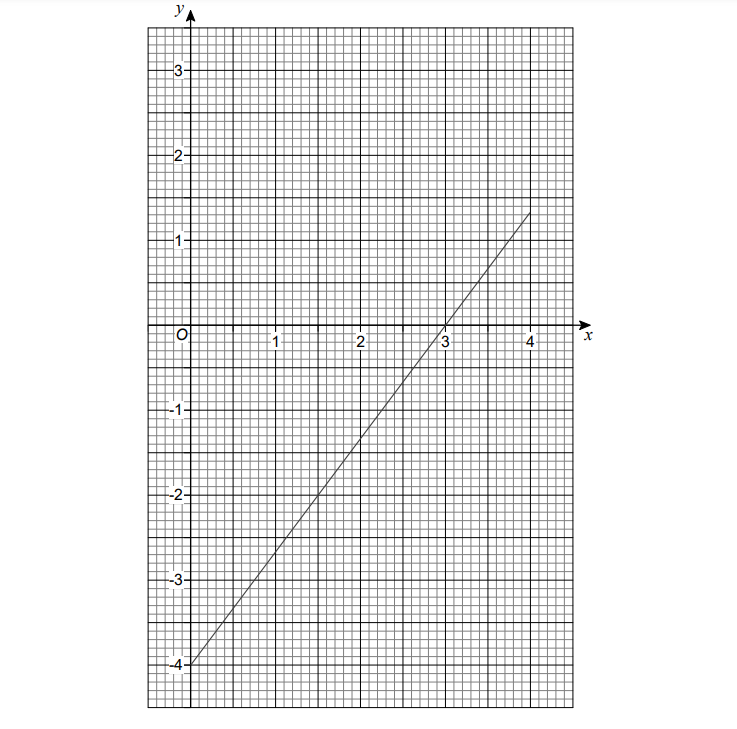
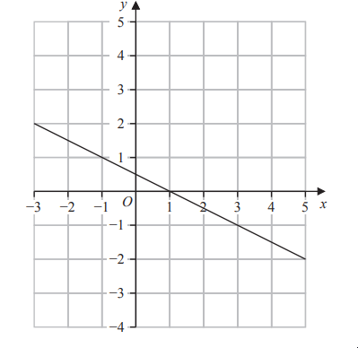
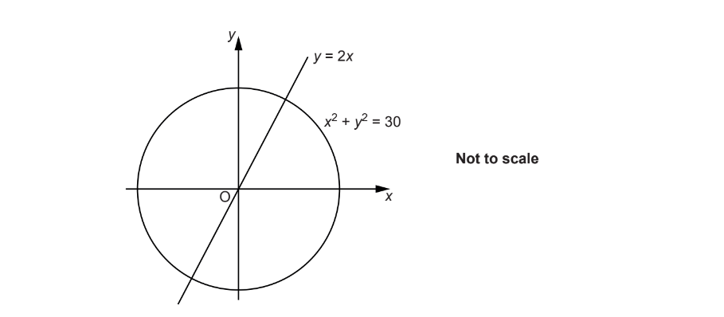

# Exam Questions — Simultaneous Equations
**Equations, Formulae & Identities** · Edexcel IGCSE Maths A (4MA1) — 18/Higher
> Source: [https://www.savemyexams.com/igcse/maths/edexcel/a/18/higher/topic-questions/2-equations-formulae-and-identities/simultaneous-equations/exam-questions/](https://www.savemyexams.com/igcse/maths/edexcel/a/18/higher/topic-questions/2-equations-formulae-and-identities/simultaneous-equations/exam-questions/) · 64 questions · total 272 marks

## Q1 — easy — 3 marks · exam-questions

### 18() — 3 marks — command: solve — structured — from paper June 2014 · 1MA0/1H
Solve the simultaneous equations

$4x+y=25$
 $x---3y=16$

## Q2 — easy — 3 marks · exam-questions

### 19() — 3 marks — command: solve — structured — from paper November 2016 · 1MA0/1H
Solve the simultaneous equations

$2x-y=13\,x-2y=11$

## Q3 — easy — 3 marks · exam-questions

### 2() — 3 marks — command: solve — structured — from paper June 2017 · 1MA1/3H
Solve the simultaneous equations

$3x+y=-4$

$3x-4y=6$

## Q4 — easy — 3 marks · exam-questions

### 10() — 3 marks — command: solve — structured — from paper Jan 2019 · 4MA1/2H
Solve the simultaneous equations

`table row cell 4 x space plus space 5 y space end cell equals cell space 4 space end cell row cell 2 x space – space y space end cell equals cell space 9 end cell end table`

Show clear algebraic working.

## Q5 — easy — 3 marks · exam-questions

### 8() — 3 marks — command: solve — structured — from paper Jan 2019 · 4MA1/1HR
Solve the simultaneous equations

`table row cell 4 x space plus space 2 y space end cell equals cell space 9 space space end cell row cell x space – space 4 y space end cell equals cell space 9 end cell end table`

Show clear algebraic working.

$x=\,y=$

## Q6 — easy — 3 marks · exam-questions

### 9() — 3 marks — command: solve — structured — from paper June 2018 · 4MA1/2H
Solve the simultaneous equations

`table attributes columnalign right center left columnspacing 0px end attributes row cell x space plus space y space end cell equals cell space 15 space end cell row cell 7 x space – space 5 y space end cell equals cell space 3 end cell end table`

Show clear algebraic working.

$x=.......................................................\,y=.......................................................$

## Q7 — easy — 3 marks · exam-questions

### 9() — 3 marks — command: solve — structured — from paper June 2019 · 4MA1/2H
Solve the simultaneous equations

`table row cell x space plus space 2 y space end cell equals cell space minus 0.5 end cell row cell 3 x space minus space y space end cell equals cell space 16 end cell end table`

Show clear algebraic working.

$x=...............\,y=...............$

## Q8 — easy — 3 marks · exam-questions

### 7() — 3 marks — command: solve — structured — from paper Jan 2020 · 4MA1/2HR
Solve the simultaneous equations

`table row cell 3 x space plus space 5 y space end cell equals cell space 6 space end cell row cell 7 x space – space 5 y space end cell equals cell space – 11 end cell end table`

Show clear algebraic working.

`table row cell x space end cell equals cell space............... end cell row cell y space end cell equals cell space............... end cell end table`

## Q9 — easy — 1 marks · exam-questions

### 13() — 1 mark — command: circle — structured — from paper Nov 2017 · 8300/2H
Two straight lines intersect at point $P$.

Circle the coordinates of $P$.

| $(--3,--1)$ | `open parentheses negative 1 space comma negative space 1 third close parentheses` | $(--1,--3)$ | `open parentheses negative space 1 third space comma space minus 1 space close parentheses` |
|---|---|---|---|

## Q10 — easy — 1 marks · exam-questions

### 16() — 1 mark — command: circle — structured — from paper June 2018 · 8300/3H
Two straight lines intersect at point $A$.

Circle the coordinates of $A$.

| $(--\frac{3}{4},3)$ | $(--4,3)$ | $(--12,3)$ | $(--\frac{4}{3},3)$ |
|---|---|---|---|

## Q11 — easy — 3 marks · exam-questions

### 10() — 3 marks — command: solve — structured — from paper June 2017 · 8300/1H
Solve the simultaneous equations.

`table row cell 2 x space plus space y space end cell equals cell space 18 end cell row cell x space minus space y space end cell equals cell space 6 end cell row blank blank blank end table`

## Q12 — easy — 3 marks · exam-questions

### 5() — 3 marks — command: solve — structured — from paper Nov 2019 · 8300/3H
Solve the simultaneous equations

`table attributes columnalign right center left columnspacing 0px end attributes row cell 7 x space plus space 2 y space end cell equals cell space 36 space end cell row cell 3 x space plus space 2 y space end cell equals cell space 16 end cell end table`

$x=......................\,y=......................$

## Q13 — easy — 3 marks · exam-questions

### 2((c)) — 3 marks — command: solve — structured — from paper Specimen 2015 · J560/06
Solve.

$4x+3y=5\,2x+3y=1$

$x$ = ....................

$y$ = ....................

## Q14 — medium — 4 marks · exam-questions

### 11() — 4 marks — command: solve — structured — from paper Spec2 2015 · 1MA1/3H
Solve the simultaneous equations    $2x-4y=19\,3x+5y=1$

## Q15 — medium — 4 marks · exam-questions

### 20() — 4 marks — command: solve — structured — from paper June 2012 · 1MA0/1H
Solve the simultaneous equations

$5x+2y=11\,4x-3y=18$

## Q16 — medium — 4 marks · exam-questions

### 22() — 4 marks — command: solve — structured — from paper November 2012 · 1MA0/1H
Solve the simultaneous equations

$3x+2y=4\,4x+5y=17$

## Q17 — medium — 4 marks · exam-questions

### 18() — 4 marks — command: solve — structured — from paper June 2013 · 1MA0/1H
Solve the simultaneous equations

$4x+7y=1\,3x+10y=15$

## Q18 — medium — 4 marks · exam-questions

### 15() — 4 marks — command: solve — structured — from paper November 2013 · 1MA0/1H
Solve the simultaneous equations

$3x+4y=5$

$2x-3y=9$

## Q19 — medium — 2 marks · exam-questions

### 10() — 2 marks — command: find — structured — from paper June 2019 · 1MA1/1H
The graphs with equations $3y+2x=\frac{1}{2}$ and $2y-3x=-\frac{113}{12}$ have been drawn on the grid below.

Using the graphs, find estimates of the solutions of the simultaneous equations

$3y+2x=\frac{1}{2}\,2y-3x=-\frac{113}{12}\,$

## Q20 — medium — 4 marks · exam-questions

### 4() — 4 marks — command: find — structured — from paper spec1 2015 · 1MA1/1H
A pattern is made using identical rectangular tiles.

Find the total area of the pattern.

## Q21 — medium — 4 marks · exam-questions

### 12() — 4 marks — command: solve — structured — from paper Jan 2021 · 4MA1/2HR
Solve the simultaneous equations     `table row cell 2 x space plus space 7 y space end cell equals cell space 17 space end cell row cell 5 x space plus space 3 y space end cell equals cell space – 1 end cell end table`

Show clear algebraic working.

`table row cell x space end cell equals cell space.................................. end cell row cell y space end cell equals cell space.................................. space end cell end table`

## Q22 — medium — 4 marks · exam-questions

### 1() — 4 marks — command: show — structured
Solve the simultaneous equations

$3x+5y=12\,2.5x+1.5y=8$

Show clear algebraic working

$x=$ ..............

$y=$ ..............

## Q23 — medium — 3 marks · exam-questions

### 8() — 3 marks — command: solve — structured — from paper June 2021 · 4MA1/2H
Solve the simultaneous equations

`table row cell 5 a space plus space 2 c space end cell equals cell space 10 space end cell row cell 2 a space – space 4 c space end cell equals cell space 7 end cell end table`

Show clear algebraic working.

$a=$ .......................................................

$c=$ .......................................................

## Q24 — medium — 4 marks · exam-questions

### 15() — 4 marks — command: solve — structured — from paper Nov 2020 · 4MA1/1H
Solve the simultaneous equations

`table row cell 7 x space – space 2 y space end cell equals cell space 34 space end cell row cell 3 x space plus space 5 y space end cell equals cell space minus 3 end cell end table`

Show clear algebraic working.

$x=$.............................................

$y=$.............................................

## Q25 — medium — 4 marks · exam-questions

### 18() — 4 marks — command: solve — structured — from paper Nov 2020 · 8300/1H
Solve the simultaneous equations

`table row cell 2 x space plus space 4 y space end cell equals cell space – 9 space end cell row cell 2 y space end cell equals cell space 4 x space – space 7 end cell end table`

$x=........................\,y=........................$

## Q26 — medium — 3 marks · exam-questions

### 8() — 3 marks — command: draw — structured — from paper Specimen 2015 · 8300/2H
Here is the graph of $4x--3y=12$ for values of $x$ from 0 to 4

By drawing a second graph on the grid, work out an approximate solution to the simultaneous equations

$4x--3y=12$ and  $3x+2y=6$

## Q27 — medium — 4 marks · exam-questions

### 10() — 4 marks — command: solve — structured — from paper Specimen paper · 4MA1/1H
Solve the simultaneous equations

`table row cell 7 x plus 3 y end cell equals 20 row cell 3 x plus 5 y end cell equals 3 end table`

Show clear algebraic working.

## Q28 — medium — 3 marks · exam-questions

### 9() — 3 marks — command: solve — structured — from paper 2023 June · 4MA1/1H
Solve the simultaneous equations

`table row cell 2 x plus 9 y end cell equals cell 14.5 end cell row cell 7 x plus 3 y end cell equals 8 end table`

Show clear algebraic working.

## Q29 — hard — 4 marks · exam-questions

### 17() — 4 marks — command: solve — structured — from paper November 2015 · 1MA0/1H
Solve

$2x+3y=\frac{2}{3}$

$3x-4y=18$

## Q30 — hard — 5 marks · exam-questions

### 26() — 5 marks — command: solve — structured — from paper June 2014 · 1MA0/2H
Solve the equations

$x^{2}+y^{2}=36\,x=2y+6$

## Q31 — hard — 6 marks · exam-questions

### 25() — 6 marks — command: solve — structured — from paper June 2013 · 1MA0/2H
Solve the simultaneous equations       $x^{2}+y^{2}=9\,x+y=2$

Give your answers correct to $2$ decimal places.

## Q32 — hard — 5 marks · exam-questions

### 20() — 5 marks — command: solve — structured — from paper June 2017 · 1MA1/1H
Solve algebraically the simultaneous equations

$x^{2}+y^{2}=25\,y-3x=13$

## Q33 — hard — 5 marks · exam-questions

### 20() — 5 marks — command: solve — structured — from paper Sample 2015 · 1MA1/2H
Solve algebraically the simultaneous equations

$x^{2}+y^{2}=25\,y-2x=5$

## Q34 — hard — 4 marks · exam-questions

### 14() — 4 marks — command: work_out — structured — from paper June 2017 · 1MA0/1H
3 kg of potatoes and 4 kg of carrots have a total cost of 440p. 4 kg of potatoes and 3 kg of carrots have a total cost of 470p.

Work out the total cost of 1 kg of potatoes and 1 kg of carrots.

## Q35 — hard — 4 marks · exam-questions

### 15() — 4 marks — command: work_out — structured — from paper November 2014 · 1MA0/2H
A cinema sells adult tickets and child tickets.

The total cost of 3 adult tickets and 1 child ticket is £30   
    The total cost of 1 adult ticket and 3 child tickets is £22

Work out the cost of an adult ticket and the cost of a child ticket.

## Q36 — hard — 4 marks · exam-questions

### 11() — 4 marks — command: work_out — structured — from paper November 2017 · 1MA1/1H
3 teas and 2 coffees have a total cost of £7.80 
5 teas and 4 coffees have a total cost of £14.20

Work out the cost of one tea and the cost of one coffee.

## Q37 — hard — 3 marks · exam-questions

### 10() — 3 marks — command: solve — structured — from paper Jan 2022 · 4MA1/2H
Solve the simultaneous equations

`table attributes columnalign right center left columnspacing 0px end attributes row cell 3 x plus 5 y end cell equals cell 3.1 end cell row cell 6 x plus 3 y end cell equals cell 3.75 end cell end table`

Show clear algebraic working.

`table row cell x space end cell equals cell space........................... end cell row cell y space end cell equals cell space........................... end cell end table`

## Q38 — hard — 5 marks · exam-questions

### 18() — 5 marks — command: find — structured — from paper Jan 2022 · 4MA1/2HR
The line with equation $2y=x+1$ intersects the curve with equation $3y^{2}+7y+16=x^{2}--x$ at the points $A$ and $B$

Find the coordinates of $A$ and the coordinates of $B$ Show clear algebraic working.

## Q39 — hard — 4 marks · exam-questions

### 21() — 4 marks — command: solve — structured — from paper June 2019 · 8300/1H
Solve the simultaneous equations

`table row cell 2 x space plus space 3 y space end cell equals cell space 5 p end cell row cell y space end cell equals cell space 2 x space plus space p end cell end table`

where $p$ is a constant.

Give your answers in terms of $p$in their simplest form.

## Q40 — hard — 4 marks · exam-questions

### 20() — 4 marks — command: work_out — structured — from paper June 2018 · 8300/1H
A linear sequence starts

$a+2ba+6ba+10b................$

The 2nd term has value 8

The 5th term has value 44

Work out the values of $a$ and $b$.

$a$ = ......................

$b$ = ......................

## Q41 — hard — 6 marks · exam-questions

### 20() — 6 marks — command: solve — structured — from paper Nov 2020 · J560/04
Solve.

`table attributes columnalign right center left columnspacing 0px end attributes row cell x squared plus y squared end cell equals 34 row y equals cell x plus 2 end cell end table`

Show your working.

$x=.......................y=......................\,x=.......................y=......................$

## Q42 — hard — 5 marks · exam-questions

### 8() — 5 marks — command: find — structured — from paper Nov 2019 · J560/04
The diagrams show the price paid by two groups of people visiting a funfair.

Assume each adult pays the same price and each child pays the same price.

Find the price for an adult and the price for a child.

Adult price = £ ........................................

Child price = £ ........................................

## Q43 — hard — 5 marks · exam-questions

### 20((b)) — 5 marks — command: find — structured — from paper Nov 2018 · J560/06
Given that

`m open parentheses table row 4 row 1 end table close parentheses space plus space n open parentheses table row 5 row 2 end table close parentheses space equals space open parentheses table row 12 row 6 end table close parentheses`

find the value of $m$ and the value of $n$.

$m$ = .......................

$n$ = .......................

## Q44 — hard — 5 marks · exam-questions

### 21() — 5 marks — command: solve — structured — from paper 2023 June · 4MA1/2H
Solve the simultaneous equations

`table row cell 2 x squared plus 3 y squared end cell equals cell 11 space end cell row x equals cell 3 y – 1 end cell end table`

Show clear algebraic working

## Q45 — hard — 3 marks · exam-questions

### 14() — 3 marks — command: solve — structured — from paper 2023 Nov · 4MA1/2H
Here is the graph of the equation $2y+x=1$ drawn on a grid.

By drawing another straight line on the grid, solve the simultaneous equations

`table row cell y minus x minus 2 end cell equals 0 row cell 2 y plus x end cell equals 1 end table`

## Q46 — hard — 5 marks · exam-questions

### 21() — 5 marks — command: find — structured — from paper 2023 Nov · 4MA1/2H
The line with equation $x+2y=5$ intersects the curve with equation $x^{2}+3y^{2}=13$ at the points *A* and *B*

Find the coordinates of *A* and the coordinates of *B* 
Show clear algebraic working.

## Q47 — very_hard — 5 marks · exam-questions

### 20() — 5 marks — command: solve — structured — from paper June 2019 · 1MA1/3H
Solve algebraically the simultaneous equations

$x^{2}-4y^{2}=9\,3x+4y=7$

## Q48 — very_hard — 5 marks · exam-questions

### 1() — 5 marks — command: prove — structured
Prove algebraically that the straight line with equation $x-2y=10$ is a tangent to the circle with equation $x^{2}+y^{2}=20$

## Q49 — very_hard — 11 marks · exam-questions

### 3((a)) — 1 mark — command: write — structured — from paper SME Topic Papers
In all the following sequences, after the first two terms, the rule is to add the previous two terms to find the next term.

Write down the next two terms in this sequence.

1      1      2      3      5      8      13      ..........      .........

### 3((b)) — 2 marks — command: write — structured — from paper SME Topic Papers
Write down the first two terms of this sequence

........       .......         3        11          14

### 3((c)) — 8 marks — command: find — structured — from paper SME Topic Papers
(i)    Find the value of $d$ and the value of $e$

2        $d$     $e$        10

(ii)  Find the value of $x$, the value of $y$ and the value of $z$.

-33          $x$           $y$         $z$       18

## Q50 — very_hard — 5 marks · exam-questions

### 22() — 5 marks — command: find — structured — from paper June 2019 · 1MA1/1H
There are only $r$ red counters and $g$ green counters in a bag.

A counter is taken at random from the bag.

The probability that the counter is green is $\frac{3}{7}$

The counter is put back in the bag.

$2$ more red counters and $3$ more green counters are put in the bag.

A counter is taken at random from the bag. The probability that the counter is green is $\frac{6}{13}$

Find the number of red counters and the number of green counters that were in the bag originally.

## Q51 — very_hard — 5 marks · exam-questions

### 19() — 5 marks — command: solve — structured — from paper Jan 2022 · 4MA1/1H
Solve the simultaneous equations

`table attributes columnalign right center left columnspacing 0px end attributes row cell 3 x squared plus y squared minus x y end cell equals 5 row y equals cell 2 x minus 3 end cell end table`

Show clear algebraic working.

## Q52 — very_hard — 5 marks · exam-questions

### 19() — 5 marks — command: solve — structured — from paper Jan 2021 · 4MA1/1H
Solve the simultaneous equations

`table row cell x squared space – space 9 y space – space x space end cell equals cell space 2 y squared space – space 12 end cell row cell x space plus space 2 y space – space 1 space end cell equals cell space 0 end cell end table`

Show clear algebraic working.

## Q53 — very_hard — 6 marks · exam-questions

### 19() — 6 marks — command: find — structured — from paper Nov 2021 · 4MA1/2H
The straight line $L$ has equation     $x--y=3$

The curve $C$ has equation $3x^{2}--y^{2}+xy=9$

$L$ and $C$ intersect at the points $P$ and $Q$.

Find the coordinates of the midpoint of $PQ$.

Show clear algebraic working.

## Q54 — very_hard — 5 marks · exam-questions

### 17() — 5 marks — command: solve — structured — from paper Jan 2021 · 4MA1/1HR
Solve the simultaneous equations

`table row cell x space – space 6 y space end cell equals cell space 5 space end cell row cell x y space – space 2 y squared space end cell equals cell space 6 end cell end table`

Show clear algebraic working.

## Q55 — very_hard — 5 marks · exam-questions

### 19() — 5 marks — command: solve — structured — from paper June 2021 · 4MA1/2H
Solve the simultaneous equations

`table row cell y space end cell equals cell space 3 space – space 2 x space end cell row cell x squared space plus space y squared space end cell equals cell space 18 end cell end table`

Show clear algebraic working.

## Q56 — very_hard — 6 marks · exam-questions

### 26() — 6 marks — command: work_out — structured — from paper Nov 2020 · 4MA1/2HR
The curve with equation $x^{2}--x+y^{2}=10$ and the straight line with equation $x--y=--4$ intersect at the points $A$and $B$.

Work out the exact length of $AB.$

Show your working clearly and give your answer in the form $\frac{\sqrt{a}}{2}$ where $a$ is an integer.

## Q57 — very_hard — 8 marks · exam-questions

### 27((a)) — 3 marks — command: prove — structured — from paper Nov 2018 · 8300/3H
The line $y=3x+p$ and the circle $x^{2}+y^{2}=53$ intersect at points $A$ and $B$.

$p$ is a positive integer.

Show that the $x$-coordinates of points $A$ and $B$ satisfy the equation

$10x^{2}+6px+p^{2}--53=0$

### 27((b)) — 5 marks — command: work_out — structured — from paper Nov 2018 · 8300/3H
The coordinates of $A$ are (2, 7)

Work out the coordinates of $B$.

You **must** show your working.

## Q58 — very_hard — 3 marks · exam-questions

### 13() — 3 marks — command: work_out — structured — from paper Nov 2017 · 8300/1H
$x:y=7:4$

$x+y=88$

Work out the value of $x--y$

## Q59 — very_hard — 4 marks · exam-questions

### 26() — 4 marks — command: prove — structured — from paper June 2018 · 8300/2H
A curve has equation $y=4x^{2}+5x+3$

A line has equation $y=x+2$

Show that the curve and the line have **exactly** one point of intersection.

Do **not** use a graphical method.

## Q60 — very_hard — 6 marks · exam-questions

### 19() — 6 marks — command: express — structured — from paper Specimen 2015 · J560/05
The prices of two phones are in the ratio *x* : *y*.

When the prices are both increased by £20, the ratio becomes 5 : 2.

When the prices are both reduced by £5, the ratio becomes 5 : 1.

Express the ratio *x* : *y* in its lowest terms.

## Q61 — very_hard — 4 marks · exam-questions

### 8() — 4 marks — command: calculate — structured — from paper Nov 2020 · J560/06
Li has *t* toy bricks.

She only has red bricks and blue bricks. Li picks two bricks, one after the other.

If the first brick she picks is red, the probability that the second brick is red is $\frac{2}{3}$.

If the first brick she picks is blue, the probability that the second brick is red is $\frac{7}{10}.$

Calculate the value of *t *.

*t* = .........................................................

## Q62 — very_hard — 6 marks · exam-questions

### 19() — 6 marks — command: solve — structured — from paper Nov 2017 · J560/05
Solve these simultaneous equations algebraically.

$y=2x^{2}-7x+4$

$y=4x-1$

$x$ = ..................... $y$ = .....................

$x$ = ..................... $y$ = .....................

## Q63 — very_hard — 5 marks · exam-questions

### 17() — 5 marks — command: find — structured — from paper Nov 2018 · J560/06
Find the exact coordinates of the two intersections of the line *y*  = 2*x* and the circle *x*2+ *y*2 = 30

## Q64 — very_hard — 6 marks · exam-questions

### 9((a)) — 5 marks — command: find — structured — from paper June 2017 · J560/04
Each week Dan drives two routes, route X and route Y.

One week he drives route X three times and route Y twice. He drives a total of 134 miles that week.

Another week he drives route X twice and route Y five times. He drives a total of 203 miles that week.

Find the length of each route.

route X = ........................... miles

route Y = ........................... miles

### 9((b)) — 1 mark — command: state — structured — from paper June 2017 · J560/04
State an assumption that has been made in answering part (**a**).

[1]
