# Mark Schemes — Solving Inequalities
**Equations, Formulae & Identities** · Edexcel IGCSE Maths A (4MA1) — 18/Higher

## Q1 — easy — 5 marks · exam-questions

### 1((a)) — 2 marks
*Solve using the skills you would for an equation.* *(Remember the exception is that when multiplying or dividing by a negative, the inequality sign gets reversed.*

> *However, it's best to avoid this if possible by taking all terms to one side of the inequality instead.)*

`table row cell 14 n end cell greater than cell 11 n plus 6 end cell row cell negative 11 n space space space space space space space space space end cell equals cell space space space space space space space space space space space space space space space space minus 11 n end cell row cell 3 n end cell greater than 6 row cell divided by 3 space space space space space space space space end cell equals cell space space space space divided by 3 end cell row n greater than 2 end table`

**[1]**

$n>2$* ***[1]**

### 1((b)) — 3 marks
> *First simplify the inequality to isolate the **x** term.*

`table row cell negative 2 end cell less than cell x plus 3 less or equal than 4 end cell row cell negative 3 space space space space space end cell equals cell space minus 3 space equals space space minus 3 end cell row cell negative 5 end cell less than cell x less or equal than 1 end cell end table`

**[1]**

> *To show the set of values on the number line use solid circles for ≥ and ≤, 'empty' circles for < and >.*

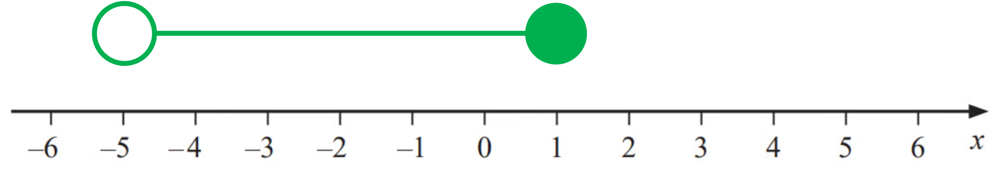

**Either end correct**** [1]** 
**Fully correct and joined**** [1]**

## Q2 — easy — 5 marks · exam-questions

### 8((a)) — 2 marks
> *"*$n$* is an integer" means *$n$* is a whole number*

> *"*$-1\leqn$*" means  *$n$* includes *$-1$

> *"*$n<4$*" means *$n$* does **not** include  *$4$

**−1, 0, 1, 2, 3**** ****[2] **

**including 4, or missing off one number loses one mark missing more than one number, or including more than one additional number scores no marks**

### 8((b)) — 2 marks
> *Open circle means "not including", closed circle means "including" *
*We assume that the missing numbers continue with the same scale, so the closed circle is above "3"*

$-4<x\leq3$

**"**$-4<x$**" or equivalent ****[1]**
 **"**$x\leq3$**" ****or equivalent**** [1]**

### 8((c)) — 1 marks
> *Add 2 to both sides*

$y>7$  **[1]**

** "=" or an incorrect inequality sign in the final answer will lose the mark**

## Q3 — easy — 4 marks · exam-questions

### 12((a)) — 2 marks
> *"*$n$* is an integer" means *$n$* is a whole number*

> *"*$-3<n$*" means  *$n$* does **not **include *$-3$

> *"*$n\leq1$*" means *$n$* **does** include 1*

**−2, −1, 0, 1**** ****[2] **

**including −3, or missing off one number loses one mark missing more than one number, or including more than one additional number scores no marks**

### 12((b)) — 2 marks
> *Add 7 to both sides*

$3p>18$

**[1]**

> *Divide both sides by 3*

$p>6$ **[1] **

**"=" or an incorrect inequality sign in the final answer will lose a mark**

## Q4 — easy — 2 marks · exam-questions

### 17((a)) — 2 marks
> *Add 5 to both sides*

$3x<21$

**[1]**

> *Divide both sides by 3*

$x<7$ **[1] **

**"=" or an incorrect inequality sign in the final answer will lose a mark**

## Q5 — easy — 4 marks · exam-questions

### 10((a)) — 2 marks
$<$ *and*$>$*are represented by open circles on a number line*

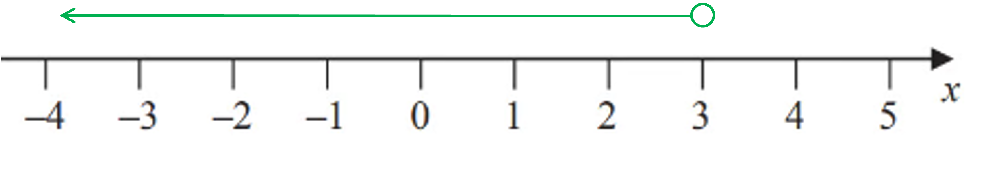

**unshaded circle at 3**** [1]** 
**arrowed line going left from 3 ****[1]**

### 10((b)) — 2 marks
> *Add 7 to both sides*

$4x\geq20$

**[1]**

> *Divide both sides by 4*

$x\geq5$ **[1] **

**"=" or an incorrect inequality sign in the final answer will lose a mark**

## Q6 — easy — 4 marks · exam-questions

### 5((a)) — 2 marks
> *Subtract 5 from both sides*

$6y>3$

**[1]**

> *Divide both sides by 6*

$y>\frac{1}{2}$ **[1] **

**"=" or an incorrect inequality sign in the final answer will lose a mark**

### 5((b)) — 2 marks
> *Open circle means "not including", closed circle means "including"*

$-3<x\leq4$

**"**$-3<x$**" or equivalent ****[1]** 
**"**$x\leq4$**" ****or equivalent**** [1]**

## Q7 — easy — 2 marks · exam-questions

### 7((a)) — 2 marks
*This is a double inequality so any operations need to be carried out on all three 'sides'.*

> *To isolate **y** we need to divide (each 'side') by 2.*

`table row cell negative 4 over 2 end cell less or equal than cell fraction numerator 2 y over denominator 2 end fraction less than 6 over 2 end cell row cell negative 2 end cell less or equal than cell y less than 3 end cell end table`

> *Integers are whole numbers and include zero. ≤ means 'including' (so -2 is included) and < means 'excluding' (so 3 is not included).*

$-2,-1,0,1,2$

**Four correct values only or all five with one extra** **[1] **
**Fully correct**** [1]**

## Q8 — easy — 4 marks · exam-questions

### 9() — 3 marks
*This is a double inequality so any operations need to happen to all three 'sides' of the inequality.*

> *To isolate **x **start by adding 3 (to all 3 'sides').*

`table row cell negative 7 plus 3 end cell less or equal than cell 2 x minus 3 plus 3 less than 5 plus 3 end cell end table`

**[1]**

`table row cell negative 4 end cell less or equal than cell 2 x less than 8 end cell end table`

> *Now divide by 2.*

`table row cell fraction numerator negative 4 over denominator 2 end fraction end cell less or equal than cell fraction numerator 2 x over denominator 2 end fraction less than 8 over 2 end cell end table`

**[1]**

`table row cell negative 2 end cell less or equal than cell x less or equal than 4 end cell end table`

$-2\leqx<4$* ***[1]**

### 9() — 1 marks
> *To show *$-2\leqx<4$* on the number line use solid circles for ≤ (at -2) and 'empty' circles for < (at 4).*

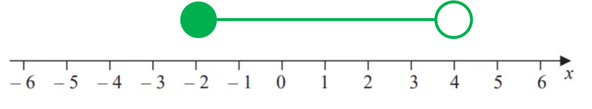

**Either end correct**** [1]** 
**Fully correct and joined**** [1]**

## Q9 — easy — 2 marks · exam-questions

### 6((a)) — 2 marks
*Solve using the skills you would for an equation.*
 *(Remember the exception is that when multiplying or dividing by a negative, the inequality sign gets reversed.* 
*However, it's best to avoid this if possible by taking all terms to one side of the inequality instead.)*

`table row cell 5 x minus 7 end cell less or equal than 2 row cell plus 7 space space space space space space space space space space end cell equals cell space space space space plus 7 end cell row cell 5 x end cell less or equal than 9 row cell divided by 5 space space space space space space space space space end cell equals cell space space space space divided by 5 end cell row x less or equal than cell 9 over 5 end cell end table`

**[1]**

$x\leq\frac{9}{5}$* ***[1]**

## Q10 — easy — 3 marks · exam-questions

### 1((a)) — 2 marks
> *"*$n$* is an integer" means *$n$* is a whole number*

> *"*$-2\leqn$*" means  *$n$* includes *$-2$

> *"*$n<3$*" means *$n$* does **not** include  3*

**−2, -1, 0, 1, 2**** ****[2]**
** ****Any 4 with no repeats or extras ****[1]**** **
**Fully correct ****[1]**

### 1((b)) — 1 marks
> *To show '≤' on a number line use a solid circle (at 1). *
*To show that all values of y (less than or equal to 1) are valid, draw a line to the appropraite end of the diagram and draw an arrow.*

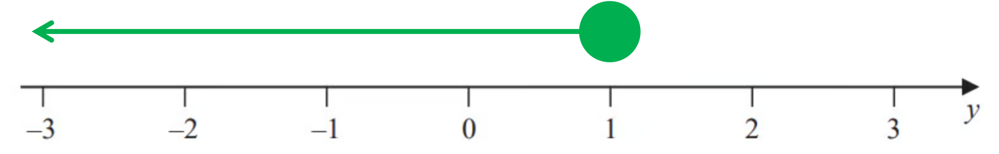

**[1]**

## Q11 — easy — 2 marks · exam-questions

### 5() — 2 marks
> *Method 1*

> *Expand the brackets.*

$5x+15<60$

**[1]**

> *Subtract 15 from both sides.*

$5x<45$

> *Divide both sides by 5.*

$x<9$ **[1]**

> *Method 2*

> *60 is divisible by 5 so divide both sides by 5.*

$x+3<12$

**[1]**

> *Subtract 3 from both sides.*

$x<9$ **[1]**

## Q12 — easy — 1 marks · exam-questions

### 14() — 1 marks
> *Method 1*

> *Divide both sides by −3. *

> *Remember that when multiplying or dividing by a negative number, reverse the inequality sign.*

$x<-2$** [1]**

> *Method 2*

> *Add *$3x$* to both sides.*

$0>3x+6$

> *Subtract 6 from both sides.*

$-6>3x$

> *Divide both sides by 3. *

$-2>x$

$-2>x\mathrm{or}x<-2$** [1]**
**Both answers are valid though '**$x<...$**' is clearer**

## Q13 — easy — 1 marks · exam-questions

### 1() — 1 marks
$<$ *and*$>$*are represented by open circles on a number line. *$\leq$* and *$\geq$* are represented by open circles on a number line.*

> *There is an open circle at -4 so we are looking for *$-4<x$*. **This rules out options 1 and 2.*

> *There is a closed circle at 5 so we are looking for *$x\leq5$*. **This rules out option 3.*

**The correct option is option four, **$-4<x\leq5$** [1]**

## Q14 — easy — 1 marks · exam-questions

### 21() — 1 marks
*The graph is of the function* `straight f open parentheses x close parentheses` *so *`straight f open parentheses x close parentheses space greater than space 0`* where the graph is **above **the *$x$*- axis.*

> *The graph is above the *$x$*- axis between the values of -2.5 and 1, so when *$x>-2.5$* and when *$x<1$*.*

**The correct option is option three, **$-2.5<x<1$** [1]**

## Q15 — easy — 2 marks · exam-questions

### 10((a)) — 2 marks
> *Add 2 to both sides*

$3x>12$

**[1]**

> *Divide both sides by 4*

$x>4$  **[1]**

## Q16 — easy — 1 marks · exam-questions

### 2() — 1 marks
> *First solve the inequality in the normal way*

> *Add 1 to both sides*

$5x<11$

> *Divide both sides by 5*

$x<2.2$

> *So the largest integer that satisfies this is 2*

**2****  ****[1]**

## Q17 — easy — 4 marks · exam-questions

### 1((c)) — 2 marks
> *Solve for *$q$*, using the balance method for example and doing the same thing to each side of the inequality*

`table row cell 2 q end cell greater or equal than cell 31 minus 3 q end cell row cell 2 q plus 3 q end cell greater or equal than 31 row cell 5 q end cell greater or equal than 31 row q greater or equal than cell 31 over 5 end cell end table`

**[M1]**

$q\geq\frac{31}{5}$

**[A1]**

> **[mark-scheme]**
> **M1**: This mark is awarded for a correct first step for solving the inequality or for giving a solution of $\frac{31}{5}$or 6.2 (e.g. $q=6.2$).
> 
> **A1**: $q\geq6.2$ also accepted. This mark is only gained for a correct solution using the correct inequality (for example $q>6.2$ will only gain the first mark).

### 1((d)) — 2 marks
> *The non-strict inequality (*$\leq$*) means that -2 is included in the solutions*

> *The strict inequality (*$<$*) means that 3 is not included in the solutions*

$n=-2,-1,0,1,2$

**[B1 B1]**

> **[mark-scheme]**
> **B1**: For either:
> 
> - at least 4 correct values given with no additional incorrect values (e.g. -1, 0, 1, 2)
> - all correct solutions given with only one additional incorrect solution (e.g. -1, -1, 0, 1, 2, 3).
> 
> **B1**: For the correct values, and only the correct values, listed.

## Q18 — easy — 4 marks · exam-questions

### 1() — 2 marks
Add 9 to both sides

$5t<45$

**[M1]**

Divide both sides by 5

$t<9$

**[A1]**

### 2() — 2 marks
Write down the whole numbers that are:

- bigger than -3
- at most 1

**Final answer:** **-2, -1, 0, 1**

**[B1 B1]**

> **[mark-scheme]**
> **B1**:** **For at least 3 correct and none incorrect. You can also get this mark if you have all 4 correct numbers as well as one extra number.
> 
> **B1**:** **For all correct.** **

## Q19 — medium — 4 marks · exam-questions

### 14((a)) — 2 marks
$<$ *and*$>$*are represented by open circles on a number line *$\leq$* and *$\geq$* are represented by solid circles on a number line*

> * *

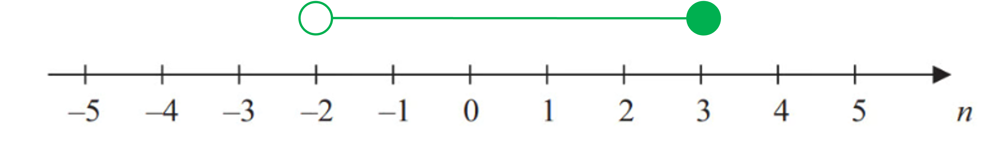

**line joining; shaded circle at 3...**** [1]**
 **...and unshaded circle at −2 ****[1]**

### 14((b)) — 2 marks
> *Subtract *$6x$* from both sides (always subtract the smaller *$x$* term, rather than the larger one)*

$2x-3\geq4$

> *Add 3 to both sides*

$2x\geq7$

> *Divide both sides by 2*

$x\geq3.5\mathrm{or}3.5\leqx$
 $"3.5"$** or  **$"\frac{7}{2}"$* ***[1] **
**correct inequality sign ****[1]**

## Q20 — medium — 4 marks · exam-questions

### 13((a)) — 2 marks
> *"*$y$* is an integer" means *$y$* is a whole number*

> *"*$-5<y$*" means  *$y$* does **not** include *$-5$

> *"*$y\leq0$*" means *$y$* includes *$0$

**−4, −3, −2, −1, 0**** ****[2]**

** ****including −5, or missing off one number, loses a mark missing more than one number, or including more than one additional number scores no marks**

### 13((b)) — 2 marks
> *Method 1 *

> *Expand the brackets*

$6x-12>15$

> *Add 12 to both sides*

$6x>27$

> *Divide both sides by 6*

$x>4.5$

$x>4.5\mathrm{or}4.5<x$
** **$"4.5"$** or****  **$"\frac{9}{2}"$* ***[1]**
** ****correct inequality sign ****[1]**

> *Method 2 *

> *Divide both sides by 6*

$x-2>2.5$

> *Add 2 to both sides*

$x>4.5\mathrm{or}4.5<x$
** **$"4.5"$** ****or****  **$"\frac{9}{2}"$* ***[1] **
**correct inequality sign ****[1]**

## Q21 — medium — 4 marks · exam-questions

### 10((a)) — 2 marks
> *"*$m$* is an integer" means *$m$* is a whole number*

> *"*$-2<m$*" means *$m$* does **not** include *$-2$

> *"*$m\leq3$*" means *$n$* includes *$3$

** −1, 0, 1, 2, 3**** ****[2] **

**including −2, or missing off one number, loses a mark missing more than one number, or including more than one additional number scores no marks**

### 10((b)) — 2 marks
> *Subtract *$3x$* from both sides (always subtract the smaller *$x$* term, rather than the larger one)*

$4x-9<4$

> *Add 9 to both sides*

$4x<13$

> *Divide both sides by 4*

$x<3.25\mathrm{or}3.25>x$
 $"3.25"$** or  **$"\frac{13}{4}"$* ***[1] **
**correct inequality sign ****[1]**

## Q22 — medium — 4 marks · exam-questions

### 9((b)) — 2 marks
> *Subtract *$x$* from both sides (always subtract the smaller *$x$* term, rather than the larger one)*

$5x+4>17$

> *Subtract 4 from both sides*

$5x>13$

> *Divide both sides by 5*

$x>2.6\mathrm{or}2.6<x$
 $"2.6"$** or  **$"\frac{13}{5}"$* ***[1]**
** ****correct inequality sign ****[1]**

### 9((c)) — 2 marks
> *First solve by dividing all 3 parts by 2, taking care to keep both inequality signs the same*

$-2.5<n\leq3$

**[1]**

> *"*$n$* is an integer" means *$n$* is a whole number so the first integer that is included is *$-2$

> *"*$n\leq3$*" means  *$n$* includes *$3$

**−2, −1, 0, 1, 2, 3**** ****[1]**

## Q23 — medium — 3 marks · exam-questions

### 1((a)) — 1 marks
> *Open circles represent > and < on a number line. An arrow indicates an open ended (infinite) inequality.*

$x>-3$* ***[1]**

### 1((b)) — 2 marks
> *Subtract the lower amount of y (**y**) from both sides.*

$3y-13\leq8$

> *Add 13 to both sides.*

$3y\leq21$

**[1]**

> *Divide both sides by 3.*

$y\leq7$

$y\leq7$** [1]**

## Q24 — medium — 4 marks · exam-questions

### 3((a)) — 2 marks
> *< and > are represented by open circles on a number line*

> * ≤ and ≥  are represented by solid circles on a number line*

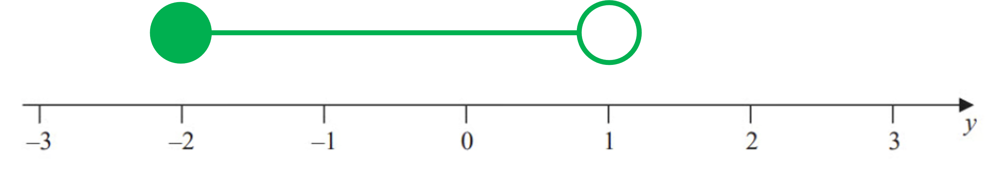

**Shaded circle at -2 or unshaded at 1 ****[1]** 
**Fully correct ****[1]**

### 3((b)) — 2 marks
*An **integer** is a whole number (positive or negative and including zero).*

*Looking at the inequality signs, -3.4 is **not** included (and is not an integer anyway), 2 **is** included.*

> *So we need to list **all** the integers from -3 to 2 **inclusive.*

**Final answer:** **-3, -2, -1, 0, 1, 2 **

**5 correct values ****[1]**
**All correct ****[1]**

## Q25 — medium — 4 marks · exam-questions

### 5((c)) — 3 marks
> *Subtract *$2t$* from both sides (always subtract the smaller *$t$* term, rather than the larger one).*

$5t-8\leq7$

**[1]**

> *Add 8 to both sides.*

$5t\leq15$

> *Divide both sides by 5.*

$t\leq3$

$t\leq3$ **[1]**

### 5((c)) — 1 marks
> *Less than or equal to, ≤, is represented on a number line by a solid circle.*
* There is no lower limit on *$t$* so draw a line to the appropriate end of the diagram and put an arrow on it.*

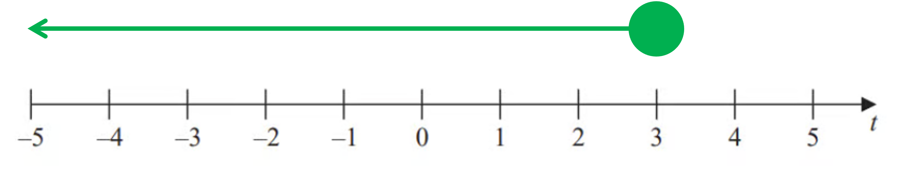

**[1]**

## Q26 — medium — 2 marks · exam-questions

### 7((b)) — 2 marks
> *Subtract *$2t$* from both sides (always subtract the smaller *$t$* term, rather than the larger one).*

$5t-3\leq31$

**[1]**

> *Add 3 to both sides.*

$5t\leq34$

> *Divide both sides by 5.*

$t\leq\frac{34}{5}$

$t\leq\frac{34}{5}$ **[1]**

**A decimal (6.8) or mixed number (**$6\frac{4}{5}$**) are also acceptable answers.**

## Q27 — medium — 3 marks · exam-questions

### 12() — 3 marks
> *Subtract *$3x$* from both sides (always subtract the smaller *$x$* term, rather than the larger one).*

$15<5x+3$

**[1]**

> *Subtract 3 from both sides.*

$12<5x$

> *Divide both sides by 5.*

$\frac{12}{5}<x$

$x>\frac{12}{5}$ **[1]**

**Be careful rewriting the answer to start with ****x****. 2.4 and **$2\frac{2}{5}$** are also acceptable.**

## Q28 — medium — 2 marks · exam-questions

### 1((c)) — 2 marks
> *Subtract *$-3q$* (or add *$3q$*) from both sides (always subtract the smaller *$q$* term, rather than the larger one).*

$5q\geq31$

**[1]**

> *Divide both sides by 5.*

$q\geq\frac{31}{5}$

$q\geq\frac{31}{5}$ **[1]**

**6.2 and **$6\frac{1}{5}$** are also acceptable.**

## Q29 — medium — 2 marks · exam-questions

### 15() — 2 marks
> *Subtract 11 from both sides.*

$-7>-\frac{x}{3}$

**[1]**

> *Multiply both sides by *$-3$* to clear the fraction; remember to reverse the inequality sign when multiplying or dividing by a negative number.*

$21<x$

> *Divide both sides by 2.*

$x>21\mathrm{or}21<x$*  ***[1]**

## Q30 — medium — 3 marks · exam-questions

### 10() — 3 marks
> *Solve *$2\leqx+3<9$* first.*

$-1\leqx<6$

> *Write down the integer values for *`– 4 space less than space x space less-than or slanted equal to space 2`* and for *$2\leqx+3<9$* underneath each other.*

$-4<x\leq2:-3,-2,-1,0,1,2\,2\leqx+3<9:-1,0,1,2,3,4,5$

**one mark for each correct list**** [2]**

> *Eliminate numbers that don't appear in both lists.*

`negative 4 space less than space x space less or equal than space 2 colon space space space space space space space space space up diagonal strike negative 3 end strike comma space up diagonal strike negative 2 end strike comma space minus 1 comma space space 0 comma space space 1 comma space space 2
2 space less or equal than space x space plus space 3 space less than space 9 colon space space space space space space space space space space space space space space space space space space space space minus 1 comma space space 0 comma space space 1 comma space space 2 comma space space up diagonal strike 3 comma space space up diagonal strike 4 comma space space up diagonal strike 5 space`

> *Write down the numbers that are in both lists.*

$-1,0,1,2$ **[1]**

## Q31 — medium — 2 marks · exam-questions

### 10() — 2 marks
> *Subtract 3 from both sides.*

$5>-\frac{1}{2}x$

> *Multiply both sides by 2 to clear the fraction.*

$10>-x$

> *Multiply both sides by −1. Remember to reverse the inequality sign when multiplying or dividing by a negative number.*

$-10<x$

$-10<x\mathrm{or}x>-10$** [1]**

**Both answers are valid though '**$x>...$**' is clearer**

## Q32 — medium — 2 marks · exam-questions

### 5((b)) — 2 marks
> *Subtract *$2x$* from both sides (always subtract the smaller *$x$* term, rather than the larger one).*

$5x+6>1$

> *Subtract 6 from both sides.*

$5x>-5$

**[1]**

> *Divide both sides by 5.*

$x>-1$  **[1]**

**You could also write -1 < ****x**

## Q33 — medium — 2 marks · exam-questions

### 29() — 2 marks
> `straight f open parentheses x close parentheses space greater or equal than space 0`* means we only want values of *$x$* that give positive values *$y$*.*

> *Highlight the part of the graph that is above the *$x$*-axis.*

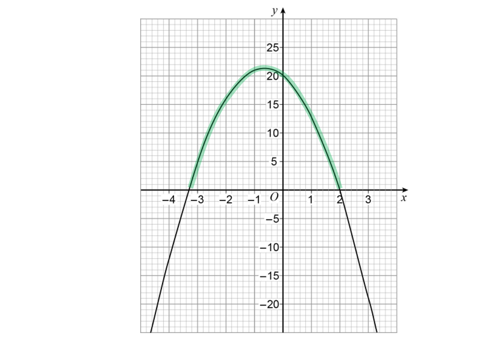

> *The integer (whole number) *$x$* values that lie in this part of the graph are;*

**Final answer:** $-3,-2,-1,0,1,2$** **

**one mistake only  (omission or addition) ****[1]** 
**fully correct list**** [1]**

## Q34 — medium — 5 marks · exam-questions

### 8((a)) — 3 marks
> *Subtract *$3x$* from both sides (always subtract the smaller *$x$* term, rather than the larger one).*

$2x+6\geq15$

**[1]**

> *Subtract 6 from both sides.*

$2x\geq9$

**[1]**

> *Divide both sides by 2.*

$x\geq4.5\mathrm{or}4.5\leqx$ **[1]**

### 8((b)) — 2 marks
$<$ *and*$>$*are represented by open circles on a number line*

> * *$\leq$* and *$\geq$* are represented by open circles on a number line*

$2\leqx<5$

$2\leqx$** [1]**
$x<5$** ****[1]**

## Q35 — medium — 1 marks · exam-questions

### 17() — 1 marks
> *Square root both sides of the given inequality.*

$m>\sqrt{9}\,m>\pm3$

> *So the possible solutions to the inequality are **m** > 3 or **m** < -3.*

> *Read the question carefully - it asks for a possible value of **m**, rather than a solution to the inequality. You are looking for a value which is either greater than 3 or less than -3. *

> *Check each option:*

> *Option 1: *

$2\frac{7}{8}<3\,2\frac{7}{8}>-3$

> *So option 1 is not correct. *

> *Option 2: *

$2.8<3\,2.8>-3$

> *So option 2 is not correct. *

> *Option 3 is the number 3 which cannot be correct as a solution to the inequality is **m** > 3.*

> *Option 4: *

$-\frac{7}{2}=3.5>3$

> *So option 4 is correct. *

** The correct option is option four, **$-\frac{7}{2}$ **[1]**

## Q36 — medium — 4 marks · exam-questions

### 2() — 4 marks
> *Subtract 4 from both sides, keeping the inequality sign the same.*

$3x<19-4\,3x<15$

**[1]**

> *Divide both sides by 3.*

$x<\frac{15}{3}\,x<5$

> *Represent this on a number line, the sign is less than so the arrow will point in the negative direction and there should be a hollow circle at the number 5.*

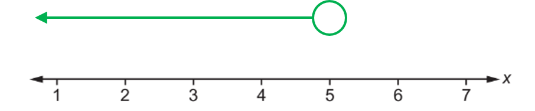

*  ***Hollow circle at 5 ****[1] **
**Correct arrow ****[1]**

## Q37 — medium — 4 marks · exam-questions

### 1() — 4 marks
> *Add 5 to both sides*

$3x\geq15$

**[1]**

> *Divide both sides by 3*

$x\geq5$

**[1]**

> *≤ or ≥ are denoted by a solid circle on a number line; draw an arrow right from a solid circle above '5'.*

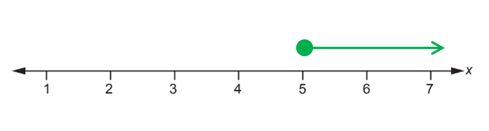

**arrow going right from 5**** [1] **
**from a solid (filled) circle**** [1]**

## Q38 — medium — 3 marks · exam-questions

### 2() — 3 marks
> *Solve the inequality first.*

> *Add 1 to both sides, keeping the inequality sign the same.*

$3x>-6$

**[1]**

> *Divide both sides by 3.*

$x>-2$

**[1]**

> *The hollow circle above −2 is correct as the inequality is '>' rather than '≥'. But the arrow is pointing the wrong direction.*

**No because the arrow is pointing in the wrong**** ****direction*** ***[1]**
** "No" ****plus**** a valid reason achieves the final mark**

## Q39 — medium — 3 marks · exam-questions

### 2() — 3 marks
> *Subtract *$x$* from both sides (always subtract the smaller *$x$* term, rather than the larger one)*

$4x+1>13$

** ****[1]**

> *Subtract 1 both sides*

$4x>12$

** ****[1]**

> *Divide both sides by 4*

$x>3$**[1]**

## Q40 — medium — 4 marks · exam-questions

### 17((a)) — 3 marks
> *Rearrange the inequality so that the right hand side is set to zero*

`table row cell x squared plus 2 x minus 6 x minus 5 end cell greater than 0 row cell x squared minus 4 x minus 5 end cell greater than 0 end table`

**[M1]**

> *Replace the inequality sign with an 'equals' sign so that it can be solved as a quadratic equation first*

$x^{2}-4x-5=0$

> *Solve by factorising*

> **[exam-tip]**
> Completing the square or the quadratic formula will give the same solutions, but factorising is the most efficient method in this case.

`open parentheses x minus 5 close parentheses open parentheses x plus 1 close parentheses equals 0
x equals 5 space space or space space x equals negative 1`

**[M1]**

> *Sketch the quadratic function, plotting the roots of the equation and the y-intercept*

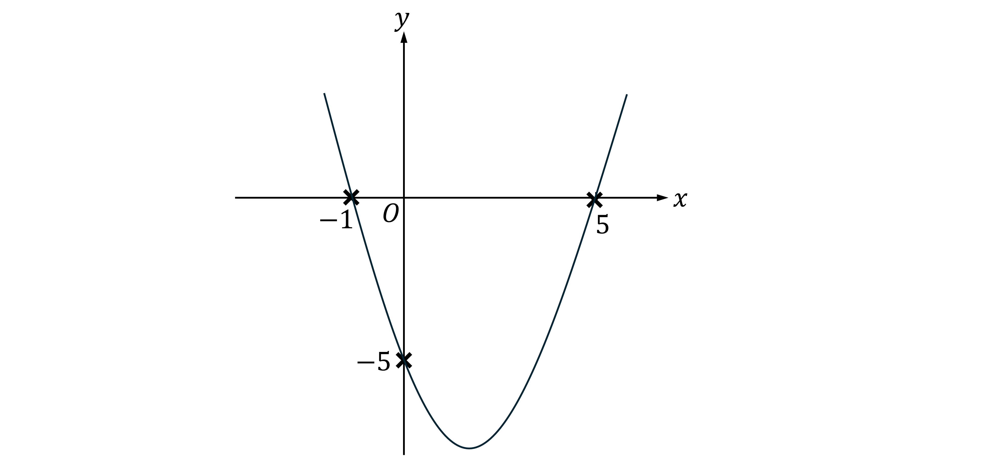

> *Looking at the graph, the values of **y** are greater than zero when *$x<-1$* and *$x>5$

**Final answer:** $x<-1$** and **$x>5$

**[A1]**

### 17((b)) — 1 marks
> *Draw unfilled circles to represent the 'strict' inequalities used in this question*

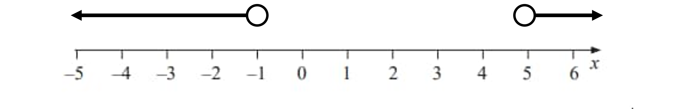

**[B1]**

## Q41 — medium — 2 marks · exam-questions

### 8((a)) — 2 marks
> *Collect the *$x$* terms on one side of the inequality side by subtracting *$3x$* from both sides*

$5x-4\geq-10$

> *Add *$4$* to both sides*

$5x\geq-6$

**[M1]**

> *Divide both sides by *$5$

$x\geq-\frac{6}{5}$

**[A1]**

> **[mark-scheme]**
> **M1**: For collecting $x$ terms on one side and numbers on the other, even if the inequality sign is incorrect.
> 
> **A1**: The inequality sign must be correct for this mark.

## Q42 — hard — 3 marks · exam-questions

### 1() — 3 marks
Rearrange the equation to make one side equal to zero

$x^{2}-9x+14<0$

**[M1]**

Factorise the quadratic

- -7 and -2 add to give -9 and multiply to give 14

`open parentheses x minus 7 close parentheses open parentheses x minus 2 close parentheses space less than space 0`

**[M1]**

Solve the inequality

- The roots are 2 and 7
- A positive quadratic is below the x-axis for x-values between the roots

$2<x<7$

**[A1]**

> **[mark-scheme]**
> **M1**: For rearranging.
> 
> **M1**: For factorising.
> 
> **A1**: Correct answer. You need both endpoints of the inequality.

## Q43 — hard — 4 marks · exam-questions

### 21() — 4 marks
> *First rearrange to the form *$ax^{2}+bx+c>0$

`table row cell x squared minus 3 open parentheses x plus 6 close parentheses end cell greater than 0 row cell x squared minus 3 x minus 18 end cell greater than 0 end table`

**[1]**

> *Now ignore the inequality sign and solve as a quadratic equation to find the roots*

*two numbers that times to −18 and add to −3 are 3 and −6*

`table attributes columnalign right center left columnspacing 0px end attributes row cell open parentheses x plus 3 close parentheses open parentheses x minus 6 close parentheses end cell equals 0 end table`

**[1]**

> *Solve*

`table row x equals cell negative 3 comma space space x equals 6 end cell end table`

**[1]**

> *Now that we have the roots, we need to consider the original inequality *$x^{2}-3x-18>0$* *

> *Sketch a graph of the quadratic. The squared term is positive so we sketch a U-shaped parabola...*

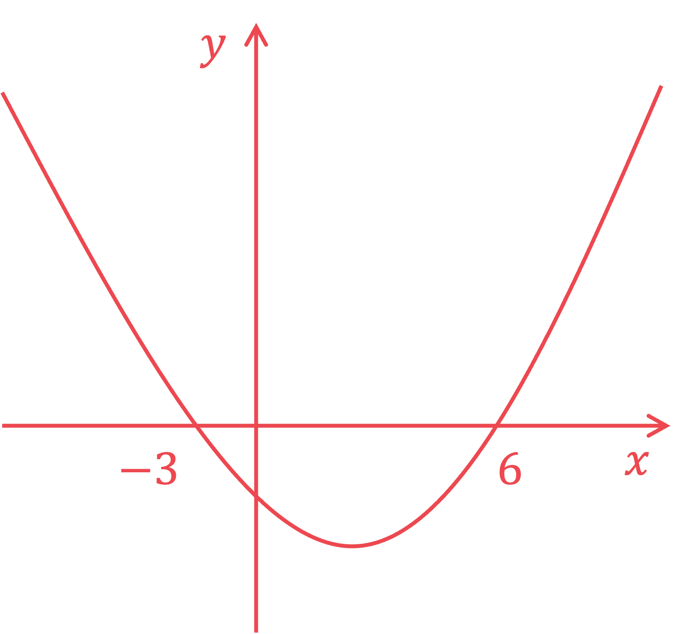

> *...and *$">0"$* tells us to look for values **above** the *$x$*-axis. It helps to **shade the region we don't want**- below the *$x$*-axis*

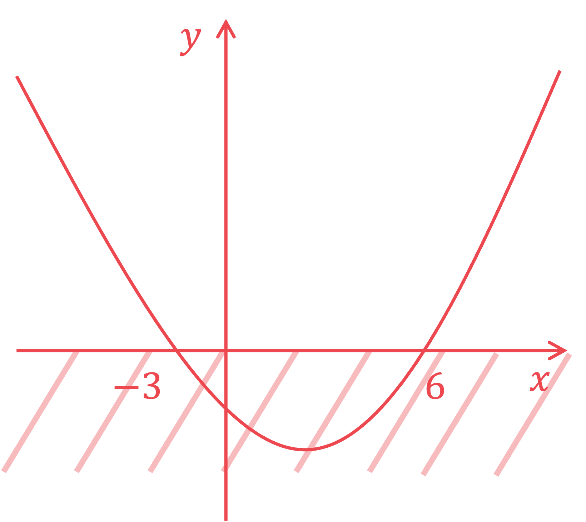

$x<-3,x>6$ **[1] **

**Always sketch the graph to decide which way to put the inequality signs- they must be correct to achieve the final mark**

## Q44 — hard — 3 marks · exam-questions

### 19() — 3 marks
> *First rearrange to the form *$ax^{2}+bx+c>0$

`table row cell x squared minus 3 x minus 4 end cell greater than 0 end table`

> *Now ignore the inequality sign and solve as a quadratic equation to find the roots*

*two numbers that times to −4 and add to −3 are −4 and 1*

`table row cell open parentheses x minus 4 close parentheses open parentheses x plus 1 close parentheses end cell equals 0 end table`

**[1]**

> *Solve*

`table row x equals cell 4 comma space space x equals negative 1 end cell end table`

**[1]**

> *Now that we have the roots, we need to consider the original inequality *$x^{2}-3x-4>0$* *

> *Sketch a graph of the quadratic. The squared term is positive so we sketch a U-shaped parabola...*

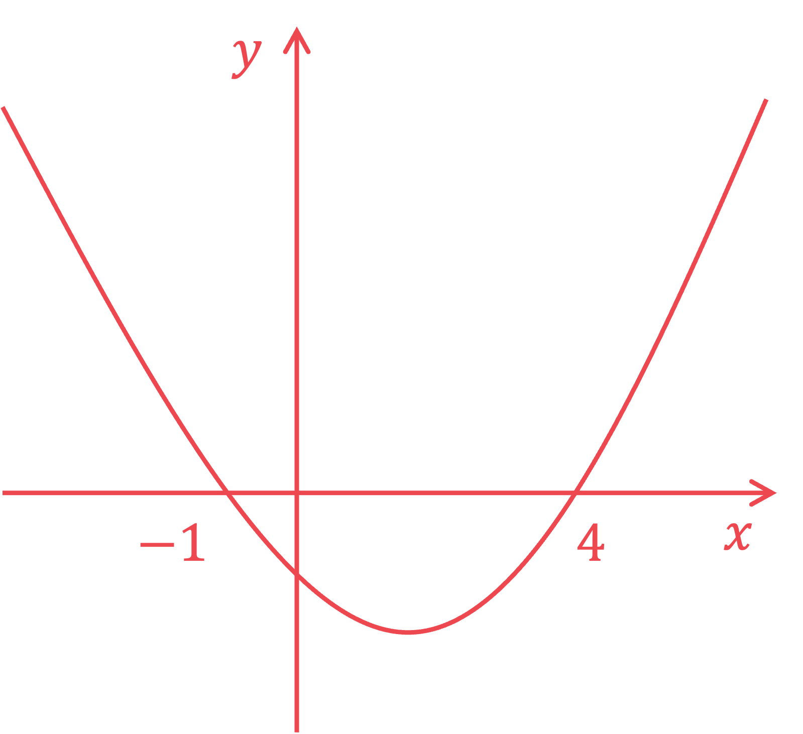

> *...and *$">0"$* tells us to look for values **above** the *$x$*-axis. It helps to **shade the region we don't want**- below the *$x$*-axis*

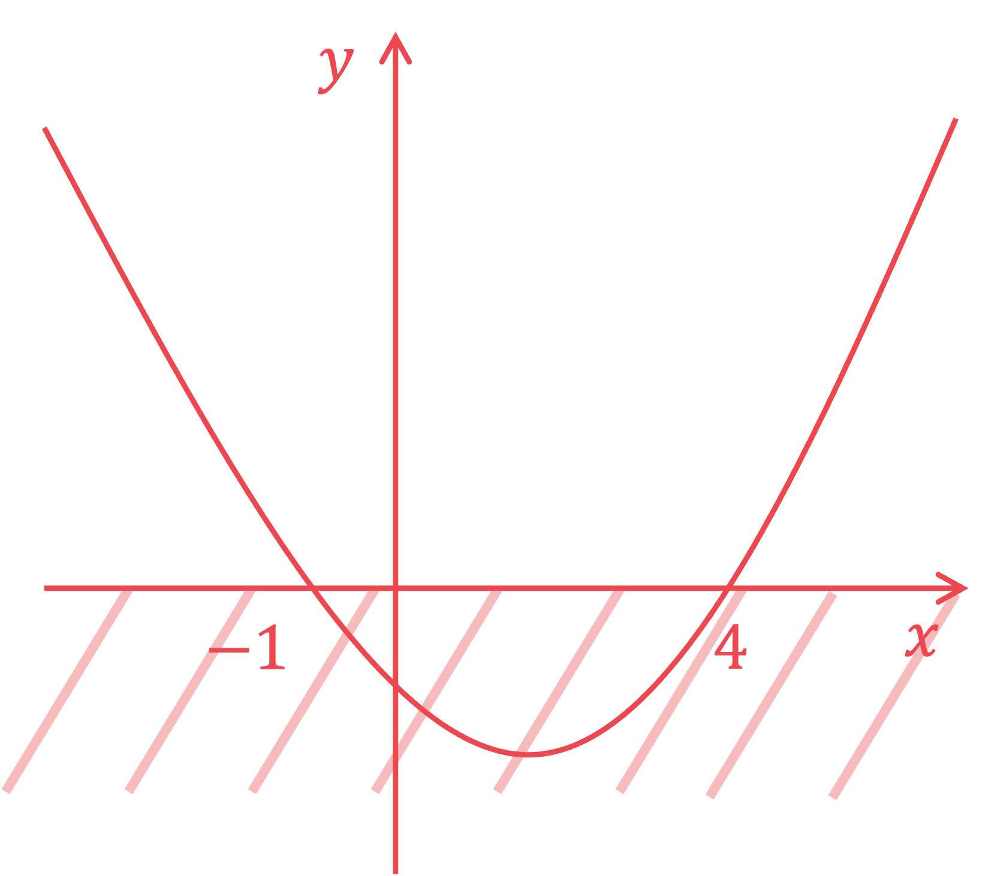

$x<-1,x>4$ **[1] **

**Always sketch the graph to decide which way to put the inequality signs- they must be correct to achieve the final mark**

## Q45 — hard — 3 marks · exam-questions

### 19() — 3 marks
> *First ignore the inequality sign and solve as a quadratic equation to find the roots. We can **factorise harder (non-monic) quadratics** like *$2x^{2}+3x-2$* by "**grouping**" (or by "**using a grid**" method)*

`table attributes columnalign right center left columnspacing 0px end attributes row cell 2 x squared plus 3 x minus 2 end cell equals 0 end table`

`table row cell a c end cell equals cell 2 cross times open parentheses negative 2 close parentheses equals negative 4 end cell end table`*, *`table attributes columnalign right center left columnspacing 0px end attributes row b equals 3 end table`*; two numbers that times to −4 and add to 3 are 4 and −1*

`table row cell 2 x squared plus 4 x minus x minus 2 end cell equals 0 end table`

> *Group and factorise the first two terms and the last two terms separately*

`table attributes columnalign right center left columnspacing 0px end attributes row cell 2 x open parentheses x plus 2 close parentheses minus open parentheses x plus 2 close parentheses end cell equals 0 end table`

> *Factorise into final form using the common factor *`open parentheses x plus 2 close parentheses`

`table attributes columnalign right center left columnspacing 0px end attributes row cell open parentheses 2 x minus 1 close parentheses open parentheses x plus 2 close parentheses end cell equals 0 end table`

**[1]**

> *Solve*

`table row cell 2 x minus 1 end cell equals cell 0 space comma space x plus 2 equals 0 end cell row x equals cell 1 half comma space space x equals negative 2 end cell end table`

**[1]**

> *Now that we have the roots, we need to consider the original inequality *$2x^{2}+3x-2>0$* Sketch a graph of the quadratic. The squared term is positive so we sketch a U-shaped parabola...*

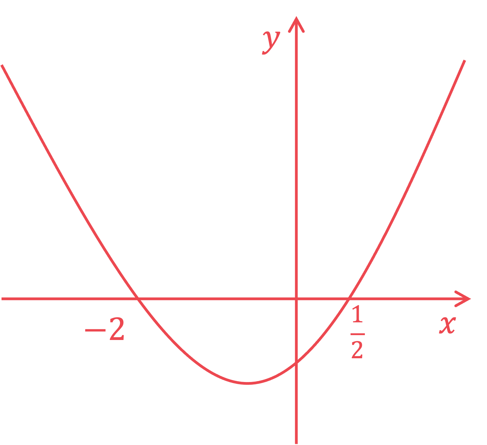

> *...and *$">0"$* tells us to look for values **above** the *$x$*-axis. It helps to **shade the region we don't want**- below the *$x$*-axis*

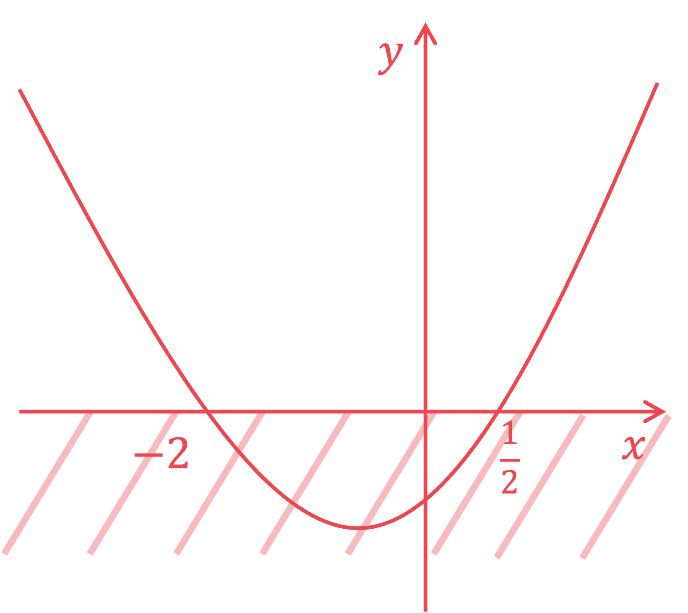

$x<-2,x>\frac{1}{2}$ **[1] **

**Always sketch the graph to decide which way to put the inequality signs- they must be correct to achieve the final mark**

## Q46 — hard — 4 marks · exam-questions

### 25() — 4 marks
> *Spot that this is a quadratic inequality, so first find the roots of the quadratic by solving*

$4x^{2}-5x-6=0$

> *This is usually easiest by factorising.*

`4 x squared minus 5 x minus 6 equals open parentheses 4 x plus 3 close parentheses open parentheses x minus 2 close parentheses equals 0`

**[1]**

> *So*

`table row cell 4 x plus 3 end cell equals cell 0 comma space space space space space x equals negative 3 over 4 end cell row cell x minus 2 end cell equals cell 0 comma space space space space space x equals 2 end cell end table`

**[1]**

*Sketch the graph of *`y equals open parentheses 4 x plus 3 close parentheses open parentheses x minus 2 close parentheses`*, marking the roots.* *This is a positive quadratic so is a "U"-shaped parabola.*

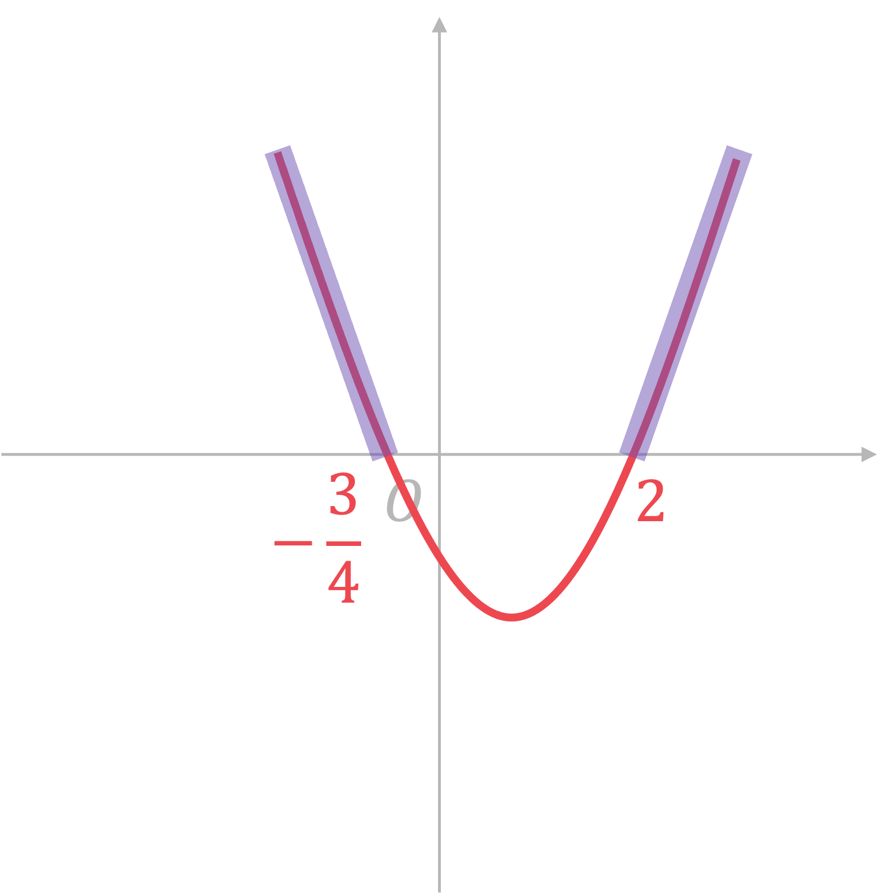

**[1]**

> *We can see from the graph that the highlighted parts are where the graph is greater than zero.*

$x<-\frac{3}{4},x>2$ **[1]**

**Be sure to check those inequality signs and whether the are inclusive/exclusive**

## Q47 — hard — 4 marks · exam-questions

### 17((a)) — 3 marks
> *Spot that this is a quadratic inequality but first needs arranging so all terms are on the same side of the inequality. *

> *In this case we have subtracted 6**x** from both sides and subtracted 5 from both sides.*

$x^{2}-4x-5>0$

**[1]**

> *Next we need to find the roots of the quadratic by solving*

$x^{2}-4x-5=0$

> *This is usually easiest by factorising.*

`x squared minus 4 x minus 5 equals open parentheses x minus 5 close parentheses open parentheses x plus 1 close parentheses equals 0`

**[1]**

> *So*

`table row cell x minus 5 end cell equals cell 0 comma space space space space space x equals 5 end cell row cell x plus 1 end cell equals cell 0 comma space space space space space x equals negative 1 end cell end table`

*Sketch the graph of *`y equals open parentheses x minus 5 close parentheses open parentheses x plus 1 close parentheses`*, marking the roots.*

> *This is a positive quadratic so is a "U"-shaped parabola.*

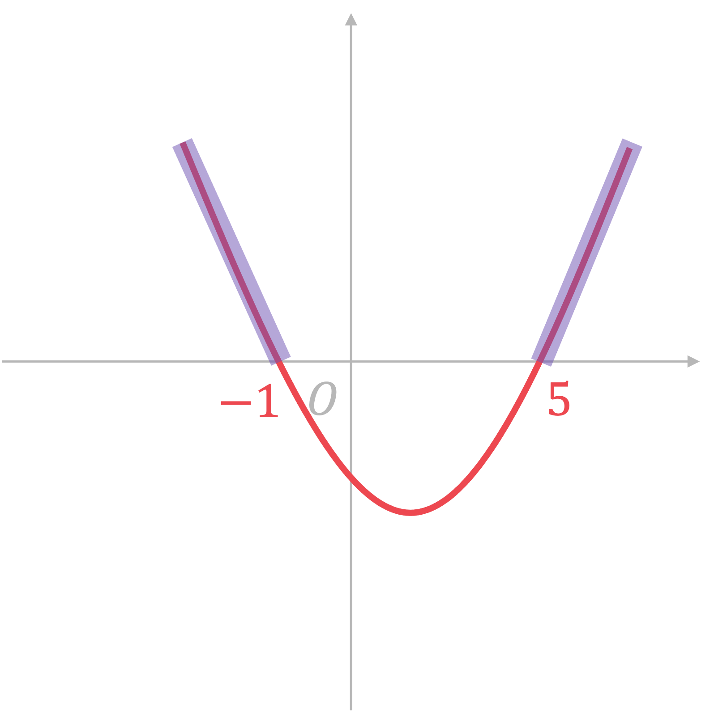

> *We can see from the graph that the highlighted parts are where the graph is greater than zero.*

$x<-1,x>5$ **[1]**

**Be sure to check those inequality signs and whether the are inclusive/exclusive**

### 17((b)) — 1 marks
> *Open circles are used to represent > and < on a number line.*
*An arrow is used to indicate an open ended (infinite) inequality. *
*As this is a 'split' quadratic inequality, our diagram will have two separate parts.*

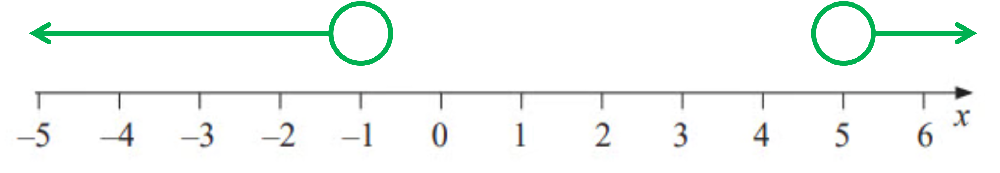

**[1]**

## Q48 — hard — 5 marks · exam-questions

### 20() — 5 marks
> *First solve the linear inequality*

`table row cell 3 n plus 2 end cell less or equal than 14 row cell 3 n end cell less or equal than 12 row n less or equal than 4 end table`

**[1]**

> *Now solve the quadratic inequality. Rearrange to the form *$ax^{2}+bx+c>0$*, starting by multiplying both sides by *$n^{2}+5$

`table row cell 6 n end cell greater than cell n squared plus 5 end cell row 0 greater than cell n squared minus 6 n plus 5 end cell end table`

`table row cell n squared minus 6 n plus 5 end cell less than 0 end table`

**[1]**

> *Now ignore the inequality sign and solve as a quadratic equation to find the roots*

*two numbers that times to 5 and add to −6 are −5 and −1*

`table row cell open parentheses x minus 5 close parentheses open parentheses x minus 1 close parentheses end cell equals 0 end table`

> *Solve*

`table row x equals cell 5 comma space space x equals 1 end cell end table`

**[1]**

> *Now that we have the roots, we need to consider the original inequality *$x^{2}-6n+5<0$* Sketch a graph of the quadratic. The squared term is positive so we sketch a U-shaped parabola... ...and *$"<0"$* tells us to look for values **below** the *$x$*-axis. It helps to **shade the region we don't want**- above the *$x$*-axis*

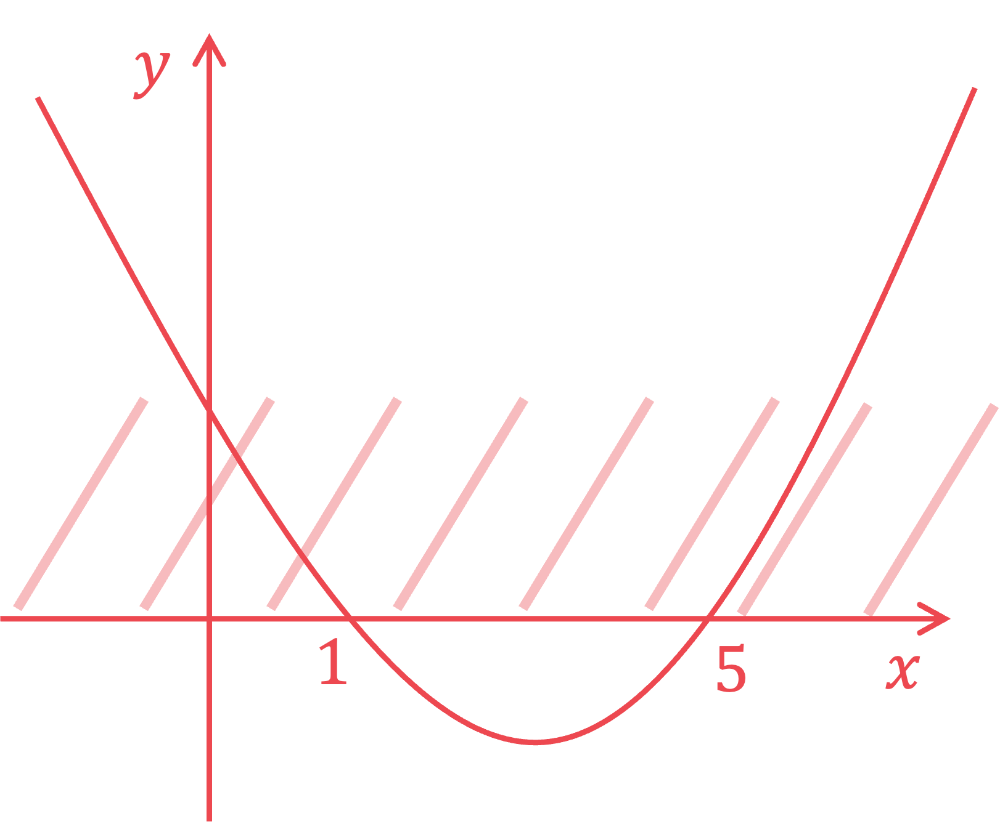

> *From the graph we see that, for the quadratric inequality,*

`table row 1 less than cell x less than 5 end cell end table`

**[1]**

> *Finally put the solutions to the two solutions to the inequalities, *$n\leq4$* and *$1<n<5$*, together and write down the integer values*

**2, 3,**** ****4**** ****[1]**

## Q49 — hard — 5 marks · exam-questions

### 22() — 5 marks
> *The area of a rectangle is length x width so we first need to set up an inequality in terms of x.*

`open parentheses 2 x plus 3 close parentheses open parentheses x minus 1 close parentheses less than 75`

**[1]**

> *Expand brackets and rearrange so all terms are on the same side of the inequality.*

`table row cell 2 x squared plus x minus 3 minus 75 end cell less than 0 row cell 2 x squared plus x minus 78 end cell less than 0 end table`

**[1]**

*This is a quadratic inequality, so find the solutions to *$2x^{2}+x-78=0$*. (Critical values).*

> *Factorising is usually easiest (if possible).*

`table row cell 2 x squared plus x minus 78 end cell equals cell open parentheses 2 x plus 13 close parentheses open parentheses x minus 6 close parentheses equals 0 end cell row x equals cell negative 13 over 2 comma space space space space x equals 6 end cell end table`

**[1]**

> *Sketch the graph of *$y=2x^{2}+x-78$* - this is a positive quadratic so it is a "U"-shaped parabola.*

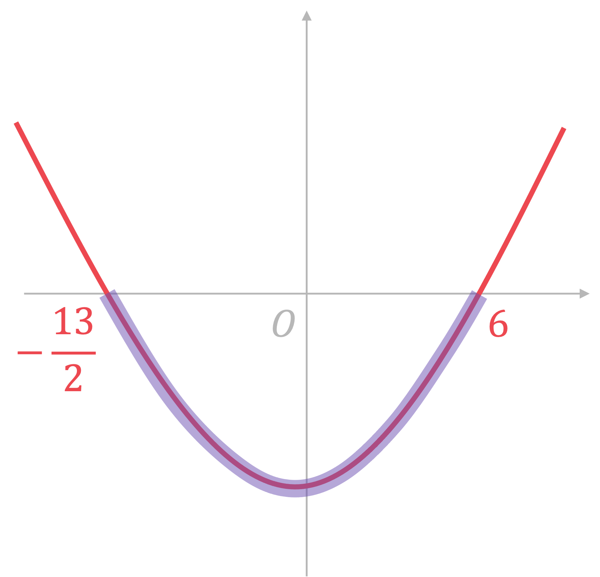

> *We can see the graph is less than zero in the highlighted section.*

$-\frac{13}{2}<x<6$

**[1]**

> *However, we also need to consider the the length and width cannot take negative values, so consider *$2x+3$* and *$x-1$* we can deduce that*

$x>1$

> *Combining both of these inequalities (drawing a line diagram can help but is not essential) gives the final answer.*

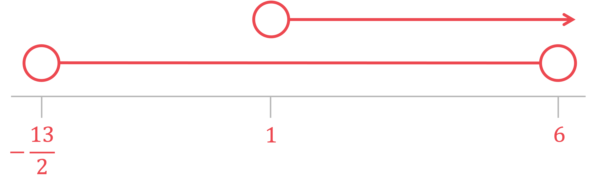

$1<x<6$* ***[1]**

**Be sure to check those inequality signs and whether they are inclusive/exclusive.**

## Q50 — hard — 3 marks · exam-questions

### 19((b)) — 3 marks
> *This is a quadratic inequality but first needs arranging so all terms are on the same side of the inequality. *

> *Subtract 40 from both sides.*

$5y^{2}-17y-40\leq0$

**[1]**

> *Next we need to find the roots of the quadratic by solving*

$5y^{2}-17y-40=0$

> *This is usually easiest by factorising.*

`5 y squared minus 17 y minus 40 equals open parentheses 5 y plus 8 close parentheses open parentheses y minus 5 close parentheses equals 0`

**[1]**

> *So*

`table row cell 5 y plus 8 end cell equals cell 0 comma space space space space space y equals negative 8 over 5 end cell row cell y minus 5 end cell equals cell 0 comma space space space space space y equals 5 end cell end table`

*Sketch the graph of *`y equals open parentheses 5 y plus 8 close parentheses open parentheses y minus 5 close parentheses`*, marking the roots.*

> *This is a positive quadratic so is a "U"-shaped parabola.*

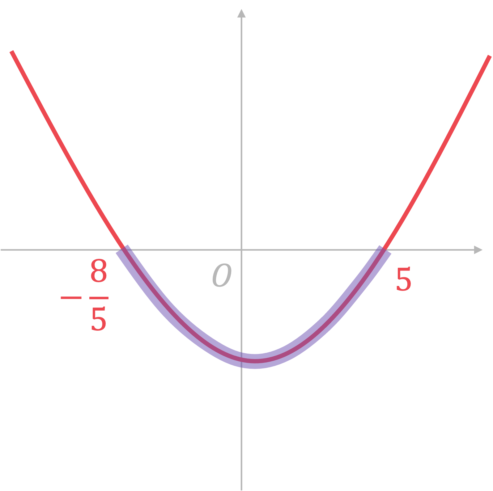

> *We can see from the graph that the highlighted parts are where the graph is less than **or equal to** zero.*

$-\frac{8}{5}\leqy\leq5$ **[1]**

**Be sure to check those inequality signs and whether the are inclusive/exclusive**

## Q51 — hard — 5 marks · exam-questions

### 23() — 5 marks
> *The area of a rectangle is length x width so we first need to set up an inequality in terms of **x**.*

`open parentheses 2 x minus 4 close parentheses open parentheses 3 x plus 2 close parentheses less than 3 x plus 27`

**[1]**

> *Expand brackets and rearrange so all terms are on the same side of the inequality.*

`table row cell 6 x squared minus 8 x minus 8 minus 3 x minus 27 end cell less than 0 row cell 6 x squared minus 11 x minus 35 end cell less than 0 end table`

**[1]**

*This is a quadratic inequality, so find the solutions to *$6x^{2}-11x-35=0$*. (Critical values.)*

> *Factorising is usually easiest (if possible).*

`table row cell 6 x squared minus 11 x minus 35 end cell equals cell open parentheses 3 x plus 5 close parentheses open parentheses 2 x minus 7 close parentheses equals 0 end cell row x equals cell negative 5 over 3 comma space space space space x equals 7 over 2 end cell end table`

**[1]**

> *Sketch the graph of *$y=6x^{2}-11x-35$* - this is a positive quadratic so it is a "U"-shaped parabola.*

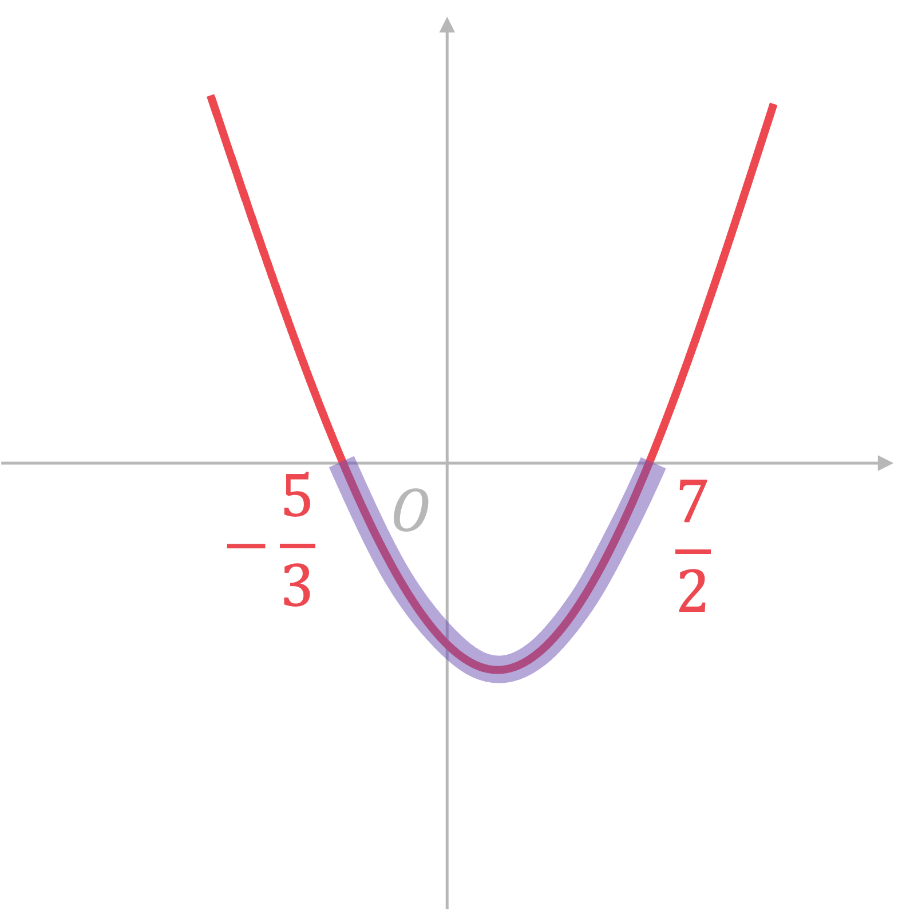

> *We can see the graph is less than zero in the highlighted sections.*

$-\frac{5}{3}<x<\frac{7}{2}$

**[1]**

> *However, we also need to consider the the length and width cannot take negative values, so consider *$2x-4$* and *$3x+2$* we can deduce that*

$x>2$

> *Combining both of these inequalities (drawing a line diagram can help but is not essential) gives the final answer.*

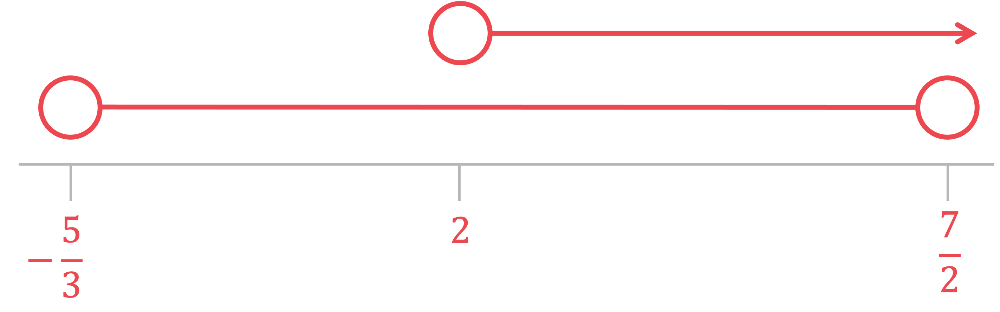

$2<x<\frac{7}{2}$* ***[1]**

**Be sure to check those inequality signs and whether they are inclusive/exclusive.**

## Q52 — hard — 3 marks · exam-questions

### 24() — 3 marks
> *Now ignore the inequality sign in *$x^{2}+4x-12<0$* and solve as a quadratic equation.*

> *You can solve by factorising, completing the square or using the quadratic formula. Here we will solve by factorising.*

*two numbers that times to −12 and add to 4 are 6 and −2*

`table row cell open parentheses x plus 6 close parentheses open parentheses x minus 2 close parentheses end cell equals 0 end table`

**[1]**

> *Solve*

`table row x equals cell negative 6 comma space space x equals 2 end cell end table`

**[1]**

> *Now that we have the roots, we need to consider the original inequality *$x^{2}+4x-12<0$*. *

> *Sketch a graph of the quadratic. The squared term is positive so we sketch a U-shaped parabola...*

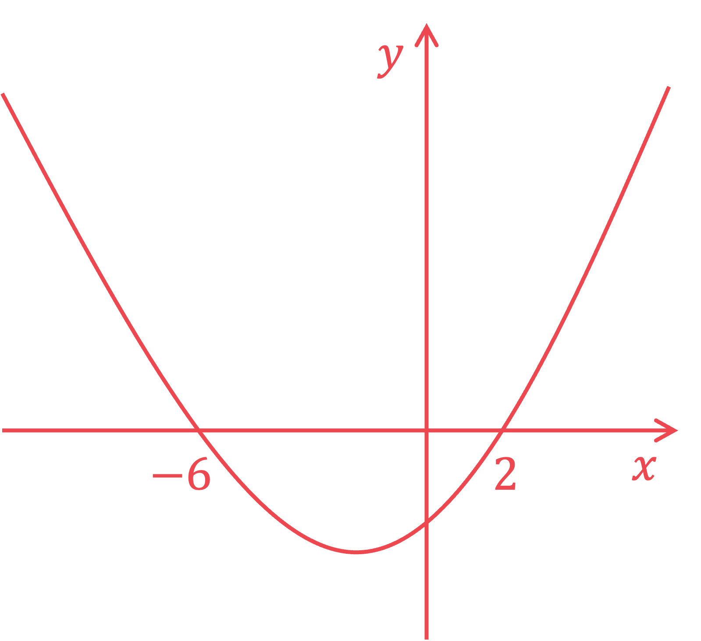

> *...and *$">0"$* tells us to look for values **below** the *$x$*-axis. It helps to **shade the wanted part of the line.*

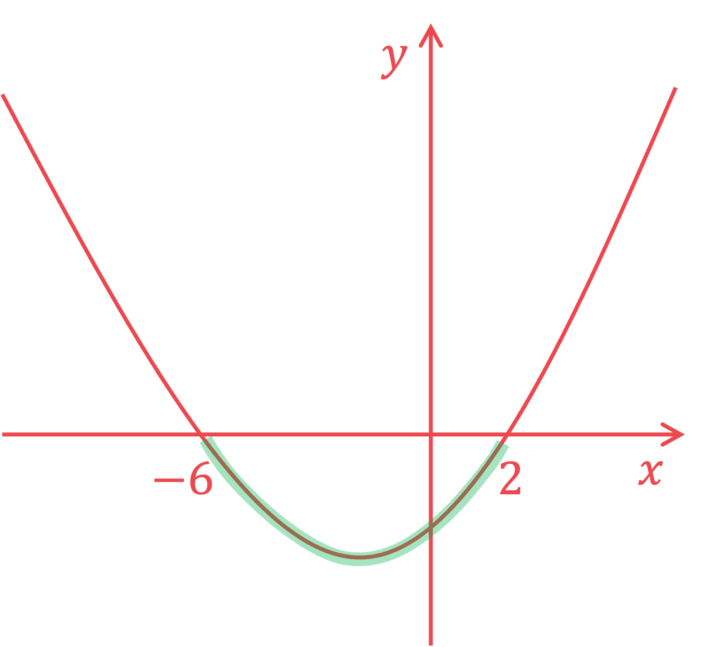

$-6<x<2$ **[1] **

**Always sketch the graph to decide which way to put the inequality signs- they must be correct to achieve the final mark**

## Q53 — hard — 3 marks · exam-questions

### 24() — 3 marks
> *The greatest possible value of *$y-x$* will be the greatest possible value of *$y$* minus the smallest possible value of *$x$*.*

*The smallest possible value of *$x=-2$

* ***[1]**

> *Substitute *$x=-2$* into the inequality given for *$x+y$* and solve to find the greatest possible value of *$y$*.*

`table row cell x space plus space y space end cell less or equal than cell space 11 end cell row cell open parentheses negative 2 close parentheses space plus space y space end cell less or equal than cell space 11 end cell row cell y space end cell less or equal than cell space 13 end cell end table`

* ***[1]**

> *So the greatest possible value of *$y-x$* must be given by  *

`13 space minus space open parentheses negative 2 close parentheses`

> *Be careful with the negative when calculating the answer.*

** ****The greatest possible value of**** **$y-x=15$ **[1]**

## Q54 — hard — 4 marks · exam-questions

### 9() — 4 marks
> *Subtract *$3x$* from both sides (always subtract the smaller *$x$* term, rather than the larger one).*

`table row cell 8 x space plus space 5 space minus space 3 x space end cell less or equal than cell space minus 10 end cell row cell 5 x space plus space 5 space end cell less or equal than cell space minus 10 end cell end table`

**[1]**

> *Subtract 5 from both sides.*

$5x\leq-10-5\,5x\leq-15$

**[1]**

> *Divide both sides by 5.*

$x\leq\frac{-15}{5}\,x\leq-3$

**[1]**

> *The number line should have a solid circle at 3, but the arrow should be pointing in the negative direction.*

**No as the number line is for **$x\geq-3$** and it should be for **$x\leq-3$* ***[1]**

## Q55 — hard — 4 marks · exam-questions

### 17() — 4 marks
> *First, factorise in the normal way.*

*Two numbers that times to −6 and add to −5 are −6 and 1*

`table attributes columnalign right center left columnspacing 0px end attributes row cell open parentheses x space minus space 6 close parentheses open parentheses x space plus space 1 close parentheses space end cell less or equal than cell space 0 end cell end table`

**Method to factorise ****[1] **
**Both brackets correct ****[1]**

> *Find the roots of the quadratic as though solving the equation.*

*For *`table row cell open parentheses x space minus space 6 close parentheses open parentheses x space plus space 1 close parentheses space end cell equals cell space 0 comma space space space space x space equals space 6 comma space space x space equals negative 1 end cell end table`

**[1]**

> *Now that we have the roots, we need to consider the original inequality *$x^{2}-5x-6\leq0$*. *

> *Sketch a graph of the quadratic. The squared term is positive so we sketch a U-shaped parabola which cuts the **x-**axis at -1 and 6.*

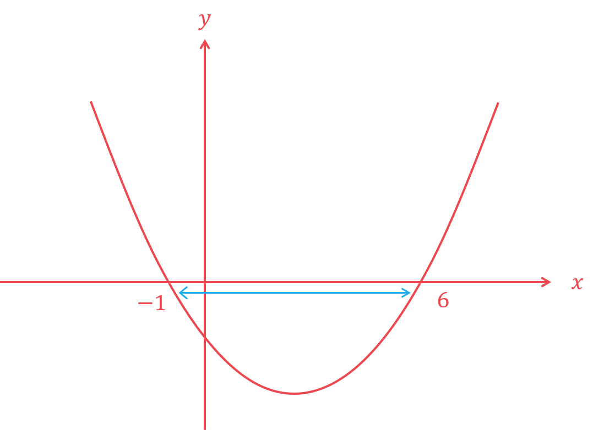

> *The inequality sign *$"\leq0"$* tells us to look for values **below **the *$x$*-axis, this is **between **the two values. *

> *The sign includes 'or equals to' so your answer must include this too.*

$-1\leqx\leq6$** ****[1] **

**Always sketch the graph to decide which way to put the inequality signs- they must be correct to achieve the final mark**

## Q56 — hard — 3 marks · exam-questions

### 20((a)) — 3 marks
> *Begin by ignoring the inequality sign and solving in the normal way as a quadratic equation.*

> *Factorising is the easiest method here.*

`table row cell x squared space minus space 7 x space plus space 10 space end cell equals cell space 0 end cell end table`

*Two numbers that times to 10 and add to −7 are −5 and −2*

`table row cell open parentheses x space minus space 5 close parentheses open parentheses x space minus space 2 close parentheses space end cell equals cell space 0 end cell end table`

**Correct factorisation or other method to find the roots ****[1]**

> *Find the roots of the quadratic.*

`table row cell space x space end cell equals cell space 2 comma space space x space equals 5 end cell end table`

**[1]**

> *Now that we have the roots, we need to consider the original inequality *$x^{2}-7x+10\leq0$*. *

> *Sketch a graph of the quadratic. The squared term is positive so we sketch a U-shaped parabola which cuts the **x-**axis at 2 and 5.*

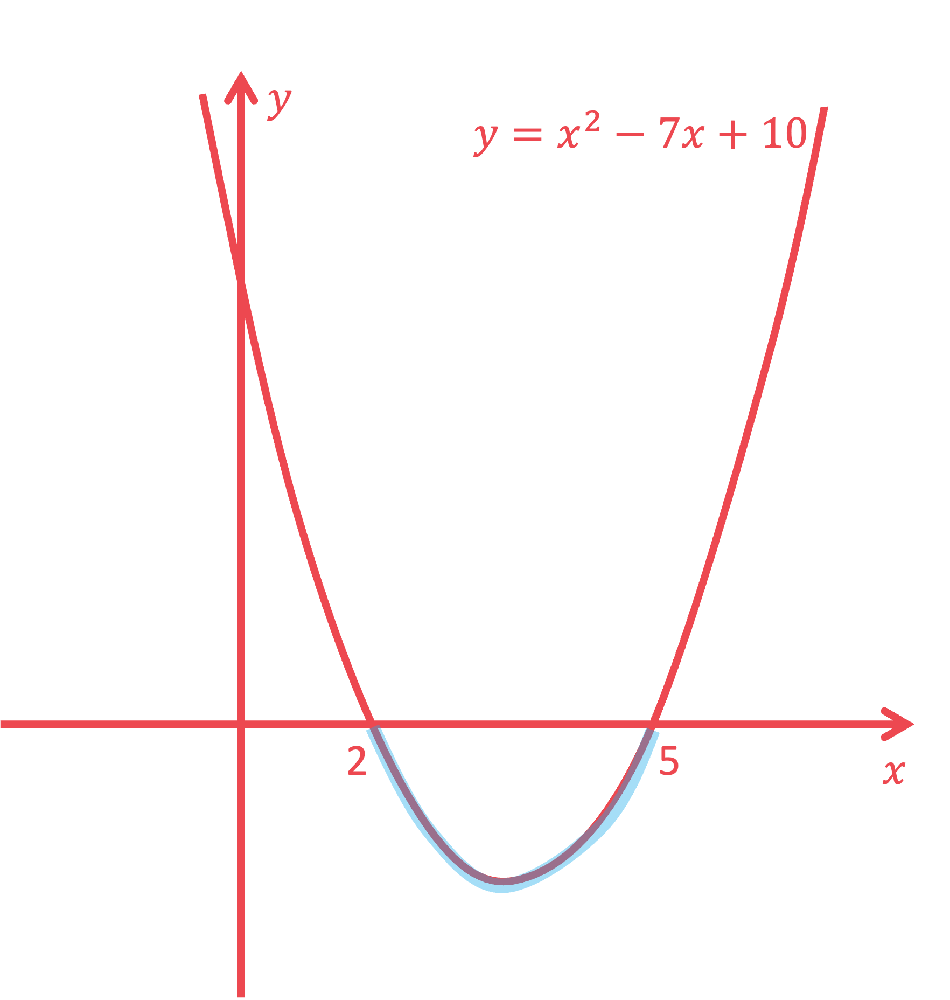

> *The inequality sign *$"\leq0"$* tells us to look for values **below **the *$x$*-axis, this is **between **the two values. *

> *The sign includes 'or equals to' so your answer must include this too.*

$2\leqx\leq5$ **[1] **

**Always sketch the graph to decide which way to put the inequality signs- they must be correct to achieve the final mark**
