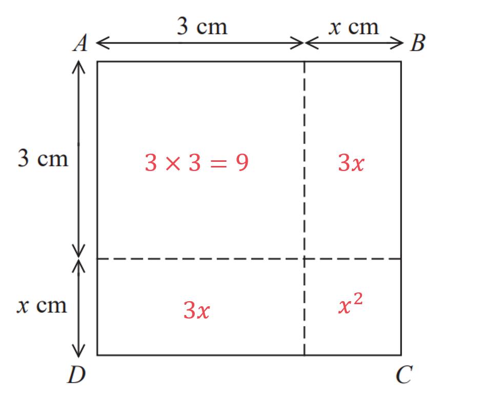

# Mark Schemes — Solving Quadratic Equations
**Equations, Formulae & Identities** · Edexcel IGCSE Maths A (4MA1) — 18/Higher

## Q1 — medium — 2 marks · exam-questions

### 16() — 2 marks
> *Take the square root of both sides of the equation.*

`table row cell open parentheses x space minus space 2 close parentheses squared space end cell equals cell space 3 end cell row cell square root of blank end root space space space space space space space space space space space space space space space space space space space space end cell equals cell space space space space space space space space space space space space square root of blank end root end cell row cell x space minus space 2 space end cell equals cell space plus-or-minus square root of 3 end cell end table`

**[1]**

> *Solve by adding 2 to each side.*

`table row cell x space end cell equals cell space plus-or-minus square root of 3 space plus space 2 end cell row blank equals cell space 2 space plus-or-minus space square root of 3 end cell end table`

> *Use your calculator to find each value of **x**.*

`table row cell x space end cell equals cell space 2 space plus space square root of 3 space equals space 3.73205... end cell end table`

> *and*

`table row cell x space end cell equals cell space 2 space minus space square root of 3 space equals space 0.26794... end cell end table`

> *Round each value to 3 significant figures.*

> *For *$x=3.73205...$* the third non-zero digit is 3 and the digit following it is 2, which is less than 5 so do not round up. *

`x space equals space 3.73205... space equals space 3.73 space open parentheses 3 space s. f. close parentheses`

> *For *$x=0.26794...$* the third non-zero digit is 7 and the digit following it is 9, which is greater than 5 so round up. *

`x space equals space 0.26794... space equals space 0.268 space open parentheses 3 space s. f. close parentheses`

$x=0.268\mathrm{or}x=3.73(3s.f.)$** [1]**

## Q2 — medium — 3 marks · exam-questions

### 25() — 3 marks
> *The sentence 'give your solutions correct to 2 decimal places' is a hint that you need to use the quadratic formula.*

> *The quadratic formula is *$x=\frac{-b\pm\sqrt{b^{2}-4ac}}{2a}$* where *$ax^{2}+bx+c=0$*. *

> *Be sure to **show** the stages of using the quadratic formula - only use your calculator to check your answers.*

$a=3,b=4,c=-12$

`x equals fraction numerator negative open parentheses 4 close parentheses plus-or-minus square root of open parentheses 4 close parentheses squared space minus space 4 cross times 3 cross times open parentheses negative 12 close parentheses end root over denominator 2 cross times 3 end fraction`

**[1]**

`x space equals space fraction numerator negative 4 space plus-or-minus space square root of 16 space minus space open parentheses negative 144 close parentheses end root over denominator 6 end fraction space equals space fraction numerator negative 4 space plus-or-minus space square root of 160 over denominator 6 end fraction`

** [1]**

$x=1.44151...,x=-2.77485...$

> *Round each value to 2 decimal places.*

> *For *$x=1.44151...$* the second decimal place is 4 and the digit following it is 1, which is less than 5 so do not round up. *

`x space equals space 1.44151... space equals space 1.44 space open parentheses 2 space straight d. straight p. close parentheses`

> *For *$x=-2.77485...$* the second decimal place is 7 and the digit following it is 4, which is less than 5 so do not round up.  *

`x space equals space minus 2.77485... space equals negative 2.77 space open parentheses 2 space straight d. straight p close parentheses`

$x=-2.77\mathrm{or}x=1.44(2d.p.)$** [1]**

## Q3 — medium — 3 marks · exam-questions

### 20() — 3 marks
> *The sentence 'give your solutions correct to 2 decimal places' is a hint that you need to use the quadratic formula.*

> *The quadratic formula is *$x=\frac{-b\pm\sqrt{b^{2}-4ac}}{2a}$* where *$ax^{2}+bx+c=0$*. *

> *Be sure to **show** the stages of using the quadratic formula - only use your calculator to check your answers.*

$a=3,b=6,c=-2$

`x equals fraction numerator negative open parentheses 6 close parentheses plus-or-minus square root of open parentheses 6 close parentheses squared space minus space 4 cross times 3 cross times open parentheses negative 2 close parentheses end root over denominator 2 cross times 3 end fraction`

**[1]**

`x space equals space fraction numerator negative 6 space plus-or-minus space square root of 36 space minus space open parentheses negative 24 close parentheses end root over denominator 6 end fraction space equals space fraction numerator negative 6 space plus-or-minus space square root of 60 over denominator 6 end fraction`

** [1]**

$x=0.29099...,x=-2.29099...$

> *Round each value to 2 decimal places.*

> *For *$x=0.29099...$* the second decimal place is 9 and the digit following it is 0, which is less than 5 so do not round up. *

`x space equals space space 0.29099... space equals space 0.29 space open parentheses 2 space straight d. straight p. close parentheses`

> *For *$x=-2.29099...$* the second decimal place is 9 and the digit following it is 0, which is less than 5 so do not round up. *

`x space equals space space minus 2.29099... space equals space minus 2.29 space open parentheses 2 space straight d. straight p. close parentheses`

$x=-2.29\mathrm{or}x=0.29(2d.p.)$** [1]**

## Q4 — medium — 3 marks · exam-questions

### 19((c)) — 3 marks
> *The sentence 'give your solutions correct to 2 decimal places' is a hint that you need to use the quadratic formula.*

> *The quadratic formula is *$x=\frac{-b\pm\sqrt{b^{2}-4ac}}{2a}$* where *$ax^{2}+bx+c=0$*. *

> *Be sure to **show** the stages of using the quadratic formula - only use your calculator to check your answers.*

$a=3,b=-1,c=-1$

`x equals fraction numerator negative open parentheses negative 1 close parentheses plus-or-minus square root of open parentheses negative 1 close parentheses squared space minus space 4 cross times 3 cross times open parentheses negative 1 close parentheses end root over denominator 2 cross times 3 end fraction`

**[1]**

`x space equals space fraction numerator 1 space plus-or-minus space square root of 1 space minus space open parentheses negative 12 close parentheses end root over denominator 6 end fraction space equals space fraction numerator 1 space plus-or-minus space square root of 13 over denominator 6 end fraction`

** [1]**

$x=0.76759...,x=-0.43425...$

> *Round each value to 2 decimal places.*

> *For *$x=0.76759...$* the second decimal place is 6 and the digit following it is 7, which is greater than 5 so round up. *

`x space equals space space 0.76759... space equals space 0.77 space open parentheses 2 space straight d. straight p. close parentheses`

> *For *$x=-0.43425...$* the second decimal place is 3 and the digit following it is 4, which is less than 5 so do not round up. *

`x space equals negative 0.43425... space equals negative 0.43 space open parentheses 2 space straight d. straight p. close parentheses`

$x=0.77\mathrm{or}x=-0.43(2d.p.)$** [1]**

## Q5 — medium — 3 marks · exam-questions

### 11() — 3 marks
> *The sentence 'give your solutions correct to 3 significant figures' is a hint that you need to use the quadratic formula.*

> *The quadratic formula is *$x=\frac{-b\pm\sqrt{b^{2}-4ac}}{2a}$* where *$ax^{2}+bx+c=0$*. *

> *Be sure to **show** the stages of using the quadratic formula - only use your calculator to check your answers.*

$a=1,b=-5,c=3$

`x equals fraction numerator negative open parentheses negative 5 close parentheses plus-or-minus square root of open parentheses negative 5 close parentheses squared space minus space 4 cross times 1 cross times open parentheses 3 close parentheses end root over denominator 2 cross times 1 end fraction`

**[1]**

`x space equals space fraction numerator 5 space plus-or-minus space square root of 25 space minus space open parentheses 12 close parentheses end root over denominator 2 end fraction space equals space fraction numerator 5 space plus-or-minus space square root of 13 over denominator 2 end fraction`

** [1]**

$x=4.30277...,x=0.69722...$

> *Round each value to 3 significant figures.*

> *For *$x=4.30277...$* the third non zero digit is 0 and the digit following it is 2, which is less than 5 so do not round up. *

`x space equals space space 4.30277... space equals space 4.30 space space open parentheses 3 space straight s. straight f. close parentheses`

> *For *$x=0.69722...$* the third non zero digit is 7 and the digit following it is 2, which is less than 5 so do not round up. *

`x space equals space space 0.69722... space equals 0.697 space open parentheses 3 space straight s. straight f. close parentheses`

$x=0.697\mathrm{or}x=4.30(3s.f.)$** [1]**

## Q6 — medium — 1 marks · exam-questions

### 8((b)) — 1 marks
> *The fourth line of Liz's working involved taking the square root of both sides.*

`table row cell 3 x squared space plus space 8 space end cell equals cell space 83 end cell row cell negative 8 space space space space space space space space space space space space space space space space space space end cell equals cell space space space space space space space space space space minus 8 end cell row cell 3 x squared space space end cell equals cell space 75 end cell row cell divided by 3 space space space space space space space space space space space space space space space space space space end cell equals cell space space space space space space space space space space divided by 3 end cell row cell x squared space space end cell equals cell space 25 end cell row cell square root of blank end root space space space space space space space space space space space space space space space space space space end cell equals cell space space space space space space space space space space square root of blank end root space space end cell row cell x space space end cell equals cell space plus-or-minus square root of 25 end cell end table`

> *The square root of a positive number can be either positive or negative. *

**Liz forgot to take both the positive and negative square root**** [1]**

## Q7 — medium — 3 marks · exam-questions

### 22() — 3 marks
> *The quadratic formula is *$x=\frac{-b\pm\sqrt{b^{2}-4ac}}{2a}$* where *$ax^{2}+bx+c=0$*. *

> *Be sure to **show** the stages of using the quadratic formula - only use your calculator to check your answers.*

$a=3,b=-4,c=-2$

`x equals fraction numerator negative open parentheses negative 4 close parentheses plus-or-minus square root of open parentheses negative 4 close parentheses squared minus 4 cross times 3 cross times open parentheses negative 2 close parentheses end root over denominator 2 cross times 3 end fraction`

**[1]**

$x=\frac{4\pm\sqrt{40}}{6}$

** [1]**

$x=1.72075...,x=-0.387425...$

> *Round your answers to **three significant places.*

$x=1.72$**    **

**    **$x=-0.387$** [1] **

**Answers that are not to three significant figures (such as "1.721" or "−0.39") will not achieve the final mark**

## Q8 — medium — 3 marks · exam-questions

### 20() — 3 marks
> *The quadratic formula is *$x=\frac{-b\pm\sqrt{b^{2}-4ac}}{2a}$* where *$ax^{2}+bx+c=0$*. *

> *Be sure to **show** the stages of using the quadratic formula - only use your calculator to check your answers.*

$a=3,b=-5,c=-1$

`x equals fraction numerator negative open parentheses negative 5 close parentheses plus-or-minus square root of open parentheses negative 5 close parentheses squared minus 4 cross times 3 cross times open parentheses negative 1 close parentheses end root over denominator 2 space cross times space 3 end fraction`

**[1]**

`x space equals space fraction numerator 5 space plus-or-minus space square root of 25 space minus space open parentheses negative 12 close parentheses end root over denominator 6 end fraction space equals space fraction numerator 5 space plus-or-minus space square root of 37 over denominator 6 end fraction`

** [1]**

$x=1.84712...,x=-0.18046...$

*Round your answers to **three significant places.***             **

$x=1.85\mathrm{and}x=-0.180$** [1] **

**Do not be tempted to write "−0.18" rather than "−0.180", as answers that are not to three significant places will not achieve the final mark**

## Q9 — medium — 3 marks · exam-questions

### 21() — 3 marks
> *The quadratic formula is *$x=\frac{-b\pm\sqrt{b^{2}-4ac}}{2a}$* where *$ax^{2}+bx+c=0$*. *

> *Be sure to **show** the stages of using the quadratic formula - only use your calculator to check your answers.*

$a=2,b=3,c=-7$

`x equals fraction numerator negative open parentheses 3 close parentheses plus-or-minus square root of open parentheses 3 close parentheses squared minus 4 cross times 2 cross times open parentheses negative 7 close parentheses end root over denominator 2 space cross times space 2 end fraction`

**[1]**

`x space equals space fraction numerator negative 3 space plus-or-minus space square root of 9 space minus space open parentheses negative 56 close parentheses end root over denominator 4 end fraction space equals space fraction numerator negative 3 space plus-or-minus space square root of 65 over denominator 4 end fraction`

** [1]**

$x=1.26556...,x=-2.76556...$

*Round your answers to **two decimal places.***             **

$x=1.27\mathrm{and}x=-2.77$** [1] **

**Answers that are not to two decimal places will not achieve the final mark, as the question specifies the degree of accuracy**

## Q10 — medium — 3 marks · exam-questions

### 9() — 2 marks
*This is a 'simple' quadratic so can be done "by inspection".* *We need a pair of numbers that multiply to -24 ('**c**') and add to 2 ('**b**').*

$-4\mathrm{and}+6$

**A pair of numbers that satisfy at least one of the conditions**** [1]**

> *These will be numbers that form the pair of brackets that factorise the quadratic.*

$x^{2}+2x-24=(x-4)(x+6)$**[1]**

### 9() — 1 marks
> *Using the factorised form of the quadratic equation from part (a),*

`table attributes columnalign right center left columnspacing 0px end attributes row cell x squared plus 2 x minus 24 end cell equals 0 row cell open parentheses x plus 6 close parentheses open parentheses x minus 4 close parentheses end cell equals 0 end table`

> *the solutions come from setting each factor equal to zero and solving.*

`table row cell x plus 6 end cell equals cell 0 comma space space space x equals negative 6 end cell row cell x minus 4 end cell equals cell 0 comma space space space x equals 4 end cell end table`

$x=-6,x=4$ **[1]**

## Q11 — medium — 3 marks · exam-questions

### 9() — 3 marks
*First spot that this is a quadratic equation.*

*If possible, factorising is the easiest way to solve a quadratic equation so consider this first.*

> *This is a 'simple' quadratic so we need a pair of numbers that multiply to 20 ('**c**') and add to -21 ('**b**').*

$-1\mathrm{and}-20$

> *These will be numbers that form the pair of brackets that factorise the quadratic.*

$x^{2}-21x+20=(x-1)(x-20)$

**Factors that, when expanded, would give 2 (out of 3) correct terms**** [1] **

**Fully correct factorisation**** [1]**

> *To find the solutions to the quadratic equation, set each factor equal to zero and solve.*

`table row cell x minus 1 end cell equals cell 0 comma space space space x equals 1 end cell row cell x minus 20 end cell equals cell 0 comma space space space x equals 20 end cell end table`

$x=1,x=20$ **[1]**

**If you do not manage to find the factors, you can use the quadratic formula or completing the square.**

## Q12 — medium — 2 marks · exam-questions

### 22() — 2 marks
> *If there is only one solution then this is a **repeated root**, meaning that when in factorised form the two factors are the same. *

> *The solution is *$x=5$* so rearranging to make this 0 gives the factor.*

`table row cell x space end cell equals cell space 5 end cell row cell negative 5 space space space space space space space space space space space space space end cell equals cell space space space space space space space space space space space space space space minus 5 space end cell row cell x space minus space 5 space end cell equals cell space 0 end cell end table`

> *There is only one solution so this factor is repeated, write the quadratic in factorised form.*

`open parentheses x space minus space 5 close parentheses open parentheses x space minus space 5 close parentheses equals 0`

**[1]**

> *Expand the brackets on the left hand side by multiplying all terms in the first bracket by all terms in the second bracket.*

> `table row cell x open parentheses x space minus space 5 close parentheses space minus 5 open parentheses x space minus space 5 close parentheses space end cell equals cell space 0 end cell row cell x to the power of 2 space end exponent minus space 5 x space minus space 5 x space plus space 25 space end cell equals cell space 0 end cell end table`* *

> *Simplify the like terms by collecting the **x** terms together*

> $x^{2}-10x+25=0$* *

> *Equate the coefficient of x to **b **and the constant term to **c. ** *

$b=-10,c=25$ **[1]**

## Q13 — medium — 3 marks · exam-questions

### 18((a)) — 1 marks
*Multiply the term outside the brackets (**x**) by all the terms inside the brackets.*

$x\times3x-x\times9=4$

> *Simplify the terms (by multiplying their parts together).*

$3x^{2}-9x=4$

*Subtract 4 from both sides.*

$3x^{2}-9x-4=0$

$3x^{2}-9x-4=0$ **[1]**

### 18((b)) — 2 marks
> *Rewrite the equation so that it is equal to 0, using your answer to part (a).*

`table row cell x open parentheses 3 x space minus space 9 close parentheses space end cell equals cell space 4 space space space space rightwards double arrow space space space space space 3 x squared space minus 9 x space minus 4 space equals space 0 end cell end table`

> *As the question asks for answers to 2 decimal places, it is likely that the answer is not an integer, so using the quadratic formula here is likely to be easier than trying to factorise.*

> *The quadratic formula states that if  *$ax^{2}+bx+c=0$*  then  *$x=\frac{-b\pm\sqrt{b^{2}-4ac}}{2a}$*.*

*For this equation, *$a=3,b=-9,c=-4$*.*

> *Substituting these values into the formula gives*

`x equals fraction numerator negative open parentheses negative 9 close parentheses plus-or-minus square root of open parentheses negative 9 close parentheses squared minus open parentheses 4 cross times 3 cross times negative 4 close parentheses end root over denominator 2 cross times 3 end fraction`

**[1]**

> *Simplify.*

`table row x equals cell fraction numerator 9 space plus-or-minus space square root of 81 minus open parentheses negative 48 close parentheses end root over denominator 6 end fraction end cell row blank equals cell fraction numerator 9 space plus-or-minus space square root of 129 over denominator 6 end fraction end cell end table`

> *So the two solutions are*

$x=\frac{9+\sqrt{129}}{6}\mathrm{or}x=\frac{9-\sqrt{129}}{6}$

> *Find the values of these using your calculator*

$x=3.3929694...\mathrm{or}x=-0.3929694...$

> *Round each value to 2 decimal places.*

> *For both answers, the second decimal place is 9 and the digit following it is 2, which is less than 5 so do not round up. *

`x space equals space 3.3929694... space equals space 3.39 space open parentheses 2 space straight d. straight p. close parentheses`

`x space equals space minus 0.3929694... space equals space minus 0.39 space open parentheses 2 space straight d. straight p close parentheses`

$x=-0.39\mathrm{and}x=3.39(2d.p.)$** [1]**

## Q14 — medium — 3 marks · exam-questions

### 12() — 3 marks
> *Factorise the left hand side by finding two numbers that multiply to give -12 and add to give -1.*

*-4 and 3*

> *The factors are *`open parentheses x space minus space 4 close parentheses`* and *`open parentheses x space plus space 3 close parentheses`

> *Rewrite the equation by multiplying them together and set equal to 0.*

`table row cell open parentheses x space minus space 4 close parentheses open parentheses x space plus space 3 close parentheses space end cell equals cell space 0 end cell end table`

** Brackets written with any factors of -12**** [1] **
**Brackets written with correct factors of -12**** [1]**

> *The roots can be found by setting each factor equal to 0 and solving separately.*

> *If  *`open parentheses x space minus space 4 close parentheses open parentheses x space plus space 3 close parentheses space equals space 0`* then either  *$x-4=0$* or *$x+3=0$*.*

> *For *$x-4=0$* the solution is:*

`table row cell x space minus space 4 space end cell equals cell space 0 end cell row cell plus 4 space space space space space space space space space space space space space end cell equals cell space space space space space space space space space space space space space space plus 4 space end cell row cell x space end cell equals cell space 4 end cell end table`

> *For *$x+3=0$* the solution is:*

`table row cell x space plus space 3 space end cell equals cell space 0 end cell row cell negative 3 space space space space space space space space space space space space space space space end cell equals cell space space space space space space space space space space space space space space minus 3 space end cell row cell x space end cell equals cell space minus 3 space end cell end table`

** **$x=4\mathrm{and}x=-3$**  ****[1]**

## Q15 — medium — 3 marks · exam-questions

### 27((b)) — 3 marks
> *Divide both sides by 9.*

`table row cell 9 open parentheses x space plus space 3 close parentheses squared space end cell equals cell space 4 end cell row cell divided by 9 space space space space space space space space space space space space space space space space space space space space end cell equals cell space space space space space space space space space space space space divided by 9 end cell row cell open parentheses x space plus space 3 close parentheses squared space end cell equals cell space 4 over 9 end cell end table`

**[1]**

> *Take the square root of both sides of the equation.*

`table row cell open parentheses x space plus space 3 close parentheses squared space end cell equals cell space 4 over 9 end cell row cell square root of blank end root space space space space space space space space space space space space space space space space space space space space end cell equals cell space space space space space space space space space space space space square root of blank end root end cell row cell x space plus space 3 space end cell equals cell space plus-or-minus square root of 4 over 9 end root end cell row cell x space plus space 3 space end cell equals cell space plus-or-minus 2 over 3 end cell end table`

**[1]**

> *Solve by subtracting 3 from each side.*

`table attributes columnalign right center left columnspacing 0px end attributes row cell x space end cell equals cell space plus-or-minus 2 over 3 space minus space 3 end cell end table`

> *Find each value of **x **separately.*

`table row cell x space end cell equals cell space 2 over 3 space minus space 3 space equals space 2 over 3 space minus space 9 over 3 space equals space minus 7 over 3 end cell end table`

> *and*

`table row cell x space end cell equals cell space minus 2 over 3 space minus space 3 space equals space minus 2 over 3 space minus space 9 over 3 space equals space minus 11 over 3 end cell end table`

$x=-\frac{7}{3}\mathrm{and}x=-\frac{11}{3}$** [1]**

## Q16 — medium — 3 marks · exam-questions

### 6() — 3 marks
> *To factorise the quadratic, we need to find a pair of numbers that multiply to 20 and add to 9.*

> *These two numbers are 4 and 5 so;*

`open parentheses x plus 4 close parentheses open parentheses x plus 5 close parentheses equals 0`

**this line ****must**** be seen to score any marks in this question ****[1]**

> *Therefore either the first bracket is equal to zero or the second bracket is equal to zero.*

$x+4=0\mathrm{or}x+5=0$

> *Solve both.*

$x=-4,x=-5$  **[2]**

**1 mark for each correct answer**
**Because the question asks you to solve by factorising, no marks will be scored unless the factorisation is seen!**

## Q17 — medium — 4 marks · exam-questions

### 19() — 4 marks
> *The sentence 'give your solutions correct to 2 decimal places' is a hint that you need to use the quadratic formula.*

> *The quadratic formula is *$x=\frac{-b\pm\sqrt{b^{2}-4ac}}{2a}$* where *$ax^{2}+bx+c=0$*. *

> *Be sure to **show** the stages of using the quadratic formula - only use your calculator to check your answers.*

$a=3,b=8,c=-5$

`x equals fraction numerator negative open parentheses 8 close parentheses plus-or-minus square root of open parentheses 8 close parentheses squared space minus space 4 cross times 3 cross times open parentheses negative 5 close parentheses end root over denominator 2 cross times 3 end fraction`

**[1]**

`x space equals space fraction numerator negative 8 space plus-or-minus space square root of 64 space minus space open parentheses negative 60 close parentheses end root over denominator 6 end fraction space equals space fraction numerator negative 8 space plus-or-minus space square root of 124 over denominator 6 end fraction`

$x=0.5225881...,x=-3.1892548...$

**both answers**** [1]**

> *Round each value to 2 decimal places.*

$x=-3.19\mathrm{or}x=0.52(2d.p.)$

**both answers correctly rounded ****[1]**

## Q18 — medium — 4 marks · exam-questions

### 13((a)) — 4 marks
> *Rearrange into a quadratic in the form *$x^{2}+bx+c=0$* by subtracting *$3x$* and adding 5 to both sides.*

$x^{2}-9x+20=0$

**[1]**

> *From here you can solve by any method; factorising, completing the square or using the quadratic formula.*

> * But as it is a straightforward factorisation we will solve by factorising.*

> *Find two numbers that multiply to 20 and add to −9.*

> *The two numbers are −4 and −5;*

`open parentheses x minus 4 close parentheses open parentheses x minus 5 close parentheses equals 0`

**correct factorisation or substitution into quadratic formula**** [1]**

> *Therefore either the first bracket is equal to zero or the second bracket is equal to zero.*

$x-4=0\mathrm{or}x-5=0$

> *Solve both.*

$x=4,x=5$  **[2]**

**1 mark for each correct answer**

## Q19 — medium — 2 marks · exam-questions

### 2((b)) — 2 marks
> *Divide both sides by 3.*

`table row cell 3 x squared end cell equals 75 row cell divided by 3 space space space space space end cell equals cell space space space divided by 3 end cell row cell x squared end cell equals 25 end table`

> *Square root both sides, remembering to include **both the positive and negative** solution.*

$x=\pm5$* ***[2]**

**1 mark for '5' and 1 mark for '−5'**

## Q20 — medium — 3 marks · exam-questions

### 6((d)) — 3 marks
(i)

> *Find two numbers with a product of -22 and sum of 9*

> *Put these in the brackets*

`open parentheses x plus 11 close parentheses open parentheses x minus 2 close parentheses`

**[M1 A1]**

> **[mark-scheme]**
> **M1**: You could get this mark even with incorrect signs in front of 11 and 2. You would also get this mark for finding any pair of numbers  whose product is -22, or whose sum is 9.
> 
> **A1**: Correct answer.

(ii)

> *Set each bracket equal to zero and solve*

`table row cell x plus 11 end cell equals 0 row x equals cell negative 11 end cell end table`

`table row cell x minus 2 end cell equals 0 row x equals 2 end table`

$x=-11,x=2$

**[B1]**

> **[mark-scheme]**
> **B1**: This is a follow-through mark. You get this for correctly solving the equation using your brackets form part (i).

## Q21 — hard — 3 marks · exam-questions

### 17() — 3 marks
> *The form *$a\pm\sqrt{b}$* is easiest to get by solving through completing the square.*

> *The formula for completing the square for a quadratic in the form*$x^{2}+bx+c$*is*`space space open parentheses x space plus space b over 2 close parentheses squared space space minus space open parentheses b over 2 close parentheses squared space plus space c`*.*

> *Complete the square.*

`table row cell x squared space minus space 6 x space minus space 8 space end cell equals cell space open parentheses x space minus space 6 over 2 close parentheses to the power of 2 space end exponent minus open parentheses 6 over 2 close parentheses squared space minus space 8 end cell row blank equals cell space open parentheses x space minus space 3 close parentheses squared space minus space 3 squared space space minus space 8 end cell end table`

** [1]**

> *Simplify and put back into the equation.*

`open parentheses x space minus space 3 close parentheses to the power of 2 space end exponent minus 9 space minus space 8 space equals space 0
open parentheses x space minus space 3 close parentheses to the power of 2 space end exponent minus 17 space equals space 0`

> *Solve the equation using inverse operations.*

`table row cell open parentheses x space minus space 3 close parentheses to the power of 2 space end exponent minus 17 space end cell equals cell space 0 end cell row cell plus 17 space space space space space space space space space space space space space space space space space space space space space space space space space space space space space space space space space end cell equals cell space space space space space space space space space space space space space space space space space space space space space space space space space plus 17 end cell row cell open parentheses x space minus space 3 close parentheses to the power of 2 space end exponent end cell equals cell space 17 end cell row cell square root of space space space space space space space space space space space space space space space space space space space space space space space space space space space space space space space space end cell equals cell space space space space space space space space space space space space space space space space space space space space space space space space space square root of blank end root end cell row cell x space minus space 3 to the power of space end cell equals cell space plus-or-minus square root of 17 end cell end table`

**[1]**

`table row cell plus 3 space space space space space space space space space space space space space space space space space space space space space space space space space space space space space space space space space end cell equals cell space space space space space space space space space space space space space space space space space space space space space space space space space plus 3 end cell row cell x space end cell equals cell space plus-or-minus square root of 17 space plus space 3 end cell end table`

$3\pm\sqrt{17},a=3,b=17$* ***[1]**

> *The form *$a\pm\sqrt{b}$* is easiest to get by solving through completing the square.*

> *The formula for completing the square for a quadratic in the form*$x^{2}+bx+c$*is*`space space open parentheses x space plus space b over 2 close parentheses squared space space minus space open parentheses b over 2 close parentheses squared space plus space c`*.*

> *Complete the square.*

`table row cell x squared space minus space 6 x space minus space 8 space end cell equals cell space open parentheses x space minus space 6 over 2 close parentheses to the power of 2 space end exponent minus open parentheses 6 over 2 close parentheses squared space minus space 8 end cell row blank equals cell space open parentheses x space minus space 3 close parentheses squared space minus space 3 squared space space minus space 8 end cell end table`

* ***[1]**

> *Simplify and put back into the equation.*

`open parentheses x space minus space 3 close parentheses to the power of 2 space end exponent minus 9 space minus space 8 space equals space 0
open parentheses x space minus space 3 close parentheses to the power of 2 space end exponent minus 17 space equals space 0`

> *Solve the equation using inverse operations.*

`table row cell open parentheses x space minus space 3 close parentheses to the power of 2 space end exponent minus 17 space end cell equals cell space 0 end cell row cell plus 17 space space space space space space space space space space space space space space space space space space space space space space space space space space space space space space space space space end cell equals cell space space space space space space space space space space space space space space space space space space space space space space space space space plus 17 end cell row cell open parentheses x space minus space 3 close parentheses to the power of 2 space end exponent end cell equals cell space 17 end cell row cell square root of space space space space space space space space space space space space space space space space space space space space space space space space space space space space space space space space end cell equals cell space space space space space space space space space space space space space space space space space space space space space space space space space square root of blank end root end cell row cell x space minus space 3 to the power of space end cell equals cell space plus-or-minus square root of 17 end cell end table`

**[1]**

`table row cell plus 3 space space space space space space space space space space space space space space space space space space space space space space space space space space space space space space space space space end cell equals cell space space space space space space space space space space space space space space space space space space space space space space space space space plus 3 end cell row cell x space end cell equals cell space plus-or-minus square root of 17 space plus space 3 end cell end table`

$3\pm\sqrt{17},a=3,b=17$* ***[1]**

> *The form *$a\pm\sqrt{b}$* is easiest to get by solving through completing the square.*

> *The formula for completing the square for a quadratic in the form*$x^{2}+bx+c$*is*`space space open parentheses x space plus space b over 2 close parentheses squared space space minus space open parentheses b over 2 close parentheses squared space plus space c`*.*

> *Complete the square.*

`table row cell x squared space minus space 6 x space minus space 8 space end cell equals cell space open parentheses x space minus space 6 over 2 close parentheses to the power of 2 space end exponent minus open parentheses 6 over 2 close parentheses squared space minus space 8 end cell row blank equals cell space open parentheses x space minus space 3 close parentheses squared space minus space 3 squared space space minus space 8 end cell end table`

** [1]**

> *Simplify and put back into the equation.*

`open parentheses x space minus space 3 close parentheses to the power of 2 space end exponent minus 9 space minus space 8 space equals space 0
open parentheses x space minus space 3 close parentheses to the power of 2 space end exponent minus 17 space equals space 0`

> *Solve the equation using inverse operations.*

`table row cell open parentheses x space minus space 3 close parentheses to the power of 2 space end exponent minus 17 space end cell equals cell space 0 end cell row cell plus 17 space space space space space space space space space space space space space space space space space space space space space space space space space space space space space space space space space end cell equals cell space space space space space space space space space space space space space space space space space space space space space space space space space plus 17 end cell row cell open parentheses x space minus space 3 close parentheses to the power of 2 space end exponent end cell equals cell space 17 end cell row cell square root of space space space space space space space space space space space space space space space space space space space space space space space space space space space space space space space space end cell equals cell space space space space space space space space space space space space space space space space space space space space space space space space space square root of blank end root end cell row cell x space minus space 3 to the power of space end cell equals cell space plus-or-minus square root of 17 end cell end table`

**[1]**

`table row cell plus 3 space space space space space space space space space space space space space space space space space space space space space space space space space space space space space space space space space end cell equals cell space space space space space space space space space space space space space space space space space space space space space space space space space plus 3 end cell row cell x space end cell equals cell space plus-or-minus square root of 17 space plus space 3 end cell end table`

$3\pm\sqrt{17},a=3,b=17$* ***[1]**

## Q22 — hard — 3 marks · exam-questions

### 22() — 3 marks
> *The quadratic formula is *$x=\frac{-b\pm\sqrt{b^{2}-4ac}}{2a}$* where *$ax^{2}+bx+c=0$*. *

> *Find the values of **a, b **and **c **by comparing the values in Alison's formula with the general quadratic formula.*

> *Comparing **b **first is easiest, consider the numerator.*

`x equals fraction numerator negative 7 plus-or-minus square root of 49 space minus space 32 end root over denominator 4 end fraction space equals space fraction numerator negative open parentheses 7 close parentheses plus-or-minus square root of open parentheses 7 close parentheses squared minus 32 end root over denominator 4 end fraction`

$b=7$

**[1]**

> *Find **a** by considering the denominator.*

`x equals fraction numerator negative 7 plus-or-minus square root of 49 space minus space 32 end root over denominator 4 end fraction space equals space fraction numerator negative open parentheses 7 close parentheses plus-or-minus square root of open parentheses 7 close parentheses squared minus 32 end root over denominator 2 space cross times space 2 end fraction`

$a=2$

** [1]**

> *Find **c **by comparing the second term under the square root.*

$b^{2}-4ac=49-32$

> *Therefore,*

`table row cell 4 a c space end cell equals 32 row cell a c space end cell equals cell space 8 end cell end table`

> *Substituting **a **= 2,*

`table row cell 2 c space end cell equals cell space 8 end cell row cell c space end cell equals cell space 4 end cell end table`

**  ****  **$2x^{2}+7x+4=0$** [1]**

## Q23 — hard — 3 marks · exam-questions

### 4() — 3 marks
> *Method 1*

> *Add the two parts together to write down an expression for the side of the square.*

$AB=AD=3+x$

> *The total area of the square will be this expression squared. Form an expression for the total area of the square.*

`Total space area space equals open parentheses 3 space plus space x close parentheses squared`

** ****[1]**

> *Expand the brackets, remember to multiply each term in the first by each term in the second.*

`table row cell open parentheses 3 space plus space x close parentheses open parentheses 3 space plus space x close parentheses space end cell equals cell space 9 space plus space 3 x space plus space 3 x space plus space x squared end cell end table`

> *Simplify.*

`table row cell Total space area space end cell equals cell space x squared space plus space 6 x space plus space 9 space end cell end table`

> *Form an equation by setting this equal to 10.*

`table row cell x squared space plus space 6 x space plus space 9 space end cell equals cell space 10 end cell end table`

**[1]**

> *Reach the equation given in the question by subtracting 9 from each side.*

`table row cell x squared space plus space 6 x space plus space 9 space end cell equals cell space 10 end cell row cell negative 9 space space space space space space space space space space space space space space space space space space space space space space space space space space space end cell equals cell space space space space space space space space space space space space space space space space space space space minus 9 end cell row cell x squared space plus space 6 x space end cell equals cell space 1 end cell end table`

$x^{2}+6x=1$** [1]**

> *Method 2*

> *Write down an expression for the area of each part of the square individually.*

**At least two correct ****[1]**

> *The total area of the square will be the total of these four areas added together. Form an expression for the total area of the square.*

$\mathrm{Total} \mathrm{area}=9+3x+3x+x^{2}$

> *Form an equation by setting the total area equal to 10.*

`table attributes columnalign right center left columnspacing 0px end attributes row cell 9 space plus space 3 x space plus space 3 x space plus space x squared space end cell equals cell space 10 end cell end table`

**[1]**

> *Simplify.*

`table row cell x squared space plus space 6 x space plus space 9 space end cell equals cell space 10 end cell end table`

> *Reach the equation given in the question by subtracting 9 from each side.*

`table row cell x squared space plus space 6 x space plus space 9 space end cell equals cell space 10 end cell row cell negative 9 space space space space space space space space space space space space space space space space space space space space space space space space space space space end cell equals cell space space space space space space space space space space space space space space space space space space space minus 9 end cell row cell x squared space plus space 6 x space end cell equals cell space 1 end cell end table`

$x^{2}+6x=1$** [1]**

## Q24 — hard — 4 marks · exam-questions

### 21() — 4 marks
> *Rearrange the equation so that it is equal to 0 by subtracting **10x** and 4 from both sides.*

`table row cell 5 x squared space end cell equals cell space 10 x space plus space 4 end cell row cell negative 10 x space space space space space space space space space space space space space space space space space space space space end cell equals cell space space space space space space space space space space space space minus 10 x end cell row cell 5 x squared space minus 10 x space end cell equals cell space 4 end cell row cell negative 4 space space space space space space space space space space space space space space space space space space space space end cell equals cell space space space space space space space space space space space space minus 4 end cell row cell 5 x squared space minus 10 x space minus 4 space end cell equals cell space 0 end cell end table`

**[1]**

> *As the question asks for answers to 2 decimal places, it is likely that the answer is not an integer, so using the quadratic formula here is likely to be easier than trying to factorise.*

> *The quadratic formula states that if  *$ax^{2}+bx+c=0$*  then  *$x=\frac{-b\pm\sqrt{b^{2}-4ac}}{2a}$*.*

*For this equation, *$a=5,b=-10,c=-4$*.*

> *Substituting these values into the formula gives*

`x equals fraction numerator negative open parentheses negative 10 close parentheses plus-or-minus square root of open parentheses negative 10 close parentheses squared minus open parentheses 4 cross times 5 cross times negative 4 close parentheses end root over denominator 2 cross times 5 end fraction`

**[1]**

> *Simplify.*

`table row x equals cell fraction numerator 10 space plus-or-minus space square root of 100 minus open parentheses negative 80 close parentheses end root over denominator 10 end fraction end cell row blank equals cell fraction numerator 10 space plus-or-minus space square root of 180 over denominator 10 end fraction end cell end table`

> *So the two solutions are*

$x=\frac{10+\sqrt{180}}{10}\mathrm{or}x=\frac{10-\sqrt{180}}{10}$

**[1]**

> *Find the values of these using your calculator*

$x=2.3416407...\mathrm{or}x=-0.3416407...$

> *Round each value to 2 decimal places.*

> *For *$x=2.3416407...$* the second decimal place is 4 and the digit following it is 1, which is less than 5 so do not round up. *

`x space equals space 2.3416407... space equals space 2.34 space open parentheses 2 space straight d. straight p. close parentheses`

> *For *$x=-0.3416407...$* the second decimal place is 4 and the digit following it is 1, which is less than 5 so do not round up.  *

`x space equals space minus 0.3416407... space equals space minus 0.34 space open parentheses 2 space straight d. straight p close parentheses`

$x=-0.34\mathrm{or}x=2.34(2d.p.)$** [1]**

## Q25 — hard — 6 marks · exam-questions

### 25((a)) — 3 marks
*Factorise the 2 out of the first two terms* * *

`2 open square brackets x squared minus 3 x close square brackets plus 5`

**[1]**

*Complete the square on the expression inside the square brackets (by writing it as (**x** + **p**)**2** - **p**2 **where **p** is half of -3)* * *

`2 open square brackets open parentheses x minus 3 over 2 close parentheses squared minus open parentheses negative 3 over 2 close parentheses squared close square brackets plus 5
equals 2 open square brackets open parentheses x minus 3 over 2 close parentheses squared minus 9 over 4 close square brackets plus 5`

**correct inside square-shaped brackets**** [1] **

*Expand the square-shaped brackets* * *

`2 open parentheses x minus 3 over 2 close parentheses squared minus 9 over 2 plus 5` * *

*Simplify *$-\frac{9}{2}+5$* into one number* * *

`2 open parentheses x minus 3 over 2 close parentheses squared plus 1 half` * *

*This is in the form **a**(**x** - **b**)**2** + **c** * *Read off **a**, **b** and **c** (**b** will be positive, as the negative sign is already given in **x** - **b**)*

$a=2,b=\frac{3}{2},c=\frac{1}{2}$ **[1]**

**a**** = 2, ****b**** = 1.5 and ****c**** = 0.5 are also accepted**

### 25((b)) — 3 marks
> *Rewrite the left-hand side of  *$2x^{2}--6x+5=8.5$* in the form *$a(x-b)^{2}+c=8.5$* using the values of **a, b **and **c **found in part (a).*

`2 open parentheses x minus 3 over 2 close parentheses squared plus 1 half space equals space 8.5`

> *Subtract *$\frac{1}{2}$* from both sides.*

`2 open parentheses x minus 3 over 2 close parentheses squared space equals space 8.5 space minus space 1 half space
2 open parentheses x minus 3 over 2 close parentheses squared space equals space 8`

**[1]**

> *Divide both sides by 2.*

`table row cell 2 open parentheses x minus 3 over 2 close parentheses squared space end cell equals cell space 8 end cell row cell divided by 2 space space space space space space space space space space space space space space space space space space space space end cell equals cell space space space space space space space space space space space space divided by 2 end cell row cell open parentheses x space minus 3 over 2 close parentheses squared space end cell equals cell space 4 end cell end table`

> *Take the square root of both sides of the equation.*

`table row cell open parentheses x space minus space 3 over 2 close parentheses squared space end cell equals cell space 4 end cell row cell square root of blank end root space space space space space space space space space space space space space space space space space space space space end cell equals cell space space space space space space space space space space space space square root of blank end root end cell row cell x space space minus space 3 over 2 space end cell equals cell space plus-or-minus square root of 4 end cell row cell x space minus space 3 over 2 space end cell equals cell space plus-or-minus space 2 end cell end table`

**[1]**

> *Solve by adding *$\frac{3}{2}$* to each side.*

`table row cell x space end cell equals cell space plus-or-minus 2 space plus space 3 over 2 end cell end table`

> *Find each value of **x **separately.*

`table row cell x space end cell equals cell space 2 space plus space 3 over 2 space equals space 2 space plus space 1.5 space equals space 3.5 end cell end table`

> *and*

`table row cell x space end cell equals cell space minus 2 space plus space 3 over 2 space equals space minus 2 space plus space 1.5 space equals space minus 0.5 end cell end table`

$x=-0.5\mathrm{and}x=3.5$** [1]**

## Q26 — hard — 6 marks · exam-questions

### 15((a)) — 3 marks
> *If you expand the brackets you can see that it does not match the original equation.*

`table row cell left parenthesis 3 x space plus space 5 right parenthesis left parenthesis x space – space 1 right parenthesis space end cell equals cell space 3 x squared space minus space 3 x space plus space 5 x space minus 5 end cell row blank equals cell 3 x squared space plus space 2 x space minus space 5 end cell end table`

> *However swapping the + and − in the brackets around produces the correct factorisation;*

`table attributes columnalign right center left columnspacing 0px end attributes row cell left parenthesis 3 x space minus space 5 right parenthesis left parenthesis x space plus space 1 right parenthesis space end cell equals cell space 3 x squared space plus space 3 x space minus space 5 x space minus 5 end cell row blank equals cell 3 x squared space minus space 2 x space minus space 5 end cell end table`

> *Now we can solve using the factorisation above.*

$(3x-5)(x+1)=0$

**correct factorisation**** [1]**

$3x-5=0,x+1=0$

$x=\frac{5}{3},x=-1$

**The factorisation gives "**$+2x$**" ****or ****The signs are the wrong way round in the factorisation**

**equivalent statement ****[1]**

**Final answer:** **The correct solutions are : **$x=-1,x=\frac{5}{3}$** **

**both answers correct ****[1]**

### 15((b)) — 3 marks
> *The quadratic formula is *$x=\frac{-b\pm\sqrt{b^{2}-4ac}}{2a}$*. The "*$-b\pm$*" should be part of the fraction's numerator as below;*

`table row x equals cell space fraction numerator negative open parentheses negative 8 close parentheses plus-or-minus square root of open parentheses negative 8 close parentheses squared minus 4 cross times 2 cross times 3 end root over denominator 2 cross times 2 end fraction end cell end table`

**correct substitution into quadratic formula**** [1]**

> *Completing the solution with the correct substitution gives;*

`table row x equals cell fraction numerator 8 plus-or-minus square root of 64 minus 24 end root over denominator 4 end fraction equals fraction numerator 8 plus-or-minus square root of 40 over denominator 4 end fraction end cell row x equals cell 3.58113883... space comma space space x equals 0.4188611699... end cell end table`

> *Remember to round each solution to 3 significant figures in your final answer.*

**"**$-b\pm$**" should be in the numerator" ****or**** "**$-b\pm$**" is outside of the fraction**  
**equivalent statement ****[1]**

**The correct solutions are **$x=0.419\mathrm{and}x=3.58$** **
**both answers, correctly rounded to 3 significant figures ****[1]**

## Q27 — hard — 3 marks · exam-questions

### 15() — 3 marks
> *To factorise quadratics in the form *$ax^{2}+bx+c$*, find two numbers that multiply to *$ac$* and add to **b**.*

$5x^{2}+7x+2=0,ac=5\times2=10,b=7$

> *Two numbers that multiply to **ac** and add to **b** are 5 and 2; split the '+ 7**x'** into '+ 5**x'** and '+ 2**x'**, then factorise the first two terms and last two terms separately.*

`table attributes columnalign right center left columnspacing 0px end attributes row cell size 16px 5 size 16px x to the power of size 16px 2 size 16px plus size 16px 5 size 16px x size 16px plus size 16px 2 size 16px x size 16px plus size 16px 2 end cell size 16px equals cell size 16px 0 size 16px space end cell row cell size 16px 5 size 16px x begin mathsize 16px style stretchy left parenthesis x plus 1 stretchy right parenthesis end style size 16px plus size 16px 2 begin mathsize 16px style stretchy left parenthesis x plus 1 stretchy right parenthesis end style end cell size 16px equals size 16px 0 end table`

**[1]**

> *Now you can factorise out (**x** + 1).*

`table attributes columnalign right center left columnspacing 0px end attributes row cell begin mathsize 16px style stretchy left parenthesis x plus 1 stretchy right parenthesis open parentheses 5 x plus 2 close parentheses end style end cell size 16px equals size 16px 0 end table`

**[1]**

> *Therefore either (**x **+ 1) or (5**x** + 2) equals 0.*

$x+1=0,5x+2=0\,x=-15x=-2\,x=-\frac{2}{5}$

$x=-1,x=-\frac{2}{5}$ **[1]**

**Both answers must be shown for the final mark**

## Q28 — hard — 3 marks · exam-questions

### 16() — 3 marks
> *To factorise quadratics in the form *$ax^{2}+bx+c$*, find two numbers that multiply to *$ac$* and add to **b**.*

$2x^{2}-19x-33=0,ac=2\times(-33)=-66,b=-19$

> *Two numbers that multiply to **ac** and add to **b** are −22 and 3; split the '− 19**x'** into '− 22**x'** and '+ 3**x'**, then factorise the first two terms and last two terms separately.*

`table row cell 2 x squared minus 22 x plus 3 x minus 33 end cell equals cell 0 space end cell row cell 2 x stretchy left parenthesis x minus 11 stretchy right parenthesis plus 3 stretchy left parenthesis x minus 11 stretchy right parenthesis end cell equals 0 end table`

**[1]**

> *Now you can factorise out (**x** − 11).*

`table row cell stretchy left parenthesis x minus 11 stretchy right parenthesis open parentheses 2 x plus 3 close parentheses end cell equals 0 end table`

**[1]**

> *Therefore either (**x** − 11) or (2**x** + 3) equals 0.*

$x-11=0,2x+3=0\,x=112x=-3\,x=-\frac{3}{2}$

$x=11,x=-\frac{3}{2}$ **[1]**

**Both answers must be shown for the final mark**

## Q29 — hard — 7 marks · exam-questions

### 18((a)) — 7 marks
i) *The format required is in completed square form.*

> *The formula for completing the square for a quadratic in the form*$x^{2}+bx+c$*is*`space space open parentheses x space plus space b over 2 close parentheses squared space space minus space open parentheses b over 2 close parentheses squared space plus space c`*.*

> *Complete the square by dividing the middle term (4) by 2.*

`table row cell x squared space plus space 4 x space minus space 16 space end cell equals cell space open parentheses x space plus 4 over 2 close parentheses to the power of 2 space end exponent minus open parentheses 4 over 2 close parentheses squared space minus space 16 end cell row blank equals cell space open parentheses x space plus space 2 close parentheses squared space minus space 2 squared space minus space 16 end cell end table`

**Correct expression in the brackets**** [1] **
**Comparison outside of brackets**** [1]**

> *Simplify.*

`table row blank blank cell open parentheses x space plus space 2 close parentheses squared space minus 4 space minus space 16 end cell end table`

`open parentheses bold italic x space plus space 2 close parentheses squared space minus space 20`* ***[1]**

ii) *The expression has already been converted into completed square form so the easiest way to solve it is to use this form.*

> *Substitute **x**2 **+ 4**x **- 16 for the form found in part (i).*

`table row cell open parentheses x space plus space 2 close parentheses squared space space minus space 20 space end cell equals cell space 0 end cell end table`

> *Add 20 to both sides of the equation.*

`table row cell open parentheses x space plus space 2 close parentheses squared space space end cell equals cell space 20 end cell end table`

**[1]**

> *Take the square root of both sides of the equation.*

`table row cell open parentheses x space plus space 2 close parentheses squared space end cell equals cell space 20 end cell row cell square root of blank end root space space space space space space space space space space space space space space space space space space space space end cell equals cell space space space space space space space space space space space space square root of blank end root end cell row cell x space plus space 2 space end cell equals cell space plus-or-minus square root of 20 end cell end table`

**[1]**

> *Solve by subtracting 2 from each side.*

`table row cell x space end cell equals cell space plus-or-minus square root of 20 space minus space 2 end cell end table`

**[1]**

> *This is solved but not in the simplest form as the surd can still be simplified.  *

> *Simplify the surd by looking for the biggest factor of 20 that is a square number.*

`table row cell x space end cell equals cell space plus-or-minus space square root of 20 space minus 2 space equals plus-or-minus space square root of 4 space cross times space 5 end root space minus space 2 space equals space plus-or-minus space square root of 4 square root of 5 space minus 2 end cell end table`

> *Write the answer as simply as possible.*

$x=2\sqrt{5}-2\mathrm{or}x=-2\sqrt{5}-2$** [1]**

** **

## Q30 — hard — 3 marks · exam-questions

### 3((b)) — 3 marks
> *Method 1: Splitting the Middle Term*

> *We need a pair of numbers that multiply to *$ac$* which in this case is *$10\times9=90$*, and add to *$b$*, which in this case is -23*

> *-18 and -5 satisfy these conditions*

> *Rewrite the middle term using -18 and -5*

$10r^{2}-23r+9=0$ $10r^{2}-5r-18r+9=0$

> *Factorise the first two terms, using *$5r$* as the highest common factor, and the second two terms using -9 as the factor*

`5 r open parentheses 2 r minus 1 close parentheses minus 9 open parentheses 2 r minus 1 close parentheses equals 0`

> *Note that these now have the same factor of *`open parentheses 2 r minus 1 close parentheses`* so this can be used as a common factor*

`open parentheses 2 r minus 1 close parentheses open parentheses 5 r minus 9 close parentheses equals 0`

**[2]**

> *Once you get to this spot it may be worth expanding the brackets to check your answer*

> *When two numbers are multiplied and the result is zero, at least one of them must be zero, so we can say that*

$2r-1=0\mathrm{or}5r-9=0$

> *Solving both of these equations by; adding 1 and dividing by 2, or adding 9 and dividing by 5 respectively;*

$r=\frac{1}{2}\mathrm{or}r=\frac{9}{5}$ **[1]**

> *Method 2: Factorising with a grid*

> *We need a pair of numbers that multiply to *$ac$* which in this case is *$10\times9=90$*, and add to *$b$*, which in this case is -23*

> *-18 and -5 satisfy these conditions*

> *Write the quadratic equation in a grid (as if you had used a grid to expand the brackets), splitting the middle term as *$-18r$* and *$-5r$

|   |   |   |
|---|---|---|
|   | $10r^{2}$ | $-18r$ |
|   | $-5r$ | $+9$ |

> *Write a heading for the first column, using *$5r$* as the highest common factor*

|   | $5r$ |   |
|---|---|---|
|   | $10r^{2}$ | $-18r$ |
|   | $-5r$ | $+9$ |

> *You can then use this to find the headings for the rows, e.g. "What does *$5r$* need to be multiplied by to give *$10r^{2}$*?"*

|   | $5r$ |   |
|---|---|---|
| $2r$ | $10r^{2}$ | $-18r$ |
| $-1$ | $-5r$ | $+9$ |

> *We can then fill in the remaining column heading using the same idea; e.g. "What does *$2r$* need to be multiplied by to give *$-18r$*?"*

|   | $5r$ | $-9$ |
|---|---|---|
| $2r$ | $10r^{2}$ | $-18r$ |
| $-1$ | $-5r$ | $+9$ |

> *We can now read-off the factors from the column and row headings*

`open parentheses 2 r minus 1 close parentheses open parentheses 5 r minus 9 close parentheses equals 0`

**[2]**

> *Once you get to this spot it may be worth expanding the brackets to check your answer*

> *When two numbers are multiplied and the result is zero, at least one of them must be zero, so we can say that*

$2r-1=0\mathrm{or}5r-9=0$

> *Solving both of these equations by; adding 1 and dividing by 2, or adding 9 and dividing by 5 respectively;*

$r=\frac{1}{2}\mathrm{or}r=\frac{9}{5}$ **[1]**

## Q31 — very_hard — 3 marks · exam-questions

### 22() — 3 marks
> *Expand the brackets on the right-hand side.*

`table row cell x to the power of 2 space end exponent end cell equals cell space 4 open parentheses open parentheses x space minus space 3 close parentheses open parentheses x minus 3 close parentheses close parentheses end cell row blank equals cell space 4 open parentheses x to the power of 2 space end exponent minus 3 x space minus space 3 x space plus space 9 close parentheses end cell row blank equals cell space 4 open parentheses x squared space minus space 6 x space plus 9 close parentheses end cell row blank equals cell space 4 x squared space minus space 24 x space plus space 36 end cell end table`

**[1]**

> *Set the quadratic equation to 0 by subtracting **x**2  **from both sides.*

`table row cell 0 space end cell equals cell space 4 x to the power of 2 space end exponent minus space 24 x space plus space 36 space minus space x squared end cell row blank equals cell space 3 x squared space minus space 24 x space plus space 36 end cell end table`

**[1]**

> *This can be factorised, begin by dividing every term by 3 and swapping the sides to make the problem easier.*

`table row cell 3 open parentheses x squared space minus space 8 x space plus space 12 close parentheses space end cell equals cell space 0 end cell row cell x squared space minus space 8 x space plus space 12 space end cell equals cell space 0 end cell end table`

> *Factorise. The factors of 12 that add to -8 are -6 and -2.*

`open parentheses x space minus space 6 close parentheses open parentheses x space minus space 2 close parentheses space equals space 0`

> *Solve by setting each bracket to zero. Either*

`table row cell open parentheses x space minus space 6 close parentheses space end cell equals cell space 0 space rightwards double arrow space x space equals space 6 end cell end table`

> *Or,*

`table row cell open parentheses x space minus space 2 close parentheses space end cell equals cell space 0 space rightwards double arrow space x space equals space 2 end cell end table`**   **

$x=2\mathrm{or}x=6$** [1]**

## Q32 — very_hard — 5 marks · exam-questions

### 22((a)) — 3 marks
> *The sentence 'give your solutions correct to 3 significant figures' is a hint that you need to use the quadratic formula.*

> *The quadratic formula is *$x=\frac{-b\pm\sqrt{b^{2}-4ac}}{2a}$* where *$ax^{2}+bx+c=0$*. *

> *Be sure to **show** the stages of using the quadratic formula - only use your calculator to check your answers.*

$a=2,b=9,c=-7$

`x equals fraction numerator negative open parentheses 9 close parentheses plus-or-minus square root of open parentheses 9 close parentheses squared space minus space 4 cross times 2 cross times open parentheses negative 7 close parentheses end root over denominator 2 cross times 2 end fraction`

**[1]**

`x space equals space fraction numerator negative 9 space plus-or-minus space square root of 81 space minus space open parentheses negative 56 close parentheses end root over denominator 4 end fraction space equals space fraction numerator negative 9 space plus-or-minus space square root of 137 over denominator 4 end fraction`

** [1]**

$x=0.67617...,x=-5.17617...$

> *Round your answers to **three significant figures.*

**Final answer:** $x=0.676$**    **

**    **$x=-5.18$** [1]**

### 22((b)) — 2 marks
> *Spot that *$\frac{2}{y^{2}}+\frac{9}{y}-7=0$* can be written as *`2 open parentheses 1 over y close parentheses squared plus 9 open parentheses 1 over y close parentheses space minus 7 space equals space 0`*. *

> *This is the same as the problem in part (a), with  *

$x=\frac{1}{y}$

**[1]**

> *From part (a):*

$x=0.676\mathrm{and}x=-5.18$

> *Substitute this into *$x=\frac{1}{y}$*.*

$\frac{1}{y}=0.676\Rightarrowy=\frac{1}{0.676}=1.4792...$

$\frac{1}{y}=-5.18\Rightarrowy=\frac{1}{-5.18}=-0.1930...$

> *Round your answers to **three significant figures**.*

**Final answer:** $y=1.48$**       **

** **$y=-0.193$** [1]**

## Q33 — very_hard — 5 marks · exam-questions

### 21() — 5 marks
> *The ratios are equivalent to each other, this can be easiest to look at by writing one above the other.*

`table row blank blank cell space space 2 x space minus space 1 space colon space x space minus space 4 end cell row blank blank cell 16 x space plus space 1 space colon space 2 x space minus space 1 end cell end table`

> *As the ratios are equal, their scale factors must also be equal.*

> *Find the scale factors by looking at the expressions on each side of the ratios separately. *

> *Considering the left-hand side and letting the scale factor be **a.*

`table row cell open parentheses 2 x space minus space 1 close parentheses a space end cell equals cell space 16 x space plus space 1 end cell row cell a space end cell equals cell space fraction numerator 16 x space plus space 1 over denominator 2 x space minus space 1 end fraction end cell end table`

> *Considering the right-hand side and letting the scale factor be **a.*

`table row cell open parentheses x space minus space 4 close parentheses a space end cell equals cell space 2 x space minus space 1 end cell row cell a space end cell equals cell space fraction numerator 2 x space minus space 1 over denominator x space minus space 4 end fraction end cell end table`

> *Setting the expressions found for **a** equal to each other gives:*

`table row cell fraction numerator 16 x space plus space 1 over denominator 2 x space minus space 1 end fraction end cell equals cell fraction numerator 2 x space minus space 1 over denominator x space minus space 4 end fraction end cell end table`

**[1]**

> *Remove the fractions by multiplying each side by each expression on the denominator. *

> *Remember to use brackets when multiplying by an expression.*

`table row cell open parentheses x space minus space 4 close parentheses up diagonal strike open parentheses 2 x space minus space 1 close parentheses end strike fraction numerator 16 x space plus space 1 over denominator up diagonal strike 2 x space minus space 1 end strike end fraction end cell equals cell fraction numerator 2 x space minus space 1 over denominator up diagonal strike x space minus space 4 end strike end fraction up diagonal strike open parentheses x space minus space 4 close parentheses end strike open parentheses 2 x space minus space 1 close parentheses end cell row cell open parentheses x space minus space 4 close parentheses open parentheses 16 x space plus space 1 close parentheses space end cell equals cell space open parentheses 2 x space minus space 1 close parentheses open parentheses 2 x space minus space 1 close parentheses end cell end table`

**[1]**

> *Expand the brackets on both sides.*

`table row cell 16 x squared space plus space x space minus space 64 x space minus space 4 space end cell equals cell space 4 x squared space minus space 2 x space minus space 2 x space plus space 1 end cell end table`

> *Simplify.*

`table row cell 16 x squared space minus space 63 x space minus space 4 space end cell equals cell space 4 x squared space minus space 4 x space plus space 1 end cell end table`**   **

> *Rearrange to make a quadratic equation equal to zero.*

`table row cell 12 x squared space minus space 59 x space minus space 5 space end cell equals cell space 0 end cell end table`**   **

**[1]**

> *Solve by substituting the values into the quadratic formula. *

> *The quadratic formula is *$x=\frac{-b\pm\sqrt{b^{2}-4ac}}{2a}$* where *$ax^{2}+bx+c=0$*.*

$a=12,b=-59,c=-5$

`x equals fraction numerator negative open parentheses negative 59 close parentheses plus-or-minus square root of open parentheses negative 59 close parentheses squared space minus space 4 cross times 12 cross times open parentheses negative 5 close parentheses end root over denominator 2 cross times 12 end fraction`

**[1]**

$x=\frac{59\pm\sqrt{3721}}{24}$

$x=5\mathrm{or}x=-\frac{1}{12}$** [1]**

## Q34 — very_hard — 5 marks · exam-questions

### 22((a)) — 2 marks
> *Substitute the values in the diagram into the formula for the area of a trapezium. *

> *The formula is *`A equals 1 half open parentheses a space plus space b close parentheses h`*, where *$a$* and *$b$* are the two parallel sides and *$h$* is the perpendicular height.*

`A space equals space 1 half cross times open parentheses open parentheses x minus 4 close parentheses plus open parentheses x plus 5 close parentheses close parentheses cross times 2 x`

**[1]**

> *The area is given as 351 cm**2**, so set this expression equal to 351.*

`space 1 half cross times open parentheses open parentheses x minus 4 close parentheses plus open parentheses x plus 5 close parentheses close parentheses cross times 2 x space equals space 351`

> *Simplify the expression in the brackets.*

`table row cell space 1 half cross times open parentheses 2 x space plus space 1 close parentheses cross times 2 x space end cell equals cell space 351 end cell end table`

> *Cancel out the 2.*

`table row cell space fraction numerator 1 over denominator up diagonal strike 2 end fraction cross times open parentheses 2 x space plus space 1 close parentheses cross times up diagonal strike 2 x space end cell equals cell space 351 end cell row cell x open parentheses 2 x space plus space 1 close parentheses space end cell equals cell space 351 end cell end table`

> *Expand the brackets on the right hand side.*

`table row cell 2 x squared space plus space x space end cell equals cell space 351 end cell end table`

> *Subtract 351 from both sides.*

`table row cell 2 x squared space plus space x space minus space 351 space end cell equals cell space 0 end cell end table`

$2x^{2}+x-351=0$ **[1]**

### 22((b)) — 3 marks
> *Substitute the given values into the quadratic formula*

> *Given an equation of the form *$ax^{2}+bx+c=0$*, the quadratic formula is *$x=\frac{-b\pm\sqrt{b^{2}-4ac}}{2a}$*.*

> *Identify the values of **a, b **and **c.*

$a=2,b=1,c=-351$

> *Substitute into the quadratic formula.*

$x=\frac{-1\pm\sqrt{1^{2}-4\times2\times-351}}{2\times2}$

** [1]**

> *Simplify the right hand side.*

$x=\frac{-1\pm\sqrt{2809}}{4}$

** [1]**

> *Work out the two results by doing the calculation twice, once using the positive sign and once using the negative sign in front of the square root.*

$x=13$* or *$x=-13.5$

> *Considering the diagram in part (a), the height of the trapezium is *$2x$*, so *$x$* must be positive.*

** **$x=13$** ****[1]**

## Q35 — very_hard — 4 marks · exam-questions

### 17() — 4 marks
> *Equate ratios as fractions.*

$\frac{x^{2}}{3x+5}=\frac{1}{2}$        * (N.B.  This is NOT writing ratio as a fraction)*

**[1]**

> *Remove fractions by multiplying by *`open parentheses 3 x plus 5 close parentheses`* and 2.*

`table row cell 2 open parentheses 3 x plus 5 close parentheses open parentheses fraction numerator x squared over denominator 3 x plus 5 end fraction close parentheses end cell equals cell 2 open parentheses 3 x plus 5 close parentheses open parentheses 1 half close parentheses end cell row cell 2 x squared end cell equals cell 3 x plus 5 end cell end table`

**[1]**

> *Rearrange to a quadratic equation in the form *$ax^{2}+bx+c=0$*.*

$2x^{2}-3x-5=0$

**[1]**

> *Solve, this does factorise but if in doubt use the quadratic formula.*

`open parentheses 2 x minus 5 close parentheses open parentheses x plus 1 close parentheses equals 0`

`table row cell 2 x end cell equals cell 5 space space space space space space space space space space x equals negative 1 end cell row x equals cell 5 over 2 end cell end table`

**The possible values of **$x$** are **$x=-1$** and **$x=\frac{5}{2}$** ****[1]**

## Q36 — very_hard — 5 marks · exam-questions

### 25() — 5 marks
> *Form an expression for the area of triangle *$T_{1}$* using the formula for the area of a triangle if the perpendicular height is **not **known. *

> *The formula for the area of a triangle is *$A=\frac{1}{2}ab\mathrm{sin}C$*, where *$a$* and *$b$* are the two known sides and *$C$* is the included angle.*

`Area subscript T subscript 1 end subscript space equals space 1 half open parentheses x close parentheses open parentheses x close parentheses sin open parentheses 30 degree close parentheses`

**[1]**

> *Form an expression for the area of triangle *$T_{2}$* using the formula for the area of a triangle if the perpendicular height **is **known. The formula for the area of a triangle is *$A=\frac{1}{2}bh$*, where *$b$* is the base and *$h$* is the height perpendicular to the base.*

`Area subscript T subscript 2 end subscript space equals space 1 half open parentheses x space minus space 2 close parentheses open parentheses x space plus space 1 close parentheses`

**[1]**

> *Use the given information, *$\mathrm{area}T_{1}=\mathrm{area}T_{2}$*, to write an equation in terms of *$x$*.*

`table row cell 1 half open parentheses x close parentheses open parentheses x close parentheses sin open parentheses 30 degree close parentheses space end cell equals cell space 1 half open parentheses x space minus space 2 close parentheses open parentheses x space plus space 1 close parentheses end cell end table`

**[1]**

> *Cancel *$\frac{1}{2}$*, which exists on both sides.*

`table row cell open parentheses x close parentheses open parentheses x close parentheses sin open parentheses 30 degree close parentheses space end cell equals cell space open parentheses x space minus space 2 close parentheses open parentheses x space plus space 1 close parentheses end cell row cell x squared space sin space 30 space end cell equals cell space open parentheses x space minus space 2 close parentheses open parentheses x space plus space 1 close parentheses end cell end table`

> *Use your knowledge of trig exact values, or your calculator, to evaluate *`sin space 30 degree space open parentheses equals 1 half close parentheses`*.*

`table row cell x squared open parentheses 1 half close parentheses space end cell equals cell space open parentheses x space minus space 2 close parentheses open parentheses x space plus space 1 close parentheses end cell row cell 1 half x to the power of 2 space end exponent end cell equals cell space open parentheses x space minus space 2 close parentheses open parentheses x space plus space 1 close parentheses end cell end table`

> *Expand the brackets on the RHS of the equation.*

`table attributes columnalign right center left columnspacing 0px end attributes row cell 1 half x to the power of 2 space end exponent end cell equals cell space open parentheses x space minus space 2 close parentheses open parentheses x space plus space 1 close parentheses end cell row cell 1 half x to the power of 2 space end exponent space end cell equals cell space x squared space plus space x space minus space 2 x space minus space 2 end cell row cell 1 half x to the power of 2 space end exponent space end cell equals cell space x squared space minus space x space minus space 2 end cell end table`

> *REmove the fraction by multiplying both sides by 2.*

`table row cell x to the power of 2 space end exponent space end cell equals cell space 2 open parentheses x squared space minus space x space minus space 2 close parentheses end cell row blank equals cell space 2 x squared space minus space 2 x space minus space 4 end cell end table`

> *Rearrange the expression to make a quadratic equation equal to 0.*

`table row cell 0 space end cell equals cell space 2 x squared space minus space 2 x space minus space 4 space minus space x squared end cell end table`

**[1]**

> *Simplify.*

`table row cell 2 x squared space minus space 2 x space minus space 4 space minus space x squared end cell equals cell space 0 end cell row cell x squared space minus space 2 x space minus space 4 space end cell equals cell space 0 end cell end table`

**[1]**

> *The question asks for the answer to be given in the form *$a+\sqrt{b}$*, where *$a$* and *$b$* are integers.*

> * This form can be obtained by either using the quadratic formula, or by completing the square.*

> *Given an equation of the form *$ax^{2}+bx+c=0$*, the quadratic formula is *$x=\frac{-b\pm\sqrt{b^{2}-4ac}}{2a}$*.*

> *Identify the values of **a, b **and **c.*

$a=1,b=-2,c=-4$

> *Substitute into the quadratic formula.*

`x equals fraction numerator negative open parentheses negative 2 close parentheses space plus-or-minus space square root of open parentheses negative 2 close parentheses squared space minus space 4 space cross times space 1 space cross times space open parentheses negative 4 close parentheses end root over denominator 2 space cross times space 1 end fraction`

> *Simplify.*

`table attributes columnalign right center left columnspacing 0px end attributes row x equals cell fraction numerator 2 space plus-or-minus space square root of 20 over denominator 2 end fraction space end cell row blank equals cell space fraction numerator 2 space plus-or-minus space square root of 4 space cross times space 5 end root over denominator 2 end fraction space end cell row blank equals cell space fraction numerator 2 space plus-or-minus space square root of 4 square root of 5 over denominator 2 end fraction space end cell row blank equals cell space fraction numerator 2 space plus-or-minus space 2 square root of 5 over denominator 2 end fraction end cell end table`

> *Cancel out 2 from each term.*

`x space equals table row blank blank space end table table row blank blank 1 end table table row blank blank space end table table row blank blank plus end table table row blank blank space end table table row blank blank cell square root of 5 end cell end table`* **  or  *`x space equals table row blank blank space end table table row blank blank 1 end table table row blank blank minus end table table row blank blank space end table table row blank blank cell square root of 5 end cell end table`

> *Considering the diagram in part (a), the lengths of *$T_{1}$* are *$x$*, so *$x$* must be positive. The value *$1-\sqrt{5}$* is negative so this cannot be the length of a triangle. *

** **$x=1+\sqrt{5}$** ****[1]**

## Q37 — very_hard — 5 marks · exam-questions

### 25() — 5 marks
*First we need to rewrite the top as powers of prime numbers only.*

*2 and 3 are already prime, so it is 18 we need to change.* *To do this we need the prime factorisation of 18.*

`table row 18 equals cell 2 cross times 3 cross times 3 end cell row blank equals cell 2 cross times 3 squared end cell end table`

> *Rewrite the equation, including substituting in the given value for **M** and multiplying both sides by 12**2**.*

`2 cross times 12 squared equals open parentheses 2 cross times 3 squared close parentheses to the power of 4 n end exponent cross times 2 to the power of 3 open parentheses n squared minus 6 n close parentheses end exponent cross times 3 to the power of 2 open parentheses 1 minus 4 n close parentheses end exponent`

**[1]**

> *Use the laws of indices *`open parentheses a b close parentheses to the power of m equals a to the power of m cross times b to the power of m`* and *`open parentheses a to the power of m close parentheses to the power of n equals a to the power of m n end exponent`*.*

`288 equals 2 to the power of 4 n end exponent cross times 3 to the power of 2 open parentheses 4 n close parentheses end exponent cross times 2 to the power of 3 open parentheses n squared minus 6 n close parentheses end exponent cross times 3 to the power of 2 open parentheses 1 minus 4 n close parentheses end exponent`

> *Use the law of indices *$a^{m}\timesa^{n}=a^{m+n}$* to simplify the right hand side of the equation.*

`288 equals 2 to the power of 4 n plus 3 open parentheses n squared minus 6 n close parentheses end exponent cross times 3 to the power of 2 open parentheses 4 n close parentheses plus 2 open parentheses 1 minus 4 n close parentheses end exponent`

> *Expand and simplify the powers of 2 and 3.*

`table row 288 equals cell 2 to the power of 4 n plus 3 n squared minus 18 n end exponent cross times 3 to the power of 8 n plus 2 minus 8 n end exponent end cell row 288 equals cell 2 to the power of 3 n squared minus 14 n end exponent cross times 3 squared end cell end table`

> *3**2** is just a number (9) so we can divide both sides by it.  Also simplify the equation.*

$\frac{288}{9}=2^{3n^{2}-14n}\,2^{3n^{2}-14n}=32$

**[1]**

> *Rewriting 32 as a power of 2 allows us to set up an equation by comparing the indices.*

`table row cell 2 to the power of 3 n squared minus 14 n end exponent end cell equals cell 2 to the power of 5 end cell row cell therefore 3 n squared minus 14 n end cell equals 5 row cell 3 n squared minus 14 n minus 5 end cell equals 0 end table`

**[1]**

> *This is a quadratic and so can be solved either by factorsing, completing the square or using the quadratic formula.*

`3 n squared minus 14 n minus 5 equals open parentheses 3 n plus 1 close parentheses open parentheses n minus 5 close parentheses`

**[1]**

> *Solve by equating each factor to zero.*

`table row cell 3 n plus 1 end cell equals cell 0 comma space space n equals negative 1 third end cell row cell n minus 5 end cell equals cell 0 comma space space n equals 5 end cell end table`

> *There are no restrictions on the values of **n** so both answers are valid.*

$n=-\frac{1}{3},n=5$* ***[1]**

## Q38 — very_hard — 6 marks · exam-questions

### 18((a)) — 3 marks
*The area of a trapezium is "*`h over 2 open parentheses a plus b close parentheses`*".* *In this case*

`table row h equals cell 2 x minus 3 end cell row a equals cell x plus 5 end cell row b equals cell 3 x minus 2 end cell end table`

> *Apply the formula for the area of a trapezium.*

`fraction numerator 2 x minus 3 over denominator 2 end fraction open parentheses open parentheses x plus 5 close parentheses plus open parentheses 3 x minus 2 close parentheses close parentheses equals 133`

**[1]**

*Expand and simplify.* *Work carefully to help keep accuracy.*

`table row cell open parentheses 2 x minus 3 close parentheses open parentheses x plus 3 x plus 5 minus 2 close parentheses end cell equals cell 133 cross times 2 end cell row cell open parentheses 2 x minus 3 close parentheses open parentheses 4 x plus 3 close parentheses end cell equals 266 row cell 8 x squared minus 6 x minus 9 minus 266 end cell equals 0 end table`

** ****Correctly expanded brackets**** [1]**

`table row cell bold 8 bold italic x to the power of bold 2 bold minus bold 6 bold italic x bold minus bold 275 end cell bold equals bold 0 end table` **[1]**

### 18((b)) — 3 marks
*The value of x will come from (one of) the solutions to *$8x^{2}-6x-275=0$*.*

> *This is a quadratic equation - the easiest way to solve these is, if possible, by factorisation. As "*$a\neq1$*" us the "by grouping" method.*

`table row cell " a c " end cell equals cell negative 2200 end cell row cell " b " end cell equals cell negative 6 end cell end table`

> *We need a pair of values that multiply to -2200 and add to -6.*

*44 and -50*

> *So rewrite the middle term of the quadratic equation as *$+44x-50x$*.*

$8x^{2}+44x-50x-275=0$

> *Group and factorise the first two terms, then the second two terms.*

`4 x open parentheses 2 x plus 11 close parentheses minus 25 open parentheses 2 x plus 11 close parentheses equals 0`

> *There is a factor of *`open parentheses 2 x plus 11 close parentheses`* in both terms so this can be factorised further.*

`open parentheses 2 x plus 11 close parentheses open parentheses 4 x minus 25 close parentheses equals 0`

**[2]**

> *To find **x**, set each factor equal to zero and solve.*

`table row cell 2 x plus 11 end cell equals cell 0 comma space space space x equals negative 11 over 2 equals negative 5.5 end cell row cell 4 x minus 25 end cell equals cell 0 comma space space space x equals 25 over 4 equals 6.25 end cell end table`

> *Reject *$x=-5.5$* as this would leave 'negative distances' for the sides of the trapezium which is nonsense!*

$x=6.25$* ***[1]**

**This quadratic equation is hard to factorise - you may find it easier to use the quadratic formula.**

## Q39 — very_hard — 5 marks · exam-questions

### 29((a)) — 2 marks
*Completing the square is easiest when dealing with a single, positive **x**2** term, so take a factor of -1.*

> *This is only necessary for the **x**2** and **x** terms so leave 7 as it is.*

`7 minus 4 x minus x squared equals 7 minus open parentheses x squared plus 4 x close parentheses`

> *Complete the square for the part in brackets.*

`7 minus open parentheses x squared plus 4 x close parentheses equals 7 minus open square brackets open parentheses x plus 2 close parentheses squared minus 4 close square brackets`

**[1]**

> *Expand and rearrange into the required form.*

`table attributes columnalign right center left columnspacing 0px end attributes row cell 7 minus open square brackets open parentheses x plus 2 close parentheses squared minus 4 close square brackets end cell equals cell 7 minus open parentheses x plus 2 close parentheses squared plus 4 end cell row blank equals cell 11 minus open parentheses x plus 2 close parentheses squared end cell end table`

$\therefore7-4x-x^{2}=11-(x+2)^{2}$ **[1]**

**i.e. **$p=11,q=2$**.**

### 29((b)) — 3 marks
*Spot that the left hand side of this equation is the same as the expression in part (a) except *$x$* has been replaced by *$y+3$*.*

> *So substitute *$x=y+3$* into the completed square form of the equation.*

`11 minus open parentheses open parentheses y plus 3 close parentheses plus 2 close parentheses squared equals 0`

**[1]**

> *Simplify and rearrange.*

`11 equals open parentheses y plus 5 close parentheses squared`

> *Solve for y, first by taking square roots and remembering to consider both positive and negative possibilities.*

$y+5=\pm\sqrt{11}\,y=-5\pm\sqrt{11}$

> *This is the form required for the answer.*

$y=-5\pm\sqrt{11}$**[1]**

**You may prefer to solve for ****x**** first, then find the ****y**** values, - that is fine!**

## Q40 — very_hard — 5 marks · exam-questions

### 29() — 5 marks
> *You may see the technique used here called 'cross-multiplying'.*

*To remove fractions, we multiply both sides of the equation by its denominator.*

> *So first, multiply both sides of the equation by (4**x** + 1) to remove the fraction on the left-hand side.*

`5 equals fraction numerator 2 x open parentheses 4 x plus 1 close parentheses over denominator x squared plus 3 end fraction`

**[1]**

> *Next multiply both sides by (**x**2** + 3) to remove the fraction on the right-hand side.*

`5 open parentheses x squared plus 3 close parentheses equals 2 x open parentheses 4 x plus 1 close parentheses`

**[1]**

> *(You can do these two steps in one go - that's where the phrase 'cross-multiplying' comes from!)*

> *Expand, collect like terms and rearrange to obtain a quadratic equation.*

`table row cell 5 x squared plus 15 end cell equals cell 8 x squared plus 2 x end cell row cell 3 x squared plus 2 x minus 15 end cell equals 0 end table`

**[1]**

> *Solve the equation using the quadratic formula - the fact the question requires solutions to 3 significant figures suggests this equation will not factorise (easily).*

`x equals fraction numerator negative 2 plus-or-minus square root of open parentheses 2 close parentheses squared minus 4 open parentheses 3 close parentheses open parentheses negative 15 close parentheses end root over denominator 2 cross times 3 end fraction
x equals fraction numerator negative 2 plus-or-minus 2 square root of 46 over denominator 6 end fraction
x equals 1.927 space 443 space... space space or space space x equals negative 2.594 space 109 space...`

**[1]**

> *Round your final answers to 3 significant figures.*

$x=1.93,x=-2.59$**  (3 s.f.)*** ***[1]**

## Q41 — very_hard — 6 marks · exam-questions

### 17() — 6 marks
> *Start by substituting *$x=\sqrt{w+1}$* into *$y=6x^{4}+7x^{2}$*.*

`y equals 6 open parentheses square root of w plus 1 end root close parentheses to the power of 4 plus 7 open parentheses square root of w plus 1 end root close parentheses squared`

**[1]**

> *Expand the brackets, using *$z^{4}=z^{2}z^{2}$* and *`open parentheses square root of z close parentheses squared equals z`*.*

`table row y equals cell 6 open parentheses square root of w plus 1 end root close parentheses squared open parentheses square root of w plus 1 end root close parentheses squared plus 7 open parentheses square root of w plus 1 end root close parentheses squared end cell row blank equals cell 6 open parentheses w plus 1 close parentheses open parentheses w plus 1 close parentheses plus 7 open parentheses w plus 1 close parentheses end cell end table`

**[1]**

> *Continue to expand the brackets.*

`table row blank equals cell 6 open parentheses w squared plus 2 w plus 1 close parentheses plus 7 open parentheses w plus 1 close parentheses end cell row blank equals cell 6 w squared plus 12 w plus 6 plus 7 w plus 7 end cell end table`

> *And collect like terms.*

`table row y equals cell 6 w squared plus 19 w plus 13 end cell end table`

**[1]**

> *Now substitute *$y=10$* into *$y=6w^{2}+19w+8$*.*

`table row 10 equals cell 6 w squared plus 19 w plus 13 end cell end table`

> *Rearrange to the form *$aw^{2}+bw+c=0$* in order to solve.*

`table row cell 6 w squared plus 19 w plus 3 end cell equals 0 end table`

**[1]**

> *Solve using factorisation, completing the square, or the quadratic formula. *

> *Here it is relatively easy to find two numbers that multiply to *$ac$* and add to *$b$* so we will use factorisation; but if in doubt, use the quadratic formula!*

$ac=18,b=19,\mathrm{two} \mathrm{numbers} \mathrm{that} \mathrm{multiply} \mathrm{to}ac\mathrm{and} \mathrm{add} \mathrm{to}b\mathrm{are}18\mathrm{and}1$

`table attributes columnalign right center left columnspacing 0px end attributes row cell 6 w squared plus 18 w plus 1 w plus 3 end cell equals 0 row cell 6 w open parentheses w plus 3 close parentheses plus 1 open parentheses w plus 3 close parentheses end cell equals 0 row cell open parentheses w plus 3 close parentheses open parentheses 6 w plus 1 close parentheses end cell equals 0 end table`

**correct factorisation, completing the square or substitution into the quadratic formula ****[1]**

$w=-3$** ***and*** **$w=-\frac{1}{6}$

> *Inspect both solutions to see if they are valid*

$w=-3$* is not a valid solution, as this would lead to a negative square root*

$w=-\frac{1}{6}$** [1]**

## Q42 — very_hard — 3 marks · exam-questions

### 21((b)) — 3 marks
*Bring all the terms on to one side (for example, to the left-hand side)* * *

$6x^{2}-7xy-20y^{2}=0$

**[1]**

*It's easier here to think about how to factorise with one variable, for example  *$6t^{2}-7t-20$ *Multiply the first and last numbers together* * *

*6 × -20 = -120* * *

*Find two numbers that add to give -7 and multiply to give -120* * *

*-15 and 8* * *

*Split the -7**t** term into -15**t** and 8**t* * *

$6t^{2}-15t+8t-20$ * *

*Factorise the first pair of terms and the second pair of terms* * *

`3 t open parentheses 2 t minus 5 close parentheses plus 4 open parentheses 2 t minus 5 close parentheses` * *

*The (2**t** - 5) bracket is common in both Factorise this bracket out* * *

`open parentheses 2 t minus 5 close parentheses open parentheses 3 t plus 4 close parentheses` * *

*The original expression was  6**x**2** - 7**xy** - 20**y**2* *To get 6**x**2** at the beginning and -20**y**2** at the end, both brackets must start with **x **terms and end with** y** terms* * *

`open parentheses 2 x minus 5 y close parentheses open parentheses 3 x plus 4 y close parentheses equals 0`

**[1]**

*Solve this quadratic equation (by solving each bracket equal to zero)* * *

`table row cell 2 x minus 5 y end cell equals 0 row cell 2 x end cell equals cell 5 y end cell row x equals cell 5 over 2 y end cell end table`*    **or  **  *`table row cell 3 x plus 4 y end cell equals 0 row cell 3 x end cell equals cell negative 4 y end cell row x equals cell negative 4 over 3 y end cell end table` * *

*The ratio **x** : **y** is positive (as **x** > 0 and **y** > 0 in the question) so choose the positive relationship* * *

$x=\frac{5}{2}y$ * *

*Substitute this expression for **x **into the ratio **x** : **y** * * *

> `table attributes columnalign right center left columnspacing 0px end attributes row cell x colon y end cell equals cell 5 over 2 y colon y end cell end table`*   *

> *Cancel the **y**'s  *

> `table row cell 5 over 2 up diagonal strike y colon up diagonal strike y end cell equals cell 5 over 2 colon 1 end cell end table`*  *

> *Multiply both sides by 2*

**5 : 2*** ***[1]**
