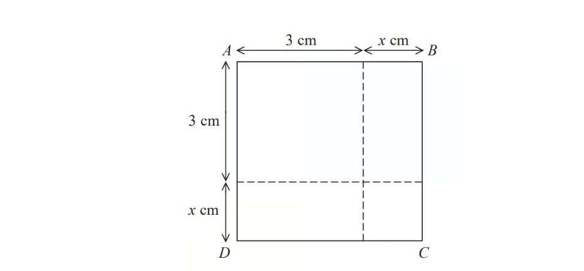
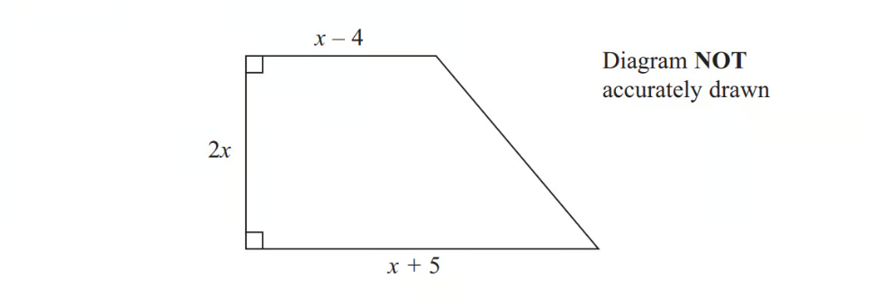
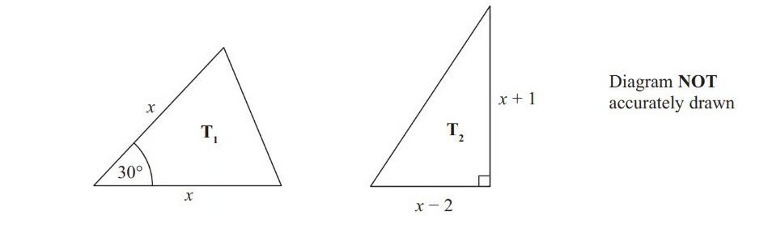
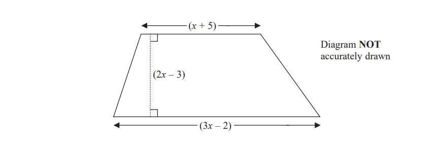

# Exam Questions — Solving Quadratic Equations
**Equations, Formulae & Identities** · Edexcel IGCSE Maths A (4MA1) — 18/Higher
> Source: [https://www.savemyexams.com/igcse/maths/edexcel/a/18/higher/topic-questions/2-equations-formulae-and-identities/solving-quadratic-equations/exam-questions/](https://www.savemyexams.com/igcse/maths/edexcel/a/18/higher/topic-questions/2-equations-formulae-and-identities/solving-quadratic-equations/exam-questions/) · 42 questions · total 155 marks

## Q1 — medium — 2 marks · exam-questions

### 16() — 2 marks — command: solve — structured — from paper November 2017 · 1MA1/2H
Solve   `open parentheses x space minus space 2 close parentheses to the power of 2 space end exponent equals space 3`

Give your solutions correct to $3$ significant figures.

## Q2 — medium — 3 marks · exam-questions

### 25() — 3 marks — command: solve — structured — from paper June 2015 · 1MA0/2H
Solve the equation $3x^{2}+4x-12=0$

Give your solutions correct to $2$ decimal places.

## Q3 — medium — 3 marks · exam-questions

### 20() — 3 marks — command: solve — structured — from paper June 2016 · 1MA0/2H
Solve     $3x^{2}+6x-2=0$

Give your solutions correct to $2$decimal places.

## Q4 — medium — 3 marks · exam-questions

### 19((c)) — 3 marks — command: solve — structured — from paper November 2016 · 1MA0/2H
Solve    $3x^{2}-x-1=0$

Give your solutions correct to $2$ decimal places.

## Q5 — medium — 3 marks · exam-questions

### 11() — 3 marks — command: solve — structured — from paper Sample 2015 · 1MA1/3H
Solve     $x^{2}-5x+3=0$

Give your solutions correct to $3$ significant figures.

## Q6 — medium — 1 marks · exam-questions

### 8((b)) — 1 mark — command: explain — structured — from paper 2015 Spec2 · 1MA1/2H
Liz is asked to solve the equation $3x^{2}+8=83$

Here is her working.

`table row cell 3 x squared space plus space 8 space end cell equals cell space 83 end cell row cell 3 x squared space end cell equals cell space 75 end cell row cell x to the power of 2 space end exponent end cell equals cell space 25 end cell row cell x space end cell equals cell space 5 end cell end table`

Explain what is wrong with Liz's answer.

## Q7 — medium — 3 marks · exam-questions

### 22() — 3 marks — command: solve — structured — from paper June 2012 · 1MA0/2H
Solve   $3x^{2}-4x-2=0$

Give your solutions correct to $3$ significant figures.

## Q8 — medium — 3 marks · exam-questions

### 20() — 3 marks — command: solve — structured — from paper November 2014  · 1MA0/2H
Solve   $3x^{2}-5x-1=0$

Give your solutions correct to $3$ significant figures.

## Q9 — medium — 3 marks · exam-questions

### 21() — 3 marks — command: solve — structured — from paper June 2017 · 1MA0/2H
Solve   $2x^{2}+3x-7=0$

Give your solutions correct to $2$ decimal places.

## Q10 — medium — 3 marks · exam-questions

### 9() — 2 marks — command: factorise — structured — from paper June 2021 · 4MA1/2H
Factorise  $x^{2}+2x--24$.

### 9() — 1 mark — command: solve — structured — from paper June 2021 · 4MA1/2H
Hence solve  $x^{2}+2x--24=0$

[1]

## Q11 — medium — 3 marks · exam-questions

### 9() — 3 marks — command: solve — structured — from paper Jan 2021 · 4MA1/2HR
Solve  $x^{2}--21x+20=0$

Show your working clearly.

## Q12 — medium — 2 marks · exam-questions

### 22() — 2 marks — command: work_out — structured — from paper Nov 2019 · 8300/3H
The **only** solution to $x^{2}+bx+c=0$    is    $x=5$

Work out the values of $b$ and $c$.

$b=....................\,c=.....................$

## Q13 — medium — 3 marks · exam-questions

### 18((a)) — 1 mark — command: write — structured — from paper June 2019 · 8300/3H
Write $x(3x--9)=4$ in the form  $ax^{2}+bx+c=0$ where $a,b$ and $c$are integers.

### 18((b)) — 2 marks — command: solve — structured — from paper June 2019 · 8300/3H
Solve$x(3x--9)=4$

Give your answers to 2 decimal places.

## Q14 — medium — 3 marks · exam-questions

### 12() — 3 marks — command: solve — structured — from paper Nov 2018 · 8300/1H
Solve $x^{2}-x-12=0$

## Q15 — medium — 3 marks · exam-questions

### 27((b)) — 3 marks — command: give — structured — from paper June 2018 · 8300/1H
**Without** expanding any brackets,

show how to work out the **exact** solutions of    $9(x+3)^{2}=4$

Give the solutions.

## Q16 — medium — 3 marks · exam-questions

### 6() — 3 marks — command: solve — structured — from paper Nov 2019 · J560/05
Solve by factorising.

$x^{2}+9x+20=0$

$x$= ....................... or $x$ = .......................

## Q17 — medium — 4 marks · exam-questions

### 19() — 4 marks — command: solve — structured — from paper June 2019 · J560/04
Solve this equation algebraically. 
Give your solutions correct to 2 decimal places.

3*x*2 + 8*x* - 5 = 0

*x* = .................... or *x* = ....................

## Q18 — medium — 4 marks · exam-questions

### 13((a)) — 4 marks — command: solve — structured — from paper Nov 2017 · J560/04
Solve.

$x^{2}-6x+15=3x-5$

$x=$.............. or $x=$..............

## Q19 — medium — 2 marks · exam-questions

### 2((b)) — 2 marks — command: solve — structured — from paper Specimen 2015 · J560/06
Solve.

$3x^{2}=75$

$x$ = .................

## Q20 — medium — 3 marks · exam-questions

### 6((d)) — 3 marks — structured — from paper 2023 June · 4MA1/1H
(i)  Factorise  $x^{2}+9x--22$

(ii) Hence solve $x^{2}+9x--22=0$

## Q21 — hard — 3 marks · exam-questions

### 17() — 3 marks — command: solve — structured — from paper Spec2 2015 · 1MA1/1H
Solve     $x^{2}-6x-8=0$

Write your answer in the form $a\pm\sqrt{b}$ where $a$and $b$are integers.

## Q22 — hard — 3 marks · exam-questions

### 22() — 3 marks — command: work_out — structured — from paper November  2015 · 1MA0/2H
Alison is using the quadratic formula to solve a quadratic equation.

She substitutes values into the formula and correctly gets.

$x=\frac{-7\pm\sqrt{49-32}}{4}$

Work out the quadratic equation that Alison is solving.

Give your answer in the form $ax^{2}+bx+c=0$, where $a,b$ and $c$ are integers.

## Q23 — hard — 3 marks · exam-questions

### 4() — 3 marks — command: prove — structured — from paper June 2017 · 1MA1/1H

The area of square $ABCD$ is $10$ cm2. 
Show that $x^{2}+6x=1$

## Q24 — hard — 4 marks · exam-questions

### 21() — 4 marks — command: solve — structured — from paper June 2017 · 8300/2H
Solve $5x^{2}=10x+4$

Give your answers to 2 decimal places.

## Q25 — hard — 6 marks · exam-questions

### 25((a)) — 3 marks — command: work_out — structured — from paper Specimen 2015 · 8300/2H
$2x^{2}-6x+5$ can be written in the form $a(x-b)^{2}+c$

where $a,b$ and$c$ are positive numbers. Work out the values of  $a,b$ and $c$.

`table attributes columnalign right center left columnspacing 0px end attributes row a equals cell................... end cell row b equals cell................... end cell row c equals cell................... end cell end table`

### 25((b)) — 3 marks — command: solve — structured — from paper Specimen 2015 · 8300/2H
Using your answer to part (a), or otherwise, solve  $2x^{2}--6x+5=8.5$

## Q26 — hard — 6 marks · exam-questions

### 15((a)) — 3 marks — command: solve — structured — from paper Nov 2020 · J560/04
Here are two pieces of work.

For each one, describe the error made and give the complete correct solution.

| Question:  Solve by factorisation.  $3x^{2}--2x--5=0$  Solution:  $(3x+5)(x--1)=0$  Therefore $x=-5/3\mathrm{or}x=1$ |
|---|

Error: ........................................................ Correct solution:

### 15((b)) — 3 marks — command: solve — structured — from paper Nov 2020 · J560/04
| Question: Solve, giving your answers correct to 3 significant figures.  $2x^{2}--8x+3=0$  Solution:  `x equals negative open parentheses blank to the power of minus 8 close parentheses plus-or-minus fraction numerator square root of open parentheses blank to the power of minus 8 close parentheses squared minus 4 cross times 2 cross times 3 end root over denominator 2 cross times 2 end fraction`  Therefore $x=6.42$ or $x=9.58$ |
|---|

Error: ..................................................................... Correct solution:

## Q27 — hard — 3 marks · exam-questions

### 15() — 3 marks — command: solve — structured — from paper June 2019 · J560/06
Solve by factorisation.

$5x^{2}+7x+2=0$

*x* = ............................ or* x *= ............................

## Q28 — hard — 3 marks · exam-questions

### 16() — 3 marks — command: solve — structured — from paper Nov 2018 · J560/04
Solve by factorisation.

2*x*2 − 19*x* − 33 = 0

*x* = ................... or *x* = ..................

## Q29 — hard — 7 marks · exam-questions

### 18((a)) — 7 marks — command: solve — structured — from paper Nov 2018 · J560/05
(i) Write $x^{2}+4x-16$ in the form `open parentheses x plus a close parentheses squared space minus space b`.

[3]

(ii) Solve the equation $x^{2}+4x-16=0$.

Give your answers in surd form as simply as possible.

$x$ = ........... or $x$ = .......... [4]

## Q30 — hard — 3 marks · exam-questions

### 3((b)) — 3 marks — command: solve — structured — from paper 2019	May/June · 0580/42
Solve by factorisation $10r^{2}-23r+9=0$.

$r$ = ................... or $r$ = ...................

## Q31 — very_hard — 3 marks · exam-questions

### 22() — 3 marks — command: solve — structured — from paper 2016	June · 1MA0/1H
Solve    `x squared space equals space 4 open parentheses x minus 3 close parentheses squared`

## Q32 — very_hard — 5 marks · exam-questions

### 22((a)) — 3 marks — command: solve — structured — from paper November 2012 · 1MA0/2H
Solve         $2x^{2}+9x-7=0$

Give your solutions correct to $3$ significant figures.

### 22((b)) — 2 marks — command: solve — structured — from paper November 2012 · 1MA0/2H
Solve      $\frac{2}{y^{2}}+\frac{9}{y}-7=0$

Give your solutions correct to $3$ significant figures.

## Q33 — very_hard — 5 marks · exam-questions

### 21() — 5 marks — command: find — structured — from paper 2015 Spec2 · 1MA1/2H
Given that

$2x-1:x-4=16x+1:2x-1$

find the possible values of $x$.

## Q34 — very_hard — 5 marks · exam-questions

### 22((a)) — 2 marks — command: prove — structured — from paper November 2013 · 1MA0/2H
The diagram shows a trapezium.

All the measurements are in centimetres.

The area of the trapezium is $351$ cm2.

Show that  $2x^{2}+x-351=0$

### 22((b)) — 3 marks — command: work_out — structured — from paper November 2013 · 1MA0/2H
Work out the value of $x$.

## Q35 — very_hard — 4 marks · exam-questions

### 17() — 4 marks — command: find — structured — from paper June 2019 · 1MA1/1H
Given that

`x squared space colon space open parentheses 3 x space plus space 5 close parentheses space equals space 1 space colon space 2`

find the possible values of  $x$.

## Q36 — very_hard — 5 marks · exam-questions

### 25() — 5 marks — command: work_out — structured — from paper March 2013 · 1MA0/2H

The lengths of the sides are in centimetres.

The area of triangle **T****1** is equal to the area of triangle **T****2****.**

Work out the value of $x$, giving your answer in the form  $a+\sqrt{b}$  where $a$ and $b$ are integers.

## Q37 — very_hard — 5 marks · exam-questions

### 25() — 5 marks — command: find — structured — from paper Nov 2020 · 4MA1/1HR
Given that $M=$ `fraction numerator 18 to the power of 4 n end exponent cross times 2 to the power of 3 open parentheses n squared minus 6 n close parentheses end exponent cross times 3 to the power of 2 open parentheses 1 minus 4 n close parentheses end exponent over denominator 12 squared end fraction`

find the values of $n$ for which $M=2$

## Q38 — very_hard — 6 marks · exam-questions

### 18((a)) — 3 marks — command: prove — structured — from paper Jan 2019 · 4MA1/2H
The diagram shows a trapezium.

All measurements shown on the diagram are in centimetres. 
The area of the trapezium is $133\mathrm{cm}^{2}$

Show that $8x^{2}--6x--275=0$

### 18((b)) — 3 marks — command: find — structured — from paper Jan 2019 · 4MA1/2H
Find the value of $x.$

Show your working clearly.

## Q39 — very_hard — 5 marks · exam-questions

### 29((a)) — 2 marks — command: express — structured — from paper June 2018 · 4MA1/2HR
Express $7--4x--x^{2}$ in the form $p--(x+q)^{2}$ where $p$ and $q$ are constants.

### 29((b)) — 3 marks — command: solve — structured — from paper June 2018 · 4MA1/2HR
Use your answer to part (a) to solve the equation $7--4(y+3)--(y+3)^{2}=0$

Give your solutions in the form $e\pm\sqrt{f}$ where $e$ and$f$ are integers.

## Q40 — very_hard — 5 marks · exam-questions

### 29() — 5 marks — command: solve — structured — from paper Nov 2020 · 8300/2H
Solve  $\frac{5}{4x+1}=\frac{2x}{x^{2}+3}$

Give your solutions to 3 significant figures. You **must **show your working.

## Q41 — very_hard — 6 marks · exam-questions

### 17() — 6 marks — command: find — structured — from paper Specimen 2015 · J560/06
$y=6x^{4}+7x^{2}$ and $x=\sqrt{w+1}$

Find the value of $w$ when $y=10$. Show your working.

$w$ = ................

## Q42 — very_hard — 3 marks · exam-questions

### 21((b)) — 3 marks — command: find — structured — from paper 2020 Nov · 1MA1/3H
$6x^{2}=7xy+20y^{2}$  where  $x>0$ and  $y>0$

Find the ratio  $x:y$
