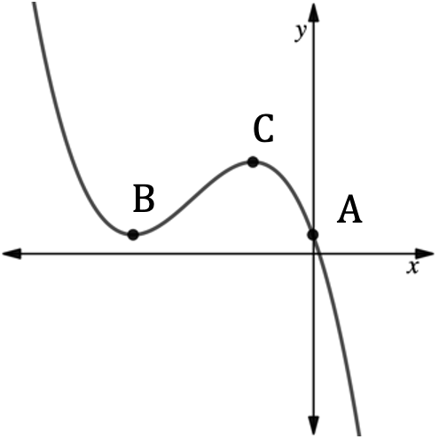
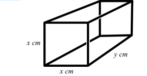
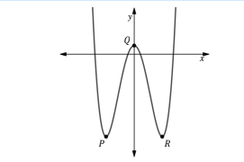
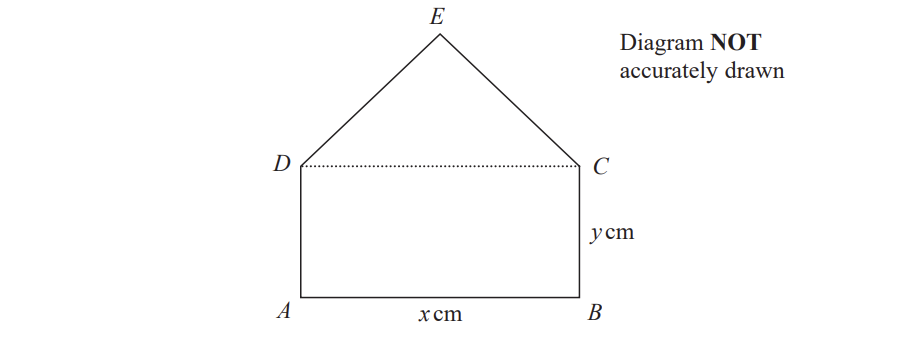

# Exam Questions — Differentiation
**Sequences, Functions & Graphs** · Edexcel IGCSE Maths A (4MA1) — 18/Higher
> Source: [https://www.savemyexams.com/igcse/maths/edexcel/a/18/higher/topic-questions/3-sequences-functions-and-graphs/differentiation/exam-questions/](https://www.savemyexams.com/igcse/maths/edexcel/a/18/higher/topic-questions/3-sequences-functions-and-graphs/differentiation/exam-questions/) · 35 questions · total 210 marks

## Q1 — medium — 3 marks · exam-questions

### 1() — 1 mark — command: use — structured
Use differentiation to find $\frac{dy}{dx}$ for the following:

$y=x^{4}$

### 2() — 1 mark — structured
$y=2x^{-3}$

### 3() — 1 mark — structured
$y=\frac{4}{x}$

## Q2 — medium — 3 marks · exam-questions

### 1() — 1 mark — command: use — structured
Use differentiation to find $\frac{dy}{dx}$ for the following:

$y=4x^{3}+2x$

### 2() — 1 mark — structured
$y=-5x^{-2}$

### 3() — 1 mark — structured
$y=\frac{1}{3x}$

## Q3 — medium — 5 marks · exam-questions

### 1() — 1 mark — command: use — structured
Use differentiation to find $\frac{dy}{dx}$ for the following:

$y=2x^{3}-6x^{2}+3x-4$

### 2() — 2 marks — structured
$-\frac{5}{3x^{4}}$

### 3() — 2 marks — structured
$\frac{2}{3}x^{2}+\frac{1}{5}x-\frac{3}{2x}$

## Q4 — medium — 4 marks · exam-questions

### 1() — 2 marks — command: find — structured
For the curve with equation $y=2x^{2}-6x-11$:

find $\frac{dy}{dx}$

### 2() — 2 marks — command: find — structured
Find the coordinates of the point on the curve where the gradient is 2.

## Q5 — medium — 7 marks · exam-questions

### 1() — 2 marks — command: find — structured
A curve has equation $y=x^{3}+\frac{7}{2}x^{2}-2x+9$

Find $\frac{dy}{dx}$

### 2() — 4 marks — command: find — structured
Find the gradient of the curve at the point where:

(i) $x=-3$

[2]

(ii) $x=\frac{2}{3}$

[2]

### 3() — 1 mark — command: what — structured
What can you say about the tangents to the curves at these two points?

## Q6 — medium — 6 marks · exam-questions

### 1() — 4 marks — command: find — structured
A particle $P$ passes the fixed point $O$ whilst moving along a straight line.

The displacement of $P$, from $O$, at time $t$ seconds is $s$ metres where

$s=6t^{3}-12t^{2}+7t$

Find expressions for the velocity, $vm/s$, and the acceleration, $am/s^{2}$ of the particle at time $t$ seconds.

### 2() — 2 marks — command: find — structured
Find the time at which the acceleration is 3 $m/s^{2}$.

## Q7 — medium — 6 marks · exam-questions

### 17((a)) — 2 marks — command: find — structured — from paper Nov 2020 · 4MA1/1HR
The curve $C$ has equation $y=5x^{3}--x^{2}--6x+4$.

Find  $\frac{dy}{dx}$.

$\frac{dy}{dx}$ = ..............................................

### 17((b)) — 4 marks — command: find — structured — from paper Nov 2020 · 4MA1/1HR
There are two points on the curve $C$ at which the gradient of the curve is $2$.

Find the $x$ coordinate of each of these two points. Show clear algebraic working.

## Q8 — medium — 6 marks · exam-questions

### 12((a)) — 2 marks — command: find — structured — from paper Specimen 2016 · 4MA1/2H
$y=x^{3}--6x^{2}--15x$.

Find $\frac{dy}{dx}$.

$\frac{dy}{dx}=$....................................

### 12((b)) — 4 marks — command: work_out — structured — from paper Specimen 2016 · 4MA1/2H
The curve with equation $y=x^{3}--6x^{2}--15x$ has two stationary points.

Work out the coordinates of these two stationary points.

## Q9 — medium — 5 marks · exam-questions

### 15((a)) — 2 marks — command: find — structured — from paper Jan 2019 · 4MA1/1H
The curve $C$ has equation $y=\frac{1}{3}x^{3}-9x+1$.

Find  $\frac{dy}{dx}$.

### 15((b)) — 3 marks — command: find — structured — from paper Jan 2019 · 4MA1/1H
Find the range of values of $x$ for which $C$ has a negative gradient.

## Q10 — medium — 3 marks · exam-questions

### 7((a)) — 3 marks — command: calculate — structured — from paper 2020 Oct/Nov · 0580/43
Calculate the gradient of  $y=24+5x-x^{2}$ at $x=-1.5$.

## Q11 — medium — 4 marks · exam-questions

### 21((a)) — 2 marks — structured — from paper 2020 Oct/Nov · 0580/22
Differentiate $6+4x-x^{2}$.

### 21((b)) — 2 marks — command: find — structured — from paper 2020 Oct/Nov · 0580/22
Find the coordinates of the turning point of the graph of $y=6+4x-x^{2}$ .

( ...................... , ...................... )

## Q12 — medium — 6 marks · exam-questions

### 11((a)) — 2 marks — command: find — structured — from paper 2023 June · 4MA1/1H
The curve **C** has equation  $y=4x^{3}+x^{2}-20x$

Find $\frac{dy}{dx}$

### 11((b)) — 4 marks — command: find — structured — from paper 2023 June · 4MA1/1H
Find the  $x$coordinates of the points on **C** where the gradient is 4 
Show clear algebraic working.

## Q13 — medium — 4 marks · exam-questions

### 16() — 4 marks — command: find — structured — from paper 2023 Nov · 4MA1/1H
A curve has equation  $y=4x^{3}-8x+5$

Find the  $x$ coordinates of the two points on the curve where the gradient is $\frac{1}{3}$

## Q14 — hard — 8 marks · exam-questions

### 1() — 2 marks — command: find — structured
A curve has equation $y=2x^{2}+x-3$.

Find: the coordinates where the curve crosses the $x$-axis,

### 2() — 1 mark — structured
the coordinates where the curve crosses the $y$-axis,

### 3() — 3 marks — structured
the coordinates of the turning point on the curve,

### 4() — 2 marks — command: sketch — structured
Sketch the curve showing the points you have found.

## Q15 — hard — 4 marks · exam-questions

### 1() — 2 marks — command: find — structured
A particle is moving along a straight line. The fixed point $O$ lies on this line.

The displacement of the particle from $O$ at time $t$ seconds is $s$ metres where

$s=2t^{3}-9t^{2}-60t$

Find an expression for the velocity, $v$ $m/s$ of the particle at time $t$ seconds.

### 2() — 2 marks — command: find — structured
Find the time at which the velocity is instantaneously zero.

## Q16 — hard — 5 marks · exam-questions

### 1() — 2 marks — command: find — structured
For the curve with equation $y=x^{3}-7x^{2}-5x$: 
find $\frac{dy}{dx}$

### 2() — 2 marks — command: find — structured
find the $x$-coordinates of the two turning points on the curve.

### 3() — 1 mark — command: determine — structured
By considering the shape of the curve determine which of your answers to (b) is the $x$-coordinate of a maximum point.

## Q17 — hard — 8 marks · exam-questions

### 1() — 1 mark — command: write — structured
The curve $G$ has equation $y=1-x^{3}-6x^{2}-9x$.

Part of the graph of $G$ is shown below.

Write the coordinates of A.

### 2() — 5 marks — command: find — structured
Points B and C are stationary points on $G$.

Find the coordinates of points B and C, stating the nature of the stationary point in each case.

### 3() — 2 marks — structured
For which values of $x$ is the gradient of the curve $G$ negative?

## Q18 — hard — 7 marks · exam-questions

### 1() — 2 marks — command: find — structured
For the curve with equation $y=4x+\frac{64}{x}+7$

find $\frac{dy}{dx}$

### 2() — 3 marks — command: find — structured
find the coordinates of the stationary points on the curve.

### 3() — 2 marks — command: find — structured
find the exact distance between the two stationary points.

## Q19 — hard — 7 marks · exam-questions

### 1() — 1 mark — structured
A particle is moving along a straight line and passes a fixed point $O$.

The displacement of the particle, from point $O$, at time $t$ seconds is

$s=\frac{1}{3}t^{3}-\frac{5}{2}t^{2}+20t-15$

where $s$ is measured in metres. Initially how far is the particle from $O$?

### 2() — 2 marks — command: find — structured
Find, in terms of $t$, the velocity of the particle.

### 3() — 2 marks — command: find — structured
Find the time at which the particle’s velocity is at its minimum.

### 4() — 2 marks — structured
For how long is the particle decelerating?

## Q20 — hard — 9 marks · exam-questions

### 1() — 1 mark — command: prove — structured
A homeowner wishes to enclose a rectangular part of their garden by building a fence, using an existing wall as one side of the rectangle as shown in the diagram below.

The width of the enclosed rectangle is $w$ metres and its length $l$ metres.

The homeowner has 40 metres of fence to use and would like to use it all in order to maximise the area of the garden to be enclosed. Show that $l=40-2w$

### 2() — 2 marks — command: prove — structured
Show that the area of the garden to be enclosed, $A$, is given by $A$= 40$w$ − 2$w^{2}$

### 3() — 2 marks — command: find — structured
Find $\frac{dA}{dW}$

### 4() — 2 marks — command: find — structured
Find the value of $w$ that maximises $A$

### 5() — 2 marks — command: find — structured
Find the dimensions of the rectangle that produce the maximum area that can be enclosed using all of the fence.

Also find the maximum area.

## Q21 — hard — 8 marks · exam-questions

### 15((a)) — 3 marks — command: prove — structured — from paper Jan 2020 · 4MA1/1H

The diagram shows a cuboid of volume $V\mathrm{cm}^{3}$

Show that $V=15+16x-x^{2}-2x^{3}$

### 15((b)) — 5 marks — command: find — structured — from paper Jan 2020 · 4MA1/1H
There is a value of $x$ for which the volume of the cuboid is a maximum.

Find this value of $x$. 
Show your working clearly. 
Give your answer correct to 3 significant figures.

## Q22 — hard — 5 marks · exam-questions

### 19() — 5 marks — command: find — structured — from paper Jan 2021 · 4MA1/2H
A particle $P$ is moving along a straight line. 
The fixed point $O$ lies on this line. 
At time $t$ seconds where `t space greater-than or slanted equal to space 0`, the displacement, $s$ metres, of $P$ from $O$ is given by

$s=t^{3}+5t^{2}--8t+10$

Find the displacement of $P$ from $O$ when $P$ is instantaneously at rest.

Give your answer in the form $\frac{a}{b}$ where $a$ and $b$ are integers.

## Q23 — hard — 11 marks · exam-questions

### 1() — 2 marks — command: explain — structured
A cuboid with a square cross section is to be made from rods as shown in the diagram. The shorter rods making the square are of length xx cm and the longer rods

are of length $y$ cm.

Explain why 12 rods in total will be needed to make the cuboid, and state how many of each length will be required.

The total length of the rods is to be fixed at 36 cm.

### 2() — 2 marks — command: find — structured
The total length of the rods is to be fixed at 36 cm.

Find $y$ in terms of $x$

### 3() — 2 marks — command: prove — structured
Show that the volume of the cuboid, $V$ cm3 is $V$ = 9$x^{2}$ − 2$x^{3}$.

### 4() — 3 marks — command: find — structured
Find the value of $x$ that maximises the volume.

### 5() — 2 marks — command: find — structured
Find the maximum volume.

## Q24 — hard — 4 marks · exam-questions

### 18() — 4 marks — command: find — structured — from paper 2023 Nov · 4MA1/2H
A particle is moving along a straight line that passes through the fixed point O.
The displacement, $s$ metres, of the particle from O at time $t$ seconds is given by

$s=2t^{3}-5t^{2}+6t-5$

Find the value of* *$t$* *when the acceleration of the particle is 5 m/s²

## Q25 — very_hard — 8 marks · exam-questions

### 1() — 2 marks — command: prove — structured
A curve, $C$, has equation $y=2x^{2}+8k^{2}x-3$ where $k$ is a constant. 

Show that when $k$ = 0, the turning point on $C$ has coordinates (0, -3).

### 2() — 4 marks — command: prove — structured
Show that when $k$ ≠ **0**, the turning point on $C$ must have a negative $x$-coordinate.

### 3() — 2 marks — structured
When $k$≠ 0 determine whether or not the $y$-coordinate of the turning point is negative.

## Q26 — very_hard — 7 marks · exam-questions

### 1() — 7 marks — command: find — structured
Part of the graph with equation $y=2x^{4}-16x^{2}+3$is shown below.

The graph has three stationary points, indicated on the graph by points $P$, $Q$ and$R$.
 Find the area of the triangle $P$$QR$.

## Q27 — very_hard — 10 marks · exam-questions

### 1() — 4 marks — command: prove — structured
The diagram shows a cuboid with a square cross-section.

The sides of the square face are $x$cm and the length of the cuboid is $y$cm.

The cuboid is to have a fixed surface area, $A$, of 25 cm2.

Show that the volume of the cuboid, $V$ cm3 is given by

$V=\frac{25}{4}x-\frac{1}{2}x^{3}$

### 2() — 4 marks — command: prove — structured
Show that the value of $x$ that maximises the volume of the cuboid is $\frac{5\sqrt{6}}{6}$

### 3() — 2 marks — command: find — structured
Find the maximum volume of the cuboid, correct to 3 significant figures.

## Q28 — very_hard — 5 marks · exam-questions

### 24() — 5 marks — command: find — structured — from paper Jan 2022 · 4MA1/2H
A particle $P$ moves along a straight line that passes through the fixed point $O$

The displacement, $x$ metres, of$P$from $O$ at time t seconds, where `t greater-than or slanted equal to space 0`, is given by

$x=4t^{3}-27t+8$

The direction of motion of  $P$ reverses when $P$ is at the point $A$ on the line.

The acceleration of $P$ at the instant when $P$ is at $A$ is $am/s^{2}$. Find the value of  $a$.

a = .....................................

## Q29 — very_hard — 8 marks · exam-questions

### 1() — 2 marks — command: find — structured
$y=\frac{2}{3}x^{3}+\frac{11}{2}x^{2}-30x$

Find $\frac{dy}{dx}$

$\frac{dy}{dx}=$.............................

### 2() — 4 marks — command: work_out — structured
The curve with equation $y=\frac{2}{3}x^{3}+\frac{11}{2}x^{2}-30x$ has two stationary points.  By finding a suitable quadratic to solve, work out the $x$ coordinates of these two points.

### 3() — 2 marks — command: work_out — structured
The curve with equation $y=\frac{2}{3}x^{3}+\frac{11}{2}x^{2}-30x$ has two stationary points.

Using part (b) or otherwise, work out the coordinates of these two stationary points.

## Q30 — very_hard — 6 marks · exam-questions

### 23() — 6 marks — command: find — structured — from paper Jan 2022 · 4MA1/1HR
Two particles, $P$ and $Q$, move along a straight line.

The fixed point $O$ lies on this line.

The displacement of $P$ from $O$ at time $t$ seconds is $s$ metres, where

$s=t^{3}--4t^{2}+5tfort>1$

The displacement of $Q$ from $O$ at time $t$ seconds is $x$ metres, where

$x=t^{2}--4t+4fort>1$

Find the range of values of $t$ where $t>1$ for which both particles are moving in the same direction along the straight line.

## Q31 — very_hard — 5 marks · exam-questions

### 21() — 5 marks — command: solve — structured — from paper June 2021 · 4MA1/2H
The point A is the only stationary point on the curve with equation $y=kx^{2}+\frac{16}{x}$  where $k$is a constant.

Given that the coordinates of $A$ are `open parentheses 2 over 3 comma space a close parentheses`

find the value of $a$. 
Show your working clearly.

$a=$ .................................................

## Q32 — very_hard — 6 marks · exam-questions

### 24() — 6 marks — command: find — structured — from paper Jan 2022 · 4MA1/1H
The curve $C$ has equation $y=ax^{3}+bx^{2}--12x+6$ where $a$ and $b$ are constants.

The point $A$ with coordinates (2, –6) lies on $C$.

The gradient of the curve at $A$ is 16.

Find the $y$ coordinate of the point on the curve whose $x$ coordinate is 3. 
Show clear algebraic working.

## Q33 — very_hard — 5 marks · exam-questions

### 20() — 5 marks — command: find — structured — from paper Jan 2021 · 4MA1/1HR
A particle $P$ is moving along a straight line.

The fixed point $O$ lies on the line.

At time t seconds `left parenthesis t space greater-than or slanted equal to space 0 right parenthesis`, the displacement of $P$ from $O$ is s metres where

$s=t^{3}--9t^{2}+33t--6$

Find the minimum speed of $P$.

...................................................... m/s

## Q34 — very_hard — 6 marks · exam-questions

### 19((a)) — 3 marks — command: prove — structured — from paper Nov 2021 · 4MA1/1H
$ABCED$ is a five-sided shape.

$ABCD$ is a rectangle.
 $CED$ is an equilateral triangle.

$AB=x\mathrm{cm}BC=y\mathrm{cm}$

The perimeter of $ABCED$is 100 cm.
 The area of $ABCED$is $R$ cm2

Show that `R equals x over 4 open parentheses 200 minus open square brackets 6 minus square root of 3 close square brackets x close parentheses`

### 19((b)) — 3 marks — command: explain — structured — from paper Nov 2021 · 4MA1/1H
(i) Find the value of $x$ for which $R$ has its maximum value.

Give your answer in the form $\frac{p}{q-\sqrt{3}}$ where $p$ and $q$ are integers.

$x=$ ....................................................... [2]

(ii) Explain why the maximum value of $R$ is given by this value of $x$.

[1]

## Q35 — very_hard — 6 marks · exam-questions

### 23() — 6 marks — command: find — structured — from paper Jan 2020 · 4MA1/1HR
A particle moves along a straight line. 
The fixed point $O$ lies on this line. 
The displacement of the particle from $O$ at time $t$ seconds , `t space greater-than or slanted equal to space 0` , is $s$ metres where

$s=t^{3}+4t^{2}-5t+7$

At time $T$ seconds the velocity of $P$ is $Vm/s$ where `V space greater-than or slanted equal to space minus 5`

Find an expression for $T$ in terms of $V$.

Give your expression in the form $\frac{-4+\sqrt{k+mV}}{3}$ where $k$$m$ and  are integers to be found.

$T=...............$
