# Mark Schemes — Estimating Gradients
**Sequences, Functions & Graphs** · Edexcel IGCSE Maths A (4MA1) — 18/Higher

## Q1 — medium — 3 marks · exam-questions

### 14() — 3 marks
*In a **distance-time graph**, the **speed is equivalent to the gradient** of the graph* 
*We can estimate the speed at time 5 seconds by drawing a tangent at time 5 seconds and calculating its gradient*

> *First draw a tangent at 5 seconds. This should be a straight line (use a ruler or straight edge) touching the curve at 5 seconds, but not crossing the curve*

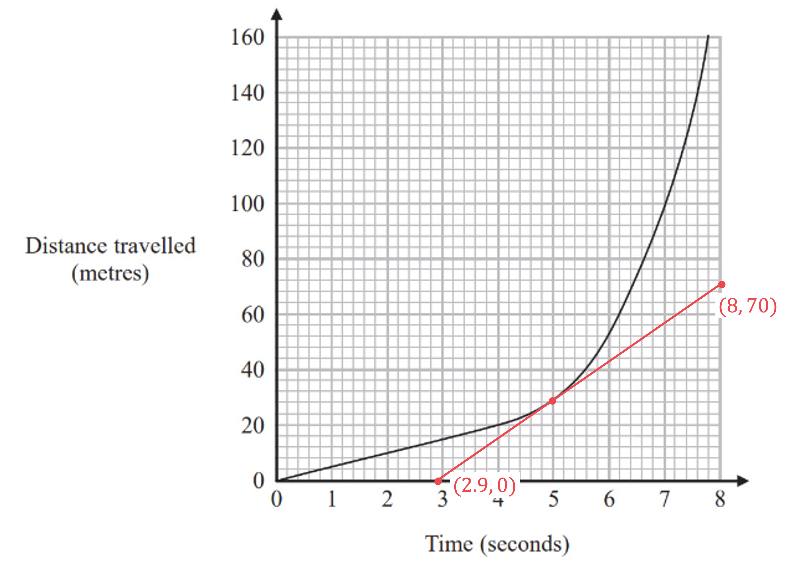

**suitable tangent line drawn**** [1]**

> *Pick two points on the tangent, not too close to each other. Try to pick points that can be clearly read off the grid. E.g. in the diagram above, we have picked (8, 70) and (2.9, 0) *

> *Find the gradient between these two points using *$\frac{\mathrm{rise}}{\mathrm{run}}$* or *$\frac{y_{1}-y_{2}}{x_{1}-x_{2}}$* *

> *Your gradient will depend on your tangent so there is some margin of error permitted in exam questions. For the tangent drawn above, the calculation and answer would be as follows*

*gradient = *$\frac{70-0}{8-2.9}$

$\frac{rise}{run}$* ***or gradient formula used with tangent line**** [1]**

$=\frac{70}{5.1}=13.7254902...$

> *As the distance is in metres and the time is in seconds, the gradient is the speed in m/s. *

> *If your calculation does not result in an exact answer, write the answer to at least 3 significant figures*

**13.7 m/s ****[1]**** **
**Any answer from 11 to 19 m/s so long as it is consistent with the drawn tangent line**

## Q2 — medium — 3 marks · exam-questions

### 1() — 2 marks
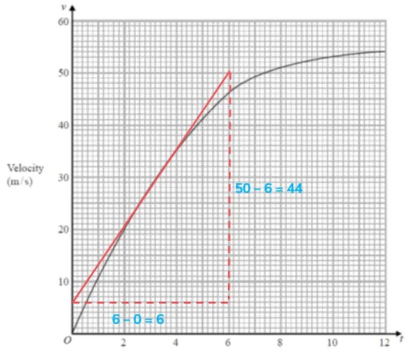

**Suitable tangent drawn [1]**

> *Draw a tangent at 3 to calculate gradient using *$\frac{rise}{run}$

$\mathrm{Gradient}=\frac{50-6}{6-0}=\frac{44}{6}$

$\mathrm{Gradient}=7.333...$

$7.3$

**Answers between 6.5 and 7.5 [1]**

### 2() — 1 marks
**Final answer:** **The gradient shows the acceleration of the parachutist after 3 seconds is 7.3 ms****-2**

**[1]**

## Q3 — medium — 3 marks · exam-questions

### 1() — 2 marks

**Suitable tangent drawn [1]**

> *Draw a tangent at 3 to calculate the gradient using *$\frac{rise}{run}$

$\mathrm{Gradient}=\frac{18-9}{4-2}=\frac{9}{2}$

**Final answer:** **4.5**

**Answers between 4.1 and 4.9 [1]**

### 2() — 1 marks
**Final answer:** **The gradient shows the temperature is increasing at 4.5 °C per hour**

**[1]**

## Q4 — medium — 3 marks · exam-questions

### 1() — 1 marks
> *The gradient is zero at the turning point of the graph*

$x=3$

**[1]**

### 2() — 2 marks
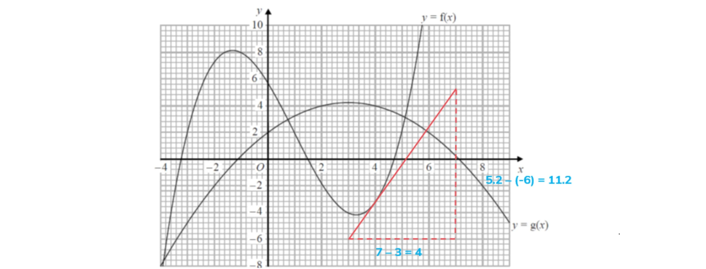

**Suitable tangent drawn [1]**

> *Draw a tangent at 4 to calculate the gradient using *$\frac{y_{2}-y_{1}}{x_{2}-x_{1}}$

$\mathrm{Gradient}=\frac{5.2--6}{7-3}=\frac{11.2}{4}$

**Final answer:** **2.8**

**Between 2.6 and 3 [1]**

## Q5 — medium — 5 marks · exam-questions

### 20((a)) — 2 marks
*We have the graph of *$y=x^{2}-2x+3$* so we need to rearrange *$x^{2}-3x-1=0$* so that "*$x^{2}-2x+3$*" appears on its own on one side of the equation*

> *Add 4 to both sides*

$x^{2}-3x-1=0\,x^{2}-3x+3=4$

> *Add *$x$* to both sides*

$x^{2}-2x+3=x+4$

> *Draw the line *$y=x+4$* on the graph using your knowledge of linear graphs **y** = **mx** + **c**. Draw a line through 4 on the **y**-axis with gradient 1*

**y = x + 4 drawn correctly on the grid**** [1]**

> *Read the *$x$* values where *$y=x+4$* and *$y=x^{2}-2x+3$* intersect. There is some margin of error permitted (see below)*

**Final answer:** **x ****= 3.3, ****x**** = −0.3**

**x value from −0.2 to −0.4 and x value from 3.2 to 3.4 ****[1]**

### 20((b)) — 3 marks
> *We can estimate the gradient at *$x=2$* by drawing a tangent at *$x=2$* and calculating its gradient*

> *First draw a tangent at *$x=2$*. This should be a straight line (use a ruler or straight edge) touching the curve at *$x=2$*, but not crossing the curve*

**suitable tangent line drawn**** [1]**

> *Pick two points on the tangent, not too close to each other. Try to pick points that can be clearly read off the grid. E.g. in the diagram above, we have picked (4, 7.1) and (0.6, 0) *

> *Find the gradient between these two points using *$\frac{\mathrm{rise}}{\mathrm{run}}$* or *$\frac{y_{1}-y_{2}}{x_{1}-x_{2}}$* *

> *Your gradient will depend on your tangent so there is some margin of error permitted in exam questions. For the tangent drawn above, the calculation and answer would be as follows*

*gradient = *$\frac{7.1-0}{4-0.6}$

$\frac{rise}{run}$* ***or gradient formula used with tangent line**** [1]**

$=\frac{7.1}{3.4}=2.088235294...$

> *If your calculation does not result in an exact answer, write the answer to at least 3 significant figures*

**Answer = 2.09 ****[1]**** **

**Any answer from 1.6 to 2.5 so long as it is consistent with the drawn tangent line**

## Q6 — medium — 5 marks · exam-questions

### 1() — 2 marks
> *The gradient is zero at the two turning points of the graph.*

**Final answer:** **(-1, 0) and (1, -4)**

**[2]**

### 2() — 1 marks
> *The gradient is negative in the middle section between the two turning points of the graph, this is where it slopes downwards*

$-1<x<1$

**[1]**

### 3() — 2 marks
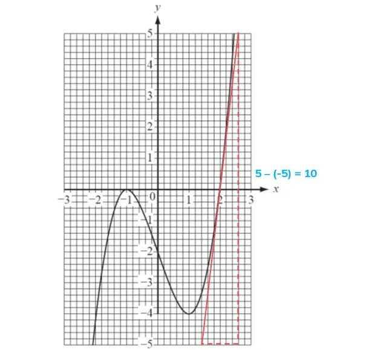

> *Draw a tangent at 2 to calculate gradient *$\frac{y_{2}-y_{1}}{x_{2}-x_{1}}$

$\mathrm{Gradient}=\frac{5--5}{2.6-1.4}=\frac{10}{1.2}=8.333...$

**Final answer:** **8.3**

**Answers between 8 and 8.5 [1]**

## Q7 — medium — 3 marks · exam-questions

### 17() — 3 marks
> *We can estimate the gradient at the point where **x** = 2  by drawing a tangent and calculating its gradient.*

> *First draw a tangent at the point on the curve where **x** = 2. This should be a straight line (use a ruler or straight edge) touching, but not crossing the curve.*

**suitable tangent line drawn**** [1]**

> *Pick two points on the tangent, not too close to each other. Try to pick points that can be clearly read off the grid.*

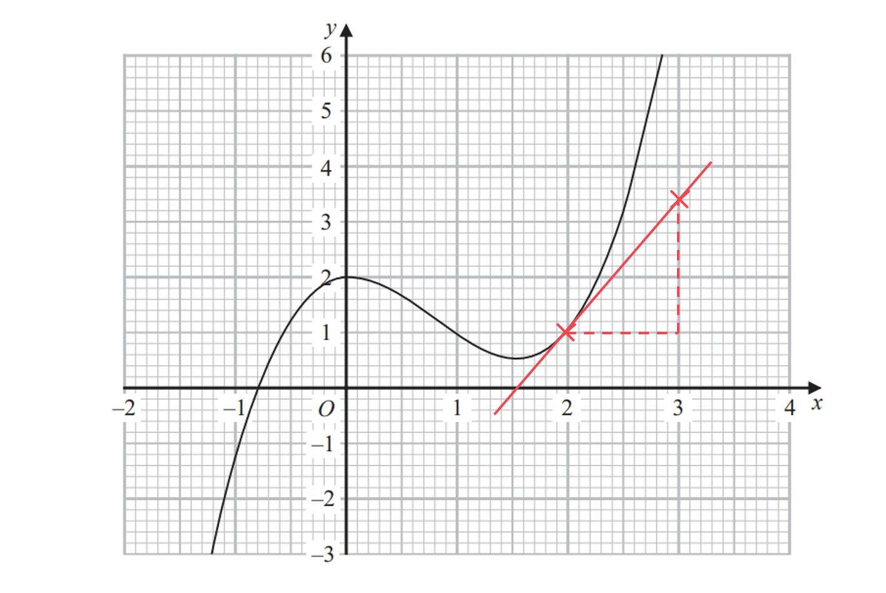

> *In the diagram above, we have picked (2, 1) and (3, 3.4). *

> *Find the gradient between these two points using *$\frac{\mathrm{rise}}{\mathrm{run}}$* or *$\frac{y_{1}-y_{2}}{x_{1}-x_{2}}$*. *

> *Your gradient will depend on your tangent so there is some margin of error permitted in exam questions. For the tangent drawn above, the calculation and answer would be as follows.*

*gradient = *$\frac{3.4-1}{3-2}$

$\frac{rise}{run}$* ***or gradient formula used with tangent line**** [1]**

$=\frac{2.4}{1}$

**Gradient = 2.4 ****[1]**

** ****Any answer from 1.5 to 3 as long as it is consistent with the drawn tangent line**

## Q8 — medium — 3 marks · exam-questions

### 24() — 2 marks
> *We can estimate the gradient at the point **A ** by drawing a tangent on the graph at **A **and calculating its gradient.*

> *First draw a tangent at the point *`open parentheses 2 comma space 7 close parentheses`*. This should be a straight line (use a ruler or straight edge) touching the curve at **A **but not crossing the curve.*

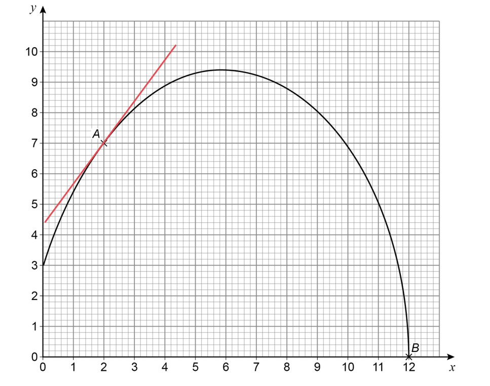

**Suitable tangent line drawn**** [1]**

> *Pick two points on the tangent, not too close to each other. Try to pick points that can be clearly read off the grid. E.g. in the diagram below, we have picked (0.2, 4.6) and (3, 8.4).*

> *Find the gradient between these two points using *$\frac{\mathrm{rise}}{\mathrm{run}}$* or *$\frac{y_{1}-y_{2}}{x_{1}-x_{2}}$* *

> *Your gradient will depend on your tangent so there is some margin of error permitted in exam questions. For the tangent drawn above, the calculation and answer would be as follows*

*gradient = *$\frac{8.4-4.6}{3-0.2}=\frac{3.8}{2.8}=1.3571...$* *

> *If your calculation does not result in an exact answer, write the answer to at least 3 significant figures*

**Answer = 1.36 ****[1]**** **

**Answer must be consistent with the drawn tangent line**

### 24((b)) — 1 marks
*The average rate of change is the gradient of the line between the points **A **and **B.*

> *Draw the line onto the graph if needed to help.*

> *It is not necessary to find the gradient as we can see that it is going in the negative direction. *

**It is negative**** [1]**

## Q9 — medium — 3 marks · exam-questions

### 23((a)) — 1 marks
> *Considering the shape of the graph, the gradient starts steep and becomes shallower, meaning that the depth increases at a slower and slower rate.*

> *This matches container C, which gets wider towards the top, meaning the rate of filling decreases as the depth increases.*

**The correct answer is Container C**** [1]**

### 23((b)) — 2 marks
> *We can estimate the gradient at 3 seconds by drawing a tangent at the point on the graph where *$t=3$* and calculating its gradient.*

> *First draw a tangent at *$t=3$*. This should be a straight line (use a ruler or straight edge) touching the curve at *$t=3$*, but not crossing the curve*

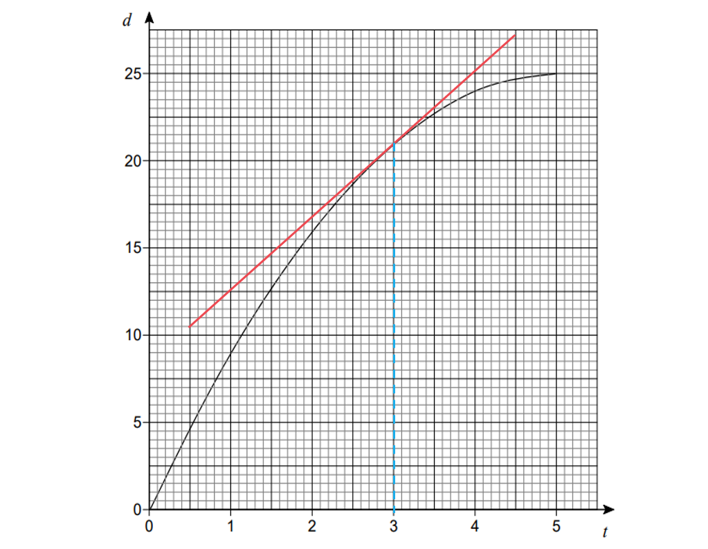

**Suitable tangent line drawn**** [1]**

> *Pick two points on the tangent, not too close to each other. Try to pick points that can be clearly read off the grid. E.g. in the diagram below, we have picked (1.6, 15) and (3.5, 23).*

> *Find the gradient between these two points using *$\frac{\mathrm{rise}}{\mathrm{run}}$* or *$\frac{y_{1}-y_{2}}{x_{1}-x_{2}}$* *

> *Your gradient will depend on your tangent so there is some margin of error permitted in exam questions. For the tangent drawn above, the calculation and answer would be as follows*

*gradient = *$\frac{23-15}{3.5-1.6}=\frac{8}{1.9}=4.2105...$* *

> *If your calculation does not result in an exact answer, write the answer to at least 3 significant figures*

**Final answer:** **Answer = 4.21 **

**Any answer from 3.6 to 4.4 as long as it is consistent with the drawn tangent line ****[1]**

## Q10 — medium — 2 marks · exam-questions

### 24() — 2 marks
> *We can estimate the speed of the ball after 1 second by finding the gradient.*

> *First draw a tangent at *$t=1$*. *

> *This should be a straight line (use a ruler or straight edge) touching the curve at *$t=1$*, but not crossing the curve*

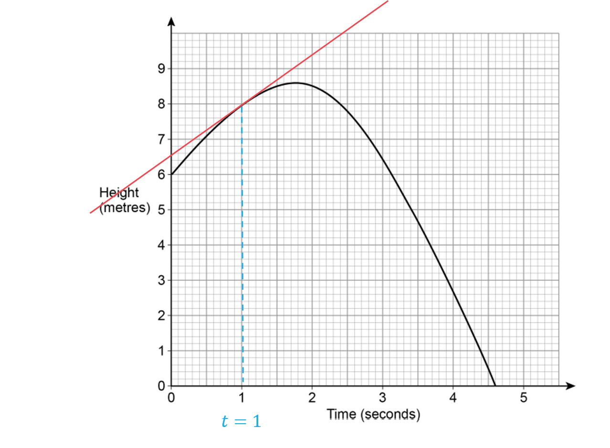

**Suitable tangent line drawn**** [1]**

> *Pick two points on the tangent, not too close to each other. Try to pick points that can be clearly read off the grid, e.g. in the diagram below, we have picked (0, 6.6) and (2, 9.4).*

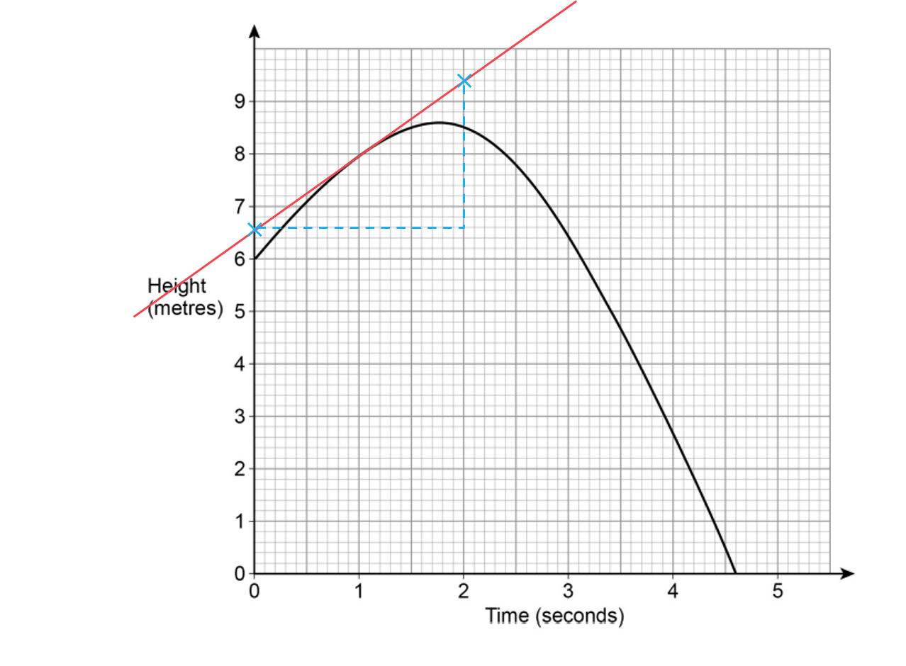

> *Find the gradient between these two points using *$\frac{\mathrm{rise}}{\mathrm{run}}$* or *$\frac{y_{1}-y_{2}}{x_{1}-x_{2}}$*. *

> *Your gradient will depend on your tangent so there is some margin of error permitted in exam questions. For the tangent drawn above, the calculation and answer would be as follows*

*gradient = *$\frac{9.4-6.6}{2-0}=\frac{2.8}{2}=1.4$* *

> *If your calculation does not result in an exact answer, write the answer to at least 3 significant figures*

**1.4 m/s ****[1]**** **

**Answer must be consistent with the drawn tangent line**

## Q11 — medium — 4 marks · exam-questions

### 19() — 4 marks
> *In a distance-time graph, the speed at any given point is equal to the gradient of the tangent at that point. So draw a tangent at Time = 5 and calculate its gradient. *
*The tangent is a straight line touching the curve but not crossing the curve (there is some margin of error- see note below final answer). E.g.:*

**suitable tangent drawn**** [1]**

> *Using gradient = *$\frac{y_{1}-y_{2}}{x_{1}-x_{2}}$* or *$\frac{\mathrm{rise}}{\mathrm{run}}$*;*

*speed = gradient = *$\frac{6.6}{5.3}$

**attempt to find gradient with no more than one error ****[1]**** **
**correct calculation for gradient based on your tangent line**** [1]**

*                                                            = 1.245283019...*

> *This answer will depend on your tangent line so there is some margin of error (see below). Round to at least 3 significant figures if necessary.*

**Acceleration = 1.25 m/s**** ****[1] **

**Any answer from 1.0 to 1.4 is accepted, so long as it is correct for your tangent line and rounded correctly**

## Q12 — medium — 3 marks · exam-questions

### 15((c)) — 3 marks
> *In a speed-time graph, the acceleration at any given point is equal to the gradient of the tangent at that point. So draw a tangent at **t** = 7 and calculate its gradient. *

> *The tangent is a straight line touching the curve at **t** = 7 but not crossing the curve (there is some margin of error- see note below final answer). E.g.:*

**suitable tangent drawn**** [1]**

> *Using gradient = *$\frac{y_{1}-y_{2}}{x_{1}-x_{2}}$* or *$\frac{\mathrm{rise}}{\mathrm{run}}$*;*

*acceleration = gradient = *$\frac{26}{6.2}$

**correct calculation for gradient based on your tangent line**** [1]**

*                                                            = 4.193548387...*

> *This answer will depend on your tangent line so there is some margin of error (see below). Round to at least 3 significant figures if necessary.*

**Acceleration = 4.19 m/s****2**** ****[1] **

**Any answer from 4 to 4.5 is accepted, so long as it is correct for your tangent line and rounded correctly**

## Q13 — hard — 3 marks · exam-questions

### 1() — 2 marks

**Suitable tangent drawn [1]**

> *Draw a tangent at 1 to calculate the gradient using *$\frac{y_{2}-y_{1}}{x_{2}-x_{1}}$

$\mathrm{Gradient}=\frac{2--4}{2-0}=\frac{6}{2}$

**Final answer:** **Gradient = 3**

**Answers between 2.1 and 3.9 [1]**

### 2() — 1 marks
> *If the gradient of the tangent at D is 0, D must be one of the turning points where the curve is flat*

> *If the x-coordinate of D is negative, D must lie on the left-hand side of the y-axis therefore D is (-2, 8)*

**Final answer:** **(-2, 8)**

**[1]**

## Q14 — hard — 4 marks · exam-questions

### 1() — 3 marks
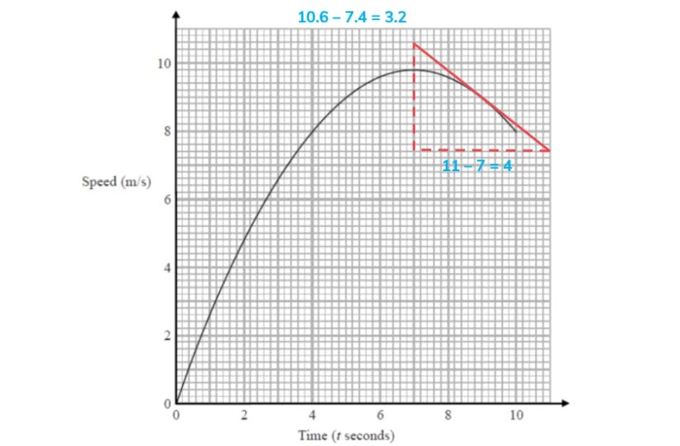

**Suitable tangent drawn [1]**

> *Draw a tangent at 9 to calculate the gradient using *$\frac{rise}{run}$

> *Gradient is negative as tangent slopes downwards*

$\mathrm{Gradient}=-\frac{10.6-7.4}{11-7}=-\frac{3.2}{4}$

*Gradient = -0.8*

**between -1.2 and -0.6 [1]**

**Final answer:** **-0.8 ms****-2**

**Units must be stated, allow m/s****2**** [1]**

### 2() — 1 marks
**Final answer:** **After 7 seconds her speed decreases, i.e. she starts decelerating**

**[1]**

## Q15 — hard — 5 marks · exam-questions

### 1() — 2 marks
> *Draw a line at *$y=3$* to see where the line and curve intersect*

> *The solutions will be the *$x$*-coordinates of the points of intersection*

**Line at **$y=3$** [1]**

**Final answer:** $x=0.8$** and **$x=5.3$

**[1]**

### 2() — 3 marks
> *Draw a tangent at *$x=1$* to calculate the gradient using *$\frac{y_{2}-y_{1}}{x_{2}-x_{1}}$

**Suitable tangent drawn [1]**

> *Gradient is negative as tangent slopes downwards*

`table row Gradient equals cell negative fraction numerator 3.8 minus 0 over denominator 3 minus 0 end fraction equals negative fraction numerator 3.8 over denominator 3 end fraction end cell row blank equals cell negative 1.2666... end cell end table`

**[1]**

**Final answer:** **Gradient = -1.27**

**Answers between -1.2 and -1.3 [1]**

## Q16 — hard — 6 marks · exam-questions

### 15((a)) — 3 marks
> *We can estimate the gradient at time 4 seconds by drawing a tangent at time 4 seconds and calculating its gradient*

> *First draw a tangent at 4 seconds. This should be a straight line (use a ruler or straight edge) touching the curve at 4 seconds, but not crossing the curve*

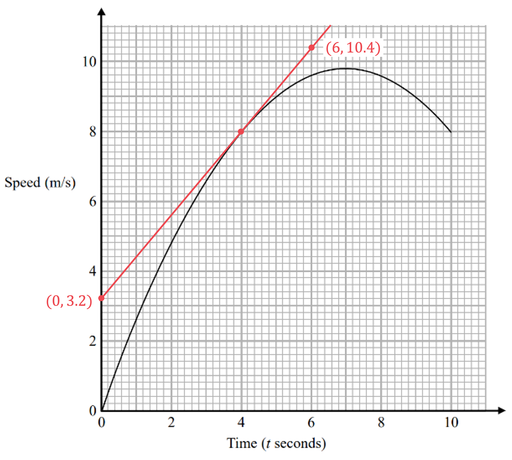

**suitable tangent line drawn**** [1]**

> *Pick two points on the tangent, not too close to each other. Try to pick points that can be clearly read off the grid. E.g. in the diagram above, we have picked (6, 10.4) and (0, 3.2) *

> *Find the gradient between these two points using *$\frac{\mathrm{rise}}{\mathrm{run}}$* or *$\frac{y_{1}-y_{2}}{x_{1}-x_{2}}$* *

> *Your gradient will depend on your tangent so there is some margin of error permitted in exam questions. For the tangent drawn above, the calculation and answer would be as follows*

*gradient = *$\frac{10.4-3.2}{6-0}$

$\frac{rise}{run}$* ***or gradient formula used with tangent line**** [1]**

$=\frac{7.2}{6}=1.2$

> *If your calculation does not result in an exact answer, write the answer to at least 3 significant figures*

**Answer = 1.2 ****[1]**** **

**Any answer from 1.0 to 1.3 so long as it is consistent with the drawn tangent line**

### 15((b)) — 2 marks
> *In a **speed-time graph**, the **gradient** of the graph represents the **acceleration*

**acceleration ****[1]**
**"****in m/s****2****" and/or "****4**** ****seconds after the start of the race****" and/or "****when the speed is 7.6 m/s****"**** ****[1]**
**"acceleration" plus any of the three options in the second line above will achieve full marks**

### 15((c)) — 1 marks
> *Two examples of suitable answers are;*

**Final answer:** **"the accuracy of the gradient depends on the accuracy of the tangent line"  **

**or**

**Final answer:** **"we can't be sure that the tangent line is correctly drawn"**

**[1]**

**any statement such as the ones above **

## Q17 — hard — 3 marks · exam-questions

### 1() — 2 marks

**Suitable tangent drawn [1]**

> *Draw a tangent at 10 to calculate the gradient using *$\frac{rise}{run}$

$\mathrm{Gradient}=\frac{66-34}{25-0}=\frac{32}{25}$

**Final answer:** **1.28**

**Answers between 1.2 and 1.4 [1]**

### 2() — 1 marks
**Final answer:** **The gradient shows the diameter of the fishbowl is increasing by 1.28 cm per second.**

**[1]**

## Q18 — hard — 5 marks · exam-questions

### 18() — 3 marks
> *We can estimate the gradient at the point **P **by drawing a tangent and calculating its gradient.*

> *First draw a tangent at the point **P**. This should be a straight line (use a ruler or straight edge) touching the curve at **P**, but not crossing the curve.*

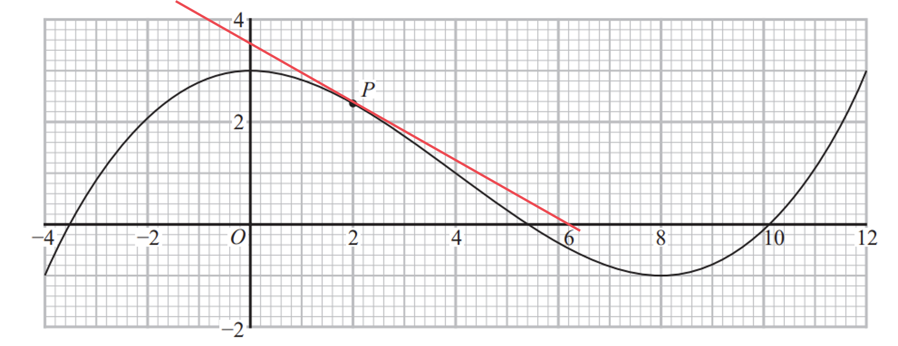

**suitable tangent line drawn**** [1]**

> *Pick two points on the tangent, not too close to each other. Try to pick points that can be clearly read off the grid.*

> *In the diagram above, we have picked (1, 3) and (4, 1.2) *

> *Find the gradient between these two points using *$\frac{\mathrm{rise}}{\mathrm{run}}$* or *$\frac{y_{1}-y_{2}}{x_{1}-x_{2}}$*. *

> *Your gradient will depend on your tangent so there is some margin of error permitted in exam questions. For the tangent drawn above, the calculation and answer would be as follows.*

*gradient = *$\frac{1.2-3}{4-1}$

$\frac{rise}{run}$* ***or gradient formula used with tangent line**** [1]**

$=\frac{-1.8}{3}=-0.6$

> *If your calculation does not result in an exact answer, write the answer to at least 3 significant figures.*

**Answer = -0.6 ****[1]**** **

**Any answer from -0.4 to -0.7 or answers consistent with the drawn tangent line**

### 18() — 2 marks
*The tangent is a straight line so it has equation *$y=mx+c$* where *$m$*is the gradient and *$c$*is the *$y$*-intercept*

> *Substitute in your answer from part (a), for example *$m=-0.6$

$y=-0.6x+c$

**[1]*** *

> *The value of *$c$* can be read off of your graph, it will be the point where your tangent intercepts the *$y$*-axis. *

> * On the diagram below, the tangent intercepts the *$y$*-axis at 3.6.*

$c=3.6$

> *Your answer should be read off of your graph, but must be greater than 3. *

> *Write the final answer as an equation in *$x$* and *$y$

$y=-0.6x+3.6$** [1]**

## Q19 — hard — 3 marks · exam-questions

### 18((d)) — 3 marks
> *We can estimate the gradient at the point where **x** = -0.5  by drawing a tangent and calculating its gradient.*

> *First draw a tangent at the point on the curve where **x** = -0.5. This should be a straight line (use a ruler or straight edge) touching, but not crossing the curve.*

**suitable tangent line drawn**** [1]**

> *Pick two points on the tangent, not too close to each other. Try to pick points that can be clearly read off the grid.*

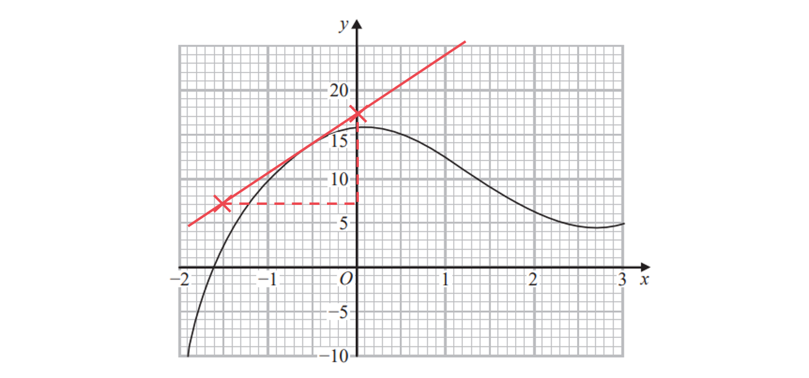

> *In the diagram above, we have picked (0, 17) and (-1.5, 7). *

> *Find the gradient between these two points using *$\frac{\mathrm{rise}}{\mathrm{run}}$* or *$\frac{y_{1}-y_{2}}{x_{1}-x_{2}}$*. *

> *Your gradient will depend on your tangent so there is some margin of error permitted in exam questions. For the tangent drawn above, the calculation and answer would be as follows.*

*gradient = *`fraction numerator 17 space minus space 7 over denominator 0 space minus space open parentheses negative 1.5 close parentheses end fraction`

$\frac{rise}{run}$* ***or gradient formula used with tangent line**** [1]**

$=\frac{10}{1.5}=\frac{20}{3}=6.6666....$

> *If your calculation does not result in an exact answer, write the answer to at least 3 significant figures.*

**Gradient = 6.67 ****[1]**** **

**Any answer from 5 to 7 as long as it is consistent with the drawn tangent line**

## Q20 — hard — 3 marks · exam-questions

### 25() — 3 marks
> *We can estimate the gradient at 10 seconds by drawing a tangent at the point on the graph where *$t=10$* and calculating its gradient.*

> *First draw a tangent at *$t=10$*. This should be a straight line (use a ruler or straight edge) touching the curve at *$t=10$*, but not crossing the curve.*

**Suitable tangent line drawn**** [1]**

> *Pick two points on the tangent that can be clearly read off the grid, e.g. in the diagram below, we have picked (0, 22) and (20, 8).*

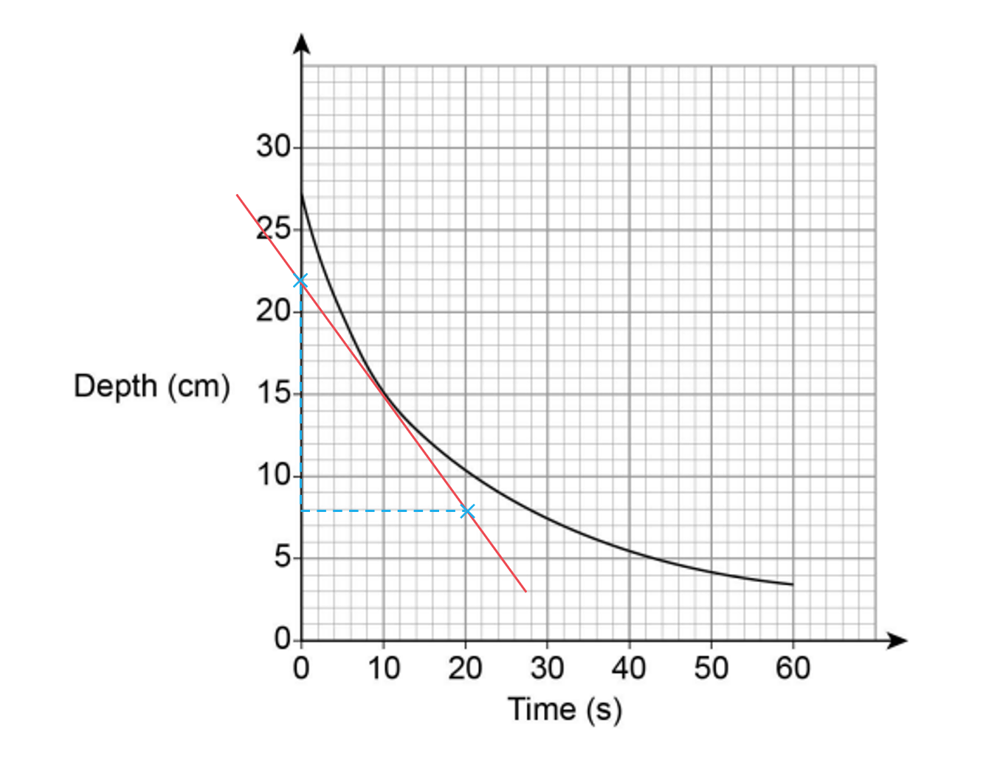

> *Find the gradient between these two points using *$\frac{\mathrm{rise}}{\mathrm{run}}$* or *$\frac{y_{1}-y_{2}}{x_{1}-x_{2}}$*. *

> *Your gradient will depend on your tangent so there is some margin of error permitted in exam questions. For the tangent drawn above, the calculation and answer would be as follows*

*gradient = *$\frac{8-22}{20-0}=\frac{-14}{20}=-0.7$* *

**Attempt to find gradient from tangent ****[1]**

> *The gradient is -0.7, but the question asks for the rate of **decrease**, so the negative is not needed in the answer. *

**Answer = 0.7 ****[1]**** **

**Any answer from 0.6 to 0.8 as long as it is consistent with the drawn tangent line**

## Q21 — very_hard — 5 marks · exam-questions

### 1() — 3 marks

> *Using start and end points from the graph calculate gradient using *$\frac{rise}{run}$

$\mathrm{Gradient}=\frac{27-0}{40-0}=\frac{27}{40}$

**Appropriate values chosen [1]**

*Gradient = 0.675*

**Gradient calculated [1]**

**Final answer:** **0.675 ms****-2**

**Must include units, also allow m/s****2**** [1]**

### 2() — 2 marks
> *Two points have equal acceleration where their tangents are parallel to each other*

> *Instantaneous acceleration is equal to average acceleration where the tangent to the curve is parallel to the line from (0, 0) to (40, 27)*

**Suitable tangent drawn [1]**

> *You must draw both lines on the graph to show this*

**Final answer:** **12 seconds**

**[1]**

## Q22 — very_hard — 6 marks · exam-questions

### 1() — 2 marks
> *Draw a tangent at 300 to calculate the gradient using *$\frac{rise}{run}$

**Suitable tangent drawn [1]**

> *Gradient is negative as tangent slopes downwards*

$\mathrm{Gradient}=-\frac{72-20}{800-0}=-\frac{52}{800}$

**Final answer:** **Gradient = -0.065**

**Between -0.05 and -0.08 [1]**

### 2() — 2 marks
> *Using start and end points from the graph calculate gradient using *$\frac{rise}{run}$

> *Gradient is negative as tangent slopes downwards*

$Gradient=-\frac{80-32}{800-0}=-\frac{48}{800}$

**Appropriate values chosen [1]**

**Final answer:** **Gradient = -0.06**

**[1]**

### 3() — 2 marks
> *Two points have equal rates of change where their tangents are parallel to each other*

> *Instantaneous rate of change is equal to the average rate of change where the tangent to the curve is parallel to the line from (0, 80) to (800, 32)*

**Suitable parallel line, which is a tangent, drawn [1]**

> *You must draw both lines on the graph to show this*

**Final answer:** **350 seconds**

**[1]**

## Q23 — very_hard — 5 marks · exam-questions

### 20((a)) — 2 marks
*We have the graph of *$y=x^{2}-2x+3$* so we need to rearrange *$x^{2}-3x-1=0$* so that "*$x^{2}-2x+3$*" appears on its own on one side of the equation*

> *Add 4 to both sides*

$x^{2}-3x-1=0\,x^{2}-3x+3=4$

> *Add *$x$* to both sides*

$x^{2}-2x+3=x+4$

> *Draw the line *$y=x+4$* on the graph using your knowledge of linear graphs **y** = **mx** + **c**. Draw a line through 4 on the **y**-axis with gradient 1*

**y = x + 4 drawn correctly on the grid**** [1]**

> *Read the *$x$* values where *$y=x+4$* and *$y=x^{2}-2x+3$* intersect. There is some margin of error permitted (see below)*

**Final answer:** **x ****= 3.3, ****x**** = −0.3**

**x value from −0.2 to −0.4 and x value from 3.2 to 3.4 ****[1]**

### 20((b)) — 3 marks
> *We can estimate the gradient at *$x=2$* by drawing a tangent at *$x=2$* and calculating its gradient*

> *First draw a tangent at *$x=2$*. This should be a straight line (use a ruler or straight edge) touching the curve at *$x=2$*, but not crossing the curve*

**suitable tangent line drawn**** [1]**

> *Pick two points on the tangent, not too close to each other. Try to pick points that can be clearly read off the grid. E.g. in the diagram above, we have picked (4, 7.1) and (0.6, 0)*

> * Find the gradient between these two points using *$\frac{\mathrm{rise}}{\mathrm{run}}$* or *$\frac{y_{1}-y_{2}}{x_{1}-x_{2}}$* *

> *Your gradient will depend on your tangent so there is some margin of error permitted in exam questions. For the tangent drawn above, the calculation and answer would be as follows*

*gradient = *$\frac{7.1-0}{4-0.6}$

$\frac{rise}{run}$* ***or gradient formula used with tangent line**** [1]**

$=\frac{7.1}{3.4}=2.088235294...$

> *If your calculation does not result in an exact answer, write the answer to at least 3 significant figures*

**Final answer:** **Answer = 2.09 **

**Any answer from 1.6 to 2.5 so long as it is consistent with the drawn tangent line ****[1]**

## Q24 — very_hard — 7 marks · exam-questions

### 1() — 2 marks
> *Plot the points from the table with depth on the y-axis and time on the x-axis*

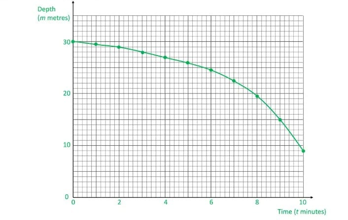

**Points plotted accurately [1]**

**Points joined by a smooth curve [1]**

### 2() — 2 marks
> *Using values from the table calculate the gradient *$\frac{rise}{run}$

> *Gradient is negative as water is decreasing*

`table row Gradient equals cell negative fraction numerator 30 minus 9 over denominator 10 minus 0 end fraction equals negative 21 over 10 end cell row blank equals cell negative 2.1 end cell end table`

**Method to calculate gradient [1]**

**Final answer:** **Gradient = -2.1**

**[1]**

### 3() — 2 marks
> *Draw a tangent at *$t=7$* to calculate the gradient using *$\frac{rise}{run}$

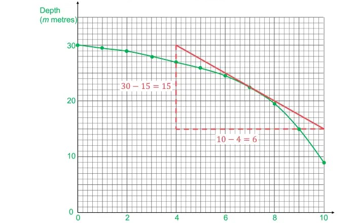

**Suitable tangent drawn [1]**

> *Gradient is negative as tangent slopes downwards*

`table row Gradient equals cell negative fraction numerator 30 minus 15 over denominator 10 minus 4 end fraction equals negative 15 over 6 end cell row blank equals cell negative 2.5 end cell end table`

**Final answer:** **Gradient = -2.5**

**Answers between -2.1 and -3.1 [1]**

### 4() — 1 marks
**Final answer:** **The gradients shows the depth of water is decreasing by 2.5 metres per minute**

**[1]**

## Q25 — very_hard — 7 marks · exam-questions

### 1() — 1 marks
> *The top speed is reached when the graph reaches is highest point (maximum)*

**Final answer:** **6.6 seconds**

**[1]**

### 2() — 3 marks
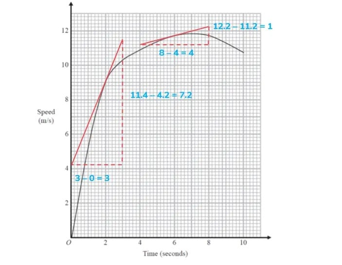

**Suitable tangent drawn [1]**

> *Draw a tangent at 2 to calculate the gradient using *$\frac{rise}{run}$

`table row Gradient equals cell fraction numerator 11.4 minus 4.2 over denominator 3 minus 0 end fraction equals fraction numerator 7.2 over denominator 3 end fraction end cell row blank equals cell 2.4 end cell end table`

**Gradient between 2.3 and 2.8 [1]**

**Final answer:** **2.4 ms****-2**

**Units must be stated, allow m/s****2**** [1]**

### 3() — 3 marks

**Suitable tangent drawn [1]**

> *Draw a tangent at 6 to calculate the gradient using *$\frac{rise}{run}$

`table row Gradient equals cell fraction numerator 12.2 minus 11.2 over denominator 8 minus 4 end fraction equals 1 fourth end cell row blank equals cell 0.25 end cell end table`

**Gradient between 0.2 and 0.4 [1]**

> *Find the difference between the acceleration at t=2 and at t=6*

*2.4 - 0.25 = 2.15*

**Final answer:** **2.15**

**[1]**

## Q26 — very_hard — 11 marks · exam-questions

### 5((a)) — 2 marks
*Find the *$y$* coordinate when *$x=-2$* (by substituting *$x=-2$* into the equation)* * *

`y equals open parentheses negative 2 close parentheses cubed minus 3 cross times open parentheses negative 2 close parentheses minus 1`

$y=-3$* ***[1]**

*Find the *$y$* coordinate when *$x=3$* (by substituting *$x=3$* into the equation)*

`table row y equals cell 3 cubed minus 3 cross times 3 minus 1 end cell end table`

$y=17$ **[1]**

**You could also use your calculator's TABLE function to get the missing values if your calculator has it**

### 5((b)) — 4 marks
*Plot the coordinates on the grid and join them up using a smooth curve*

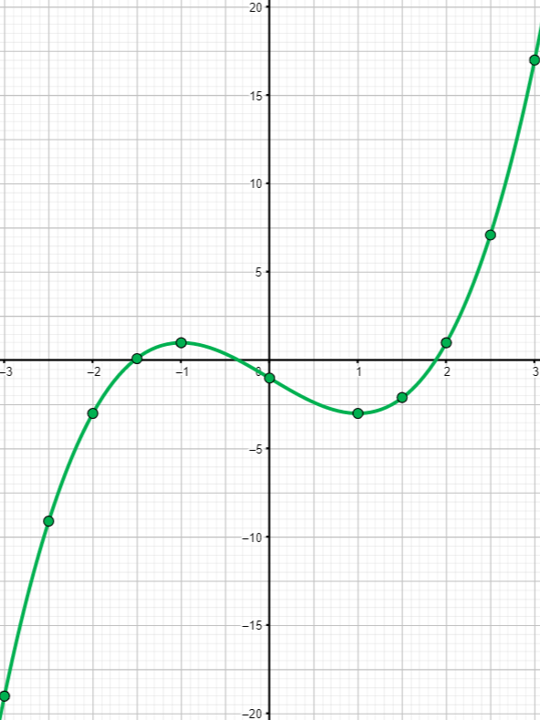

**6 or 7 points plotted correctly**** [1]** 
** 8 ****or 9 points plotted correctly ****[1]** 
**10 or 11 points plotted correctly ****[1]** 
**fully correct curve drawn**** [1]**

### 5((c)) — 5 marks
*i) **Use a ruler to draw a straight line from (0 , -17) to the point where the ruler just touches the curve*

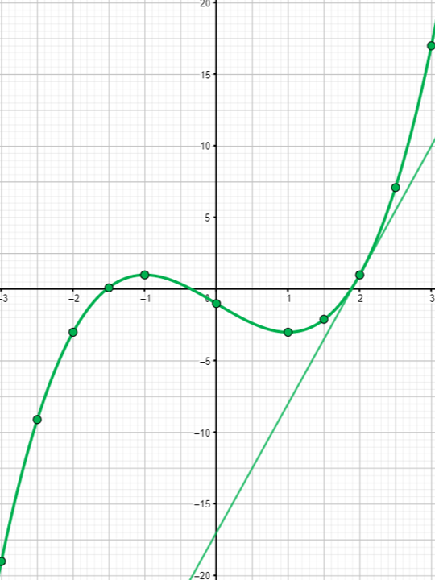

**[1]**

*ii) **Read off the coordinates where the tangent just touches the curve*

**(2, 1)** **[1]**

**The ranges (1.7 to 2.2, -1 to 2.5) are accepted**

*iii) **The equation of a straight line is *$y=mx+c$* where *$m$* is the gradient and *$c$* is the *$y$*-intercept* *Find *$m$* (by choosing two easy points on the tangent and calculating "rise" over "run")*

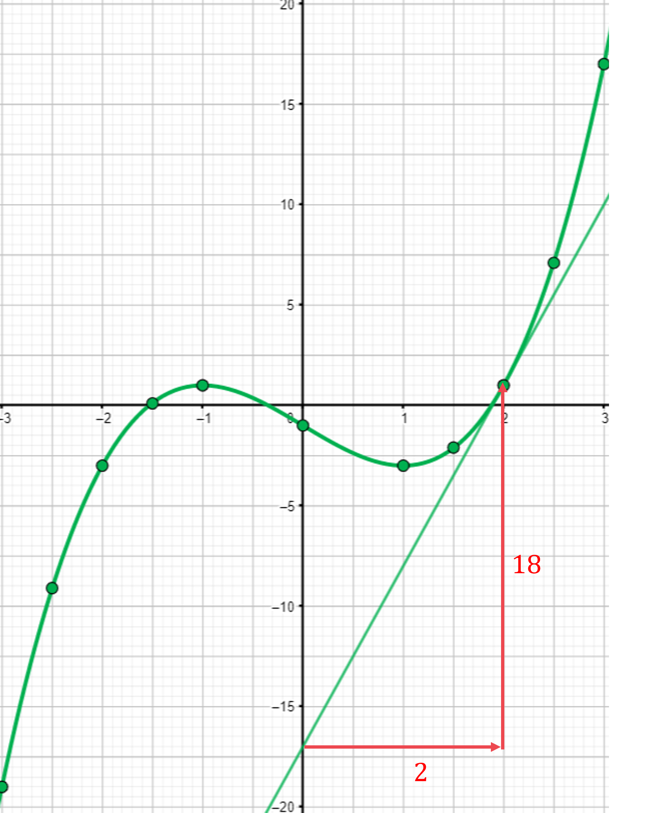

$\frac{\mathrm{rise}}{\mathrm{run}}=\frac{18}{2}=9$

**[1]**

*Write down *$c$* (by reading off where it crosses the *$y$*-axis)*

$c=-17$

**[1]**

> *Give your answer as an equation*

$y=9x-17$ **[1]**
