# Exam Questions — Estimating Gradients
**Sequences, Functions & Graphs** · Edexcel IGCSE Maths A (4MA1) — 18/Higher
> Source: [https://www.savemyexams.com/igcse/maths/edexcel/a/18/higher/topic-questions/3-sequences-functions-and-graphs/estimating-gradients/exam-questions/](https://www.savemyexams.com/igcse/maths/edexcel/a/18/higher/topic-questions/3-sequences-functions-and-graphs/estimating-gradients/exam-questions/) · 26 questions · total 113 marks

## Q1 — medium — 3 marks · exam-questions

### 14() — 3 marks — command: use — structured — from paper 2018	June · 1MA1/2H
The distance-time graph shows information about part of a car journey.

Use the graph to estimate the speed of the car at time 5 seconds.

## Q2 — medium — 3 marks · exam-questions

### 1() — 2 marks — command: find — structured — from paper Pre2017
The graph shows information about the velocity of a parachutist after jumping from a plane.

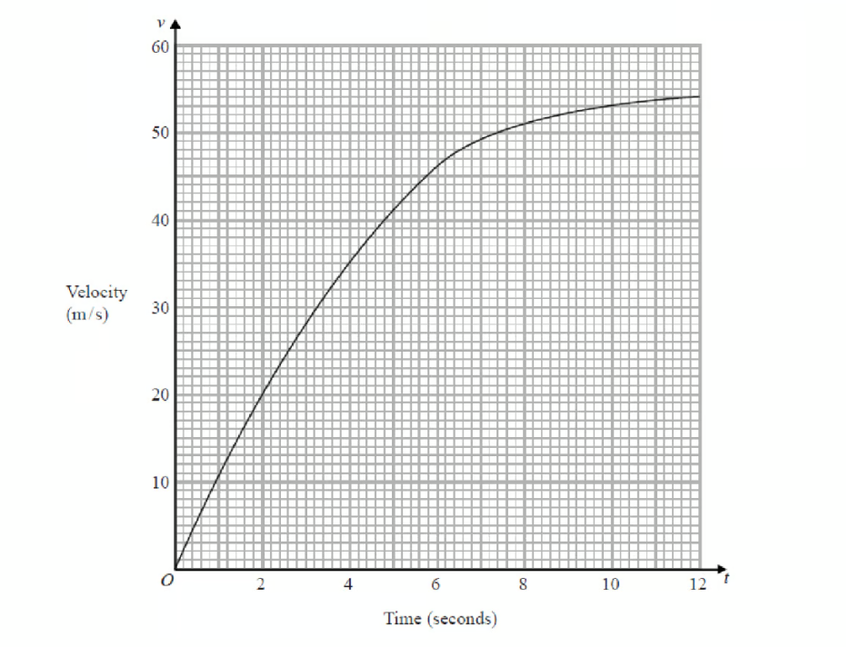

By drawing a suitable tangent, find an estimate of the gradient of the curve after 3 seconds.

### 2() — 1 mark — command: interpret — structured — from paper Pre2017
Interpret the value of the gradient.

## Q3 — medium — 3 marks · exam-questions

### 1() — 2 marks — command: find — structured — from paper Pre2017
The graph shows the temperature of a fish tank over the first 6 hours after a heater is added.

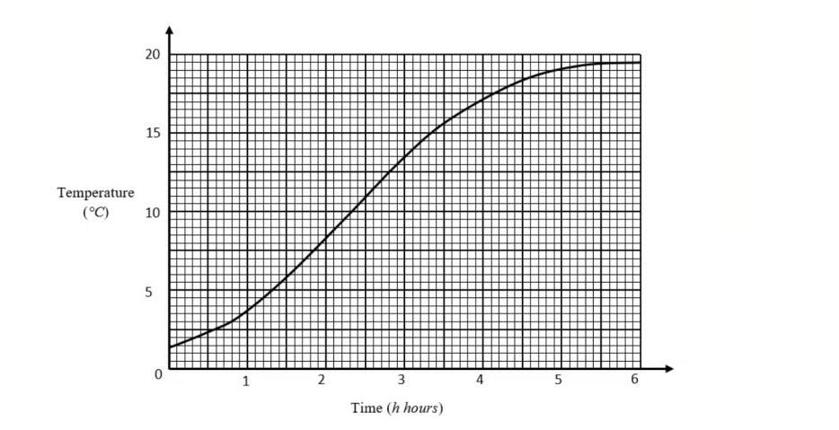

By drawing a suitable tangent, find an estimate of the gradient of the curve when $h$ = 3.

### 2() — 1 mark — command: interpret — structured — from paper Pre2017
Interpret the value of the gradient.

## Q4 — medium — 3 marks · exam-questions

### 1() — 1 mark — command: write — structured — from paper Pre2017
The diagram shows parts of the graphs of *y=*f*(x)* and *y=*g*(x)*

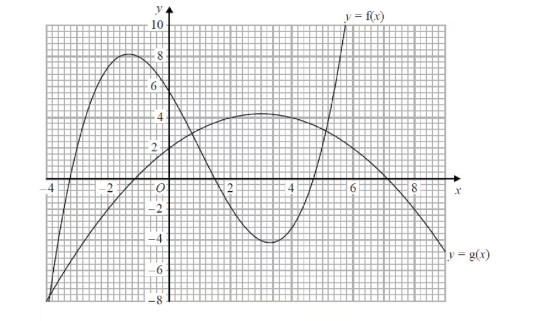

Write down the value of *x* where the gradient of the curve *y=*g*(x)* is zero.

### 2() — 2 marks — command: calculate — structured — from paper Pre2017
Calculate an estimate for the gradient of the curve *y = *f*(x)* at the point on the curve where *x = 4.*

## Q5 — medium — 5 marks · exam-questions

### 20((a)) — 2 marks — command: use — structured — from paper 2017	June · 1MA1/2H
The diagram shows part of the graph of $y=x^{2}---2x+3$

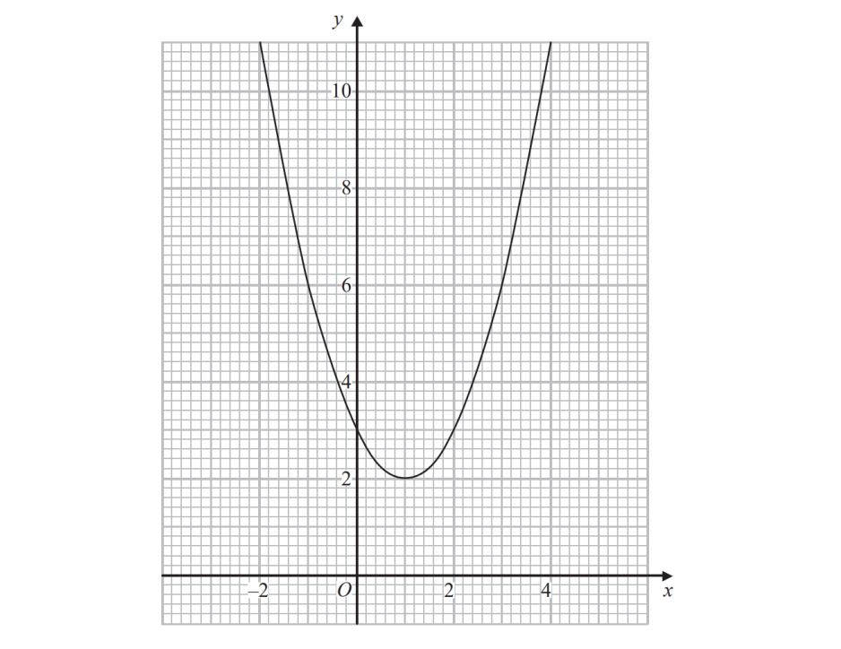

By drawing a suitable straight line, use your graph to find estimates for the solutions of $x^{2}---3x---1=0$

### 20((b)) — 3 marks — command: calculate — structured — from paper 2017	June · 1MA1/2H
$P$ is the point on the graph of $y=x^{2}---2x+3$ where $x=2$

Calculate an estimate for the gradient of the graph at the point $P$.

## Q6 — medium — 5 marks · exam-questions

### 1() — 2 marks — command: write — structured — from paper Pre2017
The curve $y=x^{3}---3x---2$is shown on the grid.

Write down the co-ordinates of the points where the gradient of the curve is zero.

### 2() — 1 mark — command: write — structured — from paper Pre2017
Write down the range of values of x when the gradient of the curve is negative.

### 3() — 2 marks — command: find — structured — from paper Pre2017
Find an estimate of the gradient of the curve when *x *= 2.

## Q7 — medium — 3 marks · exam-questions

### 17() — 3 marks — command: find — structured — from paper Jan 2022 · 4MA1/2HR
Part of the curve with equation $y=f(x)$ is shown on the grid.

Find an estimate for the gradient of the curve at the point where $x=2$ Show your working clearly.

## Q8 — medium — 3 marks · exam-questions

### 24() — 2 marks — command: work_out — structured — from paper Nov 2020 · 8300/3H
$A$ and $B$ are points on a curve.

$A$ is $(2,7)$   $B$ is $(12,0)$

Work out the instantaneous rate of change of $y$ with respect to $x$ at point $A$.

### 24((b)) — 1 mark — command: which — structured — from paper Nov 2020 · 8300/3H
The average rate of change of $y$with respect to $x$ between points $A$ and $B$ is worked out.

Which statement is correct? Tick **one **box.

| `square` | It is positive. |
|---|---|
| `square` | It is zero. |
| `square` | It is negative. |
| `square` | You cannot tell if it is positive or negative. |

## Q9 — medium — 3 marks · exam-questions

### 23((a)) — 1 mark — command: which — structured — from paper Specimen 2015 · 8300/3H
A container is filled with water in 5 seconds.

The graph shows the depth of water, $d$ cm, at time $t$ seconds.

The water flows into the container at a constant rate.

Which diagram represents the container? Circle the correct letter.

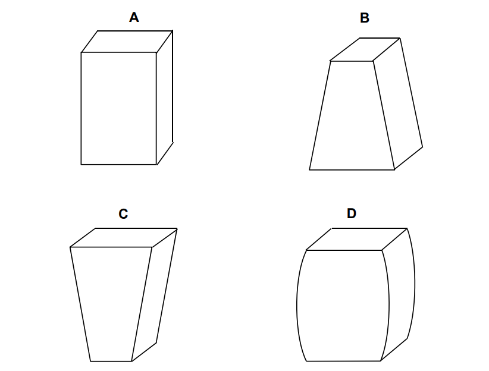

### 23((b)) — 2 marks — command: use — structured — from paper Specimen 2015 · 8300/3H
Use the graph to estimate the rate at which the depth of water is increasing at 3 seconds.

You **must** show your working.

.....................cm/s

## Q10 — medium — 2 marks · exam-questions

### 24() — 2 marks — command: estimate — structured — from paper June 2017 · 8300/3H
A ball is thrown from a point 6 metres above the ground.

The graph shows the height of the ball above the ground, in metres.

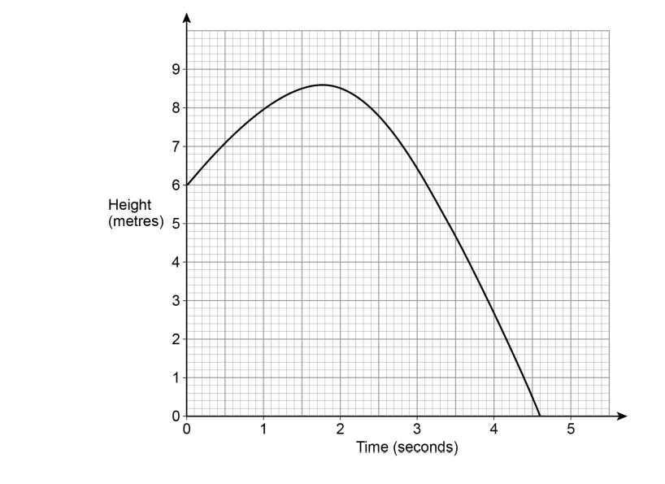

Estimate the speed of the ball, in m/s, after 1 second. 
You **must **show your working.

...............................m/s

## Q11 — medium — 4 marks · exam-questions

### 19() — 4 marks — command: estimate — structured — from paper Nov 2019 · J560/04
The graph shows the distance travelled by a particle over 8 seconds.

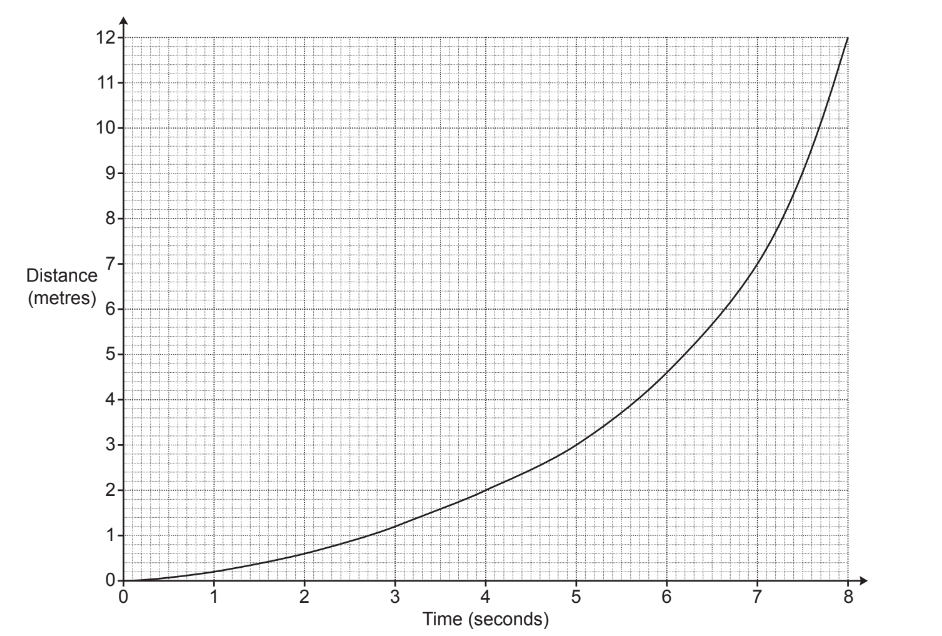

Estimate the speed of the particle at 5 seconds.

................................................... m/s

## Q12 — medium — 3 marks · exam-questions

### 15((c)) — 3 marks — command: use — structured — from paper June 2017 · J560/04
The graph shows the speed, v metres per second (m/s), of a car at time t seconds.

Use the graph to estimate the acceleration at* t *= 7.

...................................................m/s2

## Q13 — hard — 3 marks · exam-questions

### 1() — 2 marks — command: find — structured — from paper Pre2017
The curve $y=x^{3}+2x^{2}---4x$ is shown on the grid.

By drawing a suitable tangent, find an estimate of the gradient of the curve when *x* = 1.

### 2() — 1 mark — command: write — structured — from paper Pre2017
A point $D$ lies on the curve. 
The *x  *co-ordinate of $D$ is negative.
 The gradient of the tangent at $D$ is 0.

Write down the co-ordinates of $D$.

## Q14 — hard — 4 marks · exam-questions

### 1() — 3 marks — command: work_out — structured — from paper Pre2017
Ellie runs a race. The graph shows Ellie's speed in the first 10 seconds after the start of the race.

By drawing a suitable tangent, work out the acceleration when $t$ = 9. Give the units of your answer.

### 2() — 1 mark — command: describe — structured — from paper Pre2017
Describe what happens to Ellie after 7 seconds.

## Q15 — hard — 5 marks · exam-questions

### 1() — 2 marks — command: solve — structured — from paper Pre2017
The diagram shows the graph of $y=\frac{x}{2}+\frac{2}{x}$for $0<x\leq8.$

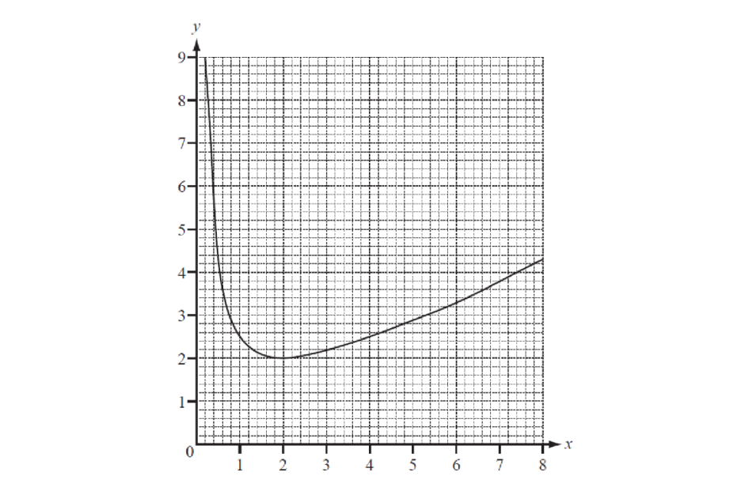

Use the graph to solve the equation $\frac{x}{2}+\frac{2}{x}=3\,$.

### 2() — 3 marks — command: find — structured — from paper Pre2017
By drawing a suitable tangent, find an estimate of the gradient of the graph when *x* = 1.

## Q16 — hard — 6 marks · exam-questions

### 15((a)) — 3 marks — command: calculate — structured — from paper 2015	Spec2 · 1MA1/2H
Karol runs in a race.

The graph shows her speed, in metres per second, $t$ seconds after the start of the race.

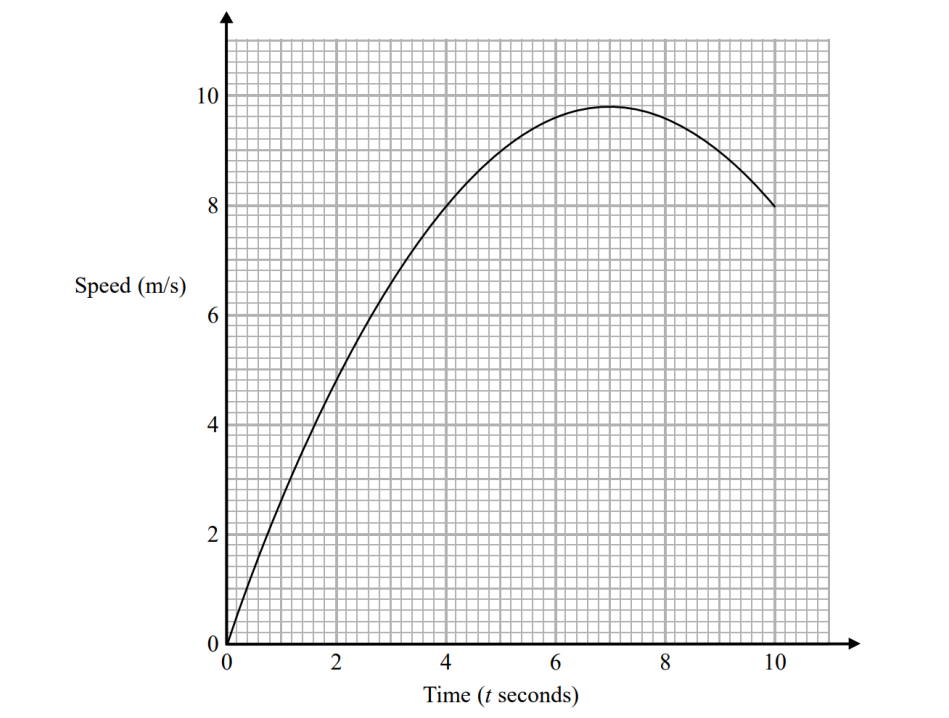

Calculate an estimate for the gradient of the graph when $t=4$ You must show how you get your answer.

### 15((b)) — 2 marks — command: describe — structured — from paper 2015	Spec2 · 1MA1/2H
Describe fully what your answer to part (a) represents.

### 15((c)) — 1 mark — command: explain — structured — from paper 2015	Spec2 · 1MA1/2H
Explain why your answer to part (a) is only an estimate.

## Q17 — hard — 3 marks · exam-questions

### 1() — 2 marks — command: find — structured — from paper Pre2017
A fish bowl is being filled with water. 
The graph shows how the diameter of the surface of the water changes with time.

Find an estimate for the gradient at $t$ = 10.

### 2() — 1 mark — command: give — structured — from paper Pre2017
Give an interpretation of the gradient.

## Q18 — hard — 5 marks · exam-questions

### 18() — 3 marks — command: use — structured — from paper Jan 2020 · 4MA1/1HR
The diagram shows the graph of $y=f(x)$ for `negative 4 space less-than or slanted equal to space x space less-than or slanted equal to space 12`

The point $P$on the curve has $x$ coordinate 2

Use the graph to find an estimate for the gradient of the curve at $P$.

### 18() — 2 marks — command: find — structured — from paper Jan 2020 · 4MA1/1HR
Hence find an equation of the tangent to the curve at $P$. Give your answer in the form $y=mx+c$ .

## Q19 — hard — 3 marks · exam-questions

### 18((d)) — 3 marks — command: find — structured — from paper June 2019 · 4MA1/2HR
Part of the curve with equation $y=h(x)$ is shown on the grid.

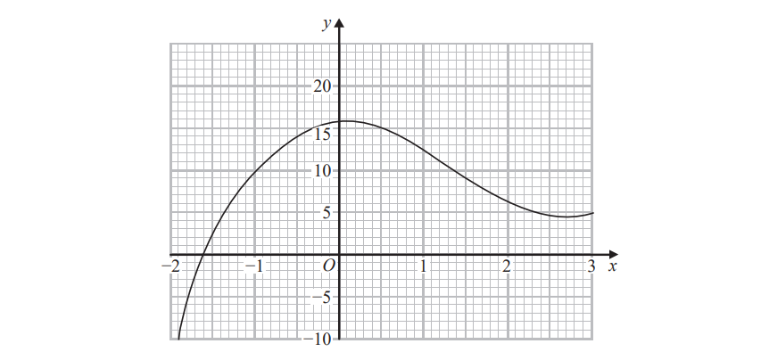

Find an estimate for the gradient of the curve at the point where $x=-0.5$ 
Show your working clearly.

## Q20 — hard — 3 marks · exam-questions

### 25() — 3 marks — command: work_out — structured — from paper Nov 2017 · 8300/3H
Liquid is leaking out of a container.

The graph shows the depth of the liquid for 60 seconds.

Use the graph to work out an estimate of the rate of decrease of depth at 10 seconds.

You **must** show your working.

...........................................cm/s

## Q21 — very_hard — 5 marks · exam-questions

### 1() — 3 marks — command: work_out — structured — from paper Pre2017
The velocity-time graph shows the first 40 seconds of a car in a race.

Work out the average acceleration for the first 40 seconds. 
Give the units of your answer.

### 2() — 2 marks — command: draw — structured — from paper Pre2017
Estimate the time during the 40 seconds when the instantaneous acceleration = the average acceleration.

You must show your working on the graph.

## Q22 — very_hard — 6 marks · exam-questions

### 1() — 2 marks — command: work_out — structured — from paper Pre2017
The graph gives information about the variation in the temperature of an amount of water that is left to cool from 80° C.

Work out an estimate for the rate of decrease of temperature at $t$= 300.

### 2() — 2 marks — command: work_out — structured — from paper Pre2017
Work out the average rate of decrease of the temperature of the water between $t$ = 0 and $t$ = 800.

### 3() — 2 marks — command: find — structured — from paper Pre2017
The instantaneous rate of decrease of the temperature of the water at time $T$ seconds is equal to the average rate of decrease of the temperature of the water between $t$ = 0 and $t$ = 800.

Find an estimate for the value of $T$. 
You must show how you got your answer.

## Q23 — very_hard — 5 marks · exam-questions

### 20((a)) — 2 marks — command: use — structured — from paper 2017	June · 1MA1/2H
The diagram shows part of the graph of  $y=x^{2}---2x+3$

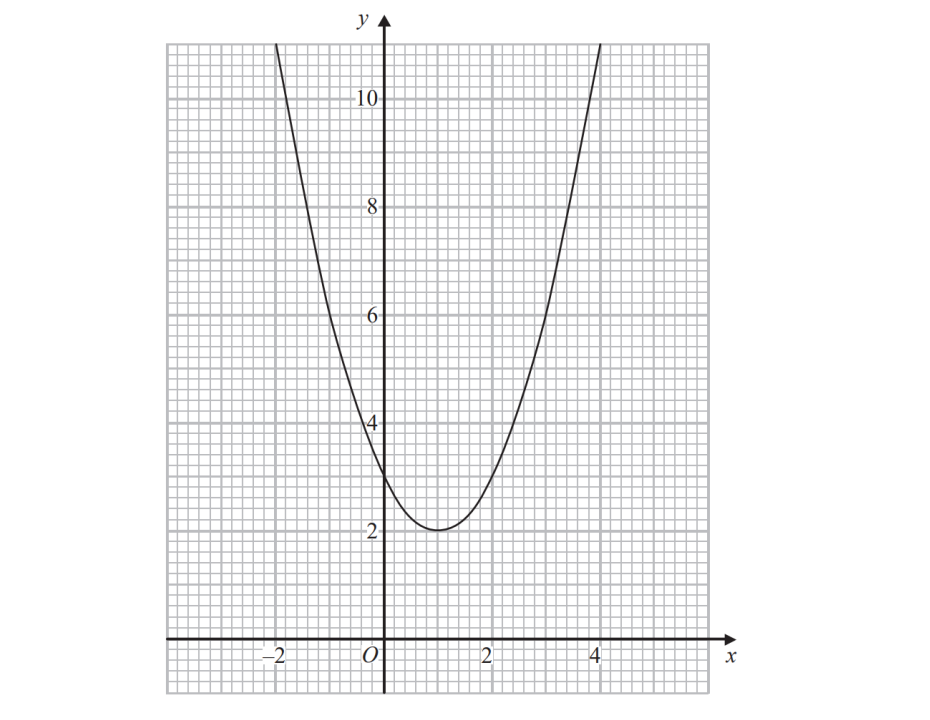

By drawing a suitable straight line, use your graph to find estimates for the solutions of $x^{2}---3x---1=0$

### 20((b)) — 3 marks — command: calculate — structured — from paper 2017	June · 1MA1/2H
$P$ is the point on the graph of $y=x^{2}---2x+3$where $x=2$

Calculate an estimate for the gradient of the graph at the point $P$.

## Q24 — very_hard — 7 marks · exam-questions

### 1() — 2 marks — command: plot — structured — from paper Pre2017
Clare emptied a tank and recorded the depth of water each minute.

| Time (*t minutes*) | 0 | 1 | 2 | 3 | 4 | 5 | 6 | 7 | 8 | 9 | 10 |
|---|---|---|---|---|---|---|---|---|---|---|---|
| Depth (*m metres*) | 30 | 29.5 | 29 | 28 | 27 | 26 | 24.5 | 22.5 | 19.5 | 15 | 9 |

Plot the graph of depth against time.

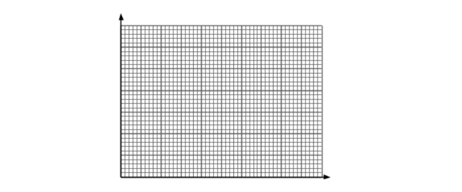

### 2() — 2 marks — command: work_out — structured — from paper Pre2017
Work out the average rate of decrease of the depth of the water in Clare's tank between $t$ = 0 and $t$ = 10.

### 3() — 2 marks — command: find — structured — from paper Pre2017
Find an estimate for the gradient at $t$ = 7.

### 4() — 1 mark — command: give — structured — from paper Pre2017
Give an interpretation of part (c).

## Q25 — very_hard — 7 marks · exam-questions

### 1() — 1 mark — command: use — structured — from paper Pre2017
Olympic medallist Usain runs in a race. 
The graph shows his speed, in metres per second (m/s), during the first 10 seconds of the race.

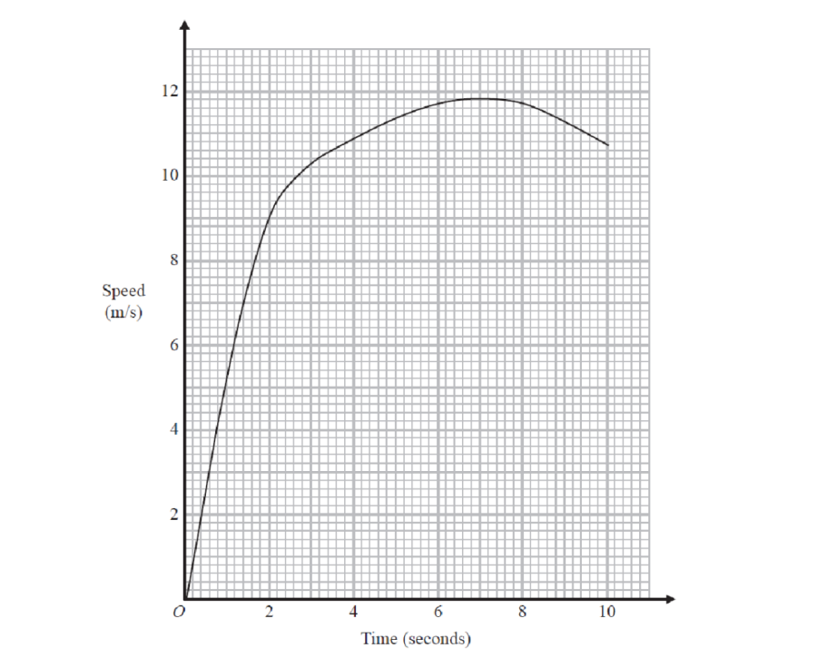

Use the graph to find how long it took Usain to reach his top speed.

### 2() — 3 marks — command: work_out — structured — from paper Pre2017
Work out an estimate for Usain's acceleration at 2 seconds. Give the units of your answer.

### 3() — 3 marks — command: calculate — structured — from paper Pre2017
Calculate the difference in Usain's acceleration between 2 and 6 seconds.

## Q26 — very_hard — 11 marks · exam-questions

### 5((a)) — 2 marks — command: complete — structured — from paper 2018	Oct/Nov · 0580/42
The table shows some values of  $y=x^{3}-3x-1$.

| $x$ | -3 | -2.5 | -2 | -1.5 | -1 | 0 | 1 | 1.5 | 2 | 2.5 | 3 |
|---|---|---|---|---|---|---|---|---|---|---|---|
| $y$ | -19 | -9.1 |   | 0.1 | 1 | -1 | -3 | -2.1 | 1 | 7.1 |   |

Complete the table of values.

### 5((b)) — 4 marks — command: draw — structured — from paper 2018	Oct/Nov · 0580/42
Draw the graph of  $y=x^{3}-3x-1$  for  $-3\leqx\leq3$.

### 5((c)) — 5 marks — command: draw — structured — from paper 2018	Oct/Nov · 0580/42
A straight line through (0, –17) is a tangent to the graph of  $y=x^{3}-3x-1$.

(i) On the grid, draw this tangent.

[1]

(ii) Find the co-ordinates of the point where the tangent meets your graph.

(................ , ................) [1]

(iii) Find the equation of the tangent. Give your answer in the form  $y=mx+c$.

$y$ = ................................................ [3]
