# Mark Schemes — Functions
**Sequences, Functions & Graphs** · Edexcel IGCSE Maths A (4MA1) — 18/Higher

## Q1 — medium — 3 marks · exam-questions

### 11((a)) — 1 marks
*Substitute** x** = -5 into f(**x**) (putting brackets around the negative number)*

`straight f open parentheses negative 5 close parentheses equals 2 over open parentheses negative 5 close parentheses squared`

> *Work out this value (either using a calculator or by using that (-5) × (-5) = 25)*

$\frac{2}{25}$ **[1]**

### 11((b)) — 2 marks
*fg(1) means f(g(1))*

*Find g(1) by substituting **x** = 1 into g(**x**)* * *

`table row cell straight g open parentheses 1 close parentheses end cell equals cell 4 cross times 1 cubed end cell row blank equals 4 end table`

**[1]**

*If g(1) = 4 then f(g(1)) = f(4)*

*Find f(4) by substituting **x **= 4 into f(**x**)* * *

> `straight f open parentheses straight g open parentheses 1 close parentheses close parentheses equals f open parentheses 4 close parentheses equals 2 over 4 squared`*  *

> *Write 4**2** as 16 (from 4 × 4) and cancel *$\frac{2}{16}$* (by dividing top-and-bottom by 2)*

$\frac{1}{8}$* ***[1]**

## Q2 — medium — 4 marks · exam-questions

### 1() — 2 marks
*Replace f(**x**) with **y* * *

$y=3x-2$ * *

*Without rearranging the equation, swap the **x**'s and **y**'s* * *

$x=3y-2$

**[1]**

*Now make **y** the subject of this new equation (by adding 2 to both sides then dividing both sides by 3)* * *

`table row cell x plus 2 end cell equals cell 3 y end cell row cell fraction numerator x plus 2 over denominator 3 end fraction end cell equals y end table` * *

*The function on the left-hand side is the inverse function, f**-1**(**x**)* *Replace **y** with f**-1**(**x**) to write down the final answer*

$f^{-1}(x)=\frac{x+2}{3}$**[1]**

### 2() — 2 marks
*gf(**x**) means g(f(**x**))*

*Write the expression for f(**x**) inside g(...)* * *

`straight g open parentheses straight f open parentheses x close parentheses close parentheses equals straight g open parentheses 3 x minus 2 close parentheses` * *

*Find g(3**x** - 2) by replacing the **x**'s in g(**x**) with the brackets (3**x** - 2)* * *

`g open parentheses 3 x minus 2 close parentheses equals fraction numerator 10 over denominator open parentheses 3 x minus 2 close parentheses plus 2 end fraction`

**[1]**

*Expand the brackets and collect like terms in the denominator* * *

`table attributes columnalign right center left columnspacing 0px end attributes row cell g open parentheses 3 x minus 2 close parentheses end cell equals cell fraction numerator 10 over denominator 3 x minus 2 plus 2 end fraction end cell row blank equals cell fraction numerator 10 over denominator 3 x end fraction end cell end table` * *

> *Write your final answer as gf(**x**) = ...*

$\mathrm{gf}(x)=\frac{10}{3x}$* ***[1]**

## Q3 — medium — 3 marks · exam-questions

### 1() — 1 marks
*Substitute** x** = *$\frac{1}{2}$* into f(**x**) *

`straight f open parentheses 1 half close parentheses equals fraction numerator 1 over denominator open parentheses begin display style 1 half end style close parentheses squared plus 1 end fraction`

> *Work out this value using a calculator *

$\frac{4}{5}$ **[1]**

### 2() — 2 marks
*fg(**x**) means f(g(**x**))*

*Write the expression for g(**x**) inside f(...)* * *

`straight f open parentheses straight g open parentheses x close parentheses close parentheses equals straight f open parentheses square root of x minus 1 end root close parentheses` * *

*Find *`straight f open parentheses square root of x minus 1 end root close parentheses`* by replacing the **x**'s in f(**x**) with the brackets *`open parentheses square root of x minus 1 end root close parentheses` * *

`straight f open parentheses square root of x minus 1 end root close parentheses equals fraction numerator 1 over denominator open parentheses square root of x minus 1 end root close parentheses squared plus 1 end fraction`

**[1]**

*Squaring a square-root cancels it out Collect like terms* * *

`table row cell straight f open parentheses square root of x minus 1 end root close parentheses end cell equals cell fraction numerator 1 over denominator open parentheses square root of x minus 1 end root close parentheses squared plus 1 end fraction end cell row blank equals cell fraction numerator 1 over denominator x minus 1 plus 1 end fraction end cell row blank equals cell 1 over x end cell end table` * *

> *Write your final answer as fg(**x**) = ...*

$\mathrm{fg}(x)=\frac{1}{x}$* ***[1]**

## Q4 — medium — 9 marks · exam-questions

### 1() — 1 marks
*Substitute** x** = 3 into f(**x**) *

`straight f open parentheses 3 close parentheses equals 2 cross times 3 plus 5`

> *Work out this value (by adding 6 and 5)*

**11** **[1]**

### 2() — 2 marks
*Replace f(**x**) with **y* * *

$y=2x+5$ * *

*Without rearranging the equation, swap the **x**'s and **y**'s* * *

$x=2y+5$

**[1]**

*Now make **y** the subject of this new equation (by subtracting 5 from both sides then dividing both sides by 2)* * *

`table row cell x minus 5 end cell equals cell 2 y end cell row cell fraction numerator x minus 5 over denominator 2 end fraction end cell equals y end table` * *

*The function on the left-hand side is the inverse function, f**-1**(**x**)* *Replace **y** with f**-1**(**x**) to write down the final answer*

$f^{-1}(x)=\frac{x-5}{2}$**[1]**

### 3() — 1 marks
*Substitute** x** = -3 into g(**x**) (putting brackets around the negative number)*

`straight g open parentheses negative 3 close parentheses equals open parentheses negative 3 close parentheses squared minus 25`

> *Use that (-3) × (-3) = 9  *

`straight g open parentheses negative 3 close parentheses equals 9 minus 25`

**-16** **[1]**

### 4() — 5 marks
i) *gf(**x**) means g(f(**x**))* *Write the expression for f(**x**) inside g(...)* * *

`straight g open parentheses straight f open parentheses x close parentheses close parentheses equals straight g open parentheses 2 x plus 5 close parentheses` * *

*Find g(2**x** + 5) by replacing the **x**'s in g(**x**) with the brackets (2**x** + 5)* * *

`straight g open parentheses 2 x plus 5 close parentheses equals open parentheses 2 x plus 5 close parentheses squared minus 25`

**[1]**

*Expand the brackets and collect like terms *

`table row cell open parentheses 2 x plus 5 close parentheses squared end cell equals cell open parentheses 2 x plus 5 close parentheses open parentheses 2 x plus 5 close parentheses end cell row blank equals cell 4 x squared plus 10 x plus 10 x plus 25 end cell row blank equals cell 4 x squared plus 20 x plus 25 end cell end table`

**[1]*** *

> *Substitute this result back in g(2x + 5) and cancel the 25s  *

> `table attributes columnalign right center left columnspacing 0px end attributes row cell straight g open parentheses 2 x plus 5 close parentheses end cell equals cell 4 x squared plus 20 x plus 25 minus 25 end cell row blank equals cell 4 x squared plus 20 x end cell end table`*  *

> *Write your final answer as gf(**x**) = ...*

$\mathrm{gf}(x)=4x^{2}+20x$* ***[1]**

ii) *Set the expression for gf(x) equal to zero* * *

$4x^{2}+20x=0$ * *

*Do not divide by **x **(this loses a solution)* *Factorise out 4**x**  *

`4 x open parentheses x plus 5 close parentheses equals 0`

**[1]**

*Solve 4**x** = 0 (by dividing by 4, or by seeing **x **= 0 is the solution)* * *

`table row cell 4 x end cell equals 0 row x equals 0 end table` * *

*Solve **x** + 5 = 0 (by subtracting 5 from both sides)* * *

`table row cell x plus 5 end cell equals 0 row x equals cell negative 5 end cell end table` * *

> *Present both solutions together*

**x**** = 0 or ****x**** = -5 ****[1]**

## Q5 — medium — 8 marks · exam-questions

### 1() — 1 marks
*Substitute** x** = 6 into f(**x**) *

`straight f open parentheses 6 close parentheses equals 1 half cross times 6 plus 4`

> *Work out this value (by adding 3 and 4)*

**7** **[1]**

### 2() — 2 marks
*fg(-3) means f(g(-3))*

*Find g(-3) by substituting **x** = -3 into g(**x**) (putting it in brackets as it's negative)* * *

`table row cell straight g open parentheses negative 3 close parentheses end cell equals cell fraction numerator 2 cross times open parentheses negative 3 close parentheses over denominator open parentheses negative 3 close parentheses plus 1 end fraction end cell row blank blank blank end table`

> *Work out this value (either on a calculator, or by doing -6 divided by -2)  *

`straight g open parentheses negative 3 close parentheses equals fraction numerator negative 6 over denominator negative 2 end fraction equals 3`

**[1]**

*If g(-3) = 3 then f(g(-3)) = f(3)*

*Find f(3) by substituting **x **= 3 into f(**x**)* * *

`table row cell straight f open parentheses straight g open parentheses negative 3 close parentheses close parentheses end cell equals cell f open parentheses 3 close parentheses equals 1 half cross times 3 plus 4 end cell row blank equals cell 3 over 2 plus 4 end cell end table`

$\frac{11}{2}$* ***[1]**

**or 5.5 as a decimal**

### 3() — 2 marks
*Write down an expression for g(**a**) by substituting **x** = **a** into the expression for g(**x**)* * *

`straight g open parentheses a close parentheses equals fraction numerator 2 a over denominator a plus 1 end fraction`

> * *

*Form an equation for **a** (by setting this expression equal to -2)* * *

$\frac{2a}{a+1}=-2$

**[1]**

*Multiply both sides by** a** + 1* * *

`2 a equals negative 2 open parentheses a plus 1 close parentheses` * *

*Expand the brackets and add 2**a** to both sides* * *

$2a=-2a-2\,4a=-2$ * *

*Find **a** (by dividing both sides by 4)* * *

$a=-\frac{2}{4}$

$a=-\frac{1}{2}$* ***[1]**

### 4() — 3 marks
*Replace f(**x**) with **y* * *

$y=\frac{1}{2}x+4$ * *

*Without rearranging the equation, swap the **x**'s and **y**'s* * *

$x=\frac{1}{2}y+4$

**[1]**

*Now make **y** the subject of this new equation (by subtracting 4 from both sides then multiplying both sides by 2)* * *

`table row cell x minus 4 end cell equals cell 1 half y end cell row cell 2 open parentheses x minus 4 close parentheses end cell equals y end table`

**attempt to rearrange for y**** [1]*** *

*The function on the left-hand side is the inverse function, f**-1**(**x**)* *Replace **y** with f**-1**(**x**) to write down the final answer*

$f^{-1}(x)=2(x-4)$ **[1]**

## Q6 — medium — 9 marks · exam-questions

### 1() — 1 marks
*Substitute** x** = 4 into f(**x**) *

`straight f open parentheses 4 close parentheses equals 2 cross times 4 minus 5`

**3** **[1]**

### 2() — 2 marks
*fg(-4) means f(g(-4))*

*Find g(-4) by substituting **x** = -4 into g(**x**) (putting it in brackets as it's negative)* * *

`table row cell straight g open parentheses negative 4 close parentheses end cell equals cell open parentheses negative 4 close parentheses squared minus 10 end cell row blank equals cell 16 minus 10 end cell row blank equals 6 end table`

**[1]**

*If g(-4) = 6 then f(g(-4)) = f(6)*

*Find f(6) by substituting **x **= 6 into f(**x**)* * *

`straight f open parentheses straight g open parentheses negative 4 close parentheses close parentheses equals f open parentheses 6 close parentheses equals 2 cross times 6 minus 5`

**7*** ***[1]**

### 3() — 2 marks
*Replace f(**x**) with **y* * *

$y=2x+5$ * *

*Without rearranging the equation, swap the **x**'s and **y**'s* * *

$x=2y-5$

**[1]**

*Now make **y** the subject of this new equation (by adding 5 to both sides then dividing both sides by 2)* * *

`table row cell x plus 5 end cell equals cell 2 y end cell row cell fraction numerator x plus 5 over denominator 2 end fraction end cell equals y end table` * *

*The function on the left-hand side is the inverse function, f**-1**(**x**)* *Replace **y** with f**-1**(**x**) to write down the final answer*

$f^{-1}(x)=\frac{x+5}{2}$**[1]**

### 4() — 4 marks
*gf(**x**) means g(f(**x**))*

*Write the expression for f(**x**) inside g(...)* * *

`straight g open parentheses straight f open parentheses x close parentheses close parentheses equals straight g open parentheses 2 x minus 5 close parentheses` * *

*Find g(2**x** - 5) by replacing the **x**'s in g(**x**) with the brackets (2**x** - 5)* * *

`g open parentheses 2 x minus 5 close parentheses equals open parentheses 2 x minus 5 close parentheses squared minus 10`

**[1]**

> *Form an equation for **x** by setting this expression equal to -1  *

> * *`open parentheses 2 x minus 5 close parentheses squared minus 10 equals negative 1`*  *

**[1]**

> *Method 1** *

> *Make **x** the subject *

> *Start by adding 10 to both sides  *

> `open parentheses 2 x minus 5 close parentheses squared equals 9`*  *

> *Take square roots of both sides and include a ± sign  *

$2x-5=\pm\sqrt{9}\,2x-5=\pm3$

**[1]**

> *Solve 2**x** - 5 = 3 and 2**x** - 5 = -3 separately (by adding 5 to both sides and dividing both sides by 2)  *

$2x-5=3\,2x=8\,x=4$* **and**   *$2x-5=-3\,2x=2\,x=1$

**x**** = 1 or ****x**** = 4*** ***[1]**

> *Method 2** *

> *Form a quadratic equation in **x** *

> *Start by expanding (2**x** - 5)2  *

> `table row cell open parentheses 2 x minus 5 close parentheses squared end cell equals cell open parentheses 2 x minus 5 close parentheses open parentheses 2 x minus 5 close parentheses end cell row blank equals cell 4 x squared minus 10 x minus 10 x plus 25 end cell row blank equals cell 4 x squared minus 20 x plus 25 end cell end table`*  *

> *Write the result back in the equation  *

`table row cell 4 x squared minus 20 x plus 25 minus 10 end cell equals cell negative 1 end cell row cell 4 x squared minus 20 x plus 15 end cell equals cell negative 1 end cell end table`

**[1]**

> *Make the right-hand side zero (by adding 1 to both sides)  *

> $4x^{2}-20x+16=0$*  *

> *Divide both sides by 4  *

> $x^{2}-5x+4=0$*  *

> *Factorise the quadratic expression (for example, by finding two numbers that multiply to give 4 and add to give -5)  *

> `open parentheses x minus 4 close parentheses open parentheses x minus 1 close parentheses equals 0`*  *

> *Solve the first bracket equal to zero (by adding 4 to both sides)  *

> `table attributes columnalign right center left columnspacing 0px end attributes row cell x minus 4 end cell equals 0 row x equals 4 end table`*  *

> *Solve the second bracket equal to zero (by adding 1 to both sides)  *

`table row cell x minus 1 end cell equals 0 row x equals 1 end table`

**x**** = 1 or ****x**** = 4*** ***[1]**

## Q7 — medium — 5 marks · exam-questions

### 9((a)) — 1 marks
*Substitute** x** = 10 into f(**x**) *

`straight f open parentheses 3 close parentheses equals 2 cross times 3 plus 5`

**18** **[1]**

### 9((b)) — 2 marks
*Replace g(**x**) with **y* * *

$y=\frac{x}{5}+1$ * *

*Without rearranging the equation, swap the **x**'s and **y**'s* * *

$x=\frac{y}{5}+1$

**[1]**

*Now make **y** the subject of this new equation (by subtracting 1 from both sides then multiplying both sides by 5)* * *

> `table row cell x minus 1 end cell equals cell y over 5 end cell row cell 5 open parentheses x minus 1 close parentheses end cell equals y end table`*  *

*The function on the left-hand side is the inverse function, g**-1**(**x**)* *Replace **y** with g**-1**(**x**) to write down the final answer*

$g^{-1}(x)=5(x-1)$ **[1]**

### 9((c)) — 2 marks
*ff(**x**) means f(f(**x**))*

*Write the expression for f(**x**) inside f(...)* * *

`straight f open parentheses straight f open parentheses x close parentheses close parentheses equals straight f open parentheses 3 open parentheses x minus 4 close parentheses close parentheses` * *

> *At this point it helps to write 3(**x** - 4) as 3**x** - 12 (by expanding the brackets)  *

> `straight f open parentheses straight f open parentheses x close parentheses close parentheses equals straight f open parentheses 3 x minus 12 close parentheses`*  *

*Find f(3**x** - 12) by replacing the **x**'s in f(**x**) with the brackets (3**x** - 12)* * *

`straight f open parentheses 3 x minus 12 close parentheses equals 3 open parentheses open parentheses 3 x minus 12 close parentheses minus 4 close parentheses`

**[1]**

> *Expand the inner brackets and collect like terms  *

`table attributes columnalign right center left columnspacing 0px end attributes row cell straight f open parentheses 3 x minus 12 close parentheses end cell equals cell 3 open parentheses 3 x minus 12 minus 4 close parentheses end cell row blank equals cell 3 open parentheses 3 x minus 16 close parentheses end cell end table` * *

> *Expand these last brackets (by multiplying all terms inside by 3)*

$\mathrm{ff}(x)=9x-48$* ***[1]**

## Q8 — medium — 7 marks · exam-questions

### 1() — 1 marks
*Substitute** x** = 1 into f(**x**)*

`straight f open parentheses 1 close parentheses equals fraction numerator 3 over denominator 4 plus 1 end fraction`

> *Work out this value *

$\frac{3}{5}$ **[1]**

### 2() — 1 marks
*Inputting a value must never result in dividing by zero* *Find the input that causes the function to divide by 0 (by solving the denominator equal to 0)* * *

`table attributes columnalign right center left columnspacing 0px end attributes row cell 4 plus x end cell equals 0 row x equals cell negative 4 end cell end table`

> * *

> *The input **x** = -4 must be excluded from any domain*

**x**** = -4** **[1]**

### 3() — 1 marks
*If g(**a**) = 7, the input is **a** and the output is 7* *Find g(**a**) by substituting **x** = **a** into g(**x**)* * *

`straight g open parentheses a close parentheses equals 5 plus a` * *

*Set 5 + **a** equal to 7 and solve for **a*

`table row cell 5 plus a end cell equals 7 row a equals cell 7 minus 5 end cell end table`

**a**** = 2** **[1]**

### 4() — 2 marks
*fg(1) means f(g(1))* *Find g(1) by substituting **x** = 1 into g(**x**)* * *

`table row cell g open parentheses 1 close parentheses end cell equals cell 5 plus 1 end cell row blank equals 6 end table`

**[1]**

*If g(1) = 6 then f(g(1)) means f(6)* *Find f(6) by substituting **x **= 6 into f(**x**)* * *

`table attributes columnalign right center left columnspacing 0px end attributes row cell straight f open parentheses straight g open parentheses 1 close parentheses close parentheses end cell equals cell f open parentheses 6 close parentheses equals fraction numerator 3 over denominator 4 plus 6 end fraction end cell end table`

$\frac{3}{10}$* ***[1]**

**or 0.3 as a decimal**

### 5() — 2 marks
*fg(**x**) means f(g(**x**))* *Write the algebraic expression for g(**x**) inside f(...)* * *

`straight f open parentheses straight g open parentheses x close parentheses close parentheses equals straight f open parentheses 5 plus x close parentheses` * *

*Find *`straight f open parentheses 5 plus x close parentheses`* by replacing the **x**'s in f(**x**) with the brackets *`open parentheses 5 plus x close parentheses` * *

`straight f open parentheses x plus 5 close parentheses equals fraction numerator 3 over denominator 4 plus open parentheses 5 plus x close parentheses end fraction`

**[1]**

*Simplify the denominator* * *

`table row cell straight f open parentheses x plus 5 close parentheses end cell equals cell fraction numerator 3 over denominator 4 plus 5 plus x end fraction end cell row blank equals cell fraction numerator 3 over denominator 9 plus x end fraction end cell end table` * *

> *Write your final answer as fg(**x**) = ...*

$\mathrm{fg}(x)=\frac{3}{9+x}$* ***[1]**

## Q9 — medium — 4 marks · exam-questions

### 17((c)) — 1 marks
> *The domain is all the values which can be input into a function. Inputting a value must never result in dividing by zero *

> *The input **x** = 0 must be excluded from the domain so that the denominator of the fraction is not zero.*

**x**** = 0** **[1]**

### 17((d)) — 3 marks
> *Replace h(**x**) with **y **and then swap the **x's** and **y's.*

> $y=\frac{2x-4}{x}$* *

$x=\frac{2y-4}{y}$

> *Rearrange the equation to make **y** the subject, begin by multiplying both sides by **y.*

$xy=2y-4$

**[1]**

> *Collect the **y** terms onto one side of the equation and the other terms to the other side.*

`table row cell x y space minus space 2 y space end cell equals cell negative 4 end cell end table`

> *To make **y** the subject, it will need to be factorised.*

> `table row cell y open parentheses x space minus space 2 close parentheses space end cell equals cell negative 4 end cell end table`* *

**[1]**

> *Divide by (**x** - 2) to make **y** the subject.*

> `table row cell y space end cell equals cell space fraction numerator negative 4 over denominator x space minus space 2 end fraction end cell end table`* *

*The function on the left-hand side is the inverse function, h**-1**(**x**)* *Replace **y** with h**-1**(**x**) to write down the final answer.*

$h^{-1}(x)=\frac{4}{2-x}$ **[1] **

**The equivalent fraction **$\frac{-4}{x-2}$**is also accepted.**

## Q10 — medium — 4 marks · exam-questions

### 17((a)) — 1 marks
*Substitute **x** = 1 into f(**x**)*

`table attributes columnalign right center left columnspacing 0px end attributes row cell straight f open parentheses 1 close parentheses end cell equals cell open parentheses 1 minus 4 close parentheses squared end cell row blank equals cell open parentheses negative 3 close parentheses squared end cell row blank equals 9 end table`

**9** **[1]**

### 17((b)) — 1 marks
*The range is the set of all possible outputs* 
`open parentheses x minus 4 close parentheses squared`* will always be the square of a value, so no negative outputs can arise (**x** = 4 gives an output of 0)*

**f(x) ≥ 0** **[1]**

**y ≥ 0 or f ≥ 0 are also accepted (but not x ≥ 0 as x is for domains)**

### 17((c)) — 2 marks
*fg(2) means f(g(2))*

*Find g(2) by substituting **x** = 2 into g(**x**) * * *

`table attributes columnalign right center left columnspacing 0px end attributes row cell straight g open parentheses 2 close parentheses end cell equals cell fraction numerator 4 over denominator 2 plus 3 end fraction end cell row blank equals cell 4 over 5 end cell end table`

**[1]**

*If g(2) = *$\frac{4}{5}$* then *`straight f open parentheses straight g open parentheses 2 close parentheses close parentheses equals straight f open parentheses 4 over 5 close parentheses`

*Find *`straight f open parentheses 4 over 5 close parentheses`* by substituting *$x=\frac{4}{5}$* into f(**x**)* * *

`table row cell straight f open parentheses 4 over 5 close parentheses end cell equals cell open parentheses 4 over 5 minus 4 close parentheses squared end cell row blank equals cell open parentheses negative 16 over 5 close parentheses squared end cell row blank equals cell 256 over 25 end cell end table`

> $\frac{256}{25}$* [1]*

**or 10.24 as a decimal**

## Q11 — medium — 1 marks · exam-questions

### 19() — 1 marks
*Either do the "inverse" method (**y** = 3**x **etc), or realise that the inverse of "multiplying by 3" is "dividing by 3"*

$x\div3$

**the**** fourth**** option is therefore correct,** $\frac{x}{3}$ **[1]**

> *The first option assumes you made the **mistake** that f**-1**(**x**) means -f(**x**) *

> *The second option assumes you made the **mistake** that "dividing by 3" means *$\frac{3}{x}$

> *The third option assumes you made the **mistake** that  f**-1**(**x**) means *`fraction numerator 1 over denominator straight f open parentheses x close parentheses end fraction`* (from negative indices)*

## Q12 — medium — 5 marks · exam-questions

### 8((a)) — 2 marks
> *Reverse the order and operations to find the inverse function, letting **x **be the input. Notice the change in direction of the arrows.*

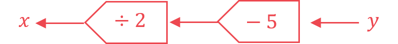

**[1]**

> *So the inverse operations are 'subtract 5' and then 'divide by 2'.*

> *Carry out both operations on 11.*

$\frac{11-5}{2}=\frac{6}{2}=3$

> *Carry out both operations on 3.*

$\frac{3-5}{2}=\frac{-2}{2}=-1$

**The first input was **$-1$** ****[1]**

### 8((a)) — 3 marks
> *Let **x **be both the **input **and the **output **of the function.  *

> *Write as an algebraic equation using **x **as the input and output.*

$x=2x+5$

** Correct expression ****[1] **** **
**Setting expression equal to x ****[1]**

> *Subtract **x **from both sides.*

$0=x+5$

> *Solve by subtracting 5** **from both sides.*

$-5=x$

** **$-5$** ****[1]**

## Q13 — medium — 1 marks · exam-questions

### 24((b)) — 1 marks
*hg(x) means h(g(**x**))*

*To find this composite function, replace all **x**'s in h(**x**) with 2**x*

`hg open parentheses x close parentheses equals fraction numerator 2 x minus 1 over denominator 2 end fraction`

**The ****second**** option is therefore correct, **$\frac{2x-1}{2}$ **[1]**

> *The third option assumes you made the** mistake** that h(2**x**) means 2**x** × h(**x**)*

> *The fourth option assumes you made the** mistake** that h(2**x**) means 2 × h(**x**)*

## Q14 — hard — 3 marks · exam-questions

### 18() — 3 marks
*Replace every **x** in f(**x**) with (**x** + 2) in brackets* * *

`straight f open parentheses x plus 2 close parentheses equals 3 open parentheses x plus 2 close parentheses squared minus 2 open parentheses x plus 2 close parentheses minus 8`

**[1]**

*Expand the brackets (**x** + 2)**2** and collect like terms* * *

`table row cell open parentheses x plus 2 close parentheses squared end cell equals cell open parentheses x plus 2 close parentheses open parentheses x plus 2 close parentheses end cell row blank equals cell x squared plus 2 x plus 2 x plus 4 end cell row blank equals cell x squared plus 4 x plus 4 end cell end table` * *

*Replace (**x** + 2)**2** in the original expression with the result above in brackets* * *

`straight f open parentheses x plus 2 close parentheses equals 3 open parentheses x squared plus 4 x plus 4 close parentheses minus 2 open parentheses x plus 2 close parentheses minus 8`

**[1]**

*Expand the brackets (by multiplying all terms in the first bracket by 3 and all terms in the second bracket by -2)* * *

`straight f open parentheses x plus 2 close parentheses equals 3 x squared plus 12 x plus 12 minus 2 x minus 4 minus 8`

*Collect like terms* * *

`straight f open parentheses x plus 2 close parentheses equals 3 x squared plus 10 x` * *

> *This is now in the form **ax**2** + **bx** where **a** = 3 and **b** = 10*

$f(x+2)=3x^{2}+10x$* ***[1]**

## Q15 — hard — 6 marks · exam-questions

### 1() — 3 marks
*fg(**x**) means f(g(**x**))*

*Write the expression for g(**x**) inside f(...)* * *

`straight f open parentheses straight g open parentheses x close parentheses close parentheses equals straight f open parentheses fraction numerator 1 over denominator x minus 2 end fraction close parentheses` * *

*Find *`straight f open parentheses fraction numerator 1 over denominator x minus 2 end fraction close parentheses`* by replacing the **x**'s in f(**x**) with the brackets *`open parentheses fraction numerator 1 over denominator x minus 2 end fraction close parentheses` * *

`table attributes columnalign right center left columnspacing 0px end attributes row cell straight f open parentheses fraction numerator 1 over denominator x minus 2 end fraction close parentheses end cell equals cell open parentheses fraction numerator 1 over denominator x minus 2 end fraction close parentheses plus 3 end cell row blank equals cell fraction numerator 1 over denominator x minus 2 end fraction plus 3 end cell end table`

**[1]**

> *It may help to think of 3 as the fraction *$\frac{3}{1}$* *

*Find the lowest common denominator by multiplying 1 by (**x** - 2)*

*lowest common denominator is *`open parentheses x minus 2 close parentheses`

*Multiply top-and-bottom of each fraction by the brackets needed to form this denominator*

`fraction numerator 1 over denominator x minus 2 end fraction plus fraction numerator 3 open parentheses x minus 2 close parentheses over denominator x minus 2 end fraction`

> *Write as one single fraction over the common denominator *

*Add the numerators* * *

`fraction numerator 1 plus 3 open parentheses x minus 2 close parentheses over denominator x minus 2 end fraction`

**[1]**

*Expand the brackets in the numerator* * *

$\frac{1+3x-6}{x-2}$ * *

> *Collect "like" terms in the numerator*

$\frac{3x-5}{x-2}$ **[1]**

### 2() — 3 marks
*Replace g(**x**) with **y* * *

$y=\frac{1}{x-2}$ * *

*Without rearranging the equation, swap the **x**'s and **y**'s* * *

$x=\frac{1}{y-2}$

**[1]**

> *We must make **y** the subject of this new equation *

*Remove fractions (by multiplying both sides by **y** - 2)* * *

`table row cell x open parentheses y minus 2 close parentheses end cell equals 1 end table`

> *Get (**y** - 2) on its own (by dividing both sides by** x**)  *

$y-2=\frac{1}{x}$

**[1]**

> *Get **y** on its own (by adding 2 to both sides)  *

> $y=\frac{1}{x}+2$*  *

*The function on the right-hand side is the inverse function, g**-1**(**x**)* *Replace **y** with g**-1**(**x**) to write down the final answer*

$g^{-1}(x)=\frac{1}{x}+2$* ***[1]**

$\frac{1+2x}{x}$** is also accepted**

## Q16 — hard — 4 marks · exam-questions

### 10((a)) — 2 marks
*Replace f(**x**) with **y* * *

$y=4x-1$ * *

*Without rearranging the equation, swap the **x**'s and **y**'s* * *

$x=4y-1$

**[1]**

*Now make **y** the subject of this new equation (by adding 1 to both sides then dividing both sides by 4)* * *

`table row cell x plus 1 end cell equals cell 4 y end cell row cell fraction numerator x plus 1 over denominator 4 end fraction end cell equals y end table` * *

*The function on the left-hand side is the inverse function, f**-1**(**x**)* *Replace **y** with f**-1**(**x**) to write down the final answer*

$f^{-1}(x)=\frac{x+1}{4}$**[1]**

### 10((b)) — 2 marks
*fg(2) means f(g(2))*

*Find g(2) by substituting **x** = 2 into g(**x**)* * *

`table row cell straight g open parentheses 2 close parentheses end cell equals cell k cross times 2 squared end cell row blank equals cell 4 k end cell end table`

*If g(2) = 4**k** then f(g(2)) = f(4**k**)*

*Find f(4**k**) by replacing **x** in f(**x**) by (4**k**) in brackets* * *

`straight f open parentheses straight g open parentheses 2 close parentheses close parentheses equals f open parentheses 4 k close parentheses equals 4 open parentheses 4 k close parentheses minus 1`

**[1]**

> *Form an equation for** k** (by setting the expression above equal to 12)  *

> `4 open parentheses 4 k close parentheses minus 1 equals 12`*  *

*Simplify the equation (by multiplying 4 x 4  x **k**)* * *

$16k-1=12$ * *

*Solve the equation (by adding 1 to both sides then dividing both sides by 16)*

`table attributes columnalign right center left columnspacing 0px end attributes row cell 16 k end cell equals 13 row k equals cell 13 over 16 end cell end table`

$\frac{13}{16}$* ***[1]**

## Q17 — hard — 7 marks · exam-questions

### 21((a)) — 2 marks
*Replace f(**x**) with **y* * *

$y=4x-1$ * *

*Without rearranging the equation, swap the **x**'s and **y**'s* * *

$x=3y-1$

**[1]**

*Now make **y** the subject of this new equation (by adding 1 to both sides then dividing both sides by 3)* * *

`table row cell x plus 1 end cell equals cell 3 y end cell row cell fraction numerator x plus 1 over denominator 3 end fraction end cell equals y end table` * *

*The function on the left-hand side is the inverse function, f**-1**(**x**)* *Replace **y** with f**-1**(**x**) to write down the final answer*

$f^{-1}(x)=\frac{x+1}{3}$**[1]**

### 21((b)) — 5 marks
*fg(**x**) means f(g(**x**))*

*Write the expression for g(**x**) inside f(...)* * *

`straight f open parentheses straight g open parentheses x close parentheses close parentheses equals straight f open parentheses x squared plus 4 close parentheses` * *

*Find *`straight f open parentheses x squared plus 4 close parentheses`* by replacing the **x**'s in f(**x**) with the brackets *`open parentheses x squared plus 4 close parentheses` * *

`table attributes columnalign right center left columnspacing 0px end attributes row cell straight f open parentheses straight g open parentheses x close parentheses close parentheses end cell equals cell 3 open parentheses x squared plus 4 close parentheses minus 1 end cell end table`

**[1]**

*gf(**x**) means g(f(**x**))* *Write the expression for f(**x**) inside g(...)* * *

`straight g open parentheses straight f open parentheses x close parentheses close parentheses equals straight g open parentheses 3 x minus 1 close parentheses` * *

> *Find *`straight g open parentheses 3 x minus 1 close parentheses`* by replacing the **x**'s in g(**x**) with the brackets *`open parentheses 3 x minus 1 close parentheses`*  *

`straight g open parentheses straight f open parentheses x close parentheses close parentheses equals open parentheses 3 x minus 1 close parentheses squared plus 4`

**[1]**

> *Set fg(**x**) equal to 2 × gf(**x**)  *

`3 open parentheses x squared plus 4 close parentheses minus 1 equals 2 open square brackets open parentheses 3 x minus 1 close parentheses squared plus 4 close square brackets`

**[1]**

> *Expand the curved brackets on either side  *

`3 x squared plus 12 minus 1 equals 2 open square brackets open parentheses 3 x minus 1 close parentheses open parentheses 3 x minus 1 close parentheses plus 4 close square brackets
3 x squared plus 11 equals 2 open square brackets 9 x squared minus 6 x plus 1 plus 4 close square brackets
3 x squared plus 11 equals 2 open square brackets 9 x squared minus 6 x plus 5 close square brackets`

**(3x - 1)****2**** expanded correctly**** [1]**

> *Expand the square brackets (by multiplying all terms inside by 2]  *

> $3x^{2}+11=18x^{2}-12x+10$*  *

> *Make the left-hand side zero (by subtracting 3**x**2** and 11 from both sides)  *

$0=15x^{2}-12x-1$

$15x^{2}-12x-1=0$* ***[1]**

## Q18 — hard — 7 marks · exam-questions

### 1() — 1 marks
*Substitute** x** = 8 into f(**x**) *

`straight f open parentheses 8 close parentheses equals fraction numerator 8 minus 6 over denominator 2 end fraction equals 2 over 2`

**1** **[1]**

### 2() — 2 marks
*Replace f(**x**) with **y* * *

$y=\frac{x-6}{2}$ * *

*Without rearranging the equation, swap the **x**'s and **y**'s* * *

$x=\frac{y-6}{2}$

**[1]**

*Now make **y** the subject of this new equation (by multiplying both sides by 2 then adding 6 to both sides)* * *

`table attributes columnalign right center left columnspacing 0px end attributes row cell 2 x end cell equals cell y minus 6 end cell row cell 2 x plus 6 end cell equals y end table` * *

*The function on the left-hand side is the inverse function, f**-1**(**x**)* *Replace **y** with f**-1**(**x**) to write down the final answer*

$f^{-1}(x)=2x+6$ **[1]**

### 3() — 2 marks
*You cannot square root a negative number*

*Find the values of **x** which make **x** - 4 negative (by solving the inequality **x **- 4 < 0) * * *

`table row cell x minus 4 end cell less than 0 row x less than 4 end table` * *

> *These are the "inputs" that must be excluded from any domain*

**seeing the number 4**** [1]**
** x**** < 4** **[1]**

### 4() — 2 marks
*gf(**x**) means g(f(**x**))* 
*Write the algebraic expression for f(**x**) inside g(...)* * *

`straight g open parentheses straight f open parentheses x close parentheses close parentheses equals straight g open parentheses fraction numerator x minus 6 over denominator 2 end fraction close parentheses` * *

*Find *`straight g open parentheses fraction numerator x minus 6 over denominator 2 end fraction close parentheses`* by replacing the **x**'s in g(**x**) with the brackets *`open parentheses fraction numerator x minus 6 over denominator 2 end fraction close parentheses` * *

`table row cell straight g open parentheses fraction numerator x minus 6 over denominator 2 end fraction close parentheses end cell equals cell square root of open parentheses fraction numerator x minus 6 over denominator 2 end fraction close parentheses minus 4 end root end cell row blank equals cell square root of fraction numerator x minus 6 over denominator 2 end fraction minus 4 end root end cell end table`

**[1]**

> *By thinking of 4 as *$\frac{4}{1}$*, the part under the square root can be thought of as two fractions *

> *Subtract the two fractions (by writing both over a lowest common denominator of 2 and subtracting their numerators)  *

> * *`table row cell square root of fraction numerator x minus 6 over denominator 2 end fraction minus 4 end root end cell equals cell square root of fraction numerator x minus 6 over denominator 2 end fraction minus 4 over 1 end root end cell row blank equals cell square root of fraction numerator x minus 6 over denominator 2 end fraction minus 8 over 2 end root end cell row blank equals cell square root of fraction numerator x minus 6 space minus 8 over denominator 2 end fraction end root end cell end table`*  *

** **`table row blank blank cell square root of fraction numerator bold italic x bold minus bold 14 over denominator bold 2 end fraction end root end cell end table`** [1]**

## Q19 — hard — 5 marks · exam-questions

### 1() — 1 marks
*An input must never result in dividing by zero*

*Find the inputs that cause the function to divide by 0 (by solving the denominators equal to 0)* * *

`table row cell x plus 1 end cell equals 0 row x equals cell negative 1 end cell end table`*   **and**    *`table attributes columnalign right center left columnspacing 0px end attributes row cell x minus 2 end cell equals 0 row x equals 2 end table`

> * *

> *The inputs **x** = -1 and x = 2 must be excluded from the domain State one of these values*

**either**** x**** = -1 ****or**** ****x**** = 2 ** **[1]**

### 2() — 1 marks
*Substitute** x** = 0 into f(**x**)*

`table attributes columnalign right center left columnspacing 0px end attributes row cell straight f open parentheses 0 close parentheses end cell equals cell fraction numerator 3 over denominator 0 plus 1 end fraction plus fraction numerator 1 over denominator 0 minus 2 end fraction end cell row blank equals cell 3 over 1 minus 1 half end cell end table`

> *Work out this value *

**2.5** **[1]**

### 3() — 3 marks
*Set the algebraic expression for f(**x**) equal to zero* * *

$\frac{3}{x+1}+\frac{1}{x-2}=0$

**[1]*** *

*This equation must be solved to find **x*

*For example, multiply both sides by (**x** + 1)(**x** - 2) and cancel common brackets* * *

`table row cell up diagonal strike open parentheses x plus 1 close parentheses end strike open parentheses x minus 2 close parentheses cross times fraction numerator 3 over denominator up diagonal strike open parentheses x plus 1 close parentheses end strike end fraction plus open parentheses x plus 1 close parentheses up diagonal strike open parentheses x minus 2 close parentheses end strike cross times fraction numerator 1 over denominator up diagonal strike open parentheses x minus 2 close parentheses end strike end fraction end cell equals cell open parentheses x plus 1 close parentheses open parentheses x minus 2 close parentheses cross times 0 end cell row cell 3 open parentheses x minus 2 close parentheses plus open parentheses x plus 1 close parentheses end cell equals 0 end table`

**[1]*** *

*Expand and simplify* * *

`table attributes columnalign right center left columnspacing 0px end attributes row cell 3 x minus 6 plus x plus 1 end cell equals 0 row cell 4 x minus 5 end cell equals 0 end table` * *

*Solve to find **x*

`table attributes columnalign right center left columnspacing 0px end attributes row cell 4 x end cell equals 5 row x equals cell 5 over 4 end cell end table`

$\frac{5}{4}$** [1]**

## Q20 — hard — 3 marks · exam-questions

### 1() — 1 marks
*The input, 0, is the **x**-coordinate of the point on the graph*

*Draw a line up from **x** = 0 on the **x**-axis to the curve to find the** y**-coordinate (the output)*

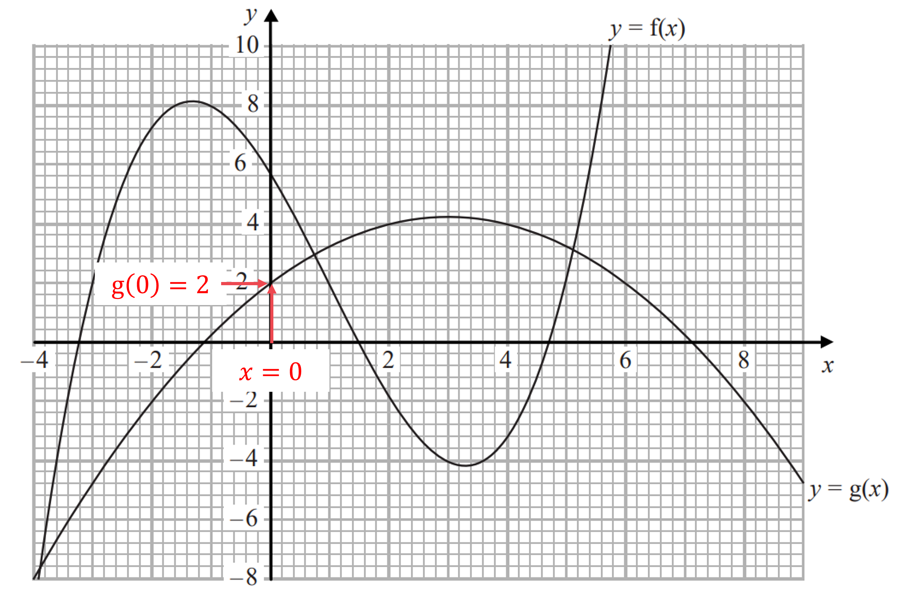

*g(0) = 2*

**g(0) = 2** **[1]**

### 2() — 2 marks
*gf(-1) means g(f(-1))*

*Find f(-1) by drawing a line from **x** = -1 on the **x**-axis up to the curve **y** = f(**x**) and reading off the **y**-coordinate* * *

*f(-1) = 8*

**[1]*** *

*g(f(-1)) is the same as g(8)*

*Find g(8) by drawing a line from **x** = 8 on the **x**-axis down to the curve **y** = g(**x**) and reading off the **y**-coordinate*

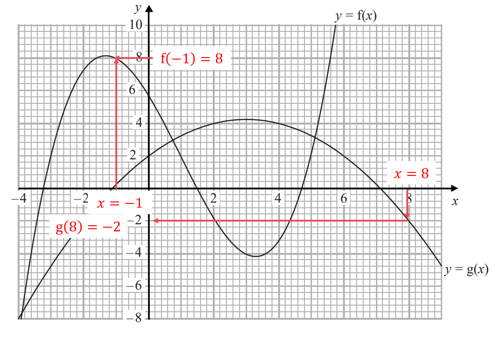

*g(8) = -2*

**gf(-1) = -2** **[1]**

## Q21 — hard — 7 marks · exam-questions

### 1() — 1 marks
*An input must never result in dividing by zero* 
*Find the input that cause the functions to divide by 0 (by setting the denominators equal to 0)* * *

> `table attributes columnalign right center left columnspacing 0px end attributes row x equals 0 end table`*    *

> *The input **x** = 0 must be excluded from the domain*

**x**** = 0 ** **[1]**

### 2() — 3 marks
*gf(**a**) means g(f(**a**))* 
*Find f(**a**) by substituting **x** = **a** into f(**x**)* * *

`straight f open parentheses a close parentheses equals 2 over a` * *

*g(f(**a**)) is the same as *`straight g open parentheses 2 over a close parentheses` 
*Substitute *$x=\frac{2}{a}$* into *`straight g open parentheses x close parentheses` * *

`straight g open parentheses 2 over a close parentheses italic equals fraction numerator 2 over a plus 1 over denominator 2 over a end fraction`

**[1]**

*Set the expression above equal to 3 * * *

$\frac{\frac{2}{a}+1}{\frac{2}{a}}=3$ * *

*This equation must be solved for **a*

*For example, multiply both sides by *$\frac{2}{a}$ * *

`table row cell 2 over a plus 1 end cell equals cell 3 cross times 2 over a end cell row cell 2 over a plus 1 end cell equals cell 6 over a end cell end table`

**[1]**

*Multiply both sides by **a* * *

`table row cell a open parentheses 2 over a plus 1 close parentheses end cell equals cell up diagonal strike a cross times fraction numerator 6 over denominator up diagonal strike a end fraction end cell row cell 2 plus a end cell equals 6 end table` * *

*Solve to find **a*

$a=6-2$

**a**** = 4** **[1]**

### 3() — 3 marks
*Replace g(**x**) with **y* * *

$y=\frac{x+1}{x}$ * *

*Without rearranging the equation, swap the **x**'s and **y**'s* * *

$x=\frac{y+1}{y}$

> *We must make **y** the subject of this new equation *

*Remove fractions (by multiplying both sides by **y**)* * *

`table row cell x y end cell equals cell y plus 1 end cell end table`

**[1]**

> *Get all the **y** terms on one side (for example, by subtracting **y** from both sides)  *

> $xy-y=1$*  *

> *Factorise **y** out of the two terms on the left  *

`y open parentheses x minus 1 close parentheses equals 1`

**[1]*** *

> *Get **y** on its own (by dividing both sides by **x** - 1)  *

$y=\frac{1}{x-1}$

*The function on the right-hand side is the inverse function, g**-1**(**x**)* *Replace **y** with g**-1**(**x**) to write down the final answer*

$g^{-1}(x)=\frac{1}{x-1}$* ***[1]**

## Q22 — hard — 5 marks · exam-questions

### 1() — 2 marks
> *It helps to rewrite these functions back in the form f(**x**) and g(**x**)*

`straight f open parentheses x close parentheses equals 2 x squared plus 1 space space space space space space space space straight g open parentheses x close parentheses equals fraction numerator 2 x over denominator x minus 1 end fraction`

*gf : **x** is the same as gf(**x**) which means g(f(**x**))*

*Write the algebraic expression for f(**x**) inside g(...)* * *

`straight g open parentheses straight f open parentheses x close parentheses close parentheses equals straight g open parentheses 2 x squared plus 1 close parentheses` * *

*Find *`straight g open parentheses 2 x squared plus 1 close parentheses`* by replacing the **x**'s in g(**x**) with the brackets *`open parentheses 2 x squared plus 1 close parentheses` * *

`straight g open parentheses 2 x squared plus 1 close parentheses equals fraction numerator 2 open parentheses 2 x squared plus 1 close parentheses over denominator open parentheses 2 x squared plus 1 close parentheses minus 1 end fraction`

**[1]**

*Expand the brackets in the numerator and simplify the denominator* * *

`table attributes columnalign right center left columnspacing 0px end attributes row cell fg open parentheses 2 x squared plus 1 close parentheses end cell equals cell fraction numerator 4 x squared plus 2 over denominator 2 x squared end fraction end cell end table`* *

> *The top and bottom have a factor of 2 which can be cancelled  *

> * *`table row cell fraction numerator 4 x squared plus 2 over denominator 2 x squared end fraction end cell equals cell fraction numerator up diagonal strike 2 open parentheses 2 x squared plus 1 close parentheses over denominator up diagonal strike 2 x squared end fraction end cell row blank equals cell fraction numerator 2 x squared plus 1 over denominator x squared end fraction end cell end table`

> *Write your final answer as gf : **x**  →  ...*

$\mathrm{gf}:x\rightarrow\frac{2x^{2}+1}{x^{2}}$* ***[1]**

### 2() — 3 marks
*Replace g(**x**) with **y* * *

$y=\frac{2x}{x-1}$ * *

*Without rearranging the equation, swap the **x**'s and **y**'s* * *

$x=\frac{2y}{y-1}$

> *We must make **y** the subject of this new equation *

*Remove fractions (by multiplying both sides by **y** - 1)* * *

`table row cell x open parentheses y minus 1 close parentheses end cell equals cell 2 y end cell end table`

**[1]**

> *Expand the brackets  *

$xy-x=2y$

> *Get the **y** terms on one side (for example, by subtracting 2**y** and adding **x** to both sides)  *

> `table row cell x y minus x minus 2 y end cell equals 0 row cell x y minus 2 y end cell equals x end table`*  *

> *Factorise **y** out of the two terms on the left  *

`y open parentheses x minus 2 close parentheses equals x`

**[1]**

> *Get **y** on its own (by dividing both sides by **x** - 2)  *

> $y=\frac{x}{x-2}$*  *

*The function on the right-hand side is the inverse function, g**-1**(**x**)* *Replace **y** with g**-1**(**x**) to write down the final answer*

$g^{-1}(x)=\frac{x}{x-2}$* ***[1]**

## Q23 — hard — 7 marks · exam-questions

### 1() — 1 marks
*Substitute **x** = 1 into g(**x**)*

`table row cell straight g open parentheses 1 close parentheses end cell equals cell fraction numerator 1 over denominator 2 cross times 1 minus 5 end fraction end cell row blank equals cell fraction numerator 1 over denominator 2 minus 5 end fraction end cell end table`

$-\frac{1}{3}$ **[1]**

### 2() — 1 marks
*Inputting a value must never result in dividing by zero*

*Find the input that causes the function to divide by 0 (by solving the denominator equal to 0)* * *

`table row cell 2 x minus 5 end cell equals 0 row cell 2 x end cell equals 5 row x equals cell 5 over 2 end cell end table`

> * *

> *This value must be excluded from any domain*

$x=\frac{5}{2}$ **[1]**

### 3() — 2 marks
*gh(**x**) means g(h(**x**))*

*Write the algebraic expression for h(**x**) inside g(...)* * *

`straight g open parentheses straight h open parentheses x close parentheses close parentheses equals straight g open parentheses x plus 4 close parentheses` * *

*Find *`straight g open parentheses x plus 4 close parentheses`* by replacing the **x**'s in g(**x**) with the brackets *`open parentheses x plus 4 close parentheses` * *

`straight g open parentheses x plus 4 close parentheses equals fraction numerator open parentheses x plus 4 close parentheses over denominator 2 open parentheses x plus 4 close parentheses minus 5 end fraction`

**[1]**

*Expand the brackets and collect like terms* * *

`table row cell straight g open parentheses x plus 4 close parentheses end cell equals cell fraction numerator x plus 4 over denominator 2 x plus 8 minus 5 end fraction end cell row blank equals cell fraction numerator x plus 4 over denominator 2 x plus 3 end fraction end cell end table` * *

> *Write your final answer as gh(**x**) = ...*

$\mathrm{gh}(x)=\frac{x+4}{2x+3}$* ***[1]**

### 4() — 3 marks
*Replace g(**x**) with **y* * *

$y=\frac{x}{2x-5}$ * *

*Without rearranging the equation, swap the **x**'s and **y**'s* * *

$x=\frac{y}{2y-5}$

> *We must make **y** the subject of this new equation *

*Remove fractions (by multiplying both sides by 2**y** - 5)* * *

`table row cell x open parentheses 2 y minus 5 close parentheses end cell equals y end table`

**[1]**

> *Expand the brackets  *

$2xy-5x=y$

> *Get the **y** terms on one side (for example, by subtracting **y** and adding 5**x** to both sides)  *

> `table row cell 2 x y minus 5 x minus y end cell equals 0 row cell 2 x y minus y end cell equals cell 5 x end cell end table`*  *

> *Factorise **y** out of the two terms on the left  *

`y open parentheses 2 x minus 1 close parentheses equals 5 x`

**[1]**

> *Get **y** on its own (by dividing both sides by 2**x** - 1)  *

> $y=\frac{5x}{2x-1}$*  *

*The function on the right-hand side is the inverse function, g**-1**(**x**)* *Replace **y** with g**-1**(**x**) to write down the final answer*

$g^{-1}(x)=\frac{5x}{2x-1}$* ***[1]**

## Q24 — hard — 6 marks · exam-questions

### 1() — 1 marks
*Substitute **x** = 11 into f(**x**)*

`table row cell straight f open parentheses 11 close parentheses end cell equals cell fraction numerator 2 cross times 11 over denominator 11 minus 1 end fraction end cell row blank equals cell 22 over 10 end cell end table`

$\frac{11}{5}$ **[1]**

**2.2 is also accepted**

### 2() — 1 marks
*Inputting a value must never result in dividing by zero*

*Find the input that causes the function to divide by 0 (by solving the denominator equal to 0)* * *

`table attributes columnalign right center left columnspacing 0px end attributes row cell x minus 1 end cell equals 0 row x equals 1 end table`

> * *

> *The value **x** = 1 must be excluded from any domain*

$x=1$ **[1]**

### 3() — 3 marks
*Replace f(**x**) with **y* * *

$y=\frac{2x}{x-1}$ * *

*Without rearranging the equation, swap the **x**'s and **y**'s* * *

> $x=\frac{2y}{y-1}$*   *

> *You must make **y** the subject of this new equation *

*Remove fractions (by multiplying both sides by **y** - 1)* * *

`table attributes columnalign right center left columnspacing 0px end attributes row cell x open parentheses y minus 1 close parentheses end cell equals cell 2 y end cell end table`

**[1]**

> *Expand the brackets  *

$xy-x=2y$

> *Get the **y** terms on one side (for example, by subtracting 2**y** and adding **x** to both sides)  *

> `table row cell x y minus x minus 2 y end cell equals 0 row cell x y minus 2 y end cell equals x end table`*  *

> *Factorise **y** out of the two terms on the left  *

`y open parentheses x minus 2 close parentheses equals x`

**[1]**

> *Get **y** on its own (by dividing both sides by **x** - 2)  *

> $y=\frac{x}{x-2}$*  *

*The function on the right-hand side is the inverse function, f**-1**(**x**)* *Replace **y** with f**-1**(**x**) to write down the final answer*

$f^{-1}(x)=\frac{x}{x-2}$* ***[1]**

### 4() — 1 marks
*It is hard to find the outputs of f(**x**) (the range) without a sketch of y = f(**x**)*

> *Instead, use the rule that "the outputs of f(**x**)" are the same as "the inputs of f**-1**(**x**)"*

`straight f to the power of negative 1 end exponent open parentheses x close parentheses equals fraction numerator x over denominator x minus 2 end fraction` * *

*The possible inputs of f**-1**(**x**) are any values of **x** that do not end up dividing by zero*

*Solve the denominator equal to zero to see which values are not allowed* * *

`table row cell x minus 2 end cell equals 0 row x equals 2 end table` * *

> *Excluding 2 from the inputs of f**-1**(**x**)  means excluding 2 from the outputs of f(**x**)*

**2** **[1]**

## Q25 — hard — 7 marks · exam-questions

### 1() — 1 marks
*Substitute **x** = 0.5 into f(**x**)*

`table row cell straight f open parentheses 0.5 close parentheses end cell equals cell fraction numerator 0.5 over denominator 3 cross times 0.5 plus 1 end fraction end cell row blank equals cell fraction numerator 0.5 over denominator 2.5 end fraction end cell end table`

$\frac{1}{5}$ **[1]**

**0.2 is also accepted**

### 2() — 2 marks
*ff(-1) means f(f(-1))*

*Find f(-1) but substituting **x** = -1 into f(**x**) (putting brackets around the negative value)* * *

`table row cell straight f open parentheses negative 1 close parentheses end cell equals cell fraction numerator open parentheses negative 1 close parentheses over denominator 3 open parentheses negative 1 close parentheses plus 1 end fraction end cell row blank equals cell fraction numerator negative 1 over denominator negative 3 plus 1 end fraction end cell row blank equals cell fraction numerator negative 1 over denominator negative 2 end fraction end cell row blank equals cell 1 half end cell end table`

**[1]**

*f(f(-1)) is the same as *`straight f open parentheses 1 half close parentheses` *Find *`straight f open parentheses 1 half close parentheses`* but substituting *$x=\frac{1}{2}$* into f(**x**)* * *

`straight f open parentheses 1 half close parentheses equals fraction numerator 1 half over denominator 3 cross times 1 half plus 1 end fraction` * *

> *Work out this value (for example, using a calculator)*

$\frac{1}{5}$* ***[1]**

**0.2 is accepted**

### 3() — 1 marks
*Inputting a value must never result in dividing by zero*

*Find the input that causes the function to divide by 0 (by solving the denominator equal to 0)* * *

`table attributes columnalign right center left columnspacing 0px end attributes row cell 3 x plus 1 end cell equals 0 row cell 3 x end cell equals cell negative 1 end cell row x equals cell negative 1 third end cell end table`

> * *

> *This value must be excluded from any domain*

$x=-\frac{1}{3}$ **[1]**

### 4() — 3 marks
*Replace f(**x**) with **y* * *

$y=\frac{x}{3x+1}$ * *

*Without rearranging the equation, swap the **x**'s and **y**'s* * *

$x=\frac{y}{3y+1}$

*We must make **y** the subject of this new equation Remove fractions (by multiplying both sides by 3**y** + 1)* * *

`table attributes columnalign right center left columnspacing 0px end attributes row cell x open parentheses 3 y plus 1 close parentheses end cell equals y end table`

**[1]**

> *Expand the brackets  *

$3xy+x=y$

> *Get the **y** terms on one side (for example, by subtracting 3**xy** from both sides)  *

> `table row x equals cell y minus 3 x y end cell end table`*  *

> *Factorise **y** out of the two terms on the right  *

`x equals y open parentheses 1 minus 3 x close parentheses`

**[1]**

> *Get **y** on its own (by dividing both sides by 1 - 3**x**)  *

> $\frac{x}{1-3x}=y$*  *

*The function on the right-hand side is the inverse function, f**-1**(**x**)* *Replace **y** with f**-1**(**x**) to write down the final answer*

$f^{-1}(x)=\frac{x}{1-3x}$* ***[1]**

## Q26 — hard — 3 marks · exam-questions

### 22() — 3 marks
> *Finding the inverse of a quadratic function requires completing the square.*

> *Write the function in the form *$y=x^{2}-8x+5$* and then swap the *$x$* and *$y.$*  *

$y=x^{2}-8x+5\,x=y^{2}-8y+5$

> *Rearrange **the expression to make *$y$* the subject again by first completing the square.  *

> *The formula for completing the square for a quadratic in the form*$x^{2}+bx+c$*is*`space space open parentheses x space plus space b over 2 close parentheses squared space space minus space open parentheses b over 2 close parentheses squared space plus space c`*.*

> *Complete the square by dividing the middle term (-8) by 2.*

`table row cell y squared space minus space 8 y space plus space 5 space end cell equals cell space open parentheses y space minus space 8 over 2 close parentheses to the power of 2 space end exponent minus open parentheses 8 over 2 close parentheses squared space plus space 5 space end cell row blank equals cell space open parentheses y space minus space 4 close parentheses squared space minus space 4 squared space plus space 5 end cell end table`

**Correct first step to complete square**** [1]**

> *Simplify.*

`table row cell open parentheses y space minus space 4 close parentheses squared space minus space 4 squared space plus space 5 space end cell equals cell space open parentheses y space minus space 4 close parentheses squared space minus space 16 space plus space 5 space end cell row blank equals cell space open parentheses y space minus space 4 close parentheses squared space minus space 11 end cell end table`

> *Set equal to *$x$* and rearrange to make *$y$* the subject.*

`x space equals space open parentheses y space minus space 4 close parentheses squared space minus space 11`

> *Rearrange **the expression to make *$y$* the subject again.*

`table row cell x space plus space 11 space end cell equals cell space open parentheses y space minus space 4 close parentheses squared end cell row cell y space minus space 4 space end cell equals cell space plus-or-minus square root of x space plus space 11 end root end cell row cell y space end cell equals cell plus-or-minus square root of x space plus space 11 end root space plus space 4 end cell row cell y space end cell equals cell space 4 space plus-or-minus square root of x space plus space 11 end root end cell end table`

**[1]**

> *The domain of f(x) is *$x\leq4$* so this must be the range of the inverse, taking the negative square root will give *$y\leq4$*. *
*Rewrite using the correct notation for an inverse function.*

$f^{-1}(x)=4-\sqrt{x+11}$ **[1]**

## Q27 — hard — 4 marks · exam-questions

### 23() — 4 marks
> *It helps to rewrite these functions back in the form f(**x**) and g(**x**)*

`straight f open parentheses x close parentheses equals 1 plus 1 over x space space space space space space space space space space straight g open parentheses x close parentheses equals fraction numerator x plus 1 over denominator 2 end fraction`

*fg is the same as fg(**x**) which means f(g(**x**))*

*Write the algebraic expression for g(**x**) inside f(...)* * *

`straight h open parentheses x close parentheses equals straight f open parentheses fraction numerator x plus 1 over denominator 2 end fraction close parentheses` * *

*Find *`straight f open parentheses fraction numerator x plus 1 over denominator 2 end fraction close parentheses`* by replacing the **x**'s in g(**x**) with the brackets *`open parentheses fraction numerator x plus 1 over denominator 2 end fraction close parentheses` * *

`straight h open parentheses x close parentheses equals 1 plus fraction numerator 1 over denominator open parentheses fraction numerator x plus 1 over denominator 2 end fraction close parentheses end fraction`

**[1]**

*The algebraic fraction can be simplified by either multiplying top-and-bottom by 2 or using that *$1\div\frac{x+1}{2}=1\times\frac{2}{x+1}$ * *

`table attributes columnalign right center left columnspacing 0px end attributes row cell straight h open parentheses x close parentheses end cell equals cell 1 plus fraction numerator 2 over denominator x plus 1 end fraction end cell end table`* *

*To find the inverse function h**-1**(**x**), first replace h(**x**) with **y* * *

$y=1+\frac{2}{x+1}$ * *

*Without rearranging the equation, swap the **x**'s and **y**'s* * *

$x=1+\frac{2}{y+1}$

**[1]**

> *You must make **y** the subject of this new equation (there are many ways to do this) *

> *For example, subtract 1 from both sides  *

$x-1=\frac{2}{y+1}$

*It may help to think of the left-hand side as a fraction* * *

$\frac{x-1}{1}=\frac{2}{y+1}$ *  *

*Multiply both sides by **y** + 1 and divide both sides by **x** - 1*

$y+1=\frac{2}{x-1}$

**[1]**

> *Get **y** on its own (by subtracting 1 from both sides)  *

> $y=\frac{2}{x-1}-1$*  *

*The function on the right-hand side is the inverse function, h**-1**(**x**)* *Replace **y** with h**-1**x **: → to write down the final answer in the form asked for by the question*

$h^{-1}:x\rightarrow\frac{2}{x-1}-1$* ***[1]**

$\frac{3-x}{x-1}$** or **$\frac{x-3}{1-x}$** or **$-1-\frac{2}{1-x}$**are also accepted**

## Q28 — hard — 4 marks · exam-questions

### 28() — 4 marks
> *Find *`straight f to the power of negative 1 end exponent open parentheses 55 close parentheses`* by setting f(**x**) equal to 55.*

`table row cell 2 x space minus space 3 space end cell equals cell space 55 end cell end table`

**[1]**

> *Solve to find the value of *$x$*, this will be the input of f(**x**) that gives the output of 55, which is the same as the output of the inverse of f(**x**) when the input is 55. *

`table row cell 2 x space end cell equals cell space 55 space plus space 3 end cell row cell x space end cell equals cell space fraction numerator 55 space plus space 3 over denominator 2 end fraction end cell row cell x space end cell equals cell space 29 end cell end table`

**[1]*** *

> `fg open parentheses 4 close parentheses`* means *`straight f open parentheses straight g open parentheses 4 close parentheses close parentheses`*. *

> *Find *`fg open parentheses 4 close parentheses`* by replacing the **x**'s in g(**x**) with 4 and then substituting this into f(**x**).  *

`straight f open parentheses straight g open parentheses 4 close parentheses close parentheses equals straight f open parentheses 4 squared close parentheses space equals space straight f open parentheses 16 close parentheses space equals space 2 space cross times 16 space minus 3 space equals space 29`

**[1]**

> *Set fg(4) equal to f**-1**(55).  *

$29=29$

$\frac{55+3}{2}=2\times16-3$* ***[1]**

** Working must be shown, finding the answer 29 alone will score no marks.**

## Q29 — hard — 2 marks · exam-questions

### 30() — 2 marks
> `fg open parentheses x close parentheses`* means *`straight f open parentheses straight g open parentheses x close parentheses close parentheses`*.*

> * Find *`fg open parentheses x close parentheses`* by substituting *`straight g open parentheses x close parentheses`* into *`straight f open parentheses x close parentheses.`*  *

`fg open parentheses x close parentheses equals straight f open parentheses 6 x squared space plus space 3 close parentheses space equals space fraction numerator open parentheses 6 x squared space plus space 3 close parentheses over denominator 3 end fraction plus space 4`

**[1]**

> *Factorise the numerator of the fraction and simplify. *

`fraction numerator up diagonal strike 3 open parentheses 2 x squared space plus space 1 close parentheses over denominator up diagonal strike 3 end fraction plus space 4 space equals space 2 x squared space plus space 1 space plus space 4`

> *Simplify.*

$\mathrm{fg}(x)=2x^{2}+5$* ***[1]**

## Q30 — hard — 2 marks · exam-questions

### 17() — 2 marks
*You need to compare the values of f(10) and 2 × f(5)*

*Find f(10) by substituting **x **= 10 into f(**x**)* * *

`table row cell straight f open parentheses 10 close parentheses end cell equals cell 3 cross times 10 squared minus 4 cross times 10 plus 8 end cell row blank equals cell 3 cross times 100 minus 40 plus 8 end cell row blank equals cell 300 minus 40 plus 8 end cell row blank equals 268 end table`

**[1]**

*Find f(5) by substituting **x** = 5 into f(**x**)* * *

`table row cell straight f open parentheses 5 close parentheses end cell equals cell 3 cross times 5 squared minus 4 cross times 5 plus 8 end cell row blank equals cell 3 cross times 25 minus 20 plus 8 end cell row blank equals cell 75 minus 20 plus 8 end cell row blank equals 63 end table` * *

*Find 2 × f(5) by multiplying the result by 2* * *

`2 cross times straight f open parentheses 5 close parentheses equals 2 cross times 63 equals 126` * *

> *Jenny is not correct, as the value of f(10) is not equal to the value of 2 × f(5)*

**No, Jenny is not correct**** [1]**

**268 and 126 must be seen in your working to award the final mark**

## Q31 — hard — 3 marks · exam-questions

### 26() — 3 marks
*gh(**x**) means g(h(**x**))*

*Replace the **x**'s in g(**x**) with **x**3* * *

`gh open parentheses x close parentheses equals 16 minus x cubed`

**[1]**

*Set this expression equal to 24 and solve to find **x* * *

`table row cell 16 minus x cubed end cell equals 24 row 16 equals cell 24 plus x cubed end cell row cell 16 minus 24 end cell equals cell x cubed end cell row cell negative 8 end cell equals cell x cubed end cell end table`

**[1]**

*Take the cube-root of both sides (you can cube-root a negative number)*

`table row cell cube root of negative 8 end root end cell equals x row cell negative 2 end cell equals x end table`

**x**** = -2 ****[1]**

## Q32 — hard — 3 marks · exam-questions

### 26() — 3 marks
> *fg(**x**) is f(g(**x**))*

*To find this function, replace all **x**'s in f(**x**) with (**x**2** - 2) and simplify* * *

`table row cell fg open parentheses x close parentheses end cell equals cell fraction numerator open parentheses x squared minus 2 close parentheses over denominator open parentheses x squared minus 2 close parentheses plus 2 end fraction end cell row blank equals cell fraction numerator x squared minus 2 over denominator x squared minus 2 plus 2 end fraction end cell row blank equals cell fraction numerator x squared minus 2 over denominator x squared end fraction end cell end table`

**[1]**

*Split the algebraic fraction up into two separate fractions* * *

`fg open parentheses x close parentheses equals x squared over x squared minus 2 over x squared`

**[1]**

*Simplify the first fraction by cancelling **x**2** from top-and-bottom* * *

`table row cell fg open parentheses x close parentheses end cell equals cell fraction numerator up diagonal strike x squared end strike over denominator up diagonal strike x squared end strike end fraction minus 2 over x squared end cell row blank equals cell 1 minus 2 over x squared end cell end table` * *

*The final answer must be in the form **a** + **bx**n** **where **a**, **b** and **c** are integers (not necessarily positive integers)*

*Write *$\frac{2}{x^{2}}$* in the form **bx**n** using negative indices*

$\frac{2}{x^{2}}=2\times\frac{1}{x^{2}}=2\timesx^{-2}=2x^{-2}$

$\mathrm{fg}(x)=1-2x^{-2}$ **[1]**

**a**** = 1, ****b**** = -2, ****n**** = -2**

## Q33 — hard — 4 marks · exam-questions

### 26() — 4 marks
*Replace f(**x**) with **y* * *

$y=\frac{2x+3}{x-4}$ * *

*Without rearranging the equation, swap the **x**'s and **y**'s* * *

$x=\frac{2y+3}{y-4}$

*Now make **y** the subject of this new equation (start by multiplying both sides by **y **- 4)* * *

`table row cell x open parentheses y minus 4 close parentheses end cell equals cell 2 y plus 3 end cell end table`

**[1]**

> *Expand the brackets  *

$xy-4x=2y+3$

**[1]**

> *Collect the **y**-terms on one side  *

> $xy-2y=4x+3$*  *

> *Factorise out the **y** on the left-hand side  *

`y open parentheses x minus 2 close parentheses equals 4 x plus 3`

**[1]**

> *Make **y** the subject by dividing both sides by **x** - 2  *

> $y=\frac{4x+3}{x-2}$*  *

*The function on the right-hand side is the inverse function, f**-1**(**x**)* *Replace **y** with f**-1**(**x**) to write down the final answer*

$f^{-1}(x)=\frac{4x+3}{x-2}$**[1]**

$\frac{-4x-3}{2-x}$** is also accepted**

## Q34 — hard — 3 marks · exam-questions

### 28((b)) — 3 marks
*Method 1*

*Find g**-1**(**x**) by first replacing g(**x**) with **y* * *

$y=3x+7$ * *

*Without rearranging the equation, swap the **x**'s and **y**'s* * *

$x=3y+7$

*Now make **y** the subject of this new equation* * *

`table row cell x minus 7 end cell equals cell 3 y end cell row cell fraction numerator x minus 7 over denominator 3 end fraction end cell equals y end table`

**x - 7 = 3y ****[1]**

*The function on the left-hand side is the inverse function, g**-1**(**x**)* *Replace **y** with g**-1**(**x**)  *

`straight g to the power of negative 1 end exponent open parentheses x close parentheses equals fraction numerator x minus 7 over denominator 3 end fraction`

**[1]**

> *Set this expression equal to 2**x**  *

> $\frac{x-7}{3}=2x$*  *

> *Solve this equation to find **x**  *

`table row cell x minus 7 end cell equals cell 6 x end cell row cell negative 7 end cell equals cell 5 x end cell row cell negative 7 over 5 end cell equals x end table`

**x**** = -1.4*** ***[1]**

*Method 2*** **

*g**-1**(**x**) = 2**x** means putting an input of **x** into the inverse function gives an output of 2**x*** **

*This means putting an input of 2**x** into the original function must give an output of **x***  **

`straight g open parentheses 2 x close parentheses equals x`**  **

> *Work out an expression for g(2**x**) on the left by replacing all **x**'s in g(**x**) with 2**x**  *

$3\times2x+7=x$

**[1]**

*Solve this equation to find **x***  **

`table attributes columnalign right center left columnspacing 0px end attributes row cell 6 x plus 7 end cell equals x row cell 5 x end cell equals cell negative 7 end cell row x equals cell negative 7 over 5 end cell end table`

**6x + 7 = x seen ****[1]**

**x**** = -1.4*** ***[1]**

## Q35 — hard — 3 marks · exam-questions

### 8() — 3 marks
> *Begin by letting the unknowns in the two boxes be **x **and **y.*

> *Fill in the information you know about the inputs and outputs.*

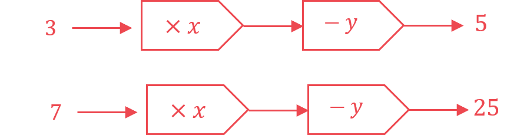

> *Use the information to form equations.*

> *Number the equations so that they are easier to solve.*

> `3 x space minus space y space equals space 5 space space space space space space space space space space space open parentheses 1 close parentheses
7 x space minus space y space equals space 25 space space space space space space space space space open parentheses 2 close parentheses`* *

**[1]**

> *Eliminate the **y** terms by subtracting equation (1) from equation (2). *

> *Be careful to subtract every term. *

> *The coefficients of **y** are the same with the same signs, so subtract them.*

`space space space space space space space 7 x space minus space y space equals space 25 space space space
bottom enclose negative space space space open parentheses 3 x space minus space y space equals space 5 close parentheses end enclose
space space space space space space space space 4 x space space space space space space space space space space equals space 20`

**[1]**

> *Solve the equation to find** x **by dividing both sides by 4.*

`table row cell x space end cell equals cell space 20 over 4 space equals space 5 end cell end table`

> *Substitute *$x=5$*  into either of the two original equations**.*

`open parentheses 1 close parentheses space space space space space 3 open parentheses 5 close parentheses space minus space y space equals space 5`

> *Solve this equation to find** y.*

`table row cell 15 space minus space y space end cell equals cell space 5 end cell row cell y space end cell equals cell space 10 end cell end table`

> *Substitute *$x=5$* and *$y=10$* into the other equation to check that they are correct.*

`table row cell open parentheses 2 close parentheses space space space space space space space space space 7 x space minus space y space end cell equals cell space 25 end cell row cell 7 open parentheses 5 close parentheses space minus space 10 space end cell equals cell space 25 end cell row cell space 35 space minus space 10 space space end cell equals cell space 25 end cell row cell 25 space end cell equals cell space 25 end cell end table`

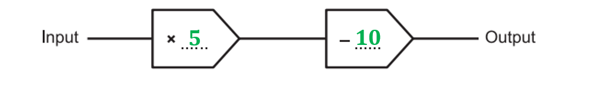

**[1]**

> * *

## Q36 — hard — 3 marks · exam-questions

### 24((a)) — 3 marks
*Method 1*

*Find f(4) by substituting **x** = 4 into f(**x**)* * *

`table row cell straight f open parentheses 4 close parentheses end cell equals cell c cross times 4 plus d end cell row blank equals cell 4 c plus d end cell end table` * *

*Set this expression equal to 7* * *

$4c+d=7$ * *

*Find f(10) by substituting **x** = 10 into f(**x**)* * *

`table row cell straight f open parentheses 10 close parentheses end cell equals cell c cross times 10 plus d end cell row blank equals cell 10 c plus d end cell end table` * *

*Set this expression equal to 22* * *

$10c+d=22$ * *

*You now have two simultaneous equations* * *

`table row cell 10 c plus d end cell equals 22 row cell 4 c plus d end cell equals 7 end table`

**[1]**

*Solve these simultaneous equations, for example by eliminating the **d**'s first (by subtracting the equations)* * *

$6c=15\,c=\frac{15}{6}\,c=\frac{5}{2}$

**[1]**

*Substitute this value back into either equation to find** d* * *

`table row cell 4 cross times 5 over 2 plus d end cell equals 7 row cell 10 plus d end cell equals 7 row d equals cell negative 3 end cell end table`

**c**** = 2.5 and ****d**** = -3*** ***[1]**

**It is also possible to eliminate ****c**** first**

> *Method 2*

*f(**x**) = **cx** + **d** looks like "**y** = **mx** + **c**"* *f(x) represents a straight line through (4, 7) and (10, 22) with gradient **c** and y-intercept **d* *Work out the gradient, **c* * *

$\frac{22-7}{10-4}=2.5$

**correct value**** [1]**

**recognising that this is "c"**** [1]**

*Work out the y-intercept of this line, **d**, for example using f(4) = 7* * *

`table attributes columnalign right center left columnspacing 0px end attributes row cell straight f open parentheses x close parentheses end cell equals cell 2.5 x plus d end cell row cell straight f open parentheses 4 close parentheses end cell equals cell 2.5 cross times 4 plus d end cell row 7 equals cell 2.5 cross times 4 plus d end cell row 7 equals cell 10 plus d end cell row cell negative 3 end cell equals d end table`

**c**** = 2.5 and ****d**** = -3*** ***[1]**

## Q37 — hard — 4 marks · exam-questions

### 17((a)) — 1 marks
> *What value would make the denominator zero?*

$2x-5=0$

> *Solve the equation*

$x=\frac{5}{2}\mathrm{or}2.5$

**[B1]**

### 17((b)) — 3 marks
> *Substitute the function h into the function g*

`gh open parentheses x close parentheses equals fraction numerator 11 over denominator 2 open parentheses x squared plus 4 close parentheses space minus 5 end fraction`

**[M1]**

> *Set this equal to 1 and solve the equation*

`table row cell fraction numerator 11 over denominator 2 open parentheses x squared plus 4 close parentheses space minus 5 end fraction end cell equals 1 row blank blank blank end table`

> *Simplify the denominator and multiply both sides by it*

`table row cell fraction numerator 11 over denominator 2 x squared plus 3 end fraction end cell equals 1 row cell 11 space end cell equals cell space 2 x squared plus 3 end cell end table`

> *Subtract 11 to get a quadratic equal to zero and solve*

`table row cell 0 space end cell equals cell space 2 x squared plus 3 space minus space 11 end cell row cell 0 space end cell equals cell space 2 x squared space minus space 8 end cell row 8 equals cell 2 x squared end cell end table`

**[M1]**

`table row 4 equals cell x squared end cell end table`

`table row x equals cell plus-or-minus 2 end cell end table`

> *Due to the domain of h(*$x$*) being *$x\geq0$*, *$x$*must be positive*

**Final answer:** **x**** = 2**

**[A1]**

## Q38 — hard — 7 marks · exam-questions

### 19((a)) — 1 marks
> *An input cannot cause the function to divide by zero*

> *Set the denominator equal to zero and solve to find out which value of *$x$* must be excluded*

$2x-9=0$

$2x=9$

$x=\frac{9}{2}$

$x=4.5$

**[B1]**

### 19((b)) — 2 marks
> *Work out *`straight g open parentheses 4 close parentheses`* by substituting 4 into the function for *$g$

`straight g open parentheses 4 close parentheses space equals fraction numerator space 5 over denominator 2 open parentheses 4 close parentheses minus 9 end fraction space equals fraction numerator 5 over denominator 8 space minus space 9 end fraction space equals fraction numerator 5 over denominator negative 1 end fraction space equals space minus 5`

**[M1]**

> *Substitute this value into the function for *$f$

`straight f open parentheses negative 5 close parentheses space equals space 5 open parentheses negative 5 close parentheses thin space plus thin space 7 space equals space minus 25 space plus thin space 7 space equals space minus 18`

`fg open parentheses 4 close parentheses space equals space minus 18`

**[A1]**

### 19((c)) — 4 marks
> *To find an inverse function, first set it equal to *$y$* and then rearrange to make *$x$* the subject*

$y=3x^{2}-12x+8$

> *To make *$x$* the subject, write it in the form *`a open parentheses x minus p close parentheses squared space plus thin space q`* so that *$x$* will only appear once*

`y space equals space 3 open parentheses x squared space minus space 4 x close parentheses space plus thin space 8`

**[M1]**

`y space equals space 3 open square brackets open parentheses x space minus space 2 close parentheses squared space minus space 4 close square brackets space plus thin space 8
y space equals space 3 open parentheses x space minus space 2 close parentheses squared space minus space 12 space plus thin space 8
y space equals space 3 open parentheses x space minus space 2 close parentheses squared space minus space 4`

**[M1]**

> *Now use the reverse order of operations to make *$x$* the subject*

`y space plus thin space 4 space equals space 3 open parentheses x space minus space 2 close parentheses squared`

`fraction numerator y space plus thin space 4 over denominator 3 end fraction space equals space open parentheses x space minus space 2 close parentheses squared`

**[M1]**

$\pm\sqrt{\frac{y+4}{3}}=x-2$

$2\pm\sqrt{\frac{y+4}{3}}=x$

> *Swap the *$x$* and the *$y$

$y=2\pm\sqrt{\frac{x+4}{3}}$

> **[exam-tip]**
> The domain of the original function tells us the range of the inverse function. $y>2$ so ignore the minus.

`straight h to the power of negative 1 end exponent open parentheses x close parentheses space equals space 2 space plus thin space square root of fraction numerator x space plus thin space 4 over denominator 3 end fraction end root`

**[A1]**

## Q39 — very_hard — 5 marks · exam-questions

### 1() — 2 marks
*Factorise the easier quadratic in the numerator (by taking out a common factor of **x**)* * *

`fraction numerator x open parentheses x plus 3 close parentheses over denominator 2 x squared plus 5 x minus 3 end fraction`

*The harder quadratic on the denominator is likely to have (**x** + 3) as a factor*

*Try factorising with (x + 3)* * *

`2 x squared plus 5 x minus 3 equals open parentheses 2 x plus-or-minus... close parentheses open parentheses x plus 3 close parentheses ?` * *

> *The whole number -1 in the first bracket would multiply by +3 in the second bracket to give -3 on the left *

*Expanding this attempt shows it is correct* * *

`open parentheses 2 x minus 1 close parentheses open parentheses x plus 3 close parentheses equals 2 x squared plus 5 x minus 3`

**[1]**

*Cancel common brackets from top-and-bottom* * *

`table attributes columnalign right center left columnspacing 0px end attributes row blank blank cell fraction numerator x up diagonal strike open parentheses x plus 3 close parentheses end strike over denominator open parentheses 2 x minus 1 close parentheses up diagonal strike open parentheses x plus 3 close parentheses end strike end fraction end cell row blank equals cell fraction numerator x over denominator 2 x minus 1 end fraction end cell end table`

> *This is of the form *$\frac{x}{kx-1}$* where **k** = 2*

$\frac{x}{2x-1}$* ***where ****k**** = 2*** ***[1]**

### 2() — 3 marks
*Replace f(**x**) with **y* * *

$y=\frac{x}{2x-1}$ * *

*Without rearranging the equation, swap the **x**'s and **y**'s* * *

$x=\frac{y}{2y-1}$

**[1]**

> *We must make **y** the subject of this new equation *

*Remove fractions (by multiplying both sides by 2**y** - 1)* * *

`table attributes columnalign right center left columnspacing 0px end attributes row cell x open parentheses 2 y minus 1 close parentheses end cell equals y end table`

> *Expand the brackets  *

$2xy-x=y$

> *Get the **y** terms on one side (by example, by adding **x** to both sides and subtracting **y** from both sides)  *

`table attributes columnalign right center left columnspacing 0px end attributes row cell 2 x y end cell equals cell y plus x end cell row cell 2 x y minus y end cell equals x end table`

**[1]**

> *Factorise out** y** from the two terms on the left  *

> `y open parentheses 2 x minus 1 close parentheses equals x`*  *

> *Get **y** on its own (by dividing both sides by 2**x** - 1)  *

> $y=\frac{x}{2x-1}$*   *

*The function on the right-hand side is the inverse function, f**-1**(**x**)* *Replace **y** with f**-1**(**x**) to write down the final answer*

$f^{-1}(x)=\frac{x}{2x-1}$* ***[1]**

** In this question, f****-1****(****x****) and f(****x****) are identical, so f(****x****) is described as "self-inverse" **

## Q40 — very_hard — 5 marks · exam-questions

### 22() — 5 marks
*This question involves setting up and solving simultaneous equations in **a** and **b*

*If g(3) = 20 then substitute x = 3 into g(x) and set this equal to 20* * *

`table row cell a cross times 3 plus b end cell equals 20 row cell 3 a plus b end cell equals 20 end table`

**[1]**

> *f**-1**(33) = g(1) *

*Find the inverse function, f**-1**(**x) **by first replacing f(**x**) with **y* * *

$y=5x+3$ * *

*Without rearranging the equation, swap the **x**'s and **y**'s* * *

$x=5y+3$

*Now make **y** the subject of this new equation (by subtracting 3 from both sides then dividing both sides by 5)* * *

`table row cell x minus 3 end cell equals cell 5 y end cell row cell fraction numerator x minus 3 over denominator 5 end fraction end cell equals y end table` * *

*The function on the left-hand side is the inverse function, f**-1**(**x**)* *Replace **y** with f**-1**(**x**)*

$f^{-1}(x)=\frac{x-3}{5}$

**[1]**

> *Find f**-1**(33) by substituting **x** = 33 into f**-1**(**x**)  *

`table row cell straight f to the power of negative 1 end exponent open parentheses 33 close parentheses end cell equals cell fraction numerator 33 minus 3 over denominator 5 end fraction end cell row blank equals cell 30 over 5 end cell row blank equals 6 end table`

> *Find g(1) by substituting 1 into g(**x**)  *

`straight g open parentheses 1 close parentheses equals a plus b`

**[1]**

> *f**-1**(33) = g(1) where f**-1**(33) = 6 and g(1) = **a** + **b*

> * Set 6 equal to **a** + **b**  *

$6=a+b$

**[1]**

> *Write down the two simultaneous equations for **a** and **b**  *

> `table row cell 3 a plus b end cell equals 20 row cell a plus b end cell equals 6 end table`*  *

> *Solve to find **a** (for example, by subtracting the second equations from the first)  *

> `table attributes columnalign right center left columnspacing 0px end attributes row cell 2 a end cell equals 14 row a equals cell 14 over 2 end cell row a equals 7 end table`*  *

> *Find **b** (for example, by substituting **a** = 7 into the second equation then solving for** b**)  *

> `table row cell 7 plus b end cell equals 6 row b equals cell negative 1 end cell end table`*  *

> *Write out the two solutions together*

**a ****= 7 and ****b**** = -1*** ***[1]**

## Q41 — very_hard — 9 marks · exam-questions

### 1() — 1 marks
*Substitute** x** = 10 into f(**x**) *

`straight f open parentheses 10 close parentheses space equals space square root of 10 space minus space 6 end root space equals space square root of 4`

**2** **[1]**

### 2() — 2 marks
> *The domain is the set of values that can be inputs.*

*You cannot take the square root of a negative number.*

> *The set of inputs must ensure that the expression under the square root is not negative.  *

> *The values of *$x$* that must be excluded are found by solving  *$x-6<0$*.*

$x-6<0$

**[1]**

$x<6$* ***[1]**

### 3() — 1 marks
> *The set of inputs are on the **x-**axis and the set of outputs are on the **y-**axis**.*

> *Draw a line to the graph from **x** = 2 and then along to the **y-**axis.*

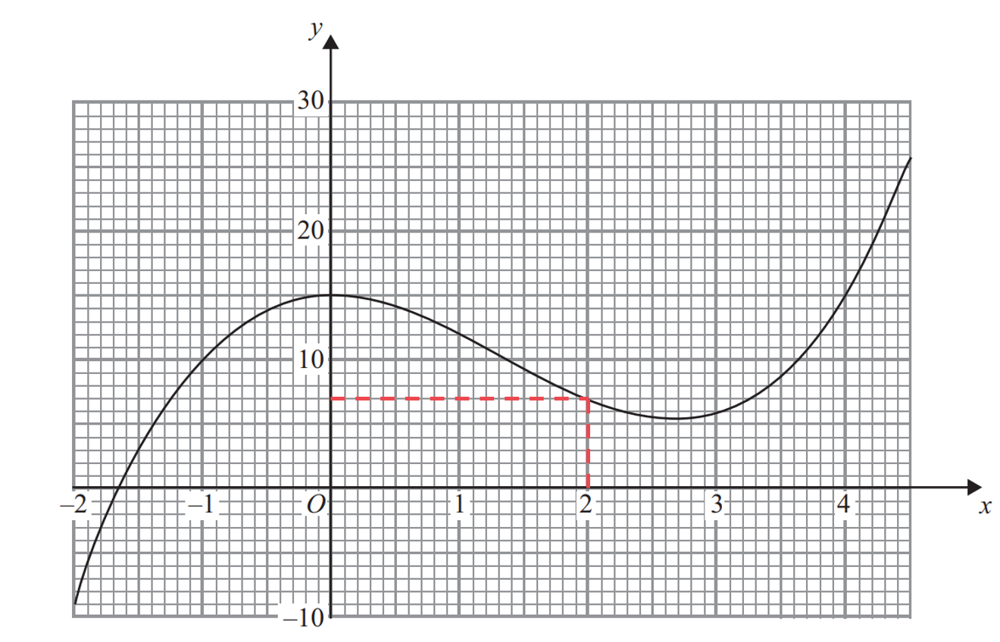

$g(2)=7$* ***[1]**

### 4() — 2 marks
> *To find the value of *`fg open parentheses 0 close parentheses`*, put the output of *`straight g open parentheses 0 close parentheses`* into *`straight f open parentheses x close parentheses`*. *

> *Use the graph of *`straight g open parentheses x close parentheses`* to find the value of *`straight g open parentheses 0 close parentheses`*. *

> *The value of *`straight g open parentheses 0 close parentheses`* is the **y **value when the **x **value is 0.*

$g(0)=15$

**[1]**

> *The output of g(0) is 15. *

> *Substitute this into the expression for *`straight f open parentheses x close parentheses`*.*

`table row cell straight f open parentheses 15 close parentheses space end cell equals cell space square root of 15 space minus space 6 end root space end cell row blank equals cell space square root of 9 end cell end table`

$\mathrm{fg}(0)=3$* ***[1]**

### 5() — 3 marks
> *The value of *$k$*is the output when *$x=1$* is the input.*

> *Draw a line to the graph from *$x=1$* and then along to the **y-**axis to find the value of *$k.$

> *Draw a horizontal line across the graph extending across all of *`straight g open parentheses x close parentheses.`

**[1]**

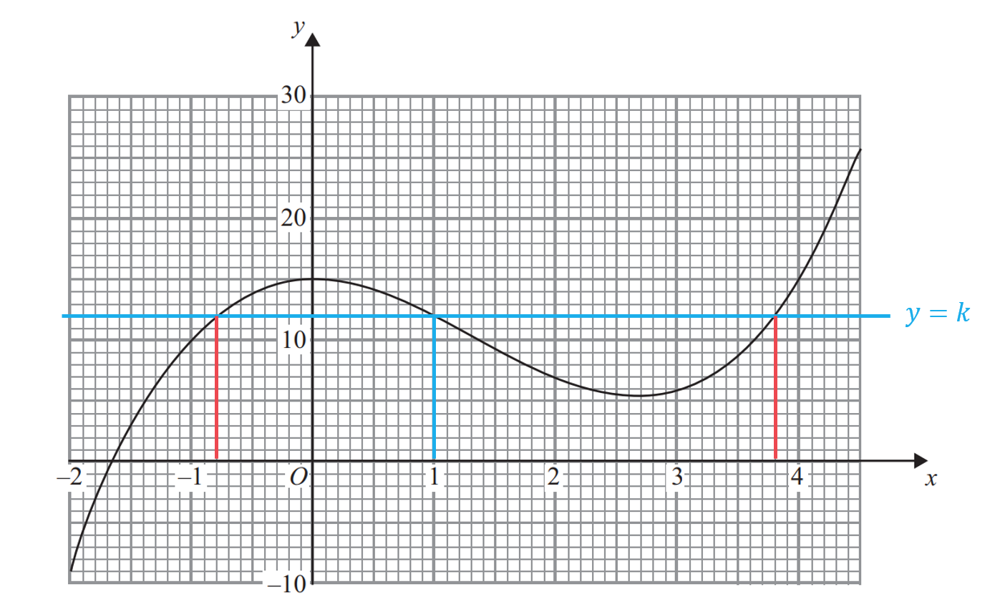

> *Read the values off the **x**- axis from the points where the graphs of *$y=k$* and *`y space equals space straight g open parentheses x close parentheses`* intersect. *

**[1]**

$x=-0.8\mathrm{and}x=3.8$ **[1]**

## Q42 — very_hard — 9 marks · exam-questions

### 1() — 1 marks
> *The value of *`straight f open parentheses 0 close parentheses`* is the **y **value when the **x **value is 0.*

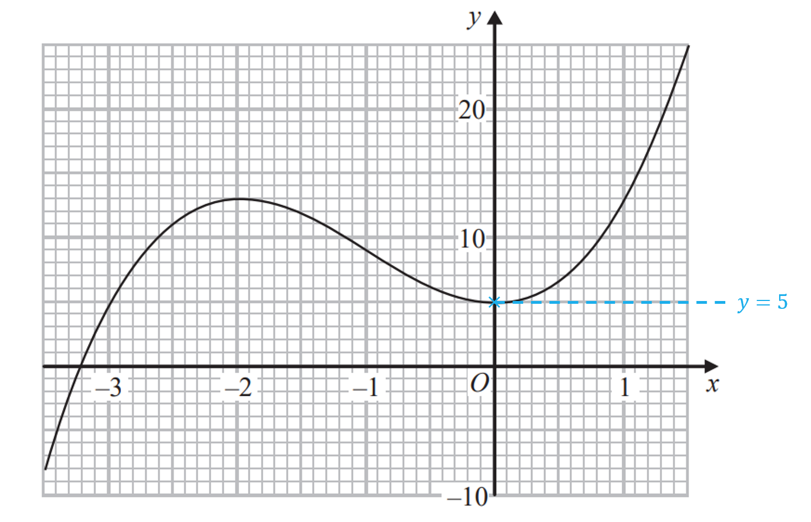

$f(0)=5$* ***[1]**

### 2() — 2 marks
> *There is more than one solution between the local minimum and the local maximum (turning points). *

> *Draw horizontal lines at the turning points on the graph. *

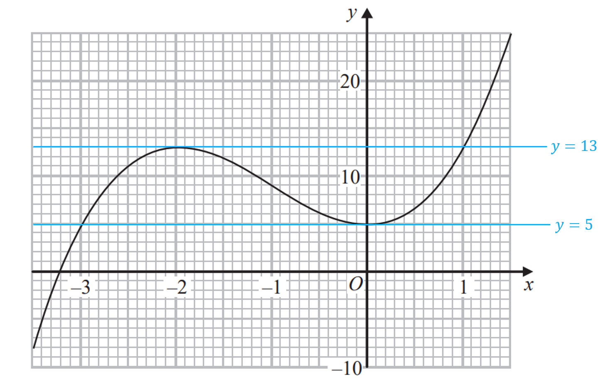

**[1]**

> *There is only one solution below the graph of *$y=5$* and above the graph of *$y=13$*.*

$k<5\mathrm{or}k>13$** [1]**

### 3() — 3 marks
> *An estimate for the gradient can be found by drawing a tangent to the graph at the point where *$x=-2.5.$

> *Draw a right-angled triangle between two coordinates on the tangent.*

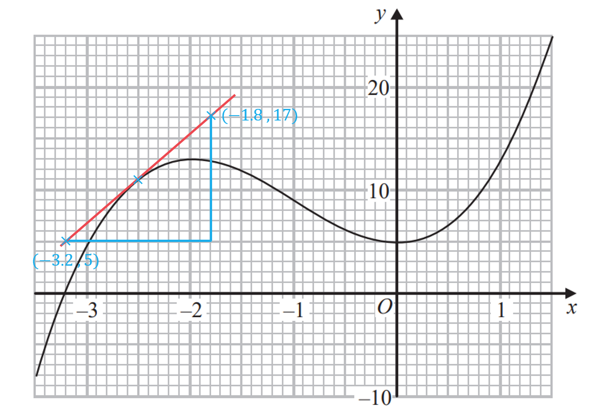

**[1]**

> *Use the two coordinates or the right-angled triangle to calculate the gradient. *

`Gradient space equals space rise over run space equals space fraction numerator 17 space minus space 5 over denominator open parentheses negative 1.8 close parentheses space minus space open parentheses negative 3.2 close parentheses end fraction`

**[1]**

> *Use your calculator to find the answer, be careful with the negative numbers on the denominator.*

$\mathrm{Gradient}=\frac{12}{1.4}=8.57142...$

$\mathrm{Approximately}8.6$**[1]**

### 4() — 1 marks
> *The domain is the set of values that can be input into the function.*

*You cannot divide by zero.*

> *The set of inputs must ensure that the expression on the denominator is not zero.  *

> *The values of *$x$* that must be excluded are found by solving  *$2+x=0$*.*

$2+x=0$

$x\neq-2$* ***[1]**

### 5() — 2 marks
*fg(-3) means f(g(-3)).*

> *Find g(-3) by substituting **x** = -3 into g(**x**). *

`table row cell straight g open parentheses negative 3 close parentheses space end cell equals cell space fraction numerator 1 over denominator 2 space plus space open parentheses negative 3 close parentheses end fraction space equals fraction numerator space 1 over denominator 2 space minus space 3 end fraction space equals fraction numerator space 1 over denominator negative 1 end fraction space equals space minus 1 end cell end table`

**[1]**

*If g(-3) = -1 then f(g(-3)) = f(-1).*

> *Find f(-1) by drawing a line to the graph of f(**x**) from *$x=-1$* and reading the **y** value from the graph. *

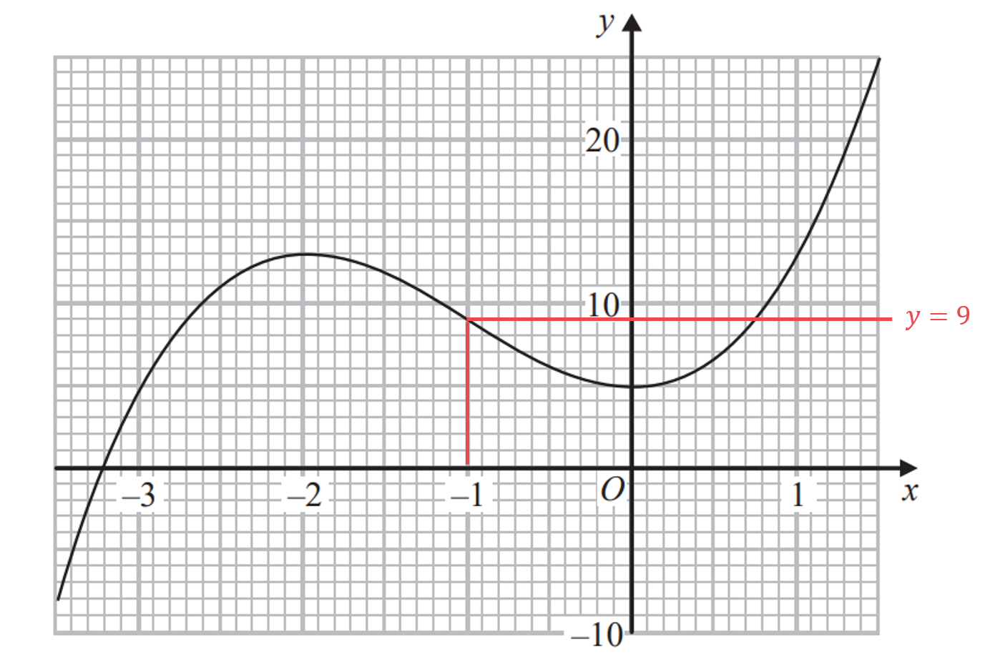

$\mathrm{fg}(-3)=9$* ***[1]**

## Q43 — very_hard — 5 marks · exam-questions

### 25((a)) — 4 marks
> *Finding the inverse of a quadratic function requires completing the square.*

> *Write the function in the form *$y=5+6x-x^{2}$*, rearrange to normal quadratic form and then swap the *$x$* and *$y.$*  *

$y=-x^{2}+6x+5\,x=-y^{2}+6y+5$

> *Rearrange **the expression to make *$y$* the subject again by first completing the square.*

> *Completing the square is easiest when dealing with a single, positive **y**2** term, so take a factor of -1.*

*This is only necessary for the **y**2** and **y** terms so leave 5 as it is.*

`negative y to the power of 2 space end exponent plus space 6 y space plus space 5 space equals space minus open parentheses y squared space minus space 6 y close parentheses space plus space 5`

> *Complete the square for the part in brackets.*

`negative open parentheses y squared space minus space 6 y close parentheses space plus space 5 space equals space minus open square brackets open parentheses y space minus space 3 close parentheses squared space space minus space 9 close square brackets space plus space 5`

**[1]**

> *Expand and rearrange into the required completed square form.*

`table row cell negative open square brackets open parentheses y space plus space 3 close parentheses squared space space minus space 9 close square brackets space plus space 5 space end cell equals cell space minus open parentheses y space plus space 3 close parentheses squared space plus space 9 space plus space 5 end cell row blank equals cell space 14 space minus space open parentheses y space plus space 3 close parentheses squared end cell end table`

**[1]**

> *Set equal to *$x$* and rearrange to make *$y$* the subject.*

`x space equals space 14 space minus space open parentheses y space minus space 3 close parentheses squared space`

> *Rearrange **the expression to make *$y$* the subject again.*

`table row cell x space minus space 14 space end cell equals cell space minus open parentheses y space minus space 3 close parentheses squared end cell row cell 14 space minus space x space end cell equals cell space open parentheses y space minus space 3 close parentheses squared end cell row cell y space minus space 3 space end cell equals cell space plus-or-minus square root of 14 space minus space x end root end cell row cell y space end cell equals cell 3 space plus-or-minus space square root of 14 space minus space x end root space end cell end table`

**[1]**

*The domain of g is *`open curly brackets x space colon space x greater or equal than 3 close curly brackets`* so this must be the range of the inverse, taking the positive square root will give *$y\geq3$*.*

> *Rewrite using the correct notation as instructed in the question.*

`bold g to the power of bold minus bold 1 end exponent bold space bold colon bold space bold x bold space bold rightwards arrow from bar bold space bold 3 bold space bold plus square root of bold 14 bold space bold minus bold space bold italic x end root` **[1]**

### 25((b)) — 1 marks
> *The domain of g**-1** is the set of values that can be input into the function.*

*You cannot square root a negative number.*

> *The set of inputs must ensure that the expression under the square root is not a negative number.  *

> *The values of *$x$* that must be excluded are found by solving  *$14-x\geq0$*.*

`table row cell 14 space minus space x space end cell greater or equal than cell space 0 end cell row cell 14 space end cell greater or equal than cell space x end cell end table`

`equation`**[1]**

## Q44 — very_hard — 4 marks · exam-questions

### 23() — 4 marks
*Find the function h(**x**) by finding the composite function fg(**x**), where fg(**x**) means f(g(**x**)).*

> *Write the algebraic expression for g(**x**) inside f(...).*

`straight h open parentheses x close parentheses space equals space straight f open parentheses straight g open parentheses x close parentheses close parentheses equals straight f open parentheses x squared space minus 12 x close parentheses` * *

> *Find *`straight f open parentheses x squared minus 12 x close parentheses`* by replacing the **x**'s in f(**x**) with the brackets *`open parentheses x squared minus 12 x close parentheses`*.*

`straight h open parentheses x close parentheses space equals space straight f open parentheses x squared minus 12 x close parentheses space equals space open parentheses x squared minus 12 x close parentheses space plus space 25 space equals space x squared space minus 12 x space plus 25`

**[1]**

> *Find the inverse of h(**x**) by completing the square.*

> *Write the function in the form *`y space equals space straight h open parentheses x close parentheses`* and then swap the *$x$* and *$y.$

$y=x^{2}-12x+25\,x=y^{2}-12y+25$

> *Rearrange **the expression to make *$y$* the subject again by first completing the square. *

> *The formula for completing the square for a quadratic in the form*$x^{2}+bx+c$*is*`space space open parentheses x space plus space b over 2 close parentheses squared space space minus space open parentheses b over 2 close parentheses squared space plus space c`*.*

> *Complete the square by dividing the middle term (-12) by 2.*

`table row cell y squared space minus space 12 y space plus space 25 space end cell equals cell space open parentheses y space minus space 12 over 2 close parentheses to the power of 2 space end exponent minus open parentheses 12 over 2 close parentheses squared space plus space 25 space end cell row blank equals cell space open parentheses y space minus space 6 close parentheses squared space minus space 6 squared space plus space 25 end cell end table`

**Correct first step to complete square**** [1]**

> *Simplify.*

`table row cell open parentheses y space minus space 6 close parentheses squared space minus space 6 squared space plus space 25 space end cell equals cell space open parentheses y space minus space 6 close parentheses squared space minus space 36 space plus space 25 space end cell row blank equals cell space open parentheses y space minus space 6 close parentheses squared space minus space 11 end cell end table`

> *Set equal to *$x$* and rearrange to make *$y$* the subject.*

`x space equals space open parentheses y space minus space 6 close parentheses squared space minus space 11`

> *Rearrange **the expression to make *$y$* the subject again.*

`table row cell x space plus space 11 space end cell equals cell space open parentheses y space minus space 6 close parentheses squared end cell row cell y space minus space 6 space end cell equals cell space plus-or-minus square root of x space plus space 11 end root end cell row cell y space end cell equals cell plus-or-minus square root of x space plus space 11 end root space plus space 6 end cell row cell y space end cell equals cell space 6 space plus-or-minus square root of x space plus space 11 end root end cell end table`

**[1]**

> *The domain of h(**x**) is *$x\leq6$* so this must be the range of the inverse, taking the negative square root will give *$y\leq6$*. *

> *Rewrite using the correct notation for an inverse function.*

$h^{-1}(x)=6-\sqrt{x+11}$ **[1]**

## Q45 — very_hard — 6 marks · exam-questions

### 24((a)) — 2 marks
> *To find the value of *`fg open parentheses 2 close parentheses`*, put the output of *`straight g open parentheses 2 close parentheses`* into *`straight f open parentheses x close parentheses`*. *

> *Find the value of *`straight g open parentheses 2 close parentheses`* by substituting 2 into *`straight g open parentheses x close parentheses`*.*

`straight g left parenthesis 2 right parenthesis space equals space 7 open parentheses 2 close parentheses space minus 6 space equals space 14 space minus space 6 space equals space 8`

**[1]**

> *The output of *`straight g open parentheses 2 close parentheses`* is 8. *

> *Substitute this into the expression for *`straight f open parentheses x close parentheses`*.*

`table row cell straight f open parentheses 8 close parentheses space end cell equals cell space 5 open parentheses 8 close parentheses squared space minus 10 open parentheses 8 close parentheses space plus 7 space end cell row blank equals cell space 5 cross times 64 space minus space 80 space plus space 7 end cell row blank equals cell space 320 space minus space 80 space plus space 7 end cell end table`

$\mathrm{fg}(8)=247$* ***[1]**

### 24((b)) — 4 marks
> *Finding the inverse of a quadratic function requires completing the square.*

> *Write the function in the form *`y space equals space straight f open parentheses x close parentheses`* and then swap the *$x$* and *$y.$

$y=5x^{2}-10x+7\,x=5y^{2}-10y+7$

> *Rearrange **the expression to make *$y$* the subject again by first completing the square.*

> *To complete the square, first factorise 5 from the first two terms, then complete the square on the terms inside the brackets.*

`table row cell x space end cell equals cell space 5 y squared space minus space 10 y space plus space 7 space equals space 5 open parentheses y squared space minus space 2 y close parentheses plus 7 end cell end table`

** [1]**

> *Complete the square on the terms inside the brackets.*

`table row cell x space end cell equals cell space 5 open square brackets open parentheses y space minus space 1 close parentheses squared space minus space 1 squared close square brackets space plus space 7 space end cell row blank equals cell space 5 open parentheses y space minus space 1 close parentheses squared space minus 5 open parentheses 1 squared close parentheses space plus 7 end cell row blank equals cell space 5 open parentheses y space minus space 1 close parentheses squared space minus space 5 space plus space 7 end cell row blank equals cell space 5 open parentheses y space minus space 1 close parentheses squared space plus space 2 end cell end table`

**Correct first step to complete square**** [1]**

> *Rearrange to make *$y$* the subject by first dividing by 5.*

`table row cell x space minus space 2 space end cell equals cell space 5 open parentheses y space minus space 1 close parentheses squared end cell row cell fraction numerator x space minus space 2 over denominator 5 end fraction space end cell equals cell space open parentheses y space minus space 1 close parentheses squared end cell end table`

**[1]**

> *Take the square root of both sides, remember a square root could be positive or negative.*

`table row cell space y space minus space 1 space end cell equals cell plus-or-minus square root of fraction numerator x space minus space 2 over denominator 5 end fraction end root space end cell row cell y space end cell equals cell 1 plus-or-minus square root of fraction numerator x space minus space 2 over denominator 5 end fraction end root space end cell end table`

> *The domain of f(x) is *$x\geq1$* so this must be the range of the inverse, taking the positive square root will give *$y\geq1$*. *

> *Rewrite using the correct notation for an inverse function.*

$f^{-1}(x)=1+\sqrt{\frac{x-2}{5}}$ **[1]**

## Q46 — very_hard — 5 marks · exam-questions

### 21() — 5 marks
*Find the function h(**x**) by finding the composite function fg(**x**), where fg(**x**) means f(g(**x**)).*

> *Write the algebraic expression for g(**x**) inside f(...).*

`straight h open parentheses x close parentheses space equals space straight f open parentheses straight g open parentheses x close parentheses close parentheses equals straight f open parentheses x plus 3 close parentheses` * *

> *Find *`straight f open parentheses x plus 3 close parentheses`* by replacing the **x**'s in f(**x**) with the brackets *`open parentheses x plus 3 close parentheses`*.*

`table row cell straight h open parentheses x close parentheses space end cell equals cell space straight f open parentheses x plus 3 close parentheses space end cell row blank equals cell space open parentheses x plus 3 close parentheses squared minus 2 open parentheses x plus 3 close parentheses end cell row space equals cell space x squared space plus 6 x plus 9 minus 2 x minus 6 end cell row blank equals cell x squared plus 4 x plus 3 end cell end table`

**substituting x + 3 into f(x) ****[1]**

**correct simplified expression**** [1]**

> *Finding the inverse of h(**x**) will require completing the square*

> *First, write the function in the form *`y space equals space straight h open parentheses x close parentheses`* and then swap the** x** and **y*

$y=x^{2}+4x+3\,x=y^{2}+4y+3$

> *Rearrange** **the expression to make *$y$* the subject again by completing the square *

> *The formula for completing the square for a quadratic in the form*$x^{2}+bx+c$*is*`space space open parentheses x space plus space b over 2 close parentheses squared space space minus space open parentheses b over 2 close parentheses squared space plus space c`*.*

> *Completing the square requires dividing the middle term, 4, by 2*

`table row cell y squared space plus space 4 y space plus space 3 space end cell equals cell space open parentheses y space plus fraction numerator space 4 over denominator 2 end fraction close parentheses to the power of 2 space end exponent minus open parentheses 4 over 2 close parentheses squared space plus space 3 space end cell row blank equals cell space open parentheses y space plus space 2 close parentheses squared space minus space 2 squared space plus space 3 end cell end table`

**[1]**

> *Simplify*

`table row cell open parentheses y space plus space 2 close parentheses squared space minus space 2 squared space plus space 3 space end cell equals cell space open parentheses y space plus space 2 close parentheses squared space minus space 4 space plus space 3 end cell row blank equals cell space open parentheses y space plus space 2 close parentheses squared space minus space 1 end cell end table`

> *Set equal to *$x$* and rearrange to make *$y$* the subject*

`x space equals space open parentheses y space plus space 2 close parentheses squared space minus space 1`

> *Rearrange** **the expression to make *$y$* the subject again*

`table row cell x space plus space 1 space end cell equals cell space open parentheses y space plus space 2 close parentheses squared end cell row cell y space plus space 2 space end cell equals cell space plus-or-minus square root of x space plus space 1 end root end cell row cell y space end cell equals cell plus-or-minus square root of x space plus space 1 end root space minus space 2 end cell row cell y space end cell equals cell space minus 2 space plus-or-minus square root of x space plus space 1 end root end cell end table`

**[1]**

> *The domain of h(**x**) is *$x\geq-2$* so this must be the range of the inverse, taking the positive square root will give *$y\geq-2$* *

> *Rewrite using the correct notation for an inverse function*

$h^{-1}(x)=-2+\sqrt{x+1}$ **[1]**

## Q47 — very_hard — 7 marks · exam-questions

### 27((a)) — 2 marks
> *Rearrange the quadratic expression into the order **ax**2** + **bx** + **c**  *

*-***x***2** + 6***x*** + 5**  *

*Completing the square is easiest when dealing with a single positive **x**2** term, so take out a factor of -1*

> *This is only necessary for the x**2** and **x** terms so leave 5 as it is  *

`negative x to the power of 2 space end exponent plus space 6 x space plus space 5 space equals space minus open parentheses x squared space minus space 6 x close parentheses space plus space 5`

> *Complete the square for the part in brackets  *

`negative open parentheses x squared space minus space 6 x close parentheses space plus space 5 space equals space minus open square brackets open parentheses x space minus space 3 close parentheses squared space space minus space 9 close square brackets space plus space 5`

**[1]**

> *Expand and rearrange into the required completed square form.*

`table row cell negative open square brackets open parentheses x space minus space 3 close parentheses squared space space minus space 9 close square brackets space plus space 5 space end cell equals cell space minus open parentheses x space minus space 3 close parentheses squared space plus space 9 space plus space 5 end cell row blank equals cell space 14 space minus space open parentheses x space minus space 3 close parentheses squared end cell end table`

> *This is in the form **p** - (**x** - **q**)**2** where **p** = 14 and **q** = 3*

$14-(x-3)^{2}$* ***[1]**

### 27((b)) — 5 marks
> *Use the result in part (a) to rewrite *`straight f open parentheses x close parentheses equals space 5 space plus space 6 x space minus space x squared`*  *

`straight f open parentheses x close parentheses equals 14 minus open parentheses x minus 3 close parentheses squared`

> *To find the inverse function, first write f(x) as** y**  *

> `y equals 14 minus open parentheses x minus 3 close parentheses squared`*  *

> *Then, without rearranging, swap the **x** and **y **around  *

`x space equals space 14 space minus space open parentheses y space minus space 3 close parentheses squared space`

> *Rearrange** **the expression to make *$y$* the subject again*

`table row cell x space minus space 14 space end cell equals cell space minus open parentheses y space minus space 3 close parentheses squared end cell row cell 14 space minus space x space end cell equals cell space open parentheses y space minus space 3 close parentheses squared end cell row cell y space minus space 3 space end cell equals cell space plus-or-minus square root of 14 space minus space x end root end cell row cell y space end cell equals cell 3 space plus-or-minus space square root of 14 space minus space x end root space end cell end table`

**first two lines of working**** [1]**

**last two lines of working**** [1]**

> *The domain of g is *$x\leq3$* so this must be the range of the inverse, taking the negative square root will give *$y\leq3$*. *

> *Replace **y** with f**-1**(**x**)  *

`straight f to the power of negative 1 end exponent open parentheses x close parentheses equals 3 minus square root of 14 minus x end root`

**[1]**

> *To ensure  f**-1**(**x**) is always positive, set the inverse function above to be > 0 and solve the inequality  *

$3-\sqrt{14-x}>0\,3>\sqrt{14-x}\,9>14-x\,x>14-9\,x>5$

**method for solving the inequality ****[1]**

> *So x > 5 gives f**-1**(**x**) > 0 *

> *But the *$\sqrt{14-x}$* part in f**-1**(**x**) will become the square-root of a negative if **x** becomes too big (problems arise if **x**  > 14)  *

**5 < x ≤ 14** **[1]**

## Q48 — very_hard — 5 marks · exam-questions

### 23((a)) — 1 marks
> *The range of an inverse function is the same set of values as the domain of the original function*

**g****-1****(****x****) ≥ -3 ****[1]**

**y****  ≥ -3 is also accepted, but ****x**** ≥ -3 is not (****x**** is only for domains)**

### 23((b)) — 4 marks
> *Finding the inverse of g(**x**) will require completing the square*

> *First, write the function in the form *`y space equals space straight g open parentheses x close parentheses`* and then swap the **x** and **y*

$y=x^{2}+6x\,x=y^{2}+6y$

> *Rearrange** **the expression to make *$y$* the subject again by completing the square *

> *The formula for completing the square for a quadratic in the form*$x^{2}+bx+c$*is*`space space open parentheses x space plus space b over 2 close parentheses squared space space minus space open parentheses b over 2 close parentheses squared space plus space c`*.*

> *Completing the square requires dividing the middle term, 6, by 2*

`table row cell y squared space plus space 6 y space end cell equals cell space open parentheses y space plus fraction numerator space 6 over denominator 2 end fraction close parentheses to the power of 2 space end exponent minus open parentheses 6 over 2 close parentheses squared end cell row blank equals cell space open parentheses y space plus space 3 close parentheses squared space minus space 3 squared end cell end table`

**[1]**

> *Simplify*

`table row cell open parentheses y space plus space 3 close parentheses squared space minus space 3 squared space end cell equals cell space open parentheses y space plus space 3 close parentheses squared space minus space 9 end cell end table`**  **

> *Set equal to *$x$* and rearrange to make *$y$* the subject*

`x space equals space open parentheses y space plus space 3 close parentheses squared space minus space 9`

> *Rearrange** **the expression to make *$y$* the subject again*

`table row cell x space plus space 9 space end cell equals cell space open parentheses y space plus space 3 close parentheses squared end cell row cell y space plus space 3 space end cell equals cell space plus-or-minus square root of x space plus space 9 end root end cell row cell y space end cell equals cell plus-or-minus square root of x space plus space 9 end root space minus space 3 end cell row cell y space end cell equals cell space minus 3 space plus-or-minus square root of x space plus space 9 end root end cell end table`

**first line of working correct**** [1]**

**second line of working correct**** [1]**

> *The domain of g(**x**) is *$x\geq-3$* so this must be the range of the inverse, taking the positive square root will give *$y\geq-3$* *

> *Rewrite using the notation asked for in the question*

$g^{-1}:x\rightarrow-3+\sqrt{x+9}$ **[1]**

## Q49 — very_hard — 6 marks · exam-questions

### 26((a)) — 3 marks
*Method 1*

*Find the inverse function, f**-1**(**x) **by first replacing f(**x**) with **y* * *

$y=\frac{\sqrt{x^{2}+k^{2}}}{x}$ * *

*Without rearranging the equation, swap the **x**'s and **y**'s* * *

$x=\frac{\sqrt{y^{2}+k^{2}}}{y}$

*Now make **y** the subject of this new equation (for example, by squaring both sides then multiplying both sides by y**2**)* * *

`table attributes columnalign right center left columnspacing 0px end attributes row cell x squared end cell equals cell fraction numerator y squared plus k squared over denominator y squared end fraction end cell row cell x squared y squared end cell equals cell y squared plus k squared end cell row cell x squared y squared minus y squared end cell equals cell k squared end cell row cell y squared open parentheses x squared minus 1 close parentheses end cell equals cell k squared end cell row cell y squared end cell equals cell fraction numerator k squared over denominator x squared minus 1 end fraction end cell end table`

**[1]**

> *Square-root both sides  *

> $y=\pm\sqrt{\frac{k^{2}}{x^{2}-1}}$*   *

*The sign on the right-hand side must be chosen to give us f**-1**(**x**) The domain of f(**x**) is all positive values (**x** > 0) so the range of f**-1**(**x**) must be all positive values (take the positive square root)*

`straight f to the power of negative 1 end exponent open parentheses x close parentheses equals square root of fraction numerator k squared over denominator x squared minus 1 end fraction end root`

*Create the equation* *f**-1**(**x**) = **k **by substituting **x** = **p** into f**-1**(**x**) and setting it equal to **k**  *

$\sqrt{\frac{k^{2}}{p^{2}-1}}=k$

**[1]**

> *Solve this equation for **p** (make **p** the subject)  *

`table row cell fraction numerator k squared over denominator p squared minus 1 end fraction end cell equals cell k squared end cell row cell up diagonal strike k squared end strike end cell equals cell up diagonal strike k squared end strike open parentheses p squared minus 1 close parentheses end cell row 1 equals cell p squared minus 1 end cell row 2 equals cell p squared end cell row cell plus-or-minus square root of 2 end cell equals p end table`

> * *

> *p** is an input of the inverse function, which makes it an output of the original function, and all outputs are positive in this question (the domain of f is **x** > 0 which makes *$\frac{\sqrt{x^{2}+k^{2}}}{x}$* positive) **p** must therefore be positive, so choose the positive square root*

$p=\sqrt{2}$* ***[1]**

*Method 2*** **

*Apply the function f to both sides of the equation f**-1**(**p**) = **k* * *

`ff to the power of negative 1 end exponent open parentheses p close parentheses equals straight f open parentheses k close parentheses` * *

> *The input **p **on the left first goes through the function f**-1**, but then has this immediately "undone" by going through the function f *

*The f and the f**-1** cancel each other out (they are inverses of each other)* * *

`p equals straight f open parentheses k close parentheses`

**[1]*** *

*Find f(**k**) by substituting **x** = **k** into f(**x**)*

$p=\frac{\sqrt{k^{2}+k^{2}}}{k}$

**[1]**

*Simplify the right-hand side*

`p equals fraction numerator square root of 2 k squared end root over denominator k end fraction
p equals fraction numerator square root of 2 space up diagonal strike k over denominator up diagonal strike k end fraction`

$p=\sqrt{2}$ **[1]**

### 26((b)) — 3 marks
*gf(**a**) means g(f(**a**))*

*Find f(**a**) by substituting **x** = **a** into f(**x**)* * *

> `straight f open parentheses a close parentheses equals fraction numerator square root of a squared plus k squared end root over denominator a end fraction`*  *

*Now substitute *$x=\frac{\sqrt{a^{2}+k^{2}}}{a}$* into g(**x**) and simplify* * *

`table attributes columnalign right center left columnspacing 0px end attributes row cell gf open parentheses a close parentheses end cell equals cell open parentheses fraction numerator square root of a squared plus k squared end root over denominator a end fraction close parentheses squared end cell row blank equals cell fraction numerator a squared plus k squared over denominator a squared end fraction end cell end table`

**[1]**

*Set this equal to **k** and solve to find **a** (make **a** the subject)* * *

`table attributes columnalign right center left columnspacing 0px end attributes row cell fraction numerator a squared plus k squared over denominator a squared end fraction end cell equals k row cell a squared plus k squared end cell equals cell k a squared end cell row cell k squared end cell equals cell k a squared minus a squared end cell end table`

**[1]**

*Factorise out **a**2** on the right-hand side to continue* * *

`table row cell k squared end cell equals cell a squared open parentheses k minus 1 close parentheses end cell row cell fraction numerator k squared over denominator k minus 1 end fraction end cell equals cell a squared end cell row cell plus-or-minus square root of fraction numerator k squared over denominator k minus 1 end fraction end root end cell equals a end table` * *

*k** > 1 so the denominator *$\sqrt{k-1}$* never square roots a negative number, and the numerator can be simplified using *$\sqrt{k^{2}}=k$ * *

$\pm\frac{k}{\sqrt{k-1}}=a$

> * *

> *The first line required substituting **a** into f(**x**), but only positive values can be substituted into f(**x**) as the domain is **x** > 0, so **a** must be a positive value (choose the positive square root)*

$a=\frac{k}{\sqrt{k-1}}$* ***[1]**

$\sqrt{\frac{k^{2}}{k-1}}$** is also accepted**

## Q50 — very_hard — 4 marks · exam-questions

### 30() — 4 marks
> *Find *`straight f to the power of negative 1 end exponent open parentheses x close parentheses`* by setting *`straight f open parentheses x close parentheses`* equal to *$y$*, swapping the variables and rearranging to make *$y$* the subject.*

`table row cell y space end cell equals cell space 1 half x end cell row cell x space end cell equals cell space 1 half y end cell row cell y space end cell equals cell space 2 x end cell row cell straight f to the power of negative 1 space end exponent open parentheses x close parentheses space end cell equals cell space 2 x end cell end table`

**[1]**

> `gf open parentheses x close parentheses`* means *`straight g open parentheses straight f open parentheses x close parentheses close parentheses`*. *

> *Find *`gf open parentheses x close parentheses`* by substituting *`straight f open parentheses x close parentheses`* into *`g open parentheses x close parentheses.`*  *

`gf open parentheses x close parentheses equals straight g open parentheses 1 half x close parentheses space equals space open parentheses 1 half x close parentheses space minus space open parentheses 1 half x close parentheses squared space`

**[1]**

> *Set *`gf open parentheses x close parentheses`* equal to*`straight f to the power of negative 1 end exponent open parentheses x close parentheses`*.  *

`space open parentheses 1 half x close parentheses space minus space open parentheses 1 half x close parentheses squared space equals space 2 x`

> *Simplify.  *

$\frac{1}{2}x-\frac{1}{4}x^{2}=2x$

> *Remove the fractions by multiplying every term through by 4.  *

$2x-x^{2}=8x$

> *Form a quadratic equation by bringing all terms to one side.  Adding *$x^{2}$* and subtracting *$2x$* from both sides gives the quadratic in is simplest form.*

$x^{2}+6x=0$

> *Factorise.*

`x open parentheses x space plus space 6 close parentheses equals space 0`

**[1]**

> *Solve.*

> *Remember that *$x=0$* is one solution. *

$x=0\mathrm{and}x=-6$* ***[1]**

## Q51 — very_hard — 5 marks · exam-questions

### 27() — 5 marks
> *Find *`straight f to the power of negative 1 end exponent open parentheses 3 close parentheses`* by setting *`straight f open parentheses x close parentheses`* equal to 3. (This is the easiest way to find the inverse of an input without finding the inverse function first).*

`table row cell fraction numerator 2 x over denominator 5 end fraction space minus space 1 space end cell equals cell space 3 end cell end table`

**[1]**

> *Solve to find the value of *$x$*, this will be the input of *`straight f open parentheses x close parentheses`* that gives the output of 3, which is the same as the output of *`straight f to the power of negative 1 end exponent open parentheses x close parentheses`* when the input is 3. *

`table row cell fraction numerator 2 x over denominator 5 end fraction space end cell equals cell space 4 end cell row cell 2 x space end cell equals cell space 20 end cell row cell x space end cell equals cell space 10 end cell end table`

** Method to solve correct**** [1]**** **

**Answer correct**** [1]**

> *Find *`straight f open parentheses negative 0.5 close parentheses`* by replacing the *$x$* **values in *`straight f open parentheses x close parentheses`* with -0.5 and simplifying.  *

`straight f open parentheses negative 0.5 close parentheses space equals fraction numerator space 2 open parentheses negative 0.5 close parentheses over denominator 5 end fraction space minus space 1 space equals space fraction numerator negative 1 over denominator 5 end fraction space minus space 1 space equals space minus space 0.2 space minus space 1 space equals space minus 1.2`

**[1]**

> *Add *`straight f open parentheses negative 0.5 close parentheses`* to *`straight f to the power of negative 1 end exponent open parentheses 3 close parentheses`*.  *

`straight f to the power of negative 1 end exponent open parentheses 3 close parentheses space plus space straight f open parentheses negative 0.5 close parentheses space equals space 10 space plus space open parentheses negative 1.2 close parentheses`

$f^{-1}(3)+f(-0.5)=8.8$* ***[1]**

## Q52 — very_hard — 3 marks · exam-questions

### 28((a)) — 3 marks
*To find f(2**x**), replace the **x**'s in f(**x**) with 2**x* * *

`straight f open parentheses 2 x close parentheses equals 5 minus 2 x`

**[1]*** *

*To find g(**x** - 1), replace the **x**'s in g(**x**) with (**x** - 1) in brackets* * *

`straight g open parentheses x minus 1 close parentheses equals 3 open parentheses x minus 1 close parentheses plus 7`

**[1]*** *

*Add the two results above* * *

`straight f open parentheses 2 x close parentheses plus straight g open parentheses x minus 1 close parentheses equals 5 minus 2 x plus 3 open parentheses x minus 1 close parentheses plus 7` * *

*Expand and simplified the right-hand side* * *

`table row cell straight f open parentheses 2 x close parentheses plus straight g open parentheses x minus 1 close parentheses end cell equals cell 5 minus 2 x plus 3 x minus 3 plus 7 end cell row blank equals cell 9 plus x end cell end table`

**9 + ****x**** ****[1]**

## Q53 — very_hard — 2 marks · exam-questions

### 27((a)) — 2 marks
*The inverse of cube-rooting is cubing*

`straight h to the power of negative 1 end exponent open parentheses x close parentheses equals x cubed`

[1]

*A sketch of the graph **y **= **x**3** is needed*

*Work out a table of values from **x** = -2 to 2 in step sizes of, say, 1*

| ****x**** | *-2* | *-1* | *0* | *1* | *2* |
|---|---|---|---|---|---|
| ****y**** | *-8* | *-1* | *0* | *1* | *8* |

*Plot the graph on the axes given*

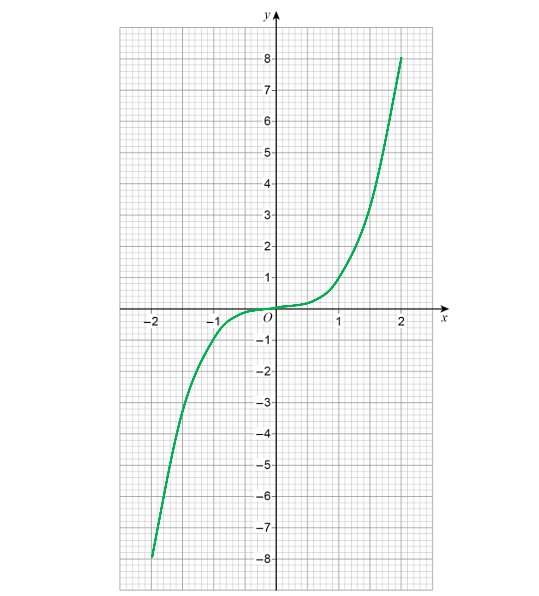

**[1]**

**The curve must go through the points with an accuracy of ±1 small square**

## Q54 — very_hard — 2 marks · exam-questions

### 27((b)) — 2 marks
> *Write the composite function *`y equals fg open parentheses x close parentheses`*.*

`y equals sin open parentheses x plus 90 close parentheses`

> `y equals sin open parentheses x plus 90 close parentheses`* is a translation of *$y=\mathrm{sin}x$* by 90° **left**.*

> *Start by lightly sketching the graph of *$y=\mathrm{sin}x$*. *

> *It should pass through (0, 0), (90, 1), (180, 0), (270, -1) and (360, 0). *

> *Translate these key points 90 left (you can ignore (0, 0) as it will be off the grid). You will need to complete an extra point at (360, 1) by continuing the pattern of the curve.*

> *Join the points with a smooth curve. It should pass through (0, 1), (90, 0), (180, -1), (270, 0) and (360, 1).*

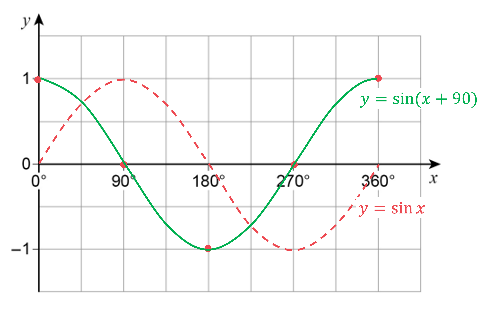

**smooth curve through at least 4 of the points below, or straight lines joining all of the points below ****[1]**

**smooth curve through all of (0, 1), (90, 0), (180, -1), (270, 0) and (360, 1) ****[1]**

**It is best practice to label the curves with their equations. This also makes it clear to the examiner which is your final answer**

## Q55 — very_hard — 4 marks · exam-questions

### 19() — 4 marks
*Let the input be **x*

*Write an expression for the output of **A* * *

$x^{2}+6$

**[1]**

*Write an expression for the output of **B* * *

`open parentheses x minus 3 close parentheses squared` * *

*Set the output of **A** to be less than the output of **B** (using an inequality sign)* * *

`x squared plus 6 less than open parentheses x minus 3 close parentheses squared` * *

*Expand the brackets on the right-hand side* * *

`x squared plus 6 less than open parentheses x minus 3 close parentheses open parentheses x minus 3 close parentheses
x squared plus 6 less than x squared minus 6 x plus 9`

**brackets expanded correctly ****[1]**

*Simplify and solve the inequality* * *

`table row cell up diagonal strike x squared end strike plus 6 end cell less than cell up diagonal strike x squared end strike minus 6 x plus 9 end cell row 6 less than cell negative 6 x plus 9 end cell row cell 6 x end cell less than cell 9 minus 6 end cell row cell 6 x end cell less than 3 row x less than cell 3 over 6 end cell end table`

**6x < 3**** [1]**

$x<\frac{1}{2}$* ***[1]**

## Q56 — very_hard — 3 marks · exam-questions

### 25() — 3 marks
> *You need to form the composite function fg(**x**) from f(**x**) = 2**x** + **c** and g(**x**) = **cx** + 5*

*fg(**x**) is f(g(**x**)), so replace all **x**'s in f(**x**) with (**cx** + 5) in brackets* * *

`fg open parentheses x close parentheses equals 2 open parentheses c x plus 5 close parentheses plus c`

**[1]**

*Expand the right-hand side* * *

`fg open parentheses x close parentheses equals 2 c x plus 10 plus c` * *

*This expression needs to be identical to fg(**x**) = 6**x** + **d*

*For this to be true, the 2**c** in front of the **x** must equal 6 and the 10 + **c** must equal **d* * *

$2c=6$* and** *$10+c=d$

**for 2c = 6 ****[1]**

*Solve the first equation to find **c** and substitute it into the second equation to find **d*

$c=3$ *so* $10+3=d$

**d**** = 13** **[1]**
