# Exam Questions — Graphing Inequalities
**Sequences, Functions & Graphs** · Edexcel IGCSE Maths A (4MA1) — 18/Higher
> Source: [https://www.savemyexams.com/igcse/maths/edexcel/a/18/higher/topic-questions/3-sequences-functions-and-graphs/graphing-inequalities/exam-questions/](https://www.savemyexams.com/igcse/maths/edexcel/a/18/higher/topic-questions/3-sequences-functions-and-graphs/graphing-inequalities/exam-questions/) · 32 questions · total 121 marks

## Q1 — easy — 3 marks · exam-questions

### 7() — 3 marks — command: write — structured — from paper Jan 2021 · 4MA1/1HR
The shaded region $R$, shown in the diagram below, is bounded by the straight line with equation $y=3x--2$ and by two other straight lines.

Write down the three inequalities that define region $R$.

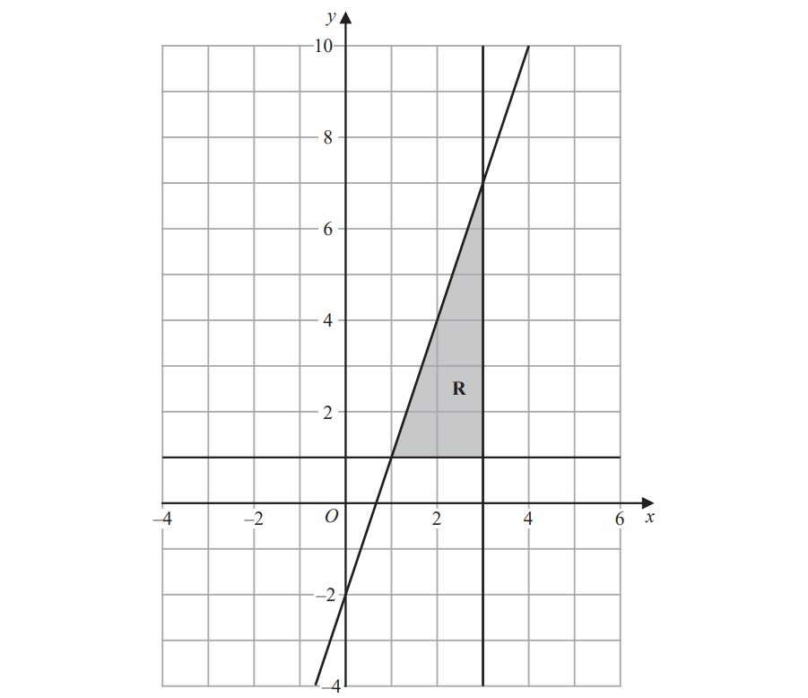

## Q2 — easy — 3 marks · exam-questions

### 15() — 3 marks — command: label — structured — from paper Nov 2020 · 4MA1/2HR
Show, by shading on the grid, the region that satisfies all three of the inequalities

$x\leq4\mathrm{and}y\geq--2\mathrm{and}y\leqx$

Label the region $R.$

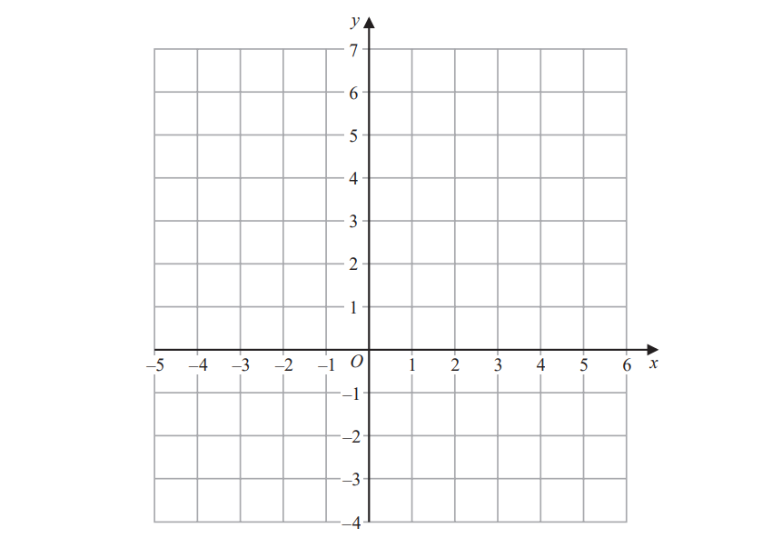

## Q3 — easy — 2 marks · exam-questions

### 10((b)) — 2 marks — command: write — structured — from paper June 2019 · 4MA1/2H
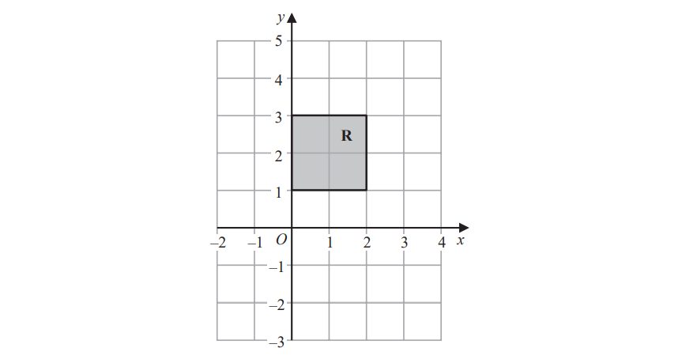

The region $R$,  shown shaded in the diagram, is bounded by four straight lines.

Write down the inequalities that define $R$.

## Q4 — easy — 3 marks · exam-questions

### 12((b)) — 3 marks — command: draw — structured — from paper June 2018 · 4MA1/1H
The diagram shows two straight lines drawn on a grid.

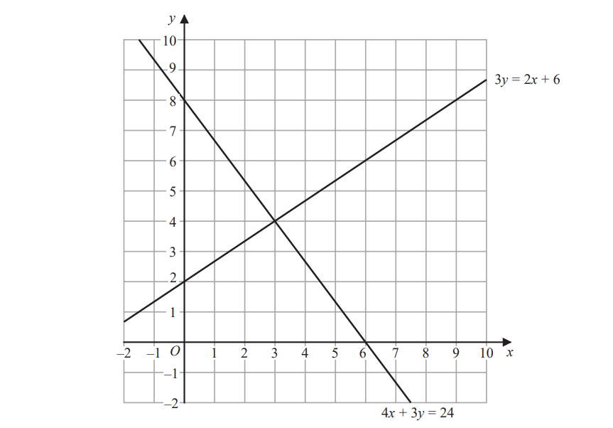

Show, by shading on the grid, the region defined by all five of the inequalities

| `x space greater-than or slanted equal to space 0` | `y space greater-than or slanted equal to space 0` | `x space plus space y space greater-than or slanted equal to space 4` | `3 y space less-than or slanted equal to space 2 x space plus space 6` | `4 x space plus space 3 y space less-than or slanted equal to space 24` |
|---|---|---|---|---|

Label the region $R$.

## Q5 — easy — 3 marks · exam-questions

### 7((b)) — 3 marks — command: draw — structured — from paper Jan 2022 · 4MA1/2HR
Show, by shading on the grid, the region defined by **all three** of the inequalities

| `x space less-than or slanted equal to space 6` | `y space greater-than or slanted equal to space 2` | `y space less-than or slanted equal to space x space plus space 1` |
|---|---|---|

Label the region $R$

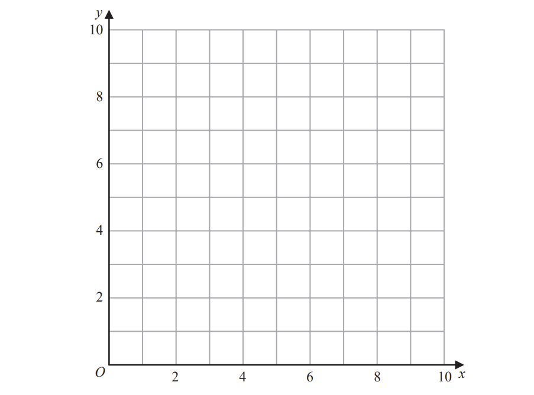

## Q6 — easy — 1 marks · exam-questions

### 19() — 1 mark — command: which — structured — from paper Nov 2020 · 8300/3H
The sketch shows the lines $x=1$ and $y=--3$

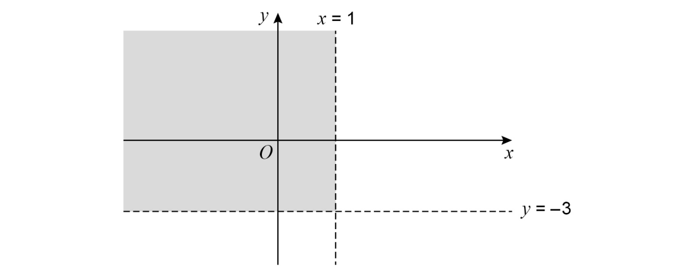

Which pair of inequalities describes the shaded region? Tick **one** box.

| `square` | $x<1\mathrm{and}y<--3$ |
|---|---|
| `square` | $x<1\mathrm{and}y>--3$ |
| `square` | $x>1\mathrm{and}y>--3$ |
| `square` | $x>1\mathrm{and}y<--3$ |

## Q7 — easy — 2 marks · exam-questions

### 23() — 2 marks — structured — from paper Nov 2017 · 8300/3H
Joe draws this graph to identify the region $R$ represented by

`y space less-than or slanted equal to space x space plus space 2`    and    $y>3--x$    and    $x<3$

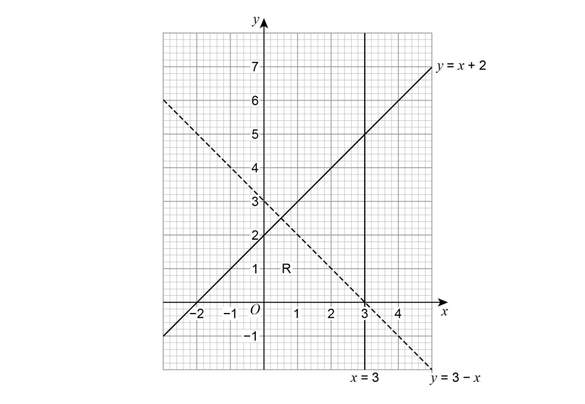

Make **two** criticisms of his graph.

## Q8 — easy — 2 marks · exam-questions

### 11() — 2 marks — command: find — structured — from paper 2020 Oct/Nov · 0580/02
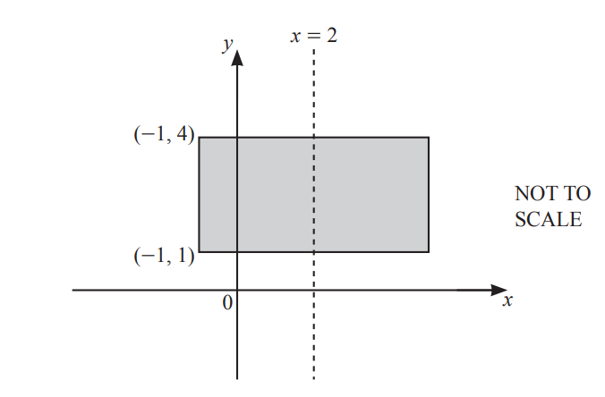

The diagram shows a rectangle with a line of symmetry at $x=2$. Two vertices of the rectangle are at $(-1,1)$ and $(-1,4)$.

The shaded region is defined by the inequalities $a\leqx\leqb$ and $c\leqy\leqd$ .

Find the values of $a,b,c$ and $d$.

$a=$ ................................................

$b=$ ................................................

$c=$ ................................................

$d=$ ................................................

## Q9 — easy — 5 marks · exam-questions

### 24() — 5 marks — command: draw — structured — from paper 2019	May/June · 0580/23
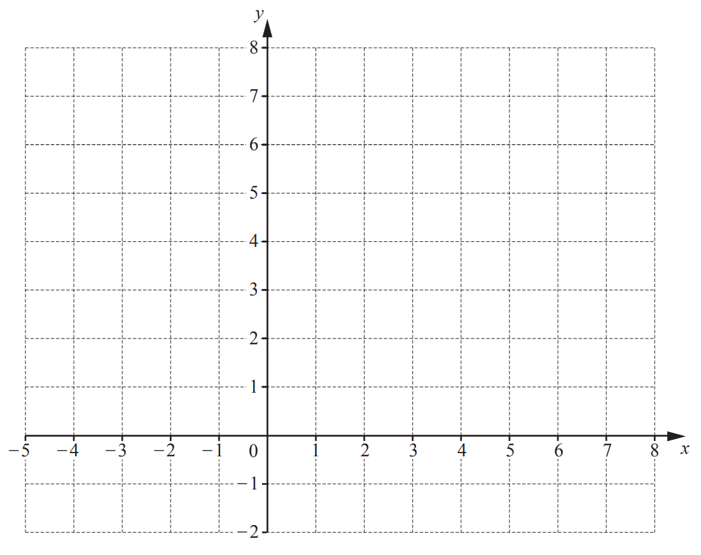

By shading the **unwanted **regions of the grid, draw and label the region $R$ which satisfies the following three inequalities.

| $y\leq2$ | $x<3$ | $y\leqx+4$ |
|---|---|---|

## Q10 — easy — 3 marks · exam-questions

### 14() — 3 marks — command: find — structured — from paper 2018	Oct/Nov · 0580/22
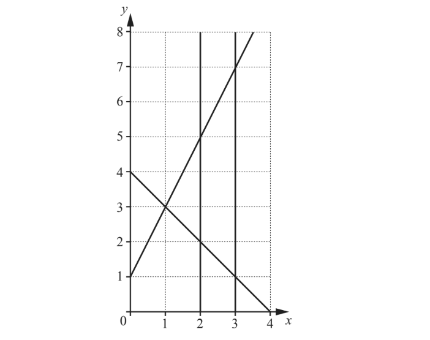

By shading the **unwanted** regions of the grid, find and label the region *R* that satisfies the following four inequalities.

$x\leq3x\geq2y\leq2x+1y\geq4-x$

## Q11 — medium — 3 marks · exam-questions

### 17() — 3 marks — structured — from paper November 2012 · 1MA0/1H
The lines $y=x---2$ and $x+y=10$ are drawn on the grid.

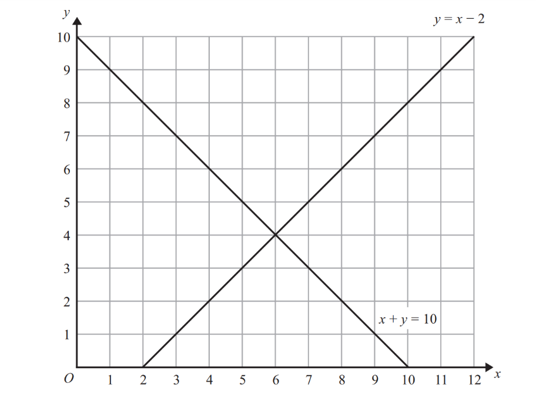

On the grid, mark with a cross (x) each of the points with integer coordinates that are in the region defined by

$y>x-2\,x+y<10\,x>3$

## Q12 — medium — 4 marks · exam-questions

### 13() — 4 marks — command: write — structured — from paper June 2017 · 1MA1/3H
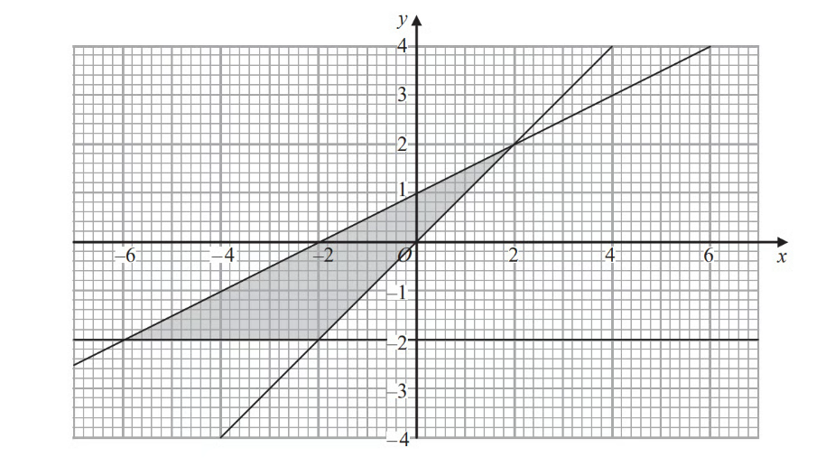

Write down the three inequalities that define the shaded region.

## Q13 — medium — 3 marks · exam-questions

### 1() — 3 marks — command: label — structured — from paper SME Topic Papers · 4MA1/Inequalities QP1
Show, by shading on the grid, the region defined by all three of the inequalities

`x less-than or slanted equal to space 5
y space greater-than or slanted equal to space 3
y space less or equal than space x`

Label your region $R$.

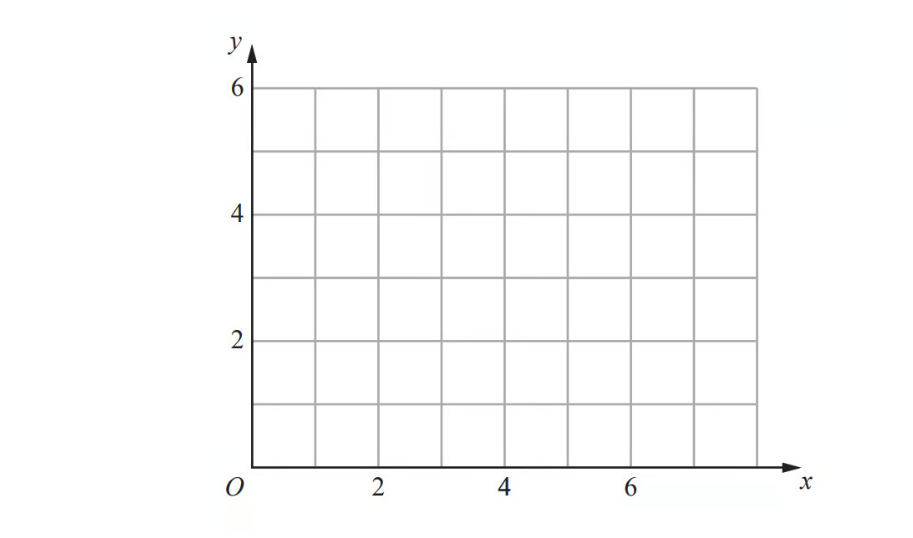

## Q14 — medium — 4 marks · exam-questions

### 4((a)) — 3 marks — command: draw — structured — from paper Jan 2021 · 4MA1/2H
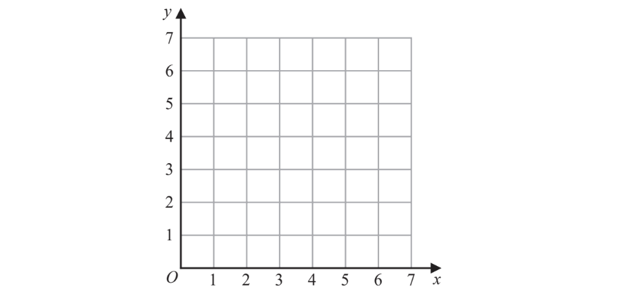

On the grid, draw and **label **the straight line with equation

(i)    $x=1.5$

[1]

(ii)    $y=x$

[1]

(iii)    $x+y=6$

[1]

### 4((b)) — 1 mark — command: label — structured — from paper Jan 2021 · 4MA1/2H
Show, by shading on the grid, the region that satisfies **all three** of the inequalities

`x greater-than or slanted equal to 1.5`             `y greater-than or slanted equal to x`      `x plus y less-than or slanted equal to 6`

Label the region $R$.

## Q15 — medium — 3 marks · exam-questions

### 12((b)) — 3 marks — command: label — structured — from paper June 2018 · 4MA1/1H
The diagram shows two straight lines drawn on a grid.

Show, by shading on the grid, the region defined by all five of the inequalities

| `x space greater-than or slanted equal to space 0` | `y space greater-than or slanted equal to space 0` | `x space plus space y space greater-than or slanted equal to space 4` | `3 y space less-than or slanted equal to space 2 x space plus space 6` | `4 x space plus space 3 y space less-than or slanted equal to space 24` |
|---|---|---|---|---|

Label the region $R$.

## Q16 — medium — 2 marks · exam-questions

### 11((b)) — 2 marks — command: write — structured — from paper Jan 2020 · 4MA1/2HR
The region $R$, shown shaded in the diagram, is bounded by three straight lines.

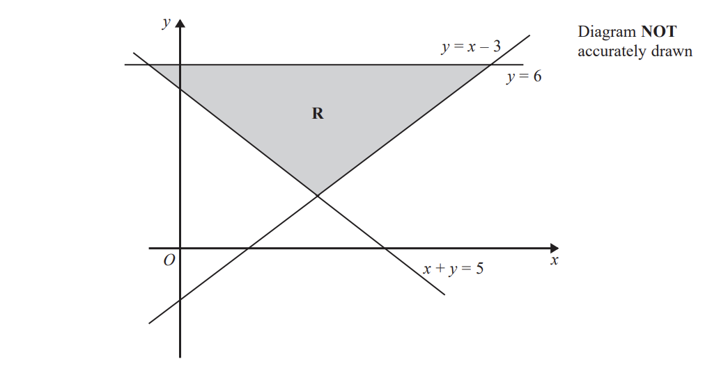

Write down the three inequalities that define the region $R$.

## Q17 — medium — 3 marks · exam-questions

### 18() — 3 marks — command: identify — structured — from paper Nov 2021 · 8300/2H
On the grid, identify the region represented by

`x space less-than or slanted equal to space 5`      `y space less-than or slanted equal to space 4 space`      $x+y>6$

Label the region R.

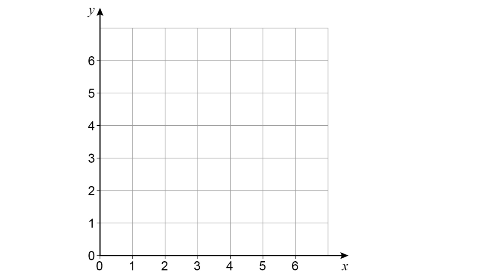

## Q18 — medium — 6 marks · exam-questions

### 18() — 6 marks — command: find — structured — from paper Nov 2019 · J560/05
The graph of 3*y *+ 6*x *= 13 is drawn on the grid.

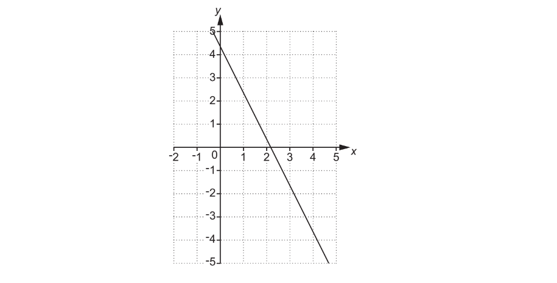

The region R satisfies these inequalities.

`3 y plus 6 x greater-than or slanted equal to 13`      `y less-than or slanted equal to x minus 2`            $x>3$

By drawing two more straight lines, find and label the region R.

## Q19 — medium — 5 marks · exam-questions

### 17() — 5 marks — command: find — structured — from paper Nov 2020 · J560/05
The graphs of $y=x$ and $y=-2$ are drawn on the grid.

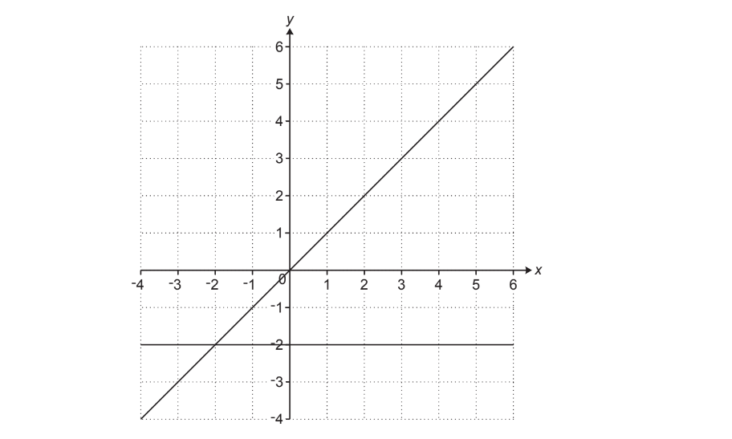

The region R satisfies the following inequalities.

`y greater-than or slanted equal to negative 2`         `y less-than or slanted equal to x`         $y<4-2x$

By drawing one more line, find and label the region R.

## Q20 — medium — 5 marks · exam-questions

### 14() — 5 marks — command: find — structured — from paper Nov 2018 · J560/05
The diagram shows the lines $y=2x+1$ and $7x+4y=28$

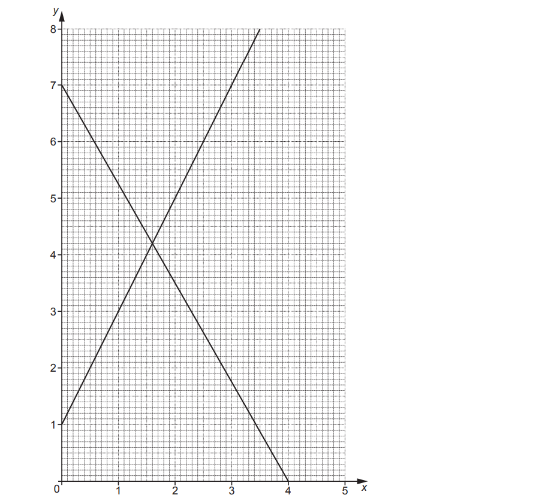

The region R satisfies these inequalities.

`y less-than or slanted equal to space 2 x plus 1`         `7 x space plus 4 y greater-than or slanted equal to 28`      $y>1$

By drawing a third straight line, find and label the region R that satisfies these inequalities.

## Q21 — medium — 4 marks · exam-questions

### 7() — 4 marks — command: find — structured — from paper 2023 June · 4MA1/1H
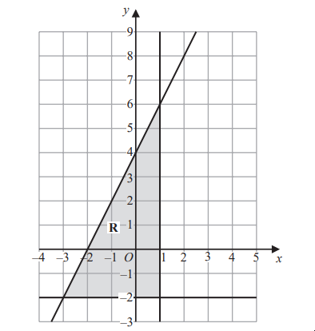

The region **R**, shown shaded in the diagram, is bounded by three straight lines.

Find the inequalities that define **R**

## Q22 — medium — 3 marks · exam-questions

### 8((b)) — 3 marks — command: write — structured — from paper 2023 Nov · 4MA1/1H
The region **R**, shown shaded in the diagram, is bounded by three straight lines.

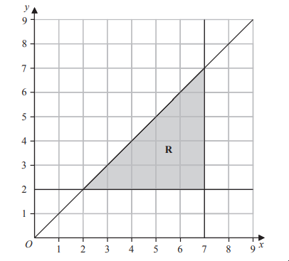

Write down the three inequalities that define the region **R.**

## Q23 — hard — 6 marks · exam-questions

### 13((a)) — 2 marks — command: find — structured — from paper November 2015 · 1MA0/2H
Given that $x$ and $y$ are integers such that

$3<x<7$

$4<y<9$

and $x+y=13$

find all the possible values of $x$.

### 13((b)) — 4 marks — structured — from paper November 2015 · 1MA0/2H
On the grid below show, by shading, the region defined by the inequalities

`y greater-than or slanted equal to negative 1 space space space space space space space space space space space space space space space space space space space space space space space space space space space space y less-than or slanted equal to 4 minus x space space space space space space space space space space space space space space space space space space space space space space space space y less-than or slanted equal to 3 x minus 1`

Mark this region with the letter $R$.

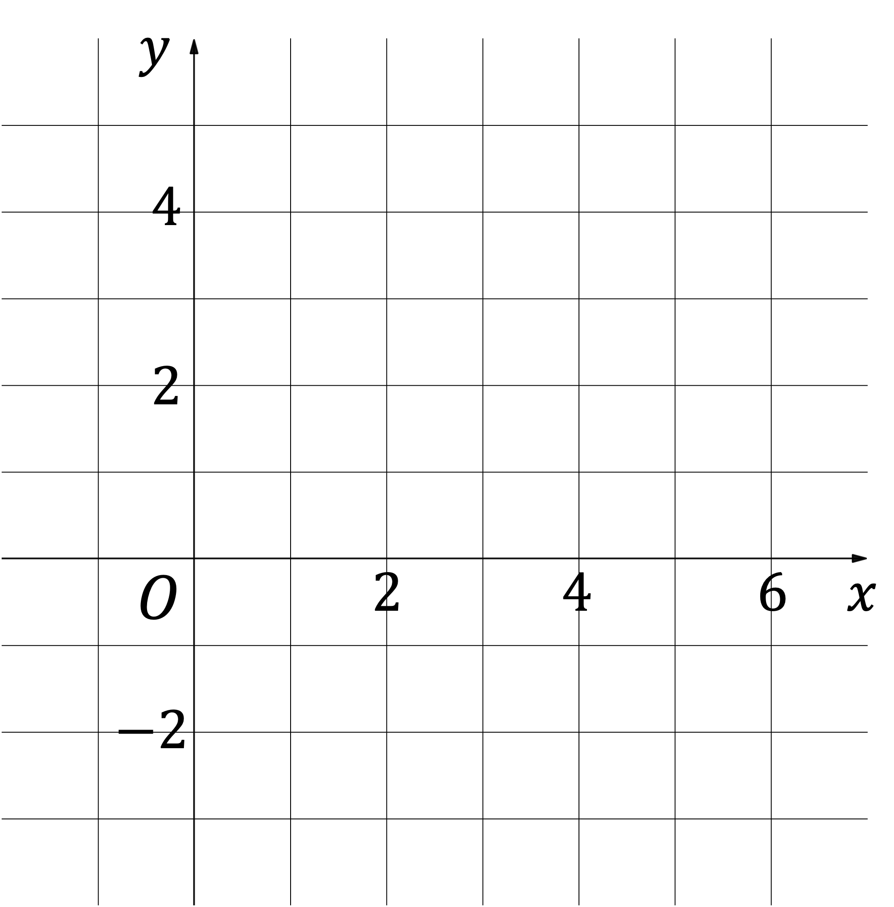

## Q24 — hard — 4 marks · exam-questions

### 10() — 4 marks — command: label — structured — from paper Spec1 2015 · 1MA1/3H
On the grid, shade the region that satisfies all these inequalities.

$x+y<4y>x-1y<3x$

Label the region $R$.

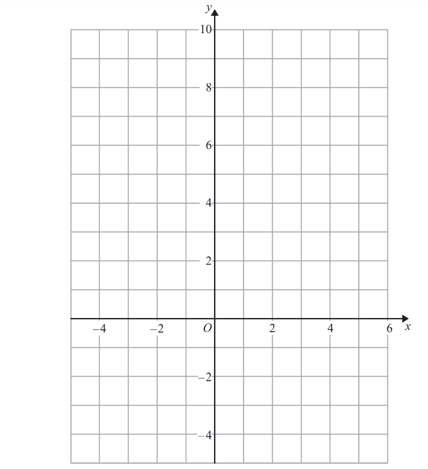

## Q25 — hard — 3 marks · exam-questions

### 14() — 3 marks — command: label — structured — from paper November 2017 · 1MA1/2H
On the grid, shade the region that satisfies all these inequalities.

$y>1x+y<5y>2x$

Label the region $R$.

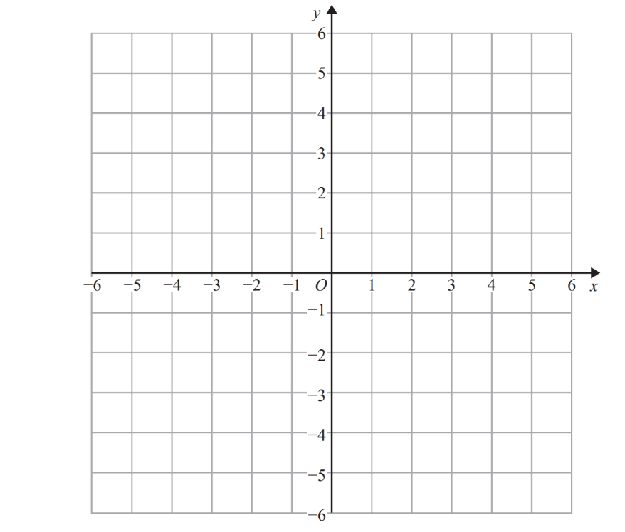

## Q26 — hard — 4 marks · exam-questions

### 18() — 4 marks — command: label — structured — from paper June 2015 · 1MA0/1H
On the grid show, by shading, the region that satisfies all three of the inequalities

$x+y<7y<2xy>3$

Label the region $R$.

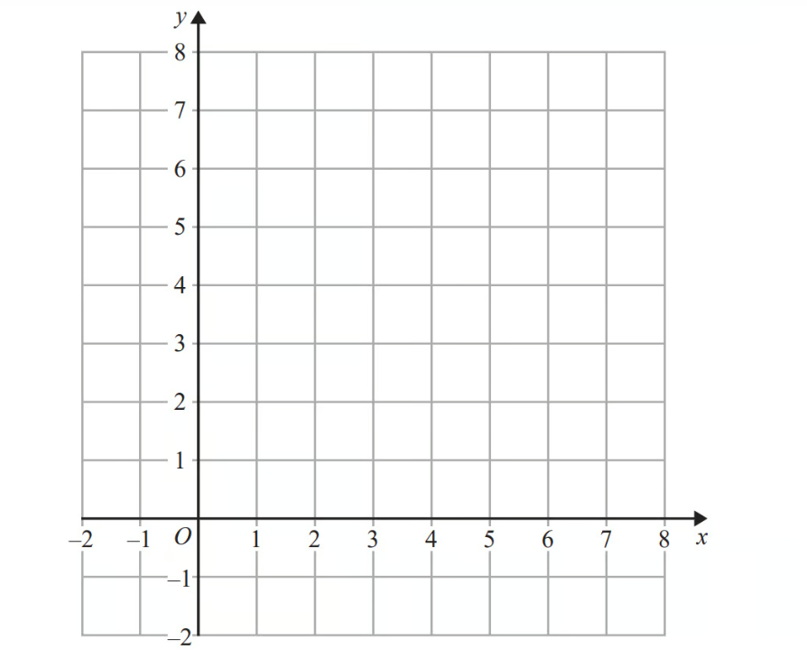

## Q27 — hard — 3 marks · exam-questions

### 13() — 3 marks — command: write — structured — from paper Jan 2022 · 4MA1/2H
The shaded region in the diagram is bounded by three lines. The equation of one of the lines is given.

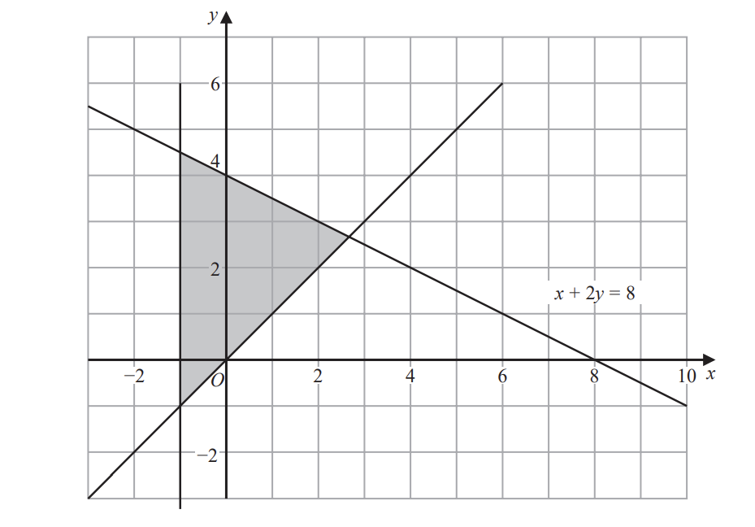

Write down three inequalities that define the shaded region.

## Q28 — hard — 3 marks · exam-questions

### 13() — 3 marks — command: write — structured — from paper Nov 2021 · 4MA1/2H
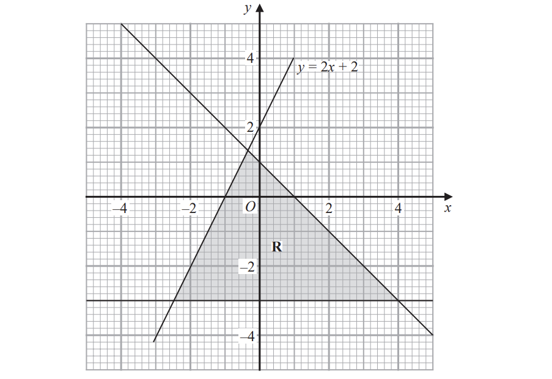

The region $R$, shown shaded in the diagram, is bounded by three straight lines.

Write down the three inequalities that define $R$.

## Q29 — hard — 3 marks · exam-questions

### 10() — 3 marks — command: write — structured — from paper Jan 2020 · 4MA1/1H
The shaded region in the diagram is bounded by three lines.

The equation of one of the lines is given.

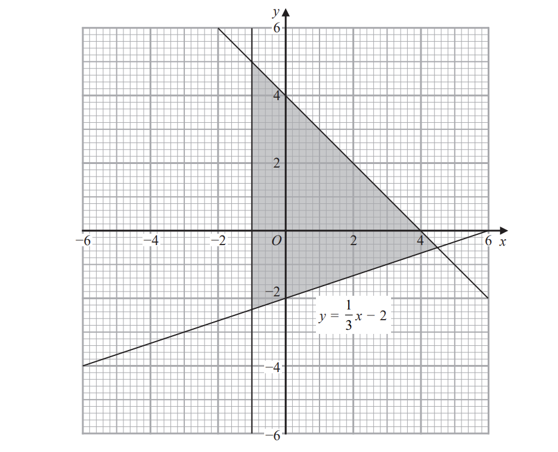

Write down the three inequalities that define the shaded region.

## Q30 — hard — 6 marks · exam-questions

### 18() — 6 marks — command: draw — structured — from paper June 2019 · J560/04
Region **R** satisfies these inequalities.

`table row y greater than 3 row y greater-than or slanted equal to x row cell x plus y end cell less-than or slanted equal to 9 end table`

By drawing three straight lines on the grid, find and label the region **R**.

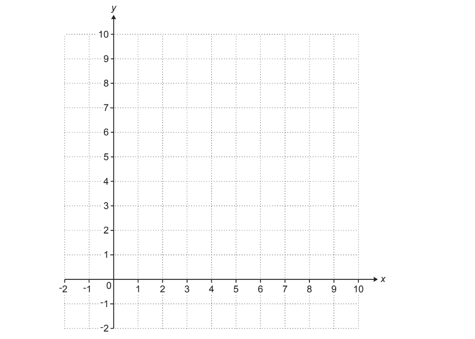

## Q31 — hard — 11 marks · exam-questions

### 18((a)) — 4 marks — command: find — structured — from paper Nov 2017 · J560/06
The diagram below shows a 1cm coordinate grid.

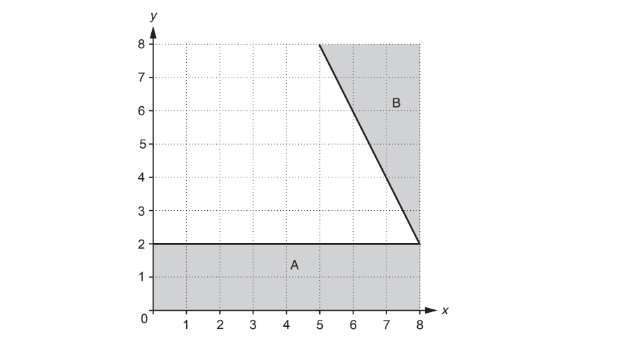

Find an inequality that defines region A and another inequality that defines region B.

### 18((b)) — 2 marks — structured — from paper Nov 2017 · J560/06
Shade the region on the grid given by the inequality `y space greater-than or slanted equal to space 6.`

### 18((c)) — 5 marks — command: find — structured — from paper Nov 2017 · J560/06
A fourth shaded region, given by the inequality

`y space greater-than or slanted equal to space k x space plus space 2 space comma`

is added to the grid.

The **unshaded** region now has area 23cm2.

Find the value of$k$.

$k$ = ..............

## Q32 — hard — 6 marks · exam-questions

### 9((b)) — 4 marks — command: find — structured — from paper 2018	May/June · 0580/43
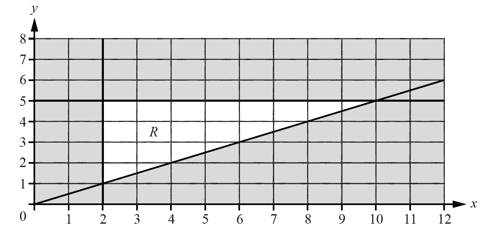

Find the three inequalities that define the region $R$.

### 9((b)) — 2 marks — command: find — structured — from paper 2018	May/June · 0580/43
Find the point $(x,y)$, with integer co-ordinates, inside the region $R$ such that $3x+5y=35$.

( .............. , .............. )
