# Exam Questions — Graphs of Functions
**Sequences, Functions & Graphs** · Edexcel IGCSE Maths A (4MA1) — 18/Higher
> Source: [https://www.savemyexams.com/igcse/maths/edexcel/a/18/higher/topic-questions/3-sequences-functions-and-graphs/graphs-of-functions/exam-questions/](https://www.savemyexams.com/igcse/maths/edexcel/a/18/higher/topic-questions/3-sequences-functions-and-graphs/graphs-of-functions/exam-questions/) · 46 questions · total 184 marks

## Q1 — easy — 1 marks · exam-questions

### 7() — 1 mark — command: write — structured — from paper 2017	November · 1MA1/1H
Brogan needs to draw the graph of $y=x^{2}+1$

Here is her graph.

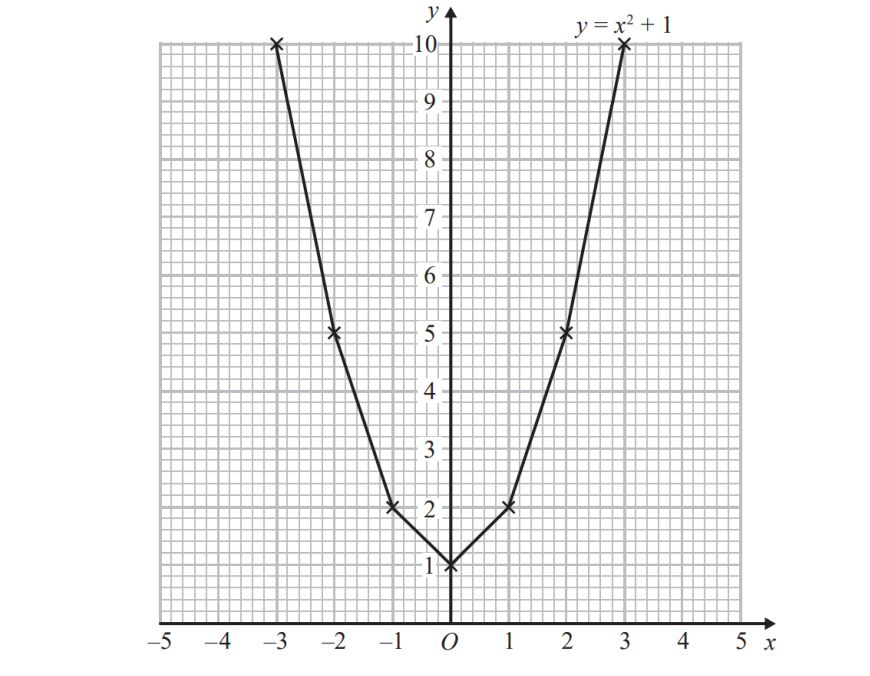

Write down one thing that is wrong with Brogan's graph.

## Q2 — easy — 4 marks · exam-questions

### 17((a)) — 2 marks — command: complete — structured — from paper 2013	November · 1MA0/2H
Complete the table of values for  $y=x^{3}---4x$

| $x$ | $-3$ | $-2$ | $-1$ | $0$ | $1$ | $2$ | $3$ |
|---|---|---|---|---|---|---|---|
| $y$ |   |   | $3$ | $0$ |   |   | $15$ |

### 17((b)) — 2 marks — command: draw — structured — from paper 2013	November · 1MA0/2H
On the grid, draw the graph of $y=x^{3}---4x$ from $x=-3\mathrm{to}x=3$

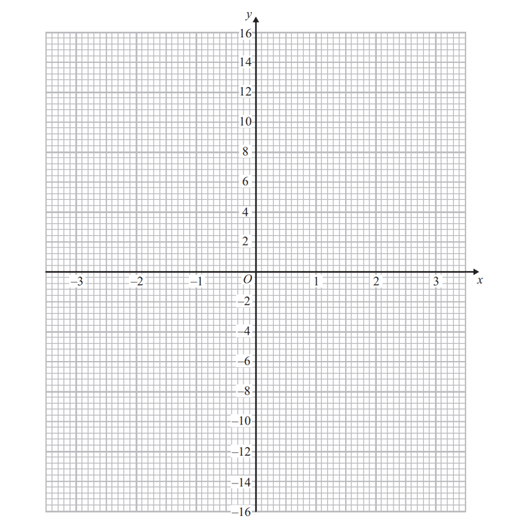

## Q3 — easy — 4 marks · exam-questions

### 13((a)) — 2 marks — command: complete — structured — from paper 2016	June · 1MA0/2H
Complete the table of values for $y=x^{3}---3x+1$

| $x$ | $-2$ | $-1$ | $0$ | $1$ | $2$ |
|---|---|---|---|---|---|
| $y$ |   | $3$ |   |   | $3$ |

### 13((b)) — 2 marks — command: draw — structured — from paper 2016	June · 1MA0/2H
On the grid, draw the graph of $y=x^{3}---3x+1$ for values of $x$ from $---2\mathrm{to}2$

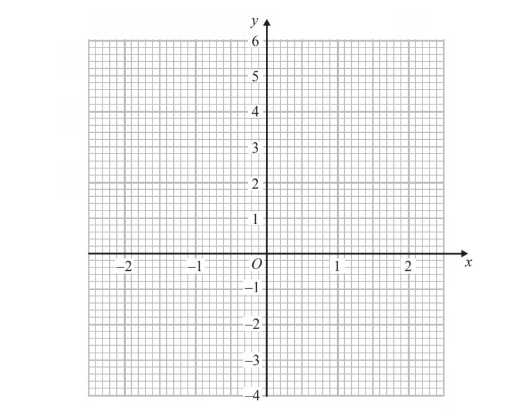

## Q4 — easy — 4 marks · exam-questions

### 18((a)) — 2 marks — command: complete — structured — from paper 2012	November · 1MA0/2H
Complete the table of values for $y=\frac{6}{x}$

| $x$ | $0.5$ | $1$ | $2$ | $3$ | $4$ | $5$ | $6$ |
|---|---|---|---|---|---|---|---|
| $y$ |   | $6$ | $3$ |   | $1.5$ |   | $1$ |

### 18((b)) — 2 marks — command: draw — structured — from paper 2012	November · 1MA0/2H
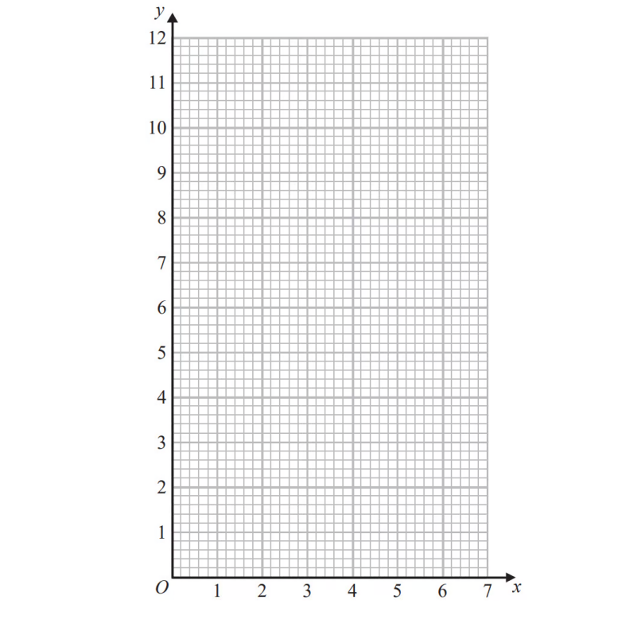

On the grid, draw the graph of `y space equals space 6 over x space for space space 0.5 space less-than or slanted equal to space x space less-than or slanted equal to space 6`

## Q5 — easy — 4 marks · exam-questions

### 19((a)) — 2 marks — command: complete — structured — from paper 2014	November · 1MA0/1H
Complete the table of values for $y=\frac{4}{x}$

| $x$ | $0.5$ | $1$ | $2$ | $4$ | $5$ | $8$ |
|---|---|---|---|---|---|---|
| $y$ |   | $4$ | $2$ |   |   |   |

### 19((b)) — 2 marks — command: draw — structured — from paper 2014	November · 1MA0/1H
On the grid, draw the graph of $y=\frac{4}{x}$ for `0.5 space less-than or slanted equal to space x space less-than or slanted equal to space 8`

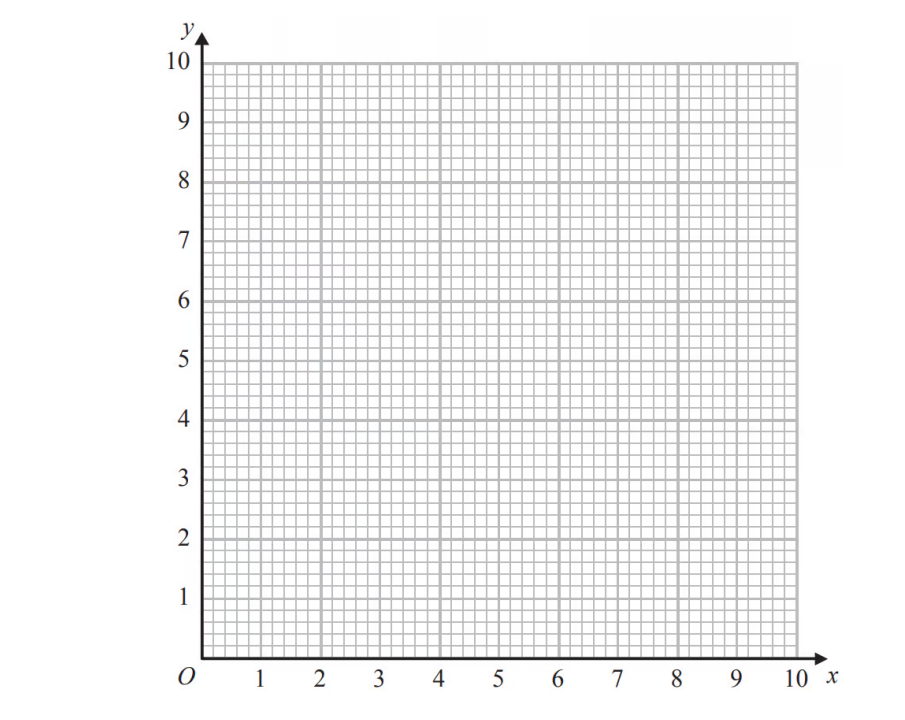

## Q6 — easy — 3 marks · exam-questions

### 7((a)) — 1 mark — command: write — structured — from paper 2015	Sample · 1MA1/2H
The graph of $y=f(x)$ is drawn on the grid.

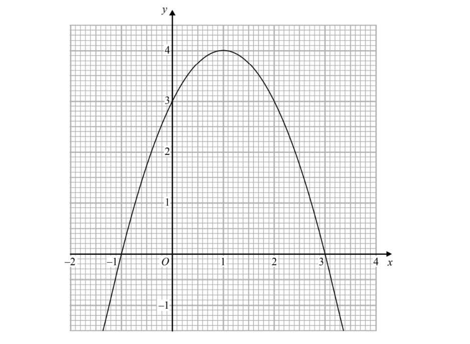

Write down the coordinates of the turning point of the graph.

### 7((b)) — 1 mark — command: write — structured — from paper 2015	Sample · 1MA1/2H
Write down the roots of $f(x)=2$

### 7((c)) — 1 mark — command: write — structured — from paper 2015	Sample · 1MA1/2H
Write down the value of $f(0.5)$

## Q7 — easy — 3 marks · exam-questions

### 11((a)) — 1 mark — command: write — structured — from paper 2017	May/June · 1H
The graph of $y=f(x)$ is drawn on the grid.

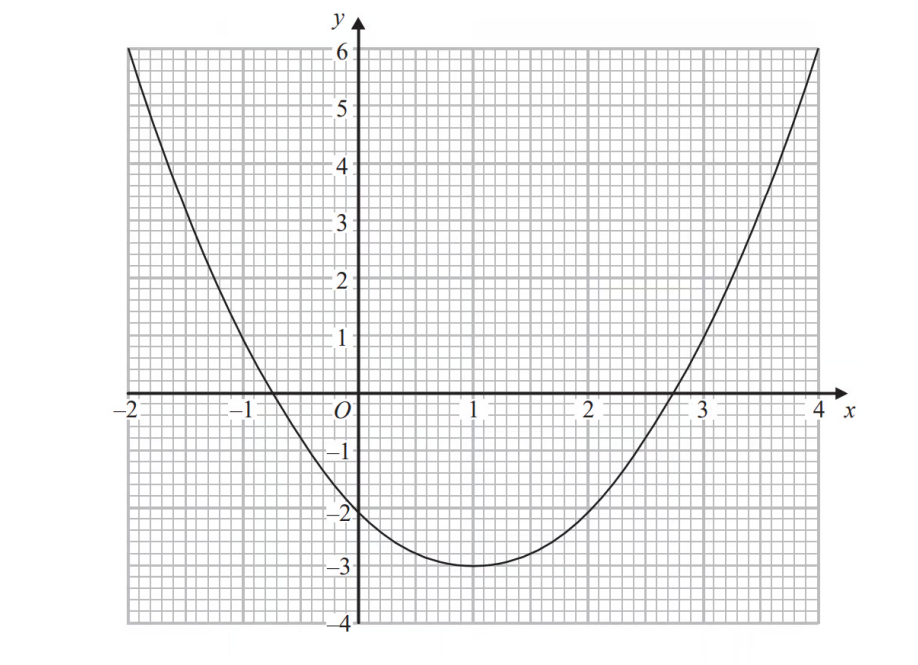

Write down the coordinates of the turning point of the graph.

### 11((b)) — 1 mark — command: write — structured — from paper 2017	May/June · 1H
Write down estimates for the roots of $f(x)=0$

### 11((c)) — 1 mark — command: use — structured — from paper 2017	May/June · 1H
Use the graph to find an estimate for $f(1.5)$

## Q8 — easy — 4 marks · exam-questions

### 15((a)) — 2 marks — command: complete — structured — from paper June 2021 · 4MA1/2H
Complete the table of values for  `y equals 1 over x open parentheses x squared plus 4 close parentheses`

| $x$ | 0.25 | 0.5 | 1 | 2 | 4 | 8 |
|---|---|---|---|---|---|---|
| $y$ | 16.25 |   |   |   |   | 8.5 |

### 15((b)) — 2 marks — command: draw — structured — from paper June 2021 · 4MA1/2H
On the grid, draw the graph of  `y equals 1 over x open parentheses x squared plus 4 close parentheses` for `0.25 less-than or slanted equal to x less-than or slanted equal to 8`

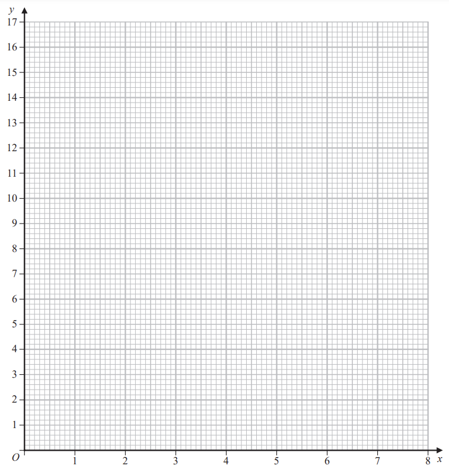

## Q9 — easy — 3 marks · exam-questions

### 15() — 3 marks — command: complete — structured — from paper Jan 2020 · 4MA1/2H
Here are six graphs.

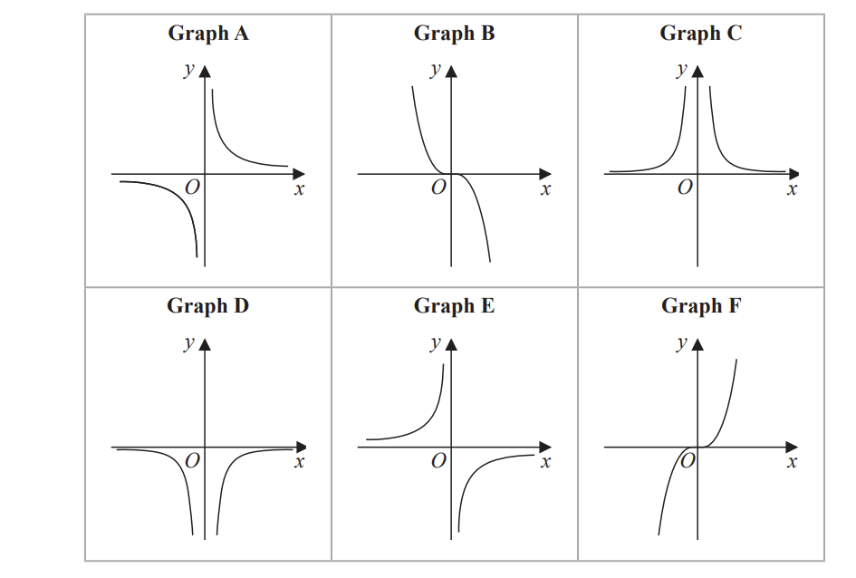

Complete the table below with the letter of the graph that could represent each given equation. Write your answers on the dotted lines.

| **Equation** | **Graph** |
|---|---|
| $y=\frac{2}{x^{2}}$ | .................... |
| $y=-\frac{1}{2}x^{3}$ | .................... |
| $y=-\frac{5}{x}$ | .................... |

## Q10 — easy — 4 marks · exam-questions

### 16((a)) — 2 marks — command: write — structured — from paper Specimen 2016 · 4MA1/2H
The diagram shows part of a sketch of the curve $y=\mathrm{sin}x^{\circ}$

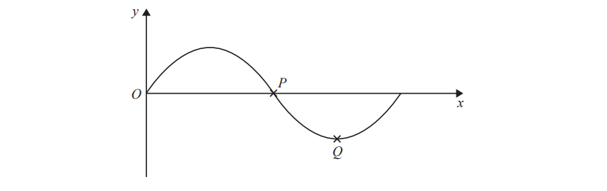

Write down the coordinates of

(i) the point P

[1]

(ii) the point Q

[1]

### 16((b)) — 2 marks — command: sketch — structured — from paper Specimen 2016 · 4MA1/2H
Sketch the graph of $y=\mathrm{tan}x$ for `0 degree space less-than or slanted equal to space x space less-than or slanted equal to space 360 degree`

Show the coordinates of any points of intersection with the coordinate axes.

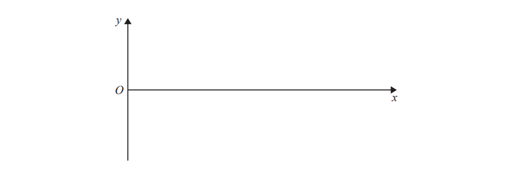

## Q11 — easy — 4 marks · exam-questions

### 11((a)) — 2 marks — command: complete — structured — from paper Jan 2022 · 4MA1/2HR
Complete the table of values for $y=\frac{6}{x}$

| $x$ | 0.5 | 1 | 2 | 3 | 4 | 5 | 6 |
|---|---|---|---|---|---|---|---|
| $y$ |   | 6 |   | 2 |   |   | 1 |

### 11((b)) — 2 marks — command: draw — structured — from paper Jan 2022 · 4MA1/2HR
On the grid, draw the graph of  $y=\frac{6}{x}$  for `0.5 less-than or slanted equal to x less-than or slanted equal to 6`

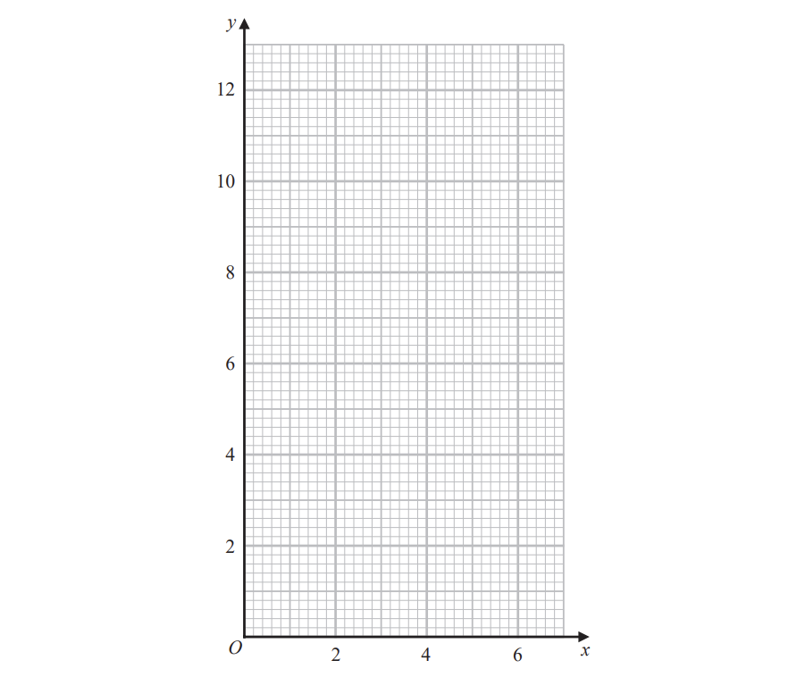

## Q12 — easy — 1 marks · exam-questions

### 21((a)) — 1 mark — command: circle — structured — from paper Nov 2020 · 8300/2H
Circle the point that is on the graph of $y=\frac{1}{x}$

| (–1, 1) | (0.3, 3) | (0.8, 0.2) | (2.5, 0.4) |
|---|---|---|---|

## Q13 — easy — 1 marks · exam-questions

### 27() — 1 mark — command: circle — structured — from paper Nov 2020 · 8300/3H
The equation of a curve is $y=(x--1)^{2}--6$

Circle the coordinates of the turning point.

| (–1, –6) | (1, 6) | (–1, 6) | (1, –6) |
|---|---|---|---|

## Q14 — easy — 1 marks · exam-questions

### 19((a)) — 1 mark — command: solve — structured — from paper June 2019 · J560/05
The graph of *y* = *x*3 − *x*2 − 2 is drawn on the grid.

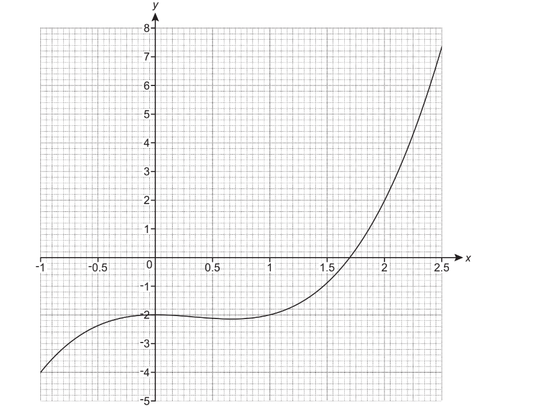

Use the graph to solve* x*3* − x*2 − 2 = 0.

Give your answer correct to 1 decimal place.

*x *= ...................................................

## Q15 — easy — 2 marks · exam-questions

### 10() — 2 marks — command: solve — structured — from paper Nov 2018 · J560/04
Here is the graph of   *y* = *x*2 + *x* − 6.

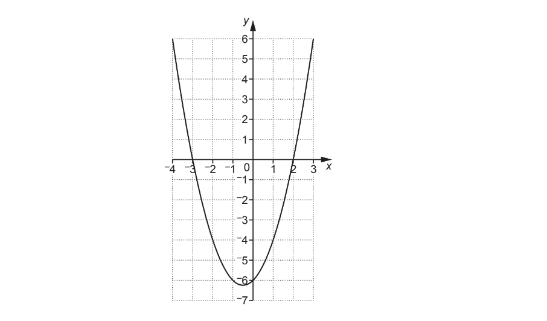

Use the graph to solve the equation  *x*2 + *x* − 6  = 0.

*x* = ................. or *x* = ................

## Q16 — easy — 2 marks · exam-questions

### 4((a)) — 2 marks — command: sketch — structured — from paper Specimen 2015 · J560/04
(i) Sketch a graph on the axes that shows that *y* is directly proportional to *x*.

[2]

(ii) Sketch a graph on the axes that shows $y=x^{3}$

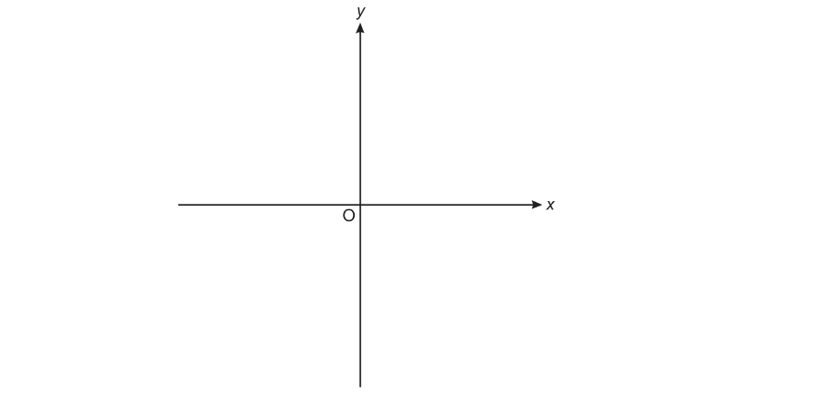

[2]

## Q17 — medium — 6 marks · exam-questions

### 5((a)) — 2 marks — command: complete — structured — from paper 2018	June · 1MA1/2H
Complete the table of values for $y=x^{2}---x---6$

| $x$ | $-3$ | $-2$ | $-1$ | $0$ | $1$ | $2$ | $3$ |
|---|---|---|---|---|---|---|---|
| $y$ | $6$ |   |   | $-6$ |   |   |   |

### 5((b)) — 2 marks — command: draw — structured — from paper 2018	June · 1MA1/2H
On the grid, draw the graph of $y=x^{2}---x---6$ for values of $x$ from $---3\mathrm{to}3$

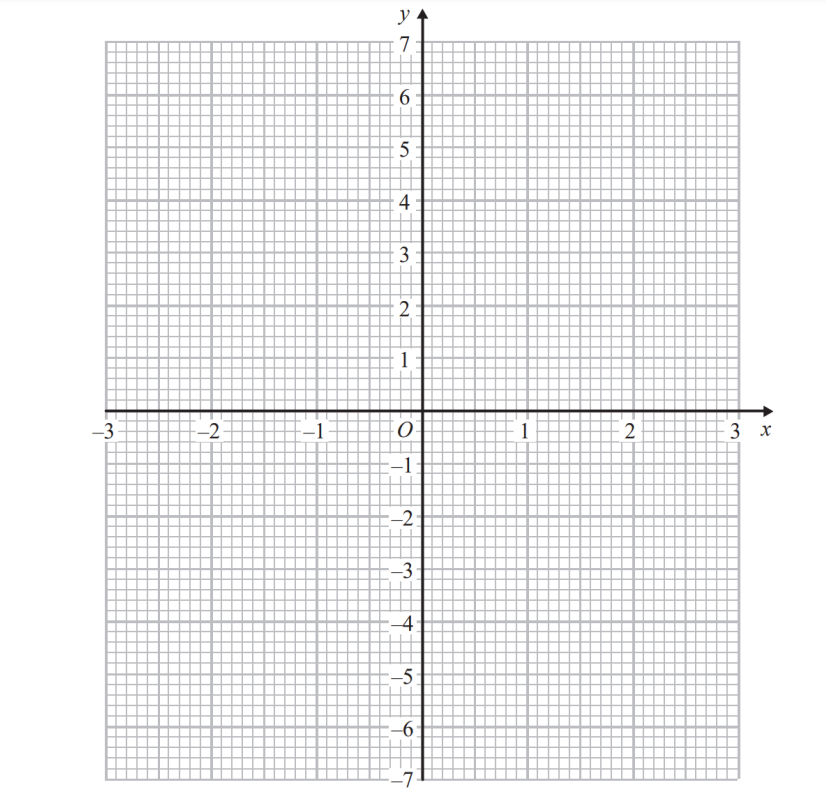

### 5((c)) — 2 marks — command: use — structured — from paper 2018	June · 1MA1/2H
Use your graph to find estimates of the solutions to the equation $x^{2}-x-6=---2$

## Q18 — medium — 2 marks · exam-questions

### 19((a)) — 2 marks — command: sketch — structured — from paper 2015	Spec2 · 1MA1/2H
Sketch the graph of `y space equals space cos space x to the power of degree space end exponent space for space 0 space less-than or slanted equal to space x space less-than or slanted equal to space 360`

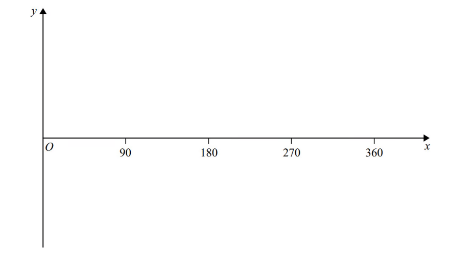

## Q19 — medium — 2 marks · exam-questions

### 26((a)) — 1 mark — command: write — structured — from paper 2014	June · 1MA0/1H
The diagram shows part of a sketch of the curve $y=\mathrm{sin}x^{\circ}.$

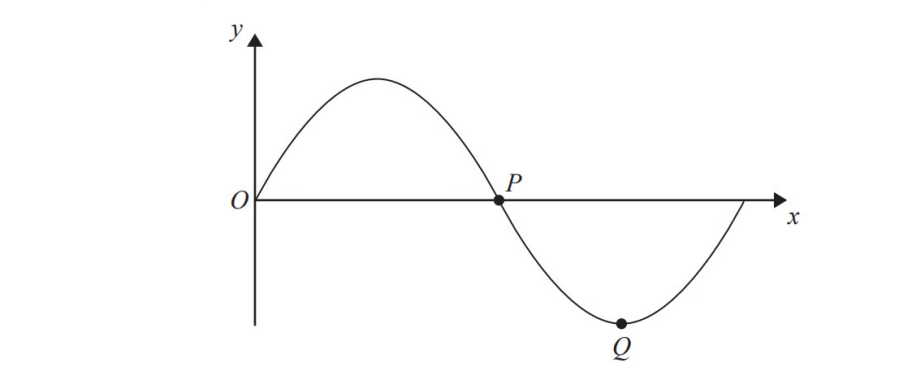

Write down the coordinates of the point $P$.

### 26((b)) — 1 mark — command: write — structured — from paper 2014	June · 1MA0/1H
Write down the coordinates of the point $Q$.

## Q20 — medium — 6 marks · exam-questions

### 12((a)) — 2 marks — command: complete — structured — from paper 2015	November · 1MA0/1H
Complete the table of values for $y=x^{2}-3x+2$

| $x$ | $-1$ | $0$ | $1$ | $2$ | $3$ | $4$ | $5$ |
|---|---|---|---|---|---|---|---|
| $y$ | $6$ |   |   |   | $2$ |   | $12$ |

### 12((b)) — 2 marks — command: draw — structured — from paper 2015	November · 1MA0/1H
On the grid, draw the graph of $y=x^{2}---3x+2$ for values of $x$ from $---1\mathrm{to}5$

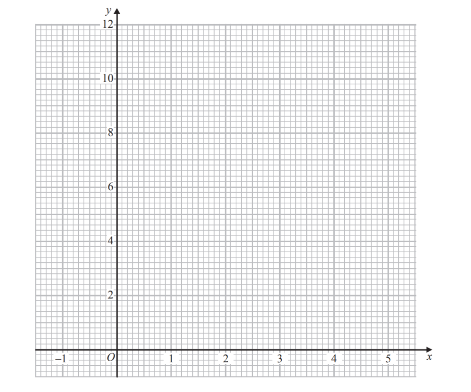

### 12((c)) — 2 marks — command: find — structured — from paper 2015	November · 1MA0/1H
Find estimates for the solutions of the equation $x^{2}-3x+2=4$

## Q21 — medium — 6 marks · exam-questions

### 13((a)) — 2 marks — command: complete — structured — from paper 2017	June · 1MA0/1H
Complete the table of values for $y=x^{2}-3x+1$

| $x$ | $-2$ | $-1$ | $0$ | $1$ | $2$ | $3$ | $4$ |
|---|---|---|---|---|---|---|---|
| $y$ | $11$ |   | $1$ | $-1$ |   | $1$ |   |

### 13((b)) — 2 marks — command: draw — structured — from paper 2017	June · 1MA0/1H
On the grid, draw the graph of $y=x^{2}---3x+1$ for values of $x$from $---2\mathrm{to}4$

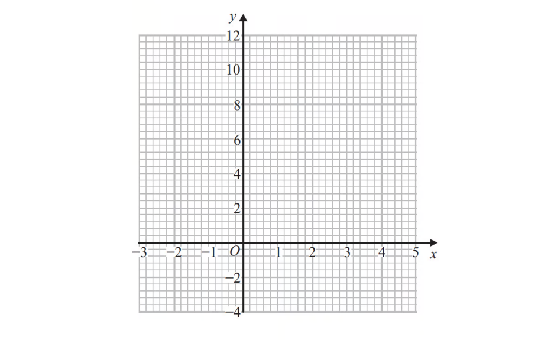

### 13((c)) — 2 marks — command: find — structured — from paper 2017 · 1MA0/1H
By drawing a suitable straight line on the grid, find estimates for the solutions of

$x^{2}-3x+1=3$

## Q22 — medium — 6 marks · exam-questions

### 8((a)) — 1 mark — command: complete — structured — from paper Jan 2019 · 4MA1/1H
Complete the table of values for $y=x^{2}--5x+6$

| $x$ | $0$ | $1$ | $2$ | $3$ | $4$ | $5$ |
|---|---|---|---|---|---|---|
| $y$ | $6$ |   | $0$ | $0$ | 2 |   |

### 8((b)) — 2 marks — command: draw — structured — from paper Jan 2019 · 4MA1/1H
On the grid, draw the graph of `y space equals space x squared space – space 5 x space plus space 6 space for space 0 space less-than or slanted equal to space x space less-than or slanted equal to space 5`

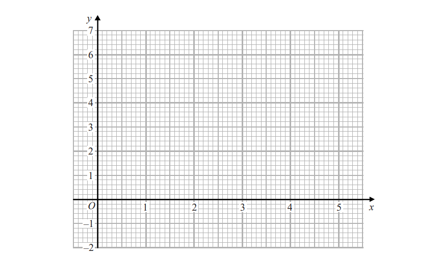

### 8((c)) — 3 marks — command: find — structured — from paper Jan 2019 · 4MA1/1H
By drawing a suitable straight line on the grid, find estimates for the solutions of the equation

$x^{2}--5x=x--7$

## Q23 — medium — 5 marks · exam-questions

### 21((a)) — 2 marks — command: use — structured — from paper Jan 2022 · 4MA1/2H
Part of the graph of$y=2x^{2}-4x-1$ is shown on the grid.

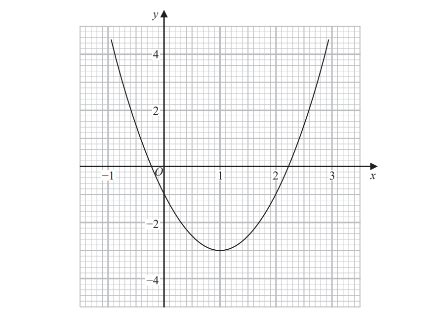

Use the graph to find estimates for the solutions of the equation $2x^{2}-4x-1=0$

Give your solutions correct to one decimal place.

### 21((b)) — 3 marks — command: find — structured — from paper Jan 2022 · 4MA1/2H
By drawing a suitable straight line on the grid, find estimates for the solutions of the equation $x^{2}-x-1=0$

Show your working clearly.

Give your solutions correct to one decimal place.

## Q24 — medium — 2 marks · exam-questions

### 18((b)) — 2 marks — command: use — structured — from paper Jan 2020 · 4MA1/1HR
The diagram shows the graph of $y=f(x)$ for `negative 4 space less-than or slanted equal to space x space less-than or slanted equal to space 12`

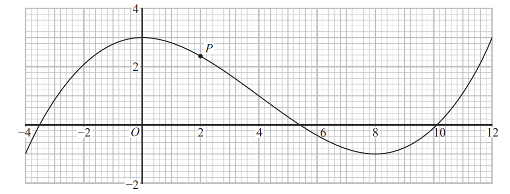

Note: Point P in the graph is from the previous question. It is not required for this question.

The equation $f(x)=k$ has exactly two different solutions for `negative 4 space less-than or slanted equal to space x space less-than or slanted equal to space 12`

Use the graph to find the two possible values of $k$.

## Q25 — medium — 4 marks · exam-questions

### 23((a)) — 3 marks — command: write — structured — from paper Jan 2019 · 4MA1/2HR
Write $3x^{2}-12x+7$ in the form $a(x+b)^{2}+c$

### 23((b)) — 1 mark — command: write — structured — from paper Jan 2019 · 4MA1/2HR
The line $L$ is the line of symmetry of the curve with equation $y=3x^{2}-12x+7$

Using your answer to part (a) or otherwise, write down an equation of $L$.

## Q26 — medium — 1 marks · exam-questions

### 1() — 1 mark — command: circle — structured — from paper June 2019 · 8300/2H
Circle the point that lies on the curve  $y=x^{2}--4x+1$

| (–1, 4) | (–1, –4) | (–1, –2) | (–1, 6) |
|---|---|---|---|

## Q27 — medium — 2 marks · exam-questions

### 27((a)) — 1 mark — command: circle — structured — from paper Nov 2018 · 8300/1H
Here is a sketch of $y=\mathrm{cos}x$for values of $x$ from 0° to 360°

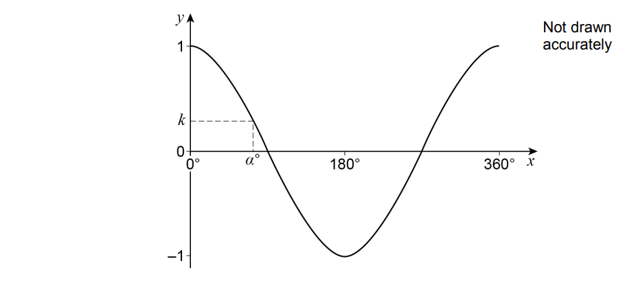

$α^{\circ}$ is an acute angle.

$\mathrm{cos}α^{\circ}=k$

Circle the value of $\mathrm{cos}(180^{\circ}--α^{\circ})$

| $1--k$ | $k$ | $--k$ | $--1--k$ |
|---|---|---|---|

### 27((b)) — 1 mark — command: circle — structured — from paper Nov 2018 · 8300/1H
Circle the value of $\mathrm{cos}$$(360^{\circ}+α^{\circ})$

| $k--1$ | $k+1$ | $--k$ | $k$ |
|---|---|---|---|

## Q28 — medium — 4 marks · exam-questions

### 4((a)) — 2 marks — command: complete — structured — from paper 2023 June · 4MA1/2H
Complete the table of values for $y=x^{2}--x--4$

| $x$ | -3 | -2 | -1 | 0 | 1 | 2 | 3 |
|---|---|---|---|---|---|---|---|
| $y$ |   | 2 |   |   | -4 |   |   |

### 4((b)) — 2 marks — command: draw — structured — from paper 2023 June · 4MA1/2H
On the grid below, draw the graph of$y=x^{2}--x--4$ for values of $x$ from –3 to 3

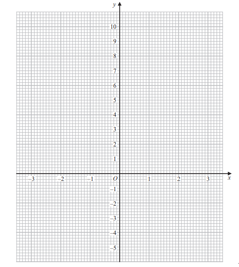

## Q29 — medium — 5 marks · exam-questions

### 12((a)) — 2 marks — command: complete — structured — from paper 2023 Nov · 4MA1/1H
Complete the table of values for $y=x^{3}-3x+1$

| $x$ | -2 | -1 | 0 | 1 | 2 |
|---|---|---|---|---|---|
| $y$ |   |   |   | -1 |   |

### 12((b)) — 2 marks — command: draw — structured — from paper 2023 Nov · 4MA1-1H
On the grid, draw the graph of $y=x^{3}-3x+1$ for values of $x$ from − 2 to 2

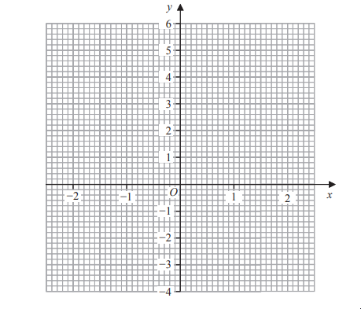

### 12((c)) — 1 mark — multiple_choice — from paper 2023 Nov · 4MA1-1H
Here are four graphs.

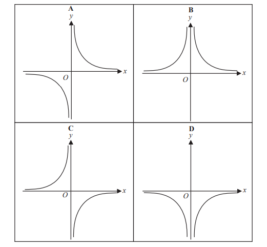

Write down the letter of the graph that could have the equation $y=-\frac{1}{x^{2}}$
- **A.** 
- **B.** 
- **C.** 
- **D.** 

## Q30 — hard — 6 marks · exam-questions

### 15((a)) — 2 marks — command: complete — structured — from paper 2013	June · 1MA0/2H
Complete the table of values for $y=x^{2}---2x$

| $x$ | $-2$ | $-1$ | $0$ | $1$ | $2$ | $3$ | $4$ |
|---|---|---|---|---|---|---|---|
| $y$ |   | $3$ | $0$ |   |   | $3$ |   |

### 15((b)) — 2 marks — command: draw — structured — from paper 2013	June · 1MA0/2H
On the grid, draw the graph of $y=x^{2}---2x$for values of $x$ from $---2\mathrm{to}4$

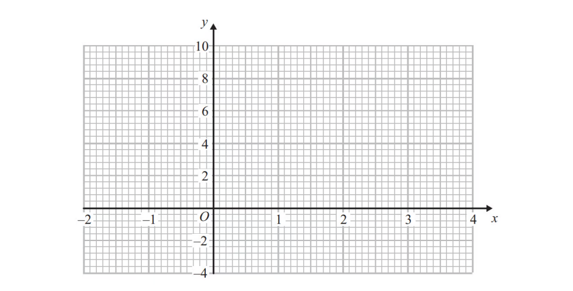

### 15((c)) — 2 marks — command: solve — structured — from paper 2013	June · 1MA0/2H
Solve  $x^{2}-2x-2=1$

## Q31 — hard — 6 marks · exam-questions

### 15((a)) — 2 marks — command: complete — structured — from paper 2014	June · 1MA0/1H
Complete the table of values for $y=x^{2}---2x---1$

| $x$ | $-2$ | $-1$ | $0$ | $1$ | $2$ | $3$ | $4$ |
|---|---|---|---|---|---|---|---|
| $y$ | $7$ |   |   | $-2$ | $-1$ |   |   |

### 15((b)) — 2 marks — command: draw — structured — from paper 2014	June · 1MA0/1H
On the grid, draw the graph of  $y=x^{2}---2x---1$ for values of $x$ from $---2\mathrm{to}4$

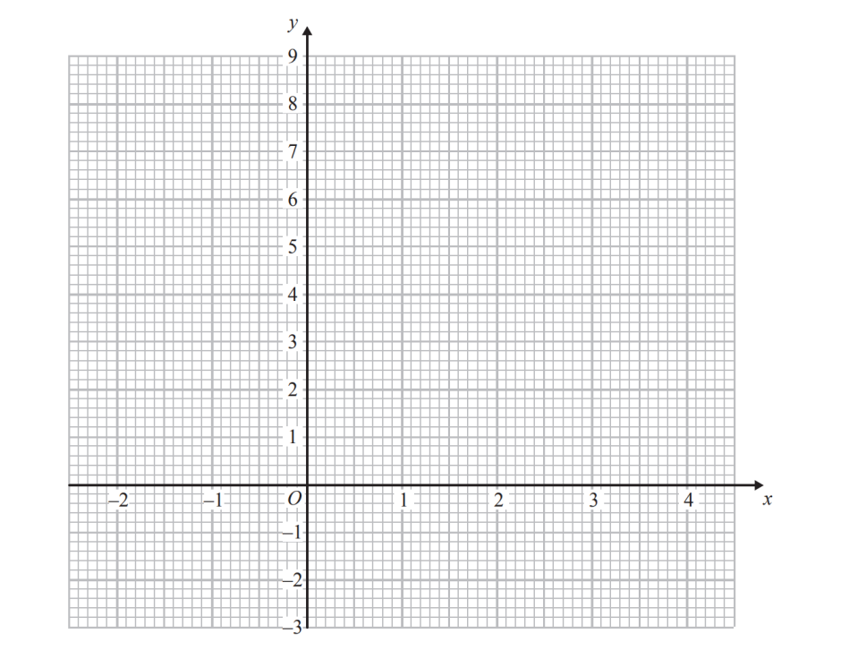

### 15((c)) — 2 marks — command: solve — structured — from paper 2014	June · 1MA0/1H
Solve   $x^{2}-2x-1=x+3$

## Q32 — hard — 6 marks · exam-questions

### 19((a)) — 3 marks — command: find — structured — from paper 2016	June · 1MA0/1H
The diagram shows the graph of $y=x^{2}---4x---2$

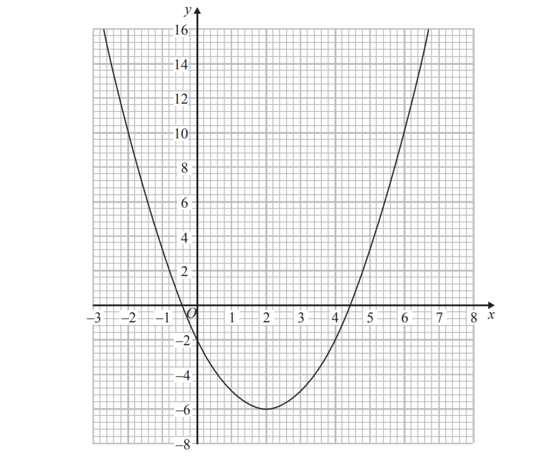

Use the graph to find estimates for the solutions of

i) $x^{2}-4x-2=0$

[1]

ii) $x^{2}-4x-6=0$

[2]

### 19((b)) — 3 marks — command: use — structured — from paper 2016	June · 1MA0/1H
Use the graph to find estimates for the values of $x$ that satisfy the simultaneous equations

`table row cell y space end cell equals cell space x squared space long dash space 4 x space long dash space 2 end cell row blank blank blank row cell x space plus space y space end cell equals 6 end table`

## Q33 — hard — 8 marks · exam-questions

### 14((a)) — 2 marks — command: complete — structured — from paper June 2018 · 4MA1/2H
Complete the table of values for $y=x^{3}--2x^{2}--3x+4$

| $x$ | -2 | -1 | -0.5 | 0 | 1 | 1.5 | 2 | 3 |
|---|---|---|---|---|---|---|---|---|
| $y$ |   |   | 4.875 | 4 |   | -1.625 |   |   |

### 14((a)) — 2 marks — command: draw — structured — from paper June 2018 · 4MA1/2H
On the grid, draw the graph of $y=x^{3}--2x^{2}--3x+4$  for values of $x$ from –2 to 3

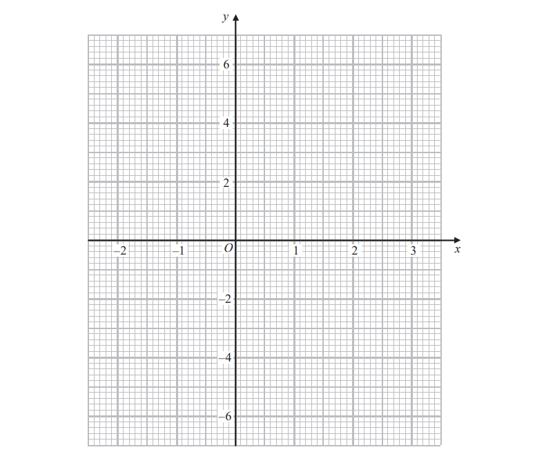

### 14((c)) — 4 marks — command: find — structured — from paper June 2018 · 4MA1/2H
By drawing a suitable straight line on the grid, find estimates for the solutions of the equation $x^{3}--2x^{2}--x+1=0$

Give your solutions correct to 1 decimal place.

## Q34 — hard — 4 marks · exam-questions

### 20() — 4 marks — command: sketch — structured — from paper Jan 2020 · 4MA1/1H
The curve $C$has equation $y=4(x-1)^{2}-a$   where $a>4$

Using the axes below, sketch the curve $C$. On your sketch show clearly, in terms of $a$,

(i) the coordinates of any points of intersection of $C$ with the coordinate axes,

(ii) the coordinates of the turning point.

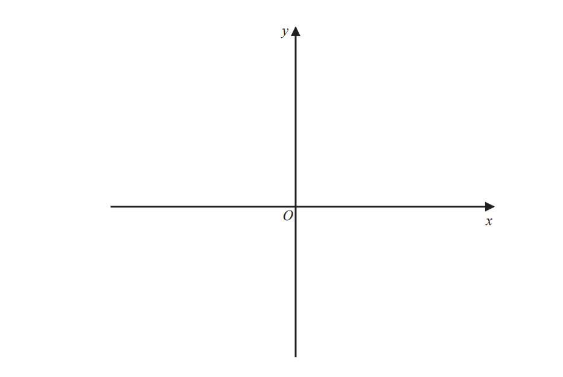

## Q35 — hard — 4 marks · exam-questions

### 20((a)) — 3 marks — command: express — structured — from paper Jan 2022 · 4MA1/1H
Express $7+12x--3x^{2}$ in the form $a+b(x+c)^{2}$ where $a,b$ and$c$are integers.

### 20((b)) — 1 mark — command: use — structured — from paper Jan 2022 · 4MA1/1H
$C$ is the curve with equation$y=7+12x--3x^{2}$

The point $A$ is the maximum point on $C$

Use your answer to part (a) to write down the coordinates of $A$

## Q36 — hard — 6 marks · exam-questions

### 22((a)) — 2 marks — command: complete — structured — from paper Nov 2020 · 4MA1/2HR
Complete the table of values for $y=\frac{1}{2}x^{3}--2x+3$

| $x$ | $--3$ | –2 | $--1$ | $0$ | $1$ | $2$ | $3$ |
|---|---|---|---|---|---|---|---|
| $y$ | $--4.5$ |   |   | $3$ |   | $3$ |   |

### 22((b)) — 2 marks — command: draw — structured — from paper Nov 2020 · 4MA1/2HR
On the grid, draw the graph of `y space equals space 1 half space x cubed space – space 2 x space plus space 3 space for space – 3 space less-than or slanted equal to space x space less-than or slanted equal to space 3`

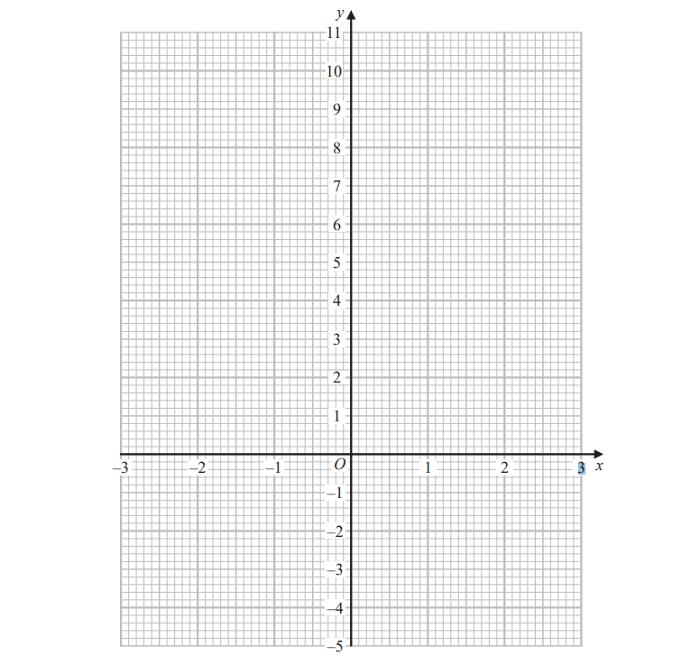

### 22((c)) — 2 marks — command: find — structured — from paper Nov 2020 · 4MA1/2HR
By drawing a suitable straight line on the grid, find an estimate for the solution of the equation $\frac{1}{2}x^{3}--x+4=0$

$x=$............................................

## Q37 — hard — 1 marks · exam-questions

### 30() — 1 mark — command: write — structured — from paper June 2018 · 4MA1/2HR
The curve $C$ has equation $y=3--5(x+1)^{2}$ 
The point $A$ is the maximum point on $C$.

Write down the coordinates of $A$.

## Q38 — hard — 6 marks · exam-questions

### 21() — 6 marks — command: sketch — structured — from paper Specimen 2016 · 4MA1/1H
The curve $C$ has equation $y=x^{2}--6x+4$

Using the axes below, sketch the curve $C$. On your sketch show clearly

(i) the exact coordinates of any points of intersection of $C$ with the coordinate axes,

(ii) the coordinates of the turning point.

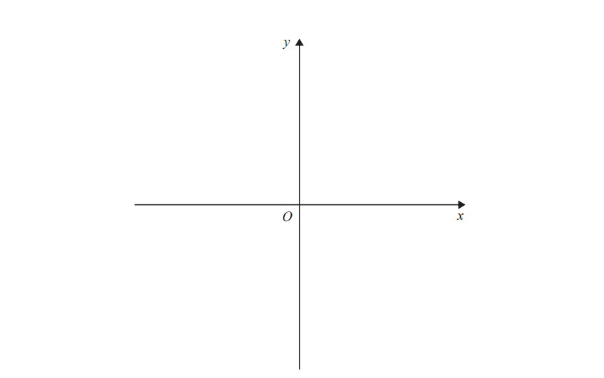

## Q39 — hard — 3 marks · exam-questions

### 21((a)) — 1 mark — command: write — structured — from paper Nov 2021 · 4MA1/2H
The curve $C$ has equation $y=f(x)$ where $f(x)=9--3(x+2)^{2}$

The point $A$ is the maximum point on $C$.

Write down the coordinates of $A$.

### 21((b)) — 1 mark — command: find — structured — from paper Nov 2021 · 4MA1/2H
The curve $C$ is transformed to the curve $S$ by a translation of `open parentheses table row 4 row 0 end table close parentheses` Find an equation for the curve $S$.

### 21((c)) — 1 mark — command: describe — structured — from paper Nov 2021 · 4MA1/2H
The curve $C$ is transformed to the curve $T$.

The curve $T$ has equation $y=3(x+2)^{2}--9$

Describe fully the transformation that maps curve $C$ onto curve $T$.

## Q40 — hard — 6 marks · exam-questions

### 18((a)) — 3 marks — command: write — structured — from paper Nov 2018 · J560/05
Write $x^{2}+4x-16$ in the form `open parentheses x space plus space a close parentheses squared space minus space b`.

### 18((b)) — 3 marks — command: sketch — structured — from paper Nov 2018 · J560/05
Sketch the graph of $y=x^{2}+4x-16$ , showing clearly the coordinates of any turning points.

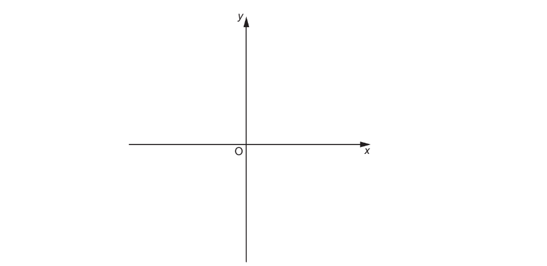

## Q41 — hard — 7 marks · exam-questions

### 19((a)) — 3 marks — command: write — structured — from paper Nov 2020 · J560/05
Write  $x^{2}-10x+22$  in the form  `open parentheses x minus a close parentheses squared minus b`.

### 19((b)) — 4 marks — command: sketch — structured — from paper Nov 2020 · J560/05
Sketch the graph of $y=x^{2}-10x+22$ .

Show clearly the coordinates of any turning points and the value of the $y$-intercept.

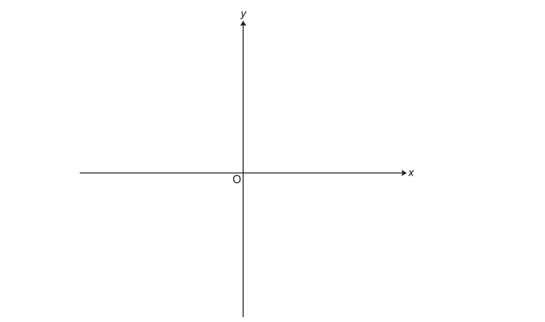

## Q42 — hard — 4 marks · exam-questions

### 19((a)) — 2 marks — command: solve — structured — from paper Nov 2020 · J560/06
The graph of $y=2x^{2}+3x-9$ is drawn below.

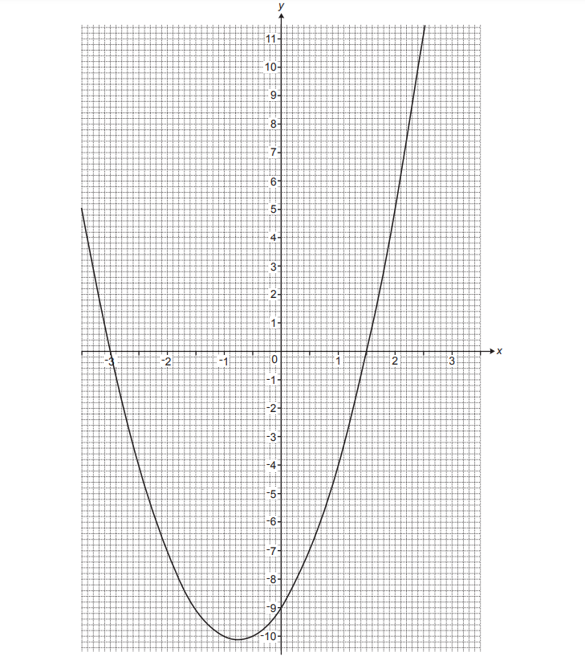

Use the graph to solve $2x^{2}+3x-9=0$.

$x=............................\mathrm{or}\,x=............................$

### 19((b)) — 2 marks — command: use — structured — from paper Nov 2020 · J560/06
The equation 2*x*2 + *x* − 4 = 0 can be solved by finding the intersection of the graph of *y *= 2*x*2 + 3*x* − 9  and the line *y *=* ax* + *b.*

(i) Find the value of a and the value of* b.*

`table row a equals cell space............................. space space end cell row b equals cell.............................. open square brackets 2 close square brackets end cell end table`

(ii) Hence use the graph to solve the equation 2*x*2 + *x* − 4 = 0.

*x* = ............................ or *x *= ............................[3]

## Q43 — hard — 8 marks · exam-questions

### 19((a)) — 3 marks — command: sketch — structured — from paper June 2017 · J560/05
Sketch the graph of `begin mathsize 16px style y equals open parentheses x minus 2 close parentheses squared minus 3 end style`. Show the coordinates of any turning points.

### 19((b)) — 5 marks — command: find — structured — from paper June 2017 · J560/05
The sketch shows part of a graph which has equation $y=ax^{2}+bx+c$.

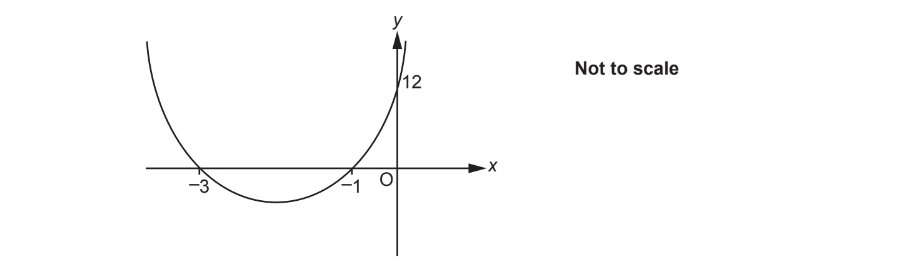

Find the values of $a,b$and $c$.

$a=.......................................\,b=.......................................\,c=.......................................$

## Q44 — hard — 6 marks · exam-questions

### 21() — 6 marks — command: sketch — structured — from paper Specimen paper  · 4MA1/1H
The curve $C$ has equation   $y=x^{2}--6x+4$

Using the axes below, sketch the curve $C$.
On your sketch show clearly

(i) the exact coordinates of any points of intersection of $C$ with the coordinate axes, 

(ii) the coordinates of the turning point.

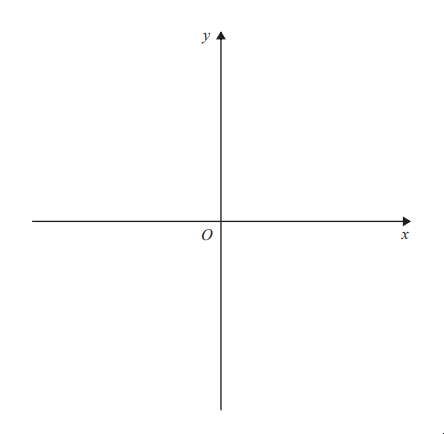

## Q45 — hard — 4 marks · exam-questions

### 16((a)) — 2 marks — command: write — structured — from paper Specimen paper · 4MA1/2H
The diagram shows part of a sketch of the curve $y=\mathrm{sin}x^{\circ}$

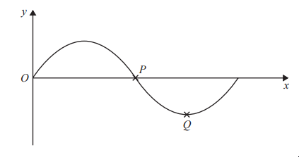

Write down the coordinates of 
(i)   the point $P$

(ii)   the point $Q$

### 16((b)) — 2 marks — command: sketch — structured — from paper Specimen paper · 4MA1/2H
Sketch the graph of $y=\mathrm{tan}x$for `0 degree space less-than or slanted equal to space x space less-than or slanted equal to space 360 degree`

Show the coordinates of any points of intersection with the coordinate axes.

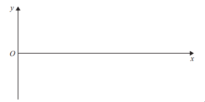

## Q46 — hard — 3 marks · exam-questions

### 18() — 3 marks — command: complete — structured — from paper 2023 June · 4MA1/2H
Here are 6 graphs

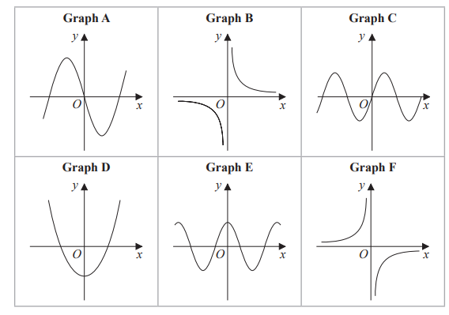

Complete the table below with the letter of the graph that could represent each given equation.

Write your answers on the dotted lines.

| Equation | Graph |
|---|---|
| $y=\mathrm{sin}x$ | ............ |
| $y=-\frac{3}{x}$ | ............ |
| $y=4x^{3}-5x$ | ........... |
