# Mark Schemes — Real-Life Graphs
**Sequences, Functions & Graphs** · Edexcel IGCSE Maths A (4MA1) — 18/Higher

## Q1 — easy — 4 marks · exam-questions

### 3((a)) — 1 marks
*A **horizontal** part of a **distance-time graph** shows when the distance is not changing. There is a horizontal part from 3 pm to 3.30 pm, we can infer this is when Simon is resting* 
*Reading off the Time axis tells us this is 0.5 hours or 30 minutes*

**30 minutes ****or**** 0.5 hours**** ****[1]**

### 3((b)) — 1 marks
> *Reading up from 5 pm on the "Time" axis, and across to the "Distance from home" axis, we see that Simon was 20 km from home*

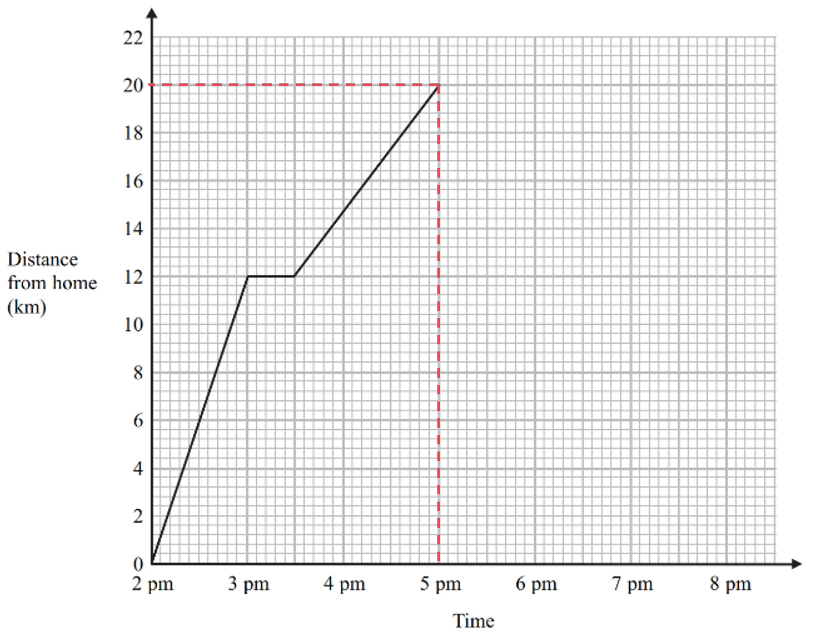

**20 km** **[1]**

### 3((c)) — 2 marks
> *As discussed in the answer to part (a), a horizontal line on the graph represents a stationary (not moving) object. From where the line ends, draw a horizontal line from 5pm to 5.30 pm to represent "stopped for 30 minutes"*

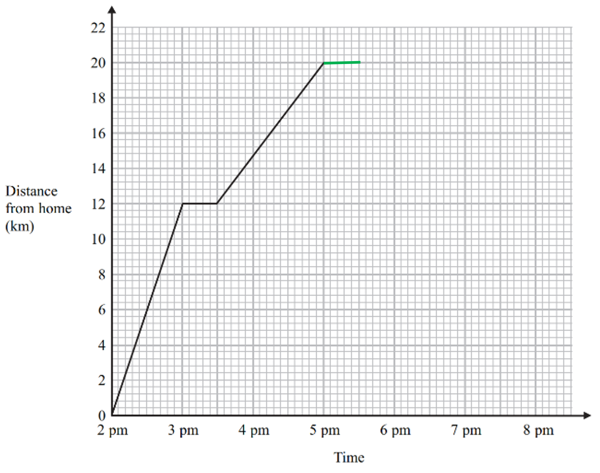

**[1]**

> *It took Simon 1 hour 30 minutes to get home. The previous part of the journey finished at 5.30 pm so this part of the journey will finish at 7 pm *

*When he was home, the Distance was 0, so mark a point on the Time axis (where Distance = 0), at 7 pm*

> *Join the end-point of your previous line to this point using a ruled **straight line** (a straight line represents steady speed)*

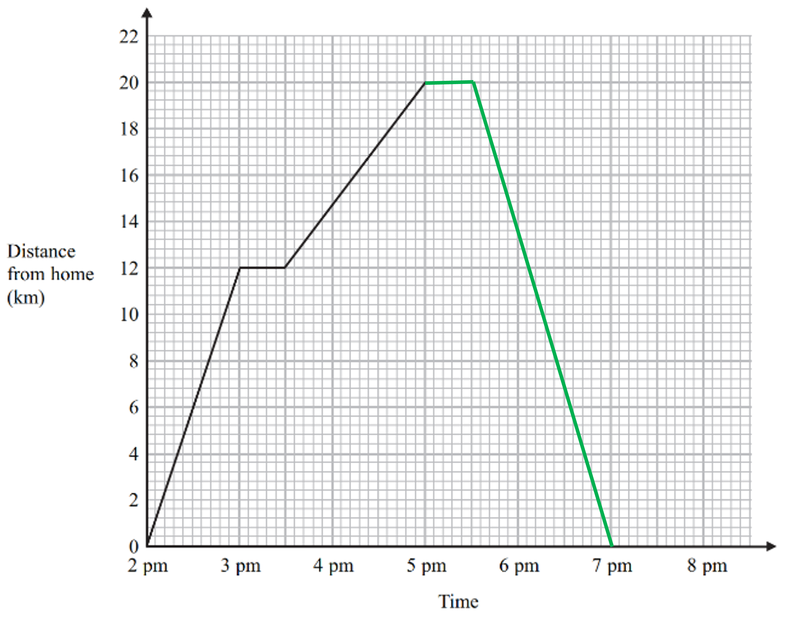

**[1]**

## Q2 — easy — 3 marks · exam-questions

### 4((a)) — 1 marks
> *The horizontal part of the graph represents when the distance from Jane's home was not changing, so we can infer that this was when she was stopped at her friend's house. Reading across to the Distance axis, this was 3 km from Jane's home*

> *Jane arrives at the ice rink where the line ends. Reading across to the Distance axis, this was 8 km from Jane's house*

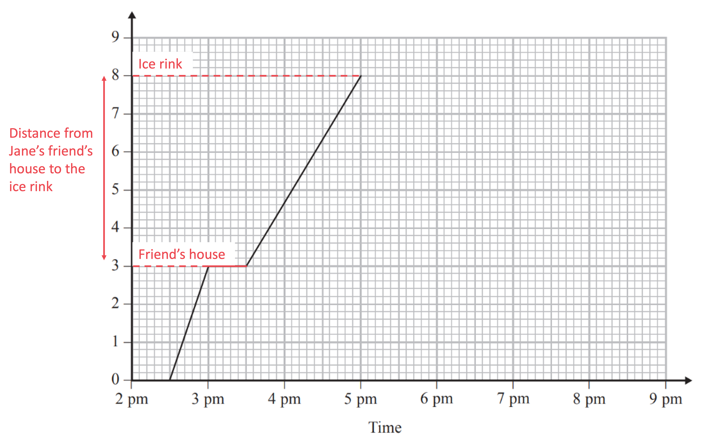

> *Calculating the distance in km between the ice rink and Jane's house,*

*8 − 3 = 5*

**5 km** **[1]** 
**Take care to answer the question asked- not how far it is from Jane's house to her friend's house, or from Jane's house to the ice rink!**

### 4((b)) — 2 marks
> *"Jane was at the ice rink for 1 hour for 30 minutes" so the distance was not changing during this time *

> *From where the line ends, draw a horizontal line from 5pm to 6.30 pm to represent "at the ice rink for 1 hour for 30 minutes"*

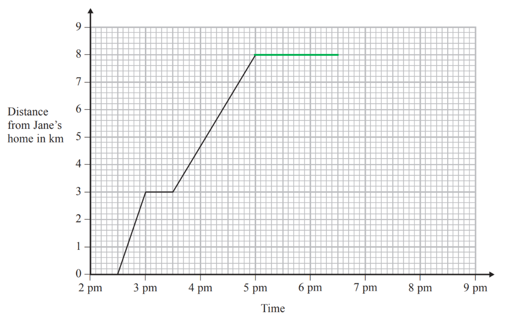

**[1]**

> *It took Jane 2 hours to get home. The previous part of the journey finished at 6.30 pm so this part of the journey will finish at 8.30 pm *

*When she was home, the Distance was 0, so mark a point on the Time axis (where Distance = 0), at 8.30 pm*

> *Join the end-point of your previous line to this point using a ruled **straight line** (a straight line represents steady speed)*

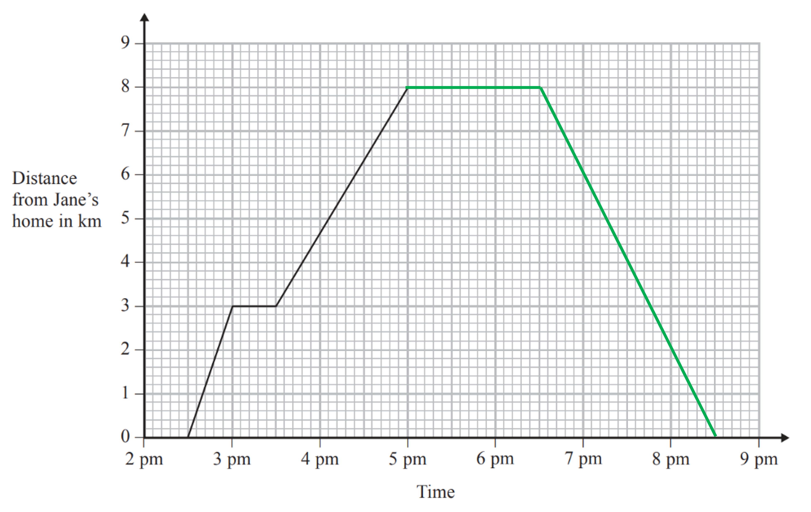

**[1]**

## Q3 — easy — 3 marks · exam-questions

### 10((a)) — 2 marks
*In a **distance-time graph**, the **speed is equivalent to the gradient** of the graph*

> *The higher the gradient (steeper the line), the greater the speed*

> *Inspecting the graph, no calculations are necessary to see that the greatest gradient (steepest line) is between 0 and 20 seconds*

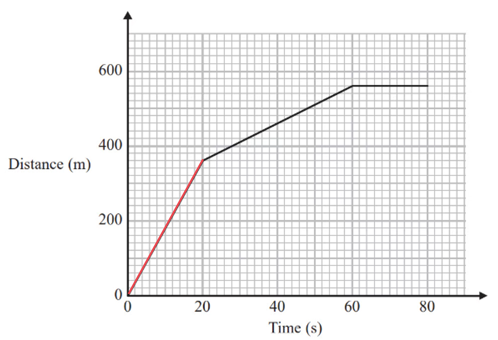

**0 to 20 seconds ****[1]**** **
**because the gradient is greatest in this section ****[1]**

### 10((b)) — 1 marks
> *In part (a) we identified the section of the graph representing the greatest speed. Pick two points on this line. It is convenient to pick the endpoints, (20, 360) and (0, 0)*

> *Find the gradient between these two points using *$\frac{\mathrm{rise}}{\mathrm{run}}$* or *$\frac{y_{1}-y_{2}}{x_{1}-x_{2}}$

*gradient = *$\frac{360-0}{20-0}=\frac{360}{20}$

> *As the distance is in metres and the time is in seconds, this gradient is the speed in m/s*

**18 m/s ****[1]**

## Q4 — easy — 3 marks · exam-questions

### 10((a)) — 2 marks
> *Pick two points on the line, taking care with the scale on the Depth axis in particular (5 small squares represents 30 cm) *
*It is convenient to pick the endpoints, (0, 210) and (140, 0)*

> *Find the gradient between these two points using *$\frac{\mathrm{rise}}{\mathrm{run}}$* or *$\frac{y_{1}-y_{2}}{x_{1}-x_{2}}$

*gradient = *$\frac{210-0}{0-140}=\frac{210}{-140}$

**using **$\frac{rise}{run}$**or the gradient formula with two points on the line**** [1]**

**Answer = −1.5 ****[1]**

**The line has a negative gradient, so make sure your answer is negative**

### 10((b)) — 1 marks
> *In any graph, the gradient represents the rate of change of the **y-**variable compared to the **x-**variable*

**rate of change of depth of water ****[1]** 
**similar answers are accepted, e.g. "rate at which depth is changing"**

## Q5 — easy — 4 marks · exam-questions

### 12((a)) — 2 marks
> *Pick two points on the line, taking care with the scale on the Depth axis in particular (5 small squares represents 30 cm) *

> *It is convenient to pick the endpoints, (0, 4) and (8, 16)*

> *Find the gradient between these two points using *$\frac{\mathrm{rise}}{\mathrm{run}}$* or *$\frac{y_{1}-y_{2}}{x_{1}-x_{2}}$

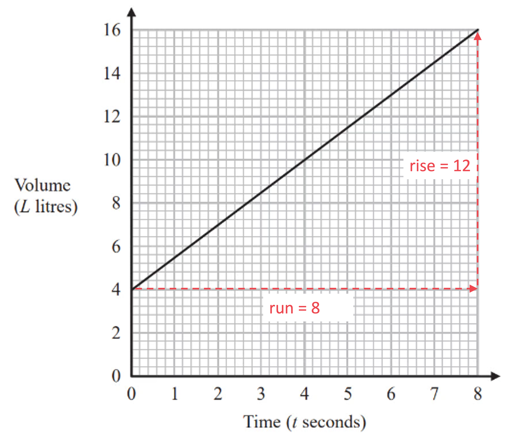

$\frac{y_{1}-y_{2}}{x_{1}-x_{2}}=\frac{16-4}{8-0}=\frac{12}{8}\mathrm{or}\frac{\mathrm{rise}}{\mathrm{run}}=\frac{12}{8}$

**using **$\frac{rise}{run}$**or the gradient formula with two points on the line**** [1]**

**Answer = 1.5 ****[1]**

### 12((b)) — 1 marks
> *In any graph, the gradient represents the rate of change of the vertical axis variable compared to the horizontal axis variable*

**rate of change of volume of liquid ****[1]** 
**similar answers are accepted, e.g. "rate at which volume of liquid is changing"**

### 12((c)) — 1 marks
> *On the Volume axis, Time = 0. Therefore where the graph intersects the Volume axis is the initial state*

**The initial volume of water is 4 litres** **[1]**

**Similar statements such as "the volume of water at the start is 4 litres" are accepted**

## Q6 — easy — 3 marks · exam-questions

### 6() — 3 marks
> *In a distance-time graph, the speed is equivalent to the gradient.*

> *To find the gradient, pick two points on the line, taking care with the scale on the Distance axis in particular (5 small squares represents 20 miles so 1 small square represents 4 miles) It is convenient to pick the endpoints,*

*(0, 48) and (4, 116)*

**any point read correctly off the graph**** [1]**

> *Find the gradient between these two points using *$\frac{\mathrm{rise}}{\mathrm{run}}$* or *$\frac{y_{1}-y_{2}}{x_{1}-x_{2}}$

$\frac{y_{1}-y_{2}}{x_{1}-x_{2}}=\frac{116-48}{4-0}$

**correctly substituting into the gradient formula or using **$\frac{rise}{run}$** [1]**

$=17$

> *Write the answer, in miles per hour.*

**Final answer:** **Answer = 17 miles per hour**

**"17"**** [1]**

## Q7 — easy — 6 marks · exam-questions

### 3((a)) — 3 marks
> *Method 1*

> *We can't find the cost of 450 kwH of electricity directly from the graph, but we read other values from the graph and scale up to find the cost of 45 kwH (as the graph shows direct proportion).*

> *For example, find the cost of 225 kwH and multiply it by 2 (because 225 × 2 = 450).*

> *Read up from 225 on the Electricity axis and across to the Cost axis.*

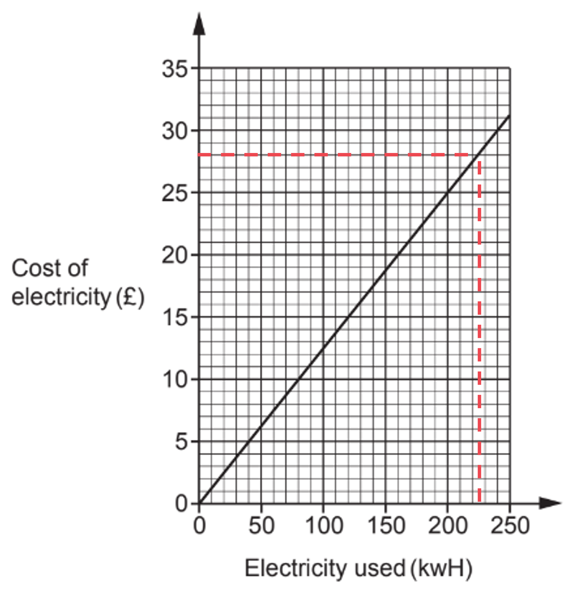

*Cost of 225 kwH = £28*

** ****reading from the graph within 1/2 small square of accuracy ****[1]**

> *(Due to the scale of the axes, some margin of error above is allowed- see note underneath the final answer.)*

> *Multiply this by 2 to find the cost of 450 kwH.*

*£28 × 2 *

**[1]**

**Answer = £56** **[1] **

**Any answer between 55.5 and 57 is accepted so long as it is consistent with the reading off the diagram**

> *Method 2*

> *We can't find the cost of 450 kwH of electricity directly from the graph, but we can find the cost per kwH by finding the gradient of the line.*

> *Gradient = *$\frac{\mathrm{rise}}{\mathrm{run}}$*. The two obvious integer points to use are (0, 0) and (200, 25):*

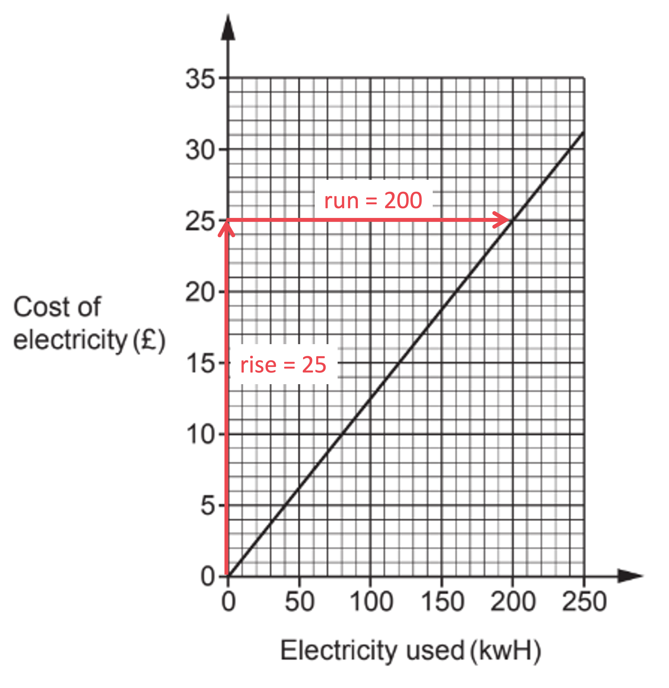

*Gradient = cost per kwH =*$\frac{25}{200}=0.125$

**  ****gradient from the graph within 1/2 small square of accuracy ****[1]**

> *(Due to the scale of the axes, some margin of error above is allowed- see note underneath the final answer.)*

> *Multiply this by 450 to find the cost of 450 kwH.*

*0.125 × 450*

**[1]**

**Answer = £56.25** **[1] **

**Any answer between 55.5 and 57 is accepted so long as it is consistent with your gradient**

### 3((b)) — 3 marks
> *Method 1*

> *Multiply 14.3 pence by 450 to compare with the result of part (a). But convert 14.3 pence to £0.143 first.*

*0.143 × 450*

**[1]**

*cost for 450 kwH = £64.35*

**[1]**

**Company ****B**** would have the steeper line because**** the cost per unit of electricity is higher** **[1]**

> *Method 2*

> *Plot the gradient represented by 14.3 pence (£0.143) per hour on the graph.*

> *For example, after 200 hours,*

*0.143 × 200 = £28.60*

**[1]**

> *Plot a line for Company B through (0, 0) and (200, 28.6).*

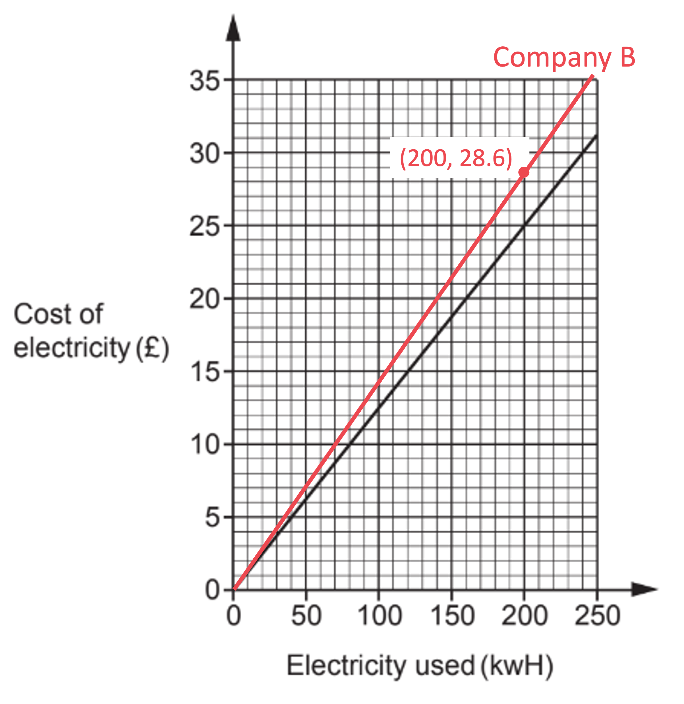

**[1]**

**Company ****B**** would have the steeper line because**** the cost per unit of electricity is higher** **[1]**

## Q8 — easy — 3 marks · exam-questions

### 8((a)) — 3 marks
i) *In a speed-time graph, the gradient of a line represents the acceleration. Find the gradient between (0, 0) and (4, 8) using *$\frac{\mathrm{rise}}{\mathrm{run}}$* or *$\frac{y_{1}-y_{2}}{x_{1}-x_{2}}$*.*

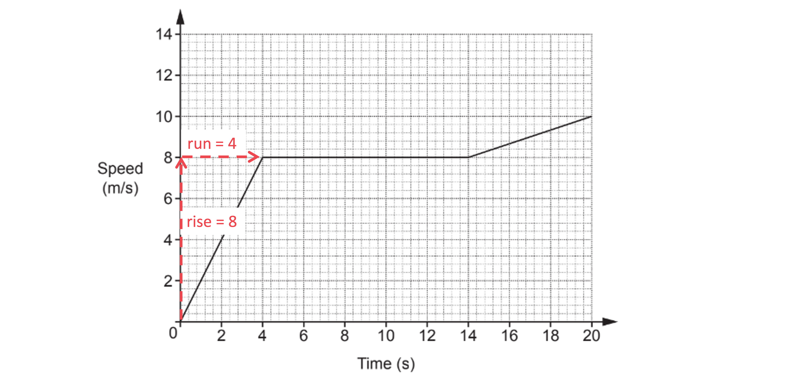

*acceleration = gradient = *$\frac{8}{4}$

** [1]**

**2 m/s****2**** ****[1]**

ii) *Between 4 and 14 seconds, the line is horizontal, representing constant speed, so no acceleration (the gradient is 0).*

**0 m/s****2**** ****[1]**

## Q9 — medium — 5 marks · exam-questions

### 6((b)) — 1 marks
> *Draw a line up from £5 on the horizontal axis until it hits the line. Then draw a line across and read off the vertical \$ axis*

**\$8 ****[1]**

### 2() — 4 marks
> *Work out how much money is left to pay*

*\$600 − \$200 = \$400*

**[1]**

> *Ella needs to pay \$400 in pounds *

> *The Dollars axis does not go up to \$400 but \$400 = \$4 × 100, so convert \$4 to pounds and then multiply by 100 (we could also convert \$8 and multiply by 50, or convert \$10 and multiply by 40)*

*\$4 = £2.50*

> *Multiply by 100*

*£2.50 × 100 = £250*

**[1]**

> *Subtract this amount from the £800 that Ella has*

*Amount Ella has left = £800 − £250*

**[1]**

**Amount Ella has left = £550 ****[1]**

## Q10 — medium — 4 marks · exam-questions

### 11() — 4 marks
> *We need use the travel graph to calculate Debbie's average speed. The gradient on a distance-time graph represents the speed*

> *Method 1*

$\mathrm{average} \mathrm{speed}=\frac{\mathrm{total} \mathrm{distance}}{\mathrm{total} \mathrm{time}}$

> *Read the total distance and the total time off the distance-time graph as below*

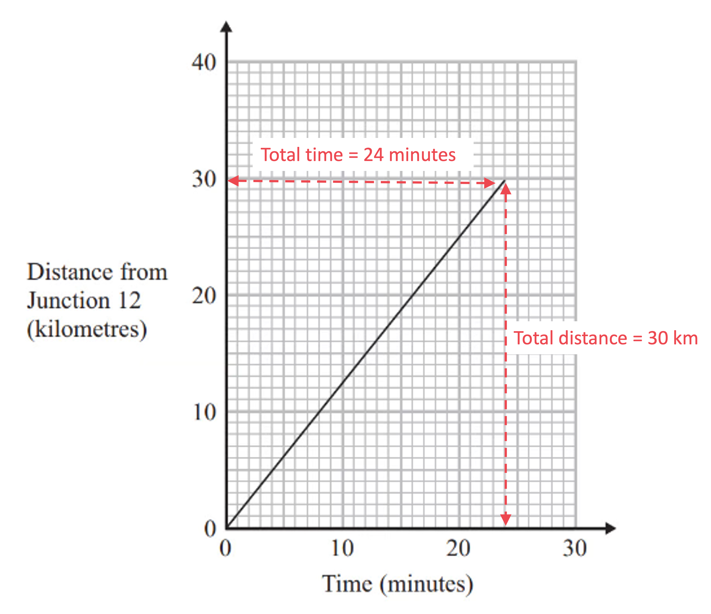

*average speed *$=\frac{30}{24}$

**dividing total distance by total time ****[1]**

$=\frac{5}{4}\mathrm{km}/\mathrm{minute}$

> *Note that Ian's speed is given in km/hour whereas the time on the graph is given in minutes. *

> *Therefore convert the speed to km/hour by multiplying by 60*

$=\frac{5}{4}\times60$

** converting the units**** [1]**

$=75\mathrm{km}/\mathrm{hour}$

**[1]**

> *75 > 66 so we conclude Debbie's average speed was faster than Ian's*

**Debbie had the faster average speed**** [1]**

> *Method 2*

> *Debbie's journey is a represented by a straight line, so is at constant speed; so the average speed is the same as the gradient at any point on the line*

*Pick any two points on the line and use *$\frac{\mathrm{rise}}{\mathrm{run}}$* or the gradient formula *$\frac{y_{1}-y_{2}}{x_{1}-x_{2}}$ *E.g. picking the points (20, 25) and (0, 0) as shown below*

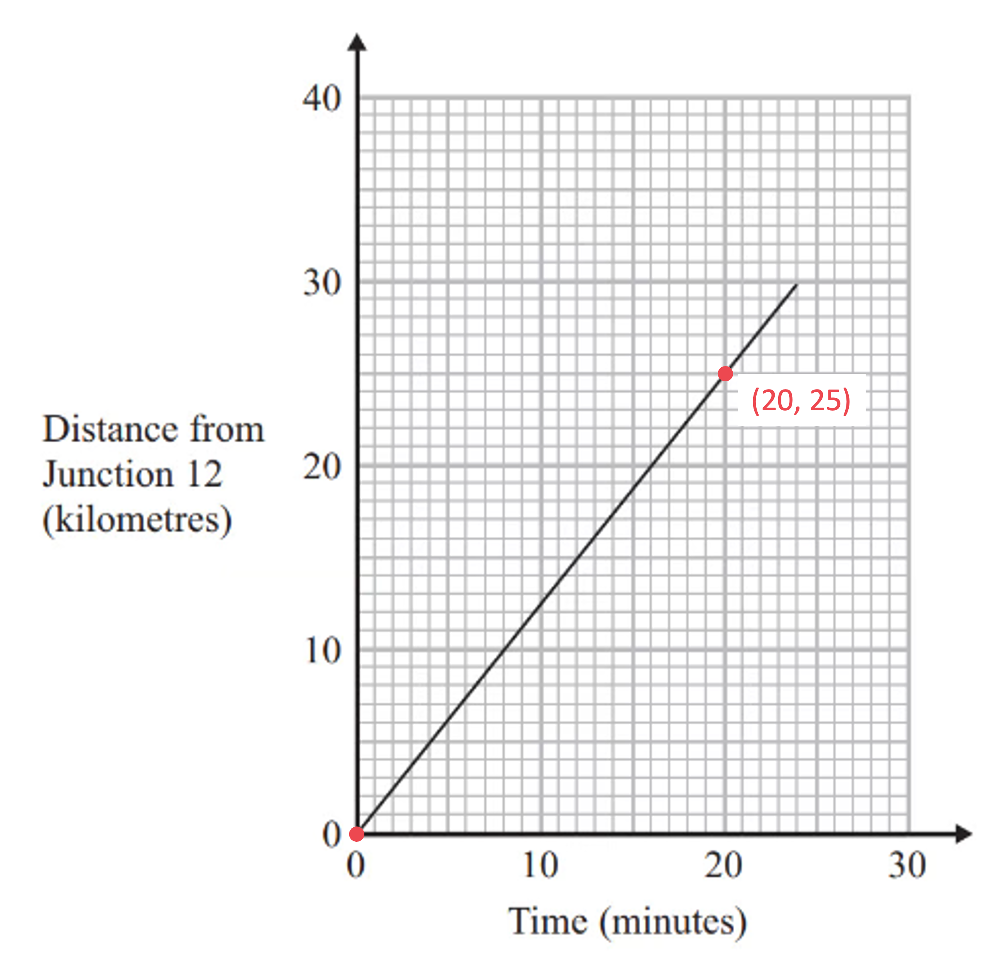

> *Note that Ian's speed is given in km/hour whereas the Time on the graph is given in minutes.*

> * Therefore before calculating the gradient, convert the times to minutes*

*(20, 25) → *`open parentheses 1 third comma space 25 close parentheses`

** converting the units**** [1]**

*gradient *$=\frac{25-0}{\frac{1}{3}-0}$

**attempt to find gradient using **$\frac{rise}{run}$** or gradient formula ****[1]**

$=75\mathrm{km}/\mathrm{hour}$

**[1]**

> *75 > 66 so we conclude Debbie's average speed was faster than Ian's*

**Debbie had the faster average speed**** [1]**

## Q11 — medium — 5 marks · exam-questions

### 5((a)) — 3 marks
> *15 km/hour means that Bradley would travel 15 km in one hour. He leaves at 9 am so at 10 am he would have travelled 15 km, mark a point at (10am, 15 km)*

> *Find 9.36 am on the Time axis. You will need to work out the scale; there are 20 small squares to one hour, so 1 small square is 3 minutes*

> *When you have located 9.36am, use a pencil to draw a faint line vertically up through the grid*

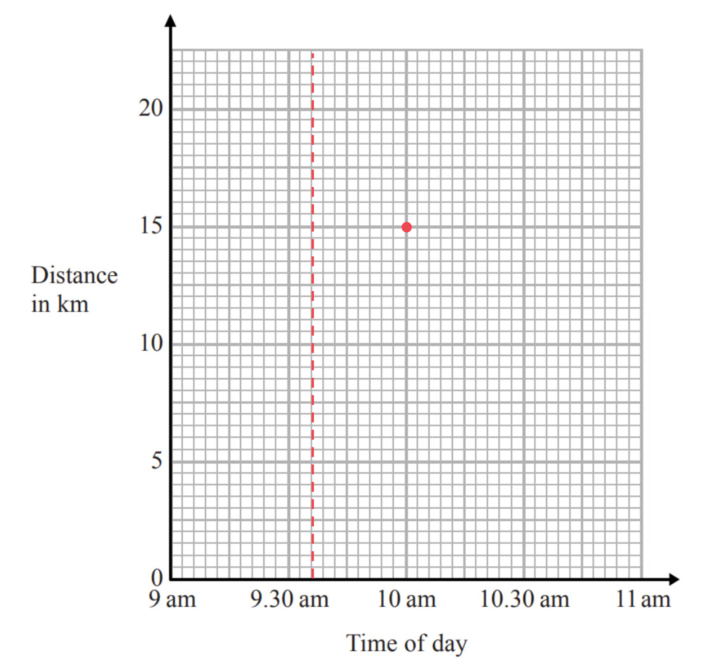

> *Now line up your ruler so that it goes through (9 am, 0 km) and (10 am, 15km. Draw a clear line from (9 am, 0 km) as if to (10 am, 15km), but stopping at 9.36 am*

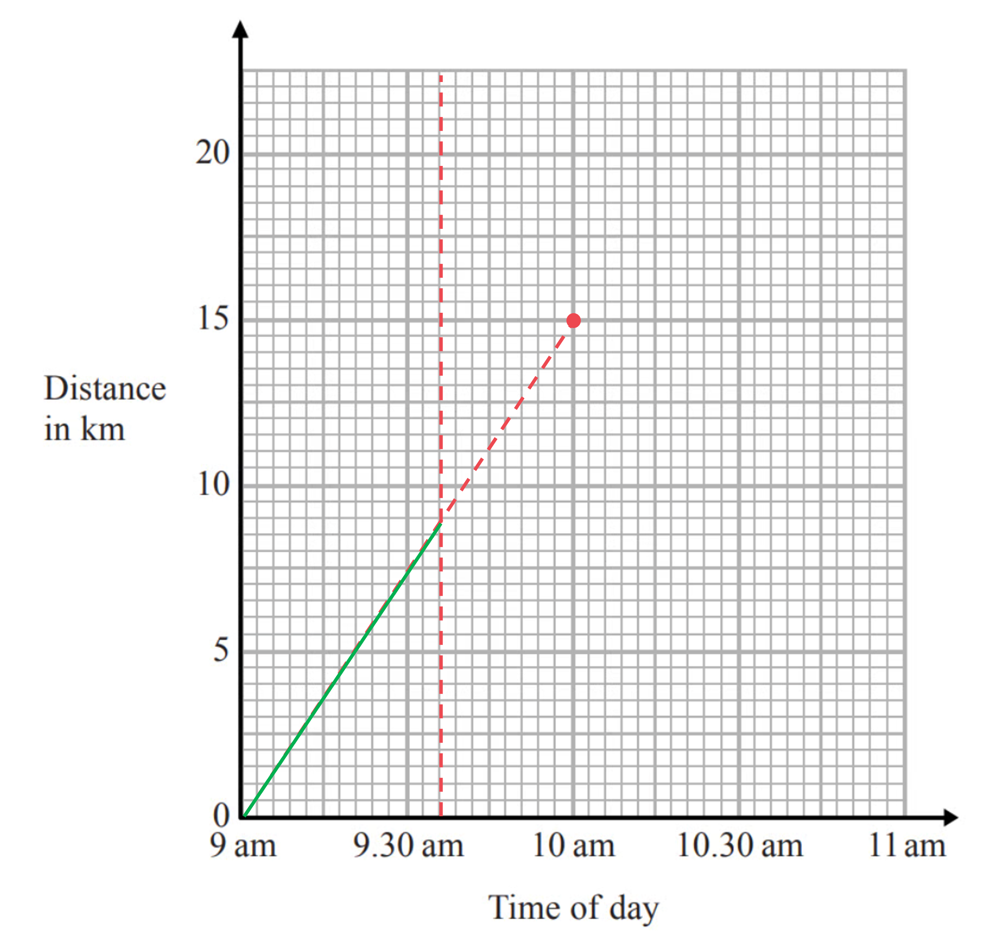

**line with correct gradient ****[1] **
**line ending at correct point ****[1]**

> *"From 9.36 am to 10.45 am, he cycled a further 8 km". Reading from the graph, we see that at 9.36 am he has travelled 9 km. Add the 8 km to the 9 km...*

*9 km + 8 km = 17 km*

> *... and find 10.45 am on the Time axis, follow it vertically up to where it meets 17 km on the Distance axis, mark a point. Join the endpoint of your first line at (9.36 am, 9 km) to this point at (10.45 am, 17 km)*

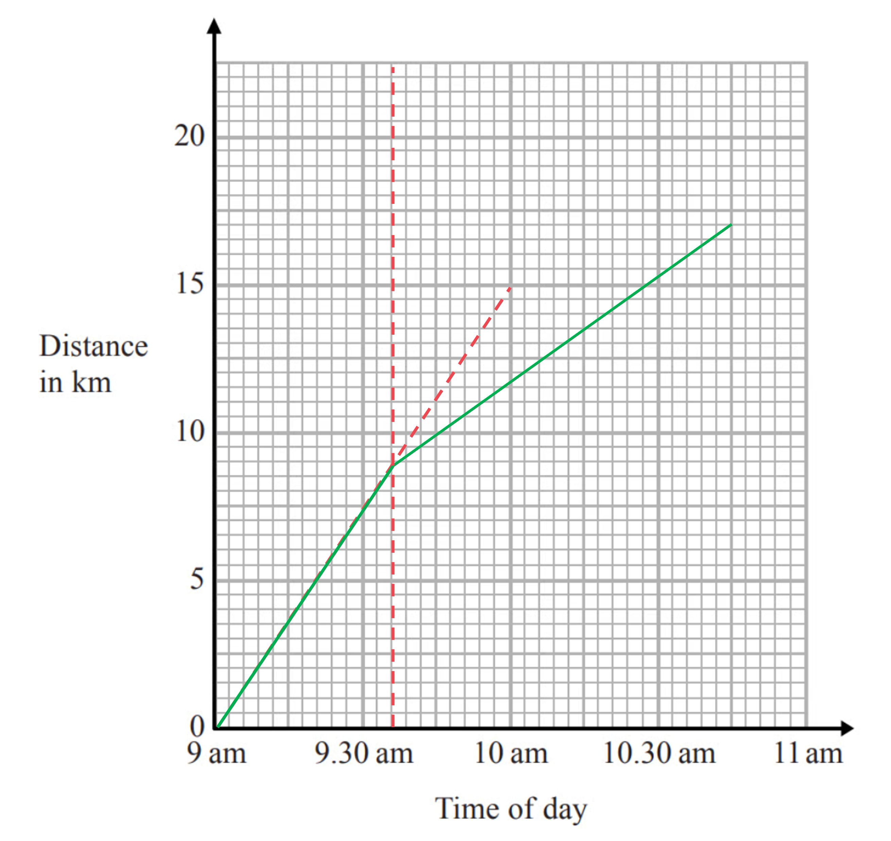

** ****fully correct graph ****[1]**

### 5((b)) — 2 marks
> *Speed = distance / time (you can use the units "km/h" → "distance/time" to remember this), so distance = speed × time*

> *Bradley cycled at 18 km/h for 15 minutes. Convert 15 minutes to decimal hours as the speed is in kilometres per hour  *

*15 minutes = 0.25 hours*

> *Now multiply the speed by the time to find the distance*

*distance = 18 × 0.25*

**[1]**

**distance = 4.5 km ****[1]**

## Q12 — medium — 5 marks · exam-questions

### 10((a)) — 2 marks
$\mathrm{average} \mathrm{speed}=\frac{\mathrm{total} \mathrm{distance}}{\mathrm{total} \mathrm{time}}$

> *Read the total distance for the first 10 minutes off the distance-time graph as below*

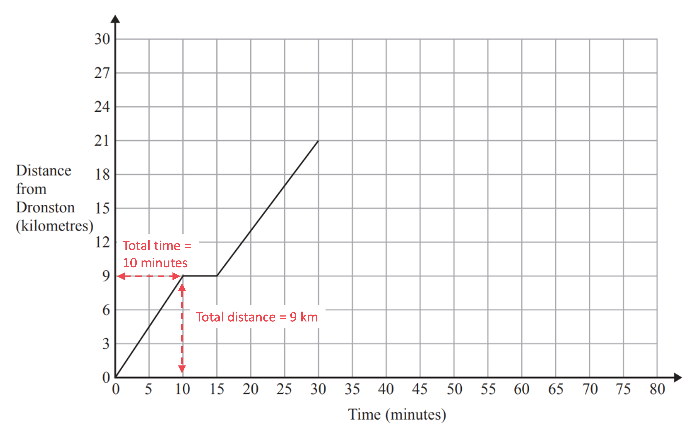

*average speed *$=\frac{9\mathrm{km}}{10\mathrm{minutes}}$

**dividing total distance by total time ****[1]**

$=0.9\mathrm{km}/\mathrm{minute}$

> *Note that Ian's speed is given in km/hour whereas the time on the graph is given in minutes. Therefore convert the speed to km/hour by multiplying by 60*

`equals open parentheses 0.9 cross times 60 close parentheses space km divided by straight h`

**Answer = 54 km/h**** [1]**

**An alternative to the above is to convert 10 minutes to **$\frac{1}{6}$** hours before dividing distance by time**

### 10((b)) — 3 marks
> *A horizontal line on the graph represents a stationary (not moving) object. From where the line ends, draw a horizontal line from (30, 21) to (45, 21) to represent "stops in Luscoe for 15 minutes"*

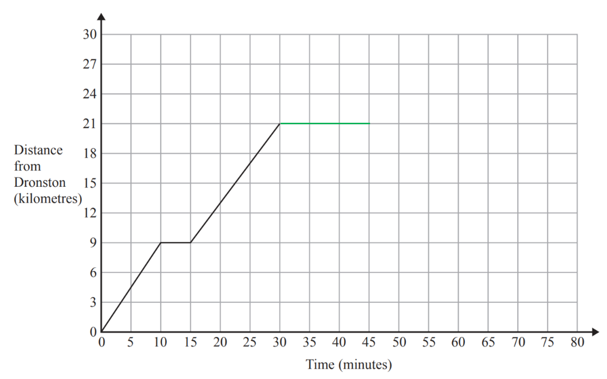

**[1]**

> *We can calculate the time taken to travel the last section using *$\mathrm{time}=\frac{\mathrm{distance}}{\mathrm{speed}}$

> *From the graph we can see that the coach is 21 km away from Dronston, so the distance is 21 km. The speed is 42 km/h*

$\mathrm{time}=\frac{21\mathrm{km}}{42\mathrm{km}/h}=0.5\text{h}$

> *Note that this is the time in hours, but we need the time in minutes to plot on the graph*

*0.5 h = 30 minutes*

** correct method to find the time taken ****[1]**

> *The coach will arrive in Dronston (where Distance from Dronston = 0) 30 minutes after the endpoint of the last section. 45 minutes + 30 minutes = 75 minutes. Draw a straight line from (45, 21) to (75, 0)*

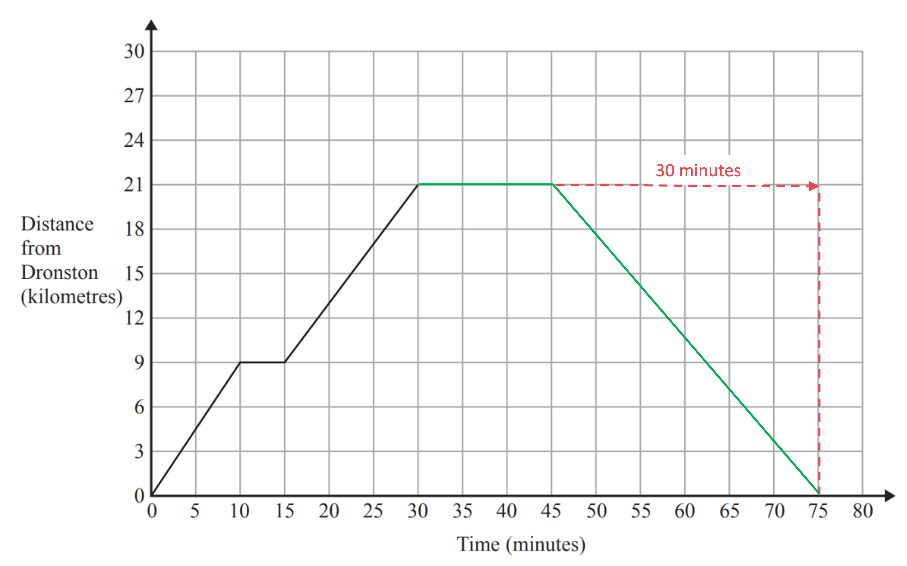

**[1]**

## Q13 — medium — 4 marks · exam-questions

### 3((a)) — 1 marks
*We can calculate the fixed cost by looking at the cost when no distance has been travelled. *

> *When Distance = 0, the line crosses the Cost axis at 10*

**£10 ****[1]**

### 3((b)) — 3 marks
> *Plot a line representing Ed's delivery charge on the same grid*

> *There is no fixed charge so the line passes through (0, 0) and "It costs £1.50 for each mile" equates to a gradient of 1.5 *

> *So draw a line through (0, 0) with a gradient of 1.5, or plot some points as below;*

*Distance = 10, Cost = 10 × £1.5 = £15 → point at (10, 15)*

*Distance = 20, Cost = 20 × £1.5 = £30 → point at (20, 30)*

> *Mark the points on the grid. Use a ruler to draw a straight line through (0, 0) and the points calculated, extending the line to the edges of the grid*

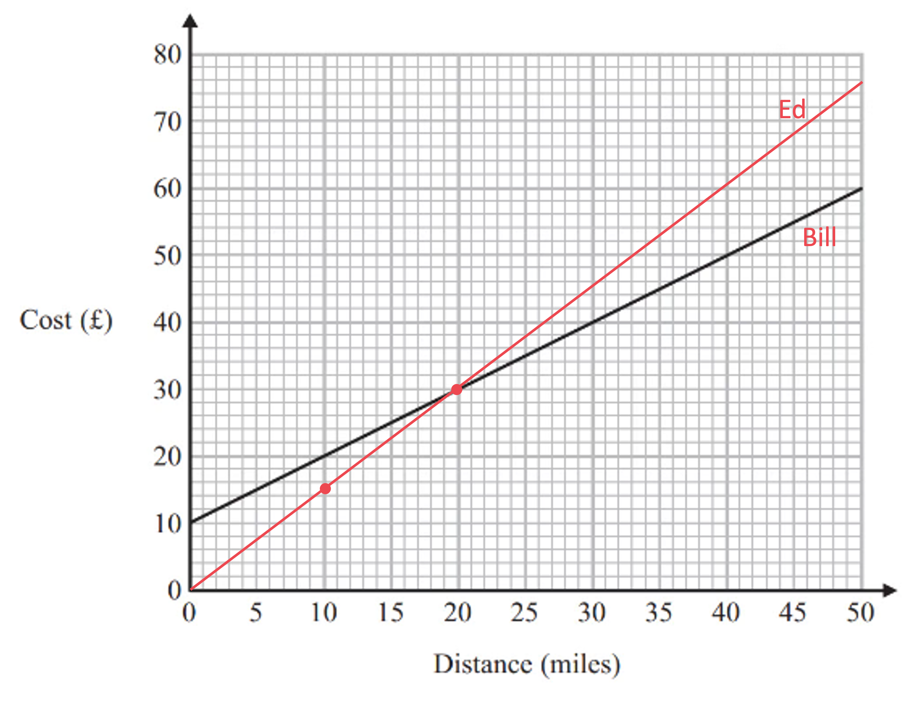

**correct line drawn on grid ****[1]**

> *Ed and Bill's lines intersect when Distance = 20. When Distance is less than 20, Ed's line is below Bill's, meaning Ed's delivery service is cheaper.*

**Ed's delivery is cheaper for a journey of less than 20 miles ****[1]** **Bill's delivery is cheaper for a distance of over 20 miles**** [1]**

**Equivalent statements are equally valid so long as it is clear which service is cheaper/ more expensive before and after 20 miles**

## Q14 — medium — 3 marks · exam-questions

### 17() — 3 marks
> *The graph is a straight line in the form of *$y=mx+c$*, ** but the horizontal axis is *$n$* instead of *$x$* and the vertical axis is *$h$* instead of *$y$*. So use the form *$h=mn+c$* where *$m$* is the gradient and *$c$* is the vertical axis intercept.*

> *You can see that the graph intersects the vertical axis at 20 so,*

$h=mn+20$

**vertical axis intercept is 20 ****[1]**

> *To find *$m$*, use *$m=\frac{y_{1}-y_{2}}{x_{1}-x_{2}}$* or *$\frac{\mathrm{rise}}{\mathrm{run}}$*. For example;*

$m=\frac{32-20}{4-0}=\frac{12}{4}=3$

**gradient is 3 ****[1]**

> *Replace *$m$* with *$3$* in the equation *$h=mn+20$*.*

$h=3n+20$ **[1]**

## Q15 — medium — 3 marks · exam-questions

### 8() — 3 marks
> *speed *$=\frac{\mathrm{distance}}{\mathrm{time}}$*. We can see from the graph that Chris cycles home in 45 minutes but the graph does not (directly) show the distance the library is from home.*

> *We can calculate the distance Chris cycled on the outward journey though, as he "cycles to the library in half an hour at a speed of 12 miles per hour" (distance = speed × time). Convert 30 minutes to 0.5 hours as the speed is in miles per hour.*

*distance of the library from home = 12 × 0.5 = 6 miles*

**[1]**

> *Now we can calculate the speed on the way home. Convert the 45 minutes to 0.75 hours first. *

> *Divide the 6 miles by 0.75 hours.*

*speed on way home *$=\frac{6}{0.75}$

**[1]**

> *Write the answer in mph (miles per hour).*

**speed = 8 mph** **[1]**

## Q16 — medium — 3 marks · exam-questions

### 23((a)) — 1 marks
> *In a velocity-time graph the acceleration is the gradient of the line.*

> *When the gradient is zero, the acceleration is zero. This happens only at the maximum point of the graph.*

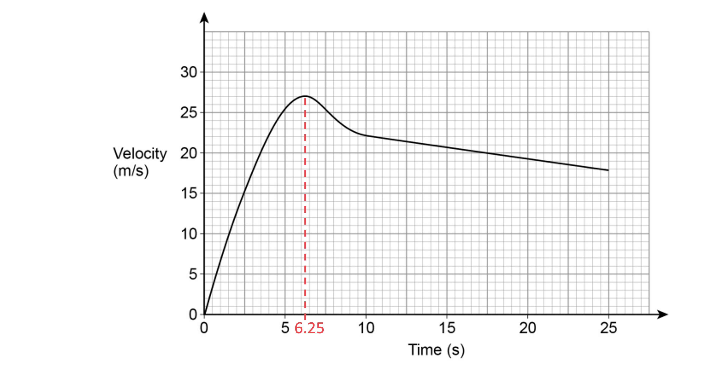

> *From the graph we see that the maximum point is when the time is 6.25 seconds.*

**Final answer:** **6.25 seconds**

**any value between 6 and 6.5 ****[1]**

### 23((b)) — 2 marks
> *In a velocity-time graph the distance travelled is the area underneath the curve (imagine the curve is a horizontal line; the area under the line is a rectangle and its area = height × width = velocity × time = distance).*

> *The area under the curve for the last 15 seconds is a trapezium.*

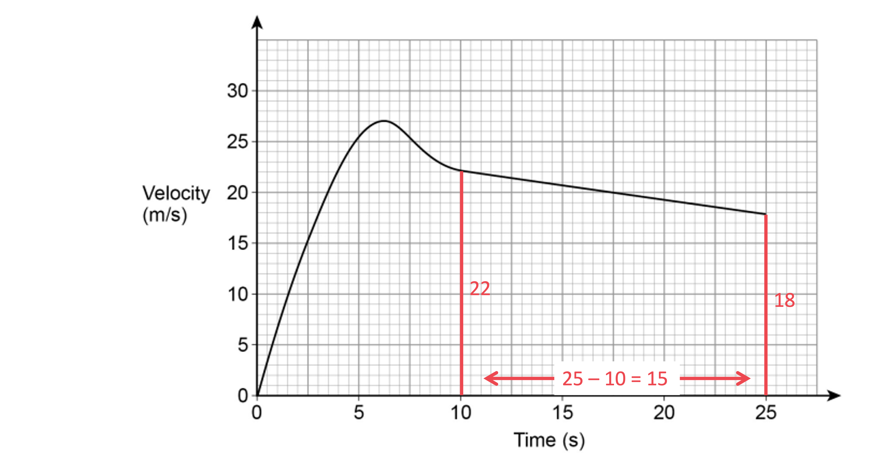

> *Area of a trapezium *`equals 1 half open parentheses a plus b close parentheses cross times h`* where *$a$* and *$b$* are the parallel lengths and *$h$* is the height. In this case, *$a=22,b=18$* and *$h=15$*.*

`area equals 1 half open parentheses 22 plus 18 close parentheses cross times 15`

**[1]**

> *Give the answer in metres.*

**300 metres**** ****[1]**

## Q17 — medium — 1 marks · exam-questions

### 16() — 1 marks
> *The amount of water poured into the tank each minute is equal to the rate of change of the number of litre over time, or the gradient of the line on the graph.*

> *Find the gradient of the line by choosing two easy to read coordinates and drawing a triangle onto the graph.*

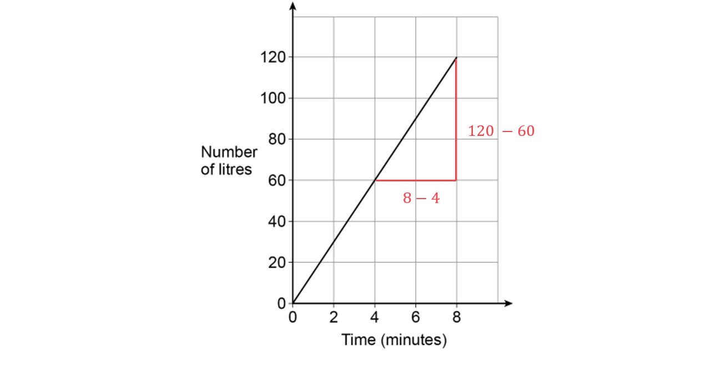

> *The gradient is found using the difference in **y **over the difference in **x **(or rise over run).*

* *$\mathrm{gradient}=\frac{\mathrm{rise}}{\mathrm{run}}=\frac{120-60}{8-4}=15\mathrm{litres}/\mathrm{min}$

**15 litres ****[1]**

## Q18 — medium — 7 marks · exam-questions

### 14((a)) — 1 marks
> *Trace up from 9 on the Time axis until you hit the line, then across to read off the Speed axis.*

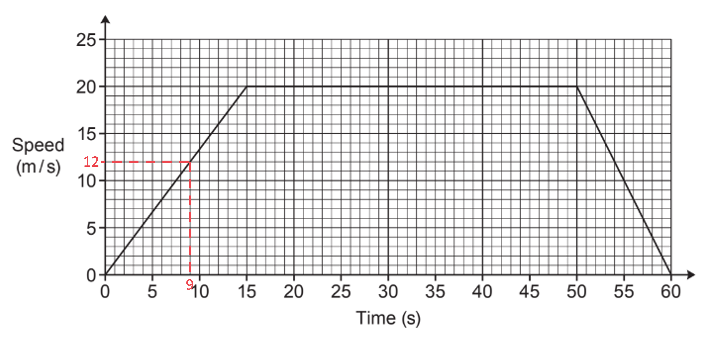

**12 m/s** **[1]**

### 14((b)) — 1 marks
**The speed was increasing at a constant rate**** or ****There was constant acceleration**** ****[1]**

### 14((c)) — 5 marks
> *Average speed = *$\frac{\mathrm{total} \mathrm{distance}}{\mathrm{total} \mathrm{time}}$* so we need to find the total distance (the total time is 60 seconds).*

> *The **area** under a **speed-time graph** represents the **distance** (because distance = speed × time).*

> *The speed-time graph here is in the shape of a trapezium and area of a trapezium = *`1 half open parentheses a plus b close parentheses h`* where *$a$* and *$b$* are the parallel lengths and *$h$* is the perpendicular height. We can read these values from the graph:*

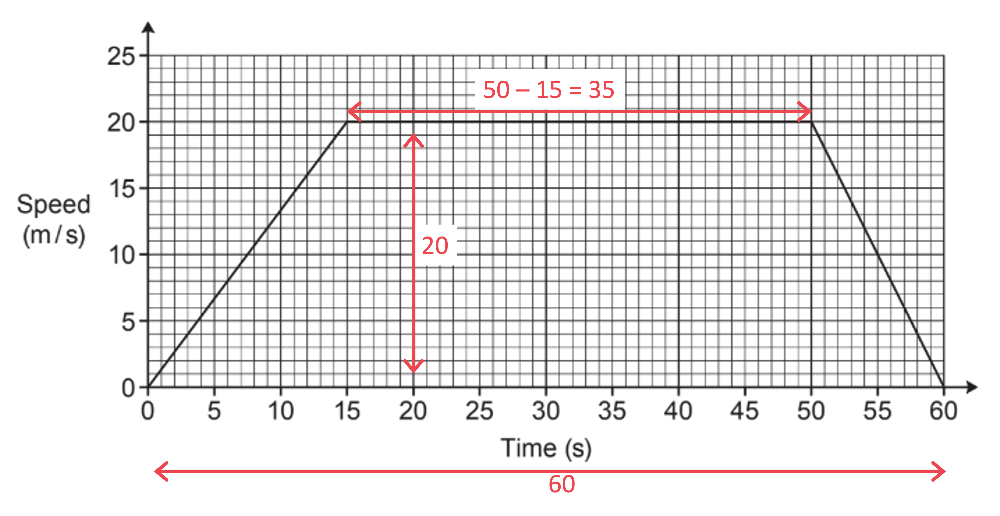

*Distance = area = *`1 half open parentheses 35 plus 60 close parentheses cross times 20`

**attempt seen to find the area under the graph (using trapezium or two triangles and a rectangle) ****[1]**** **

**partially correct attempt to find area under graph (no more than one mistake) ****[1]**

*= 950 m*

**correct area ****[1]**

> *Divide this result by the total time (60 seconds) to find the average speed.*

*Average speed = *$\frac{950}{60}$

**[1]**

*                                              = 15.83333333... *

> *Round to at least 3 significant figures or state your answer as a recurring decimal.*

**Answer = **$15.8$** or **`bold 15 bold. bold 8 bold 3 with bold dot on top`** m/s ****[1]**

## Q19 — medium — 4 marks · exam-questions

### 8((b)) — 4 marks
> *The **area** under a **speed-time graph** represents the **distance** (because distance = speed × time).*

> *To find the area under the graph we can split the area into two trapeziums:*

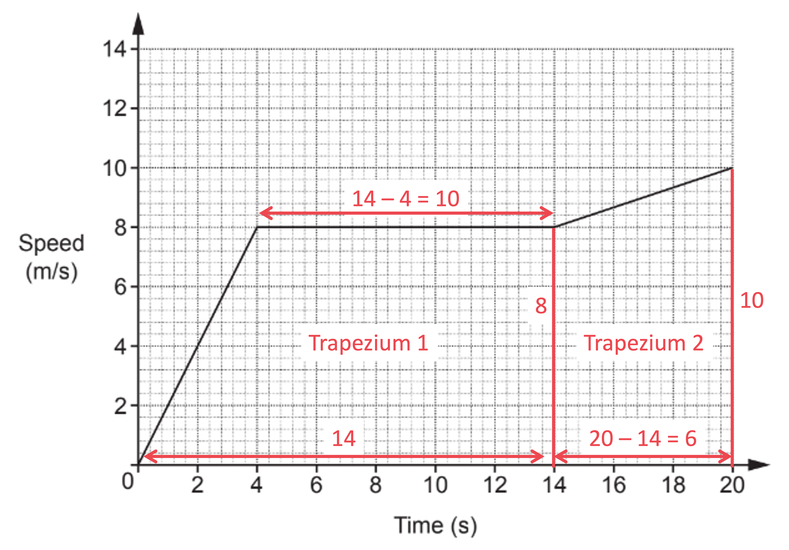

> *Area of a trapezium = *`1 half open parentheses a plus b close parentheses h`* where *$a$* and *$b$* are the parallel lengths and *$h$* is the perpendicular height.*

* area of trapezium 1 = *`1 half open parentheses 10 plus 14 close parentheses cross times 8 equals 96`

**[1]**

* area of trapezium 2 = *`1 half open parentheses 8 plus 10 close parentheses cross times 6 equals 54`

**[1]**

> *Add the two areas together to find the total area (equivalent to total distance).*

*Total distance = total area = 54 + 96*

**[1]**

**Answer = 150 m ****[1]**

## Q20 — medium — 3 marks · exam-questions

### 2() — 3 marks
> *Average speed =*$\frac{\mathrm{total} \mathrm{distance}}{\mathrm{total} \mathrm{time}}$*. *

> *Reading from the graph,*

*total distance = 160 km, total time = 2.5 hours*

**correct total distance and total time ****[1]**

*Average speed = *$=\frac{160}{2.5}$

**[1]**

**Answer = 64 km/ h** **[1]**

## Q21 — medium — 9 marks · exam-questions

### 8((a)) — 2 marks
> *In a speed-time graph, the gradient of a line represents the acceleration or deceleration. Find the gradient between (65, 6) and (85, 0) using *$\frac{\mathrm{rise}}{\mathrm{run}}$* or *$\frac{y_{1}-y_{2}}{x_{1}-x_{2}}$*.*

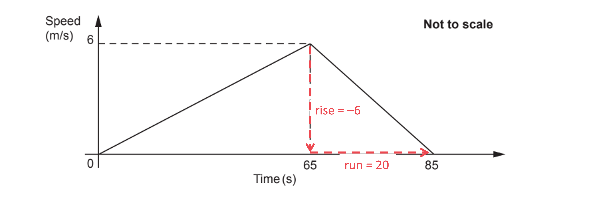

*gradient = *$\frac{0-6}{85-65}=\frac{-6}{20}$

**correct method to find the gradient**** [1]**

**         gradient**$=\frac{-3}{10}=-0.3$

> *Be careful- the question asks for the deceleration so ignore the negative sign (negative deceleration means acceleration!).*

** 0.3 m/s****2**** ****[1] **

**You can give your answer as a fraction or decimal but as it's a real-life context a decimal may be more appropriate**

### 8((b)) — 3 marks
> *In a speed-time graph, the area under the graph represents the distance. The distance between the library and the town hall is the whole of the graph, which is a triangle so find the area using *$\frac{1}{2}\times\mathrm{base}\times\mathrm{height}$*.*

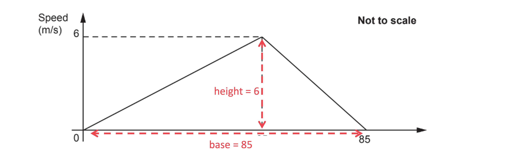

*area = *$\frac{1}{2}\times85\times6$

**finding part of the area under the graph ****[1] **

**valid method to find area under whole graph ****[1]**

> *Write the answer.*

**Distance = 255 m ****[1]**

### 8((c)) — 4 marks
> *The maximum speed reached is read from the vertical axis on the graph.*

*maximum speed = 6 m/s*

**[1]**

> *However be careful! The question asks for the speed in kilometers per hour (km/h).*

> *Convert to metres per hour by multiplying by 60 twice (for seconds to minutes, and minutes to hours).*

*in metres per hour = 6 × 60 × 60 = 21 600 m/h*

**multiplying by 3600 ****[1]**

> *Convert to kilometres per hour by dividing by 1000.*

*in kilometres per hour = 21 600 ÷ 1000 *

**dividing by 1000 ****[1]**

**Maximum speed = 21.6**** ****km/h*** ***[1]**

## Q22 — medium — 3 marks · exam-questions

### 19() — 3 marks
> *The **area** under a **speed-time graph** represents the **distance** (because distance = speed × time).*

> *The area under the graph is a trapezium and area of a trapezium = *`1 half open parentheses a plus b close parentheses h`* where *$a$* and *$b$* are the parallel lengths and *$h$* is the perpendicular height.*

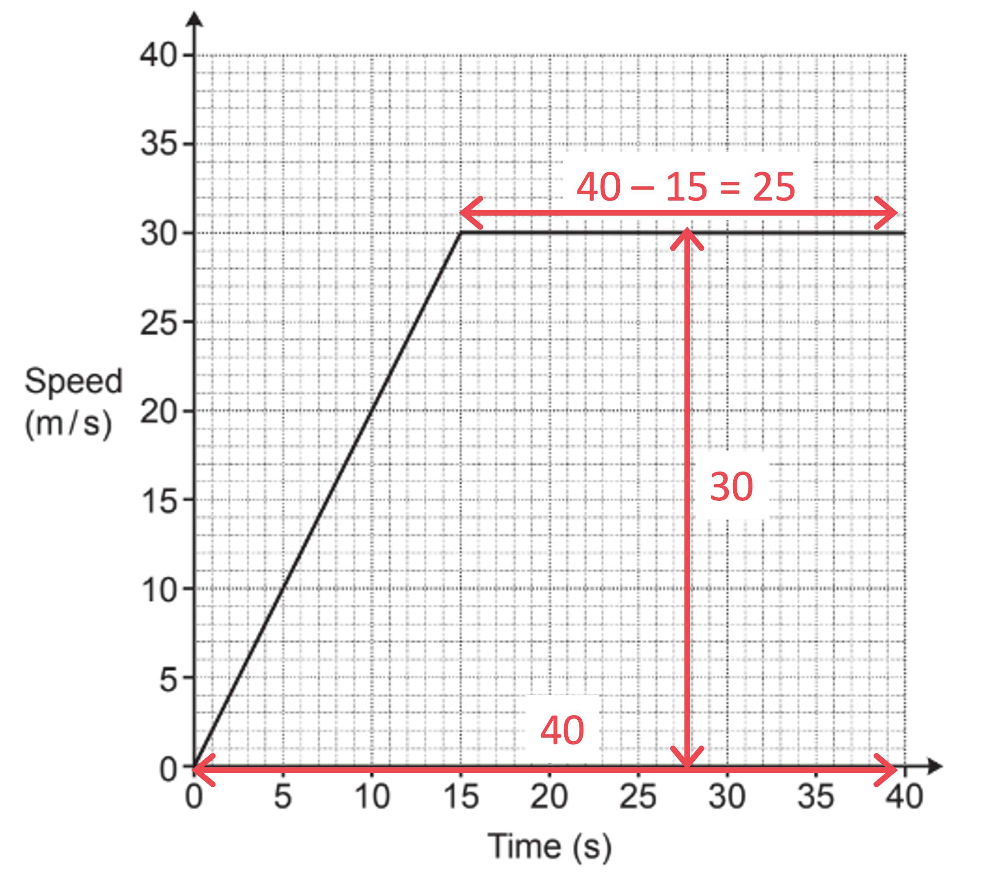

* area of trapezium = *`1 half open parentheses 25 plus 40 close parentheses cross times 30`

**attempt to find area under curve ****[1] **
**correct substitution into trapezium formula (or a triangle and a rectangle) ****[1]**

**Answer = 975 m*** ***[1]**

## Q23 — hard — 5 marks · exam-questions

### 21((a)) — 3 marks
> *In a **speed-time graph**, the **area under the graph** is the **distance** *

> *This graph is in the shape of a trapezium and area of a trapezium *`equals 1 half open parentheses a plus b close parentheses cross times h`* where *$a$* and *$b$* are the parallel lines and *$h$* is the height. In this question, *$V$* is equivalent to *$h$* of the trapezium, so we find *$V$* by substituting into the trapeizium formula and solving for *$V$

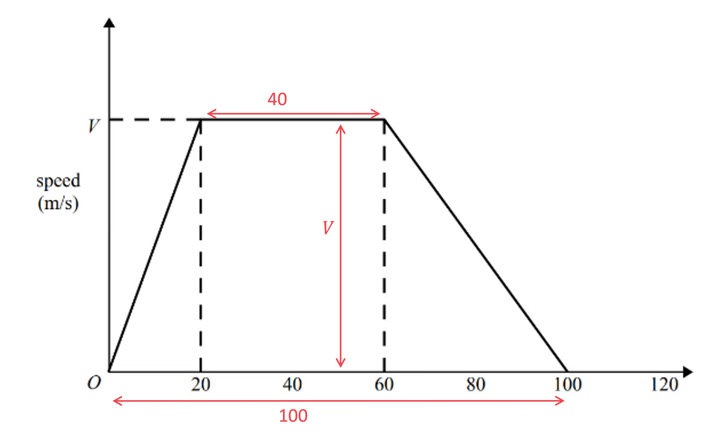

> *The distance is equivalent to the area in the trapezium area formula, from the diagram we see that *$a=40$*, *$b=100$*, and *$V$*is equivalent to *$h$

> *Note that the speed is metres per second but the area we have been given is in km. So convert 1.75 km to metres before substituting into the trapezium area formula*

*distance = 1.75 km = (1.75 × 1000) m = 1750 m*

> *Now we can substitute all our values into the trapezium formula*

`1750 equals 1 half open parentheses 40 plus 100 close parentheses cross times V`

**[1]**

> *Rearrange to solve for *$V$

$1750=70\timesV\,V=\frac{1750}{70}$

**[1]**

$V=25$** [1]**

### 21((b)) — 2 marks
> *On a **speed-time graph**, a **straight line** indicates that **acceleration is constant*

> *In the first part, we have a straight line with a positive gradient. The positive gradient means that the speed is increasing so acceleration is positive*

> *In the second part, we have a horizontal (gradient = 0) straight line. Horizontal means that the speed neither increasing nor decreasing so there is no acceleration (though it is still constant)*

> *In the third part, we have a straight line with a negative gradient. The negative gradient means that the speed is decreasing so acceleration is negative*

**Final answer:** **In the first part acceleration is constant and positive,**

**Final answer:** **in the second part acceleration is 0 (and constant),**

**Final answer:** **in the third part acceleration is constant and negative.**

**constant acceleration in all parts (0 acceleration in part 2 is acceptable) ****[1] **
**gradient is positive, 0 and negative, or stating the gradients as 1.25, 0 and −0.625 m/s****2 ****[1]**

## Q24 — hard — 6 marks · exam-questions

### 2((a)) — 1 marks
> *On a **distance-time graph**, the **gradient **of the line shows the **speed.*

> *The gradients of the lines before and after Jalina stops look similar, however they could be compared by carefully sliding a ruler from one to the other, or by calculating the gradients of both lines. *

> *Before stopping: *

$\mathrm{Gradient}=\frac{15}{1}=15\mathrm{km}/h$

> *After stopping: *

$\mathrm{Gradient}=\frac{9}{0.75}=12\mathrm{km}/h$

**Jalina cycled faster before stopping as this line has the greater gradient ****[1]**

### 2((b)) — 2 marks
> *Draw a horizontal line at a distance from home of 24 km from 12 00 to 12 45 to show that Jalina did not travel any distance whilst at the park.*

> *From the graph, it can be seen that the distance from the park to Jalina's home is 24 km.*

> *Use the distance and the speed to find the amount of time it took Jalina to cycle home.*

$\mathrm{time}=\frac{\mathrm{distance}}{\mathrm{speed}}=\frac{24\mathrm{km}}{16\mathrm{km}/h}=1.5h$

** [1]**

> *Adding 1.5 hrs to the time of 12 45 gives the time 14 15.*

> *Draw a straight line from the end of your horizontal line (at 12 45, 24) to the x axis at 14 15.*

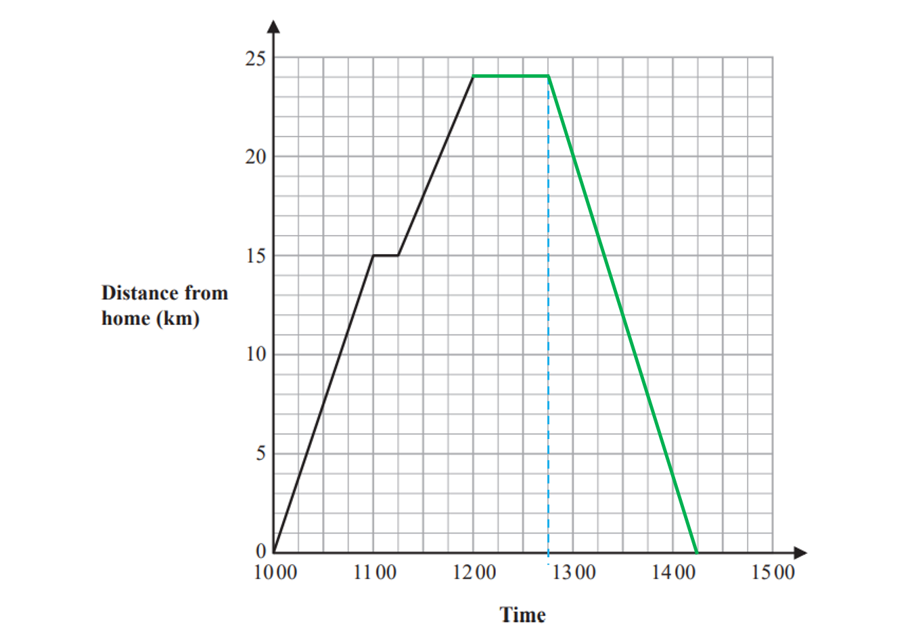

**[1]**

### 2((c)) — 3 marks
> *The times Jalina was cycling were from 10 00 - 11 00 (1 hr), from 11 15 - 12 00 (45 mins) and from 12 45 - 14 15 (1.5 hrs).*

> *Find the total time that Jalina was cycling for.*

$1\mathrm{hr}+45\mathrm{min}+1.5\mathrm{hr}=3\mathrm{hr}15\mathrm{mins}=3.25\mathrm{hrs}$

**[1]**

> *Find the total distance that Jalina cycled.*

$2\times24\mathrm{km}=48\mathrm{km}$

> *Find the average speed by dividing distance by time.*

$\mathrm{speed}=\frac{\mathrm{distance}}{\mathrm{time}}=\frac{48\mathrm{km}}{3.25\mathrm{hrs}}=14.768...\mathrm{km}/h$

**[1]**

> *Round your answer to 1 decimal place.*

$14.8\mathrm{km}/h$* ***[1]**

## Q25 — hard — 3 marks · exam-questions

### 28() — 3 marks
> *Method 1*

> *In a **speed-time graph**, the **area under the graph** is the **distance**.*

> *Start by finding the distance during the first 4 seconds, which is on the graph is in the shape of a triangle. Area of triangle*$=\frac{1}{2}\times\mathrm{base}\times\mathrm{height}$*.*

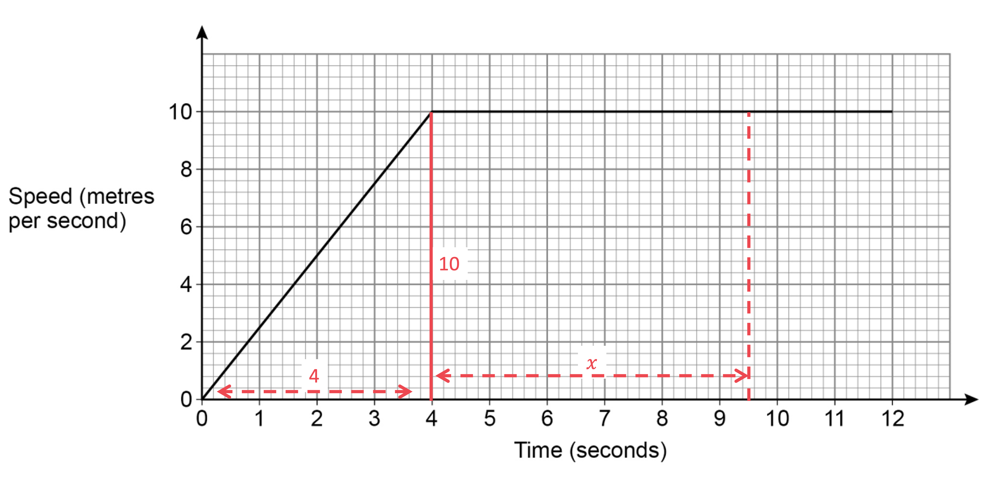

*area of triangle*$=\frac{1}{2}\times4\times10$

**[1]**

*   = 20*

> *The distance remaining to reach 75 metres is;*

*75 − 20 = 55 metres*

> *From 4 seconds onwards, the graph is a rectangle so area = length × height. The area needed is 55, the height is 10 and we need the length marked *$x$* on the diagram that gives 55. (Note that although it's marked on the diagram between 9 and 10, this is a guess and we don't actually know yet where it will be). *

`table row 55 equals cell x cross times 10 end cell row x equals cell 55 over 10 equals 5.5 end cell end table`

**[1]**

> *So the total time to reach 75 metres is the first 4 seconds plus another 5.5 seconds. *

*total time = 4 + 5.5 = 9.5 seconds*

**9.5 seconds** **[1]**

> *Method 2*

> *In a **speed-time graph**, the **area under the graph** is the **distance.*

> *This graph is in the shape of a trapezium and area of a trapezium *`equals 1 half open parentheses a plus b close parentheses cross times h`* where *$a$* and *$b$* are the parallel lines and *$h$* is the height.*

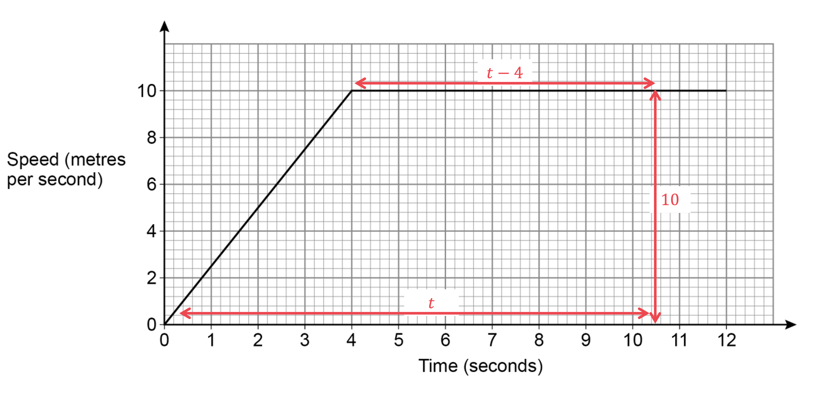

$t$* ***and*** '*$t-4$**'  or equivalent ****[1]**

> *In the diagram above, the longer parallel length has been called *$t$*. Note that although it's marked on the diagram between 10 and 11, we don't actually know yet where it will be- it's marked on the diagram for demonstration purposes only. The trick to this question is to find the value of *$t$* that gives an area of 75.*

> *The smaller parallel length becomes  *$t-4$* and the height , *$h$*, is 10. Substitute these into the trapezium formula and equate to 75.*

`75 equals 1 half open parentheses t plus t minus 4 close parentheses cross times 10`

**[1]**

> *Solve for *$t$*.*

`table row 75 equals cell 5 open parentheses 2 t minus 4 close parentheses end cell row cell divided by 5 space space space end cell equals cell space space space space space space space space space space space space space space divided by 5 end cell row 15 equals cell 2 t minus 4 end cell row cell plus 4 space space space end cell equals cell space space space space space space space space space plus 4 space end cell row 19 equals cell 2 t end cell row cell divided by 2 space space space end cell equals cell space space space divided by 2 end cell row cell 9.5 end cell equals t end table`

**After 9.5 seconds*** ***[1]**

## Q26 — hard — 4 marks · exam-questions

### 17((a)) — 1 marks
> *The ball is at a height of more than 2 metres from 0 seconds to 3 seconds, shown below.*

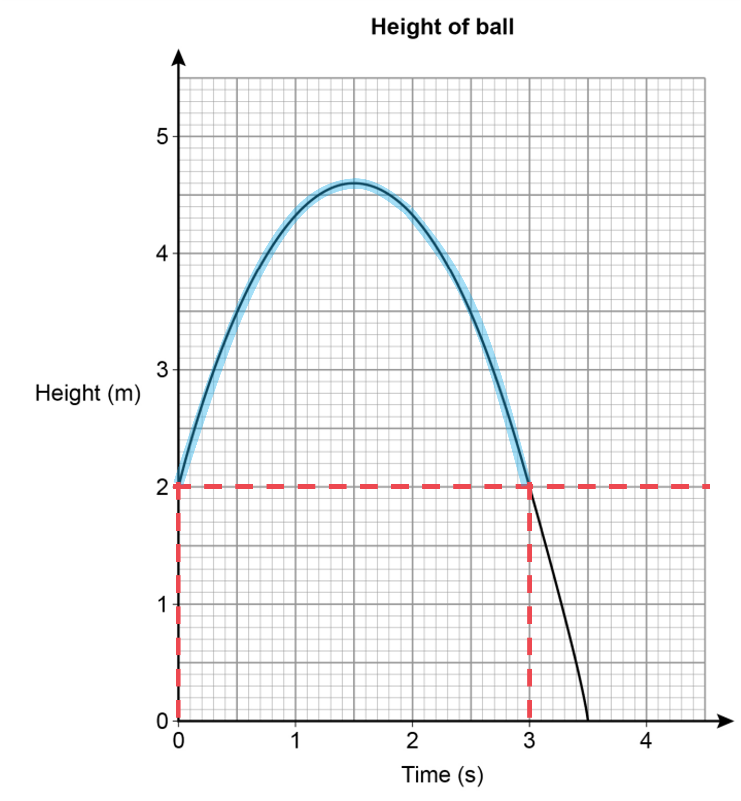

**3 seconds** **[1]**

### 17((b)) — 1 marks
> *The gradient of a distance-time graph represents the speed so when the gradient is zero, the ball is at rest.*

> *This occurs at the maximum point; read the value from the Time axis.*

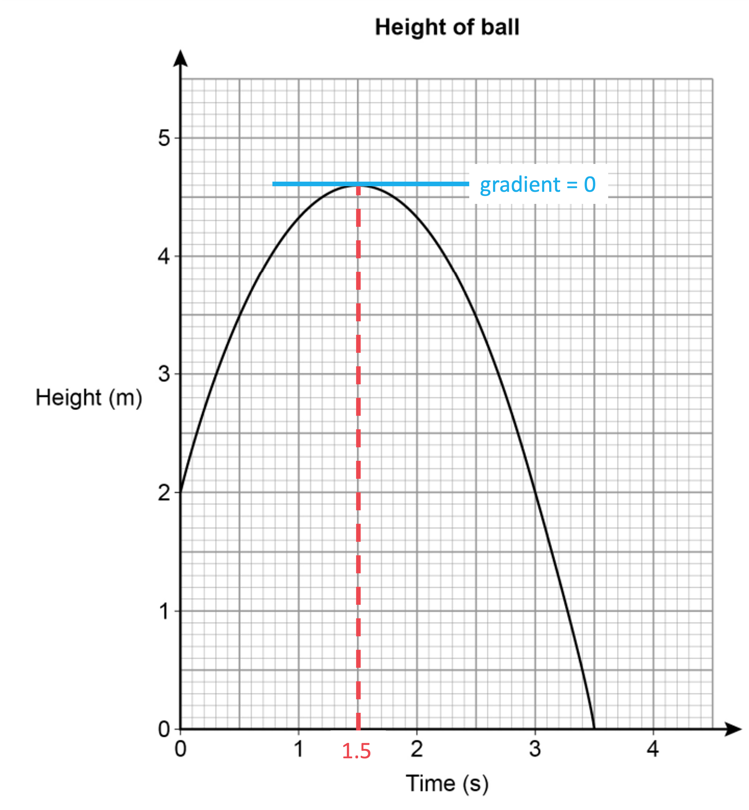

**1.5 seconds ****[1]**

### 17((c)) — 2 marks
> *Average speed *$=\frac{\mathrm{total} \mathrm{distance}}{\mathrm{total} \mathrm{time}}$*. It is also the gradient of the chord between start and end points of the time when the ball is falling; from (1.5, 4.6) to (3.5, 0).*

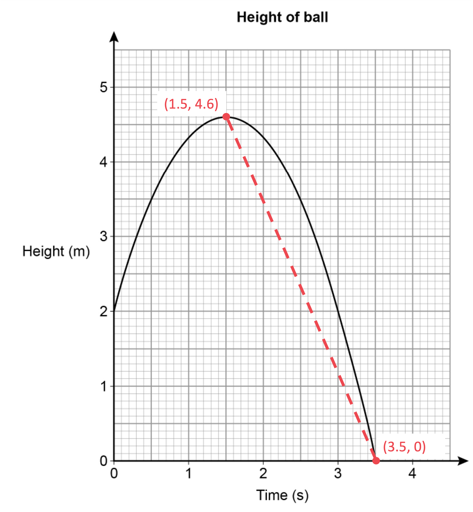

$\mathrm{average} \mathrm{speed}=\mathrm{gradient}=\frac{4.6-0}{1.5-3.5}$

**finding the gradient between points shown above using formula or **$\frac{rise}{run}$** ****[1]**

$=\frac{4.6}{-2}=-2.3$

> *Notice that the question asks for the average speed, not average velocity. Therefore ignore the negative sign. The average speed is 2.3 m/s.*

**Final answer:** **2.3 m/s ****[1]**

**Answers between 2.275 and 2.45 are accepted due to margin of error reading from the scale**

## Q27 — hard — 3 marks · exam-questions

### 24() — 3 marks
> *Complete the graph for Beth's journey, to find how long it took her to compete the race.*

> *You need to determine how far she ran in the first 8 seconds, using the fact that the area under a speed-time graph represents the distance. Area of a triangle = *$\frac{1}{2}$*× base × height.*

*area triangle *$=\frac{1}{2}\times8\times9=36$* m*

**[1]**

> *Therefore Beth ran 36 metres in the first 9 seconds. Calculate how many metres she has left until 200 m.*

*200 − 36 = 164*

> *Beth has 164 metres remaining, at a speed of 9 m/s. Time *$=\frac{\mathrm{distance}}{\mathrm{speed}}$*.*

*Time for remaining 164 m = *`164 over 9 equals 18.2 with dot on top`* seconds*

**[1]**

> *Add the first 8 seconds to this to find Beth's total race time.*

*8 + 18.2 = 26.2 seconds*

**Final answer:** **Yes, Beth finished the race before Amy**** [1] **

**"26.2" must be seen to achieve the final mark **

## Q28 — hard — 4 marks · exam-questions

### 8((a)) — 3 marks
> *"For the first 30 minutes her average speed is 40 miles per hour". 30 minutes at 40 miles per hour means 20 miles covered. Draw a point at (30 minutes, 20 miles) and draw a ruled straight line between the origin and this point.*

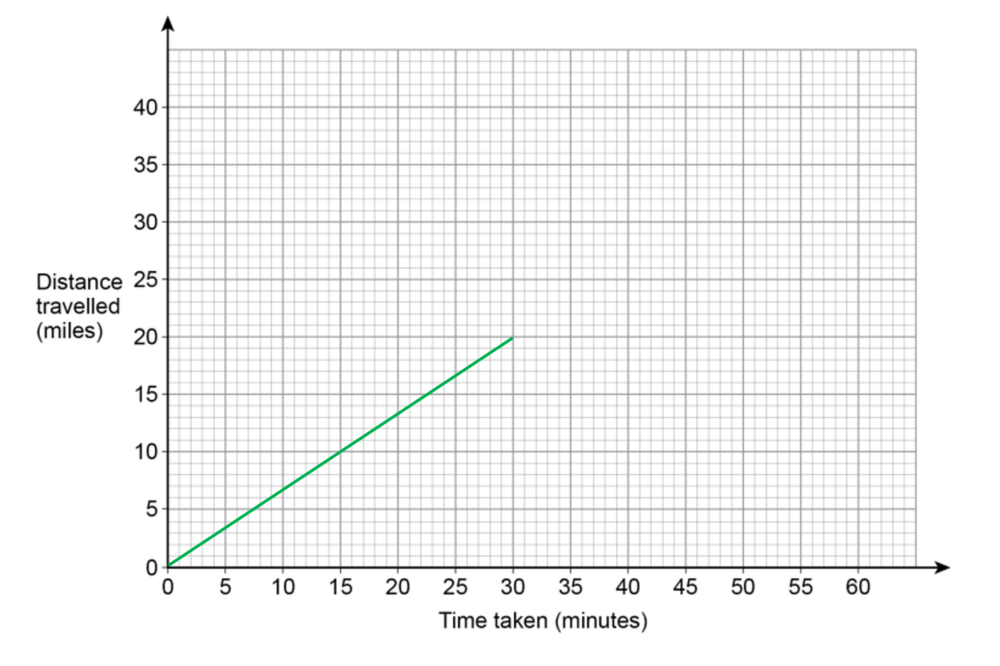

**correct first line ****[1]**

> *"She then stops for 15 minutes". Draw a horizontal line from (30 minutes, 20 miles) to (45 minutes, 20 miles).*

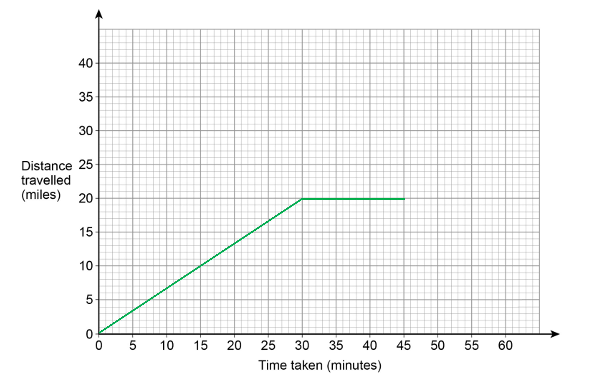

**horizontal line joining end of previous line, with length of 15 minutes ****[1]**

> *"She then completes the journey at an average speed of 60 miles per hour". Traveling at 60 miles per hour is the same as 1 mile per minute, or 5 miles up for every 5 minutes across on the axes. Draw a line from (45 minutes, 20 miles) with this gradient, stopping at 60 minutes because "the total journey time is 1 hour".*

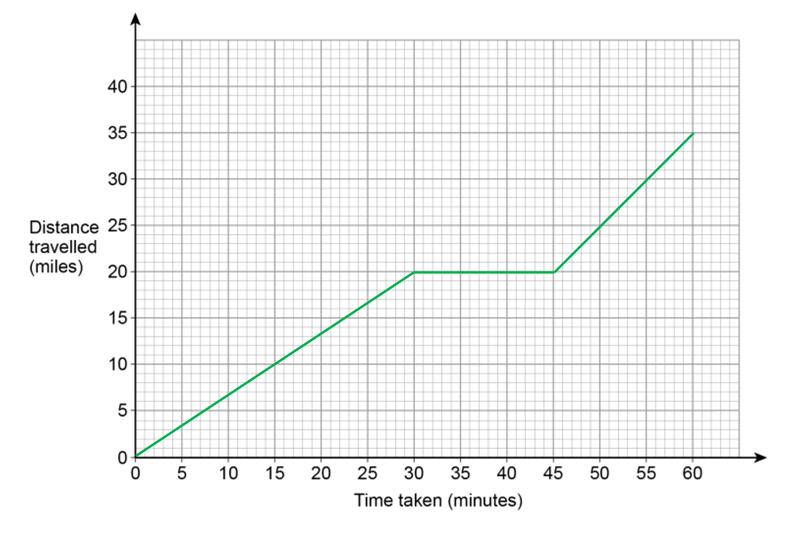

**line with correct gradient from end of previous line, finishing at Time = 60 ****[1]**

### 8((b)) — 1 marks
> *Average speed = *$\frac{\mathrm{total} \mathrm{distance}}{\mathrm{total} \mathrm{time}}$*. Read total distance and total time from the graph completed in part (a). Total distance is 35 miles and total time is 60 minutes.*

> *Note that the answer is in mph (miles per hour). So convert the total time to hours; 60 minutes = 1 hour.*

*Average speed *$=\frac{35\mathrm{miles}}{1\mathrm{hour}}$

**35 mph** **[1]**

**A common error is "35 ÷ 60 = 0.58333..."**

## Q29 — hard — 4 marks · exam-questions

### 24() — 4 marks
> *We are not told how far Amina cycled in total and due to the context of the question we can assume it was more than 400 metres (it would be a pretty straightforward question for 4 marks if she completed the 400 metres at 80 seconds, where her speed-time graph ends!).*

> *We know Ben cycled the 400 metres in 64 seconds- if we check how far Amina had cycled after 64 seconds we will know who won the race.*

> *We can split the graph into two trapeziums as below and start by calculating the distance Amina completed by the end of the first 50 seconds.*

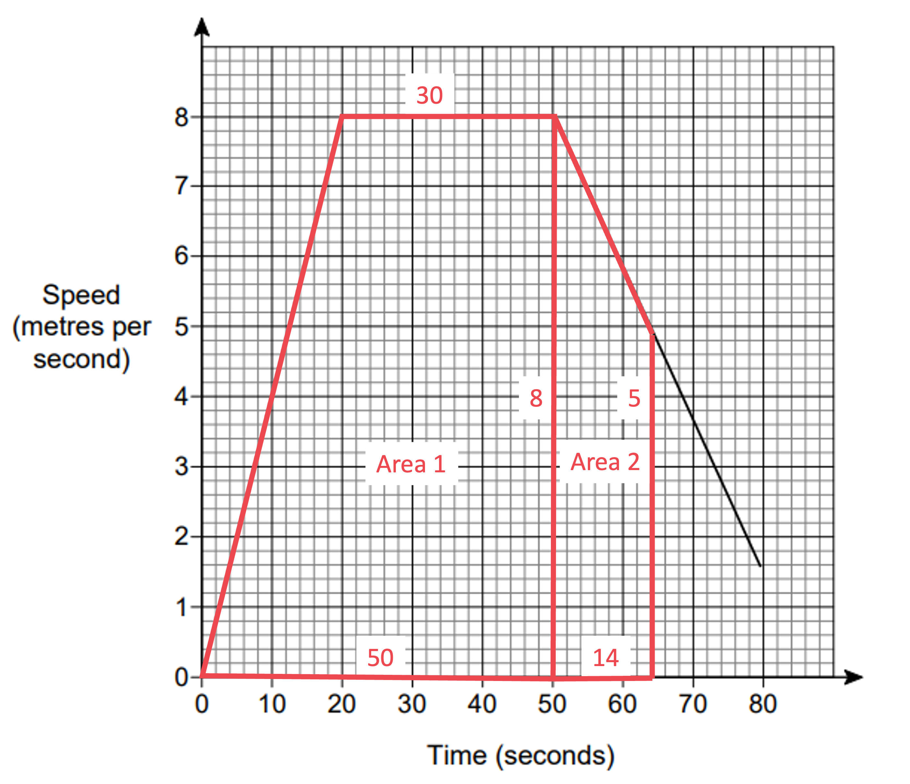

*Distance during first 50 seconds = Area 1 = *`1 half open parentheses 30 plus 50 close parentheses cross times 8 equals 320`

**[1]**

> *Now calculate the distance Amina completed between 50 and 64 seconds.*

*Distance between 50 and 64 seconds = Area 2 = *`1 half open parentheses 5 plus 8 close parentheses cross times 14 equals 91`

**[1]**

> *Add the two areas together to get Amina's distance in 64 seconds.*

*320 + 91 = 411 metres*

**[1]**

> *Therefore, Amina had already finished the 400 m race by the time Ben finished at 64 seconds.*

**Amina won**** [1]**

**Note that you will only achieve the final mark if you showed that she cycled 411 m by 64 seconds**

## Q30 — hard — 4 marks · exam-questions

### 19() — 1 marks
> *The rocket leaves the ground at Time = 4 seconds and lands at TIme = 10 seconds.*

*10 - 4 = 6*

**The correct answer is the third option, 6 seconds**** [1]**

### 19((b)) — 3 marks
> *The speed of the rocket is the gradient of the graph.*

> *We can estimate the gradient at time = 6 seconds by drawing a tangent at t = 6 and calculating its gradient.*

> *The tangent should be a straight line (use a ruler or straight edge) touching the curve at *$t=2$*, but not crossing the curve.*

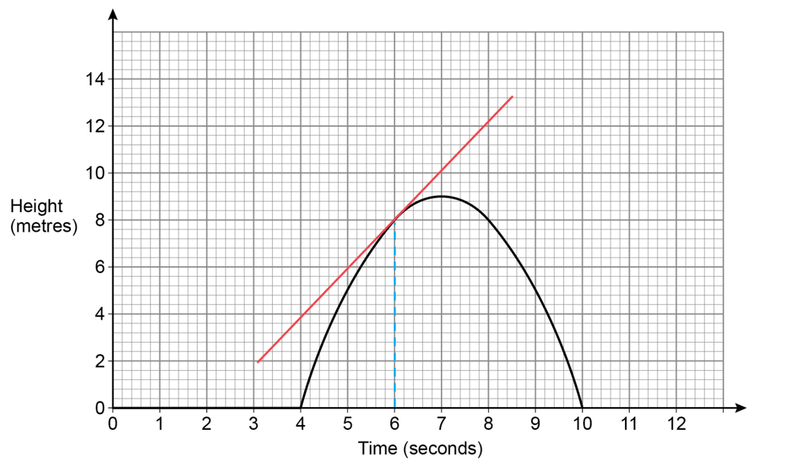

**Suitable tangent line drawn**** [1]**

> *Pick two points on the tangent and find the gradient between these two points using *$\frac{\mathrm{rise}}{\mathrm{run}}$* or *$\frac{y_{1}-y_{2}}{x_{1}-x_{2}}$*.*

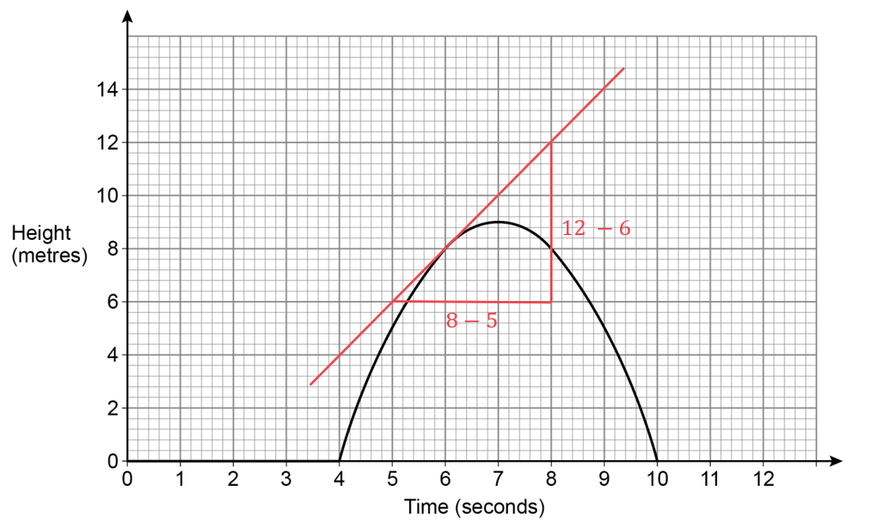

> *Your gradient will depend on your tangent so the correct answer will depend on how you drew your tangent. For the tangent drawn above, the calculation and answer would be as follows*

*gradient = *$\frac{12-6}{8-5}=\frac{6}{3}=2$

> *Units for speed are m/s.*

**Final answer:** **2 m/s **

**Gradient consistent with the drawn tangent line ****[1] **

**Correct units ****[1]**

## Q31 — hard — 3 marks · exam-questions

### 12() — 3 marks
> *The rate of pay is equal to the gradient of the line on the graph.*

> *Find the gradient of the two lines separately and find the difference by subtracting the lower rate of pay from the higher rate of pay.*

> *Find the gradient of the line from 0 hours to 35 hours by reading off the first and last coordinates (or any two coordinates on the line) and substituting them into the formula for the gradient.*

> *The coordinates are (0, 0) and (35, 280).*

$\mathrm{gradient}=\frac{y_{2}-y_{1}}{x_{2}-x_{1}}=\frac{280-0}{35-0}=8$

**[1]**

> *Find the gradient of the line from 35 hours to 40 hours by reading off the first and last coordinates (or any two coordinates on the line) and substituting them into the formula for the gradient.*

> *The coordinates are (35, 280) and (40, 350).*

$\mathrm{gradient}=\frac{y_{2}-y_{1}}{x_{2}-x_{1}}=\frac{350-280}{40-35}=\frac{70}{5}=14$

**[1]**

> *Subtract the first gradient from the second to find the difference between the higher rate of pay and the basic rate of pay.*

* *$14-8$

**6 £/hour ****[1]**

## Q32 — hard — 6 marks · exam-questions

### 28((a)) — 2 marks
*Acceleration is the gradient of the line on a speed-time graph* *Find the gradient of the line between 6 and 14 seconds by drawing a right angled triangle onto the graph and finding the difference in **y **divided by the difference in **x**.*

> *Although the speed is not known, we do know that it is 2 m/s faster at 14 seconds than at 6 seconds so we know that the difference in **y **is 2. *

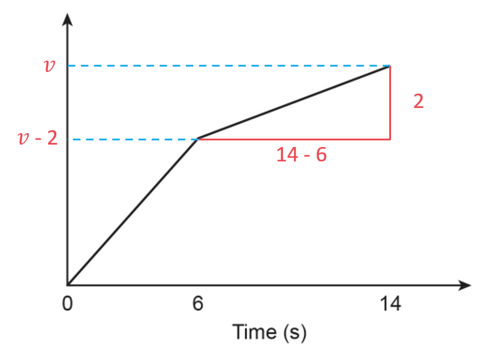

*The gradient is found using the difference in **y **over the difference in **x **(or rise over run). Keeping the units with the values as you substitute them in will help to see the final units.* * *

* *`acceleration space equals rise over run space equals space fraction numerator 2 space space space open parentheses straight m divided by straight s close parentheses over denominator 14 space minus space 6 space space space open parentheses straight s close parentheses end fraction space equals space 1 fourth space fraction numerator straight m divided by straight s over denominator straight s end fraction`

**Final answer:** $\frac{1}{4}m/s^{2}$** **

**Correct answer**** [1] **
**Correct units ****[1]**

### 28((b)) — 4 marks
> *Distance travelled is equal to the area under the graph.*

> *The total distance travelled is 80 metres. At 14 seconds Izzy is travelling at *$v$* m/s and so at 6 seconds Izzy is travelling at *$v-2$* m/s. *

> *Find and expressions in terms of *$v$* for the total distance travelled by splitting the area under the graph into two or more shapes whose area can be calculated.*

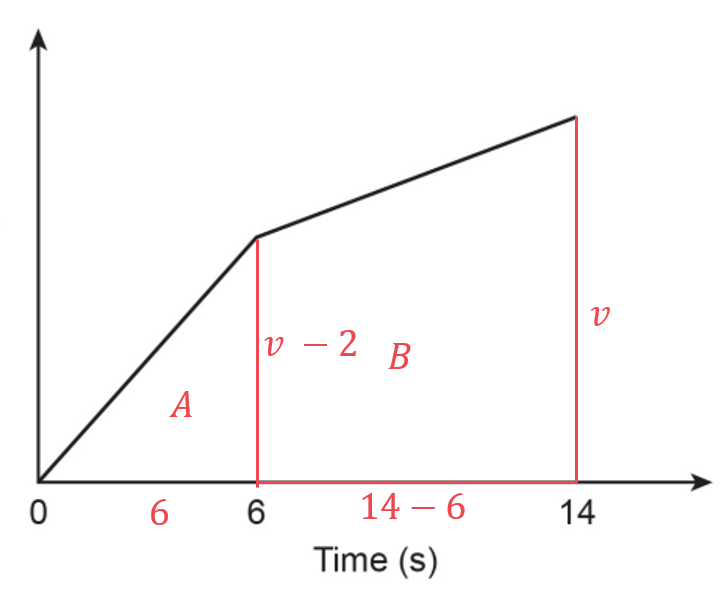

> *Area under graph = area of triangle **A **+ area of trapezium **B.*

*Area of triangle *`table row blank blank cell table row equals cell 1 half cross times 6 space cross times space open parentheses v space minus space 2 close parentheses end cell end table table row equals cell space 3 open parentheses v space minus space 2 close parentheses end cell end table end cell end table`

*Area of trapezium*`table row cell table row equals cell space 1 half open parentheses v space plus space open parentheses v space minus space 2 close parentheses close parentheses cross times open parentheses 14 space minus space 6 close parentheses end cell end table end cell equals cell space 1 half open parentheses 2 v space minus space 2 close parentheses open parentheses 8 close parentheses space equals space 8 open parentheses v space minus space 1 close parentheses end cell end table`

*Area under the graph *`table row equals cell space 3 open parentheses v space minus space 2 close parentheses space plus space 8 open parentheses v space minus space 1 close parentheses end cell end table`

**Correct expression for one area ****[1] **
**Correct expression for both areas ****[1]**

> *Form an equation using the distance of 80 m. *

`3 open parentheses v space minus space 2 close parentheses space plus space 8 open parentheses v space minus space 1 close parentheses space equals space 80`

**Correct equation ****[1]**

> *Simplify. *

`table row cell 3 v space minus space 6 space plus space 8 v space minus space 8 space end cell equals cell space 80 space end cell row cell 11 v space minus space 14 space end cell equals cell space 80 end cell end table`

> *Solve by adding 14 and dividing by 11. *

`table row cell 11 v space end cell equals cell space 94 end cell row cell v space end cell equals cell space 94 over 11 space equals space 8.545454... end cell end table`

$v=8.55$** ****m/s**** ****[1]**

## Q33 — hard — 10 marks · exam-questions

### 15((a)) — 1 marks
> *Trace up from **t** = 7 on the Time axis until you hit the curve, and the across to read off the Speed axis.*

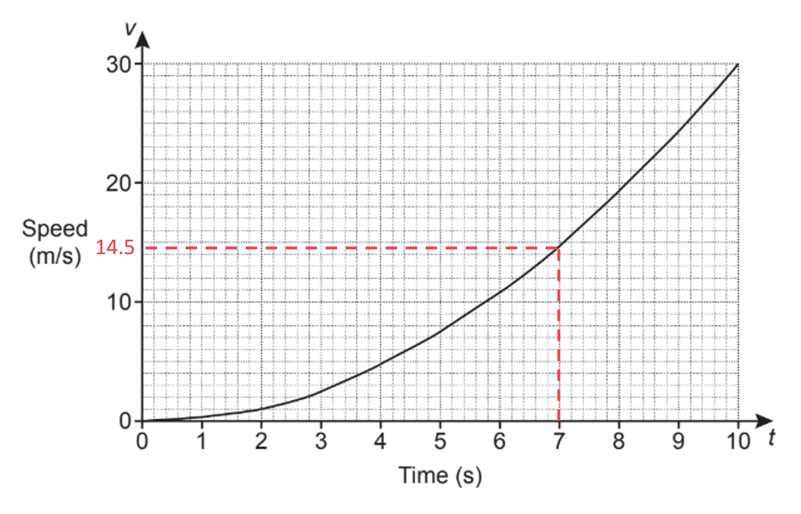

**Speed = 14.5 m/s** **[1] **

**Any answer from 14 to 15 is accepted**

### 15((b)) — 5 marks
> *At the end of the 10 seconds the car has reached 30 metres per second. Convert to metres per hour by multiplying by 60**2*

*30 × 60 × 60 = 108 000 m/h*

**"30" from graph**** [1]** 
**multiplying by 60****2**** ****[1]**

> *Convert this to kilometres per hour by dividing by 1000.*

*108 000 ÷ 1000 = 108 km/h*

**dividing by 1000 ****[1]**

> *Now convert from kilometres per hour to miles per hour by **dividing** by 1.6 (miles are longer than kilometres, so the value in miles gets smaller)*

*108 ÷ 1.6 = 67.5 miles per hour*

**dividing by 1.6 ****[1]**

**Final answer:** ** The car reached 67.5 miles per hour so yes (the graph supports this claim)**

** "yes" with reason [1]**

### 15((c)) — 3 marks
> *In a speed-time graph, the acceleration at any given point is equal to the gradient of the tangent at that point. So draw a tangent at **t** = 7 and calculate its gradient. *

> *The tangent is a straight line touching the curve at **t** = 7 but not crossing the curve (there is some margin of error- see note below final answer). E.g.:*

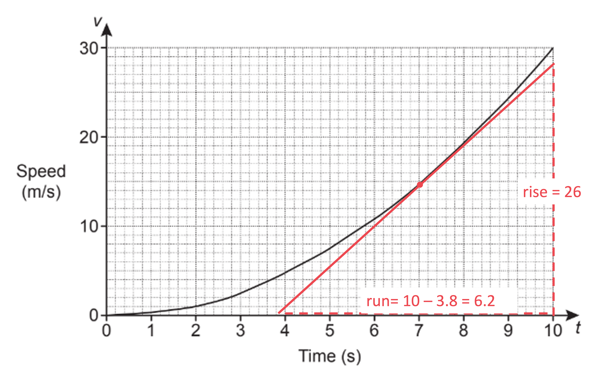

**suitable tangent drawn**** [1]**

> *Using gradient = *$\frac{y_{1}-y_{2}}{x_{1}-x_{2}}$* or *$\frac{\mathrm{rise}}{\mathrm{run}}$*;*

*acceleration = gradient = *$\frac{26}{6.2}$

**correct calculation for gradient based on your tangent line**** [1]**

*                                                            = 4.193548387...*

> *This answer will depend on your tangent line so there is some margin of error (see below). Round to at least 3 significant figures if necessary.*

**Acceleration = 4.19 m/s****2**** ****[1] **

**Any answer from 4 to 4.5 is accepted, so long as it is correct for your tangent line and rounded to at least 3 significant figures**

### 15((e)) — 1 marks
**It is not possible to tell from the graph what will happen after 10 seconds **
**or**

**Final answer:** **The car cannot accelerate forever and will eventually slow down**

**any sensible comment regarding the two ideas above ****[1]**

## Q34 — hard — 10 marks · exam-questions

### 13((a)) — 2 marks
> *Average speed = *$\frac{\mathrm{total} \mathrm{distance}}{\mathrm{total} \mathrm{time}}$* and we are given the total distance (1.35 km) and total time (50 s) in the question.*

> *However the answer is requested in metres per second so convert the total distance in kilometres to metres first.*

*Total distance = 1.35 ×1000 = 1350 m*

*Average speed = *$\frac{1350}{50}$

**[1]**

**Answer = 27 m/s ****[1]**

### 13((b)) — 5 marks
> *The **area** under a **speed-time graph** represents the **distance** (because distance = speed × time).*

> *The speed-time graph here is in the shape of a trapezium and area of a trapezium = *`1 half open parentheses a plus b close parentheses h`* where *$a$* and *$b$* are the parallel lengths and *$h$* is the perpendicular height. We can read these values from the graph:*

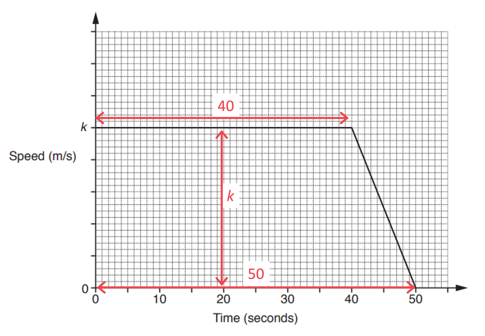

*Distance = area = *`1 half open parentheses 40 plus 50 close parentheses cross times k`

**attempt to find the area under graph ****[1] **
**correct expression in terms of k for area under graph ****[1]**

> *We can equate this to 1350, the total distance in metres.*

`1 half open parentheses 40 plus 50 close parentheses cross times k equals 1350`

**equating to a distance ****[1] **
**equating to 1350 ****[1]**

> *Solve for **k.*

`table attributes columnalign right center left columnspacing 0px end attributes row cell 45 k end cell equals 2700 end table`

$k=30$** ****[1]**

### 13((c)) — 3 marks
`table row blank row blank end table`i) *Use *$\frac{\mathrm{rise}}{\mathrm{run}}$* or an equivalent method.*

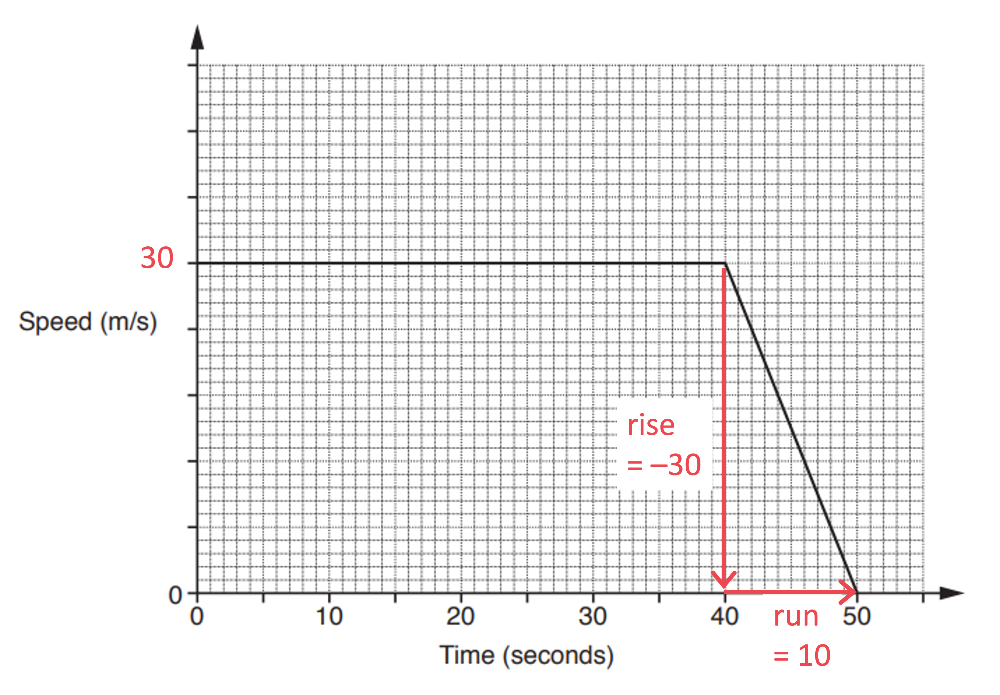

*gradient = *$\frac{-30}{10}$

**Gradient = −3 ****[1]**

ii) *Negative gradient on a distance-time graph represents deceleration.*

**Deceleration in m/s****2**** ****[1]**

**"Deceleration" or equivalent (such as "slowing down") and the units, m/s****2****, must be stated**

## Q35 — hard — 6 marks · exam-questions

### 11((a)) — 3 marks
> *We can draw the first section of the journey. "Constant acceleration" so we draw a straight line. We are told the toy car starts from rest, so the line starts at (0, 0). "For 4 seconds reaching a velocity of 5 m/s", so the line ends at (4, 5).*

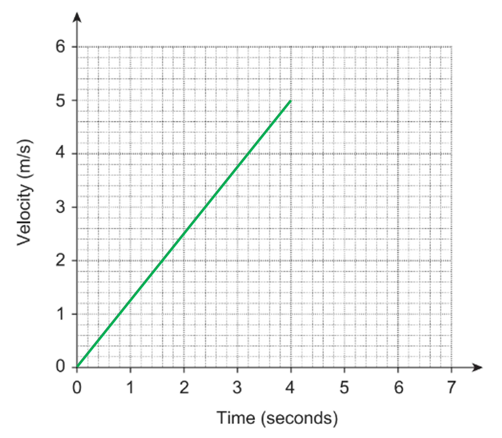

**[1]**

> *For the next stage of the journey, "constant deceleration of 1 m/s**2**" indicates a straight line with a gradient of -1. As this lasts for 2 seconds, continue the line from Time = 4 to Time = 6.*

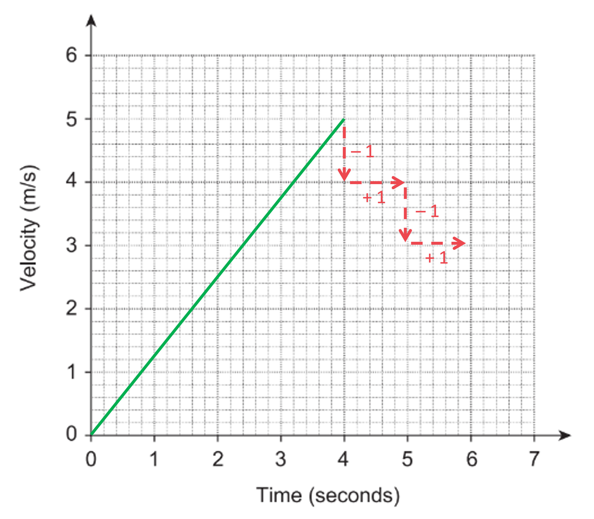

**gradient of -1 for 2 seconds, from endpoint of first line**** [1]**

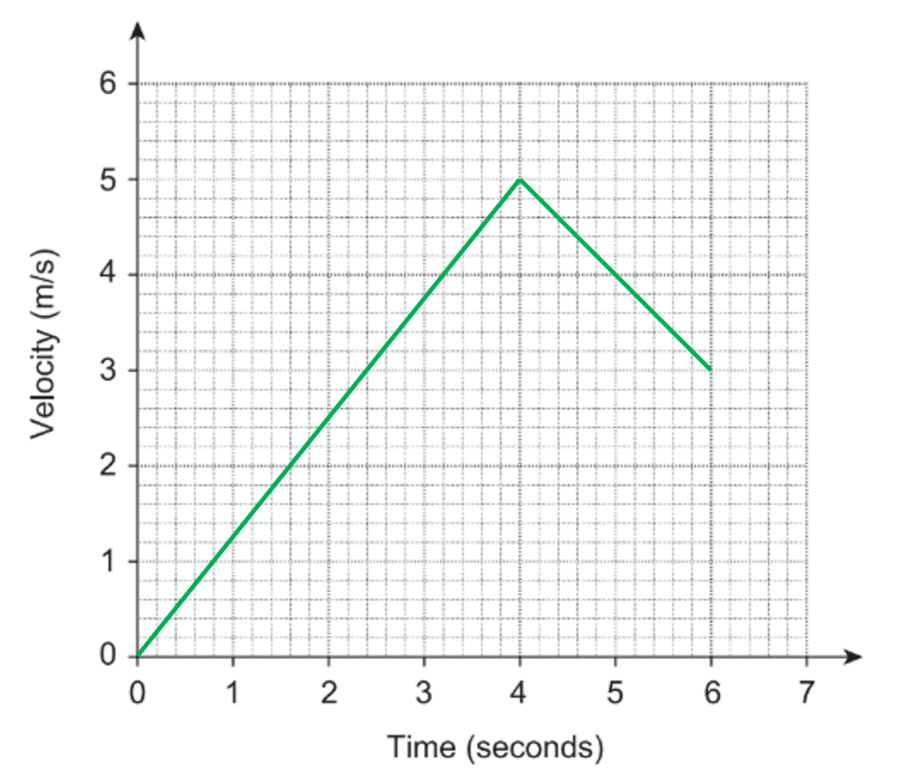

**fully correct**** ****graph**** [1]**

### 11((b)) — 3 marks
> *The **area** under a **speed-time graph** represents the **distance** (because distance = speed × time).*

> *The area here can be split into a triangle and a trapezium.*

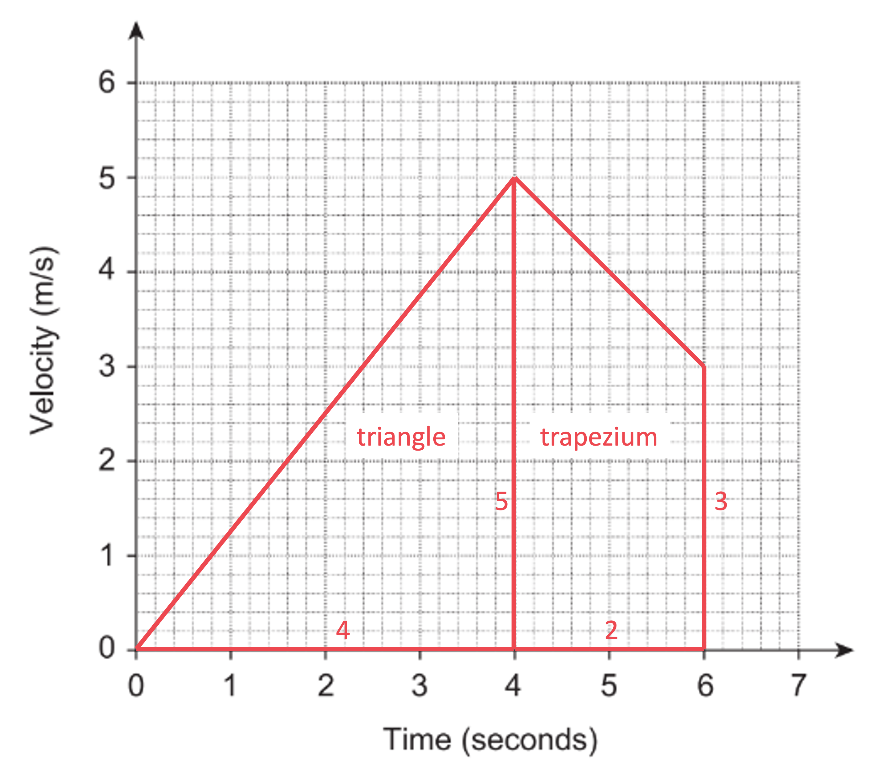

> *Area of triangle = *$\frac{1}{2}\times\mathrm{base}\times\mathrm{height}$*. Reading these values from the graph,*

*area triangle = *$\frac{1}{2}\times4\times5=10$

** [1]**

> *Area of trapezium = *`1 half open parentheses a plus b close parentheses h`* where *$a$* and *$b$* are the parallel lengths and *$h$* is the perpendicular height. Reading these values from the graph,*

*area trapezium = *`1 half open parentheses 5 plus 3 close parentheses cross times 2 equals 8`

**[1]**

> *Add these areas together to find the total area i.e. the total distance travelled. *

*total distance = total area = *$10+8$

**18 metres**** ****[1]**
