# Mark Schemes — Transformations of Graphs
**Sequences, Functions & Graphs** · Edexcel IGCSE Maths A (4MA1) — 18/Higher

## Q1 — easy — 2 marks · exam-questions

### 26((a)) — 2 marks
> *The curve has been translated 4 to the right. Remember that when translating in the **x**-axis, **+ a** units in the **x** direction leads to **y = f(x – a)*

**y**** = f(****x**** – 4) ****[2] **

**one mark for "y = f(x + 4)" or for "f(x − 4)" with no "y = ..."**

## Q2 — easy — 2 marks · exam-questions

### 19((b)) — 2 marks
i) *"−f(x)" represents a **reflection** of f(x) **in the** **x**-axis*

> *Start by reflecting key points on the graph; endpoints and vertices*

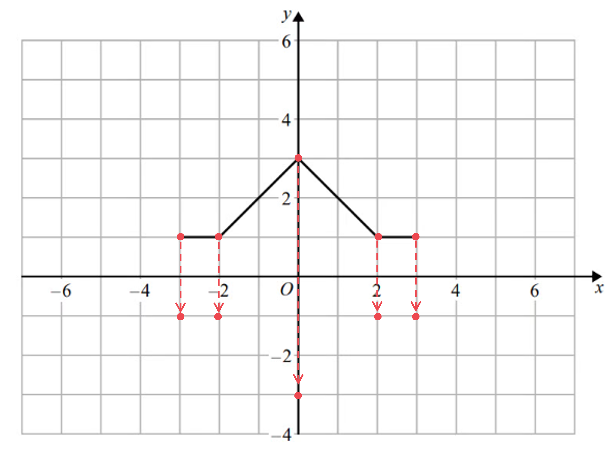

> *Then use a ruler to join the reflected points with straight lines*

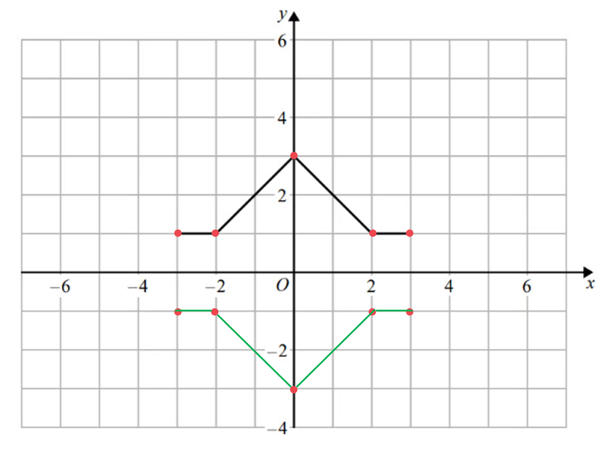

** correct reflection in x-axis**** [1]**

ii) *"f(x − 3)" represents a **translation** of f(x) 3 units to the **right*

> *Start by translating key points on the curve 3 units right; endpoints and vertices. Then use a ruler to join the translated points with straight lines*

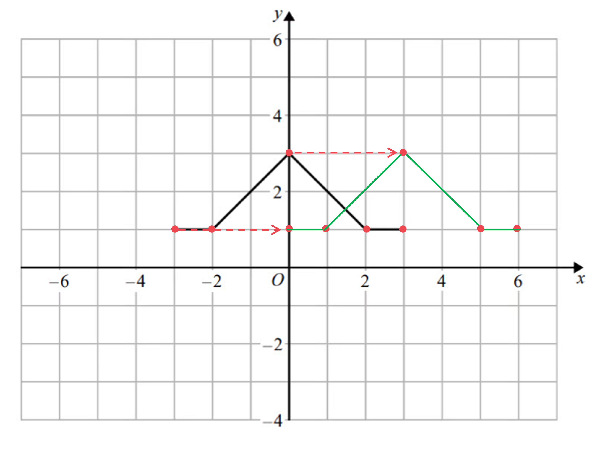

**a horizontal translation by 3 units right**** [1]**

## Q3 — easy — 3 marks · exam-questions

### 25() — 3 marks
i) *"f(x) + 3" represents a **translation** of 3 units **up**. In (3, −4), the **x-**coordinate remains the same, but 3 is added to the **y**-coordinate*

**(3, −1)*** ***[1]**

ii) *"f(x + 2)" represents a **translation** of 2 units **left**. In (3, −4), the **y-**coordinate remains the same, but subtract 2 from the **x**-coordinate*

**(1, −4)*** ***[1] **

**a common mistake is to add 2 to the ****x****-coordinate, stating "(5, −4)" **

iii) *"f(−x)" represents a **reflection in the **y**-axis**. In (3, −4), the **y-**coordinate remains the same, and the **x**-coordinate becomes negative*

**(****−****3, −4)*** ***[1]**

## Q4 — easy — 3 marks · exam-questions

### 27((a)) — 1 marks
> *First identify the transformation. We can see that every point on **y** = f(**x**) has been translated 5 units to the right. For example, (−4, 3) has moved to (1, 3)*

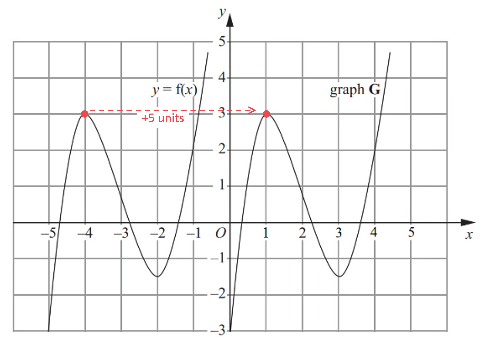

> *A translation by +5 in the **x**-axis is represented by*

**y**** = f(****x**** − 5)** **[1]**

### 27((b)) — 2 marks
> *"f(−x)" represents a **reflection** of f(x) **in the** **y**-axis*

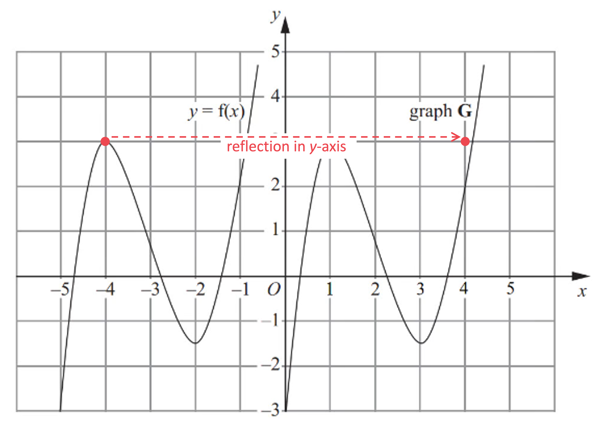

> *The **y**-coordinate does not change but the **x**-coordinate reverses sign, changing from −4 to 4*

**(4, 3)**** **

**correct x-coordinate ****[1] **
**correct y-coordinate ****[1]**

## Q5 — easy — 2 marks · exam-questions

### 23() — 2 marks
i) *"*`straight f open parentheses x plus 9 close parentheses`*" represents a **translation** of 3 units **left**. In (5, 7), the **y-**coordinate remains the same, but subtract 9 from the **x**-coordinate.*

**(-4, 7)*** ***[1]**

**a common mistake is to add 9 to the ****x****-coordinate, stating "(14, 7)" **

ii) *"*`straight f open parentheses x close parentheses plus 3`*" represents a **translation** of 3 units **up**. In (5, 7), the **x-**coordinate remains the same, but add 3 to the **y**-coordinate*

**(5, 10)*** ***[1]**

## Q6 — easy — 4 marks · exam-questions

### 26((a)) — 2 marks
> *Look for 'key' points that can be transformed.*

*In this case the axes intercepts are unclear, but there are clear points at (-2. -1), (1, 3) and (4, -1).*

> *"*`2 straight f open parentheses x close parentheses`*" is a **vertical stretch, scale factor** **2**.  So **x**-coordinates remain unchanged and **y**-coordinates get multiplied by 2.*

*(-2, -1) will transform to (-2, -2)** *

*(1, 3) will transform to (1, 6)*

* **(4, -2) will transform to (4, -2)*

> *Note that the **x**-axis intercepts (although we don't know their value) remain unchanged (0 × 2 = 0) so it is important your sketch passes through these points.*

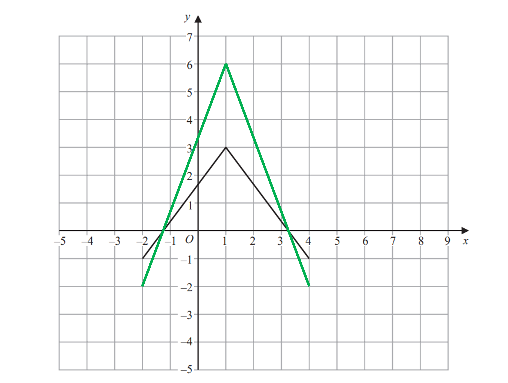

**For (1, 6) or ****both**** the other points**** [1] **

**Fully correct**** [1]**

### 26((b)) — 2 marks
*Look for 'key' points that can be transformed.*

> *In this case the axes intercepts are unclear, but there are clear points at (-2. -1), (1, 3) and (4, -1).*

> *"*`straight f open parentheses negative x close parentheses`*" is a **reflection** in the **y**-axis**.  So **y**-coordinates remain unchanged and **x**-coordinates** will have their **signs reversed** (or multiplied by -1).*

*(-2, -1) will transform to (2, -1)** *
*(1, 3) will transform to (-1, 3)** *
*(4, -1) will transform to (-4, -1)*

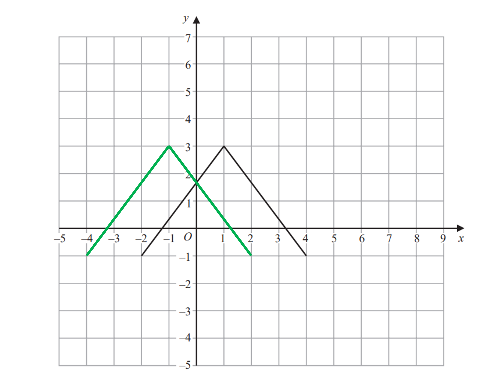

**2 points correct**** [1] **
**Fully correct**** [1]**

**In this case the transformation also looks like a translation!**

## Q7 — easy — 2 marks · exam-questions

### 24() — 2 marks
i) *"*`straight f open parentheses x close parentheses space minus space 6`*" represents a **translation** of 6 units **down**, or** **−6 in the **y**-axis. In (−3, 4), the **x-**coordinate remains the same, but subtract 6 from the **y**-coordinate.*

**y***-coordinate*$=4-6=-2$

**(−3, −2)*** ***[1]**

ii) *"*`straight f open parentheses 2 x close parentheses`*" represents a **stretch** by a factor of *$\frac{1}{2}$* in the **x-**axis**.*

> *In (−3, 4), the **y-**coordinate remains the same, but the **x**-coordinate is multiplied by *$\frac{1}{2}$*.*

**x***-coordinate*$=-3\times\frac{1}{2}=-\frac{3}{2}$

**(−1.5, 4)*** ***[1]**

**A common mistake is to multiply the ****x****- (or ****y****-) coordinate by 2.**

## Q8 — easy — 2 marks · exam-questions

### 21((a)) — 2 marks
i) *"*`straight f open parentheses x space plus space 4 close parentheses`*" represents a **translation** of 4 units **left**, or** **−4 in the **x**-axis. In (4, 6), the **y-**coordinate remains the same, but subtract 4 from the **x**-coordinate.*

**x***-coordinate*$=4-4=0$

**(0, 6)*** ***[1] **

**A common mistake is to add 4 to the ****x****-coordinate**

ii)*"*`straight f open parentheses 2 x close parentheses`*" represents a **stretch** by a factor of *$\frac{1}{2}$* in the **x-**axis**.*

> *In (4, 6), the **y-**coordinate remains the same, but the **x**-coordinate is multiplied by *$\frac{1}{2}$*.*

**x***-coordinate*$=4\times\frac{1}{2}=2$

**(2, 6)*** ***[1]**

**A common mistake is to multiply the ****x****- (or ****y****-) coordinate by 2.**

## Q9 — easy — 2 marks · exam-questions

### 22((b)) — 2 marks
i) *"*`straight f open parentheses 2 x close parentheses`*" represents a **stretch** by a factor of *$\frac{1}{2}$* in the **x-**axis**.*

> *In (4, 5), the **y-**coordinate remains the same, but the **x**-coordinate is multiplied by *$\frac{1}{2}$*.*

**x***-coordinate*$=4\times\frac{1}{2}=2$

**(2, 5)*** ***[1] **

**A common mistake is to multiply the ****x****- (or ****y****-) coordinate by 2.**

ii) *"*`straight f open parentheses x close parentheses space minus space 7`*" represents a **translation** of 7 units **down**, or** **−7 in the **y**-axis. In (4, 5), the **x-**coordinate remains the same, but subtract 7 from the **y**-coordinate.*

**y***-coordinate*$=5-7=-2$

**(4, −2)*** ***[1]**

## Q10 — easy — 1 marks · exam-questions

### 28() — 1 marks
> *The '−' represents a reflection and it is before the '*`straight g open parentheses x close parentheses`*' so we have a reflection up/down in the **x**-axis.*

**A reflection in the ****x****-axis ****[1]**

**Both "reflection" and the direction must be stated**

## Q11 — easy — 2 marks · exam-questions

### 8() — 2 marks
> *If you like, sketch the graph of *$y=x^{3}$* (you are required to know its shape). If you sketch this, make sure you label it with its equation, or draw it with a dotted line to distinguish it from your final answer.*

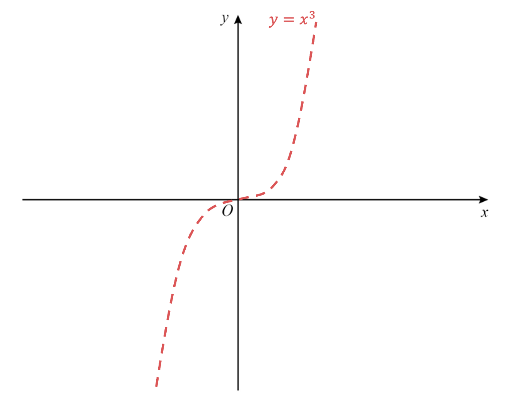

> `y equals straight f open parentheses x close parentheses minus 2`* is a translation of *`y equals straight f open parentheses x close parentheses`* by −2 in the **y**-axis. Sketch a translation of your curve 2 units down. Label the new curve with its equation and **mark where the curve crosses the **y**-axis at (0, −2)** to show that it has been translated 2 down.*

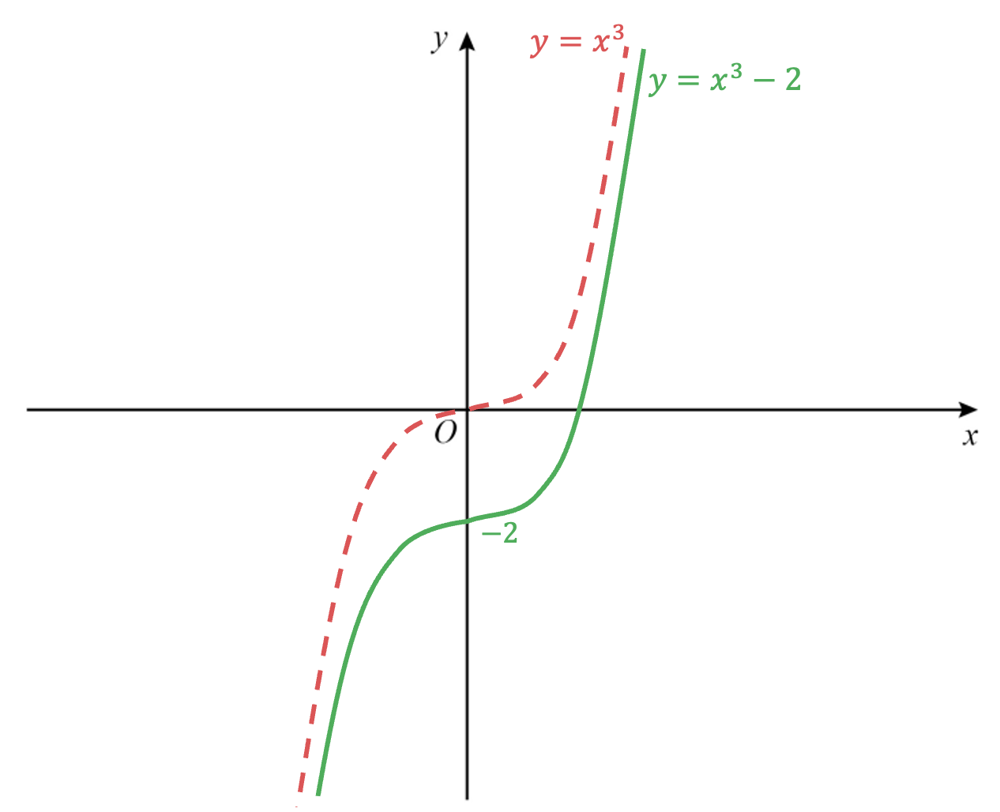

**correct curve ****[1]** 
**(0, −2) marked indicated ****[1]**

## Q12 — easy — 1 marks · exam-questions

### 22() — 1 marks
*A transformation of a function in the form *`y space equals space straight f open parentheses x close parentheses space plus space a`* represents a translation of *$a$* units on the **y- **axis. * 
*The number outside the function (not in a bracket) is 1 so this is a translation by 1 unit on the y-axis.*

> *The **y**- values on the graph of *$y=\mathrm{sin}x$* are in the range *$-1\leqy\leq1$*, so adding 1 unit to this will give the range *$0\leqy\leq2$*.*

> *This is represented by option 1. *

**Option 1 is the correct answer, a translation of 1 unit along the ****y-****axis. ****[1]**

> *Option 2 cannot be correct as it is a stretch of the graph of *$y=\mathrm{sin}x$* along the **y**-axis and is represented by the function *$y=2\mathrm{sin}x$*. *

> *Option 3 cannot be correct as it is a translation of the graph of *$y=\mathrm{sin}x$* along the **x**-axis and is represented by the function *`y space equals space sin space open parentheses x space minus space 90 degree close parentheses`*. *

> *Option 4 cannot be correct as it is a translation of the graph of *$y=\mathrm{sin}x$* along the **x**-axis by 90° and along the **y**-axis by 1 unit and is represented by the function *`y space equals 1 space plus space sin open parentheses x plus 90 close parentheses`*. *

## Q13 — easy — 1 marks · exam-questions

### 20() — 1 marks
*A transformation of a function in the form *`y space equals space straight f open parentheses x close parentheses space plus space a`* represents a translation of *$a$* units on the **y- **axis. *

> *The number outside the function (not in a bracket) is 2 so this is a translation by 2 units upwards on the y-axis.*

> *The **y**- values on the graph of *`y space equals space straight f open parentheses x close parentheses`* will all increase by 2 units and the **x**- values will all stay the same.*

`open parentheses 7 comma space 28 space plus space 2 close parentheses`

**Option 2 is the correct answer, (7, 30) ****[1]**

> *Option 1 cannot be correct as it is a translation of the graph of *`y space equals space straight f open parentheses x close parentheses`* **downwards** along the **y**-axis and is represented by the function *`y space equals space straight f open parentheses x close parentheses space minus space 2`*. *

> *Option 3 cannot be correct as it is a translation of the graph of *`y space equals space straight f open parentheses x close parentheses`* along the **x**-axis in the negative direction and is represented by the function *`y space equals space straight f open parentheses x space plus space 2 close parentheses`*. *

> *Option 4 cannot be correct as it is a translation of the graph of *`y space equals space straight f open parentheses x close parentheses`* along the **x**-axis in the positive direction and is represented by the function *`y space equals space straight f open parentheses x space minus space 2 close parentheses`*. *

## Q14 — medium — 4 marks · exam-questions

### 24((a)) — 3 marks
i) *"f(x + 3)" represents a **translation** of f(x) 3 units to the **left**. If you like, sketch it on the graph. Note that only the **x**-coordinate changes*

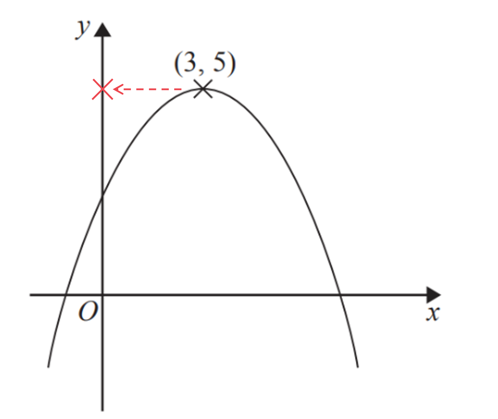

> *Simply subtract 3 from the **x** -coordinate*

**(0, 5)*** ***[1]**

ii) *"−f(x)" represents a **reflection** of f(x) **in the** **x**-axis**. If you like, sketch it on the graph. Note that only the **y**-coordinate changes*

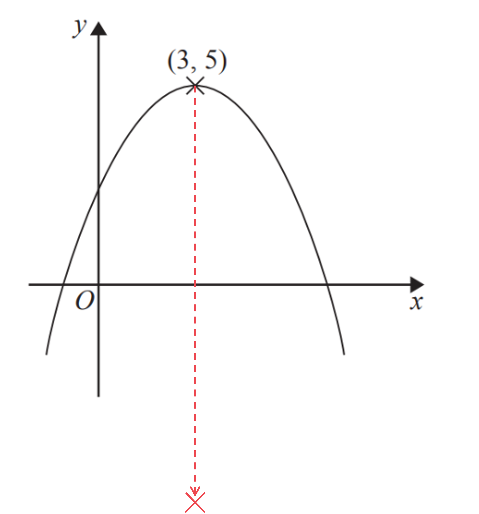

> *Simply make the **y**-coordinate negative*

**(3, −5)*** ***[1]**

iii) *"−f(x)" represents a **reflection** of f(x) **in the** **y**-axis**. If you like, sketch it on the graph. Note that only the **x**-coordinate changes*

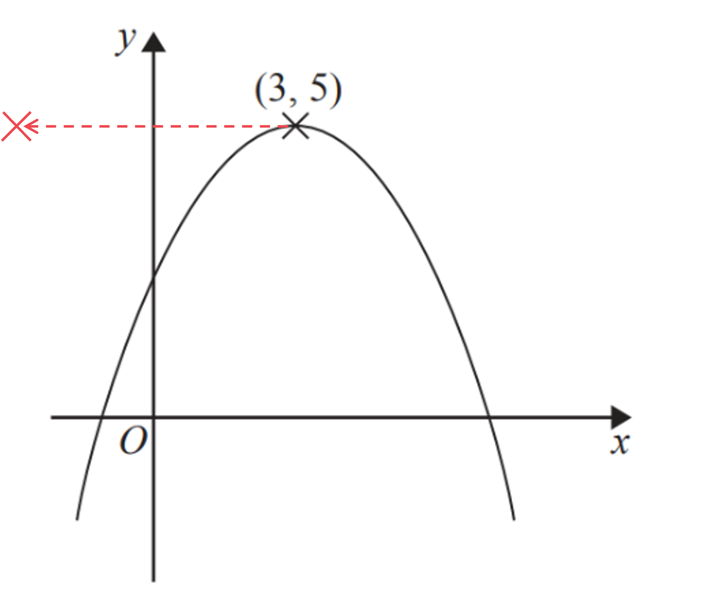

> *Simply make the **x**-coordinate negative*

**(−3, 5)*** ***[1]**

### 24((b)) — 1 marks
**translation 4 units down**** or t****ranslation −4 units in the ****y-****axis**** or ****translation by **`begin bold style stretchy left parenthesis table row 0 row cell negative 4 end cell end table stretchy right parenthesis end style` **[1]**

**"translation", direction and distance must all be stated to achieve the mark**

## Q15 — medium — 2 marks · exam-questions

### 28((a)) — 1 marks
> *We need to know the key points of the graph of **y** = cos**x, **which** **intersects the **x**-axis at 90° and 270° *

> *If unsure, cos**-1**(0) on your calculator- the calculator will only give the 0 ≤ x ≤ 90 value but in this case this is all we need*

**(90, 0)** **[1]**

**You must write your answer as a set of coordinates, not just "90"**

### 28((b)) — 1 marks
> *If f(**x**) = cos**x**, then **y** = −cos**x** is **y** = −f(**x**), which is a reflection in the **x**-axis*

> *Sketch a reflection the **x**-axis*

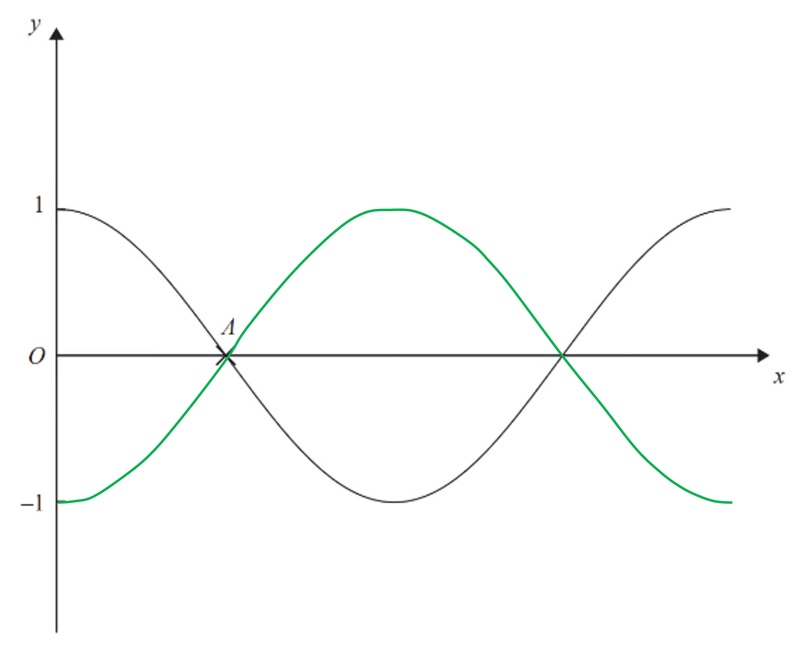

**[1]**

## Q16 — medium — 2 marks · exam-questions

### 18() — 2 marks
> *If f(**x**) = sin**x**, then **y** = sin**x − **2 is **y** = f(**x**) − 2, which is a translation 2 units down, or −2 units in the **y**-axis *

> *To sketch the graph, start by translating the key points (−180, 0), (−90, −1), (0, 0), (90, 1) and (180, 0). Join the points with a smooth curve*

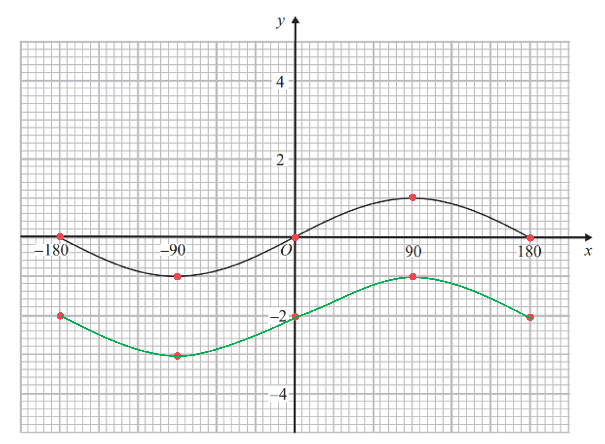

**curve translated up/ down**** [1]  **
**correct translation by 2 units down ****[1]**

## Q17 — medium — 4 marks · exam-questions

### 23((a)) — 2 marks
> *If f(**x**) = sin**x**, then **y** = sin**x** + 2 is **y** = f(**x**) + 2, which is a translation 2 units up, or +2 units in the **y**-axis *

> *To sketch the translation, start by translating the key points (−180, 0), (−90, −1), (0, 0), (90, 1) and (180, 0). Join the translated points with a smooth curve*

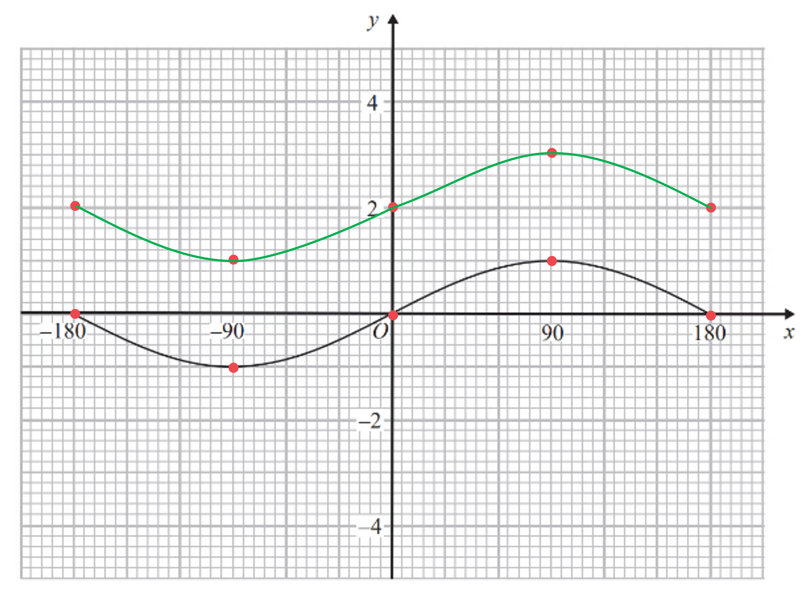

**curve translated up/ down**** [1]  **
**correct translation by 2 units up ****[1]**

### 23((b)) — 2 marks
> *If f(**x**) = cos**x**, then **y** = −cos**x** is **y** = −f(**x**), which is a reflection in the **x**-axis*

> *Sketch a reflection the **x**-axis. Start by reflecting the key points (−180, −1), (−90, 0), (0, 1), (90, 0) and (180, −1). Join the reflected points with a smooth curve*

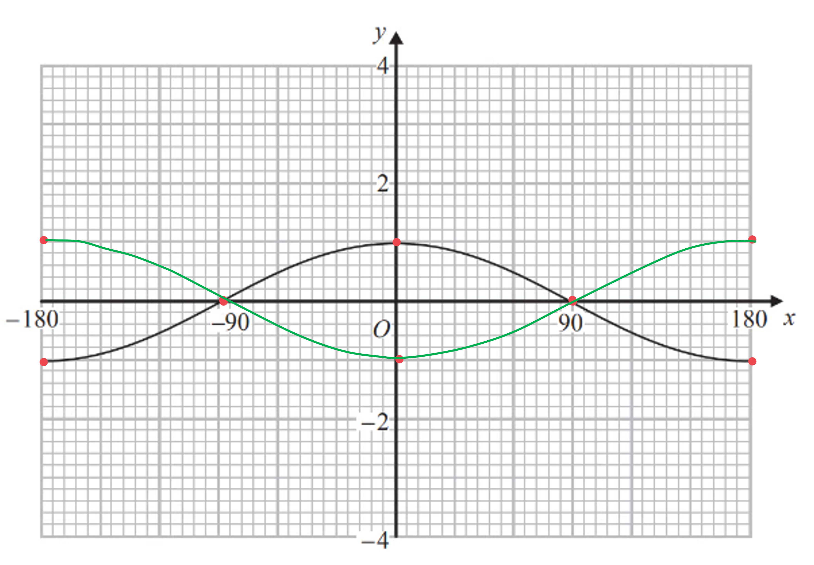

** reflection either axis ****[1] **
**correct reflection in x-axis ****[1]**

## Q18 — medium — 4 marks · exam-questions

### 27((a)) — 2 marks
> *"f(x − 3)" represents a **translation** of f(x) 3 units to the **right*

> *Start by translating key points on the curve 3 units right. Translate integer points and the minimum point*

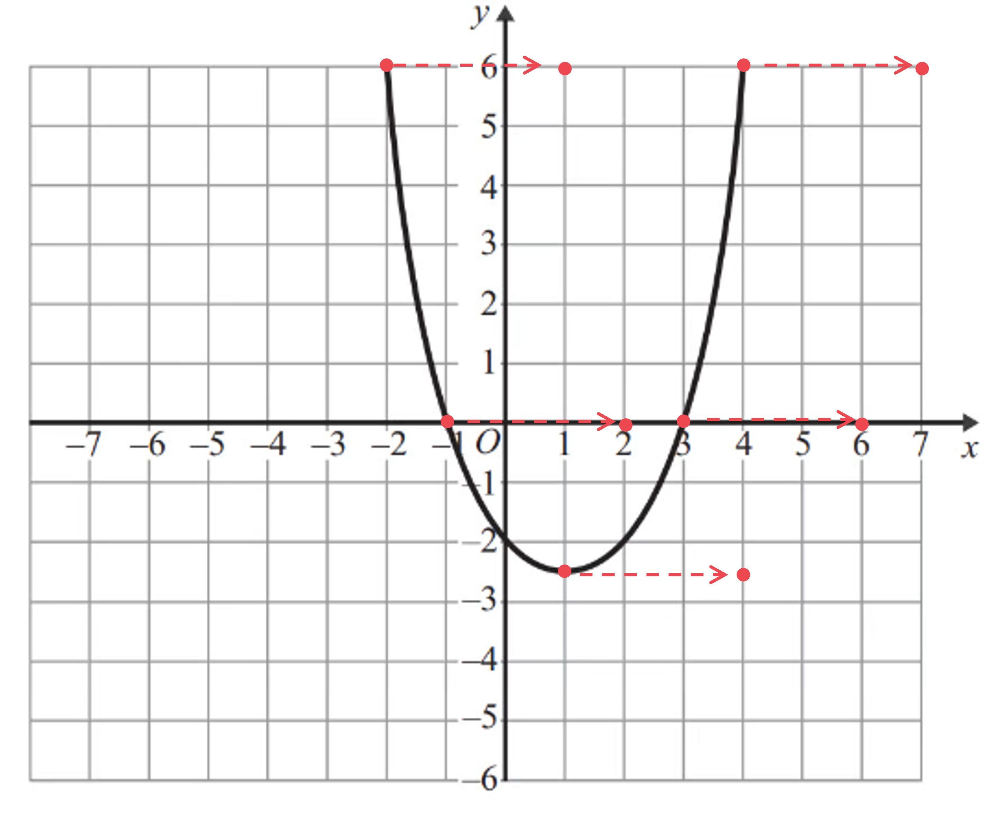

> *Then draw a smooth curve, as similar to the original as you can, through the translated points*

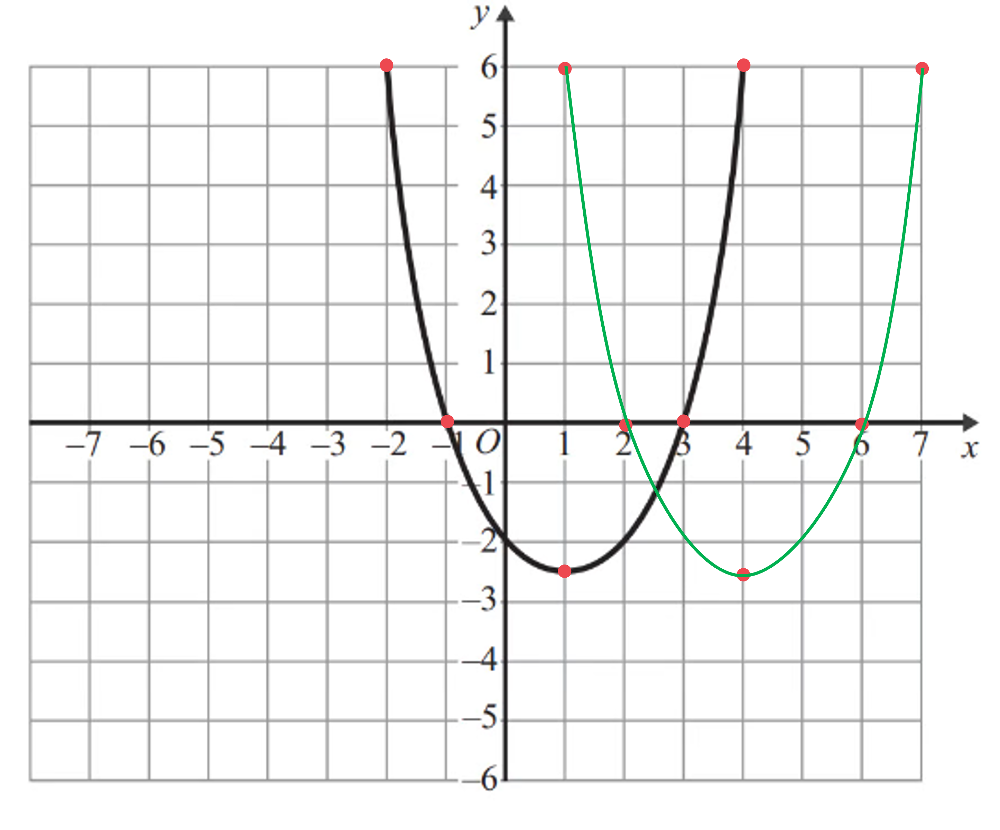

**a horizontal translation ****[1]** 
**a horizontal translation by 3 units right**** [1] **
**The curve must go through the points (1, 6), (2, 0), (4, -2.5), (6, 0) and (7, 6) to achieve full marks**

### 27((b)) — 2 marks
> *"−f(x)" represents a **reflection** of f(x) **in the** **x**-axis*

> *Start by reflecting key points on the curve; integer points and the minimum point. Note that (-1, 0) and (3, 0) lie on the **x**-axis so won't change during reflection*

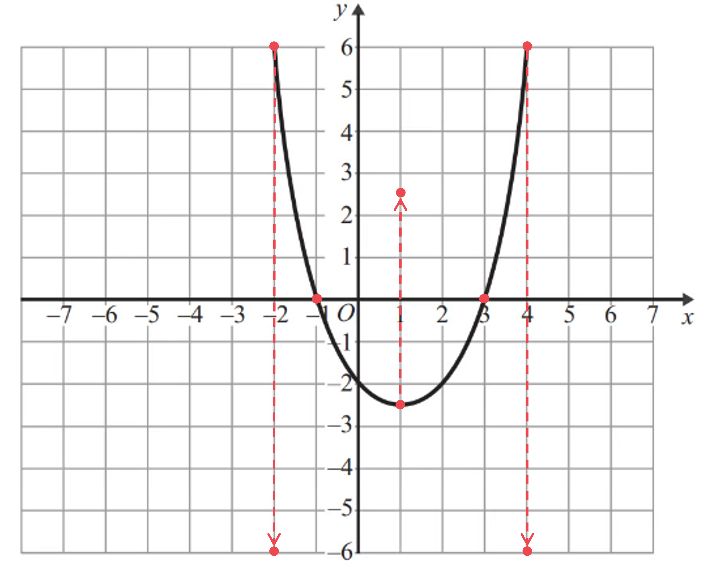

> *Then draw a smooth curve, as similar to the original as you can, through the reflected points*

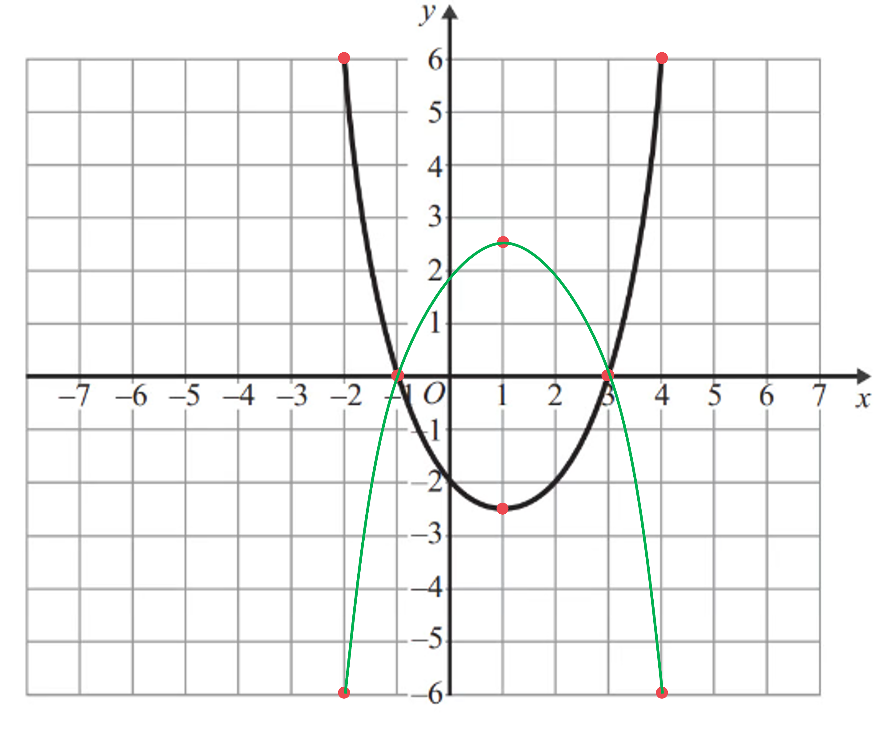

** correct reflection in x-axis**** [2]** 
**(one mark for a reflection in the y-axis) **
**The curve must go through the points (-2, -6), (-1, 0), (1, 2.5), (3, 0) and (4, -6) to achieve full marks**

## Q19 — medium — 3 marks · exam-questions

### 25((a)) — 2 marks
> *"−f(x)" represents a **reflection** of f(x) **in the** **x**-axis*

> *Start by reflecting key points on the curve; endpoints, any integer points. The minimum point lies on the **x**-axis so won't change during reflection*

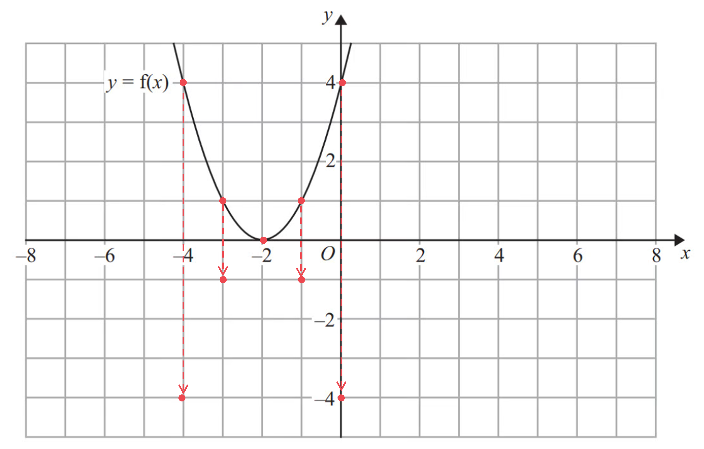

> *Then draw a smooth curve, as similar to the original as you can, through the reflected points*

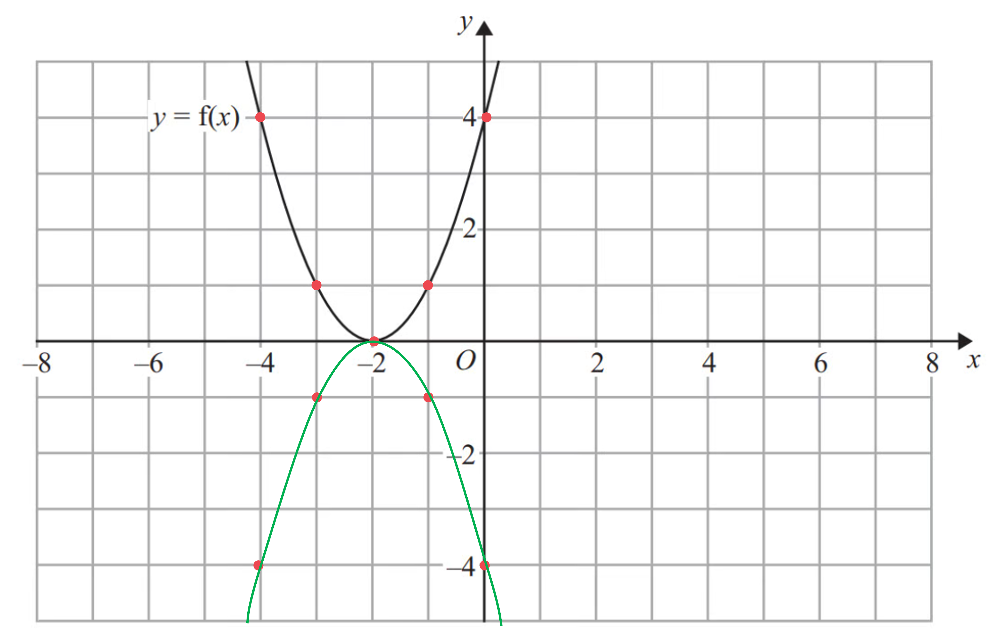

** correct reflection in x-axis**** [2]** 
**(one mark for a reflection in the y-axis) **
**The curve must go through the integer points (-4, -4), (-3, -1), (-2, 0), (-1, -1) and (0, -4) to achieve full marks**

### 25((b)) — 1 marks
> *Method 1*

> *(This is the expected method and answer)*

> *The curve has been translated 6 to the right. Remember that when translating in the **x**-axis, **+ a** units in the **x** direction leads to **y = f(x – a)*

**y**** = f(****x**** – 6) ****[1]**

**Answer must include "****y**** = ..." to achieve the mark**

> *Method 2 *

> *You should recognise the curve as a quadratic graph. The minimum point is at (4, 0) so the graph takes the form **y** = **a**(**x** − 4)**2*

> * **Pick another integer point, for example (3, 1) and substitute into **y** = **a**(**x** − 4)**2**, and solve to find **a*

*1*** = a***(3 − 4)**2* *1*** = a***(− 1)**2*

**a*** = 1*

> *Therefore*

**y**** = (****x**** − 4)****2**** ****[1] **
**Note that this is not the expected method or answer- but it is equally valid**

## Q20 — medium — 2 marks · exam-questions

### 21((b)) — 2 marks
> *The graph of *`y space equals space cos open parentheses x close parentheses degree`* has a minimum at **y** = -1 and maximum at **y** = 1 (we can also say it has an amplitude of 1). The graph you are given has minimum at -2 and maximum at **y** = 2 (we can also say it has amplitude of 2).*

> *So the **y** values have been multiplied by 2/ there has been a stretch in the **y**-axis by a factor 2. This tells us that;*

$a=2$** [1]**

> `y space equals space 2 cos open parentheses x close parentheses degree`* would look like the red curve below.*

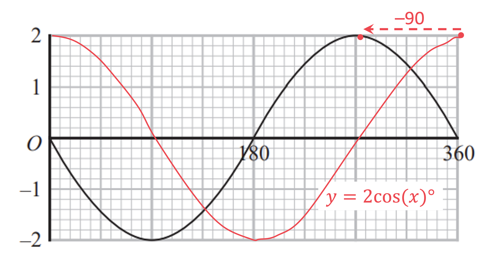

> *We can see that to go from *`y space equals space 2 cos open parentheses x close parentheses degree`* to the given curve, we need to translate the curve by 90° to the left (or 270° to the right). A translation by **−90** in the **x-**axis means that **b** is **+90**.*

$b=90$ **[1]**

## Q21 — medium — 2 marks · exam-questions

### 20((b)) — 2 marks
> *"*`2 straight g open parentheses x close parentheses`*" is a **vertical stretch, scale factor** **2**.  So **x**-coordinates remain unchanged and **y**-coordinates get multiplied by 2.*

> *Picking the 2 endpoints (-4, 6) and (8, 4), and the minimum point (3, -1);*

*(-4, 6) will transform to (-4, 12) **(see below) *

*(8,4) will transform to (8, 8) **(see below)** *

*(3, -1) will transform to (3, -2)*

> *We have a problem! The transformed endpoints (-4, 12) and (8, 8) cannot be plotted on the grid provided. So we need to pick some other points.*

> *As the **y**-axis goes up to 6, the points with **y** = 3 would be the extremes of *`y equals straight g open parentheses x close parentheses`* that we can transform. So we could pick (-1, 3) and (7, 3);*

*(-1, 3) will transform to (-1, 6)*

* (7, 3) will transform to (7, 6)*

> *Now plot (3, -2), (-1, 6) and (7, 6) on the grid and join them with two straight lines.*

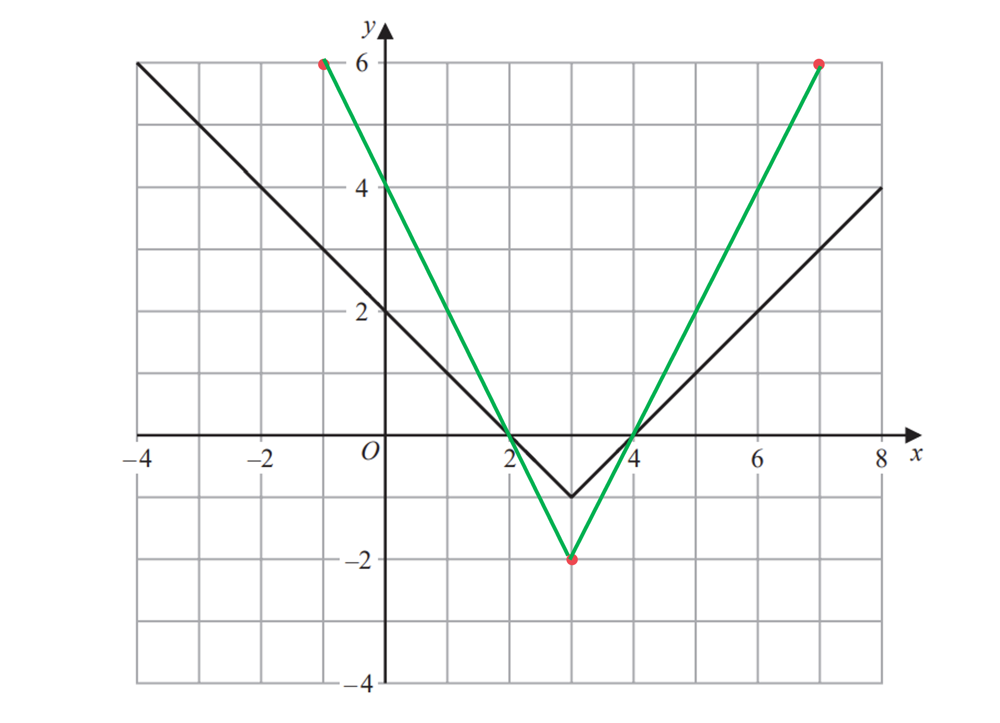

> *Note that the **x**-axis intercepts remain unchanged (0 × 2 = 0) so it is important your sketch passes through these points.*

**For (3, -2) and a V shape**** [1] **
**Fully correct**** [1]**

## Q22 — medium — 3 marks · exam-questions

### 22((a)) — 2 marks
> *"*`straight f open parentheses 1 half x close parentheses`*" represents a **stretch** in the **x**-axis by factor 2.*

> *The **y**-coordinates do not change but the **x**-coordinates are multiplied by 2. Pick the integer coordinates;*

*(-2, 5) becomes (-4, 5) *

*(-1, 0) becomes (-2, 0) *

*(0, -3) becomes (0, -3) *

(*1, -4) becomes (2, -4) *

*(2, -3) becomes (4, -3) *

*(3, 0) becomes (6, 0) *

*(4, 5) becomes (8, 5)*

> *Plot these points on the grid and join them with a curved line.*

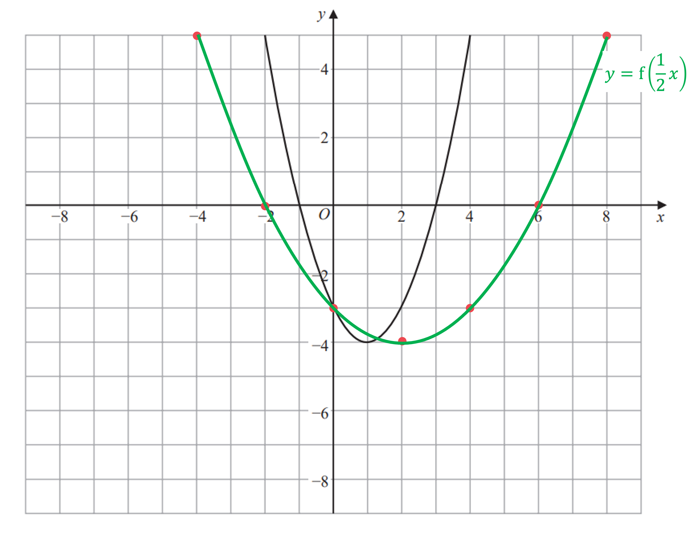

**u-shaped parabola through (2, -4), or through (-2, 0) ****and**** (6, 0), or through (-4, 5) ****and**** (8, 5) ****[1]** 
**fully correct answer**** [1] **
**The curve must go through the points (-4, 5), (-2, 0), (0, -3), (2, -4), (4, -3), (6, 0) and (8, 5)*** ***to achieve full marks**

### 22((b)) — 1 marks
> *By comparing the graph of *`y equals space straight f open parentheses x space plus space k close parentheses`* to the graph of *`y equals space straight f open parentheses x close parentheses`* shown in red below, we can see that it is a translation by 3 units to the left, or by −3 in the **x**-axis.*

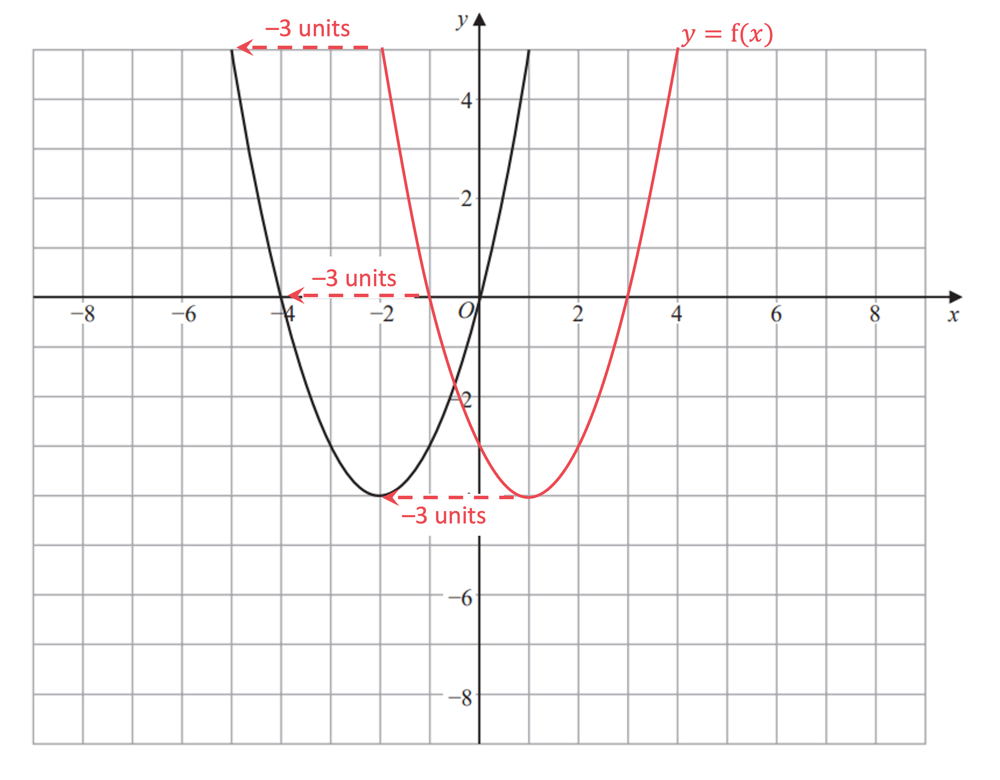

> *A translation by −3 in the **x**-axis is represented by *`y equals space straight f open parentheses x space plus 3 close parentheses`* thus *$k=3$*.*

$k=3$* ***[1]**

## Q23 — medium — 4 marks · exam-questions

### 18((a)) — 3 marks
i) *"f(x − 4)" represents a **translation** 4 units to the **right **so add 4 to the **x**-coordinate*

**(7, −4)*** ***[1]**

ii) *"3f(x)" represents a **stretch** by a factor of 3 in the **y**-axis**, so multiply the **y**-coordinate by 3.*

**(3, −12)*** ***[1]**

iii) *"*`straight f open parentheses 1 half x close parentheses`*" represents a **stretch** by a factor of **2 **in the **x**-axis**, so multiply the **x**-coordinate by 2.*

**(6, −4)*** ***[1] **

**A common mistake here is to multiply the ****x****-coordinate by **$\frac{1}{2}$

### 18((b)) — 1 marks
> *From (3, −4) to (3, 5), the **x**-coordinate has remained the same and the **y**-coordinate has increased by 9. Therefore there was a translation by +9 units in the **y**-axis.*

> *A translation by +9 units in the **y**-axis is represented by *`y equals space f open parentheses x close parentheses space plus space 9`* therefore *$k=9$*.*

$k=9$ **[1]**

## Q24 — medium — 3 marks · exam-questions

### 28((a)) — 1 marks
$y=\mathrm{cos}(x--90^{\circ})$ *is a translation of *$y=\mathrm{cos}x$* by 90° to the **right**. *

> *Translate the key points first; maximums, minimums axis intercepts.*

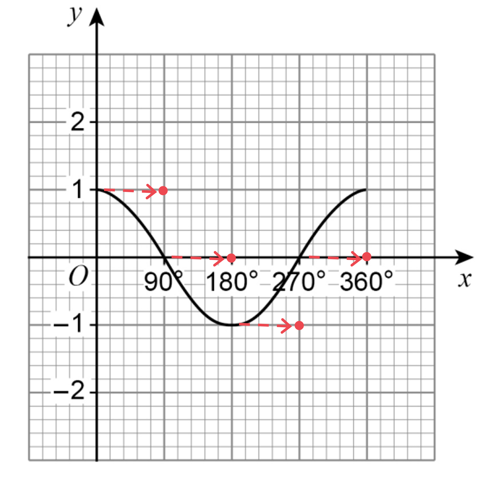

> *Join the translated points with a smooth line, but don't draw your line past *$x=360^{\circ}$* as the question asks for the graph for *`0 degree space less-than or slanted equal to space x space less-than or slanted equal to space 360 degree`* only.*

> *Similarly, you need to complete the curve between *$x=0^{\circ}$* and *$x=90^{\circ}$*.*

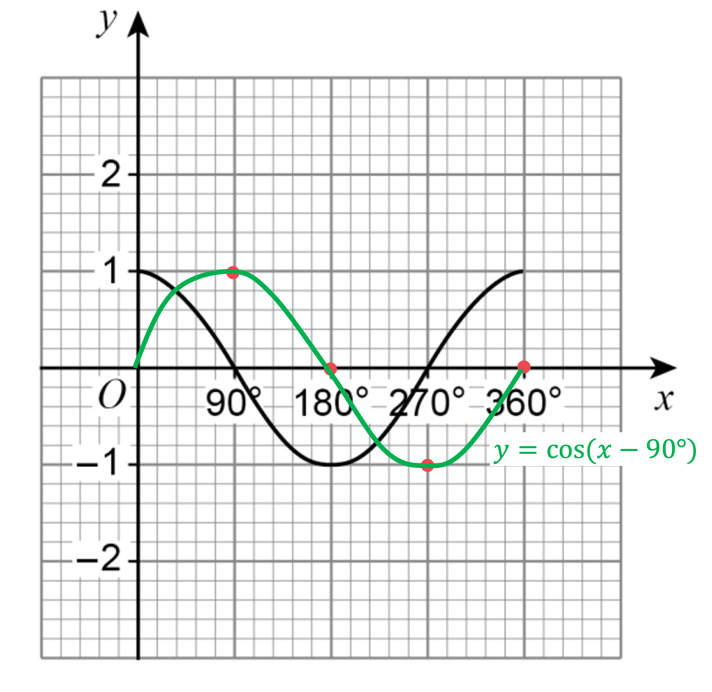

**[1]**

### 28((b)) — 1 marks
$y=1+\mathrm{cos}x$ *(or *$y=\mathrm{cos}x+1$* if you prefer) is a translation of *$y=\mathrm{cos}x$* by 1 unit **up**.*

> *Translate the key points first; maximums, minimums axis intercepts.*

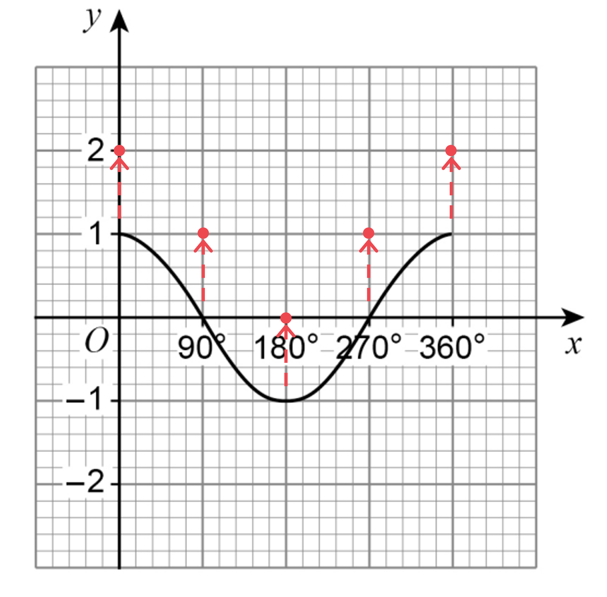

> *Join the translated points with a smooth line.*

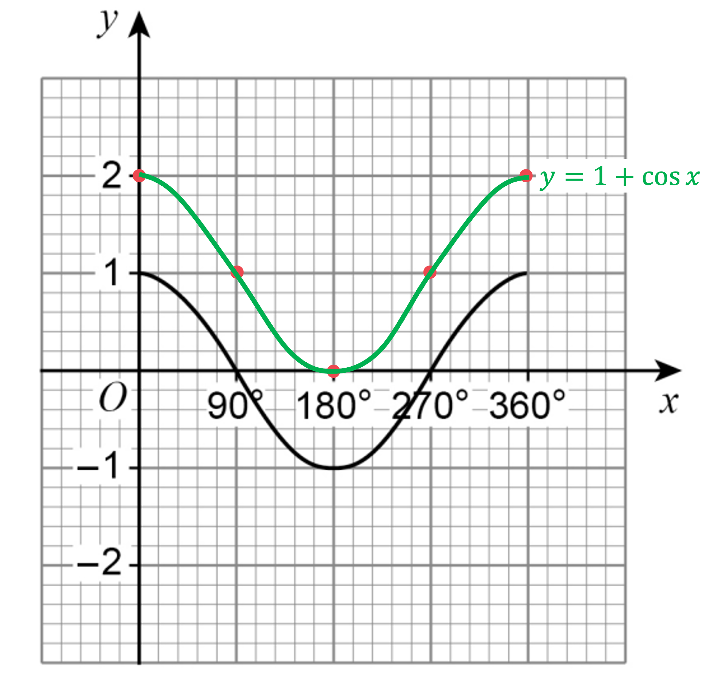

**[1]**

### 28((c)) — 1 marks
**Rita has reflected her graph in the ****x****-axis but she should have reflected it in the ****y-****axis** **[1]**

## Q25 — medium — 2 marks · exam-questions

### 24() — 2 marks
> $y=f(x+2)$* is a translation of *$y=f(x)$* by 2 **left**.*

> *Start by translating the integer points listed 2 left.*

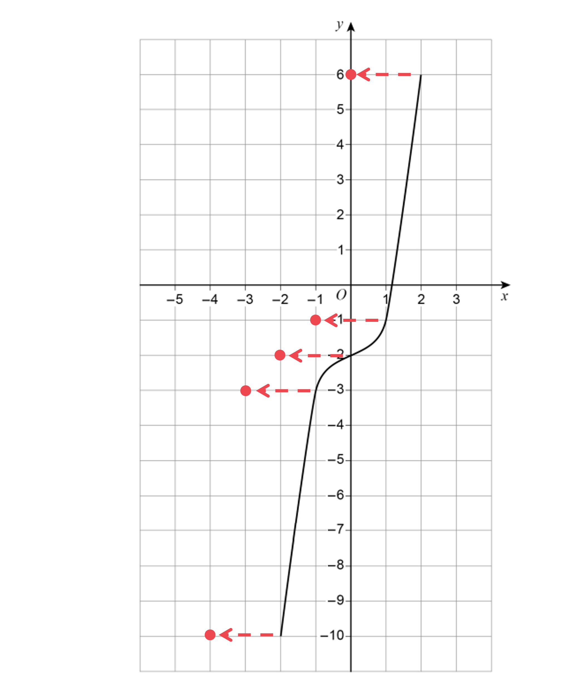

> *Join your points with a smooth curve.*

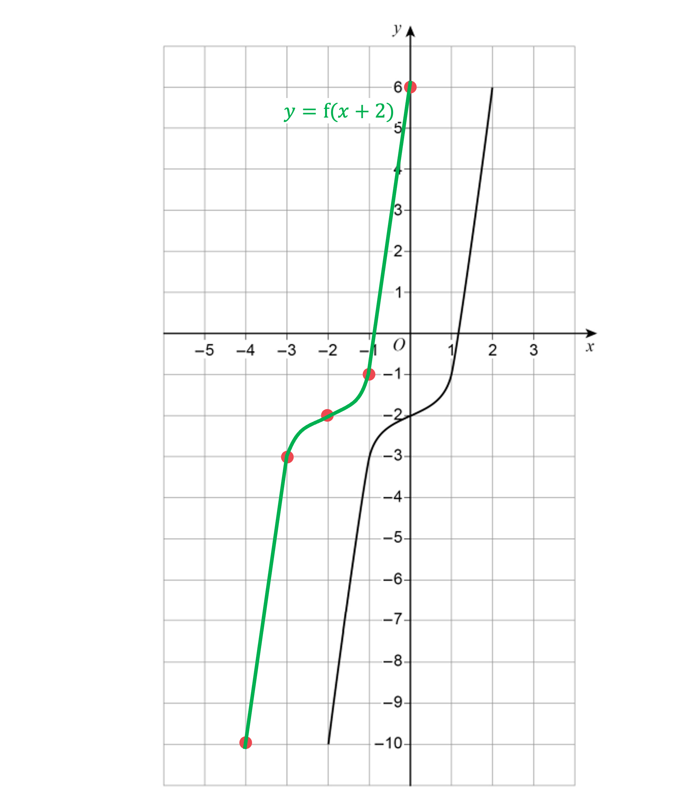

**smooth curve through at least 3 of (–2, –10), (–1, –3), (0, –2), (1, –1) and (2, 6) ****[1]** 
**smooth curve through all of (–2, –10), (–1, –3), (0, –2), (1, –1) and (2, 6) ****[1]**

## Q26 — medium — 1 marks · exam-questions

### 27() — 1 marks
> *A reflection of a function in the form *`y space equals space straight f open parentheses x close parentheses`* in the **x**- axis is represented by the graph of *`y space equals space minus straight f open parentheses x close parentheses`*. *

> *Consider the equation of the graph of *`y space equals negative straight f open parentheses x close parentheses`*.*

`negative y space equals space minus open parentheses x squared space minus 5 x space plus 2 close parentheses space equals space minus x squared space minus open parentheses negative 5 x close parentheses space minus 2 space equals space minus x squared space plus 5 x space minus 2`

**Option 3 is the correct answer, **$y=-x^{2}+5x-2$** ****[1]**

> *Options 1 and 4 cannot be correct as they have a positive coefficient of *$x^{2}$* so cannot be the reflection of a positive quadratic in the **x**-axis. *

> *Option 2 cannot be correct as it has the same value for the **y**-intercept as the given equation so cannot be a reflection in the **x**-axis.*

## Q27 — medium — 2 marks · exam-questions

### 13((b)) — 2 marks
> *We (should) know that y = cos(x) crosses the **x**-axis at **x** = 90° and **x** = 270°.*

> *"y = cos(**x** − 30)" represents a translation of y = cos(x) in the **x**-axis by **+**30°. Add 30° to 90° and 270°.*

*90 + 30 = 120 and 270 + 30 = 300*

**120° and 300°**

**120 ****[1]**

**300**** [1]**

## Q28 — medium — 3 marks · exam-questions

### 16() — 3 marks
> *First sketch the graph of y = sin **x**  for *`0 degree less-than or slanted equal to x less-than or slanted equal to 360 degree`* on the axes. It should pass through (0, 0), (90, 1), (180, 0), (270, -1) and (360, 0).*

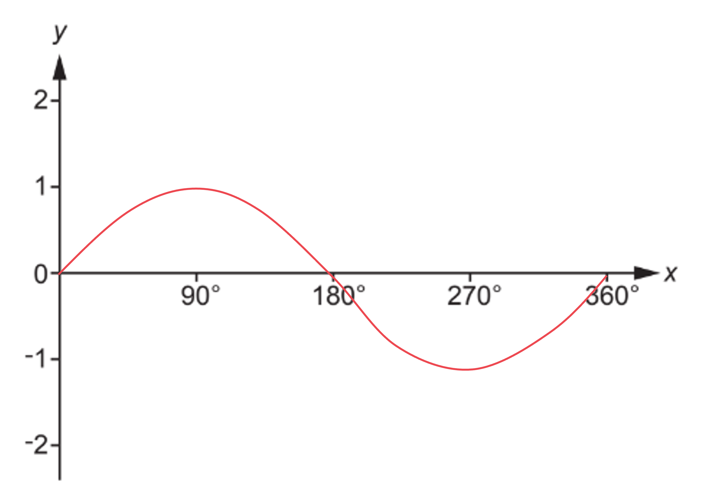

**positive sine curve ****[1]**

> *"**y** = −sin x" represents a reflection of **y **= sin **x **in the **x-**axis so reflect the graph in the **x-**axis. *
*Reflect the maximum and minimum points and axis intercepts, then join the reflected points with a smooth curve*

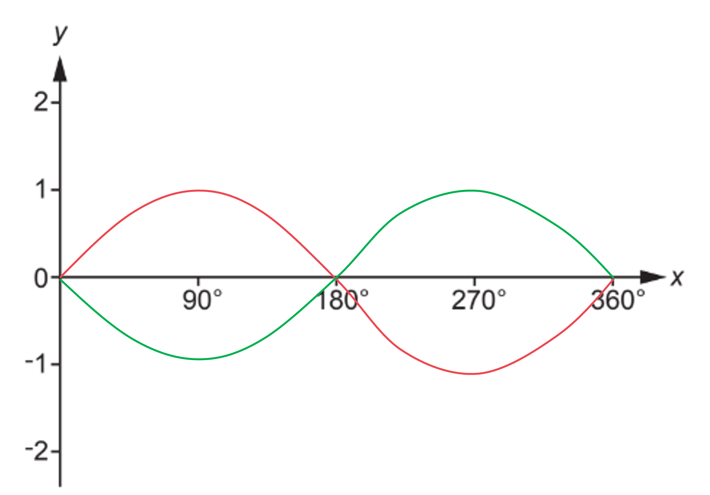

**maximum at (..., 1) and minimum at (..., -1) ****[1] **
**maximum at (270, ...) and minimum at (90, ...) ****[1]**

## Q29 — hard — 4 marks · exam-questions

### 26((a)) — 2 marks
> *"f(x − 3)" represents a **translation** of f(x) 3 units to the **right*

> *Start by translating key points on the curve 3 units right. Translate integer points and the minimum point*

> *Then draw a smooth curve, as similar to the original as you can, through the translated points*

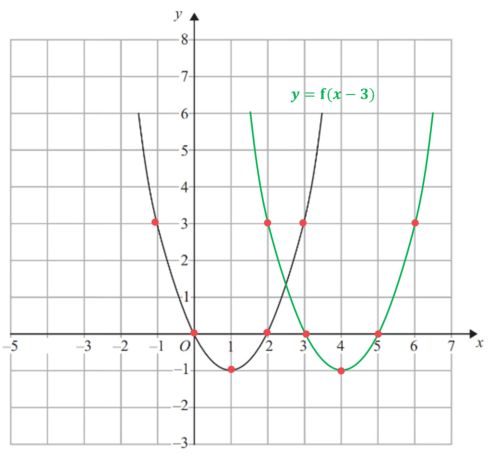

**a horizontal translation ****[1]** 
**a horizontal translation by 3 units right**** [1] **
**The curve must go through the points (1, 6), (2, 0), (4, -2.5), (6, 0) and (7, 6) to achieve full marks**

### 26((b)) — 2 marks
> *Here we have two transformations. The "-**x**" inside the bracket means that the graph is reflected in the **y**-axis and the "+2" outside the bracket means that the graph is translated 2 units up. *
*Here we will perform the reflection first. (Performing these transformations in the reverse order does not change the final answer in this case though always try to follow the order of operations- BIDMAS- in the function).*

> *Start by reflecting integer points. Then join the reflected points with a smooth curve. Label the curve.*

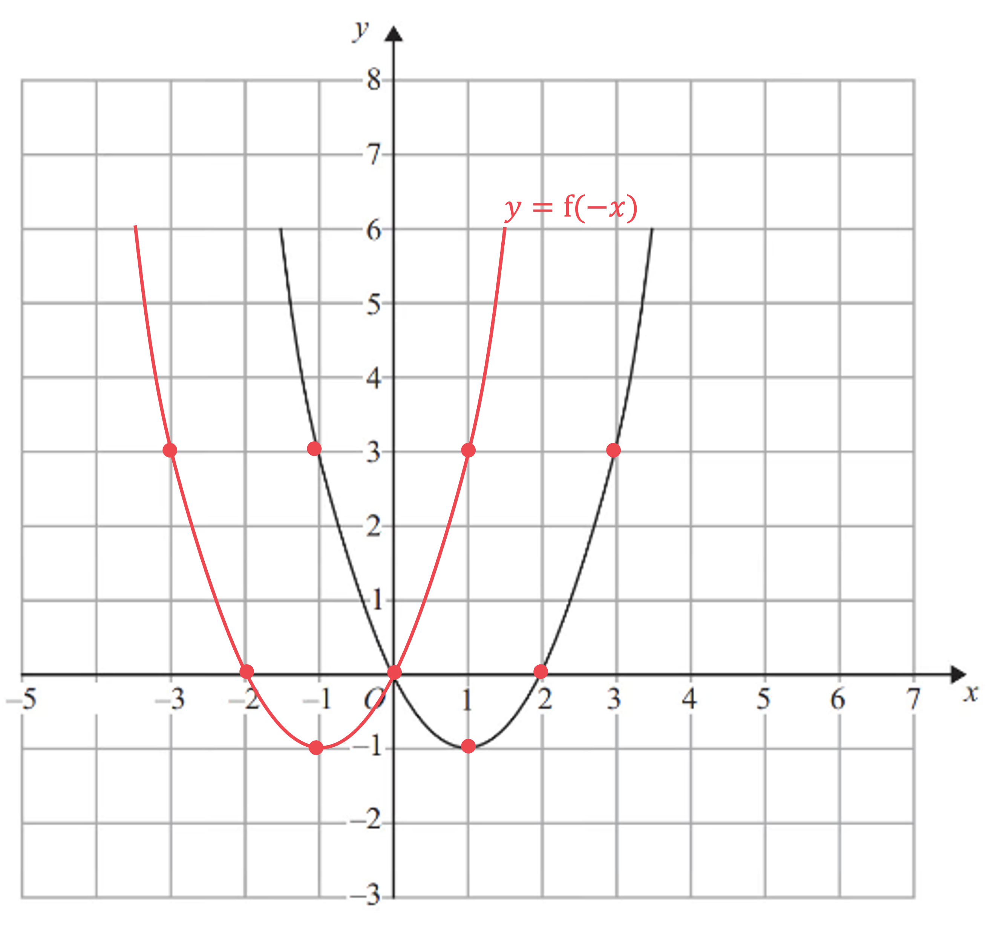

**[1]**

> *Now translate 2 up. Again, translate integer points first then join the translated points with a smooth curve. Label the curve.*

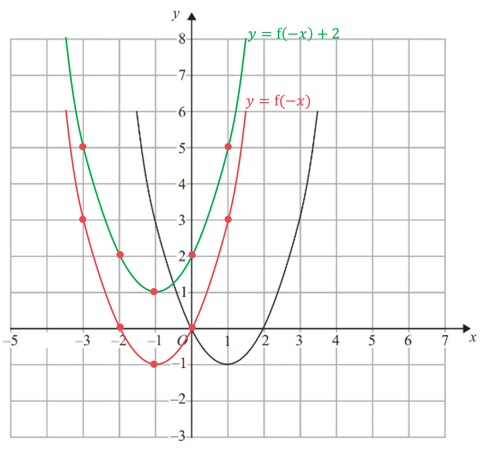

**smooth curve through (-3, 5), (-2, 2), (-1, 1), (0, 2) and (1, 5)**** [1]**
** It's best not to erase your "in-between" curve as it is worth method marks. Instead label each curve with its equation, to make it clear to the examiner which is your final answer **

## Q30 — hard — 2 marks · exam-questions

### 19((a)) — 1 marks
> *"f(−x)" represents a **reflection** of f(x) **in the** **y**-axis*

> *Start by reflecting any integer points on the curve, then join the reflected points with a smooth line*

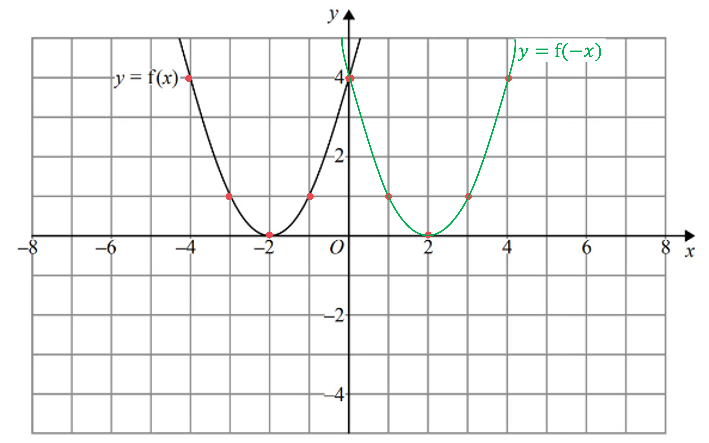

**smooth curve through (0, 4), (1, 1), (2, 0), (3, 1) and (4, 4)**** [1]**

### 19((b)) — 1 marks
> *Here we have two transformations. The "-f(**x**)" means that the graph is reflected in the **x**-axis and the "+3" outside the bracket means that the graph is translated 3 units up. *
*Following the order of operations BIDMAS, "×(−1)" comes before "+3" so the reflection must be performed first.*

> *Start by reflecting integer points. Then join the reflected points with a smooth curve. Label the curve.*

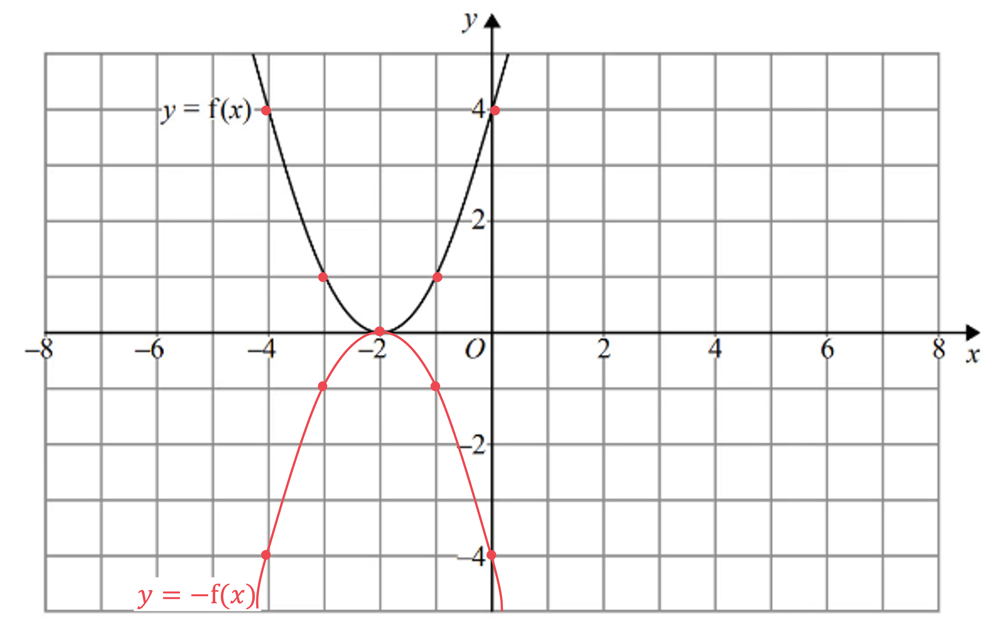

> *Now translate 3 up. Again, translate integer points first then join the translated points with a smooth curve. Label the curve*

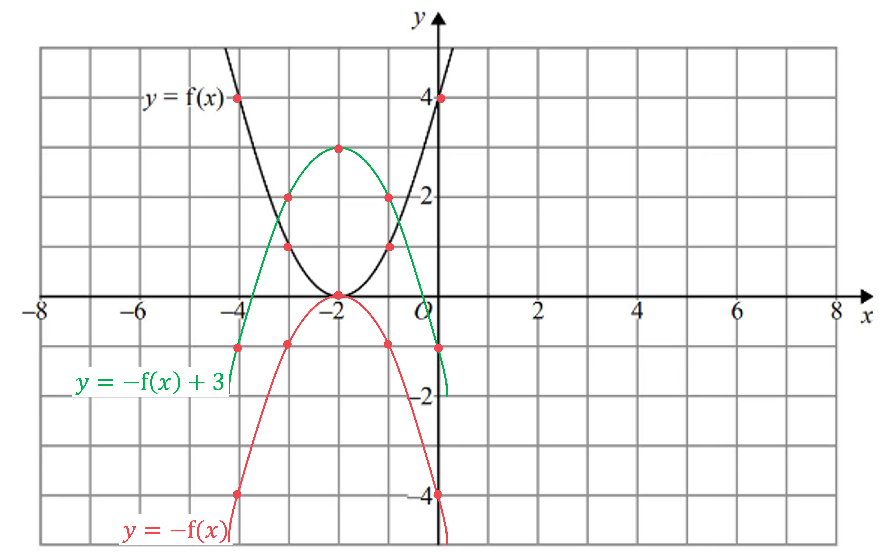

**smooth curve through (-4, -1), (-3, 2), (-2, 3), (-1, 2) and (0, -1)**** [1] Performing the transformations in the wrong order will lead to an incorrect answer in this case**

## Q31 — hard — 4 marks · exam-questions

### 24((a)) — 2 marks
> *The "− 2" inside the bracket signifies a **translation** 2 units to the **right*

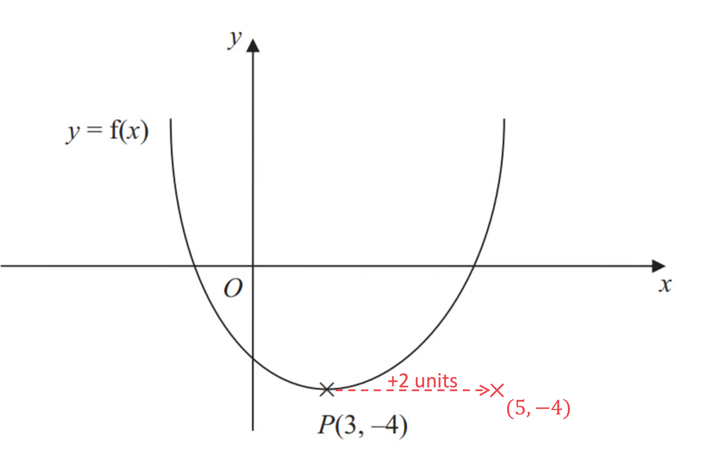

> *The **y**-coordinate does not change and we add 2 to the **x**-coordinate*

**(5, −4)**** **

**x-coordinate is 5**** [1]** 
**y-coordinate is −4**** [1]**

### 24((b)) — 2 marks
> *y** = f(**x** + 5) + 6 signifies two translations.*

> *Following the order of operations (BIDMAS), "+ 5" **inside** the bracket signifies a **translation** 5 units to the **left.*

> *The **y**-coordinate does not change and we **subtract** 5 from the **x**-coordinate.*

**x***-coordinate: 3 − 5 = −2*

> *Next, "+ 6" **outside** the bracket signifies a **translation** 6 units **up.*

> *The **x**-coordinate does not change and we **add** 6 to the **y**-coordinate.*

**y***-coordinate: −4 + 6 = 2*

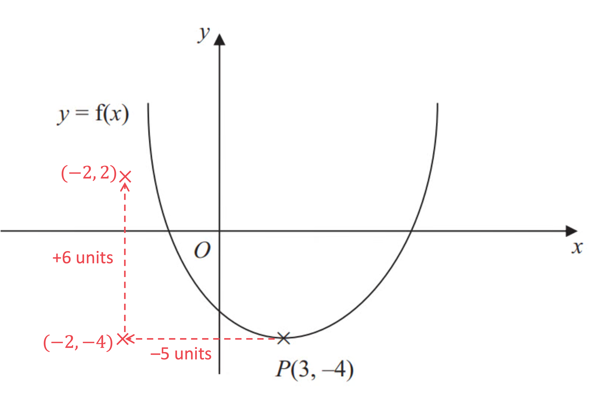

**(−2, 2)**** **

**x-coordinate is −2**** [1]** 
**y-coordinate is 2**** [1]**

**Performing the two translations in the reverse order does not change the final answer in this instance though always try to follow the order of operations (BIDMAS) in the function.**

## Q32 — hard — 2 marks · exam-questions

### 16() — 2 marks
> *y** = −f(**x** + 3) signifies two transformations. Following the order of operations (BIDMAS) means we should start with the "+3" inside the bracket (though in this case the answer will not be affected by the order).*

> *"+ 3" **inside** the bracket signifies a **translation** 3 units **left.*

> *The **y**-coordinate does not change and we **subtract** 3 from the **x**-coordinate.*

**x***-coordinate: 9 − 3 = 6*

> *Tnegative sign, "−" **outside** the bracket signifies a **reflection in the **x**-axis.*

> *The **x**-coordinate does not change but reverse the sign of the **y**-coordinate.*

**y***-coordinate: from 1 to −1*

> *If you like, sketch the transformations on some axes.*

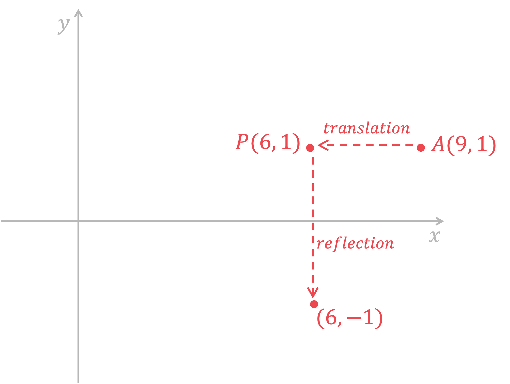

* *

**Final answer:** **(6, −1)**

** ****x-coordinate is 6**** [1]** 
**y-coordinate is −1**** [1]**

## Q33 — hard — 2 marks · exam-questions

### 15() — 2 marks
> *y** = f(−**x** ) − 3 signifies two transformations.*

> *Following the order of operations (BIDMAS), "−" **inside** the bracket signifies a **reflection in the **y**-axis.*

> *The **y**-coordinate does not change but reverse the sign of the **x**-coordinate.*

**x***-coordinate: from 7 to −7*

> *Next, "− 3" **outside** the bracket signifies a **translation** 3 units **down.*

> *The **x**-coordinate does not change and we **subtract** 3 from the **y**-coordinate.*

**y***-coordinate: 2 − 3 = −1*

> *If you like, sketch the transformations on some axes.*

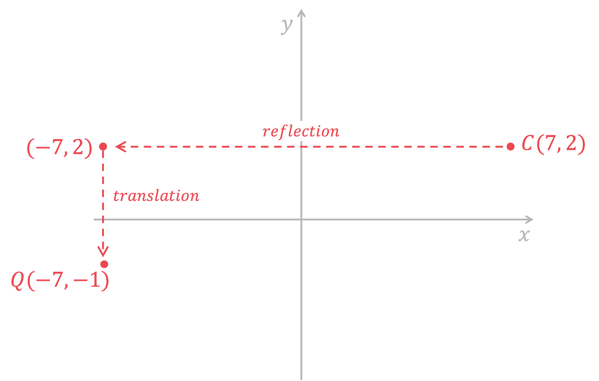

* *

**Final answer:** **(−7, −1)**

** ****x-coordinate is −7**** [1]** 
**y-coordinate is −1**** [1] **

**The order of transformations does not change the final answer in this case but always try to follow the order of operations (BIDMAS) in the function.**

## Q34 — hard — 2 marks · exam-questions

### 20((c)) — 2 marks
> `y equals h open parentheses x space plus space a close parentheses`* represents a translation of *`y equals h open parentheses x close parentheses`* by *$-a$* units in the *$x$*-axis.*

> *Either (-1, 0) has translated to (2, 0), or (6, 0) has.*

*If (-1, 0) has translated to (2, 0), then the **x**-coordinate has **increased** by 3 so **a** is **−**3.*

> *If  (6, 0) has translated to (2, 0), then the **x**-coordinate has **decreased** by 4 so **a** is **+**4.*

$a=-3$ **[1] **
**or **$a=4$** ****[1]**

**Remember that a translation left means a positive value of **$a$** and a translation right means a negative value of **$a$

## Q35 — hard — 3 marks · exam-questions

### 21((a)) — 1 marks
> *Write *`straight f open parentheses x close parentheses`* in the form *`y equals a open parentheses x plus p close parentheses squared plus q`*. *`open parentheses negative p comma space q close parentheses`* is the turning point.*

`y equals negative 3 open parentheses x plus 2 close parentheses squared plus 9`

> *From this we can derive the turning point, **A.*

$A=(-2,9)$* ***[1]**

### 21((b)) — 1 marks
> *Method 1: Using "transformations of functions"*

> *A translation by *`open parentheses table row 4 row 0 end table close parentheses`* (or a translation +4 in the **x-**axis), means that *`y equals straight f open parentheses x close parentheses`* becomes *`y equals straight f open parentheses x minus 4 close parentheses`*; 4 is subtracted inside the bracket.*

> *As *`straight f open parentheses x close parentheses equals 9 minus 3 open parentheses x plus 2 close parentheses squared`*, then;*

`table row cell straight f open parentheses x minus 4 close parentheses end cell equals cell 9 minus 3 open parentheses x plus 2 minus 4 close parentheses squared end cell row blank equals cell 9 minus 3 open parentheses x minus 2 close parentheses squared end cell end table`

**An equation for the curve S is **$y=9-3(x-2)^{2}$*  ***[1] **

**Equivalent equations such as '**$y=-3x^{2}+12x-3$**' are accepted '**`y equals straight f open parentheses x minus 4 close parentheses`**' was also accepted as an answer; but the answer above is what was intended by the question**

> *Method 2: Using "turning point by completing the square"*

> *After translation by *`open parentheses table row 4 row 0 end table close parentheses`* (or a translation +4 in the **x-**axis), the turning point (−2, 9) becomes;*

*(2, 9)*

> *So the equation takes the form;*

`table row straight y equals cell a open parentheses x minus 2 close parentheses squared plus 9 end cell end table`

> *And as the curve has not been stretched or reflected, the value of *`table attributes columnalign right center left columnspacing 0px end attributes row blank blank a end table`* remains the same as in curve *`table row blank blank C end table`*. i.e. *`table attributes columnalign right center left columnspacing 0px end attributes row a equals 3 end table`*.*

**An equation for the curve S is **$y=-3(x-2)^{2}+9$*  ***[1]**

** Note this is the same equation as in Method 1, just written in a different order**

### 21((c)) — 1 marks
> *Method 1: Using "transformations of functions"*

> *Curve *$C$* has the equation *`y equals straight f open parentheses x close parentheses`* where  *`straight f open parentheses x close parentheses equals negative 3 open parentheses x plus 2 close parentheses squared plus 9`*. Therefore;*

`table row cell negative straight f open parentheses x close parentheses end cell equals cell negative open parentheses negative 3 open parentheses x plus 2 close parentheses squared plus 9 close parentheses end cell row blank equals cell 3 open parentheses x plus 2 close parentheses squared minus 9 end cell end table`

> *This is the same equation as curve *$T$*. And *`negative straight f open parentheses x close parentheses`* represents a reflection in the **x**-axis.*

**A reflection in the ****x****-axis*** ***[1]**

> *Method 2: Using "quadratic graphs" and "turning point by completing the square"*

> *Using your knowledge of **quadratic graphs** and **turning point by completing the square**, sketch the curve *$C$* and curve *$T$*.*

> *The equation *`y equals negative 3 open parentheses x plus 2 close parentheses squared plus 9`* tells us curve *$C$* is a n-shaped parabola with a turning point (−2, 9).*

> *The equation *`y equals 3 open parentheses x plus 2 close parentheses squared minus 9`* tells us curve *$T$* is a u-shaped parabola, the same "width" as curve *$C$* and with a turning point (−2, −9).*

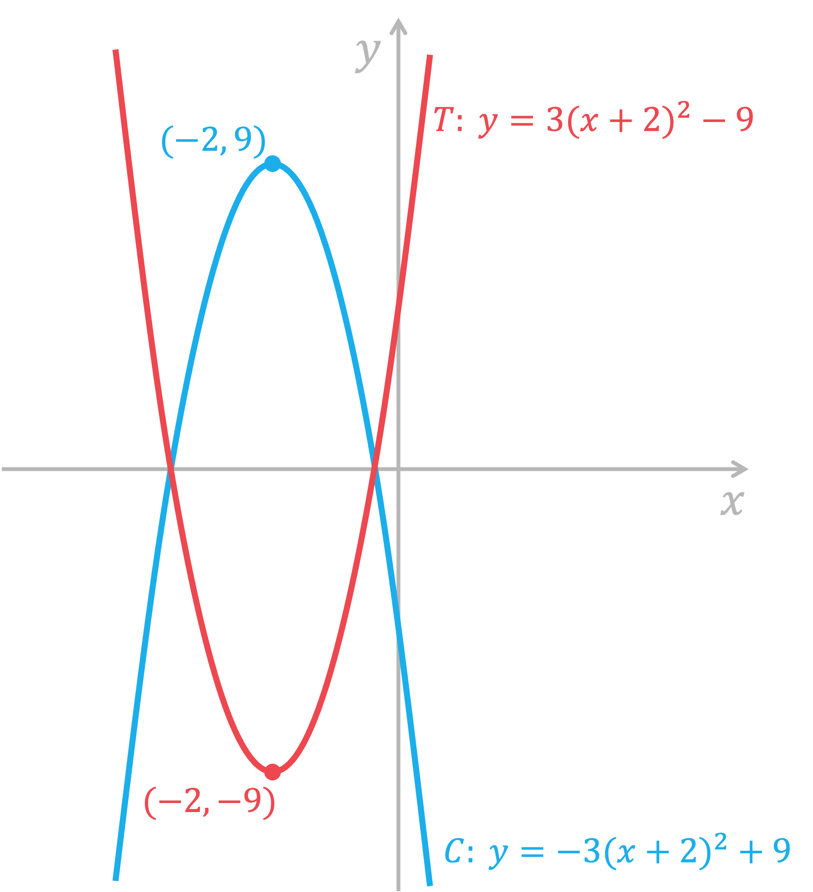

> *We can see from the sketch or from the information above that *$C$* and *$T$* are reflections of each other in the **x**-axis.*

**A reflection in the ****x****-axis*** ***[1]r**

## Q36 — hard — 4 marks · exam-questions

### 22() — 4 marks
> *Write *`straight g open parentheses x close parentheses`* in the form required by completing the square.*

`table row cell g open parentheses x close parentheses end cell equals cell 2 open parentheses x squared minus 6 x close parentheses plus 13 end cell row blank equals cell 2 open parentheses open parentheses x minus 3 close parentheses squared minus 9 close parentheses plus 13 end cell row blank equals cell 2 open parentheses x minus 3 close parentheses squared minus 18 plus 13 end cell row blank equals cell 2 open parentheses x minus 3 close parentheses squared minus 5 end cell end table`

**either a = 2, b = 3 or c = 5 ****[1]** 
**completed square form fully correct**** [1]**

> `straight f open parentheses x close parentheses equals x squared`* so *`2 straight f open parentheses x close parentheses equals 2 x squared`*. This is a stretch by scale factor 2.*

> *From *$2x^{2}$* to *`2 open parentheses x minus 3 close parentheses squared`* is a translation by +3 in the **x**-axis.*

> *And from *`2 open parentheses x minus 3 close parentheses squared`* to *`2 open parentheses x minus 3 close parentheses squared minus 5`* is a translation by −5 in the **y**-axis.*

> *Put these together and we have;*

**Final answer:** **A stretch in the ****y****-axis by scale factor 2 followed by a translation by **`stretchy left parenthesis table row 3 row cell negative 5 end cell end table stretchy right parenthesis`

**a stretch in y-axis by scale factor 2 or a translation by**** **`Error converting from MathML to accessible text.`** [1]** **both transformations in the correct order**** [1]**

**The translations can be given separately but the stretch must come before the translation in the ****y****-axis**

> *Note that if the translation *`open parentheses table row 3 row cell negative 5 end cell end table close parentheses`* is performed first then *`straight f open parentheses x minus 3 close parentheses minus 5 equals``open parentheses x minus 3 close parentheses squared minus 5`*. Let's call this new function *`straight h open parentheses x close parentheses`*.*

> `straight h open parentheses x close parentheses equals open parentheses x minus 3 close parentheses squared minus 5`* so performing the stretch, *`2 straight h open parentheses x close parentheses equals 2 open parentheses open parentheses x minus 3 close parentheses squared minus 5 close parentheses equals 2 open parentheses x minus 3 close parentheses squared minus 10`*. This is the wrong function! We want *`2 open parentheses x minus 3 close parentheses squared minus 5`* so if the translation is performed first, the translation must be *`open parentheses table row 3 row cell negative 2.5 end cell end table close parentheses`*.*

> *Two alternative correct answers are;*

**Final answer:** **A translation by **`equation`** followed by a stretch in the ****y****-axis by scale factor 2,**

**Final answer:** **A translation by 3 in the ****x****-axis and a stretch in the ****y****-axis by scale factor 2, followed by a translation by −5 in the ****y****-axis.**

## Q37 — hard — 3 marks · exam-questions

### 21((d)) — 3 marks
> *Start by sketching the graph of *`y space equals space cos space open parentheses x close parentheses degree`* on the same axes, noting the maximums and minimums.*

> *Starting with *$b$*, the maximum of *`y equals cos open parentheses x close parentheses degree`* at *$x=0$* has been translated 90° to the left- the given curve has a maximum at *$x=-90^{\circ}$*.*

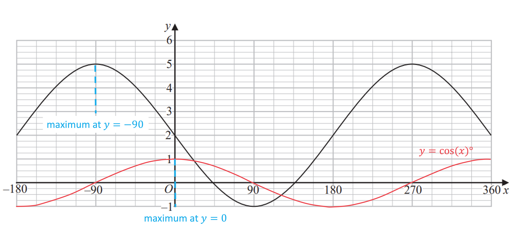

> *A translation of 90 left leads to *`y equals cos open parentheses x plus 90 close parentheses degree`*. Note that in the question, the given form is *`y equals... cos open parentheses x space minus space b close parentheses degree space plus space...`* and *`cos open parentheses x plus 90 close parentheses space equals space cos open parentheses x space minus space open parentheses negative 90 close parentheses space close parentheses`* therefore;*

$b=-90$* ***[1]**
$b=270$** ****is also accepted**

> *Now looking at *$a$*, the maximum and minimum of *`y equals cos open parentheses x close parentheses degree`* have a difference of 2 on the *$y$*-axis (the amplitude is 1). The maximum and minimum of the given curve have a difference of 6 on the *$y$*-axis (the amplitude is 3).*

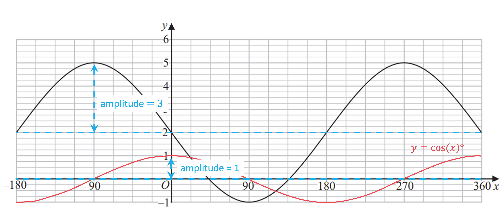

> *So the given graph has been stretched by 3 on the *$y$*-axis. Therefore;*

$a=3$* ***[1]**

> *Finally looking at *$c$*, the centre line of *`y equals cos open parentheses x close parentheses degree`* is *$y=0$*. The centre line of the given graph is *$y=2$*.*

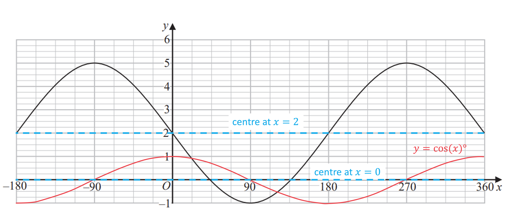

> *So the given graph has been translated by +2 in the *$y$*-axis. Therefore;*

** **$c=2$* ***[1]**

## Q38 — hard — 2 marks · exam-questions

### 21((b)) — 2 marks
> *Method 1 *

> `space y equals straight f open parentheses x close parentheses`* under translation by *`open parentheses table row 4 row 6 end table close parentheses`* becomes *`space y equals straight f open parentheses x minus 4 close parentheses plus 6`*. Apply this to *$y=x^{2}+3x+4$*.*

`table attributes columnalign right center left columnspacing 0px end attributes row y equals cell open parentheses x minus 4 close parentheses squared plus 3 open parentheses x minus 4 close parentheses plus 4 plus 6 end cell end table`

**translating 4 right, i.e. "...**`table row blank blank cell open parentheses x minus 4 close parentheses squared plus 3 open parentheses x minus 4 close parentheses end cell end table`**..."  or translating 6 up, i.e. "...**`table attributes columnalign right center left columnspacing 0px end attributes row blank blank cell x squared plus 3 x plus 4 plus 6 end cell end table`**" ****[1]**

`equation`**  ****or  **`equation`** ****[1] There is no need to simplify; but any equivalent versions of this equation are accepted**

> *Method 2 *

> *Rewrite *$C$* in the form *`y equals a open parentheses x plus p close parentheses squared plus q`* by completing the square.*

`table row y equals cell open parentheses x plus 3 over 2 close parentheses squared minus 9 over 4 plus 4 end cell row blank equals cell open parentheses x plus 3 over 2 close parentheses squared plus 7 over 4 end cell end table`

> *Translating by *`open parentheses table row 4 row 6 end table close parentheses`* changes *`y equals straight f open parentheses x close parentheses`* to *`y equals straight f open parentheses x minus 4 close parentheses plus 6`*. So subtract 4 inside the bracket and add 6 outside the bracket.*

`table attributes columnalign right center left columnspacing 0px end attributes row blank equals cell open parentheses x plus 3 over 2 minus 4 close parentheses squared plus 7 over 4 plus 6 end cell end table`

**equation in completed square form, followed by subtracting 4 inside the bracket or adding 6 outside the bracket**** [1]**

`equation`**  ****or **** **`equation` ** ****[1]**

**There is no need to simplify; but any equivalent versions of this equation are accepted**

## Q39 — hard — 9 marks · exam-questions

### 1() — 3 marks
> *Method 1*

> *Complete the square to rearrange *`f open parentheses x close parentheses`* into the form *`y equals a open parentheses x plus p close parentheses squared plus q`*, as the turning point is *`open parentheses negative p comma space q close parentheses`

`table row y equals cell negative 2 open parentheses x squared plus 4 x close parentheses plus 3 end cell row blank equals cell negative 2 open square brackets open parentheses x plus 2 close parentheses squared minus 4 close square brackets plus 3 end cell row blank equals cell negative 2 open parentheses x plus 2 close parentheses squared plus 8 plus 3 end cell row blank equals cell negative 2 open parentheses x plus 2 close parentheses squared plus 11 end cell end table`

**at least one correct step in completing the square ****[1] ****completing the square correctly ****[1]**

> *From this we can state the turning point*

$(-2,11)$** [1]**

> *Method 2*

`f apostrophe open parentheses x close parentheses`* is the functions notation for *$\frac{dy}{dx}$ *Differentiate*

`f apostrophe open parentheses x close parentheses equals negative 8 minus 4 x`

**[1]**

> *To find the turning point, equate the derivative to zero*

$-8-4x=0$

**[1]**

> *Solve*

`table row cell negative 8 end cell equals cell 4 x end cell row x equals cell negative 2 end cell end table`

> *Note that the question asks for the coordinates, so we need the **y** coordinate too*

`table attributes columnalign right center left columnspacing 0px end attributes row y equals cell 3 minus 8 open parentheses negative 2 close parentheses minus 2 open parentheses negative 2 close parentheses squared end cell row blank equals 11 end table`

$(-2,11)$** [1]**

### 2() — 6 marks
> *Before answering, you may find it helpful to sketch the graph of f(**x**) using your answer to part (a) and the knowledge that it is an n-shaped parabola*

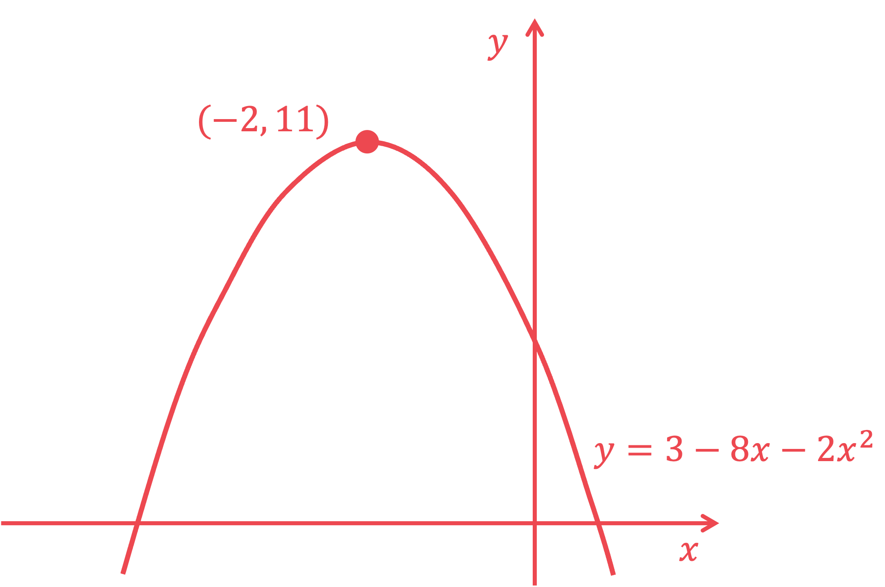

(i)`y equals f open parentheses x close parentheses plus 2`* represents a **translation** by *`open parentheses table row 0 row 2 end table close parentheses`*; the y-coordinate is increased by 2*

$(-2,13)$* ***[1]**

(ii)`y equals f open parentheses x minus 3 close parentheses`* represents a **translation** by *`open parentheses table row 3 row 0 end table close parentheses`*; the x-coordinate is increased by 3*

$(1,11)$* ***[1]**

(iii)`y equals f open parentheses 4 x close parentheses`* represents a **stretch** in the x-axis by a factor of  *$\frac{1}{4}$*; the x-coordinate is multiplied by *$\frac{1}{4}$

$(-\frac{1}{2},11)$* ***[1]**

(iv) `y equals negative f open parentheses x close parentheses`* represents a **reflection** in the x-axis; the y-coordinate is multiplied by -1*

$(-2,-11)$* ***[1]**

(v)`y equals 3 f open parentheses x plus 1 close parentheses`* represents a **translation** by *`open parentheses table row cell negative 1 end cell row 0 end table close parentheses`* followed by a stretch in the y-axis by scale factor 3*

> *Following the order of operations (BIDMAS), the "+1" inside the bracket comes first so perform the translation first. The x-coordinate is decreased by 1*

`open parentheses negative 3 comma space 11 close parentheses`

> *And for the stretch, the y-coordinate is multiplied by 3*

$(-3,33)$

**x-coordinate is −3**** [1] **
**y-coordinate is 33**** [1]**

**Performing these transformations in the reverse order does not change the final answer in this particular case**

## Q40 — hard — 4 marks · exam-questions

### 29() — 4 marks
> *A translation 4 units to the right changes *`y equals straight f open parentheses x close parentheses`* to *`y equals straight f open parentheses x minus 4 close parentheses`*. Therefore *$y=x^{3}+6$* becomes;*

`y equals open parentheses x minus 4 close parentheses cubed plus 6`

**[1]**

> *Expand the brackets remembering that *`open parentheses x minus 4 close parentheses cubed equals open parentheses x minus 4 close parentheses open parentheses x minus 4 close parentheses open parentheses x minus 4 close parentheses`*. Expand the first two brackets first.*

`equals open parentheses x minus 4 close parentheses open parentheses x minus 4 close parentheses open parentheses x minus 4 close parentheses plus 6
equals open parentheses x squared minus 8 x plus 16 close parentheses open parentheses x minus 4 close parentheses plus 6`

**[1]**

> *Expand the brackets again, taking care to multiply each term in the first bracket by each term in the second bracket. Take particular care with the negatives.*

$=x^{3}-4x^{2}-8x^{2}+32x+16x-64+6$

**[1]**

> *Collect like terms.*

$x^{3}-12x^{2}+48x-58$ **[1]**

## Q41 — hard — 3 marks · exam-questions

### 20() — 3 marks
> *Method 1*

> *A reflection in the *$y$*-axis changes *`y equals straight f open parentheses x close parentheses`* to *`y equals straight f open parentheses negative x close parentheses`*. This changes *`y equals 2 open parentheses x minus 1 close parentheses squared minus 5`* to;*

`y equals 2 open parentheses negative x minus 1 close parentheses squared minus 5`

**[1]**

> *Expand the squared brackets.*

`table attributes columnalign right center left columnspacing 0px end attributes row y equals cell 2 open parentheses negative x minus 1 close parentheses open parentheses negative x minus 1 close parentheses minus 5 end cell row blank equals cell 2 open parentheses x squared plus x plus x plus 1 close parentheses minus 5 end cell row blank equals cell 2 open parentheses x squared plus 2 x plus 1 close parentheses minus 5 end cell end table`

**[1]**

> *Expand the remaining bracket and collect like terms.*

`table attributes columnalign right center left columnspacing 0px end attributes row blank equals cell 2 x squared plus 4 x plus 2 minus 5 end cell row blank equals cell 2 x squared plus 4 x minus 3 end cell end table`

`table row bold italic y bold equals cell bold 2 bold italic x to the power of bold 2 bold plus bold 4 bold italic x bold minus bold 3 end cell end table` **[1]**

> *Method 2*

> *A quadratic equation in completed square form *`y equals a open parentheses x minus p close parentheses squared plus q`* has turning point at *`open parentheses p comma space q close parentheses`*.*

`y equals 2 open parentheses x minus 1 close parentheses squared minus 5`* **has a turning point at *`open parentheses 1 comma space minus 5 close parentheses`

> *Reflect the turning point in the *$y$*-axis, keeping the value of '*$a$*' the same.*

*turning point at *`open parentheses negative 1 comma space minus 5 close parentheses space space rightwards arrow space y equals 2 open parentheses x plus 1 close parentheses squared minus 5`

**[1]**

> *Expand the squared brackets.*

`table row y equals cell 2 open parentheses x plus 1 close parentheses open parentheses x plus 1 close parentheses minus 5 end cell row blank equals cell 2 open parentheses x squared plus x plus x plus 1 close parentheses minus 5 end cell row blank equals cell 2 open parentheses x squared plus 2 x plus 1 close parentheses minus 5 end cell end table`

**[1]**

> *Expand the remaining bracket and collect like terms.*

`table row blank equals cell 2 x squared plus 4 x plus 2 minus 5 end cell row blank equals cell 2 x squared plus 4 x minus 3 end cell end table`

`table row bold italic y bold equals cell bold 2 bold italic x to the power of bold 2 bold plus bold 4 bold italic x bold minus bold 3 end cell end table` **[1]**

## Q42 — hard — 2 marks · exam-questions

### 27((b)) — 2 marks
> *Write the composite function *`y equals fg open parentheses x close parentheses`*.*

`y equals sin open parentheses x plus 90 close parentheses`

> `y equals sin open parentheses x plus 90 close parentheses`* is a translation of *$y=\mathrm{sin}x$* by 90° **left**.*

> *Start by lightly sketching the graph of *$y=\mathrm{sin}x$*. It should pass through (0, 0), (90, 1), (180, 0), (270, -1) and (360, 0). *

> *Translate these key points 90 left (you can ignore (0, 0) as it will be off the grid). You will need to complete an extra point at (360, 1) by continuing the pattern of the curve.*

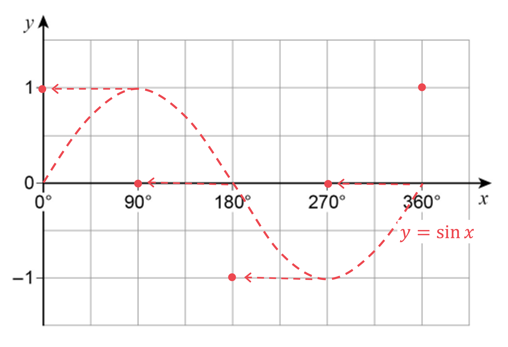

> *Join the points with a smooth curve. It should pass through (0, 1), (90, 0), (180, -1), (270, 0) and (360, 1).*

**smooth curve through at least 4 of the points below, or straight lines joining all of the points below ****[1]** 
**smooth curve through all of (0, 1), (90, 0), (180, -1), (270, 0) and (360, 1) ****[1]**

**It is best practice to label the curves with their equations. This also makes it clear to the examiner which is your final answer**

## Q43 — hard — 4 marks · exam-questions

### 18((a)) — 3 marks
(i)

> *The transformation from f*`open parentheses x close parentheses`* to f*`open parentheses x minus 4 close parentheses`* is a translation parallel to the *$x$*axis by 4 units, meaning that the *$x$*coordinate will increase by 4*

`open parentheses 7 comma negative 4 close parentheses`

**[B1]**

(ii)

> *The transformation from f*`open parentheses x close parentheses`* to 3f*`open parentheses x close parentheses`* is a stretch parallel to the *$y$*axis with a scale factor 3, meaning that the *$y$*coordinate will be multiplied by 3*

`open parentheses 3 comma space minus 12 close parentheses`

**[B1]**

(iii)

> *The transformation from f*`open parentheses x close parentheses`* to f*`open parentheses 1 half x close parentheses`* is a stretch parallel to the *$x$*axis with a scale factor 2, meaning that the *$x$*coordinate will be multiplied by 2*

`open parentheses 6 comma space minus 4 close parentheses`

**[B1]**

### 18((b)) — 1 marks
> *The transformation of *`y equals straight f open parentheses x close parentheses`* to *`y equals straight f open parentheses x close parentheses plus k`* means that the graph has been translated parallel to the *$y$*axis by *$k$* units*

> *Compare the coordinates of the minimum points for *`y equals straight f open parentheses x close parentheses`* and curve *$C$* and find difference in the *$y$* coordinates*

*(3, -4) and (3,5)*

`5 minus open parentheses negative 4 close parentheses equals 9`

$k=9$

**[B1]**

## Q44 — hard — 2 marks · exam-questions

### 21((a)) — 1 marks
> *The graph is translated 4 to the right so add 4 to the x coordinate*

**Final answer:** **(10, 5)**

**[B1]**

### 21((b)) — 1 marks
> *This is a stretch in the x direction with a scale factor of 1/3 so divide the x coordinate by 3*

**Final answer:** **(2, 5)**

**[B1]**

## Q45 — hard — 4 marks · exam-questions

### 24((a)) — 2 marks
> *Compare the equations for *`straight f open parentheses x close parentheses`* and *`straight g open parentheses x close parentheses`

- *The *$x$* values have been increased by 4 *
- *The *$y$* value has been increased by 6*

`straight g open parentheses x close parentheses space equals space straight f open parentheses x space plus thin space 4 close parentheses space plus thin space 6`

> *This is the same as a translation by 4 units to the left, and 6 units up*

`open parentheses table row cell negative 4 end cell row 6 end table close parentheses`

$a=-4$

**[B1]**

$b=6$

**[B1]**

### 24((b)) — 2 marks
> *The original graph of *`y space equals space cos open parentheses x close parentheses`* would pass through *$90$* and *$270$* on the x-axis, and would have a maximum height of *$1$*, and a minimum height of *$-1$

> *This graph has been translated to the left by *$45$* units and has been stretched by a factor of *$3$

`y space equals space 3 cos open parentheses x space plus thin space 45 close parentheses degree`

$p=3$

**[B1]**

$q=45$

**[B1]**
