# Exam Questions — 3D Pythagoras & Trigonometry
**Geometry & Trigonometry** · Edexcel IGCSE Maths A (4MA1) — 18/Higher
> Source: [https://www.savemyexams.com/igcse/maths/edexcel/a/18/higher/topic-questions/4-geometry-and-trigonometry/3d-pythagoras-and-trigonometry/exam-questions/](https://www.savemyexams.com/igcse/maths/edexcel/a/18/higher/topic-questions/4-geometry-and-trigonometry/3d-pythagoras-and-trigonometry/exam-questions/) · 36 questions · total 154 marks

## Q1 — medium — 4 marks · exam-questions

### 18() — 4 marks — command: find — structured — from paper June 2018 · 1MA1/2H
*ABCDEFGH* is a cuboid.

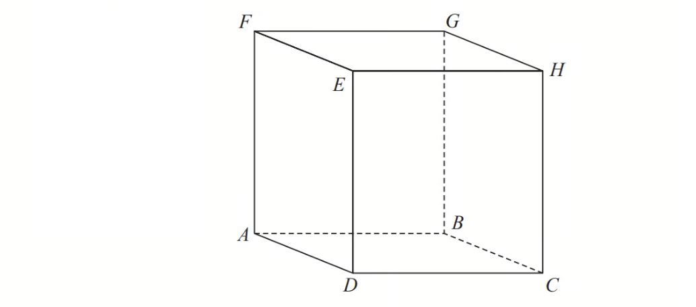

*AB* = 7.3 cm 
*CH* = 8.1 cm 
Angle *BCA* = 48°

Find the size of the angle between *AH* and the plane *ABCD*. 
Give your answer correct to 1 decimal place.

## Q2 — medium — 3 marks · exam-questions

### 19() — 3 marks — command: calculate — structured — from paper Jan 2022 · 4MA1/2HR
$ABCD$ is a horizontal rectangular field.

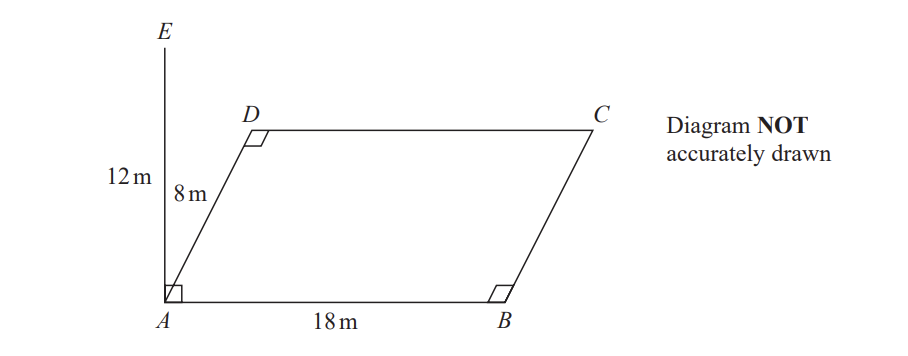

A vertical pole, $AE$, is placed at the corner A of the field.

$AE=12m$      $AB=18m$ $AD=8m$

Calculate the size of the angle between $EC$ and the plane $ABCD$ 
Give your answer correct to one decimal place.

## Q3 — medium — 4 marks · exam-questions

### 19() — 4 marks — command: work_out — structured — from paper Jan 2020 · 4MA1/1H
The diagram shows a cuboid $ABCDEFGH$.

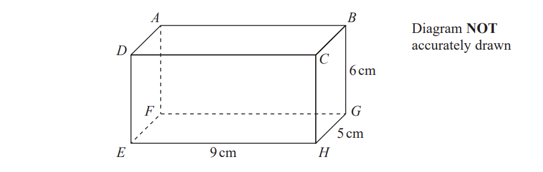

$EH=9\mathrm{cm},HG=5\mathrm{cm}$  and     $GB=6\mathrm{cm}.$

Work out the size of the angle between $AH$ and the plane $EFGH$. 
Give your answer correct to 3 significant figures.

## Q4 — medium — 3 marks · exam-questions

### 19() — 3 marks — command: work_out — structured — from paper June 2018 · 4MA1/2H
The diagram shows a triangular prism.

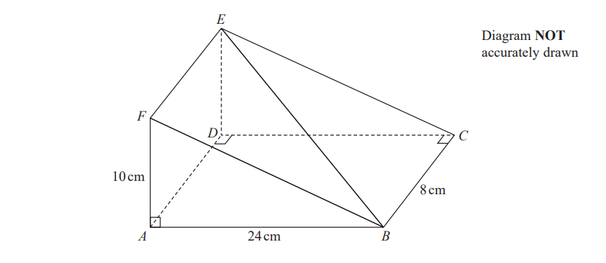

$AF=10\mathrm{cm},AB=24\mathrm{cm}$ and$BC=8\mathrm{cm}$. 
Angle$FAB$ = angle $ADC$ = angle $BCD=90^{\circ}$

Work out the size of the angle between the line $BE$ and the plane $ABCD$. 
Give your answer correct to 1 decimal place.

## Q5 — medium — 3 marks · exam-questions

### 21() — 3 marks — command: calculate — structured — from paper June 2019 · 4MA1/2H
The diagram shows cuboid $ABCDEFGH.$

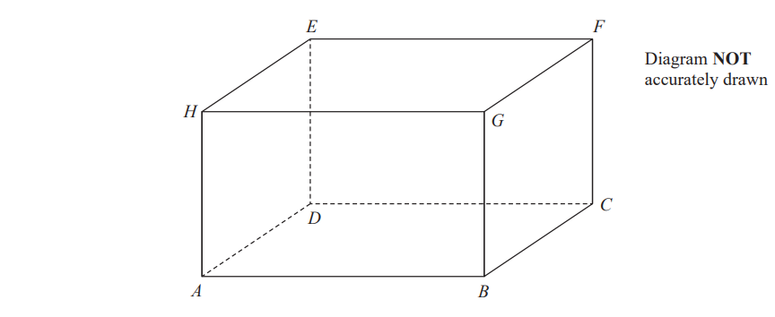

For this cuboid

the length of $AB$ : the length of $BC$ : the length of $CF$ = 4 : 2 : 3

Calculate the size of the angle between $AF$ and the plane $ABCD$
Give your answer correct to one decimal place.

## Q6 — medium — 1 marks · exam-questions

### 16((a)) — 1 mark — command: circle — structured — from paper Nov 2021 · 8300/2H
Here is a cube with edge length $x$cm

One diagonal is shown.

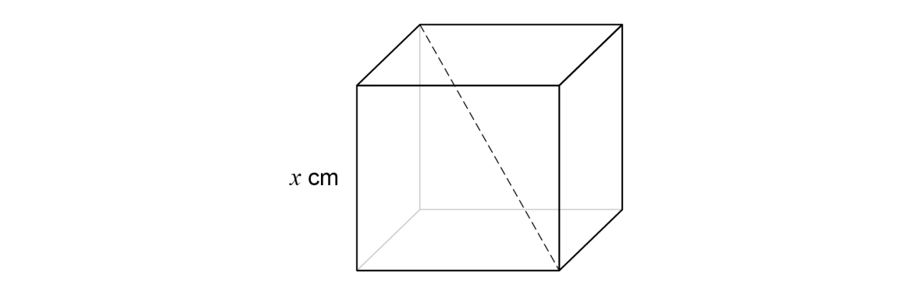

Circle the length, in centimetres, of the diagonal.

| $\sqrt{3}x$ | `cube root of 3 x squared end root` | $\sqrt{x^{3}}$ | `cube root of 3 x` |
|---|---|---|---|

## Q7 — medium — 3 marks · exam-questions

### 24() — 3 marks — command: work_out — structured — from paper June 2019 · 8300/3H
The length of a diagonal of a cuboid is 20 cm

The diagonal makes an angle of 24° with the base.

The area of the base is 150 cm2

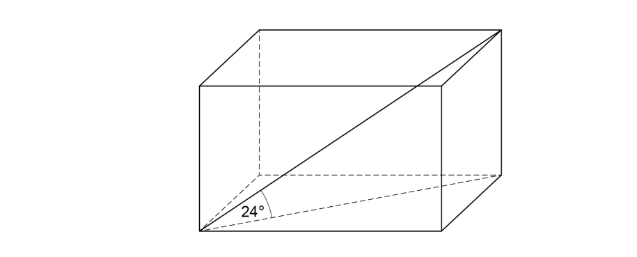

Work out the volume of the cuboid.

...................................... cm3

## Q8 — medium — 4 marks · exam-questions

### 18((c)) — 4 marks — command: calculate — structured — from paper Nov 2019 · J560/04
The diagram shows a right-angled triangular prism ABCDEF.

Length AD = 11 cm, length CD = 10 cm and length CF = 6 cm.

Calculate the exact length of AF.

..................................................... cm

## Q9 — medium — 3 marks · exam-questions

### 21() — 3 marks — command: calculate — structured — from paper 2020 Oct/Nov · 0580/02
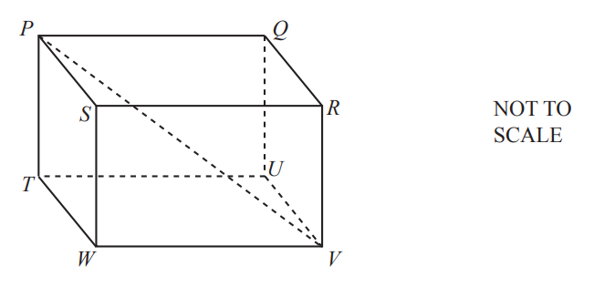

The diagram shows a cuboid $PQRSTUVW$. $PV=17.2\mathrm{cm}$ 
The angle between the line $PV$ and the base $TUVW$ of the cuboid is $43^{\circ}$.

Calculate $PT$.

$PT=$ ........................................... cm

## Q10 — medium — 4 marks · exam-questions

### 6((c)) — 4 marks — command: calculate — structured — from paper 2020 Oct/Nov · 0580/43
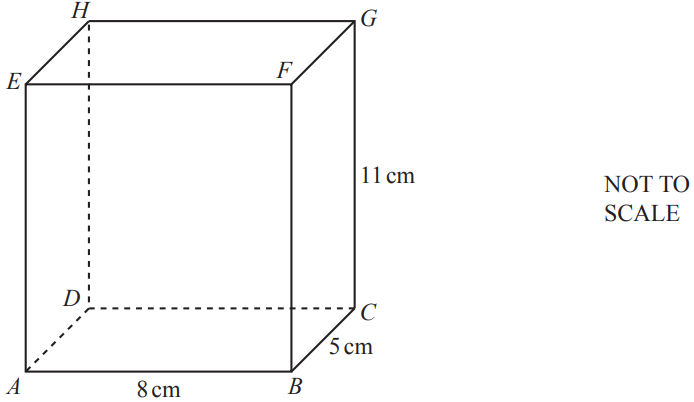

*ABCDEFGH* is a cuboid. *AB* = 8 cm, *BC *= 5 cm and *CG* = 11 cm.

i) Calculate angle *CAB*.

Angle* CAB* = ................................................ [2]

ii) Calculate angle *GAC*.

Angle* GAC *= ................................................ [2]

## Q11 — medium — 4 marks · exam-questions

### 6((b)) — 4 marks — command: calculate — structured — from paper 2018	May/June · 0580/43
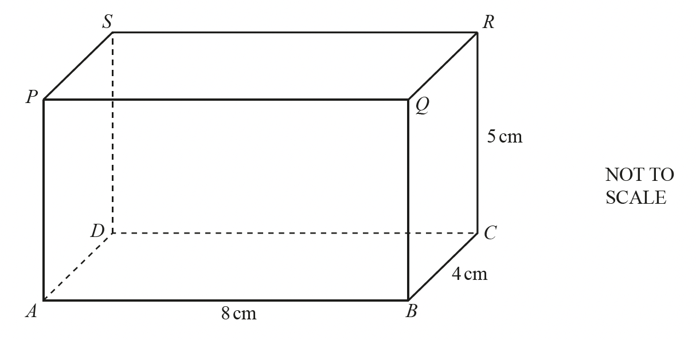

The diagram shows a cuboid. 
$AB$ = 8 cm, $BC$ = 4 cm and $CR$ = 5 cm.

Calculate the angle between the diagonal $AR$ and the plane $BCRQ$.

## Q12 — medium — 2 marks · exam-questions

### 1() — 2 marks — command: find — structured
A cuboid with a length of 8 units in the $x$ plane, a height of 4 units in the $y$ plane and a width of 3 units in the $z$ plane has the centre (1, 6, 0).

A straight line runs from the centre to one of the vertices. Find the length of this line.

## Q13 — hard — 4 marks · exam-questions

### 12() — 4 marks — command: calculate — structured — from paper Spec1 2015 · 1MA1/3H
The diagram shows a cuboid $ABCDEFGH$.

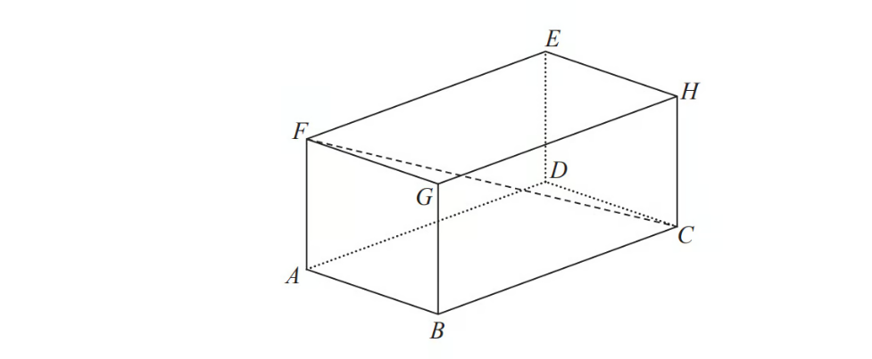

$AB=7\mathrm{cm},AF=5\mathrm{cm} \mathrm{and}FC=15\mathrm{cm}.$

Calculate the volume of the cuboid. 
Give your answer correct to $3$ significant figures.

## Q14 — hard — 4 marks · exam-questions

### 23() — 4 marks — command: find — structured — from paper Jan 2019 · 4MA1/1HR
Here is a cube $ABCDEFGH$.

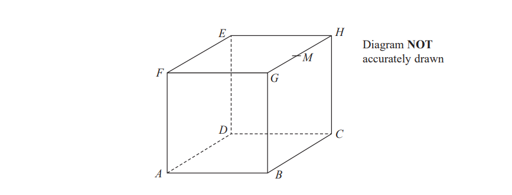

$M$ is the midpoint of the edge $GH$.

Find the size of the angle between the line $MA$ and the plane $ABCD$. 
Give your answer correct to $1$ decimal place.

## Q15 — hard — 4 marks · exam-questions

### 22() — 4 marks — command: calculate — structured — from paper Jan 2021 · 4MA1/2HR
$ABC$ is an isosceles triangle in a horizontal plane. The point $T$ is vertically above $B$.

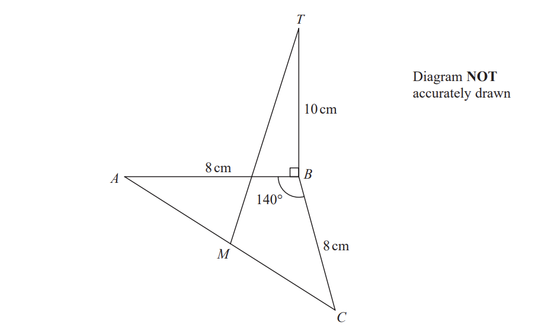

Angle $ABC=140^{\circ}$
 $AB=BC=8cm$ 
$TB=10cm$ 
$M$ is the midpoint of $AC$.

Calculate the size of the angle between $MT$ and the horizontal plane $ABC$. 
Give your answer correct to one decimal place.

## Q16 — hard — 5 marks · exam-questions

### 24() — 5 marks — command: calculate — structured — from paper Nov 2020 · 4MA1/2H
The diagram shows cuboid

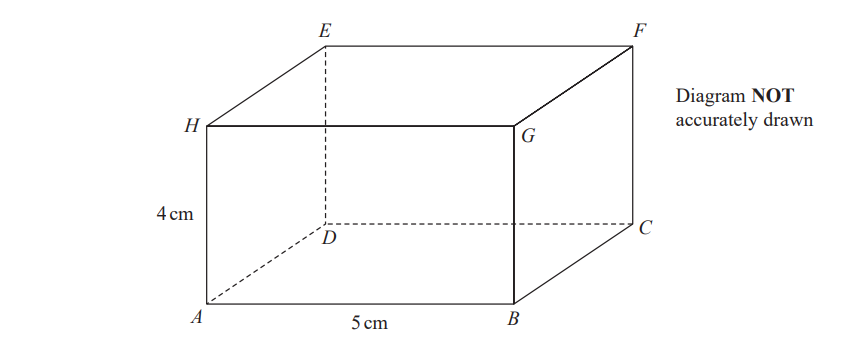

`table row cell A B space end cell equals cell space 5 space cm space end cell row cell A H space end cell equals cell space 4 space cm end cell end table`

The size of the angle between $CH$ and the plane $ABCD$ is $35^{\circ}$

Calculate the volume of the cuboid. 
Give your answer correct to $3$ significant figures.

..............................................$\mathrm{cm}^{3}$

## Q17 — hard — 4 marks · exam-questions

### 22() — 4 marks — command: calculate — structured — from paper June 2021 · 4MA1/1H
The diagram shows a triangular prism $ABCDEF$ with a horizontal base $ABEF$.

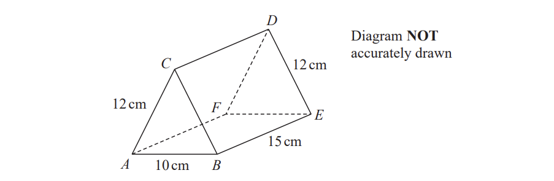

$AC=BC=FD=ED=12\mathrm{cm}$       $AB=10\mathrm{cm}$           $BE=15\mathrm{cm}$

Calculate the size of the angle between $AD$ and the base $ABEF$. 
Give your answer correct to 3 significant figures.

## Q18 — hard — 6 marks · exam-questions

### 21((a)) — 3 marks — command: work_out — structured — from paper Nov 2020 · 4MA1/1HR
The diagram shows a prism $ABCDEFGH$ with a horizontal base.

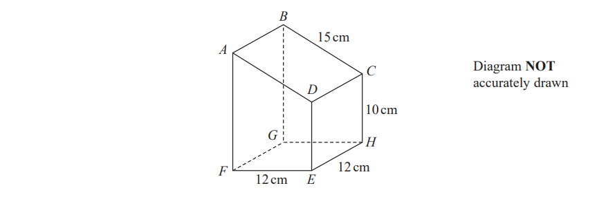

The base of the prism, $EFGH$, is a square of side $12\mathrm{cm}.$ Trapezium $ADEF$ is a cross section of the prism where $AF$ and $DE$ are vertical edges.

`table row cell D E space end cell equals cell space C H space equals space 10 space cm space end cell row cell A D space end cell equals cell space B C space equals space 15 cm end cell end table`

Work out the size of the angle between $CF$ and the base $EFGH.$ 
Give your answer correct to one decimal place.

### 21((b)) — 3 marks — command: work_out — structured — from paper Nov 2020 · 4MA1/1HR
Work out the length of $BE.$ 
Give your answer correct to one decimal place.

.............................................. cm

## Q19 — hard — 6 marks · exam-questions

### 25((a)) — 2 marks — command: work_out — structured — from paper June 2018 · 8300/3H
$ABCDEF$ is a triangular prism which represents part of a hill.

$ABCF$ is the horizontal rectangular base.
$D$ is vertically above $C$.

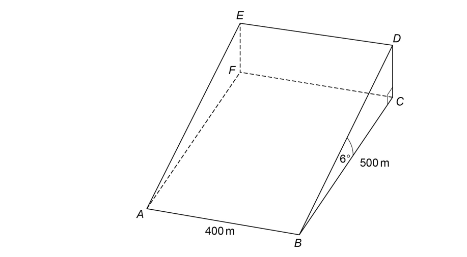

Work out the height $CD$.

..........................m

### 25((b)) — 4 marks — command: work_out — structured — from paper June 2018 · 8300/3H
Jamil walks in a straight line from $A$ to $D$.

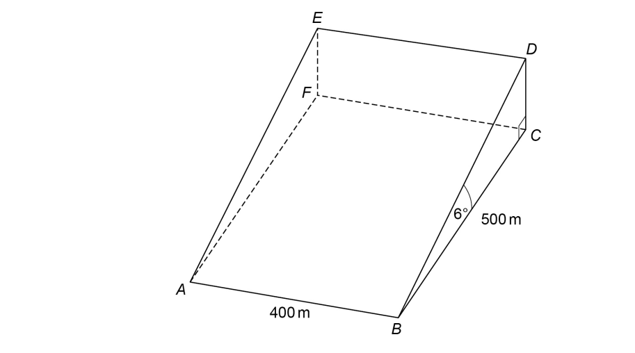

Work out the size of angle $DAC$. 
You **must** show your working.

........................degrees

## Q20 — hard — 6 marks · exam-questions

### 25() — 2 marks — command: prove — structured — from paper June 2017 · 8300/3H
Rectangle $ABCD$ is the horizontal base of a triangular prism $ABCDEF.$

$AE=BE$

$E$ is vertically above M, the midpoint of $AB$.

$AB=16$ cm    $AE=17$cm    $BC=30$ cm

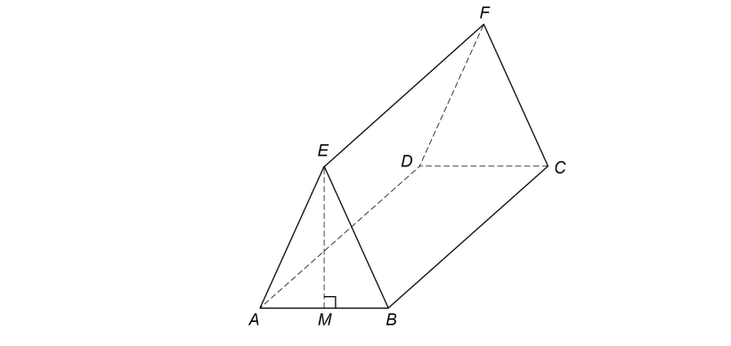

Show that $EM=15$ cm

### 25((b)) — 4 marks — command: work_out — structured — from paper June 2017 · 8300/3H
Work out the size of angle $ECM.$

...........................degrees

## Q21 — hard — 4 marks · exam-questions

### 23() — 4 marks — command: work_out — structured — from paper Nov 2020 · 8300/2H
Right-angled triangle$ABC$is the cross section of a prism.

$AB=5\mathrm{cm}BC=12\mathrm{cm}$ 
$M$ is the midpoint of $CF$. 
$AM=16\mathrm{cm}$

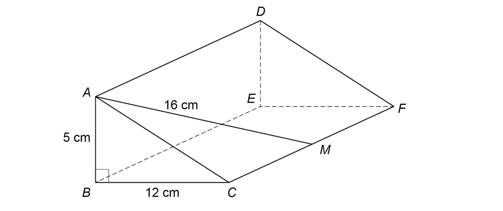

Work out the volume of the prism.

......................................cm3

## Q22 — hard — 5 marks · exam-questions

### 14() — 5 marks — command: calculate — structured — from paper Nov 2017 · J560/04
The diagram shows a cuboid ABCDEFGH.

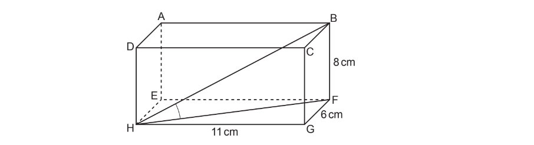

Calculate angle BHF.

## Q23 — hard — 5 marks · exam-questions

### 14() — 5 marks — command: calculate — structured — from paper June 2019 · J560/06
The length of the longest diagonal of a cube is 25cm.

Calculate the total surface area of the cube.

................................................... cm2

## Q24 — hard — 6 marks · exam-questions

### 20() — 6 marks — command: calculate — structured — from paper Nov 2018 · J560/04
The diagram shows a right-angled triangular prism ABCDEF.

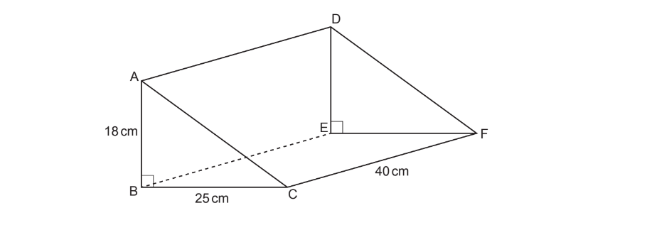

Calculate angle AFB.

## Q25 — very_hard — 5 marks · exam-questions

### 16() — 5 marks — command: calculate — structured — from paper Sample 2015 · 1MA1/3H
$VABCD$is a solid pyramid.

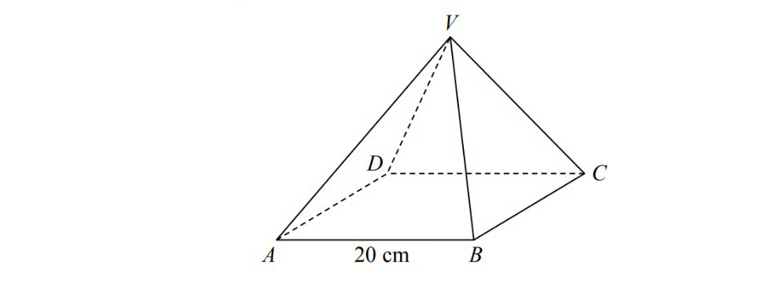

$ABCD$is a square of side 20 cm.

The angle between any sloping edge and the plane $ABCD$is 55°

Calculate the surface area of the pyramid. 
Give your answer correct to 2 significant figures.

## Q26 — very_hard — 6 marks · exam-questions

### 21() — 6 marks — command: calculate — structured — from paper Jan 2020 · 4MA1/1HR
The diagram shows the prism $ABCDEF$ with cross section triangle $ABC$.

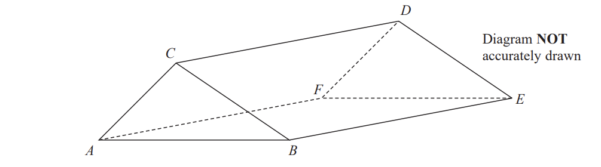

Angle $BEC$= 40° and angle $ACB$is obtuse. $AC$ = 6 cm and $CE$= 13cm

The area of triangle $ABC$is 22 $\mathrm{cm}^{2}$

Calculate the length of $AB$. 
Give your answer correct to one decimal place.

..................$\mathrm{cm}$

## Q27 — very_hard — 4 marks · exam-questions

### 19() — 4 marks — command: calculate — structured — from paper June 2019 · 1MA1/2H
The diagram shows a triangular prism.

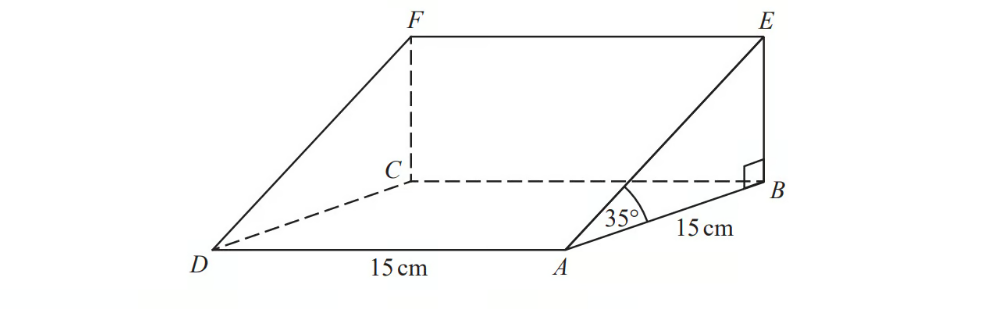

The base, $ABCD$, of the prism is a square of side length 15 cm. 
Angle $ABE$and angle $CBE$are right angles. 
Angle $EAB$= 35°

$M$is the point on $DA$such that

$DM:MA=2:3$

Calculate the size of the angle between $EM$and the base of the prism. 
Give your answer correct to 1 decimal place.

## Q28 — very_hard — 3 marks · exam-questions

### 17((b)) — 3 marks — command: calculate — structured — from paper Jan 2021 · 4MA1/2H
The diagram shows a solid prism $ABCDEFGH$.

The trapezium $ABCD$, in which $AD$ is parallel to $BC$, is a cross section of the prism. 
The base $ADEH$ of the prism is a horizontal plane. $ADEH$ and $BCFG$ are rectangles. 
The midpoint of $BC$ is vertically above the midpoint of $AD$ so that $BA=CD$.

$AD=37\mathrm{cm}$   $GF=28\mathrm{cm}$    $DE=24\mathrm{cm}$

The perpendicular distance between edges $AD$ and $BC$ is 20 $\mathrm{cm}$.

Calculate the size of the angle between $AF$ and the plane $ADEH$. 
Give your answer correct to one decimal place.

## Q29 — very_hard — 5 marks · exam-questions

### 21() — 5 marks — command: find — structured — from paper Jan 2022 · 4MA1/1H
The diagram shows the prism $ABCDEFGHJK$ with horizontal base $AEFG$

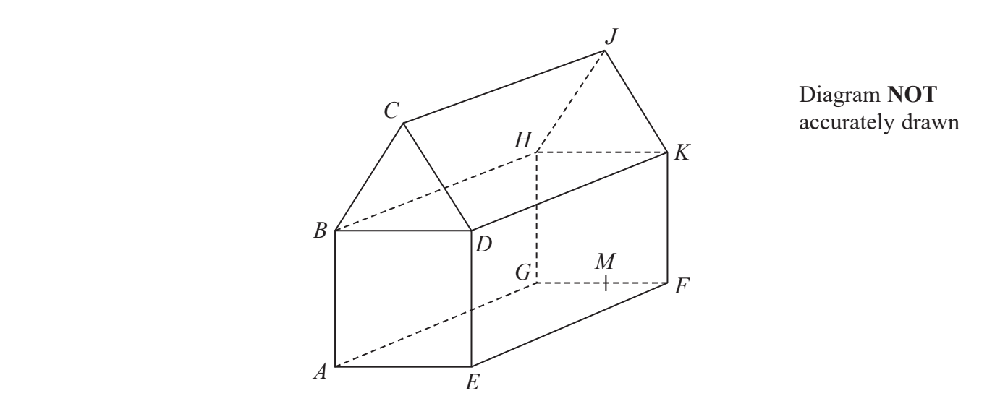

$ABCDE$ is a cross section of the prism where

$ABDE$ is a square 
$BCD$ is an equilateral triangle

$EF=2\timesAE$  
$M$is the midpoint of $GF$ so that $JM$ is vertical.

Angle $MAJ=y^{\circ}$ 
Given that            $\mathrm{tan}y^{\circ}=T$ 
find the value of$T$, giving your answer in the form $\frac{\sqrt{p}+\sqrt{q}}{17}$ where $p$ and $q$ are integers.

$T$ = ...........................

## Q30 — very_hard — 6 marks · exam-questions

### 23() — 6 marks — command: work_out — structured — from paper June 2019 · 4MA1/2HR
The diagram shows a solid pyramid $ABCDE$ with a horizontal base.

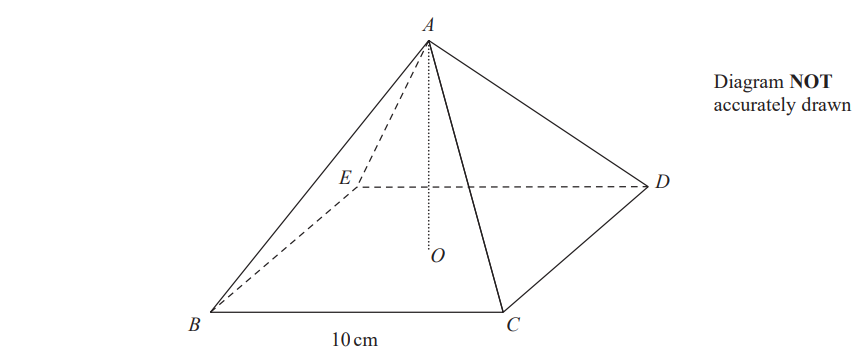

The base, $BCDE$ , of the pyramid is a square of side 10 $\mathrm{cm}$.

The vertex $A$ of the pyramid is vertically above the centre $O$ of the base so that  $AB=AC=AD=AE$

The **total** surface area of the pyramid is 360 $\mathrm{cm}^{2}$

Work out the size of the angle between $AC$ and the base $BCDE$. 
Give your answer correct to 3 significant figures.

## Q31 — very_hard — 7 marks · exam-questions

### 18((a)) — 4 marks — command: calculate — structured — from paper June 2017 · J560/06
Alvin has a crate in the shape of a cuboid. 
The crate is open at the top. 
The internal dimensions of the crate are 46cm long by 46cm wide by 55cm high.

Alvin has a stick of length 95cm. 
Alvin places the stick in the crate so that the shortest possible length extends out above the top of the crate.

Calculate the length of the stick that extends out of the crate.

..................................................... cm

### 18((b)) — 3 marks — command: calculate — structured — from paper June 2017 · J560/06
Calculate the angle the stick makes with the base of the crate.

## Q32 — very_hard — 4 marks · exam-questions

### 21() — 4 marks — command: calculate — structured — from paper 2019	May/June · 0580/21
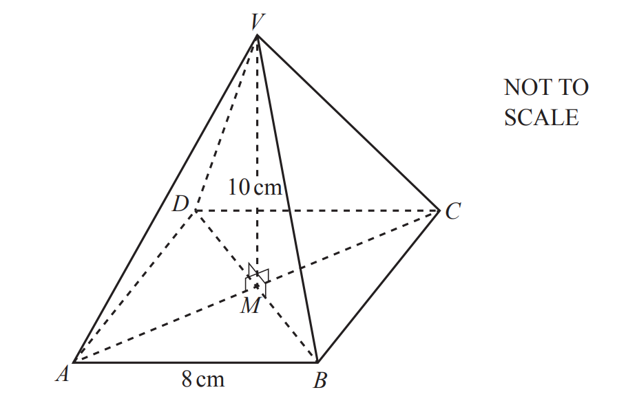

The diagram shows a pyramid with a square base *ABCD* of side length 8cm. 
The diagonals of the square, *AC* and *BD*, intersect at *M*. 
*V* is vertically above *M* and *VM* = 10 cm.

Calculate the angle between *VA* and the base.

## Q33 — very_hard — 5 marks · exam-questions

### 9((b)) — 5 marks — command: prove — structured — from paper 2020 Oct/Nov · 0580/42
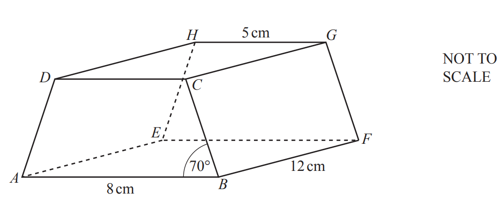

The diagram shows a prism with a rectangular base, *ABFE*. 
The cross-section, *ABCD*, is a trapezium with *AD* = *BC*. *AB* = 8 cm, *GH* = 5 cm, *BF* = 12 cm and angle *ABC* = 70°.

The perpendicular from *G* onto *EF* meets *EF* at *X*.

i) Show that *EX *= 6.5 cm.

[1]

ii) Calculate *AX*.

*AX* = ........................................... cm [2]

iii) Calculate the angle between the diagonal *AG* and the base *ABFE*.

[2]

## Q34 — very_hard — 4 marks · exam-questions

### 6((b)) — 4 marks — structured — from paper 2020 Oct/Nov · 0580/43

*ABCDEFGH* is a cuboid. *AB* = 8 cm, *BC *= 5 cm and *CG* = 11 cm.

Ivana has a pencil of length 13cm.

Does this pencil fit completely inside the cuboid? Show how you decide.

## Q35 — very_hard — 3 marks · exam-questions

### 4((d)) — 3 marks — command: calculate — structured — from paper 2019	Oct/Nov · 0580/41
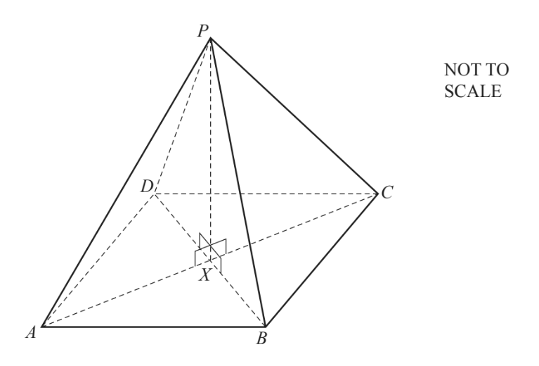

The diagram shows a pyramid with a square base *ABCD*. *DB* = 8 cm. 
*P* is vertically above the centre, *X*, of the base and *PX* = 5 cm.

Calculate the angle between *PB* and the base *ABCD*.

## Q36 — very_hard — 5 marks · exam-questions

### 21() — 5 marks — command: work_out — structured — from paper 2023 Nov · 4MA1/1H
Here is a triangular prism $ABCDEF$

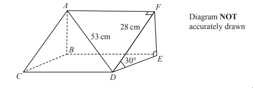

$AD=53\mathrm{cm}\,DF=28\mathrm{cm}\,\mathrm{Angle}FDE=30^{\circ}$

Work out the volume of the triangular prism.
Give your answer correct to the nearest whole number
