# Exam Questions — Area & Perimeter
**Geometry & Trigonometry** · Edexcel IGCSE Maths A (4MA1) — 18/Higher
> Source: [https://www.savemyexams.com/igcse/maths/edexcel/a/18/higher/topic-questions/4-geometry-and-trigonometry/area-and-perimeter/exam-questions/](https://www.savemyexams.com/igcse/maths/edexcel/a/18/higher/topic-questions/4-geometry-and-trigonometry/area-and-perimeter/exam-questions/) · 54 questions · total 236 marks

## Q1 — easy — 4 marks · exam-questions

### 2() — 4 marks — command: work_out — structured — from paper Specimen paper · 4MA1/2H
The diagram shows a circle and a trapezium.

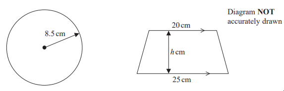

The height of the trapezium is $h$ cm.

The area of the circle is equal to the area of the trapezium.

Work out the value of $h$. 
Give your answer correct to 1 decimal place.

## Q2 — medium — 4 marks · exam-questions

### 7() — 4 marks — command: work_out — structured — from paper June 2014 · 1MA0/1H
The diagram shows the plan of a small field.

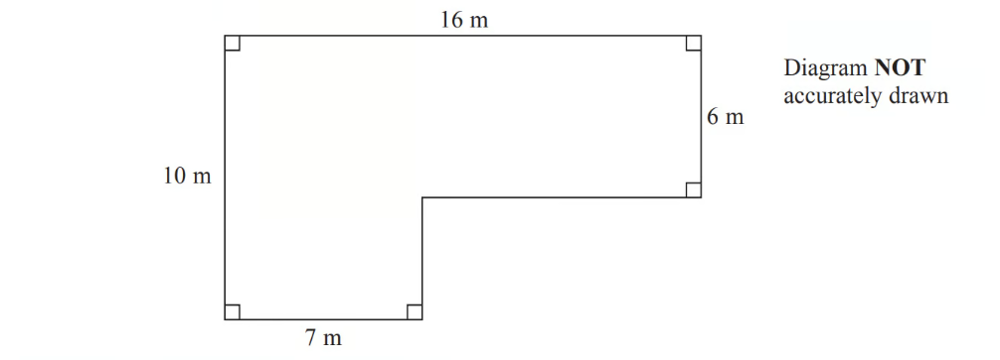

Kevin is going to keep some pigs in the field. 
Each pig needs an area of 36 square metres.

Work out the greatest number of pigs Kevin can keep in the field.

## Q3 — medium — 2 marks · exam-questions

### 3() — 2 marks — command: draw — structured — from paper June 2018 · 1MA1/3H
Here is a trapezium drawn on a centimetre grid.

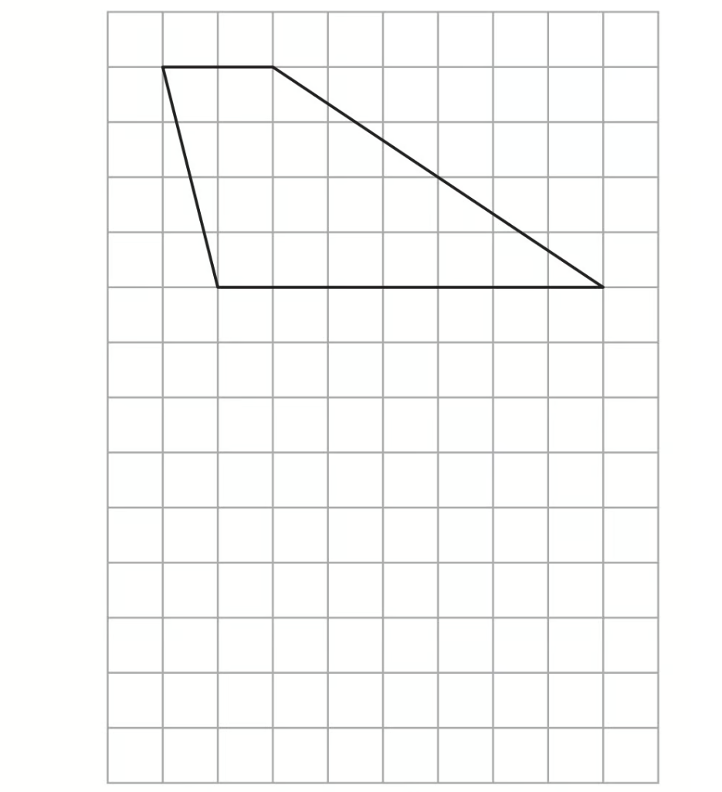

On the grid, draw a triangle equal in area to this trapezium.

## Q4 — medium — 4 marks · exam-questions

### 1() — 4 marks — command: work_out — structured — from paper Sample 2015 · 1MA1/3H
The diagram shows a trapezium $ABCD$ and two identical semicircle.

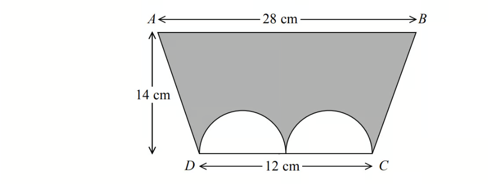

The centre of each semicircle is on $DC$.

Work out the area of the shaded region. 
Give your answer correct to 3 significant figures.

## Q5 — medium — 7 marks · exam-questions

### 5((a)) — 5 marks — command: work_out — structured — from paper Spec1 2015 · 1MA1/3H
The diagram shows a wall in the shape of a trapezium.

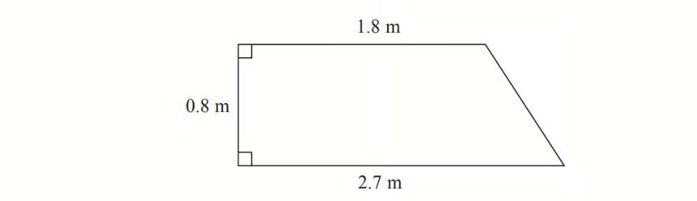

Karen is going to cover this part of the wall with tiles. 
Each tile is rectangular, 15 cm by 7.5 cm.

Tiles are sold in packs. 
There are 9 tiles in each pack.

Karen divides the area of this wall by the area of a tile to work out an estimate for the number of tiles she needs to buy.

Use Karen's method to work out the estimate for the number of packs of tiles she needs to buy.

### 5((b)) — 2 marks — structured — from paper Spec1 2015 · 1MA1/3H
Karen is advised to buy 10% more tiles than she estimated. Buying 10% more tiles will affect the number of the tiles Karen needs to buy.

She assumes she will need to buy 10% more packs of tiles.

Is Karen's assumption correct? 
You must show your working.

## Q6 — medium — 4 marks · exam-questions

### 8() — 4 marks — command: calculate — structured — from paper 2015	Spec1 · 1MA1/2H
Here is a diagram showing a rectangle, $ABCD$, and a circle.

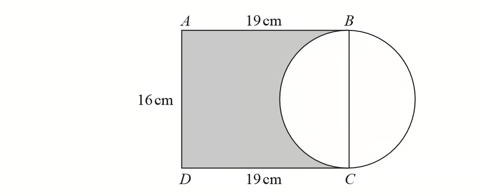

$BC$ is a diameter of the circle.

Calculate the percentage of the area of the rectangle that is shaded. 
Give your answer correct to 1 decimal place.

## Q7 — medium — 4 marks · exam-questions

### 7() — 4 marks — command: explain — structured — from paper November 2016 · 1MA0/1H
The diagram shows a path around a pond.

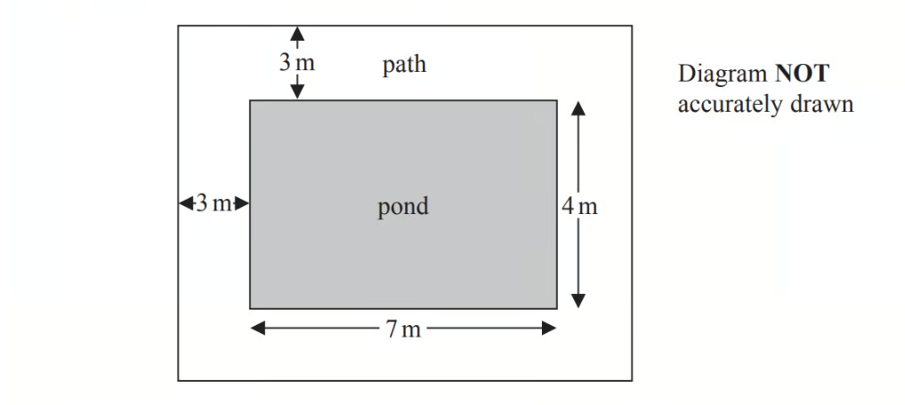

The pond is in the shape of a rectangle with length 7m and width 4m. 
The path is 3m wide.

Ali is going to cover the path with gravel. 
One bag of gravel will cover 10 m2 of the path.

How many bags of gravel does Ali need to buy? 
You must show your working.

## Q8 — medium — 5 marks · exam-questions

### 5() — 5 marks — command: how — structured — from paper June 2012 · 1MA0/2H
Mr Weaver's garden is in the shape of a rectangle.

In the garden

|   | there is a patio in the shape of a rectangle |
|---|---|
| and | two ponds in the shape of circles with diameter 3.8 m. |

The rest of the garden is grass.

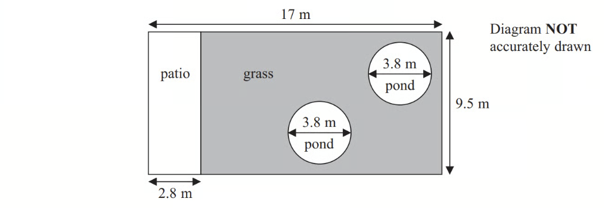

Mr Weaver is going to spread fertiliser over all the grass. 
One box of fertiliser will cover 25 m2 of grass.

How many boxes of fertiliser does Mr Weaver need? 
You must show your working.

## Q9 — medium — 4 marks · exam-questions

### 8() — 4 marks — command: work_out — structured — from paper June 2013 · 1MA0/2H
The diagram shows the plan of a playground.

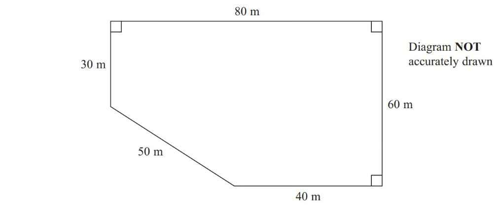

Bill is going to cover the playground with tarmac.
 It costs £2.56 to cover each square metre with tarmac.

Work out the total cost of the tarmac Bill needs.

## Q10 — medium — 5 marks · exam-questions

### 7() — 5 marks — command: explain — structured — from paper June 2016 · 1MA0/1H
The diagram shows the plan of a floor.

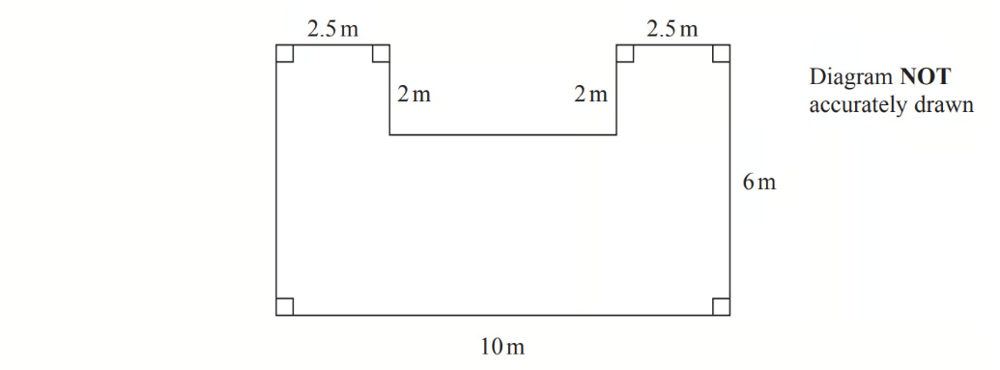

Angie is going to varnish the floor.

She needs 1 litre of varnish for 5m2 of floor. 
There are 2.5 litres of varnish in each tin of varnish.

Angie has 3 tins of varnish.

Does she have enough varnish for all the floor? 
You must show all your working.

## Q11 — medium — 5 marks · exam-questions

### 5() — 5 marks — command: work_out — structured — from paper June 2017 · 1MA1/1H
This rectangular frame is made from 5 straight pieces of metal.

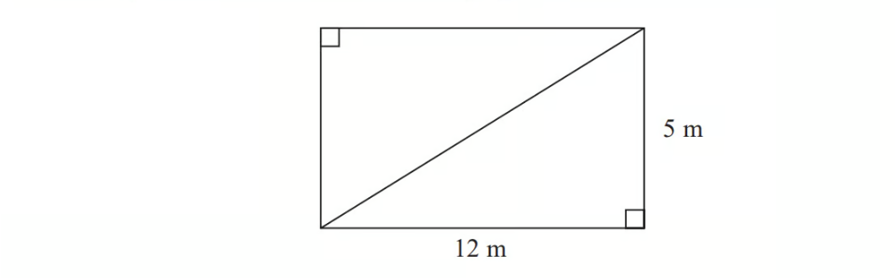

The weight of the metal is 1.5 kg per metre.

Work out the total weight of the metal in the frame.

## Q12 — medium — 3 marks · exam-questions

### 25() — 3 marks — command: work_out — structured — from paper 2016	June · 1MA0/1H
$ABD$ is a right angled triangle.

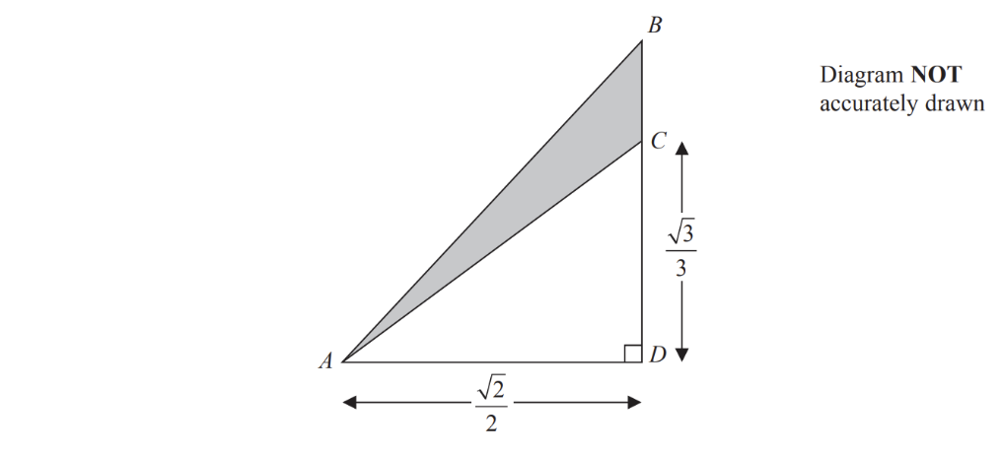

All measurements are given in centimetres.
 $C$ is the point on $BD$ such that $CD=\frac{\sqrt{3}}{3}$

$AD=BD=\frac{\sqrt{2}}{2}$

Work out the exact area, in cm2, of the shaded region.

## Q13 — medium — 4 marks · exam-questions

### 7() — 4 marks — command: find — structured — from paper June 2019 · 1MA1/1H
Here are two rectangles.

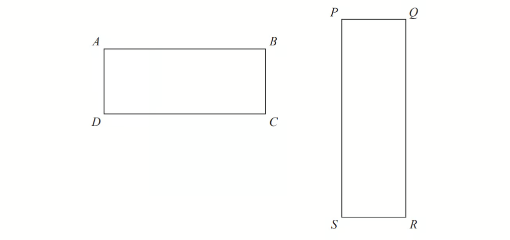

$QR=10\mathrm{cm}$ 
$BC=PQ$

The perimeter of $ABCD$ is 26 cm. 
The area of $PQRS$ is 45 cm2.

Find the length of $AB$.

...................................... cm

## Q14 — medium — 4 marks · exam-questions

### 3() — 4 marks — command: work_out — structured — from paper Jan 2022 · 4MA1/1HR
The shaded shape is made using three identical right-angled triangles and a square.

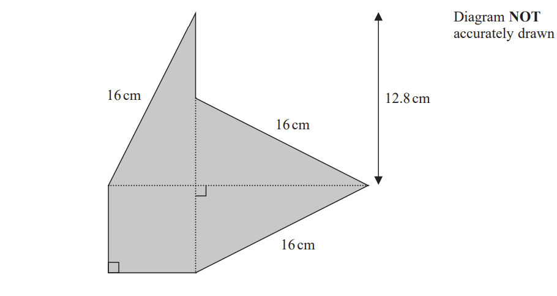

Work out the perimeter of the shaded shape.

...................................................... cm

## Q15 — medium — 4 marks · exam-questions

### 1() — 4 marks — command: work_out — structured — from paper June 2018 · 4MA1/1HR
Here is a hexagon $ABCDEF$.

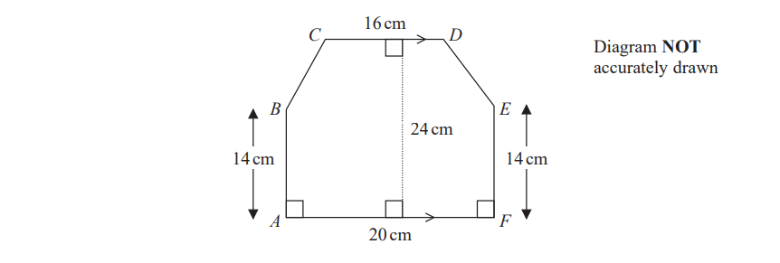

$CD$ is parallel to $AF$. 
Work out the area of hexagon $ABCDEF$.

....................................... $\mathrm{cm}^{2}$

## Q16 — medium — 3 marks · exam-questions

### 8() — 3 marks — command: work_out — structured — from paper Nov 2020 · 8300/1H
The shorter side of a parallelogram has length 6.5 cm

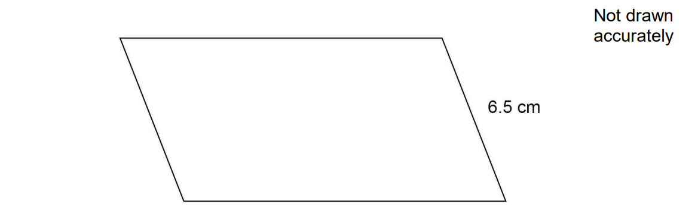

The length of the shorter side is $\frac{1}{9}$ of the perimeter.

Work out the length of the longer side.

## Q17 — medium — 3 marks · exam-questions

### 13() — 3 marks — command: work_out — structured — from paper Nov 2020 · 8300/2H
The diagram shows a wall.

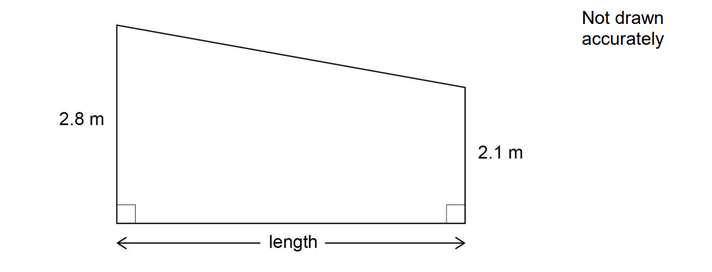

The area of the wall is 39.2 m2

Work out the length of the wall.

..........................m

## Q18 — medium — 4 marks · exam-questions

### 5() — 4 marks — command: work_out — structured — from paper 2023 June · 4MA1/1H
The diagram shows a shaded shape $AEBCD$ made by removing triangle $AEB$ from rectangle $ABCD$

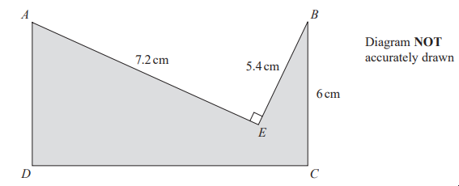

$AE=7.2\mathrm{cm}BE=5.4\mathrm{cm}BC=6\mathrm{cm} \mathrm{angle}AEB=90^{\circ}$

Work out the perimeter of the shaded shape.

## Q19 — hard — 4 marks · exam-questions

### 16() — 4 marks — command: work_out — structured — from paper November 2012 · 1MA0/1H
The diagram shows a triangle.

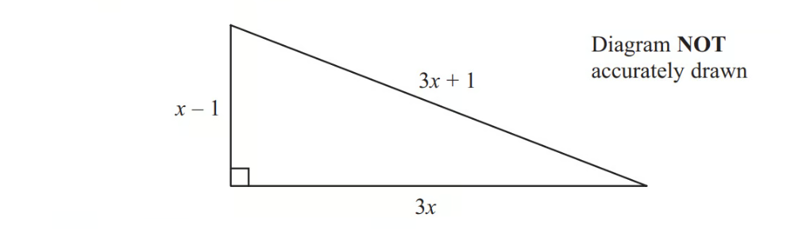

In the diagram, all the measurements are in metres.

The perimeter of the triangle is 56 m. 
The area of the triangle is A m2.

Work out the value of A.

## Q20 — hard — 4 marks · exam-questions

### 21() — 4 marks — command: work_out — structured — from paper June 2017 · 1MA1/2H
The diagram shows 3 identical circles inside a rectangle. 
Each circle touches the other two circles and the sides of the rectangle, as shown in the diagram.

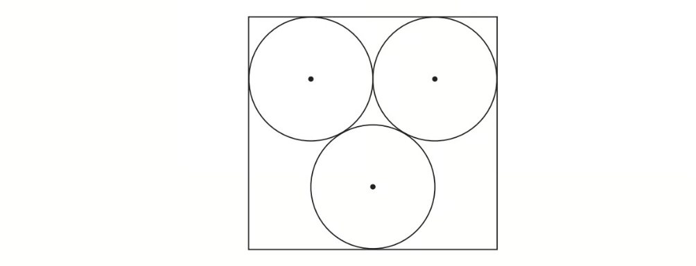

The radius of each circle is 24 mm.

Work out the area of the rectangle. 
Give your answer correct to 3 significant figures.

## Q21 — hard — 3 marks · exam-questions

### 7() — 3 marks — command: prove — structured — from paper Spec2 2015 · 1MA1/3H
Here is a right-angled triangle.

Four of these triangles are joined to enclose the square $ABCD$ as shown below.

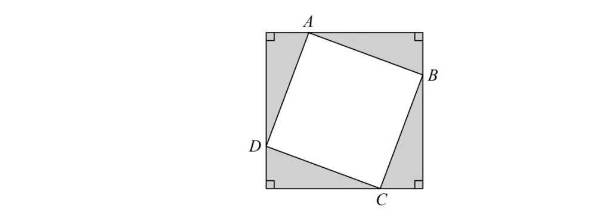

Show that the area of the square  $ABCD\mathrm{is}x^{2}+y^{2}$.

## Q22 — hard — 4 marks · exam-questions

### 7() — 4 marks — command: work_out — structured — from paper November 2012 · 1MA0/1H
Here is a diagram of Jim's garden.

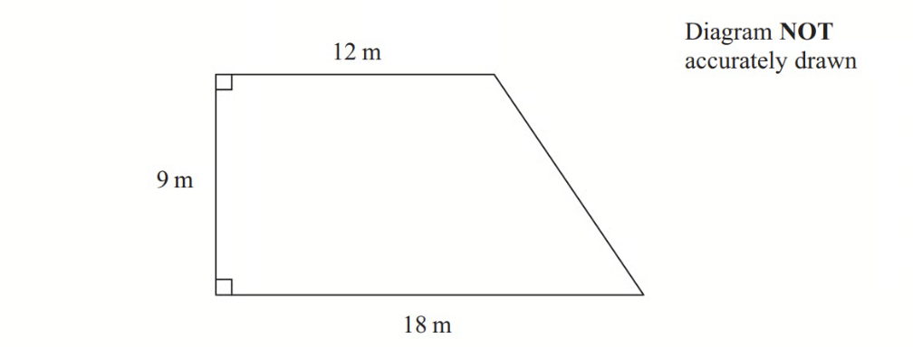

Jim wants to cover his garden with grass seed to make a lawn.

Grass seed is sold in bags.
There is enough grass seed in each bag to cover 20 m2 of garden.

Each bag of grass seed costs £4.99

Work out the least cost of putting grass seed on Jim's garden.

## Q23 — hard — 5 marks · exam-questions

### 15((a)) — 2 marks — command: work_out — structured — from paper March 2013 · 1MA0/2H
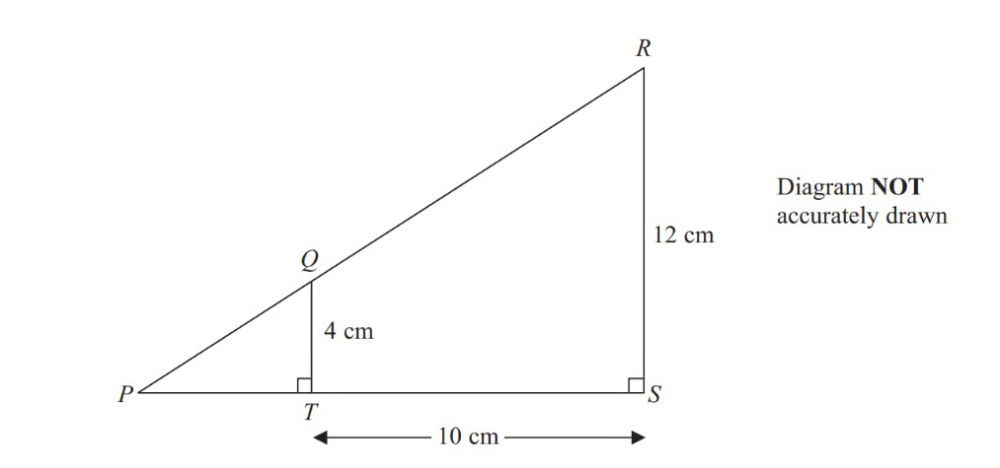

$PQR$ and $PTS$ are straight lines.
 Angle $PTQ$ = Angle $PSR=90^{\circ}$

$QT=4\mathrm{cm}\,RS=12\mathrm{cm}\,TS=10\mathrm{cm}$

Work out the area of the trapezium $QRST$.

### 15((b)) — 3 marks — command: work_out — structured — from paper March 2013 · 1MA0/2H
Work out the length of $PT$.

## Q24 — hard — 4 marks · exam-questions

### 18() — 4 marks — command: work_out — structured — from paper November 2013 · 1MA0/2H
$ABC$ is an isosceles triangle.

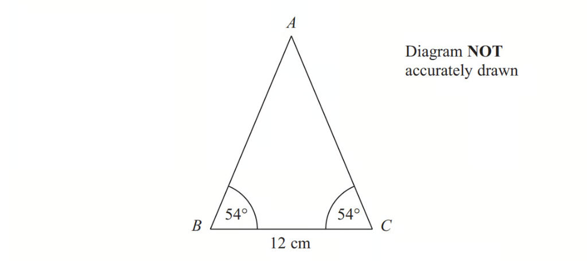

Work out the area of the triangle. 
Give your answer correct to 3 significant figures.

## Q25 — hard — 3 marks · exam-questions

### 23() — 3 marks — command: work_out — structured — from paper June 2015 · 1MA0/2H
Here is a parallelogram.

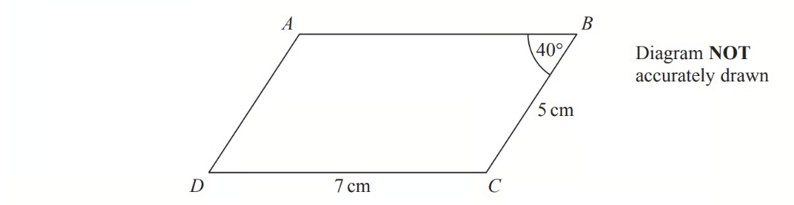

$DC=7\mathrm{cm}\,CB=5\mathrm{cm}$ 
Angle $ABC$ is $40^{\circ}$

Work out the area of the parallelogram. 
Give your answer correct to $1$ decimal place.

## Q26 — hard — 4 marks · exam-questions

### 26() — 4 marks — command: prove — structured — from paper November 2016 · 1MA0/1H
The diagram shows a triangle $DEF$ inside a rectangle $ABCD$.

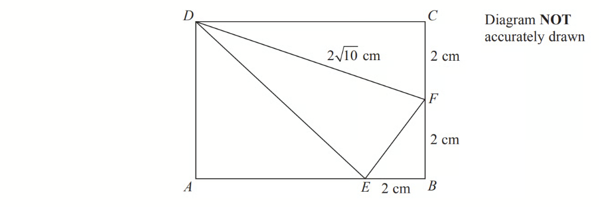

Show that the area of triangle $DEF$ is 8 cm2. 
You must show all your working.

## Q27 — hard — 4 marks · exam-questions

### 15() — 4 marks — command: work_out — structured — from paper June 2017 · 1MA0/1H
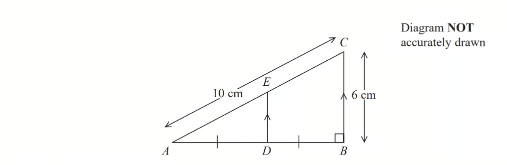

$ADB$ and $AEC$ are straight lines.
$DE$ is parallel to $BC$.

Angle $ABC=90^{\circ}$ 
$AC=10\mathrm{cm}.\,BC=6\mathrm{cm}.$

$D$ is the midpoint of $AB$.

Work out the area of trapezium $BCED$.

## Q28 — hard — 4 marks · exam-questions

### 8() — 4 marks — command: work_out — structured — from paper June 2018 · 1MA1/1H
The perimeter of a right-angled triangle is 72 cm.
 The lengths of its sides are in the ratio 3 : 4 : 5.

Work out the area of the triangle.

## Q29 — hard — 5 marks · exam-questions

### 2() — 5 marks — command: work_out — structured — from paper Spec2 2015 · 1MA1/1H
The diagram shows a square with perimeter 16 cm.

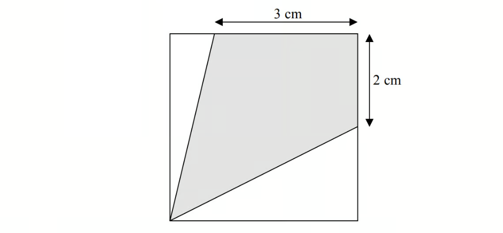

Work out the proportion of the area inside the square that is shaded.

## Q30 — hard — 5 marks · exam-questions

### 10() — 5 marks — structured — from paper November 2013 · 1MA0/1H
The diagram shows the floor of a village hall.

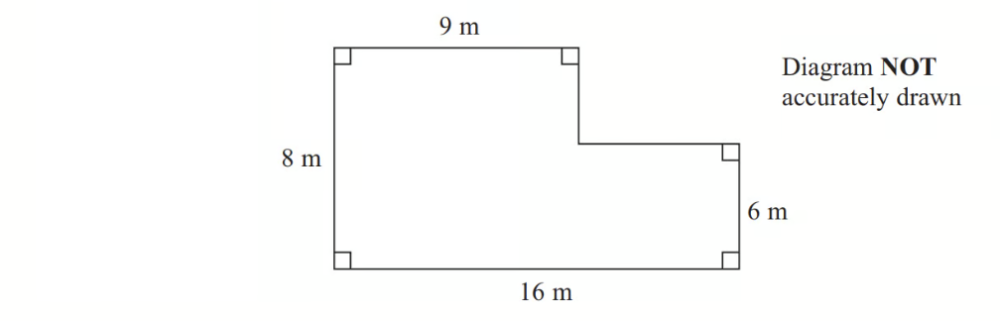

The caretaker needs to polish the floor.

One tin of polish normally costs £19 
One tin of polish covers 12 m2 of floor.

There is a discount of 30% off the cost of the polish.

The caretaker has £130

Has the caretaker got enough money to buy the polish for the floor? 
You must show all your working.

## Q31 — hard — 5 marks · exam-questions

### 10() — 5 marks — structured — from paper June 2015 · 1MA0/1H
The diagram shows the floor plan of Mary's conservatory.

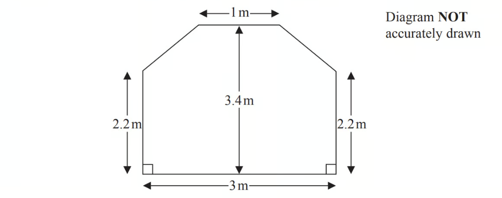

Mary is going to cover the floor with tiles.

The tiles are sold in packs. 
One pack of tiles will cover 2m2 
A pack of tiles normally costs £24.80 
Mary gets a discount of 25% off the cost of the tiles.

Mary has £100

Does Mary have enough money to buy all the tiles she needs? You must show all your working.

## Q32 — hard — 3 marks · exam-questions

### 2() — 3 marks — command: work_out — structured — from paper Jan 2021 · 4MA1/2HR
The diagram shows a rectangle $ABCD$ and a semicircle with diameter $AB$ where $AB=12\mathrm{cm}$. The point $E$ lies on $DC$and also on the semicircle.

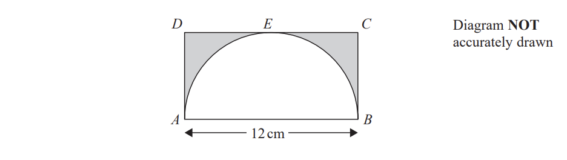

Work out the area of the shaded region. 
Give your answer correct to 3 significant figures.

...................................................... $\mathrm{cm}^{2}$

## Q33 — hard — 4 marks · exam-questions

### 3() — 4 marks — command: work_out — structured — from paper Jan 2020 · 4MA1/1H
The diagram shows a shape.

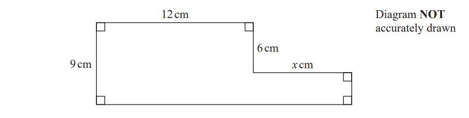

The shape has area $129\mathrm{cm}^{2}$

Work out the value of $x$.

## Q34 — hard — 4 marks · exam-questions

### 9() — 4 marks — command: work_out — structured — from paper Nov 2021 · 8300/3H
Rectangle $ABCD$ is split into four smaller rectangles. Two of the smaller rectangles are shaded.

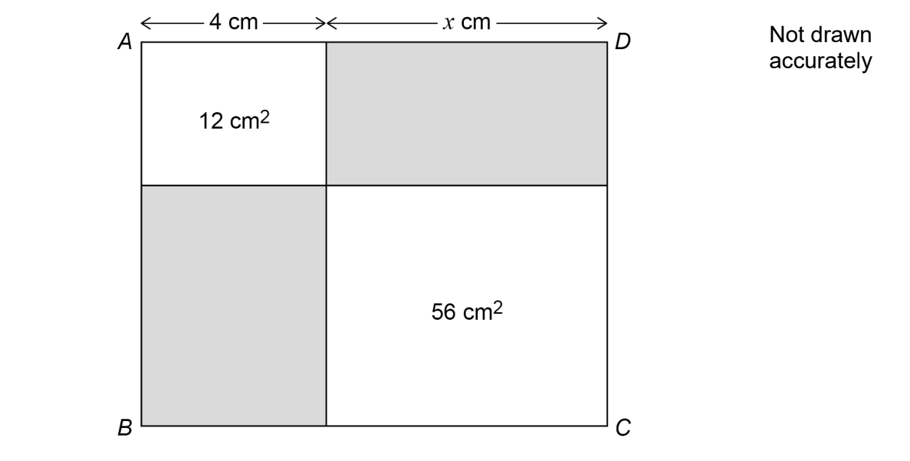

$4:x=1:2$

For rectangle $ABCD$, work out the ratio shaded area : unshaded area

Give your answer in its simplest form.

## Q35 — hard — 4 marks · exam-questions

### 11() — 4 marks — command: work_out — structured — from paper June 2018 · 8300/1H
A large rectangle is made by joining three identical small rectangles as shown.

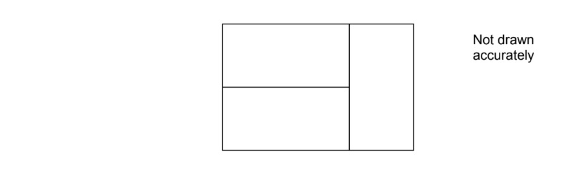

The perimeter of one small rectangle is 15 cm

Work out the perimeter of the large rectangle.

.............................cm

## Q36 — hard — 3 marks · exam-questions

### 12() — 3 marks — command: calculate — structured — from paper Specimen paper · 4MA1/1H
*ABCDE* and *AFGHJ* are regular pentagons.

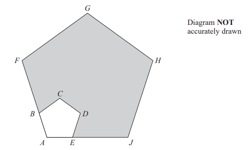

*AEJ* and *ABF* are straight lines.

*EJ *= 4*AE*
The area of *ABCDE* is 8 cm²

Calculate the area of the shaded region.

## Q37 — hard — 4 marks · exam-questions

### 20() — 4 marks — command: calculate — structured — from paper 2023 Nov · 4MA1/2H
The diagram shows equilateral triangle $ABC$ with sides of length 10 cm.
A circle is drawn inside the triangle.

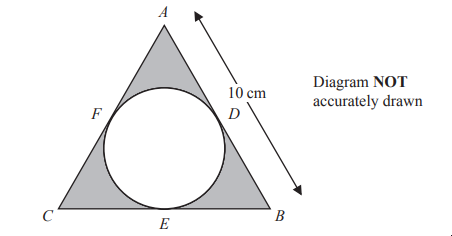

$D,E$ and $F$ are points on the circle

$ADB,BEC$ and $CFA$ are tangents to the circle.

Calculate the total area of the regions shown shaded in the diagram. 
Give your answer correct to 3 significant figures.

## Q38 — very_hard — 4 marks · exam-questions

### 20() — 4 marks — command: find — structured — from paper June 2013 · 1MA0/1H
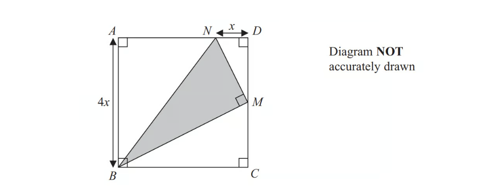

$ABCD$ is a square with a side length of $4x$ 
$M$ is the midpoint of $DC$.
 $N$ is the point on $AD$ where $ND=x$

$BMN$ is a right-angled triangle.

Find an expression, in terms of $x$, for the area of triangle $BMN$. Give your expression in its simplest form.

## Q39 — very_hard — 4 marks · exam-questions

### 20() — 4 marks — command: work_out — structured — from paper Jan 2021 · 4MA1/2H
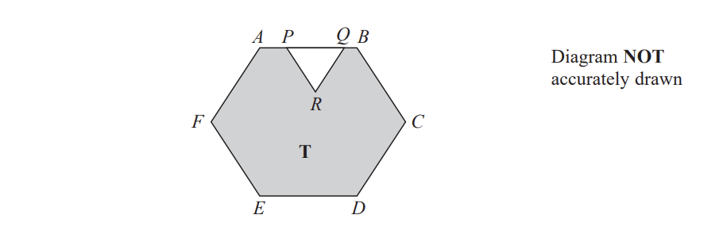

The diagram shows a shaded region $T$ formed by removing an equilateral triangle$PQR$from a regular hexagon $ABCDEF$.

The points $P$ and $Q$ lie on $AB$ such that $AB=1.5\timesPQ$.

Given that the area of region $T$ is $72\sqrt{3}\mathrm{cm}^{2}$ work out the length of $PQ$.

......................................................$\mathrm{cm}$

## Q40 — very_hard — 5 marks · exam-questions

### 10() — 5 marks — command: work_out — structured — from paper Jan 2021 · 4MA1/1HR
The diagram shows one face of a wall. This face is in the shape of a pentagon with exactly one line of symmetry.

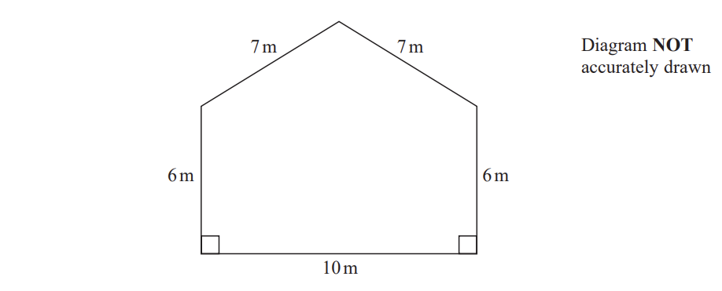

Omondi is going to paint this face of the wall once. 
He has to buy all the paint that he needs to use.

The paint in each tin of paint Omondi is going to buy will cover 16 m2 of the face of the wall.

Work out the least number of tins of paint Omondi will need to buy. 
Show your working clearly.

## Q41 — very_hard — 4 marks · exam-questions

### 8() — 4 marks — command: work_out — structured — from paper Jan 2019 · 4MA1/1H
The diagram shows an isosceles triangle.

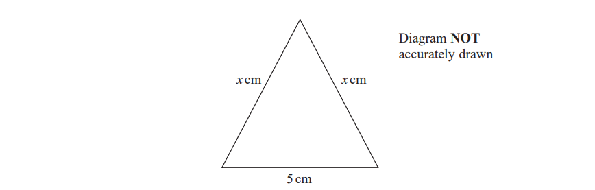

The area of the triangle is $12\mathrm{cm}^{2}$

Work out the perimeter of the triangle. 
Give your answer correct to $3$ significant figures.

cm

## Q42 — very_hard — 5 marks · exam-questions

### 5() — 5 marks — command: work_out — structured — from paper Jan 2019 · 4MA1/2H
Calvin has $12$ identical rectangular tiles. He arranges the tiles to fit exactly round the edge of a shaded rectangle, as shown in the diagram below.

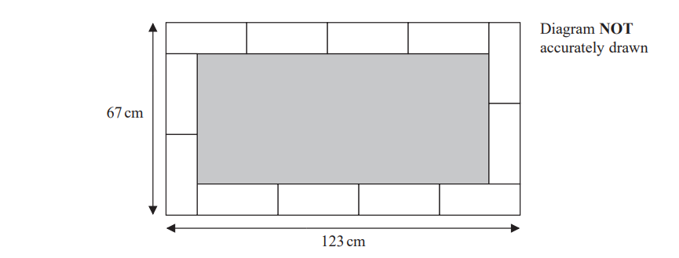

Work out the area of the shaded rectangle.

## Q43 — very_hard — 4 marks · exam-questions

### 2() — 4 marks — command: work_out — structured — from paper Specimen 2016 · 4MA1/2H
The diagram shows a circle and a trapezium.

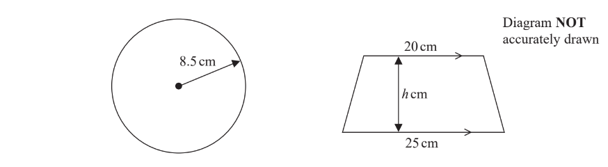

The height of the trapezium is $h\mathrm{cm}$.

The area of the circle is equal to the area of the trapezium.

Work out the value of $h$. 
Give your answer correct to 1 decimal place.

## Q44 — very_hard — 6 marks · exam-questions

### 22() — 6 marks — command: find — structured — from paper Nov 2020 · 4MA1/1HR
The diagram shows a regular octagon $ABCDEFGH.$

Each side of the octagon has length $10\mathrm{cm}.$

Find the area of the shaded region $ACDEH.$ 
Give your answer correct to the nearest $\mathrm{cm}^{2}$

............................................. $\mathrm{cm}^{2}$

## Q45 — very_hard — 5 marks · exam-questions

### 8() — 5 marks — command: work_out — structured — from paper Jan 2021 · 4MA1/2H
$A,B$ and $C$ are points on a circle with centre $O$.

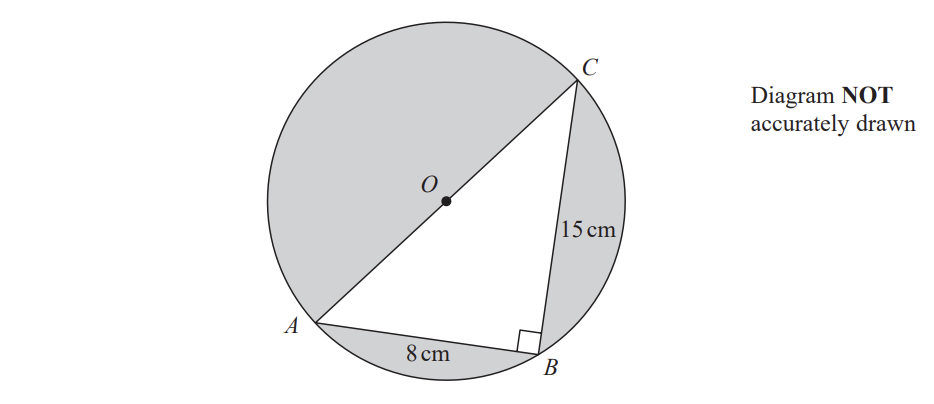

$AOC$ is a diameter of the circle.

$AB=8\mathrm{cm}BC=15\mathrm{cm}$

Angle $ABC=90^{\circ}$

Work out the total area of the regions shown shaded in the diagram. 
Give your answer correct to 3 significant figures.

## Q46 — very_hard — 5 marks · exam-questions

### 11() — 5 marks — command: work_out — structured — from paper Jan 2020 · 4MA1/2H
The diagram shows a shaded shape $ABCD$made from a semicircle $ABC$and a right-angled triangle $ACD$.

$AC$is the diameter of the semicircle $ABC$.

Work out the perimeter of the shaded shape. 
Give your answer correct to 3 significant figures.

....................$\mathrm{cm}$

## Q47 — very_hard — 6 marks · exam-questions

### 25() — 6 marks — command: calculate — structured — from paper June 2021 · 4MA1/1H
The diagram shows two circles such that the region $R$, shown shaded in the diagram, is the region common to both circles.

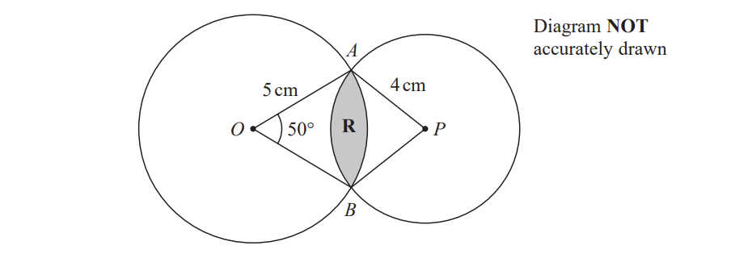

One of the circles has centre $O$ and radius 5cm. 
The other circle has centre $P$ and radius 4 cm. 
Angle $AOB=50^{\circ}$

Calculate the area of region $R$. 
Give your answer correct to 3 significant figures.

...................................................... cm2

## Q48 — very_hard — 6 marks · exam-questions

### 26() — 6 marks — command: work_out — structured — from paper June 2017 · 8300/3H
Here is an L-shape.

All dimensions are in centimetres.

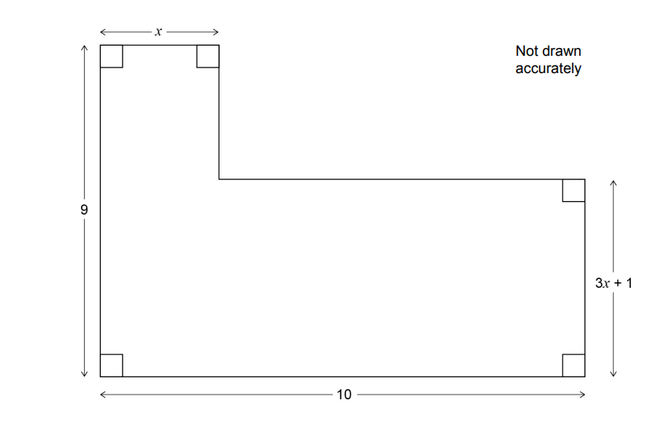

The area of the L-shape is 65 cm2

Work out the value of$x$.

## Q49 — very_hard — 5 marks · exam-questions

### 25() — 5 marks — command: prove — structured — from paper June 2017 · 8300/2H
The diagram shows a logo.

$ABE$ and $DCE$ are congruent triangles. 
$BCE$ is a sector of a circle, centre $E$.

Show that the area of the logo is 510 cm2 to 2 significant figures.

## Q50 — very_hard — 6 marks · exam-questions

### 10() — 6 marks — command: calculate — structured — from paper Nov 2020 · J560/04
The diagram shows Jane’s lawn. It is in the shape of a square of side 36m and three semi-circles.

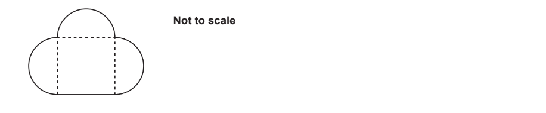

She is going to spread fertiliser on the lawn at a rate of 30g per square metre. 
The fertiliser is only sold in 10kg bags costing £15.80 each.

Calculate the cost of buying the bags of fertiliser for her lawn. You must show all your working.

£ ........................................................

## Q51 — very_hard — 7 marks · exam-questions

### 20() — 7 marks — command: calculate — structured — from paper Nov 2020 · J560/05
ABCD is a trapezium.

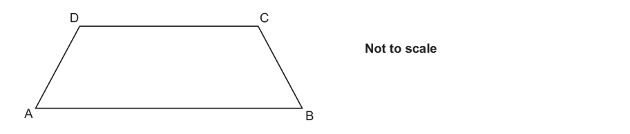

The perimeter of the trapezium is 56 cm. 
The ratio AD : AB : DC : BC = 5 : 12 : 6 : 5.

Calculate the area of the trapezium. 
Show your working.

..................................cm2

## Q52 — very_hard — 6 marks · exam-questions

### 12() — 6 marks — command: work_out — structured — from paper Nov 2018 · J560/06
In the diagram, the square and the trapezium share a common side of length *x* cm.

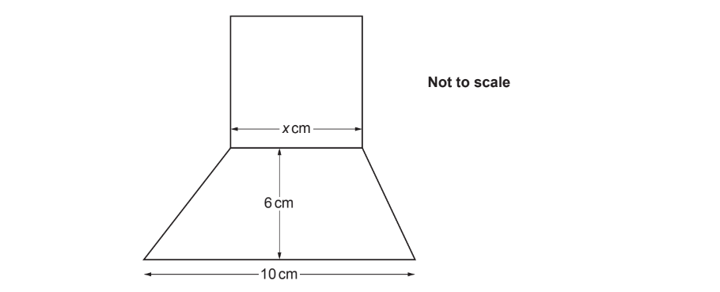

The area of the square is equal to the area of the trapezium.

Work out the value of *x*.

*x* = ..................

## Q53 — very_hard — 6 marks · exam-questions

### 7() — 6 marks — command: work_out — structured — from paper June 2018 · J560/05
Here is the floor plan of a rectangular room.

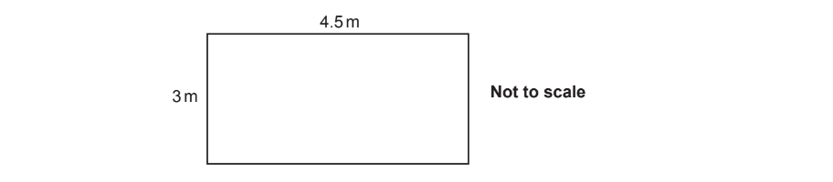

Tim buys carpet tiles for this room.

Each tile is a square measuring 50cm by 50cm.
 The tiles are only sold in packs of ten. 
Each pack costs £20.
 Tim pays for fitting at a rate of £7.50 per square metre, with any fraction of a square metre rounded up.

Work out the **total** cost of the tiles and fitting.

£ ..........................

## Q54 — very_hard — 3 marks · exam-questions

### 7() — 3 marks — command: find — structured — from paper Specimen 2015 · J560/05
The lengths of the sides of two squares are integers, when measured in cm. 
The difference between the areas of the two squares is 36cm2.

Find the lengths of the sides of the two squares.

.............................. cm 
.............................. cm
