# Exam Questions — Bearings, Scale Drawing & Constructions
**Geometry & Trigonometry** · Edexcel IGCSE Maths A (4MA1) — 18/Higher
> Source: [https://www.savemyexams.com/igcse/maths/edexcel/a/18/higher/topic-questions/4-geometry-and-trigonometry/bearings-scale-drawing-and-constructions/exam-questions/](https://www.savemyexams.com/igcse/maths/edexcel/a/18/higher/topic-questions/4-geometry-and-trigonometry/bearings-scale-drawing-and-constructions/exam-questions/) · 34 questions · total 120 marks

## Q1 — easy — 2 marks · exam-questions

### 14() — 2 marks — command: work_out — structured — from paper 2012	November · 1MA0/1H
The bearing of a ship from a lighthouse is $050^{\circ}$.

Work out the bearing of the lighthouse from the ship.

## Q2 — easy — 6 marks · exam-questions

### 11((a)) — 2 marks — command: find — structured — from paper November 2015 · 1MA0/1H
Manchester airport is on a bearing of $330^{\circ}$ from a London airport.

Find the bearing of the London airport from Manchester airport.

### 11((b)) — 4 marks — command: what — structured — from paper November 2015 · 1MA0/1H
The London airport is 200 miles from Manchester airport.

A plane leaves Manchester airport at 10 am to fly to the London airport. The plane flies at an average speed of 120 mph.

What time does the plane arrive at the London airport?

## Q3 — easy — 2 marks · exam-questions

### 13() — 2 marks — command: work_out — structured — from paper 2015	June · 1MA0/2H
Martin and Janet are in an orienteering race.

Martin runs from checkpoint $A$ to checkpoint $B$, on a bearing of $065^{\circ}$.

Janet is going to run from checkpoint $B$ to checkpoint $A$.

Work out the bearing of $A$ from $B$.

## Q4 — easy — 2 marks · exam-questions

### 3() — 2 marks — command: work_out — structured — from paper June 2021 · 4MA1/2H
The bearing of Paris from London is 149°.

Work out the bearing of London from Paris.

## Q5 — easy — 4 marks · exam-questions

### 5((a)) — 3 marks — command: label — structured — from paper Jan 2022 · 4MA1/2H
The scale diagram shows the position on a map of a house, $A$

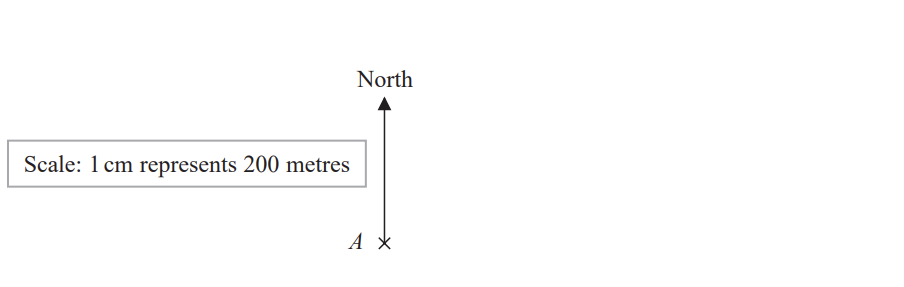

House $C$ is on a bearing of 110° from $A$. 
The distance from $A$ to $C$is 700 m.

Mark the position of $C$ on the diagram with a cross (×). 
Label your cross $C$.

### 5((b)) — 1 mark — command: write — structured — from paper Jan 2022 · 4MA1/2H
Write the scale of the map in the form $1:n$

1 : ..........................

## Q6 — easy — 1 marks · exam-questions

### 18((a)) — 1 mark — command: give — structured — from paper Nov 2021 · 8300/1H
Here is a triangle.

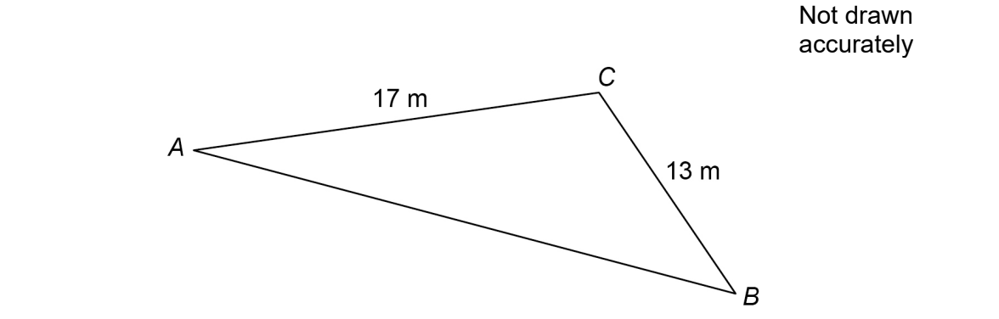

Give a reason why the length of side $AB$ **cannot **be 35 m

## Q7 — easy — 1 marks · exam-questions

### 4() — 1 mark — command: circle — structured — from paper Nov 2018 · 8300/2H
The bearing of $A$ from $B$ is 310°

Circle the bearing of $B$ from $A$.

| 050° | 110° | 130° | 220° |
|---|---|---|---|

## Q8 — easy — 1 marks · exam-questions

### 4() — 1 mark — command: work_out — structured — from paper June 2017 · 8300/3H
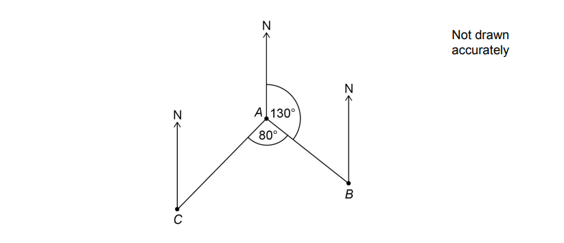

Work out the bearing of $C$ from $A$.

Circle your answer.

| 030° | 130° | 150° | 210° |
|---|---|---|---|

## Q9 — easy — 3 marks · exam-questions

### 7() — 3 marks — command: construct — structured — from paper Nov 2019 · 8300/3H
An equilateral triangle has side length 16 metres.

Using ruler and compasses only, construct a scale drawing of the triangle. 
Use the scale    1 centimetre represents 2 metres.

**Scale**: 1 cm represents 2 m

## Q10 — easy — 7 marks · exam-questions

### 5() — 5 marks — command: use — structured — from paper Nov 2018 · J560/06
This map shows part of a village.

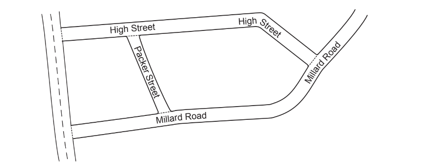

Neil knows that Packer Street is 180m long in real life.

i) Neil measures the map. 
He says

Packer Street is 3.5cm long.
    High Street is 11.2cm long.
    Therefore, I calculate that High Street is 576m long in real life.

Use Neil’s figures to show that the answer to his calculation is correct.

[3]

ii) Jodie measures the same map.

She says

I think Packer Street is longer than Neil’s measurement of 3.5cm.
    Therefore, High Street must be longer than 576m in real life.

Is Jodie’s reasoning correct? 
Show how you decide.

[2]

### 5((c)) — 2 marks — command: express — structured — from paper Nov 2018 · J560/06
On another map, Packer Street is 2.4cm long.

Express the scale of this map in the form 1 : $n$.

1 : ..................

## Q11 — easy — 2 marks · exam-questions

### 13((a)) — 2 marks — command: calculate — structured — from paper Nov 2017 · J560/06
A model railway is built using the scale 1 : 87.

On the model railway, the distance between the rails is 16.5 mm.

Calculate, in metres, the distance between the rails for a full-size train.

.................... metres

## Q12 — easy — 2 marks · exam-questions

### 2((a)) — 2 marks — command: work_out — structured — from paper June 2017 · J560/06
The scale of a map is 1 cm represents 25 m.

i) The length of a path is 240 m.

Work out the length, in centimetres, of the path on the map.

...................................................... cm [1]

ii) The scale 1 cm represents 25 m can be written in the form 1: *k*.

Find the value of *k*.

*k* = ..................................................... [1]

## Q13 — medium — 4 marks · exam-questions

### 14((a)) — 1 mark — command: work_out — structured — from paper June 2012 · 1MA0/1H
The diagram shows the position of a lighthouse $L$ and a harbour $H$.

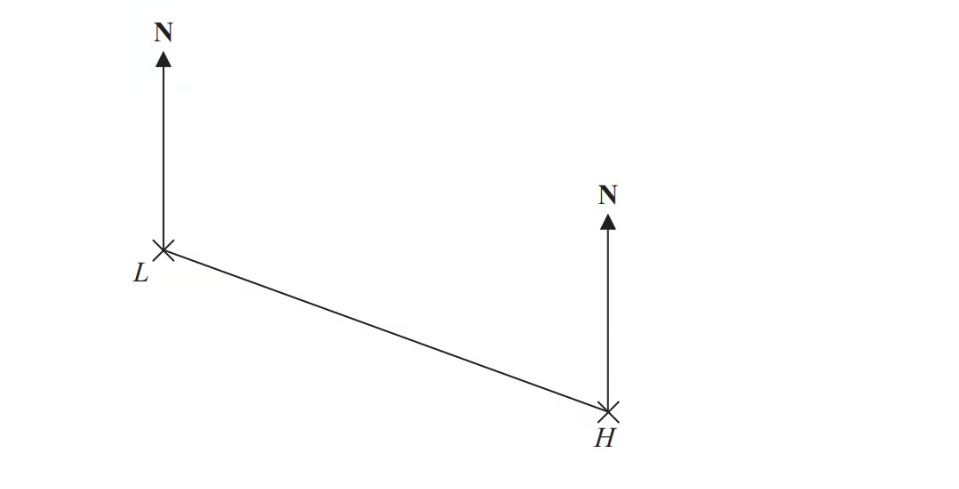

The scale of the diagram is 1 cm represents 5 km.

Work out the real distance between $L$ and $H$.

### 14((b)) — 1 mark — command: measure — structured — from paper June 2012 · 1MA0/1H
Measure the bearing of $H$ from $L$.

### 14((c)) — 2 marks — command: label — structured — from paper June 2012 · 1MA0/1H
A boat $B$ is 20km from $H$ on a bearing of $040^{\circ}$.

On the diagram, mark the position of boat $B$ with a cross (x). Label it $B$.

## Q14 — medium — 3 marks · exam-questions

### 12((a)) — 1 mark — command: measure — structured — from paper November 2016 · 1MA0/1H
The diagram shows the positions of a lighthouse $L$, a yacht $Y$ and a tanker $T$ on a map.

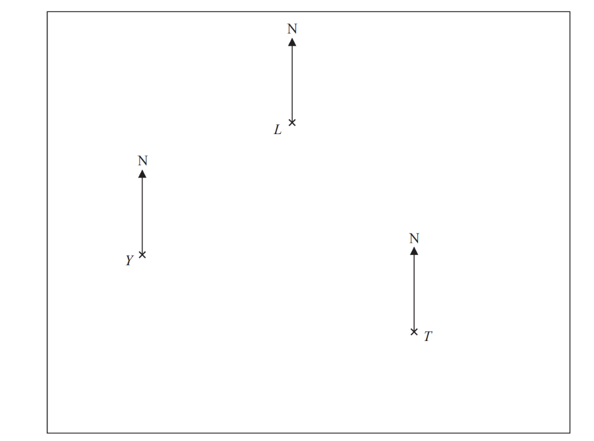

Scale 1 cm represents 10 km

Measure the bearing of $L$ from $Y$.

### 12((b)) — 2 marks — command: find — structured — from paper November 2016 · 1MA0/1H
The tanker, $T$, sails 80km on a bearing of $320^{\circ}$.

Find the distance, in km, between the tanker and the lighthouse when the tanker is closest to the lighthouse.

## Q15 — medium — 3 marks · exam-questions

### 9() — 3 marks — command: draw — structured — from paper June 2017 · 1MA0/2H
The diagram shows the position of two churches, $A$ and $B$.

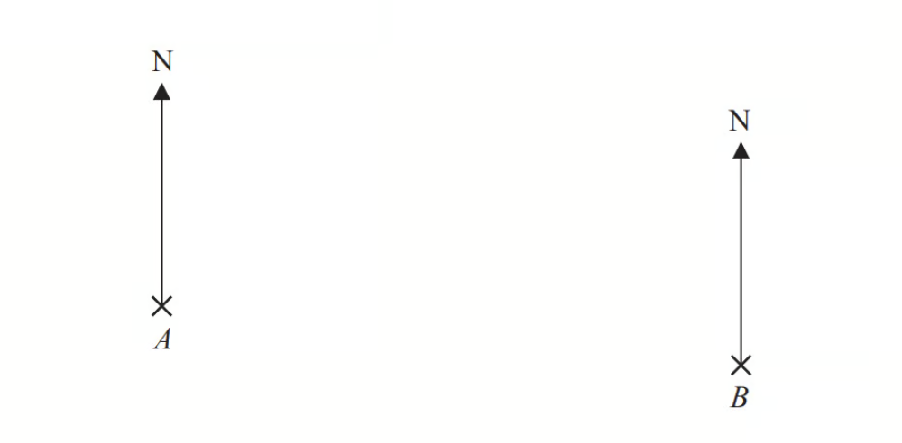

Church $C$ is on a bearing of $130^{\circ}$ from church $A$. 
Church $C$ is on a bearing of $245^{\circ}$ from church $B$.

In the space above, draw an accurate diagram to show the position of church $C$.

Mark the position of church $C$ with a cross ($\times$). 
Label it $C$.

## Q16 — medium — 2 marks · exam-questions

### 9() — 2 marks — command: construct — structured — from paper November 2015 · 1MA0/2H

Use ruler and compasses to **construct** the perpendicular bisector of the line segment  *AB*. 
You must show all your construction lines.

## Q17 — medium — 3 marks · exam-questions

### 9() — 3 marks — command: work_out — structured — from paper 2015	Spec1 · 1MA1/2H
The diagram shows the positions of three points, *A, B* and *C*, on a map.

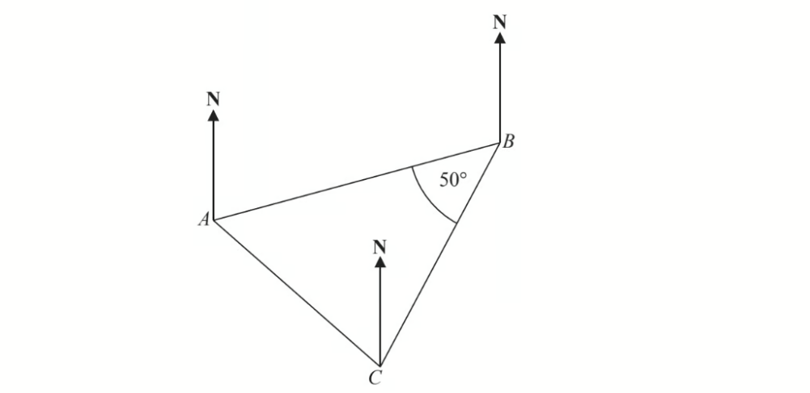

The bearing of *B* from *A* is 070°

Angle *ABC* is 50° 
*AB = CB*

Work out the bearing of *C* from *A*.

## Q18 — medium — 2 marks · exam-questions

### 5() — 2 marks — command: construct — structured — from paper Jan 2020 · 4MA1/2H
Use ruler and compasses to construct the bisector of angle $BAC$. 
You must show all your construction lines.

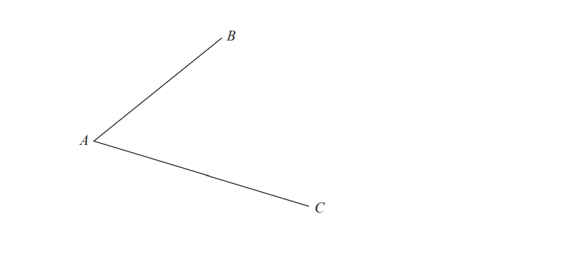

## Q19 — medium — 2 marks · exam-questions

### 6() — 2 marks — command: construct — structured — from paper Jan 2020 · 4MA1/2HR
Use ruler and compasses only to construct the perpendicular bisector of the line $AB$. 
You must show all your construction lines.

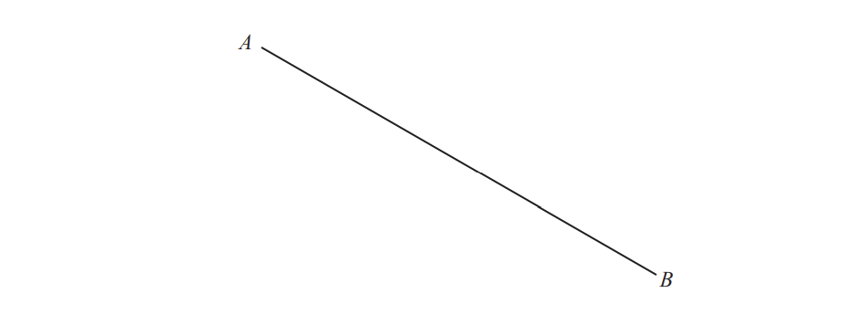

## Q20 — medium — 2 marks · exam-questions

### 2() — 2 marks — command: construct — structured — from paper Nov 2020 · 4MA1/1HR
Using ruler and compasses only, construct the bisector of angle $ABC$. 
You must show all your construction lines.

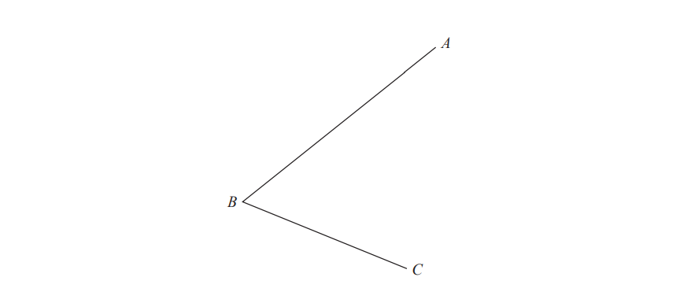

## Q21 — medium — 4 marks · exam-questions

### 5((a)) — 2 marks — command: label — structured — from paper Jan 2019 · 4MA1/2HR
The scale drawing shows the position of a hall and the position of a library.

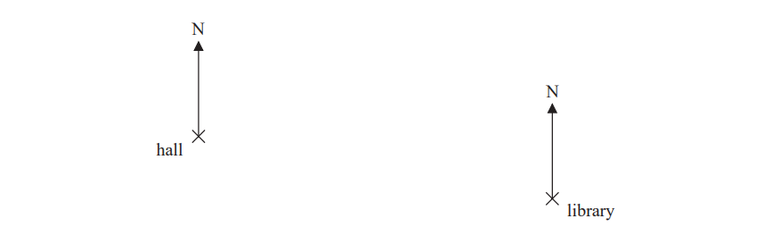

| Scale: $1\mathrm{cm}$ represents $20\mathrm{metres}$ |
|---|

A post box is $140\mathrm{metres}$ from the library on a bearing of $220^{\circ}$

Show the position of the post box on the scale drawing. 
Mark the position with a cross $(\times)$ and label it $P.$

### 5((b)) — 2 marks — command: use — structured — from paper Jan 2019 · 4MA1/2HR
Use your scale drawing to find

i) the real distance, in metres, of the hall from the post box,

ii) the bearing of the hall from the post box.

[2]

## Q22 — medium — 2 marks · exam-questions

### 2() — 2 marks — command: construct — structured — from paper June 2019 · 4MA1/2H
Use ruler and compasses to construct the perpendicular bisector of the line $DE$. You must show all your construction lines.

## Q23 — medium — 6 marks · exam-questions

### 5((a)) — 5 marks — command: work_out — structured — from paper June 2018 · J560/04
The scale diagram below shows two cities, P and Q.

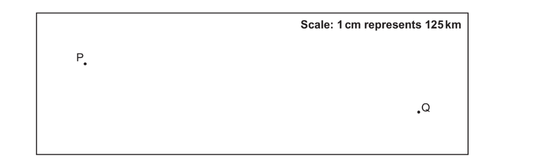

A plane departs from P at 09 47 and arrives at Q at 12 07.

Work out the average speed, in kilometres per hour, of the plane.

...................... km/h

### 5((b)) — 1 mark — command: give — structured — from paper June 2018 · J560/04
Give one reason why your answer may be inaccurate.

## Q24 — hard — 5 marks · exam-questions

### 23() — 5 marks — command: find — structured — from paper June 2019 · 1MA1/3H
The diagram shows the positions of three towns, Acton ($A$), Barston ($B$) and Chorlton ($C$).

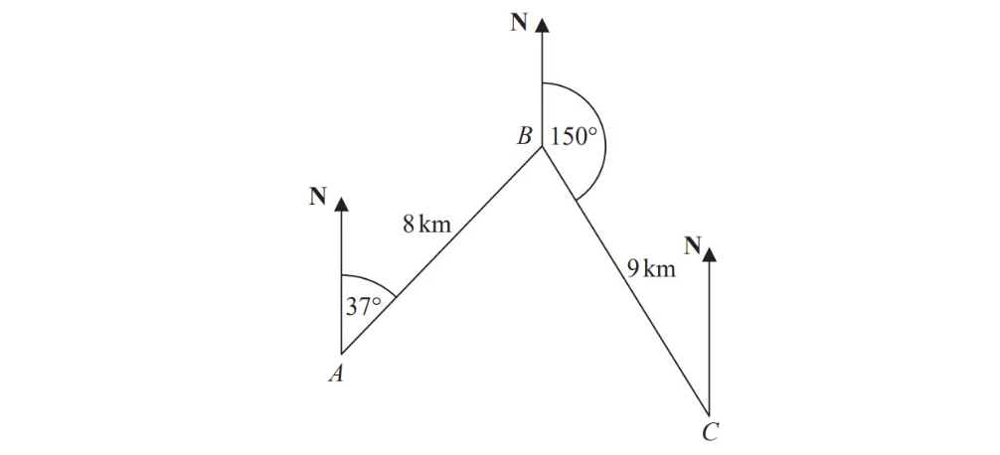

Barston is 8 km from Acton on a bearing of $037^{\circ}$. 
Chorlton is 9km from Barston on a bearing of $150^{\circ}$.

Find the bearing of Chorlton from Acton. 
Give your answer correct to 1 decimal place. 
You must show all your working.

## Q25 — hard — 5 marks · exam-questions

### 16() — 5 marks — command: calculate — structured — from paper Jan 2021 · 4MA1/1H
The diagram shows the positions of three ships, $A,B$ and $C$.

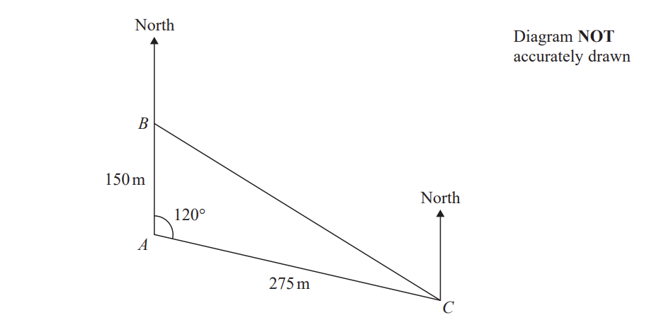

Ship $B$ is due north of ship $A$. 
The bearing of ship $C$from ship $A$ is 120°

Calculate the bearing of ship $C$ from ship $B$. 
Give your answer correct to the nearest degree.

## Q26 — hard — 5 marks · exam-questions

### 23() — 5 marks — command: calculate — structured — from paper Specimen 2016 · 4MA1/1H
$A$ , $B$ and $C$ are three towns.

The bearing of $B$ from $A$ is 105° 
The bearing of $C$ from B is 230°

The distance of $C$ from $A$ is 180 km. 
The distance of $C$ from $B$ is 95 km.

Calculate the distance of $B$ from $A$. 
Give your answer correct to 3 significant figures.

........................km

## Q27 — hard — 3 marks · exam-questions

### 9() — 3 marks — command: work_out — structured — from paper Nov 2019 · 8300/2H
$J$ and $K$ are ships.

$P$ is a port.

$J$ is due South of $P$. 
Angle $JPK=56^{\circ}$
 $JP=KP$

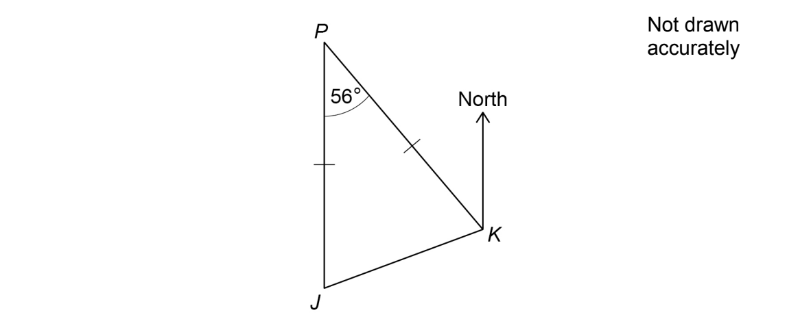

Work out the bearing of $J$ from $K$.

## Q28 — hard — 4 marks · exam-questions

### 23() — 4 marks — command: work_out — structured — from paper Nov 2021 · 8300/2H
A ship sails from $P$ to $Q$ and then from $Q$ to $R$.

$Q$ is 12 miles from $P$, on a bearing of 080°
$R$ is 28 miles from $Q$, on a bearing of 155°

Work out the direct distance from $P$ to $R$.

## Q29 — hard — 4 marks · exam-questions

### 9() — 4 marks — command: calculate — structured — from paper Nov 2017 · J560/06
The diagram shows the positions of two towns, Amton and Bisham.

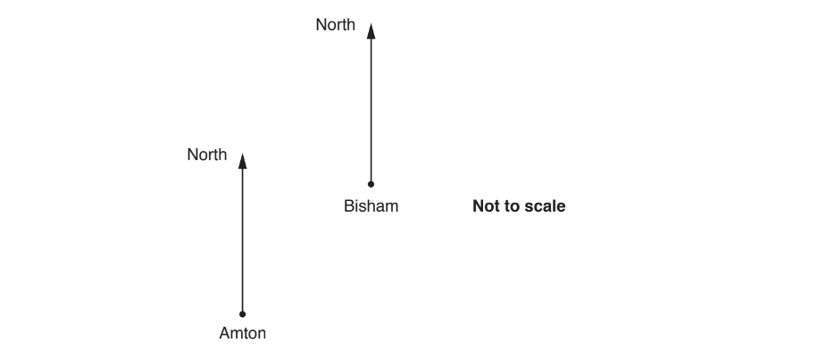

The bearing of Bisham from Amton is* b*°. 
The bearing of Amton from Bisham is 6*b*°.

Calculate the 3-figure bearing of Amton from Bisham.

## Q30 — hard — 6 marks · exam-questions

### 7() — 2 marks — command: work_out — structured — from paper June 2017 · J560/04
A, B, C and D are four towns.

B is 25 kilometres due East of A. 
C is 25 kilometres due North of A. 
D is 45 kilometres due South of A.

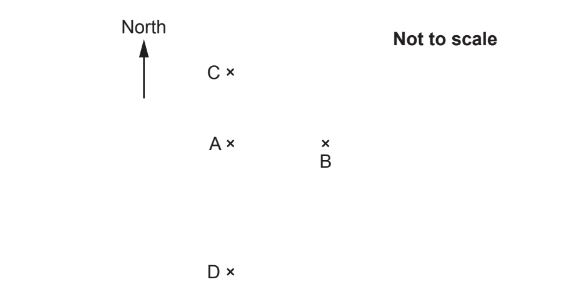

Work out the bearing of B from C.

### 7((b)) — 4 marks — command: calculate — structured — from paper June 2017 · J560/04
Calculate the bearing of D from B.

## Q31 — hard — 3 marks · exam-questions

### 2((a)) — 3 marks — command: work_out — structured — from paper 2018	May/June · 0580/41
The scale drawing shows two boundaries, *AB* and *BC*, of a field *ABCD*. The scale of the drawing is 1 cm represents 8 m.

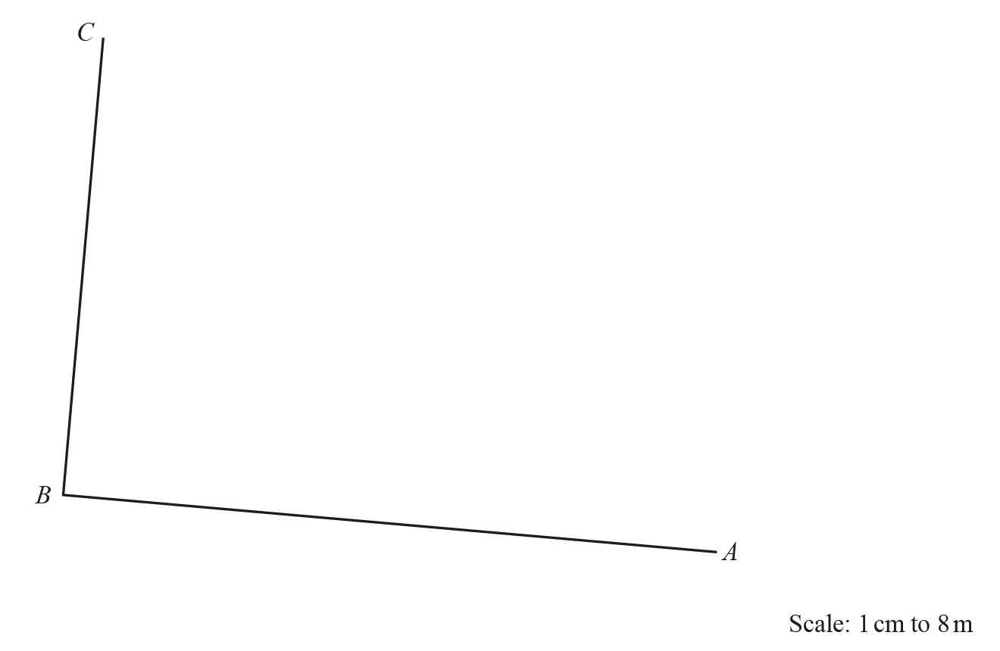

The boundaries *CD* and* AD* of the field are each 72 m long.

i) Work out the length of *CD* and* AD* on the scale drawing.

.......................................... cm [1]

ii) **Using a ruler and compasses only**, complete accurately the scale drawing of the field.

[2]

## Q32 — hard — 11 marks · exam-questions

### 7((a)) — 3 marks — command: prove — structured — from paper 2020	May/June · 0580/41
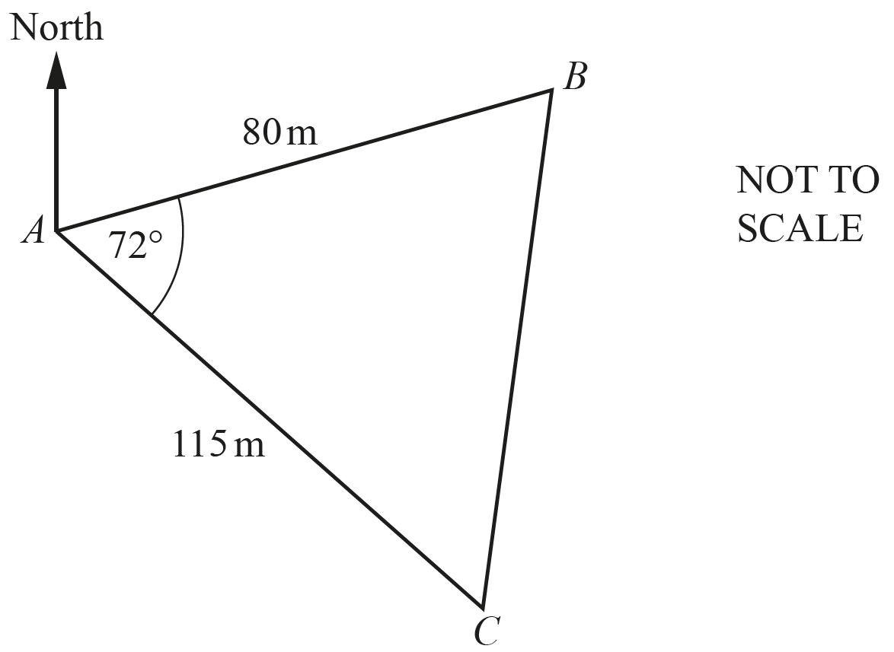

The diagram shows the positions of three points $A$, $B$ and $C$ in a field.

Show that $BC$ is 118.1 m, correct to 1 decimal place.

### 7((b)) — 3 marks — command: calculate — structured — from paper 2020	May/June · 0580/41
Calculate angle $ABC$.

Angle $ABC=$ ................................................

### 7((c)) — 5 marks — command: find — structured — from paper 2020	May/June · 0580/41
The bearing of $C$ from $A$ is 147°. Find the bearing of

i) $A$ from $B$,

[3]

ii) $B$ from $C$.

[2]

## Q33 — hard — 2 marks · exam-questions

### 5((a)) — 2 marks — command: find — structured — from paper 2020 May/June · 0580/42
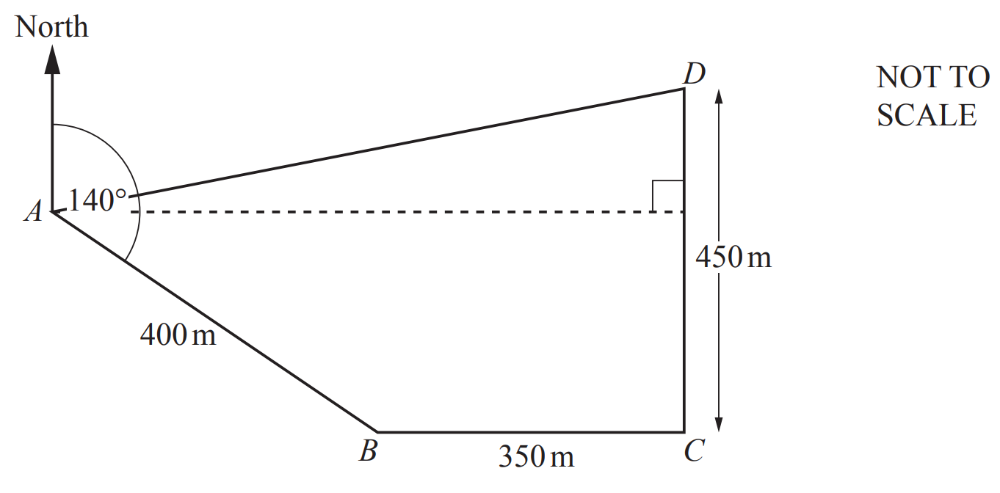

The diagram shows a field *ABCD*. 
The bearing of *B* from *A* is 140°.  
*C* is due east of *B* and *D* is due north of *C*. 
*AB* = 400m, *BC* = 350m and *CD* = 450m.

Find the bearing of *D* from *B*.

## Q34 — hard — 6 marks · exam-questions

### 6((a)) — 6 marks — command: calculate — structured — from paper 2020 Oct/Nov · 0580/41
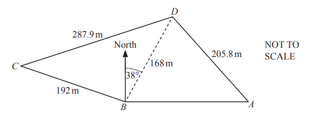

The diagram shows a field, *ABCD*, on horizontal ground. *BC *= 192 m, *CD *= 287.9 m, *BD *= 168 m and *AD *= 205.8 m.

Angle *CBD *= 106°.

i) The bearing of *D* from* B* is 038°.

Find the bearing of *C  *from *B*.

[1]

ii) *A* is **due east** of *B*.

Calculate the bearing of *D  *from *A*.

[5]
