# Exam Questions — Circle Theorems
**Geometry & Trigonometry** · Edexcel IGCSE Maths A (4MA1) — 18/Higher
> Source: [https://www.savemyexams.com/igcse/maths/edexcel/a/18/higher/topic-questions/4-geometry-and-trigonometry/circle-theorems/exam-questions/](https://www.savemyexams.com/igcse/maths/edexcel/a/18/higher/topic-questions/4-geometry-and-trigonometry/circle-theorems/exam-questions/) · 62 questions · total 252 marks

## Q1 — easy — 4 marks · exam-questions

### 14((a)) — 2 marks — structured — from paper 2023 June · 4MA1/2H
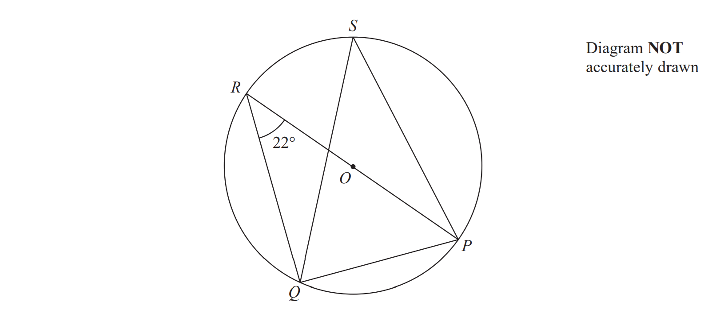

P, Q, R and S are points on a circle, centre O 
ROP is a diameter of the circle.
Angle PRQ = 22°

(i) Find the size of angle RQP

[1]

(ii) Give a reason for your answer.

[1]

### 14((b)) — 2 marks — structured — from paper 2023 June · 4MA1/2H
(i) Find the size of angle $PSQ$

[1]

(ii) Give a reason for your answer.

[1]

## Q2 — easy — 2 marks · exam-questions

### 21((a)) — 2 marks — command: work_out — structured — from paper Nov 2020 · 8300/3H
$A$ and $B$ are points on a circle.

$PA$ and $PB$ are tangents.

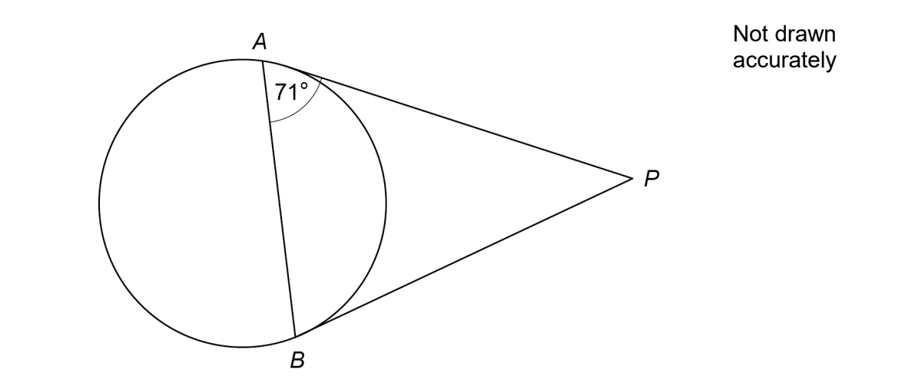

Work out the size of angle $APB$.

.....................................degrees

## Q3 — easy — 2 marks · exam-questions

### 19() — 2 marks — command: give — structured — from paper Nov 2017 · 8300/3H
$A,B$ and $C$ are points on a circle.

$CD$ is a tangent to the circle.

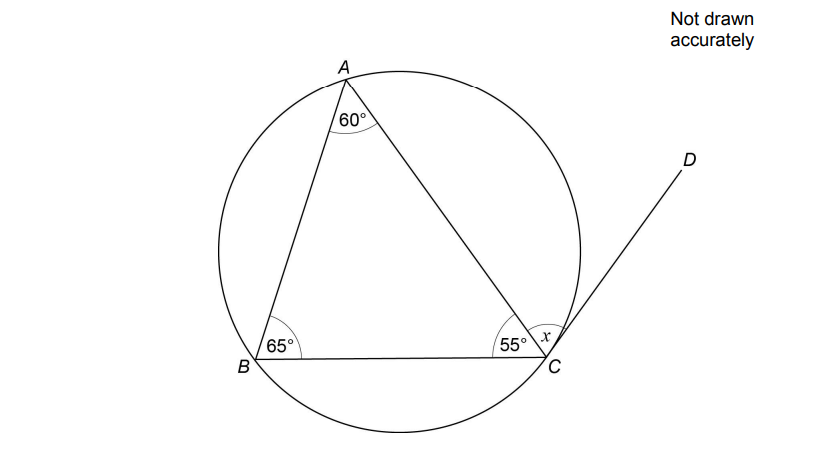

Write down the size of angle $x$. 
Give a reason for your answer.

............................degrees

## Q4 — easy — 2 marks · exam-questions

### 12() — 2 marks — command: circle — structured — from paper June 2017 · 8300/2H
$A,B,C,D,E$ and $F$ are points on a circle.

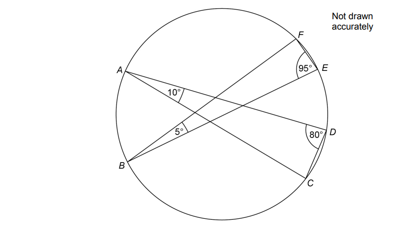

Circle the line that is a diameter of the circle.

| $BE$ | $AD$ | $AC$ | $BF$ |
|---|---|---|---|

## Q5 — easy — 4 marks · exam-questions

### 16((b)) — 4 marks — command: explain — structured — from paper Nov 2019 · J560/06
In the diagram,

- E, F and D are points on the circumference of the circle
- G, D and H lie on a tangent to the circle
- angle EFD = 55°
- angle FDE = 43°.

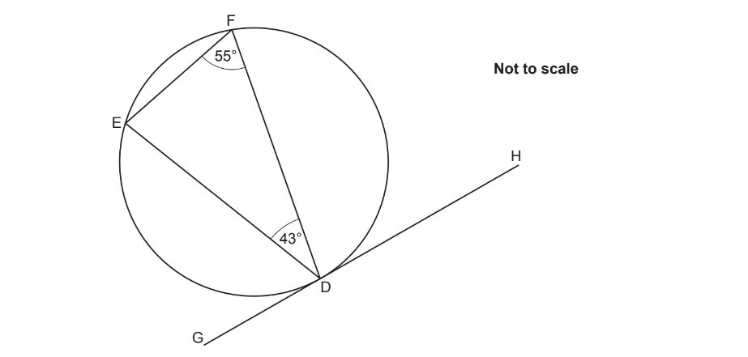

Explain why angle HDF is 82°.

## Q6 — easy — 4 marks · exam-questions

### 16((a)) — 2 marks — command: work_out — structured — from paper June 2017 · J560/05
A, B, C and D are points on the circumference of a circle, centre O.

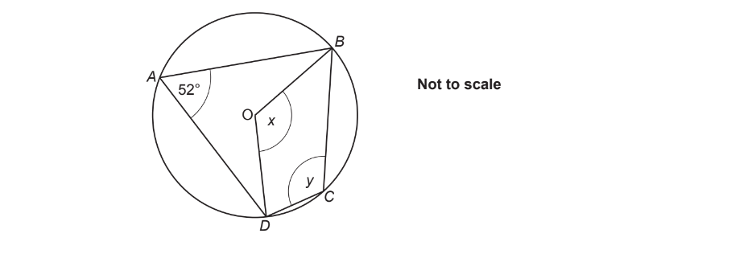

Angle BAD = 52°.

Work out angle *x*. 
Give a reason for your answer.

*x* = ................................... ° reason ..................................................................................

### 16((b)) — 2 marks — command: work_out — structured — from paper June 2017 · J560/05
Work out angle *y*. Give a reason for your answer.

*y* = ................................... ° reason ..................................................................................

## Q7 — easy — 4 marks · exam-questions

### 7() — 4 marks — command: work_out — structured — from paper Specimen paper · 4MA1/2H

$A$ and $C$ are points on a circle, centre $O$.
 $AB$ and $CB$are tangents to the circle. 
Angle $ABC$ = 52°

Work out the size of angle $x$. 
Give a reason for each stage of your working.

## Q8 — easy — 3 marks · exam-questions

### 7() — 3 marks — command: work_out — structured — from paper 2023 June · 4MA1/2H
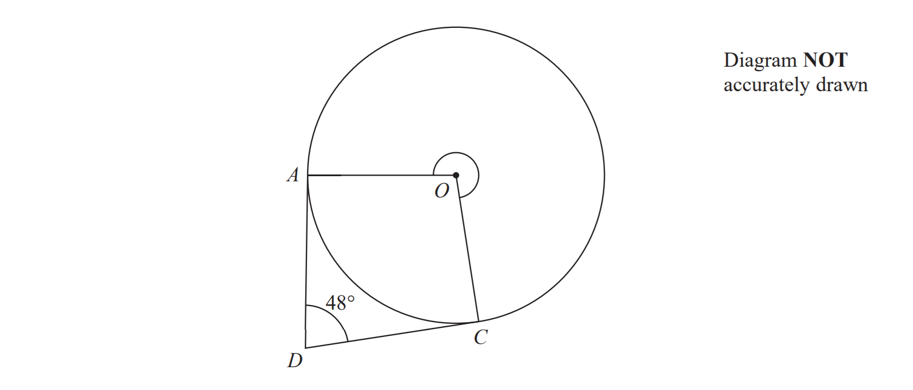

$A$ and $C$ are points on a circle, centre $O$ 
$DA$ is the tangent to the circle at $A$ and $DC$ is the tangent to the circle at $C$

Angle $ADC=48^{\circ}$

Work out the size of reflex angle $AOC$

## Q9 — medium — 4 marks · exam-questions

### 21() — 4 marks — command: work_out — structured — from paper June 2012 · 1MA0/1H
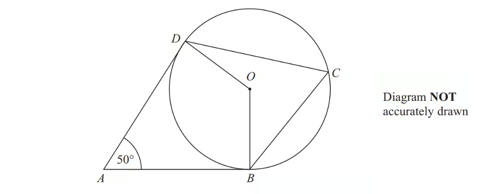

$B,C$ and $D$ are points on the circumference of a circle, centre $O$. 
$AB$ and $AD$ are tangents to the circle.

Angle $DAB=50^{\circ}$

Work out the size of angle $BCD$. 
Give a reason for each stage in your working.

## Q10 — medium — 4 marks · exam-questions

### 1() — 4 marks — command: work_out — structured
A and B are points on a circle, centre O.

AC and BC are tangents to the circle.

Angle ACB = 48° .

Work out the size of angle $x$.

Give a reason for each stage of your working

$x=$............°

## Q11 — medium — 5 marks · exam-questions

### 16() — 5 marks — command: work_out — structured — from paper June 2013 · 1MA0/2H
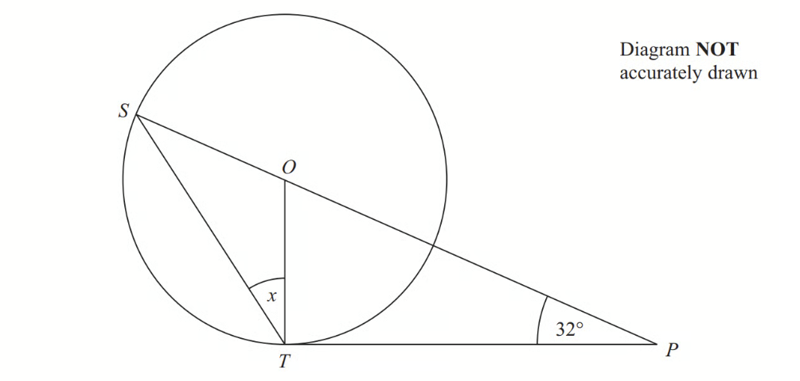

$S$ and $T$ are points on the circumference of a circle, centre $O$.
 $PT$ is a tangent to the circle.
 $SOP$ is a straight line.

Angle $OPT=32^{\circ}$

Work out the size of the angle marked $x$. 
Give reasons for your answer.

## Q12 — medium — 3 marks · exam-questions

### 19() — 3 marks — command: work_out — structured — from paper March 2013 · 1MA0/1H
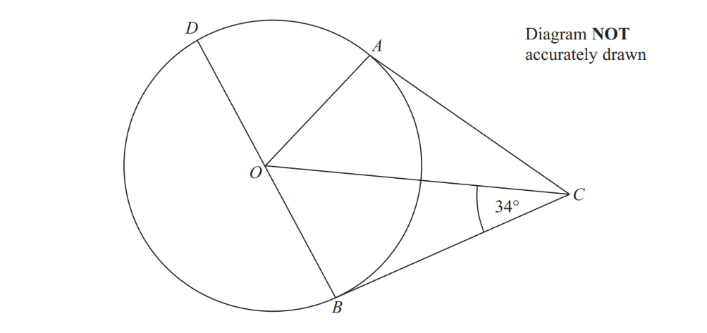

$A,B$ and $D$ are points on the circumference of a circle, centre $O$. 
$BOD$ is a diameter of the circle. $BC$ and $AC$ are tangents to the circle.
 Angle $OCB=34^{\circ}$.

Work out the size of angle $DOA$.

## Q13 — medium — 4 marks · exam-questions

### 22() — 4 marks — command: find — structured — from paper November 2013 · 1MA0/1H
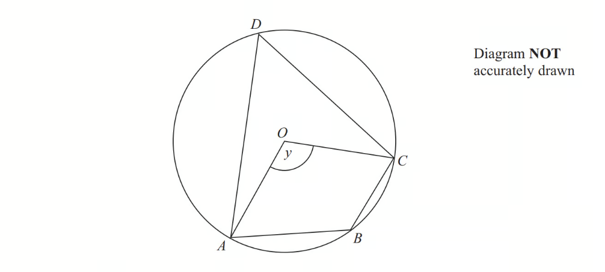

$A,B,C$ and $D$ are points on the circumference of a circle, centre $O$.

Angle $AOC=y$.

Find the size of angle $ABC$ in terms of $y$. 
Give a reason for each stage of your working.

## Q14 — medium — 4 marks · exam-questions

### 18() — 4 marks — command: find — structured — from paper November 2016 · 1MA0/2H
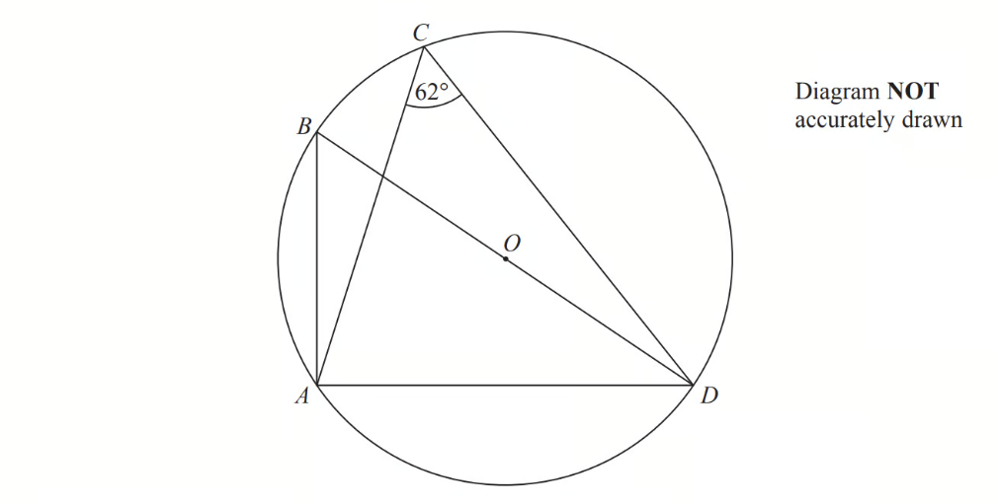

$A,B,C$ and $D$ are points on the circumference of a circle, centre $O$.
 $BOD$ is a straight line. 
Angle $ACD=62^{\circ}$

Find the size of angle $ADB$. 
Give a reason for each stage in your working.

## Q15 — medium — 5 marks · exam-questions

### 18() — 5 marks — command: work_out — structured — from paper June 2019 · 1MA1/2H
The points $A,B,C$ and $D$ lie on a circle. $CDE$ is a straight line.

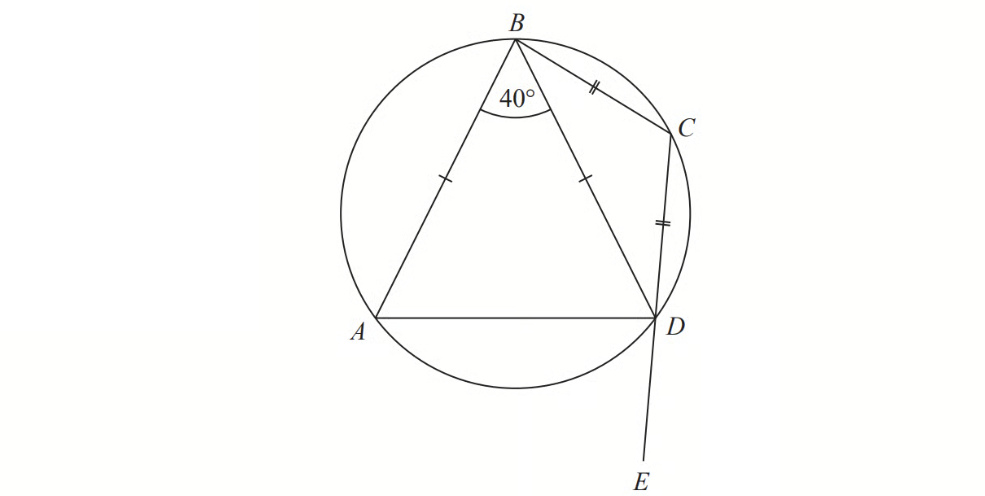

$BA=BD$
 $CB=CD$ 
Angle $ABD=40^{\circ}$

Work out the size of angle $ADE$. 
You must give a reason for each stage of your working.

## Q16 — medium — 2 marks · exam-questions

### 1() — 2 marks — command: calculate — structured
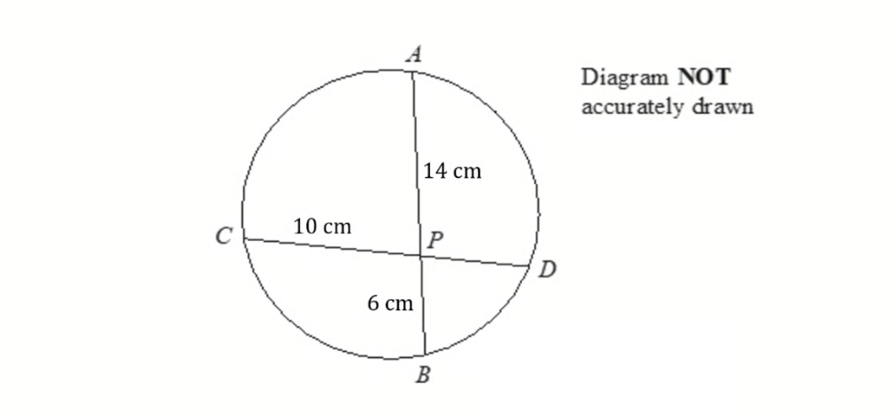

*APB* and *CPD* are chords of a circle.

*AP* = 14 cm            *PB* = 6cm             *CP *= 10 cm

Calculate the length of *PD*.

## Q17 — medium — 3 marks · exam-questions

### 1() — 3 marks — command: work_out — structured
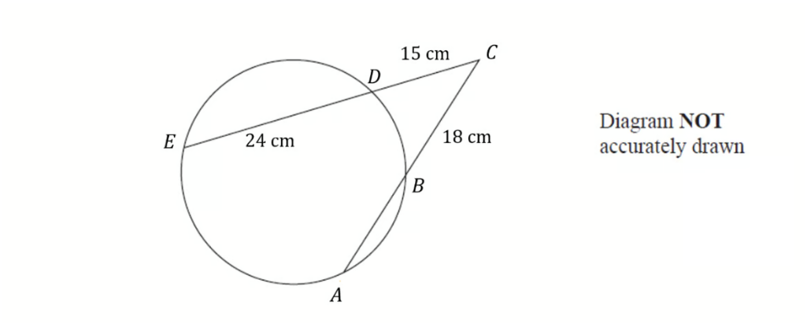

*A, B, D* and *E *are points on a circle. *EDC* and *ABC* are straight lines.

*ED* = 24 cm                       *DC* = 15 cm                       *BC* = 18 cm

Work out the length of *AB*.

## Q18 — medium — 4 marks · exam-questions

### 16() — 4 marks — command: calculate — structured — from paper Jan 2022 · 4MA1/2H
$D,E,F$ and $G$ are points on a circle, centre $O$

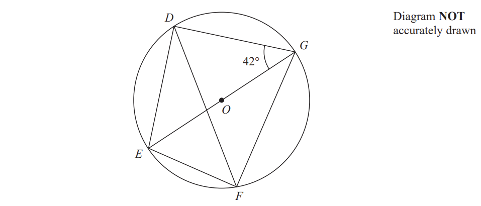

$EOG$ is a diameter of the circle.

Angle $EGD=42^{\circ}$

Calculate the size of angle $DFG$ 
Give a reason for each stage of your working.

Angle DFG = .......................................................

## Q19 — medium — 3 marks · exam-questions

### 19() — 3 marks — command: calculate — structured — from paper Jan 2022 · 4MA1/2H
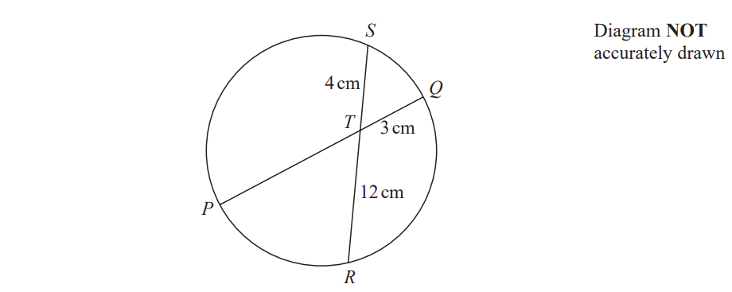

$PTQ$is a diameter of a circle.
 $RTS$ is a chord of the circle.

| $TQ=3\mathrm{cm}$ | $ST=4\mathrm{cm}$ | $TR=12\mathrm{cm}$ |
|---|---|---|

Calculate the radius of the circle.

........................................... cm

## Q20 — medium — 2 marks · exam-questions

### 18() — 2 marks — command: calculate — structured — from paper Jan 2020 · 4MA1/2HR
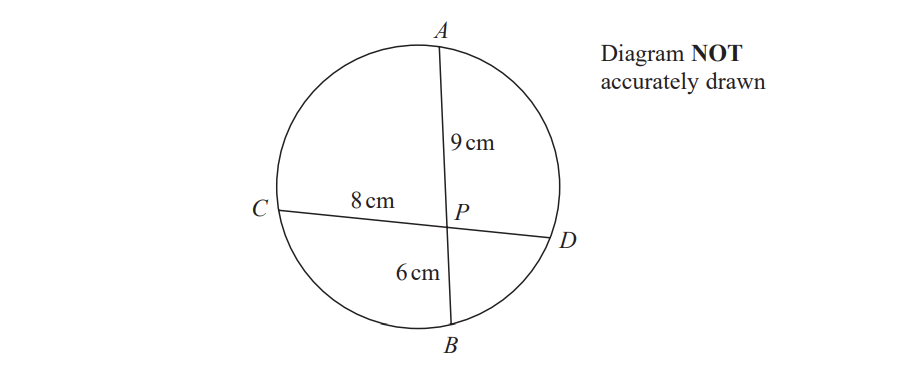

$APB$and $CPD$are chords of a circle. 
$AP$ = 9 cm $PB$ = 6 cm $CP$ = 8 cm

Calculate the length of $PD$.

......................cm

## Q21 — medium — 4 marks · exam-questions

### 23() — 4 marks — command: prove — structured — from paper Nov 2020 · 8300/1H
$ABCD$ is a quadrilateral.

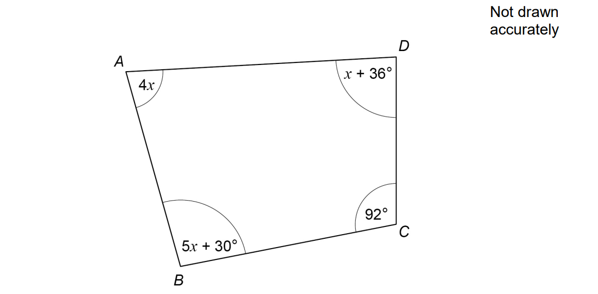

Prove that $ABCD$  is **not **a cyclic quadrilateral.

## Q22 — medium — 2 marks · exam-questions

### 21((b)) — 2 marks — command: tick — structured — from paper Nov 2020 · 8300/3H
$C,D$ and $E$ are points on a circle.

$XC=XD$.

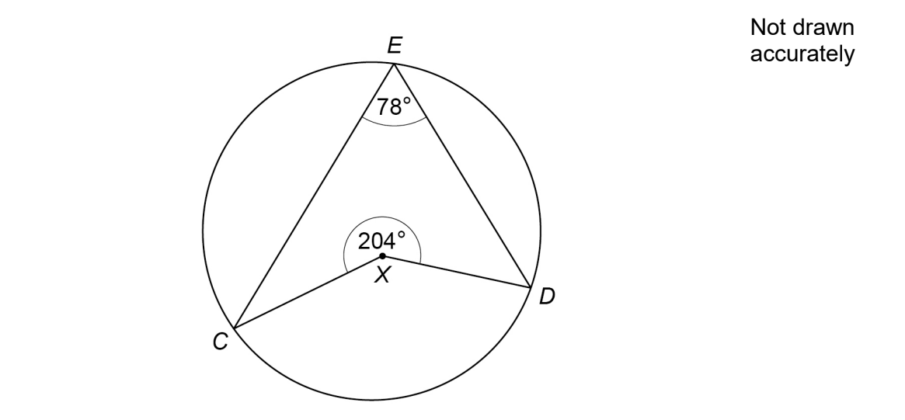

Is $X$the centre of the circle? Tick a box.

`square` Yes            `space square` No

Show working to support your answer.

## Q23 — medium — 1 marks · exam-questions

### 22() — 1 mark — command: evaluate — structured — from paper June 2018 · 8300/3H
$A$, $B$ and $C$ are points on a circle.

$DCB$ is a straight line.

$PAQ$ is a tangent to the circle.

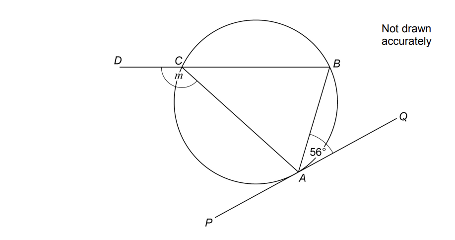

Sam is trying to work out the size of angle $m$. Here is his working.

| `table row cell angle space A C B space end cell equals cell space 56 degree end cell row cell m space end cell equals cell space 180 degree space – space 56 degree end cell row cell m space end cell equals cell space 124 degree end cell end table` | angles in the same segment are equal  angles at a point on a straight line add up to 180° |
|---|---|

Make a criticism of his working.

## Q24 — medium — 5 marks · exam-questions

### 19((a)) — 2 marks — command: work_out — structured — from paper Nov 2018 · J560/05
The diagram shows a circle, centre O.

Points A, B, C and D lie on the circumference of the circle. 
EDF is a tangent to the circle. 
Angle ABC = 82° and angle ODC = 57°.

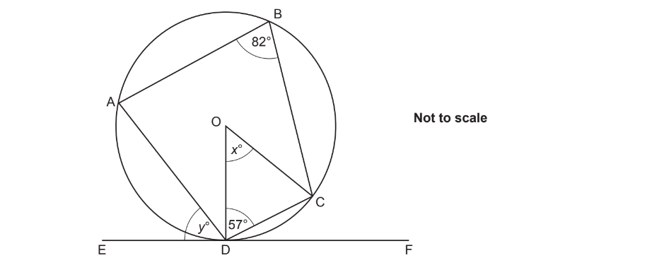

Work out the value of *x*.

*x* = ......................

### 19((b)) — 3 marks — command: work_out — structured — from paper Nov 2018 · J560/05
Work out the value of *y*.

*y* = ..................

## Q25 — medium — 4 marks · exam-questions

### 16((a)) — 2 marks — command: work_out — structured — from paper June 2018 · J560/05
A, B, C and D are points on the circumference of a circle.

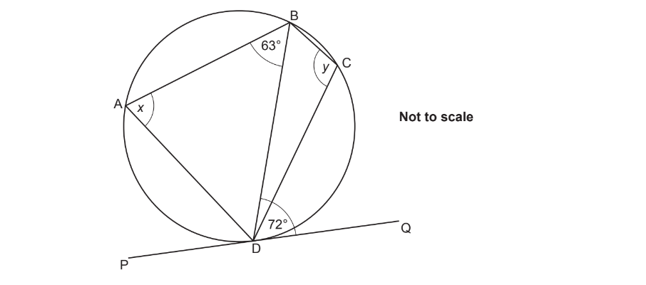

PQ is a tangent to the circle at D. 
Angle BDQ = 72° and angle ABD = 63°.

Work out angle *x*. 
Give a reason for your answer.

Angle x = ...................° because ......................

### 16((b)) — 2 marks — command: work_out — structured — from paper June 2018 · J560/05
Work out angle *y*. 
Give a reason for your answer.

Angle* y* = ...................° because .....................

## Q26 — medium — 5 marks · exam-questions

### 1() — 5 marks — command: work_out — structured

$A$, $B$, $C$ and $D$ are points on a circle, centre $O$. $DOB$ is a diameter of the circle. Angle $ACD=32^{\circ}$.

Work out the size of angle $ADB$.

Give a reason for each stage in your working.

## Q27 — medium — 5 marks · exam-questions

### 14() — 5 marks — command: work_out — structured — from paper Specimen paper · 4MA1/1H
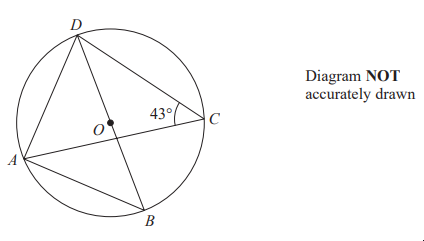

*A*, *B*, *C* and *D* are points on a circle with centre *O*.
*DOB* is a diameter of the circle.
Angle *ACD* = 43°

Work out the size of angle *ADB*.
Give a reason for each stage in your working.

## Q28 — medium — 3 marks · exam-questions

### 16() — 3 marks — command: work_out — structured — from paper Specimen paper · 4MA1/1H
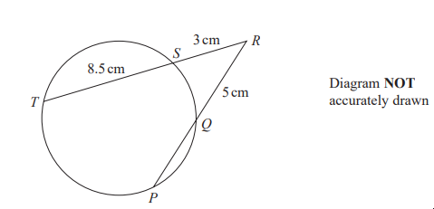

*P*, *Q*, *S* and *T* are points on a circle.
*TSR* and *PQR* are straight lines.

Work out the length of *PQ*.

## Q29 — medium — 3 marks · exam-questions

### 14() — 3 marks — command: find — structured — from paper 2023 Nov · 4MA1/1H
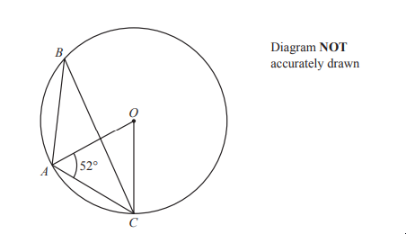

$A,B$ and $C$are points on a circle, centre $O$

Angle $OAC=52^{\circ}$

Find the size of angle $ABC$
Give reasons for your working.

## Q30 — hard — 3 marks · exam-questions

### 21() — 3 marks — command: work_out — structured — from paper June 2014 · 1MA0/1H
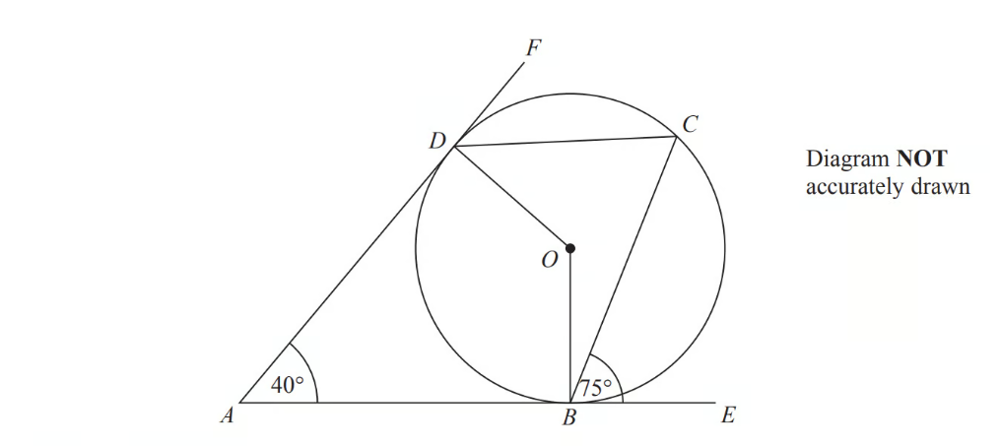

$B,C$ and $D$ are points on the circumference of a circle, centre $O$. $ABE$ and $ADF$ are tangents to the circle.

Angle $DAB=40^{\circ}$
Angle $CBE=75^{\circ}$

Work out the size of angle $ODC$.

## Q31 — hard — 4 marks · exam-questions

### 17() — 4 marks — command: work_out — structured — from paper November 2014 · 1MA0/2H
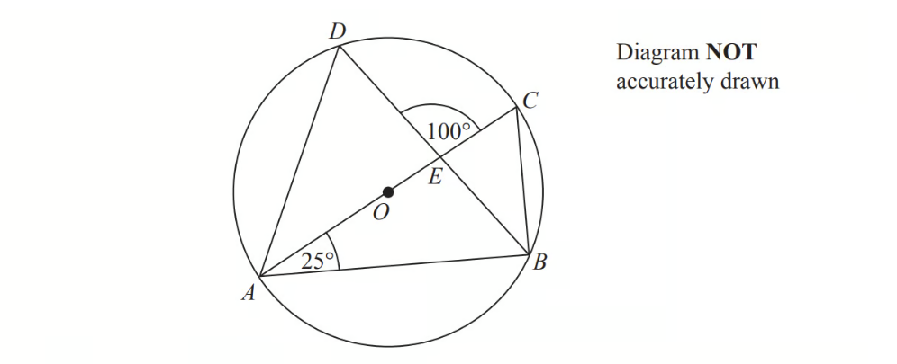

$A,B,C$ and $D$ are points on the circumference of a circle, centre $O$. 
$AC$ is a diameter of the circle.
 $AC$ and $BD$ intersect at E.

Angle $CAB=25^{\circ}$ 
Angle $DEC=100^{\circ}$

Work out the size of angle $DAC$. 
You must show all your working.

## Q32 — hard — 5 marks · exam-questions

### 20() — 5 marks — command: work_out — structured — from paper June 2016 · 1MA0/1H
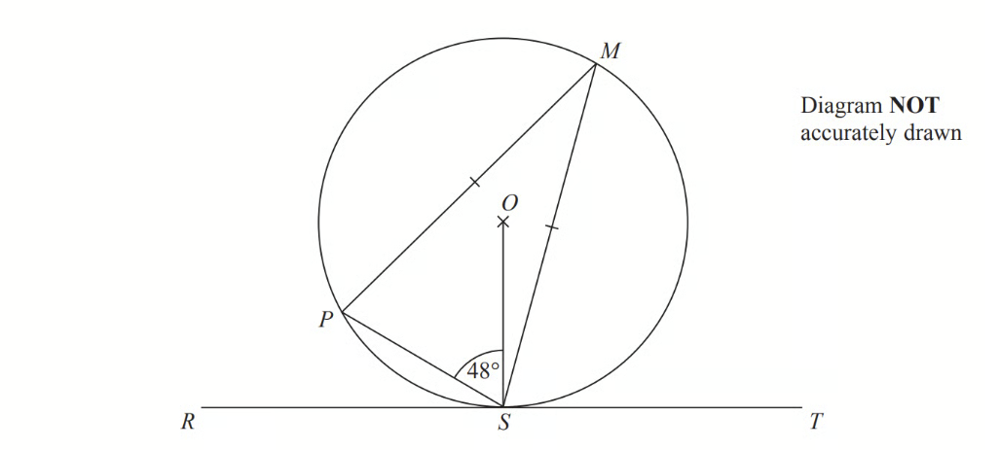

$P,M$ and $S$ are points on a circle, centre $O$. $RST$ is a tangent to the circle.

Angle $PSO=48^{\circ}$
 $MP=MS$

Work out the size of angle $MST$. 
Give reasons for each stage of your working.

## Q33 — hard — 5 marks · exam-questions

### 22() — 5 marks — command: work_out — structured — from paper June 2017 · 1MA0/1H
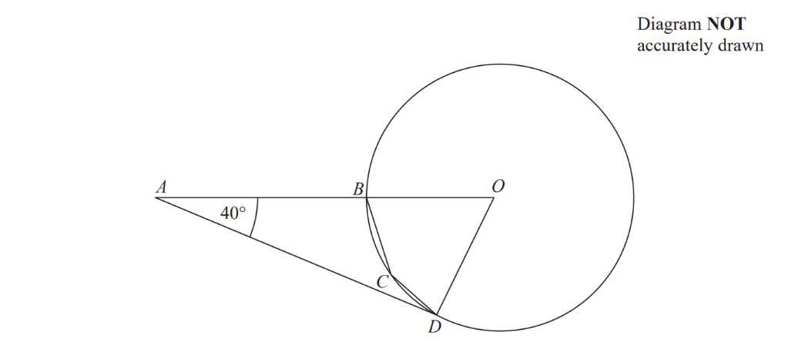

$B,C$ and $D$ are points on the circumference of a circle, centre $O$.
 $ABO$ is a straight line.
 $AD$ is the tangent at $D$ to the circle. 
Angle $DAO=40^{\circ}$

Work out the size of angle $BCD$. 
Give a reason for each stage of your working.

## Q34 — hard — 3 marks · exam-questions

### 1() — 3 marks — command: work_out — structured

$A$, $B$, $C$ and $D$ are points on a circle. $ABC$ and $EDC$ are straight lines.

Work out the length of $AB$.

## Q35 — hard — 5 marks · exam-questions

### 11() — 5 marks — command: find — structured — from paper June 2018 · 1MA1/1H
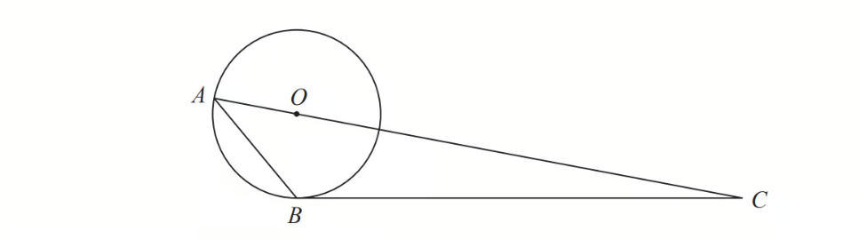

$A$ and $B$ are points on a circle, centre $O$.

$BC$ is a tangent to the circle.
 $AOC$ is a straight line. 
Angle $ABO=x^{\circ}$.

Find the size of angle $ACB$, in terms of $x$. 
Give your answer in its simplest form. 
Give reasons for each stage of your working.

## Q36 — hard — 3 marks · exam-questions

### 15() — 3 marks — command: prove — structured — from paper 2017	June · 1MA1/2H
$A,B,C$ and $D$ are four points on the circumference of a circle.

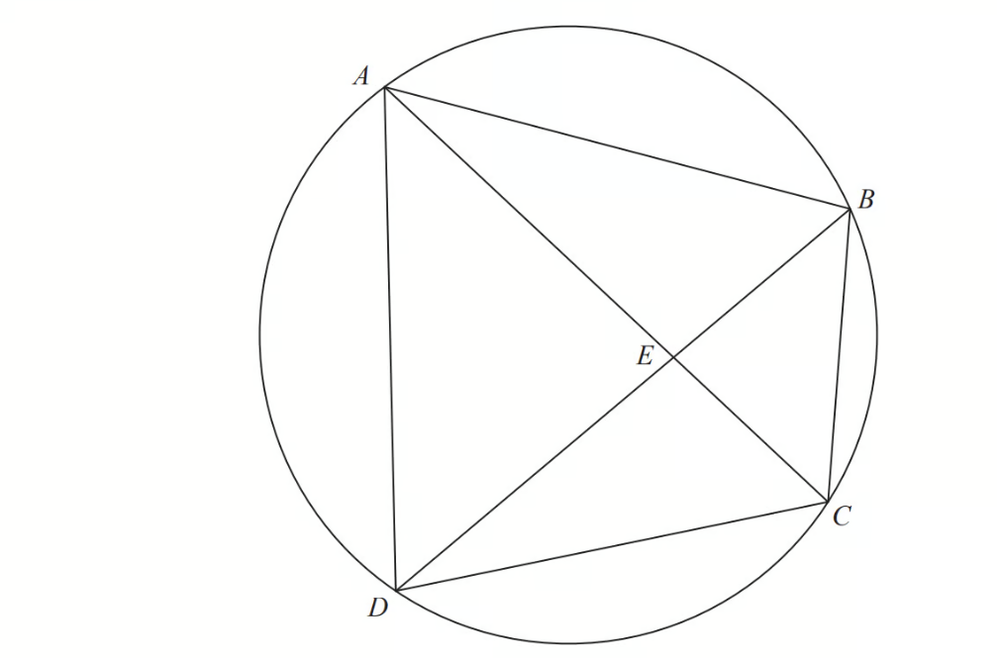

$AEC$ and $BED$ are straight lines. 
Prove that triangle $ABE$ and triangle $DCE$ are similar. 
You must give reasons for each stage of your working.

## Q37 — hard — 3 marks · exam-questions

### 1() — 3 marks — command: work_out — structured
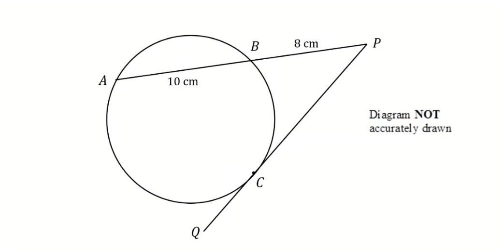

*A, B* and *C* are points on a circle.
 *ABP* is a straight line. 
*QCP* is a tangent to the circle.

*AB* = 10 cm                        *BP* = 8 cm

Work out the length of *CP*.

## Q38 — hard — 5 marks · exam-questions

### 1() — 5 marks — command: work_out — structured
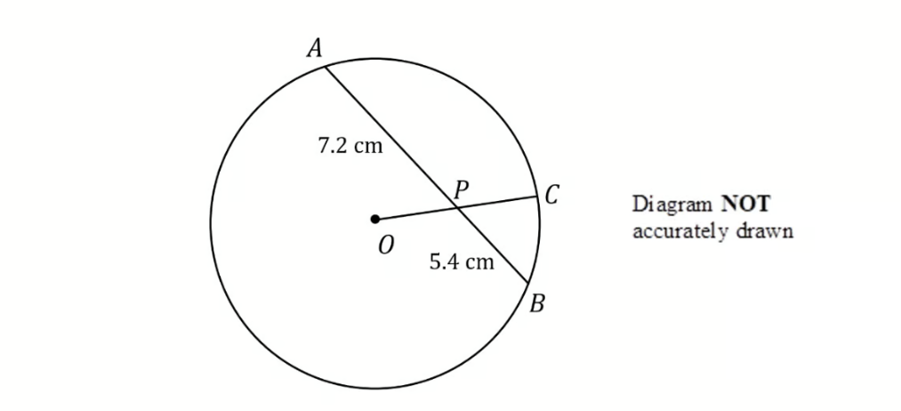

*A, B* and *C* are points on a circle, centre *O*. 
*OPC* is a straight line. 
*APB* is a chord of the circle, and bisects *OC* at the point *P*.

*AP* = 7.2 cm                     *PB* = 5.4 cm                     *OP = PC*.

Work out the area of the circle.

Give your answer correct to 3 significant figures.

## Q39 — hard — 7 marks · exam-questions

### 1() — 3 marks — command: prove — structured
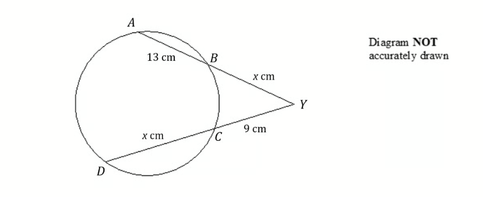

The points *A, B, C* and *D* lie on a circle.

*ABY* and *DCY* are straight lines.

*AB* = 13 cm               *BY *= x cm             *DC* = x cm              *CY* = 9 cm

Show that x2 + 4x – 81 = 0

### 2() — 4 marks — command: find — structured
Find the length of *DY*. 
Show your working clearly. 
Give your answer correct to 3 significant figures.

## Q40 — hard — 4 marks · exam-questions

### 14() — 4 marks — command: work_out — structured — from paper Jan 2021 · 4MA1/1HR
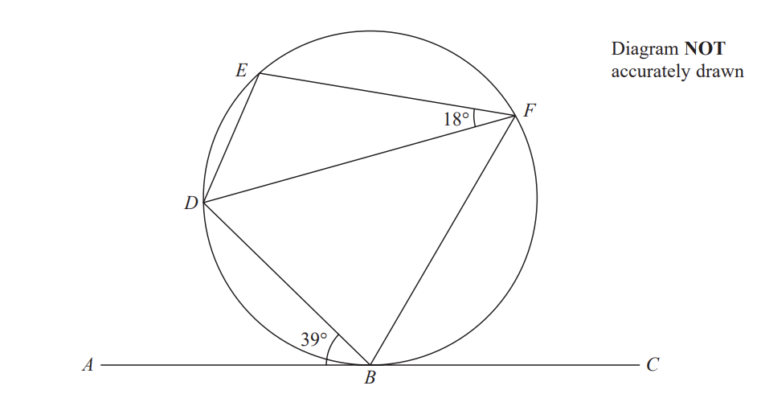

$B,D,E$ and $F$ are points on a circle.

$ABC$ is the tangent at $B$ to the circle. 
Angle $ABD=39^{\circ}$ 
Angle $EFD=18^{\circ}$

Work out the size of angle $BDE$. 
Give reasons for your working.

## Q41 — hard — 4 marks · exam-questions

### 20() — 4 marks — command: prove — structured — from paper Nov 2018 · 8300/1H
$P,Q,R$ and $S$ are points on a circle.

$PXR$and $QXS$are straight lines.
 $PX=SX$

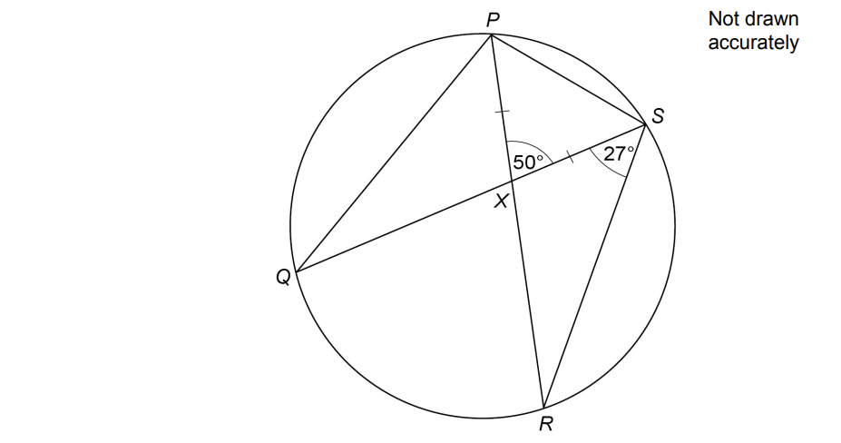

Prove that $QS$ is **not** a diameter of the circle.

## Q42 — hard — 3 marks · exam-questions

### 21() — 3 marks — command: prove — structured — from paper Specimen 2015 · 8300/1H
$A,B$and $C$ are points on a circle.

- $BC$ bisects angle $ABQ$.
- $PBQ$ is a tangent to the circle.

Angle $CBQ=x$

Prove that $AC=BC$

## Q43 — hard — 4 marks · exam-questions

### 16((a)) — 4 marks — command: calculate — structured — from paper Nov 2019 · J560/06
In the diagram,

- A, B and C are points on the circumference of a circle
- O is the centre of the circle
- angle OAB = 15°
- angle BCO = 10°.

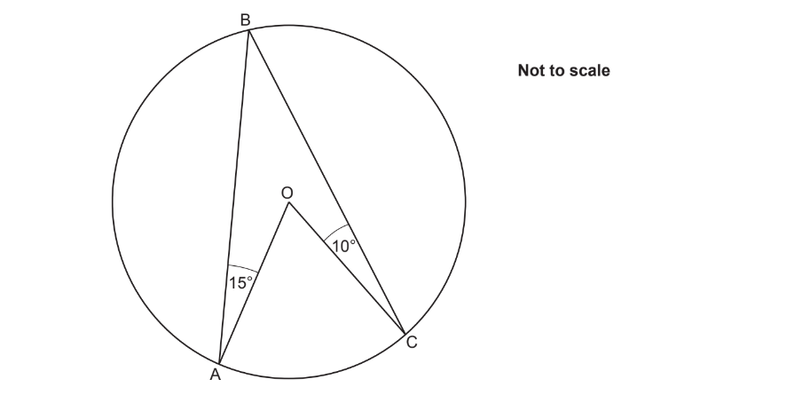

Calculate the acute angle AOC.

## Q44 — hard — 5 marks · exam-questions

### 16((a)) — 2 marks — command: work_out — structured — from paper Specimen 2015 · J560/04
A, B, C and D are points on the circumference of a circle, centre O. 
AC is a diameter of the circle. 
Angle ABD = 58°. 
Angle CDB = 22°.

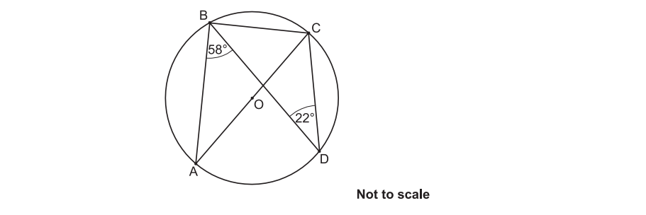

Work out the sizes of angle ACD and ACB, giving reasons for your answers.

Angle ACD = ...........................°

### 16((b)) — 3 marks — structured — from paper Specimen 2015 · J560/04
Angle ACB = ...........................°

## Q45 — very_hard — 5 marks · exam-questions

### 22() — 5 marks — command: prove — structured — from paper November 2015 · 1MA0/1H
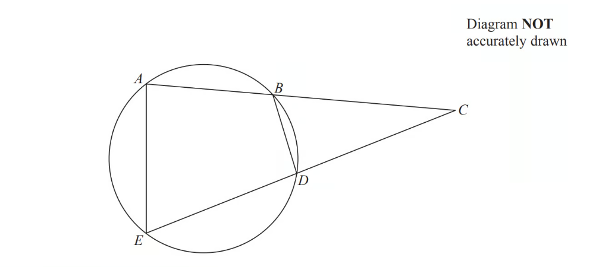

$A,B,D$ and $E$ are points on a circle.
 $ABC$ and $EDC$ are straight lines.

Prove that triangle $BCD$ is similar to triangle $ECA$. 
You must give reasons for your working.

## Q46 — very_hard — 4 marks · exam-questions

### 13((a)) — 3 marks — command: prove — structured — from paper June 2018 · 1MA1/2H
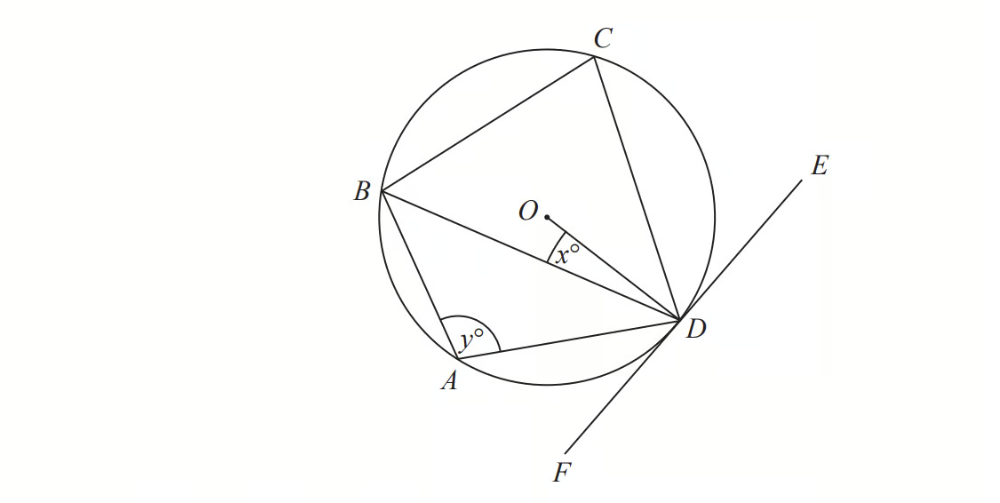

$A,B,C$ and $D$ are points on the circumference of a circle, centre $O$.
 $FDE$ is a tangent to the circle.

Show that $y-x=90$ 
You must give a reason for each stage of your working.

### 13((b)) — 1 mark — command: give — structured — from paper June 2018 · 1MA1/2H
Dylan was asked to give some possible values for $x$ and $y$.

He said, "$y$ could be 200 and $x$ could be 110, because 200 − 110 = 90"

Is Dylan correct? 
You must give a reason for your answer.

## Q47 — very_hard — 5 marks · exam-questions

### 20() — 5 marks — command: prove — structured — from paper 2015 Spec2 · 1MA1/2H
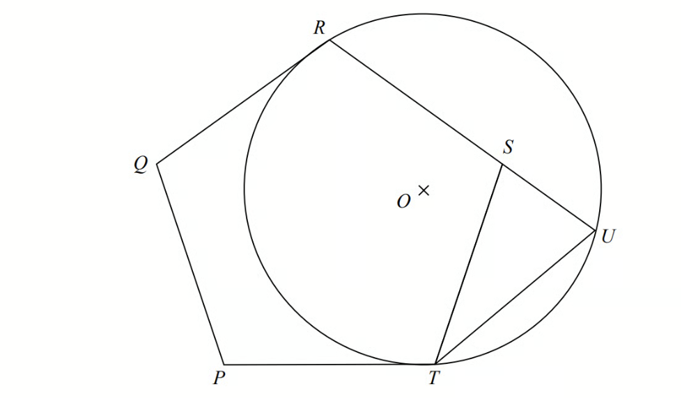

$PQRST$ is a regular pentagon.
 $R,U$ and $T$ are points on a circle, centre $O$.
 $QR$ and $PT$ are tangents to the circle.
$RSU$ is a straight line.

Prove that $ST=UT$.

## Q48 — very_hard — 6 marks · exam-questions

### 1() — 6 marks — command: work_out — structured
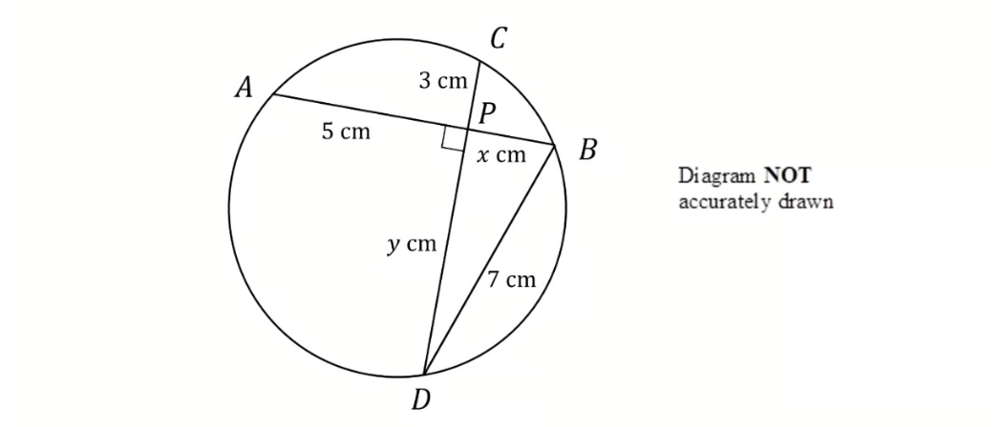

*A, B, C* and *D* are points on a circle. 
*APB, CPD,* and *BD *are chords of the circle. 
APB and *CPD *intersect perpendicularly at *P*.

| *BD* = 7 cm, | *AP* = 5 cm, | *CP* = 3 cm, | *PB* = x cm, | and | *PD* = y cm. |
|---|---|---|---|---|---|

Work out the values of x and y. 
Show your working clearly. 
Give your answers correct to 3 significant figures.

## Q49 — very_hard — 6 marks · exam-questions

### 1() — 6 marks — command: calculate — structured
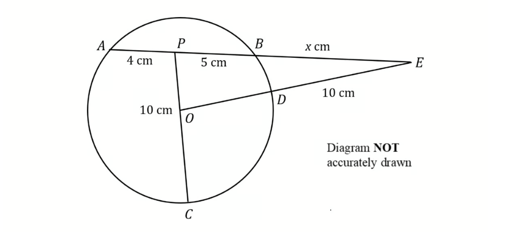

*A, B, C* and *D* are points on a circle, centre *O*. 
*APBE, COP* and *ODE *are straight lines.

*AP* = 4 cm, PB = 5 cm, CP = 10 cm, *DE *= 10 cm and *BE *= x cm

Work out the value of x. 
Show your working clearly.

## Q50 — very_hard — 5 marks · exam-questions

### 30() — 5 marks — command: prove — structured — from paper Nov 2020 · 4MA1/2HR
$A,B,D$ and $E$ are points on a circle.

$ABC$and $EDC$ are straight lines.

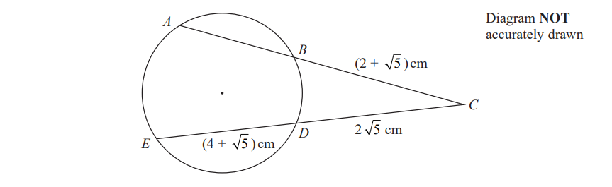

`table row cell B C space end cell equals cell space left parenthesis 2 space plus space square root of 5 space right parenthesis space cm space space end cell row cell E D space end cell equals cell space left parenthesis 4 space plus space square root of 5 space right parenthesis space cm space end cell row cell D C space end cell equals cell space 2 space square root of 5 space cm end cell end table`

Show that the length of $AB$ is $(p\sqrt{5}+q)\mathrm{cm},$ where $p$ and $q$ are integers whose values are to be found. 
Show your working clearly.

## Q51 — very_hard — 5 marks · exam-questions

### 23() — 5 marks — command: prove — structured — from paper Jan 2019 · 4MA1/2H
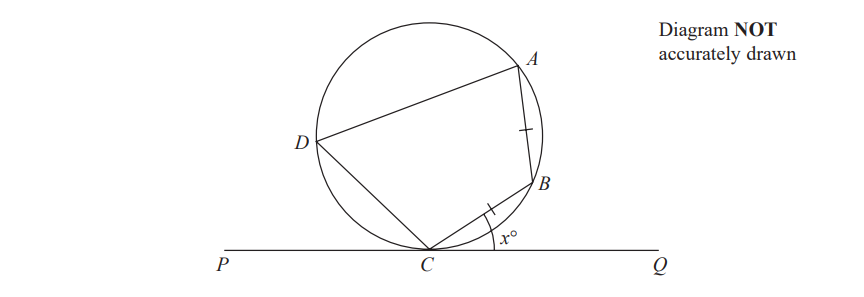

$A,B,C$ and $D$ are points on a circle.
 $PCQ$ is a tangent to the circle.
 $AB=CB.$

Angle $BCQ=x^{\circ}$

Prove that angle $CDA=2x^{\circ}$ 
Give reasons for each stage in your working.

## Q52 — very_hard — 4 marks · exam-questions

### 23() — 4 marks — command: work_out — structured — from paper June 2019 · 4MA1/1HR
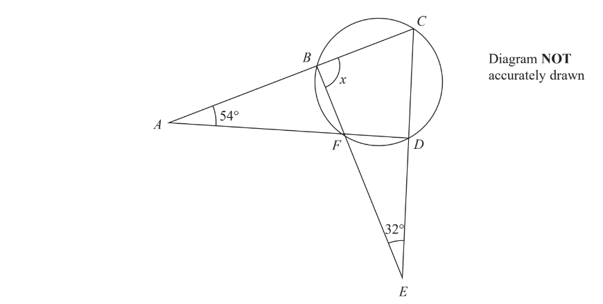

$B,C,D$ and $F$ are points on a circle.
 $ABC$, $AFD$, $BFE$and $CDE$are straight lines.

Work out the size of angle $x$. 
Show your working clearly.

$x$ = ......................

## Q53 — very_hard — 6 marks · exam-questions

### 22() — 6 marks — command: work_out — structured — from paper June 2018 · 4MA1/2H
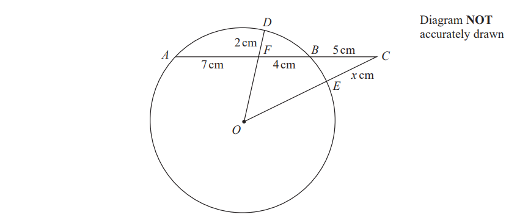

$A,D,B$ and $E$ are points on a circle, centre $O$.
 $AFBC$, $OEC$ and $OFD$ are straight lines.

$AF=7\mathrm{cm},FB=4\mathrm{cm},BC=5\mathrm{cm},FD=2\mathrm{cm} \mathrm{and}CE=x\mathrm{cm}.$

Work out the value of $x$. 
Show your working clearly.

$x=$.......................................................

## Q54 — very_hard — 5 marks · exam-questions

### 22() — 5 marks — command: work_out — structured — from paper Jan 2019 · 4MA1/1HR
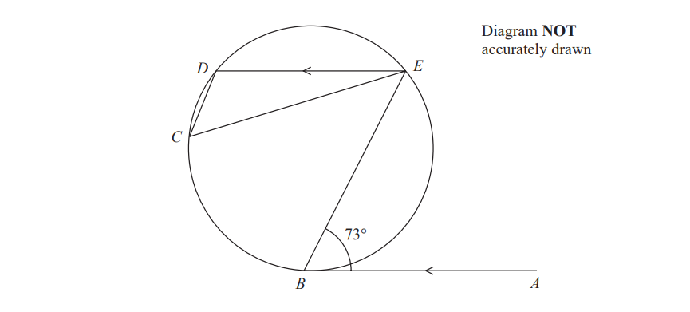

$B,C,D$ and $E$ are points on a circle.

$AB$ is the tangent at $B$ to the circle. 
$AB$ is parallel to $ED$. 
$\mathrm{Angle}ABE=73^{\circ}$

Work out the size of angle $DCE$. 
Give a reason for each stage of your working.

## Q55 — very_hard — 5 marks · exam-questions

### 20() — 5 marks — command: calculate — structured — from paper Jan 2021 · 4MA1/2HR
$A,B$ and $C$ are points on a circle with centre $O$.

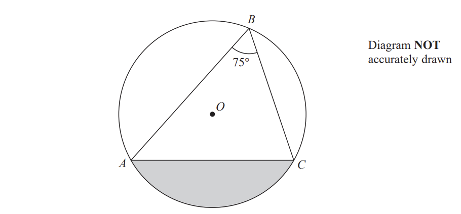

Angle $ABC=75^{\circ}$

The area of the shaded segment is 200cm2

Calculate the radius of the circle. 
Give your answer correct to 3 significant figures.

...................................................... cm

## Q56 — very_hard — 4 marks · exam-questions

### 29() — 4 marks — command: prove — structured — from paper Nov 2021 · 8300/3H
$A,B$ and $C$ are three points on the circumference of a circle, centre $O$.

$BD$ and $CD$ are tangents to the circle. 
$ABDC$ is a kite. 
Angle $BDC$ is $x$

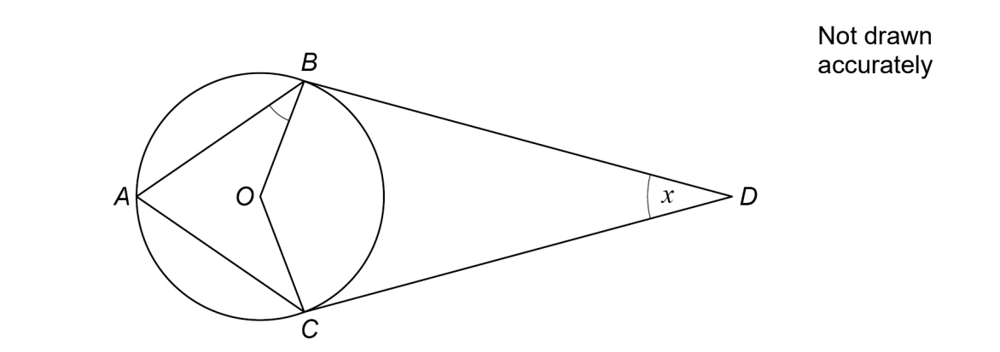

Prove that angle $ABO$is  $45^{\circ}--\frac{x}{4}$

## Q57 — very_hard — 4 marks · exam-questions

### 25() — 4 marks — command: prove — structured — from paper Nov 2019 · 8300/2H
$C,D$ and $E$ are points on a circle.

$CE=DE$ 
The tangent at $D$ is shown. 
$ACD$ and $BCE$ are straight lines.

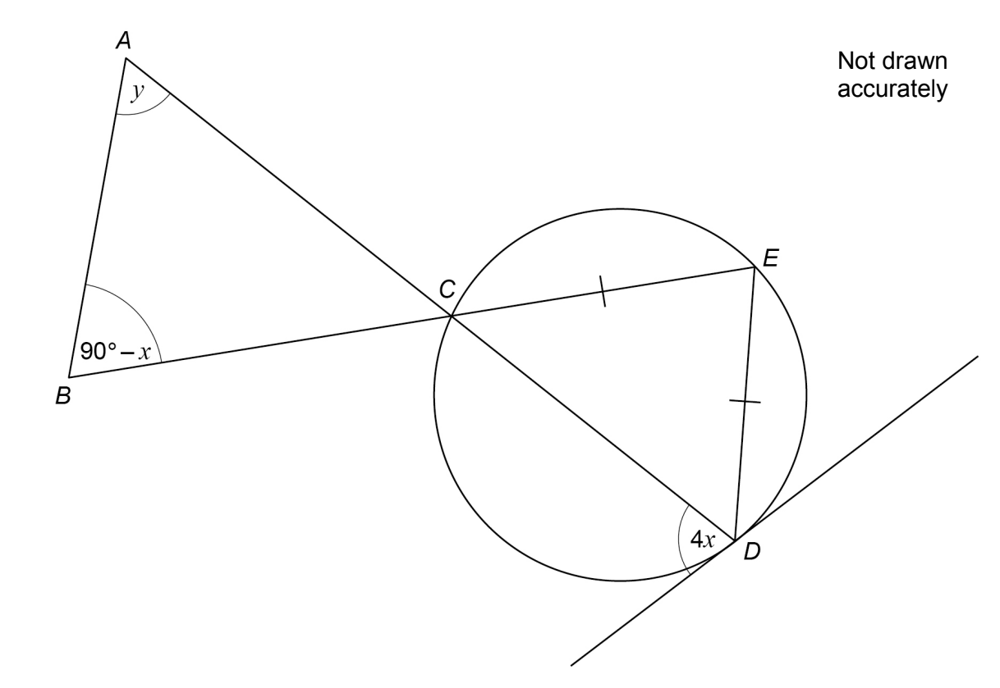

Prove that   $y=3x$

## Q58 — very_hard — 5 marks · exam-questions

### 20((a)) — 4 marks — command: prove — structured — from paper June 2019 · 8300/1H
$A,B$ and $C$ are points on a circle.

$CD$ is a tangent.

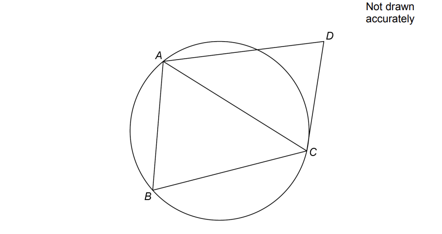

Assume that triangle $ABC$ is isosceles with $AC=BC$

Prove that $AB$ is parallel to $DC$.

### 20((b)) — 1 mark — command: tick — structured — from paper June 2019 · 8300/1H
In fact, triangle $ABC$ is equilateral.

Tick the **two **boxes for the statements that **must **be correct.

| `square` | $AB$ is parallel to $DC$ |
|---|---|
| `size 26px square` | $AC$ bisects angle $BCD$ |
| `size 26px square` | $AC$ bisects angle $BAD$ |

## Q59 — very_hard — 4 marks · exam-questions

### 24() — 4 marks — command: work_out — structured — from paper Nov 2017 · 8300/1H
Here is a cyclic quadrilateral.

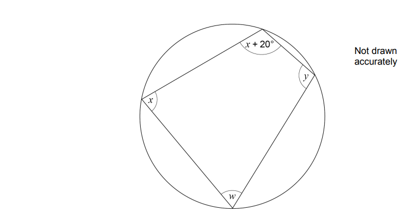

$x:y=5:7$

Work out the size of angle $w$.

.....................degrees

## Q60 — very_hard — 4 marks · exam-questions

### 19() — 4 marks — command: work_out — structured — from paper June 2017 · 8300/3H
$A,B,C,D$ and $E$ are points on a circle.

$BFD$ and $AFC$ are straight lines.

$DC=DF$

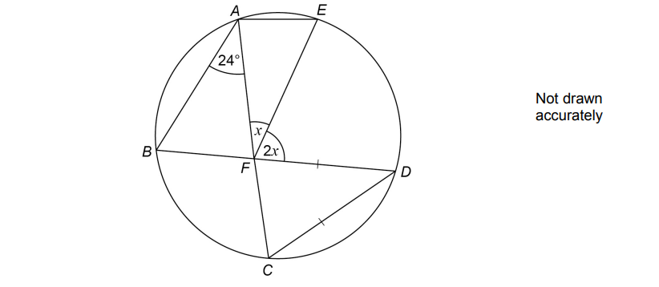

Work out the size of angle$x$.

You **must **show your working which may be on the diagram.

..........................degrees

## Q61 — very_hard — 7 marks · exam-questions

### 16((a)) — 4 marks — command: prove — structured — from paper June 2019 · J560/05
A, B, C and D are points on the circumference of a circle, centre O.

Angle BAD = 112° and angle DCO = 33°.

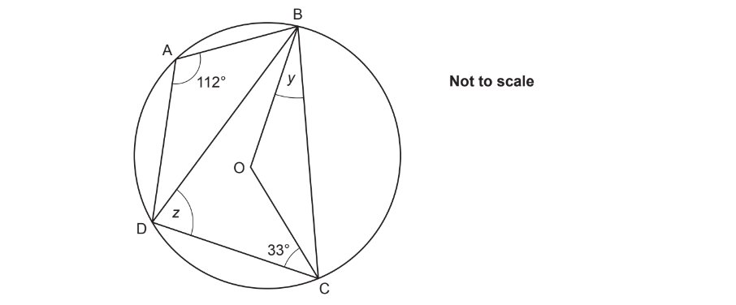

Show that angle *y* = 35°. 
Give reasons for each stage of your working.

### 16((b)) — 3 marks — command: work_out — structured — from paper June 2019 · J560/05
Work out angle ***z***.

Give reasons for your answer.

Angle z = ......................... ° because ........................................................................................

## Q62 — very_hard — 5 marks · exam-questions

### 8() — 5 marks — command: calculate — structured — from paper June 2018 · J560/04
A, B, C and D are points on the circumference of a circle, centre O.

Angle CAD = 28° and CD = 6.4cm. 
BD is a diameter of the circle.

Calculate the area of the circle.

...................... cm2
