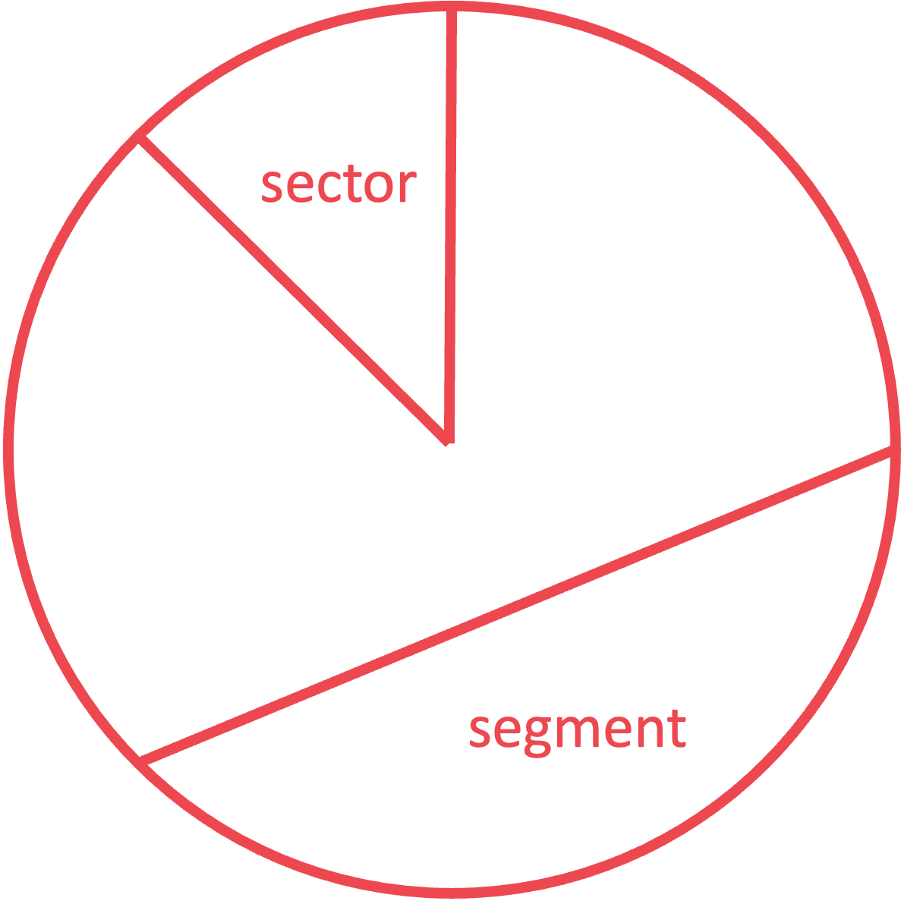
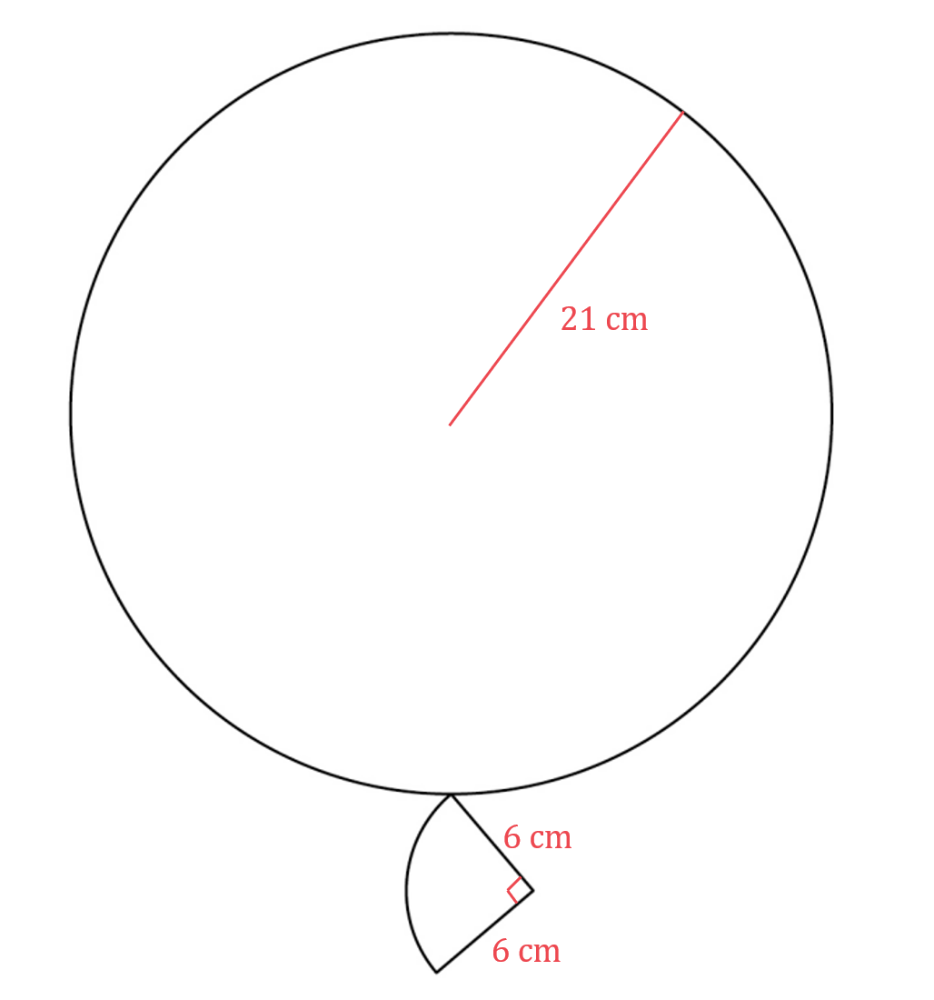
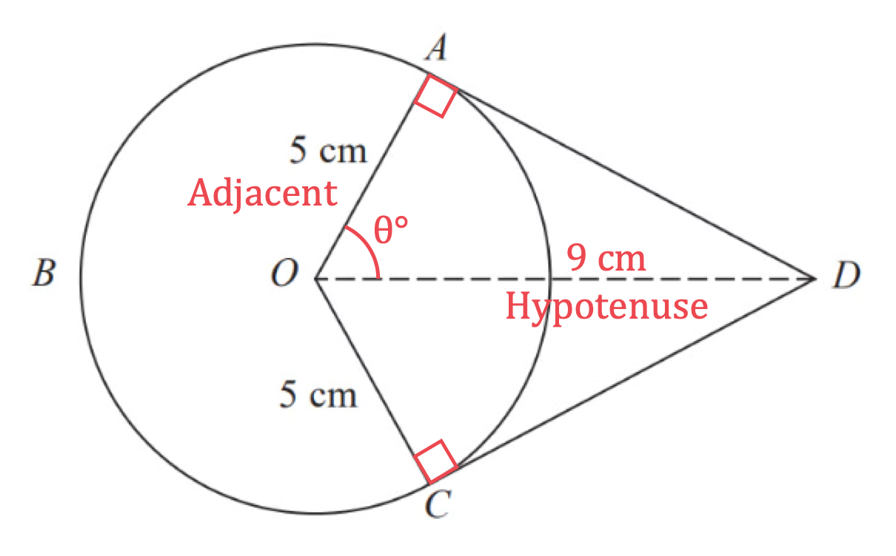
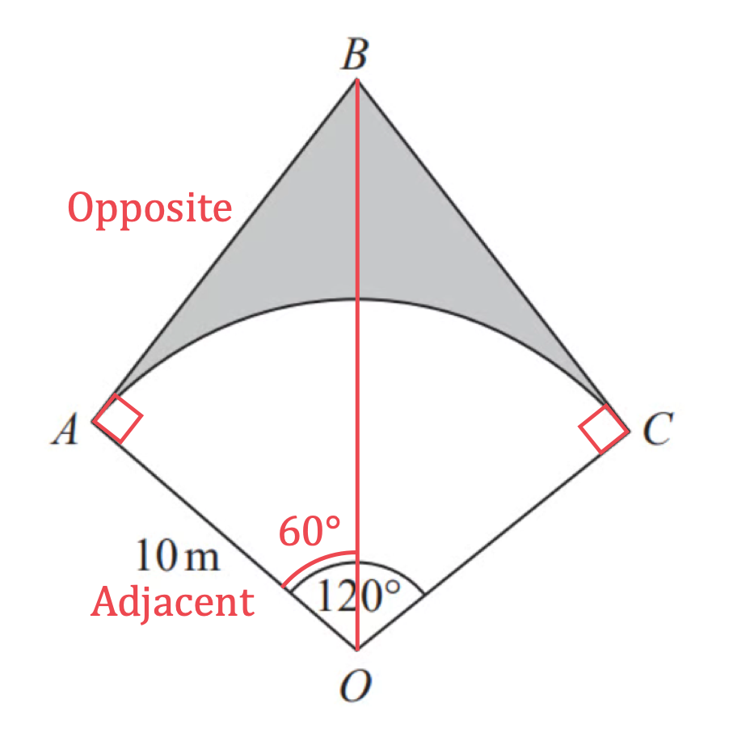
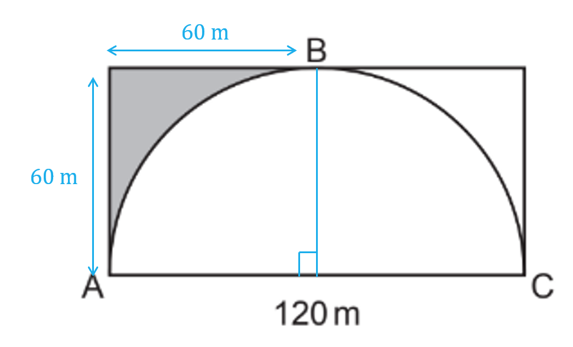
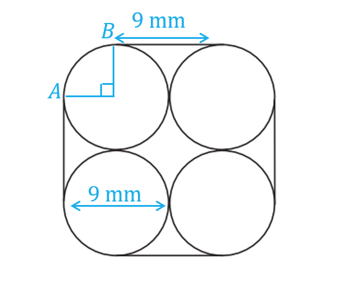
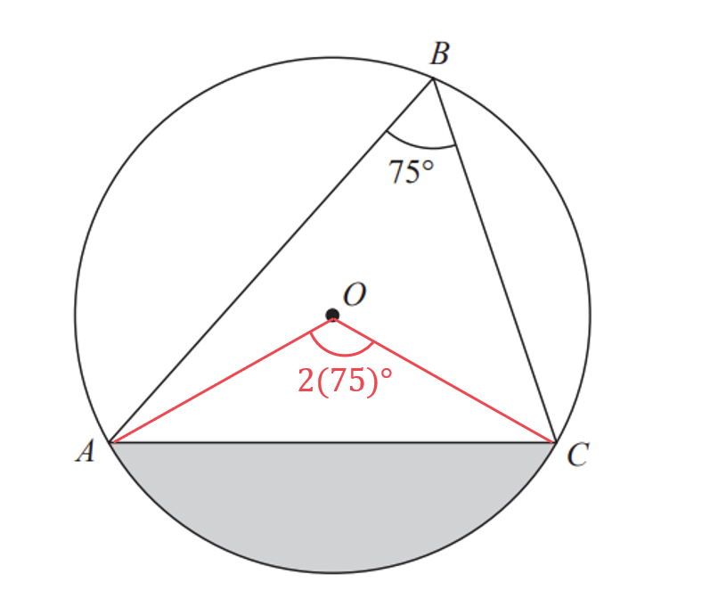
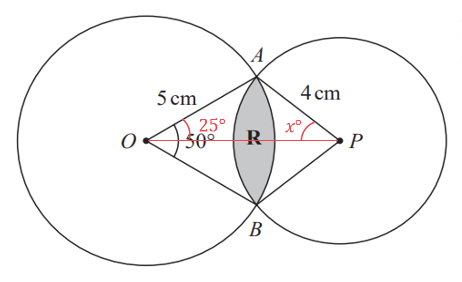
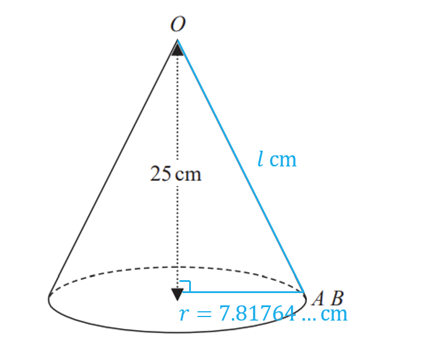
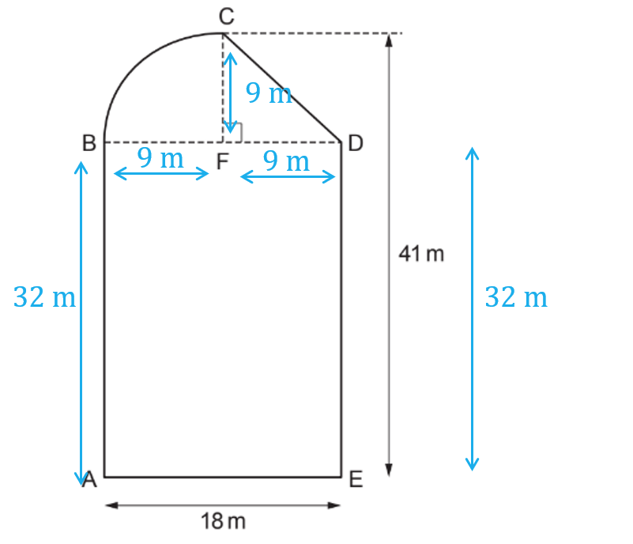

# Mark Schemes — Circles, Arcs & Sectors
**Geometry & Trigonometry** · Edexcel IGCSE Maths A (4MA1) — 18/Higher

## Q1 — easy — 2 marks · exam-questions

### 12() — 2 marks
> *The formula for the circumference of a circle is *$2πr=\mathrm{πd}$*. Use the *$π$* button on your calculator or "3.142"*

$π\times140=439.82297...$* *

**[1]**

> *Round the answer to 3 significant figures.*

> *The third non-zero digit is 9 and the digit following it is 8, which is 5 or more so you will need to round the 9 up. However this cannot be rounded up, so round the digit before it up instead and set the third digit to zero.*

`43 right enclose 9. bottom enclose 8 2297... space equals space 440 space open parentheses 3 space s. f. close parentheses`

**440 cm ****[1]**

## Q2 — easy — 2 marks · exam-questions

### 4() — 2 marks
> *The formula for the circumference of a circle is *$2πr=\mathrm{πd}.$* Use the *$π$* button on your calculator or "3.142"*

$π\times9=28.275433...$* *

**[1]**

> *Round the answer to 3 significant figures. The third non-zero digit is 2 and the digit following it is 7, which is 5 or more so you will need to round the 2 up. *

`28. right enclose 2 bottom enclose 7 5433... space equals space 28.3 space open parentheses 3 space s. f. close parentheses`

**28.3 cm ****[1]**

## Q3 — easy — 2 marks · exam-questions

### 19() — 2 marks
> *Formula for area of a sector *$=\frac{θ}{360^{\circ}}\timesπr^{2}$*.*

> *Substitute the given values into the formula, letting *$θ=30$* and *$r=15$*.*

$\frac{30}{360}\timesπ\times15^{2}$

**[1]**

> *Use your calculator to find the answer. *

`table row cell 1 over 12 open parentheses 225 close parentheses pi space space end cell equals cell space space 75 over 4 pi italic space end cell row blank equals cell 58.90486... space space end cell end table`

**Area = 58.9 cm****2 ****(3 s.f.)**** [1] Answers in the range 58.8 to 58.9125 accepted**

## Q4 — easy — 2 marks · exam-questions

### 17() — 2 marks
*The arc length of a sector (the length of the curved side) with radius *$r$* and angle *$θ$*° is *$\frac{θ}{360}\times2πr$*.* *Find the arc length by substituting *$θ=40$* and *$r=7$* into the formula.*

$\frac{40}{360}\times2π\times7=\frac{14}{9}π=4.886921...$

**[1]**

> *Round the answer to 3 significant figures.*

> *The third non-zero digit is 8 and the digit following it is 6, which is 5 or more so you will need to round the 8 up. *

`4.8 right enclose 8 bottom enclose 6 921... space equals space 4.89 space open parentheses 3 space s. f. close parentheses`

**4.89 cm ****[1] Answers in the range 4.8 - 4.9 accepted**

## Q5 — easy — 2 marks · exam-questions

### 16() — 2 marks
*The arc length of a sector (the length of the curved side) with radius *$r$* and angle *$θ$*° is *$\frac{θ}{360}\times2πr$*.* *Find the size of the reflex angle **AOC** by subtracting 100° from 360°.*

$\mathrm{Reflex} \mathrm{angle}AOC=360-100=260^{\circ}$

> *Find the arc length **ABC** by substituting *$θ=260$* and *$r=4$* into the formula.*

$\frac{260}{360}\times2π\times4=\frac{52}{9}π=18.15142...$

**[1]**

> *Round the answer to 3 significant figures.*

> *The third non-zero digit is 1 and the digit following it is 5, which is 5 or more so you will need to round the 1 up. *

`18. right enclose 1 bottom enclose 5 142... space equals space 18.2 space open parentheses 3 space s. f. close parentheses`

**18.2 cm ****[1] Answers in the range 18.1 - 18.2 accepted**

## Q6 — easy — 2 marks · exam-questions

### 11() — 2 marks
> *Formula for area of a sector *$=\frac{θ}{360^{\circ}}\timesπr^{2}$*.*

> *Substitute the given values into the formula, letting *$θ=110$* and *$r=7.1$*.*

$\frac{110}{360}\timesπ\times7.1^{2}$

**[1]**

> *Use your calculator to find the answer. *

`table row cell 11 over 36 open parentheses 7.1 squared close parentheses pi space space end cell equals cell space space 48.39012... space space end cell end table`

> *Round the answer to 1 decimal place by looking at the second digit, it is greater than 4 so round the first digit after the decimal point up. *

`table row blank blank cell 48. bottom enclose right enclose 3 9 end enclose 3012... space end cell end table`

**Area = 48.4 cm****2 ****(1 d.p.)**** [1] Answers in the range 48.3 to 49.2 accepted**

## Q7 — easy — 2 marks · exam-questions

### 12() — 2 marks
*The arc length of a sector (the length of the curved side) with radius *$r$* and angle *$θ$*° is *$\frac{θ}{360}\times2πr$*.* *Find the arc length by substituting *$θ=50$* and *$r=7$* into the formula.*

`50 over 360 space cross times space 2 straight pi space cross times space 7 space equals space 5 over 36 open parentheses 14 straight pi close parentheses space equals space 35 over 18 straight pi space equals space 6.10865...`

**[1]**

> *Round the answer to one decimal place.*

> *The first digit after the decimal point is 1 and the digit following it is 0, which is less than 5 you do not need to round the 1 up. *

`6. right enclose 1 bottom enclose 0 865... space equals space 6.1 space open parentheses 1 space d. p. close parentheses`

**6.1 cm ****[1] Answers in the range 6.05 - 6.2 accepted**

## Q8 — easy — 3 marks · exam-questions

### 10() — 3 marks
> *The shaded area is formed by subtracting the area of the smaller semi-circle from the area of the larger semi-circle.*

> *Calculate the radius of the larger circle by dividing the diameter by 2.*

$\frac{12}{2}=6\mathrm{cm}$

> *Calculate the area of the larger semi-circle, using: *$A=\frac{1}{2}πr^{2}$*.*

`table row A equals cell 1 half open parentheses straight pi cross times open parentheses 6 close parentheses squared close parentheses end cell row blank equals cell 36 over 2 straight pi space cm squared end cell row blank equals cell space 18 straight pi space cm squared end cell end table`

> *The question asks for the answer as a multiple of π, so it is best to leave you working as a multiple of π.*

**[1]**

> *The radius of the smaller semi-circle is 2 cm less than the radius of the larger semi-circle.*

> *Calculate the radius of the smaller semi-circle.*

$6-2=4\mathrm{cm}$

> *Calculate the area of the smaller semi-circle, using: *$A=\frac{1}{2}πr^{2}$*.*

`table row A equals cell 1 half open parentheses straight pi cross times open parentheses 4 close parentheses squared close parentheses end cell row blank equals cell 16 over 2 straight pi space cm squared end cell row blank equals cell space 8 straight pi space cm squared end cell end table`

**[1]**

> *Find the area of the shaded section by subtracting the area of the smaller semi-circle from the area of the larger semi-circle.*

`table row A equals cell 18 straight pi space minus space 8 straight pi end cell row blank equals cell 10 straight pi end cell end table`

> *The question asks for the answer as a multiple of π, so there is no need to calculate the answer any further.*

**Area = 10π cm****2**** ****[1]**

## Q9 — easy — 1 marks · exam-questions

### 3() — 1 marks
> *The arc length of a sector (the length of the curved side) with radius *$r$* and angle *$θ$*° is *$\frac{θ}{360}\times2πr$*. A semicircle has an angle of 180° (as it is half of a full circle). Find the arc length by substituting *$θ=180$* and *$r=6$* into the formula.*

`180 over 360 space cross times space 2 pi space cross times space 6 space equals space 1 half open parentheses 12 pi close parentheses space equals space 6 pi`

**The correct answer in option 2, 6****π ****metres  ****[1]**

## Q10 — easy — 1 marks · exam-questions

### 5() — 1 marks
> *The formula for the circumference of a circle is *$2πr=\mathrm{πd}$*. So *$C=πd$*.*

$π=3.141592...$* *

> *The question asks for the value of the constant **k, **so you should set this equal to **π **in your answer, it is not enough to give the answer *$C=πd.$* *

$k=π$** ****[1] Answers in the range 3.14 - 3.142 accepted**

## Q11 — easy — 2 marks · exam-questions

### 7() — 2 marks
> *The area of the quarter circle can be found by finding the area of the full circle with the same radius and dividing by 4.*

> *Calculate the area of the full circle, using: *$A=πr^{2}$*.*

`table row A equals cell straight pi cross times open parentheses 6 close parentheses squared end cell row blank equals cell 36 straight pi space cm squared end cell end table`

**[1]**

> *Find the area of the quarter circle by dividing the area of the full circle by 4.*

`table row cell A space end cell equals cell space fraction numerator 36 straight pi over denominator 4 end fraction end cell end table`

> *Leave your answer as a multiple of π.*

**Area = 9π cm****2**** ****[1]**

## Q12 — easy — 2 marks · exam-questions

### 2((a)) — 2 marks
> *Formula for area of a circle*$=πr^{2}$*.*

> *Substitute the given radius into the formula. The question asks for the answer as a multiple of **π **so you do not need to multiply by **π.*

*Area = *$π\times70^{2}$

**[1]**

> *Use your calculator to find the value of 70**2**, do not multiply by **π.*

**Area = 4900****π**** cm****2**** [1]**

## Q13 — easy — 1 marks · exam-questions

### 1() — 1 marks
> *Make sure you are clear on the difference between a **segment** and a **sector**.*

> *A **segment** is bound by an **arc **and a** chord**. The shaded part is a **segment**.*

> *(A **sector** **is bound by an arc and two radii)*

**segment**** ****[1]**

## Q14 — medium — 3 marks · exam-questions

### 5() — 3 marks
> *To fit perfectly around the edge of the garden, the fence will be the length of the **circumference **of the circle.*

> *The formula for the circumference of a circle is *$2πr=πd.$* Use the *$π$* button on your calculator or "3.142", substituting 5 for the diameter, **d.*

`pi space cross times space 5 space equals 5 straight pi italic space open parentheses equals space 15.70796 space... close parentheses`* *

**[1]**

> *Using the exact answer (5π) in the next part of the problem will maintain accuracy for the final answer.*

> *The fence costs £1.80 per metre and is 5π metres long. Find the total cost by multiplying 5π metres by £1.80.*

`5 straight pi space cross times space 1.8 space equals space 9 straight pi space equals space open parentheses 28.27433... close parentheses`

**[1]**

> *To give the answer in  £, round the answer to 2 decimal places.*

> *The second decimal place (digit after the decimal point) is 7 and the digit following it is 4, which is less than 5 so you do not need to round up.*

`28. right enclose 27 433... space equals space 28.27 space open parentheses 2 space d. p. close parentheses`

**£28.27 ****[1]**

## Q15 — medium — 3 marks · exam-questions

### 12() — 3 marks
> *The shaded area can be found by first finding the area of all four corners and then dividing by 4 to find the area of just one corner.*

> *To find the area of all four shaded corners subtract the area of the circle from the area of the square.*

> *The formula for the area of a circle is πr**2**. This is a non calculator paper so leave all working in terms of π as you go.*

`A r e a subscript open parentheses c i r c l e close parentheses end subscript space equals space pi space cross times space 6 squared space equals 36 straight pi`* *

**[1]**

> *Find the area of the square.*

`A r e a subscript open parentheses s q u a r e close parentheses end subscript space equals space 12 squared space equals space 144`

> *The area of all four corners = Area (square) - Area (circle). Leave your answer in terms of π as you go.*

`A r e a subscript open parentheses s q u a r e close parentheses end subscript space minus space space A r e a subscript open parentheses c i r c l e close parentheses end subscript space equals space 144 space minus space 36 straight pi`

**[1]**

> *To find the area of the one shaded corner, divide this by 4.*

`A r e a subscript open parentheses s h a d e d close parentheses end subscript space equals space fraction numerator 144 space minus space 36 straight pi over denominator 4 end fraction`

> *Simplify by dividing 144 and 36 by 4 separately.*

`A r e a subscript open parentheses s h a d e d close parentheses end subscript space equals space 144 over 4 space minus space 36 over 4 straight pi space equals space 36 space minus space 9 straight pi`

$36-9π$** ****[1]**
** The unsimplified answer of **$\frac{144-36π}{4}$** is also accepted.**

## Q16 — medium — 3 marks · exam-questions

### 12() — 3 marks
> *The shaded area can be found by subtracting the area of the circle from the area of the square.*

> *Find the area of the circle, the formula for the area of a circle is πr**2**. As the side of the square is a tangent to the circle, the diameter of the circle is equal to a side of the square. Find the radius of the circle by dividing the diameter (= 10 cm) by 2.*

$r=10\div2=5\mathrm{cm}$

> *This is a non calculator paper so leave all working in terms of π as you go.*

`A r e a subscript open parentheses c i r c l e close parentheses end subscript space equals space pi space cross times space 5 squared space equals 25 straight pi`* *

**[1]**

> *Find the area of the square.*

`A r e a subscript open parentheses s q u a r e close parentheses end subscript space equals space 10 squared space equals space 100`

> *The area of the shaded region = Area (square) - Area (circle). Leave your answer in terms of π as you go.*

`A r e a subscript open parentheses s q u a r e close parentheses end subscript space minus space space A r e a subscript open parentheses c i r c l e close parentheses end subscript space equals space 100 space minus space 25 straight pi`

**[1]**

> *This cannot be simplified further. It could be factorised to 25(4 - π) but this is not necessary for the answer.*

$100-25π$** ****[1]**

## Q17 — medium — 4 marks · exam-questions

### 11() — 4 marks
> *The diameter of the cake is given in inches and the ribbon length is given in cm. Use the given ratio (1 inch = 2.54 cm) to convert the diameter of the cake into cm. *

`d subscript open parentheses c m close parentheses end subscript space equals space 7 space cross times space 2.54 space cm space space equals 17.78 space cm`

**[1]**

> *To fit perfectly around the edge of the cake, the ribbon will be the length of the **circumference **of the circle.*

> *The formula for the circumference of a circle is *$2πr=πd.$* Use the *$π$* button on your calculator or "3.142", substituting 17.78 in for the diameter, **d.*

$C=π\times17.78=55.85751...$* *

**[1]**

> *One length of ribbon is 50 cm which is **less than **the circumference of the cake (55.857... cm).*

$55.85751...\mathrm{cm}>50\mathrm{cm}$

**[1]**

**No, one length of ribbon is not long enough to go around the cake ****[1] **
**Working must be shown for all marks.**

## Q18 — medium — 3 marks · exam-questions

### 3((a)) — 2 marks
> *The distance from one point to the next will be the length of one eighth of the **circumference **of the circle.*

> *The formula for the circumference of a circle is *$2πr=πd.$* *
*Use the *$π$* button on your calculator or "3.142", substituting 80 for the diameter, **d.*

`C space equals space pi space cross times space 80 space equals 80 straight pi italic space open parentheses equals space 251.32741 space... close parentheses`* *

**[1]**

> *Divide this by 8 to find the distance from one point to the next.*

`80 straight pi space divided by space 8 space equals space 10 straight pi space space open parentheses equals space 31.415926... close parentheses`

> *Round the answer to 3 significant figures.*

**31.4 m ****[1] **
**Answers in range 31.4 to 31.5 and exact answer accepted**

### 3((b)) — 1 marks
> *The mean distance that Hasmeet walks will be the total distance around the circle (80π) divided by the number of points.*

$Mean=\frac{totaldis\mathrm{tan}ce}{numberofpoints}=\frac{80π}{8}$* *

**Final answer:** ** ****No, the mean has not changed as the total distance and the number of points are both still the same. ****[1]**

## Q19 — medium — 4 marks · exam-questions

### 12() — 4 marks
> *Use *$\frac{θ}{360}\timesπr^{2}$* to find the angle*

`table row cell theta over 360 cross times pi cross times 7 squared end cell equals 40 row theta equals cell fraction numerator 40 cross times 360 over denominator pi cross times 7 squared end fraction end cell row blank equals cell 93.54... end cell end table`

**correct equation [1]**

**correct angle [1]**

> *Use *$\frac{θ}{360}\times2πr$* to find the arc length*

`table row cell fraction numerator 93.54... over denominator 360 end fraction cross times 2 pi cross times 7 end cell equals cell 80 over 7 end cell row blank equals cell 11.42... end cell end table`

**[1]**

> *Add the two radii*

$11.42...+7+7=25.42...$

> *Round to 3 significant figures*

**25.4 cm (3sf)** **[1]**

## Q20 — medium — 4 marks · exam-questions

### 16() — 4 marks
> *Form an equation to find the radius of the circle using the formula for length of an arc *$=\frac{θ^{\circ}}{360^{\circ}}\times2πr$*. *
*Find an expression for the length of the arc in terms of *$r$*, **by substituting *$θ=55$*.*

$\frac{55}{360}\times2\timesπ\timesr$

> *Form an equation by setting it equal to 5 cm.*

$\frac{11}{36}πr=5$

**[1]**

> *Solve the equation to find the radius of the circle.*

`table row cell 11 over 36 pi space r space end cell equals cell space 5 end cell row cell pi space r space end cell equals cell fraction numerator 5 cross times 36 over denominator 11 end fraction end cell row cell space space r space end cell equals cell space fraction numerator 180 over denominator 11 pi end fraction end cell row cell r space end cell equals cell space 5.208707.... end cell end table`

> *Find the area of the circle using the formula for the area of a circle, *$A=πr^{2}$*.*

$\mathrm{Area}=π\times5.208707...^{2}$

**[1]**

> *Use your calculator to find the answer, using the answer button to keep accuracy. *

`table row cell Area space end cell equals cell space 85.233391... space cm squared end cell end table`

> *Round the answer to one decimal place.*

> *The first digit after the decimal point is 2 and the digit following it is 3, which is less than 5 you do not need to round the 2 up. *

`85. right enclose 2 bottom enclose 3 3391... space equals space 85.2 space open parentheses 1 space d. p. close parentheses`

**Area = 85.2 cm****2 ****(1 d.p.)**** [1] **
**Answers in the range 84.9 to 85.4 accepted**

## Q21 — medium — 3 marks · exam-questions

### 8() — 3 marks
> *Calculate the arc length of the smaller (inner) semi-circle by using the formula for the perimeter of a semi-circle: *`P space equals space 1 half open parentheses 2 straight pi r close parentheses`*where *$r$* is the radius of the circle.*

`table row cell straight L e ngth subscript s m a l l space a r c end subscript end cell equals cell 1 half cross times 2 cross times straight pi cross times 7 end cell end table`

**[1]**

`table row cell Length subscript s m a l l space a r c end subscript end cell equals cell 7 straight pi space cm end cell end table`

> *The radius of the larger semi-circle is 2 cm more than the radius of the smaller semi-circle.*

> *Calculate the radius of the larger semi-circle.*

$7+2=9\mathrm{cm}$

> *Calculate the arc length of the larger (outer) semi-circle by using the formula for the perimeter of a semi-circle: *`P space equals space 1 half open parentheses 2 straight pi r close parentheses`*where *$r$* is the radius of the circle.*

`table row cell straight L e ngth subscript l a r g e space a r c end subscript end cell equals cell 1 half cross times 2 cross times straight pi cross times 9 end cell end table`

`table row cell Length subscript l a r g e space a r c end subscript end cell equals cell 9 straight pi space cm end cell end table`

> *Calculate the perimeter of the shaded segment by adding the arc lengths together along with the lengths of the straight edges joining them (2 cm each). *

`table row P equals cell 7 straight pi plus 9 straight pi plus 2 plus 2 end cell end table`

**[1]**

`table row P equals cell 54.26548... space cm end cell end table`

> *Round to one decimal place.*

> *The first digit after the decimal point is 2 and the digit following it is 6, which is 5 or more you will need to round the 2 up. *

`54. right enclose 2 bottom enclose 6 548... space equals space 54.3 space open parentheses 1 space d. p. close parentheses`

**54.3 cm ****[1] **
**Answers in the range 54.2 - 54.3 accepted**

## Q22 — medium — 4 marks · exam-questions

### 1() — 4 marks
Find the area of the circle

$π\times6.5^{2}=132.732...$

**[M1]**

Find the area of the trapezium using the correct formula

`fraction numerator open parentheses 10 plus 16 close parentheses cross times h space over denominator 2 end fraction equals 13 h`

**[M1]**

Equate the area of the circle and the area of the trapezium and solve for *h*

`table row cell 13 h end cell equals cell 132.732... end cell row cell h space end cell equals cell 10.210... end cell end table`

**[M1]**

$h=10.2$

**[A1]**

> **[mark-scheme]**
> **M1**: For finding the area of the circle using $π \times 6 . 5^{2}$
> 
> **M1**: For setting up the trapezium area formula $\frac{(10+16)\timesh}{2}$
> 
> **M1**: For equating the two areas and solving for $h$.
> 
> **A1**: For the final answer of $h = 10 . 2$ rounded correctly to 1 decimal place.

> **[exam-tip]**
> Do not round any intermediate values during your working — only round at the very end when giving your final answer. Premature rounding can lead to an inaccurate result.

## Q23 — medium — 4 marks · exam-questions

### 11() — 4 marks
> *The angle of the minor sector is given, but the perimeter of the major sector is needed, so find the angle of the major sector by subtracting the smaller angle from 360°.*

`table row cell theta space end cell equals cell space 360 space minus space 40 space equals space 320 degree end cell end table`

**[1]**

> *Calculate the arc length of the major sector using the formula for the arc length of a sector: *$\mathrm{Arc} \mathrm{length}=\frac{θ^{\circ}}{360^{\circ}}\times2πr$*, where *$r$* radius of the circle and *$θ$* is the angle of the major sector.*

`table row cell Arc space length space end cell equals cell space 320 over 360 cross times 2 cross times straight pi cross times 9 end cell end table`

**[1]**

`table row cell Arc space length space end cell equals cell space 16 straight pi space cm end cell end table`

> *Calculate the perimeter of the shaded sector by adding the arc length to the lengths of the straight edges joining them, they are both radiuses so equal to 9 cm. *

`table row P equals cell 16 straight pi space plus space 9 space plus space 9 end cell end table`

**[1]**

`table row cell P space end cell equals cell space 68.26548... space cm end cell end table`

> *Round to 3 significant figures.*

$68.3\mathrm{cm}$* ***[1]**

**Answers in the range 68.2 - 68.3 will be accepted**

## Q24 — medium — 3 marks · exam-questions

### 5() — 3 marks
> *Calculate the area of the semi-circle using the formula *$A=\frac{1}{2}\mathrm{πr}^{2}$*.*

`table row cell Area space end cell equals cell 1 half cross times straight pi cross times 7.2 squared end cell row blank equals cell 25.92 straight pi space straight m squared end cell end table`

**[1]**

> *Work out the number of boxes of seed that Yuen needs by dividing the area of his garden by the area that each box can cover.*

`table row cell fraction numerator 25.92 straight pi over denominator 6 end fraction equals space 4.32 straight pi space equals space 13.57... end cell end table`

**[1]**

*Yuen needs 14 boxes to cover the whole garden*

**13.57 > 12, Yuen does not have enough boxes **
**Correct answer supported by working**** [1]**

## Q25 — medium — 5 marks · exam-questions

### 12((a)) — 1 marks
*First divide the radius of the circle by the number representing it in the ratio.*

$21\div7=3$

> *Multiply this by the ratio part for the radius of the quarter circle.*

$3\times2=6$

**21 mm ÷ 7 × 2 = 6 mm**** [1]**

### 12((b)) — 4 marks
> *The total length of the wire in the earring will be the sum of the circumference of the circle, the arc length of the quarter circle and the two straight edges on the quarter circle.*

> *Calculate the circumference of the circle using the formula *$C=2πr$*.*

`table row cell C space end cell equals cell space 2 pi cross times open parentheses 21 close parentheses end cell row blank equals cell space 42 pi space mm end cell end table`

**[1]**

> *The question requires the answer in a particular form so leave your working as a multiple of **π.*

> *The arc length of the quarter circle can be found by finding the circumference of the full circle with the same radius and dividing by 4. Find the arc length of the quarter circle.*

`table row cell Arc space length space end cell equals cell space fraction numerator 2 pi open parentheses 6 close parentheses over denominator 4 end fraction space equals space fraction numerator 12 pi over denominator 4 end fraction space equals space 3 pi end cell end table`

**[1]**

> *Add the two answers together and add on the straight lines (both radii of the quarter circle, so both equal to 6 cm). Leave your answer as a multiple of **π**.*

`table row cell Total space length space end cell equals cell space 42 pi italic space plus space 3 pi space plus space 6 space plus space 6 end cell end table`

**[1]**

> *Simplify by collecting like terms.*

**Length of wire = 45****π**** + 12 mm ****[1]**

## Q26 — medium — 4 marks · exam-questions

### 9() — 4 marks
> *The unshaded area can be found by subtracting the area of the semi-circle from the area of the circle.*

> *Find the area of the circle, the formula for the area of a circle is *$πr^{2}$*.*

> *It's best to keep your working in terms of *$π$* to preserve the accuracy of your final answer.*

`A r e a subscript open parentheses c i r c l e close parentheses end subscript space equals space pi space cross times space 10 squared space equals 100 pi`* *

**[1]**

> *Find the area of the shaded region (semicircle) using the formula *$\frac{1}{2}πr^{2}$*. The radius of the semicircle is half of the diameter of the semicircle.*

`A r e a subscript open parentheses s e m i c i r c l e close parentheses end subscript space equals space 1 half pi open parentheses 8 over 2 close parentheses squared space equals space 1 half pi open parentheses 4 close parentheses squared space equals space 16 over 2 pi space equals space 8 pi`

**[1]**

> *The area of the unshaded region = Area (circle) - Area (semicircle).*

`A r e a subscript open parentheses c i r c l e close parentheses end subscript space minus space space A r e a subscript open parentheses s e m i c i r c l e close parentheses end subscript space equals space 100 pi space minus space 8 pi space equals space 92 pi`

**[1]**

> *So the shaded area is 8**π **and the unshaded area is 92**π.  **Find how many times 92**π **is bigger than 8**π **by dividing 92 by 8.*

$\frac{92π}{8π}=\frac{92}{8}=11.5$

**The unshaded area is 11.5 times bigger than the shaded area ****[1]**

## Q27 — medium — 2 marks · exam-questions

### 16() — 2 marks
> *Formula for area of a sector *$=\frac{θ}{360^{\circ}}\timesπr^{2}$*.*

> *Substitute the given values into the formula for each sector. For sector** A**, let *$θ=x$* and *$r=1.5r$*.*

`space x over 360 space space cross times space pi space space cross times space open parentheses 1.5 r close parentheses squared space`

**[1]**

> *Simplify the expression for the area of sector A.*

$\frac{1.5^{2}r^{2}x}{360}π=\frac{r^{2}x}{160}π$

> *For sector B, let *$θ=2x$* and *$r=r$*.*

$\frac{2x}{360}\timesπ\timesr^{2}$

> *Simplify the expression for the area of sector B.*

$\frac{2r^{2}x}{360}π=\frac{r^{2}x}{180}π$

> *Compare the expressions by comparing both fractions.*

$\frac{r^{2}x}{160}π>\frac{r^{2}x}{180}π$

**A is bigger ****[1] **
**Clear working must be shown**

## Q28 — medium — 4 marks · exam-questions

### 8() — 4 marks
> *The shaded area can be found by subtracting the area of the two quarter circles from the area of the rectangle.*

> *Find the area of the rectangle by multiplying its length by its width. The width of the rectangle is equal to the radius of the quarter circles, which is equal to half of the length of the rectangle.*

`Area subscript open parentheses rectangle close parentheses end subscript space equals space 12 space cross times open parentheses 12 over 2 close parentheses space equals space 12 space cross times space 6 space equals space 72 space cm squared`* *

**[1]**

> *Find the area of a circle with a radius of 6m, the formula for the area of a circle is **π**r**2**.*

`Area subscript open parentheses circle close parentheses end subscript space equals space pi space cross times space 6 squared space equals space 36 pi`* *

**[1]**

> *The two quarter circles are identical, so they can be added together to make one single semicircle. Find the area of the semicircle by dividing the area of the circle by 2.*

`Area subscript open parentheses semicircle close parentheses end subscript space equals 36 over 2 pi space equals space 18 pi`

**[1]**

> *The area of the shaded region = Area (rectangle) - Area (semicircle).*

`Area subscript open parentheses rectangle close parentheses end subscript space minus space space Area subscript open parentheses semicircle close parentheses end subscript space equals space 72 space minus 18 pi`

**Shaded area = 72 - 18****π ****cm****2**** ****[1] **
**Answers in the range 15.4 to 15.5 cm****2**** accepted.**

## Q29 — medium — 3 marks · exam-questions

### 12() — 3 marks
> *The circle is inscribed in the square, with the edges of its circumference touching each edge of the square. So the diameter of the circle is equal to the side of the square. *

> *Find the side of the square, *$x$* using the formula for the area of a square, *$A=x^{2}$*.*

`table row cell x to the power of 2 space end exponent end cell equals cell space 64 end cell row cell x space end cell equals cell space square root of 64 space equals space 8 space cm end cell end table`

**[1]**

> *The formula for the area of a circle is **πr**2**. The diameter of the circle is equal to the side of the square, divide this by 2 to find the radius of the circle. *

$\mathrm{radius}=8\div2=4\mathrm{cm}$* *

> *Find the area of the circle.*

`Area subscript open parentheses circle close parentheses end subscript space equals space pi r squared space equals space pi open parentheses 4 close parentheses to the power of 2 space end exponent`

**[1]**

> *Leave your answer in terms of **π**.*

**Area = **$16π$** cm****2**** ****[1]**

## Q30 — medium — 3 marks · exam-questions

### 13() — 3 marks
> *Calculate the arc length of the large semicircle using the formula for the arc length of a sector: *$\mathrm{Arc} \mathrm{length}=\frac{θ^{\circ}}{360^{\circ}}\times2πr$*, where *$r$* radius of the circle and *$θ$* is the angle of the sector.*

`table row cell Arc space length subscript l a r g e space s e m i c i r c l e end subscript end cell equals cell 180 over 360 cross times 2 cross times straight pi cross times 8 end cell row blank equals cell 1 half cross times 2 cross times straight pi cross times 8 space equals space 8 straight pi end cell end table`

**[1]**

> *Calculate the arc length of the smaller semicircle in terms of **t**. *

`table row cell Arc space length subscript s m a l l space s e m i c i r c l e end subscript end cell equals cell 180 over 360 cross times 2 cross times straight pi cross times t end cell row blank equals cell space t straight pi end cell end table`

**[1]**

> *Find the length of the straight edges by subtracting the diameter of the smaller semicircle from the diameter of the larger semicircle.*

*Diameter***large semicircle ****= ***2 × 8 = 16 cm *
*Diameter***small  semicircle ****= ***2 × ***t*** = 2***t*** cm*

*Length of straight edges = 16 - 2***t*** cm*

> *Calculate the perimeter of the shaded segment by adding the arc lengths together along with the lengths of the straight edges. *

`table row cell bold italic P bold space end cell bold equals cell bold space bold 8 bold pi bold space bold plus bold space bold italic t bold pi bold space bold plus bold space bold 16 bold space bold minus bold space bold 2 bold italic t bold space bold cm end cell end table`* ***[1]**

## Q31 — medium — 5 marks · exam-questions

### 8() — 5 marks
> *Calculate the arc length of the large sector using the formula for the arc length of a sector: *$\mathrm{Arc} \mathrm{length}=\frac{θ^{\circ}}{360^{\circ}}\times2πr$*, where *$r$* radius of the circle and *$θ$* is the angle of the sector.*

`table row cell Arc space length subscript l a r g e space s e c t o r end subscript end cell equals cell 45 over 360 cross times 2 cross times straight pi cross times 6 end cell end table`

**Correct fraction**** [1] **
**Correct formula**** [1]**

`table row cell Arc space length subscript l a r g e space s e c t o r end subscript end cell equals cell 1.5 straight pi space cm end cell end table`

> *Find the radius of the smaller sector by subtracting 3.5 from 6 cm.*

`table row cell r subscript s m a l l space s e c t o r end subscript end cell equals cell space 6 space minus space 3.5 space equals space 2.5 space cm end cell end table`

> *Calculate the arc length of the smaller sector. *

`table row cell Arc space length subscript s m a l l space s e c t o r end subscript end cell equals cell 45 over 360 cross times 2 cross times straight pi cross times 2.5 end cell row blank equals cell 0.625 straight pi space cm end cell end table`

**[1]**

> *Calculate the perimeter of the shaded segment by adding the arc lengths together along with the lengths of the straight edges joining them. *

`table row cell P space end cell equals cell space 1.5 straight pi space plus space 0.625 straight pi space plus space 3.5 space plus space 3.5 end cell end table`

**[1]**

`table row P equals cell 13.6758843... space cm end cell end table`

> *Round to 3 significant figures.*

$13.7\mathrm{cm}$* ***[1]**

## Q32 — medium — 3 marks · exam-questions

### 5() — 3 marks
> *The diameter of each circle is *$20\mathrm{cm}$

> *The circumference of each full circle would be*

$π\times20=62.83...$

**[M1]**

> *Divide by *$2$* to get the length of each curved part of the semicircle *

$62.83...\div2=31.41...$

> *There are three semicircles so find the total of the curved parts*

$31.41...\times3=94.24...$

> *Add on the two straight lines*

$94.24...+10+10=114.24...$

**[M1]**

> *Round to the nearest whole number*

$114$

**[A1]**

> **[mark-scheme]**
> Working is not required, so correct answer scores full marks.

## Q33 — hard — 5 marks · exam-questions

### 11() — 5 marks
> *Find the radius, *$r$*, of the large semi-circle by dividing the diameter by 2.*

`table row r equals cell 9 over 2 end cell row blank equals cell 4.5 space straight m end cell end table`

> *Calculate the arc length of the larger semi-circle, using the formula for the circumference of a circle: *$C=2πr$*, and multiplying the result by *$\frac{1}{2}$*.*

`table row cell Arc space length end cell equals cell 1 half cross times 2 cross times straight pi cross times 4.5 end cell end table`

**[1]**

`table row cell Arc space length end cell equals cell 4.5 straight pi space straight m end cell end table`

> *Find the radius of the smaller semi-circle by dividing its diameter by 2.*

`table row r equals cell 5 over 2 end cell row blank equals cell 2.5 space straight m end cell end table`

> *Calculate the arc length of the smaller semi-circle.*

`table row cell Arc space length space end cell equals cell 1 half cross times 2 cross times straight pi cross times 2.5 end cell row blank equals cell 2.5 straight pi space straight m end cell end table`

> *Work out the perimeter of the lawn by adding together the arc length of both semi-circles and the lengths of the straight edges connecting them.*

`table row P equals cell 4.5 straight pi plus 2.5 straight pi plus 2 end cell end table`

**[1]**

`table row P equals cell 7 straight pi plus 4 end cell row blank equals cell 25.991148... end cell end table`

> *Work out the number of rolls that Brian needs by dividing the perimeter of his lawn by the length of edging in 1 roll.*

`table row blank blank cell fraction numerator 25.991148... over denominator 2.4 end fraction end cell row blank equals cell 10.8296... end cell end table`

**[1]**

*Brian needs 11 rolls*

> *Work out the cost of the 11 rolls that Brian needs.*

*9 rolls at 3 rolls for £10  2 rolls at £3.99 each*

*Total cost = 3 x 10 + 2 x 3.99*

**[1]**

*= £37.98*

> *Compare the cost with the money that Brian has.*

**Final answer:** **£37.98 > £35, Brian does not have enough money**

**Correct answer supported by working**** [1]**

## Q34 — hard — 4 marks · exam-questions

### 11() — 4 marks
> *Calculate the space available on one table for seating by finding the circumference of one table, using the formula: *$C=πd$*, where *$d$* is the diameter of the table.*

`table row cell Total space space space end cell equals cell straight pi cross times 140 end cell end table`

**[1]**

`table row blank equals cell 439.82297... space cm end cell end table`

**Circumference between 439 - 440**** [1]**

> *Divide the space available by the space required for one person to work out how many people can be seated at each table.*

`table attributes columnalign right center left columnspacing 0px end attributes row blank blank cell fraction numerator 439.82287... over denominator 60 end fraction end cell row blank equals cell 7.33038... end cell end table`

*7 people can be seated at each table*

> *Multiply the number of people that can be seated at each table by the number of tables to find the total number of people that can be seated.*

`table row blank blank cell 12 cross times 7 end cell row blank equals 84 end table`

**[1]**

**84 < 90****, there are ****not enough tables ****in the conference room ****[1]**

## Q35 — hard — 5 marks · exam-questions

### 17() — 5 marks
> *Work out the size of the angle **QON**.*

*Angle ***QON*** = 60**o**  ** (Triangle ***ABO*** is an equilateral triangle)*

**[1]**

> *Calculate the area of the sector **ONQ**, using the formula: *$A=\frac{θ^{\circ}}{360^{\circ}}\timesπr^{2}$*, where *$r$* is the radius and *$θ$* is the angle of the sector.*

`table row A equals cell 60 over 360 cross times straight pi cross times 11 squared end cell end table`

**[1]**

`table row A equals cell 121 over 6 straight pi space cm squared end cell end table`

*Calculate the area of the triangle **ABO**, using the formula:** *$A=\frac{1}{2}ab\mathrm{sin}C$*, where *$a$* and *$b$* are two sides of the triangle and *$C$* is the angle between the two sides.*

$A=\frac{1}{2}\times7\times7\times\mathrm{sin}60$

**[1]**

$A=\frac{49\sqrt{3}}{4}\mathrm{cm}^{2}$

> *Work out the area of the shaded section by subtracting the area of triangle **ABO** from the area of the sector **QON.*

`table row cell A subscript s h a d e d end subscript end cell equals cell 121 over 6 straight pi minus fraction numerator 49 square root of 3 over denominator 4 end fraction end cell row blank equals cell 42.1378... space cm squared end cell end table`

> *Divide the shaded area by the total area of the sector **ONQ** and multiply by 100% to find the percentage of the total shape that is shaded.*

`table row blank blank cell fraction numerator 42.1378... over denominator 121 over 6 straight pi end fraction cross times 100 end cell end table`

**[1]**

`table attributes columnalign right center left columnspacing 0px end attributes row blank equals cell 66.510186... end cell end table`

> *Round to 1 decimal place.*

`bold 66 bold. bold 5 bold percent sign`* ***[1]**

## Q36 — hard — 4 marks · exam-questions

### 11() — 4 marks
> *Calculate the area of the circle, using the formula: *$A=πr^{2}$*, where *$r$* is the radius of the circle.*

$r=6\mathrm{cm}$

$A_{circle}=π\times6^{2}$

**[1]**

$A_{circle}=36π\mathrm{cm}^{2}$

> *AC** and **BD** are the diagonals of the square, as such they intersect at the centre, **O**, at right angles. This makes triangle **ABO** a right-angled triangle.*

> *Calculate the length **AB**, using Pythagoras' theorem, *$a^{2}+b^{2}=c^{2}$*.*

`table row cell 6 squared plus 6 squared end cell equals cell A B squared end cell row 72 equals cell A B squared end cell row cell square root of 72 end cell equals cell A B end cell end table`

> *Calculate the area of the square.*

`table row cell A subscript s q u a r e end subscript end cell equals cell square root of 72 cross times square root of 72 end cell end table`

**[1]**

`table row cell A subscript s q u a r e end subscript end cell equals cell 72 space cm squared end cell end table`

> *Subtract the area of the square from the area of the circle to find the area that is shaded in the diagram.*

`table row cell A subscript s h a d e d end subscript end cell equals cell 36 straight pi minus 72 end cell end table`

**[1]**

`table row cell A subscript s h a d e d end subscript end cell equals cell 41.09733... space cm squared end cell end table`

> *Round to 3 significant figures.*

$41.1\mathrm{cm}^{2}$* ***[1]**

**Answers between 41.04 - 41.112 will be accepted**

## Q37 — hard — 4 marks · exam-questions

### 4() — 4 marks
> *Calculate the area of the outer circle, using the formula: *$A=πr^{2}$*, where *$r$* is the radius of the circle.*

`table row r equals cell 4 plus 3 plus 3 equals 10 space cm end cell end table`

$A_{outer}=π\times10^{2}$

**[1]**

$A_{outer}=100π\mathrm{cm}^{2}$

> *Calculate the area of the middle circle.*

$r=4+3=7\mathrm{cm}$

`table row cell A subscript m i d d l e end subscript end cell equals cell straight pi cross times 7 squared end cell row blank equals cell 49 straight pi space cm squared end cell end table`

> *Calculate the area of the inner circle.*

`table row cell A subscript i n n e r end subscript end cell equals cell straight pi cross times 4 squared end cell row blank equals cell 16 straight pi space cm squared end cell end table`

> *Calculate the area of the shaded ring by subtracting the area of the inner circle from the area of the middle circle.*

`table row cell A subscript s h a d e d end subscript end cell equals cell 49 straight pi minus 16 straight pi end cell end table`

**[1]**

`table row cell A subscript s h a d e d end subscript end cell equals cell 33 straight pi space cm squared end cell end table`

**Correct values for area of outer circle and shaded area**** [1]**

> *Find the fraction of the shape that is shaded by dividing the area of the shaded ring by the area of the outer circle.*

`table row cell fraction numerator 33 straight pi over denominator 100 straight pi end fraction end cell equals cell 33 over 100 end cell end table`

$\frac{33}{100}\neq\frac{1}{3}$*, ***Daisy is not correct**** [1]**

**It is best to leave your values in terms of **$π$** throughout, but you will still get the marks if you use the value of 3 (or better) instead**

## Q38 — hard — 3 marks · exam-questions

### 7() — 3 marks
> *Calculate the area of the quarter circle, by using the formula for the area of a circle: *$A=πr^{2}$*, where *$r$* radius of the circle, and multiplying the result by *$\frac{1}{4}$*.*

`table row cell A subscript q u a r t e r space c i r c l e end subscript end cell equals cell 1 fourth cross times straight pi cross times 4.8 squared end cell end table`

**[1]**

`table row cell A subscript q u a r t e r space c i r c l e end subscript end cell equals cell 5.76 straight pi space cm squared end cell end table`

> *Calculate the area of the triangle, using the formula: *$A=\frac{1}{2}bh$*, where *$b$* is the base of the triangle and *$h$* is the perpendicular height.*

`table row cell A subscript t r i a n g l e end subscript end cell equals cell 1 half cross times 4.8 cross times 4.8 end cell row blank equals cell 11.52 space cm squared end cell end table`

> *Calculate the shaded segment by subtracting the area of the triangle from the area of the quarter circle.*

`table row cell A subscript s h a d e d end subscript end cell equals cell 5.76 straight pi minus 11.52 end cell end table`

**[1]**

`table row cell A subscript s h a d e d end subscript end cell equals cell 6.57557... space cm squared end cell end table`

> *Round to 3 significant figures.*

$6.58\mathrm{cm}^{2}$* ***[1]**

**Answers in the range 6.56 - 6.58 will be accepted**

## Q39 — hard — 3 marks · exam-questions

### 22() — 3 marks
> *Calculate the arc length of the large sector **OAB**, by using the formula for the arc length of a sector: *$\mathrm{Arc} \mathrm{length}=\frac{θ^{\circ}}{360^{\circ}}\times2πr$*, where *$r$* radius of the circle and *$θ$* is the angle of the sector.*

`table row cell Arc space length subscript l a r g e space s e c t o r end subscript end cell equals cell 75 over 360 cross times 2 cross times straight pi cross times 10 end cell end table`

**[1]**

`table row cell Arc space length subscript l a r g e space s e c t o r end subscript end cell equals cell 25 over 6 straight pi space cm end cell end table`

> *Calculate the arc length of the smaller sector **OCD**. *

`table row cell Arc space length subscript s m a l l space s e c t o r end subscript end cell equals cell 75 over 360 cross times 2 cross times straight pi cross times 6 end cell row blank equals cell 5 over 2 straight pi space cm end cell end table`

> *Calculate the perimeter of the shaded segment by adding the arc lengths together along with the lengths of the straight edges joining them. *

`table row P equals cell 25 over 6 straight pi plus 5 over 2 straight pi plus 4 plus 4 end cell end table`

**[1]**

`table row P equals cell 28.943951... space cm end cell end table`

> *Round to 3 significant figures.*

$28.9\mathrm{cm}$* ***[1]**

**Answers in the range 28.9 - 28.95 will be accepted**

## Q40 — hard — 5 marks · exam-questions

### 18() — 5 marks
> *Triangles **AOD **and **COD** are congruent, right-angled triangles. The angle between a tangent and a radius is always 90**o**.*

> *Use SOHCAHTOA to calculate the angle **AOD. **You know the adjacent and the hypotenuse, so use *$\mathrm{cos}θ=\frac{Adj}{Hyp}$*.*

**Recognition that AOD is a right angle**** [1]**

`table row cell cos theta end cell equals cell 5 over 9 end cell end table`

**[1]**

`table row theta equals cell cos to the power of negative 1 end exponent open parentheses 5 over 9 close parentheses end cell end table`

**[1]**

`table row theta equals cell 56.251011... degree end cell end table`

> *Find the reflex angle **AOC**, by subtracting two lots of *$θ$* from 360**o**, because angles around a point add up to 360**o**.*

`table row cell Reflex space Angle space A O C end cell italic equals cell 360 minus 2 cross times 56.251011... end cell row blank equals cell 247.497977... degree end cell end table`

> *Work out the arc length of sector **AOC**, using the formula for the arc length of a sector: *$\mathrm{Arc} \mathrm{length}=\frac{θ^{\circ}}{360^{\circ}}\times2πr$*, where *$r$* is the radius and *$θ$* is the angle of the sector.*

$\mathrm{Arc} \mathrm{length}=\frac{247.497977...}{360}\times2\timesπ\times5$

**[1]**

$\mathrm{Arc} \mathrm{length}=21.598272...$

> *Round to 3 significant figures.*

$21.6\mathrm{cm}$* ***[1]**

**Answers in the range 21.5-21.65 will be accepted**

## Q41 — hard — 5 marks · exam-questions

### 20() — 5 marks
> *A tangent and a radius meet at a right angle, so triangles **OAB **and **OCB** are congruent, right-angled triangles.*

> *The line **OB** bisects the angle of the sector.*

`table row cell Angle space A O B end cell equals cell 120 over 2 end cell row blank equals cell 60 degree end cell end table`

**[1]**

> *Work out the length **AB** using SOHCAHTOA. You know the adjacent and you want to find out the opposite so use *$\mathrm{tan}θ=\frac{Opp}{Adj}$*.*

`table row cell tan 60 end cell equals cell fraction numerator A B over denominator 10 end fraction end cell row cell 10 tan 60 end cell equals cell A B end cell end table`

**[1]**

`table row cell A B end cell equals cell 10 square root of 3 space straight m end cell end table`

> *Calculate the area of the quadrilateral **ABCO** by calculating the area of the triangle **ABO** and doubling it.*

`table row cell A subscript t r i a n g l e end subscript end cell equals cell 1 half cross times 10 cross times 10 square root of 3 end cell row blank equals cell 50 square root of 3 space cm end cell end table`

**[1]**

`table row cell A subscript q u a d r i l a t e r a l end subscript end cell equals cell 2 cross times 50 square root of 3 end cell row blank equals cell 100 square root of 3 space straight m squared end cell end table`

> *Calculate that area of the sector **OAC**, using the formula: *$A=\frac{θ^{\circ}}{360^{\circ}}\timesπr^{2}$*, where *$r$* is the radius and *$θ$* is the angle of the sector.*

`table row cell A subscript s e c t o r end subscript end cell equals cell 120 over 360 cross times straight pi cross times 10 squared end cell end table`

**[1]**

`table row cell A subscript s e c t o r end subscript end cell equals cell 100 over 3 straight pi space straight m squared end cell end table`

> *Find the area of the shaded section by subtracting the area of the sector **OAC** from the area of the quadrilateral **ABCO**.*

`table row cell A subscript s h a d e d end subscript end cell equals cell 100 square root of 3 minus 100 over 3 straight pi end cell row blank equals cell 68.485325... space end cell end table`

> *Round to 3 significant figures.*

$68.5\mathrm{cm}^{2}$* ***[1]**

**Answers in the range 68.4 - 68.6 will be accepted**

## Q42 — hard — 5 marks · exam-questions

### 11() — 5 marks
> *Calculate the length **AC** from the right-angled triangle **ACD** using Pythagoras' theorem, *$a^{2}+b^{2}=c^{2}$*.*

`table row cell 17 squared end cell equals cell 15 squared plus A C squared end cell end table`

**[1]**

`table row 289 equals cell 225 plus A C squared end cell row 64 equals cell A C squared end cell end table`

**[1]**

`table row cell A C end cell equals 8 end table`

> *The diameter of the semi-circle is therefore 8 cm.*

> *Calculate the arc length of the semi-circle by using the formula for the circumference of a circle, *$C=πd$*, and multiplying it by *$\frac{1}{2}$*.*

> * *`table row cell A r c space l e n g t h space end cell equals cell 1 half cross times straight pi cross times 8 end cell end table`

**[1]**

`table row cell A r c space l e n g t h space end cell equals cell 4 straight pi end cell end table`

> *Work out the perimeter of the shaded shape by adding together the arc length of the semi-circle and the lengths of the sides **AD** and **CD**.*

`table row cell P e r i m e t e r end cell equals cell 4 straight pi plus 17 plus 15 end cell end table`

**[1]**

`table attributes columnalign right center left columnspacing 0px end attributes row cell P e r i m e t e r end cell equals cell 44.5663... end cell end table`

> *Round to 3 significant figures.*

**44.6 cm**** [1]**

## Q43 — hard — 5 marks · exam-questions

### 12() — 5 marks
> *To find the area of the sector the angle at the centre must be known. Use the length of the arc **AB **to find the angle.*

> *The formula for the length of an arc is *$\frac{θ}{360}\times2πr$* , where **θ** is the angle at the centre and **r** is the radius.*

> *Apply this formula to the given sector with **r **= 6 cm and arc length = 5**π **cm.*

$5π=\frac{θ}{360}\times2\timesπ\times6$

**Correct expression**** [1] **
**Correct equation**** [1]**

> *Simplify the right-hand side.*

`table row cell 5 straight pi space end cell equals cell space theta over 360 cross times space 12 space cross times space straight pi space end cell row blank equals cell space space theta over 30 space cross times space straight pi space end cell end table`

> *Cancel out **π **from both sides.*

`table row cell 5 space end cell equals cell space space theta over 30 space end cell end table`

> *Multiply both sides by 30*

$θ=5\times30=150^{\circ}$

**[1]**

> *The formula for the area of a sector is*$\frac{θ}{360^{\circ}}\timesπr^{2}$*.*

> *Substitute the values for **r **and **θ** into the formula, letting *$θ=150$* and *$r=6$*.*

`space table row blank blank space end table table row blank blank Area end table table row blank blank space end table table row blank equals blank end table table row blank blank space end table 150 over 360 space space cross times space pi space space cross times space 6 squared space`

**[1]**

> *Evaluate the answer by simplifying where possible.*

`table row cell space Area space end cell equals cell space 150 over 360 space space cross times space pi space space cross times space 36 space end cell row blank equals cell space 150 over 10 pi end cell end table`

> *Remember to give your answer in terms of *$π$*, not as a rounded decimal!*

**Area = 15****π**** cm****2**** [1]**

**"47.1..." does not score the final mark; the answer must be given in terms of ****π**

## Q44 — hard — 5 marks · exam-questions

### 6() — 5 marks
> *The rectangle encloses a semicircle so its width is equal to the radius, or half of its length. *

> *The point **B **is the midpoint of the length of the rectangle, as it is the point where the circle touches the rectangle.*

$r=\frac{120}{2}=60m$

**[1]**

> *Add this information to the diagram.*

> *The perimeter of the shaded section is the length of the arc AB** **and two times the length of the radius.*

> *Find the length of the arc AB, this is a quarter of the circumference, so it can be found by using the formula for the circumference of a circle, *$2πr=\mathrm{πd}$* and dividing by 4. Use the *$π$* button on your calculator or "3.142"*

$\mathrm{length}_{\mathrm{AB}}=\frac{π\times120}{4}=30π$* *

**Finding circumference**** [1] **
**Dividing by 4**** [1]**

> *Calculate the perimeter of the shaded segment by adding the arc length together with the width and half the length of the rectangle.*

`table row cell P space end cell equals cell space 30 straight pi space plus space 60 space plus space 60 end cell row blank equals cell space 214.247779... space straight m end cell end table`

**[1]**

> *Round the answer to 3 significant figures.*

> *The third non-zero digit is 4 and the digit following it is 2, which is less than 5 do not need to round the 4 up. *

**214 m ****[1]**

## Q45 — hard — 4 marks · exam-questions

### 18() — 4 marks
> *The length of the elastic band is made up of four arcs that are each made up of a quarter of the full circumference of a pencil and 4 straight lines that reach from the centre of one pencil to the centre of the next one.*

> *To find the length of one arc, use the formula for the circumference of a circle, *$2πr=\mathrm{πd}$*, divided by 4. *
*It is best t leave your working in terms of *$π$* as you go. *

$AB=\frac{π\times9}{4}=\frac{9}{4}π$

**[1]**

> *There are four arcs, so the four curved corners can be found by multiplying the answer by 4.  *
*Note that this could be done in one step by noticing that the arcs formed by the four quadrants are equivalent to one full circumference of a pencil!*

*Curved sections = *`4 open parentheses 9 over 4 pi close parentheses space equals space 9 pi`

**[1]**

> *The whole perimeter can be found by adding the length of the curved sections to the length of the 4 straight sections.*

*Perimeter = *`4 open parentheses 9 close parentheses space plus space 9 pi space equals space 36 space plus space 9 pi`

> *Either leave the answer as an exact value or round to at least 3 significant figures.*

**36 + 9****π ****= 64.3 mm**** ****[1]**

## Q46 — very_hard — 4 marks · exam-questions

### 20() — 4 marks
> *Calculate the area of face A, using the formula for the area of a circle: *$A=πr^{2}$*, where *$r$* is the radius of the circle.*

`table row A equals cell straight pi cross times 2 squared end cell row blank equals cell 4 straight pi space cm squared end cell end table`

> *Find the relative cost of the materials for face A by multiplying the area by 2.*

`table row cell C subscript A end cell equals cell 2 cross times 2 straight pi end cell row blank equals cell 8 straight pi end cell end table`

**[1]**

> *Calculate the area of the metal part of face B, using the formula for the area of a sector: *$A=\frac{θ^{\circ}}{360^{\circ}}\timesπr^{2}$*, where *$θ$* is the angle of the sector.*

`table row cell A subscript m e t a l end subscript end cell equals cell 20 over 360 cross times straight pi cross times 2 squared end cell row blank equals cell 2 over 9 straight pi space cm squared end cell end table`

> *Calculate the area of the plastic part of face B by subtracting the area of the metal part from the area of the whole face.*

`table row cell A subscript p l a s t i c end subscript end cell equals cell 4 straight pi minus 2 over 9 straight pi end cell row blank equals cell 34 over 9 straight pi space cm squared end cell end table`

> *Find the relative cost of the materials for face B by multiplying the plastic area by 2 and the metal area by 3 and adding together.*

`table row cell C subscript B end cell equals cell 3 cross times 2 over 9 straight pi plus 2 cross times 34 over 9 straight pi end cell row blank equals cell 74 over 9 straight pi end cell end table`

**[1]**

> *Find a ratio for the cost of materials for face A to face B.*

$A:B\,8π:\frac{74}{9}π$

**[1]**

$8:\frac{74}{9}\,72:74$

$36:37$* ***[1]**

## Q47 — very_hard — 5 marks · exam-questions

### 9() — 5 marks
> *To find the length of **AFEDC**, find the length of the hypotenuse of the right angled triangle, subtract the diameter of the semicircle and then add the arc length of the semicircle. *

> *Find the hypotenuse, *$AC$*, of the right-angled triangle **ABC** using SOHCAHTOA.*

> *You want the length of the hypotenuse and you know the length of the side that is adjacent to the angle. Therefore you can use the cosine ratio: *$cosθ=\frac{O}{H}$*.*

`cos open parentheses 30 close parentheses equals fraction numerator 24 over denominator A C end fraction`

**[1]**

> *Rearrange to get **AC** by itself.*

`table row cell A C space cos space open parentheses 30 close parentheses space end cell equals cell space 24 end cell row cell A C end cell equals cell fraction numerator 24 over denominator space cos space open parentheses 30 close parentheses end fraction end cell row blank equals cell 16 square root of 3 space cm end cell end table`

**[1]**

> *Find the diameter of the semicircle by multiplying its radius by 2.*

`table row cell d space end cell equals cell 3 space cross times space 2 space equals space 6 space cm end cell end table`

> *Calculate the length of the arc **FED**, using the formula for the circumference of a circle: *$C=2πr$*, and dividing the result by 2.*

`table row cell Arc space length space end cell equals cell space fraction numerator 2 cross times straight pi cross times 3 over denominator 2 end fraction equals space 3 straight pi space cm end cell end table`

**[1]**

> *Work out the length of **AFEDC  **by subtracting the diameter of the semicircle from the length of **AC** and then adding the arc length of the semicircle on. *

`table row cell A F E D C space end cell equals cell space 16 square root of 3 space minus space 6 space plus space 3 straight pi space cm space end cell row blank equals cell space 31.13759... space cm end cell end table`

**[1]**

> *Round the answer to 2 significant figures.*

> *The second non-zero digit is 1 and the digit following it is also 1, which is less than 5 so you so not need to round the 1 up. *

`3 right enclose 1 bottom enclose.1 end enclose 3759... space equals space 31 space open parentheses 2 space s. f. close parentheses`

**31 cm ****[1] **
**Answers in the range 31 - 31.15 accepted**

## Q48 — very_hard — 6 marks · exam-questions

### 22() — 6 marks
> *Find the perimeter of the triangle **OAD **by first using the cosine rule, *`a squared equals b squared plus c squared minus 2 b c cos open parentheses A close parentheses`*.*

> *Substitute the values of the sides (both 6 cm) and angle (50°) into the cosine rule formula.*

`table row cell A D squared space end cell equals cell space 6 squared space plus space 6 squared minus space open parentheses 2 cross times 6 cross times 6 cross times cos 50 close parentheses end cell row cell A D space end cell equals cell square root of space 6 squared space plus space 6 squared minus space open parentheses 2 cross times 6 cross times 6 cross times cos 50 close parentheses end root space end cell row blank equals cell space 5.071419... end cell end table`

**[1]**

> *Find the perimeter of triangle **OAD.*

*Perimeter of ***OAD *** = 6 + 6 + 5.071419... = 17.071419... cm** *

**[1]**

> *Find the length of the arc **BC **using the formula for length of an arc *$=\frac{θ^{\circ}}{360^{\circ}}\times2πr$*. *
*Find an expression for the length of the arc in terms of *$x$*, **by substituting *$θ=50$* and *$r=(6+x)$*.*

`space B C space equals space 50 over 360 space space cross times space 2 space cross times space pi space space cross times space open parentheses x space plus space 6 close parentheses space`

**[1]**

> *Find an expression for the perimeter of the sector **OBC** in terms of *$x$*, **by adding this to 2 × the radius.*

`table row cell O B C thin space end cell equals cell space open parentheses space 50 over 360 space space cross times space 2 space cross times space pi space space cross times space open parentheses x space plus space 6 close parentheses space close parentheses space plus 2 open parentheses x space plus space 6 close parentheses space end cell row blank equals cell space 5 over 18 open parentheses x space plus space 6 close parentheses pi space space plus space 2 open parentheses x space plus space 6 close parentheses space end cell end table`

**[1]**

> *Form an equation by setting this equal to 2 times the perimeter of triangle **OAD**. *

`table row cell 5 over 18 open parentheses x space plus space 6 close parentheses pi space space plus space 2 open parentheses x space plus space 6 close parentheses space end cell equals cell space 2 open parentheses 17.071419... close parentheses end cell end table`

**[1]**

> *Simplify by expanding the brackets on both sides and collecting like terms.*

`table row cell fraction numerator 5 pi over denominator 18 end fraction x space plus space fraction numerator 5 straight pi over denominator 3 end fraction space space plus space 2 x space plus space 12 space end cell equals cell space 34.14283... end cell row cell 2.872664... x space end cell equals cell space 16.90684... end cell end table`

> *Solve the equation.*

`table row cell x space end cell equals cell space fraction numerator 16.90684... over denominator 2.872664... end fraction space equals space 5.885422... end cell end table`

> *Round to 3 significant figures.*

$x=5.89$** cm**** ****(3 s.f.)**** [1] **
**Answers in the range 5.88 to 5.89 accepted.**

## Q49 — very_hard — 5 marks · exam-questions

### 20() — 5 marks
> *Angle **AOC **is made by drawing lines from the points **A** and **C **on the circle which meet at the centre (**O**).*

*The circle theorem states that the angle at the centre is double the angle at the circumference.* 
*Therefore angle **AOC **is double angle **ABC**.*

$\mathrm{Angle}AOC=2\times75^{\circ}=150^{\circ}$

**[1]**

> *Form an expression for the area of the sector **AOC **using the formula for area of a sector *$=\frac{θ}{360^{\circ}}\timesπr^{2}$* and substituting the values into the formula, letting *$θ=150$* and *$r=r$*.*

$\mathrm{Area}_{\mathrm{sector}}=\frac{150}{360}\timesπ\timesr^{2}=\frac{5}{12}πr^{2}$

**[1]**

> *Form an expression for the area of the triangle **AOC **using the formula for area of a triangle *$=\frac{1}{2}ab\mathrm{sin}θ$* and substituting the values into the formula, letting *$θ=150$* and *$r=r$*.*

$\mathrm{Area}_{\mathrm{triangle}}=\frac{1}{2}\timesr\timesr\times\mathrm{sin}150=\frac{1}{4}r^{2}$

**[1]**

> *Form an expression for the area of the shaded region by subtracting the area of the triangle from the area of sector **AOC.*

$\mathrm{Area}_{\mathrm{shaded}}=\frac{5}{12}πr^{2}-\frac{1}{4}r^{2}$

> *Form an equation by setting the expression for the area of the shaded region equal to 200 cm**2**.*

$\frac{5}{12}πr^{2}-\frac{1}{4}r^{2}=200$

**[1]**

> *Factorise out **r**2**.*

`r to the power of italic 2 open parentheses 5 over 12 pi space minus space 1 fourth close parentheses space equals space 200`

> *Isolate **r**2**.*

`r to the power of italic 2 space equals space fraction numerator 200 over denominator open parentheses 5 over 12 pi space minus space 1 fourth close parentheses space end fraction`

> *Solve to find **r **by taking the square root of both sides.*

`r space equals space square root of fraction numerator 200 over denominator open parentheses 5 over 12 pi space minus space 1 fourth close parentheses space end fraction end root space equals space 13.74256...`

> *Round to 3 significant figures.*

**radius = 13.7 cm**** ****(3 s.f.)**** [1] **
**Answers in the range 13.7 to 13.8 accepted**

## Q50 — very_hard — 6 marks · exam-questions

### 25() — 6 marks
> *The area of the region **R **is the area of the larger segment from circle centre **O** added to the area of the smaller segment from circle centre **P**. *

> *To find the area of the segment in circle centre **O, **subtract the area of triangle **AOB **from the area of sector **AOB.*

> *Find the area of triangle **AOB** using the area of a triangle formula, *$A=\frac{1}{2}ab\mathrm{sin}C$*, where *$a$* and *$b$* are the two known sides and *$C$* is the included angle. **OA **and **OB **are both radii so are both equal to 5 cm.*

`A r e a subscript t r i a n g l e space A O B end subscript space equals 1 half cross times open parentheses 5 close parentheses cross times open parentheses 5 close parentheses cross times sin open parentheses 50 close parentheses space equals space 25 over 2 sin space 50`

> *It is best to leave working as exact values as you work through the problem, but if you choose to round make sure you use at least 4 significant figures throughout. *

> *Find the area of the sector **AOB **using the formula for area of a sector *$=\frac{θ}{360^{\circ}}\timesπr^{2}$*.*

> *Substitute the given values into the formula, letting *$θ=50$* and *$r=5$*.*

$\frac{50}{360}\timesπ\times5^{2}=\frac{125}{36}π$

**[1]**

> *Find the area of the segment by subtracting the area of triangle **AOB **from the area of sector **AOB.*

*Area segment (circle ***O***) =*$\frac{125}{36}π-\frac{25}{2}\mathrm{sin}50$

> *To find the area of the segment in circle centre **P, **we first need to find angle **APB.*

> *Triangles **AOB **and **APB **are both isosceles triangles so the line **OP **is a line of symmetry. The sine rule can be used with triangle **AOP **to find the value of angle **APO **which can then be doubled to find angle **APB.*

> *Use the sine rule with the angles on the numerators, *$\frac{\mathrm{sin}A}{a}=\frac{\mathrm{sin}B}{b}=\frac{\mathrm{sin}C}{c}$*.*

`fraction numerator sin space open parentheses A P O close parentheses over denominator 5 end fraction equals fraction numerator sin space open parentheses 25 close parentheses over denominator 4 end fraction`

**[1]**

> *Multiply both sides by 5 and use the inverse sin to find the angle **APO**.*

`sin space A P O space equals space 5 cross times fraction numerator sin space 25 over denominator 4 end fraction space equals space 0.528272...
angle space A P O space equals space sin to the power of negative 1 end exponent open parentheses space 0.528272... close parentheses space equals space 31.88883...`

**[1]**

> *Angle **APB **= 2 × angle **APO**.*

`A P B space equals space 2 open parentheses 31.88883... close parentheses space equals space 63.77766...`

> *Find the area of triangle **APB** using the area of a triangle formula, *$A=\frac{1}{2}ab\mathrm{sin}C$*.*

`A r e a subscript t r i a n g l e space A P B end subscript space equals 1 half cross times open parentheses 4 close parentheses cross times open parentheses 4 close parentheses cross times sin open parentheses 63.77766... close parentheses space equals space 7.176689...`

> *Find the area of the sector **APB **using the formula for area of a sector *$=\frac{θ}{360^{\circ}}\timesπr^{2}$*.*

$\frac{63.77766...}{360}\timesπ\times4^{2}=8.905041...$

**[1]**

> *Find the area of the segment by subtracting the area of triangle **APB **from the area of sector **APB.*

*Area segment (circle ***P***) = *$8.905041...-7.176689...=1.728352...$

> *Find the area of the shaded section by adding the area of the two segments together.*

*Area shaded = *`open parentheses 125 over 36 pi space minus space 25 over 2 sin space 50 close parentheses plus 1.728352... space equals space 3.061104...`

**[1]**

> *Round the final answer to 3 significant figures. *

**Area = 3.06 cm****2**** ****[1] **
**Answers in the range 3 to 3.1 accepted**

## Q51 — very_hard — 6 marks · exam-questions

### 26() — 6 marks
> *The formula for the volume of a cone, *$V=\frac{1}{3}πr^{2}h$*, is given at the beginning of the paper. *
*Use the formula with the given volume of the cone to find the value of the radius of the base circle. *
*Using the known volume of 1600 cm**3** we can write the following equation.*

$\frac{1}{3}\timesπ\timesr^{2}\times25=1600$

**[1]**

> *Divide both sides by 25 and *$\frac{1}{3}π$*.*

$\frac{1}{3}πr^{2}=\frac{1600}{25}=64$

$r^{2}=\frac{64}{\frac{π}{3}}=\frac{192}{π}=61.11549...$

> *Square root both sides.*

$r=\sqrt{61.11549...}=7.817640...$

**[1]**

> *The formula for the curved surface area of a cone, *$πrl$* , is given at the beginning of the paper.*

> *Use Pythagoras' Theorem to find the value of *$l$*, the slant height of the cone. *

> *It is a right angled triangle so you can use Pythagoras' Theorem: *$a^{2}+b^{2}=c^{2}$*, where **c** is the length of the hypotenuse (the slant height) and **a** and **b **are the height and the radius. *

`table row cell l squared space end cell equals cell space 7.81764... squared space plus space 25 squared end cell row cell l space end cell equals cell space square root of 7.81764... squared space plus space 25 squared end root end cell row blank equals cell space 26.193806... end cell end table`

**[1]**

> *Substitute the values of *$l$* and *$r$* into the formula for the curved surface area of a cone.*

`table row cell C S A space end cell equals cell space pi r l italic space equals space pi open parentheses 7.817640... close parentheses open parentheses 26.193806... close parentheses space equals 643.313706... end cell end table`

**[1]**

> *The area of the sector is equal to the curved surface area of the cone. Use the formula for area of a sector *$\frac{θ}{360^{\circ}}\timesπr^{2}$*, where the radius of the sector is equal to the slant height of the cone, to find the value of the angle, *$x$*.*

`space x over 360 space space cross times space pi space space cross times space table row blank blank 26 end table table row blank blank. end table table row blank blank 193806 end table... squared space equals space table row blank blank 643 end table table row blank blank. end table table row blank blank 313706 end table table row blank blank. end table table row blank blank. end table table row blank blank. end table`

**[1]**

> *Rearrange and solve to find *$x$*.*

`table row cell x over 360 space space end cell equals cell space fraction numerator 643.313706... over denominator space 26.193806... squared cross times space pi space space end fraction space end cell row cell x over 360 end cell equals cell space 0.298452... end cell row cell x space end cell equals cell space 0.298452... space cross times space 360 space equals space 107.4430... end cell end table`

$x=107^{\circ}$ **[1]** 
**Rounded to 3 significant figures** **107 - 108 allowed**

## Q52 — very_hard — 6 marks · exam-questions

### 25() — 6 marks
> *First convert the ratios for each radius into fractions of the length of **OP** and **OQ.*

**OA ***= *$\frac{3}{3+2}=\frac{3}{5}$* of ***OP***.*

**OB ***= *$\frac{3}{3+2}=\frac{3}{5}$* of ***OQ***.*

> *Write **OA,** **OB**, **OP** and **OQ** in terms of **r.** *

$\mathrm{Let}OP=OQ=r\,\mathrm{Then}OA=OB=\frac{3}{5}r$

> *Find an expression in terms of **r **for the area of the sector **OPQ **using the formula for the area of a sector *$=\frac{θ}{360^{\circ}}\timesπr^{2}$*.*

$\mathrm{Area}OPQ=\frac{45}{360}\timesπ\timesr^{2}$

> *Find an expression in terms of **r **for the area of the sector **OAB **using the formula for the area of a sector *$=\frac{θ}{360^{\circ}}\timesπr^{2}$*.*

`Area space O A B space equals space 45 over 360 space space cross times space pi space space cross times open parentheses 3 over 5 r close parentheses squared space`

** ****Either expression correct ****[1]**

> *Find an expression in terms of **r **for the area of the shaded region by subtracting the area of sector **OAB **from the area of sector **OPQ.*

`Area space shaded space equals space 45 over 360 pi space space cross times r squared space minus space 45 over 360 pi space space cross times open parentheses 3 over 5 r close parentheses squared space equals space 45 over 360 pi open parentheses r squared space minus space open parentheses 3 over 5 r close parentheses squared close parentheses space`

> *Form an equation in terms of **r **for the area of the shaded region by setting it equal to *$\frac{81}{2}π$*.*

`45 over 360 pi open parentheses 16 over 25 r squared close parentheses space equals space 81 over 2 pi`

**[1]**

> *Simplify and divide both sides by*$π$*.*

`table row cell 2 over 25 up diagonal strike pi r squared end cell equals cell space 81 over 2 up diagonal strike pi end cell row cell r squared space space end cell equals cell space 81 over 2 divided by 2 over 25 end cell end table`

**[1]**

> *Use your calculator to find the value of **r**. *

`table row cell r space space end cell equals cell space square root of 81 over 2 divided by 2 over 25 end root space equals space 22.5 end cell end table`

> *Find the perimeter of the shaded section by calculating the arc length of the larger arc (**PQ**) and the smaller arc (**AB**) using the formula for the arc length of a sector: *$\mathrm{Arc} \mathrm{length}=\frac{θ^{\circ}}{360^{\circ}}\times2πr$*, where *$r$* radius of the circle and *$θ$* is the angle of the sector.*

`table row cell Arc space length subscript P Q end subscript end cell equals cell 45 over 360 cross times 2 cross times straight pi cross times 22.5 end cell end table`

`table row cell Arc space length subscript A B end subscript space end cell equals cell space 45 over 360 cross times 2 cross times straight pi cross times open parentheses 3 over 5 cross times 22.5 close parentheses end cell end table`

** ****Either correct ****[1]**

> *Simplify.*

`table row cell Arc space length subscript P Q end subscript end cell equals cell 45 over 8 pi end cell end table`

`table row cell Arc space length subscript A B end subscript space end cell equals cell space 27 over 8 pi end cell end table`

> *Find **AP **and **BQ **using the differences in the radius for **OA **and **OB.*

> * *`table row cell A P end cell equals cell B Q space equals space 22.5 space minus space 3 over 5 open parentheses 22.5 close parentheses space equals space 9 space cm end cell end table`

> *Calculate the perimeter of the shaded segment by adding the arc lengths together along with the lengths of the straight edges joining them. *

`table row cell P space end cell equals cell space 45 over 8 pi italic space plus space 27 over 8 pi italic space plus space 9 space plus space 9 end cell end table`

**[1]**

> *The answer should be left in terms of **π**, so simplify both parts separately.*

`table row cell P space end cell equals cell space open parentheses 45 over 8 plus 27 over 8 close parentheses pi italic space plus space open parentheses 9 space plus space 9 close parentheses end cell end table`

$P=9π+18\mathrm{cm}$* ***[1]**

## Q53 — very_hard — 6 marks · exam-questions

### 19() — 6 marks
> *Find an expression in terms of **r **for the area of the sector **OAPB **using the formula for the area of a sector *$\frac{θ}{360^{\circ}}\timesπr^{2}$*.*

$\mathrm{Area}OAPB=\frac{80}{360}\timesπ\timesr^{2}=\frac{2}{9}πr^{2}$

> *Find an equation in terms of **r **by setting the area of the sector **OAPB **equal to *$\frac{25}{2}π$*.*

$\frac{2}{9}πr^{2}=\frac{25}{2}π$

**[1]**

> *Simplify and divide both sides by*$π$*.*

`table row cell 2 over 9 up diagonal strike pi r squared end cell equals cell space 25 over 2 up diagonal strike pi end cell row cell r squared space space end cell equals cell space 25 over 2 divided by 2 over 9 equals space 225 over 4 end cell end table`

> *Use your calculator to find the value of **r**. *

`table row cell r space space end cell equals cell space square root of 225 over 4 end root space equals space 7.5 end cell end table`

**[1]**

> *Find the perimeter of the shaded segment **APB **by adding the length of the line segment **AB  **to the length of the arc **APB**.*

> *Use the cosine rule with the triangle **OAB **to find the length of **AB.*

> *Cosine rule: *$a^{2}=b^{2}+c^{2}-2bc\mathrm{cos}A$*.*

> *Substitute the values into the formula.*

$AB^{2}=7.5^{2}+7.5^{2}-2(7.5)(7.5)\mathrm{cos}(80)$

**[1]**

> *Simplify the expression, type it in the calculator as one long expression. If you evaluate the expression bit by bit then remember to apply the order of operations (multiplication before subtraction).*

$AB^{2}=92.96458...\,AB=9.641814...$

> *Calculating the arc length **APB **using the formula for the arc length of a sector: *$\mathrm{Arc} \mathrm{length}=\frac{θ^{\circ}}{360^{\circ}}\times2πr$*, where *$r$* radius of the circle and *$θ$* is the angle of the sector.*

`table row cell Arc space length subscript A P B end subscript space end cell equals cell space 80 over 360 cross times 2 cross times straight pi cross times open parentheses 7.5 close parentheses end cell end table`

** ****[1]**

> *Simplify.*

`table row cell Arc space length subscript A P B end subscript space end cell equals cell space 10 over 3 pi end cell end table`

> *Calculate the perimeter of the shaded segment by adding the arc length to the length **AB.*

`table row cell P space end cell equals cell space 10 over 3 pi italic space plus space 9.641814... end cell end table`

**[1]**

> *Round the answer to a suitable degree of accuracy (e.g. 3 significant figures).*

$P=20.1\mathrm{cm}$* ***[1]**

## Q54 — very_hard — 4 marks · exam-questions

### 27() — 4 marks
> *The area of the shaded region is the area of the triangle subtracted from the area of the sector.*

> *Find the area of the triangle using the area of a triangle formula, *$A=\frac{1}{2}ab\mathrm{sin}C$*, where *$a$* and *$b$* are the two known sides and *$C$* is the included angle. The two sides** **are both radii so are both equal to 5 cm and the angle is equal to 60°.*

`Area subscript triangle space equals 1 half cross times open parentheses 5 close parentheses cross times open parentheses 5 close parentheses cross times sin open parentheses 60 close parentheses space equals space 25 over 2 sin space 60`

**[1]**

> *This is a non-calculator paper so leave working as exact values as you work through the problem. The exact value of sin 60° is *$\frac{\sqrt{3}}{2}$*. Use this to simplify the expression for the area of the triangle, leaving it in terms of **π.*

`Area subscript triangle space equals space 25 over 2 open parentheses fraction numerator square root of 3 over denominator 2 end fraction close parentheses space equals space fraction numerator 25 square root of 3 over denominator 4 end fraction`

> *Find the area of the sector** **using the formula for area of a sector *$=\frac{θ}{360^{\circ}}\timesπr^{2}$*.*

> *Substitute the given values into the formula, letting *$θ=60$* and *$r=5$*.*

$\frac{60}{360}\timesπ\times5^{2}=\frac{1}{6}π\times25=\frac{25}{6}π$

**[1]**

> *Find the area of the segment by subtracting the area of the triangle from the area of the sector**.*

*Area segment  = *$\frac{25}{6}π-\frac{25\sqrt{3}}{4}$

**[1]**

> *Subtract the fractions by first finding the lowest common denominator, and adjusting the numerators accordingly.*

> *The lowest common denominator is 12. (LCM of 6 and 4 = 12). Set both fractions over 12, multiplying the numerator of the first by 2 and the second by 3.*

`fraction numerator 2 open parentheses 25 close parentheses over denominator 12 end fraction pi space minus space fraction numerator 3 open parentheses 25 square root of 3 close parentheses over denominator 12 end fraction`

> *Simplify by subtracting the numerators.*

$\frac{50π}{12}-\frac{75\sqrt{3}}{12}$

**Final answer:** $\frac{50π-75\sqrt{3}}{12}$** ****[1]**

## Q55 — very_hard — 4 marks · exam-questions

### 26() — 4 marks
> *The formula for the circumference of a circle is *$2πr=\mathrm{πd}$*. *
*Find an expression for the circumference of the circle in terms of *$r.$

$C=2πr$* *

**[1]**

> *The perimeter of the sector is equal to the arc length of the sector plus the two straight edges (both radii).*

*The arc length of a sector (the length of the curved side) with radius *$r$* and angle *$θ$*° is *$\frac{θ}{360}\times2πr$*.* 
*Find an expression for the arc length of the sector by substituting *$θ=x$* and *$r=r$* into the formula.*

$\mathrm{Arc} \mathrm{length}=\frac{x}{360}\times2π\timesr=\frac{2πrx}{360}$

**[1]**

> *Find an expression for the perimeter of the sector by adding *$2r$* for the two straight edges.*

$\mathrm{Perimeter}=\frac{2πrx}{360}+2r$

> *Form an equation by setting the expressions for the circumference of the circle equal to the perimeter of the sector.*

$2πr=\frac{2πrx}{360}+2r$

**[1]**

> *Begin to simplify by dividing both sides by 2**r.*

`table row cell up diagonal strike 2 pi up diagonal strike r space end cell equals cell space fraction numerator up diagonal strike 2 pi up diagonal strike r x over denominator 360 end fraction space plus space up diagonal strike 2 r end strike end cell row cell pi space end cell equals cell space fraction numerator pi x over denominator 360 end fraction space plus space 1 end cell end table`

> *Rearrange to make **x **the subject. *

`table row cell pi space minus space 1 space end cell equals cell space fraction numerator pi x over denominator 360 end fraction end cell row cell 360 open parentheses pi space minus space 1 close parentheses space end cell equals cell space pi x space end cell end table`

$x=\frac{360(π-1)}{π}$** ****[1] **
**Equivalent forms accepted.**

## Q56 — very_hard — 5 marks · exam-questions

### 9() — 5 marks
> *Find the length of one full lap by finding the perimeter of the racing circuit. *

> *The perimeter of the circuit is equal to the sum of the length of the two straight sections, the arc length of the larger semi-circle and the arc lengths of the three smaller semi circles.*

> *Find the arc length of the larger semi-circle using the formula for the circumference of a circle: *$C=2πr=πd$*, and dividing the result by 2.*

`table row cell Arc space length space end cell equals cell space fraction numerator pi cross times 0.9 over denominator 2 end fraction equals space 0.45 pi space km end cell end table`

**[1]**

> *The total length of the diameters of the three smaller semi-circles is equal to the length of the diameter of the one larger semi-circle, so find the diameter of the smaller semi-circle by dividing 0.9 by 3.*

$d=\frac{0.9}{3}=0.3\mathrm{km}$

> *Find the arc length of one of the smaller semi-circles, using the formula for the circumference of a circle: *$C=2πr=πd$*, and dividing the result by 2.*

`table row cell Arc space length space end cell equals cell space fraction numerator pi cross times 0.3 over denominator 2 end fraction equals space 0.15 pi space km end cell end table`

**[1]**

> *Work out the total length of the racing circuit by adding the arc length of the larger semicircle, the arc lengths of the three smaller semi circles and the two straight sections.*

`table row cell Total space length space end cell equals cell space 0.45 pi space plus space 3 open parentheses 0.15 pi close parentheses space plus space 2 open parentheses 0.75 close parentheses space km end cell end table`

**[1]**

> *Calculate the total length to more than 4 significant figures (it is best to leave the full amount on your calculator for the last step).*

`table attributes columnalign right center left columnspacing 0px end attributes row cell Total space length space end cell equals cell space 4.3274333... space km end cell end table`

> *Divide the distance needed for one race by your answer for the length of the racing circuit.*

*Number of laps = *`table row blank blank cell fraction numerator 305 over denominator 4.3274333... end fraction end cell end table equals space 70.48057...`

**[1]**

> *Round up to the nearest whole number to find the minimum number of laps.*

**71 laps*** ***[1]**

## Q57 — very_hard — 5 marks · exam-questions

### 18() — 5 marks
> *The area of all six faces will consist of two lots of the shaded area, the two (white) curved surface areas and the two unseen rectangles at the base of the tunnel. *

> *The shaded area is found by subtracting the area of the smaller semi-circle from the area of the larger semi-circle.*

> *Calculate the area of the larger semi-circle, using: *$A=\frac{1}{2}πr^{2}$*.*

`table row A equals cell 1 half open parentheses straight pi cross times open parentheses 10 close parentheses squared close parentheses end cell row blank equals cell 100 over 2 straight pi space cm squared end cell row blank equals cell space 50 straight pi space cm squared end cell end table`

> *The question asks for the answer as a multiple of π, so it is best to leave your working as a multiple of π.*

> *Calculate the area of the smaller semi-circle, using: *$A=\frac{1}{2}πr^{2}$*.*

`table row A equals cell 1 half open parentheses straight pi cross times open parentheses 7 close parentheses squared close parentheses end cell row blank equals cell 49 over 2 straight pi space cm squared end cell row blank equals cell space 24.5 straight pi space cm squared end cell end table`

> *Find the area of the shaded section by subtracting the area of the smaller semi-circle from the area of the larger semi-circle.*

`table row A equals cell 50 straight pi space minus space 24.5 straight pi end cell row blank equals cell 25.5 straight pi end cell end table`

**[1]**

> *The curved surface areas of the tunnel are rectangles, with the width equal to the length of the tunnel and the length equal to the arc-lengths of the semicircles.*

> *Find the arc length of the larger semicircle using the formula *`1 half open parentheses 2 straight pi r close parentheses`* where **r** is the radius.*

> `table row cell arc space length subscript larger space end cell equals cell space 1 half cross times 2 cross times straight pi cross times 10 space equals space 10 straight pi end cell end table`*  *

> *Find the curved surface area of the top of the tunnel by multiplying the arc length by the length of the tunnel.*

> `table row cell CSA subscript larger space end cell equals cell space 10 pi space cross times space 30 space equals space 300 pi end cell end table`*  *

> *Find the arc length of the smaller semicircle using the formula *`1 half open parentheses 2 straight pi r close parentheses`* where **r** is the radius.*

> `table row cell arc space length subscript smaller space end cell equals cell space 1 half cross times 2 cross times straight pi cross times 7 space equals space 7 straight pi end cell end table`*  *

> *Find the curved surface area of the underneath of the tunnel by multiplying the arc length by the length of the tunnel.*

> `table row cell CSA subscript smaller space end cell equals cell space 7 pi space cross times space 30 space equals space 210 pi end cell end table`*  *

**Either curved surface area found**** [1]**

> *Find the area of the two hidden rectangles at the base of the tunnel. They each have length 30 cm and width 3 cm.*

*Area two rectangles = 2 × 30 × 3 = 180 cm**2*

**[1]**

> *Add the areas of the two curved surface areas to the hidden rectangles and 2 times the shaded area.*

*Total area = *`equation`

**[1]**

**Area = 561****π**** + 180 cm****2**** ****[1]**

## Q58 — very_hard — 5 marks · exam-questions

### 22() — 5 marks
> *Find the percentage of the area of the white sector out of the area of the whole  semi-circle.*

> *Calculate the area of the semi-circle, using: *$A=\frac{1}{2}πr^{2}$*.*

`table row cell A subscript s e m i c i r c l e end subscript end cell equals cell 1 half open parentheses straight pi cross times open parentheses 25 close parentheses squared close parentheses end cell row blank equals cell 625 over 2 straight pi end cell end table`

**[1]**

> *It is best to leave your working as a multiple of **π** when you can.*

> *Calculate the area of the white sector, using the formula for area of a sector *$=\frac{θ}{360^{\circ}}\timesπr^{2}$*.*

`table row cell A subscript s e c t o r end subscript end cell equals cell space 150 over 360 space space cross times space pi space space cross times space 12 squared space end cell row blank equals cell space 5 over 12 cross times 144 pi end cell row blank equals cell space 60 pi end cell end table`

**Correct fraction**** [1] **
**Correct method to find area**** [1]**

> *Find the percentage of the semicircle that is white by dividing the area of the white sector by the area of the whole semicircle and multiplying by 100.*

`table row cell Percentage space end cell equals cell space fraction numerator 60 pi over denominator 625 over 2 pi space end fraction cross times 100 percent sign space equals space 19.2 percent sign space end cell end table`

**[1]**

**No because 19.2% is less than 20%  ****[1]**

## Q59 — very_hard — 5 marks · exam-questions

### 25() — 5 marks
> *The area of the logo is the area of the two triangles added to the area of the sector.*

> *Find the area of the triangles using the area of a triangle formula, *$A=\frac{1}{2}ab\mathrm{sin}C$*, where *$a$* and *$b$* are the two known sides and *$C$* is the included angle. The triangles are congruent, which means identical, so the calculation is the same for both of them.*

`Area subscript triangle space equals 1 half cross times open parentheses 15 close parentheses cross times open parentheses 26 close parentheses cross times sin open parentheses 38 close parentheses space equals space 195 space sin space 38`

**[1]**

> *It is best to leave working as exact values where possible as you work through the problem so leaving it in terms of sin here will make it easier to work with later. *

> *To find the area of the sector, you will first need to find its radius. You know the lengths of two sides and the angle between them of the triangle and the radius of the sector is the side opposite the angle, so you can use the cosine rule, *$a^{2}=b^{2}+c^{2}-2bc\mathrm{cos}A$*, where **b** and **c** are the lengths of the two sides that form angle **A** and **a** is the length of the side opposite **A**.*

`r squared space equals space 26 squared space plus space 15 squared space minus space 2 open parentheses 26 close parentheses open parentheses 15 close parentheses cos open parentheses 38 close parentheses
r space equals space square root of 26 squared space plus space 15 squared space minus space 2 open parentheses 26 close parentheses open parentheses 15 close parentheses cos open parentheses 38 close parentheses end root`

**[1]**

> *Type the expression into your calculator altogether as one line to get a value for **r.*

`table row cell r space end cell equals cell space 16.921926... end cell end table`

> *Find the area of the sector** **using the formula for area of a sector *$=\frac{θ}{360^{\circ}}\timesπr^{2}$*, the angle for the sector is *$θ=108$* and use the unrounded value found for **r.** *

`A r e a subscript s e c t o r end subscript equals space space 108 over 360 space space cross times space pi space space cross times space open parentheses 16.921926 close parentheses squared space equals space 269.880036...`

**Correct fraction**** [1] **
**Correct method to find area**** [1]**

> *Find the area of the logo by adding 2 lots of the area of the triangle to the area of the sector**.*

*Area logo = *`2 open parentheses 195 space sin space 38 close parentheses space plus space 269.880036...`

**Final answer:** **Area = **$509.988...=510\mathrm{cm}^{2}(2s.f.)$** ****[1]**

## Q60 — very_hard — 6 marks · exam-questions

### 7() — 6 marks
> *The point Fis the midpoint of AE so the radius of the circle is equal to half of the length of **AE.*

*Radius = *$\frac{\mathrm{AE}}{2}=\frac{18}{2}=9\mathrm{cm}$

**[1]**

> *This means that the base and height of the triangle are both also 9 cm. *

> *The length DE is equal to 41 cm minus the height of the triangle.*

$\mathrm{DE}=41-9=32\mathrm{cm}$

**[1]**

> *Add the information to the diagram.*

> *Find the length of the arc BC using the formula for the arc length of a sector,*$\frac{θ}{360}\times2πr$*, where **r **is the radius and **θ **is the angle. For a quarter circle the angle is 90°. *
*Find the arc length by substituting *$θ=90$* and *$r=9$* into the formula.*

`90 over 360 space cross times space 2 straight pi space cross times space 9 space equals space 1 fourth open parentheses 18 close parentheses straight pi space equals space 4.5 straight pi`

**[1]**

> *Find the length of the line segment CD using the Pythagoras' theorem, *$a^{2}+b^{2}=c^{2}$*, where *$a$* **and *$b$* are the two shorter sides and *$c$*is the hypotenuse. *
*Find the length of CD by substituting *$a=9$* and *$b=9$* into the formula.*

`table row cell CD to the power of 2 space end exponent end cell equals cell space 9 squared space plus space 9 squared space equals space 162 end cell end table`

**[1]**

`table row cell CD space end cell equals cell space square root of 162 end cell row blank equals cell space 9 square root of 2 end cell end table`

**[1]**

> *Find the perimeter by adding the arc length to the four straight sides.*

* *`table row cell Perimeter space end cell equals cell space AB space plus space BC space plus space CD space plus space DE space plus space EA space end cell row blank equals cell space 32 space plus space 4.5 straight pi space plus space 9 square root of 2 space plus space 32 space plus space 18 end cell row blank equals cell space 108.86508... end cell end table`

**[1]**

> *Round the answer to 3 significant figures.*

> *The third non-zero digit is 8 and the digit following it is 8, which is 5 or more so you will need to round the 8 up. *

**Final answer:** **109 m**

## Q61 — very_hard — 6 marks · exam-questions

### 15() — 6 marks
> *Use the formula for the area of the sector set equal to 6**π **cm**2 **and solve to find the angle AOB. *

> *The formula for the area of a sector is *$\frac{θ}{360}\timesπr^{2}$* , where **θ** is the angle at the centre and **r** is the radius.*

> *Apply this formula to the given sector with **r **= 6 cm and area = 6**π **cm.*

$6π=\frac{θ}{360}\timesπ\times6^{2}$

**Correct expression**** [1] **
**Correct equation**** [1]**

> *Simplify the right-hand side.*

`table row cell 6 straight pi space end cell equals cell space theta over 360 cross times space 36 space cross times space straight pi space end cell row blank equals cell space space theta over 10 space cross times space straight pi space end cell end table`

> *Cancel out **π **from both sides.*

`table row cell 6 space end cell equals cell space space theta over 10 space end cell end table`

> *Multiply both sides by 10*

$θ=6\times10=60^{\circ}$

**[1]**

> *Triangle AOX is a right-angled triangle with one know angle and one known side, so SOHCAHTOA can be used to find the missing side.  You know the length of the hypotenuse (**H**) and you want the length of the side that is opposite (**O**) the angle. Therefore you can use the sine ratio: *$\mathrm{sin}θ=\frac{O}{H}$*.*

`sin open parentheses 60 close parentheses space equals space fraction numerator A X over denominator 6 end fraction`

**[1]**

> *Multiply both sides by 6 to get **AX **by itself.*

`table row cell A X space end cell equals cell space 6 cross times sin open parentheses 60 close parentheses end cell end table`

> *The exact value of sin(60) is *$\frac{\sqrt{3}}{2}$*, substitute this in and simplify.*

`table row cell A X space end cell equals cell space 6 cross times fraction numerator square root of 3 over denominator 2 end fraction end cell end table`

**[1]**

`table attributes columnalign right center left columnspacing 0px end attributes row cell bold italic A bold italic X bold space end cell bold equals cell bold space bold 6 bold cross times fraction numerator square root of bold 3 over denominator bold 2 end fraction bold space bold equals bold space bold 3 square root of bold 3 end cell end table` **[1] **

## Q62 — very_hard — 5 marks · exam-questions

### 8() — 5 marks
> *To find the area of the circle, the length of the radius will need to be found.*

> *BD **is a diameter so angle **BCD** is the angle in a semicircle.*

*Angle ***BCD*** = 90°* *(The angle in a semicircle is a right angle)*

> *Triangle **BCD **is a right-angled triangle, so if one more angle is found, SOHCAHTOA can be used to find the length of the diameter.*

> *Find angle **CBD**.*

*Angle ***CBD*** = Angle ***CAD***   (Angles in the same segment are equal) Angle ***CBD*** = 28°*

**Either angle BCD or angle CBD found ****[1]**

> *Triangle **BCD** is a right angled triangle with an angle so you can use trigonometry. You know the length of the side that is opposite to the angle and you want the length of the hypotenuse. Therefore you can use the sine ratio: *$\mathrm{sin}θ=\frac{O}{H}$*.*

`sin open parentheses 28 close parentheses space equals space fraction numerator 6.4 over denominator B D end fraction`

**[1]**

> *Rearrange to make **BD **the subject.*

`table row cell 6.4 thin space end cell equals cell space B D cross times sin open parentheses 28 close parentheses end cell row cell B D end cell equals cell fraction numerator 6.4 over denominator sin open parentheses 28 close parentheses end fraction end cell row blank equals cell space 13.632348... end cell end table`

**[1]**

> *The radius is equal to half of the diameter.*

`table row cell r space end cell equals cell space fraction numerator 13.632348... over denominator 2 end fraction space equals space 6.8161742... end cell end table`

> *You can now find the area of the circle using the formula *$A=πr^{2}$*, where **r** is the radius of the circle. Use the answer button or store the radius in your calculator's memory.*

`table row cell Area space end cell equals cell space pi open parentheses 6.8161742... close parentheses squared end cell row blank equals cell 145.959123... end cell end table`

**[1]**

> *Round to 3 significant figures. Remember to include square units for the area.*

$\mathrm{Area}=146\mathrm{cm}^{2}(3s.f.)$* ***[1] **
**Answers in the range 145.2 to 146.2 accepted.**

## Q63 — very_hard — 3 marks · exam-questions

### 12() — 3 marks
> *Let the radius of a small circle be *$x$*, then the radius of the large circle is equal to *$3x$*.*

> *Find the area of the three small circles, in terms of *$x$*.*

*Area three small circles = *$3πx^{2}$

*Find the radius of the large circle in terms of  *$x$.

*Radius large circle = *$3x$

**[1]**

*Find the area of the large circle in terms of  *$x$.

*Area large circle = *`straight pi open parentheses 3 x close parentheses to the power of 2 space end exponent equals space 9 straight pi x squared`

> *Find the shaded area in terms of *$x$* by subtracting the area of the 3 small circles from the area of the large circle.*

*Area shaded = *$9πx^{2}-3πx^{2}=6πx^{2}$

> *Find the fraction of the large circle that is shaded by dividing expression for the shaded area by the expression for the area of the large circle.*

*Fraction shaded = *$\frac{6πx^{2}}{9πx^{2}}$

**[1]**

> *Simplify.*

`fraction numerator 6 up diagonal strike straight pi x squared end strike over denominator 9 up diagonal strike straight pi x squared end strike end fraction space equals space 6 over 9`

$\frac{2}{3}$* ***[1]**
