# Mark Schemes — Right-Angled Triangles - Pythagoras & Trigonometry
**Geometry & Trigonometry** · Edexcel IGCSE Maths A (4MA1) — 18/Higher

## Q1 — easy — 3 marks · exam-questions

### 11() — 3 marks
> *It is a right angled triangle so you can use Pythagoras' Theorem: *$a^{2}+b^{2}=c^{2}$*, where **c** is the length of the hypotenuse and **a** and **b **are the lengths of the other two sides.*

`table row cell X Y squared plus Y Z squared end cell equals cell X Z squared end cell row cell 1.35 squared plus 3.25 squared end cell equals cell X Z squared end cell row cell 12.385 end cell equals cell X Z squared end cell end table`

**[1]**

> *Take the positive square root of both sides.*

`table attributes columnalign right center left columnspacing 0px end attributes row cell X Z end cell equals cell square root of 12.385 end root end cell row blank equals cell 3.519232... end cell end table`

**[1]**

> *Round to 3 significant figures. Remember to include the units for the length.*

$XZ=3.52m(3\mathrm{sf})$ **[1]**

## Q2 — easy — 3 marks · exam-questions

### 15() — 3 marks
> *It is a right angled triangle so you can use Pythagoras' Theorem: *$a^{2}+b^{2}=c^{2}$*, where **c** is the length of the hypotenuse and **a** and **b **are the lengths of the other two sides.*

`table row cell A B squared plus B C squared end cell equals cell A C squared end cell row cell 39 squared plus 70 squared end cell equals cell A C squared end cell row 6421 equals cell A C squared end cell end table`

**[1]**

> *Take the positive square root of both sides.*

`table row cell A C end cell equals cell square root of 6421 end cell row blank equals cell 80.131142... end cell end table`

**[1]**

> *Round to 1 decimal place. Remember to include the units for the length.*

$AC=80.1\mathrm{cm}(1\mathrm{dp})$ **[1]**

## Q3 — easy — 3 marks · exam-questions

### 16() — 3 marks
> *It is a right angled triangle with an angle (**θ**) so you can use trigonometry. You know the length of the hypotenuse (**H**) and the length of the side that is adjacent (**A**) to the angle. Therefore you can use the cos ratio: *$\mathrm{cos}θ=\frac{A}{H}$*.*

`cos open parentheses x close parentheses equals fraction numerator 6.4 over denominator 9.6 end fraction`

**[1]**

> *Use the inverse cos function to get **x** by itself.*

`table row x equals cell cos to the power of negative 1 end exponent open parentheses fraction numerator 6.4 over denominator 9.6 end fraction close parentheses end cell row blank equals cell 48.189685... end cell end table`

**[1]**

> *Round to 1 decimal place.*

$x=48.2(1\mathrm{dp})$ **[1]**

## Q4 — easy — 3 marks · exam-questions

### 17() — 3 marks
> *It is a right angled triangle with an angle (**θ**) so you can use trigonometry. You know the length of the hypotenuse (**H**) and you want the length of the side that is opposite (**O**) the angle. Therefore you can use the sin ratio: *$\mathrm{sin}θ=\frac{O}{H}$*.*

`sin open parentheses 60 close parentheses equals x over 32`

**[1]**

> *Multiply both sides by 32 to get **x** by itself.*

`table row x equals cell 32 cross times sin open parentheses 60 close parentheses end cell row blank equals cell 16 square root of 3 end cell row blank equals cell 27.721812... end cell end table`

**[1]**

> *Round to 1 decimal place.*

$x=27.7(1\mathrm{dp})$ **[1]**

## Q5 — easy — 3 marks · exam-questions

### 13((b)) — 3 marks
> *It is a right angled triangle with an angle (**θ**) so you can use trigonometry. Angle **RPQ** is the angle in the triangle at **P**. You know the length of the hypotenuse (**H**) and the length of the side that is adjacent (**A**) to the angle. Therefore you can use the cos ratio: *$\mathrm{cos}θ=\frac{A}{H}$*.*

`cos open parentheses theta close parentheses equals 17 over 25`

**[1]**

> *Use the inverse cos function to get **θ** by itself.*

`table row theta equals cell cos to the power of negative 1 end exponent open parentheses 17 over 25 close parentheses end cell row blank equals cell 47.156356... end cell end table`

**[1]**

> *Round to 1 decimal place. Remember to include the units for the angle.*

$\mathrm{Angle}RPQ=47.2^{\circ}(1\mathrm{dp})$ **[1]**

## Q6 — easy — 2 marks · exam-questions

### 7() — 2 marks
> *It is a right angled triangle with an angle (**θ**) so you can use trigonometry. You know the length of the hypotenuse (**H**) and you want the length of the side that is opposite (**O**) the angle. Therefore you can use the sin ratio: *$\mathrm{sin}θ=\frac{O}{H}$*.*

`sin open parentheses 23 close parentheses equals fraction numerator A B over denominator 15 end fraction`

**[1]**

> *Multiply both sides by 15 to get **AB** by itself.*

`table row cell A B end cell equals cell 15 cross times sin open parentheses 23 close parentheses end cell row blank equals cell 5.860966... end cell end table`

> *Round to 3 significant figures. Remember to include the units for the length.*

$AB=5.86\mathrm{cm}(3\mathrm{sf})$ **[1]**

## Q7 — easy — 2 marks · exam-questions

### 2() — 2 marks
> *It is a right angled triangle with an angle (**θ**) so you can use trigonometry. You know the length of the hypotenuse (**H**) and the length of the side that is opposite (**O**) to the angle. Therefore you can use the sin ratio: *$\mathrm{sin}θ=\frac{O}{H}$*.*

`sin open parentheses x close parentheses equals 5 over 14`

**[1]**

> *Use the inverse sin function to get **x** by itself.*

`table row x equals cell sin to the power of negative 1 end exponent open parentheses 5 over 14 close parentheses end cell row blank equals cell 20.924832... end cell end table`

> *Round to 1 decimal place. Remember to include the units for the angle.*

$x=20.9^{\circ}(1\mathrm{dp})$ **[1]**

## Q8 — easy — 2 marks · exam-questions

### 5() — 2 marks
> *It is a right angled triangle with an angle (**θ**) so you can use trigonometry. You know the length of the hypotenuse (**H**) and you want the length of the side that is opposite (**O**) the angle. Therefore you can use the sin ratio: *$\mathrm{sin}θ=\frac{O}{H}$*.*

`sin open parentheses 38 close parentheses equals fraction numerator A B over denominator 16 end fraction`

**[1]**

> *Multiply both sides by 16 to get **AB** by itself.*

`table row cell A B end cell equals cell 16 cross times sin open parentheses 38 close parentheses end cell row blank equals cell 9.850583... end cell end table`

> *Round to 2 decimal places. Remember to include the units for the length.*

$AB=9.85\mathrm{cm}(2\mathrm{dp})$ **[1]**

## Q9 — easy — 3 marks · exam-questions

### 3() — 3 marks
*Find the length **AB** by using SOHCAHTOA on the right-angled triangle **ABC**.* 
*You know the length of the hypotenuse and you want to work out the length of the opposite, so substitute the values from the diagram into  *$\mathrm{sin}θ=\frac{Opp}{Hyp}$*.*

$\mathrm{sin}65=\frac{AB}{8.4}$

**[1]**

> *Multiply both sides by 8.4.*

$8.4\times\mathrm{sin}65=AB$

**[1]**

> *Work it out with your calculator.*

$AB=7.6129...$

> *Round to 3 significant figures.*

$7.61$**cm*** ***[1]**

## Q10 — easy — 3 marks · exam-questions

### 11() — 3 marks
> *Find the size of the missing angle *$x$*, you can use SOHCAHTOA as it is a right-angled triangle. *
*You know the length of the opposite side and the length of the adjacent side so you can substitute the values from the diagram into *$\mathrm{tan}θ=\frac{Opp}{Adj}$*.*

$\mathrm{tan}x=\frac{3.4}{4.7}$

**[1]**

> *Take the inverse tan of both sides to get *$x$* on its own.*

`x equals tan to the power of negative 1 end exponent open parentheses fraction numerator 3.4 over denominator 4.7 end fraction close parentheses`

**[1]**

> *Put it into your calculator to work out the value.*

$x=35.8821...$

> *Round to 1 decimal place.*

**35.9****o**** [1]**

## Q11 — easy — 3 marks · exam-questions

### 4() — 3 marks
*The diagonal splits the rectangle into two right-angled triangles.* *Because it is a right-angled triangle and you know the lengths of two of the sides, you can use Pythagoras' theorem to work out the length of the third side (the diagonal).*

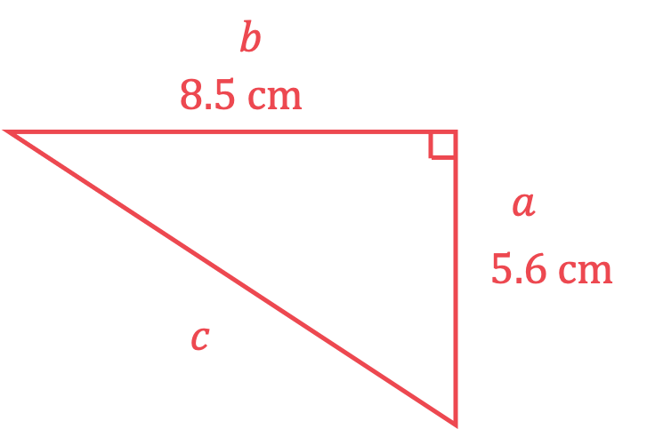

> *Substitute the values from the diagram into Pythagoras' theorem, *$c^{2}=a^{2}+b^{2}$*.*

$c^{2}=5.6^{2}+8.5^{2}$

**[1]**

> *Simplify the right hand side.*

$c^{2}=103.61$

> *Find the value of *$a$* by taking the square root of both sides.*

`table attributes columnalign right center left columnspacing 0px end attributes row c equals cell square root of 103.61 end root end cell end table`

**[1]**

`table attributes columnalign right center left columnspacing 0px end attributes row c equals cell 10.1788... end cell end table`

> *Round to 1 decimal place.*

$c=10.2\mathrm{cm}$* ***[1]**

## Q12 — easy — 3 marks · exam-questions

### 7() — 3 marks
> *As it is a right-angled triangle and you know the length of two of the sides, you can calculate the length of the third side, *$x$*, using Pythagoras theorem.*

*Substitute the values from the diagram into the formula, *$c^{2}=a^{2}+b^{2}$, *where *$a$* and *$b$ *are the lengths of the two shorter sides and is *$c$* the length of the hypotenuse.*

$x^{2}=32^{2}+60^{2}$

**[1]**

> *Take the square root of both sides.*

$x=\sqrt{32^{2}+60^{2}}$

**[1]**

> *Put it into your calculator and work out the result.*

$68\mathrm{cm}$ **[1]**

## Q13 — easy — 3 marks · exam-questions

### 1() — 3 marks
- Substitute your numbers into the formula for cos as you have A and H

$\mathrm{cos}x=\frac{12}{15}$

**[M1]**

Find the inverse of this as you are finding an angle

`cos to the power of negative 1 end exponent open parentheses 12 over 15 close parentheses equals 36.869...`

**[M1]**

Round to 1 decimal place

**Final answer:** **36.9°**

**[A1]**

## Q14 — medium — 3 marks · exam-questions

### 13() — 3 marks
> *It is a right angled triangle so you can use Pythagoras' Theorem: *$a^{2}+b^{2}=c^{2}$*, where **c** is the length of the hypotenuse and **a** and **b **are the lengths of the other two sides.*

`table row cell A C squared plus B C squared end cell equals cell A B squared end cell row cell 6 squared plus B C squared end cell equals cell 13 squared end cell row cell 36 plus B C squared end cell equals 169 end table`

> *Subtract 36 from both sides.*

`table row cell B C squared end cell equals cell 169 minus 36 end cell row blank equals 133 end table`

**[1]**

> *Take the positive square root of both sides.*

`table row cell B C end cell equals cell square root of 133 end cell row blank equals cell 11.532562... end cell end table`

**[1]**

> *Round to 3 significant figures. Remember to include the units for the length.*

$BC=11.5\mathrm{cm}(3\mathrm{sf})$ **[1]**

## Q15 — medium — 5 marks · exam-questions

### 13() — 5 marks
*Label the sides of the perimeter. Find the known sides of one of the right angled triangles*.

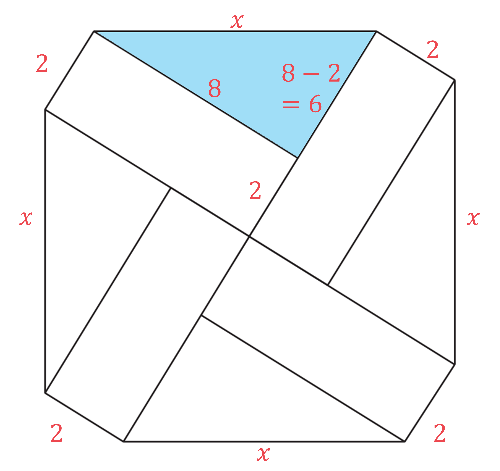

**Labelling one side of the triangle as 6**** [1]**

> *It is a right angled triangle so you can use Pythagoras' Theorem: *$a^{2}+b^{2}=c^{2}$*, where **c** is the length of the hypotenuse and **a** and **b **are the lengths of the other two sides.*

`table row cell 6 squared plus 8 squared end cell equals cell x squared end cell row 100 equals cell x squared end cell end table`

**[1]**

> *Take the positive square root of both sides.*

`table row x equals cell square root of 100 end cell row blank equals 10 end table`

**[1]**

> *Add together the lengths of the sides to find the perimeter. Remember to include units.*

$2+10+2+10+2+10+2+10$

**[1]**

$\mathrm{Perimeter}=48\mathrm{cm}$ **[1]**

## Q16 — medium — 5 marks · exam-questions

### 7() — 5 marks
> *Draw a horizontal to split the shape into a rectangle and a right angled triangle. Subtract the vertical lengths to find the height of the triangle.*

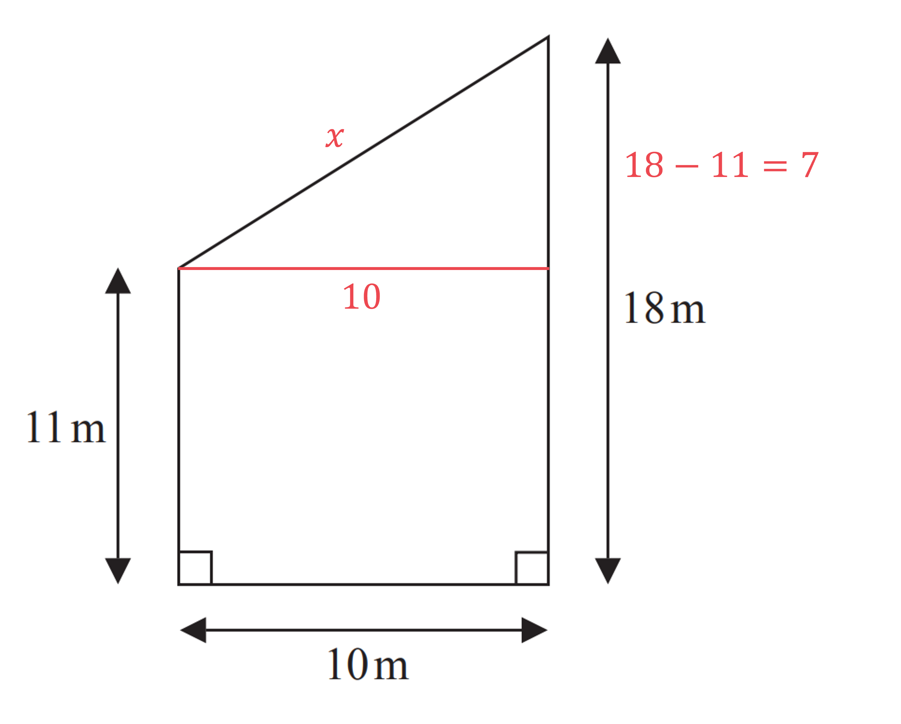

> *It is a right angled triangle so you can use Pythagoras' Theorem: *$a^{2}+b^{2}=c^{2}$*, where **c** is the length of the hypotenuse and **a** and **b **are the lengths of the other two sides.*

`table attributes columnalign right center left columnspacing 0px end attributes row cell 10 squared plus 7 squared end cell equals cell x squared end cell row cell 100 plus 49 end cell equals cell x squared end cell row 149 equals cell x squared end cell end table`

**[1]**

> *Take the positive square root of both sides. Leave as a surd.*

`table attributes columnalign right center left columnspacing 0px end attributes row x equals cell square root of 149 end cell end table`

**[1]**

> *Add together the lengths around the shape to find the perimeter.*

`table attributes columnalign right center left columnspacing 0px end attributes row blank blank cell 11 plus 10 plus 18 plus square root of 149 end cell end table`

**[1]**

`table attributes columnalign right center left columnspacing 0px end attributes row cell 39 plus square root of 149 end cell equals cell 51.206555... end cell end table`

**[1]**

> *Compare the perimeter to 50 m to decide whether the farmer has enough fence.*

**51.2... m > 50 m**** so the farmer does ****not**** have enough fence ****[1]**

## Q17 — medium — 4 marks · exam-questions

### 9() — 4 marks
> *Find the diagonal length **DB**. **DCB** is a right angled triangle so you can use Pythagoras' Theorem: *$a^{2}+b^{2}=c^{2}$*, where **c** is the length of the hypotenuse and **a** and **b **are the lengths of the other two sides.*

`table attributes columnalign right center left columnspacing 0px end attributes row cell D C squared plus C B squared end cell equals cell D B squared end cell row cell 60 squared plus 200 squared end cell equals cell D B squared end cell row 43600 equals cell D B squared end cell end table`

**[1]**

> *Take the positive square root of both sides. Leave as a surd.*

`table attributes columnalign right center left columnspacing 0px end attributes row cell D B end cell equals cell square root of 43600 end cell row blank equals cell 20 square root of 109 end cell end table`

**[1]**

> *Add together the lengths of the 5 rods.*

`table row cell 60 plus 200 plus 60 plus 200 plus 20 square root of 109 end cell equals cell 520 plus 20 square root of 109 end cell row blank equals cell 728.806... space cm end cell end table`

> *Convert to metres by dividing by 100.*

`table row cell 728.806... space divided by 100 end cell equals cell 7.28806... space straight m end cell end table`

> *Multiply by 0.9 to find the total mass of the framework in kilograms.*

$0.9\times7.28806...=6.55925...\mathrm{kg}$

**[1]**

> *Round to 3 significant figures.*

$6.56\mathrm{kg}(3\mathrm{sf})$* ***[1]**

## Q18 — medium — 4 marks · exam-questions

### 4() — 4 marks
> *The perimeter is the sum of the three lengths. Subtract the two lengths from the perimeter to find the length of the third side.*

`table row cell A C end cell equals cell 20 minus 4 minus 7 end cell row blank equals cell 9 space cm end cell end table`

> *Sketch a triangle to help visualise the sides. **AC** is the hypotenuse as it is the biggest length.*

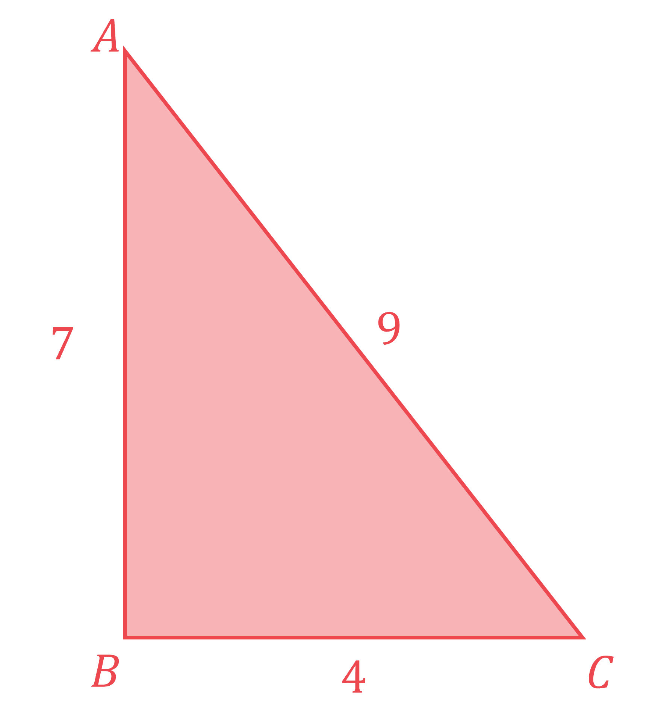

**[1]**

> *If the triangle is right angled then Pythagoras' theorem will apply, *$a^{2}+b^{2}=c^{2}$*, where **c** is the length of the hypotenuse and **a** and **b **are the lengths of the other two sides. Work out the value of both sides of the equation to see if they are equal. If they are equal then it is a right angled triangle.*

`table row cell A B squared plus B C squared end cell equals cell 7 squared plus 4 squared end cell row blank equals cell 49 plus 16 end cell row blank equals 65 end table`

**[1]**

`table attributes columnalign right center left columnspacing 0px end attributes row cell A C squared end cell equals cell 9 squared end cell row blank equals 81 end table`

**[1]**

**ABC**** is ****not**** a ****right angled**** triangle as**** **`table row cell bold italic A bold italic B to the power of bold 2 bold plus bold italic B bold italic C to the power of bold 2 end cell bold not equal to cell bold italic A bold italic C to the power of bold 2 end cell end table`** [1]**

## Q19 — medium — 3 marks · exam-questions

### 20() — 3 marks
> *It is a right angled triangle with an angle (**θ**) so you can use trigonometry. You know the length of the hypotenuse (**H**) and the length of the side that is adjacent (**A**) to the angle. Therefore you can use the cos ratio: *$\mathrm{cos}θ=\frac{A}{H}$*.*

`cos open parentheses y close parentheses equals fraction numerator 2.25 over denominator 6 end fraction`

**[1]**

> *Use the inverse cos function to get **y** by itself.*

`table row y equals cell cos to the power of negative 1 end exponent open parentheses fraction numerator 2.25 over denominator 6 end fraction close parentheses end cell row blank equals cell 67.975687... end cell end table`

**[1]**

> *Compare the angle to 75°*

**The ladder is ****not safe**** because angle **$y$** is ****roughly 68° and not 75°**** ****[1]**

## Q20 — medium — 3 marks · exam-questions

### 5((a)) — 2 marks
> *It is a right angled triangle with an angle (**θ**) so you can use trigonometry. You know the length of the hypotenuse (**H**) and the length of the side that is adjacent (**A**) to the angle. Therefore you can use the cos ratio: *$\mathrm{cos}θ=\frac{A}{H}$*.*

`cos open parentheses theta close parentheses equals 7 over 11`

**[1]**

> *Use the inverse cos function to get **θ** by itself.*

`table row theta equals cell cos to the power of negative 1 end exponent open parentheses 7 over 11 close parentheses end cell row blank equals cell 50.478803... end cell end table`

> *Round to 1 decimal place. Remember to include the units for the angle.*

$\mathrm{Angle}ABC=50.5^{\circ}(1\mathrm{dp})$ **[1]**

### 5((b)) — 1 marks
> *The hypotenuse has changed to 10 but the adjacent side has remained the same. You can still use *$\mathrm{cos}θ=\frac{A}{H}$*.*

`cos open parentheses A B C close parentheses equals 7 over 10`

$\mathrm{cos}(ABC)$ **has ****increased**** as **$\frac{7}{10}>\frac{7}{11}$**[1]**

## Q21 — medium — 7 marks · exam-questions

### 15((a)) — 3 marks
> *ABC** is a right angled triangle so you can use Pythagoras' Theorem: *$a^{2}+b^{2}=c^{2}$*, where **c** is the length of the hypotenuse and **a** and **b **are the lengths of the other two sides.*

`table row cell A B squared plus B C squared end cell equals cell A C squared end cell row cell 6 squared plus 4.5 squared end cell equals cell A C squared end cell row cell 56.25 end cell equals cell A C squared end cell end table`

**[1]**

> *Take the positive square root of both sides.*

`table attributes columnalign right center left columnspacing 0px end attributes row cell A C end cell equals cell square root of 56.25 end root end cell row blank equals cell 7.5 end cell end table`

**[1]**

> *Remember to include the units for the length.*

$AC=7.5\mathrm{km}$ **[1]**

### 15((b)) — 4 marks
> *Identify the angle that is needed for the bearing. Starting from the north line at **A**, draw an angle clockwise until it reaches the line **AC**. This angle can be split into two, one angle that is 180° and the other angle that is **θ**°.*

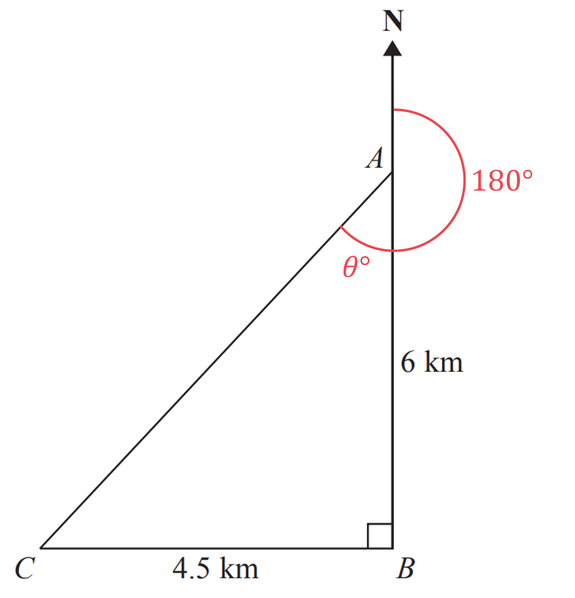

> *It is a right angled triangle with an angle (**θ**) so you can use trigonometry.  You know the length of the side opposite (**O**) to the angle and the length of the side adjacent (**A**) to the angle. Therefore you can use the tan ratio: *$\mathrm{tan}θ=\frac{O}{A}$*.*

`tan open parentheses theta close parentheses equals fraction numerator 4.5 over denominator 6 end fraction`

**[1]**

> *Use the inverse tan function to get **θ** by itself.*

`table row theta equals cell tan to the power of negative 1 end exponent open parentheses fraction numerator 4.5 over denominator 6 end fraction close parentheses end cell end table`

**[1]**

`table row theta equals cell 36.869897... end cell end table`

**[1]**

> *Add to 180° and round to nearest degree.*

`180 plus table row blank blank 36 end table table row blank blank. end table table row blank blank 869897 end table table row blank blank. end table table row blank blank. end table table row blank blank. end table table row blank equals blank end table table row blank blank 216 end table table row blank blank. end table table row blank blank 869897 end table table row blank blank. end table table row blank blank. end table table row blank blank. end table`

$\mathrm{Bearing}=217(\mathrm{nearest} \mathrm{degree})$ **[1]**

## Q22 — medium — 4 marks · exam-questions

### 18() — 4 marks
> *Draw a line down the middle of the triangle to split the shape into two identical right angled triangles. The length of this line will be the height of the original triangle and can be used to find the area.*

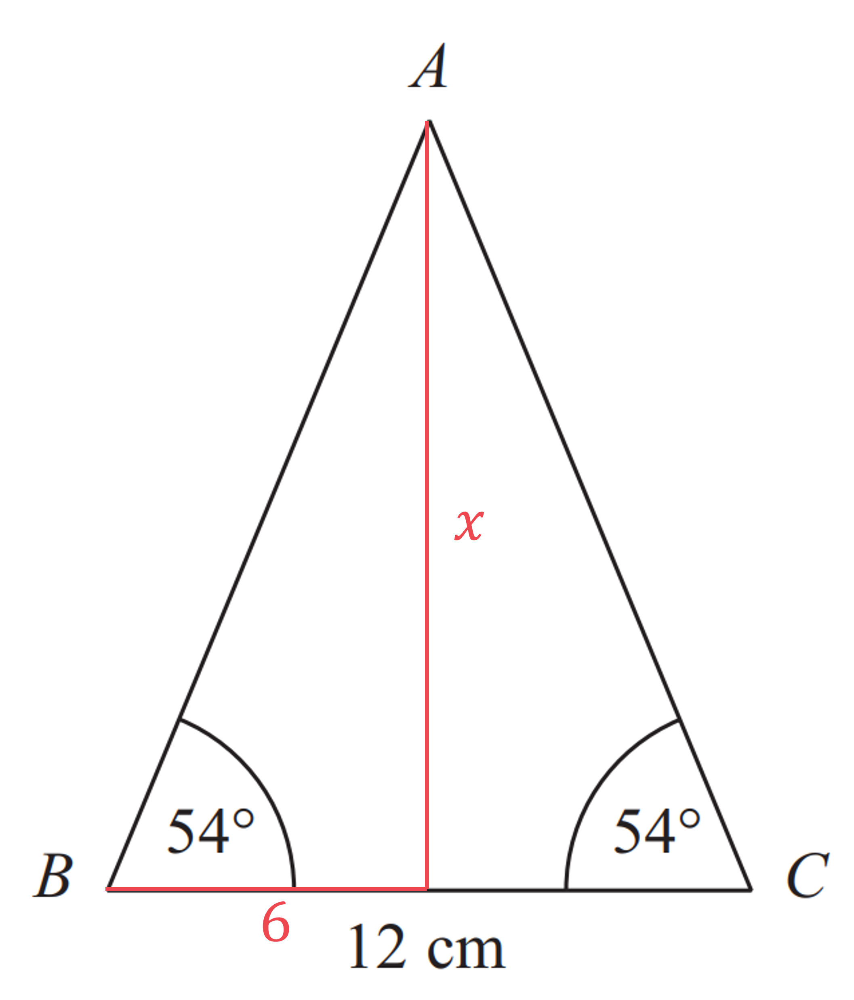

> *The new triangle is a right angled triangle with an angle (**θ**) so you can use trigonometry. You know the length of the side that is adjacent (**A**) to the angle and you want the length of the side that is opposite (**O**) the angle. Therefore you can use the tan ratio: *$\mathrm{tan}θ=\frac{O}{A}$*.*

`tan open parentheses 54 close parentheses equals x over 6`

**[1]**

> *Multiply both sides by 6.*

`table row x equals cell 6 cross times tan open parentheses 54 close parentheses end cell row blank equals cell 8.258291... end cell end table`

**[1]**

> *You can now find the area of the triangle using the formula *$A=\frac{1}{2}\timesb\timesh$*, where **b** is the length of the base and **h** is the length of the perpendicular height. Use the answer button or store the height in your calculator's memory.*

`table row Area equals cell 1 half cross times 12 cross times 8.258291... end cell row blank equals cell 49.549749... end cell end table`

**[1]**

> *Round to 3 significant figures. Remember to include square units for the area.*

$\mathrm{Area}=49.5\mathrm{cm}^{2}(3\mathrm{sf})$* ***[1] **
**This can also be done using the sine rule**

## Q23 — medium — 3 marks · exam-questions

### 20() — 3 marks
> *It is an isosceles triangle so you can draw a vertical line down from **Q** to split it into two identical right angled triangles.*

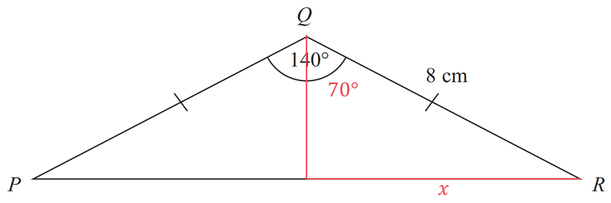

> *The new triangle is a right angled triangle with an angle (**θ**) so you can use trigonometry. You know the length of the hypotenuse (**H**) and you want the length of the side that is opposite (**O**) the angle. Therefore you can use the sin ratio: *$\mathrm{sin}θ=\frac{O}{H}$*.*

`sin open parentheses 70 close parentheses equals x over 8`

> *Multiply both sides by 8.*

`table row x equals cell 8 cross times sin open parentheses 70 close parentheses end cell row blank equals cell 7.517540... end cell end table`

**[1]**

> *This is half the length of **PR**. So double this value. Use the answer button.*

`table row cell 2 cross times 8 cross times sin open parentheses 70 close parentheses end cell equals cell 2 cross times 7.517540... end cell row blank equals cell 15.035081... end cell end table`

**[1]**

> *Round your answer to 3 significant figures. Remember to include the units for the length.*

$PR=15.0\mathrm{cm}(3\mathrm{sf})$ **[1] **
**This can also be done using the cosine rule**

## Q24 — medium — 4 marks · exam-questions

### 9() — 4 marks
*AB** = **AC** = 17.5 cm so it is an isosceles triangle.* *Draw in a vertical line from point **A** until it meets the line **BC **at the midpoint **P  **to form two identical right-angled triangles.*

> *You can use Pythagoras' theorem on one of the right-angled triangles to find the perpendicular height of the triangle.*

> *Substitute the values from triangle **APB** into Pythagoras' theorem, *$c^{2}=a^{2}+b^{2}$*.*

$17.5^{2}=14^{2}+b^{2}$

> *Simplify.*

$306.25=196+b^{2}$

> *Subtract 196 from both sides.*

$110.25=b^{2}$

**[1]**

> *Take the square root of both sides to find the value of *$b$*.*

$b=10.5$

**[1]**

> *Calculate the area of the triangle using the formula, *$A=\frac{1}{2}\timesbase\timesheight$*.*

$A=\frac{1}{2}\times28\times10.5$

**[1]**

> *Work out the value using your calculator.*

**147 cm****2**** ****[1]**

## Q25 — medium — 3 marks · exam-questions

### 12() — 3 marks
> *Draw a horizontal line on the diagram from point **B** to a point **P** on the line **CD** to form a right-angled triangle **BPD**. *
*Let angle **BPD**  be *$x^{\circ}$*.*

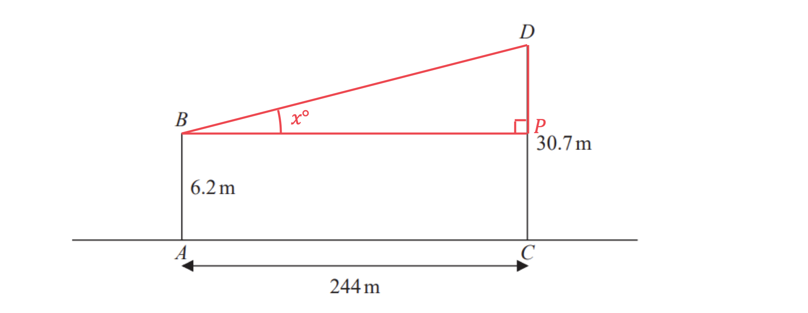

> *Find the length **DP ** by subtracting the length **AB**  from the length **CD**.*

$30.7-6.2=24.5$

> *Calculate *$x^{\circ}$* using SOHCAHTOA. *
*You know the length of the adjacent side and you know the length of the opposite side so use *$\mathrm{tan}θ=\frac{Opp}{Adj}$*.*

> *Substitute the values from the diagram into the formula.*

$\mathrm{tan}x=\frac{24.5}{244}$

**[1]**

> *Take the inverse tan of both sides.*

`x equals tan to the power of negative 1 end exponent open parentheses fraction numerator 24.5 over denominator 244 end fraction close parentheses`

**[1]**

> *Put into your calculator and work out the value.*

$x=5.7338...$

> *The angle of depression from **B** to **A** is the same as angle **PBD** because alternate angles in parallel lines are equal.*

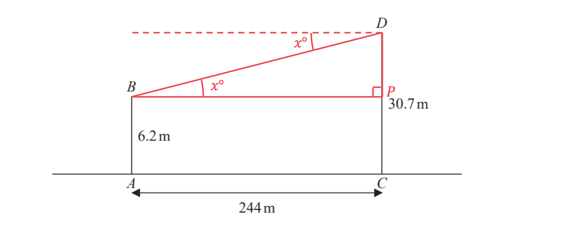

> *Round the angle to 1 decimal place.*

**5.7****o****  ****[1]**

**Answers in the range 5.65 to 5.67 will be accepted**

## Q26 — medium — 4 marks · exam-questions

### 7() — 4 marks
> *Draw a vertical line from the vertex where the angle 125**o** is down to the base of the shape to create a rectangle and a right-angled triangle. Label the vertices of the triangle **A**, **B** and **C**.*

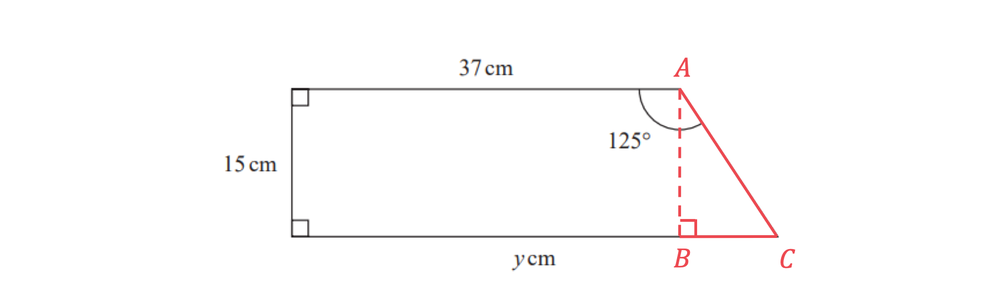

> *Work out the size of angle **BAC** by subtracting 90**o** for the interior angle of a rectangle from the angle of 125**o**.*

$125-90=35$

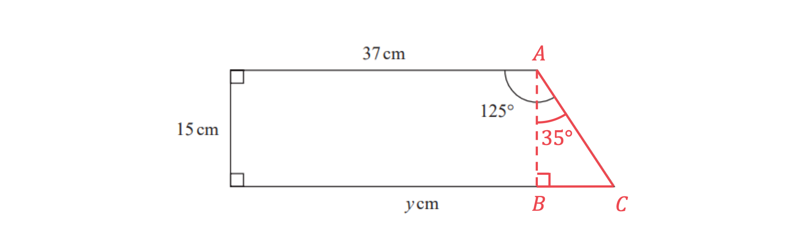

**[1]**

> *Calculate the length **BC** using SOHCAHTOA. *
*You know the length of the adjacent side and you want to work out the length of the opposite side, so use *$\mathrm{tan}θ=\frac{Opp}{Adj}$*.*

> *Substitute the values from the diagram into the formula.*

$\mathrm{tan}35=\frac{BC}{15}$

**[1]**

> *Multiply both sides by 15.*

$15\times\mathrm{tan}35=BC$

**[1]**

> *Put into your calculator and work out the value of **BC**.*

$BC=10.5031...$

> *Add the length **BC**  to the horizontal length of the rectangle to find *$y$*.*

$y=10.5031...+37\,y=47.5031...$

> *Round to 1 decimal place.*

$y=47.5\mathrm{cm}$ **[1]**

## Q27 — medium — 4 marks · exam-questions

### 6() — 4 marks
> *Calculate the length **MN** using Pythagoras' theorem, *$c^{2}=a^{2}+b^{2}$*, where **MN** is the hypotenuse *$c$*.*

$MN^{2}=3.5^{2}+9.7^{2}$

**[1]**

> *Take the square root of both sides.*

$MN=\sqrt{3.5^{2}+9.7^{2}}$

**[1]**

> *Put into your calculator and work out the value of **MN**.*

$MN=10.3121...$

> *MN**  is the diameter, *$d$*, of the circle.*

> *Calculate the circumference, *$C$*, of the circle using the formula *$C=πd$*.*

$C=π\times10.3121...$

**[1]**

$C=32.3965...$

> *Round your answer to 3 significant figures.*

**32.4 cm**** ****[1]**

**Answers in the range 32.3 to 32.41 will be accepted**

## Q28 — medium — 3 marks · exam-questions

### 8() — 3 marks
*Draw a diagram of the route that Stanley has walked.* *A right-angled triangle is created.*

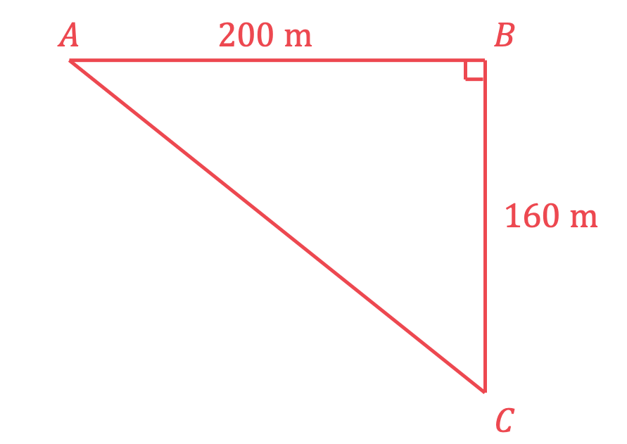

> *Calculate the length of **AC** using Pythagoras' theorem, *$c^{2}=a^{2}+b^{2}$*, where the length **AC** is the hypotenuse, *$c$*.*

$AC^{2}=200^{2}+160^{2}$

**[1]**

> *Take the square root of both sides.*

$AC=\sqrt{200^{2}+160^{2}}$

**[1]**

> *Put into your calculator and work out the value.*

$256.1249...$

> *Round your answer to 3 significant figures.*

**256 metres**** [1]**

**Answers between 256 and 256.2 will be accepted**

## Q29 — medium — 4 marks · exam-questions

### 10() — 4 marks
> *Draw a vertical line from point **C**  until it hits the line **AD**  at a point **P**  to form a rectangle and a right-angled triangle.*

> *Find the length **PD** by subtracting the length **BC**  from the length **AD**.*

$PD=24.3-16$

**[1]**

$PD=8.3$

> *Calculate the angle **PCD** using SOHCAHTOA. You know the lengths of both the adjacent side and the opposite side, so you can use *$\mathrm{tan}θ=\frac{Opp}{Adj}$*.*

> *Substitute the values from the diagram into the formula. Let angle **PCD** = *$y$*.*

$\mathrm{tan}y=\frac{8.3}{12.5}$

**[1]**

> *Take the inverse tan of both sides.*

`y equals tan to the power of negative 1 end exponent open parentheses fraction numerator 8.3 over denominator 12.5 end fraction close parentheses`

**[1]**

> *Put into your calculator and work out the value.*

$y=33.5841...$

> *Find the size of angle *$x$* by adding 90**o** from the interior angle of the rectangle on to *$y$*.*

$x=90+33.5841...$

$x=123.5841...$

> *Round your answer to 1 decimal place.*

**123.6****o**** [1]**

**Answers between 123.5 and 123.6 will be accepted**

## Q30 — medium — 4 marks · exam-questions

### 9() — 4 marks
> *Apply Pythagoras' theorem (*$a^{2}+b^{2}=c^{2}$*) to calculate the perpendicular height of the isosceles triangle, by forming a right-angled triangle as shown below*

- *Because the triangle is isosceles, the perpendicular height will divide the base in half*

`open parentheses height close parentheses squared equals 14.5 squared minus 10 squared equals 110.25`

$\mathrm{height}=\sqrt{110.25}=10.5$

**[M1 M1]**

> *Substitute values into the  formula for the area of a triangle (*$\frac{1}{2}\times\mathrm{base}\times\mathrm{height}$*)*

$\frac{1}{2}\times20\times10.5=105$

**[M1]**

**Final answer:** **105 cm****2 **

**[A1]**

> **[mark-scheme]**
> **M1**: A correct start to substituting into Pythagoras' theorem to calculate the height of the triangle will secure this mark (e.g. 14.52-102).
> 
> **M1**: A full and correct method for calculating the height of a triangle is needed to gain this mark.
> 
> **M1**: For substituting the correct height and base of the triangle to calculate the area of the triangle. This mark is only awarded if at least one of the previous M1 marks have been awarded.
> 
> **A1**: Correct value stated for the area.

## Q31 — medium — 3 marks · exam-questions

### 6() — 3 marks
> **[exam-tip]**
> The right angled triangle has two given side lengths and a missing angle so trigonometry is used to solve this problem.

> *Label the triangle with hypotenuse, adjacent and opposite sides so trigonometry can be applied as below*

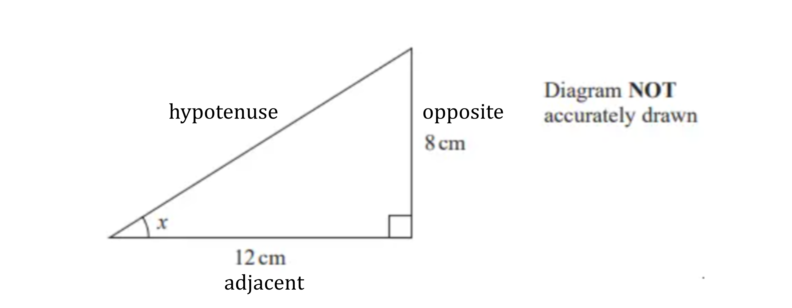

> *Use the labelled triangle to select the trigonometric ratio to use (sine, cosine or tangent)*

`tan open parentheses x close parentheses equals opposite over adjacent`

> *Substitute values into the equation and solve for *$x$

`table row cell tan open parentheses x close parentheses end cell equals cell 8 over 12 end cell row x equals cell tan to the power of negative 1 end exponent open parentheses 8 over 12 close parentheses end cell row x equals cell 33.690... end cell end table`

**[M1 M1]**

> *Round to 1 decimal place as stated in the question*

**Final answer:** **33.7****o**

**[A1]**

> **[mark-scheme]**
> **M1**: Is awarded for showing values substituted correctly into tangent ratio. Using sinx and cosx will also gain the mark if Pythagoras' theorem has been used to calculate the length of the hypotenuse as $\sqrt{208}$ first.
> 
> **M1**: Is awarded for a complete method shown to calculate the angle $x$.
> 
> **A1**: Is awarded for 33.7 *o*r any answer given that rounds to 33.7.

## Q32 — medium — 5 marks · exam-questions

### 10() — 5 marks
> *Add a label, *$D$*, where the perpendicular line meets the base *

> $ACD$* is a right-angled triangle so add labels to use SOHCAHTOA*

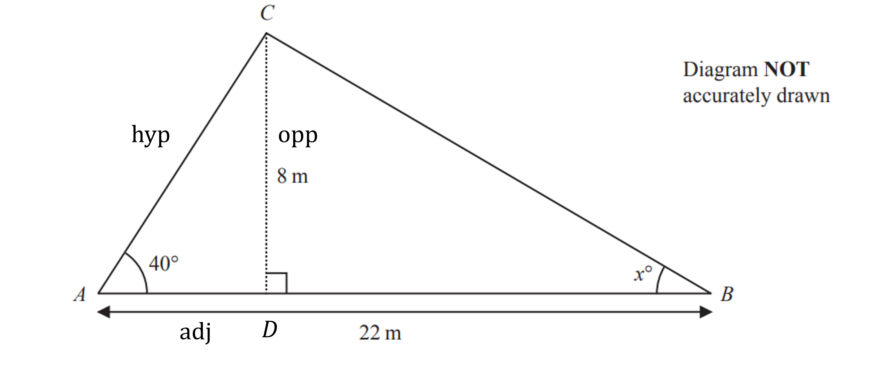

> *First work out *$AD$* to be able to work out the length of *$DB$

`tan open parentheses 40 close parentheses space equals fraction numerator space 8 over denominator A D end fraction`

**[M1]**

`A D thin space equals fraction numerator space 8 over denominator tan open parentheses 40 close parentheses end fraction`

**[M1]**

$AD=9.53...$

> *Therefore*

$BD=22-9.53...=12.47...$

**[M1]**

`tan open parentheses x close parentheses thin space equals fraction numerator space 8 over denominator 12.47... end fraction`

**[M1]**

`table row cell x space end cell equals cell space tan to the power of negative 1 end exponent open parentheses fraction numerator 8 over denominator 12.47... end fraction close parentheses end cell row blank equals cell 32.69... end cell end table`

> *Round to 1 decimal place*

$x=32.7^{\circ}$

**[A1]**

> **[mark-scheme]**
> Answers [32.3, 32.8] accepted dependent on a correct method.

## Q33 — medium — 4 marks · exam-questions

### 2() — 4 marks
> *Use Pythagoras' Theorem with *$ABC$* to work out the length of *$BC$

`table row cell 8 squared space plus space B C squared space end cell equals cell space 10 squared end cell row cell B C squared space end cell equals cell space 10 squared space minus space 8 squared end cell row cell B C squared space end cell equals cell space 36 end cell end table`

**[M1]**

> *Take the positive square root*

$BC=6$

**[M1]**

> *Add this to the length of *$BE$* to work out the length of *$CE$

$6+5=11\mathrm{cm}$

> *Use Pythagoras' Theorem again to work out the length of *$DE$

$DE^{2}=11^{2}+14^{2}$

$DE^{2}=317$

$DE=\sqrt{317}=17.80...$

**[M1]**

$17.8\mathrm{cm}$

**[A1]**

## Q34 — hard — 4 marks · exam-questions

### 6() — 4 marks
> *You know two lengths of the right angled triangle **ABD** so you can use Pythagoras' theorem to find the length **BD**.*

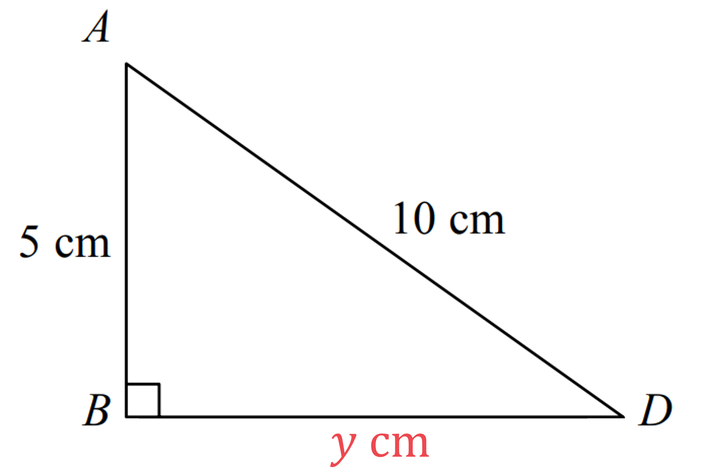

`table row cell A B squared plus B D squared end cell equals cell A D squared end cell row cell 5 squared plus y squared end cell equals cell 10 squared end cell row cell 25 plus y squared end cell equals 100 row cell y squared end cell equals 75 row y equals cell square root of 75 end cell end table`

**[1]**

> *You now know two lengths of the right angled triangle **BDC** so you can use Pythagoras' theorem to find the length **BC**.*

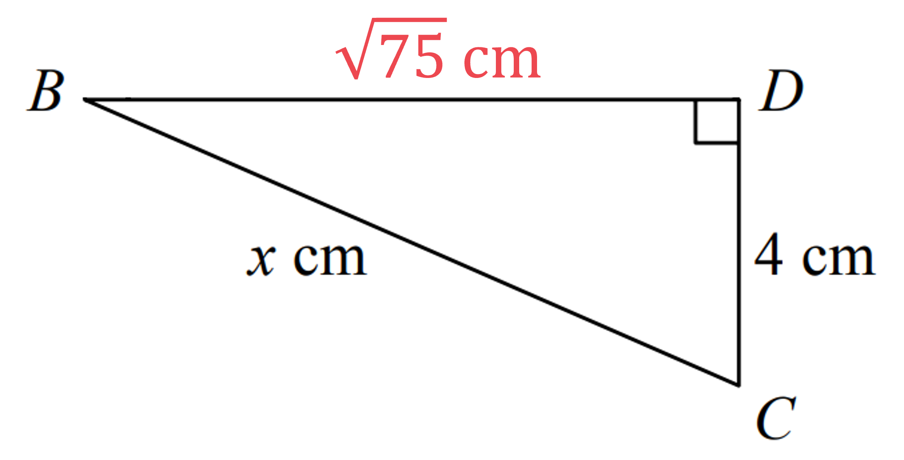

`table row cell B D squared plus D C squared end cell equals cell B D squared end cell row cell open parentheses square root of 75 close parentheses squared plus 4 squared end cell equals cell x squared end cell row 91 equals cell x squared end cell end table`

**[1]**

> *Take the positive square root of both sides.*

`table row x equals cell square root of 91 end cell row blank equals cell 9.539392... end cell end table`

**[1]**

> *Round to 2 decimal places.*

$x=9.54(2dp)$ **[1]**

## Q35 — hard — 5 marks · exam-questions

### 18() — 5 marks
> *You know two lengths of the right angled triangle **ABD** so you can use Pythagoras' theorem to find the length **DB**.*

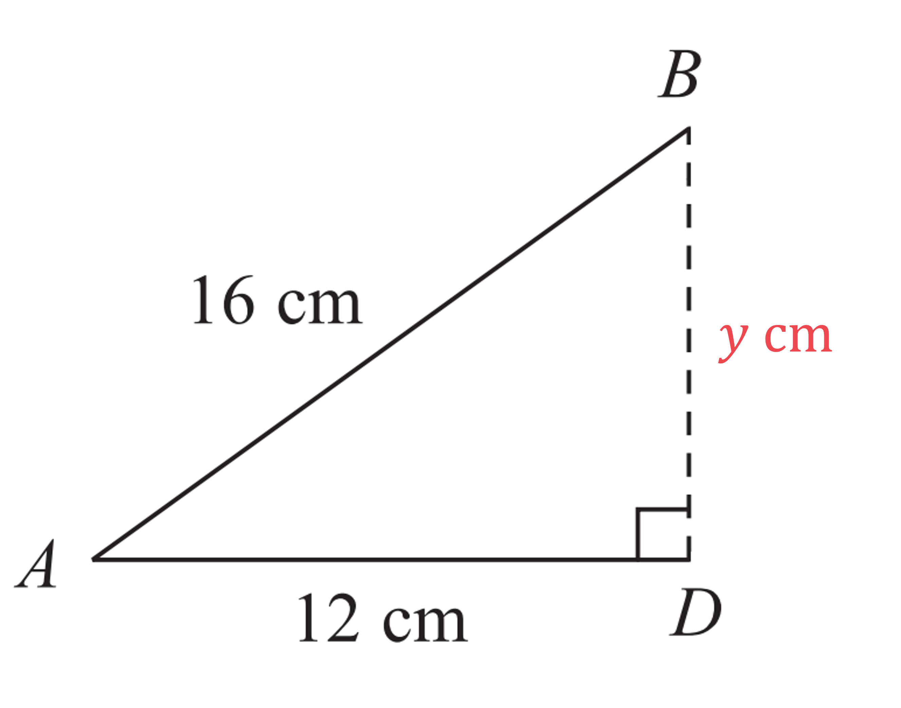

`table row cell A D squared plus D B squared end cell equals cell A B squared end cell row cell 12 squared plus y squared end cell equals cell 16 squared end cell end table`

**[1]**

`table attributes columnalign right center left columnspacing 0px end attributes row cell 144 plus y squared end cell equals 256 row cell y squared end cell equals 112 row y equals cell square root of 112 end cell end table`

**[1]**

> *You now know an angle and the length of the side opposite for the right angled triangle **BDC. **Therefore you can use the sin ratio to find the length of the hypotenuse **CD**.*

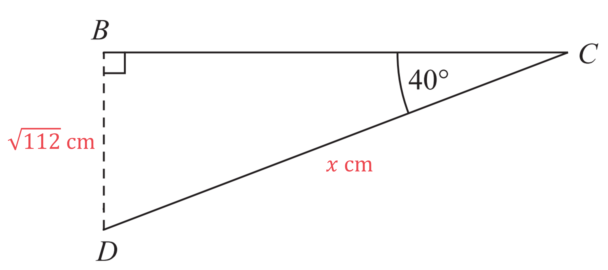

`table attributes columnalign right center left columnspacing 0px end attributes row cell sin open parentheses 40 close parentheses end cell equals cell fraction numerator square root of 112 over denominator x end fraction end cell end table`

**[1]**

> *Multiply both sides by **x** and divide both sides by sin(40).*

`table row x equals cell fraction numerator square root of 112 over denominator sin open parentheses 40 close parentheses end fraction end cell row blank equals cell 16.464233... end cell end table`

**[1]**

> *Round to 3 significant figures. Remember to include the units for the length.*

$CD=16.5\mathrm{cm}(3\mathrm{sf})$ **[1]**

## Q36 — hard — 4 marks · exam-questions

### 9() — 4 marks
> *The ratio tells you that the length **CD **is 1.5 times bigger than the length **AB**.*

`table row cell C D end cell equals cell 1.5 cross times 1.7 end cell row blank equals cell 2.55 space straight m end cell end table`

> *Draw a horizontal line from **A** to the line **CD** and use this to form a right angled triangle. Find the difference of the vertical lengths to find the height of the triangle.*

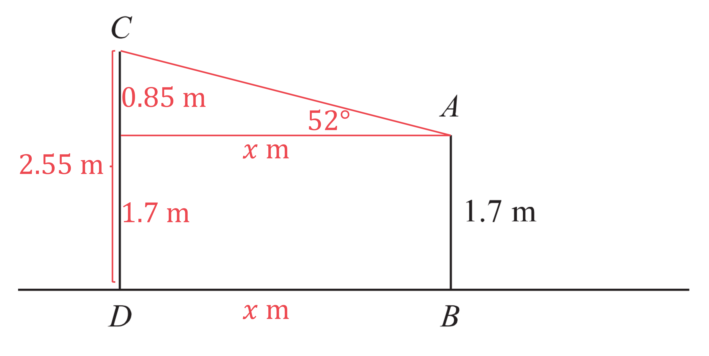

**[1]**

> *In the right angled triangle you have an angle and the length of the side opposite. As you want the length of the adjacent side you should use the tan ratio.*

`tan open parentheses 52 close parentheses equals fraction numerator 0.85 over denominator x end fraction`

**[1]**

> *Multiply both sides by **x** and divide both sides by tan(52).*

`table attributes columnalign right center left columnspacing 0px end attributes row x equals cell fraction numerator 0.85 over denominator tan open parentheses 52 close parentheses end fraction end cell row blank equals cell 0.664092... end cell end table`

**[1]**

> *Round to 3 significant figures. Remember to include units for the length.*

$BD=0.664m(3\mathrm{sf})$ **[1]**

## Q37 — hard — 4 marks · exam-questions

### 1() — 4 marks
Halve the base as this will give you a right angled triangle to work with

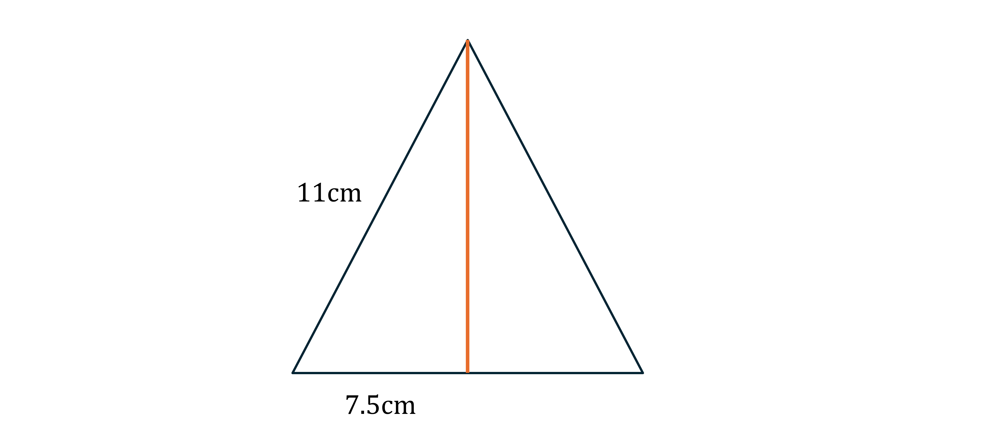

Use Pythagoras to calculate the height of the triangle

$\sqrt{11^{2}-7.5^{2}}=8.046...$

**[M1 M1]**

Calculate the area of the triangle

$\frac{15\times8.046...}{2}=60.350...$

**[M1]**

Round to 3 significant figures

$60.4\mathrm{cm}^{2}$

**[A1]**

> **[mark-scheme]**
> **M1**: Start of a correct method to find the height. This mark is gained by writing $11^{2}-7.5^{2}$.
> 
> **M1**: Complete method to find the height/
> 
> **M1**: Correct use of the formula for the area of a triangle.
> 
> **A1**: Correct answer.

## Q38 — hard — 5 marks · exam-questions

### 15() — 5 marks
> *Draw a horizontal line from **D** to the line **AB** to split the shape into a rectangle and a triangle. Subtract the vertical heights to find the height of the triangle.*

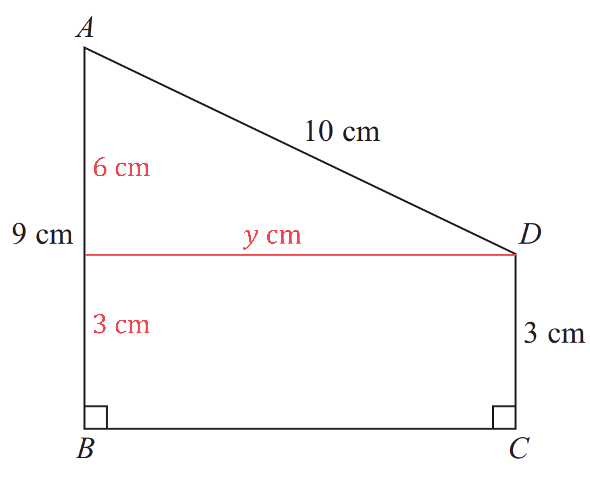

**[1]**

> *The triangle is right angled. You have the lengths of two of the sides so you can use Pythagoras' theorem to find the length of the third side.*

`table attributes columnalign right center left columnspacing 0px end attributes row cell y squared plus 6 squared end cell equals cell 10 squared end cell row cell y squared plus 36 end cell equals 100 row cell y squared end cell equals 64 row y equals 8 end table`

**[1]**

> *The length **BC** will also equal 8 cm. Form a triangle using the points **ABC**. The triangle is right angled. You have the lengths of two of the sides so you can use Pythagoras' theorem to find the length of the third side.*

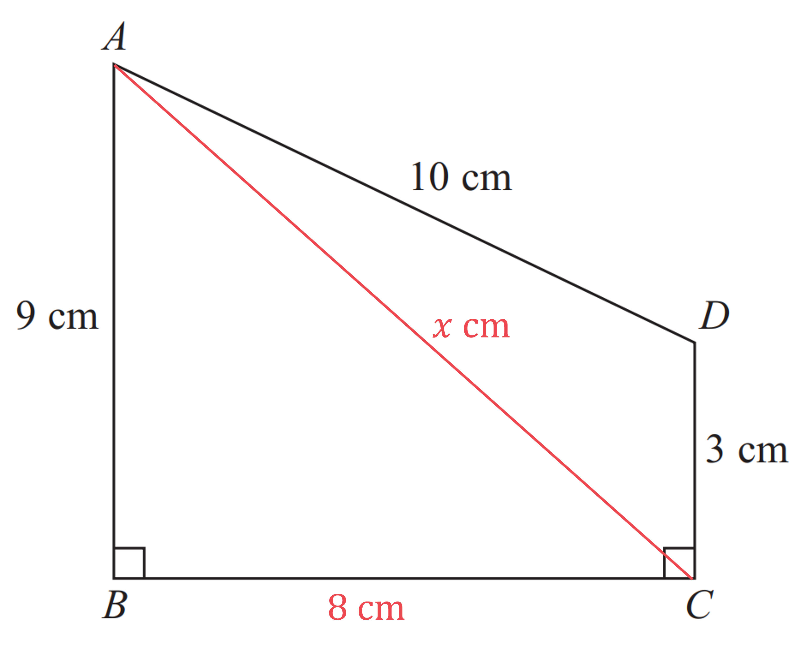

`table row cell 8 squared plus 9 squared end cell equals cell x squared end cell row 145 equals cell x squared end cell end table`

**[1]**

> *Take the positive square root of both sides.*

`table attributes columnalign right center left columnspacing 0px end attributes row x equals cell square root of 145 end cell row blank equals cell 12.041594... end cell end table`

**[1]**

> *Round to 3 significant figures. Remember to include units for the length.*

$AC=12.0\mathrm{cm}(3\mathrm{sf})$ **[1]**

## Q39 — hard — 4 marks · exam-questions

### 17() — 4 marks
> *Method 1*

> *You can find the length of **AB** by adding together **AD** and **DB**.*

`table row cell A B end cell equals cell 10.4 plus 5.2 end cell row blank equals cell 15.6 end cell end table`

> *You know two lengths of the right angled triangle **ABC** so you can use Pythagoras' theorem to find the length **BC**. Leave as an exact value.*

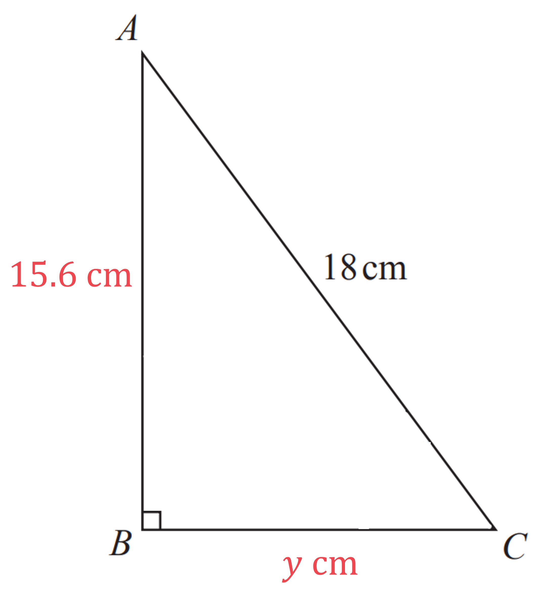

`table attributes columnalign right center left columnspacing 0px end attributes row cell A B squared plus B C squared end cell equals cell A C squared end cell row cell 15.6 squared plus y squared end cell equals cell 18 squared end cell end table`

**[1]**

`table row cell 243.36 plus y squared end cell equals 324 row cell y squared end cell equals cell 80.64 end cell row y equals cell square root of 80.64 end root end cell end table`

**[1]**

> *You now know the lengths of the sides adjacent and opposite to the required angle in the right angled triangle **BDC** so you can use the tan ratio to find the angle.*

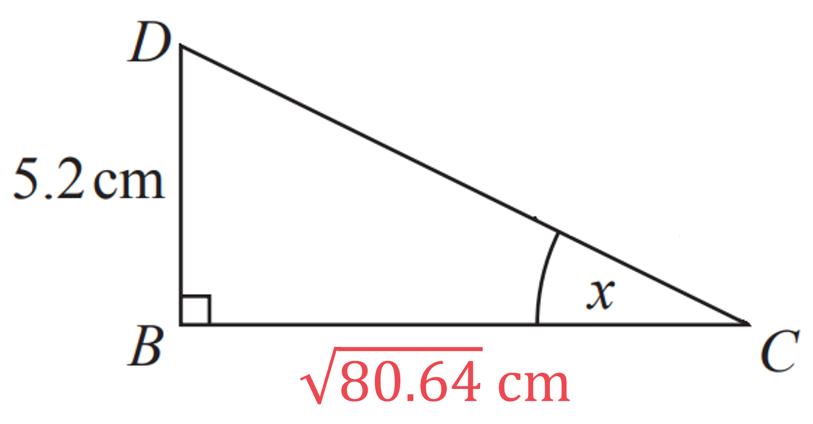

`table row cell tan open parentheses x close parentheses end cell equals cell fraction numerator 5.2 over denominator square root of 80.64 end root end fraction end cell end table`

> *Find the angle by using the inverse tan function.*

`table row x equals cell tan to the power of negative 1 end exponent open parentheses fraction numerator 5.2 over denominator square root of 80.64 end root end fraction close parentheses end cell row blank equals cell 30.073674... end cell end table`

**[1]**

> *Round to 1 decimal place. Remember to include the units for the angle.*

$x=30.1^{\circ}(1\mathrm{dp})$ **[1]**

> *Method 2*

> *You can find the length of **AB** by adding together **AD** and **DB**.*

`table attributes columnalign right center left columnspacing 0px end attributes row cell A B end cell equals cell 10.4 plus 5.2 end cell row blank equals cell 15.6 end cell end table`

> *You know two lengths of the right angled triangle **ABC** (the hypotenuse and the side opposite **C**) so you can use the sin ratio to find the angle **ACB**.*

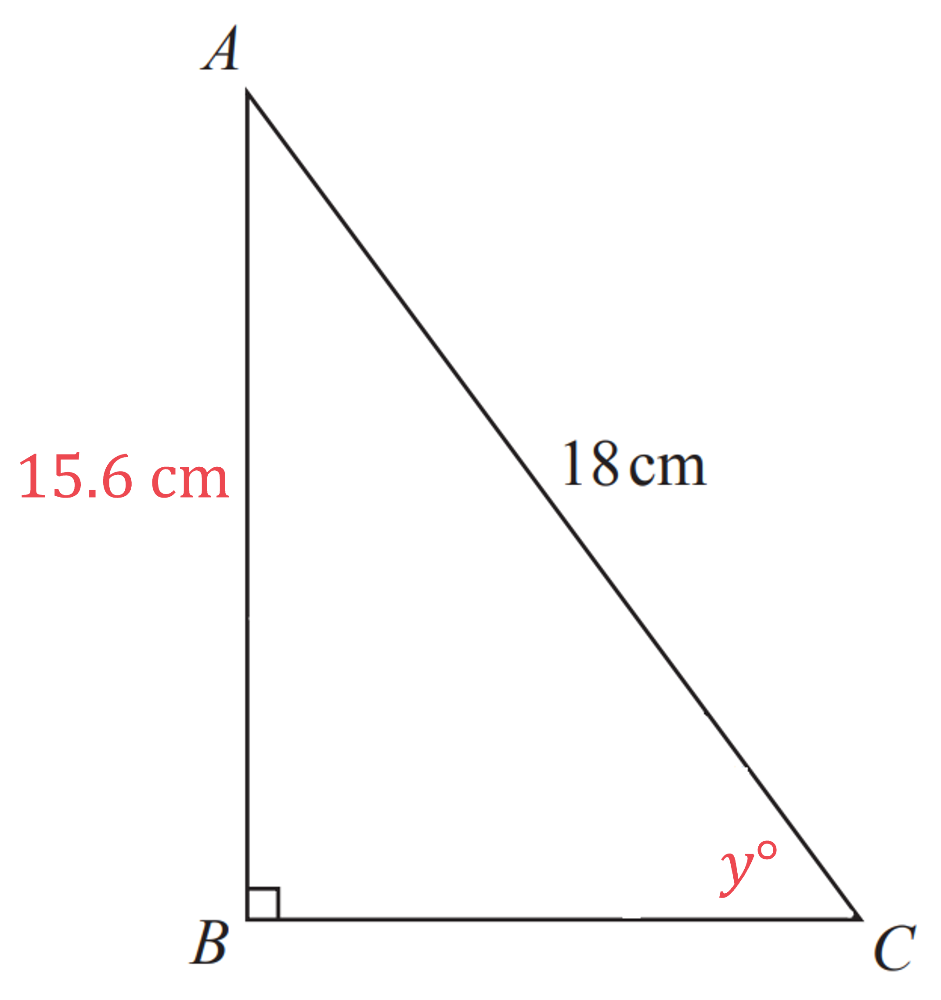

`table row cell sin open parentheses y close parentheses end cell equals cell fraction numerator 15.6 over denominator 18 end fraction end cell end table`

**[1]**

> *Find the angle by using the inverse sin function.*

`table row y equals cell sin to the power of negative 1 end exponent open parentheses fraction numerator 15.6 over denominator 18 end fraction close parentheses end cell row blank equals cell 60.073565... end cell end table`

**[1]**

> *The angle ACB is made up of **x **and 30, so make the sum of these two equal to **y** and solve for **x**.*

`table row cell x plus 30 end cell equals cell 60.073565... end cell row x equals cell 30.073565... end cell end table`

**[1]**

> *Round to 1 decimal place. Remember to include the units for the angle.*

$x=30.1^{\circ}(1\mathrm{dp})$ **[1]**

## Q40 — hard — 5 marks · exam-questions

### 7() — 5 marks
> *Draw a vertical line down from **C** to split the shape into two triangles and a rectangle. Label the lengths that make up the length **AD**.*

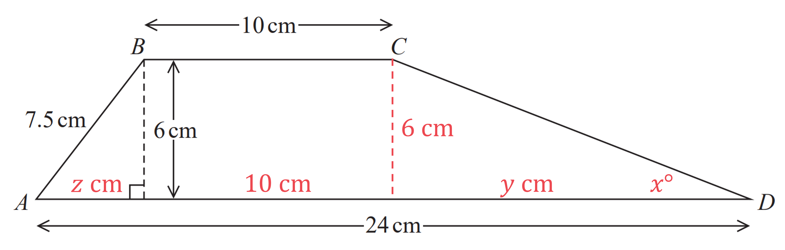

> *You know two lengths of the left right angled triangle so you can use Pythagoras' theorem to find the value of **z**. *

`table attributes columnalign right center left columnspacing 0px end attributes row cell z squared plus 6 squared end cell equals cell 7.5 squared end cell row cell z squared plus 36 end cell equals cell 56.25 end cell end table`

**[1]**

`table row cell z squared end cell equals cell 20.25 end cell row z equals cell square root of 20.25 end root end cell row z equals cell 4.5 end cell end table`

**[1]**

> *Subtract 4.5 and 10 from 24 to find the value of **y**.*

`table attributes columnalign right center left columnspacing 0px end attributes row y equals cell 24 minus 4.5 minus 10 end cell row blank equals cell 9.5 end cell end table`

**[1]**

> *You now know the lengths of the sides adjacent and opposite to the required angle in the other right angled triangle so you can use the tan ratio to find the angle.*

`table row cell tan open parentheses x close parentheses end cell equals cell fraction numerator 6 over denominator 9.5 end fraction end cell end table`

**[1]**

> *Find the angle by using the inverse tan function.*

`table row x equals cell tan to the power of negative 1 end exponent open parentheses fraction numerator 6 over denominator 9.5 end fraction close parentheses end cell row blank equals cell 32.275644... end cell end table`

> *Round to 1 decimal place. Remember to include units for the angle.*

$\mathrm{Angle}CDA=32.3^{\circ}(1\mathrm{dp})$* ***[1]**

## Q41 — hard — 5 marks · exam-questions

### 15() — 5 marks
> *You know an angle and the length of the hypotenuse of the right angled triangle **ABD** so you can use the sin ratio to find the length of the side opposite the angle **BD**.*

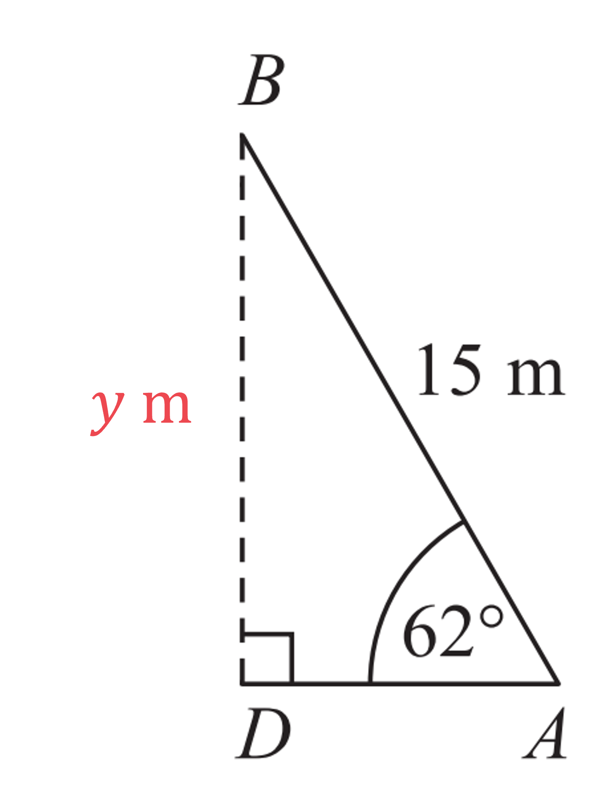

`table row cell sin open parentheses 62 close parentheses end cell equals cell y over 15 end cell end table`

**[1]**

> *Multiply both sides by 15. Leave as an exact answer.*

`table row y equals cell 15 cross times sin open parentheses 62 close parentheses end cell row blank equals cell 15 sin open parentheses 62 close parentheses end cell end table`

**[1]**

> *You now know the lengths that are opposite and adjacent to the required angle for the right angled triangle **BCD. **Therefore you can use the tan ratio to find the angle **BCD**.*

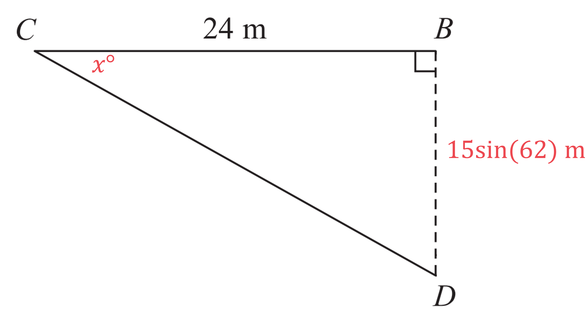

`table row cell tan open parentheses x close parentheses end cell equals cell fraction numerator 15 sin open parentheses 62 close parentheses over denominator 24 end fraction end cell end table`

**[1]**

> *Find the angle by using the inverse tan function.*

`table row x equals cell tan to the power of negative 1 end exponent open parentheses fraction numerator 15 sin open parentheses 62 close parentheses over denominator 24 end fraction close parentheses end cell row blank equals cell 28.891769... end cell end table`

**[1]**

> *Round to 1 decimal place. Remember to include the units for the angle.*

$\mathrm{Angle}BCD=28.9^{\circ}(1\mathrm{dp})$ **[1]**

## Q42 — hard — 4 marks · exam-questions

### 26() — 4 marks
> *DCF** is a right angled triangle so you can use Pythagoras' Theorem: *$a^{2}+b^{2}=c^{2}$*, where **c** is the length of the hypotenuse hypotenuse and **a** and **b **are the lengths of the other two sides.*

`table row cell D C squared plus C F squared end cell equals cell D F squared end cell row cell D C squared plus 2 squared end cell equals cell open parentheses 2 square root of 10 close parentheses squared end cell row cell D C squared plus 4 end cell equals 40 row blank blank blank end table`

> *Subtract 4 from both sides.*

`table row cell D C squared end cell equals cell 40 minus 4 end cell row blank equals 36 end table`

**[1]**

> *Take the positive square root of both sides.*

`table attributes columnalign right center left columnspacing 0px end attributes row cell D C end cell equals cell square root of 36 end cell row blank equals 6 end table`

**[1]**

> *Find all the missing horizontal and vertical length. You can do this on the diagram. *
*AE** and **EB** together make the same length as **DC**. Therefore **AE** is 4 cm. *
*BF** and **FC** together make the same length as **AD**. Therefore **AD** is 4 cm.*

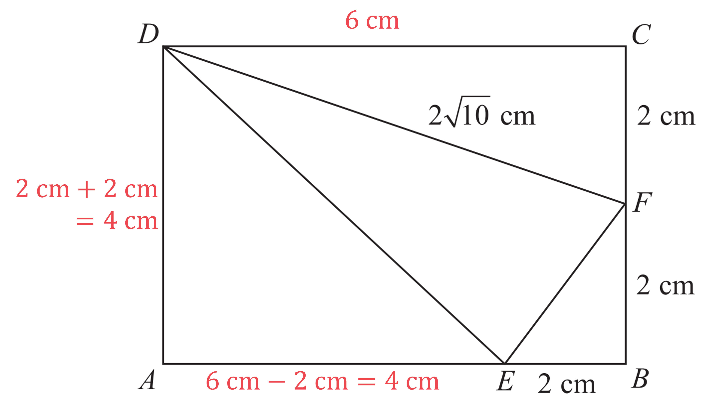

> *Find the areas of the three right angled triangles using the formula *$A=\frac{1}{2}\timesb\timesh$*, where **b** is the length of the base and **h** is the length of the perpendicular height.*

`table row cell Area space of space A D E end cell equals cell 1 half cross times 4 cross times 4 equals 8 end cell row cell Area space of space E F B end cell equals cell 1 half cross times 2 cross times 2 equals 2 end cell row cell Area space of space D C F end cell equals cell 1 half cross times 6 cross times 2 equals 6 end cell end table`

> *Find the area of the rectangle using the formula *$A=b\timesh$*.*

$\mathrm{Area} \mathrm{of}ADCB=6\times4=24$

> *To find the area of triangle **DEF** you can subtract the areas of the other three triangles from the area of the rectangle.*

$\mathrm{Area} \mathrm{of}DEF=24-8-2-6$

**[1]**

$\mathrm{Area} \mathrm{of}DEF=8\mathrm{cm}^{2}$ **[1]**

## Q43 — hard — 3 marks · exam-questions

### 23() — 3 marks
> *Draw a vertical line on the parallelogram to split the shape into a trapezium and a right-angled triangle.*

> *Calculate the perpendicular height of the triangle (and parallelogram) using SOHCAHTOA. *
*Use *$\mathrm{sin}θ=\frac{Opp}{Hyp}$*, as you know the hypotenuse and you want to find the opposite.*

`sin open parentheses 40 close parentheses equals h over 5`

> *Multiply both sides by 5.*

`table attributes columnalign right center left columnspacing 0px end attributes row cell 5 sin open parentheses 40 close parentheses end cell equals h end table`

**[1]**

`table attributes columnalign right center left columnspacing 0px end attributes row cell 3.213938... end cell equals h end table`

> *Calculate the area of the parallelogram by using the formula: *$A=bh$*, where *$b$* is the base and *$h$* is the perpendicular height.*

`table row A equals cell 7 cross times 3.213938... end cell end table`

**[1]**

`table attributes columnalign right center left columnspacing 0px end attributes row A equals cell 22.497566... end cell end table`

> *Round to 1 decimal place.*

$22.5\mathrm{cm}^{2}$* ***[1]**

**Answers between 22.4 and 22.5 will be accepted.**

## Q44 — hard — 5 marks · exam-questions

### 9() — 5 marks
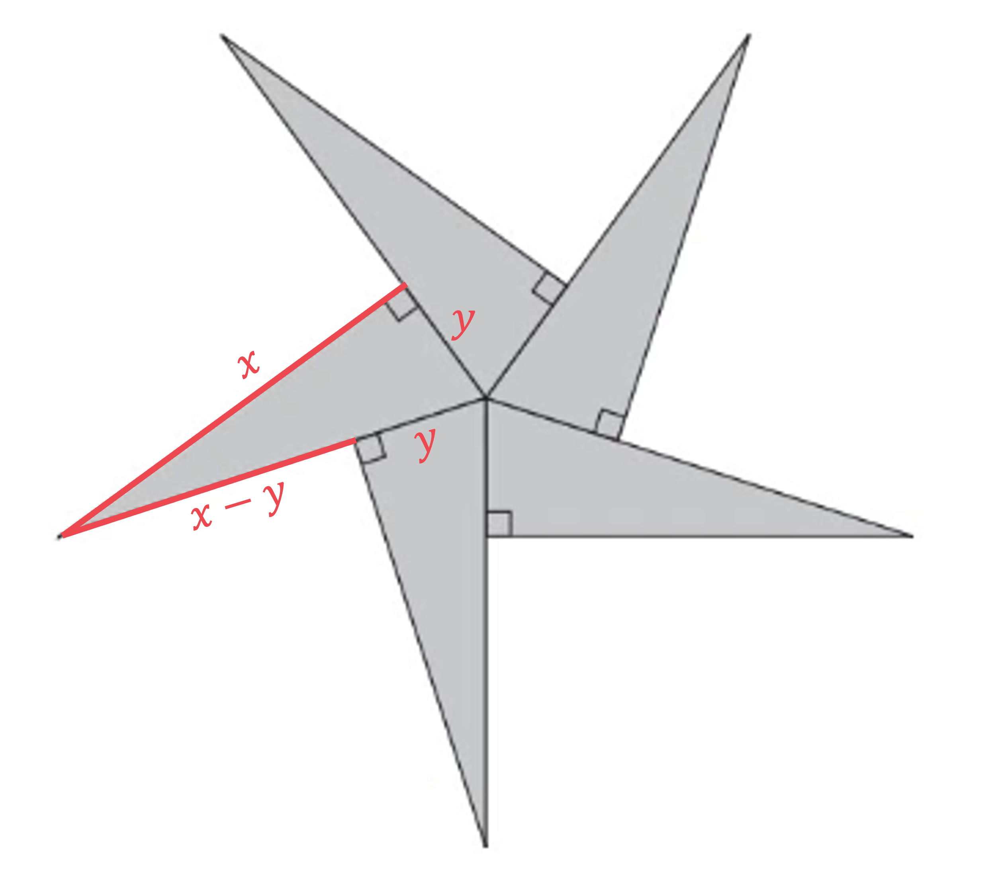

> *If the short side of one triangle is labelled *$y$* and the mid-length side is labelled *$x$*, then the perimeter of the shape is made from 5 lots of 12.8 and 5 lots of *`open parentheses x minus y close parentheses`

> *First find *$x$* using right-angle trigonometry*

$\mathrm{sin}72=\frac{12.8}{x}$

**[1]**

$x=\frac{12.8}{\mathrm{sin}72}=13.45871647...$

**[1]**

> *Answers are expected correct to 3 significant figures so round to at least 4 significant figures in your working or, even better, store the exact answer in your calculator*

> *Next find *$y$* using right-angle trigonometry or Pythagoras' Theorem with your answer for *$x$*. Here we will use trigonometry*

`table row cell tan 72 end cell equals cell fraction numerator 12.8 over denominator x end fraction end cell row x equals cell fraction numerator 12.8 over denominator tan 72 end fraction equals 4.158972112... end cell end table`

**[1]**

> *As above, store the exact answer in your calculator or round to at least 4 significant figures*

`table row cell x minus y end cell equals cell 13.45871647... negative 4.158972112... end cell row blank equals cell 9.299744358... end cell end table`

> *As above, store the exact answer in your calculator or round to at least 4 significant figures*

> *Now calculate the perimeter*

`table row P equals cell 5 open parentheses 12.8 plus 9.299744358... close parentheses end cell end table`

**[1]**

`table row blank equals cell 110.4987218... end cell end table`

> *Remember to give your answer to exactly 3 significant figures, as requested*

**Perimeter = 110 cm** **[1]**

## Q45 — hard — 3 marks · exam-questions

### 14() — 3 marks
> *Draw a horizontal line on the diagram from **C ** to a point **P**  on the line **AB** to form a right-angled triangle. *
*The interior angle at **C** will be the same as *$x$* because alternate angles in parallel lines are equal.*

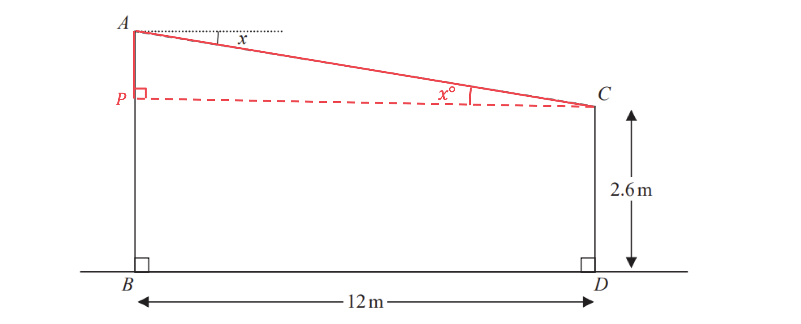

> *Calculate the length of the **AP** on the right-angled triangle **APC** using SOHCAHTOA, when *$x=5$*. *
*You know the length of the adjacent side and you want to work out the length of the opposite side so use *$\mathrm{tan}θ=\frac{Opp}{Adj}$*.*

`table row cell tan space 5 end cell equals cell fraction numerator A P over denominator 12 end fraction end cell end table`

**[1]**

`table row cell 12 cross times tan space 5 end cell equals cell A P end cell row cell A P end cell equals cell 1.0498... end cell end table`

> *Calculate the length **AB** by adding the length **AP** to the length **CD**.*

$1.0498...+2.6=3.6498...$

**[1]**

> *Round to 3 significant figures.*

**3.65 m ****[1]**

## Q46 — hard — 6 marks · exam-questions

### 12((a)) — 3 marks
*Find the length *$d$* by using SOHCAHTOA.* *You know the opposite side and you want to work out the adjacent side so use *$\mathrm{tan}θ=\frac{Opp}{Adj}$*.*

`table row cell tan space 20 end cell equals cell 100 over d end cell end table`

**[1]**

`table row d equals cell fraction numerator 100 over denominator tan space 20 end fraction end cell end table`

**[1]**

`table attributes columnalign right center left columnspacing 0px end attributes row d equals cell 274.7477... end cell end table`

> *Round to 3 significant figures.*

**275 m ****[1]**

### 12((b)) — 3 marks
> *Calculate the height, *$h$*, from the top of the tower to the base of the cliff using SOHCAHTOA on the right-angled triangle formed with the angle of elevation 25**o**.*

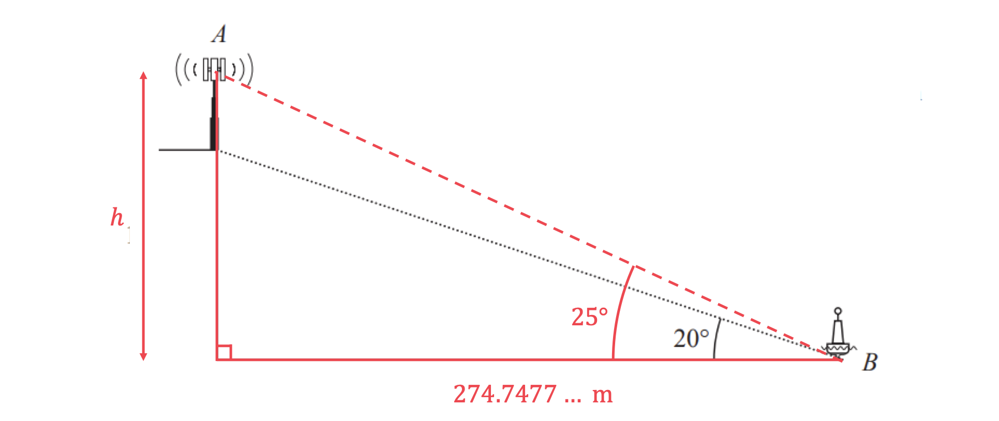

> *You know the length of the adjacent side and you want to work out the length of the opposite side so use *$\mathrm{tan}θ=\frac{Opp}{Adj}$*.*

`table row cell tan space 25 end cell equals cell fraction numerator h over denominator 274.7477... end fraction end cell end table`

**[1]**

`table row cell 274.7477... cross times tan space 25 end cell equals h end table`

**[1]**

`table row h equals cell 128.1169... end cell end table`

> *Calculate the height of the tower by subtracting the height of the cliff from the height of the top of the tower to the base of the cliff.*

$128.1169...-100=28.1169...$

> *Round to 3 significant figures.*

**28.1 m**** [1]**

**Answers in the range 28 to 28.2 will be accepted**

## Q47 — hard — 5 marks · exam-questions

### 11() — 5 marks
> *Calculate the length **AC** from the right-angled triangle **ACD** using Pythagoras' theorem, *$a^{2}+b^{2}=c^{2}$*.*

`table row cell 17 squared end cell equals cell 15 squared plus A C squared end cell end table`

**[1]**

`table row 289 equals cell 225 plus A C squared end cell row 64 equals cell A C squared end cell end table`

**[1]**

`table row cell A C end cell equals 8 end table`

> *The diameter of the semi-circle is therefore 8 cm.*

> *Calculate the arc length of the semi-circle by using the formula for the circumference of a circle, *$C=πd$*, and multiplying it by *$\frac{1}{2}$*.*

> * *`table row cell A r c space l e n g t h space end cell equals cell 1 half cross times straight pi cross times 8 end cell end table`

**[1]**

`table row cell A r c space l e n g t h space end cell equals cell 4 straight pi end cell end table`

> *Work out the perimeter of the shaded shape by adding together the arc length of the semi-circle and the lengths of the sides **AD** and **CD**.*

`table row cell P e r i m e t e r end cell equals cell 4 straight pi plus 17 plus 15 end cell end table`

**[1]**

`table attributes columnalign right center left columnspacing 0px end attributes row cell P e r i m e t e r end cell equals cell 44.5663... end cell end table`

> *Round to 3 significant figures.*

**44.6 cm**** [1]**

## Q48 — hard — 5 marks · exam-questions

### 13() — 5 marks
*Find the length **AB**  for the right-angled triangle **ABJ**  using SOHCAHTOA.* *You know the adjacent side and you want to work out the hypotenuse, so use *$\mathrm{cos}θ=\frac{Adj}{Hyp}$*.*

`table row cell cos space 35 end cell equals cell fraction numerator 15 over denominator A B end fraction end cell end table`

**[1]**

`table row cell A B end cell equals cell fraction numerator 15 over denominator cos space 35 end fraction end cell end table`

**[1]**

`table row cell A B end cell equals cell 18.3116... end cell end table`

> *Because the triangles are congruent, multiply the length **AB** by 4 to calculate the length **AE**.*

$4\times18.3116...=73.2464...$

**[1]**

> *Find the length **EF** by subtracting **AE** from **AF**.*

$80-73.2464...=6.7535...$

**[1]**

> *Round to 3 significant figures.*

**6.75 cm ****[1]**

**Answers between 6.75 and 6.8 will be accepted **

## Q49 — hard — 4 marks · exam-questions

### 12() — 4 marks
> *We have a right-angled triangle so we can calculate the size of angle BAD using trigonometry*

$\mathrm{cos}BAD=\frac{8}{14}$

**[M1]**

`B A D equals cos to the power of negative 1 end exponent open parentheses 8 over 14 close parentheses space equals 55.1500...`

**[M1]**

> *Use this to calculate angle DAC *

$55.15...-38=17.1500...$

> *We can now use trigonometry in triangle DAC to calculate the length of CD*

$\mathrm{tan}17.1500...=\frac{CD}{8}$

**[M1]**

$CD=8\times\mathrm{tan}17.1500...=2.4687...$

> *Give your answer to 3 significant figures, as required*

**Final answer:** **CD ****= 2.47 cm (3 s.f.)**

**[A1]**

> **[mark-scheme]**
> **A1**: Answers in the range 2.44-2.48 will get this final mark.

## Q50 — very_hard — 5 marks · exam-questions

### 16() — 5 marks
> *Method 1*

> *You know two lengths of the right angled triangle **ABC** so you can use Pythagoras' theorem to find the length **AC**.*

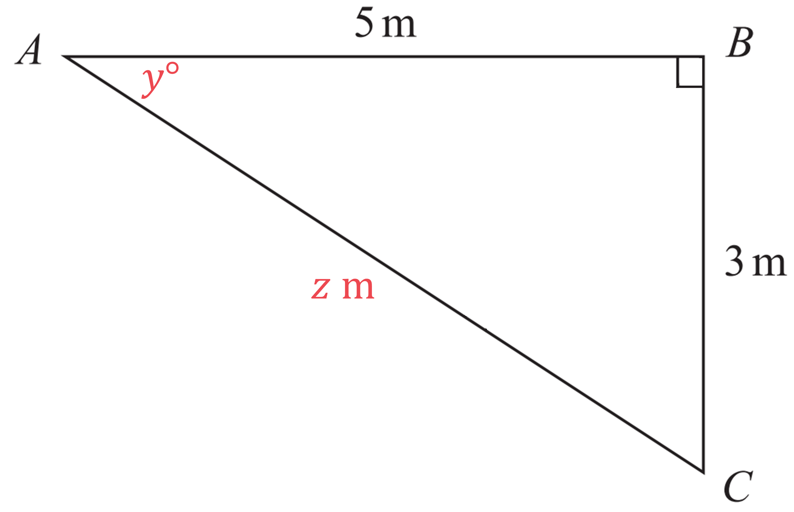

`table attributes columnalign right center left columnspacing 0px end attributes row cell A B squared plus B C squared end cell equals cell A C squared end cell row cell 5 squared plus 3 squared end cell equals cell z squared end cell row 34 equals cell z squared end cell end table`

**[1]**

> *Take the positive square root of both sides. Leave as an exact value.*

`table row z equals cell square root of 34 end cell end table`

**[1]**

> *You now know the lengths of all three sides so you can find any angle. To find **BAC, **you should use the lengths given in the question (the opposite and adjacent sides). Use the tan ratio.*

`tan open parentheses y close parentheses equals 3 over 5`

**[1]**

> *Find the angle by using the inverse tan function.*

`table row y equals cell tan to the power of negative 1 end exponent open parentheses 3 over 5 close parentheses end cell row blank equals cell 30.963756... end cell end table`

> *You now know an angle and the length of the hypotenuse in the triangle **ABD**. You want to find the length of the side that is opposite the angle so use the sine ratio. Use the answer button or your calculator's memory to use the exact value for the angle **BAC**.*

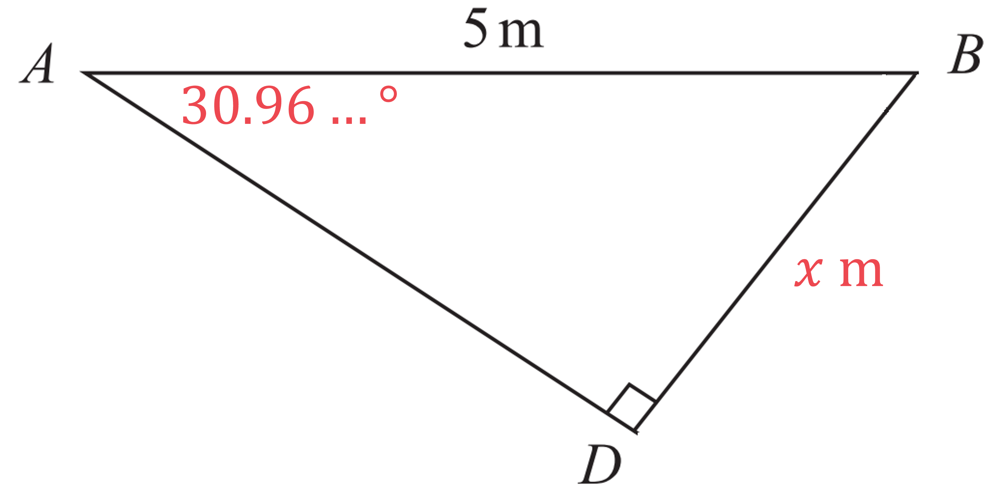

`table attributes columnalign right center left columnspacing 0px end attributes row cell sin open parentheses 30.963756... close parentheses end cell equals cell x over 5 end cell end table`

**[1]**

> *Multiply both sides by 5.*

`table row x equals cell 5 cross times sin open parentheses 30.963756... close parentheses end cell row blank equals cell 2.572478... end cell end table`

> *Add together the four lengths. Use the answer button for the length of **BD**.*

$5+3+\sqrt{34}+2.572478...=16.403430...$

> *Round to 3 significant figures. Remember to include the units for the length.*

$\mathrm{Total} \mathrm{length}=16.4m(3\mathrm{sf})$ **[1]**

> *Method 2*

> *You know two lengths of the right angled triangle **ABC** so you can use Pythagoras' theorem to find the length **AC**.*

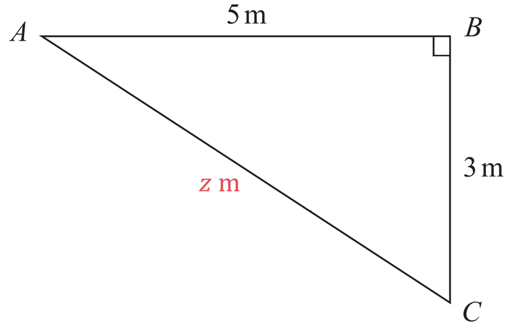

`table row cell A B squared plus B C squared end cell equals cell A C squared end cell row cell 5 squared plus 3 squared end cell equals cell z squared end cell row 34 equals cell z squared end cell end table`

**[1]**

> *Take the positive square root of both sides. Leave as an exact value.*

`table row z equals cell square root of 34 end cell end table`

**[1]**

> *Both triangles **ABC** and **ABD** are right angled and share an angle at the corner **A**. Therefore they have the same three angles so they are similar triangles. The scale factor between the lengths in **ABC **and the corresponding lengths are equal. **AC** corresponds to **AB **(they are both the hypotenuse of their triangles)** **and **BC **corresponds to **BD** (they are both opposite the angle at **A**).*

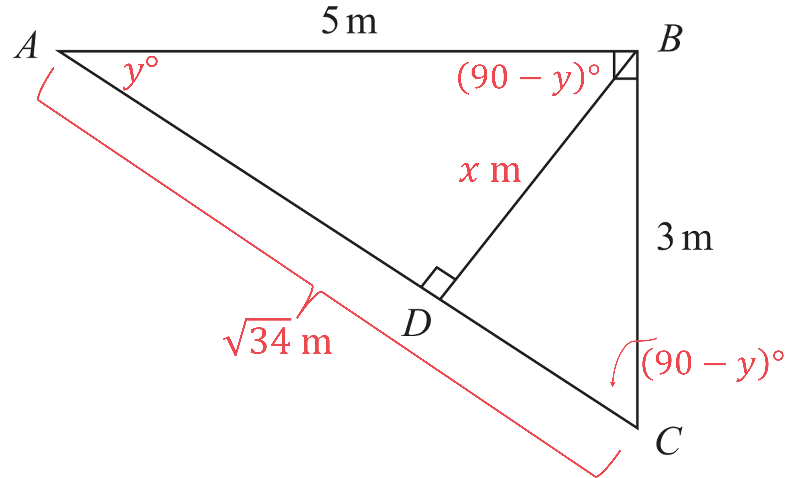

$\frac{BD}{BC}=\frac{AB}{AC}\,\frac{x}{3}=\frac{5}{\sqrt{34}}$

**[1]**

> *Multiply both sides by 3.*

`table row x equals cell 3 cross times fraction numerator 5 over denominator square root of 34 end fraction end cell row blank equals cell fraction numerator 15 over denominator square root of 34 end fraction end cell end table`

**[1]**

> *Add together the four lengths.*

$5+3+\sqrt{34}+\frac{15}{\sqrt{34}}=16.403430...$

> *Round to 3 significant figures. Remember to include the units for the length.*

$\mathrm{Total} \mathrm{length}=16.4m(3\mathrm{sf})$ **[1]**

## Q51 — very_hard — 4 marks · exam-questions

### 19() — 4 marks
> *You know an angle and the length of the side opposite for the right angled triangle **ABC** so you can use the sin ratio to find the length of the hypotenuse **AC**.*

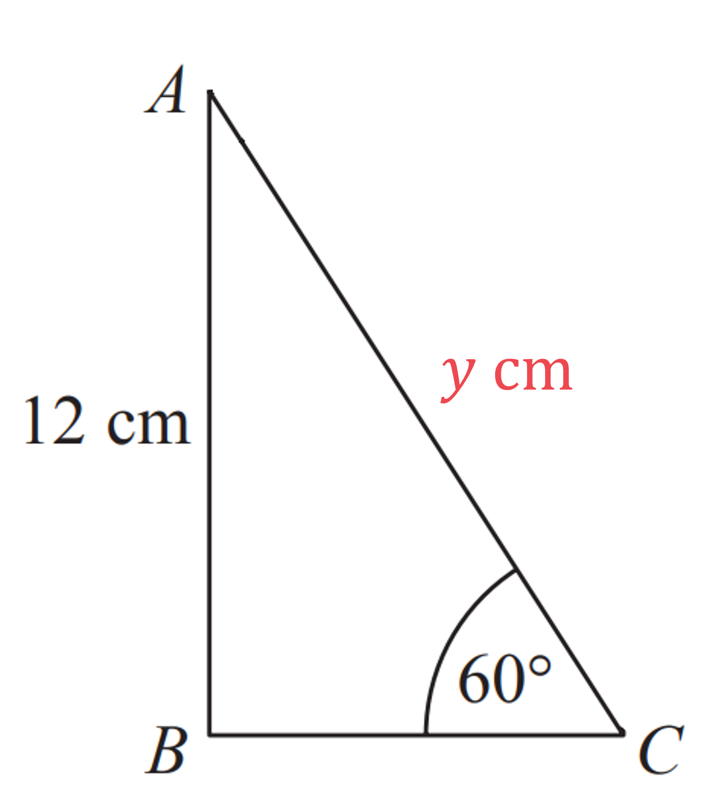

`table row cell sin open parentheses 60 close parentheses end cell equals cell 12 over y end cell end table`

**[1]**

> *Multiply both sides by **y** and divide both sides by sin(60). Leave your answer as an exact value.*

`table attributes columnalign right center left columnspacing 0px end attributes row y equals cell fraction numerator 12 over denominator sin open parentheses 60 close parentheses end fraction end cell row blank equals cell 8 square root of 3 end cell end table`

**[1]**

> *The angle in the rectangle at **C** is 90°.*

`table row cell Angle space A C D end cell equals cell 90 degree minus 60 degree end cell row blank equals cell 30 degree end cell end table`

> *You now know an angle and the length of the adjacent side for the right angled triangle **ACE** so you can use the cos ratio to find the length of the hypotenuse **CE**.*

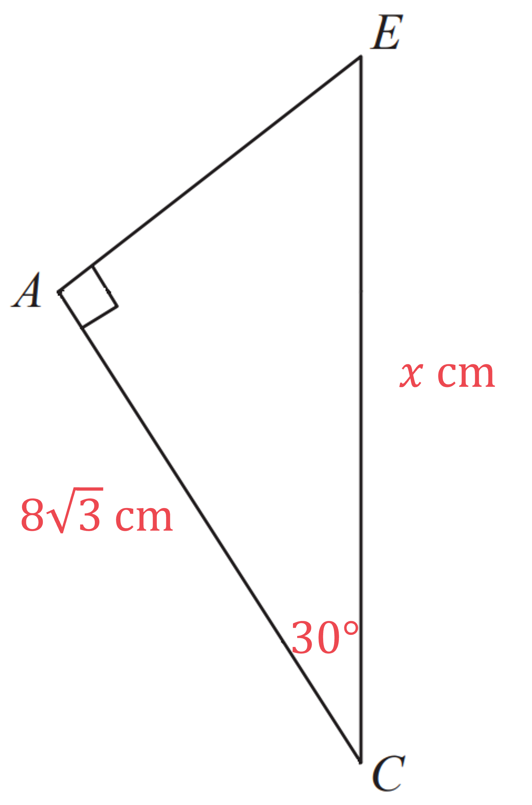

`table row cell cos open parentheses 30 close parentheses end cell equals cell fraction numerator 8 square root of 3 over denominator x end fraction end cell end table`

**[1]**

> *Multiply both sides by **x** and divide both sides by cos(30).*

`table row x equals cell fraction numerator 8 square root of 3 over denominator cos open parentheses 30 close parentheses end fraction end cell row blank equals 16 end table`

**[1]**

> *Remember to include the units for the length.*

$CE=16\mathrm{cm}$ **[1]**

## Q52 — very_hard — 5 marks · exam-questions

### 15((a)) — 1 marks
**The ****angle**** at the circumference within a triangle in a ****semicircle**** is ****90°** **[1]**

### 15((b)) — 4 marks
> *You know an angle and the length of the hypotenuse for the right angled triangle **ABO** so you can use the sin ratio to find the length of the side opposite the angle **OB**. This is also the radius of the circle.*

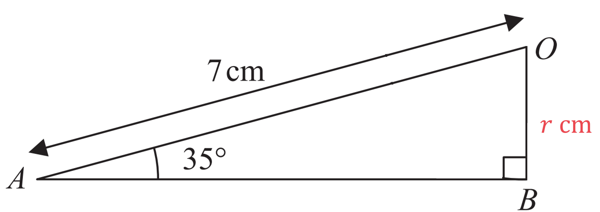

`table row cell sin open parentheses 35 close parentheses end cell equals cell r over 7 end cell end table`

**[1]**

> *Multiply both sides by 7. Leave as an exact answer.*

`table row r equals cell 7 cross times sin open parentheses 35 close parentheses end cell row blank equals cell 7 sin open parentheses 35 close parentheses end cell end table`

**[1]**

> *BD** is the diameter of the circle so it is double the radius.*

`table row cell B D end cell equals cell 2 cross times 7 sin open parentheses 35 close parentheses end cell row blank equals cell 14 sin open parentheses 35 close parentheses end cell end table`

> *You now know an angle and the length of the hypotenuse for the right angled triangle **BCD** so you can use the cos ratio to find the length of the adjacent side **BC**.*

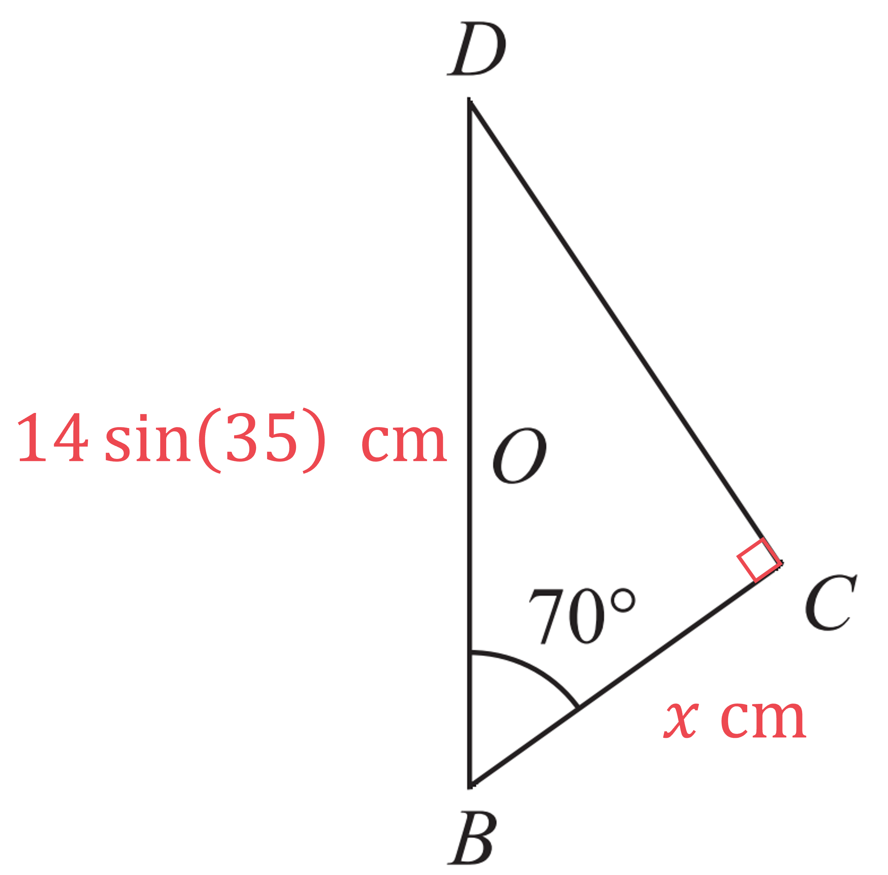

`table row cell cos open parentheses 70 close parentheses end cell equals cell fraction numerator x over denominator 14 sin open parentheses 35 close parentheses end fraction end cell end table`

**[1]**

> *Multiply both sides by 14sin(35).*

`table row x equals cell 14 sin open parentheses 35 close parentheses cross times cos open parentheses 70 close parentheses end cell row blank equals cell 2.746445... end cell end table`

**[1]**

> *Round to 3 significant figures. Remember to include the units for the length.*

$BC=2.75\mathrm{cm}(3\mathrm{sf})$ **[1]**

## Q53 — very_hard — 4 marks · exam-questions

### 8() — 4 marks
> *Draw a sketch. Label the radius **r**. The diagonals of a square are perpendicular.*

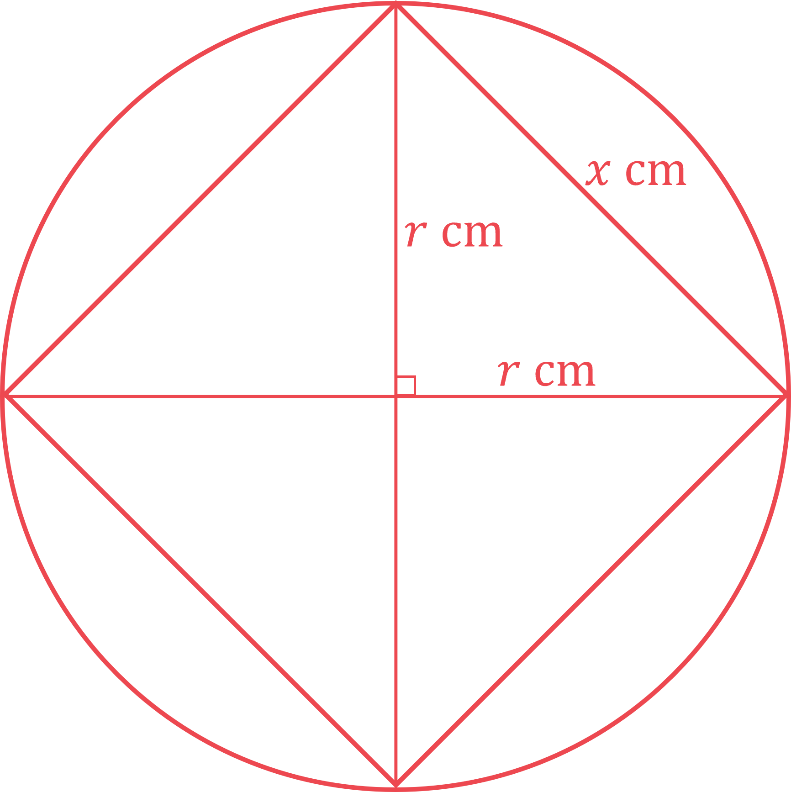

> *Form an equation using the area of the circle.*

$π\timesr^{2}=49$

**[1]**

> *Rearrange to make **r** the subject.*

`table row cell r squared end cell equals cell 49 over straight pi end cell row r equals cell square root of 49 over straight pi end root end cell end table`

> *You can form a right angled triangle using one side of the square and two radii. The length of the square is the hypotenuse of the triangle, you can use Pythagoras' theorem.*

`table row cell r squared plus r squared end cell equals cell x squared end cell end table`

**[1]**

`table row cell open parentheses square root of 49 over straight pi end root close parentheses squared plus open parentheses square root of 49 over straight pi end root close parentheses squared end cell equals cell x squared end cell row cell 49 over straight pi plus 49 over straight pi end cell equals cell x squared end cell row cell 98 over straight pi end cell equals cell x squared end cell end table`

**[1]**

> *Take the positive square root of both sides.*

`table row x equals cell square root of 98 over straight pi end root end cell row blank equals cell 5.585191... end cell end table`

> *Round to 3 significant figures.*

$x=5.59(3\mathrm{sf})$* ***[1]**

## Q54 — very_hard — 5 marks · exam-questions

### 10() — 5 marks
*Calculate the length **CD** using SOHCAHTOA on the right-angled triangle **ACD**.* 
*You know the adjacent side and you want to work out the opposite side so use *$\mathrm{tan}θ=\frac{Opp}{Adj}$*.*

`table row cell tan space 20 end cell equals cell fraction numerator C D over denominator 13 end fraction end cell end table`

**[1]**

`table row cell 13 cross times tan space 20 end cell equals cell C D end cell end table`

**[1]**

`table attributes columnalign right center left columnspacing 0px end attributes row cell C D end cell equals cell 4.7316... end cell end table`

> *Find the length **BD** by adding together the lengths **BC** and **CD**.*

$8+4.7316...=12.7316...$

> *Calculate the angle **BAD** by using SOHCAHTOA on the right-angled triangle **ABD**. *
*You know the opposite side and the adjacent side so use *$\mathrm{tan}θ=\frac{Opp}{Adj}$* again.*

`table row cell tan space open parentheses B A D close parentheses end cell equals cell fraction numerator 12.7316... over denominator 13 end fraction end cell end table`

**[1]**

`table attributes columnalign right center left columnspacing 0px end attributes row cell B A D end cell equals cell tan to the power of negative 1 end exponent open parentheses fraction numerator 12.7316... over denominator 13 end fraction close parentheses end cell end table`

**[1]**

`table row cell B A D end cell equals cell 44.4024... end cell end table`

> *Find the size of angle **BAC** by subtracting angle **CAD** from angle **BAD**.*

$44.4024...-20=24.4024...$

> *Round to 1 decimal place.*

**24.4****o**** ****[1]**

**Answers between 24.3 and 24.41 will be accepted**

## Q55 — very_hard — 5 marks · exam-questions

### 9() — 5 marks
> *To find the length of **AFEDC**, find the length of the hypotenuse of the right angled triangle, subtract the diameter of the semicircle and then add the arc length of the semicircle. *

> *Find the hypotenuse, *$AC$*, of the right-angled triangle **ABC** using SOHCAHTOA.*

> *You want the length of the hypotenuse and you know the length of the side that is adjacent to the angle. Therefore you can use the cosine ratio: *$cosθ=\frac{O}{H}$*.*

`cos open parentheses 30 close parentheses equals fraction numerator 24 over denominator A C end fraction`

**[1]**

> *Rearrange to get **AC** by itself.*

`table row cell A C space cos space open parentheses 30 close parentheses space end cell equals cell space 24 end cell row cell A C end cell equals cell fraction numerator 24 over denominator space cos space open parentheses 30 close parentheses end fraction end cell row blank equals cell 16 square root of 3 space cm end cell end table`

**[1]**

> *Find the diameter of the semicircle by multiplying its radius by 2.*

`table row cell d space end cell equals cell 3 space cross times space 2 space equals space 6 space cm end cell end table`

> *Calculate the length of the arc **FED**, using the formula for the circumference of a circle: *$C=2πr$*, and dividing the result by 2.*

`table row cell Arc space length space end cell equals cell space fraction numerator 2 cross times straight pi cross times 3 over denominator 2 end fraction equals space 3 straight pi space cm end cell end table`

**[1]**

> *Work out the length of **AFEDC  **by subtracting the diameter of the semicircle from the length of **AC** and then adding the arc length of the semicircle on. *

`table row cell A F E D C space end cell equals cell space 16 square root of 3 space minus space 6 space plus space 3 straight pi space cm space end cell row blank equals cell space 31.13759... space cm end cell end table`

**[1]**

> *Round the answer to 2 significant figures.*

> *The second non-zero digit is 1 and the digit following it is also 1, which is less than 5 so you so not need to round the 1 up. *

`3 right enclose 1 bottom enclose.1 end enclose 3759... space equals space 31 space open parentheses 2 space s. f. close parentheses`

**31 cm ****[1] **
**Answers in the range 31 - 31.15 accepted**

## Q56 — very_hard — 5 marks · exam-questions

### 23() — 5 marks
> *We have two similar triangles; a small triangle formed by the horizontal strut and the portion of step ladder above it, and a large triangle formed by the whole step ladder with the ground.*

> *We can label the height and the slant height of the small triangle as **H **and **L** respectively. On the diagram below, **h** is divided in the ratio 2 : 1 (because "the strut is one third of the way up the ladder");*

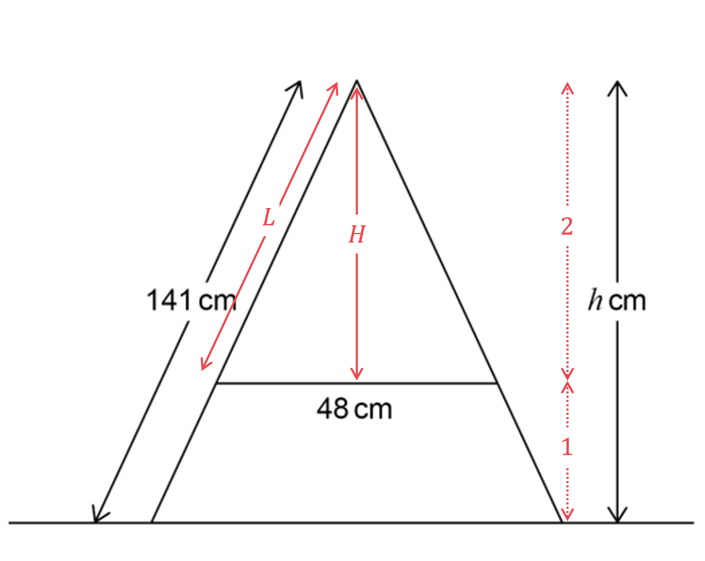

> *If **H** is the vertical height of the small triangle formed by the horizontal strut and the ladder above it, then **H** : **h** is in the ratio 2 : 3, or  *$H=\frac{2}{3}h$*.*

> *Therefore the scale factor, **k**, between the big triangle and the small triangle is *

$k=\frac{2}{3}$

> *From this we can calculate **L**, the slant height of the small triangle.*

$L=141\times\frac{2}{3}=94\mathrm{cm}$

**[1]**

> *We can form a right-angle triangle in the small triangle, where the base is half of the 48 cm strut length:*

**connecting 94 and 24 in a right-angle triangle**** [1]**

> *We can find **H** using Pythagoras' Theorem*

`table row H equals cell square root of 94 squared minus 24 squared end root end cell row blank equals cell 90.88455214... end cell end table`

**[1]**

> *It is best to store this value in your calculator- but if you round it, round to at least 4 significant figures to preserve accuracy,*

> *We can connect this value for **H** with **h** using the scale factor.*

`table attributes columnalign right center left columnspacing 0px end attributes row cell 90.88455214... end cell equals cell 2 over 3 h end cell end table`

> *Divide both sides by *$\frac{2}{3}$* to find **h**.*

`table row h equals cell 90.88455214... divided by 2 over 3 end cell end table`

**[1]**

`table row blank equals cell 136.3268132... end cell end table`

> *As no level of accuracy is specified in the question, round your answer to a sensible level of accuracy- as a general rule, at least 3 significant figures but here we will use 1 decimal place.*

**Answer = 136.3 cm (1 d.p.)**** ****[1]**

## Q57 — very_hard — 6 marks · exam-questions

### 24((a)) — 2 marks
> *Find an expression for the length of **OA** in terms of *$x$* using **SOHCAHTOA** on the right-angled triangle **OAC**. You know the length of the hypotenuse and you want to know the length of the adjacent side, so use *$\mathrm{cos}θ=\frac{Adj}{Hyp}$*.*

> *Substitute the given values into the formula.*

`table row cell cos space x end cell equals cell fraction numerator O A over denominator 15 end fraction end cell end table`

**[1]**

`table row cell 15 cos space x end cell equals cell O A end cell end table`

> *Let **P** be the lowest point on the wheel, forming a straight line **OAPB**.*

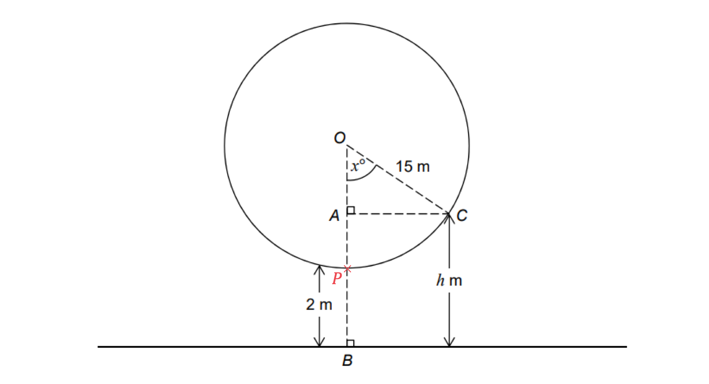

> *Find an expression for the length **AP i**n terms of** *$x$*by subtracting the length **OA** from the radius of the wheel (**OP**).*

$AP=15-15\mathrm{cos}x$

> *Find an expression for the height, *$h$*, in terms of *$x$* by adding the length **AP** to the height of **P** above the ground.*

$h=15-15\mathrm{cos}x+2$

> *Simplify.*

$h=17-15\mathrm{cos}x$* ***[1]**

### 24((b)) — 2 marks
> *Method 1:*

> *Use the result from part (a) to find the height of a specific point above the ground by substituting in the given angle.*

$h=17-15\mathrm{cos}120$

**[1]**

$24.5m$* ***[1]**

> * *

> *Method 2:*

> *Sketch a right-angled triangle onto the diagram using the line **OD **as the hypotenuse.*

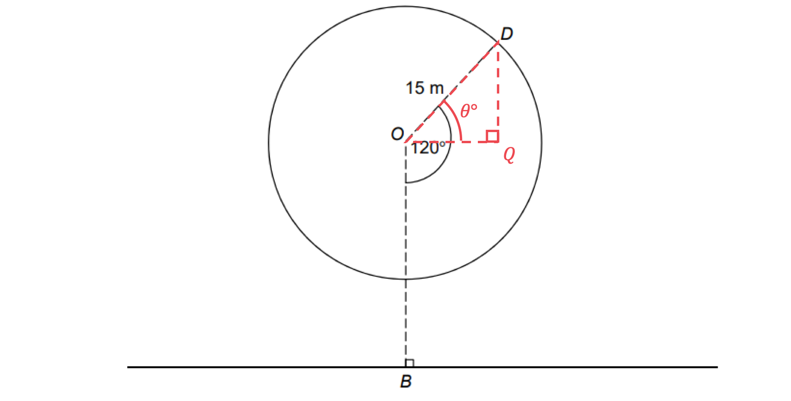

> *Find the size of the angle *$θ$* by subtracting the right angle **BOQ** from the angle **BOD**.*

$θ=120-90=30$

> *Calculate the vertical distance **DQ** using **SOHCAHTOA**. *
*You know the length of the hypotenuse **OD** and you want to work out the length of the opposite side **DQ**, so use *$\mathrm{sin}θ=\frac{Opp}{Hyp}$*.*

`table row cell sin space 30 end cell equals cell fraction numerator D Q over denominator 15 end fraction end cell row cell 15 sin space 30 end cell equals cell D Q end cell row cell 7.5 end cell equals cell D Q end cell end table`

**[1]**

> *Find the height of **D** above the ground by adding together the distance between the lowest point on the wheel to the ground, the radius of the wheel and the length **DQ**.*

$2+15+7.5$

$24.5m$* ***[1]**

### 24((c)) — 2 marks
> *Method 1*

> *The initial vertical height is 2 m, suggesting that the height of the wheel above the ground is at a minimum when the angle is 0. *
*The maximum height will occur halfway round one complete turn.*

$x_{P}=180$

> *Substitute the angle at which the maximum vertical height occurs into the expression found in part (a) in order to work out the maximum vertical height of the wheel. *

`table row cell h subscript P end cell equals cell 17 minus 15 space cos space 180 equals 32 end cell end table`

> *Write down the coordinates of **P**.*

$(180,32)$** 180**** [1]*** *
**32**** [1]**

> * *

> *Method 2:*

> *The highest point on the graph, **P**, occurs at the maximum vertical height of the wheel. Find this maximum vertical distance by multiplying the radius by 2 and adding the distance between the lowest point on the wheel and the ground.*

$h_{P}=15\times2+2=32$

> *The initial vertical height is 2 m, suggesting that the height of the wheel above the ground is at a minimum when the angle is 0. *
*The maximum height will occur halfway round one complete turn.*

$x_{P}=180$

> *Write down the coordinates of **P**.*

$(180,32)$** 180**** [1]*** *
**32**** [1]**

## Q58 — very_hard — 5 marks · exam-questions

### 8() — 5 marks
> *To find the area of the circle, the length of the radius will need to be found.*

> *BD **is a diameter so angle **BCD** is the angle in a semicircle.*

*Angle ***BCD*** = 90°* *(The angle in a semicircle is a right angle)*

> *Triangle **BCD **is a right-angled triangle, so if one more angle is found, SOHCAHTOA can be used to find the length of the diameter.*

> *Find angle **CBD**.*

*Angle ***CBD*** = Angle ***CAD***   (Angles in the same segment are equal) Angle ***CBD*** = 28°*

**Either angle BCD or angle CBD found ****[1]**

> *Triangle **BCD** is a right angled triangle with an angle so you can use trigonometry. You know the length of the side that is opposite to the angle and you want the length of the hypotenuse. Therefore you can use the sine ratio: *$\mathrm{sin}θ=\frac{O}{H}$*.*

`sin open parentheses 28 close parentheses space equals space fraction numerator 6.4 over denominator B D end fraction`

**[1]**

> *Rearrange to make **BD **the subject.*

`table row cell 6.4 thin space end cell equals cell space B D cross times sin open parentheses 28 close parentheses end cell row cell B D end cell equals cell fraction numerator 6.4 over denominator sin open parentheses 28 close parentheses end fraction end cell row blank equals cell space 13.632348... end cell end table`

**[1]**

> *The radius is equal to half of the diameter.*

`table row cell r space end cell equals cell space fraction numerator 13.632348... over denominator 2 end fraction space equals space 6.8161742... end cell end table`

> *You can now find the area of the circle using the formula *$A=πr^{2}$*, where **r** is the radius of the circle. Use the answer button or store the radius in your calculator's memory.*

`table row cell Area space end cell equals cell space pi open parentheses 6.8161742... close parentheses squared end cell row blank equals cell 145.959123... end cell end table`

**[1]**

> *Round to 3 significant figures. Remember to include square units for the area.*

$\mathrm{Area}=146\mathrm{cm}^{2}(3s.f.)$* ***[1] **
**Answers in the range 145.2 to 146.2 accepted.**

## Q59 — very_hard — 5 marks · exam-questions

### 12((a)) — 2 marks
> *Rewrite 20 as a multiplication involving a square number, in this case 4*

$\sqrt{20}=\sqrt{4\times5}$

**[1]**

> *Rewrite this surd using the fact that *$\sqrt{ab}=\sqrt{a}\sqrt{b}$

$\sqrt{4\times5}=\sqrt{4}\times\sqrt{5}$

> *Simplify using *$\sqrt{4}=2$

$\sqrt{4}\times\sqrt{5}=2\sqrt{5}$ **[1]**

### 12((b)) — 3 marks
> *If both point A and point B both lie on gridlines, then they must form a right-angled triangle where the lengths of the two shorter sides are both integer values and the length of the hypotenuse is the direct distance between A and B.*

> *Substitute the given direct distance between A and B into Pythagoras' theorem, *$c^{2}=a^{2}+b^{2}$*, where *$a$* and *$b$* are the lengths of the two shorter sides and *$c$* is the length of the hypotenuse.*

`open parentheses 2 square root of 5 close parentheses squared equals a squared plus b squared`

> *Simplify, using your answer of *$\sqrt{20}=2\sqrt{5}$* from part (a).*

`table attributes columnalign right center left columnspacing 0px end attributes row cell open parentheses square root of 20 close parentheses squared end cell equals cell a squared plus b squared end cell row 20 equals cell a squared plus b squared end cell end table`

**[1]**

> *If a and b must be integer values, then a**2** and b**2** must be square numbers that are also integers. List all of the square numbers below 20.*

$1,4,9,16$

> *Identify a pair of square numbers that sum to 20, these are a**2** and b**2**.*

$a^{2}=4\,b^{2}=16$

**[1]**

> *Take the square root of both to find the values of a and b.*

$a=2\,b=4$

> *This means that B could be located in one of two positions, it could be:*

> *   - 2 squares to the right and 4 squares up OR*

> *   - 4 squares to the right and 2 squares up*

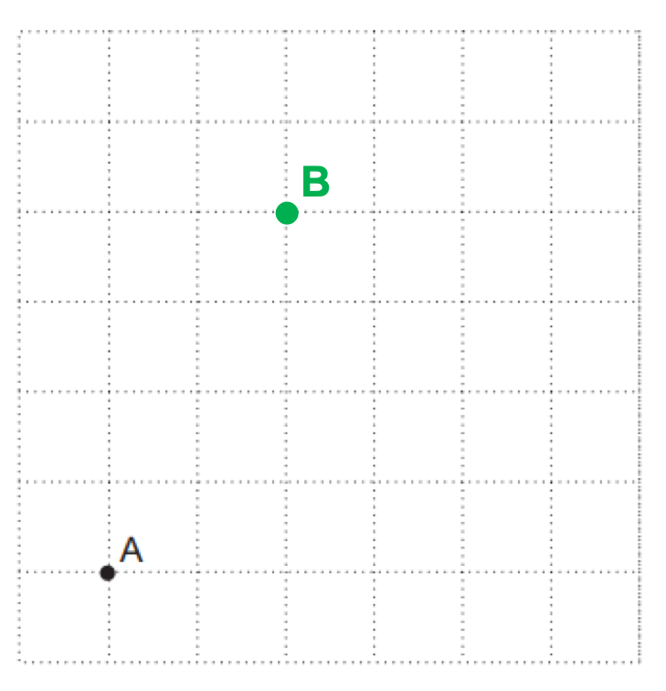

**OR**

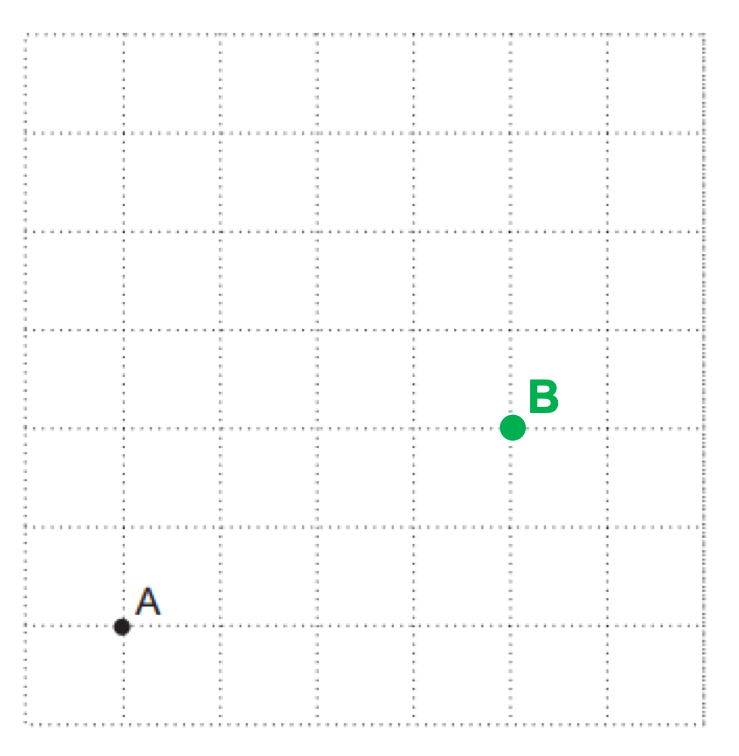

**[1]**
