# Exam Questions — Right-Angled Triangles - Pythagoras & Trigonometry
**Geometry & Trigonometry** · Edexcel IGCSE Maths A (4MA1) — 18/Higher
> Source: [https://www.savemyexams.com/igcse/maths/edexcel/a/18/higher/topic-questions/4-geometry-and-trigonometry/right-angled-triangles---pythagoras-and-trigonometry/exam-questions/](https://www.savemyexams.com/igcse/maths/edexcel/a/18/higher/topic-questions/4-geometry-and-trigonometry/right-angled-triangles---pythagoras-and-trigonometry/exam-questions/) · 59 questions · total 235 marks

## Q1 — easy — 3 marks · exam-questions

### 11() — 3 marks — command: calculate — structured — from paper June 2013 · 1MA0/2H
$XYZ$ is a right-angled triangle.

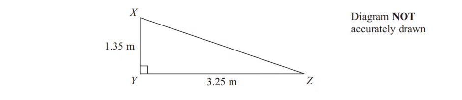

Calculate the length of $XZ$. 
Give your answer correct to 3 significant figures.

## Q2 — easy — 3 marks · exam-questions

### 15() — 3 marks — command: work_out — structured — from paper November 2013 · 1MA0/2H
Here is a right-angled triangle.

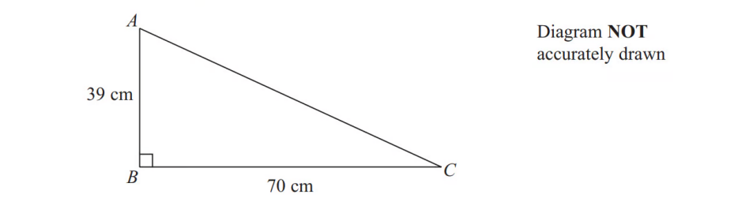

Work out the length of $AC$. 
Give your answer correct to 1 decimal place.

## Q3 — easy — 3 marks · exam-questions

### 16() — 3 marks — command: calculate — structured — from paper June 2012 · 1MA0/2H
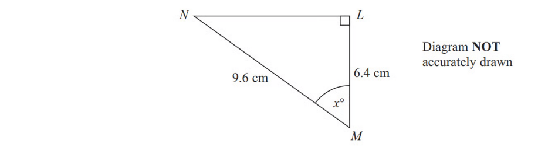

$LMN$is a right-angled triangle. 
$MN$= 9.6 cm. 
$LM$= 6.4 cm.

Calculate the size of the angle marked $x^{\circ}$. 
Give your answer correct to 1 decimal place.

## Q4 — easy — 3 marks · exam-questions

### 17() — 3 marks — command: calculate — structured — from paper November 2012 · 1MA0/2H
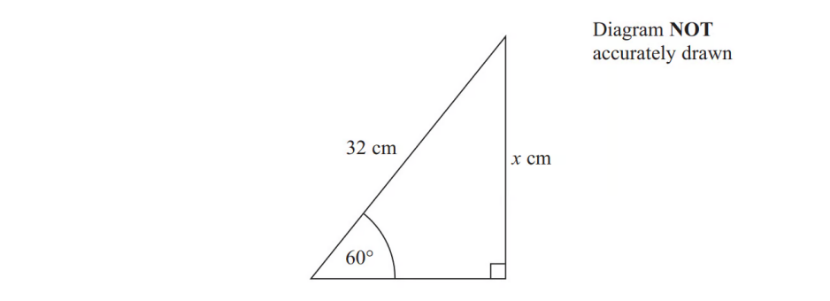

Calculate the value of $x$. 
Give your answer correct to 3 significant figures.

## Q5 — easy — 3 marks · exam-questions

### 13((b)) — 3 marks — command: work_out — structured — from paper March 2013 · 1MA0/2H
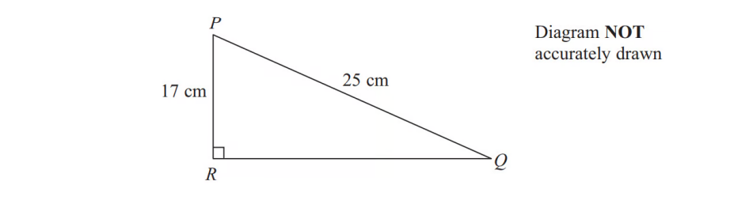

$PQR$is a right-angled triangle. 
$PR$ = 17 cm 
$PQ$= 25 cm

Work out the size of angle $RPQ$. 
Give your answer correct to 1 decimal place.

## Q6 — easy — 2 marks · exam-questions

### 7() — 2 marks — command: calculate — structured — from paper June 2017 · 1MA1/3H
$ABC$is a right-angled triangle.

Calculate the length of $AB$. 
Give your answer correct to 3 significant figures.

## Q7 — easy — 2 marks · exam-questions

### 2() — 2 marks — command: work_out — structured — from paper Sample 2015 · 1MA1/2H
$PQR$is a right-angled triangle.

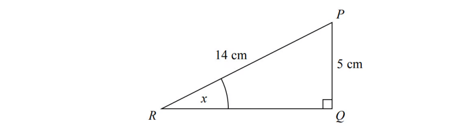

Work out the size of the angle marked $x$. 
Give your answer correct to 1 decimal place.

## Q8 — easy — 2 marks · exam-questions

### 5() — 2 marks — command: calculate — structured — from paper June 2019 · 1MA1/2H
$ABC$is a right-angled triangle.

Calculate the length of $AB$. 
Give your answer correct to 2 decimal places.

## Q9 — easy — 3 marks · exam-questions

### 3() — 3 marks — command: work_out — structured — from paper Jan 2022 · 4MA1/1H
The diagram shows triangle *ABC*

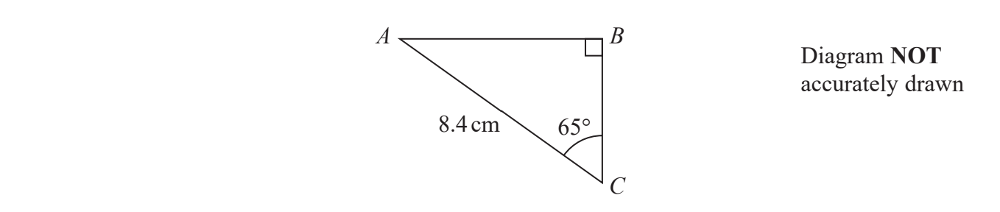

Work out the length of the side *AB* 
Give your answer correct to 3 significant figures.

...................................................... cm

## Q10 — easy — 3 marks · exam-questions

### 11() — 3 marks — command: calculate — structured — from paper Nov 2020 · 4MA1/2H
The diagram shows a right-angled triangle.

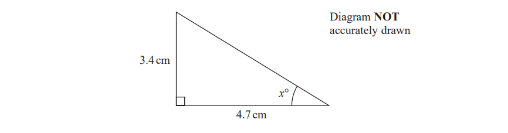

Calculate the value of$x.$ 
Give your answer correct to one decimal place.

$x=$............................................

## Q11 — easy — 3 marks · exam-questions

### 4() — 3 marks — command: work_out — structured — from paper Jan 2020 · 4MA1/2HR
The diagram shows a rectangle and a diagonal of the rectangle.

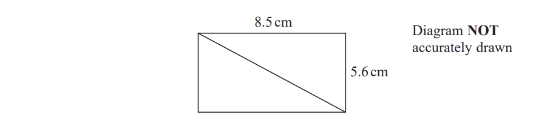

Work out the length of the diagonal of the rectangle. Give your answer correct to 1 decimal place.

.....................$\mathrm{cm}$

## Q12 — easy — 3 marks · exam-questions

### 7() — 3 marks — command: use — structured — from paper Nov 2020 · 8300/3H
Use Pythagoras’ theorem to work out the value of $x$.

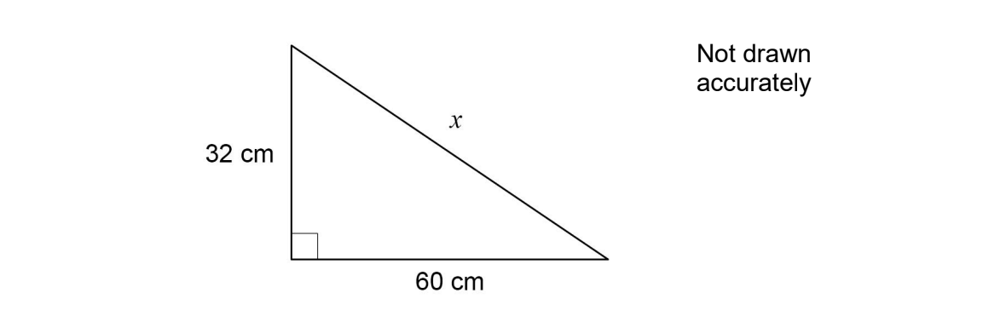

## Q13 — easy — 3 marks · exam-questions

### 1() — 3 marks — command: calculate — structured
Calculate the size of angle $x$.

Give your answer correct to 1 decimal place.

$x=$............°

## Q14 — medium — 3 marks · exam-questions

### 13() — 3 marks — command: work_out — structured — from paper March 2013 · 1MA0/2H
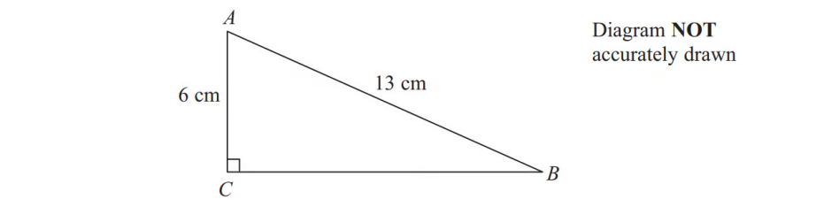

$ABC$is a right-angled triangle. 
$AC$= 6 cm
$AB$  = 13 cm

Work out the length of $BC$.
Give your answer correct to 3 significant figures.

## Q15 — medium — 5 marks · exam-questions

### 13() — 5 marks — command: work_out — structured — from paper June 2015 · 1MA0/1H
Here is a rectangle.

The 8-sided shape below is made from 4 of these rectangles and 4 congruent right-angled triangles.

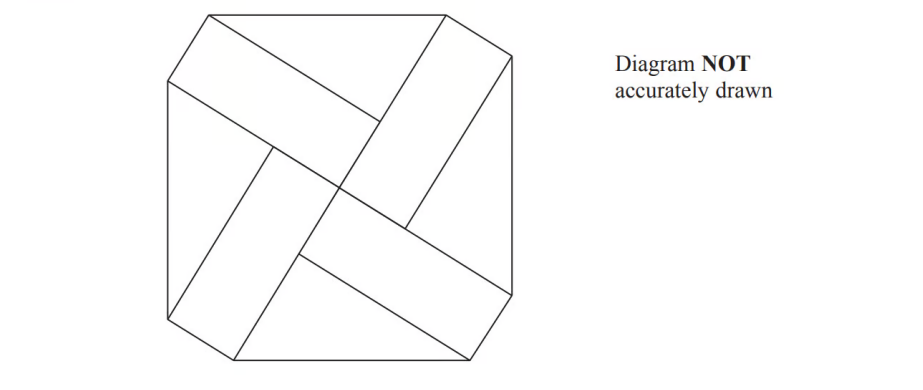

Work out the perimeter of the 8-sided shape. 
You must show all your working.

## Q16 — medium — 5 marks · exam-questions

### 7() — 5 marks — structured — from paper November 2015 · 1MA0/2H
Here is part of a field.

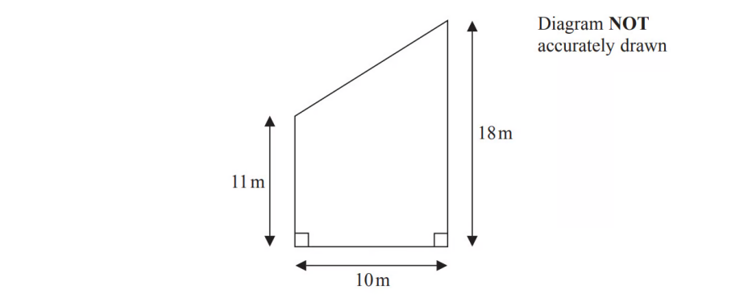

This part of the field is in the shape of a trapezium. 
A farmer wants to put a fence all the way around the edge of this part of the field.

The farmer has 50m of fence.

Does he have enough fence? 
You must show all your working.

## Q17 — medium — 4 marks · exam-questions

### 9() — 4 marks — command: work_out — structured — from paper November 2016 · 1MA0/2H
The diagram shows a rectangular framework.

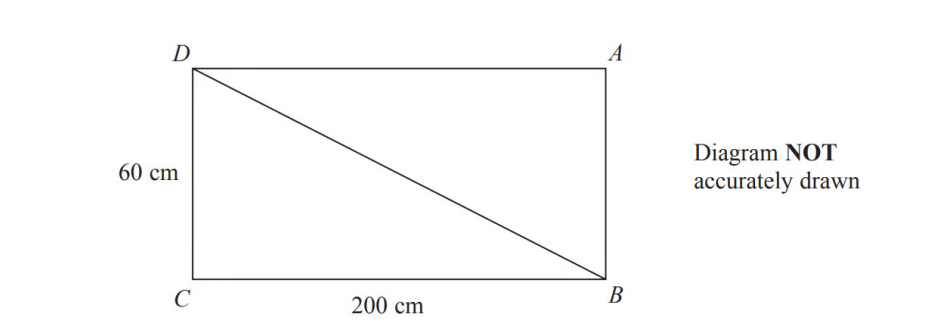

The framework is made from 5 metal rods. 
The metal rods have a weight of 0.9 kg per metre.

Work out the total weight of the framework. 
Give your answer, in kg, correct to 3 significant figures.

## Q18 — medium — 4 marks · exam-questions

### 4() — 4 marks — command: deduce — structured — from paper Spec2 2015 · 1MA1/1H
Triangle$ABC$has perimeter 20 cm.

$AB$= 7 cm. 
$BC$= 4 cm.

By calculation, deduce whether triangle $ABC$is a right-angled triangle.

## Q19 — medium — 3 marks · exam-questions

### 20() — 3 marks — structured — from paper June 2013 · 1MA0/2H
The diagram shows a ladder leaning against a vertical wall.

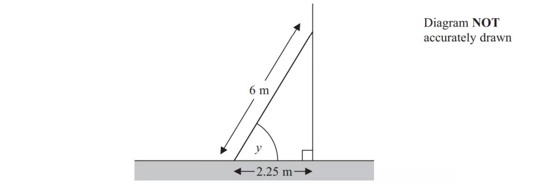

The ladder stands on horizontal ground.

The length of the ladder is 6 m. 
The bottom of the ladder is 2.25 m from the bottom of the wall.

A ladder is safe to use when the angle marked $y$ is about 75°.

Is the ladder safe to use? 
You must show all your working.

## Q20 — medium — 3 marks · exam-questions

### 5((a)) — 2 marks — command: work_out — structured — from paper June 2018 · 1MA1/3H
$ABC$is a right-angled triangle.

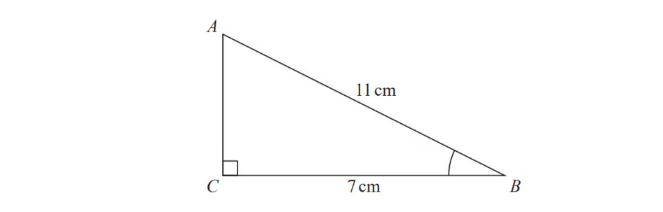

Work out the size of angle $ABC$. 
Give your answer correct to 1 decimal place.

### 5((b)) — 1 mark — command: give — structured — from paper June 2018 · 1MA1/3H
The length of the side $AB$is reduced by 1 cm.

The length of the side $BC$is still 7 cm. 
Angle $ACB$is still 90°

Will the value of cos$ABC$increase or decrease? 
You must give a reason for your answer.

## Q21 — medium — 7 marks · exam-questions

### 15((a)) — 3 marks — command: calculate — structured — from paper June 2014 · 1MA0/2H
The diagram shows the positions of three turbines $A,B$ and $C$.

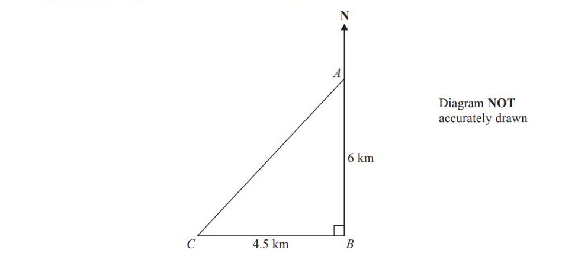

$A$ is 6 km due north of turbine $B$. 
$C$ is 4.5 km due west of turbine $B$.

Calculate the distance $AC$.

### 15((b)) — 4 marks — command: calculate — structured — from paper June 2014 · 1MA0/2H
Calculate the bearing of $C$ from $A$. 
Give your answer correct to the nearest degree.

## Q22 — medium — 4 marks · exam-questions

### 18() — 4 marks — command: work_out — structured — from paper November 2013 · 1MA0/2H
$ABC$is an isosceles triangle.

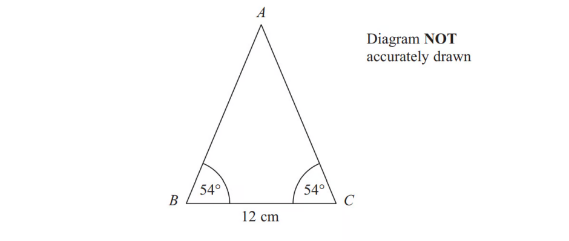

Work out the area of the triangle. 
Give your answer correct to 3 significant figures.

## Q23 — medium — 3 marks · exam-questions

### 20() — 3 marks — command: calculate — structured — from paper March 2013 · 1MA0/2H
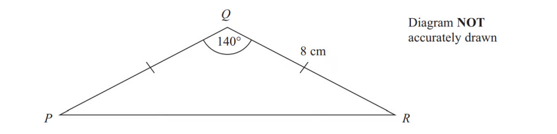

Calculate the length of $PR$. 
Give your answer correct to 3 significant figures.

## Q24 — medium — 4 marks · exam-questions

### 9() — 4 marks — command: calculate — structured — from paper Jan 2022 · 4MA1/1H
The diagram shows isosceles triangle $ABC$

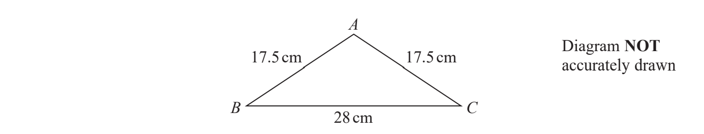

$AB=AC=17.5\mathrm{cm}$             $BC=28\mathrm{cm}$

Calculate the area of triangle $ABC$

...................................................... cm2

## Q25 — medium — 3 marks · exam-questions

### 12() — 3 marks — command: work_out — structured — from paper Jan 2022 · 4MA1/2HR
The diagram shows two vertical phone masts, $AB$ and $CD$, on horizontal ground.

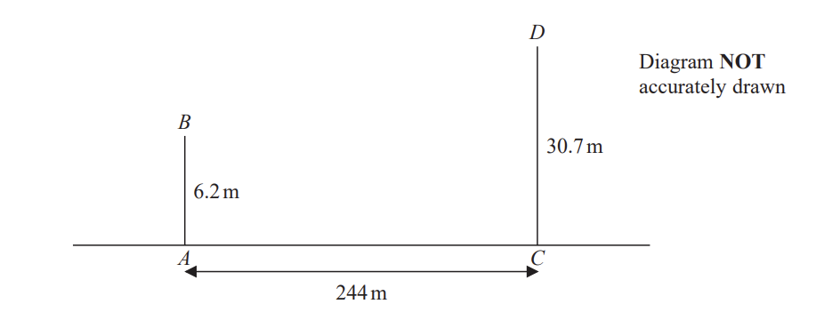

$AB=6.2m$      $AC=244m$     $CD=30.7m$

Work out the size of the angle of depression of $B$ from $D$ 
Give your answer correct to one decimal place.

## Q26 — medium — 4 marks · exam-questions

### 7() — 4 marks — command: work_out — structured — from paper Jan 2019 · 4MA1/2HR
The diagram shows a trapezium.

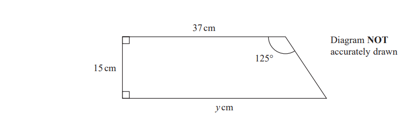

Work out the value of $y.$ 
Give your answer correct to $1$ decimal place.

$y=$

## Q27 — medium — 4 marks · exam-questions

### 6() — 4 marks — command: work_out — structured — from paper June 2018 · 4MA1/1H
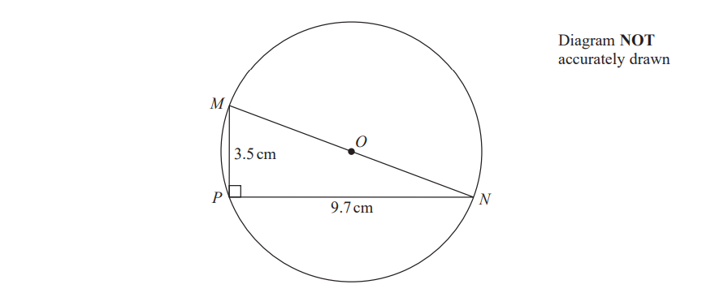

$M,N$ and $P$ are points on a circle, centre $O$. 
$MON$ is a diameter of the circle.

$MP=3.5cm$ 
$PN=9.7cm$

Angle $MPN=90^{\circ}$

Work out the circumference of the circle. 
Give your answer correct to 3 significant figures.

....................................................... cm

## Q28 — medium — 3 marks · exam-questions

### 8() — 3 marks — command: work_out — structured — from paper June 2018 · 4MA1/2HR
From point $A$, Stanley walks $200m$ due east to point $B$. 
From $B$, he then walks $160m$ due south to point $C$.

Work out the length of $AC$. 
Give your answer correct to $3$ significant figures.

.......................................metres

## Q29 — medium — 4 marks · exam-questions

### 10() — 4 marks — command: work_out — structured — from paper June 2018 · 4MA1/2HR
$ABCD$ is a trapezium.

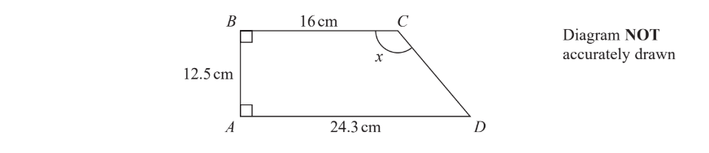

Work out the size of angle $x$. 
Give your answer correct to $1$ decimal place.

## Q30 — medium — 4 marks · exam-questions

### 9() — 4 marks — command: work_out — structured — from paper Specimen paper · 4MA1/1H
The diagram shows an isosceles triangle.

Work out the area of the triangle.

## Q31 — medium — 3 marks · exam-questions

### 6() — 3 marks — command: calculate — structured — from paper Specimen paper · 4MA1/2H
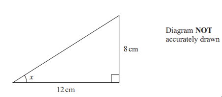

Calculate the size of angle $x$. Give your answer correct to 1 decimal place.

## Q32 — medium — 5 marks · exam-questions

### 10() — 5 marks — command: work_out — structured — from paper 2023 Nov · 4MA1/1H
Here is triangle $ABC$

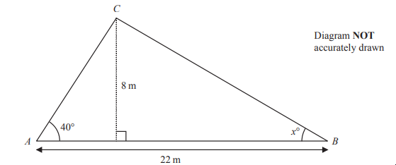

Work out the value of $x$ 
Give your answer correct to one decimal place. 
Show your working clearly.

## Q33 — medium — 4 marks · exam-questions

### 2() — 4 marks — command: work_out — structured — from paper 2023 Nov · 4MA1/2H
The diagram shows triangle $ABC$ and triangle  $ECD$

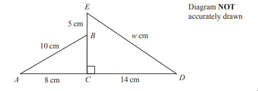

$ACD$ and  $EBC$ are straight lines.

$AB=10\mathrm{cm}AC=8\mathrm{cm}EB=5\mathrm{cm}CD=14\mathrm{cm}ED=w\mathrm{cm}$

Work out the value of $w$
Give your answer correct to one decimal place

## Q34 — hard — 4 marks · exam-questions

### 6() — 4 marks — command: work_out — structured — from paper Sample 2015 · 1MA1/2H
Triangles $ABD$ and $BCD$ are right-angled triangles.

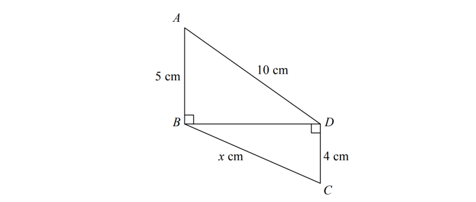

Work out the value of $x$. 
Give your answer correct to 2 decimal places.

## Q35 — hard — 5 marks · exam-questions

### 18() — 5 marks — command: calculate — structured — from paper June 2012 · 1MA0/2H
The diagram shows a quadrilateral $ABCD$.

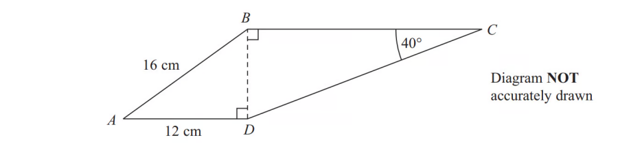

$AB=16\mathrm{cm}.\,AD=12\mathrm{cm}.\,\mathrm{Angle}BCD=40^{\circ}.\,\mathrm{Angle}ADB=\mathrm{angle}CBD=90^{\circ}.$

Calculate the length of $CD.$ 
Give your answer correct to $3$ significant figures.

## Q36 — hard — 4 marks · exam-questions

### 9() — 4 marks — command: calculate — structured — from paper Spec1 2015 · 1MA1/3H
The diagram shows two vertical posts, $AB$ and $CD$, on horizontal ground.

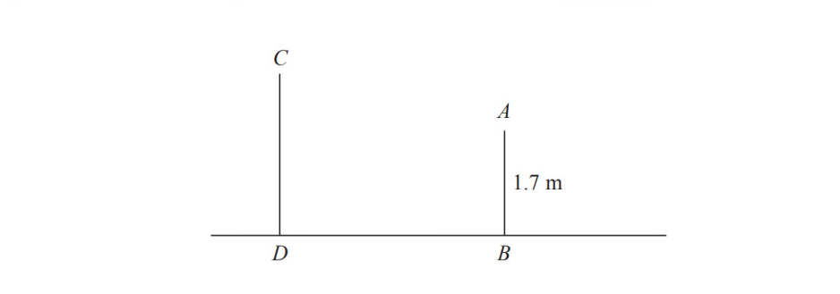

$AB$ = 1.7 m 
$CD:AB$ = 1.5 : 1

The angle of elevation of $C$ from $A$ is 52°.

Calculate the length of $BD$. 
Give your answer correct to 3 significant figures.

## Q37 — hard — 4 marks · exam-questions

### 1() — 4 marks — command: work_out — structured
The diagram shows an isosceles triangle.

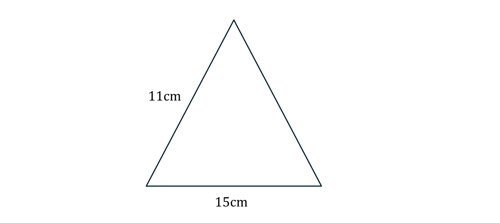

Work out the area of the triangle. Give your answer to 3 significant figures.

........... cm2

## Q38 — hard — 5 marks · exam-questions

### 15() — 5 marks — command: calculate — structured — from paper November 2012 · 1MA0/2H
$ABCD$ is a trapezium.

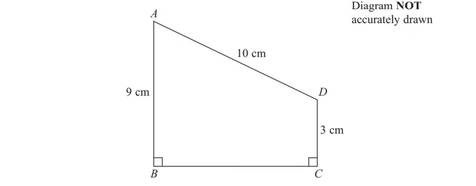

$AD=10\mathrm{cm}\,AB=9\mathrm{cm}\,DC=3\mathrm{cm}\,\mathrm{Angle}ABC=\mathrm{angle}BCD=90^{\circ}$

Calculate the length of $AC$. 
Give your answer correct to $3$ significant figures.

## Q39 — hard — 4 marks · exam-questions

### 17() — 4 marks — command: work_out — structured — from paper June 2016 · 1MA0/2H
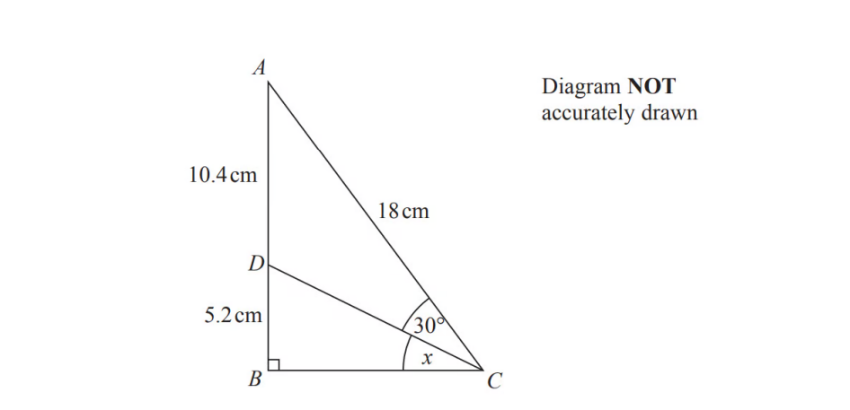

$ABC$ is a right-angled triangle. 
$D$ is a point on $AB$.

Angle $ACD$ = 30° 
$AD$= 10.4 cm 
$DB$= 5.2 cm 
$AC$= 18 cm

Work out the size of the angle marked $x$. 
Give your answer correct to 1 decimal place.

## Q40 — hard — 5 marks · exam-questions

### 7() — 5 marks — command: work_out — structured — from paper November 2017 · 1MA1/2H
$ABCD$ is a trapezium.

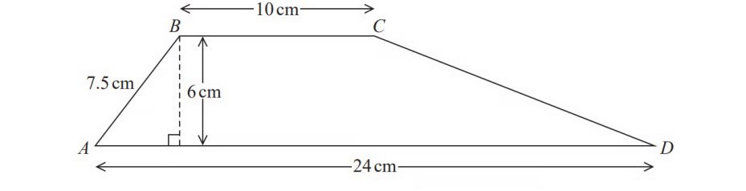

Work out the size of angle $CDA$. 
Give your answer correct to 1 decimal place.

## Q41 — hard — 5 marks · exam-questions

### 15() — 5 marks — command: work_out — structured — from paper November 2016 · 1MA0/2H
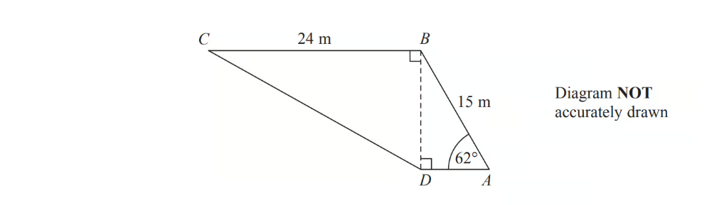

$AB$ = 15 m 
$BC$ = 24 m 
Angle $BAD$ = 62°

Work out the size of angle $BCD$. 
Give your answer correct to 1 decimal place.

## Q42 — hard — 4 marks · exam-questions

### 26() — 4 marks — command: prove — structured — from paper November 2016 · 1MA0/1H
The diagram shows a triangle $DEF$ inside a rectangle $ABCD$.

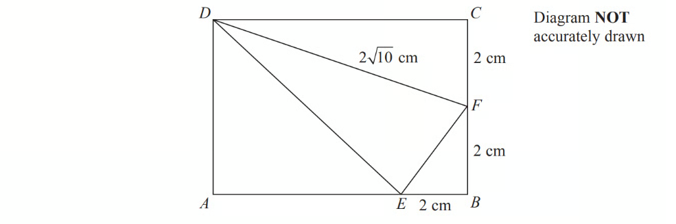

Show that the area of triangle $DEF$ is 8 cm2 
You must show all your working.

## Q43 — hard — 3 marks · exam-questions

### 23() — 3 marks — command: work_out — structured — from paper June 2015 · 1MA0/2H
Here is a parallelogram.

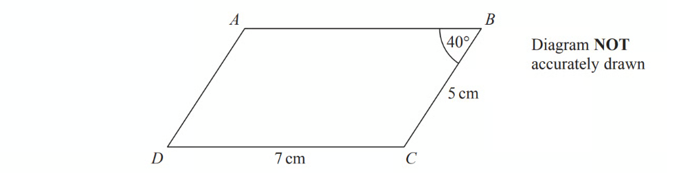

$DC$ = 7cm 
$CB$ = 5 cm 
Angle $ABC$ is 40°

Work out the area of the parallelogram. 
Give your answer correct to 1 decimal place.

## Q44 — hard — 5 marks · exam-questions

### 9() — 5 marks — structured — from paper June 2018 · 4MA1/1H
The diagram shows a right-angled triangle.

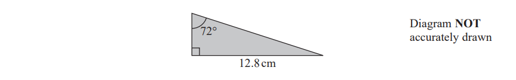

Five of these triangles are put together to make a shape.

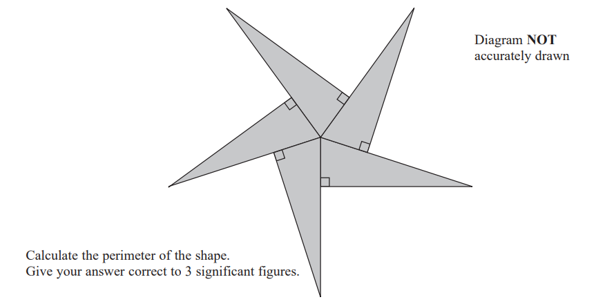

....................................................... cm

## Q45 — hard — 3 marks · exam-questions

### 14() — 3 marks — command: work_out — structured — from paper Jan 2022 · 4MA1/2H
A zip wire is shown as the dashed line $AC$ in the diagram.

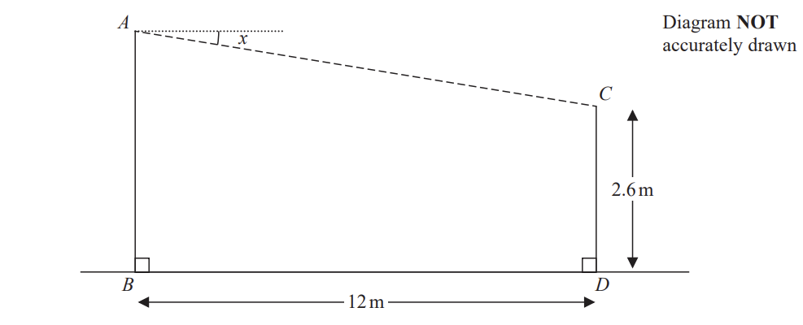

The zip wire is supported by two vertical posts $AB$ and $CD$ standing on horizontal ground.

$CD=2.6m$         $BD=12m$

The zip wire makes an angle $x$ with the horizontal, as shown in the diagram. 
The design of the zip wire requires the angle $x$ to be at least 5°

Work out the least possible height of the post $AB$ 
Give your answer correct to 3 significant figures.

## Q46 — hard — 6 marks · exam-questions

### 12((a)) — 3 marks — command: calculate — structured — from paper Nov 2021 · 4MA1/1H
The diagram shows a vertical cliff with a vertical radio mast on top of the cliff and a buoy in the sea.

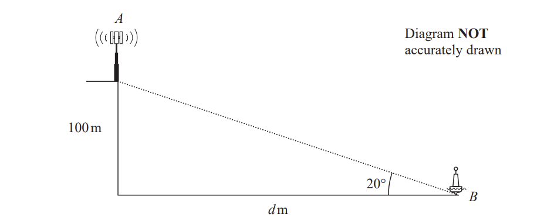

The height of the cliff is 100 metres. 
The buoy is at the point $B$ that is $d$metres from the base of the cliff. 
The angle of elevation from $B$ to the top of the cliff is 20°

Calculate the value of $d$. 
Give your answer correct to 3 significant figures.

$d=$ ......................................................

### 12((b)) — 3 marks — command: calculate — structured — from paper Nov 2021 · 4MA1/1H
The point $A$ at the top of the radio mast is vertically above the top of the cliff. 
The angle of elevation from $B$ to $A$ is 25°

Calculate the height of the radio mast. 
Give your answer correct to 3 significant figures.

....................................................... m

## Q47 — hard — 5 marks · exam-questions

### 11() — 5 marks — command: work_out — structured — from paper Jan 2020 · 4MA1/2H
The diagram shows a shaded shape $ABCD$made from a semicircle $ABC$and a right-angled triangle $ACD$.

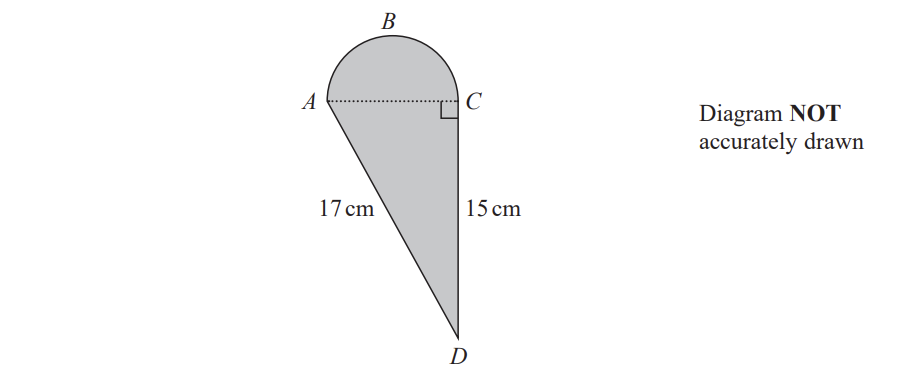

$AC$is the diameter of the semicircle $ABC$.

Work out the perimeter of the shaded shape. 
Give your answer correct to 3 significant figures.

....................$\mathrm{cm}$

## Q48 — hard — 5 marks · exam-questions

### 13() — 5 marks — command: work_out — structured — from paper Nov 2020 · 4MA1/2HR
The diagram shows four congruent right‐angled triangles $ABJ,BCI,CDH$ and $DEG$. 
The diagram also shows the straight line $ABCDEF$.

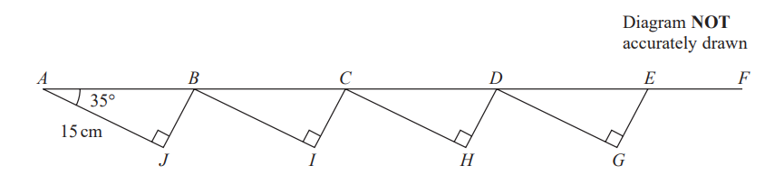

$AJ=15\mathrm{cm}$ 
$\mathrm{Angle}BAJ=35^{\circ}$

$AF=80\mathrm{cm}$

Work out the length of $EF$. 
Give your answer correct to $3$ significant figures.

............................................. cm

## Q49 — hard — 4 marks · exam-questions

### 12() — 4 marks — command: work_out — structured — from paper 2023 June · 4MA1/2H
The diagram shows right-angled triangle $ABD$

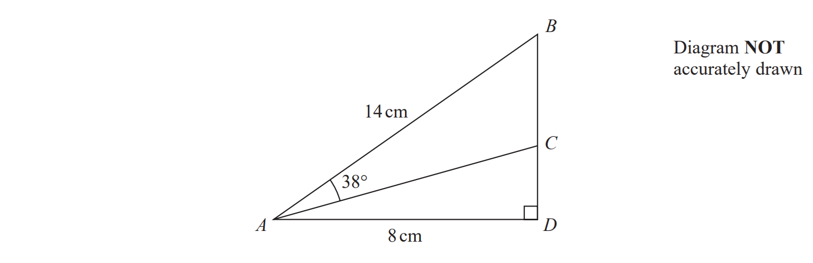

$AB=14\mathrm{cm}AD=8\mathrm{cm}$

$C$ is the point on $BD$ such that angle $BAC=38^{\circ}$

Work out the length of $CD$
 Give your answer correct to 3 significant figures.

## Q50 — very_hard — 5 marks · exam-questions

### 16() — 5 marks — command: work_out — structured — from paper November 2014 · 1MA0/2H
The diagram represents a metal frame.

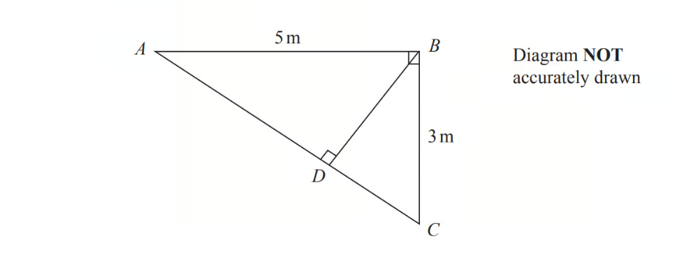

The frame is made from four metal bars, $AB,AC,BC$ and $BD$.

Angle $ABC$ = angle $ADB$ = 90°
 $AB$ = 5 m 
$BC$ = 3 m

Work out the total length of the four metal bars of the frame. 
Give your answer correct to 3 significant figures.

## Q51 — very_hard — 4 marks · exam-questions

### 19() — 4 marks — command: calculate — structured — from paper June 2015 · 1MA0/2H
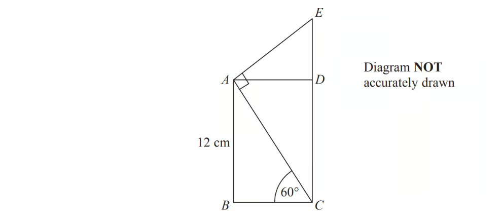

$ABCD$ is a rectangle. 
$CDE$ is a straight line.

$AB$ = 12 cm 
Angle $ACB$= 60° 
Angle $EAC$ = 90°

Calculate the length of $CE$. 
You must show all your working.

## Q52 — very_hard — 5 marks · exam-questions

### 15((a)) — 1 mark — command: explain — structured — from paper November 2015 · 1MA0/2H
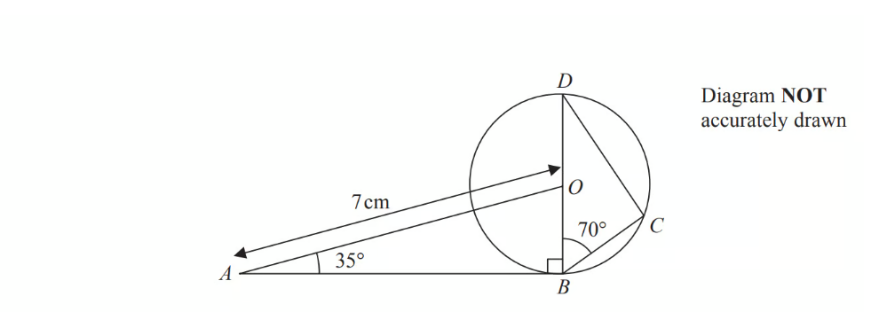

$B,C$ and $D$ are points on the circumference of a circle, centre $O$. $BOD$ is a diameter of the circle.

$AO=7\mathrm{cm} \mathrm{Angle}ABO=90^{\circ}\mathrm{Angle}OAB=35^{\circ}\mathrm{Angle}DBC=70^{\circ}$

Explain why angle $BCD$ is $90^{\circ}$

### 15((b)) — 4 marks — command: calculate — structured — from paper November 2015 · 1MA0/2H
Calculate the length of $BC$ 
Give your answer correct to 3 significant figures.

## Q53 — very_hard — 4 marks · exam-questions

### 8() — 4 marks — command: work_out — structured — from paper June 2017 · 1MA1/3H
A square, with sides of length $x$ cm, is inside a circle. 
Each vertex of the square is on the circumference of the circle.

The area of the circle is 49 cm2.

Work out the value of $x$. 
Give your answer correct to 3 significant figures.

## Q54 — very_hard — 5 marks · exam-questions

### 10() — 5 marks — command: calculate — structured — from paper Jan 2019 · 4MA1/1H
Here is triangle $ABD.$

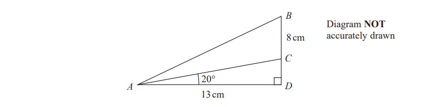

The point $C$ lies on $BD$.

$AD=13\mathrm{cm}BC=8\mathrm{cm} \mathrm{angle}ADB=90^{\circ}\mathrm{angle}CAD=20^{\circ}$

Calculate the size of angle $BAC$. 
Give your answer correct to $1$ decimal place.

## Q55 — very_hard — 5 marks · exam-questions

### 9() — 5 marks — command: work_out — structured — from paper Jan 2022 · 4MA1/2HR
In the diagram, $ABC$ is a right-angled triangle and $DEF$ is a semicircular arc.

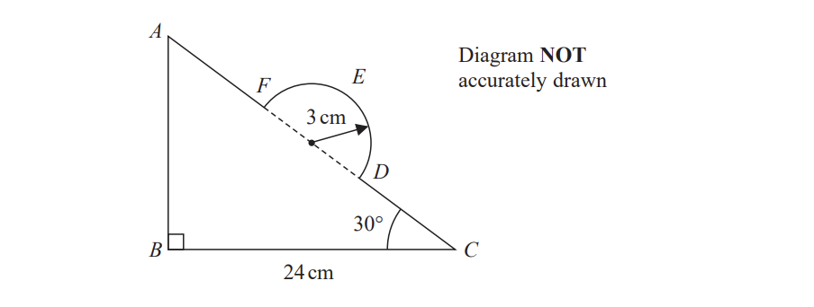

In triangle $ABC$

| $BC=24\mathrm{cm}$ | $\mathrm{angle}ABC=90^{\circ}$ | $\mathrm{angle}BCA=30^{\circ}$ |
|---|---|---|

The points $D$ and $F$ lie on $AC$ so that $DF$ is the diameter of the semicircular arc $DEF$ 
The radius of the semicircular arc is 3cm.

Work out the length of $AFEDC$ 
Give your answer correct to 2 significant figures.

## Q56 — very_hard — 5 marks · exam-questions

### 23() — 5 marks — command: work_out — structured — from paper Nov 2018 · 8300/3H
The diagram shows the side view of a step ladder with a horizontal strut of length 48 cm.

The strut is one third of the way up the ladder.

The symmetrical cross section of the ladder shows two similar triangles.

Work out the vertical height, $h$ cm, of the ladder.

...........................cm

## Q57 — very_hard — 6 marks · exam-questions

### 24((a)) — 2 marks — command: prove — structured — from paper Specimen 2015 · 8300/2H
A Big Wheel is modelled as a circle with centre O and radius 15 metres.

The wheel turns in an anticlockwise direction.

The lowest point on the wheel is always 2 metres above horizontal ground.

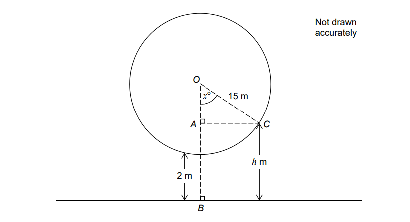

$C$ is a point on the wheel, $h$ metres above horizontal ground.

Angle $COB=x^{\circ}$

Show that $h=17-15\mathrm{cos}x^{\circ}$

### 24((b)) — 2 marks — command: work_out — structured — from paper Specimen 2015 · 8300/2H
$D$ is a point on the wheel.

Angle $DOB=120^{\circ}$

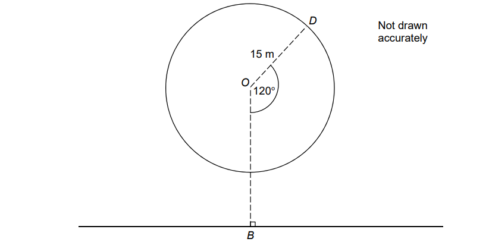

Work out the height of $D$ above horizontal ground.

........................ metres

### 24((c)) — 2 marks — command: work_out — structured — from paper Specimen 2015 · 8300/2H
Here is a sketch of the graph $h=17-15\mathrm{cos}x^{\circ}$for one **complete **turn of the wheel.

$P$ is the highest point on the graph.

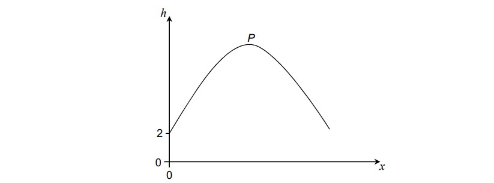

Work out the coordinates of $P$.

## Q58 — very_hard — 5 marks · exam-questions

### 8() — 5 marks — command: calculate — structured — from paper June 2018 · J560/04
A, B, C and D are points on the circumference of a circle, centre O.

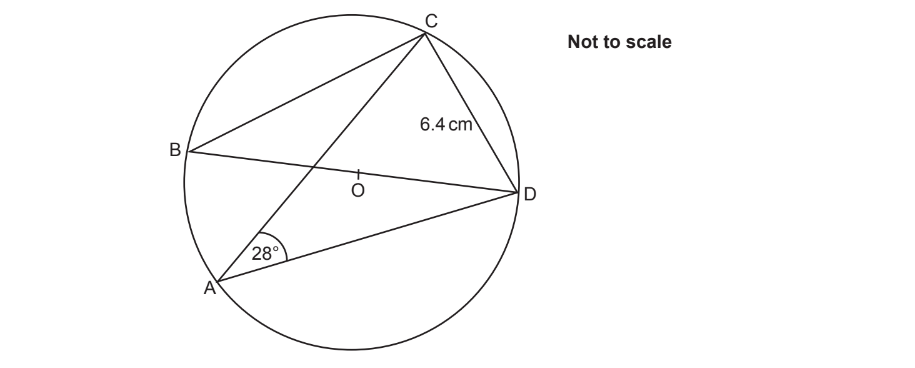

Angle CAD = 28° and CD = 6.4cm. 
BD is a diameter of the circle.

Calculate the area of the circle.

...................... cm2

## Q59 — very_hard — 5 marks · exam-questions

### 12((a)) — 2 marks — command: prove — structured — from paper Specimen 2015 · J560/04
Without using a calculator, show that $\sqrt{20}=2\sqrt{5}$.

### 12((b)) — 3 marks — structured — from paper Specimen 2015 · J560/04
The point A is shown on the unit grid below. 
The point B is $2\sqrt{5}$ units from A and lies on the intersection of two grid lines.

Mark **one **possible position for B.

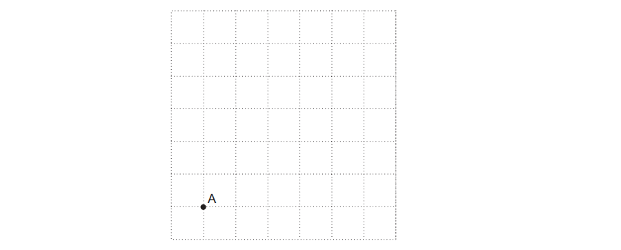
