# Exam Questions — Sine, Cosine Rule & Area of Triangles
**Geometry & Trigonometry** · Edexcel IGCSE Maths A (4MA1) — 18/Higher
> Source: [https://www.savemyexams.com/igcse/maths/edexcel/a/18/higher/topic-questions/4-geometry-and-trigonometry/sine-cosine-rule-and-area-of-triangles/exam-questions/](https://www.savemyexams.com/igcse/maths/edexcel/a/18/higher/topic-questions/4-geometry-and-trigonometry/sine-cosine-rule-and-area-of-triangles/exam-questions/) · 48 questions · total 222 marks

## Q1 — medium — 5 marks · exam-questions

### 24((a)) — 2 marks — command: work_out — structured — from paper June 2013 · 1MA0/2H
$ABC$ is a triangle.

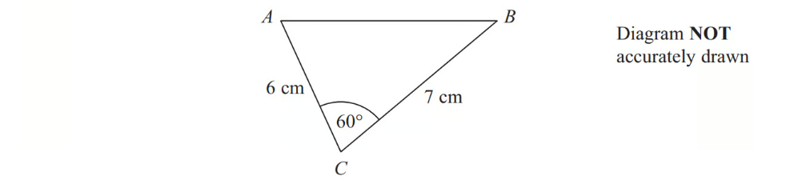

Work out the area of triangle $ABC$. 
Give your answer correct to 3 significant figures.

### 24((b)) — 3 marks — command: work_out — structured — from paper June 2013 · 1MA0/2H
Work out the length of the side $AB$. 
Give your answer correct to 3 significant figures.

## Q2 — medium — 3 marks · exam-questions

### 20() — 3 marks — command: calculate — structured — from paper March 2013 · 1MA0/2H
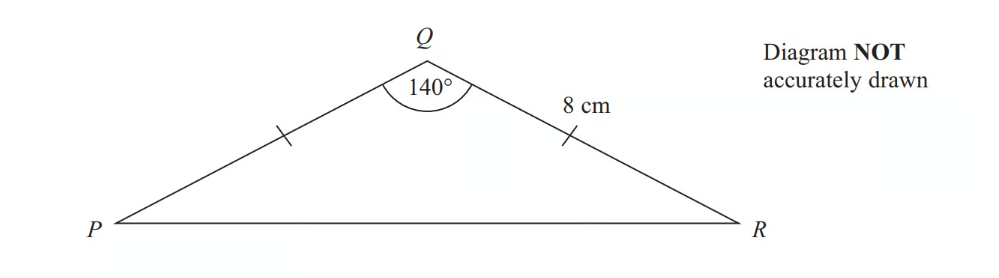

Calculate the length of $PR$. Give your answer correct to 3 significant figures.

## Q3 — medium — 5 marks · exam-questions

### 14((a)) — 2 marks — command: work_out — structured — from paper Jan 2020 · 4MA1/1H
The diagram shows parallelogram $EFGH$.

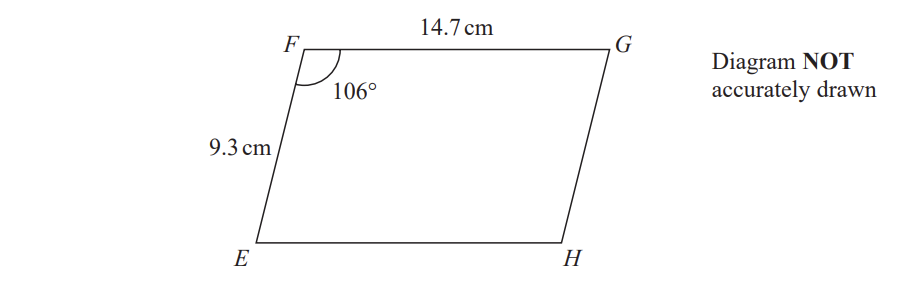

`table row cell E F space end cell equals cell space 9.3 space cm space end cell row cell F G space end cell equals cell space 14.7 space cm space end cell row cell Angle space E F G space end cell equals cell space 106 degree end cell end table`

Work out the area of the parallelogram. 
Give your answer correct to 3 significant figures.

.......................$\mathrm{cm}^{2}$

### 14((b)) — 3 marks — command: work_out — structured — from paper Jan 2020 · 4MA1/1H
Work out the length of the diagonal $EG$ of the parallelogram. Give your answer correct to 3 significant figures.

.....................$\mathrm{cm}$

## Q4 — medium — 3 marks · exam-questions

### 18() — 3 marks — command: calculate — structured — from paper June 2019 · 4MA1/1H
The diagram shows triangle $PQR$.

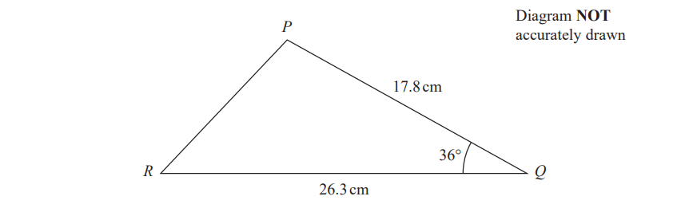

Calculate the length of $PR$. 
Give your answer correct to 3 significant figures.

.........................$\mathrm{cm}$

## Q5 — medium — 3 marks · exam-questions

### 18() — 3 marks — command: work_out — structured — from paper June 2018 · 4MA1/2H
A triangle has sides of length 8 cm, 10 cm and 14 cm.

Work out the size of the largest angle of the triangle. 
Give your answer correct to 1 decimal place.

## Q6 — medium — 1 marks · exam-questions

### 17() — 1 mark — command: circle — structured — from paper June 2018 · 8300/1H
Here is a triangle.

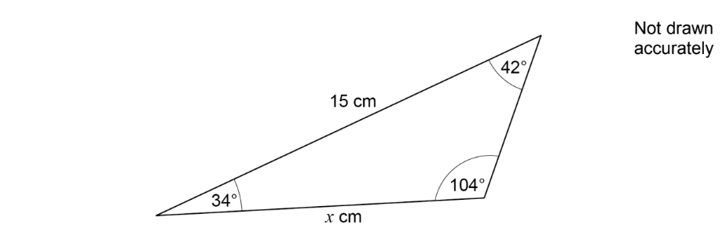

Circle the correct equation.

| $\frac{\mathrm{sin}x}{42}=\frac{\mathrm{sin}15^{\circ}}{104}$ | $\frac{x}{\mathrm{sin}42^{\circ}}=\frac{15}{\mathrm{sin}104^{\circ}}$ |
|---|---|
| $\frac{\mathrm{sin}x}{34}=\frac{\mathrm{sin}15^{\circ}}{104}$ | $\frac{x}{\mathrm{sin}42^{\circ}}=\frac{15}{\mathrm{sin}34^{\circ}}$ |

## Q7 — medium — 1 marks · exam-questions

### 18((b)) — 1 mark — command: what — structured — from paper Nov 2021 · 8300/1H
Here is a triangle.

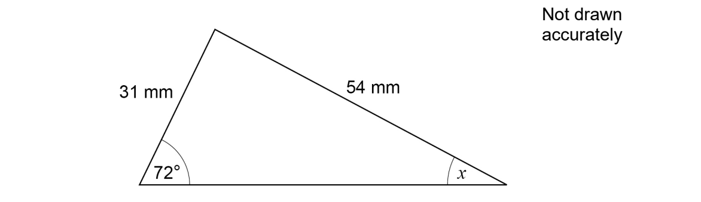

Leah tries to use the sine rule to work out the size of angle $x$. 
Here are the first two lines of her working.

| `table row cell fraction numerator x over denominator sin space 31 end fraction end cell equals cell fraction numerator 54 over denominator sin space 72 end fraction end cell row blank blank blank row x equals cell fraction numerator 54 space sin space 31 over denominator sin space 72 end fraction end cell end table` |
|---|

What error has she made in this working?

## Q8 — medium — 3 marks · exam-questions

### 20() — 3 marks — command: work_out — structured — from paper June 2017 · 8300/2H
Work out the size of angle $x$.

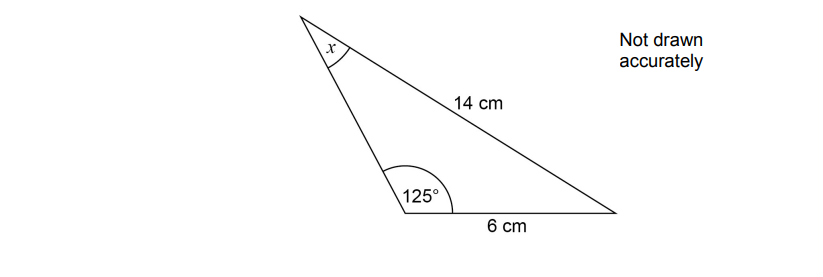

...............................degrees

## Q9 — medium — 4 marks · exam-questions

### 23() — 4 marks — command: work_out — structured — from paper Nov 2021 · 8300/2H
A ship sails from $P$ to $Q$ and then from $Q$ to $R$.

$Q$ is 12 miles from $P$, on a bearing of 080°

$R$ is 28 miles from $Q$, on a bearing of 155°

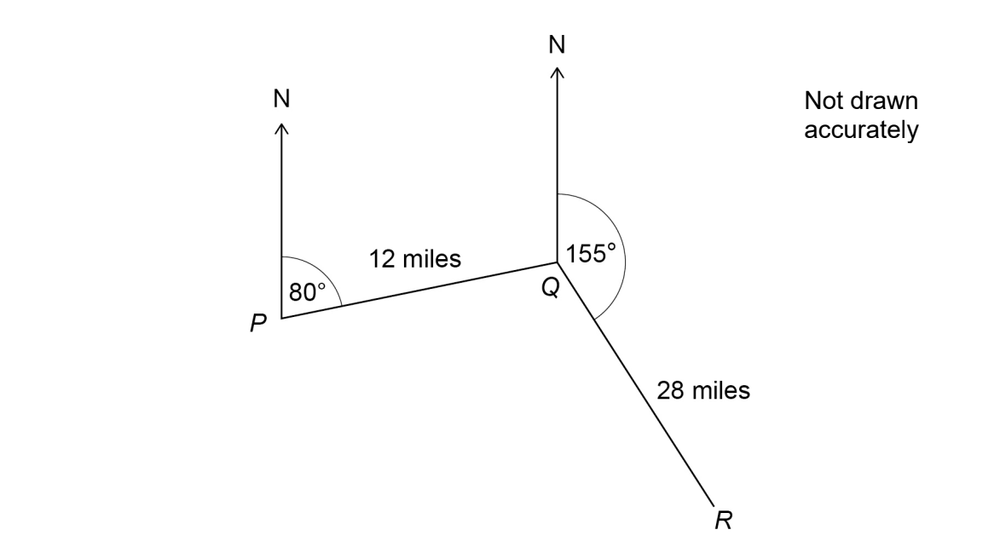

Work out the direct distance from $P$ to $R$.

## Q10 — medium — 4 marks · exam-questions

### 16() — 4 marks — command: work_out — structured — from paper June 2019 · 8300/2H
$ABC$ and $ACD$ are triangles.

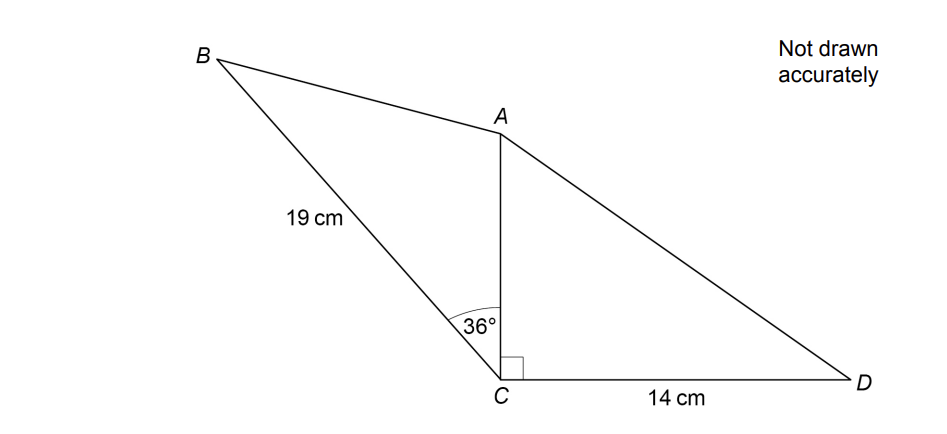

The area of $ACD$is 80.5 cm2

Work out the area of $ABC$. 
Give your answer to 3 significant figures.

...............................cm2

## Q11 — medium — 4 marks · exam-questions

### 21((a)) — 3 marks — command: explain — structured — from paper June 2018 · 8300/2H
Liz and Tia are walking towards a shop along different straight paths.

The diagram shows their positions at 2 pm

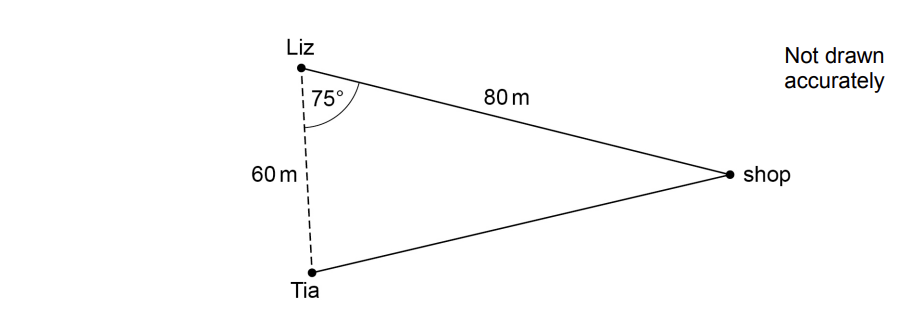

Assume they walk at the same speed.

Who will arrive at the shop first? 
You **must** show your working.

### 21((b)) — 1 mark — command: how — structured — from paper June 2018 · 8300/2H
In fact, Liz walks at a faster speed than Tia.

How does this affect the answer to part (a)?

## Q12 — medium — 3 marks · exam-questions

### 22() — 3 marks — command: work_out — structured — from paper Nov 2017 · 8300/3H
Here is a triangle.

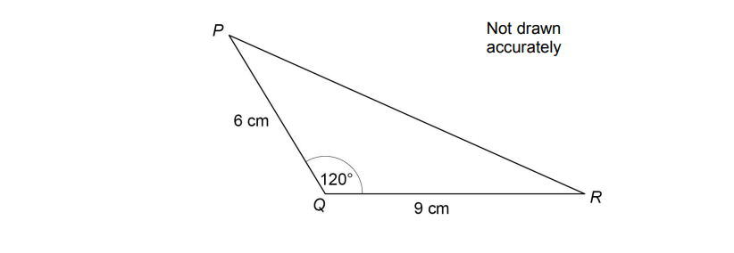

Work out the length $PR.$

.................cm

## Q13 — medium — 3 marks · exam-questions

### 20() — 3 marks — command: work_out — structured — from paper Specimen 2015 · 8300/3H
In the triangle, angle $y$ is obtuse.

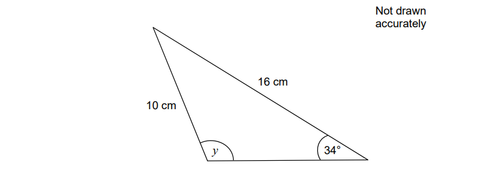

Work out the size of angle $y$.

...................degrees

## Q14 — medium — 5 marks · exam-questions

### 18() — 4 marks — command: work_out — structured — from paper Nov 2020 · J560/05
The diagram shows a triangular field PQR which is used to grow organic carrots.

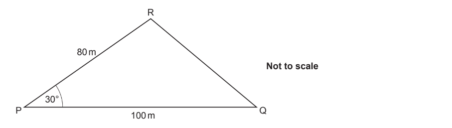

PQ = 100 m, PR = 80 m and angle RPQ = 30°.

In recent years, an average of 2.5 kg of carrots has been harvested from each square metre of  the field.

Use this information to work out the total mass of carrots that might have been harvested from the field in 2019.

......................................................kg

### 18((b)) — 1 mark — command: why — structured — from paper Nov 2020 · J560/05
Why might the answer to part$(a)$be unreliable?

## Q15 — medium — 7 marks · exam-questions

### 17((a)) — 4 marks — command: prove — structured — from paper Nov 2017 · J560/04
ABC and ACD are triangles.

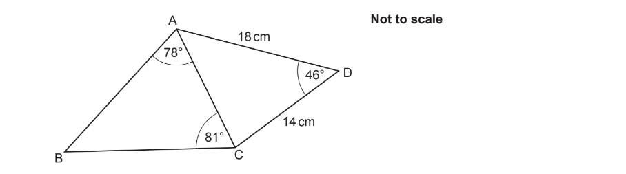

Show that AC = 13.0 cm, correct to 3 significant figures.

### 17((b)) — 3 marks — command: calculate — structured — from paper Nov 2017 · J560/04
Calculate BC.

..................... cm

## Q16 — medium — 3 marks · exam-questions

### 15((a)) — 3 marks — command: calculate — structured — from paper Nov 2019 · J560/04
Calculate length DF in this triangle.

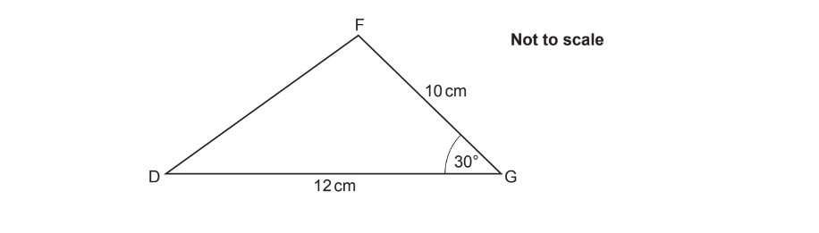

..................................................... cm

## Q17 — medium — 4 marks · exam-questions

### 15((b)) — 4 marks — command: calculate — structured — from paper Nov 2019 · J560/04
Calculate angle ACB in this triangle.

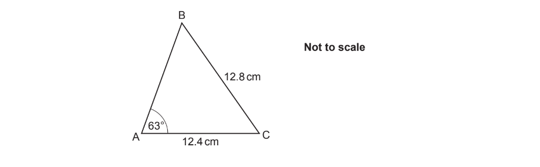

## Q18 — medium — 4 marks · exam-questions

### 17((b)) — 4 marks — command: calculate — structured — from paper June 2019 · J560/06
T is a radar tower. 
A and B are two aircraft. 
At 3pm

- aircraft A is 3250km from T on a bearing of 015°
- aircraft B is 4960km from T on a bearing of 057°.

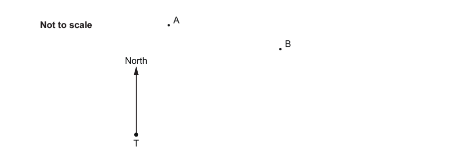

Calculate the distance that was between aircraft A and aircraft B at 3pm.

....................................................... km

## Q19 — hard — 5 marks · exam-questions

### 17() — 5 marks — command: work_out — structured — from paper June 2018 · 1MA1/3H
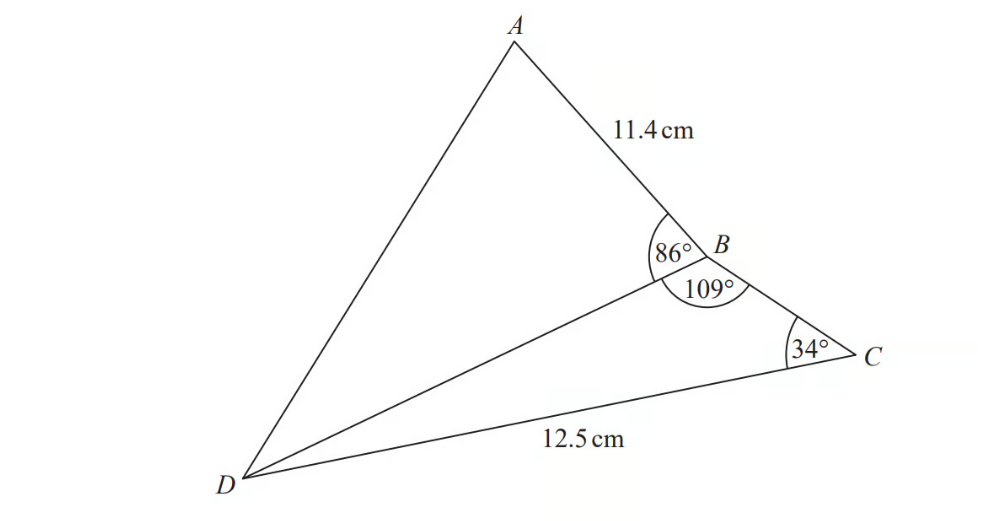

Work out the length of  $AD$. 
Give your answer correct to 3 significant figures.

## Q20 — hard — 5 marks · exam-questions

### 24() — 5 marks — command: calculate — structured — from paper June 2012 · 1MA0/2H
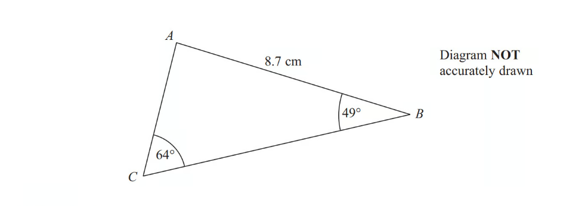

$ABC$is a triangle.

$AB=8.7\mathrm{cm}.\,\mathrm{Angle}ABC=49^{\circ}.\,\mathrm{Angle}ACB=64^{\circ}.$

Calculate the area of triangle $ABC$. Give your answer correct to $3$ significant figures.

## Q21 — hard — 5 marks · exam-questions

### 26() — 5 marks — command: calculate — structured — from paper November 2013 · 1MA0/2H
The diagram shows triangle $LMN$.

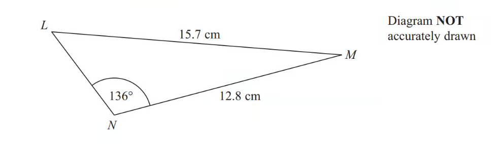

Calculate the length of $LN$. 
Give your answer correct to 3 significant figures.

## Q22 — hard — 5 marks · exam-questions

### 21() — 5 marks — command: work_out — structured — from paper November 2014 · 1MA0/2H
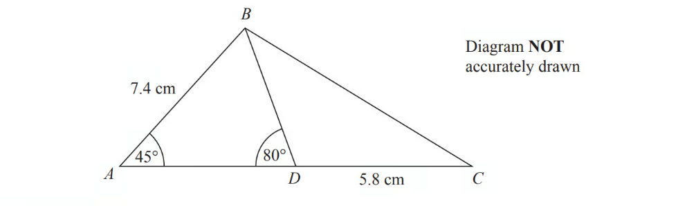

$ABC$is a triangle. 
$D$ is a point on $AC$. 
Angle $BAD$= 45° 
Angle $ADB$= 80°
 $AB$ = 7.4cm 
$DC$ = 5.8 cm

Work out the length of $BC$. 
Give your answer correct to 3 significant figures.

## Q23 — hard — 5 marks · exam-questions

### 24() — 5 marks — command: work_out — structured — from paper November 2015 · 1MA0/2H
$ABC$is a triangle.

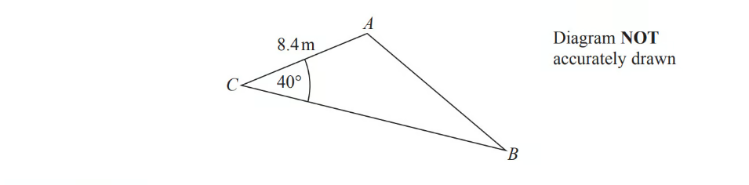

$AC$= 8.4m 
Angle $ACB$= 40°

The area of the triangle = 100 m2.

Work out the length of $AB$. 
Give your answer correct to 3 significant figures. 
You must show all your working.

## Q24 — hard — 5 marks · exam-questions

### 21((a)) — 4 marks — command: calculate — structured — from paper Sample 2015 · 1MA1/2H
In triangle $RPQ$,

$RP$ = 8.7 cm 
$PQ$ = 5.2 cm 
Angle $PRQ$= 32°

Assuming that angle $PQR$is an acute angle, calculate the area of triangle $RPQ$. 
Give your answer correct to 3 significant figures.

### 21((b)) — 1 mark — command: what — structured — from paper Sample 2015 · 1MA1/2H
If you did not know that angle $PQR$is an acute angle, what effect would this have on your calculation of the area of triangle $RPQ$?

## Q25 — hard — 3 marks · exam-questions

### 25() — 3 marks — command: prove — structured — from paper November 2012 · 1MA0/2H
The diagram shows the triangle $PQR$.

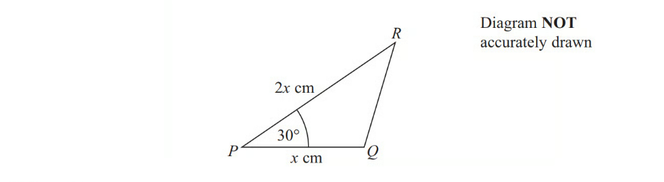

$PQ=x\mathrm{cm}\,PR=2x\mathrm{cm}$ 
Angle $QPR=30^{\circ}$

The area of triangle $PQR=A\mathrm{cm}^{2}$

Show that   $x=\sqrt{2A}$

## Q26 — hard — 4 marks · exam-questions

### 18() — 4 marks — command: work_out — structured — from paper November 2013 · 1MA0/2H
$ABC$is an isosceles triangle.

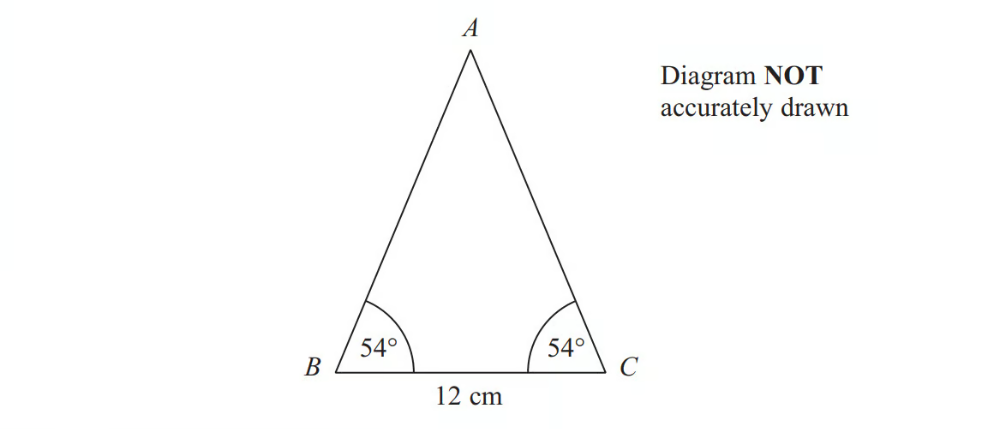

Work out the area of the triangle. 
Give your answer correct to 3 significant figures.

## Q27 — hard — 3 marks · exam-questions

### 13() — 3 marks — command: calculate — structured — from paper Nov 2021 · 4MA1/1H
Here is a triangle $XYZ.$

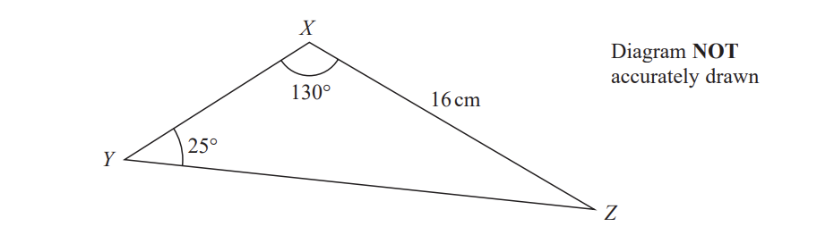

The length $XZ$ and the angles $YXZ$ and $XYZ$are each given correct to 2 significant figures.

Calculate the upper bound for the length $YZ$. 
Give your answer correct to one decimal place. 
Show your working clearly.

....................................................... cm

## Q28 — hard — 6 marks · exam-questions

### 21() — 6 marks — command: work_out — structured — from paper June 2018 · 4MA1/1HR
Here is a quadrilateral $PQRS$.

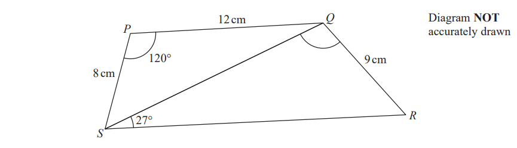

Angle $SRQ$ is acute.

Work out the size of angle $SQR$. 
Give your answer correct to $1$ decimal place.

## Q29 — hard — 5 marks · exam-questions

### 29() — 5 marks — command: work_out — structured — from paper Nov 2020 · 8300/3H
A shape is made by joining triangle $ABC$to a semicircle with diameter $AC$.

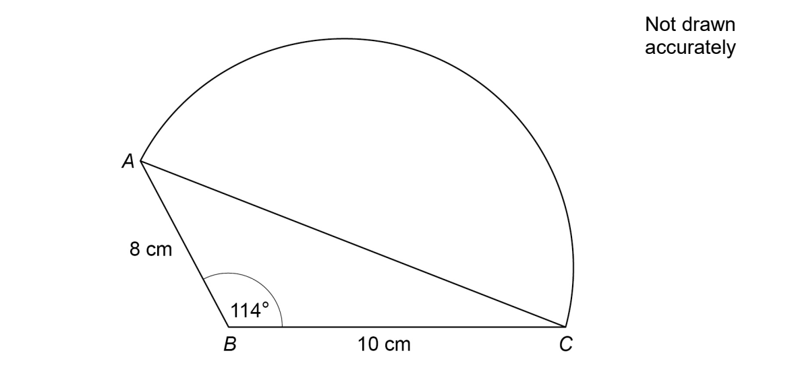

Work out the **total **area of the shape.

## Q30 — hard — 8 marks · exam-questions

### 26((a)) — 3 marks — command: how — structured — from paper Nov 2019 · 8300/3H
Here is a triangular sail.

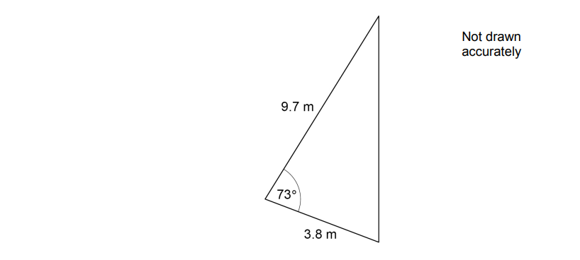

Vicky needs to buy waterproofing liquid for the sail.

She will put **3 coats** of liquid on each side of the sail. 
A litre of liquid covers 8.5 square metres of sail.

How many 1-litre bottles of liquid does Vicky need?

### 26((b)) — 5 marks — command: work_out — structured — from paper Nov 2019 · 8300/3H
Another sail is joined to the first sail as shown.

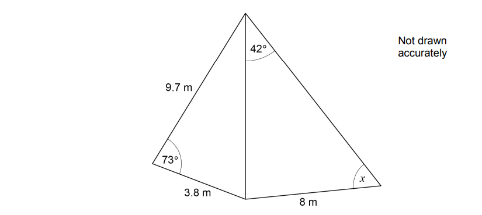

$x$ is an acute angle.

Work out the size of angle $x$.

## Q31 — hard — 6 marks · exam-questions

### 14() — 6 marks — command: calculate — structured — from paper June 2017 · J560/04
The diagram shows triangle ABC with D on AC and E on AB. DE is a straight line.

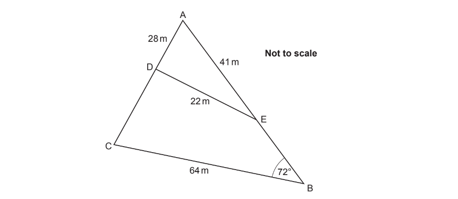

AD = 28 m, AE = 41 m, DE = 22 m and BC = 64 m.

Calculate the length CD.

....................................................... m

## Q32 — hard — 7 marks · exam-questions

### 20() — 7 marks — command: calculate — structured — from paper June 2017 · J560/05
The diagram shows some land in the shape of a quadrilateral, ABCD.

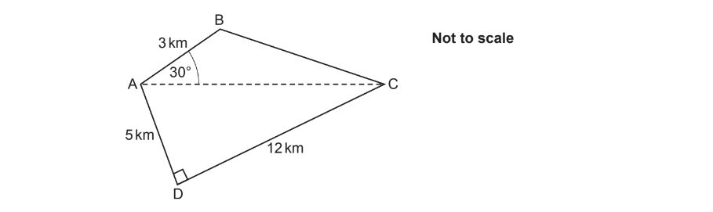

AB = 3km, AD = 5km, CD = 12km and angle BAC = 30°.

The land is sold for £10 million per square kilometre.

Calculate the total cost of the land.

£ .............................................. million

## Q33 — hard — 5 marks · exam-questions

### 23() — 5 marks — command: calculate — structured — from paper Specimen paper · 4MA1/1H
*A*, *B* and *C* are three towns.

The bearing of *B* from *A* is 105°
The bearing of *C* from *B* is 230°

The distance of *C* from *A* is 180 km.
The distance of *C* from *B* is 95 km.

Calculate the distance of *B* from *A*.
Give your answer correct to 3 significant figures.

## Q34 — hard — 5 marks · exam-questions

### 22() — 5 marks — command: work_out — structured — from paper 2023 June · 4MA1/2H
The diagram shows a triangle $ABC$ and a flagpole $BF$

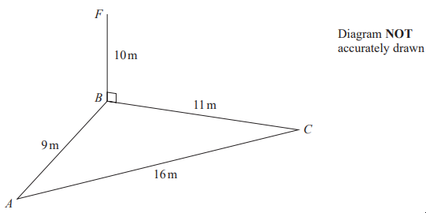

$A,B$ and $C$ are points on horizontal ground. $BF$ is vertical.

$AB=9mBC=11mAC=16mBF=10m$

$D$ is the point on $AC$ such that angle $BDC=90^{\circ}$

Work out the size of the angle of elevation of the point $F$ from the point $D$ 
Give your answer correct to one decimal place.

## Q35 — hard — 5 marks · exam-questions

### 18() — 5 marks — command: work_out — structured — from paper 2023 Nov · 4MA1/1H
The diagram shows the positions of three villages, A, B and C

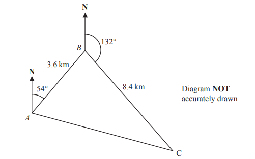

The bearing of B from A is 054° 
The bearing of C from B is 132°

Melur walks from A to B 
She then walks from B to C and from C to A

Melur walks at an average speed of 6 km/h

Work out the total time Melur takes. 
Give your answer in hours and minutes

## Q36 — very_hard — 5 marks · exam-questions

### 15() — 5 marks — command: calculate — structured — from paper June 2017 · 1MA1/3H
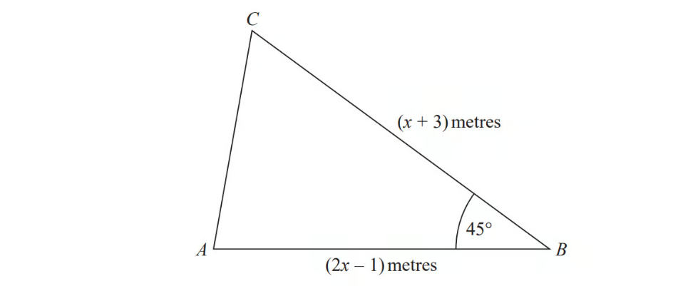

The area of triangle $ABC$ is $6\sqrt{2}$m2.

Calculate the value of $x$. 
Give your answer correct to $3$significant figures.

## Q37 — very_hard — 5 marks · exam-questions

### 17() — 5 marks — command: work_out — structured — from paper November 2017 · 1MA1/3H
$ABC$and $ADC$are triangles.

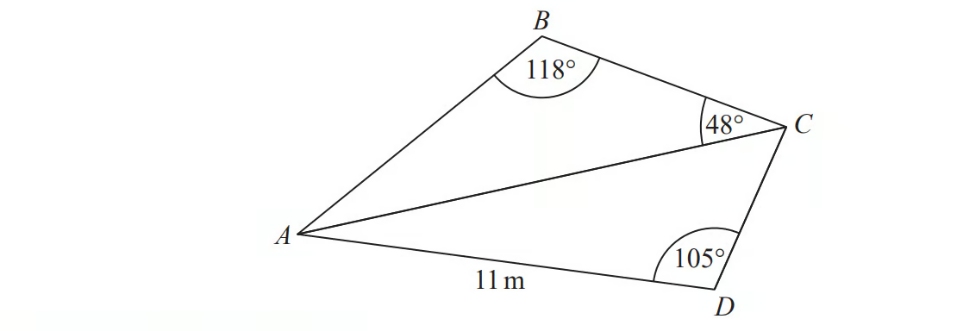

The area of triangle $ADC$is 56 m2

Work out the length of $AB.$ 
Give your answer correct to 1 decimal place.

## Q38 — very_hard — 5 marks · exam-questions

### 27() — 5 marks — command: calculate — structured — from paper June 2014 · 1MA0/2H
$ABCD$is a parallelogram.

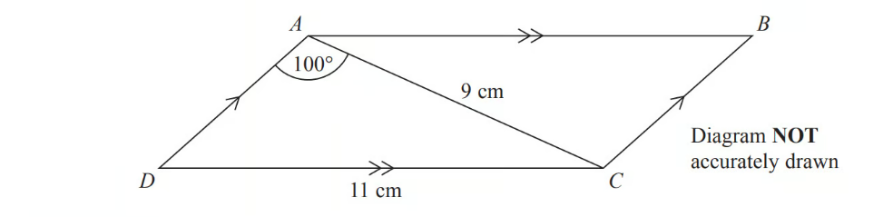

$AC$ = 9 cm
 $DC$ = 11 cm 
Angle $DAC$ = 100°

Calculate the area of the parallelogram. 
Give your answer correct to 3 significant figures.

## Q39 — very_hard — 6 marks · exam-questions

### 25() — 6 marks — command: work_out — structured — from paper June 2016 · 1MA0/2H
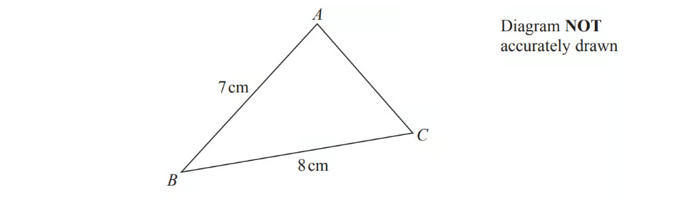

$ABC$is an acute-angled triangle. 
$BA$= 7cm
 $BC$  = 8cm

The area of triangle $ABC$ is 18 cm2.

Work out the size of angle $BAC$. 
Give your answer correct to 3 significant figures.
You must show all your working.

## Q40 — very_hard — 6 marks · exam-questions

### 25() — 6 marks — command: work_out — structured — from paper June 2017 · 1MA0/2H
$ABC$is an acute angled triangle.

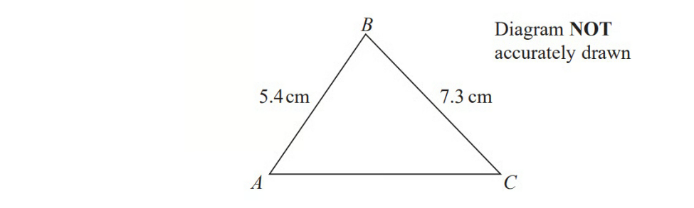

The area of triangle $ABC$is 19 cm2.

Work out the size of angle $ACB$. 
Give your answer correct to 3 significant figures.

## Q41 — very_hard — 5 marks · exam-questions

### 21() — 5 marks — command: work_out — structured — from paper Spec2 2015 · 1MA1/3H
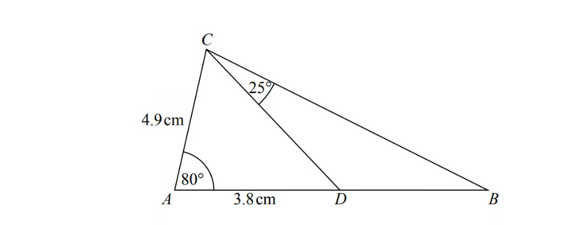

$ABC$is a triangle.
 $D$ is a point on $AB$.

Work out the area of triangle $BCD$. 
Give your answer correct to 3 significant figures.

## Q42 — very_hard — 6 marks · exam-questions

### 23() — 6 marks — command: work_out — structured — from paper Jan 2022 · 4MA1/2H
The diagram shows triangle$PQR$

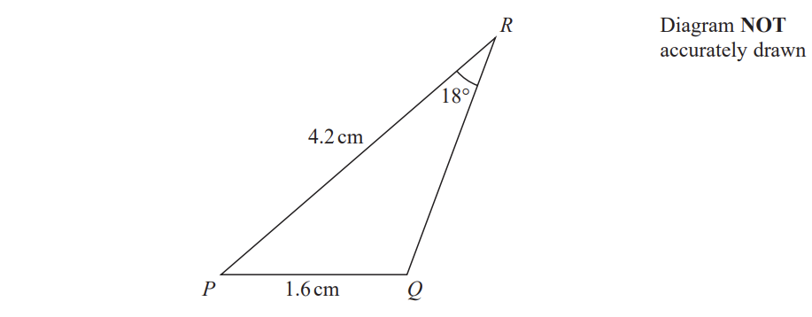

| $PQ=1.6\mathrm{cm}$ | $PR=4.2\mathrm{cm}$ | $\mathrm{Angle}PRQ=18^{\circ}$ |
|---|---|---|

Given that angle $PQR$is obtuse, work out the area of triangle $PQR$. 
Give your answer correct to 3 significant figures.

## Q43 — very_hard — 4 marks · exam-questions

### 22() — 4 marks — command: calculate — structured — from paper Jan 2022 · 4MA1/1HR
The diagram shows triangle $ABC$

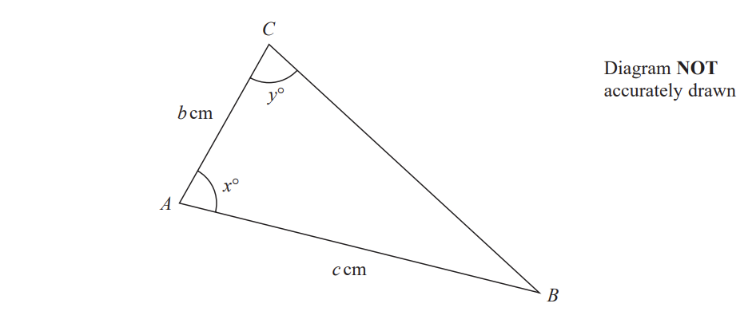

$c=11.5$correct to one decimal place
 $x=80$     correct to the nearest whole number 
$y=75$   correct to the nearest whole number

Calculate the upper bound for the value of $b$ Show your working clearly. 
Give your answer correct to 3 significant figures.

## Q44 — very_hard — 6 marks · exam-questions

### 18() — 6 marks — command: work_out — structured — from paper June 2021 · 4MA1/2H
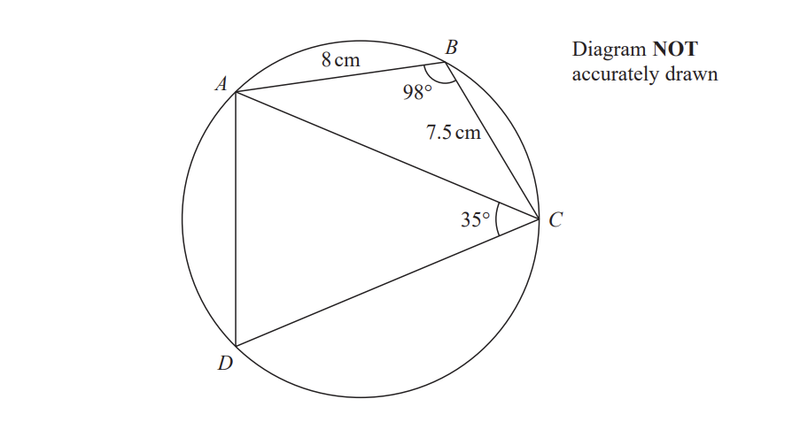

$ABCD$ is a quadrilateral where $A,B,C$ and $D$ are points on a circle.

$AB=8\mathrm{cm}$ 
$BC=7.5\mathrm{cm}$ 
Angle $ABC=98^{\circ}$ 
Angle $ACD=35^{\circ}$

Work out the perimeter of quadrilateral $ABCD$. 
Give your answer correct to one decimal place.

....................................................... cm

## Q45 — very_hard — 5 marks · exam-questions

### 24() — 5 marks — command: find — structured — from paper Jan 2019 · 4MA1/1HR
Here is a triangle $XYZ$.

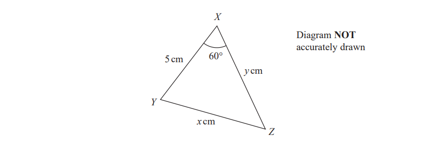

The perimeter of the triangle is $k\mathrm{cm}$.

Given that $x=y-1$ 
find the value of $k$. 
Show your working clearly.

$k=$

## Q46 — very_hard — 6 marks · exam-questions

### 22() — 6 marks — command: find — structured — from paper Nov 2020 · 4MA1/1HR
The diagram shows a regular octagon $ABCDEFGH.$

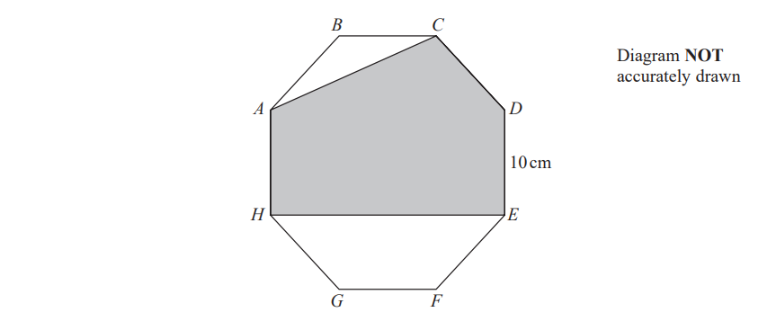

Each side of the octagon has length $10\mathrm{cm}.$

Find the area of the shaded region $ACDEH.$ 
Give your answer correct to the nearest $\mathrm{cm}^{2}$

............................................. $\mathrm{cm}^{2}$

## Q47 — very_hard — 5 marks · exam-questions

### 25() — 5 marks — structured — from paper June 2017 · 8300/2H
The diagram shows a logo.

$ABE$ and $DCE$ are congruent triangles. 
$BCE$ is a sector of a circle, centre $E$.

Show that the area of the logo is 510 cm2 to 2 significant figures.

## Q48 — very_hard — 6 marks · exam-questions

### 22() — 6 marks — command: work_out — structured — from paper 2023 June · 4MA1/1H
The diagram shows two circles with centre $O$and a regular pentagon $ABCDE$

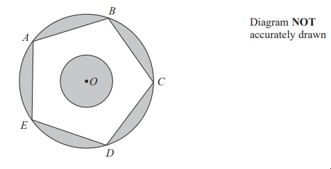

$A,B,C,D$ and $E$ are points on the larger circle. The pentagon has sides of length 8 cm.

The diagram is shaded such that

shaded area = unshaded area

Work out the radius of the smaller circle. Give your answer correct to 3 significant figures
