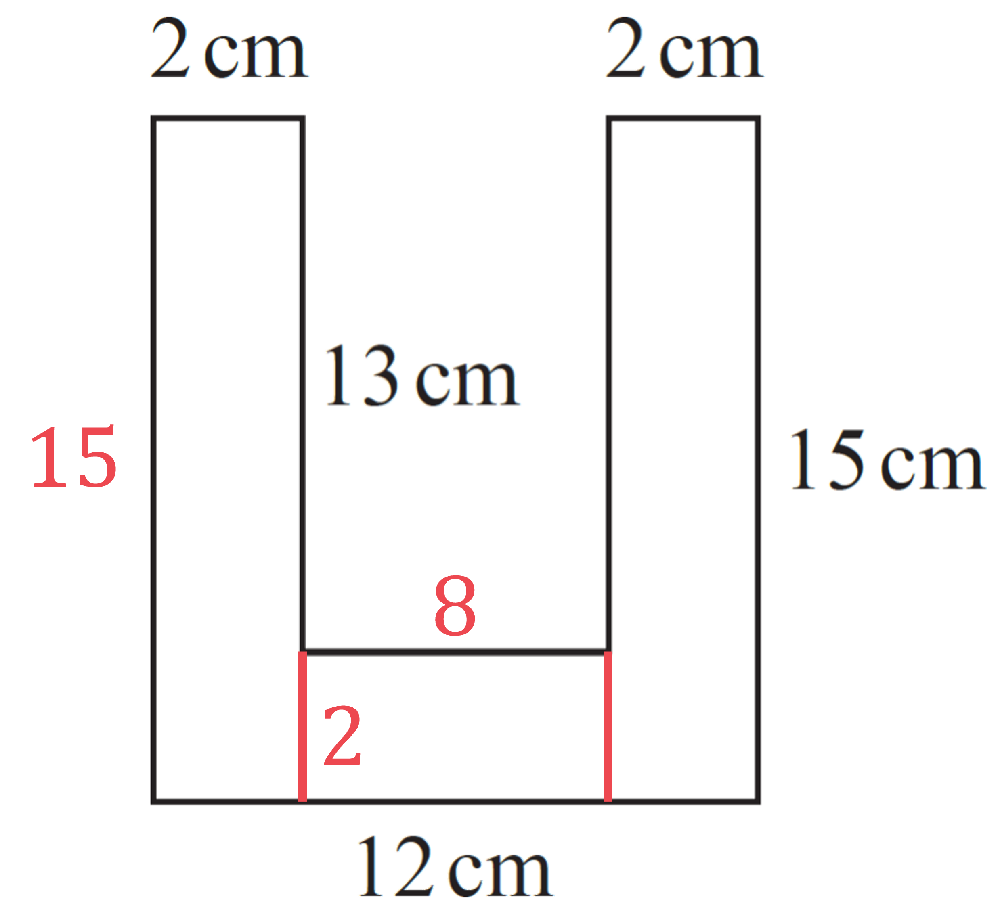

# Mark Schemes — Standard & Compound Units
**Geometry & Trigonometry** · Edexcel IGCSE Maths A (4MA1) — 18/Higher

## Q1 — easy — 2 marks · exam-questions

### 6() — 2 marks
> *Remember that 1 m**2** = (100 cm) × (100 cm) = (100 × 100) cm**2**.*

$4\times100\times100=40000$

**[1]**

**40000 cm****2****  [1]**

## Q2 — easy — 4 marks · exam-questions

### 7((a)) — 2 marks
> *Average speed = distance ÷ time*

$15\div6=2.5$

**[1]**

**2.5 miles per hour****  [1]**

### 7((b)) — 2 marks
> *Divide 15 by 5 to find how many 'lots' of 5 miles are in 15 miles. Then multiply by 8 to get the distance in km.*

$15\div5=3\,\,3\times8=24$

**[1]**

**15 miles is 24 km, so Sunita is correct.****  [1]**

## Q3 — easy — 6 marks · exam-questions

### 11((a)) — 2 marks
> *To find a reverse bearing, either add or subtract 180° (whichever will give an answer between 0° and 360°).*

$330-180=150$

**[1]**

**150°****  [1]**

### 11((b)) — 4 marks
> *First find the time for the flight in hours.*
* Time = Distance ÷ Speed.*

$200\div120=\frac{5}{3}=1\frac{2}{3}\mathrm{hours}$

**[1]**

> *Next convert 2/3 of an hour to minutes. *
*There are 60 minutes in an hour, so multiply by 2/3.*

$60\times\frac{2}{3}=40\,\frac{2}{3}\mathrm{hours}=40\mathrm{minutes}$

**[1]**

> *This allows you to give the flight time in hours and minutes.*

$1\frac{2}{3}\mathrm{hours}=1\mathrm{hour}40\mathrm{minutes}$

**[1]**

> *Now just add 1 h 40 m onto 10am to find the answer.*

**11.40 am****  [1]**

**1140 (the 24 hour clock version) will also get the mark here.**

## Q4 — easy — 4 marks · exam-questions

### 4((a)) — 3 marks
> *First find the distance Gary drove. Distance = Speed × Time.*

$80\times3=240\mathrm{km}$

**[1]**

> *Now figure out Lyn's speed. Speed = Distance ÷ Time.*

$240\div5=48$

**[1]**

**48 km/h****  [1]**

### 4((b)) — 1 marks
> *Answer within the context of the question.*

**If she drove along different roads, then her distance could be different.  Therefore her average speed could also be different.****  [1]**

## Q5 — easy — 3 marks · exam-questions

### 2() — 3 marks
> *Start by putting the numbers you know into the formula.*

$35=\frac{140}{A}$

**[1]**

> *Now solve the equation for **A**. *
*First multiply both sides by **A** to get **A** out of the denominator. Then divide by 35 to find the value of **A**. *
*The units will be m**2**, matching the units seen in newtons/m**2**. *

$35\timesA=140\,\,A=4$

**4 m****2****  [2]**

**1 mark for '4'.  1 mark for the correct units.**

## Q6 — easy — 3 marks · exam-questions

### 1() — 3 marks
> *The required units is km/h so convert the time to hours.*

> *There are 60 minutes in an hour so divide 39 minutes by 60 to convert to hours.*

$\frac{39}{60}=0.65$

*6 hours and 39 minutes = 6.65 hours*

**[1]**

$\mathrm{Speed}=\frac{\mathrm{Distance}}{\mathrm{Time}}$*. *
*If you forget this formula then it can be derived by looking at the units for speed km/h. *
*Kilometres measure a distance and hours measure a time.* 
*Substitute 429 for the distance and 6.65 for the time.*

$\frac{429}{6.65}=64.5112...$

**[1]**

> *Round to one decimal place.*

**Speed is 64.5 km/h (1dp)** **[1]**

## Q7 — easy — 3 marks · exam-questions

### 4() — 3 marks
> *The required units is km/h so convert the time to hours.*

> *There are 60 minutes in an hour so divide 24 minutes by 60 to convert to hours.*

$\frac{24}{60}=0.4$

*3 hours and 24 minutes = 3.4 hours*

**[1]**

$\mathrm{Speed}=\frac{\mathrm{Distance}}{\mathrm{Time}}$*. If you forget this formula then it can be derived by looking at the units for speed km/h. Kilometres measure a distance and hours measure a time.* 
*Substitute 433.5 for the distance and 3.4 for the time.*

$\frac{433.5}{3.4}=127.5$

**[1]**

**Average speed is 127.5 km/h ****[1]**

## Q8 — easy — 1 marks · exam-questions

### 5((b)) — 1 marks
> *As 1 m = 100 cm, you get the conversion 1 m**3** = 100**3** cm**3**.*

*1 m**3** = 100**3** cm**3** = 10**6** cm**3*

**1 000 000 cm****3** **[1]**

## Q9 — easy — 2 marks · exam-questions

### 2() — 2 marks
> *As 1 m = 100 cm, you get the conversion 1 m**3** = 100**3** cm**3**.*

*1 m**3** = 100**3** cm**3** = 10**6** cm**3*

> *To convert 32.4 m**3**, multiply 1 m**3 **by 32.4.*

*32.4 m**3** = 32.4 × 10**6** cm**3*

**[1]**

**32 400 000 cm****3** **[1]**

## Q10 — easy — 3 marks · exam-questions

### 6() — 3 marks
$\mathrm{Speed}=\frac{\mathrm{Distance}}{\mathrm{Time}}$*. If you forget this formula then it can be derived by looking at the units for speed km/h. Kilometres measure a distance and hours measure a time.* *Substitute 100 for the distance and 28440 for the speed.*

$28840=\frac{100}{\mathrm{Time}}$

> *Rearrange by multiplying both sides by Time and dividing both sides by 28840. Your answer will be in hours.*

$\mathrm{Time}=\frac{100}{28440}\mathrm{hours}$

**[1]**

> *There are 60 minutes in an hour and 60 seconds in each minute. Multiply by 60 twice to convert hours to seconds.*

`table row cell 100 over 28440 space cross times 60 cross times 60 end cell equals cell 1000 over 79 end cell row blank equals cell 12.6582... end cell end table`

**[1]**

> *Round to the nearest integer.*

**13 seconds (nearest second) ****[1]**

## Q11 — easy — 3 marks · exam-questions

### 2() — 3 marks
> *Find the area by multiplying the two lengths of the rectangle.*

$2\times1.25=2.5$

**[1]**

> *Substitute 42 for the pressure and 2.5 for the area in the given formula.*

$42=\frac{\mathrm{Force}}{2.5}$

**[1]**

> *Multiply both sides by 2.5.*

$\mathrm{Force}=42\times2.5$

**Force is 105 newtons** **[1]**

## Q12 — easy — 3 marks · exam-questions

### 7() — 3 marks
> *The given units are km/h so convert the time to hours.*

> *There are 60 minutes in an hour so divide 42 minutes by 60 to convert to hours.*

$\frac{42}{60}=0.7$

*6 hours and 42 minutes = 6.7 hours*

**[1]**

$\mathrm{Speed}=\frac{\mathrm{Distance}}{\mathrm{Time}}$*. If you forget this formula then it can be derived by looking at the units for speed km/h. Kilometres measure a distance and hours measure a time.* 
*Substitute 650 for the speed and 6.7 for the time.*

$650=\frac{\mathrm{Di}\text{stance}}{6.7}$

> *Multiply both sides by 6.7.*

$\mathrm{Distance}=650\times6.7$

**[1]**

**Distance is 4355 kilometres ****[1]**

## Q13 — easy — 3 marks · exam-questions

### 2() — 3 marks
> *Convert cm**2** to m**2**. *
*As 1 m = 100 cm, you get the conversion 1 m**2** = 100**2** cm**2**.*

*1 m**2** = 100**2** cm**2** = 10**4** cm**2*

> *To convert 120 cm**2**, divide by 10**4**.*

*120 cm**2** = 120 ÷ 10**4** cm**2** = 0.012 m**2*

**[1]**

> *Using the formula for pressure, substitute 810 for the force and 0.012 for the area.*

$\mathrm{Pressure}=\frac{810}{0.012}$

**[1]**

**Pressure is 67500 newtons/m****2** **[1]**

## Q14 — easy — 1 marks · exam-questions

### 13() — 1 marks
> *1 cm = 10 mm. Therefore 1 cm**3** = 10**3** mm**3**. To convert from cm**3** to mm**3** you need to multiply by 10**3**.*

$15\times10^{3}=15\times1000$

**15 000 mm****3** **[1]**

## Q15 — easy — 1 marks · exam-questions

### 2() — 1 marks
> *1 cm = 10 mm. Therefore 1 cm**2** = 10**2** mm**2**. To convert from mm**2** to cm**2** you need to divide by 10**2**.*

$36\div10^{2}=36\div100$

**0.36 cm****2** **[1]**

## Q16 — easy — 5 marks · exam-questions

### 1() — 5 marks
> *Find out how many minutes it takes to make one card by dividing the time by 3.*

$48\div3=16\mathrm{minutes}$

**[1] **

> *Find out how many minutes it will take to complete the order by multiplying by 80.*

$16\times80=1280\mathrm{minutes}$

**[1] **

> *She plans to work 8 hours a day for 3 days so multiply the values together to find out how many hours she plans to work.*

$8\times3=24\mathrm{hours}$

**[1] **

> *Convert to the same units to compare. 1 hour = 60 minutes.*

$24\mathrm{hours}=24\times60\mathrm{minutes}=1440\mathrm{minutes}$

**[1] **

> *The order needs 1280 minutes to complete and she plans to work 1440 minutes. Compare and interpret these values.*

**Yes**** because ****1280 minutes is less than 1440 minutes**** ****[1] **

## Q17 — easy — 2 marks · exam-questions

### 2() — 2 marks
> *Write the ratio with the current units. *

$50g:1\mathrm{kg}$

> *In order to remove the units they need to be the same for all parts. 1 kg = 1000 g.*

$50g:1000g$

**[1]**

> *You can remove the units from the ratio now they are the same. To make the first part 1, you need to divide both parts by 50.*

$1:\frac{1000}{50}=1:20$

**n**** = 20** **[1]**

## Q18 — easy — 5 marks · exam-questions

### 2((a)) — 4 marks
> *It is helpful if the measurements use the same units. 1 km = 1000 m so convert 5 kilometres by multiplying by 1000.*

$5\times1000=5000m$

**[1]**

> *Find how long it takes to run 1 metre. Divide the time by 400.*

$\frac{66}{400}=0.165\mathrm{seconds}$

**[1]**

> *Multiply by 5000 to find how long it takes to run 5 km.*

$0.165\times5000=825\mathrm{seconds}$

> *1 minute = 60 seconds. Convert to minutes by dividing by 60.*

$\frac{825}{60}=13.75\mathrm{minutes}$

**[1]**

**He runs 5 km in ****13.75 minutes**** which is ****less than 14 minutes** **[1]**

### 2((b)) — 1 marks
**His speed might decrease as he gets tired** **[1]**

## Q19 — easy — 3 marks · exam-questions

### 4() — 3 marks
> $\mathrm{Density}=\frac{\mathrm{Mass}}{\mathrm{Volume}}.$* Substitute 500 for the mass and 125 for the volume.*

$\frac{500}{125}=4$

**Using correct formula**** [1]**

> *The units will be derived from the units used for the mass and the volume: grams per cubic centimetre. *

**4 g/cm****3** 
**Correct value**** [1] **
**Correct units**** [1]**

## Q20 — easy — 4 marks · exam-questions

### 5((a)) — 3 marks
> *The rate of decrease is given by cm per day which suggests that you divide the decrease in depth by the number of days. Therefore to find the number of days you would divide the decrease in depth by the rate.*

> *Find the decrease in the depth by subtracting the two depths.*

$57.8-54.2=3.6$

**[1]**

> *Divide this by 0.3 to find how many days it takes to decrease by 3.6 cm.*

$\frac{3.6}{0.3}=\frac{36}{3}=12$

**[1]**

**12 days** **[1]**

### 5((b)) — 1 marks
**If the rate was slower then it would take ****more days**** to decrease by 3.6 cm** **[1]**

## Q21 — medium — 4 marks · exam-questions

### 5() — 4 marks
> *Every 1 m**2** has a mass of 160 g. *
*So multiply 160 by 1/8 to find the mass of 1 sheet of card.*

$160\times\frac{1}{8}=\frac{160}{8}=20g$

**[1]**

> *Now multiply that by 25 to find the mass of 25 sheets. *

$20\times25=500$

**500 g****  [3]**

**1 mark for multiplying by 25 to get the answer.  1 mark for '500'.  1 mark for the correct units. **
**You will also get full marks if you convert that to 0.5 kg.**

## Q22 — medium — 3 marks · exam-questions

### 13() — 3 marks
> *For a prism, Volume = Area of Cross-section × Length. *
*The cross section here is a right-angled triangle with base 5 cm and height 12 cm. *
*For the area of that triangle, use  Area = (1/2) × Base × Height.  *

`Volume space equals space open parentheses 1 half space cross times space 5 space cross times space 12 close parentheses space cross times space 15 space equals space 450 space cm cubed`

**[1]**

> *Each cm**3** has a mass of 6.6 grams. *
*So multiply 450 by 6.6 to find the mass of the prism.*

$450\times6.6=2970$

**[1]**

**2970 g****  [1]**

## Q23 — medium — 3 marks · exam-questions

### 5() — 3 marks
> *Use  Time = Distance ÷ Speed  to find Aysha's times from **A** to **B **and from **B** to **C**. *
*It's easiest to convert to minutes at this point.  (Remember there are 60 minutes in an hour!)*

`table row cell A space to space B colon space space 25 over 50 space end cell equals cell space 1 half space hour space equals space 30 space minutes end cell row blank blank blank row cell B space to space C colon space space 25 over 60 space end cell equals cell space 5 over 12 space hours end cell row cell 5 over 12 space hours space end cell equals cell space 5 over 12 space cross times space 60 space equals space 25 space minutes end cell end table`

**[1]**

> *Now subtract to find the difference in times.*

$30-25=5$

**[1]**

**5 minutes****  [1]**

## Q24 — medium — 3 marks · exam-questions

### 6() — 3 marks
> *Use  Time = Distance ÷ Speed  to find how long Sue was driving on the motorway.*

`table row cell 240 space divided by space 60 space end cell equals cell space 4 space hours end cell end table`

**[1]**

> *Now add the times together to find her total travel time. Remember that there are 60 minutes in an hour.*

$20+25+30=75\mathrm{minutes}=1h15m\,\,1h15m+4h=5h15m$

**[1]**

> *Finally add that time onto 9.00 am to find out when she arrived home. 3 hours takes the time up to 12.00 noon, and the remaining 2 h 15 m takes it to 2.15 pm.*

**2.15 pm****  [1]**

**1415 (the 24 hour clock version) will also get the mark here**

## Q25 — medium — 5 marks · exam-questions

### 14() — 5 marks
> *First we need to find the area of the cross-section. *
*Divide the cross-section into rectangles. *
*Then use the Area = Length × Width formula and add the rectangle areas together.*

`table row cell 12 space minus space 2 space minus space 2 space end cell equals cell space 8 space space space space space space space space space space space space space 15 space minus space 13 space equals space 2 end cell end table`

`table row cell Area space end cell equals cell space open parentheses 15 space cross times space 2 close parentheses space plus space open parentheses 8 space cross times space 2 close parentheses space plus space open parentheses 15 space cross times space 2 close parentheses space equals space 76 space cm squared end cell end table`

**[1] **
**Other ways of dividing the shape into rectangles will also get the mark if done correctly.**

> *Now find the volume of the bar. *
*Use the formula  Volume of Prism = Area of Cross-section × Length.*

$\mathrm{Volume}=76\times120=9120\mathrm{cm}^{3}$

**[1]**

> *Now find the mass of the bar. *
*Use the formula  Mass = Density × Volume.*

$\mathrm{Mass}=9120\times8=72960g$

**[1]**

> *Convert the mass to kg  (1 kg = 1000 g). *
*Then divide 250 by the mass in kilograms to find how many bars the trolley can carry.*

$72960\div1000=72.96\mathrm{kg}\,\,250\div72.96=3.426535...$

**[1]**

> *But we are only dealing with whole numbers of bars. *
*And four bars would go beyond the maximum mass, so be sure to round **down**.*

**3 bars****  [1]**

## Q26 — medium — 3 marks · exam-questions

### 3() — 3 marks
> *Density = Mass ÷ Volume  can be rearranged to give  *
*Volume = Mass ÷ Density. *
*But be careful here!  The density is given in g/cm**3**, so 12.5 kg must first be converted to grams. *
*(Remember there are 1000 g in a kg.)*

`table row cell 12.5 space cross times space 1000 space end cell equals cell space 12500 space straight g end cell row blank blank blank row cell 12500 space divided by space 19.3 space end cell equals cell space 647.668393... end cell end table`

**[2] **
**1 mark for using Volume = Mass ÷ Density.  1 mark for converting kg to g.**

> *Round to 3 s.f. (and remember your units!).*

**648 cm****3****  [1]**
** ****Answers in range 647 to 648 will get the mark here.**

## Q27 — medium — 3 marks · exam-questions

### 6() — 3 marks
> *Use the given formula to find the pressure of 70 newtons on an area of 20 cm**2**.*

$P_{1}=\frac{70}{20}=3.5$

*The force increases by 10, and the area increases by 10.* *Find the new pressure using the given formula.*

$P_{2}=\frac{70+10}{20+10}=\frac{8}{3}=2.666666...$

** [1] **
**Mark is for finding ****both**** values for pressure**

> *Find the percentage decrease using *$\frac{\mathrm{Difference}}{\mathrm{Original}}\times100$*.*

`fraction numerator 3.5 minus 2.666... over denominator 3.5 end fraction space cross times space 100 space equals space 23.8 space percent sign`

**[1]**

**It decreases by 23.8%, and as 23.8% > 20%, Helen is incorrect **** ****[1]**

## Q28 — medium — 2 marks · exam-questions

### 12() — 2 marks
> *First convert the area to m**2**, to match the units asked for in the answer. *
*Remember that 1 m**2** = (100 cm) × (100 cm) = (100 × 100) cm**2**.*

$\frac{60}{100\times100}=\frac{60}{10000}=0.006m^{2}$

**[1]**

> *Now put the force and the converted area into the formula given.*

$\mathrm{Pressure}=\frac{900}{0.006}=150000$

**150000 newtons/m****2****  [1]**

## Q29 — medium — 4 marks · exam-questions

### 6() — 4 marks
> *We want the answer to be in seconds per tray. Start by converting 1 hour into seconds. Remember that there are 60 minutes in an hour, and 60 seconds in a minute.*

$1\mathrm{hour}=60\mathrm{minutes}=60\times60=3600\mathrm{seconds}$

**[1]**

> *Now divide 15000 by 20 to find how many trays are filled in an hour.*

$15000\div20=750\mathrm{trays} \mathrm{per} \mathrm{hour}$

**[1]**

> *Finally divide 3600 by 750 to find the number of seconds per tray.*

$3600\div750=4.8$

**[1]**

**4.8 seconds****  [1]**

## Q30 — medium — 3 marks · exam-questions

### 4() — 3 marks
> *The fuel pumping rate is given in litres per minute. Start by converting 18500 gallons into litres. Each gallon has 4.5 litres, so **multiply** 18500 by 4.5.*

$18500\times4.5=83250\mathrm{litres}$

**[1]**

> *And each minute, 1700 litres of fuel are pumped. So **divide** 83250 by 1700 to find the number of minutes.*

$83250\div1700=48.970588...\mathrm{minutes}$

**[1]**

> *Finally round to the nearest minute as asked for in the question.*

**49 minutes****  [1]**

**Answers in the range 48.9 - 49.1 will get the mark here.**

## Q31 — medium — 3 marks · exam-questions

### 4() — 3 marks
> *Start by converting '30 miles in 26 minutes' into miles per minute.*

$30\div26=\frac{15}{13}\mathrm{miles} \mathrm{per} \mathrm{minute}$

**[1]**

> *So they would need to travel 15/13 miles every minute. And there are 60 minutes in an hour. So **multiply** that speed by 60 to convert to miles per hour.*

`15 over 13 space cross times space 60 space equals space 69.230769... space equals space 69.2 space mph space open parentheses 3 space straight s. straight f. close parentheses`

**[1]**

> *Express your results in the context of the question.*

**30 miles in 26 minutes corresponds to an average speed of 69.2 mph.  So Lethna is not correct.****  [1]**

**You can also earn full marks by showing that going 70 mph for 26 minutes means you will go 30.333... miles. Or by showing that at 70 mph, it will only take 25.714... minutes to travel 30 miles.**

## Q32 — medium — 3 marks · exam-questions

### 10() — 3 marks
*Convert each unit separately.* 
*There are 60 seconds in a minute. Multiply by 60 to find how many metres are travelled in a minute.*

`table row cell 50 space metres space per space second space end cell equals cell space 50 space cross times 60 space metres space per space minute end cell row blank equals cell 3000 space metres space per space minute end cell end table`

**[1]**

> *There are 60 minutes in an hour. Multiply by 60 to find how many metres are travelled in an hour.*

`table row cell 3000 space metres space per space minute end cell equals cell space 3000 space cross times 60 space metres space per space hour end cell row blank equals cell 180000 space metres space per space hour end cell end table`

> *There are 1000 metres in a kilometre. Divide by 1000 to find how many kilometres are travelled in an hour.*

`table row cell 18000 space metres space per space hour end cell equals cell 180000 over 1000 space kilometres space per space hour end cell end table`

**[1]**

$180\mathrm{kilometres} \mathrm{per} \mathrm{hour}$ **[1]**

## Q33 — medium — 3 marks · exam-questions

### 9((a)) — 3 marks
$\mathrm{Density}=\frac{\mathrm{Mass}}{\mathrm{Volume}}.$* If you forget this formula then you can derive it using the units for density, kg/m**3**. Kilograms measure a mass and cubic metres measure a volume.* 
*Substitute 0.65 for the density and 3.5 for the mass.*

$0.65=\frac{3.5}{\mathrm{Volume}}$

**[1]**

> *Multiply both sides by the volume and divide both sides by 0.65.*

`table row Volume equals cell fraction numerator 3.5 over denominator 0.65 end fraction end cell row blank equals cell 70 over 13 end cell row blank equals cell 5.384615... end cell end table`

**[1]**

> *Round to 3 significant figures. Your answer will be in cubic metres.*

**Volume is 5.38 m****3**** (3sf)** **[1]**

## Q34 — medium — 3 marks · exam-questions

### 9((b)) — 3 marks
*Convert each unit separately.* 
*There are 60 seconds in a minute. Divide by 60 to find how many kilometres are travelled in a minute.*

`table row cell 630 space kilometres space per space hour space end cell equals cell fraction numerator space 630 space over denominator 60 end fraction space kilometres space per space minute end cell row blank equals cell 10.5 space kilometres space per space minute end cell end table`

**[1]**

> *There are 60 minutes in an hour. Divide by 60 to find how many kilometres are travelled in a second.*

`table row cell 10.5 space kilometres space per space minute end cell equals cell fraction numerator space 10.5 space over denominator 60 end fraction space kilometres space per space second end cell row blank equals cell 0.175 space kilometres space per space second end cell end table`

> *There are 1000 metres in a kilometre. Multiply by 1000 to find how many metres are travelled in a second.*

`table row cell 0.175 space kilometres space per space second end cell equals cell 1000 cross times 0.175 space metres space per space second end cell end table`

**[1]**

$175\mathrm{metres} \mathrm{per} \mathrm{second}$ **[1]**

## Q35 — medium — 1 marks · exam-questions

### 10() — 1 marks
> *Method 1*

*If the top of a fraction gets smaller then the overall value of the fraction also gets smaller. Therefore dividing the mass by 2 causes the density to be divided by 2.* 
*If the bottom of a fraction gets bigger then the overall value of the fraction gets smaller. Therefore multiplying the volume by 4 causes the density to be divided by 4.* 
*Combine both effects, dividing by 2 then dividing by 4 is equivalent to dividing by 8.*

**÷ 8** **[1]**

> *Method 2*

> *Use actual numbers. Say the mass is 100 and the volume is 1.*

$\mathrm{Density}=\frac{100}{1}=100$

> *Divide the mass by 2 and multiply the volume by 4 and calculate the new density.*

$\mathrm{Density}=\frac{100\div2}{1\times4}=\frac{50}{4}=12.5$

> *Choose the option takes you from 100 to 12.5.*

**÷ 8** **[1]**

## Q36 — medium — 1 marks · exam-questions

### 4() — 1 marks
> *Density measures how heavy something is per a unit of volume. The formula is *$\mathrm{Desnity}=\frac{\mathrm{Mass}}{\mathrm{Volume}}.$* Kilograms (kg) is a measure of mass and cubic metres (m**3**) is a measure of volume, therefore kg/m**3** is a measure of density.*

**kg/m****3**** [1]**

## Q37 — medium — 4 marks · exam-questions

### 12((a)) — 4 marks
> *The measurements need to use consistent units. 1 km = 1000 m so convert 5 km to m.*

$5\mathrm{km}=5000m$

* ***[1]**

> $\mathrm{Average} \mathrm{Speed}=\frac{\mathrm{Distance}}{\mathrm{Time}}.$* Substitute 5000 for the distance and 2.2 for the speed.*

$2.2=\frac{5000}{\mathrm{Time}}$

> *Rearrange by multiplying both sides by the time and dividing both sides by 2.2. The units for the time will be seconds.*

`table row Time equals cell fraction numerator 5000 over denominator 2.2 end fraction end cell row blank equals cell 2272.727... space straight s end cell end table`

**[1]**

> *Round to the nearest second.*

$2273s$

> *1 minute = 60 seconds. Divide by 60 to convert to minutes.*

$\frac{2273}{60}=37.83333...$

* ***[1]**

> *This 37 minutes. Convert the decimal part to seconds by subtracting the integer part and multiplying by 60.*

$0.83333...\times60=53$

**37 minutes 53 seconds**** (nearest second)** **[1]**

## Q38 — medium — 3 marks · exam-questions

### 2() — 3 marks
> **[exam-tip]**
> Always check the units given in a question against the units required for the answer.
> 
> Here the given area units (cm2) do not match the area units needed for the pressure in the answer (m2), so those will have to be converted.

> *Convert the area units*

> *There are 100 cm in 1 m, which means 100**2** cm**2** in 1 m**2**; therefore*

$120\div100^{2}=0.012m^{2}$

**[M1]**

> *Substitute into the formula*

$\frac{810}{0.012}=67500$

**Final answer:** **67500 newtons/m****2 **

**[A1]**

## Q39 — medium — 3 marks · exam-questions

### 9() — 3 marks
> *Change the kilometres to metres; there are 1000 m in 1 km, so*

*27×1000 = 27000*

> *That gives the speed in metres per hour, so you need to change the time to seconds*

> *There are 60 minutes in an hour and 60 seconds in a minute, so divide by 60 twice*

$\frac{27000}{60\times60}$

**[M1]**

**Final answer:** **7.5**

**[A1]**

> **[mark-scheme]**
> **A1**: Equivalent answers, e.g. $\frac{15}{2}$ or $7\frac{1}{2}$, will also get this final mark.

## Q40 — hard — 3 marks · exam-questions

### 1() — 3 marks
Convert the units

$400\div100^{2}=0.04$

**[M1]**

Substitute into the formula

$980\div0.04=24500$

**[M1]**

**Final answer:** **24 500 **$\mathrm{newtons}/m^{2}$

**[A1]**

## Q41 — hard — 5 marks · exam-questions

### 5() — 5 marks
> *First divide 180 by 1000 to find out how many cubic metres Henry uses each day.*

$180\div1000=0.18\mathrm{cubic} \mathrm{metres}$

**[1]**

> *Now multiply by 91.22p to find the cost per day with the water meter.*

`0.18 space cross times space 91.22 space equals space 16.4196 space straight p space equals space £ 0.164196`

**[1]**

> *Then multiply by 365 (the number of days in a normal year) to find the price for water used per year. (You don't need to worry about leap years here!)*

`0.164196 space cross times space 365 space equals space £ 59.93154`

**[1]**

> *Add £28.20 to find the total cost with a water meter per year.*

`59.93154 space plus space 28.20 space equals space 88.13154 space equals space £ 88.13 space open parentheses nearest space penny close parentheses`

**[1]**

> *And finally interpret your results in the context of the question.*

**It will cost Henry £88.13 per year with the water meter, which is cheaper than the £107 without the meter.  Therefore he should have a water meter.****  [1]**

## Q42 — hard — 6 marks · exam-questions

### 17() — 6 marks
> *Start by finding the volume of the pond.*
* It is in the form of a prism with its cross-section being a trapezium (the front face in the diagram). *
*Use the  Area = *$\frac{1}{2}$*(**a** + **b**)**h  **formula to find the area of the trapezium. *
*Then use the  Volume = Area of Cross-section × Length  formula to find the volume of the prism.*

`1 half space cross times space open parentheses 1.3 space plus space 0.5 close parentheses space cross times space 2 space equals space 1.8 space straight m squared space

1.8 space cross times space 1 space equals space 1.8 space straight m cubed`

**[1]**

> *Now find the volume of water that goes out in the first 30 minutes. *
*The volume of the water lost is in the form of a 2 m by 1 m by 20 cm cuboid. *
*Use the formula  Volume of Cuboid = Length × Width × Height. Don't forget to turn 20 cm into metres first, so the units all match!*

$20\div100=0.2m\,\,2\times1\times0.2=0.4m^{3}$

**[1]**

> *Now turn that into a rate of water lost per hour.*

$0.4m^{3}\mathrm{in}30\mathrm{minutes}=0.8m^{3}/\mathrm{hour}$

**[1]**

> *Be careful now. *
*The question asks for how much **more **time it will take to empty the pond.*
*So subtract 0.4 from 1.8 to find the volume of water left in the pond after 30 minutes.*

$1.8-0.4=1.4m^{3}\mathrm{remaining}$

**[1]**

> *Every hour 0.8 m**3** are removed from the pond. *
*So divide 1.4 by 0.8 to find out how many hours are left until the pond is emptied completely.*

$1.4\div0.8=\frac{7}{4}=1\frac{3}{4}$

**[1]**

$1\frac{3}{4}$** hours****  [1]**

**1.75 hours or 1 hour 45 minutes will also get the mark here.**

## Q43 — hard — 3 marks · exam-questions

### 14() — 3 marks
> *First find out how long it takes her to go from Fulbeck to Ganby. Use the formula  Time = Distance ÷ Speed. *
*It's easiest to convert to minutes at this point.  (Remember there are 60 minutes in an hour!)*

$\frac{10}{40}=\frac{1}{4}\mathrm{hour}=15\mathrm{minutes}$

**[1]**

> *10.00 to 10.35 is 35 minutes, so subtract 15 from 35 to find how many minutes she has to get from Ganby to Horton. *
*Then divide 18 by that to see how many miles per minute she needs to go. *
*And multiply that by 60 to convert miles per minute to miles per hour.*

$35-15=20\mathrm{minutes}\,\,\frac{18}{20}=0.9\mathrm{miles} \mathrm{per} \mathrm{minute}\,\,0.9\times60=54$

**[1]**

**54 mph****  [1]**

## Q44 — hard — 4 marks · exam-questions

### 16() — 4 marks
> *First find the mass of liquid C.*

$140+128=268g$

**[1]**

> *Now use  Volume = Mass ÷ Density  to find the volumes of Liquids A and B. *
*Then add those together to find the volume of Liquid C.*

$\mathrm{Liquid}A:\frac{140}{0.7}=200\mathrm{cm}^{3}\,\,\mathrm{Liquid}B:\frac{128}{1.6}=80\mathrm{cm}^{3}\,\,200+80=280\mathrm{cm}^{3}$

**[1]**

> *Use  Density = Mass ÷ Volume  to find the density of Liquid C.*

$\frac{268}{280}=0.957142...$

**[1]**

** **

**0.957 g/cm****3**** (3 s.f.)****  [1]**

**Answers between 0.957 and 0.96 will get the mark here**

## Q45 — hard — 3 marks · exam-questions

### 18() — 3 marks
> *Use  Volume = Mass ÷ Density  to find the volumes of lead and tin.*

$\mathrm{lead}:\frac{74}{11.34}=6.5255...\mathrm{cm}^{3}\,\,\mathrm{tin}:\frac{126}{7.31}=17.2366...\mathrm{cm}$

**[1] **
**Mark is for using Volume = Mass ÷ Density to try to find either volume**

> *Now add the volumes together to find the total volume of the alloy. *
*Then use  Density = Mass ÷ Volume  to find the density of the alloy.*

$6.5255...+17.2366...=23.7622...\mathrm{cm}^{3}\,\,\frac{200}{23.7622...}=8.4167...$

**[1]**

*Round to 1 d.p., as asked for in the question.*** **

**8.4 g/cm****3**** (1 d.p.)****  [1]**

**Answers between 8.4 and 8.44 will get the mark here**

## Q46 — hard — 5 marks · exam-questions

### 4((a)) — 4 marks
> *We need to find the total distance travelled, and the total time it took. *
*Start by finding the time from Liverpool to Manchester. *
*Use the formula  Time = Distance ÷ Speed.*

$56\div70=0.8\mathrm{hours}$

**[1]**

> *Now find the total distance and the total time. *
*For time, first convert 75 minutes into decimal hours. (Remember there are 60 minutes in an hour!)*

$\mathrm{total} \mathrm{distance}=56+61=117\mathrm{km}\,\,75\mathrm{minutes}=\frac{75}{60}=1.25\mathrm{hours}\,\,\mathrm{total} \mathrm{time}=0.8+1.25=2.05\mathrm{hours}$

**[1] **
**This mark is for a correct process to find total distance ****or**** total time.**

> *Use  Speed = Distance ÷ Time to find the average speed.*

$117\div2.05=57.07317...$

**[1]**

**57.1 mph (3 s.f.)****  [1]**

**Answers between 57 and 57.1 will get the mark here.**

### 4((b)) — 1 marks
> *In general, the total average speed can only be equal to the mean of the speeds of the two parts of the journey if the times were the same for each part.*

**The times from Barnsley to Leeds and from Leeds to York must have been the same.****  [1]**

**You can also get the mark here for saying that the distance from Leeds to York must be 3/4 of the distance from Barnsley to Leeds.  (With the given speeds, that relation of distances would mean that the two times were the same.)**

## Q47 — hard — 4 marks · exam-questions

### 6() — 4 marks
> *Use  Mass = Density × Volume  to find the masses of the three liquids.*

$\mathrm{apple} \mathrm{juice}:1.05\times25=26.25g\,\,\mathrm{fruit} \mathrm{syrup}:1.4\times15=21g\,\,\mathrm{carbonated} \mathrm{water}:0.99\times280=277.2g$

**[1] **
**The mark here is for using Mass = Density × Volume to find any ****one**** of the three masses.**

> *Now add those together to find the total mass.*

$26.25+21+277.2=324.45g$

**[1]**

> *Use  Density = Mass ÷ Volume  to find the density of the drink. You are told that the total volume is 320 cm**3**, so you don't need to figure that out!*

$324.45\div320=1.013906...$

**[1]**

*Round to 2 d.p., as asked for in the question. *** **

**1.01 g/cm****3**** (2 d.p.)****  [1]**

**Answers between 1.01 and 1.014 will get the mark here**

## Q48 — hard — 5 marks · exam-questions

### 9() — 5 marks
> *Start by finding James' speed. *
*Use the formula  Speed = Distance ÷ Time.*

$\mathrm{James}:50\div2.5=20\mathrm{km}/\mathrm{hour}$

**[1]**

> *Now use the formula  Time = Distance ÷ Speed  to find how long it took James to cycle 15 km. *
*It's easiest also to convert to minutes at this point.  *
*(Remember 1 hour = 60 minutes, so 1/4 hour = 15 minutes!)*

$15\div20=\frac{15}{20}=\frac{3}{4}\mathrm{hours}=45\mathrm{minutes}$

**[1]**

> *Peter started 5 minutes after James. *
*So subtract 5 from 45 to find how many minutes it took Peter to cycle the same distance.*

$45-5=40\mathrm{minutes}$

**[1]**

> *Divide 15 by 40 to find Peter's speed in km/minute. *
*Then multiply that by 60 to find his speed in km/hour.*

$15\div40=\frac{15}{40}=\frac{3}{8}\mathrm{km}/\mathrm{minute}\,\,\frac{3}{8}\times60=\frac{45}{2}$

**[1]**

** **

$\frac{45}{2}$** km/h****  [1]**

**22.5 km/h (decimal form) will also get the mark here**

## Q49 — hard — 4 marks · exam-questions

### 12() — 4 marks
> *Use  Distance = Speed × Time  to find how far Sean travelled in the first 3 hours.*

$50\times3=150\mathrm{miles}$

**[1]**

> *Now use  Time = Distance ÷ Speed  to find how long it took James to drive the last 150 miles.*

$150\div30=5\mathrm{hours}$

**[1]**

> *Now find the total time and total distance. *
*Then use Average Speed = Total Distance ÷ Total Time  to find Sean's average speed.*

$\mathrm{total} \mathrm{distance}=150+150=300\mathrm{miles}\,\,\mathrm{total} \mathrm{time}=3+5=8\mathrm{hours}\,\,300\div8=37.5$

**[1]**

> *Interpret your result in the context of the question.*

**Final answer:** **Sean is not right, because his average speed was actually 37.5 mph.****  [1]**

## Q50 — hard — 4 marks · exam-questions

### 12() — 4 marks
> *Use  Volume = Mass ÷ Density  to find the volumes of the two metals.*

$\mathrm{metal}A:150\div19.3=7.7720...\mathrm{cm}^{3}\,\,\mathrm{metal}B:150\div8.9=16.8539...\mathrm{cm}^{3}\,$

**[1] **
**The mark here is for using Volume = Mass ÷ Density to find any ****one**** of the two volumes.**

> *Now add those together to find the total volume.*

$7.7720...+16.8539...=24.6259...\mathrm{cm}^{3}$

**[1]**

> *Use  Density = Mass ÷ Volume  to find the density of the alloy. You are told that the total mass is 300 g, so you don't need to work that out!*

$300\div24.6259...=12.1822...$

**[1]**

** **

**12.2 g/cm****3**** (3 s.f.)****  [1]**

**Answers between 12.1 and 12.2 will get the mark here.**

## Q51 — hard — 3 marks · exam-questions

### 11((a)) — 2 marks
> *Time is equal to distance divided by speed*

$\frac{3.9\times10^{7}}{3\times10^{5}}=1.3\times10^{2}$

**[1]**

> *Write as an ordinary number*

**130 seconds** **[1]**

### 11((b)) — 1 marks
> *Dividing by a smaller number will give a bigger answer*

**It will take longer ****[1]**

## Q52 — hard — 4 marks · exam-questions

### 13() — 4 marks
> *Remember 1 litre = 1000 cm**3*

> *Find the mass of each chemical by multiplying the density by the volume*

*Ethanol *$1.09\times60000=65400$

*Propylene *$0.97\times128000=124160$

**finding at least one [1]**

**finding both [1]**

> *Find the total mass*

$65400+124160=189560$

> *Divide by the total volume*

*Volume *$60000+188000=188000$

$\frac{124160}{188000}=1.00829...$

**[1]**

> *Round to 2 decimal places*

**1.01 g/cm****3**** (2dp) ****[1]**

## Q53 — hard — 6 marks · exam-questions

### 6() — 6 marks
> *All measurements need to use the same units. Convert all lengths to metres using 1 m = 100 cm.*

$1.8\mathrm{cm}=0.018m$

> *Convert all masses to kilograms using 1 tonne = 1000 kg.*

$15\mathrm{tonnes}=15000\mathrm{kg}$

**[1]**

> *Calculate the volume of a wood panel by multiplying the three lengths.*

$\mathrm{Volume}=2.4\times1.2\times0.018=0.05184m^{3}$

**[1]**

> $\mathrm{Density}=\frac{\mathrm{Mass}}{\mathrm{Volume}}.$* Rearrange the formula to find the mass: *$\mathrm{Mass}=\mathrm{Density}\times\mathrm{Volume}.$

$\mathrm{Mass}=750\times0.0518=38.88\mathrm{kg}$

**[1]**

> *Divide 15 000 kg by the mass of one wood panel to determine how many wood panels the truck can hold.*

$\frac{15000}{38.88}=385.802...$

**Dividing 15 tonnes by mass of one wood panel**** [1] **
**Correct answer****[1]**

> *Round down to the next largest integer.*

**385 wood panels**** [1]**
