# Mark Schemes — Volume & Surface Area
**Geometry & Trigonometry** · Edexcel IGCSE Maths A (4MA1) — 18/Higher

## Q1 — easy — 3 marks · exam-questions

### 9() — 3 marks
> *Split the front face into two separate rectangles.*

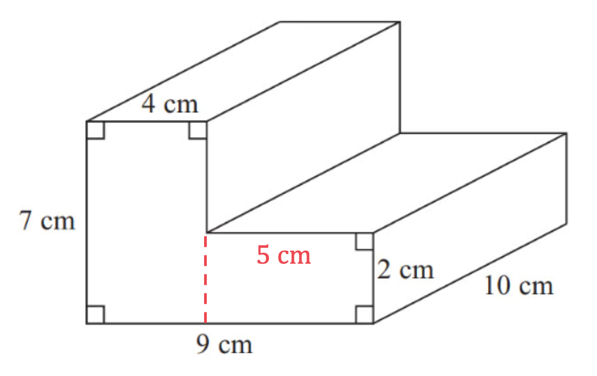

> *Calculate the area of each of the rectangles and add together to find the total area of the cross-sectional area.*

`table row A equals cell 4 cross times 7 plus 5 cross times 2 end cell end table`

**[1]**

`table row A equals cell 28 plus 10 end cell row blank equals cell 38 space cm squared end cell end table`

> *Multiply the cross-sectional area by the length of the prism to calculate the volume of the object.*

$V=38\times10$

**[1]**

$380\mathrm{cm}^{3}$* ***[1]**

## Q2 — easy — 4 marks · exam-questions

### 3() — 4 marks
> *Calculate the area of the triangular cross-sectional area, using the formula: *$A=\frac{1}{2}bh$*, where *$b$* is the length of the base and *$h$* is the perpendicular height.*

`table row A equals cell 1 half cross times 3 cross times 4 end cell end table`

**[1]**

`table row A equals cell 6 space cm squared end cell end table`

> *Calculate the volume of the prism by multiplying the cross-sectional area by the length of the object.*

$V=6\times20$

**[1]**

$120\mathrm{cm}^{3}$

**120**** [1] **
**cm****3**** [1]**

## Q3 — easy — 3 marks · exam-questions

### 1() — 3 marks
> *Calculate the volume of the prism by mutliplying the cross-sectional area by the length.*

$V=30\times25$

**[1]**

$750\mathrm{cm}^{3}$

**750**** [1] **
**cm****3**** ****[1]**

## Q4 — easy — 3 marks · exam-questions

### 1() — 3 marks
> *A cuboid is made up from 3 pairs of opposite, identical faces. Calculate the area of each of face and add them together to find the total surface area of the cuboid.*

*Top/bottom: *$6\times1.5=9$

**[1]**

*Front/back: *$6\times1.5=9$

*Side: *$1.5\times1.5=2.25$

> *Add together each of the faces and multiply by two to take into account that for each face, the opposite face has the same area.*

*Total area = *`2 cross times open parentheses 9 plus 9 plus 2.25 close parentheses`

**[1]**

$40.5\mathrm{cm}^{2}$* ***[1]**

## Q5 — easy — 3 marks · exam-questions

### 5((a)) — 3 marks
*The volume of a cuboid is *$V=l\timesw\timesh$* where **l, w **and **h** are the lengths of the three perpendicular sides.*

> *Substitute **V** = 270, **l** = 12, **w** = 5  and **h** = **x **into the formula and solve for **x**.*

`table row 270 equals cell 12 cross times 5 cross times x end cell row 270 equals cell 60 x end cell row cell 270 over 60 end cell equals x row cell 4.5 end cell equals x end table`

**[1]*** *

*The formula for the the volume of a cylinder is *$V=πr^{2}h$* where **r** is the length of the radius and **h** is the height.*

> *Substitute **r** = 4.5 and **h** = 2(4.5) = 9 into the formula.*

> `table row V equals cell straight pi cross times 4.5 squared cross times 9 end cell row blank equals cell 729 over 4 straight pi end cell row blank equals cell 572.555261... end cell end table`*  *

**[1]*** *

> *Round to the nearest whole number.*

**Volume is 573 cm****3**** (nearest whole number)**** [1]**

## Q6 — easy — 2 marks · exam-questions

### 4() — 2 marks
*The formula for the the volume of a cylinder is *$V=πr^{2}h$* where **r** is the length of the radius and **h** is the height. The radius is half of the diameter.*

> *Substitute **r** = 14 ÷ 2 = 7 and **h** = 20 into the formula.*

> `table row V equals cell straight pi cross times 7 squared cross times 20 end cell row blank equals cell 980 straight pi end cell row blank equals cell 3078.76080... end cell end table`*  *

**[1]**

> *Round to 3 significant figures.*

**Volume is 3080 cm****3**** (3sf)**** ****[1] **

## Q7 — easy — 2 marks · exam-questions

### 6((a)) — 2 marks
> *The the curved surface area of a cylinder is the part of the cylinder that when unrolled would be a rectangle, with the width equal to the height of the cylinder and the length equal to the circumference of the base circle of the cylinder.*

> *Find the circumference of the base of the cylinder using the formula *$C=2πr$* where **r** is the radius.*

> `table row cell circumference space end cell equals cell space 2 straight pi cross times 0.56 end cell end table`*  *

> *Find the curved surface area of the cylinder by multiplying the circumference with the height.*

> `table row cell C S A space end cell equals cell space 2 straight pi cross times 0.56 space cross times 1.6 end cell end table`*  *

**[1]**

> *Round to 3 significant figures.*

**CSA is 5.63 m****2**** (3sf)*** ***[1] **

## Q8 — easy — 5 marks · exam-questions

### 10() — 5 marks
> *Calculate the area of the triangular cross-sectional area, using the formula: *$A=\frac{1}{2}bh$*, where *$b$* is the length of the base and *$h$* is the perpendicular height, which in this case we do not know.*

> *However the cross-sectional area is a right-angled triangle so we can use Pythagoras' theorem to find the height, **h**. *
*A diagram will help.*

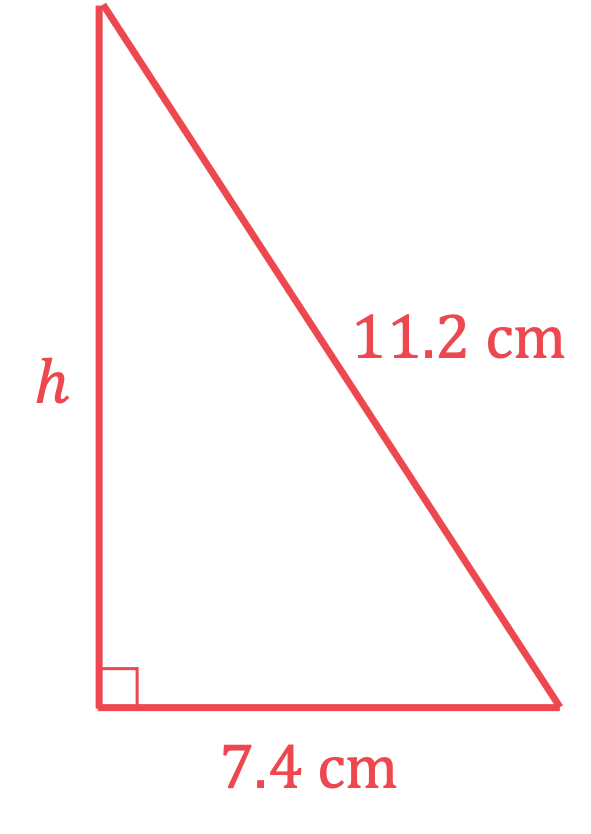

> *Apply Pythagoras' theorem ("*$a^{2}=b^{2}+c^{2}$*", where **a** is the hypotenuse).*

`table row cell 11.2 squared end cell equals cell h squared plus 7.4 squared end cell row cell h squared end cell equals cell 11.2 squared minus 7.4 squared end cell row h equals cell square root of 70.68 end root end cell row h equals cell 8.407 space 139 space... end cell end table`

**First step to finding h ****[1] **
**Complete method for finding h**** [1]**

> *Do not round, use the ANS or memory features of your calculator to store the exact value of **h**. *

> *Now we can find the cross-sectional area using the area of a triangle formula.*

`table row A equals cell 1 half cross times 7.4 cross times 8.4007 space 139 space... end cell end table`

**[1]**

`table row A equals cell 31.106 space 417 space... space cm squared end cell end table`

> *Again, do not round!  Only do so for the final answer. *

> *Calculate the volume of the prism by multiplying the cross-sectional area by the length of the object.*

$V=15\times31.106417...\,V=466.596260...$

**[1]**

> *Round this to three significant figures for the final answer.*

$V=467\mathrm{cm}^{3}$ **[1]**

## Q9 — easy — 1 marks · exam-questions

### 2() — 1 marks
> *The volume of a cylinder with radius *$r$* and height *$h$* is *$πr^{2}h$*.*

`table row V equals cell straight pi cross times 5 squared cross times 8 end cell row blank equals cell 200 straight pi end cell end table`

**The third option, **$200π$**, is therefore correct**** ****[1]**

## Q10 — easy — 2 marks · exam-questions

### 13() — 2 marks
> *Ashraf is assuming that the boxes will fit perfectly into the crate with no space leftover, however the length 50 cm does not go perfectly into 1.2 m, so there would be a gap leftover. *

> *The 1.2 m dimension can only fit 2 boxes, so we would have to consider this as a 1 m space, with the 0.2 m space leftover.*

`table row cell volume space of space crate space end cell equals cell space 2.5 space cross times space 2 space cross times space 1 end cell row blank equals cell space 5 space straight m to the power of 3 space space end exponent end cell row cell volume space of space one space box space end cell equals cell space 0.5 space cross times space 0.5 space cross times space 0.5 space end cell row blank equals cell space 0.125 space straight m cubed space end cell row cell number space of space boxes space end cell equals cell space 5 space divided by space 0.125 space end cell row blank equals cell space 40 end cell end table`

**Ashraf's method does not work as 50 cm does not go into 1.2 m**** [1]**** **

**Ashraf's claim is wrong as only 40 boxes can fit in the crate**** [1]**

## Q11 — easy — 2 marks · exam-questions

### 16((b)) — 2 marks
> *The volume of a cylinder with radius *$r$* and height *$h$* is *$πr^{2}h$*.*

> *Substitute the radius and the volume in to form an equation in terms of *$h.$

`table row V equals cell straight pi cross times r squared cross times h end cell row cell 3.8 space end cell equals cell space straight pi cross times 0.5 squared cross times h end cell row cell 3.8 space end cell equals cell space 0.25 straight pi h end cell end table`

**[1]**

> *Solve the equation to find the value of *$h.$

`table row cell 0.25 straight pi h space end cell equals cell space 3.8 end cell row cell h space end cell equals cell space fraction numerator 3.8 over denominator 0.25 straight pi end fraction end cell row blank equals cell space 4.838310... end cell end table`

> *Round the answer to 3 significant figures.*

** **$h=4.84m$** ****[1]**

## Q12 — easy — 1 marks · exam-questions

### 6((a)) — 1 marks
> *The volume of a prism is the area of the cross section multiplied by the length. *

> *Choose any point from the graph and show that its coordinates multiplied together are equal to 24.*

> *Choose coordinates that are easy to read and work with.*

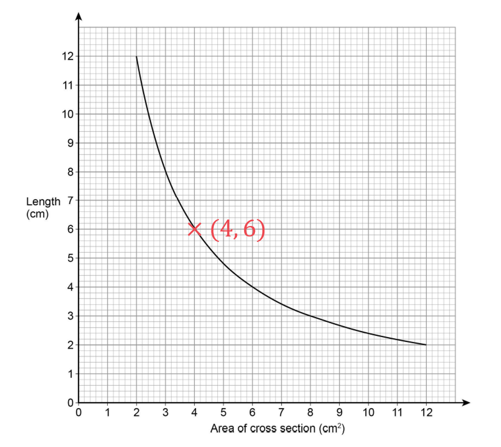

> *For example, choosing the coordinate (4,6) on the graph. *

*Area of cross-section = 4 cm**2 ** *
*Length = 6 cm *
*Volume = 4 × 6 cm**3 *

**Coordinate (4, 6) gives volume = 4 × 6 = 24 cm****3**** ****[1]**

## Q13 — easy — 2 marks · exam-questions

### 22() — 2 marks
> *A cube has 6 identical square faces, so its surface area is 6 × the area of one face. *

> *For a cube of side *$x$* cm, the surface area is *$6x^{2}$* cm.*

$6x^{2}=150$

> *So Steph needs to start by dividing by 6. *

$x^{2}=25$

> *Square root the answer.*

$x=5$

> *Divide the answer by 2 to find the length of the side of the smaller cube.*

$\frac{1}{2}x=2.5$

> *Cube the answer by 2 to find the volume of the smaller cube.*

$2.5^{3}=15.625$

**Steph's order of working is incorrect**** [1]**
**She should divide by 6 first, square root, halve the answer and then cube it**** [1]**

## Q14 — easy — 2 marks · exam-questions

### 18() — 2 marks
> *Calculate the area of the triangular cross-sectional area, using the formula: *$A=\frac{1}{2}bh$*, where *$b$* is the length of the base and *$h$* is the perpendicular height.*

`table row A equals cell 1 half cross times 10 cross times 6 end cell end table`

`table row A equals cell 30 space cm squared end cell end table`

> *Calculate the volume of the prism by multiplying the cross-sectional area by the length of the object.*

$V=30\times11$

**[1] **

$330\mathrm{cm}^{3}$ **[1]**

## Q15 — easy — 3 marks · exam-questions

### 15() — 3 marks
> *A cone is made up of its curved surface area and the flat circular base. *

> *Find the area of the circular base using the formula for the area of a circle, *$A=πr^{2}$*, and the radius 5 cm.*

`table row cell A subscript b a s e space end subscript end cell equals cell space straight pi cross times 5 squared end cell row blank equals cell space 25 straight pi space cm squared end cell end table`

> *Find the curved surface area using the formula given in the question, a slant height of 12 cm and the radius 5 cm.*

`table row cell C S A space end cell equals cell space straight pi cross times 5 cross times 12 end cell row blank equals cell space 60 straight pi space cm squared end cell end table`

**Either area found correctly ****[1]**

> *Add together the curved surface area and the area of the circle to find the total surface area of the cone.*

`table attributes columnalign right center left columnspacing 0px end attributes row cell A subscript t o t a l end subscript end cell equals cell space 25 straight pi space plus space 60 straight pi end cell end table`

**[1]**

`table row cell A subscript t o t a l end subscript space end cell equals cell space 85 straight pi space end cell row blank equals cell space 267.03537... space cm squared end cell end table`

> *Leave as an exact value in terms of π (best) or round to 3 significant figures.*

$85π\mathrm{cm}^{2}(=267\mathrm{cm}^{2})$* ***[1]**

## Q16 — easy — 4 marks · exam-questions

### 2((a)) — 2 marks
> *Formula for area of a circle*$=πr^{2}$*.*

> *Substitute the given radius into the formula. The question asks for the answer as a multiple of **π **so you do not need to multiply by **π.*

*Area = *$π\times70^{2}$

**[1]**

> *Use your calculator to find the value of 70**2**, do not multiply by **π.*

**Area = 4900****π**** cm****2**** [1]**

### 2((b)) — 2 marks
> *Method 1*

> *The tabletop can be modeled as a prism with the area found in part (a) as its cross-section and its thickness will be the height of the prism, *$h$*. *

> *Substitute the volume and the area found in part (a) into the formula for the volume of a prism: *`V equals open parentheses area space cross minus section close parentheses h`*.*

$17150π=4900πh$

**[1]**

> *Divide both sides by 4900π.*

`table row cell h space end cell equals cell space fraction numerator 17150 straight pi over denominator 4900 straight pi end fraction end cell end table`

> *Type into your calculator to find the answer.*

$\mathrm{Thickness}=3.5\mathrm{cm}$* ***[1]**

> *Method 2*

> *The tabletop can be modeled as a cylinder, with radius 70 cm and its thickness will be the height of the cylinder, *$h$*. *

> *Substitute the volume and radius into the formula for the volume of a cylinder: *$V=πr^{2}h$*.*

`17 space 150 straight pi equals straight pi open parentheses 70 close parentheses squared h`

**[1]**

> *Divide both sides by *$π$*. *

`17 space 150 equals open parentheses 70 close parentheses squared h`

> *Use your calculator to find the value of 70**2**.*

$17150=4900h$

> *Divide both sides by 4900.*

`table row cell h space end cell equals cell space 17150 over 4900 end cell end table`

> *Type into your calculator to find the answer.*

$\mathrm{Thickness}=3.5\mathrm{cm}$* ***[1]**

## Q17 — easy — 4 marks · exam-questions

### 9() — 4 marks
> *Calculate the volume of the cylinder using volume of a cylinder = *$πr^{2}h$*.*

`table row cell V subscript c y l i n d e r end subscript end cell equals cell straight pi cross times 4 squared cross times 10 end cell row blank equals cell 160 straight pi end cell end table`

**[1]**

> *Calculate the volume of the hemisphere using volume of a sphere = *$\frac{4}{3}πr^{3}$*.*

`table row cell V subscript h e m i s p h e r e end subscript end cell equals cell 1 half cross times 4 over 3 straight pi cross times 6 cubed end cell end table`

**[1]**

> *Evaluate using your calculator*

`table row blank equals cell 144 straight pi end cell end table`

**[1]**

> *160π is clearly bigger than 144π so*

**The cylinder has the greater volume** **[1]**

## Q18 — medium — 5 marks · exam-questions

### 11() — 5 marks
> *Convert the depth that the gravel will be from centimetres into metres by dividing he length by 100 to make sure that your units are consistent in your working.*

$d=\frac{6}{100}=0.06m$

> *Calculate the volume of the space in the driveway that is to be filled with gravel, using the formula: *$V=l\timesw\timesd$*, where *$l$* is the length of the cuboid *$w$* is the width and *$d$* is the depth.*

`table row V equals cell 11 cross times 4 cross times 0.06 end cell row blank equals cell 2.64 space straight m cubed end cell end table`

**[1]**

> *Work out the number of bags of gravel that will be needed by dividing the volume that needs to be filled with gravel by the volume of gravel in each bag.*

$\frac{2.64}{0.4}=6.6$

**[1]**

*Martin needs 7 bags of gravel*

> *Find the normal cost of the gravel that Martin needs by multiplying the number of bags that he requires by the price of each bag.*

`table row blank blank cell 7 cross times 38 end cell row blank equals cell £ 266 end cell end table`

**[1]**

> *If Martin gets a discount of 30%, then he needs to pay 100% - 30% = 70% of the normal cost.*

> *Calculate 70% of the normal cost by converting the percentage to a decimal and multiplying it by the normal cost.*

`table row blank blank cell 0.7 cross times 266 end cell end table`

**[1]**

`table row blank blank cell bold £ bold 186 bold. bold 20 end cell end table`* ***[1]**

## Q19 — medium — 4 marks · exam-questions

### 9() — 4 marks
> *Calculate the volume of the container, using the formula: *$V=l\timesw\timesh$*, where *$l$* is the length of the cuboid *$w$* is the width and *$h$* is the height.*

`table row V equals cell 50 cross times 40 cross times 30 end cell end table`

**[1]**

`table row V equals cell 5 cross times 4 cross times 3 cross times 1000 end cell row blank equals cell 60 space 000 space cm cubed end cell end table`

> *Find the total number of bottles of oil required to fill the container by dividing the volume of the container by the amount of oil in each bottle.*

$\frac{60000}{3000}$

**[1]**

*Sally needs 20 bottles of oil*

> *Find the cost of filling the container with oil by multiplying the cost per bottle of oil by the number of bottles required.*

`table row blank blank cell 3.5 cross times 20 end cell end table`

**[1]**

`£ 70`

**Sally ****can not fill up the container**** with oil completely because ****it will cost £70**** ****and she only has £60 ****available ****[1]**

## Q20 — medium — 3 marks · exam-questions

### 12() — 3 marks
> *Calculate the volume of orange juice that is in the carton, using the formula for the volume of a cuboid: *$V=l\timesw\timesd$* where *$l$* is the length of the cuboid *$w$* is the width and *$d$* is the depth.*

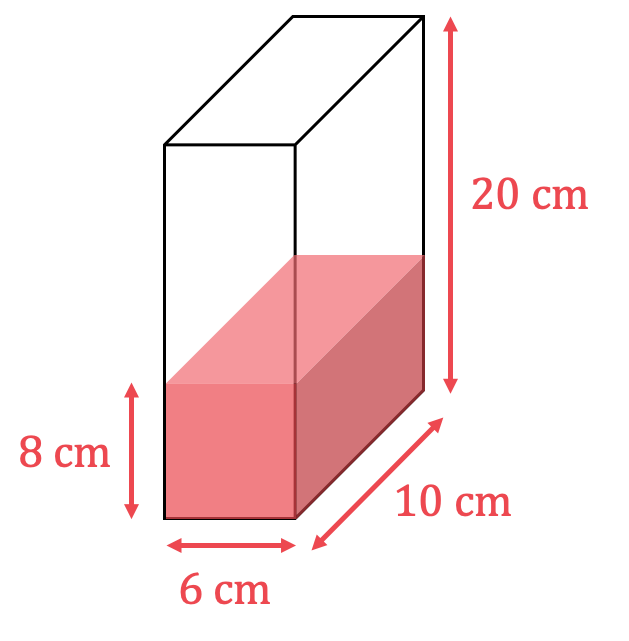

`table row V equals cell 10 cross times 6 cross times 8 end cell end table`

**[1]**

`table row V equals cell 480 space cm cubed end cell end table`

> *Sketch a diagram with the container turned over onto its shaded face.*

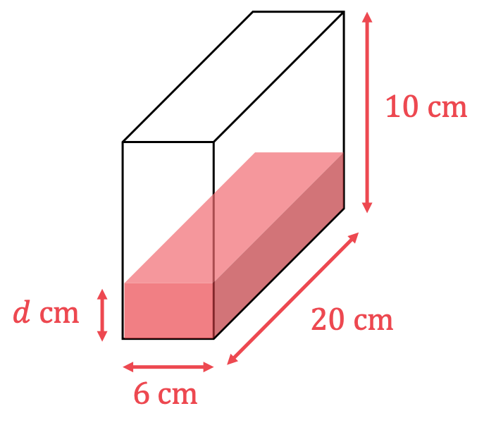

> *Substitute the volume of the juice and the known lengths into the formula for the volume of a cuboid and solve to find the new depth of the juice.*

`table row 480 equals cell 20 cross times 6 cross times d end cell row 480 equals cell 120 d end cell row cell 480 over 120 end cell equals d end table`

**[1]**

$4\mathrm{cm}$* ***[1]**

## Q21 — medium — 3 marks · exam-questions

### 9() — 3 marks
> *Split the cross-sectional area into two rectangles, calculate the individual areas and add together to find the total area of the cross-section.*

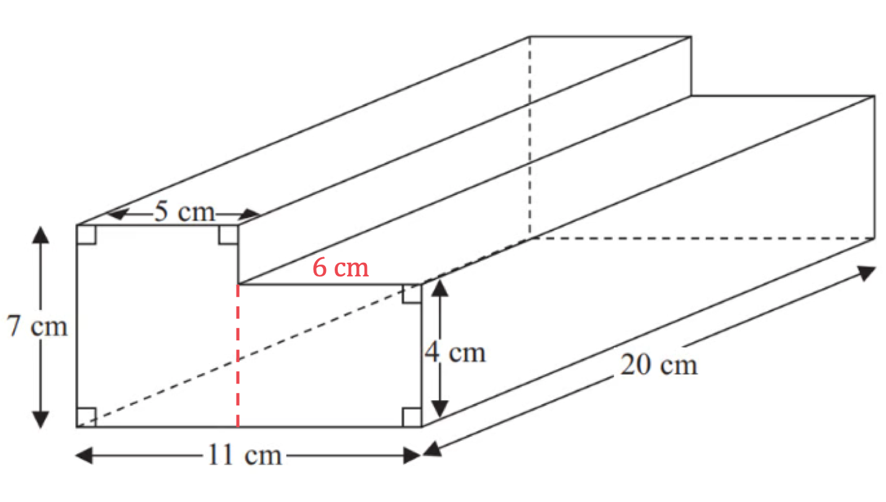

$A=5\times7+6\times4$

**[1]**

$A=59\mathrm{cm}^{2}$

> *Multiply the area of the cross-section by the length to work out the volume of the prism.*

$V=59\times20$

**[1]**

$1180\mathrm{cm}^{3}$** [1]**

## Q22 — medium — 4 marks · exam-questions

### 1() — 4 marks
Calculate the volume of the cylinder using $πr^{2}h$

$π\times4^{2}\times11=176π\mathrm{cm}^{3}$

Calculate the volume of the liquid using $πr^{2}h$

$π\times4^{2}\timest=16πt\mathrm{cm}^{3}$

Calculate the volume of the hemisphere using $\frac{1}{2}\times\frac{4}{3}πr^{3}$

$\frac{1}{2}\times\frac{4}{3}\timesπ\times4^{3}=\frac{128}{3}π\mathrm{cm}^{3}$

**[M1]**

Calculate the total volume of the container

$176π+\frac{128}{3}π=\frac{656}{3}π\mathrm{cm}^{3}$

**[M1]**

Equate a quarter of the volume of the container to the formula for the volume of water

$16πt=\frac{1}{4}\times\frac{656}{3}π\,16πt=\frac{164}{3}π$

**[M1]**

Find t

`table row cell 16 t end cell equals cell 164 over 3 end cell row t equals cell 41 over 12 end cell row blank equals cell 3.41666... end cell end table`

**Final answer:** **t= 3.42cm**

**[A1]**

> **[mark-scheme]**
> **M1: **For finding the volume of at least one of
> 
> - the cylinder
> - the hemisphere
> - the liquid.
> 
> **M1: **For adding the volume of the cylinder and the hemisphere together to get a total volume.
> 
> **M1: **For forming a complete process to find $t$.
> 
> **A1: **Correct exact answer or answer which rounds to 3.42.

## Q23 — medium — 3 marks · exam-questions

### 24() — 3 marks
> *Calculate the volume of the tin of pet food, using the formula for the volume of a cylinder: *$V=πr^{2}h$*, where *$r$* is the radius and *$h$* is the height.*

> * It is a good idea to leave the answer in terms of *$π$* so that you won't have any rounding errors.*

$V=π\times6.5^{2}\times11.5$

**[1]**

$V=485.875π\mathrm{cm}^{3}$

> *Substitute the calculated volume and the known dimensions of the new tin into the formula for the volume of a cylinder to calculate the height of the new tin.*

$485.875π=π\times5.8^{2}\timesh$

> *Divide both sides by *$π$*.*

$485.875=5.8^{2}\timesh$

> *Divide both sides by 5.8**2**.*

$14.443370...=h$

**[1]**

> *Round to 1 decimal place.*

$14.4\mathrm{cm}$* ***[1]**

## Q24 — medium — 3 marks · exam-questions

### 25() — 3 marks
> *Work out the perpendicular height of the cone by subtracting the radius of the hemisphere from the total height of the object.*

`table row h equals cell 14 minus 4 end cell row blank equals cell 10 space cm end cell end table`

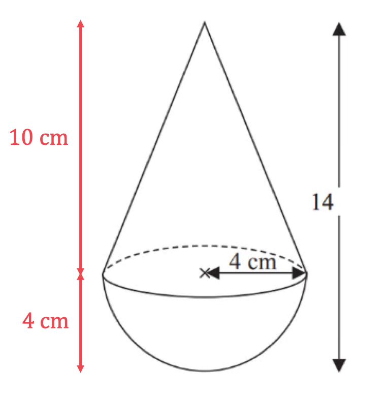

> *Calculate the volume of the sphere, using the formula: *$V=\frac{4}{3}πr^{3}$*, where *$r$* is the radius, and divide the result by 2 to calculate the volume of the hemisphere.*

> *It is a good idea to keep your answer in terms of *$π$* to avoid rounding errors.*

$V_{Hemisphere}=\frac{1}{2}\times\frac{4}{3}π\times4^{3}$

**[1]**

$V_{Hemisphere}=\frac{128}{3}π$

> *Calculate the volume of the cone, using the formula: *$V=\frac{1}{3}πr^{2}h$*, where *$r$* is the radius and *$h$* is the perpendicular height.*

$V_{Cone}=\frac{1}{3}\timesπ\times4^{2}\times10$

**[1]**

$V_{Cone}=\frac{160}{3}π$

> *Find the total volume of the solid by adding together the volume of the hemisphere and the volume of the cone.*

$V_{Solid}=\frac{128}{3}π+\frac{160}{3}π$

`table row cell V subscript S o l i d end subscript end cell equals cell 96 straight pi end cell row blank equals cell 301.59289... end cell end table`

> *Round to 3 significant figures.*

$302\mathrm{cm}^{3}$* ***[1]**

**Answers between the values of 301 to 302 will be accepted. Answer of **$96π$** and **$\frac{288}{3}π$** will also be accepted.**

## Q25 — medium — 3 marks · exam-questions

### 5() — 3 marks
> *Calculate the volume of the cheese, using the formula: *$V=l\timesw\timesh$*, where *$l$* is the length of the cuboid, *$w$*is the width and *$h$* is the height.*

`table row V equals cell 15 cross times 10 cross times 2 end cell end table`

**[1]**

`table row V equals cell 300 space cm cubed end cell end table`

> *Substitute the resultant volume and the known dimensions of the new cheese into the formula for the volume of a cuboid and solve to find the length of the new cheese.*

$300=x\times5\times5$

> *Simplify.*

$300=25x$

> *Divide both sides by 25.*

$\frac{300}{25}=x$

**[1]**

$12\mathrm{cm}$* ***[1]**

## Q26 — medium — 4 marks · exam-questions

### 21() — 4 marks
> *Find the radius, *$r$*, of the sphere by halving the diameter.*

$r=\frac{40}{2}=20\mathrm{cm}$

> *If there are twelve hemispherical hanging baskets, the volume of these would be equivalent to six spheres of the same radius. Calculate the volume of six spheres of radius 20 cm, using the formula: *$V=\frac{4}{3}πr^{3}$*.*

`table row V equals cell 6 cross times 4 over 3 cross times straight pi cross times 20 cubed end cell end table`

**[1]**

`table row V equals cell 64 space 000 space straight pi space end cell row blank equals cell 201061.929... space cm cubed end cell end table`

> *Convert the amount of compost in one bag from litres to cm**3**.*

*1 litre = 1 000 cm**3*

*50 litres = 50 000 cm**3*

**[1]**

> *Work out the total amount of compost that Anne has in cm**3**.*

$4\times50000=200000\mathrm{cm}^{3}$

**[1]**

**No, Anne does not have enough compost as she needs 201 062 cm****3**** but only has 200 000 cm****3**** ****[1]**

## Q27 — medium — 3 marks · exam-questions

### 23() — 3 marks
> *The total surface area of the hemisphere comprises the curved surface area of half of a sphere and the circle bottom face.*

> *Calculate the curved surface area, using the formula *$A=4πr^{2}$*, where *$r$* is the radius, and dividing the result by 2.*

`table row A equals cell 1 half cross times 4 cross times straight pi cross times 5 squared end cell end table`

**[1]**

`table row A equals cell 2 cross times straight pi cross times 25 end cell row blank equals cell 50 straight pi space cm squared end cell end table`

> *Calculate the area of the bottom circular face, using the formula: *$A=πr^{2}$*.*

`table row A equals cell straight pi cross times 5 squared end cell end table`

**[1]**

`table row A equals cell 25 straight pi space cm squared end cell end table`

> *Add the two areas together to find the total surface area of the hemisphere.*

$A_{Total}=50π+25π$

$75π\mathrm{cm}^{2}$* ***[1]**

**Final answer:** **If the value of 3.14 has been used in place of **$π$**, a final answer of 235.5 will be accepted**

## Q28 — medium — 5 marks · exam-questions

### 20() — 5 marks
> *The formula for the surface area of a sphere is *$4πr^{2}$

> *Divide this by 2 and set it equal to 32*$π$

$\frac{4πr^{2}}{2}=32π$

**[1]**

> *Solve to find the radius*

`table row cell 2 up diagonal strike pi r squared end cell equals cell 32 up diagonal strike pi end cell row cell 2 r squared end cell equals 32 row cell r squared end cell equals 16 row r equals 4 end table`

**[1]**

> *Use *$2πrh$* to find the curved surface area of the cylinder*

$2π\times4\times10=80π$

**[1]**

> *Use *$πr^{2}$* to find the area of the circle at the bottom*

$π\times4^{2}=16π$

> *Add the areas together*

$32π+80π+16π=128π$

**[1]**

**128**$π$** cm****2**** [1]**

## Q29 — medium — 5 marks · exam-questions

### 5() — 5 marks
> *Calculate the amount of sand that Sally will need by calculating the volume of the sand pit, using the formula: *$V=l\timesw\timesh$*, where *$l$* is the length, *$w$* is the width and *$h$* is the height.*

`table row V equals cell 100 cross times 60 cross times 40 end cell row blank equals cell 240 space 000 space cm cubed end cell end table`

**[1]**

> *Convert the amount of sand in one bag from litres to cm**3** by multiplying the numbers of litres in each bag by 1000.*

*1 litre = 1 000 cm**3 **8 litres = 8 000 cm**3*

**[1]**

> *Work out the number of bags required to fill the sand pit by dividing the volume of the sand pit by the volume of sand in each bag.*

$\frac{240000}{8000}$

**[1]**

*30 bags of sand are required*

> *Multiply the cost of each bag of sand by the number of bags required to work out the total cost of filling up the sand pit.*

`table row blank blank cell 2.5 cross times 30 end cell end table`

**[1]**

`table row blank equals cell 2.5 cross times 3 cross times 10 end cell row blank equals cell 7.5 cross times 10 end cell row blank equals cell £ 75 end cell end table`

**Sally is wrong, it will cost £75 for the sand, which is more than £70**** ****[1]**

## Q30 — medium — 4 marks · exam-questions

### 15() — 4 marks
> *Find the radius*

$r=6\div2=3$

> *Find the volume of the cone*

$\frac{1}{3}π\times3^{2}\times10=30π$

> *Find the volume of the hemisphere*

$\frac{1}{2}\times\frac{4}{3}π\times3^{3}=18π$

**correct method to find at least one volume [1]**

**at least one volume correct [1]**

> *Add together*

$30π+18π=48π$

**[1]**

$k=48$ **[1]**

## Q31 — medium — 4 marks · exam-questions

### 4() — 4 marks
> *Find the total volume of the container*

$30\times6\times19=3420$

**[1]**

> *Multiply this by *$\frac{2}{3}$

$\frac{2}{3}\times3420=2280$

**[1]**

> *Divide by 275*

$2280\div275=8.29...$

**[1]**

> *This means 8 cups can be filled completely*

**8 cups** **[1]**

## Q32 — medium — 5 marks · exam-questions

### 6() — 5 marks
> *Find the area of the circle*

$π\times0.8^{2}=0.64π$

**[1]**

> *Find the curved surface area using *$2πrh$

$2π\times0.8\times1.8=2.88π$

**[1]**

> *Find the total surface area*

$2\times0.64π+2.88π=4.16π$

> *Multiply this by 3*

$3\times4.16π=12.48π=39.20...$

**[1]**

> *Find the area that 7 tins can paint*

$7\times5=35$

**[1]**

> *Explain your answer*

**Final answer:** **Jeremy does not have enough paint**

**He needs to cover 39.2 cm****2**** but has only got enough for 35 cm****2** **[1]**

## Q33 — medium — 3 marks · exam-questions

### 7() — 3 marks
*Let **M** be the midpoint of **BC**, so that **ABM** forms a right-angled triangle.*

> *Use Pythagoras' theorem, *$a^{2}+b^{2}=c^{2}$* to find the perpendicular height of the front face.*

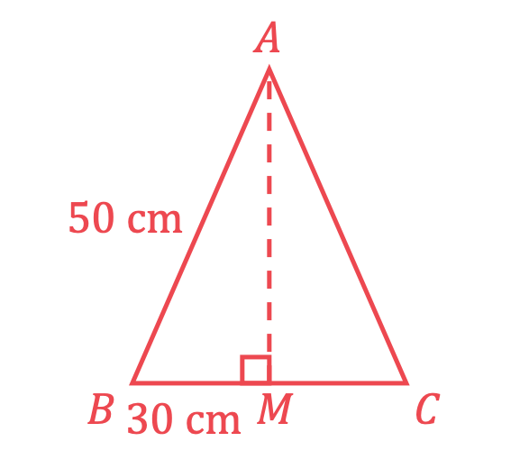

`table row cell A M squared plus 30 squared end cell equals cell 50 squared end cell row cell A M squared end cell equals cell 50 squared minus 30 squared end cell row cell A M squared end cell equals cell 2500 minus 900 end cell row cell A M squared end cell equals 1600 row cell A M end cell equals cell 40 space cm end cell end table`

> *Calculate the area of the front triangular face, using the formula: *$A=\frac{1}{2}bh$*.*

`table row A equals cell 1 half cross times 60 cross times 40 end cell row blank equals cell 1200 space cm squared end cell end table`

> *Calculate the area of the rectangular face **ARPC**.*

`table row A equals cell 50 cross times 80 end cell row blank equals cell 4000 space cm squared end cell end table`

**Correct method to calculate at least two different faces**** [1]**

> *Calculate the area of the rectangular base **BCPQ**.*

`table row A equals cell 60 cross times 80 end cell row blank equals cell 4800 space cm squared end cell end table`

> *Find the total surface area by adding together the base, two of the rectangular side faces and two of the triangular faces.*

`table row cell A subscript t o t a l end subscript end cell equals cell 4800 space plus space 2 cross times 4000 plus 2 cross times 1200 end cell row blank equals cell 4800 plus 8000 plus 2400 end cell end table`

**Adding at least four correct areas**** [1]**

$15200\mathrm{cm}^{2}$* ***[1]**

## Q34 — hard — 5 marks · exam-questions

### 1() — 5 marks
Write an expression for the volume of the cone

- Let *h* be the height and 3*h* be the radius

`1 third straight pi open parentheses 3 h close parentheses squared h equals 128.625 straight pi`

**[M1]**

Expand the bracket and divide both sides by π

$3h^{3}=128.625$

**[M1]**

Rearrange to find h

`table row cell 3 h cubed end cell equals cell 128.625 end cell row cell h cubed end cell equals cell 42.875 end cell row h equals cell 3.5 space cm end cell end table`

**[M1]**

Find the curved surface area of the cone

- Use the formula $πrl$
- Use $l=\sqrt{r^{2}+h^{2}}$

$h=3.5\,r=3\times3.5=10.5$

$π\times10.5\times\sqrt{10.5^{2}+3.5^{2}}=365.096...$

**[M1]**

Round to 3 significant figures

**Final answer:** **365 cm****2**

**[A1]**

## Q35 — hard — 3 marks · exam-questions

### 25() — 3 marks
> *If the cylinder is melted down and reformed into a sphere, then the cylinder and sphere will have the same volume.*

> *Calculate the volume of the cylinder, using the formula: *$V=πr^{2}h$*, where *$r$* is the radius of the cylinder and *$h$*is its height.  *

> *Leave your answer in terms of *$π$*.*

`V equals straight pi cross times open parentheses 2 x close parentheses squared cross times 9 x`

**[1]**

`table row V equals cell straight pi cross times 4 x squared cross times 9 x end cell row blank equals cell 36 straight pi x cubed space cm cubed end cell end table`

> *Using the formula for the volume of a sphere: *$V=\frac{4}{3}πr^{3}$*, where *$r$* is the radius of the sphere, substitute the calculated value for the volume and rearrange to find an expression for the radius of the sphere.*

$36πx^{3}=\frac{4}{3}π\timesr^{3}\,$

**[1]**

> *Divide both sides by *$π$*.*

$36x^{3}=\frac{4}{3}r^{3}$

> *Divide both sides by 4.*

$9x^{3}=\frac{1}{3}r^{3}$

> *Multiply both sides by 3.*

$27x^{3}=r^{3}$

> *Take the cube root of both sides.*

$3x=r$

$3x$* ***[1]**

**Final answer:** **Any algebraic expression equivalent to **$3x$** will be accepted**

## Q36 — hard — 4 marks · exam-questions

### 22() — 4 marks
> *Find the radius of the large cone, given that the radius is half of the diameter.*

`table row r equals cell 30 over 2 end cell row blank equals cell 15 space cm end cell end table`

**[1]**

> *Calculate the volume of the large cone, using the formula: *$V=\frac{1}{3}πr^{2}h$*, where *$r$* is the radius of the cone and *$h$* is the perpendicular height.*

`table row cell V subscript L end cell equals cell 1 third cross times straight pi cross times 15 squared cross times 40 end cell end table`

**[1]**

`table row cell V subscript L end cell equals cell 3000 straight pi space cm cubed end cell end table`

> *The large and small cones are similar objects.*

> *Work out the length scale factor (LSF) by dividing the height of the large cone by the height of the small cone.*

$\mathrm{LSF}=\frac{40}{20}=2$

> *Divide the radius of the large cone by the LSF to work out the radius of the small cone.*

`table row r equals cell 15 over 2 end cell row blank equals cell 7.5 space cm end cell end table`

> *Calculate the volume of the small cone.*

$V_{S}=\frac{1}{3}\timesπ\times7.5^{2}\times20$

$V_{S}=375π\mathrm{cm}^{3}$

> *Work out the volume of the frustum by subtracting the volume of the small cone from the volume of the large cone.*

`table row V equals cell 3000 straight pi minus 375 straight pi end cell end table`

**[1]**

`table row V equals cell 2625 straight pi end cell row blank equals cell 8246.68071... space cm cubed end cell end table`

> *Round to 3 significant figures.*

$8250\mathrm{cm}^{3}$* ***[1]**

## Q37 — hard — 4 marks · exam-questions

### 22() — 4 marks
*Split the cross-section up into three rectangles by drawing in two horizontal lines. *

> *Work out the height of the bottom rectangle by subtracting the height of the top rectangle from the total height of the object.*

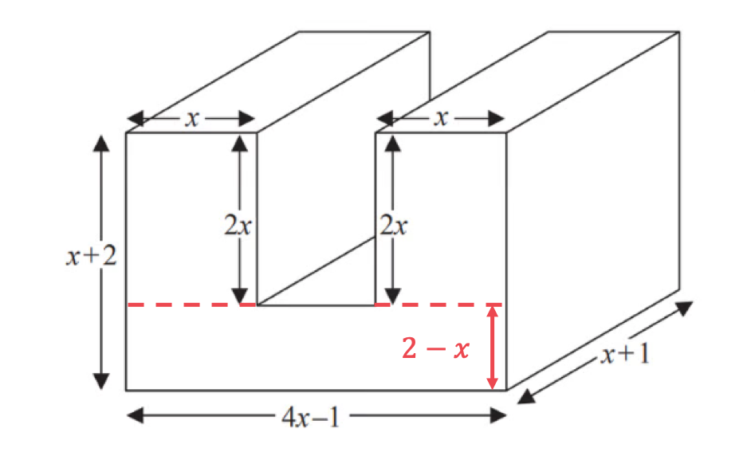

`table attributes columnalign right center left columnspacing 0px end attributes row blank blank cell open parentheses x plus 2 close parentheses minus 2 x end cell row blank equals cell x plus 2 minus 2 x end cell row blank equals cell 2 minus x end cell end table`

**[1]**

> *Find the area of each of the three triangles in terms of *$x$* and add together to find an expression for the total area of the cross-section.*

`A equals open parentheses x cross times 2 x close parentheses plus open parentheses x cross times 2 x close parentheses plus open parentheses 4 x minus 1 close parentheses open parentheses 2 minus x close parentheses`

**Correct expression for one area from the cross-section ****[1]**

> *Expand the brackets.*

$A=2x^{2}+2x^{2}+8x-4x^{2}-2+x$

> *Simplify by collecting like terms.*

$A=9x-2$

> *Find an expression for the volume of the prism by multiplying the area of the cross-section by the length of the prism.*

`V equals open parentheses 9 x minus 2 close parentheses open parentheses x plus 1 close parentheses`

**[1]**

> *Expand the brackets.*

$V=9x^{2}+9x-2x-2$

> *Simplify by collecting like terms.*

$V=9x^{2}+7x-2$* ***[1]**

## Q38 — hard — 5 marks · exam-questions

### 19() — 5 marks
> *Multiply the volume of the quarter sphere by 4 to find the volume of a whole sphere in terms of *$π$*.*

`table row blank blank cell 4 cross times 576 straight pi end cell row blank equals cell 2304 straight pi space cm cubed end cell end table`

**[1]**

> *Substitute the volume into the formula for the volume of a sphere: *$V=\frac{4}{3}πr^{3}$*.*

$2304π=\frac{4}{3}πr^{3}$

> *Divide both sides by *$\frac{4}{3}π$*. *

$1728=r^{3}$

> *Find the cube root of both sides.*

$r=12\mathrm{cm}$

**[1]**

> *Substitute the radius of the sphere into the formula for the surface area of a sphere: *$A=4πr^{2}$*.*

`table row cell A subscript s p h e r e end subscript end cell equals cell 4 cross times straight pi cross times 12 squared end cell row blank equals cell 576 straight pi space cm squared end cell end table`

> *Divide by 4 to find the curved surface area of the quarter sphere.*

$A_{quartersphere}=144π\mathrm{cm}^{2}$

**[1]**

> *The two flat faces are semi-circles so are equivalent to the area of one circle with the same radius. *

> *Calculate the area of the circle using the formula: *$A=πr^{2}$*.*

`table row cell A subscript c i r c l e end subscript end cell equals cell straight pi cross times 12 squared end cell row blank equals cell 144 straight pi space cm squared end cell end table`

> *Add together the curved surface area of the quarter circle and the area of the circle to find the total surface area of the quarter sphere.*

`table row cell A subscript t o t a l end subscript end cell equals cell 144 straight pi plus 144 straight pi end cell end table`

**[1]**

`table row cell A subscript t o t a l end subscript end cell equals cell 288 straight pi space end cell row blank equals cell 904.778684... space cm squared end cell end table`

> *Round to 3 significant figures.*

$905\mathrm{cm}^{2}$* ***[1]**

**Final answer:** **Answers in the range 904.7 - 905 will be accepted**

## Q39 — hard — 5 marks · exam-questions

### 16() — 5 marks
> *Let **O** be the centre of the base directly below the vertex **V** of the pyramid and II be the midpoint of **AB**. *
*Look at the right-angled triangle **AMO**, use Pythagoras' theorem, *$a^{2}+b^{2}=c^{2}$*, to calculate the length **AO**.*

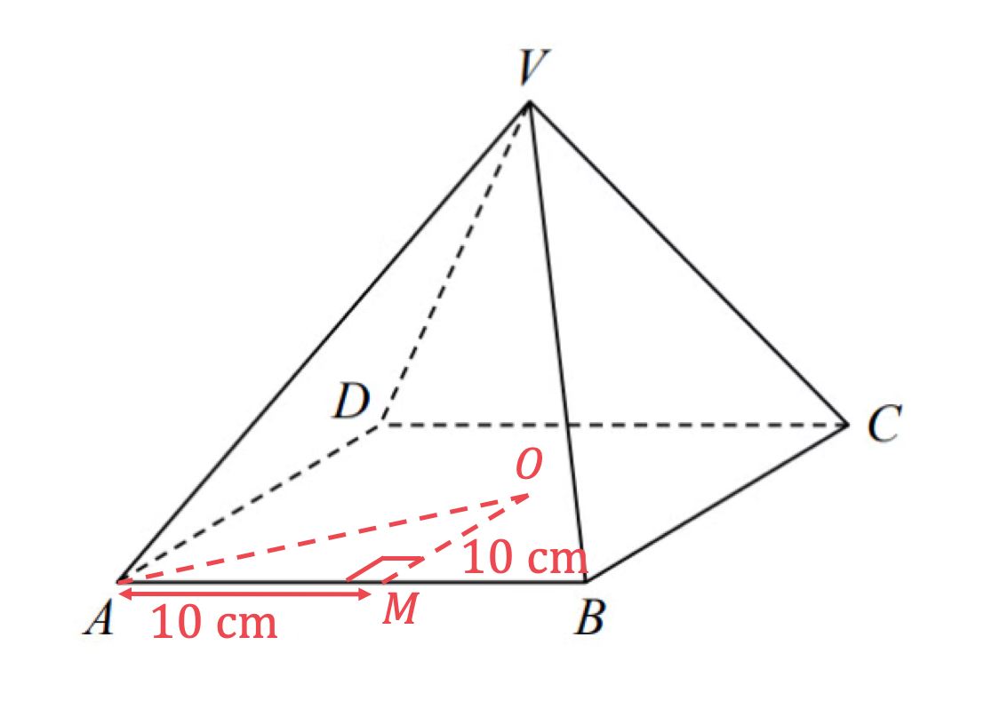

`table row cell A O squared end cell equals cell 10 squared plus 10 squared end cell row cell A O squared end cell equals 200 row cell A O end cell equals cell 10 square root of 2 end cell end table`

**[1]**

> *Use SOHCAHTOA on the right-angled triangle **AOB **to calculate the perpendicular height. *

> *You have the length **AO **(adjacent) and you want to know the height (opposite) so use: *$\mathrm{tan}θ=\frac{Opp}{Adj}$*.*

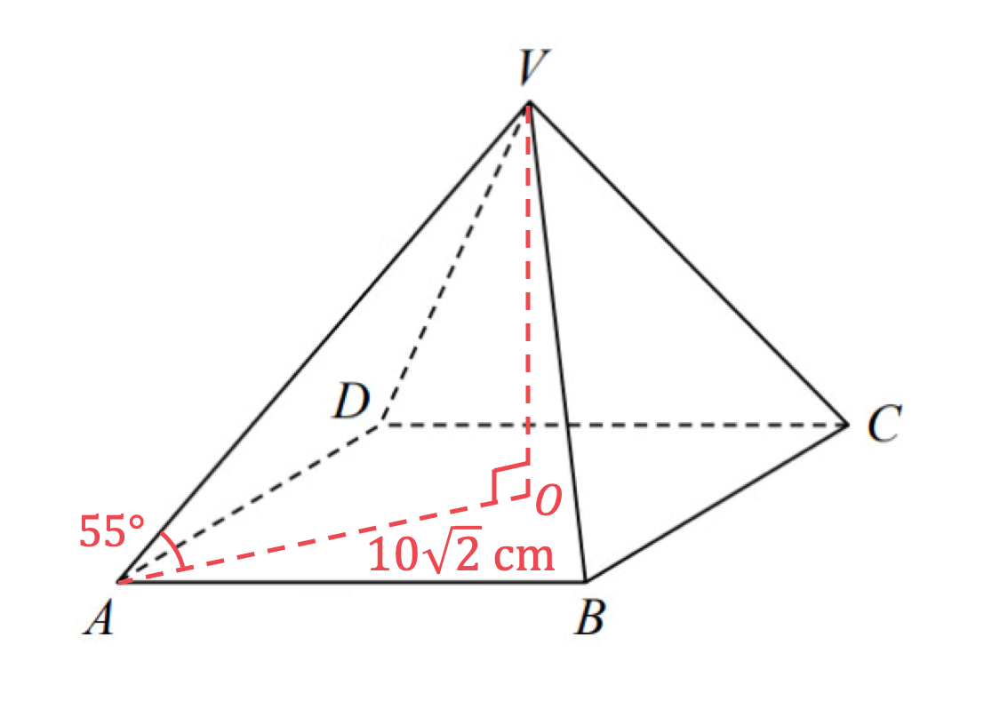

> * *`table row cell tan 55 end cell equals cell fraction numerator V O over denominator 10 square root of 2 end fraction end cell row cell 10 square root of 2 cross times tan 55 end cell equals cell V O end cell end table`

**[1]**

`table row cell V O end cell equals cell 20.19706... space cm end cell end table`

> *Work out the perpendicular height of one of the triangular faces by using Pythagoras' theorem on the right-angled triangle **VOM**.*

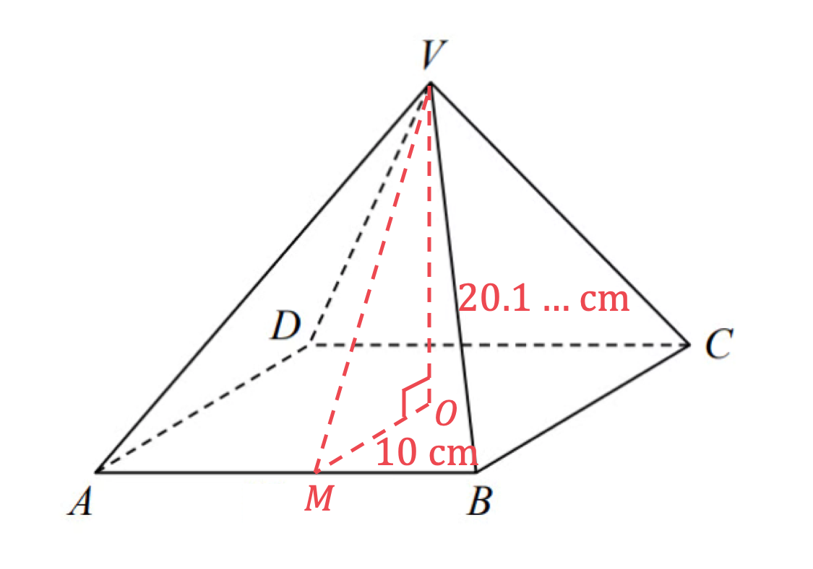

`table row cell 10 squared plus open parentheses 20.1... close parentheses squared end cell equals cell V M squared end cell row cell 507.921345... end cell equals cell V M squared end cell row cell V M end cell equals cell 22.537110... space cm end cell end table`

**[1]**

*Calculate the area of one of the triangular faces, using the formula*: $A=\frac{1}{2}bh$*, where *$b$* is the base of the triangle and *$h$* is the perpendicular height.*

`table row cell A subscript t r i a n g l e end subscript end cell equals cell 1 half cross times 20 cross times 22.5... end cell end table`

**[1]**

`table row cell A subscript t r i a n g l e end subscript end cell equals cell 225.371104... space cm to the power of 2 space end exponent end cell end table`

> *Calculate the total surface area by adding together the area of the square base and four of the triangular faces.*

`table row cell A subscript t o t a l end subscript end cell equals cell 20 cross times 20 plus 4 cross times 225.371104... end cell row blank equals cell 1301.48441... space cm squared end cell end table`

> *Round to 2 significant figures.*

$1300\mathrm{cm}^{2}$* ***[1]**

**Answers between 1300 and 1302 will be accepted**

## Q40 — hard — 4 marks · exam-questions

### 18() — 4 marks
> *Multiply the given value for the volume of the hemisphere by 2 to give the volume of a sphere with the same radius.*

`table row blank blank cell 250 over 3 straight pi cross times 2 end cell row blank equals cell 500 over 3 straight pi space cm cubed end cell end table`

> *Substitute the volume of the sphere into the formula: *$V=\frac{4}{3}πr^{3}$*.*

$\frac{500}{3}π=\frac{4}{3}π\timesr^{3}$

**[1]**

> *Divide both sides by *$π$*.*

$\frac{500}{3}=\frac{4}{3}\timesr^{3}$

> *Multiply both sides by 3.*

$500=4\timesr^{3}$

> *Divide both sides by 4.*

$125=r^{3}$

> *Take the cube root of both sides.*

$r=5\mathrm{cm}$

> *The surface area of the hemisphere is made up of the curved surface of half a sphere and the area of a circle with the same radius.*

> *Calculate the area of the curved surface of half a sphere by substituting the radius into the formula: *$A=4πr^{2}$* and multiplying the result by *$\frac{1}{2}$*.*

$A_{curved}=\frac{1}{2}\times4\timesπ\times5^{2}$

**[1]**

$A_{curved}=50π\mathrm{cm}^{2}$

> *Calculate the area of the flat circular face, using the formula: *$A=πr^{2}$*.*

`table row cell A subscript c i r c l e end subscript end cell equals cell straight pi cross times 5 squared end cell row blank equals cell 25 straight pi space cm squared end cell end table`

> *Add the curved and flat areas together to find the total surface area of the hemisphere.*

`table row cell A subscript t o t a l end subscript end cell equals cell 50 straight pi plus 25 straight pi end cell end table`

**[1]**

`table row blank blank cell bold 75 bold pi bold space bold cm to the power of bold 2 end cell end table`** [1]**

## Q41 — hard — 4 marks · exam-questions

### 12() — 4 marks
> *Use Pythagoras' theorem, *$a^{2}+b^{2}=c^{2}$*, on the right-angled triangle **ABF** to find the length **BF**.*

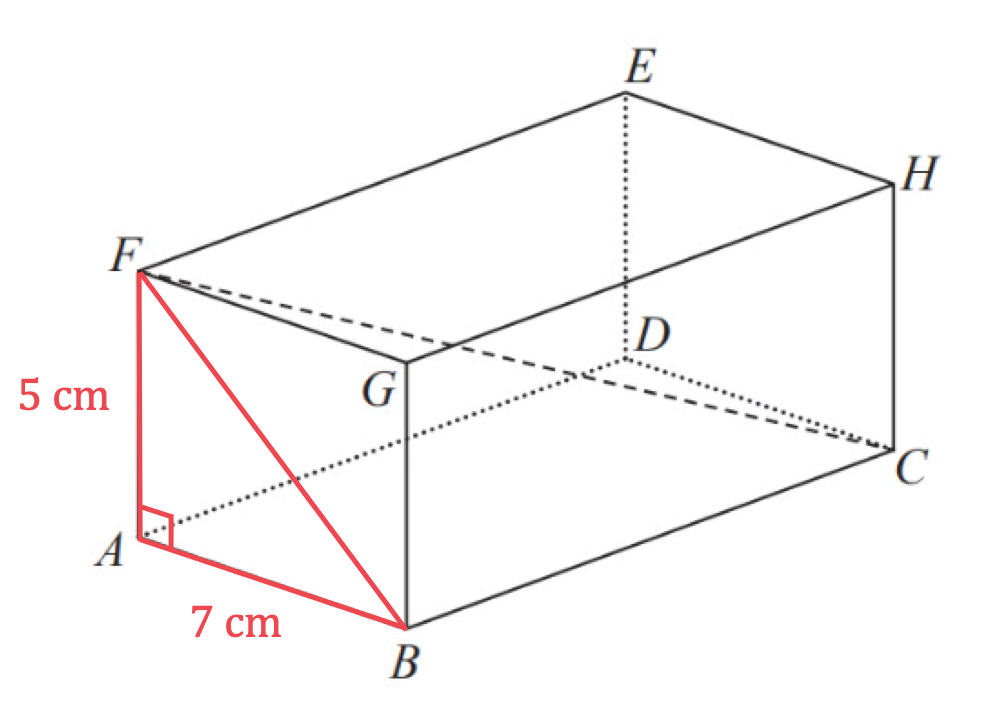

`table attributes columnalign right center left columnspacing 0px end attributes row cell 5 squared plus 7 squared end cell equals cell B F squared end cell end table`

**[1]**

`table row 74 equals cell B F squared end cell row cell B F end cell equals cell square root of 74 space cm end cell end table`

> *Use Pythagoras' theorem on the right-angled triangle **BCF** to find the length **BC**.*

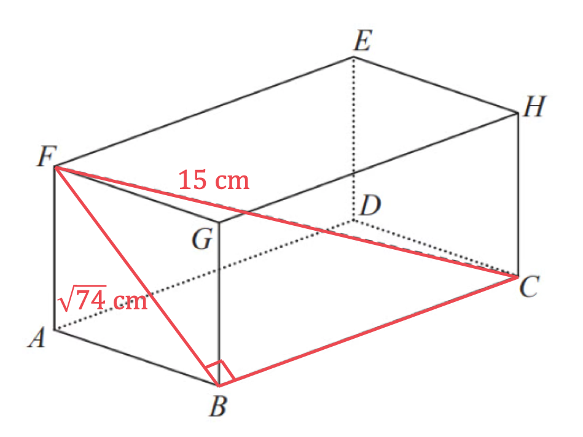

`table row cell open parentheses square root of 74 close parentheses squared plus B C squared end cell equals cell 15 squared end cell row cell 74 plus B C squared end cell equals 225 row cell B C squared end cell equals 151 row cell B C end cell equals cell square root of 151 space cm end cell end table`

**[1]**

> *Calculate the volume of the cuboid, using the formula: *$V=l\timesw\timesh$*, where *$l$* is the length, *$w$* is the width and *$h$* is the height of the cuboid.*

`table row V equals cell square root of 151 cross times 7 cross times 5 end cell end table`

**[1]**

`table row V equals cell 430.087200... end cell end table`

$430\mathrm{cm}^{3}$** ****[1]**

**Answers between 430 and 430.1 will be accepted**

## Q42 — hard — 5 marks · exam-questions

### 19() — 5 marks
> *Substitute the value given for the volume of the cone into the formula for the volume of a cone: *$V=\frac{1}{3}πr^{2}h$*, where *$r$* is the radius of the cone and *$h$* is the perpendicular height.*

$270π=\frac{1}{3}\timesπ\timesr^{2}\times10$

**[1]**

> *Solve to find the radius.*

`table row cell 270 straight pi end cell equals cell 10 over 3 straight pi r squared end cell row 270 equals cell 10 over 3 r squared end cell row 27 equals cell 1 third r squared end cell row 81 equals cell r squared end cell row r equals cell 9 space cm end cell end table`

**[1]**

> *Calculate the volume of the volume of the hemisphere by substituting the value for the radius into the formula for the volume of a sphere and multiplying the result by *$\frac{1}{2}$*.*

`table row V equals cell 1 half cross times 4 over 3 cross times straight pi cross times 9 cubed end cell end table`

**[1]**

`table row V equals cell 2 over 3 cross times straight pi cross times 729 end cell row blank equals cell 2 cross times straight pi cross times 243 end cell row blank equals cell 486 straight pi space cm cubed end cell end table`

> *Add the volume of the hemisphere to the volume of the cone to find the total volume of the shape.*

$V_{total}=270π+486π$

**[1]**

$756π\mathrm{cm}^{3}$* ***[1]**

## Q43 — hard — 6 marks · exam-questions

### 8((a)) — 5 marks
> *Calculate the area of the cross-section of the tank, using the formula for the area of a trapezium: *`A equals 1 half open parentheses a plus b close parentheses h`*, where *$a$* and *$b$* are the lengths of the parallel sides and *$h$* is the perpendicular height.*

`table row A equals cell 1 half cross times open parentheses 3 plus 1.4 close parentheses cross times 2.4 end cell end table`

**[1]**

`table row A equals cell 5.28 space straight m squared end cell end table`

> *Calculate the volume of the tank by multiplying the cross-sectional area by the length of the tank.*

`table row V equals cell 5.28 cross times 2.5 end cell row blank equals cell 13.2 space straight m cubed end cell end table`

**[1]**

> *Divide the given percentage by 100 and multiply it by the volume to calculate the volume of oil required to fill the tank up to 85% capacity.*

`table row cell V subscript 85 percent sign end subscript end cell equals cell 85 over 100 cross times 13.2 end cell row blank equals cell 11.22 space straight m cubed end cell end table`

**[1]**

> *Convert the volume of oil required in m**3** to litres by multiplying the volume in m**3** by 1000.*

*1000 litres = 1 m**3*

`table row cell V subscript 85 percent sign end subscript end cell equals cell 11.22 cross times 1000 end cell row blank equals cell 11220 space litres end cell end table`

> *Work out the volume of oil required to fill the tank up to 85% after the initial 300 litres by subtracting 300 from the 85% volume.*

`table attributes columnalign right center left columnspacing 0px end attributes row cell V subscript r e m a i n i n g end subscript end cell equals cell 11220 minus 300 end cell row blank equals 10920 end table`

> *Calculate the time taken, in minutes, for the remaining oil to flow into the tank by dividing the volume by 300.*

$\frac{10920}{300}$

**[1]**

$36.4\mathrm{minutes}$ **[1]**

### 8((b)) — 1 marks
**Final answer:** **If the average rate of flow was ****faster****, it would take ****less tim****e and if the average rate of flow was ****slower****, it would take ****more time****.**

**[1]**

## Q44 — hard — 6 marks · exam-questions

### 13((a)) — 5 marks
> *Split the cross-section of the swimming pool into a rectangle and a triangle.*

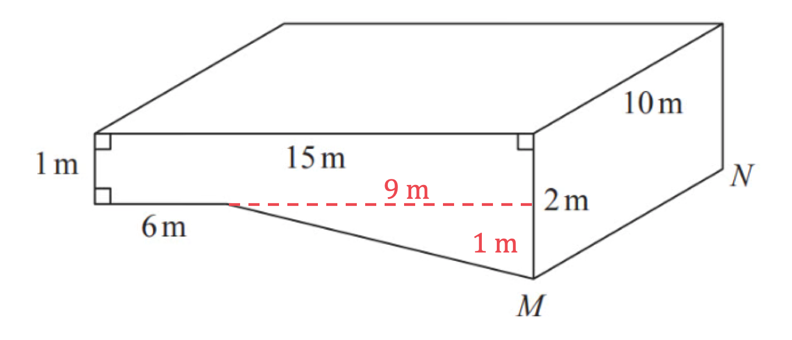

> *Calculate the area of the triangle, using the formula: *$A=\frac{1}{2}bh$*, where *$b$* is the base of the triangle and *$h$* is the perpendicular height.*

`table row A equals cell 1 half cross times 1 cross times 9 end cell row blank equals cell 4.5 space straight m squared end cell end table`

**[1]**

> *Calculate the total area of the cross-section by adding together the area of the triangle and the rectangle.*

`table row A equals cell 1 cross times 15 plus 4.5 end cell row blank equals cell 19.5 space straight m squared end cell end table`

**[1]**

> *Calculate the volume of the prism by multiplying the cross-sectional area by the length of the prism.*

`table row V equals cell 19.5 cross times 10 end cell row blank equals cell 195 space straight m cubed end cell end table`

**[1]**

> *Convert the volume of the swimming from m**3** into litres by multiplying by 1000.*

`table row blank blank cell 195 cross times 1000 end cell row blank equals cell 195 space 000 space litres end cell end table`

> *Divide the volume, in litres, by 50 to work out how many minutes it will take for the water to fill the swimming pool.*

`table row blank blank cell fraction numerator 195 space 000 over denominator 50 end fraction end cell row blank equals cell 3900 space minutes end cell end table`

**[1]**

> *Convert the time to hours by dividing by 60.*

`table row blank blank cell 3900 over 60 end cell end table`

$65\mathrm{hours}$ **[1]**

### 13((b)) — 1 marks
> *Because of the triangular prism shape of the pool at the bottom, the pool will fill up quickly at first but then the rate will slow down. *

> *As the top section is a cuboid, the rate will be constant when it reaches this section.*

**C ****[1]**

## Q45 — hard — 6 marks · exam-questions

### 17() — 6 marks
> *Calculate the area of the trapezoidal cross-section, using the formula: *`A equals 1 half open parentheses a plus b close parentheses h`*, where *$a$* and *$b$* are the parallel edges and *$h$* is the perpendicular height of the trapezium.*

`table row A equals cell 1 half cross times open parentheses 1.3 plus 0.5 close parentheses cross times 2 end cell row blank equals cell 1.8 space straight m squared end cell end table`

> *Calculate the volume of the pond by multiplying the trapezoidal cross-sectional area by the length of the prism.*

`table row V equals cell 1.8 cross times 1 end cell row blank equals cell 1.8 space straight m cubed end cell end table`

**[1]**

> *The first part of the water that is drained is from a cuboidal section of the pond. *

> *Calculate the volume of water pumped out in the first 30 minutes.*

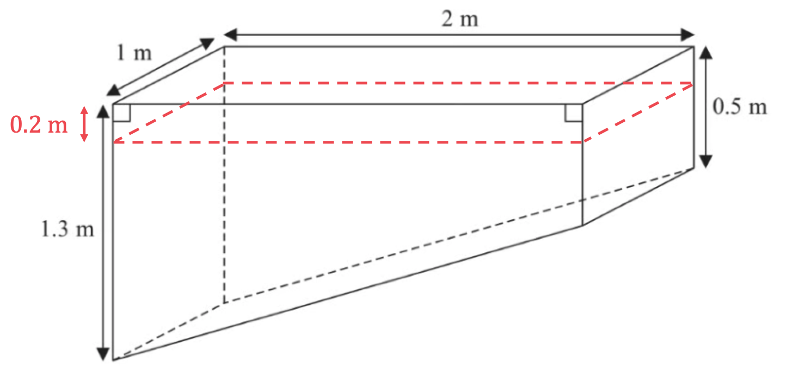

`table attributes columnalign right center left columnspacing 0px end attributes row V equals cell 0.2 cross times 1 cross times 2 end cell row blank equals cell 0.4 space straight m cubed end cell end table`

**[1]**

> *Calculate the flow rate in m**3** per hour, by dividing the volume pumped out by the time taken to do it in hours.*

`table row cell Flow space rate space end cell equals cell fraction numerator space 0.4 over denominator 0.5 end fraction end cell row blank equals cell 0.8 space straight m cubed divided by straight h end cell end table`

**[1]**

> *Calculate the volume of the water still to be pumped out by subtracting the volume of water that has already been pumped out from the total volume of the pond.*

`table row cell V subscript r e m a i n i n g end subscript end cell equals cell 1.8 minus 0.4 end cell row blank equals cell 1.4 space straight m cubed end cell end table`

**[1]**

> *Calculate the time it will take to pump the remaining water out by dividing the volume of the remaining water by the flow rate.*

`table row T equals cell fraction numerator 1.4 over denominator 0.8 end fraction end cell end table`

**[1]**

`table attributes columnalign right center left columnspacing 0px end attributes row T equals cell 14 over 8 end cell row blank equals cell 1.75 end cell end table`

> *Convert to hours and minutes.*

$1\mathrm{hour}45\mathrm{minutes}$* ***[1]**

## Q46 — hard — 4 marks · exam-questions

### 6() — 4 marks
> *Find the volume of the cuboid by multiplying the length by the width by the height.*

`table row cell V space end cell equals cell space 6 space cross times space 8 space cross times space 15 space equals space 720 space cm cubed end cell end table`

**[1]**

> *Find the side length of the cube (*$x$*) by setting its volume equal to the volume of the cuboid.*
*The volume of a cube is just the side length, cubed.*

$x^{3}=720$

> *Solve to find the side length.*

`table row cell x space end cell equals cell space cube root of 720 space equals space 8.9628094... space space cm end cell end table`

**[1]**

> *The surface area of a cube is the sum of the area of the 6 identical square faces. *
*Find the surface area of the cube by squaring the side length to find the area of one face and then multiplying it by 6.*

> *Use either the exact value or the answer button or memory function on your calculator.*

*Surface area  *`table row blank equals cell space 6 x squared space space equals space space 6 open parentheses cube root of 720 close parentheses squared space space equals space 481.991724... end cell end table`

**[1]**

> *Round your answer to 3 significant figures, the third non-zero digit is a 1 and the digit following it is greater than 5, so round the 1 up.*

**Surface area = 482 cm****2**** ****[1]**

## Q47 — hard — 5 marks · exam-questions

### 14() — 5 marks
> *Method 1*

> *Draw a diagram showing a cube with dimensions of *$x$* **cm. Add the longest diagonal to the diagram and give this a length of 25 cm. *

> *It also may help to add the right-angled triangles that the diagonal makes with the edges onto the diagram.*

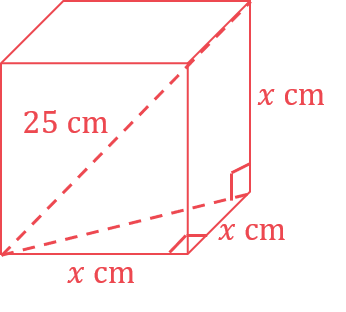

> *Use Pythagoras' theorem for 3D shapes, *$x^{2}+y^{2}+z^{2}=d^{2}$*, to find an expression for the square of the length of the longest diagonal in terms of *$x.$

`table row cell x squared space plus space x squared space plus space x squared space end cell equals cell space 3 x squared end cell end table`

**[1]**

> *Form an equation by setting *$3x^{2}$* equal to the square of the longest diagonal, 25 cm.*

`table attributes columnalign right center left columnspacing 0px end attributes row cell 3 x squared space end cell equals cell space 25 squared end cell row cell 3 x squared space end cell equals 625 end table`

**[1]**

> *At this point you can solve the equation to find *`table row blank blank x end table`*, however it is not necessary as the surface area of a cube is 6 multiplied by the area of one of the squares, so the surface area of the cube = *`table attributes columnalign right center left columnspacing 0px end attributes row blank blank cell 6 x squared end cell end table`*.*

`table row cell SA space end cell equals cell space 6 x squared space equals space 2 open parentheses 3 x squared close parentheses space equals space 2 open parentheses 625 close parentheses space end cell end table`

**Correct formula for surface area**** [1] **

**equating to 2 × 25****2**** ****[1]**

**Surface Area =**$1250\mathrm{cm}^{2}$* ***[1]**

> *Method 2*

> *Draw a diagram showing a cube with dimensions of *$x$* **cm.  Add the longest diagonal to the diagram and give this a length of 25 cm. *

> *It also may help to add the right-angled triangles that the diagonal makes with the edges onto the diagram.*

> *Use Pythagoras' theorem, *$a^{2}+b^{2}=c^{2}$*, on the right-angled triangle on the base of the crate to find length of the diagonal on the base in terms of *$x.$

`table row cell x squared space plus space x squared space end cell equals cell space 2 x squared end cell end table`

**[1]**

`table row cell c squared space end cell equals cell space 2 x squared space end cell row cell c space end cell equals cell square root of 2 x squared end root space end cell row blank equals cell space x square root of 2 space cm end cell end table`

> *Add this to the diagram.*

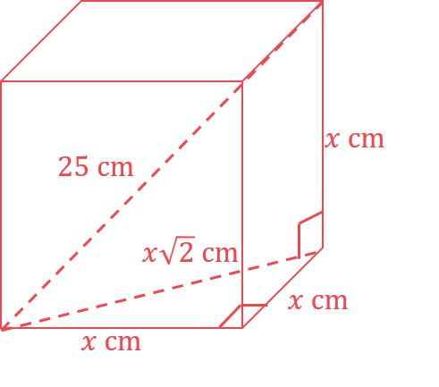

> *Use Pythagoras' theorem on the right-angled triangle made up of the diagonal at the base, the side with length *$x$* cm and the longest diagonal, 25 cm.*

`table row cell open parentheses x square root of 2 close parentheses squared space plus space x squared space end cell equals cell space 25 squared end cell row cell 2 x squared space plus space x squared space end cell equals cell space 25 squared end cell row cell 3 x squared space end cell equals 625 end table`

**[1]**

> *Solve the equation to find *`table row blank blank x end table`*.*

`table row cell x squared space end cell equals cell space 625 over 3 end cell row cell x space end cell equals cell space square root of 625 over 3 end root space equals space fraction numerator 25 over denominator square root of 3 end fraction end cell end table`

**[1]**

> *Find the area of one face of the cube.*

`table row cell Area space end cell equals cell space x squared space equals space open parentheses fraction numerator 25 over denominator square root of 3 end fraction close parentheses squared space equals space 625 over 3 end cell end table`

> *The surface area of a cube is 6 multiplied by the area of one of the squares, so the surface area of the cube = *`table row blank blank cell 6 x squared end cell end table`*.*

`table row cell SA space end cell equals cell space 6 x squared space equals space 6 open parentheses 625 over 3 close parentheses end cell end table`

** [1]**

**Surface Area =**$1250\mathrm{cm}^{2}$* ***[1]**

## Q48 — hard — 4 marks · exam-questions

### 18() — 4 marks
> *The height is three times the radius, which means that *$h$* can be rewritten in terms of *$r$*.*

$h=3r$

*The formula for the volume of a cone is *$\frac{1}{3}πr^{2}h$*.* *Find the volume of the cone, using *$3r$* in place of *$h$*.*

$\mathrm{volume}=\frac{1}{3}\timesπ\timesr^{2}\times3r$

**Forming expression in terms of only **$r$** or only **$h$** [1]**

> *Form an equation by setting the expression found for the volume equal to 2100.*

$\frac{1}{3}\timesπ\timesr^{2}\times3r=2100$

**Forming equation in terms of only **$r$** or only **$h$** [1]**

> *Simplify and divide both sides by π.*

`table row cell 1 third cross times 3 r cubed space cross times pi end cell equals 2100 row cell pi r to the power of 3 space end exponent end cell equals cell space 2100 end cell row cell r cubed space end cell equals cell space 2100 over pi end cell end table`

> *Find the cube-root of both sides.*

`r space equals space cube root of 2100 over pi space end root`

**[1]**

> *Round the answer to 3 significant figures.*

`r space equals space cube root of 2100 over pi space end root equals space 8.7435904...`

**r ****= 8.74 cm** **[1]**

## Q49 — hard — 5 marks · exam-questions

### 6() — 5 marks
> *Use the formula *$πr^{2}h$* to find the volume of the **cylinder**, which has known dimensions and can be found.*

$V=π\times12^{2}\times30=4320π\mathrm{cm}^{3}$

**Correct method**** [1]**
**Correct answer ****[1]**

> *The volume of the sphere is the same as the volume of the cylinder so substitute your answer into the formula for the volume of a sphere, *$V=\frac{4}{3}πr^{3}$*.*

$4320π=\frac{4}{3}π\timesr^{3}$

**[1]**

> *Divide both sides by *$π$*.*

$4320=\frac{4}{3}\timesr^{3}$

> *Multiply both sides by 3.*

$12960=4\timesr^{3}$

> *Divide both sides by 4.*

$3240=r^{3}$

**[1]**

> *Take the cube root of both sides.*

`r space equals space cube root of 3240 space equals space 14.79727... space cm`

> *Round your answer to 3 significant figures.*

$r=14.8\mathrm{cm}$** [1] **

**Answers in the range 14.79 to 14.8 accepted**

## Q50 — hard — 4 marks · exam-questions

### 18() — 4 marks
> **[exam-tip]**
> Working in terms of $π$ for this question helps to keep the values calculated exact until the final solution is given.

> *Calculate the volume of the cylinder using the formula *$πr^{2}h$

$π\times6^{2}\times10=360π$

**[M1]**

> *Calculate the volume of the hemisphere, using the formula of a sphere *$\frac{4}{3}πr^{3}$* and dividing it by 2*

`open parentheses 4 over 3 cross times pi cross times 6 cubed close parentheses divided by 2 equals 144 straight pi`

> *Calculate the total volume of the shape*

$360π+144π=504π$

**[M1]**

> *Calculate the volume of water, which is half of the total volume of the shape*

$504π\div2=252π$

> *Calculate the depth of water by dividing the volume of water by the area of the cross section of the cylinder (the cross section is  a circle, *$πr^{2}$*)*

$\frac{252π}{π\times6^{2}}=7$

**[M1]**

$t=7$

**[A1]**

## Q51 — hard — 5 marks · exam-questions

### 20() — 5 marks
> *Using the variable, **h**, for height allows the radius to be expressed as 2**h** as shown below:*

> *Substitute the known values and variables  into the formula for the volume of a cone, *$\frac{1}{3}πr^{2}h$* to form an equation*

`1 third cross times pi cross times open parentheses 2 h close parentheses squared cross times h equals 562.5 pi`

**[M1]**

> *Simplify terms on the left side of the equation*

`table row cell 1 third cross times pi cross times 4 h squared cross times h end cell equals cell 562.5 pi end cell row cell 1 third cross times pi cross times 4 h cubed end cell equals cell 562.5 pi end cell row cell 4 over 3 pi h cubed end cell equals cell 562.5 pi end cell end table`

**[M1]**

> *Divide through by *$π$

`table row cell 4 over 3 h cubed end cell equals cell 562.5 end cell end table`

> *Continue to solve the equation for *$h$

`table row cell 4 h cubed end cell equals cell 3 cross times 562.5 end cell row cell h cubed end cell equals cell fraction numerator 1687.5 over denominator 4 end fraction end cell row h equals cell cube root of 421.875 end root end cell row h equals cell 7.5 end cell end table`

**[M1]**

> *Since *$h=7.5$* then *$2h=15$* which is the length of the radius of the cone*

> *Substitute these values into Pythagoras' theorem (*$a^{2}+b^{2}=c^{2}$*) to calculate the length of the sloping edge of the cone, *$l$

`table row cell 7.5 squared plus 15 squared end cell equals cell l squared end cell row cell 56.25 plus 225 end cell equals cell l squared end cell row cell 281.25 end cell equals cell l squared end cell row cell square root of 281.25 end root end cell equals l row l equals cell 16.770... end cell end table`

**[M1]**

> *Substitute values into the formula for the curved surface area of a cone, *$πrl$

$π\times15\times\sqrt{281.25}=790.291...$

> *Round to 3 significant figures as stated in the question*

**Final answer:** **790**

**[A1]**

> **[mark-scheme]**
> The final mark is awarded for answers in the range 786.5 to 791.7

## Q52 — very_hard — 5 marks · exam-questions

### 23() — 5 marks
> *Calculate the volume of grain that is poured into the container in the first 5 hours, by adding together the volume of the cone *`open parentheses V equals 1 third straight pi r squared h close parentheses`* and the volume of a cylinder, *`open parentheses V equals straight pi r squared h close parentheses`*, of height 2m.*

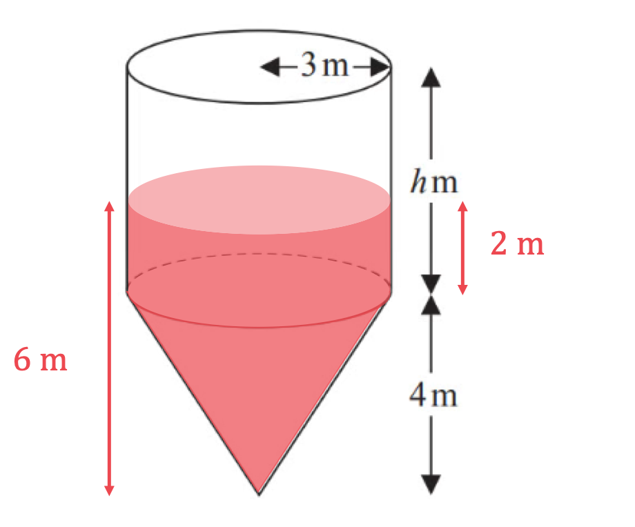

`table row V equals cell 1 third straight pi open parentheses 3 close parentheses squared open parentheses 4 close parentheses plus straight pi open parentheses 3 close parentheses squared open parentheses 2 close parentheses end cell end table`

**For correct substitution into the volume formula for either the cone or the cylinder ****[1]**

`table row V equals cell 1 third straight pi cross times 36 plus straight pi cross times 18 end cell row blank equals cell 12 straight pi plus 18 straight pi end cell end table`

**[1]**

`table row V equals cell 30 straight pi space straight m cubed end cell end table`

> *Calculate the rate of flow of the grain by dividing the volume of grain by the time taken to pour it.*

`table row blank blank cell fraction numerator 30 straight pi over denominator 5 end fraction end cell row blank equals cell 6 straight pi space space straight m cubed straight h to the power of negative 1 end exponent end cell end table`

> *Calculate the volume of grain that will be poured in 4 hours by multiplying the rate of flow of the grain by 4.*

`table row blank blank cell 6 straight pi cross times 4 end cell row blank equals cell 24 straight pi space space straight m cubed end cell end table`

**[1]**

> *The grain poured in the last 4 hours will just fill the remainder of the cylinder, so calculate the height of the remainder of the cylinder that is filled by substituting the volume into the formula for the volume of a cylinder.*

`table row cell 24 straight pi end cell equals cell straight pi open parentheses 3 close parentheses squared h end cell end table`

**[1]**

`table row cell 24 straight pi end cell equals cell 9 straight pi h end cell row cell 24 over 9 end cell equals h row h equals cell 8 over 3 space straight m end cell end table`

> *Work out the value of *$h$* by adding together the height of the cylindrical parts from the two volumes.*

`table row h equals cell 2 plus 8 over 3 end cell end table`

$\frac{14}{3}m$* ***[1]**

**Leave your working in terms of **$π$** throughout, in a non-calculator paper question it will frequently cancel out.**

## Q53 — very_hard — 5 marks · exam-questions

### 27() — 5 marks
> *Calculate the surface area of the sphere, using the formula: *$A=4πr^{2}$*.*

`table row cell A subscript s p h end subscript end cell equals cell 4 straight pi open parentheses 6 close parentheses squared end cell row blank equals cell 144 straight pi space cm squared end cell end table`

**[1]**

> *Double the surface area of the sphere to work out the surface area of the cylinder.*

$A_{cyl}=144π\times2=288π\mathrm{cm}^{2}$

**[1]**

> *Using the formula for the surface area of a cylinder *`open parentheses A equals 2 straight pi r squared plus 2 straight pi r h close parentheses`*, calculate the height of the cylinder.*

`table row cell 288 straight pi end cell equals cell 2 straight pi open parentheses 3 close parentheses squared plus 2 straight pi open parentheses 3 close parentheses h end cell row cell 288 straight pi end cell equals cell 18 straight pi plus 6 straight pi h end cell row cell 270 straight pi end cell equals cell 6 straight pi h end cell row cell 270 over 6 end cell equals h row h equals cell 45 space cm end cell end table`

**[1]**

> *Calculate the volume of the sphere, using the formula: *$V=\frac{4}{3}πr^{3}$*.*

`table row cell V subscript s p h end subscript end cell equals cell 4 over 3 straight pi open parentheses 6 close parentheses cubed end cell row blank equals cell 288 straight pi space cm cubed end cell end table`

> *Calculate the volume of the cylinder, using the formula: *$V=πr^{2}h$*.*

`table row cell V subscript c y l end subscript end cell equals cell straight pi open parentheses 3 close parentheses squared open parentheses 45 close parentheses end cell row blank equals cell 405 straight pi space cm cubed end cell end table`

**Correct expression for the volume of the sphere and the cylinder**** [1]**

> *Find the ratio of the volume of the sphere to the volume of the cylinder.*

`table row blank blank cell 288 straight pi space colon space 405 straight pi end cell end table`

> *Simplify.*

`table row blank blank cell 288 space colon space 405 end cell end table`

$32:45$* ***[1]**

## Q54 — very_hard — 5 marks · exam-questions

### 16() — 5 marks
> *The volume of the swimming pool can be calculated by finding the cross-sectional area and multiplying it by the width of the pool as it is a prism.*

> *Split the cross-sectional area into a rectangle and a trapezium.*

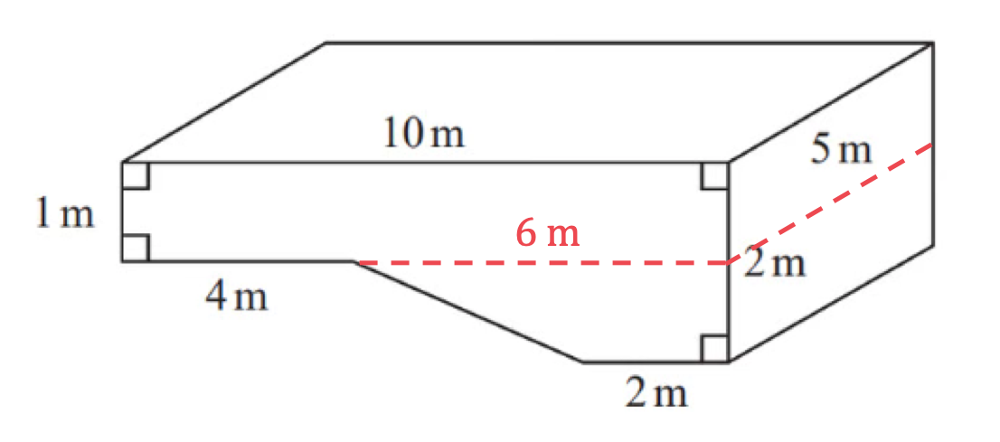

> *Calculate the area of the rectangle, *`open parentheses A equals l cross times w close parentheses`*, and the area of the trapezium, *`open parentheses A equals 1 half open parentheses a plus b close parentheses h close parentheses`*, then add them together to work out the cross-sectional area.*

`table row A equals cell 1 cross times 10 plus 1 half open parentheses 6 plus 2 close parentheses cross times 1 end cell end table`

**Correct method to split up the cross-section and find the area of one part**** [1] **

**Correct complete method to find the total area of the cross-section**** [1]**

`table row A equals cell 14 space straight m squared end cell end table`

> *Work out the volume of the swimming pool by multiplying the cross-sectional area by the width.*

`table row cell V subscript P o o l end subscript end cell equals cell 14 cross times 5 end cell end table`

**[1]**

`table row cell V subscript P o o l end subscript end cell equals cell 70 space straight m cubed end cell end table`

> *Convert the volume of water from the three tankers from litres to m**3** by dividing the total number of litres by 1000.*

`table row cell V subscript W a t e r end subscript end cell equals cell fraction numerator 20000 cross times 3 over denominator 1000 end fraction end cell row blank equals cell 60 space straight m cubed end cell end table`

> *Subtract the volume of the water from the volume of the swimming pool to find out the the volume that will not be filled with water.*

`table row cell V subscript E m p t y end subscript end cell equals cell 70 minus 60 end cell row blank equals cell 10 space straight m cubed end cell end table`

> *Assuming that the part of the swimming pool that is not filled by water is a cuboid, with length 10 m and width 5 m, calculate the height of the cuboid.*

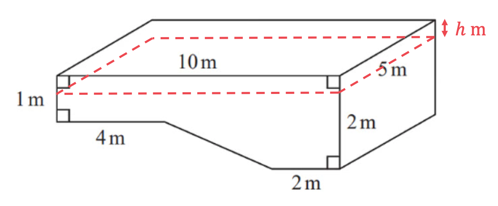

`table row 10 equals cell 10 cross times 5 cross times h end cell end table`

**[1]**

`table row 10 equals cell 50 h end cell row h equals cell 0.2 space straight m end cell end table`

**Sam is incorrect****, the surface of the water will be ****20 cm**** below the top of the pool ****[1]**

## Q55 — very_hard — 5 marks · exam-questions

### 22() — 5 marks
> *Find the radius of the large cone, given that the radius is half of the diameter.*

`table row r equals cell 12 over 2 end cell row blank equals cell 6 space cm end cell end table`

> *Calculate the volume of the large cone, using the formula: *$V=\frac{1}{3}πr^{2}h$*, where *$r$* is the radius of the cone and *$h$* is the perpendicular height.*

`table row cell V subscript L end cell equals cell 1 third cross times straight pi cross times 6 squared cross times 15 end cell end table`

**[1]**

`table row cell V subscript L end cell equals cell 180 straight pi space cm cubed end cell end table`

> *Work out the height of the small cone by subtracting the height of the frustum from the height of the large cone.*

$h=15-10=5\mathrm{cm}$

> *The large and small cones are similar objects. *
*Work out the length scale factor (LSF) by dividing the height of the large cone by the height of the small cone.*

$\mathrm{LSF}=\frac{15}{5}=3$

> *Divide the radius of the large cone by the LSF to work out the radius of the small cone.*

`table row r equals cell 6 over 3 end cell row blank equals cell 2 space cm end cell end table`

**[1]**

> *Calculate the volume of the small cone.*

$V_{S}=\frac{1}{3}\timesπ\times2^{2}\times5$

$V_{S}=\frac{20}{3}π\mathrm{cm}^{3}$

> *Work out the volume of the frustum by subtracting the volume of the small cone from the volume of the large cone.*

`table row V equals cell 180 straight pi minus 20 over 3 straight pi end cell end table`

**[1]**

`table row V equals cell 520 over 3 straight pi space cm cubed end cell end table`

> *Calculate the mass of the frustum by multiplying the density of the glass by the volume of the frustum, *`open parentheses M a s s equals D e n s i t y cross times V o l u m e close parentheses`*.*

$M=2.5\times\frac{520}{3}π$

**[1]**

$M=1361.35681...g$

> *The dimensions of the object and the density are given to an accuracy of 2 significant figures, so this would be a suitable accuracy to round the final answer to.*

$1400g$* ***[1]**

**Answers rounded to 1400, 1360 or 1361 will be accepted**

## Q56 — very_hard — 5 marks · exam-questions

### 17() — 5 marks
> *Calculate the length of the slant height of the cone by applying Pythagoras' theorem, *$a^{2}+b^{2}=c^{2}$*, to the right-angled triangle involving the slant height, the radius and the perpendicular height of the cone.*

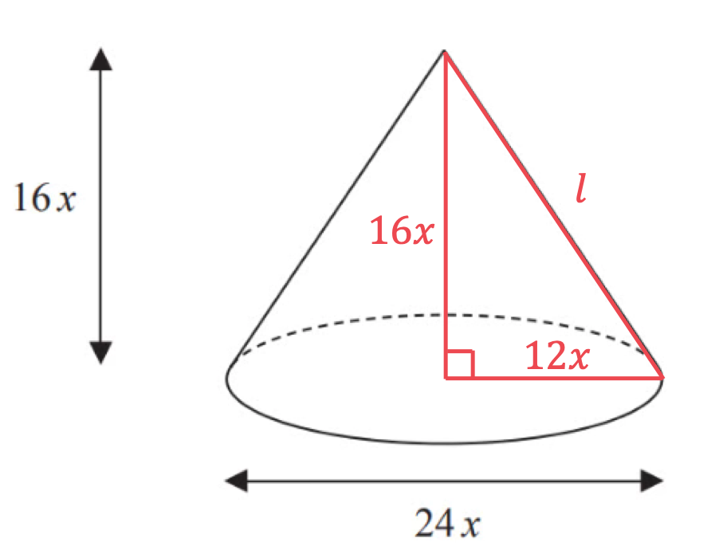

`table row cell open parentheses 16 x close parentheses squared plus open parentheses 12 x close parentheses squared end cell equals cell l squared end cell row cell 256 x squared plus 144 x squared end cell equals cell l squared end cell row cell 400 x squared end cell equals cell l squared end cell row l equals cell 20 x end cell end table`

**[1]**

> *Substitute the value of the surface area of the cone along with the algebraic expressions for the slant height and the radius into the formula for the surface area of the cone.*

$2160π=π\times12x\times20x$

**[1]**

> *Solve to find the value of *$x$*.*

`table row cell 2160 straight pi end cell equals cell 240 straight pi x squared end cell row 2160 equals cell 240 x squared end cell row 9 equals cell x squared end cell row x equals 3 end table`

**[1]**

> *Substitute the relevant values into the formula for the volume of a cone, *$V=\frac{1}{3}πr^{2}h$*.*

`V equals 1 third cross times open parentheses 12 cross times 3 close parentheses squared cross times open parentheses 16 cross times 3 close parentheses`

**[1]**

> *Solve to find the volume.*

$V=20736π\mathrm{cm}^{3}$

> *Write down the value of **V.*

$20736$** [1]*** *

## Q57 — very_hard — 5 marks · exam-questions

### 11() — 5 marks
> *Find an expression for the volume of the hemisphere in terms of *$x$*, by substituting the expression for the radius, *$r$*, into the formula for the volume of a sphere, *$V=\frac{4}{3}πr^{3}$*, and multiplying the result by *$\frac{1}{2}$*.*

`table row cell V subscript h e m i s p h e r e end subscript end cell equals cell 1 half cross times 4 over 3 cross times straight pi cross times x cubed end cell end table`

**[1]**

`table row cell V subscript h e m i s p h e r e end subscript end cell equals cell 2 over 3 straight pi x cubed end cell end table`

> *Write down the perpendicular height, *$h$*, of the cone.*

`table row h equals cell 5 x minus x end cell row blank equals cell 4 x end cell end table`

> *Find an expression for the volume of the cone in terms of *$x$*, using the formula for the volume of a cone: *$V=\frac{1}{3}πr^{2}h$*.*

$V_{cone}=\frac{1}{3}\timesπ\timesx^{2}\times4x$

> *Calculate the total volume of the solid by adding together the volume of the hemisphere and the cone.*

`table row cell V subscript t o t a l end subscript end cell equals cell 2 over 3 straight pi x cubed plus 4 over 3 straight pi x cubed end cell end table`

**[1]**

`table attributes columnalign right center left columnspacing 0px end attributes row cell V subscript t o t a l end subscript end cell equals cell 2 straight pi x cubed space cm cubed end cell end table`

*Find an expression for the volume of the cylinder, using the formula for the volume of a cylinder: *$V=πr^{2}h$.

`V subscript c y l i n d e r end subscript equals straight pi cross times open parentheses 2 x close parentheses squared cross times h`

**[1]**

$V_{cylinder}=4x^{2}πh$

> *The cylinder has the same volume as the solid, so make the two volumes equal and rearrange to find an expression for the perpendicular height in terms of *$x$*. *

`table row cell 2 straight pi x cubed end cell equals cell 4 x squared straight pi h end cell end table`

**[1]**

`table row cell 2 x cubed end cell equals cell 4 x squared h end cell row cell 1 half x cubed end cell equals cell x squared h end cell end table`

$h=\frac{1}{2}x$* ***[1]**

## Q58 — very_hard — 4 marks · exam-questions

### 16() — 4 marks
> *First sketch a diagram of a side view of the cones and frustum. We will let the height of the frustum be *$f$*, the height of the small cone be *$H$* and the radius of the small cone be *$R$

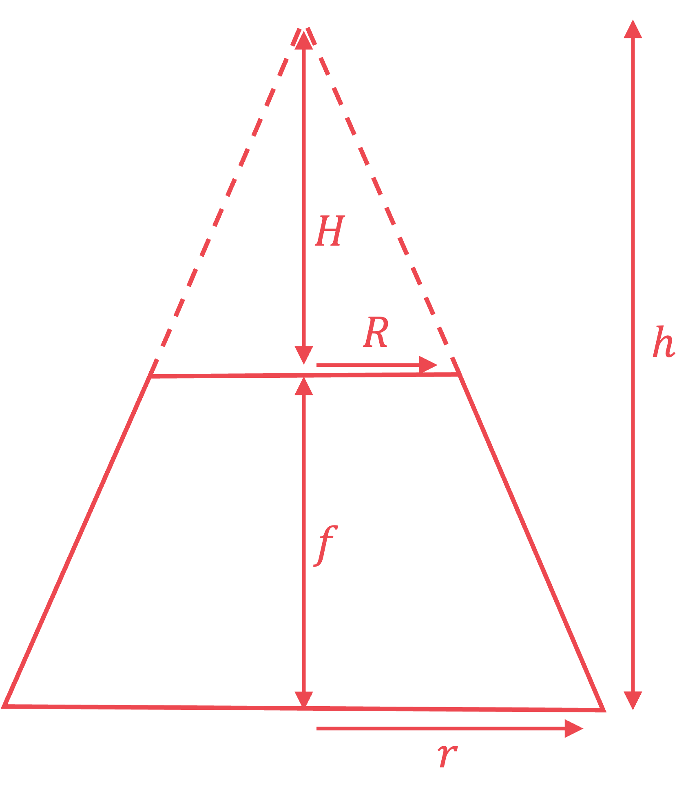

> *We need *$f$* and we can see that *$f=h-H$*. So we need *$H$* in terms of *$h$

> *If *$\frac{98}{125}$* represents the fraction of the large cone that the frustum occupies, then the fraction of the large cone that the small cone occupies is *

$1-\frac{98}{125}=\frac{27}{125}$

**[1]**

> *This *$\frac{27}{125}$* is effectively the scale factor of the small cone to the large cone*

> *Therefore if we cube root *$\frac{27}{125}$*, we have the length scale factor of the small cone to the large cone*

`cube root of 27 over 125 end root equals 3 over 5`

**[1]**

> *Therefore *

$H=\frac{3}{5}h$

> *And*

`table row f equals cell h minus H end cell row blank equals cell h minus 3 over 5 h end cell end table`

**[1]**

**The height of the frustum is **`table row blank blank cell bold 2 over bold 5 bold italic h end cell end table`** ****[1]**

## Q59 — very_hard — 6 marks · exam-questions

### 26() — 6 marks
> *The formula for the volume of a cone, *$V=\frac{1}{3}πr^{2}h$*, is given at the beginning of the paper. Use the formula with the given volume of the cone to find the value of the radius of the base circle. *

> *Using the known volume of 1600 cm**3** we can write the following equation.*

$\frac{1}{3}\timesπ\timesr^{2}\times25=1600$

**[1]**

> *Divide both sides by 25 and *$\frac{1}{3}π$*.*

$\frac{1}{3}πr^{2}=\frac{1600}{25}=64$

$r^{2}=\frac{64}{\frac{π}{3}}=\frac{192}{π}=61.11549...$

> *Square root both sides.*

$r=\sqrt{61.11549...}=7.817640...$

**[1]**

> *The formula for the curved surface area of a cone, *$πrl$* , is given at the beginning of the paper.*

> *Use Pythagoras' Theorem to find the value of *$l$*, the slant height of the cone. *

> *It is a right angled triangle so you can use Pythagoras' Theorem: *$a^{2}+b^{2}=c^{2}$*, where **c** is the length of the hypotenuse (the slant height) and **a** and **b **are the height and the radius. *

`table row cell l squared space end cell equals cell space 7.81764... squared space plus space 25 squared end cell row cell l space end cell equals cell space square root of 7.81764... squared space plus space 25 squared end root end cell row blank equals cell space 26.193806... end cell end table`

**[1]**

> *Substitute the values of *$l$* and *$r$* into the formula for the curved surface area of a cone.*

`table row cell C S A space end cell equals cell space pi r l italic space equals space pi open parentheses 7.817640... close parentheses open parentheses 26.193806... close parentheses space equals 643.313706... end cell end table`

**[1]**

> *The area of the sector is equal to the curved surface area of the cone. Use the formula for area of a sector *$\frac{θ}{360^{\circ}}\timesπr^{2}$*, where the radius of the sector is equal to the slant height of the cone, to find the value of the angle, *$x$*.*

`space x over 360 space space cross times space pi space space cross times space table row blank blank 26 end table table row blank blank. end table table row blank blank 193806 end table... squared space equals space table row blank blank 643 end table table row blank blank. end table table row blank blank 313706 end table table row blank blank. end table table row blank blank. end table table row blank blank. end table`

**[1]**

> *Rearrange and solve to find *$x$*.*

`table row cell x over 360 space space end cell equals cell space fraction numerator 643.313706... over denominator space 26.193806... squared cross times space pi space space end fraction space end cell row cell x over 360 end cell equals cell space 0.298452... end cell row cell x space end cell equals cell space 0.298452... space cross times space 360 space equals space 107.4430... end cell end table`

$x=107^{\circ}$ **[1]**

**Rounded to 3 significant figures 107 - 108 allowed**

## Q60 — very_hard — 5 marks · exam-questions

### 17() — 5 marks
> *Find the volume of S by adding together the volume of a cylinder ("*$V=πr^{2}h$*") and the volume of the hemisphere (half the volume of a sphere so "*$V=\frac{1}{2}\times\frac{4}{3}πr^{3}$*").*

`V equals straight pi open parentheses x close parentheses squared open parentheses 20 minus 4 x close parentheses plus 1 half open parentheses 4 over 3 straight pi open parentheses x close parentheses cubed close parentheses`

**[1]**

> *Equate this to the given expression for the volume of S, and simplify to make things easier.*

`table row cell 1 third straight pi y end cell equals cell straight pi open parentheses x close parentheses squared open parentheses 20 minus 4 x close parentheses plus 1 half open parentheses 4 over 3 straight pi open parentheses x close parentheses cubed close parentheses end cell end table`

**[1]**

`table attributes columnalign right center left columnspacing 0px end attributes row cell 1 third straight pi y end cell equals cell 20 straight pi x squared minus 4 straight pi x cubed plus 2 over 3 straight pi x cubed end cell row cell 1 third straight pi y end cell equals cell 20 straight pi x squared minus 10 over 3 straight pi x cubed end cell row cell straight pi y end cell equals cell 60 straight pi x squared minus 10 straight pi x cubed end cell row cell up diagonal strike straight pi y end cell equals cell 10 up diagonal strike straight pi x squared open parentheses 6 minus x close parentheses end cell row y equals cell 10 x squared open parentheses 6 minus x close parentheses end cell end table`

**[1]**

> *To find the maximum value of y we need to use differentiation.*

`table row y equals cell 60 x squared minus 10 x cubed end cell row cell fraction numerator straight d y over denominator straight d x end fraction end cell equals cell 120 x minus 30 x squared end cell row cell fraction numerator straight d y over denominator straight d x end fraction end cell equals cell 30 x open parentheses 4 minus x close parentheses end cell end table`

> *At a maximum value, *$\frac{dy}{dx}=0$*.*

`30 x open parentheses 4 minus x close parentheses equals 0
up diagonal strike x equals 0 end strike comma space space x equals 4`

**[1]**

> *Reject *$x=0$* as a solution since the radius of the hemisphere and cylinder cannot be zero! *

> *So *$x=4$* (we can assume) is the **x** value at the maximum for **y**. Substitute this into our equation for **y** in terms of **x**.*

`table row y equals cell 10 cross times 4 squared cross times open parentheses 6 minus 4 close parentheses end cell row y equals cell 10 cross times 16 cross times 2 end cell row y equals 320 end table`

**Therefore the maximum value of ****y**** is 320*** ***[1]**

## Q61 — very_hard — 4 marks · exam-questions

### 17((a)) — 4 marks
*To find the total surface area we need to find the area of the individual 2D shapes that make up the prism.* 
*There are two congruent (identical) trapeziums.*
*Two congruent rectangles making up the 'sloping' sides (left and right as we look at the diagram).*
*A rectangle for the 'top' and a different rectangle for the base.*

*It may help to draw a net of the prism.  It does not need to be accurate.* 
*We do not know the length of the sloping side so we shall call that **x** for now.*

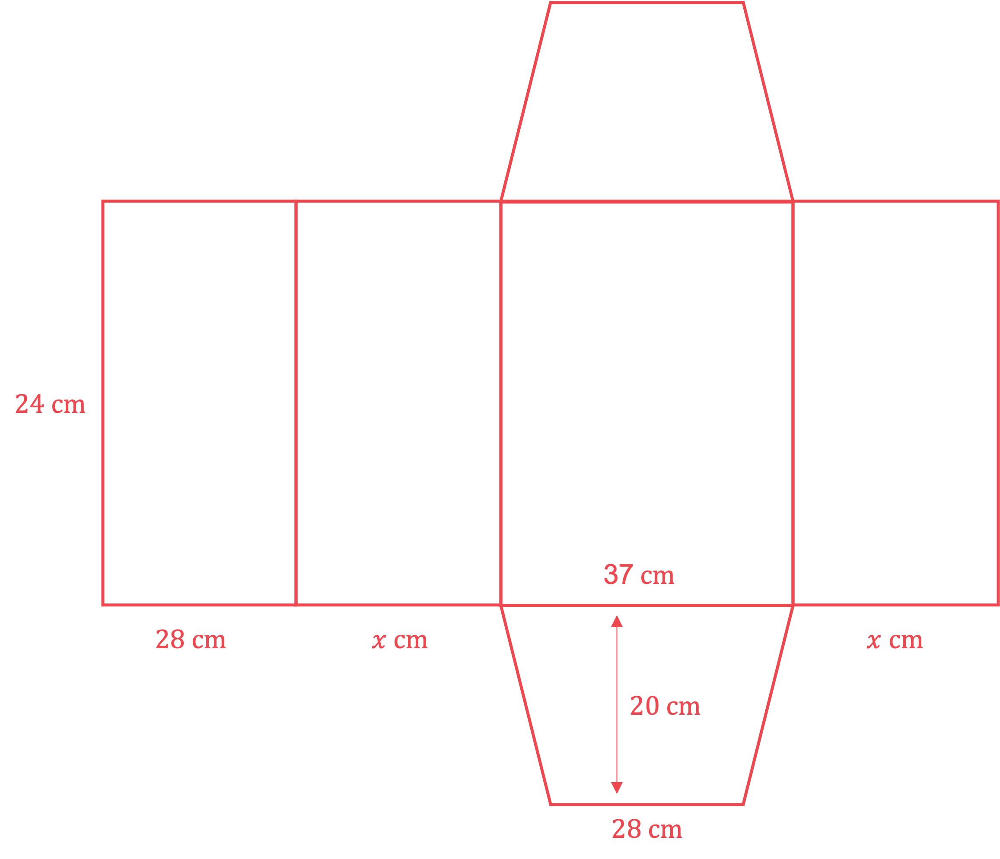

> *So using the standard formulae for the area of trapeziums and rectangles we can write down a formula for the total surface area, **S** say, of the prism.*

`table row S equals cell 2 cross times open parentheses 1 half cross times 20 cross times open parentheses 37 plus 28 close parentheses close parentheses plus 2 cross times open parentheses 24 cross times x close parentheses plus open parentheses 24 cross times 28 close parentheses plus open parentheses 24 cross times 37 close parentheses end cell row S equals cell 1300 plus 48 x plus 672 plus 888 end cell row S equals cell 2860 plus 48 x end cell end table`

**Method for area of a trapezium ****[1]** 
**Method for total surface area ****[1]**

*To find the value of **x** we can use Pythagoras' theorem ("*$a^{2}=b^{2}+c^{2}$*") on the 'triangular' part of the prism **ABCD**.*

> *We also need the base of this triangle - as the trapezium is isosceles this is found by*

$\frac{37-28}{2}=4.5$

> *Sketching a diagram can help.*

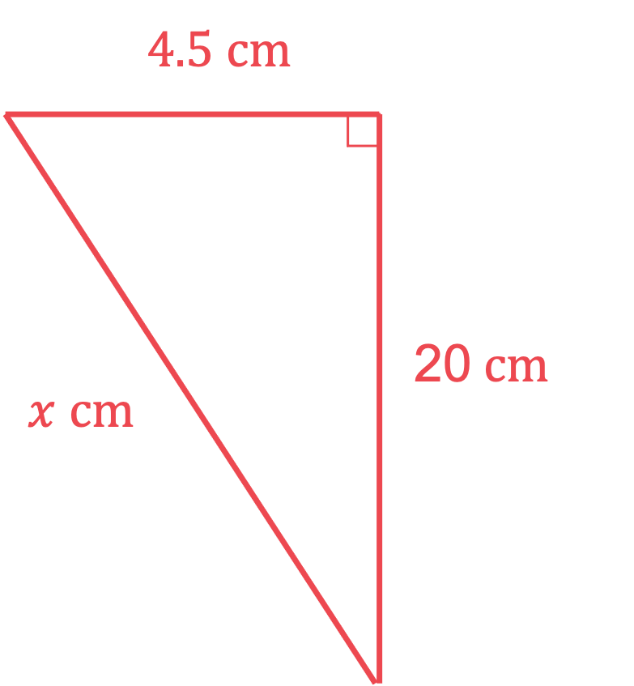

`table row cell therefore x squared end cell equals cell 20 squared plus 4.5 squared end cell row cell x squared end cell equals cell 420.25 end cell row x equals cell 20.5 end cell end table`

**[1]**

> *Now we can complete our calculation to find the total surface area of the prism.*

`table row S equals cell 2860 plus 48 x end cell row S equals cell 2860 plus 48 cross times 20.5 end cell row S equals 3844 end table`

**The total surface area of the prism is 3844 cm****3** **[1]**

## Q62 — very_hard — 5 marks · exam-questions

### 9() — 5 marks
> *The relationship between density, mass and volume is given by the following formula.*

$\mathrm{Density}=\frac{\mathrm{Mass}}{\mathrm{Volume}}$

> *You may remember it as a triangle.*

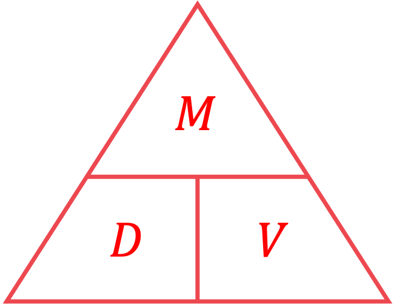

> *We know the mass of the statue and the density of gold, the material it is made from, so we can use the formula to calculate the volume of the statue. *

> *However we need to be careful as there is a mixture of units.  Change the mass from kg to g using 1 kg = 1000 g.*

$M=5.73\times1000=5730g$

> *Now we can find the volume of the statue. (You can use the 'cover up method' to deduce how to rearrange the formula.)*

`table row cell 19.32 end cell equals cell 5730 over V end cell row V equals cell fraction numerator 5730 over denominator 19.32 end fraction end cell row V equals cell 296.583 space 850 space... end cell end table`

**Correct use of density formula**** [1]**

**Complete method to find the volume of the statue**** [1]**

> *Do not round this value but use the ANS button or memory features of your calculator to work with the exact value later.*

> *Find the volume of one gold block using the volume of a cuboid formula ("*$V=lwd$*").*

$V_{block}=8\times2\times1.5\,V_{block}=24$

**[1]**

> *To find the number of blocks needed divide the volume of the statue by the volume of one block.*

$\frac{296.583850...}{24}=12.357660...$

**[1]**

> *As the question asks for the least number of blocks we will need to round **up** to the next whole number.*

**The least number of blocks Pablo melted down in order to make the statue is 13** **[1]**

## Q63 — very_hard — 5 marks · exam-questions

### 18() — 5 marks
> *The area of all six faces will consist of two lots of the shaded area, the two (white) curved surface areas and the two unseen rectangles at the base of the tunnel. *

> *The shaded area is found by subtracting the area of the smaller semi-circle from the area of the larger semi-circle.*

> *Calculate the area of the larger semi-circle, using: *$A=\frac{1}{2}πr^{2}$*.*

`table row A equals cell 1 half open parentheses straight pi cross times open parentheses 10 close parentheses squared close parentheses end cell row blank equals cell 100 over 2 straight pi space cm squared end cell row blank equals cell space 50 straight pi space cm squared end cell end table`

> *The question asks for the answer as a multiple of π, so it is best to leave your working as a multiple of π.*

> *Calculate the area of the smaller semi-circle, using: *$A=\frac{1}{2}πr^{2}$*.*

`table row A equals cell 1 half open parentheses straight pi cross times open parentheses 7 close parentheses squared close parentheses end cell row blank equals cell 49 over 2 straight pi space cm squared end cell row blank equals cell space 24.5 straight pi space cm squared end cell end table`

> *Find the area of the shaded section by subtracting the area of the smaller semi-circle from the area of the larger semi-circle.*

`table row A equals cell 50 straight pi space minus space 24.5 straight pi end cell row blank equals cell 25.5 straight pi end cell end table`

**[1]**

> *The curved surface areas of the tunnel are rectangles, with the width equal to the length of the tunnel and the length equal to the arc-lengths of the semicircles.*

> *Find the arc length of the larger semicircle using the formula *`1 half open parentheses 2 straight pi r close parentheses`* where **r** is the radius.*

> `table row cell arc space length subscript larger space end cell equals cell space 1 half cross times 2 cross times straight pi cross times 10 space equals space 10 straight pi end cell end table`*  *

> *Find the curved surface area of the top of the tunnel by multiplying the arc length by the length of the tunnel.*

> `table row cell CSA subscript larger space end cell equals cell space 10 pi space cross times space 30 space equals space 300 pi end cell end table`*  *

> *Find the arc length of the smaller semicircle using the formula *`1 half open parentheses 2 straight pi r close parentheses`* where **r** is the radius.*

> `table row cell arc space length subscript smaller space end cell equals cell space 1 half cross times 2 cross times straight pi cross times 7 space equals space 7 straight pi end cell end table`*  *

> *Find the curved surface area of the underneath of the tunnel by multiplying the arc length by the length of the tunnel.*

> `table row cell CSA subscript smaller space end cell equals cell space 7 pi space cross times space 30 space equals space 210 pi end cell end table`*  *

**Either curved surface area found**** [1]**

> *Find the area of the two hidden rectangles at the base of the tunnel. They each have length 30 cm and width 3 cm.*

*Area two rectangles = 2 × 30 × 3 = 180 cm**2*

**[1]**

> *Add the areas of the two curved surface areas to the hidden rectangles and 2 times the shaded area.*

*Total area = *`equation`

**[1]**

**Area = 561****π**** + 180 cm****2**** ****[1]**

## Q64 — very_hard — 4 marks · exam-questions

### 23() — 4 marks
> *To find the volume of the prism, the length **CF **needs to be known.*
*If **M **is the midpoint of **CF, **then **CF** = 2**CM.** *

> *ACM** is a right-angled triangle. *
*ABC** is a right-angled triangle, where **AB **= 5 cm, **BC** = 12 cm.*

> *Use Pythagoras'  theorem with triangle **ABC **to find the length of **AC**.*

*  *$AC^{2}=AB^{2}+BC^{2}\,AC^{2}=5^{2}+12^{2}$

**[1]**

> *Solve**.*

`table row cell A C to the power of space end cell equals cell square root of 5 squared space plus space 12 squared end root end cell row blank equals cell square root of 169 space end cell row blank equals cell space 13 end cell end table`

> *Use Pythagoras'  theorem with triangle **ACM **to find the length of **CM**.*

**  **`table row cell A M to the power of space 2 space end exponent end cell equals cell space A C to the power of space 2 space end exponent plus space C M to the power of space 2 end exponent end cell row cell 16 to the power of space 2 space end exponent end cell equals cell 13 squared space plus space C M squared end cell end table`

**[1]**

> *Rearrange and solve to find **CM.*

`table row cell C M squared to the power of space end cell equals cell space 16 squared space minus space 13 squared end cell row cell C M space end cell equals cell square root of 16 squared space minus space 13 squared end root space end cell row blank equals cell space square root of 87 end cell end table`

> *It is better to use the exact value of **CM** in the next part.*

> *Find the length of the prism by multiplying **CM **by 2.*

**  **`table row cell C F space end cell equals cell space 2 C M space equals space 2 square root of 87 end cell end table`

> *Find the volume of the prism by multiplying the area of the cross-section (triangle **ABC**) by the length of the prism (**CF**). The area of a right-angled triangle can be found multiplying the base by the height and dividing by 2. *

`table row cell Volume to the power of space end cell equals cell space 1 half open parentheses 5 close parentheses open parentheses 12 close parentheses cross times 2 square root of 87 space equals space 559.6427... space cm cubed end cell end table`

**[1]**

> *Round the answer to a sensible degree of accuracy, for example 3 significant figures.*

**Volume = 560 cm****3**** **** ****[1]**

## Q65 — very_hard — 4 marks · exam-questions

### 9() — 4 marks
> *Find the volume of the cuboid by multiplying the length by the width by the height.*

`table row cell V space end cell equals cell space 1 space cross times space 0.5 space cross times space 0.2 space equals space 0.1 space straight m cubed end cell end table`

> *The density is given in g/cm**3**, so convert the volume into cm before finding the mass of the marble.*

`table row cell V space end cell equals cell space 0.1 space cross times space 100 cubed space space cm cubed end cell row blank equals cell space 100 space 000 space cm cubed end cell end table`

**[1]**

> *Calculate the mass of the cuboid by multiplying the volume of the cuboid by its density *`open parentheses M a s s equals space D e n s i t y cross times V o l u m e close parentheses`*.*

$M=100000\times2.7=270000g$

**[1]**

> *Convert the mass back into kg by multiplying it by 1000 (1000 grams = 1 kg).*

`table row cell M space end cell equals cell space 270 space 000 space divided by space 1000 space end cell row blank equals cell 270 space kg space end cell end table`

**[1]**

** ****Yes, because 270 kg is less than 300 kg ****[1]**

## Q66 — very_hard — 4 marks · exam-questions

### 9() — 4 marks
> *Find the volume of the ball when it is full of air. *
*Substitute the value given for the radius into the formula for the volume of a sphere : *$V=\frac{4}{3}πr^{3}$*, where *$r$* is the radius of the sphere.*

$V=\frac{4}{3}\timesπ\times15^{3}=4500π$

**[1]**

> *Subtract the initial volume of the ball (5000 cm**3**) from the full volume to find the amount of air that is pumped into the ball.  *

`table row cell 4500 pi minus space 5000 space end cell equals cell space 9137.1669 space cm cubed end cell end table`

**[1]**

> *The air is pumped in at a rate of 160 cm**3 **per second, so divide the amount of air that is pumped in by the rate to find the number of seconds taken to fill the ball.*

`table row cell 9137.1669 space divided by space 160 space end cell equals cell space 57.107293... space seconds end cell end table`

**[1]**

> *1 minute = 60 seconds, and 57.1 < 60 so yes, it takes less than one minute.*

**Yes, because **$57.1<60$** seconds ****[1]**

## Q67 — very_hard — 3 marks · exam-questions

### 21() — 3 marks
> *Find an expression for the slant height of each of the cones in terms of the radius.*

> *Let the radius be *$r$*, then the slant height of one cone is *$2r$* and the other cone is *$3r.$* Adding this to the diagram may help.*

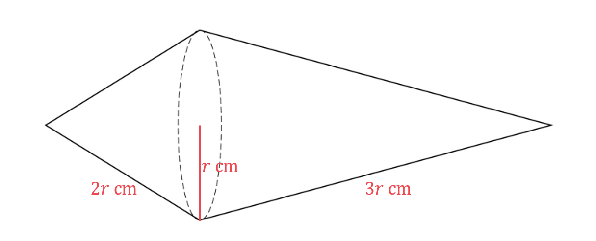

> *The total surface area of the solid shape is made up of the two curved surface areas of each cone added together.  Substitute the radius and slant height for each into the given formula for the curved surface area, *$πrl$*.*

`table row cell CSA subscript smaller space cone end subscript end cell equals cell pi cross times r cross times 2 r space equals space 2 r squared pi end cell end table`

`table row cell CSA subscript bigger space cone end subscript end cell equals cell pi cross times r cross times 3 r space equals 3 r squared pi end cell end table`

**Either expression correct ****[1]**

> *Add the two curved surface areas together to form an expression for the total surface area of the shape.*

`table row cell 2 pi r squared space plus space 3 pi r squared space end cell equals cell space 5 pi r squared end cell end table`

> *Form an equation by setting this expression equal to the value given for the total surface area of the shape.*

$5πr^{2}=57.8π$

**[1]**

> *Solve by first dividing both sides by **π.*

`table row cell 5 r squared space end cell equals cell space 57.8 end cell end table`

> *Divide both sides by 5.*

`table row cell r squared space end cell equals cell space fraction numerator 57.8 over denominator 5 end fraction space equals space 11.56 end cell end table`

> *Square root both sides.*

`table row cell r space end cell equals cell space square root of 11.56 end root space equals space 3.4 end cell end table`

$r=3.4\mathrm{cm}$* ***[1]**

## Q68 — very_hard — 5 marks · exam-questions

### 14() — 5 marks
> *The height of the cylinder is *$6r-5r=r$*. Find an expression for the volume of the cylinder in terms of *$r$*, by substituting the expression for the radius, *$r$*, and the height, *$r$*, into the formula for the volume of a cylinder, *$V=πr^{2}h$*.*

`table row cell straight V subscript cylinder space end cell equals cell space pi space cross times space r squared space cross times space r space equals space pi r cubed end cell end table`

**[1]**

> *Find an expression for the volume of the cone in terms of *$r$*, by substituting the expression for the radius, *$r$*, and the height, *$5r$*, into the formula for the volume of a cone, *$V=\frac{1}{3}πr^{2}h$*.*

`table row cell straight V subscript cone space end cell equals cell space 1 third cross times pi space cross times space r squared space cross times space 5 r space equals space 5 over 3 pi r cubed end cell end table`

> *Find an expression for the total volume of the decoration in terms of *$r$*, by adding the expression for the volume of the cone to the expression for the volume of the cylinder. *

`table row cell straight V space end cell equals cell space pi r cubed space plus space 5 over 3 pi r cubed end cell end table`

**[1]**

> *Simplify.*

`table row cell straight V space end cell equals cell space 8 over 3 pi r cubed end cell end table`

> *Form an equation for the total volume of the decoration by setting this expression equal to 225 cm**3**. *

`table row cell 8 over 3 pi r cubed space end cell equals cell space 225 end cell end table`

**[1]**

> *Solve the equation by multiplying by 3 and dividing by 8.  *

`table row cell pi r cubed space end cell equals cell space fraction numerator 225 space cross times space 3 over denominator 8 end fraction equals 675 over 8 space end cell end table`

> *Divide both sides by **π**.*

`table row cell r cubed space end cell equals cell fraction numerator 675 over denominator 8 pi end fraction space end cell end table`

> *Take the cube root of both sides.*

`table row cell r space end cell equals cell space root index space 3 of fraction numerator 675 over denominator 8 pi end fraction space end root end cell end table`

**[1]**

`table row cell r space end cell equals cell space 2.99470906.... end cell end table`

> *Round the final answer to 3 significant figures.*

$r=2.99\mathrm{cm}$* ***[1]**

## Q69 — very_hard — 5 marks · exam-questions

### 14() — 5 marks
> *Use the formula *$πr^{2}h$* to find the volume of the **cylinder**, which has known dimensions*

$π\times2^{2}\times9=36π\mathrm{cm}^{3}$

**[1]**

> *The ratio of *$r:h$* is 1:4, which means that *$h$* is 4 times bigger than *$r$

$h=4r$

$h=4r$** ****or**** **$r=\frac{1}{4}h$** [1]**

*The formula for the volume of a cone is *$\frac{1}{3}πr^{2}h$ *Find the volume of the cone, using *$4r$* in place of *$h$ *Also recall that the cone has the same volume as the cylinder, 36π cm**3*

$\frac{1}{3}\timesπ\timesr^{2}\times4r=36π$

**Forming equation in terms of only **$r$** or only **$h$** ****[1]**

> *Simplify and divide both sides by π*

$\frac{1}{3}\times4r^{3}=36$

> *Multiply both sides by 3*

$4r^{3}=108$

**Method for solving the equation**** [1]**

> *Divide both sides by 4*

$r^{3}=27$

> *Find the cube-root of both sides*

`r equals cube root of 27 equals 3`

**3 cm** **[1]**

## Q70 — very_hard — 4 marks · exam-questions

### 13() — 4 marks
> *The best method is to begin by rearranging the formula for the volume of a sphere, *$v=\frac{4}{3}πr^{3}$*, to make *$r$* the subject.*

$v=\frac{4}{3}πr^{3}$

> *Divide both sides by *$\frac{4}{3}π$*. *

$\frac{v}{\frac{4}{3}π}=r^{3}$

> *Simplify the left-hand side.*

`table row cell v space divided by space fraction numerator 4 straight pi space over denominator 3 end fraction end cell equals cell space r cubed end cell row cell v space cross times space fraction numerator 3 over denominator 4 straight pi end fraction space end cell equals cell space r cubed end cell row cell r cubed space end cell equals cell space fraction numerator space 3 v over denominator 4 straight pi end fraction end cell end table`

> *Take the cube root of both sides.*

`table row cell r space end cell equals cell space cube root of fraction numerator space 3 v over denominator 4 straight pi end fraction end root end cell end table`

**[1]**

> *Substitute the volume of Earth into the formula found for the radius.*

`table row cell r subscript E space end cell equals cell space cube root of fraction numerator space 3 open parentheses 1.08 space cross times space 10 to the power of 12 close parentheses space over denominator 4 pi end fraction end root end cell end table`

> *Type directly into your calculator using the cube root, fraction and **π** button.*

`table row cell straight r subscript straight E space end cell equals cell space cube root of fraction numerator space 3 open parentheses 1.08 space cross times space 10 to the power of 12 close parentheses space over denominator 4 straight pi end fraction end root space equals space 6364.7065... end cell end table`

**[1]**

> *Substitute the volume of Jupiter into the formula found for the radius.*

`table row cell r subscript J space end cell equals cell space cube root of fraction numerator space 3 open parentheses 1.43 space cross times space 10 to the power of 15 close parentheses space over denominator 4 pi end fraction end root end cell end table`

> *Type directly into your calculator using the cube root, fraction and **π** button.*

`table row cell r subscript J space end cell equals cell space cube root of fraction numerator space 3 open parentheses 1.43 space cross times space 10 to the power of 15 close parentheses space over denominator 4 pi end fraction end root space equals space 69890.1237... end cell end table`

**[1]**

> *Find how many times bigger the radius of Jupiter is than the radius of Earth by dividing the radius of Jupiter by the radius of Earth. *

`table row blank blank cell fraction numerator r subscript J space over denominator r subscript E end fraction end cell end table space table row blank equals blank end table table row blank blank space end table table row blank blank cell fraction numerator 69890.1237... over denominator 6364.7065... end fraction end cell end table table row blank blank space end table table row blank equals blank end table table row blank blank space end table table row blank blank 10 end table table row blank blank. end table table row blank blank 98 end table table row blank blank. end table table row blank blank. end table table row blank blank. end table`

> *Rounding to 3 significant figures here gives 11.0, so an answer of 11 is acceptable.*

$11$* ***[1]**

## Q71 — very_hard — 5 marks · exam-questions

### 23() — 5 marks
> *Find the length of a side of the smaller square by calculating the scale factor between the small pyramid and the large pyramid*

$45\div15=3$

> *Length of the side of the smaller square:*

*39 ÷ 3 = 13 cm*

> *Calculate the area of the two squares*

$39^{2}+13^{2}=1690$

**[M1]**

> *Calculate the perpendicular height of one of the triangular faces of the large pyramid using Pythagoras' theorem*

`table row cell 45 squared space plus space open parentheses 39 divided by 2 close parentheses squared space end cell equals cell space h squared end cell row cell square root of 45 squared space plus space 19.5 squared end root space end cell equals cell space h end cell row cell 49.0433... space end cell equals cell space h end cell end table`

**[M1]**

> *The perpendicular height of the sloping faces of the frustum is 2/3 of this height*

> *Calculate the area of one of the trapezium faces*

`A space equals fraction numerator space 1 over denominator 2 end fraction open parentheses a space plus thin space b close parentheses h
A space equals fraction numerator space 1 over denominator 2 end fraction open parentheses 13 space plus thin space 39 close parentheses space cross times open parentheses 2 over 3 cross times 49.0433... close parentheses
A space equals space 850.0847...`

**[M1]**

> *Calculate the total area*

*4 × 850.0847... + 1690 = 5090.3388...*

**[M1]**

> *Round to the nearest whole number*

**Final answer:** **5090 cm****2**

**[A1]**

> **[mark-scheme]**
> **A1**: Answers in the range 5090-5091 will get this final mark.

## Q72 — very_hard — 5 marks · exam-questions

### 23() — 5 marks
> *Work out the volume of the large cone*

$V=\frac{1}{3}\timesπ\times6^{2}\times15\,V=180π$

**[M1]**

> *The ratio of the height of the small cone to the radius of the small cone will be the same as the ratio of the height of the large cone to the radius of the large cone*

$x:h=6:15$

> *Form a formula for *$x$* and *$h$

`table row cell 6 h space end cell equals cell space 15 x end cell row cell space space h space end cell equals cell fraction numerator space 15 x over denominator 6 end fraction space end cell row blank equals cell fraction numerator space 5 x over denominator 2 end fraction end cell end table`

**[M1]**

> *Work out an expression for the volume of the small cone*

$V=\frac{1}{3}\timesπ\timesx^{2}\timesh\,V=\frac{1}{3}\timesπ\timesx^{2}\times\frac{5}{2}x\,V=\frac{5}{6}πx^{3}$

**[M1]**

> *The volume of the frustum is the volume of the large cone subtract the volume of the small cone*

$\frac{4212}{25}π=180π-\frac{5}{6}πx^{3}$

> *Divide through by *$π$

$\frac{4212}{25}=180-\frac{5}{6}x^{3}$

**[M1]**

> *Rearrange*

`table row cell 5 over 6 x cubed space end cell equals cell space 180 space minus space 4212 over 25 end cell row blank equals cell fraction numerator space 288 over denominator 25 end fraction end cell end table`

> *Divide both sides by *$\frac{5}{6}$

$x^{3}=\frac{1728}{125}$

> *Take the cube root of both sides*

$x=\frac{12}{5}$

$x=\frac{12}{5}$

**[A1]**
