# Exam Questions — Volume & Surface Area
**Geometry & Trigonometry** · Edexcel IGCSE Maths A (4MA1) — 18/Higher
> Source: [https://www.savemyexams.com/igcse/maths/edexcel/a/18/higher/topic-questions/4-geometry-and-trigonometry/volume-and-surface-area/exam-questions/](https://www.savemyexams.com/igcse/maths/edexcel/a/18/higher/topic-questions/4-geometry-and-trigonometry/volume-and-surface-area/exam-questions/) · 72 questions · total 289 marks

## Q1 — easy — 3 marks · exam-questions

### 9() — 3 marks — command: work_out — structured — from paper November 2012 · 1MA0/1H
The diagram shows a prism.

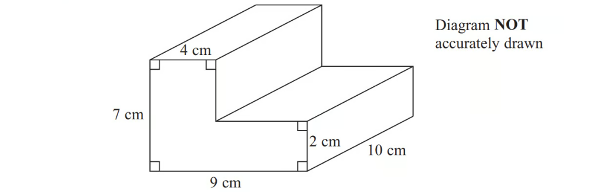

Work out the volume of the prism.

## Q2 — easy — 4 marks · exam-questions

### 3() — 4 marks — command: work_out — structured — from paper November 2013 · 1MA0/1H
Here is a triangular prism.

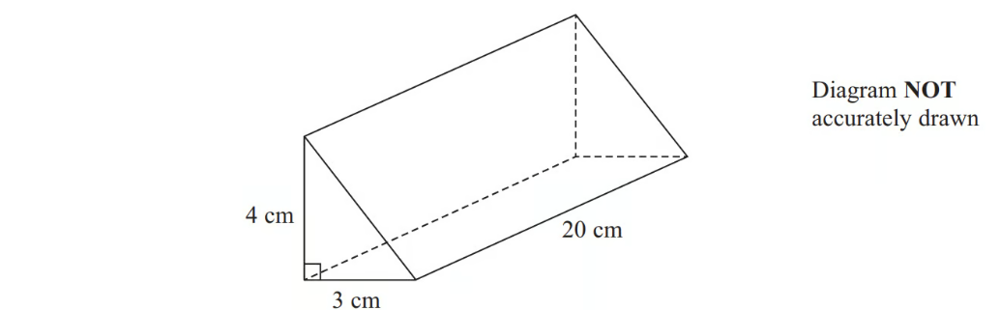

Work out the volume of this triangular prism.

## Q3 — easy — 3 marks · exam-questions

### 1() — 3 marks — command: work_out — structured — from paper June 2016 · 1MA0/1H
The diagram shows a prism.

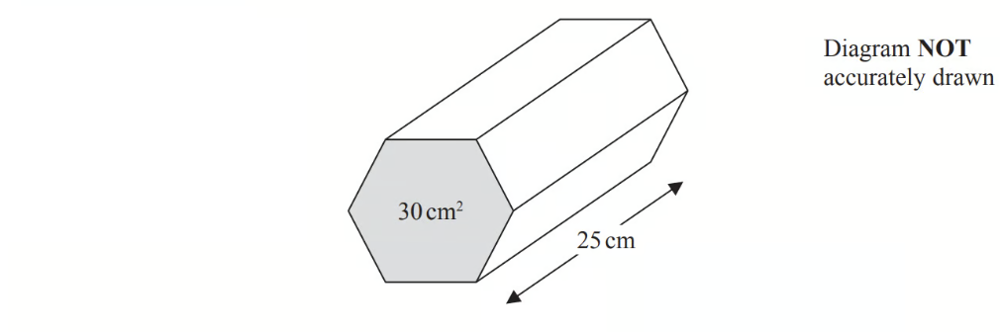

The area of the cross section of the prism is 30 cm2. 
The length of the prism is 25 cm.

Work out the volume of the prism.

## Q4 — easy — 3 marks · exam-questions

### 1() — 3 marks — command: work_out — structured — from paper June 2013 · 1MA0/2H
Here is a cuboid.

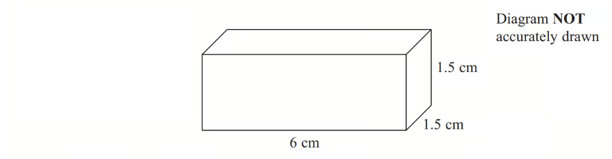

The cuboid is 6 cm by 1.5 cm by 1.5 cm.

Work out the total surface area of the cuboid.

## Q5 — easy — 3 marks · exam-questions

### 5((a)) — 3 marks — command: work_out — structured — from paper Jan 2021 · 4MA1/1HR
The diagram shows a cuboid and a cylinder.

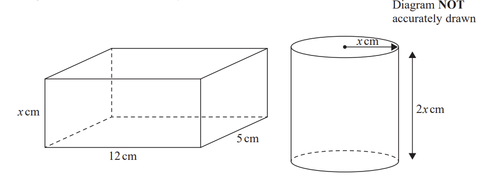

The dimensions of the cuboid are$x$cm by 12 cm by 5 cm. 
The volume of the cuboid is 270 cm3

The radius of the cylinder is $x$cm. 
The height of the cylinder is $2x$ cm.

Work out the volume of the cylinder.
Give your answer correct to the nearest whole number.

...................................................... cm3

## Q6 — easy — 2 marks · exam-questions

### 4() — 2 marks — command: work_out — structured — from paper June 2019 · 4MA1/2H
A cylinder has diameter 14 $\mathrm{cm}$ and height 20 $\mathrm{cm}$.

Work out the volume of the cylinder. 
Give your answer correct to 3 significant figures.

.........................$\mathrm{cm}^{3}$

## Q7 — easy — 2 marks · exam-questions

### 6((a)) — 2 marks — command: work_out — structured — from paper June 2018 · 4MA1/2H
A cylinder has height 1.6 m and radius 0.56 m.  
Work out the curved surface area of the cylinder. 
Give your answer in m2 correct to 3 significant figures.

....................................................... m2

## Q8 — easy — 5 marks · exam-questions

### 10() — 5 marks — command: work_out — structured — from paper June 2021 · 4MA1/2H
Here is a triangular prism.

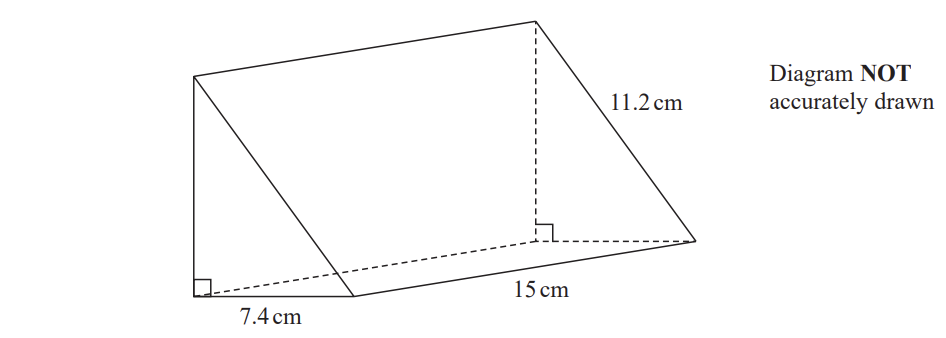

Work out the volume of the prism.

Give your answer correct to 3 significant figures.

....................................................... cm3

## Q9 — easy — 1 marks · exam-questions

### 2() — 1 mark — command: circle — structured — from paper Nov 2018 · 8300/1H
Circle the volume, in cm3 , of a cylinder with radius 5 cm and height 8 cm.

| $40π$ | $80π$ | $200π$ | $1600π$ |
|---|---|---|---|

## Q10 — easy — 2 marks · exam-questions

### 13() — 2 marks — command: evaluate — structured — from paper Nov 2018 · 8300/2H
Ashraf is going to put boxes into a crate.

The crate is a cuboid measuring 2.5 m by 2 m by 1.2 m
   Each box is a cube of length 50 cm

He does these calculations.

| `table row cell volume space of space crate space end cell equals cell space 2.5 space cross times space 2 space cross times space 1.2 space end cell row blank equals cell space 6 space straight m to the power of 3 space space end exponent end cell row cell volume space of space one space box space end cell equals cell space 0.5 space cross times space 0.5 space cross times space 0.5 space end cell row blank equals cell space 0.125 space straight m cubed space end cell row cell number space of space boxes space end cell equals cell space 6 space divided by space 0.125 space end cell row blank equals cell space 48 end cell end table` |
|---|

He claims,

‘‘I can put 48 boxes in the crate.’’

Evaluate Ashraf’s method **and** claim.

## Q11 — easy — 2 marks · exam-questions

### 16((b)) — 2 marks — command: work_out — structured — from paper June 2018 · 8300/2H
3.8 m3 of concrete is made into the shape of a cylinder.

The base has radius 0.5 metres.

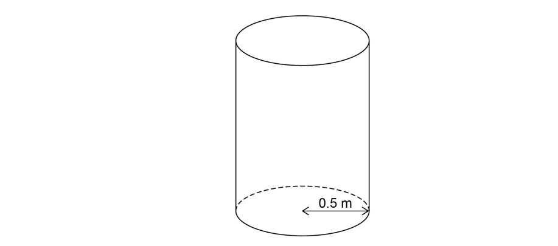

Work out the height of the cylinder.

................................m

## Q12 — easy — 1 marks · exam-questions

### 6((a)) — 1 mark — command: give — structured — from paper Nov 2017 · 8300/2H
The graph shows information about prisms with the same volume.

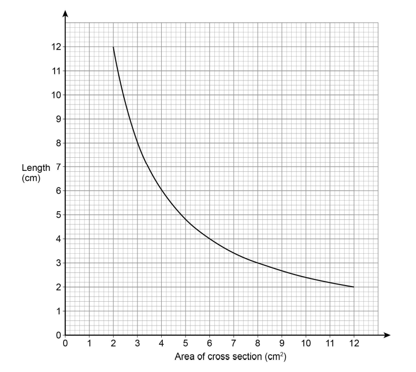

Give **one** example to show the volume is 24 cm3

## Q13 — easy — 2 marks · exam-questions

### 22() — 2 marks — command: evaluate — structured — from paper Specimen 2015 · 8300/1H
Steph is solving a problem. 
Cube A has a surface area of 150 cm2 
Cube B has sides half the length of cube A

What is the volume of cube B?

To solve this problem, Steph decides to

- halve the surface area
- calculate the square root of the answer
- then divide by 6
- then cube this answer to work out the volume.

Evaluate Steph’s method.

## Q14 — easy — 2 marks · exam-questions

### 18() — 2 marks — command: calculate — structured — from paper Nov 2019 · J560/04
The diagram shows a right-angled triangular prism ABCDEF.

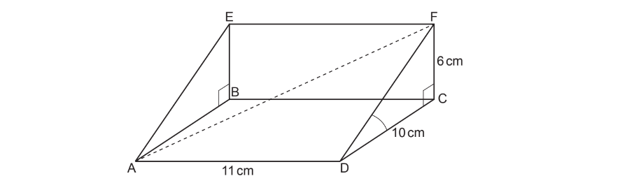

Length AD = 11 cm, length CD = 10 cm and length CF = 6 cm.

Calculate the volume of the prism.

................................................... cm3

## Q15 — easy — 3 marks · exam-questions

### 15() — 3 marks — command: calculate — structured — from paper Nov 2017 · J560/06
The following formula is for the area, $A$, of the curved surface area of a cone.
 $A=πrl$, where $r$ is the radius and$l$ is the slant height of the cone.

Calculate the **total** surface area of a cone with radius 5cm and slant height 12cm.

................ cm2

## Q16 — easy — 4 marks · exam-questions

### 2((a)) — 2 marks — command: calculate — structured — from paper June 2017 · J560/04
A circular table top has radius 70 cm.

Calculate the area of the table top in cm2, giving your answer as a multiple of$π$.

....................... cm2

### 2((b)) — 2 marks — command: calculate — structured — from paper Specimen 2015 · J560/04
The volume of the table top is 17 150$π$ cm3.

Calculate the thickness of the table top.

........................ cm

## Q17 — easy — 4 marks · exam-questions

### 9() — 4 marks — command: which — structured — from paper Nov 2019 · 8300/1H
Here are two solids.

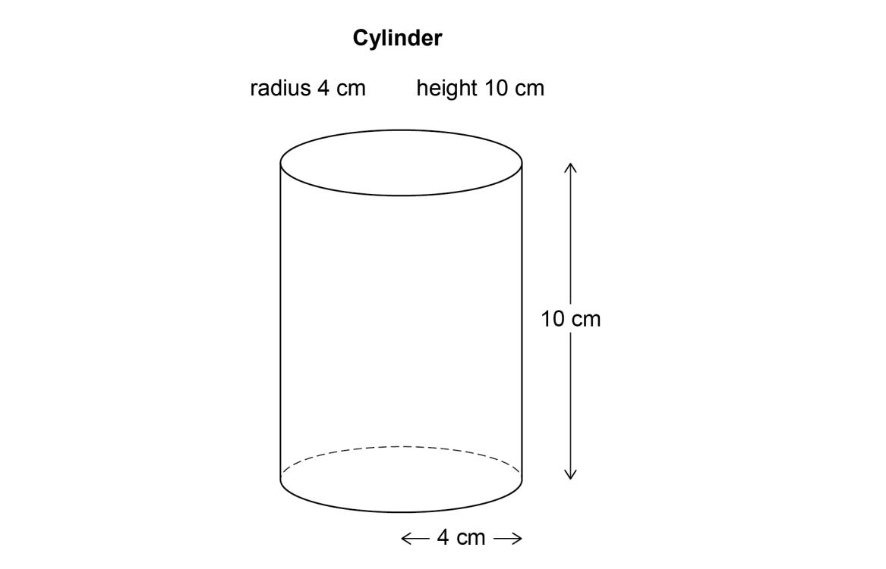

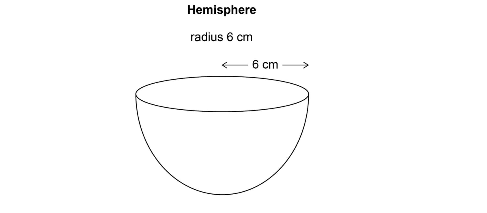

Which solid has the greater volume?

You **must **show your working.

## Q18 — medium — 5 marks · exam-questions

### 11() — 5 marks — command: work_out — structured — from paper June 2014 · 1MA0/2H
Here is a plan of Martin's driveway.

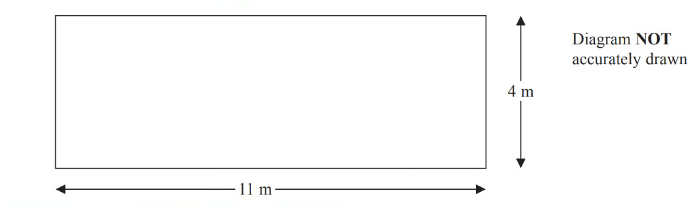

Martin is going to cover his driveway with gravel. The gravel will be 6 cm deep.

Gravel is sold in bags.
There are 0.4 m3 of gravel in each bag.
Each bag of gravel costs £38

Martin gets a discount of 30% off the cost of the gravel.

Work out the total amount of money Martin pays for the gravel.

## Q19 — medium — 4 marks · exam-questions

### 9() — 4 marks — structured — from paper 2015	November · 1MA0/1H
The diagram shows a container for oil.

The container is in the shape of a cuboid.
The container is empty.

Sally has to fill the container with oil.
A bottle of oil costs £3.50
There are 3000 cm3 of oil in each bottle.

Sally must **not** spend more than £60 buying the oil.

Can Sally buy enough oil to fill the container?
 You must show all your working.

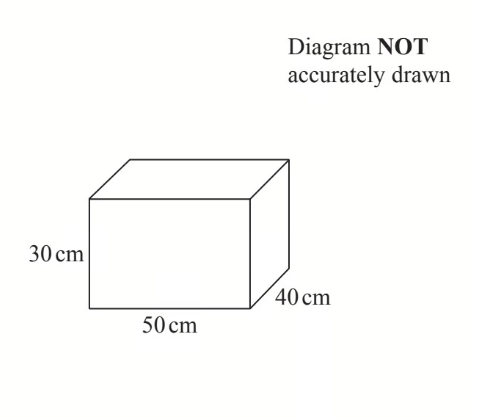

## Q20 — medium — 3 marks · exam-questions

### 12() — 3 marks — command: work_out — structured — from paper June 2012 · 1MA0/1H
Jane has a carton of orange juice.

The carton is in the shape of a cuboid.

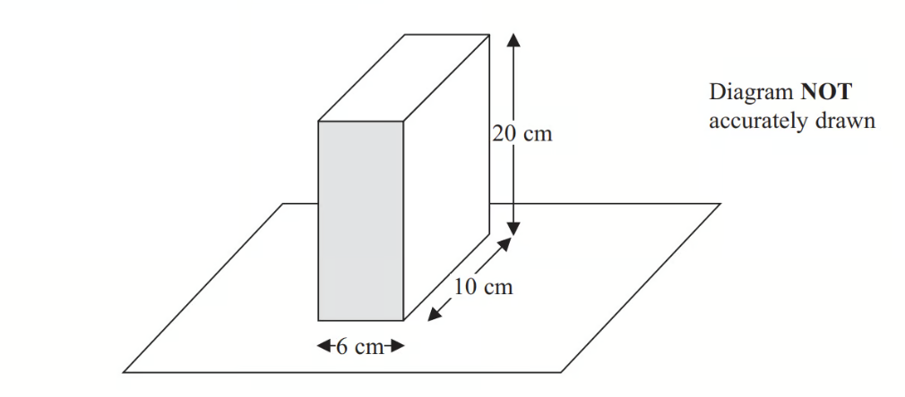

The depth of the orange juice in the carton is 8 cm.

Jane closes the carton. 
Then she turns the carton over so that it stands on the shaded face.

Work out the depth, in cm, of the orange juice now.

## Q21 — medium — 3 marks · exam-questions

### 9() — 3 marks — command: work_out — structured — from paper March 2013 · 1MA0/2H
Here is a solid prism.

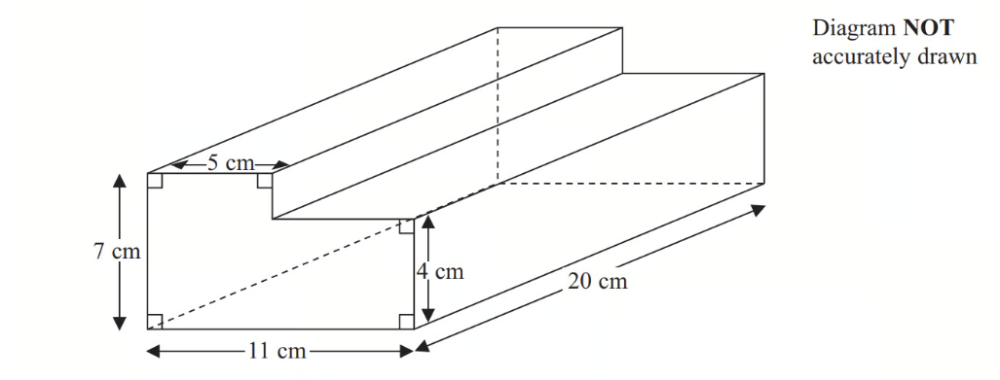

Work out the volume of the prism.

## Q22 — medium — 4 marks · exam-questions

### 1() — 4 marks — command: work_out — structured
A container is made from a hemisphere on top of a cylinder, as shown in the diagram.

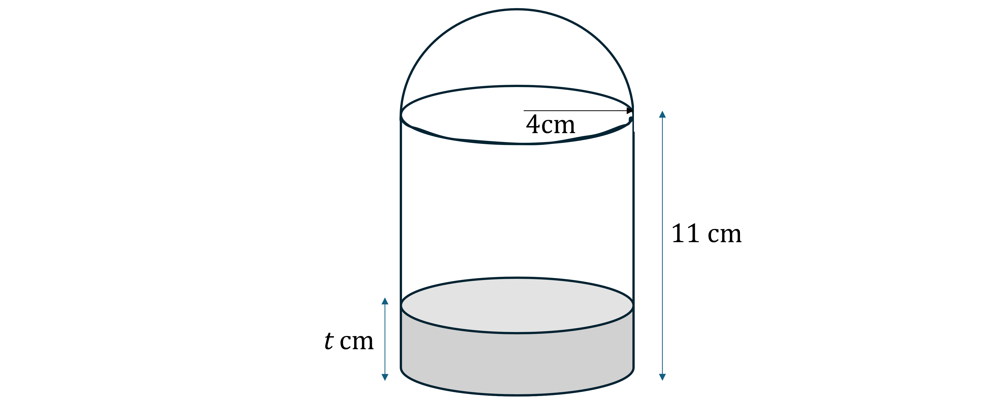

The hemisphere and the cylinder both have radius 4 cm.

The height of the cylinder is 11 cm.

There is water to a depth of $t$ cm in the cylinder.

The volume of water in the container is a quarter of the total volume of the container.

Work out the value of $t$.

## Q23 — medium — 3 marks · exam-questions

### 24() — 3 marks — command: calculate — structured — from paper November 2013 · 1MA0/2H
The diagram shows a large tin of pet food in the shape of a cylinder.

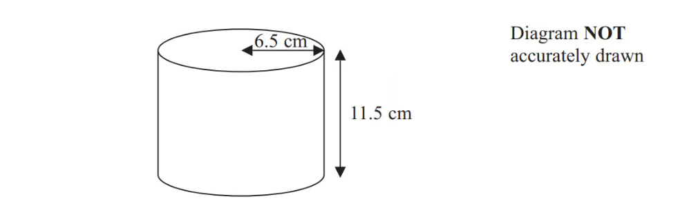

The large tin has a radius of 6.5 cm and a height of 11.5 cm.

A pet food company wants to make a new size of tin.

The new tin will have a radius of 5.8 cm.
It will have the same volume as the large tin.

Calculate the height of the new tin.
Give your answer correct to one decimal place.

## Q24 — medium — 3 marks · exam-questions

### 25() — 3 marks — command: calculate — structured — from paper June 2014 · 1MA0/2H
The diagram shows a solid made from a hemisphere and a cone.

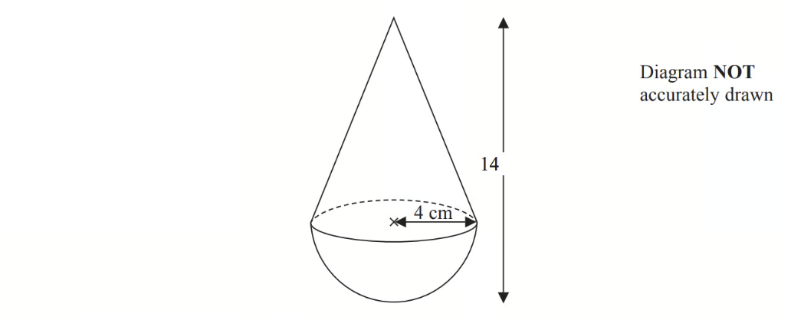

The radius of the hemisphere is 4 cm.
The radius of the base of the cone is 4 cm.

Calculate the volume of the solid.
Give your answer correct to 3 significant figures.

## Q25 — medium — 3 marks · exam-questions

### 5() — 3 marks — command: work_out — structured — from paper June 2015 · 1MA0/1H
Jane makes cheese. The cheese is in the shape of a cuboid.

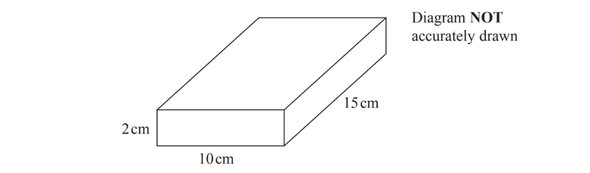

Jane is going to make a new cheese.

The new cheese will also be in the shape of a cuboid. 
The cross section of the cuboid will be a 5 cm by 5 cm square.

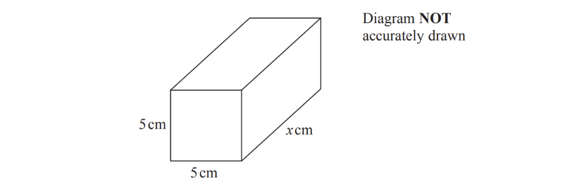

Jane wants the new cuboid to have the same volume as the 2 cm by 10 cm by 15 cm cuboid.

Work out the value of $x$.

## Q26 — medium — 4 marks · exam-questions

### 21() — 4 marks — structured — from paper November 2016 · 1MA0/2H
Anne wants to fill 12 hanging baskets with compost.

Each hanging basket is a hemisphere of diameter 40 cm.

Anne has 4 bags of compost. 
There are 50 litres of compost in each bag.

Has Anne got enough compost to fill the 12 hanging baskets?

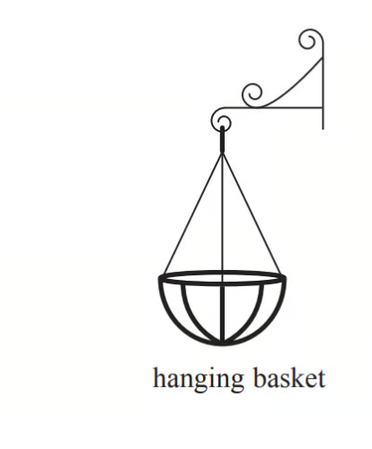

## Q27 — medium — 3 marks · exam-questions

### 23() — 3 marks — command: find — structured — from paper March 2013 · 1MA0/1H
The diagram shows a solid hemisphere of radius 5 cm.

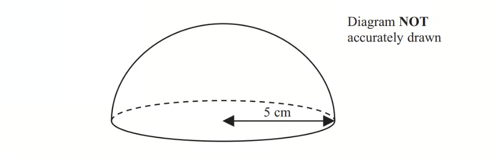

Find the **total** surface area of the solid hemisphere.
  Give your answer in terms of $π$.

## Q28 — medium — 5 marks · exam-questions

### 20() — 5 marks — command: work_out — structured — from paper November 2014 · 1MA0/1H
The diagram shows a solid shape.

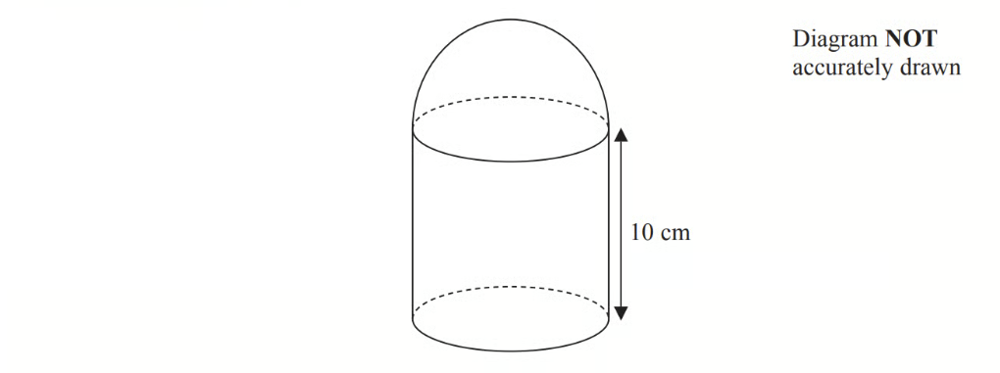

The solid shape is made from a cylinder and a hemisphere. 
The radius of the cylinder is equal to the radius of the hemisphere.

The cylinder has a height of 10 cm.
The curved surface area of the hemisphere is 32$π$ cm2

Work out the total surface area of the solid shape. 
Give your answer in terms of $π$.

## Q29 — medium — 5 marks · exam-questions

### 5() — 5 marks — command: prove — structured — from paper Spec1 2015 · 1MA1/1H
The diagram shows a sand pit.
The sand pit is in the shape of a cuboid.

Sally wants to fill the sand pit with sand.
A bag of sand costs £2.50 
There are 8 litres of sand in each bag.

Sally says,

"The sand will cost less than £70"

Show that Sally is wrong.

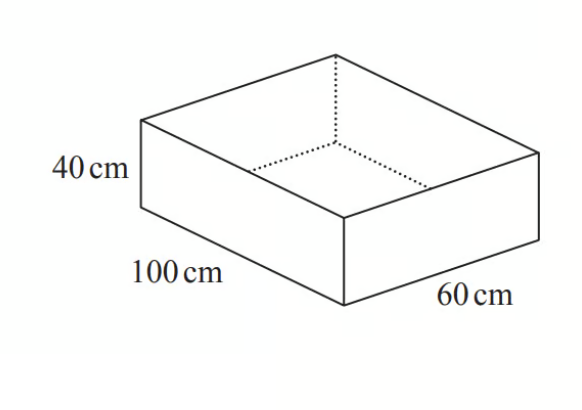

## Q30 — medium — 4 marks · exam-questions

### 15() — 4 marks — command: work_out — structured — from paper June 2019 · 1MA1/1H
The diagram shows a solid shape. 
The shape is a cone on top of a hemisphere.

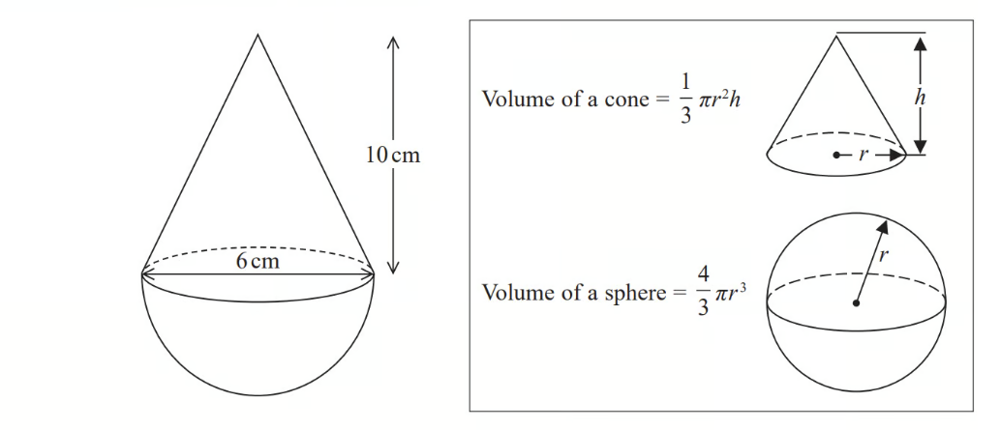

The height of the cone is 10 cm. 
The base of the cone has a diameter of 6 cm. 
The hemisphere has a diameter of 6 cm.

The total volume of the shape is $k\mathrm{πcm}^{3}$, where $k$ is an integer.

Work out the value of $k$.

## Q31 — medium — 4 marks · exam-questions

### 4() — 4 marks — command: what — structured — from paper June 2019 · 1MA1/2H
A container is in the shape of a cuboid.

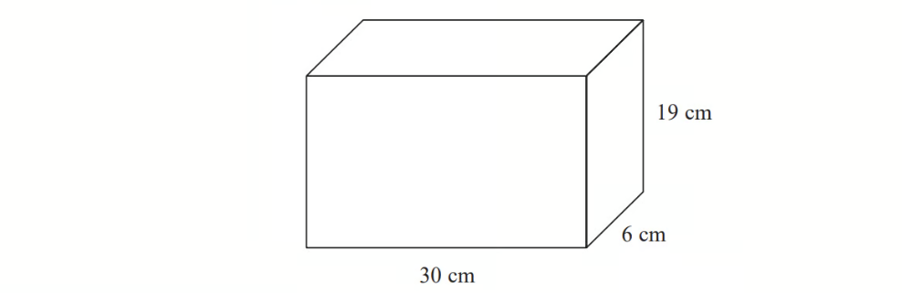

The container is $\frac{2}{3}$ full of water.

A cup holds 275 m$l$ of water.

What is the greatest number of cups that can be completely filled with water from the container?

## Q32 — medium — 5 marks · exam-questions

### 6() — 5 marks — structured — from paper June 2019 · 1MA1/3H
Jeremy has to cover 3 tanks completely with paint.

Each tank is in the shape of a cylinder with a top and a bottom.
The tank has a diameter of 1.6 m and a height of 1.8 m.

Jeremy has 7 tins of paint.
Each tin of paint covers 5 m2

Has Jeremy got enough paint to cover completely the 3 tanks?
You must show how you get your answer.

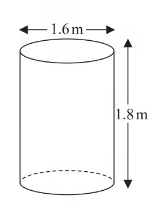

## Q33 — medium — 3 marks · exam-questions

### 7() — 3 marks — command: work_out — structured — from paper 2017	June · 1MA0/1H
Frances grows plants in a container. 
Each of the 5 faces of the container is made of glass.

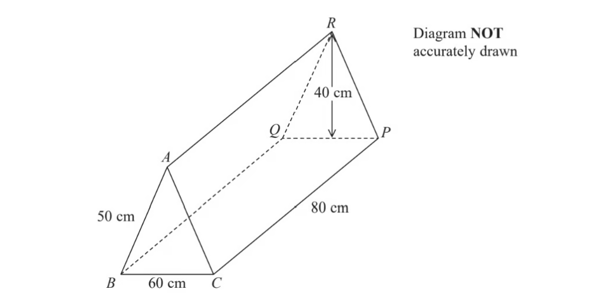

The container is in the shape of a prism.

The cross section of the prism is an isosceles triangle with height $40\mathrm{cm}$.

$BC=60\mathrm{cm}\,AB=AC=50\mathrm{cm}\,CP=80\mathrm{cm}$

Work out the total area of glass needed to make the container.

## Q34 — hard — 5 marks · exam-questions

### 1() — 5 marks — command: work_out — structured
A cone has a volume of 128.625$π$ cm3.

The radius of the base of the cone is equal to three times the height of the cone.

Work out the curved surface area of the cone. Give your answer correct to 3 significant figures.

## Q35 — hard — 3 marks · exam-questions

### 25() — 3 marks — command: find — structured — from paper June 2012 · 1MA0/1H
The diagram shows a solid metal cylinder.

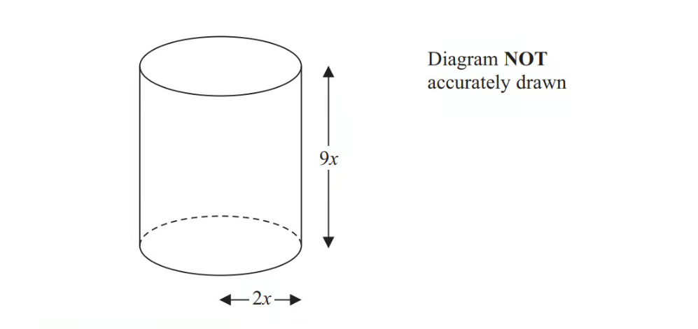

The cylinder has base radius $2x$ and height $9x$.

The cylinder is melted down and made into a sphere of radius $r$.

Find an expression for $r$ in terms of $x$.

## Q36 — hard — 4 marks · exam-questions

### 22() — 4 marks — command: work_out — structured — from paper March 2013 · 1MA0/2H
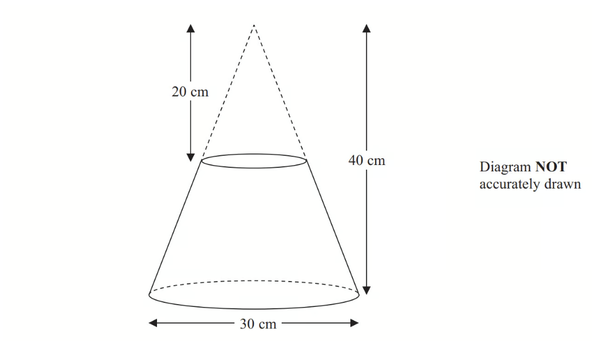

A frustrum is made by removing a small cone from a similar large cone.

The height of the small cone is 20 cm.
The height of the large cone is 40 cm. 
The diameter of the base of the large cone is 30 cm.

Work out the volume of the frustrum.
Give your answer correct to 3 significant figures.

## Q37 — hard — 4 marks · exam-questions

### 22() — 4 marks — command: find — structured — from paper November 2016 · 1MA0/1H
The diagram shows prism.

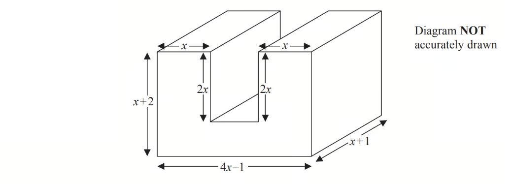

All measurements are in centimetres. 
All corners are right angles.

Find an expression, in terms of $x$, for the volume, in cm3, of the prism. 
You must show your working.

Give your answer in its simplest form.

## Q38 — hard — 5 marks · exam-questions

### 19() — 5 marks — command: find — structured — from paper June 2018 · 1MA1/2H
Shape **S** is one quarter of a solid sphere, centre $O$.

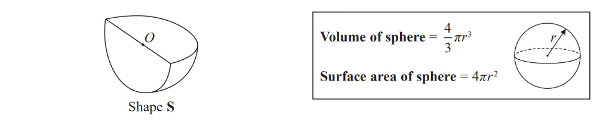

The volume of **S** is 576$π$ cm3.

Find the surface area of **S**. 
Give your answer correct to 3 significant figures.
You must show your working.

## Q39 — hard — 5 marks · exam-questions

### 16() — 5 marks — command: calculate — structured — from paper Sample 2015 · 1MA1/3H
$VABCD$ is a solid pyramid.

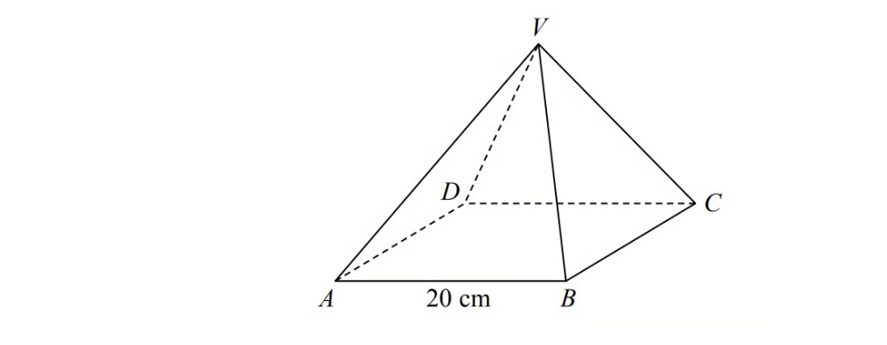

$ABCD$ is a square of side 20 cm.

The angle between any sloping edge and the plane $ABCD$ is $55^{\circ}$.

Calculate the surface area of the pyramid.
Give your answer correct to 2 significant figures.

## Q40 — hard — 4 marks · exam-questions

### 18() — 4 marks — command: work_out — structured — from paper Spec1 2015 · 1MA1/1H
The diagram shows a solid hemisphere.

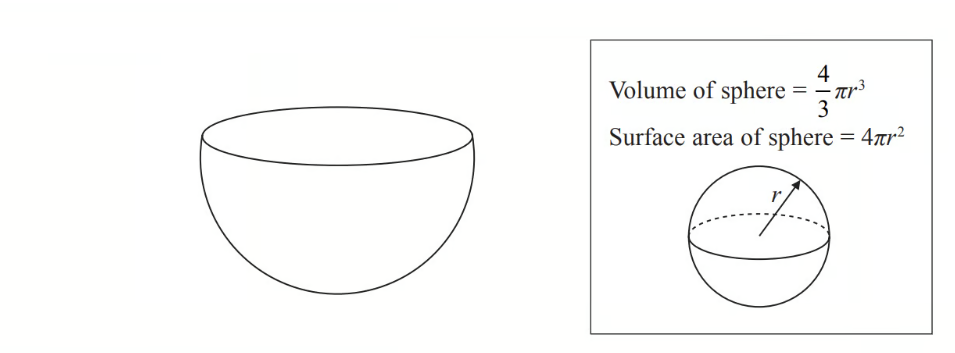

The volume of the hemisphere is $\frac{250}{3}π$

Work out the exact total surface area of the solid hemisphere. Give your answer as a multiple of $π$.

## Q41 — hard — 4 marks · exam-questions

### 12() — 4 marks — command: calculate — structured — from paper Spec1 2015 · 1MA1/3H
The diagram shows a cuboid $ABCDEFGH$.

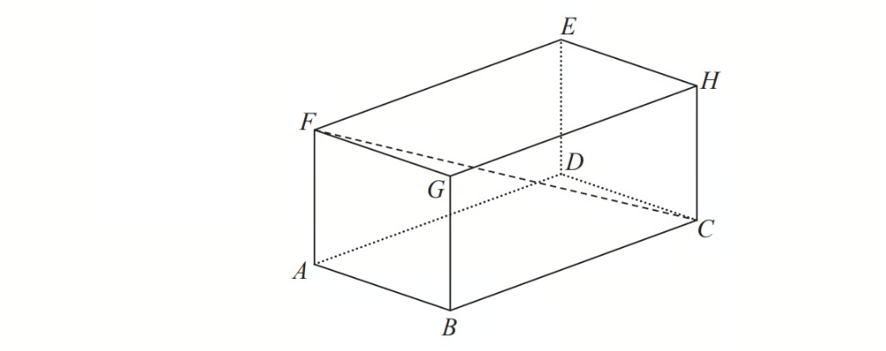

$AB=7\mathrm{cm},AF=5\mathrm{cm} \mathrm{and}FC=15\mathrm{cm}.$

Calculate the volume of the cuboid.
Give your answer correct to $3$ significant figures.

## Q42 — hard — 5 marks · exam-questions

### 19() — 5 marks — command: work_out — structured — from paper November 2015 · 1MA0/1H
The diagram shows a solid shape.

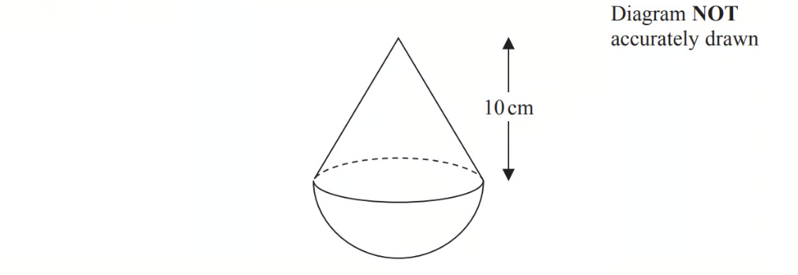

The solid shape is made from a hemisphere and a cone.
The radius of the hemisphere is equal to the radius of the base of the cone.

The cone has a height of 10 cm.
The volume of the cone is 270$π$ cm3.

Work out the total volume of the solid shape.
Give your answer in terms of $π$.

## Q43 — hard — 6 marks · exam-questions

### 8((a)) — 5 marks — command: work_out — structured — from paper Spec2 2015 · 1MA1/3H
The diagram shows an oil tan in the shape of a prism. 
The cross section of the prism is a trapezium.

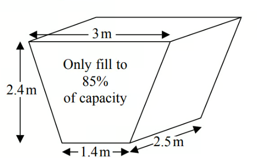

The tank is empty.

Oil flows into the tank. 
After one minute there are 300 litres of oil in the tank.

Assume that oil continues to flow into the tank at this rate.

Work out how many **more** minutes it takes for the tank to be 85% full of oil. (1m3 = 1000 litres)

### 8((b)) — 1 mark — command: explain — structured — from paper Spec2 2015 · 1MA1/3H
The assumption about the rate of flow of the oil could be wrong.

Explain how this could affect your answer to part (a).

## Q44 — hard — 6 marks · exam-questions

### 13((a)) — 5 marks — command: work_out — structured — from paper November 2014 · 1MA0/2H
The diagram shows a swimming pool in the shape of a prism.

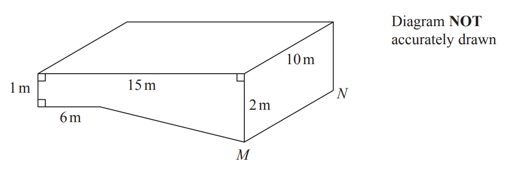

The swimming pool is empty.

The swimming pool is filled with water at a constant rate of 50 litres per minute.

Work out how long it will take for the swimming pool to be completely full of water. 
Give your answer in hours. (1 m3 = 1000 litres)

### 13((b)) — 1 mark — command: write — structured — from paper November 2014 · 1MA0/2H
Here are four graphs.

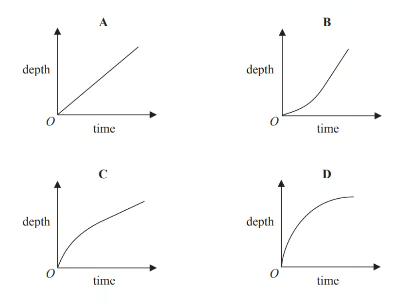

Write down the letter of the graph that best shows how the depth of the water in the pool above the line *MN* changes with time as the pool is filled.

## Q45 — hard — 6 marks · exam-questions

### 17() — 6 marks — command: work_out — structured — from paper 2013	June · 1MA0/1H
Sumeet has a pond in the shape of a prism.

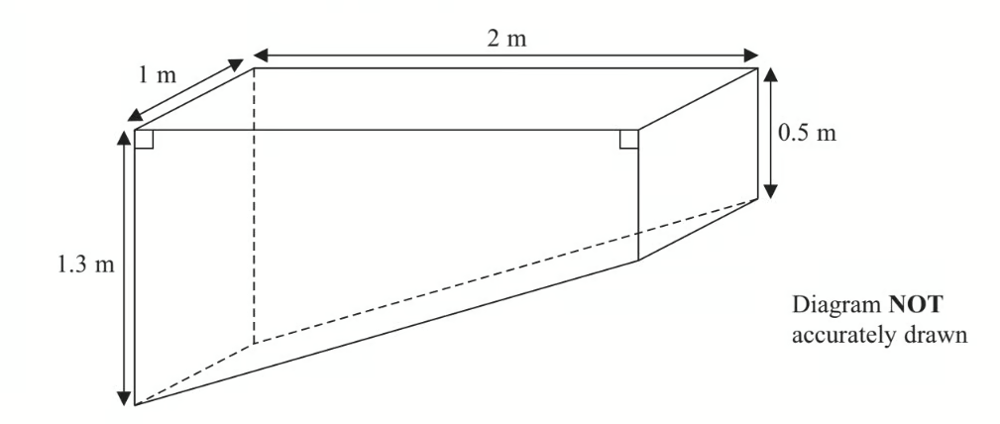

The pond is completely full of water.
Sumeet wants to empty the pond so he can clean it.
Sumeet uses a pump to empty the pond.

The volume of water in the pond decreases at a constant rate. The level of the water in the pond goes down by 20 cm in the first 30 minutes.

Work out how much more time Sumeet has to wait for the pump to empty the pond completely.

## Q46 — hard — 4 marks · exam-questions

### 6() — 4 marks — command: find — structured — from paper Nov 2020 · J560/04
A cuboid measures 6 cm by 8 cm by 15 cm.
A cube has the same volume as the cuboid.

Find the surface area of the cube, giving your answer correct to 3 significant figures.

.................................................... cm2 

## Q47 — hard — 5 marks · exam-questions

### 14() — 5 marks — command: calculate — structured — from paper June 2019 · J560/06
The length of the longest diagonal of a cube is 25cm.

Calculate the total surface area of the cube.

................................................... cm2

## Q48 — hard — 4 marks · exam-questions

### 18() — 4 marks — command: calculate — structured — from paper June 2019 · J560/06
A cone has radius *r* cm and height *h *cm.

The height is three times the radius. 
The volume of the cone is 2100 cm3.

Calculate the radius of the cone.

..................................................... cm

## Q49 — hard — 5 marks · exam-questions

### 6() — 5 marks — command: work_out — structured — from paper Nov 2018 · J560/04
The diagram shows a cylinder and a sphere.

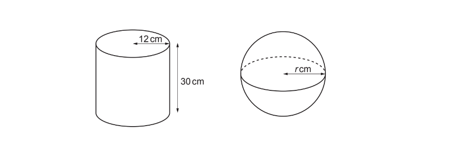

The cylinder has radius 12cm and height 30cm. 
The cylinder and the sphere have the same volume.

Work out the radius $r$ cm of the sphere.

....................... cm

## Q50 — hard — 4 marks · exam-questions

### 18() — 4 marks — command: work_out — structured — from paper Specimen paper · 4MA1/1H
A container is made from a hemisphere on top of a cylinder, as shown in the diagram.

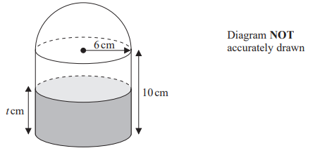

The hemisphere and the cylinder both have radius 6cm. 
The height of the cylinder is 10cm.

There is water to a depth of $t$ cm in the cylinder. 
The volume of water in the container is half the total volume of the container.

Work out the value of $t$

## Q51 — hard — 5 marks · exam-questions

### 20() — 5 marks — command: work_out — structured — from paper Specimen paper · 4MA1/2H
A cone has a volume of $562.5π\mathrm{cm}^{3}$.

The radius of the base of the cone is equal to twice the height of the cone.

Work out the curved surface area of the cone.

Give your answer correct to 3 significant figures.

## Q52 — very_hard — 5 marks · exam-questions

### 23() — 5 marks — command: work_out — structured — from paper June 2015 · 1MA0/1H
The diagram shows a container for grain.

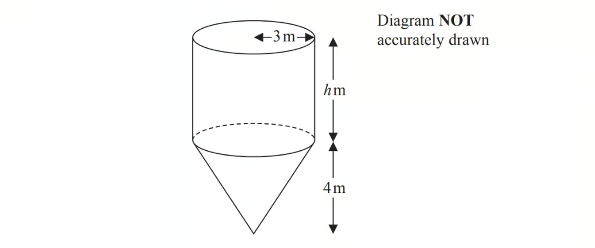

The container is a cylinder on top of a cone.
The cylinder has a radius of 3 m and a height of $h$m.
The cone has a base radius of 3 m and a vertical height of 4 m.

The container is empty.
The container is then filled with grain at a constant rate.

After 5 hours the depth of the grain is 6 metres above the vertex of the cone.
After 9 hours the container is full of grain.

Work out the value of $h$.
Give your answer as a fraction in its simplest form.
You must show all your working.

## Q53 — very_hard — 5 marks · exam-questions

### 27() — 5 marks — command: work_out — structured — from paper November 2016 · 1MA0/1H
The diagram shows a sphere and a solid cylinder.

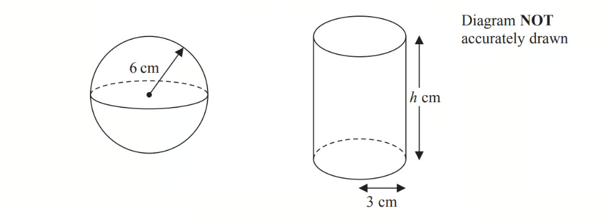

The sphere has radius 6 cm.
The solid cylinder has a base radius of 3 cm and a height of $h$ cm.

The total surface area of the cylinder is twice the total surface area of the sphere.

Work out the ratio of the volume of the sphere to the volume of the cylinder.
Give your answer in its simplest form.
You must show all your working.

## Q54 — very_hard — 5 marks · exam-questions

### 16() — 5 marks — structured — from paper June 2017 · 1MA0/2H
The diagram shows a swimming pool in the shape of a prism.

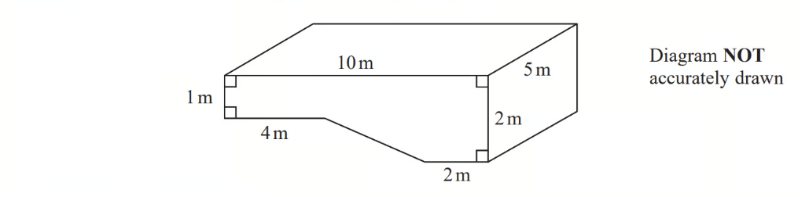

The swimming pool is empty.

Water from 3 water tankers is going to be put into the pool.
There are 20 000 litres of water in each water tanker.

Sam thinks that the surface of the water in the pool will be 10 cm below the top of the pool.

Is Sam correct? 
You must show how you get your answer. 
(1 m3 = 1000 litres)

## Q55 — very_hard — 5 marks · exam-questions

### 22() — 5 marks — command: work_out — structured — from paper Sample 2015 · 1MA1/2H
A frustum is made by removing a small cone from a large cone as shown in the diagram.

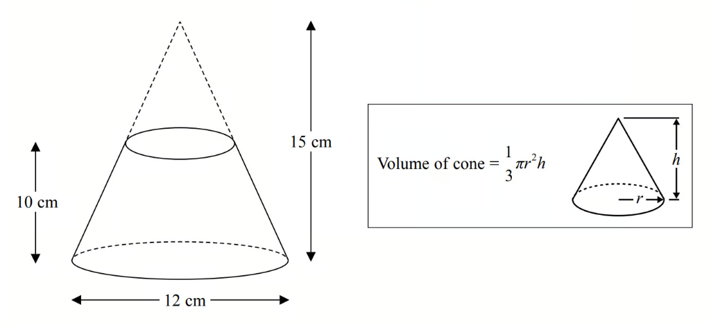

The frustum is made from glass. 
The glass has a density of 2.5 g / cm3

Work out the mass of the frustum. 
Give your answer to an appropriate degree of accuracy.

## Q56 — very_hard — 5 marks · exam-questions

### 17() — 5 marks — command: find — structured — from paper Spec1 2015 · 1MA1/3H
The diagram shows a solid cone.

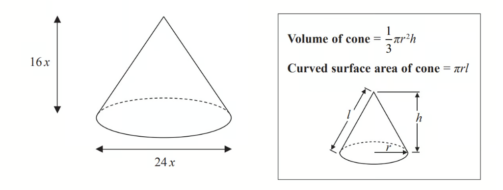

The diameter of the base of the cone is 24$x$ cm.
The height of the cone is 16$x$ cm.

The curved surface area of the cone is 2160$π$ cm2.
The volume of the cone is $Vπ$ cm3, where $V$ is an integer.

Find the value of $V$.

## Q57 — very_hard — 5 marks · exam-questions

### 11() — 5 marks — command: find — structured — from paper Spec2 2015 · 1MA1/1H
A solid is made by putting a hemisphere on top of a cone.

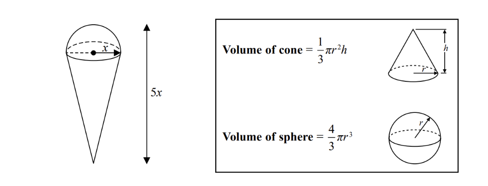

The total height of the solid is $5x.$

The radius of the base of the cone is $x.$

The radius of the hemisphere is $x.$

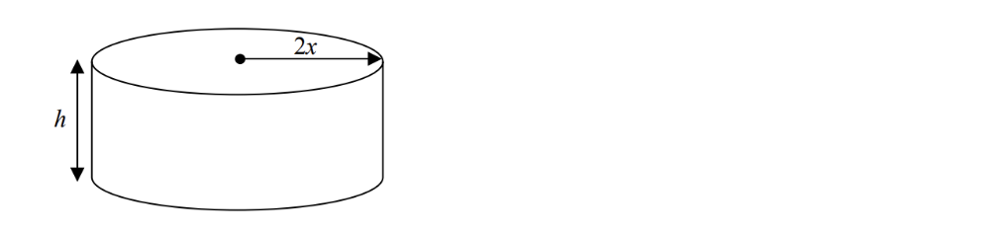

A cylinder has the same volume as the solid.
The cylinder has radius $2x$ and height $h.$
All measurements are in centimetres.

Find a formula for $h$ in terms of $x.$
Give your answer in its simplest form.

## Q58 — very_hard — 4 marks · exam-questions

### 16() — 4 marks — command: find — structured — from paper June 2018 · 4MA1/1H
A frustum is made by removing a small cone from a large cone. The cones are mathematically similar.

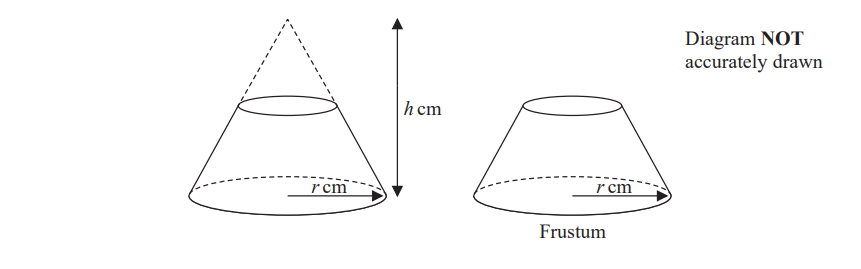

The large cone has base radius $r$ cm and height $h$ cm. Given that

$\frac{\mathrm{volume} \mathrm{of} \mathrm{frustum}}{\mathrm{volume} \mathrm{of} \mathrm{large} \mathrm{cone}}=\frac{98}{125}$

find an expression, in terms of $h$, for the height of the frustum.

....................................................... cm

## Q59 — very_hard — 6 marks · exam-questions

### 26() — 6 marks — command: calculate — structured — from paper Jan 2020 · 4MA1/2H
Here is a sector, $AOB$ , of a circle with centre $O$and angle $AOB$= $x^{\circ}$

The sector can form the curved surface of a cone by joining $OA$to $OB$ .

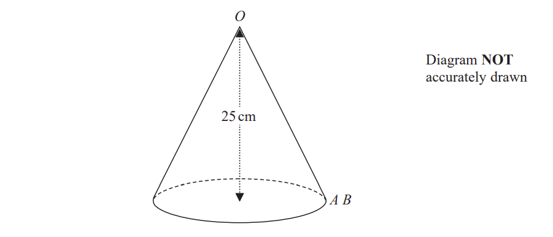

The height of the cone is $25\mathrm{cm}$.
The volume of the cone is $1600\mathrm{cm}^{3}$

Work out the value of $x.$ 
Give your answer correct to the nearest whole number.

$x=$.......................

## Q60 — very_hard — 5 marks · exam-questions

### 17() — 5 marks — command: find — structured — from paper Jan 2021 · 4MA1/1H
A solid, $S$, is made from a hemisphere and a cylinder.

The centre of the circular face of the hemisphere and the centre of the top face of the cylinder are at the same point.

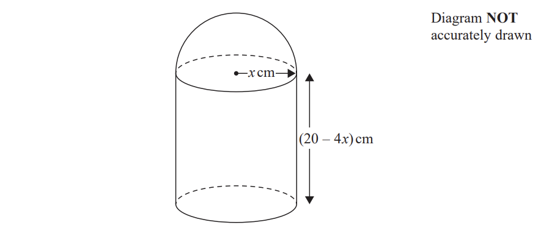

The radius of the cylinder and the radius of the hemisphere are both $x$ cm.

The height of the cylinder is $(20--4x)\mathrm{cm}.$

The volume of $S$ is $V$cm3 where $V=\frac{1}{3}πy$

Find the maximum value of $y$. 
Show clear algebraic working.

## Q61 — very_hard — 4 marks · exam-questions

### 17((a)) — 4 marks — command: work_out — structured — from paper Jan 2021 · 4MA1/2H
The diagram shows a solid prism $ABCDEFGH$.

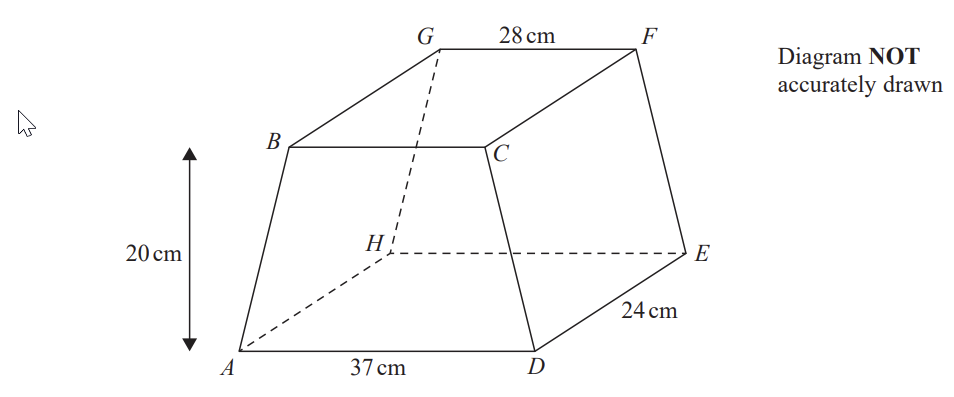

The trapezium $ABCD$, in which $AD$ is parallel to $BC$, is a cross section of the prism.

The base $ADEH$ of the prism is a horizontal plane.
$ADEH$ and $BCFG$ are rectangles.
The midpoint of $BC$ is vertically above the midpoint of $AD$ so that $BA=CD$.

$AD=37\mathrm{cm}$   $GF=28\mathrm{cm}$    $DE=24\mathrm{cm}$

The perpendicular distance between edges $AD$ and $BC$ is 20 $\mathrm{cm}$.

Work out the total surface area of the prism.

## Q62 — very_hard — 5 marks · exam-questions

### 9() — 5 marks — command: work_out — structured — from paper Jan 2020 · 4MA1/1HR
Pablo made a solid gold statue.

He melted down some gold blocks and used the gold to make the statue. 
Each block of gold was a cuboid, as shown below.

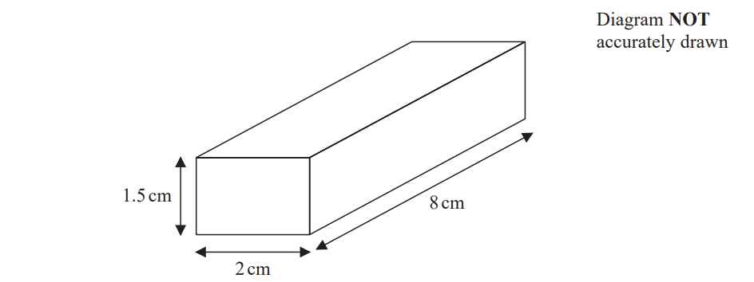

The mass of the statue is $5.73\mathrm{kg}.$
The density of gold is $19.32g/\mathrm{cm}^{3}$

Work out the least number of gold blocks Pablo melted down in order to make the statue.
Show your working clearly.

## Q63 — very_hard — 5 marks · exam-questions

### 18() — 5 marks — command: work_out — structured — from paper June 2018 · 8300/1H
Here is a tunnel for a toy train.

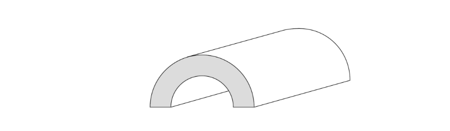

The diagram below shows the cross section of the tunnel.

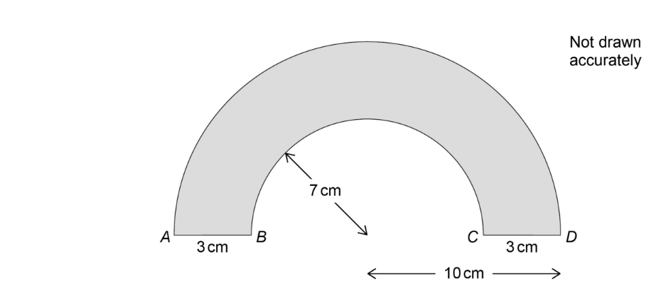

$AD$ is a semicircular arc of radius 10 cm 
$BC$ is a semicircular arc of radius 7 cm 
The length of the tunnel is 30 cm

Work out the total area of all **six** faces of the tunnel. 
Give your answer in terms of $π$.

....................cm2

## Q64 — very_hard — 4 marks · exam-questions

### 23() — 4 marks — command: work_out — structured — from paper Nov 2020 · 8300/2H
Right-angled triangle$ABC$is the cross section of a prism.

$AB=5\mathrm{cm}BC=12\mathrm{cm}$

$M$ is the midpoint of $CF$.

$AM=16\mathrm{cm}$

Work out the volume of the prism.

......................................cm3

## Q65 — very_hard — 4 marks · exam-questions

### 9() — 4 marks — command: justify — structured — from paper Specimen 2015 · J560/05
A sculptor needs to lift a piece of marble. 
It is a cuboid with dimensions 1m by 0.5m by 0.2m. 
Marble has a density of 2.7g/cm3.

The sculptor’s lifting gear can lift a maximum load of 300kg.

Can the lifting gear be used to lift the marble? 
Justify your decision.

## Q66 — very_hard — 4 marks · exam-questions

### 9() — 4 marks — structured — from paper Nov 2021 · 8300/2H
A ball contains 5000 cm3 of air.

More air is pumped into the ball at a rate of 160 cm3 per second. The ball is full of air when it becomes a sphere with radius 15 cm

Does it take less than 1 minute to fill the ball? 
You must show your working.

## Q67 — very_hard — 3 marks · exam-questions

### 21() — 3 marks — command: work_out — structured — from paper June 2019 · 8300/2H
A solid shape is made by joining two cones.

Each cone has the same radius.

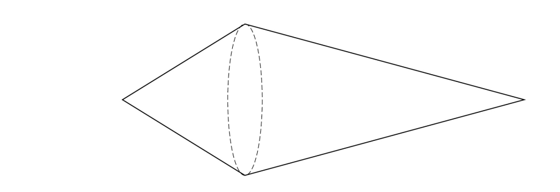

One cone has       slant height = 2 × radius 
The other cone has    slant height = 3 × radius 
The total surface area of the shape is    57.8$π$ cm2

Work out the radius.

## Q68 — very_hard — 5 marks · exam-questions

### 14() — 5 marks — command: calculate — structured — from paper Nov 2020 · J560/06
The base of a cone is fixed to the top of a cylinder to make a decoration.

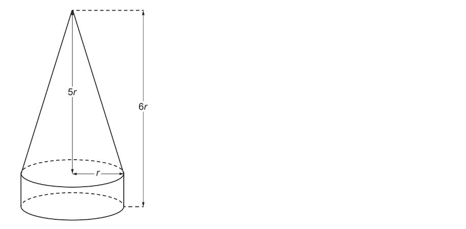

The radius of the base of the cone and of the cylinder is $r$ cm.
 The cone’s height is 5$r$* *cm. 
The total height of the decoration is 6$r$* *cm.
The total volume of the decoration is 225 cm3.

Calculate the value of $r$. 
Show your working.

$r=$............................

## Q69 — very_hard — 5 marks · exam-questions

### 14() — 5 marks — command: work_out — structured — from paper June 2018 · J560/05
The diagram shows a cylinder and a cone.

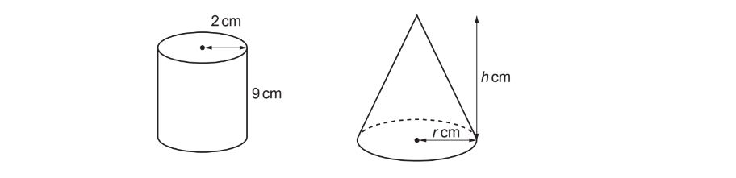

The cylinder has radius 2cm and height 9cm. 
The cone has radius $r$ cm and height $h$ cm.

The ratio $r:h$ is 1 : 4.
The volume of the cone is **equal to** the volume of the cylinder.

Work out the value of $r$.

## Q70 — very_hard — 4 marks · exam-questions

### 13() — 4 marks — command: how — structured — from paper Specimen 2015 · J560/04
The volume of Earth is 1.08 × 1012 km3. 
The volume of Jupiter is 1.43 × 1015 km3.

How many times larger is the radius of Jupiter than the radius of Earth? 
Assume that Jupiter and Earth are both spheres.

## Q71 — very_hard — 5 marks · exam-questions

### 23() — 5 marks — command: work_out — structured — from paper 2023 June · 4MA1/1H
A frustum is made by removing a small square-based pyramid from a similar large squared-based pyramid as shown in the diagram.

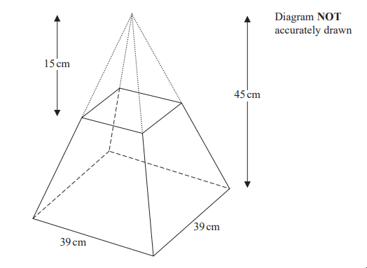

The height of the small pyramid is 15cm. 
The height of the large pyramid is 45cm. 
The square base of the large pyramid has side length 39cm.

Work out the **total **surface area of the frustum. Give your answer correct to the nearest whole number.

## Q72 — very_hard — 5 marks · exam-questions

### 23() — 5 marks — command: work_out — structured — from paper 2023 Nov · 4MA1/2H
Here is a frustum of a cone.
The frustum is made by removing a small cone from a similar large cone.

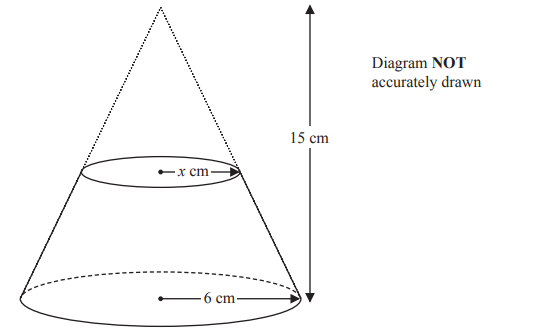

The height of the large cone is 15 cm.

The radius of the base of the large cone is 6 cm. The radius of the base of the small cone is $x$ cm.

Given that the volume of the frustum is$\frac{4212}{25}π\mathrm{cm}^{3}$, work out the value of $x$ 
Show clear algebraic working.
