# Mark Schemes — Transformations
**Vectors & Transformation Geometry** · Edexcel IGCSE Maths A (4MA1) — 18/Higher

## Q1 — easy — 2 marks · exam-questions

### 5((a)) — 1 marks
> *A rotation turns the shape.*

> *Use tracing paper.Hold the tracing paper down at the origin and rotate it 180° in either direction (a half turn). Draw the new shape and label it A.*

> *A rotation of 180° makes each point the same distance from the centre but in the opposite direction. This is a good way to check your answer.*

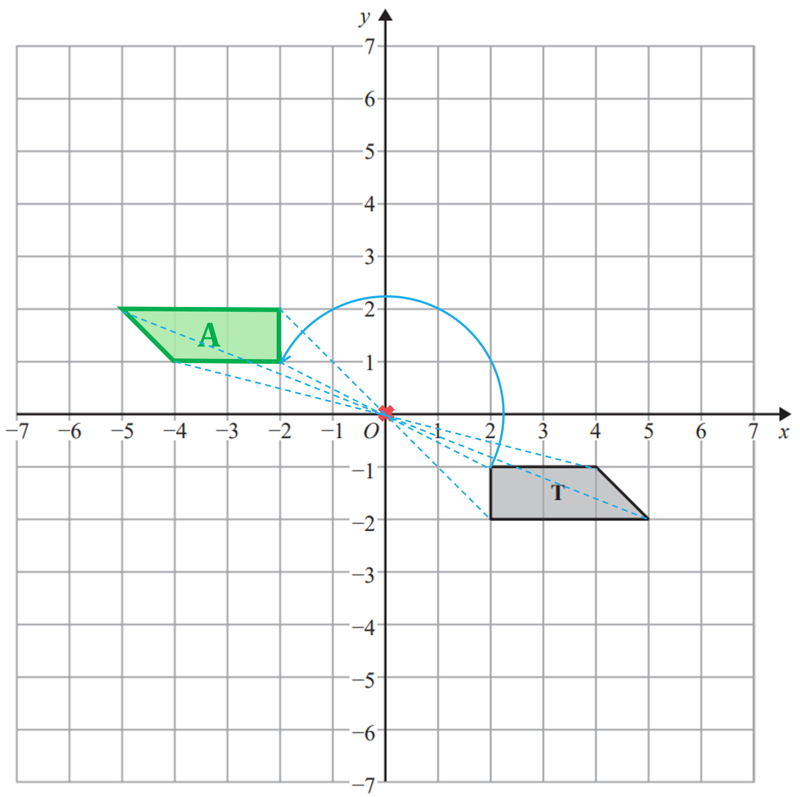

**[1]**

### 5((b)) — 1 marks
> *A translation moves the shape.*

> *The vector *`open parentheses table row cell negative 1 end cell row cell negative 3 end cell end table close parentheses`* represents 1 unit to the left and 3 units down.*

> *Move the shape left 1 and down 3.*

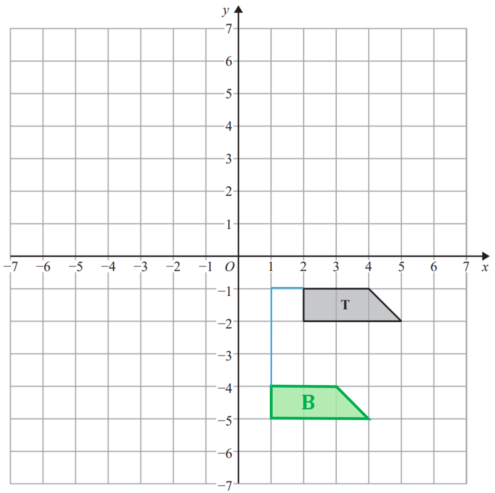

**[1]**

## Q2 — easy — 2 marks · exam-questions

### 1() — 2 marks
> *The shape has been moved so this is a translation.*

> *Pick a point on the original shape and find its corresponding point on the translated shape. Count how many units it has moved horizontally and vertically.*

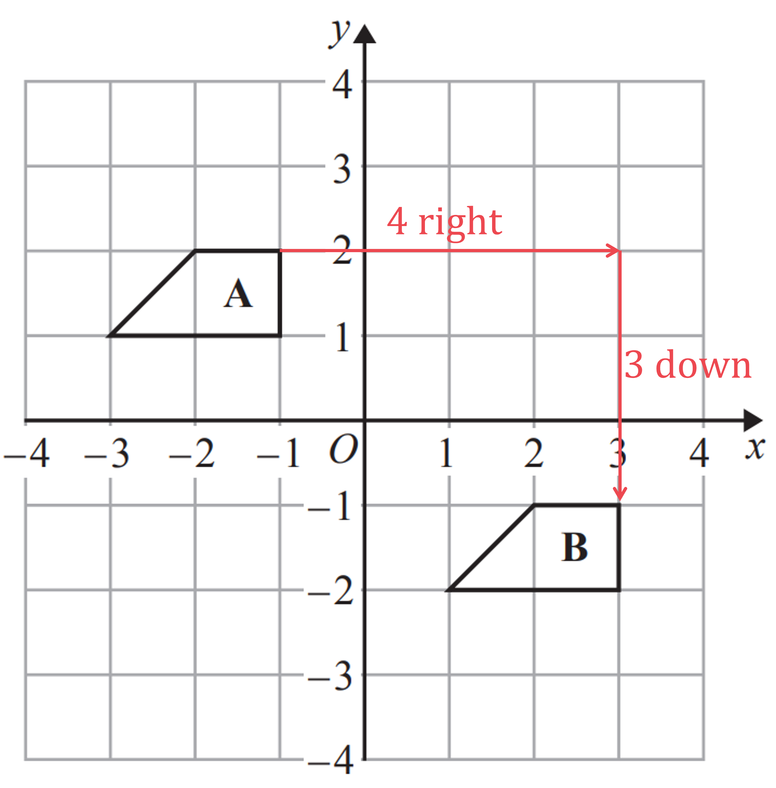

> *Write as a vector. The horizontal displacement goes at the top (right is positive, left is negative). The vertical displacement goes at the bottom (up is positive, down is negative).*

**Translation by**** **`stretchy left parenthesis table row 4 row cell negative 3 end cell end table stretchy right parenthesis`** **
**Writing "Translation"**** [1]** 
**Correct vector**** [1]**

## Q3 — easy — 2 marks · exam-questions

### 5() — 2 marks
> *The shape has been moved so this is a translation.*

> *Pick a point on the original shape and find its corresponding point on the translated shape. Count how many units it has moved horizontally and vertically.*

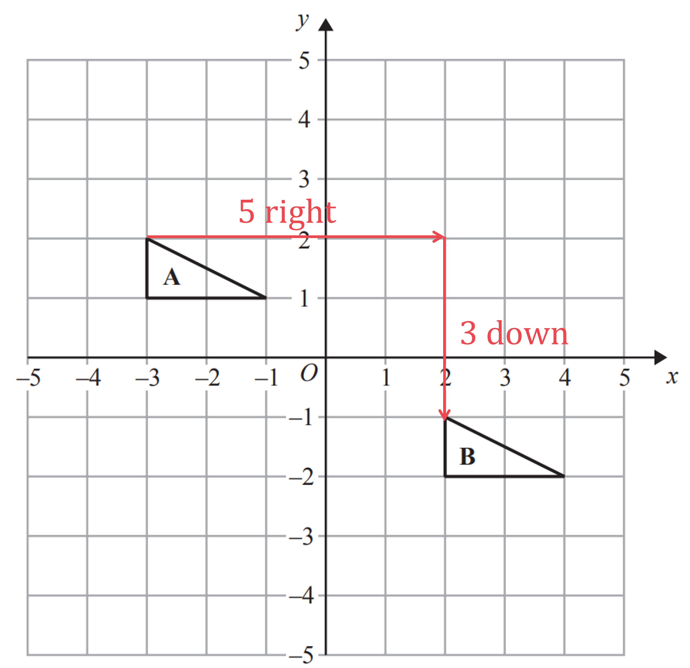

> *Write as a vector. The horizontal displacement goes at the top (right is positive, left is negative). The vertical displacement goes at the bottom (up is positive, down is negative).*

**Translation by**** **`stretchy left parenthesis table row 5 row cell negative 3 end cell end table stretchy right parenthesis` 
**Writing "Translation"**** [1]** 
**Correct vector**** [1]**

## Q4 — easy — 2 marks · exam-questions

### 10() — 2 marks
> *The shape has been moved so this is a translation.*

> *Pick a point on the original shape and find its corresponding point on the translated shape. Count how many units it has moved horizontally and vertically.*

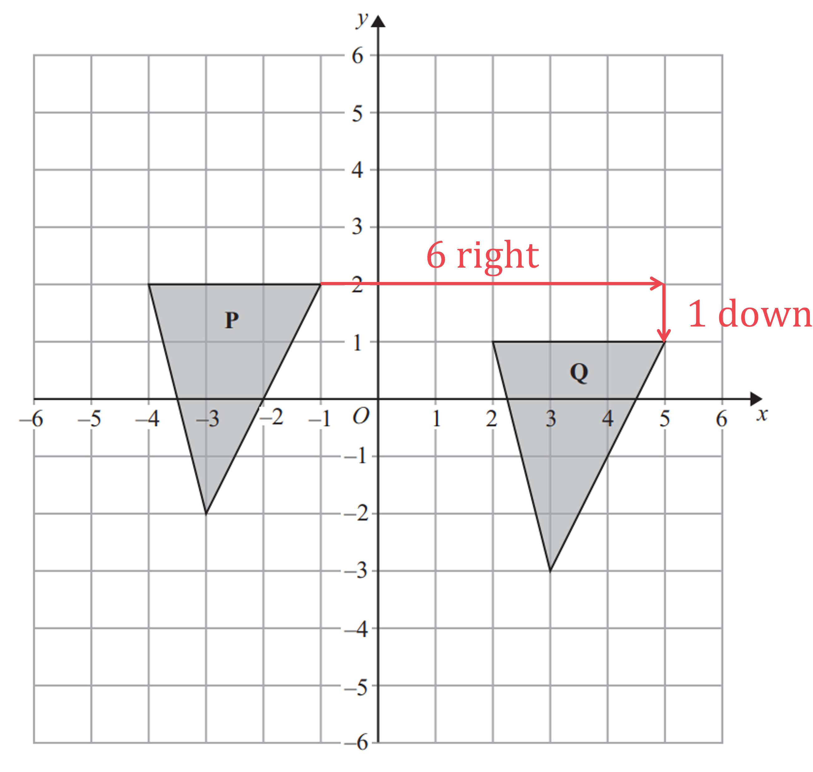

> *Write as a vector. The horizontal displacement goes at the top (right is positive, left is negative). The vertical displacement goes at the bottom (up is positive, down is negative).*

**Translation by** `begin bold style stretchy left parenthesis table row 6 row cell negative 1 end cell end table stretchy right parenthesis end style` 
**Writing "Translation"**** [1]** 
**Correct vector**** [1]**

## Q5 — easy — 4 marks · exam-questions

### 4((a)) — 2 marks
> *A reflection flips the shape.*

> *The perpendicular distance between the reflection of a point and the line of reflection is the same as the perpendicular distance between the original point and the line.*

> *It is easier to turn the page so that the line of reflection is vertical or horizontal. Then count how many squares there are between a corner and the line. Then count the same number of squares on the other side of the line, this is where the new corner will go. Do this for all the corners and then join together to make the new shape.*

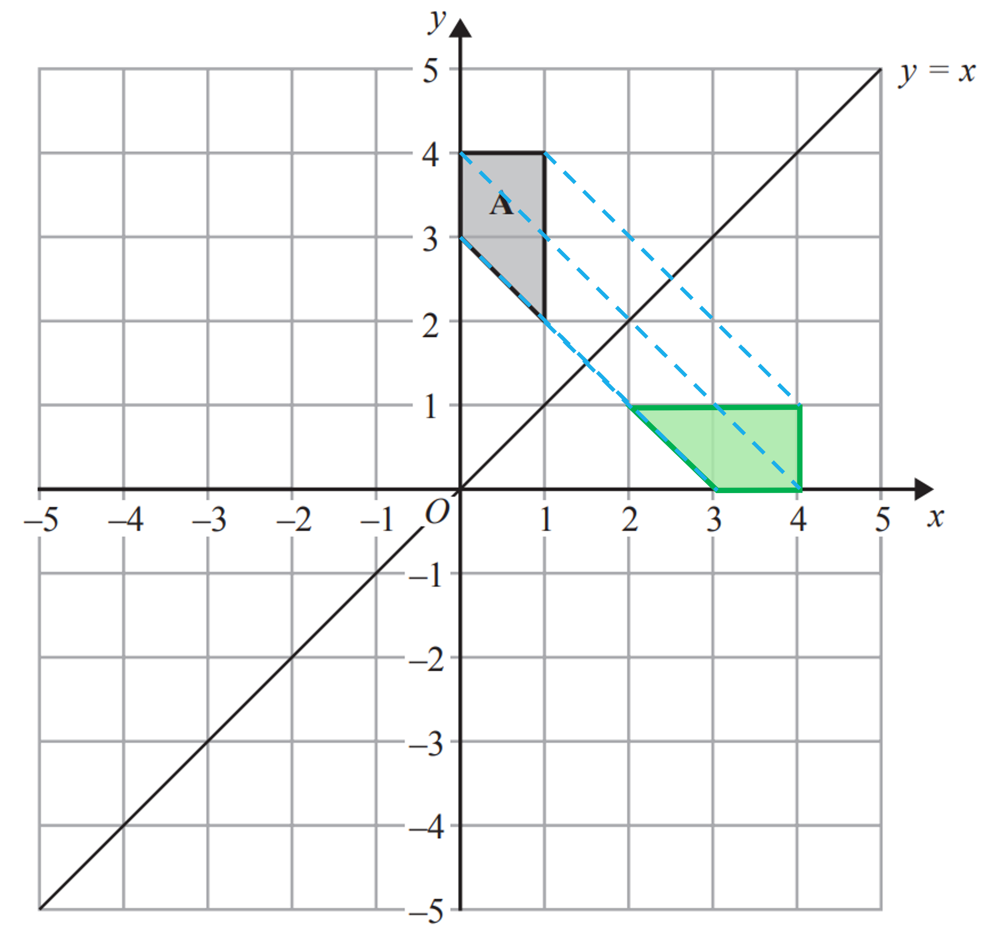

**2 vertices correct**** [1] **
**Shape fully correct**** [1]**

### 4((b)) — 2 marks
> *The shape has been moved so this is a translation.*

> *Pick a point on the original shape and find its corresponding point on the translated shape. Count how many units it has moved horizontally and vertically.*

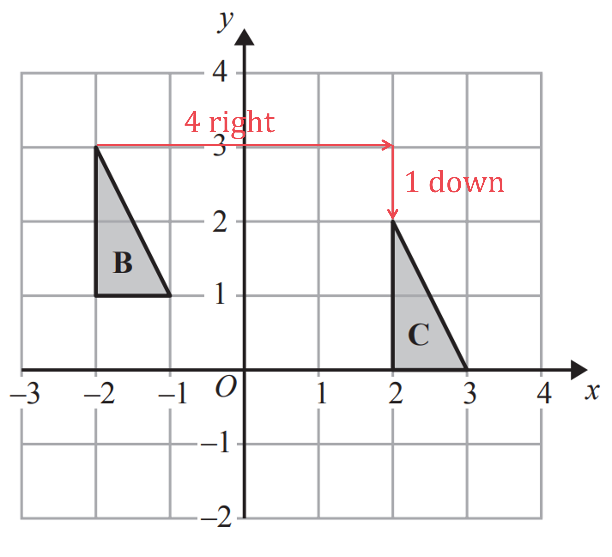

> *Write as a vector. The horizontal displacement goes at the top (right is positive, left is negative). The vertical displacement goes at the bottom (up is positive, down is negative).*

**Translation by**** **`stretchy left parenthesis table row 4 row cell negative 1 end cell end table stretchy right parenthesis`** **
**Writing "Translation"**** [1]** 
**Correct vector**** [1]**

## Q6 — easy — 4 marks · exam-questions

### 2((a)) — 2 marks
> *A reflection flips the shape.*

> *The perpendicular distance between the reflection of a point and the line of reflection is the same as the perpendicular distance between the original point and the line.*

> *It is easier to turn the page so that the line of reflection is vertical or horizontal. Then count how many squares there are between a corner and the line. Then count the same number of squares on the other side of the line, this is where the new corner will go. Do this for all the corners and then join together to make the new shape.*

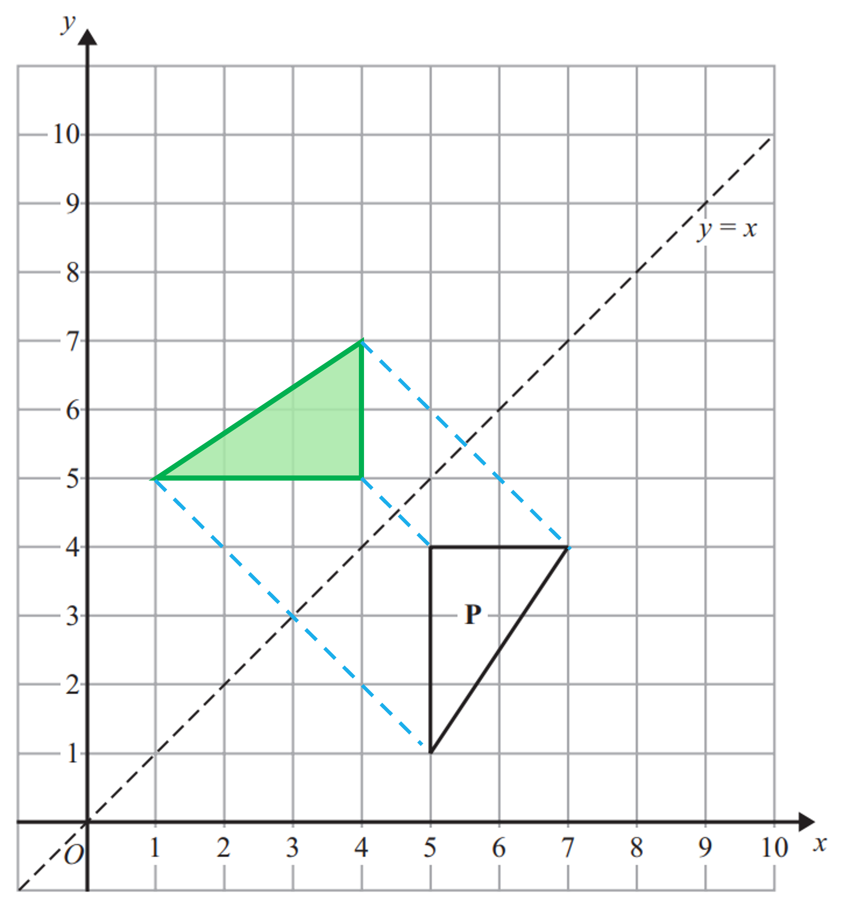

**2 vertices correct**** [1] **
**Shape fully correct**** [1]**

### 2((b)) — 2 marks
> *The shape has been moved so this is a translation.*

> *Pick a point on the original shape and find its corresponding point on the translated shape. Count how many units it has moved horizontally and vertically.*

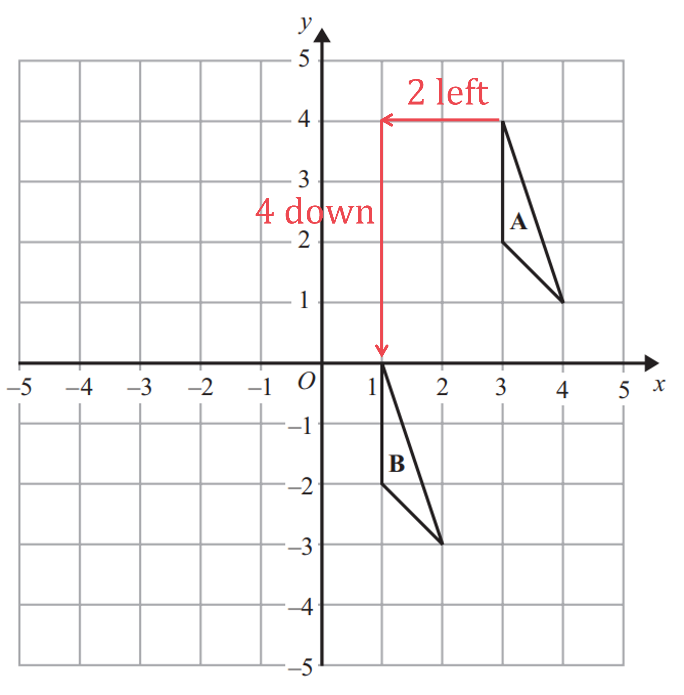

> *Write as a vector. The horizontal displacement goes at the top (right is positive, left is negative). The vertical displacement goes at the bottom (up is positive, down is negative).*

**Translation by** `stretchy left parenthesis table row cell negative 2 end cell row cell negative 4 end cell end table stretchy right parenthesis` 
**Writing "Translation"**** [1]** 
**Correct vector**** [1]**

## Q7 — easy — 3 marks · exam-questions

### 1() — 3 marks
> *An enlargement changes the size of the shape.*

> *Choose a corner and find the displacement from the centre to this corner. Starting at this corner count the distance of each side around the shape. You can ignore the diagonal side as this can be made by joining together the two corners.*

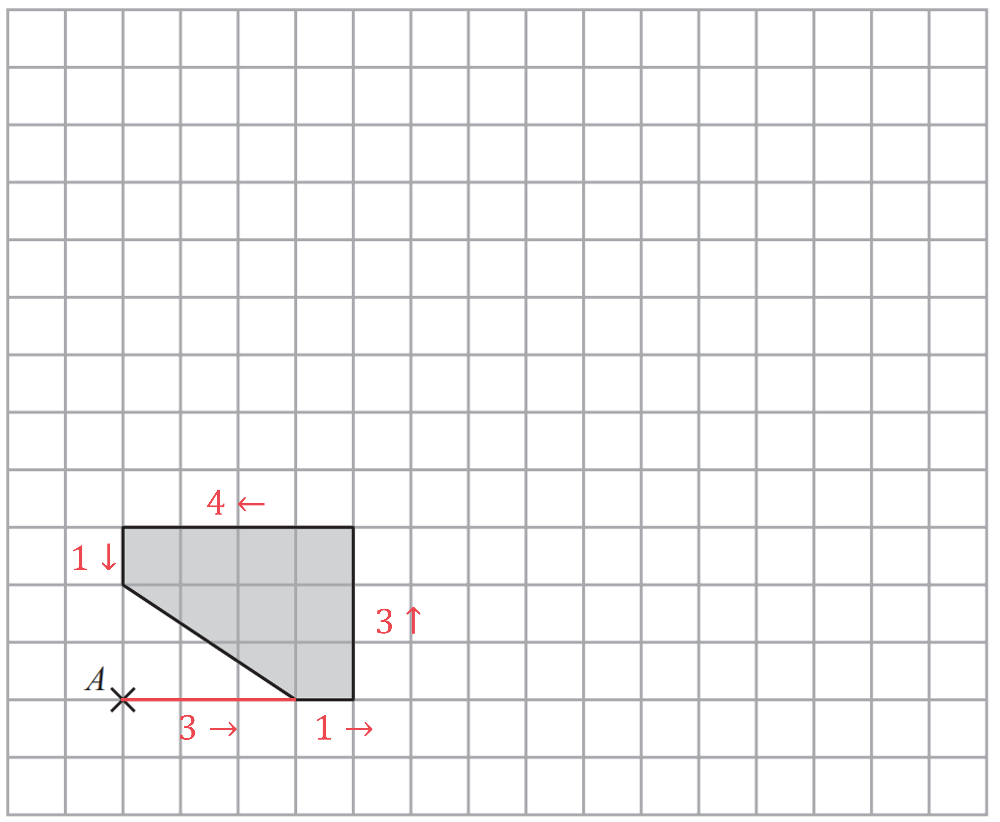

> *Multiply each length/displacement by the scale factor. Starting at the centre use the new displacement to find the position of the new corner. Then use the new lengths to draw the enlarged shape.*

> *To check your answer you can draw a straight line going through the centre and a corner of the original shape, the corresponding corner on the enlarged shape should also lie on this line.*

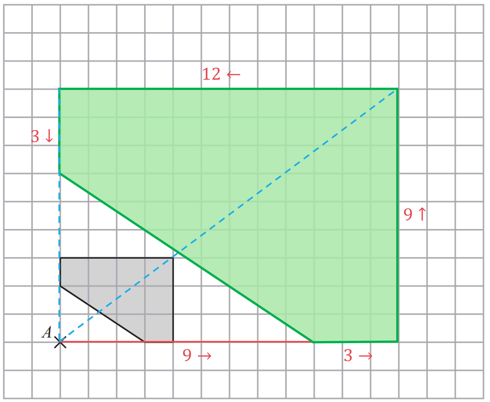

**Enlargement by any scale factor and any centre**** [1]** 
**Enlargement using the correct scale factor ****[1]** 
**Enlargement using the correct centre**** [1]**

## Q8 — easy — 2 marks · exam-questions

### 4() — 2 marks
> *An enlargement changes the size of the shape.*

> *Choose a corner and find the displacement from the centre to this corner. Starting at this corner count the distance of each side around the shape. You can ignore the diagonal side as this can be made by joining together the two corners.*

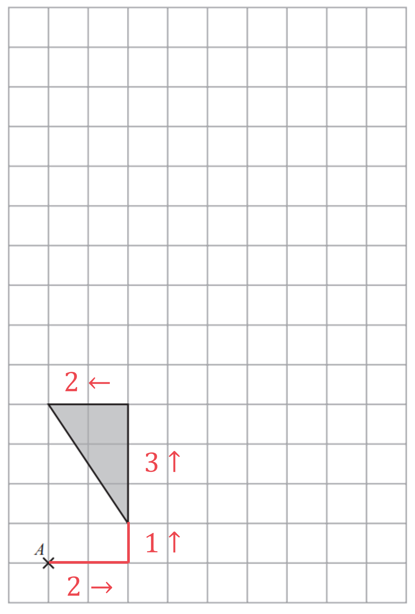

> *Multiply each length/displacement by the scale factor. Starting at the centre use the new displacement to find the position of the new corner. Then use the new lengths to draw the enlarged shape.*

> *To check your answer you can draw a straight line going through the centre and a corner of the original shape, the corresponding corner on the enlarged shape should also lie on this line.*

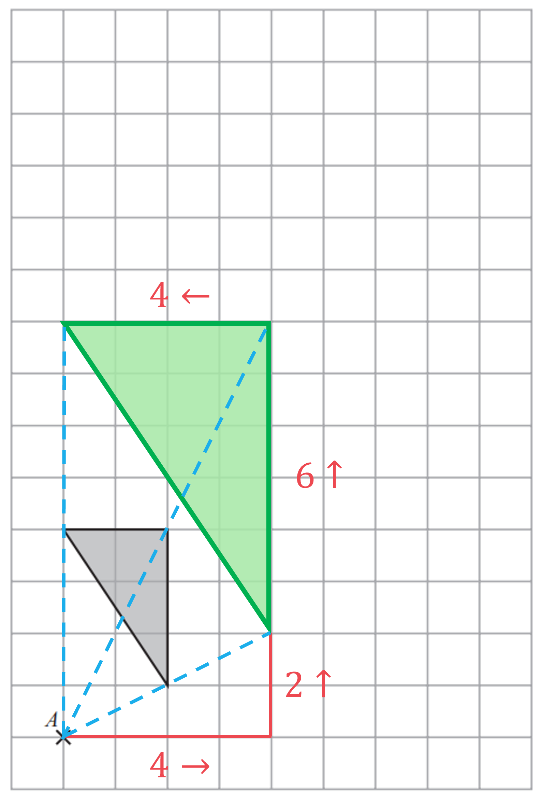

**Enlargement using the correct scale factor ****[1]** 
**Enlargement using the correct centre**** [1]**

## Q9 — easy — 1 marks · exam-questions

### 5((b)) — 1 marks
*A translation by *`open parentheses table row a row b end table close parentheses`* moves the shape **a** units to the right and **b** units up*

*Move the shape 10 units to the right and 8 units up* 
*Label the new shape ***R**

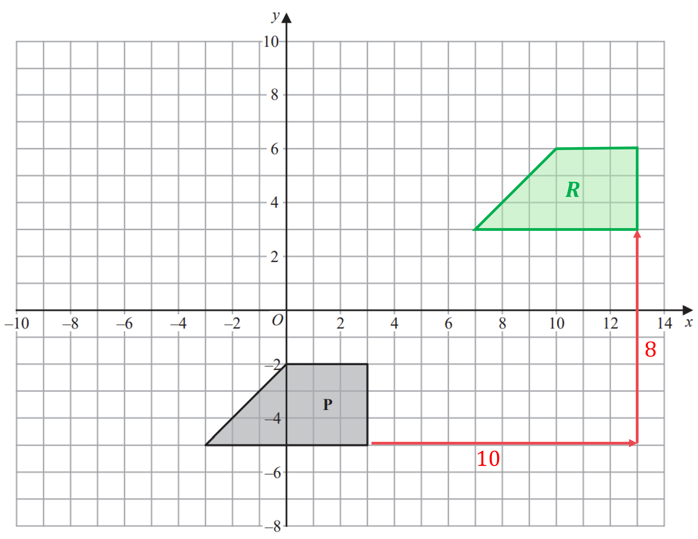

**[1]**

## Q10 — easy — 1 marks · exam-questions

### 3((b)) — 1 marks
*A translation by *`open parentheses table row a row b end table close parentheses`* moves the shape **a** units to the right and **b** units up *
*The negative signs in *`open parentheses table row cell negative 4 end cell row cell negative 6 end cell end table close parentheses`*  reverse the directions* * *

*Move the shape 4 units to the left and 6 units down* *Label the new shape ***T**

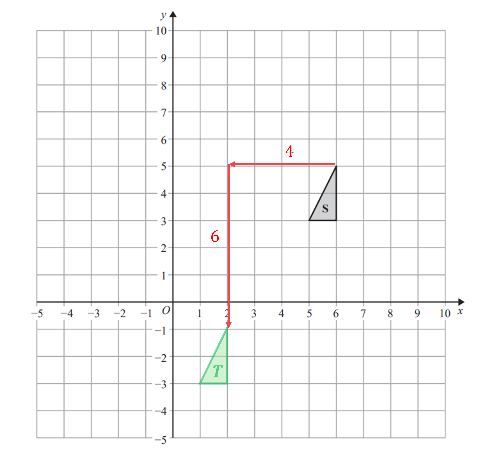

**[1]**

## Q11 — easy — 1 marks · exam-questions

### 1() — 1 marks
*The vector *`open parentheses table row a row b end table close parentheses`* translate an object **a** units to the right and **b** units up*

`open parentheses table row 0 row 4 end table close parentheses`* is 0 units right and 4 units up*

**the ****first ****option, ****up** **[1]**

> *An example of the second option is *`open parentheses table row 0 row cell negative 4 end cell end table close parentheses`

> *An example of the third option is *`open parentheses table row cell negative 4 end cell row 0 end table close parentheses`

> *An example of the fourth option is *`open parentheses table row 4 row 0 end table close parentheses`

## Q12 — easy — 1 marks · exam-questions

### 2() — 1 marks
*The vector *`open parentheses table row a row b end table close parentheses`* translate an object **a** units to the right and **b** units up*

`open parentheses table row cell negative 2 end cell row 3 end table close parentheses`* is 2 units to the left and 3 units up  *

> *The reverse direction is 2 units to the right and 3 units down Change the signs of the numbers*

**the ****fourth ****option, **`stretchy left parenthesis table row 2 row cell negative 3 end cell end table stretchy right parenthesis` **[1]**

> *The first option is the same translation of **A** to **B**, not **B** to **A*

> *The second and third options do not reverse "moving 2 units to the left", as they move 3 units sideways*

## Q13 — easy — 2 marks · exam-questions

### 1((a)) — 2 marks
*The vector *`open parentheses table row p row q end table close parentheses`* represents a translation of **p** units right and **q** units up* 
*Pick a corner of the shape and count the number of units it takes to get from **S** to **T*

*5 units right and 5 units down (-5 up)*

**p**** = 5 and ****q**** = -5** **[2]**

## Q14 — easy — 2 marks · exam-questions

### 15((a)) — 2 marks
*The vector *`open parentheses table row a row b end table close parentheses`* represents a translation of **a** units right and **b** units up* *Describe the translation given by *`open parentheses table row cell negative 7 end cell row 2 end table close parentheses`* (negative signs reverse the direction)*

*7 units left and 2 units up  *

*Describe the translation given by *`open parentheses table row 3 row cell negative 5 end cell end table close parentheses`* *

*3 units right and 5 units down  *

*Combine these translations into one single translation (for example, by adding components)**  *

*-7 + 3 = -4 units right (4 units left) *
*2 - 5 = -3 units up (3 units down)  *

> *For the final answer, state the type of transformation ("translation") and its vector  *

**the word "translation" seen with one correct vector component ****[1]**

**a translation by**** **`begin bold style stretchy left parenthesis table row cell negative 4 end cell row cell negative 3 end cell end table stretchy right parenthesis end style`** ** **[1]**

**The word "translation"  is needed as well as the vector**

## Q15 — medium — 5 marks · exam-questions

### 8((a)) — 2 marks
> *A rotation turns the shape.*

> *Use tracing paper.Hold the tracing paper down at the origin and rotate it 90° clockwise (a quarter turn). Draw the new shape.*

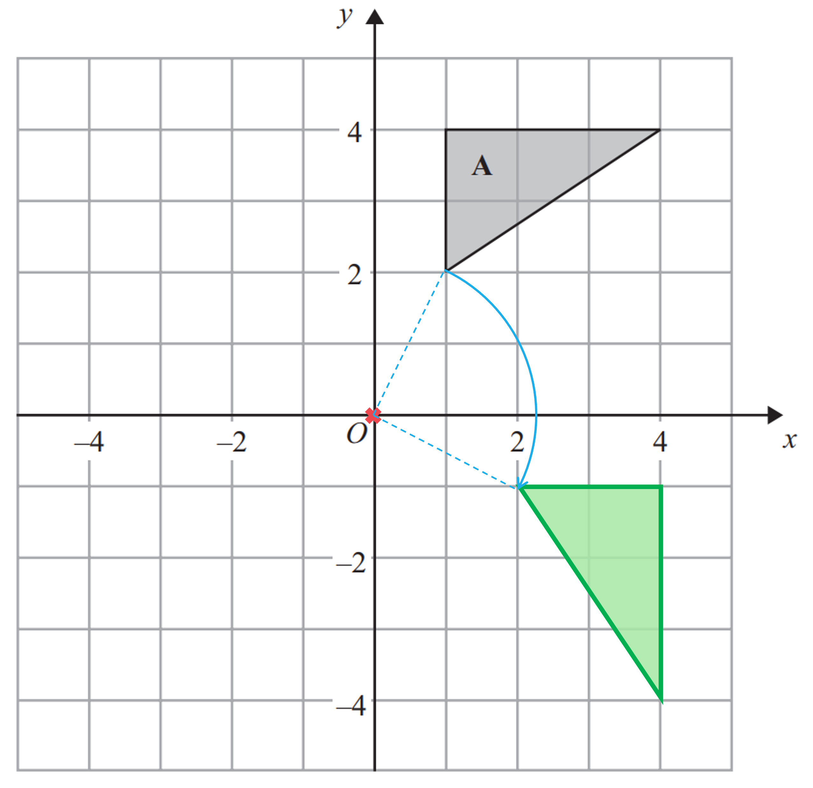

**Rotated 90° clockwise**** [1] **
**Rotated 90° about the correct centre**** [1]**

### 8((b)) — 3 marks
> *An enlargement changes the size of the shape.*

> *Choose a corner and find the displacement from the centre to this corner. *
*Starting at this corner count the distance of each side around the shape. You can ignore the diagonal side as this can be made by joining together the two corners.*

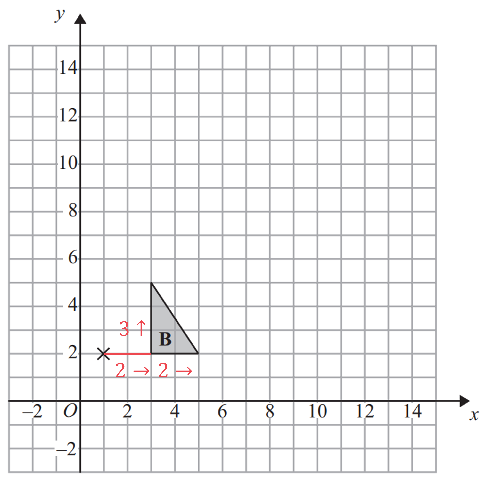

> *Multiply each length/displacement by the scale factor. Starting at the centre use the new displacement to find the position of the new corner. Then use the new lengths to draw the enlarged shape.*

> *To check your answer you can draw a straight line going through the centre and a corner of the original shape, the corresponding corner on the enlarged shape should also lie on this line.*

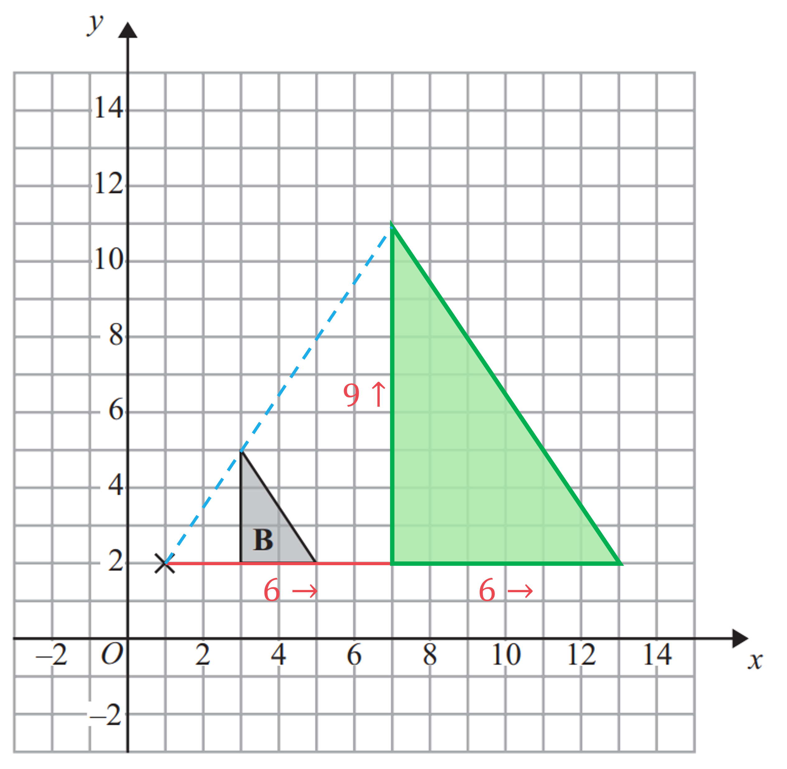

**Enlargement by any scale factor and any centre**** [1]** 
**Enlargement using the correct scale factor ****[1]** 
**Enlargement using the correct centre**** [1]**

## Q16 — medium — 3 marks · exam-questions

### 12() — 3 marks
> *The shape has been turned so this is a rotation.*

> *Join each point of the original shape to its corresponding point on the rotated shape with a straight line. If the lines intersect at a point then this is the centre of rotation, otherwise the perpendicular bisectors of the lines will intersect at the centre of rotation.*

> *Using the centre, measure the angle from one point on the original to its corresponding point on the rotated shape.*

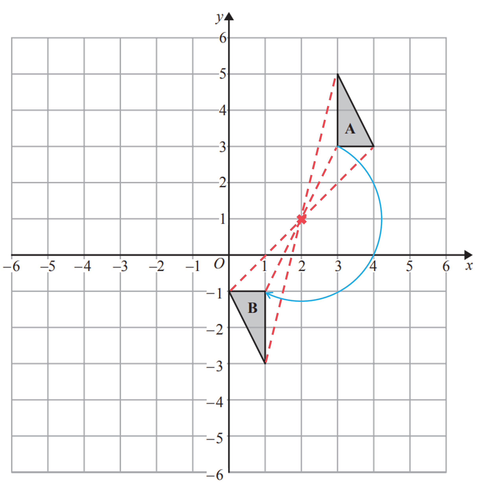

**Rotation 180° about the centre (2, 1) **
**Writing "Rotation" ****[1] **
**Correct angle ****[1] **
**Correct centre ****[1] **
**It is not necessary to write a direction for a rotation of 180° It is also acceptable to write: Enlargement of scale factor -1 about the centre (2, 1)**

## Q17 — medium — 4 marks · exam-questions

### 2((a)) — 2 marks
> *A reflection flips the shape.*

> *The perpendicular distance between the reflection of a point and the line of reflection is the same as the perpendicular distance between the original point and the line.*

> *Draw the line of reflection, **x** = -1 is a vertical line where every point has **x**-coordinate -1. Then count how many squares there are between a corner and the line. Then count the same number of squares on the other side of the line, this is where the new corner will go. Do this for all the corners and then join together to make the new shape.*

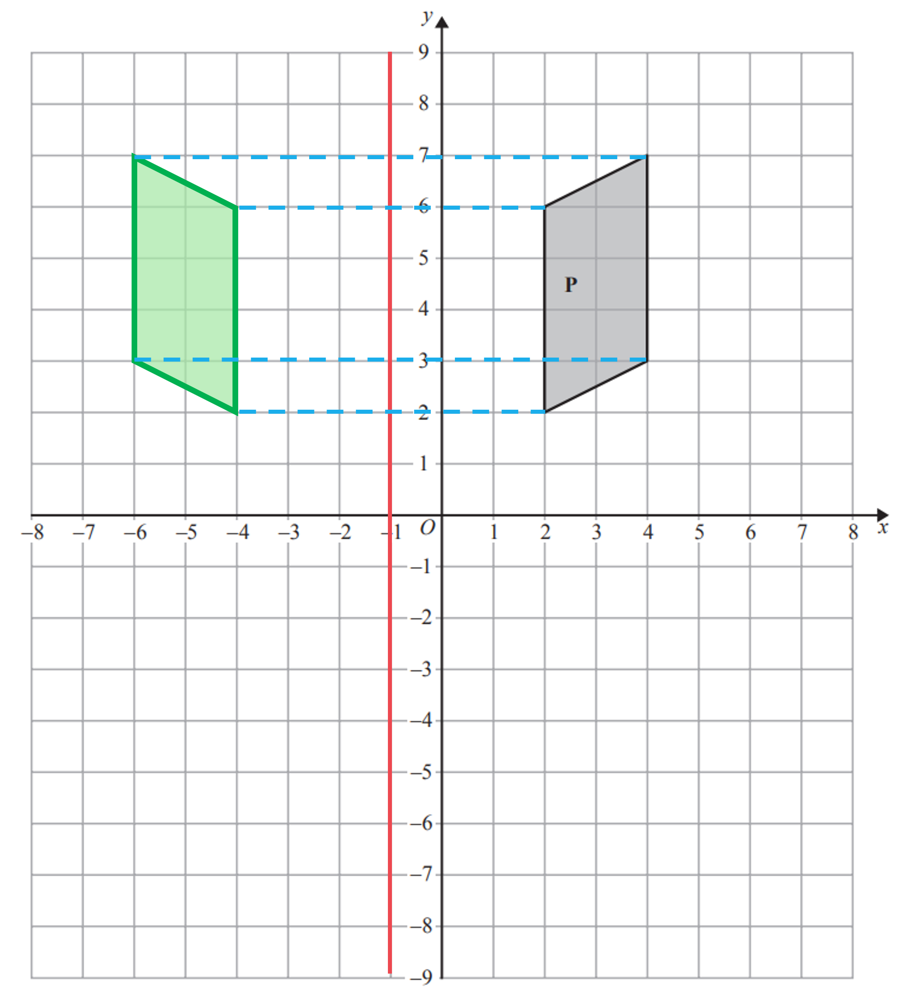

**Reflection in any horizontal or vertical line**** [1] **
**Shape fully correct**** [1]**

### 2((b)) — 2 marks
> *A rotation turns the shape.*

> *Use tracing paper. Hold the tracing paper down at the point (0, 1) and rotate it 90° anticlockwise (a quarter turn). Draw the new shape.*

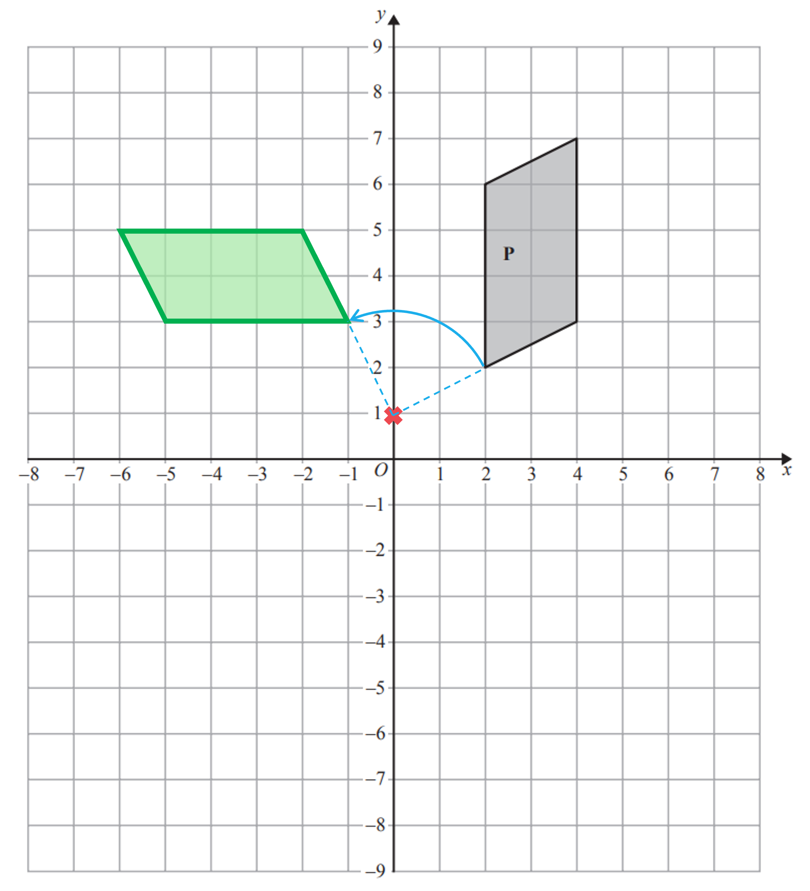

**Rotated 90° anticlockwise**** [1] **
**Rotated 90° about the correct centre**** [1]**

## Q18 — medium — 4 marks · exam-questions

### 7((a)) — 2 marks
> *A rotation turns the shape.*

> *Use tracing paper. Hold the tracing paper down at the point (0, 0) and rotate it 90° anticlockwise (a quarter turn). Draw the new shape.*

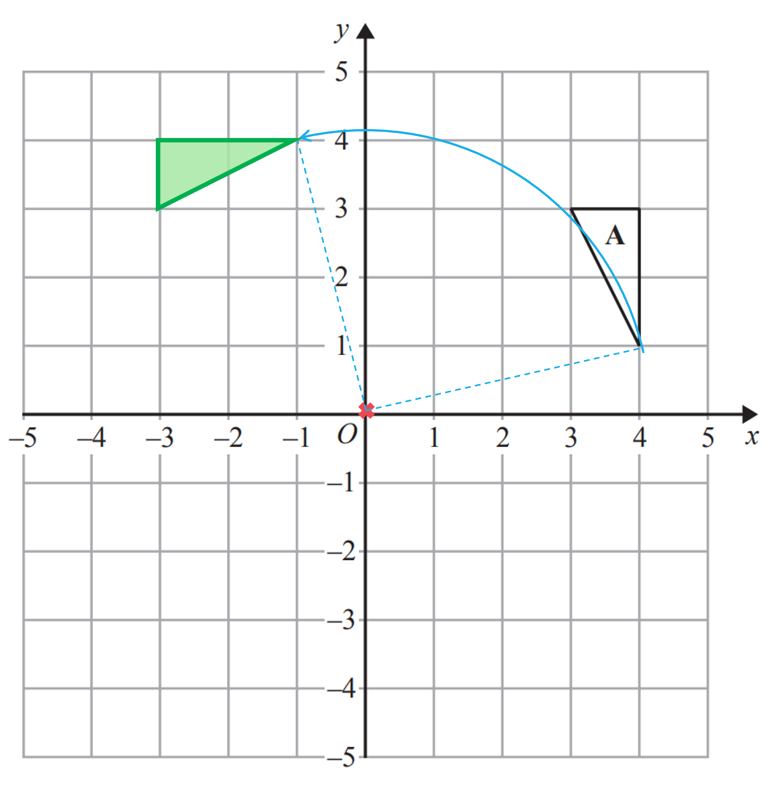

**Rotated 90° anticlockwise**** [1] **
**Rotated 90° about the correct centre**** [1]**

### 7((b)) — 2 marks
> *The shape has been flipped so this is a reflection.*

> *Join each point of the original shape to its corresponding point on the rotated shape with a straight line. The line of reflection is the perpendicular bisector of these lines.*

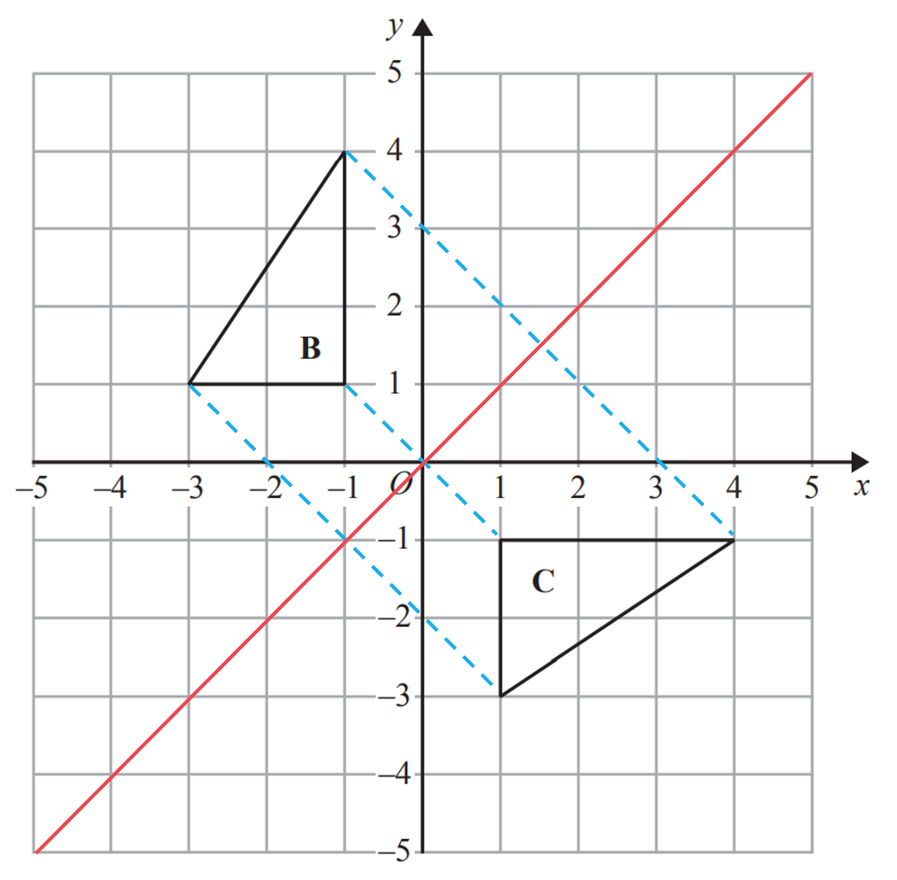

> *The line goes through (0, 0), (1, 1), (2, 2), etc therefore its equation is **y** = **x**.*

**Reflection in the line*** *$y=x$* *
**Writing "Reflection"**** [1]*** *
**Correct line**** [1]**

## Q19 — medium — 3 marks · exam-questions

### 9() — 3 marks
> *The shape has been turned so this is a rotation.*

> *Join each point of the original shape to its corresponding point on the rotated shape with a straight line. If the lines intersect at a point then this is the centre of rotation, otherwise the perpendicular bisectors of the lines will intersect at the centre of rotation.*

> *Using the centre, measure the angle from one point on the original to its corresponding point on the rotated shape.*

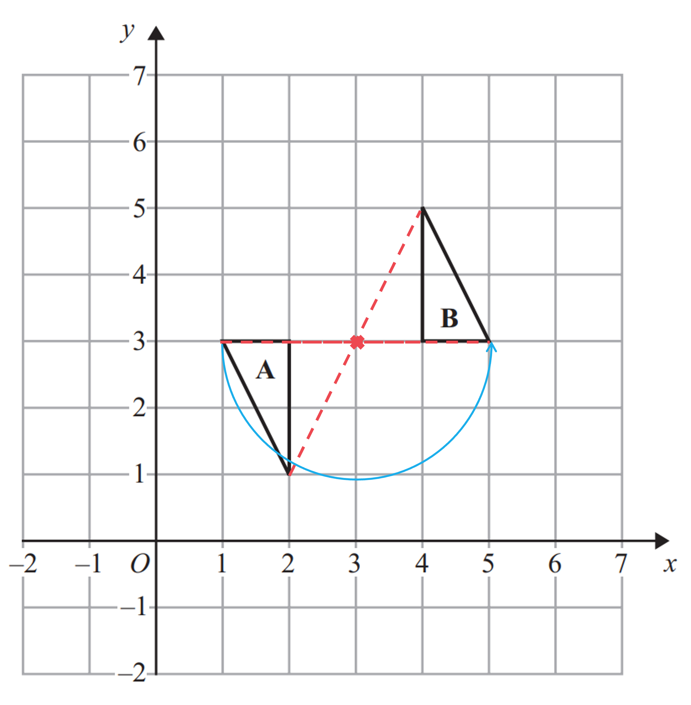

**Rotation 180° about the centre (3, 3) **
**Writing "Rotation" ****[1] **
**Correct angle ****[1] **
**Correct centre ****[1] **
**It is not necessary to write a direction for a rotation of 180° It is also acceptable to write: Enlargement of scale factor -1 about the centre (3, 3)**

## Q20 — medium — 4 marks · exam-questions

### 6((a)) — 1 marks
> *A translation moves the shape.*

> *The vector *`open parentheses table row cell negative 3 end cell row 2 end table close parentheses`* represents 3 units to the left and 2 units up.*

> *Move the shape left 3 and up 2.*

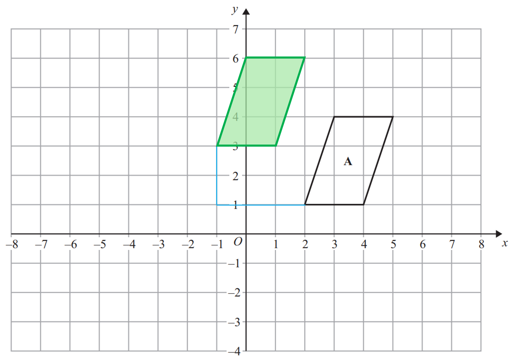

**[1]**

### 6((b)) — 3 marks
> *The shape has been turned so this is a rotation.*

> *Join each point of the original shape to its corresponding point on the rotated shape with a straight line. If the lines intersect at a point then this is the centre of rotation, otherwise the perpendicular bisectors of the lines will intersect at the centre of rotation.*

> *Using the centre, measure the angle from one point on the original to its corresponding point on the rotated shape. State the direction.*

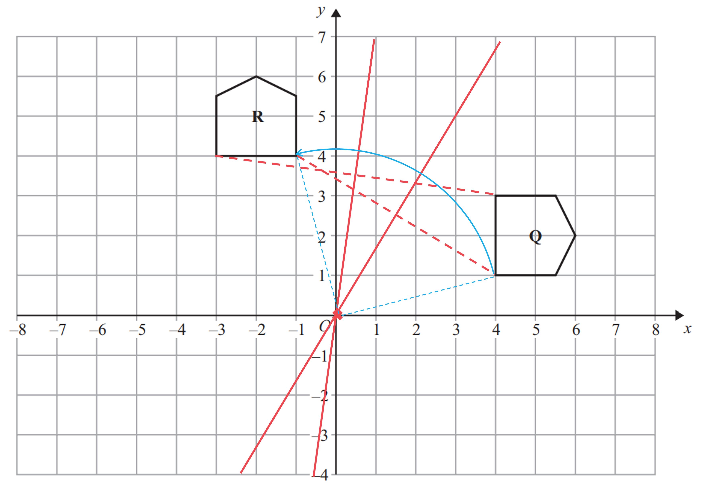

> *You could also use trial and error with tracing paper. Start with trying the centre as the origin and work outwards if needed.*

**Rotation 90° anticlockwise about the centre (0, 0) **
**Writing "Rotation" ****[1] **
**Correct angle ****[1] **
**Correct centre ****[1] **
**It is acceptable to write: 270° clockwise**

## Q21 — medium — 5 marks · exam-questions

### 7((a)) — 2 marks
> *A translation moves the shape.*

> *The vector *`open parentheses table row 5 row cell negative 2 end cell end table close parentheses`* represents 5 units to the right and 2 units down.*

> *Move the shape right 5 and down 2.*

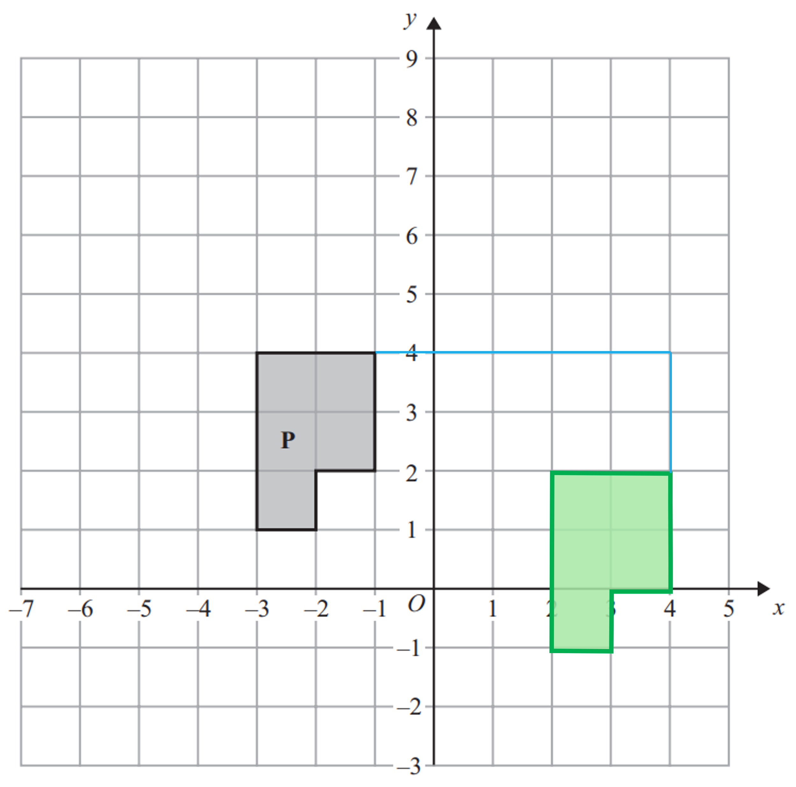

**Translating by any vector**** [1] **
**Correct position**** [1]**

### 7((b)) — 3 marks
> *The shape has been turned so this is a rotation.*

> *Join each point of the original shape to its corresponding point on the rotated shape with a straight line. If the lines intersect at a point then this is the centre of rotation, otherwise the perpendicular bisectors of the lines will intersect at the centre of rotation.*

> *Using the centre, measure the angle from one point on the original to its corresponding point on the rotated shape.*

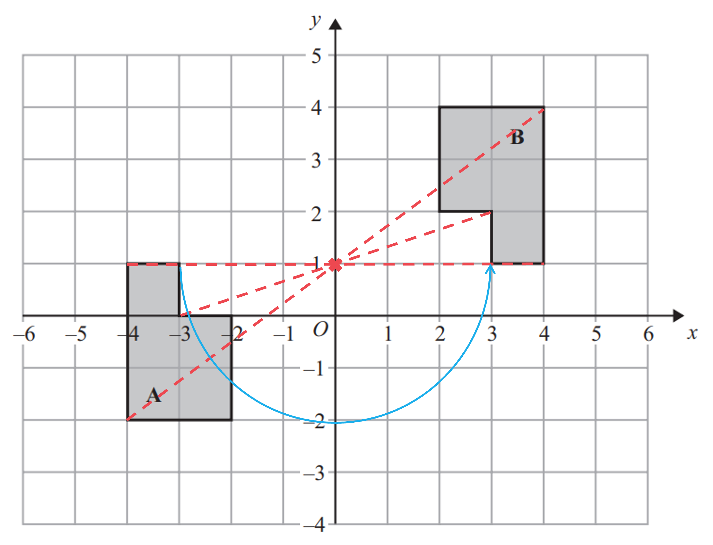

> *You could also use trial and error with tracing paper. Start with trying the centre as the origin and work outwards if needed.*

**Rotation 180° about the centre (0, 1) **
**Writing "Rotation" ****[1] **
**Correct angle ****[1] **
**Correct centre ****[1] **
**It is not necessary to write a direction for a rotation of 180° It is also acceptable to write: Enlargement of scale factor -1 about the centre (0, 1)**

## Q22 — medium — 5 marks · exam-questions

### 8((a)) — 2 marks
> *A rotation turns the shape.*

> *Use tracing paper. Hold the tracing paper down at the point (0, 0) and rotate it 90° anticlockwise (a quarter turn). Draw the new shape.*

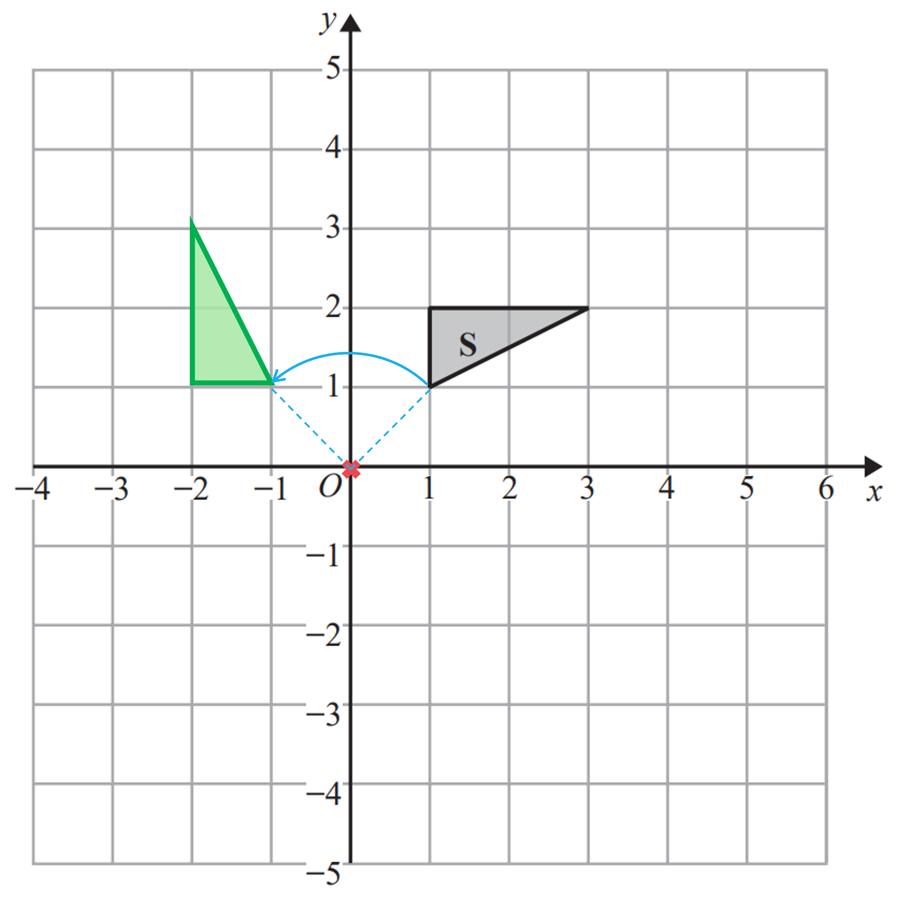

**Rotated 90° anticlockwise**** [1] **
**Rotated 90° about the correct centre**** [1]**

### 8((b)) — 3 marks
> *The shape has been stretched so this is an enlargement.*

> *To find the scale factor, you need to divide the length of one the sides of the enlarged shape by the length of the corresponding side of the original shape.*

> *To find the centre of enlargement, for each of the corners of the original shape draw a straight line going through the corner and the corresponding corner of the enlarged shape. These lines will intersect at the centre of enlargement.*

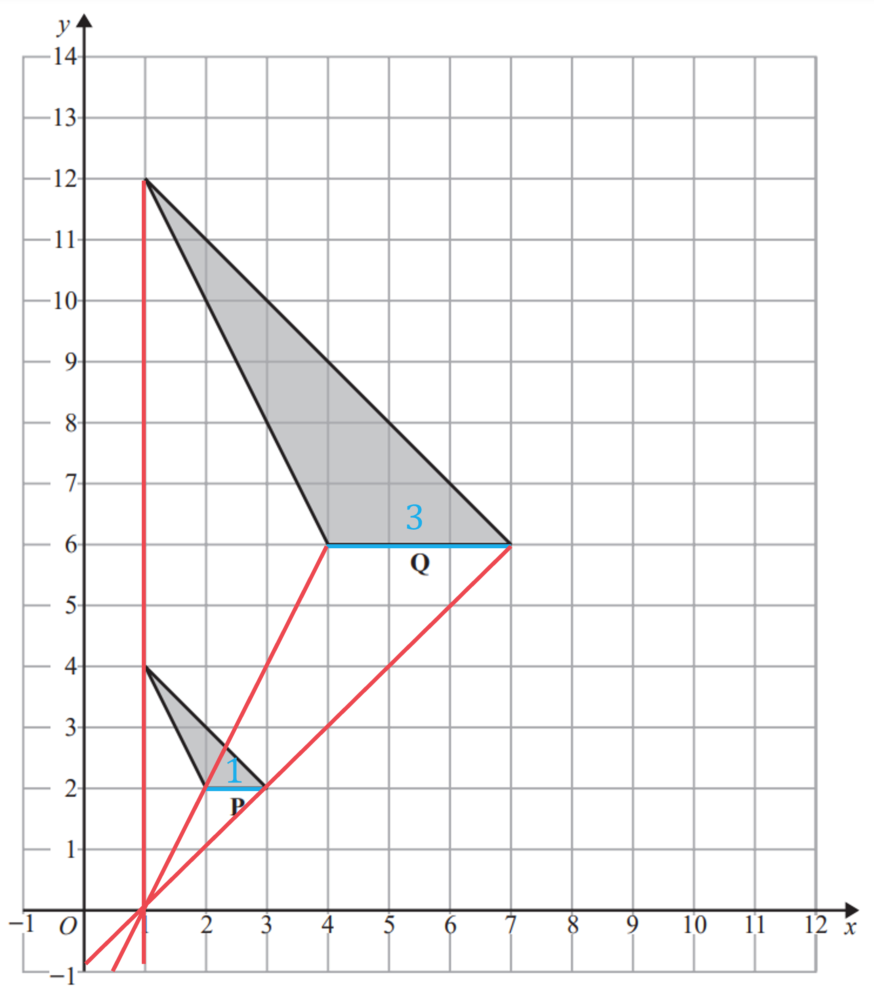

*Scale Factor =** *$\frac{3}{1}$

**Enlargement of scale factor 3 at the centre (1, 0)*** *
**Writing "Enlargement"**** [1]*** *
**Correct scale factor**** [1]*** *
**Correct centre**** [1]**

## Q23 — medium — 4 marks · exam-questions

### 9((a)) — 2 marks
> *A rotation turns the shape.*

> *Use tracing paper.Hold the tracing paper down at the origin and rotate it 180° in either direction (a half turn). Draw the new shape and label it A.*

> *A rotation of 180° makes each point the same distance from the centre but in the opposite direction. This is a good way to check your answer.*

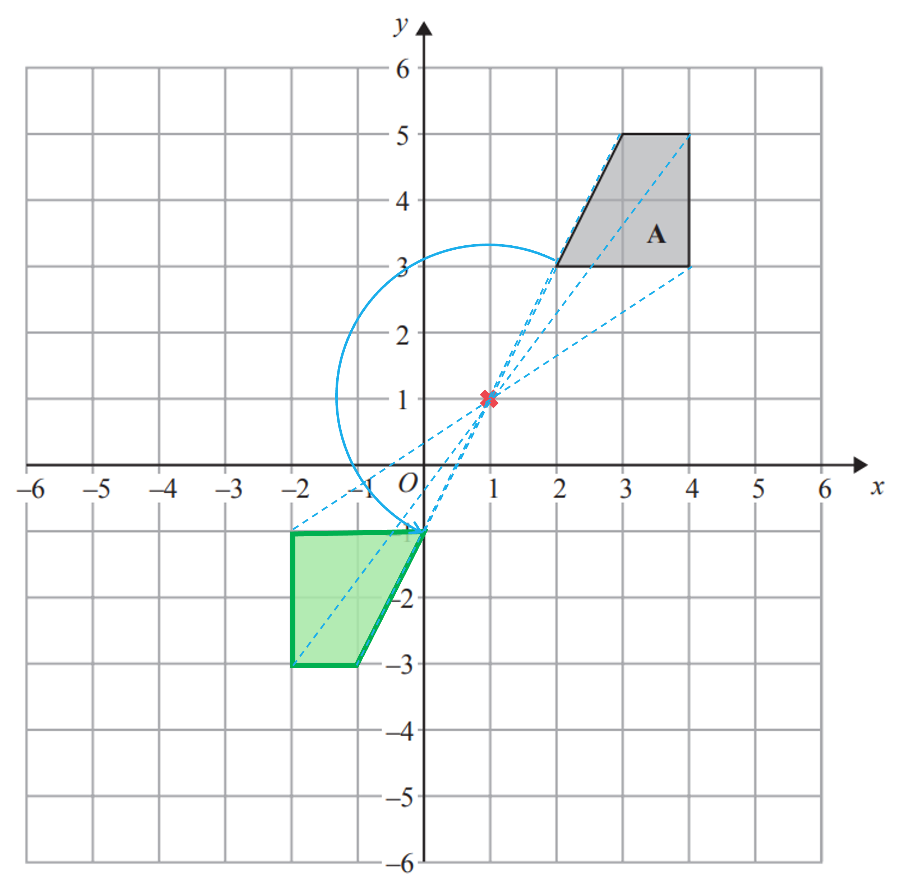

**Rotation of 180° about any centre**** [1] **
**Correct position**** [1]**

### 9((b)) — 2 marks
> *An enlargement changes the size of the shape.*

> *Choose a corner and find the displacement from the centre to this corner. Starting at this corner count the distance of each side around the shape. You can ignore the diagonal side as this can be made by joining together the two corners.*

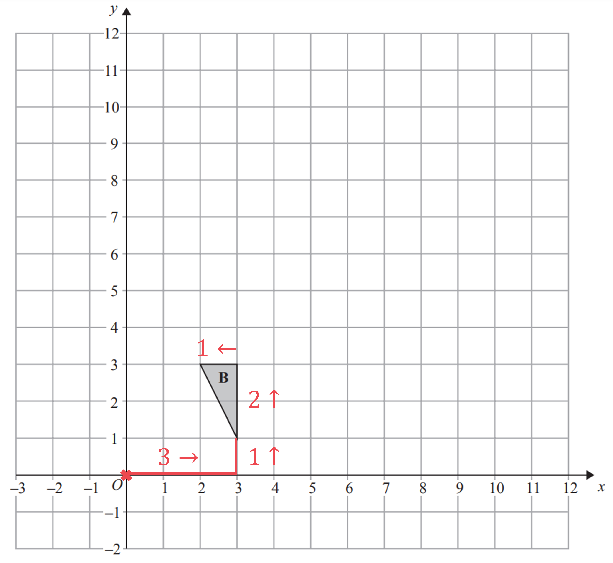

> *Multiply each length/displacement by the scale factor. Starting at the centre use the new displacement to find the position of the new corner. Then use the new lengths to draw the enlarged shape.*

> *To check your answer you can draw a straight line going through the centre and a corner of the original shape, the corresponding corner on the enlarged shape should also lie on this line.*

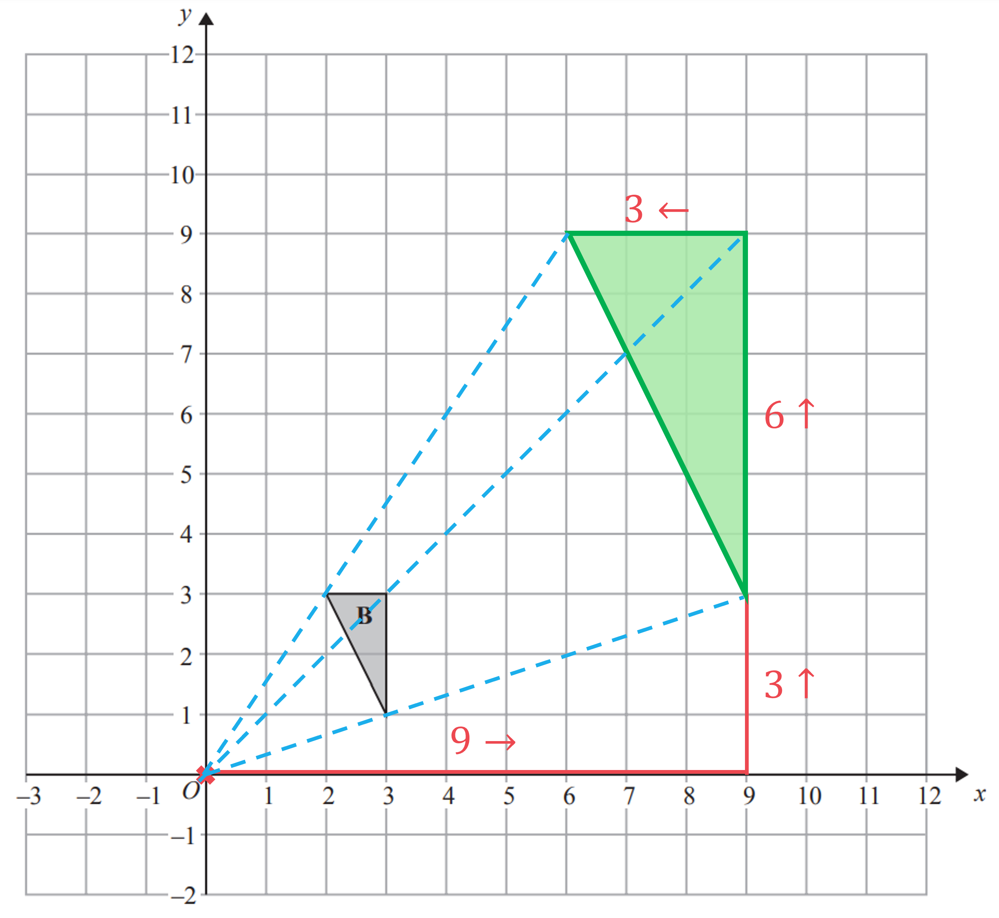

**Enlargement using the correct scale factor ****[1]** 
**Enlargement using the correct centre**** [1]**

## Q24 — medium — 3 marks · exam-questions

### 6() — 3 marks
> *The shape has been stretched so this is an enlargement.*

> *To find the scale factor, you need to divide the length of one the sides of the enlarged shape by the length of the corresponding side of the original shape.*

> *To find the centre of enlargement, for each of the corners of the original shape draw a straight line going through the corner and the corresponding corner of the enlarged shape. These lines will intersect at the centre of enlargement.*

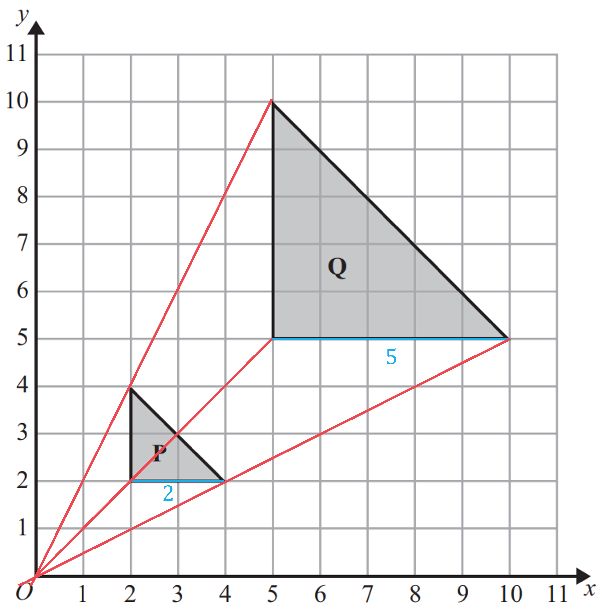

*Scale Factor =** *$\frac{5}{2}$

**Enlargement of scale factor 2.5 at the centre (0, 0)*** *
**Writing "Enlargement"**** [1]*** *
**Correct scale factor**** [1]*** *
**Correct centre**** [1]**

## Q25 — medium — 3 marks · exam-questions

### 5() — 3 marks
> *A reflection flips the shape.*

> *The perpendicular distance between the reflection of a point and the line of reflection is the same as the perpendicular distance between the original point and the line.*

> *Count how many squares there are between a corner and the **x**-axis. Then count the same number of squares on the other side of the axis, this is where the new corner will go. Do this for all the corners and then join together to make the new shape.*

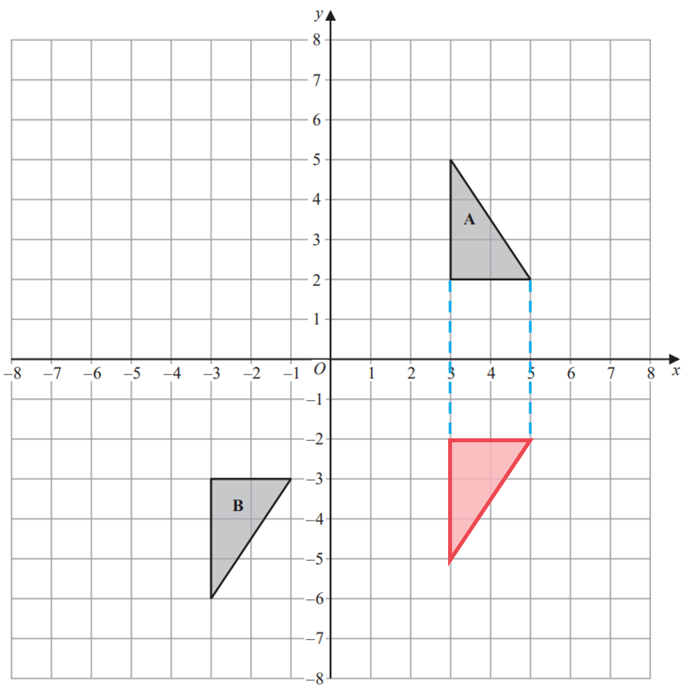

**[1]**

> *Pick a point on the reflected shape and find its corresponding point on the translated shape. Count how many units it has moved horizontally and vertically.*

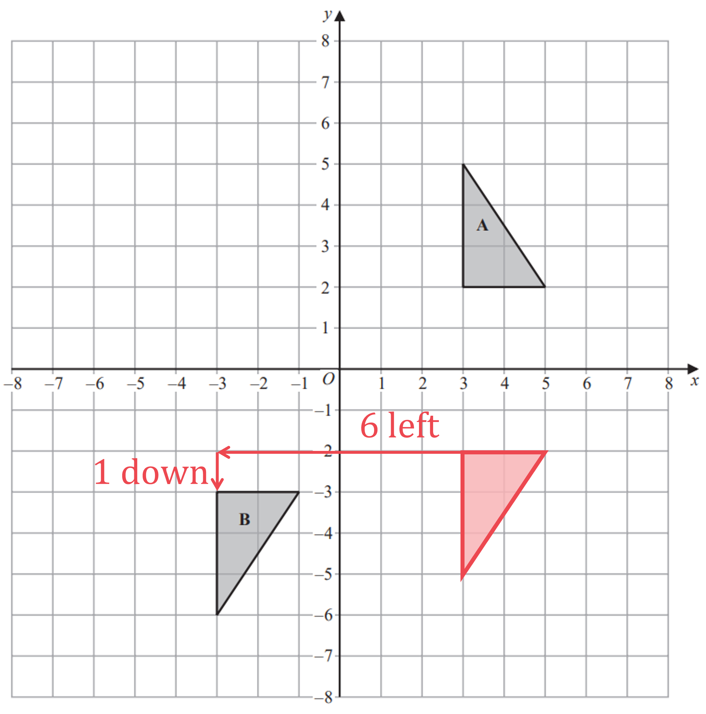

> *Write as a vector. The horizontal displacement goes at the top (right is positive, left is negative). The vertical displacement goes at the bottom (up is positive, down is negative).*

`open parentheses table row cell negative 6 end cell row cell negative 1 end cell end table close parentheses`

$c=-6\,d=-1$

**1 mark for each correct value**** [2]**

## Q26 — medium — 8 marks · exam-questions

### 4((a)) — 3 marks
> *We know each corner of triangle A has moved the same amount horizontally and vertically to get to triangle B*

> *Look at the corresponding corners and see which have complete coordinates*

> *Use these to work out the translation*

*Horizontal: 6 - (-7) = 13 right*

*Vertical: 12 - 2 = 10 up*

**[M1]**

> *Use these to calculate the missing coordinates*

> *d and e are both vertical moves so we add 10 to the corresponding y-coordinates of triangle A*

*d = -5 + 10*

*e = -3 + 10*

> *f is a horizontal move and we have the x-coordinate of B so we subtract 13*

*f = 9 - 13*

**[M1]**

* ***d = 5, e = 7, f = -4**

**[A1]**

> **[mark-scheme]**
> **M1**: For both calculations, could be given as a vector or in brackets.
> 
> **M1**: For at least two of these calculations.
> 
> **A1**: All correct.

### 4((b)) — 3 marks
> *How has shape P changed to become Q?*

> *The sides of Q are three times the length of the corresponding sides of P, so it's an enlargement*

> *Draw straight lines through the corresponding corners of the shapes, going from Q through P, and see where they meet to find the centre of enlargement*

**Final answer:** **An enlargement of scale factor 3 from centre (0,2)**

**[B1 B1 B1]**

> **[mark-scheme]**
> **B1**: For enlargement.
> 
> **B1**: For scale factor of 3.
> 
> **B1**: For centre (0,2).

### 3() — 2 marks
> **[exam-tip]**
> You could use tracing paper to help in this question.

> *Plot the point (3,5)*

> *Trace the shape and, keeping your pencil point on (3,5), rotate your tracing paper 90° clockwise. Then draw the image of the shape in the new position. Don't forget to label it R*

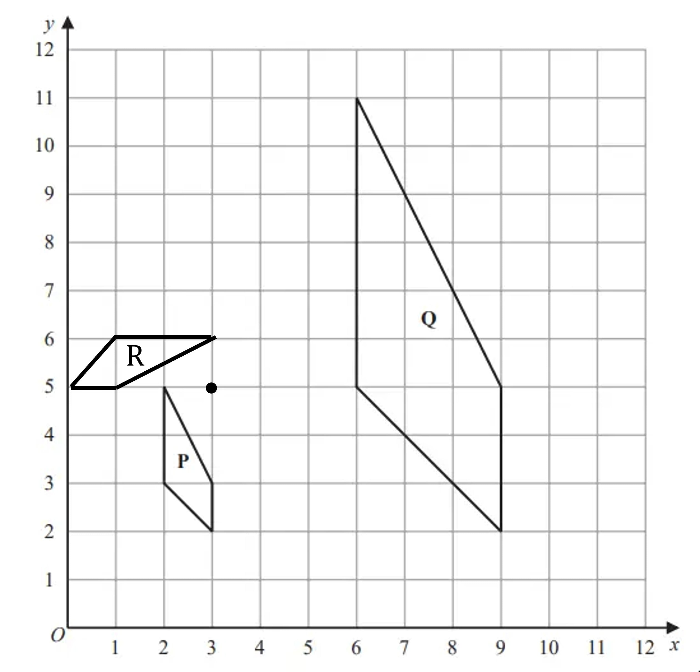

**[B1 B1]**

> **[mark-scheme]**
> **B1:** For the correct shape in the correct orientation in an incorrect position or three vertices in the correct place, or having rotated 90° anti-clockwise.
> 
> **B1:** Fully correct.

## Q27 — medium — 5 marks · exam-questions

### 3((a)) — 2 marks
> *Draw the line *$y=x$

> **[exam-tip]**
> Remember that this is a diagonal line passing through `open parentheses 0 comma 0 close parentheses comma space open parentheses 1 comma 1 close parentheses comma space open parentheses 2 comma 2 close parentheses` etc.

> *From each vertex on the original shape, *

- *Measure the distance to the mirror line by counting the squares diagonally towards the mirror line*
- *Find the reflected points by measuring the same distance on the other side of the mirror line*

> *Repeat for each vertex and then join*

**[B1 B1]**

> **[exam-tip]**
> For reflections in diagonal lines, it helps to turn your page so that the line is coming straight towards you. You can then gently fold your page along your mirror line to check that the shapes will meet exactly.

> **[mark-scheme]**
> **B1: **For the line $y=x$ drawn or a correct shape in the wrong place.
> 
> **B1: **Correct shape with all 8 points correct.

### 3((b)) — 3 marks
> *Triangle **B** is bigger than triangle **A** so the transformation is an enlargement*

> *To find the scale factor*

- *count how many squares tall the new triangle is*
- *divide by how many squares tall the original triangle is*

$3\div1=3$

> *To find the centre of enlargement, use a ruler to join corresponding vertices for at least 2 pairs of vertices*

> *The point where these lines meet is the centre of enlargement*

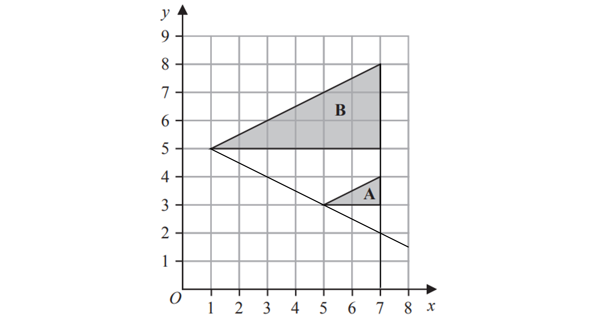

**Final answer:** **Enlargement**

**[B1]**

**Final answer:** **Scale factor 3**

**[B1]**

**Final answer:** **Centre of enlargement at **`open parentheses 7 comma 2 close parentheses`

**[B1]**

> **[mark-scheme]**
> No other transformation should be mentioned, otherwise you lose all marks.

## Q28 — hard — 2 marks · exam-questions

### 7() — 2 marks
> *An enlargement changes the size of the shape. As the scale factor is between 0 and 1, the shape should be smaller and closer to the centre of enlargement.*

> *Choose a corner and find the displacement from the centre to this corner. Starting at this corner count the distance of each side around the shape. You can ignore the diagonal side as this can be made by joining together the two corners.*

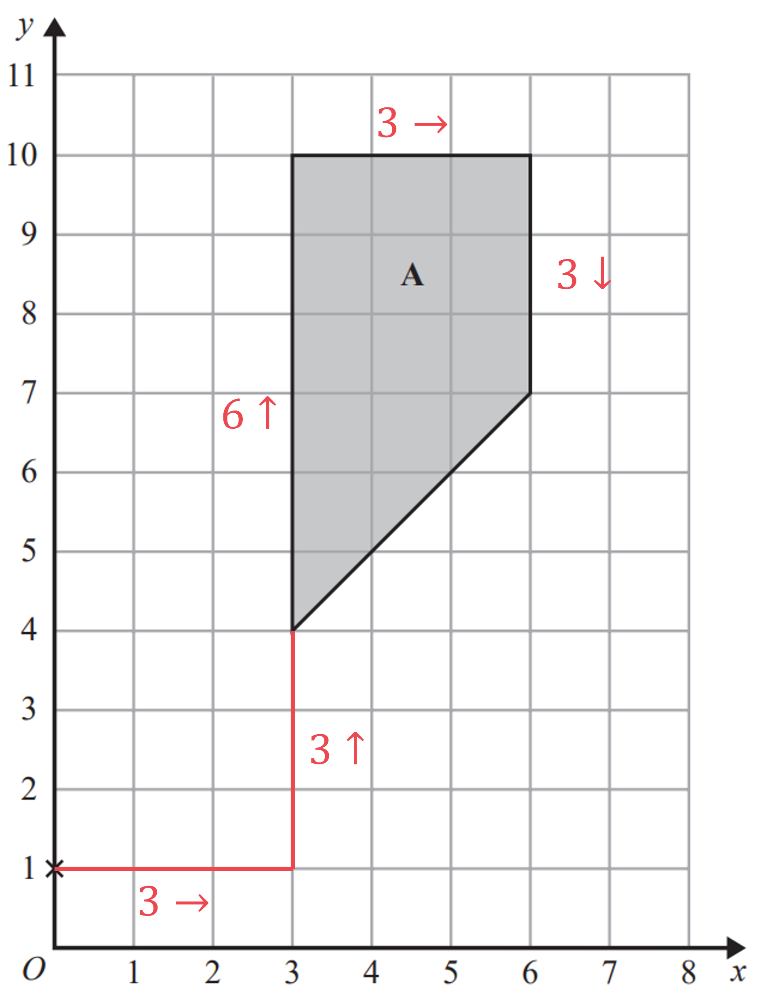

> *Multiply each length/displacement by the scale factor. Starting at the centre use the new displacement to find the position of the new corner. Then use the new lengths to draw the enlarged shape.*

> *To check your answer you can draw a straight line going through the centre and a corner of the original shape, the corresponding corner on the enlarged shape should also lie on this line.*

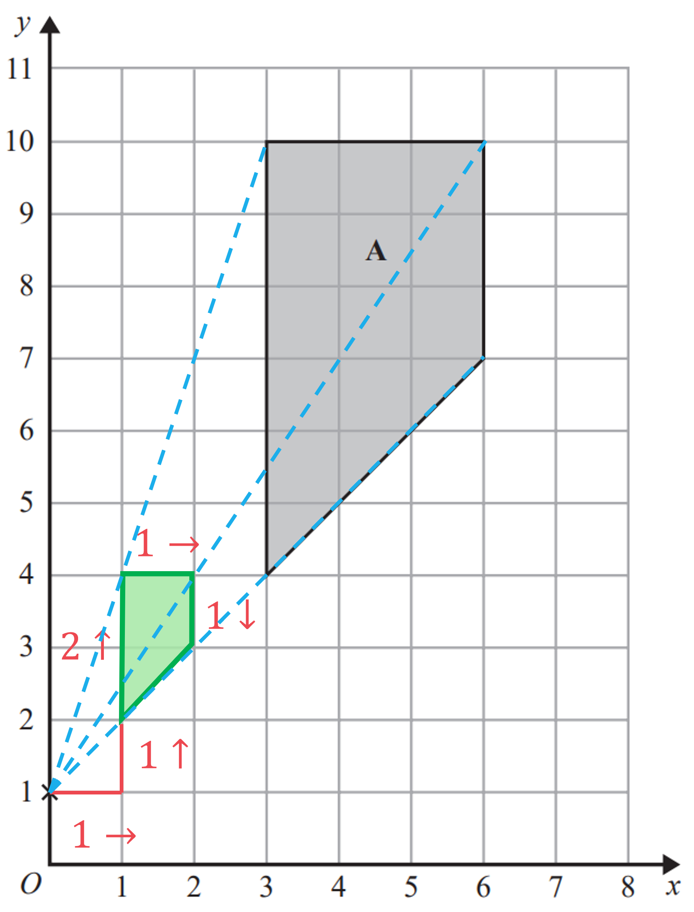

**Enlargement using the correct scale factor ****[1]** 
**Enlargement using the correct centre**** [1]**

## Q29 — hard — 3 marks · exam-questions

### 9() — 3 marks
> *A reflection flips the shape.*

> *The perpendicular distance between the reflection of a point and the line of reflection is the same as the perpendicular distance between the original point and the line.*

*Find the position of C by first reflecting A in the **x**-axis. Label this B.* *Then reflect B in the line **y** = **x**. Label this C.*

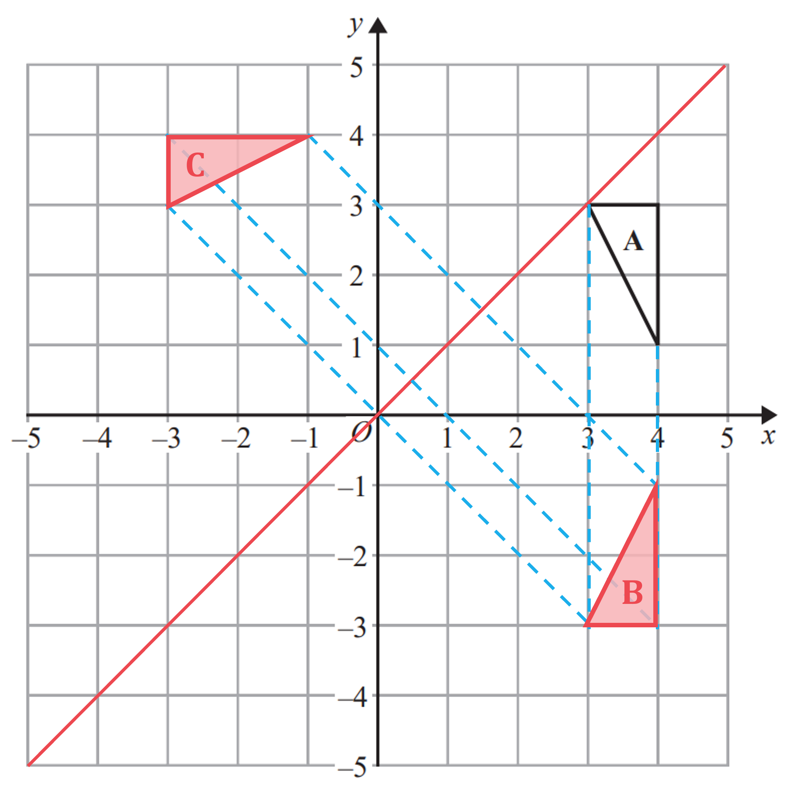

*Find the position of E by first reflecting A in the line **y** = **x**. Label this D.* *Then reflect D in the **x**-axis. Label this E.*

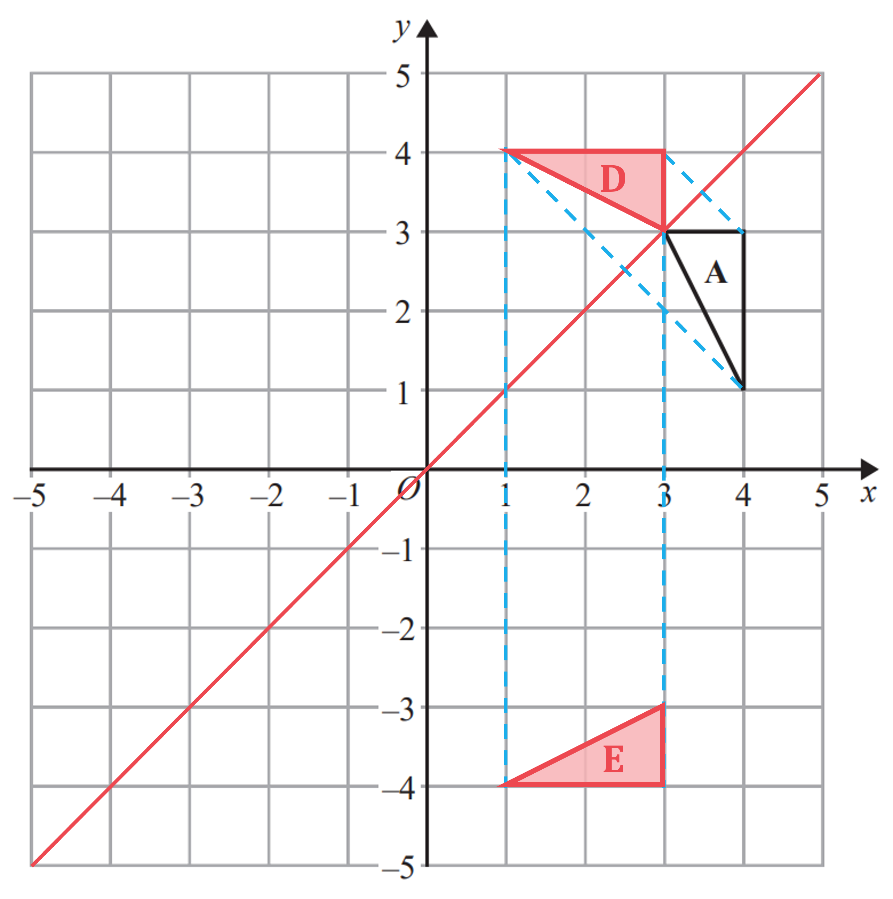

**B or D in the correct position**** [1] **
**C or E in the correct position**** [1]**

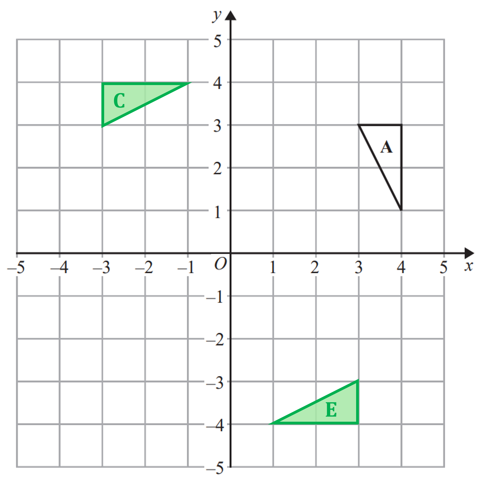

**Amy is incorrect as C and E are in different positions ****[1]**

## Q30 — hard — 3 marks · exam-questions

### 18() — 3 marks
> *A reflection flips the shape.*

> *The perpendicular distance between the reflection of a point and the line of reflection is the same as the perpendicular distance between the original point and the line.*

*Find the position of Q by first reflecting P in the line **x** = -1, this is a vertical line where all the **x**-coordinates are -1. Label this Q.* *Then reflect Q in the line **y** = **0**, this is just the **x**-axis. Label this R.*

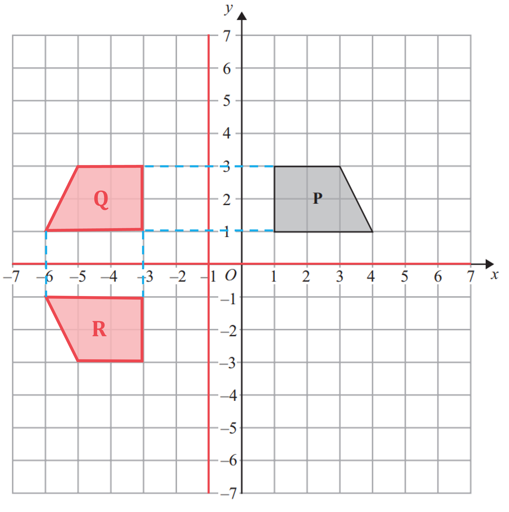

**Correct position for R ****[1]**

> *The shape has been turned so this is a rotation.*

> *Join each point of the original shape to its corresponding point on the rotated shape with a straight line. If the lines intersect at a point then this is the centre of rotation, otherwise the perpendicular bisectors of the lines will intersect at the centre of rotation.*

> *Using the centre, measure the angle from one point on the original to its corresponding point on the rotated shape.*

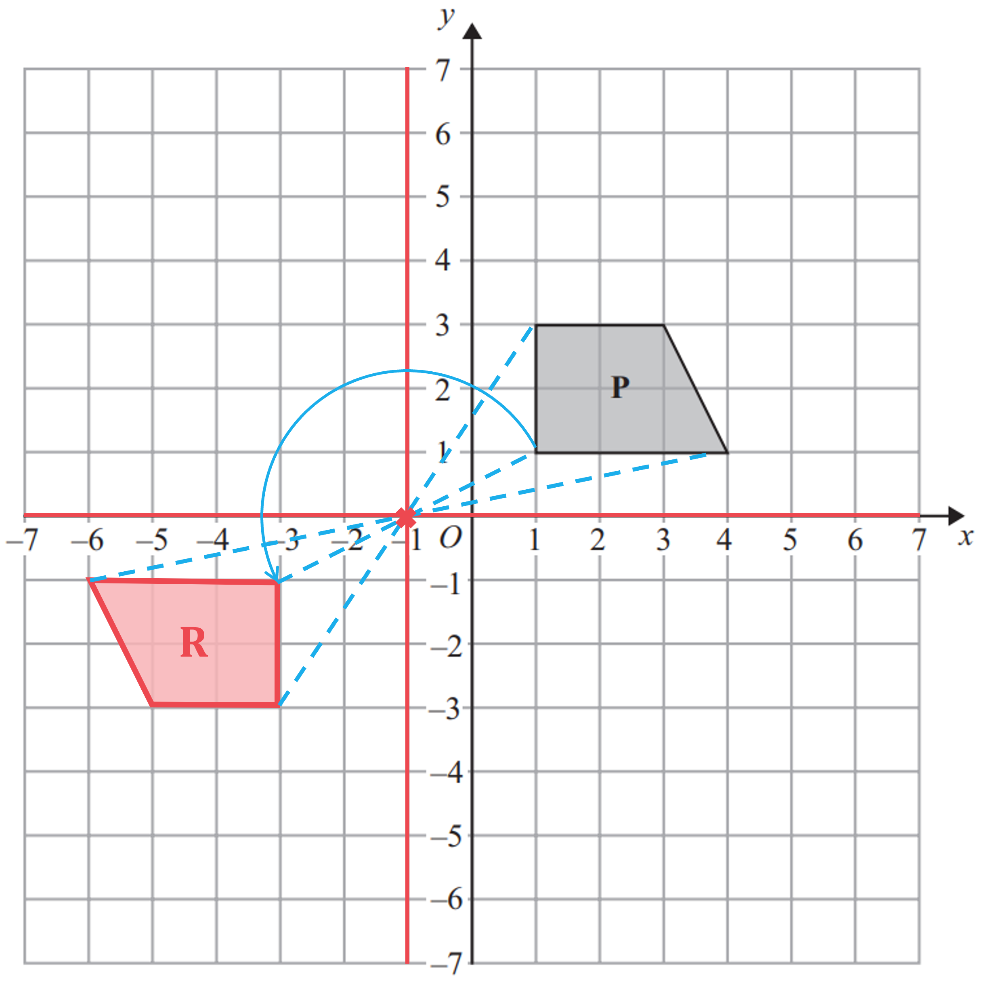

**Rotation 180° about the centre (-1, 0) **
**Writing "Rotation" with correct angle ****[1] **
**Correct centre ****[1] **
**It is not necessary to write a direction for a rotation of 180° It is also acceptable to write: Enlargement of scale factor -1 about the centre (-1, 0)**

## Q31 — hard — 2 marks · exam-questions

### 7() — 2 marks
> *A reflection flips the shape.*

> *The perpendicular distance between the reflection of a point and the line of reflection is the same as the perpendicular distance between the original point and the line.*

*Find the position of R by first reflecting T in the line **x** = -1, this is a vertical line where all the **x**-coordinates are -1. Label this R.* *Then reflect R in the line **y** = -2, this is a horizontal line where all the **y**-coordinates are -2. Label this S.*

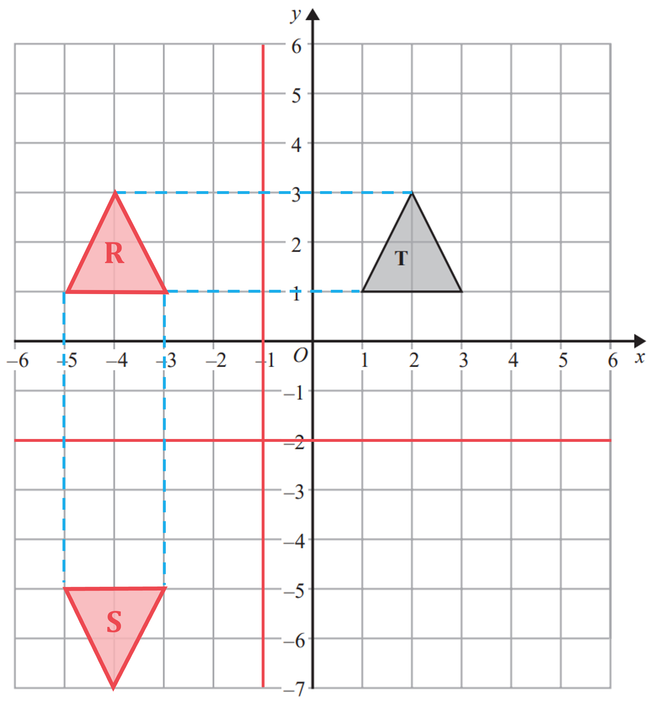

> *The shape has been turned so this is a rotation.*

> *Join each point of the original shape to its corresponding point on the rotated shape with a straight line. If the lines intersect at a point then this is the centre of rotation, otherwise the perpendicular bisectors of the lines will intersect at the centre of rotation.*

> *Using the centre, measure the angle from one point on the original to its corresponding point on the rotated shape.*

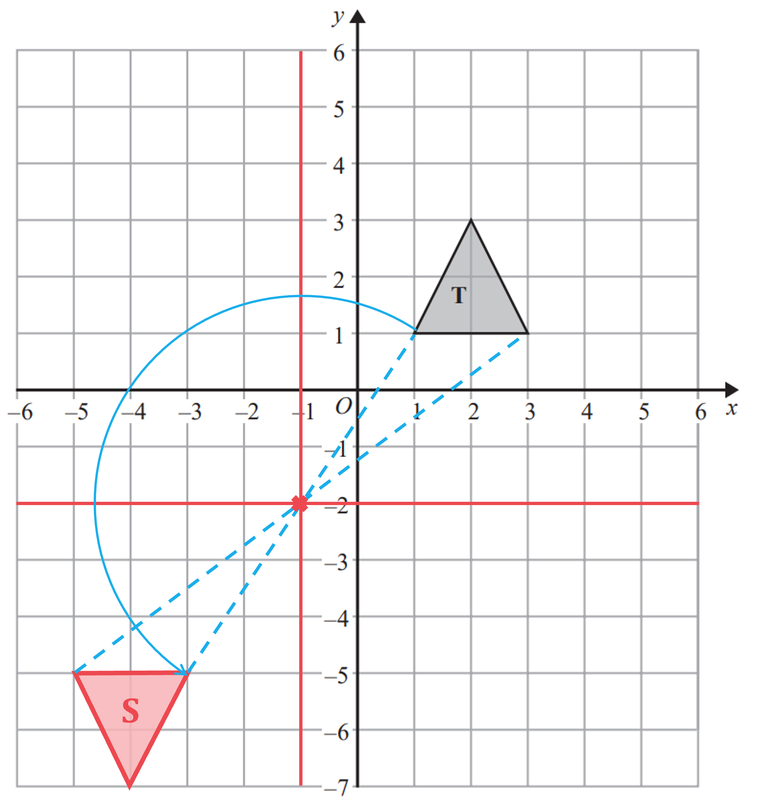

> *You could also use trial and error with tracing paper. Start with trying the centre as the origin and work outwards if needed.*

**Rotation 180° about the centre (-1, -2) **
**Writing "Rotation" with correct angle ****[1] **
**Correct centre ****[1] **
**It is not necessary to write a direction for a rotation of 180° It is also acceptable to write: Enlargement of scale factor -1 about the centre (-1, -2)**

## Q32 — hard — 3 marks · exam-questions

### 18() — 3 marks
> *Method 1*

> *An enlargement changes the size of the shape. As the scale factor is between 0 and 1, the shape should be smaller and closer to the centre of enlargement.*

> *Choose a corner and find the displacement from the centre to this corner. Starting at this corner count the distance of each side around the shape. You can ignore one of the diagonal sides as this can be made by joining together the two corners.*

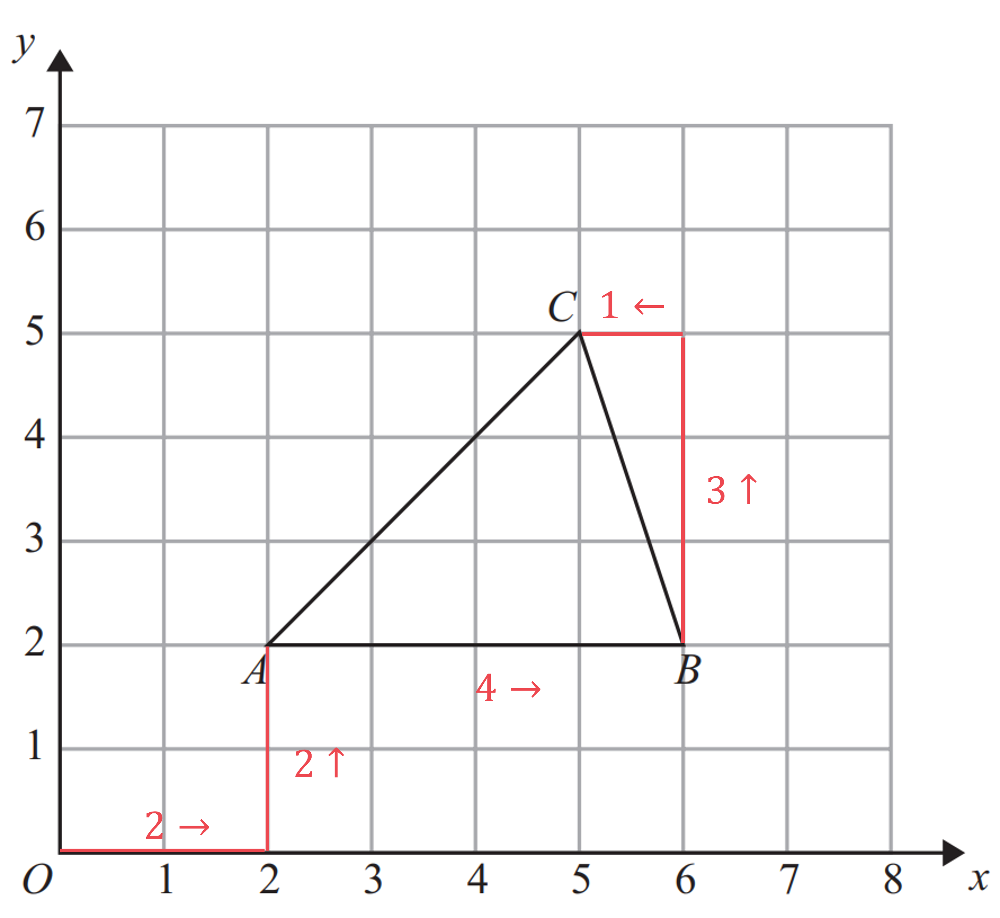

> *Multiply each length/displacement by the scale factor. Starting at the centre use the new displacement to find the position of the new corner. Then use the new lengths to draw the enlarged shape.*

> *To check your answer you can draw a straight line going through the centre and a corner of the original shape, the corresponding corner on the enlarged shape should also lie on this line.*

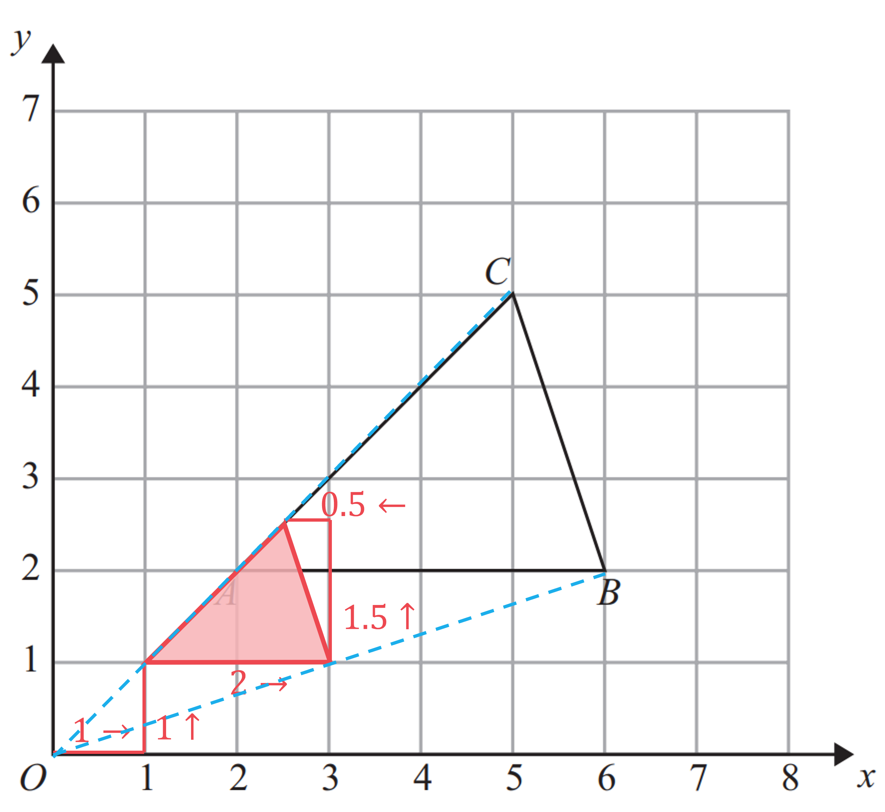

**[1]**

> *Find the area of the new triangle using the formula *$A=\frac{1}{2}\timesb\timesh$*, where **b** is the base and **h** is the perpendicular height.*

$A=\frac{1}{2}\times2\times1.5$

**[1]**

**Area = 1.5 cm****2**** [1]**

> *Method 2*

> *Find the area of the new triangle using the formula *$A=\frac{1}{2}\timesb\timesh$*, where **b** is the base and **h** is the perpendicular height.*

`table row A equals cell 1 half cross times 4 cross times 3 end cell row blank equals cell 6 space cm squared end cell end table`

**[1]**

> *Find scale factor of the enlargement will be the length scale factor between the original triangle and the enlarged triangle. The area scale factor can be found by squaring the length scale factor.*

`Area space scale space factor space equals space open parentheses 1 half close parentheses squared equals 1 fourth`

> *Multiply the original area by the area scale factor.*

`table row cell 6 cross times 1 fourth end cell equals cell 6 over 4 end cell end table`

**[1]**

> *Simplify.*

**Area = 1.5 cm****2**** [1]**

## Q33 — hard — 3 marks · exam-questions

### 1() — 3 marks
> *An enlargement changes the size of the shape.*

> *Choose a corner and find the displacement from the centre to the corners.*

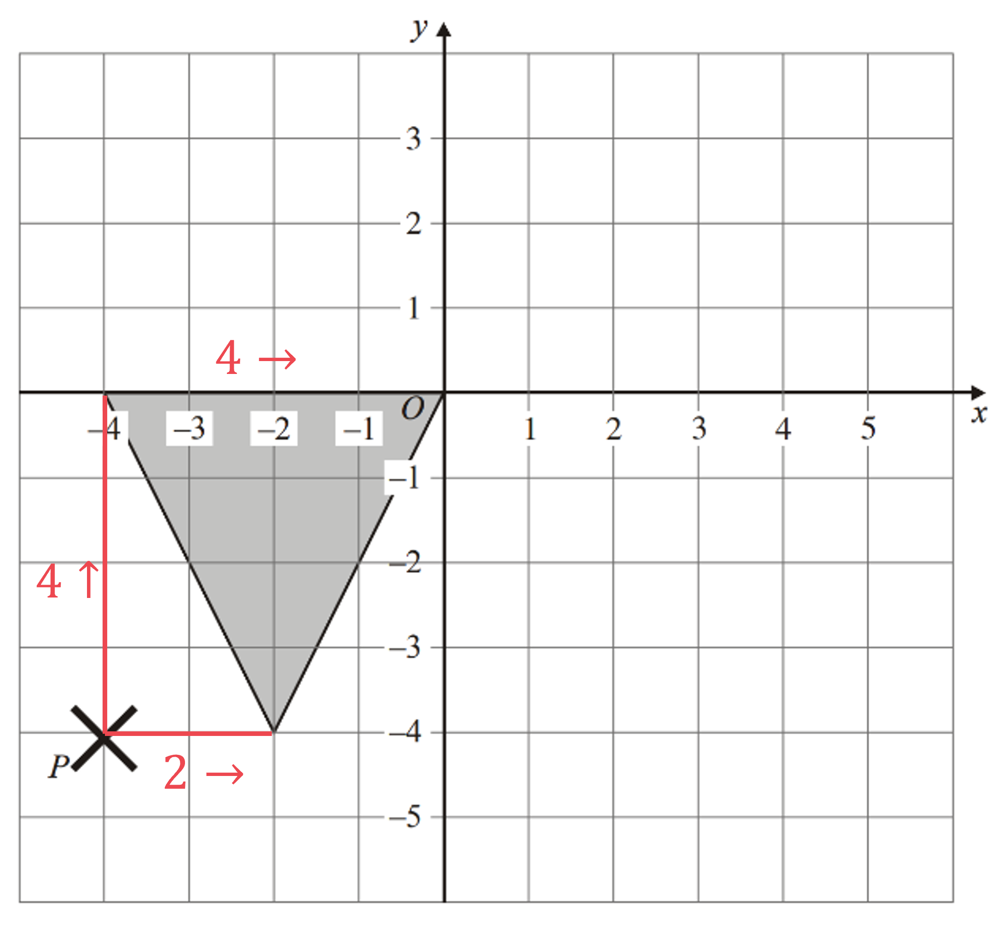

> *Multiply each length/displacement by the scale factor. Starting at the centre use the new displacement to find the position of the new corner. Then use the new lengths to draw the enlarged shape.*

> *To check your answer you can draw a straight line going through the centre and a corner of the original shape, the corresponding corner on the enlarged shape should also lie on this line.*

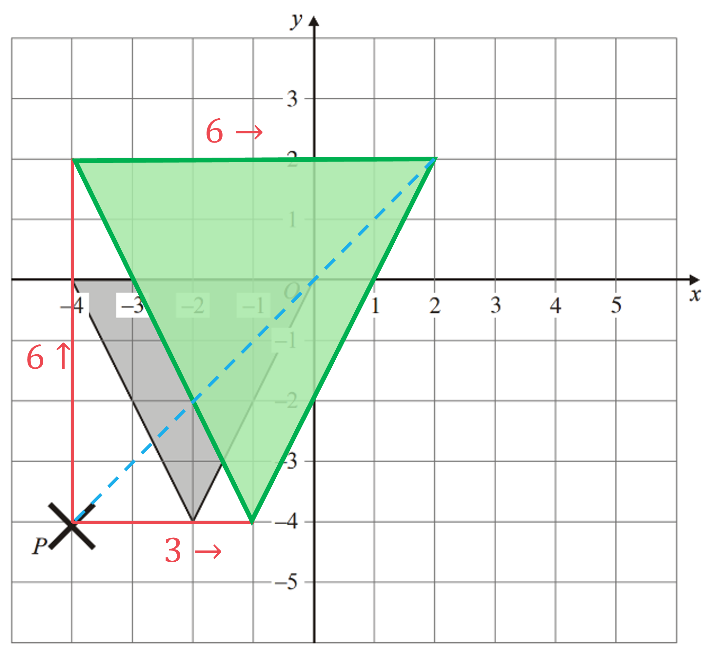

**Enlargement by any scale factor and any centre**** [1]** 
**Enlargement using the correct scale factor ****[1]** 
**Enlargement using the correct centre**** [1]**

## Q34 — hard — 2 marks · exam-questions

### 8((a)) — 1 marks
> *For Pythagoras' theorem *$a^{2}+b^{2}=c^{2}$*, the length by itself (**c**) is the hypotenuse of the triangle. The hypotenuse is the longest side.*

**Sarah has not put the hypotenuse by itself so it should be*** *$AC^{2}=AB^{2}+BC^{2}$** [1]**

### 8((b)) — 1 marks
> *Check the scale factor. Divide the length **XY** by the length **PQ**.*

*Scale factor =* $\frac{5}{2}$

**Roy has used the scale factor **$2\frac{1}{2}$** instead of**** **$1\frac{1}{2}$ **[1]**

## Q35 — hard — 3 marks · exam-questions

### 14() — 3 marks
> *A rotation turns the shape.*

> *Use tracing paper. Hold the tracing paper down at the point (0, 1) and rotate it 90° clockwise (a quarter turn). Draw the new shape and label it B.*

> *A translation moves the shape.*

> `open parentheses table row cell negative 3 end cell row cell negative 1 end cell end table close parentheses`* means 3 unit to the left and 1 unit down. *
*Move B and label it C.*

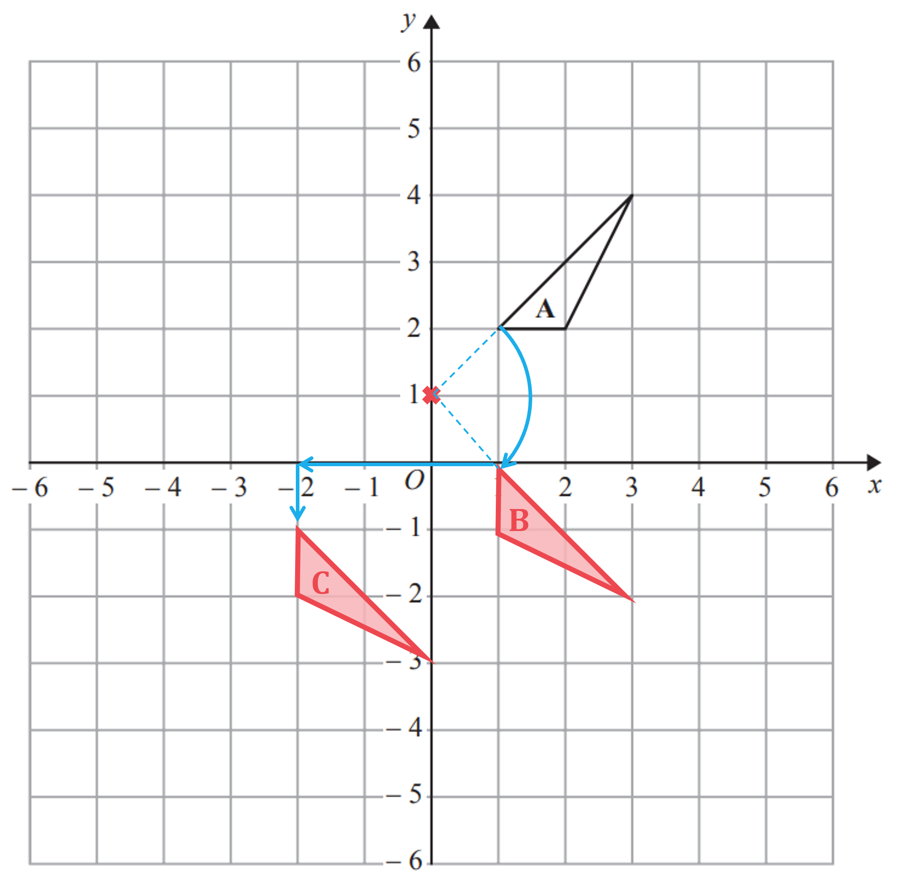

**[1]**

> *The shape has been turned so this is a rotation.*

> *Join each point of the original shape to its corresponding point on the rotated shape with a straight line. If the lines intersect at a point then this is the centre of rotation, otherwise the perpendicular bisectors of the lines will intersect at the centre of rotation.*

> *Using the centre, measure the angle from one point on the original to its corresponding point on the rotated shape. State the direction.*

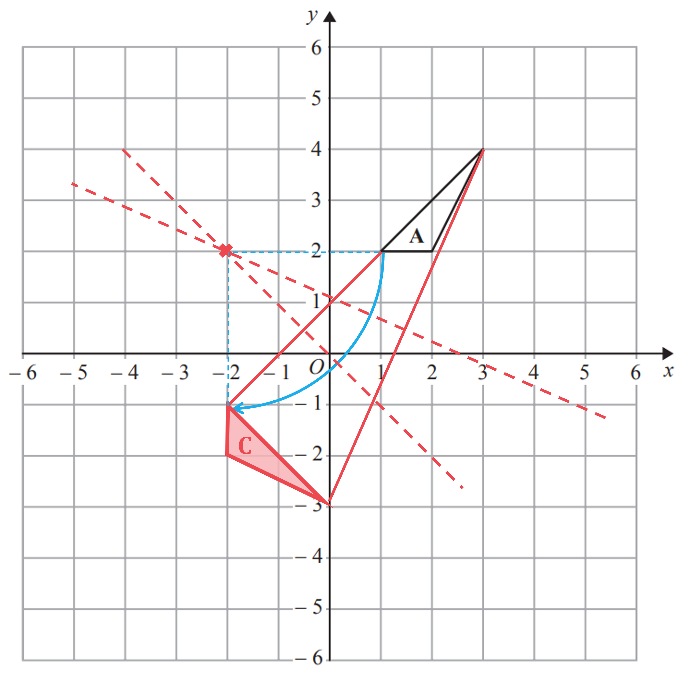

> *You could also use trial and error with tracing paper. Start with trying the centre as the origin and work outwards if needed.*

**Rotation 90° clockwise about the centre (-2, 2) **
**Writing "Rotation" with correct angle ****[1] **
**Writing "Rotation" with correct centre ****[1] **
**It is acceptable to write: 270° anticlockwise**

## Q36 — hard — 2 marks · exam-questions

### 5((a)) — 2 marks
*Draw a cross at the point (-3, 2)* *Use tracing paper to rotate **P** by 180° about (-3, 2)* *Label the new shape **Q*

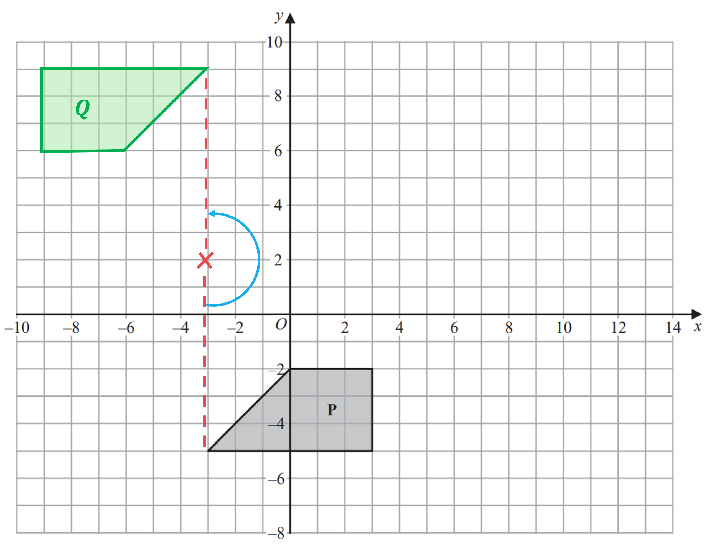

**shape rotated by 180°**** [1]**

**correct position**** [1]**

## Q37 — hard — 3 marks · exam-questions

### 3((a)) — 3 marks
> *Rotating triangle **A** by 90° clockwise gives the correct orientation of triangle **B**, so this is a rotation  *

*rotation by 90° clockwise**  *

> *Find the coordinates of the centre of rotation, either by testing points or using this rule:*

> *Join corresponding corners together with straight lines - either all lines intersect at one point (the centre of rotation) or all their perpendicular bisectors intersect at one point (the centre of rotation)  *

*the lines do not intersect at a single point use a compass and ruler to draw their perpendicular bisectors (dotted)*

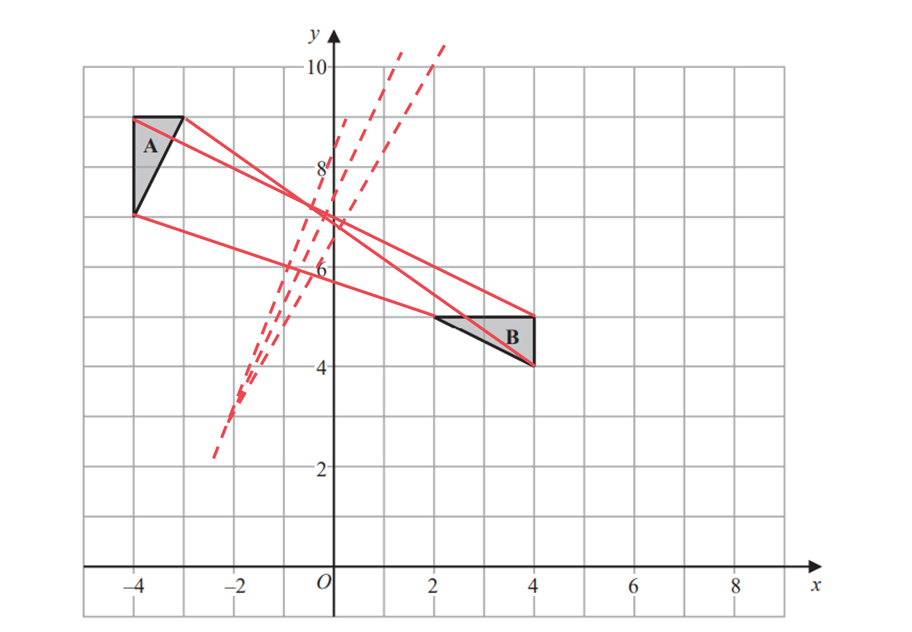

*perpendicular bisectors intersect at (-2, 3)  *
*centre of rotation is (-2, 3)*

> *Your final answer needs the name of the transformation, the degrees of rotation, whether its clockwise or anticlockwise, and the coordinates of the centre of rotation*

**This is a rotation** **[1]** 
**by 90° clockwise ****[1]** 
**about centre (-2, 3)** **[1]**
