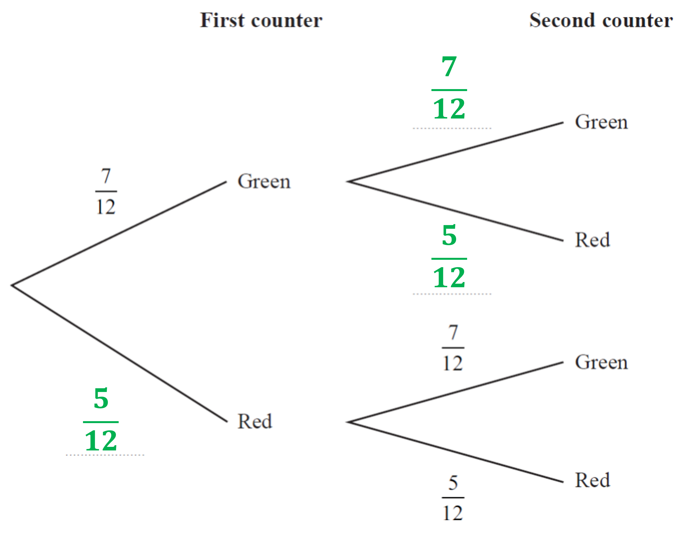
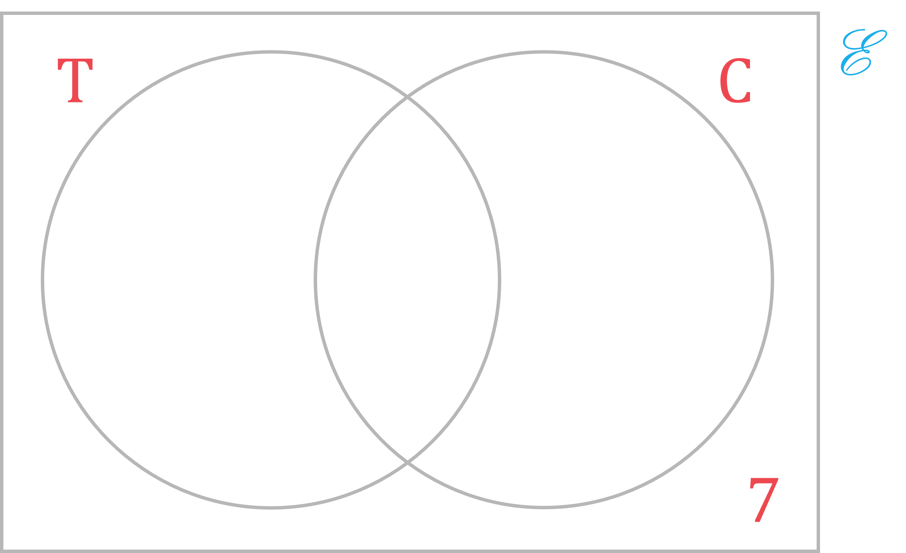
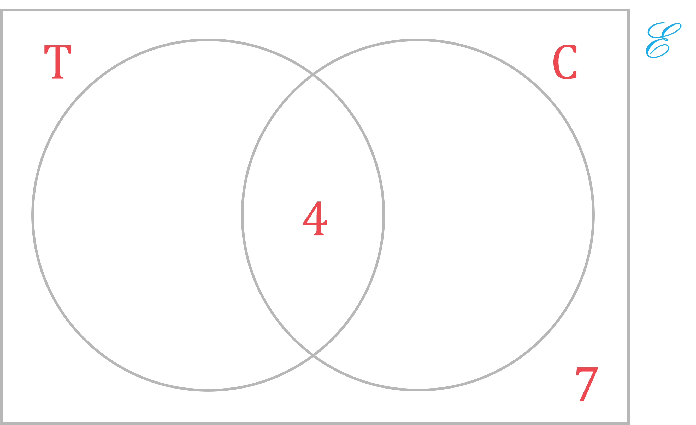
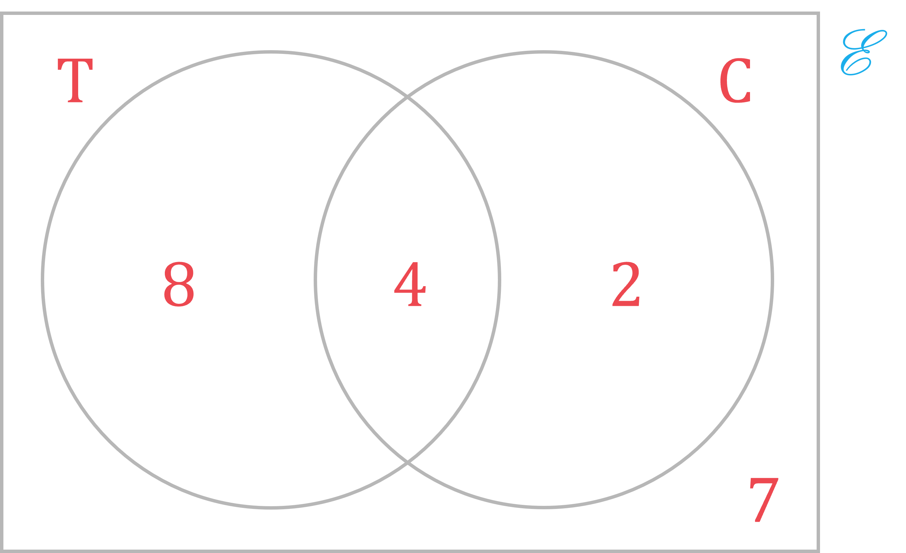
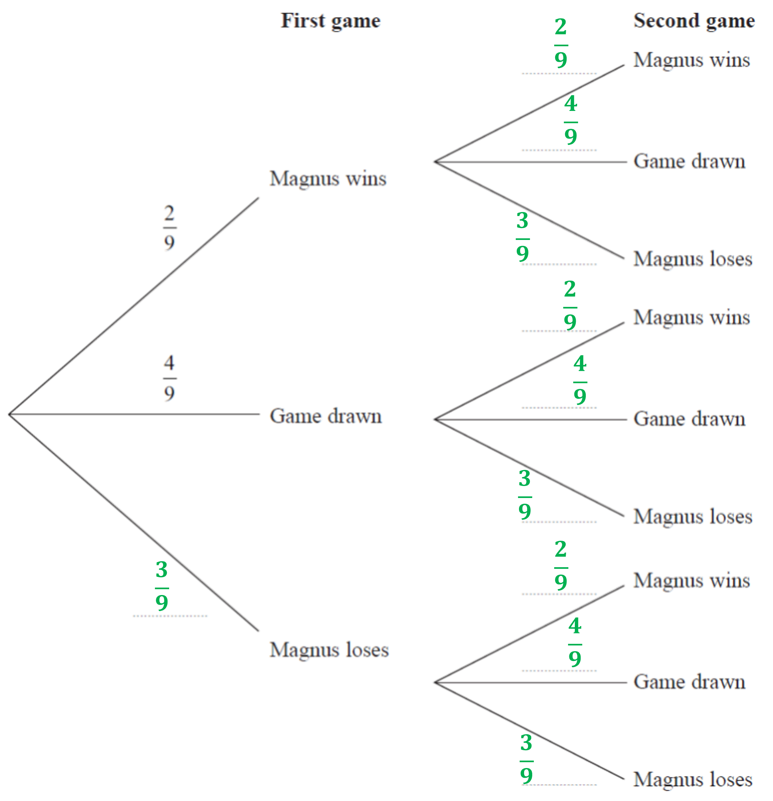

# Mark Schemes — Combined & Conditional Probability
**Statistics & Probability** · Edexcel IGCSE Maths A (4MA1) — 18/Higher

## Q1 — medium — 3 marks · exam-questions

### 8((a)) — 1 marks
> *To determine experimental probabilities, an experiment should be repeated as many times as possible.  The more repetitions, the more reliable the results.*

**Mel's results will give the best estimate, because she dropped the drawing pin the greatest number of times.****  ****[1]**

### 8((b)) — 2 marks
> *First find the relative frequencies (i.e., experimental probabilities) for 'point up' and 'point down', by dividing the total number of times the pin landed point up or point down by the total number of times it was dropped. Then multiply those relative frequencies together to determine an estimate for the probability the pin will land point up the first time AND point down the second time. *
*Remember, with combined probabilities 'and' usually means 'multiply'.*

`straight P open parentheses point space up close parentheses space equals space fraction numerator 14 plus 27 plus 9 over denominator 31 plus 53 plus 16 plus 14 plus 27 plus 9 end fraction space equals space fraction numerator space 50 over denominator 150 end fraction equals space 1 third

straight P open parentheses point space down close parentheses space equals space fraction numerator 31 plus 53 plus 16 over denominator 31 plus 53 plus 16 plus 14 plus 27 plus 9 end fraction space equals space 100 over 150 space equals space 2 over 3

1 third space cross times space 2 over 3 space equals space 2 over 9`*                          *

**[1]**

$\frac{2}{9}$**  ****[1]**

## Q2 — medium — 3 marks · exam-questions

### 1() — 3 marks
**Method 1**

Finding the probability that he passes on the second attempt

- First is a fail (0.6)
- Second is a pass (0.75)

$0.6\times0.75=0.45$

**[M1]**

Add to this the probability that he passes on the first attempt (0.4)

$0.4+0.45$

**[M1]**

**Final answer:** **0.85**

**[A1]**

**Method 2**

Find the probability that he fails on his second attempt

- First is a fail (0.6)
- Second is a fail (0.25)

$0.6\times0.25=0.15$

**[M1]**

Subtract this from 1 to find the probability that he does not need more than 2 attempts

$1-0.15$

**[M1]**

**Final answer:** **0.85**

**[A1]**

## Q3 — medium — 1 marks · exam-questions

### 16() — 1 marks
> *In combined probabilities, 'and' usually means 'multiply'. But that is only true if the events are independent of one another.*

**Alfie is assuming that 'Sanay being late' and 'Jaden being late' are independent.***  ***[1]**

## Q4 — medium — 3 marks · exam-questions

### 22() — 3 marks
> *We can use the fact that the total of all the probabilities must sum to 1. Subtract 0.6 from 1 to find the probability of 'tails'.*

$1-0.6=0.4$

**[1]**

> *In combined probabilities 'and' usually means 'multiply'. *
*Here we want the probability for 'tails AND tails AND tails'.*

$0.4\times0.4\times0.4=0.064$

**[1]**

> *Finally, interpret your result in the context of the question.*

**The probability is 0.064, and 0.064 < 0.1.  So Shabeen is correct. *** ***[1]**

## Q5 — medium — 5 marks · exam-questions

### 21((a)) — 2 marks
> *With combined probabilities 'and' usually means 'multiply'. 'Both have the number 1 on them' is the same as 'takes a 1 the first time AND takes a 1 the second time'. *
*The first time there are two 1's out of seven tiles. *
*If he takes a 1 the first time, then there is one 1 left out of six tiles remaining. *
*So multiply 2/7 by 1/6 to find the answer.*

$\frac{2}{7}\times\frac{1}{6}=\frac{2}{42}$

**[1]**

$\frac{2}{42}$**  [1]**

**Simplifying to 1/21 will also get the mark here, though it isn't necessary.**

### 21((b)) — 3 marks
> *With combined probabilities 'and' usually means 'multiply' and 'or' usually means 'add'. *
*The possible ways for the number on the second tile to be greater than the number on the first tile are:      *
*Take a 1 (2/7) AND then take a 2 or a 3 (5/6). *
*OR     *
* Take a 2 (3/7) AND then take a 3 (2/6). *
*So multiply those fractions together and then add to find the answer.*

`open parentheses 2 over 7 space cross times space 5 over 6 close parentheses space plus space open parentheses 3 over 7 space cross times space 2 over 6 close parentheses space equals space 16 over 42`

**[2] **
**1 mark for a correct product.  **
**1 mark for all correct products added together.**

$\frac{16}{42}$**  [1]**

**Simplifying to 8/21 will also get the mark here, though it isn't necessary.**

**You can also find the answer (and get full marks) here by drawing a sample space diagram.**

## Q6 — medium — 4 marks · exam-questions

### 17() — 4 marks
> *With combined probabilities 'and' usually means 'multiply' and 'or' usually means 'add'. *
*The possible ways for Ria to take one counter of each colour are:      *
*Take a green counter (7/9) AND then take a blue counter (2/8) *
*OR     *
* Take a blue counter (2/9) AND then take a green counter (7/8). *
*So multiply those fractions together and then add to find the answer.*

`open parentheses 7 over 9 space cross times space 2 over 8 close parentheses space plus space open parentheses 2 over 9 space cross times space 7 over 8 close parentheses space equals space 14 over 72 space plus space 14 over 72 space equals space 28 over 72`

**[3] **
**1 mark for a correct fraction with 8 in the denominator. **
** 1 mark for a correct product.  1 mark for two correct products added together.**

$\frac{28}{72}$**  [1]**

**Simplifying to 14/36 or 7/18 will also get the mark here, though it isn't necessary.**

## Q7 — medium — 4 marks · exam-questions

### 26() — 4 marks
> *With combined probabilities 'and' usually means 'multiply' and 'or' usually means 'add'. *
*With three coins, exactly £2.50 means taking two £1 coins and one 50 pence coin. *
*The possible ways for Ria to do that are:      *
*Take a £1 (3/10) AND then take a £1 (2/9) AND then take a 50p (7/8) *
*OR      *
*Take a £1 (3/10) AND then take a 50p (7/9) AND then take a £1 (2/8) *
*OR     *
* Take a 50p (7/10) AND then take a £1 (3/9) AND then take a £1 (2/8). *
*So multiply those fractions together and then add to find the answer.*

$\frac{3}{10}\times\frac{2}{9}\times\frac{7}{8}=\frac{42}{720}\,\,\frac{3}{10}\times\frac{7}{9}\times\frac{2}{8}=\frac{42}{720}\,\,\frac{7}{10}\times\frac{3}{9}\times\frac{2}{8}=\frac{42}{720}\,\,\frac{42}{720}+\frac{42}{720}+\frac{42}{720}=\frac{126}{720}$

**[3] **
**1 mark for a correct set of fractions with 10, 9 and 8 in the denominators.  **
**1 mark for a correct product.  **
**1 mark for three correct products added together.**

$\frac{126}{720}$**  [1]**

**Simplifying to 63/360, 42/240, 21/120, 14/80, or 7/40 will also get the mark here, though it isn't necessary.**

## Q8 — medium — 6 marks · exam-questions

### 23((a)) — 3 marks
> *With combined probabilities 'and' usually means 'multiply'. 'Both counters are blue' is the same as 'take a blue counter (7/11) AND then take another blue counter (6/10)'. *
*(Remember that the total number of counters, and the number of blue counters, is different the second time.) *
*So multiply those fractions together to find the answer.*

$\frac{7}{11}\times\frac{6}{10}=\frac{42}{110}$

**[2] **
**1 mark for having 11 and 10 in the denominators.  1 mark for multiplying the correct fractions together.**

$\frac{42}{110}$**  [1]**

**Simplifying to 21/55 will also get the mark here, though it isn't necessary.**

### 23((b)) — 3 marks
> *With combined probabilities 'and' usually means 'multiply' and 'or' usually means 'add'. 'The 2 counters are different colours' is the same as     *
* Take a blue counter (7/11) AND then take a green or a red counter (4/10) *
*OR      *
*Take a green counter (3/11) AND then take a blue or a red counter (8/10) *
*OR      *
*Take a red counter (1/11) AND then take a blue or a green counter (10/10). *
*(Remember that the total number of counters he is choosing from is different the second time.) *
*So multiply those fractions and then add the products together to find the answer.*

$\frac{7}{11}\times\frac{4}{10}=\frac{28}{110}\,\,\frac{3}{11}\times\frac{8}{10}=\frac{24}{110}\,\,\frac{1}{11}\times\frac{10}{10}=\frac{10}{110}\,\,\frac{28}{110}+\frac{24}{110}+\frac{10}{110}=\frac{62}{110}$

**[2] **
**1 mark for two correct products.  1 mark for three correct products added together.**

$\frac{62}{110}$**  [1]**

**Simplifying to 31/55 will also get the mark here, though it isn't necessary. **
**Other correct methods leading to the correct answer will also get full marks.**

## Q9 — medium — 3 marks · exam-questions

### 16() — 3 marks
> *First of all note that because Niklas puts his counter back, the probabilities are all the same when Sasha takes a counter. *
*Also note that there must be  15 - (4 + 5) = 6  yellow counters.*

> *With combined probabilities 'and' usually means 'multiply' and 'or' usually means 'add'. *
*The possible ways for Niklas and Sasha to take counters of the same colour are:      *
*Niklas red (4/15) AND Sasha red (4/15) *
*OR      *
*Niklas green (5/15) AND Sasha green (5/15) *
*OR      *
*Niklas yellow (6/15) AND Sasha yellow (6/15). *
*So multiply those fractions together and then add to find the answer.*

`open parentheses 4 over 15 space cross times space 4 over 15 close parentheses space plus space open parentheses 5 over 15 space cross times space 5 over 15 close parentheses space plus space open parentheses 6 over 15 space cross times space 6 over 15 close parentheses space equals space 16 over 225 space plus space 25 over 225 space plus space 36 over 225 space equals space 77 over 225`

**[2] **
**1 mark for a correct product.  1 mark for three correct products added together.**

$\frac{77}{225}$**  [1]**

**You would also get the mark for 0.34(222...) or for 34(.222...)%.**

## Q10 — medium — 5 marks · exam-questions

### 15((a)) — 3 marks
> *First note that if the probability if heads is 0.3, then the probability of tails must be 1 - 0.3 = 0.7.*

> *With combined probabilities 'and' usually means 'multiply' and 'or' usually means 'add'. *
*The possible ways for Barney to get exactly three heads are:      Head (0.3) AND Head (0.3) AND Head (0.3) AND Tail (0.7) *
*OR      *
*Head (0.3) AND Head (0.3) AND Tail (0.7) AND Head (0.3) *
*OR      *
*Head (0.3) AND Tail (0.7) AND Head (0.3) AND Head (0.3) *
*OR      *
*Tail (0.7) AND Head (0.3) AND Head (0.3) AND Head (0.3).*
*So multiply those probabilities together and then add to find the answer.*

`open parentheses 0.3 cross times 0.3 cross times 0.3 cross times 0.7 close parentheses plus open parentheses 0.3 cross times 0.3 cross times 0.7 cross times 0.3 close parentheses plus open parentheses 0.3 cross times 0.7 cross times 0.3 cross times 0.3 close parentheses plus open parentheses 0.7 cross times 0.3 cross times 0.3 cross times 0.3 close parentheses
equals space 0.0189 space plus space 0.0189 space plus space 0.0189 space plus space 0.0189
equals 0.0756`

**[2] **
**1 mark for a correct product.  1 mark for four correct products added together.**

**0.0756****  [1] **
**You would also get the mark for **$\frac{189}{2500}$** or  0.075 or 0.076.**

**You could also do this by noting that there are 4 ways to get 3 heads: **
**HHHT, HHTH, HTHH, and THHH. **
**And for each of those ways, the probability is the same (because multiplication doesn't care what order you do it in!). For each way the probability is  **$0.3^{3}\times0.7$**.  So the total probability is  **`4 space cross times space open parentheses 0.3 cubed space cross times space 0.7 close parentheses space equals space 0.0756`**.**

### 15((b)) — 2 marks
> *The easiest way to do this is to note that 'heads at least once' means that 'four tails' DIDN'T happen. *
*So figure out the probability of getting four tails, and then subtract it from 1.*

> *With combined probabilities 'and' usually means 'multiply'. Getting four tails means:      *
*Tail (0.7) AND Tail (0.7) AND Tail (0.7) AND Tail (0.7). *
*So multiply those probabilities together and then subtract the product from 1.*

$0.7\times0.7\times0.7\times0.7=0.2401\,1-0.2401=0.7599$

**[1] **
**1 mark for a fully correct method**

**0.7599****  [1] **
**Answers between 0.759 and 0.760 will get the mark here**

**This can be done more simply as  **$1-0.7^{4}=0.7599$**.**

## Q11 — medium — 4 marks · exam-questions

### 16() — 4 marks
> *First find the probability that she will win at chess. *
*Call that probability "**p **". *
*The probability that she will win at both games is equal to the probability of winning at tennis multiplied by the probability of winning at chess. *
*Set up and solve an equation with that information.*

`table row cell 0.6 space cross times space p space end cell equals cell space 0.42 end cell row cell p space end cell equals cell space 0.42 space divided by space 0.6 end cell row cell p space end cell equals cell space 0.7 end cell end table`

**[1]**

> *Therefore the probability that she will win at chess is 0.7. *
*The total probability must always add up to 1, and 'win' and 'not win' are the only 2 options. *
*So to find the probability that she will NOT win at chess, subtract the probability that she will win from 1. *
*Then do the same thing for tennis.*

`straight P open parentheses don apostrophe straight t space win space at space chess close parentheses space equals space 1 space minus space 0.7 space equals space 0.3

straight P open parentheses don apostrophe straight t space win space at space tennis close parentheses space equals space 1 space minus space 0.6 space equals space 0.4`

**[1] **
**1 mark for either of those 'don't win' probabilities correct**

> *With combined probabilities 'and' usually means 'multiply'. *
*'Will not win either game' means:      *
*Don't win at tennis (0.4) AND Don't win at chess (0.3). *
*So multiply those probabilities together to find the answer.*

$0.3\times0.4=0.12$

**[1]**

**0.12****  [1]**

## Q12 — medium — 3 marks · exam-questions

### 15() — 3 marks
> *First of all, note that if the probability of Sophie passing on the first attempt is 0.7, then the probability of Sophie **failing** on the first attempt is 1 - 0.7 = 0.3.*

> *With combined probabilities 'and' usually means 'multiply' and 'or' usually means 'add'. *
*'Sophie takes at most 2 attempts to pass' means:      *
*'Sophie passes on the first attempt' (0.7) *
*OR      *
*'Sophie fails on the first attempt' (0.3) AND 'Sophie passes on the second attempt' (0.9). *
*Multiply and add to find the total probability.*

`0.7 space plus space open parentheses 0.3 space cross times space 0.9 close parentheses space equals space 0.7 space plus space 0.27 space equals space 0.97`

**[2] **
**1 mark for the correct product of 0.3 and 0.9.  **
**1 mark for a fully correct method.**

**0.97****  [1]**

## Q13 — medium — 5 marks · exam-questions

### 17((a)) — 3 marks
> *With combined probabilities 'and' usually means 'multiply' and 'or' usually means 'add'. *
*'Exactly one of them said laptop' is the same as:      *
*Male says laptop (2/11) AND female says phone (5/9) *
*OR      *
*Male says phone (9/11) AND female says laptop (4/9) *
*So multiply those fractions together and then add to find the answer.*

$\frac{2}{11}\times\frac{5}{9}=\frac{10}{99}\,\,\frac{9}{11}\times\frac{4}{9}=\frac{36}{99}\,\,\frac{10}{99}+\frac{36}{99}=\frac{46}{99}$

**[2] **
**1 mark for a correct product.  1 mark for two correct products added together.**

$\frac{46}{99}$**  [1]**

**Simplifying to 63/360, 42/240, 21/120, 14/80, or 7/40 will also get the mark here, though it isn't necessary.**

### 17((b)) — 2 marks
> *With combined probabilities 'and' usually means 'multiply'. 'Both males said phone' is the same as 'First male says phone (9/11) AND second male says phone (8/10)*
* (After the first male says phone, there are only 8 males who said phone left, and only 10 males left in total.  So the numbers in the second probability have to change to reflect this.)*
* Multiply those fractions together to find the answer.*

$\frac{9}{11}\times\frac{8}{10}=\frac{72}{110}$

**[1] **
**This mark is for multiplying two correct probabilities together.**

$\frac{72}{110}$**  [1]**

**Simplifying to 36/55 will also get the mark here, though it isn't necessary. **
**Decimal answers between 0.65 and 0.655, or percentage answers between 65% and 65.5%, will also get the mark.**

## Q14 — medium — 2 marks · exam-questions

### 18((a)) — 2 marks
> *Start by writing down the probability for 'red' and simplifying it.*

`straight P open parentheses red close parentheses space equals space 10 over 20 space equals space 1 half`

**[1] **
**You don't need to simplify the fraction to get this mark, but it makes the next step easier!**

> *With combined probabilities 'and' usually means 'multiply'. 'They all take a red disc' is the same as 'Marnie takes red AND Nick takes red AND Ollie takes red'. *
*And because they put the disc back after taking it, the probability is the same each time. *
*So just multiply 1/2 by itself three times to find the total probability.*

$\frac{1}{2}\times\frac{1}{2}\times\frac{1}{2}=\frac{1}{8}$

$\frac{1}{8}$**  [1]**

**0.125 or 12.5% will also get the mark, as will any other fraction equivalent to 1/8 (for example 1000/8000).**

## Q15 — medium — 4 marks · exam-questions

### 15() — 4 marks
> *Start by finding the percentage of buses that are less than 10 years old.*

`100 space minus space 25 space equals space 75 percent sign space less space than space 10 space years space old`

**[1]**

> *That means that the probability of randomly choosing a bus more than 10 years old is 0.25, and the probability of randomly choosing a bus less than 10 years old is 0.75.*

> *With combined probabilities 'and' usually means 'multiply' and 'or' usually means 'add'. *
*'The bus starts first time' means:*
*      Bus is more than 10 years old (0.25) AND bus starts first time (0.3) *
*OR *
*     Bus is less than 10 years old (0.75) AND bus starts first time (0.65) *
*So multiply those probabilities together and then add to find the answer.*

$0.25\times0.3=0.075\,\,0.75\times0.65=0.4875\,\,0.075+0.4875=0.5625$

**[2]**

**1 mark for at least one correct product.  1 mark for two correct products added together.**

**0.5625**** **** [1]**

> *Fractional answer 9/16 will also get the mark here*

## Q16 — medium — 5 marks · exam-questions

### 13() — 5 marks
> *We need to know how many black cards there are. If this is not obvious to you, you can figure it out this way:*

$45\times\frac{1}{3}=15\mathrm{red} \mathrm{cards}\,\,45-15=30\mathrm{black} \mathrm{cards}$

> *With combined probabilities 'and' usually means 'multiply'. 'Picks two black cards' means 'first card black (30/45) AND second card black (29/44)': *
*(After picking 1 black card only 29 black cards and 44 cards in total remain, so the numerator and denominator of the second probability need to reflect this.)  *
*So multiply those probabilities together and then add to find the answer.*

$\frac{30}{45}\times\frac{29}{44}=\frac{2}{3}\times\frac{29}{44}=\frac{58}{132}$

**[4]**

**1 mark for 'first card black' probability correct.  1 mark for 44 in denominator of 'second card black' probability.  1 mark for 29 in numerator of 'second card black' probability.  1 mark for multiplying the two probabilities together.**

$\frac{58}{132}$**  ****[1]**

**Simplifying to 29/66 will also get the mark, though it is not necessary here. **
**Other equivalent fractions will also get the mark (for example 870/1980), as will digital answers between  0.439 and 0.44.**

## Q17 — medium — 6 marks · exam-questions

### 12((a)) — 2 marks
> *If you notice the patterns along the diagonals it can save you a bit of work having to do all the individual subtractions!*

**  [2]**

**1 mark for at least 10 entries correct, or 2 marks for all entries correct**

### 12((b)) — 4 marks
> *From the table in part (a), note that there are 6 × 6 = 36 possible outcomes in the sample space. *
*Of those, 10 of them have a difference of '1'.*

> *With combined probabilities, 'and' usually means 'multiply'. Here we want the probability that the first difference is 1 (10/36) AND the second difference is 1 (10/36) AND the third difference is 1 (10/36). *
*So multiply those probabilities together to find the answer.*

$\frac{10}{36}\times\frac{10}{36}\times\frac{10}{36}=\frac{5}{18}\times\frac{5}{18}\times\frac{5}{18}=\frac{125}{5832}$

**[3] **
**1 mark for correct probability 10/36 or 5/18.  1 mark for three identical probabilities multiplied together.  1 mark for correct value for final probability.**

$\frac{125}{5832}$**  [1]**

> *This final mark is for a correct answer given as a fraction in lowest terms.  *
*A decimal answer will NOT get this mark!*

**Your calculator may simplify the answer to  **$\frac{10}{36}\times\frac{10}{36}\times\frac{10}{36}$**  for you automatically.**

## Q18 — hard — 5 marks · exam-questions

### 6((a)) — 1 marks
> *To determine experimental probabilities, an experiment should be repeated as many times as possible.  The more repetitions, the more reliable the results.*

**Sharif's results will give the best estimate, because he threw the coin the greatest number of times****  ****[1]**

### 6((b)) — 2 marks
> *Look at the results of heads versus tails for each of the friends, then use that to reach your conclusion.*

$\mathrm{Paul} \mathrm{heads}:\mathrm{tails}=80:40=2:1=\mathrm{twice} \mathrm{as} \mathrm{likely}\,\,\mathrm{Ben} \mathrm{heads}:\mathrm{tails}=34:8=17:4=\mathrm{more} \mathrm{than}4\mathrm{times} \mathrm{as} \mathrm{likely}\,\,\mathrm{Helen} \mathrm{heads}:\mathrm{tails}=66:12=33:6=\mathrm{more} \mathrm{than}5\mathrm{times} \mathrm{as} \mathrm{likely}\,\,\mathrm{Sharif} \mathrm{heads}:\mathrm{tails}=120:40=3:1=3\mathrm{times} \mathrm{as} \mathrm{likely}\,$*                          *

**[1]**

**Paul's statement is true for his own results, but it is not true for the other friends' results.  Therefore Paul is not correct.****  ****[1]**

### 6((c)) — 2 marks
> *First find the relative frequency (i.e., experimental probability) for 'heads', by dividing the total number of times the coin landed on heads by the total number of times it was thrown. Then multiply that relative frequency by itself to determine an estimate for the probability the coin will land on heads the first time and then on heads again the second time.*

`straight P open parentheses heads close parentheses space equals space fraction numerator 34 plus 66 plus 80 plus 120 over denominator 34 plus 66 plus 80 plus 120 plus 8 plus 12 plus 40 plus 40 end fraction space equals space 300 over 400 space equals space 3 over 4

3 over 4 space cross times space 3 over 4 space equals space 9 over 16`*                          *

**[1]**

$\frac{9}{16}$**  ****[1]**

## Q19 — hard — 5 marks · exam-questions

### 1() — 5 marks
Write down the probability of choosing red or blue

$\frac{6}{x}$* or *$\frac{x-6}{x}$

**[M1]**

Calculate the probability of choosing red and blue or blue and red

$\frac{6}{x}\times\frac{x-6}{x-1}+\frac{x-6}{x}\times\frac{6}{x-1}=\frac{2}{7}$

**[M1]**

Simplify into a quadratic to solve

`fraction numerator 12 open parentheses x minus 6 close parentheses over denominator x open parentheses x minus 1 close parentheses end fraction equals 2 over 7
84 x minus 504 space equals 2 x squared minus 2 x
2 x squared minus 86 x space plus 504 space equals space 0 space
x squared minus 43 x plus space 252 space equals space 0 subscript blank`

**[M1]**

Solve the quadratic

`open parentheses x minus 36 close parentheses open parentheses x minus 7 close parentheses equals 0
x equals 36 space
x equals space 7`

**[M1]**

x must be more than 12:

- There are 6 red
- And there are more blue than red

**Final answer:** **36 cards in total**

**[A1]**

> **[mark-scheme]**
> **M1**: For finding a correct expression for a probability.
> 
> **M1**: For attempting to find an expression for the probability of obtaining a red and a blue.
> 
> **M1**: For forming a quadratic equation.
> 
> **M1**: For solving your quadratic equation.
> 
> **A1**: Correct answer.

## Q20 — hard — 3 marks · exam-questions

### 19() — 3 marks
> *First we can use the fact that probabilities must add to 1 to find the probabilities for 'doesn't buy fruit' and 'doesn't buy vegetables'.*

`straight P open parentheses no space fruit close parentheses space equals space 1 space minus space 0.7 space equals space 0.3

straight P open parentheses no space vegetables close parentheses space equals space 1 space minus space 0.4 space equals space 0.6`

**[1] **
**You get the mark here for subtracting to find either one of those probabilities.**

> *'Buys fruit or buys vegetables or buys both' means he buys **something**  I.e., he doesn't buy nothing. *
*Multiply 0.3 by 0.6 to find the probability for 'no fruit AND no vegetables'. Then subtract that from 1 to find the probability that he buys one or the other or both.*

`1 space minus space open parentheses 0.3 space cross times space 0.6 close parentheses space equals space 1 space minus space 0.18 space equals space 0.82`

**[1]**

**0.82****  [1]**

**You can also do this by multiplying to get the probabilities for 'fruit AND vegetables', 'fruit AND no vegetables', and 'no fruit AND vegetables', and then adding those together to get the answer. **
**I.e., **`open parentheses 0.7 space cross times space 0.4 close parentheses space plus space open parentheses 0.7 space cross times space 0.6 close parentheses space plus space open parentheses 0.3 space cross times space 0.4 close parentheses space equals space 0.82`

**Also note that you could draw a tree diagram here if you find that helpful.  But that's not necessary to get the marks or to find the answer.**

## Q21 — hard — 3 marks · exam-questions

### 18() — 3 marks
> *In combined probability, 'and' usually means 'multiply'. *
*So the probability of heads both times (i.e. of 'heads AND heads') is  *`straight P open parentheses heads close parentheses space cross times space straight P open parentheses heads close parentheses space space equals space open parentheses straight P open parentheses heads close parentheses close parentheses squared`*. *
*Take the square root of 0.09 to find the probability of the coin landing on heads.*

`straight P open parentheses heads close parentheses space equals space square root of 0.09 end root space equals space 0.3`

**[1]**

> *Subtract 0.3 from 1 to find *`straight P open parentheses tails close parentheses`*. *
*Then the probability of tails both times (i.e. of 'tails AND tails') is  *`straight P open parentheses tails close parentheses space cross times space straight P open parentheses tails close parentheses space space equals space open parentheses straight P open parentheses tails close parentheses close parentheses squared`*.*

`P open parentheses t a i l s close parentheses space equals space 1 space minus space 0.3 space equals space 0.7

0.7 squared space equals space 0.49`

**[1]**

**0.49****  [1]**

## Q22 — hard — 4 marks · exam-questions

### 25() — 4 marks
*With combined probabilities 'and' usually means 'multiply' and 'or' usually means 'add'. *
*'The 2 cards have different shapes on them' is the same as                          Turn over a circle (2/9) AND then turn over a square or triangle (7/8) *
*OR      *
        *Turn over a square (4/9) AND then turn over a circle or triangle (5/8) *
*OR*
*      Turn over a triangle (3/9) AND then turn over a circle or square (6/8). *
*(Note that there are only 8 shapes left after picking the first one, so the denominator changes to 8 the second time.)  *
*Multiply those fractions and then add the products together to find the answer.*

$\frac{2}{9}\times\frac{7}{8}=\frac{14}{72}\,\,\frac{4}{9}\times\frac{5}{8}=\frac{20}{72}\,\,\frac{3}{9}\times\frac{6}{8}=\frac{18}{72}\,\,\frac{14}{72}+\frac{20}{72}+\frac{18}{72}=\frac{52}{72}$

**[3] **
**1 mark for a correct probability with 8 in the denominator.  1 mark for one correct product.  1 mark for three correct products added together.**

$\frac{52}{72}$**  [1]**

**Simplifying to 26/36 or 13/18 will also get the mark here, though it isn't necessary. **
**Other correct methods leading to the correct answer will also get full marks.**

## Q23 — hard — 4 marks · exam-questions

### 25() — 4 marks
> *With combined probabilities 'and' usually means 'multiply' and 'or' usually means 'add'.*
*'The 2 biscuits were not the same type' is the same as*
*      Take a plain (12/20) AND then take a chocolate or ginger (8/19) OR*
*      Take a chocolate (5/20) AND then take a plain or ginger (15/19) OR *
*     Take a ginger (3/20) AND then take a plain or chocolate (17/19). *
*(Note that there are only 19 biscuits left after taking the first one, so the denominator changes to 19 the second time.)  *
*Multiply those fractions and then add the products together to find the answer.*

$\frac{12}{20}\times\frac{8}{19}=\frac{96}{380}\,\,\frac{5}{20}\times\frac{15}{19}=\frac{75}{380}\,\,\frac{3}{20}\times\frac{17}{19}=\frac{51}{380}\,\,\frac{96}{380}+\frac{75}{380}+\frac{51}{380}=\frac{222}{380}$

**[3] **
**1 mark for a correct probability with 19 in the denominator.  1 mark for one correct product.  **
**1 mark for three correct products added together.**

$\frac{222}{380}$** **** [1]**

**Simplifying to 111/190, or a decimal answer  0.58(421...), will also get the mark here, though neither is necessary. **
**Other correct methods leading to the correct answer will also get full marks.**

## Q24 — hard — 5 marks · exam-questions

### 24() — 5 marks
> *With combined probabilities 'and' usually means 'multiply' and 'or' usually means 'add'. *
*'She takes two different types of sandwiches' is the same as                    Take an egg sandwich (4/11) AND then take a cheese or ham sandwich (7/10) *
*OR*
*      Take a cheese sandwich (5/11) AND then take an egg or ham sandwich (6/10) *
*OR*
*      Take a ham sandwich (2/11) AND then take an egg or cheese sandwich (9/10). *
*(Note that there are only 10 sandwiches left after taking the first one, so the denominator changes to 10 the second time.)  Multiply those fractions and then add the products together to find the answer.*

$\frac{4}{11}\times\frac{7}{10}=\frac{28}{110}\,\,\frac{5}{11}\times\frac{6}{10}=\frac{30}{110}\,\,\frac{2}{11}\times\frac{9}{10}=\frac{18}{110}\,\,\frac{28}{110}+\frac{30}{110}+\frac{18}{110}=\frac{76}{110}$

**[4] **
**1 mark for a correct probability with 10 in the denominator.  1 mark for one correct product.  1 mark for two correct products added together.  1 mark for all three correct products added together.**

$\frac{76}{110}$**  [1]**

**Simplifying to 38/55 will also get the mark here, though it isn't necessary. Other correct methods leading to the correct answer will also get full marks.**

## Q25 — hard — 4 marks · exam-questions

### 25() — 4 marks
> *With combined probabilities 'and' usually means 'multiply' and 'or' usually means 'add'. *
*'The the two sweets will not be the same type' is the same as     *
* Take a fruit (18/30) AND then take an aniseed or a mint (12/29) *
*OR*
*      Take an aniseed (7/30) AND then take a fruit or a mint (23/29) *
*OR*
*      Take a mint (5/30) AND then take a fruit or an aniseed (25/29). (Note that there are only 29 sweets left after taking the first one, so the denominator changes to 29 the second time.)  *
*Multiply those fractions and then add the products together to find the answer.*

$\frac{18}{30}\times\frac{12}{29}=\frac{216}{870}\,\,\frac{7}{30}\times\frac{23}{29}=\frac{161}{870}\,\,\frac{5}{30}\times\frac{25}{29}=\frac{125}{870}\,\,\frac{216}{870}+\frac{161}{870}+\frac{125}{870}=\frac{502}{870}$

**[3] **
**1 mark for a correct probability with 29 in the denominator.  1 mark for one correct product.  1 mark for three correct products added together.**

$\frac{502}{870}$**  [1]**

**Simplifying to 251/435, or a decimal answer  0.57(701...), will also get the mark here, though neither is necessary. Other correct methods leading to the correct answer will also get full marks.**

## Q26 — hard — 4 marks · exam-questions

### 21((a)) — 2 marks
> *12 counters with equal numbers of red, blue, and green means there are 4 of each colour. *
*With combined probabilities 'and' usually means 'multiply'. 'Taking 3 red counters' is the same as 'Take a red counter (4/12) AND then take another red counter (3/11) AND then take another red counter (2/10)'. *
*(Note that each time a red is chosen, the number of red counters remaining (the numerator) goes down by 1, and the total number of counters remaining (the denominator) also goes down by 1.)  *
*Multiply those fractions together to find the answer.*

$\frac{4}{12}\times\frac{3}{11}\times\frac{2}{10}=\frac{1}{55}$

**[1]**

$\frac{1}{55}$** **** [1]**

**Unsimplified fractions like 24/1320, 12/660, 8/440, 6/330, 4/220, 3/165, or 2/110 will also get the mark here.**

### 21((b)) — 2 marks
> *The easiest way to do this is to pick a specific example and calculate the new probabilities.*
* The 'next size up' is 15 counters in total, with 5 each of red, blue, and yellow. *
*Calculate the probability for that using the same method as in part (a).*

$\frac{5}{15}\times\frac{4}{14}\times\frac{3}{13}=\frac{2}{91}$

**[1]**

> *Turn the part (a) and part (b) probabilities into decimals so you can compare them. *
*Then interpret your results in the context of the question.*

$\frac{1}{55}=0.0181818...\frac{2}{91}=0.021978...$

** **

**With 12 counters the probability is **$\frac{1}{55}(=0.018...)$**, and with 15 counters the probability is **$\frac{2}{91}(=0.021...).$**  **$0.021...>0.018...$**,  so with more counters added to the bag it is more likely that the 3 counters will be red.****  [1]**

## Q27 — hard — 5 marks · exam-questions

### 21() — 5 marks
> *With combined probabilities 'and' usually means 'multiply' and 'or' usually means 'add'. *
*Originally there are 10 pens, with **x** red pens and 10-**x** blue pens.** *
*'Jack takes one pen of each colour' is the same as*
*      Takes a red pen (*$\frac{x}{10}$*) AND then takes a blue pen (*$\frac{10-x}{9}$*) *
*OR*
*      Takes a blue pen (*$\frac{10-x}{10}$*) AND then takes a red pen (*$\frac{x}{9}$*) (Note that there are only 9 pens left after taking the first one, so the denominator changes to 9 the second time.)  *
*Multiply those algebraic fractions and then add the products together to start finding the answer.*

`open parentheses x over 10 space cross times space fraction numerator 10 space minus space x over denominator 9 end fraction close parentheses space plus space open parentheses fraction numerator 10 space minus space x over denominator 10 end fraction space cross times space x over 9 close parentheses
`

**[3]**
** ****1 mark for a correct algebraic fraction.  **
**1 mark for a correct product of algebraic fractions.  **
**1 mark for both correct products added together.**

> *Now start multiplying out, adding, and simplifying those algebraic fractions.*

`table row cell fraction numerator x space open parentheses 10 space minus space x close parentheses over denominator 10 space cross times space 9 end fraction space plus space fraction numerator open parentheses 10 space minus space x close parentheses space x over denominator 10 space cross times space 9 end fraction space end cell equals cell space fraction numerator 10 x space minus space x squared over denominator 90 end fraction space plus space fraction numerator 10 x space minus space x squared over denominator 90 end fraction end cell row blank blank blank row blank equals cell space fraction numerator open parentheses 10 x space minus space x squared close parentheses space plus space open parentheses 10 x space minus space x squared close parentheses over denominator 90 end fraction end cell row blank blank blank row blank equals cell space fraction numerator 20 x space minus space 2 x squared over denominator 90 end fraction end cell row blank blank blank row blank equals cell space fraction numerator 2 space open parentheses 10 x space minus space x squared close parentheses over denominator 2 space cross times space 45 end fraction end cell end table`

**[1] **
**The mark here is for making a correct start on processing the algebra.**

> *And finally cancel those factors of 2 and write down the answer.*

`table row blank blank cell fraction numerator bold 10 bold italic x bold space bold minus bold space bold italic x to the power of bold 2 over denominator bold 45 end fraction end cell end table`**  [1]**

## Q28 — hard — 7 marks · exam-questions

### 13((a)) — 2 marks
> *Because Hector puts the counter back, the probabilities won't change between 'First counter' and 'Second counter'.*

*   ***[2]**

**1 mark for the 'Red' probability correct in 'First counter'. **
**1 mark for both probabilities correct in 'Second counter'.**

### 13((b)) — 2 marks
> *Just multiply the 'red' probability in 'First counter' by the the 'red' probability in 'Second counter'.*

$\frac{5}{12}\times\frac{5}{12}$

**[1]**

$\frac{25}{144}$**  [1]**

**You will also get the mark for 0.17(3611...) or 17(.3611...)%.**

### 13((c)) — 3 marks
> *The only way for the 3 counters to each have a different colour is if Hector takes a red and a green (in either order), and then Meghan takes a blue.*

> *Start with Hector, for whom the probabilities are in the tree diagram in part (a). With combined probabilities 'and' usually means 'multiply' and 'or' usually means 'add'.*
* The possible ways for Hector to get a red and a green are: *
*     red (5/12) AND green (7/12) *
*OR*
*      green (7/12) AND red (5/12). *
*So multiply those fractions together and then add to find the probability.*

`open parentheses 5 over 12 cross times 7 over 12 close parentheses space plus space open parentheses 7 over 12 cross times 5 over 12 close parentheses space equals space 35 over 144 space plus space 35 over 144 space equals space 70 over 144 space equals space 35 over 72`

**[1]**

> *Call the number of blue counters in Meghan's jar **x**. *
*Then the probability of Meghan getting a blue counter is **x **/15**. *
*The probability of Hector getting a red and a green (in either order) is 35/72. *
*Multiplying those two fractions together gives the probability of Hector getting red and green AND Meghan getting blue. *
*And that probability is equal to 7/24. *
*Set up an equation including all of this.*

$\frac{35}{72}\times\frac{x}{15}=\frac{7}{24}$

**[1]**

> *Finally solve that equation to find the value of **x**..*

$\frac{x}{15}=\frac{7}{24}\div\frac{35}{72}\,\frac{x}{15}=\frac{3}{5}\,x=15\times\frac{3}{5}\,x=9$

**Final answer:** **9 blue counters****  [1]**

## Q29 — hard — 4 marks · exam-questions

### 19() — 4 marks
> *With combined probabilities 'and' usually means 'multiply' and 'or' usually means 'add'. *
*Jack winning ONE game means:*
*      'Spinner A odd' (3/4) AND 'Spinner B even' (3/5) *
*OR*
*      'Spinner A even' (1/4) AND 'Spinner B odd' (2/5). *
*Multiply those fractions and then add to find the probability.*

`open parentheses 3 over 4 space cross times space 3 over 5 close parentheses space plus space open parentheses 1 fourth space cross times space 2 over 5 close parentheses space equals space 11 over 20`

**[2] **
**1 mark for one correct product.  1 mark for two correct products added together.**

> *So the probability of Jack winning any one game is 11/20. If Jack plays the game twice, then winning both games means:*
*      'Wins the first game' (11/20) AND 'wins the second game' (11/20). *
*So just multiply those probabilities together to find the answer.*

$\frac{11}{20}\times\frac{11}{20}=\frac{121}{400}$

**[1]**

$\frac{121}{400}$** **** [1]**

**0.3025 or 30.25% will also get the mark here.**

## Q30 — hard — 4 marks · exam-questions

### 25((a)) — 1 marks
> *Even if both balls that are take are red, there will still be 1 red ball left in the bag. *
*So there will ALWAYS be at least 1 red ball still in the bag, regardless of the colours of the balls that are taken.*

**Final answer:** **1****  [1]**

**'100%' will also get the mark, as will any fraction equal to 1 (for example 56/56).**

**The words 'write down' and the fact that this question part is only worth 1 mark should both be strong hints that you don't need to do any mathematical working to answer this question.  The answer should be somehow obvious, and you should literally be able just to 'write it down'.**

### 25((b)) — 3 marks
> *If at least 2 red balls are still in the bag, then '2 red balls are taken' DIDN'T happen. *
*So the easiest way of answering this is to find the probability for '2 red balls are taken', and then subtract it from 1.*

> *With combined probabilities, 'and' usually means 'multiply'. '2 red balls are taken' is the same as 'first ball red (3/8) AND second ball red (2/7)'. *
*(Note that the numerator and denominator in the second fraction are different, to reflect the remaining number of balls after the first red ball is taken.) *
*So multiply those probabilities together to find the probability that 2 red balls are taken.*

$\frac{3}{8}\times\frac{2}{7}=\frac{6}{56}$

**[1]**

> *Now just subtract that from 1 to find the probability that '2 red balls aren't taken'.*

$1-\frac{6}{56}=\frac{50}{56}$

**[1]**

$\frac{50}{56}$**  [1]**

**You can also simplify that to 25/28, but it isn't necessary to get the mark.**

## Q31 — hard — 3 marks · exam-questions

### 12() — 3 marks
> *With combined probabilities 'and' usually means 'multiply' and 'or' usually means 'add'. *
*'Both subjects have the same first letter' is the same as*
*      Choose Economics (1/4) AND choose Engineering (1/7) *
*OR*
*      Choose Geography (1/4) AND choose German or Graphics (2/7) *
*OR*
*      Choose Media Studies (1/4) AND choose Music (1/7). *
*Multiply those fractions and then add the products together to find the answer.*

$\frac{1}{4}\times\frac{1}{7}=\frac{1}{28}\,\,\frac{1}{4}\times\frac{2}{7}=\frac{2}{28}\,\,\frac{1}{4}\times\frac{1}{7}=\frac{1}{28}\,\,\frac{1}{28}+\frac{2}{28}+\frac{1}{28}=\frac{4}{28}$

**[2] **
**1 mark for at least one correct product.  1 mark for all three correct products added together.**

$\frac{4}{28}$**  [1]**

**Simplifying to 1/7 will also get the mark here, though it isn't necessary. Digital answers between 0.1428 and 0.143 will also get the mark. Other correct methods leading to the correct answer will also get full marks.**

## Q32 — hard — 6 marks · exam-questions

### 18() — 6 marks
> *Because it's possible to use more than one means of transport, it will be useful to use a Venn diagram here.*

> *Start by drawing and labelling a blank diagram (T = 'train', C = 'car'). *
*To get the marks here, you don't need to include the rectangle around the two circles or the label for the universal set (the 'curly E' *$E$*), but it's still nice to include them. *
*Then fill in the number that you know right away from the given info:*
*        Put 7 outside the circles inside the rectangle, because we're told 7 people did not use a train or a car.*

**[1]**

> *Now start using the other information to fill in other parts of the diagram. *
*There were 21 people in total. *
*If we add up the figures for 'train' and 'car' and 'train and car' they give 12 + 6 + 7 = 25. *
*That is 4 people too many. *
*But looking at the Venn diagram. when we add together all of 'train' and all of 'car', we are adding the 'overlap' part between the two circles twice. *
*Therefore that overlap region must have 4 people in it.*

**[1]**

> *That means there should be 12 - 4 = 8 people in 'train only'. *
*And 6 - 4 = 2 people in 'car only'..*

**[1] **
**You will get 3 marks for a correct and complete Venn diagram, however you managed to find all the numbers!**

> *Now we know that out of the 12 people who used the train, 4 also used a car.*

> *With combined probabilities, 'and' usually means 'multiply'. *
*'Both these people also used a car' is the same thing as 'the first person chosen who used a train also used a car (4/12) AND the second person chosen who used a train also used a car (3/11)'. *
*(If the first person chosen is a train user who also used a car, then there are only 11 train users left in total, and only 3 train users left who also used a car.  *
*So the second probability has to change to reflect this!) *
*Multiply those two fractions together to find the probability that both train users chosen also used a car.*

$\frac{4}{12}\times\frac{3}{11}=\frac{1}{3}\times\frac{3}{11}=\frac{1\times3}{3\times11}=\frac{1}{11}$

**[2] **
**1 mark for having the first probability (4/12 or 1/3) correct.  1 mark for both correct probabilities multiplied together.**

$\frac{1}{11}$**  [1]**

**Final answer:** **Equivalent fractions (for example 12/132) will also get the mark here.  Decimal form 0.01(22...) or percentage form 1(.22...)% will also get the mark, ****if**** accompanied by correct working.**

## Q33 — hard — 3 marks · exam-questions

### 20() — 3 marks
> *For there to be **at least one** red counter left in the bag, they cannot all take a red counter*

> *So calculate the probability that they do each take a red counter*

> **[exam-tip]**
> Since they are each taking a counter and keeping it, this is an example of selecting without replacement.
> 
> Therefore the numerators and denominators should each go down by 1 in each successive fraction.

`straight P open parentheses straight R comma straight R comma straight R close parentheses equals 3 over 12 cross times 2 over 11 cross times 1 over 10 equals 6 over 1320 equals 1 over 220`

**[M1]**

> *Subtract this probability from 1 because you want to know the probability of this **not** happening*

$1-\frac{1}{220}$

**[M1]**

$\frac{219}{220}$

**[A1]**

> **[exam-tip]**
> You may find it useful to draw a tree diagram for a question like this.

## Q34 — very_hard — 5 marks · exam-questions

### 3((a)) — 4 marks
> *First find the probabilities for winning each of the prizes. In combined probabilities, 'and' usually means 'multiply' and 'or' usually means 'add'. *
*'Roll a 5 AND spin a 5' is P(roll 5)*$\times$*P(spin 5). *
*'Roll a 1 OR spin a 1 OR both' is the same as 'roll a 1 AND spin a 1' OR 'roll a 1 AND don't spin a 1' OR 'don't roll a 1 AND spin a 1'.  *
*So the probability is (P(roll 1)*$\times$*P(spin 1)) + (P(roll 1)*$\times$*P(don't spin 1)) + (P(don't roll 1)*$\times$*P(spin 1)).*

`straight P open parentheses win space £ 5 close parentheses space equals space 1 over 6 space cross times space 1 fifth space equals space 1 over 30

straight P open parentheses win space £ 2 close parentheses space equals space open parentheses 1 over 6 space cross times space 1 fifth close parentheses space space plus space open parentheses 1 over 6 space cross times space 4 over 5 close parentheses space plus space open parentheses 5 over 6 space cross times space 1 fifth close parentheses space equals space 1 third
`

**[1]**

> *Now find the total prize money David is likely to have to pay out. 30*$\times$*P(win £5) people are expected to win £5. *
*30*$\times$*P(win £2) people are expected to win £2.*

`table row cell expected space payout space end cell equals cell space open parentheses open parentheses 30 space cross times space 1 over 30 close parentheses space cross times space £ 5 close parentheses space plus space open parentheses open parentheses 30 space cross times space 1 third close parentheses space cross times space £ 2 close parentheses end cell row blank equals cell space £ 5 space plus space £ 20 end cell row blank equals cell space £ 25 space end cell end table`

**[1]**

> *He expects to receive £30, from 30 people each paying £1 to play. *
*Subtract £25 from that to find his expected profit.*

$30-25=5$

**[1]**

**£5 *** ***[1]**

### 3((b)) — 1 marks
> *Remember that probabilities are only likelihoods.  They can't say what **definitely** will happen.*

**The probabilities only say what is likely to happen.  What actually happens may be different. *** ***[1]**

**Other sensible answers can also get the mark here.  For example, saying that David expects 30 people to play, but that a different number may actually play.**

## Q35 — very_hard — 4 marks · exam-questions

### 23() — 4 marks
> *First note that all we really care about is whether the number on a card is even (E) or odd (O). *
*There are 2 even-numbered cards and 6 odd-numbered cards in total. *
*For three numbers added together, only  O+O+O,  O+E+E,  E+O+E,  or  E+E+O will give an odd sum. *

> *With combined probabilities 'and' usually means 'multiply' and 'or' usually means 'add'.*
* '**T** is an odd number' is the same as      *
*Take an odd number (6/8) AND then take an odd number (5/7) AND then take an odd number (4/6) *
*OR      *
*Take an odd number (6/8) AND then take an even number (2/7) AND then take an even number (1/6) *
*OR*
*      Take an even number (2/8) AND then take an odd number (6/7) AND then take an even number (1/6) *
*OR*
*      Take an even number (2/8) AND then take an even number (1/7) AND then take an odd number (6/6). *
*(Note that the numerators and denominators of those probability fractions must change based on what happened previously.)  *
*Multiply those fractions and then add the products together to find the answer.*

$\frac{6}{8}\times\frac{5}{7}\times\frac{4}{6}=\frac{6\times5\times4}{8\times7\times6}=\frac{120}{336}\,\,\frac{6}{8}\times\frac{2}{7}\times\frac{1}{6}=\frac{6\times2\times1}{8\times7\times6}=\frac{12}{336}\,\,\frac{2}{8}\times\frac{6}{7}\times\frac{1}{6}=\frac{2\times6\times1}{8\times7\times6}=\frac{12}{336}\,\,\frac{2}{8}\times\frac{1}{7}\times\frac{6}{6}=\frac{2\times1\times6}{8\times7\times6}=\frac{12}{336}\,\,\frac{120}{336}+\frac{12}{336}+\frac{12}{336}+\frac{12}{336}=\frac{156}{336}$

**[3] **
**1 mark for a correct product.  1 mark for at least two correct products added together.  1 mark for all correct products added together.**

$\frac{156}{336}$**  [1]**

**Simplifying to 78/168, 52/112, 39/84, 26/56, or 13/28 will also get the mark here, though it isn't necessary. Other correct methods leading to the correct answer will also get full marks.**

## Q36 — very_hard — 4 marks · exam-questions

### 24() — 4 marks
> *Call the number of red counters **x**. *
*Then from the ratio, the number of blue counters will be 4**x**, and the total number of counters will be 5**x.** *

> *With combined probabilities 'and' usually means 'multiply'. *
*'She takes 2 red counters' is the same as 'Take a red counter (*$\frac{x}{5x}$*) AND then take another red counter (*$\frac{x-1}{5x-1}$*). *

> *(After a red counter is taken the first time, there is one less red counter left, and the total number of counters left is also one less.  So the numerator and denominator of the second probability fraction must change.)  *
*Therefore those algebraic fractions multiplied together must be equal to 6/155.*

$\frac{x}{5x}\times\frac{x-1}{5x-1}=\frac{6}{155}$

**[2] **
**1 mark for correctly representing the ratio in algebraic form (x,**** 4****x****, 5****x****).  ****1 mark for setting up the correct equation.**

> *Now rearrange that equation and simplify to solve for **x**. *
*Start by cancelling a factor of **x** from the top and bottom of the algebraic fraction.*

`fraction numerator x open parentheses x space minus space 1 close parentheses over denominator 5 x open parentheses 5 x space minus space 1 close parentheses end fraction space equals space 6 over 155

fraction numerator open parentheses x space minus space 1 close parentheses over denominator 5 open parentheses 5 x space minus space 1 close parentheses end fraction space equals space 6 over 155

fraction numerator x space minus space 1 over denominator 25 x space minus space 5 end fraction space equals space 6 over 155

155 open parentheses x space minus space 1 close parentheses space equals space 6 open parentheses 25 x space minus space 5 close parentheses

155 x space minus space 155 space equals space 150 x space minus space 30

155 x space space minus space 150 x space equals space 155 space minus space 30

5 x space equals space 125

x space equals space 125 space divided by space 5 space equals space 25`

**[1] **
**This mark is for processing the algebraic fractions and simplifying the equation.**

**25 red counters****  ****[1]**

## Q37 — very_hard — 7 marks · exam-questions

### 22((a)) — 4 marks
> *First note that there are a total of **y** + 5 socks in the drawer to start with. *
*With combined probabilities 'and' usually means 'multiply' and 'or' usually means 'add'. *
*'Takes one white sock and one black sock' is the same as*
*      Take a white sock (*$\frac{5}{y+5}$*) AND then take a black sock (*$\frac{y}{y+4}$*) *
*OR*
*      Take a black sock (*$\frac{y}{y+5}$*) AND then take a white sock (*$\frac{5}{y+4}$*). (Note that after taking the first sock, only **y** + 4 socks remain from which to choose the second one.  So the denominators must change in the second probability fraction in each case.)  Therefore those algebraic fractions multiplied together and then added must be equal to 6/11.*

`open parentheses fraction numerator 5 over denominator y space plus space 5 end fraction space cross times space fraction numerator y over denominator y space plus space 4 end fraction close parentheses space plus space open parentheses fraction numerator y over denominator y space plus space 5 end fraction space cross times space fraction numerator 5 over denominator y space plus space 4 end fraction close parentheses space equals space 6 over 11`

**[2] **
**1 mark for a correct product of algebraic fractions.  1 mark for setting up the correct equation.**

> *Now process the algebraic fractions and rearrange the equation into the desired form.*

`fraction numerator 5 y over denominator open parentheses y space plus space 5 close parentheses open parentheses y space plus space 4 close parentheses end fraction space plus space fraction numerator 5 y over denominator open parentheses y space plus space 5 close parentheses open parentheses y space plus space 4 close parentheses end fraction space equals space 6 over 11

fraction numerator 10 y over denominator open parentheses y space plus space 5 close parentheses open parentheses y space plus space 4 close parentheses end fraction space equals space 6 over 11

11 open parentheses 10 y close parentheses space equals space 6 open parentheses y space plus space 5 close parentheses open parentheses y space plus space 4 close parentheses

110 y space equals space 6 open parentheses y squared space plus space 9 y space plus space 20 close parentheses

110 y space equals space 6 y squared space plus space 54 y space plus space 120

6 y squared space plus space 54 y space minus space 110 y space plus space 120 space equals space 0

6 y squared space minus space 56 y space plus space 120 space equals space 0`

> *And finally divide through by 2.*

**3****y****2**** - 28****y**** + 60 = 0****  [2]**

**1 mark for a correct method to eliminate fractions from the equation.  1 mark for a fully correct process.**

### 22((b)) — 3 marks
> *First we need to solve the equation to find the value of **y**. Start by factorising the quadratic. *
*We expect the brackets to start with 3**y **and **y**, so use inspection or the 'ac method' to find the required constants.*

`3 y squared space minus space 28 y space plus space 60 space equals space 0

open parentheses 3 y space minus space 10 close parentheses open parentheses y space minus space 6 close parentheses space equals space 0`

**[1] **
**Mark here is for a correct method to factorise the quadratic.**

> *Now find the solution for **y**. *
*The quadratic equation has two solutions, but remember that **y** must be a whole number because it is the number of black socks!*

$3y-10=0\mathrm{or}y-6=0\,\,y=\frac{10}{3}\mathrm{or}y=6\,\,\mathrm{But}y\mathrm{must} \mathrm{be}a\mathrm{whole} \mathrm{number},\mathrm{so}y=6$

**[1] **
**Mark here is for choosing the correct value of**** y.**

> *So there are 6 black socks, and 11 socks in total. *
*With combined probabilities, 'and' usually means 'multiply'. *
*'Takes two black socks' is the same as 'takes a black sock (6/11) AND then takes another black sock (5/10)'. *
*(Note that after taking the first black sock, only 5 black socks and 10 socks in total remain.  So the numerator and denominator of the second probability fraction have to change.) *
*Therefore multiply those two fractions together to find the probability.*

$\frac{6}{11}\times\frac{5}{10}=\frac{30}{110}=\frac{3}{11}$

$\frac{3}{11}$**  [1]**

**You will also get the mark here for the unsimplified form 30/110.**

**You will also get full marks if you solved the quadratic equation correctly by using the quadratic formula.**

## Q38 — very_hard — 6 marks · exam-questions

### 19((a)) — 3 marks
> *With combined probabilities 'and' usually means 'multiply'. 'Eats two orange sweets' is the same as 'eats one orange sweet (*$\frac{6}{n}$*) AND then eats another orange sweet (*$\frac{5}{n-1}$*). *
*(Note that after taking the first orange sweet, only 5 orange sweets and **n** -1 sweets in total remain for taking the second one.  So the numerator and denominator must change in the second probability fraction.)  *
*Therefore those algebraic fractions multiplied together must be equal to 1/3.*

$\frac{6}{n}\times\frac{5}{n-1}=\frac{1}{3}$

**[2] **
**1 mark for a correct algebraic fraction.  1 mark for two correct algebraic fractions multiplied together.**

> *Now process the algebraic fractions and rearrange the equation into the desired form.*

`fraction numerator 6 space cross times space 5 over denominator n open parentheses n space minus space 1 close parentheses end fraction space equals space 1 third

fraction numerator 30 over denominator n squared space minus space n end fraction space equals space 1 third

30 space cross times space 3 space equals space 1 space cross times open parentheses n squared space minus n close parentheses

90 space equals space n squared space minus space n`

**n****2**** - ****n**** - 90 = 0****  [1]**

**The mark here is for a fully correct process leading to the answer.**

### 19((b)) — 3 marks
> *Start by factorising the quadratic. *
*Then write down the solutions based on the factorised form.*

`n squared space minus space n space minus space 90 space equals space 0

open parentheses n space minus space 10 close parentheses open parentheses n space plus space 9 close parentheses space equals space 0

n space equals space 10 space space space space space or space space space space space n space equals space minus 9`

**[2] **
**1 mark for using a correct method to solve the quadratic.  1 mark for both correct solutions,**

> *The quadratic equation has two solutions, but remember that **n** must be a positive number because it is the number of sweets in the bag! So keep **n** = 10 and reject **n** = -9.*

**n**** = 10****  [1] **
**The mark here is for choosing the correct value of n.**

**You will also get full marks if you solved the quadratic equation correctly by using the quadratic formula.**

## Q39 — very_hard — 8 marks · exam-questions

### 15() — 2 marks
> *Because the games are independent, all the probabilities for 'Second game' will be the same as the corresponding probabilities in 'First game'. *
*Also, because probabilities must add up to 1, the probability for 'Magnus loses' must be  *`1 space minus space open parentheses 2 over 9 plus 4 over 9 close parentheses space space equals space 3 over 9`*.*

*   ***[2]**

**1 mark for the 'Magnus loses' probability correct in 'First game'. 1 mark for all probabilities correct in 'Second game'.**

**You would also get the mark if you simplified 3/9 to 1/3 for 'Magnus loses'. In tree diagram questions, however, it is often helpful to keep the denominator the same for all probabilities in a set of branches.**

### 15((b)) — 3 marks
> *The only way for them to end up with the same number of points is if they both win one game and lose the other, or if they draw both games. In the tree diagram these probabilities can be found by multiplying along the following branches (AND rule):*

> *       Magnus wins (First game) × Magnus loses (Second game)        Magnus loses (First game) × Magnus wins (Second game)        Game drawn (First game) × Game drawn (Second game)*

> *Then add those products together to find the total probability (OR rule).*

`open parentheses 2 over 9 cross times 3 over 9 close parentheses space cross times space open parentheses 3 over 9 cross times 2 over 9 close parentheses space cross times space open parentheses 4 over 9 cross times 4 over 9 close parentheses space equals space 6 over 81 space plus space 6 over 81 space plus space 16 over 81 space equals space 28 over 81`

**[2] **
**1 mark for a correct product.  2 marks for all three correct products added together.**

$\frac{28}{81}$**  [1]**

**You will also get the mark for 0.345... or 34.5...%.**

### 15((c)) — 3 marks
> *For them to have the same number of points after 3 games, either they must each win, lose, and draw one game, OR they must draw all three games.*

> *There are 6 ways for them each to win, lose, and draw one game. If 'W' = 'Magnus wins', 'D' = 'Game drawn', and 'L' = 'Magnus loses', then these 3 ways are:       *
*WDL, WLD, DWL, DLW, LWD, LDW *
*The probability is the same for each way, so you just need to multiply the 'win', 'draw', and 'lose' probabilities together (AND rule) once, and then multiply the product by 6 (OR rule) to cover that complete set of possibilities.*

> *There is only one way to draw all three games (DDD). So just multiply the 'draw' probability by itself three times (AND rule) to find the probability for that happening.*

> *Then add those two probabilities together (OR rule) to get the total probability.*

`6 space cross times space open parentheses 2 over 9 cross times 4 over 9 cross times 3 over 9 close parentheses space plus space open parentheses 4 over 9 cross times 4 over 9 cross times 4 over 9 close parentheses space equals space 144 over 729 space plus space 64 over 729 space equals space 208 over 729`

**[2] **
**1 mark for one correct product of three probabilities.  1 mark for completely correct sum of probability products.**

**Final answer:** $\frac{208}{729}$**  [1]**

**You will also get the mark for  0.285... or 28.5...%.**

## Q40 — very_hard — 4 marks · exam-questions

### 18() — 4 marks
> *For all 5 lemon sweets still to be in the bowl, they must each take either a blackcurrant or an orange sweet.*

> *If 'B' = blackcurrant and 'O' = orange, then the ways for this to happen are:*

> *       BBB  ( *$\frac{4}{16}\times\frac{3}{15}\times\frac{2}{14}$* by the AND rule)*

> *       OOO  (*$\frac{7}{16}\times\frac{6}{15}\times\frac{5}{14}$* by the AND rule)*

> *       BBO, BOB, OBB  (each *$\frac{4}{16}\times\frac{3}{15}\times\frac{7}{14}$* by the AND rule)*

> *       BOO, OBO, O)B  (each *$\frac{4}{16}\times\frac{7}{15}\times\frac{6}{14}$* by the AND rule)*

$\frac{4}{16}\times\frac{3}{15}\times\frac{2}{14}=\frac{24}{3360}\,\,\frac{7}{16}\times\frac{6}{15}\times\frac{5}{14}=\frac{210}{3360}\,\,\frac{4}{16}\times\frac{3}{15}\times\frac{7}{14}=\frac{84}{3360}\,\,\frac{4}{16}\times\frac{7}{15}\times\frac{6}{14}=\frac{168}{3360}$

**[2] **
**1 mark for one correct 'all the same' product.  1 mark for one correct 'two of one, one of the other' product.**

> *Now they must be added together to find the total probability. But for the groups of three, the probabilities must be multiplied by 3 to cover all the options.*

`24 over 3360 space plus space 210 over 3360 space plus space open parentheses 3 cross times 84 over 3360 close parentheses space plus space open parentheses 3 cross times 168 over 3360 close parentheses space equals space 990 over 3360`

**[1] **
**1 mark for a completely correct method.**

$\frac{990}{3360}$**  [1]**

**Simplifying to 33/112, or a decimal answer  0.29(464...), will also get the mark here, though neither is necessary.**

## Q41 — very_hard — 4 marks · exam-questions

### 23() — 4 marks
> *First note that if there are **x** orange beads, then there are a total of **x** + 7 beads in the bag to start with. *
*Then after the first bead is taken, there will be x + 6 beads remaining in the bag.*

> *With combined probabilities 'and' usually means 'multiply' and 'or' usually means 'add'. *
*'Takes two beads of the same colour' is the same as:*
*      'takes one blue bead' (*$\frac{3}{x+7}$*) AND 'then takes another blue bead' (*$\frac{2}{x+6}$*) *
*OR*
*      'takes one white bead' (*$\frac{4}{x+7}$*) AND 'then takes another white bead' (*$\frac{3}{x+6}$*) *
*OR*
*      'takes one orange bead' (*$\frac{x}{x+7}$*) AND 'then takes another orange bead' (*$\frac{x-1}{x+6}$*). *
*(Note that after taking the first bead, the numbers of beads remaining in the bag changes.  So the numerator and denominator must change in the second probability fraction in each case, to reflect this.)*

> *Because the total probability is 3/8, those algebraic fractions multiplied and added together must also be equal to 3/8.*

`open parentheses fraction numerator 3 over denominator x plus 7 end fraction cross times fraction numerator 2 over denominator x plus 6 end fraction close parentheses space plus space open parentheses fraction numerator 4 over denominator x plus 7 end fraction cross times fraction numerator 3 over denominator x plus 6 end fraction close parentheses space plus space open parentheses fraction numerator x over denominator x plus 7 end fraction cross times fraction numerator x minus 1 over denominator x plus 6 end fraction close parentheses space equals space 3 over 8`

**[2] **
**1 mark for a correct product of algebraic fractions.  1 mark for three correct products added together.**

> *Now expand the brackets and rearrange into a quadratic equation you can solve.*

`fraction numerator 6 over denominator open parentheses x plus 7 close parentheses open parentheses x plus 6 close parentheses end fraction space plus space fraction numerator 12 over denominator open parentheses x plus 7 close parentheses open parentheses x plus 6 close parentheses end fraction space plus space fraction numerator x open parentheses x minus 1 close parentheses over denominator open parentheses x plus 7 close parentheses open parentheses x plus 6 close parentheses end fraction space space equals space 3 over 8

fraction numerator x open parentheses x minus 1 close parentheses space plus space 18 over denominator open parentheses x plus 7 close parentheses open parentheses x plus 6 close parentheses end fraction space equals space 3 over 8

fraction numerator x squared space minus space x space plus space 18 over denominator x squared space plus space 13 x space plus space 42 end fraction space equals space 3 over 8

8 space cross times space open parentheses x squared space minus space x space plus space 18 close parentheses space equals space 3 space cross times space open parentheses x squared space plus space 13 x space plus space 42 close parentheses

8 x squared space minus space 8 x space plus space 144 space equals space 3 x squared space plus space 39 x space plus 126

5 x squared space minus space 47 x space plus space 18 space equals space 0`

**[1]**

> *Now solve the quadratic equation. *
*Here it's done by factorising, but you could also use the quadratic formula.*

`open parentheses 5 x space minus space 2 close parentheses open parentheses x space minus space 9 close parentheses space equals space 0

x space equals space 2 over 5 space space space or space space space x italic space equals space 9`

> *But **x** is the number of orange beads, so it can't be a fraction. Therefore **x** = 9 must be the correct answer.*

> *Also be careful!  The question is asking for the **total** number of beads in the bags, not just the value of **x**.*

$9+7=16$

**16 beads****  [1]**

**You must show a fully correct algebraic process to get this final answer mark.**

## Q42 — very_hard — 5 marks · exam-questions

### 23() — 5 marks
> *The trickiest part of this question is to find the numbers of black pens and red pens expressed in terms of **N**.*

> *Start with the black pens. *
*Let "**B **" be the number of black pens, and let "**R **" be the number of red pens**. *
*There are three more black pens than red pens, so **R** = **B** - 3. *
*Also, the number of black and red pens must add up to **N. *
*Use this to set up an equation, then substitute and rearrange to make **B** the subject.*

`table row cell B space plus space R space end cell equals cell space N end cell row cell B space plus space open parentheses B minus 3 close parentheses space end cell equals cell space N end cell row cell 2 B space minus space 3 space end cell equals cell space N end cell row cell B space end cell equals cell space fraction numerator N plus 3 over denominator 2 end fraction end cell end table`

**[1]**

> *Now do the same thing for red, using **B** = **R** + 3.*

`table row cell B space plus space R space end cell equals cell space N end cell row cell open parentheses R plus 3 close parentheses space plus space R space end cell equals cell space N end cell row cell 2 R space plus space 3 space end cell equals cell space N end cell row cell R space end cell equals cell space fraction numerator N minus 3 over denominator 2 end fraction end cell end table`

> *With combined probabilities 'and' usually means 'multiply'. 'Takes a black pen followed by a red pen' is the same as:*

> *     'takes a black pen' (*`fraction numerator open parentheses fraction numerator N plus 3 over denominator 2 end fraction close parentheses over denominator N end fraction`*) AND 'then takes a red pen' (*`fraction numerator open parentheses begin display style fraction numerator N minus 3 over denominator 2 end fraction end style close parentheses over denominator N minus 1 end fraction`*). *
*(Note that after taking the first pen, the number of pens remaining in the bag changes.  So the denominator must change in the second probability fraction.)*

> *Because the total probability is 9/35, those algebraic fractions multiplied together must also be equal to 9/35.*

`fraction numerator open parentheses fraction numerator N plus 3 over denominator 2 end fraction close parentheses over denominator N end fraction space cross times space fraction numerator open parentheses fraction numerator N minus 3 over denominator 2 end fraction close parentheses over denominator N minus 1 end fraction space equals space 9 over 35`

**[1]**

> *Now rearrange into a quadratic equation you can solve.*

`fraction numerator N plus 3 over denominator 2 N end fraction space cross times space fraction numerator N minus 3 over denominator 2 open parentheses N minus 1 close parentheses end fraction space equals space 9 over 35

fraction numerator open parentheses N plus 3 close parentheses open parentheses N minus 3 close parentheses over denominator 2 N open parentheses 2 open parentheses N minus 1 close parentheses close parentheses end fraction space space equals space 9 over 35

fraction numerator N squared space minus space 9 over denominator 2 N open parentheses 2 N minus 2 close parentheses end fraction space space equals space 9 over 35

fraction numerator N squared space minus space 9 over denominator 4 N squared space minus space 4 N end fraction space space equals space 9 over 35

35 space cross times space open parentheses N squared minus 9 close parentheses space equals space 9 space cross times space open parentheses 4 N squared minus 4 N close parentheses

35 N squared space minus space 315 space equals space 36 N squared space minus space 36 N

N squared space minus space 36 N space plus space 315 space equals space 0`

**[2] **
**1 mark for eliminating all the algebraic fractions.  1 mark for fully rearranging into the final quadratic equation form.**

> *Now solve the quadratic equation. *
*Here it's done by factorising, but you could also use the quadratic formula.*

`open parentheses N space minus space 15 close parentheses open parentheses N space minus space 21 close parentheses space equals space 0`

**N**** = 15  or  ****N**** = 21****  [1]**

**You must show a fully correct algebraic process to get this final answer mark.**

## Q43 — very_hard — 6 marks · exam-questions

### 20() — 6 marks
> *If there are **n** pieces of fruit in in total and 4 of them are oranges, then there are **n** - 4 apples to start with. *
*If there are **n** -6 apples left after two pieces of fruit are taken, then both pieces of fruit taken must have been apples. *
* Realising this fact is probably the trickiest part of this question!*

> *With combined probabilities 'and' usually means 'multiply'. 'Takes two apples' is the same as:*

> *     'takes an apple' (*$\frac{n-4}{n}$*) AND 'then takes another apple' (*$\frac{n-5}{n-1}$*). *
*(Note that after taking the first apple, the numbers of pieces of fruit remaining in the bowl changes.  So the numerator and denominator must change in the second probability fraction.) Because the total probability is 1/3, those algebraic fractions multiplied together must also be equal to 1/3.*

$\frac{n-4}{n}\times\frac{n-5}{n-1}=\frac{1}{3}$

**[2] **
**1 mark for one correct probability fraction. **
** 1 mark for a completely correct equation.**

> *Now rearrange into a quadratic equation you can solve.*

`fraction numerator open parentheses n minus 4 close parentheses open parentheses n minus 5 close parentheses over denominator n open parentheses n minus 1 close parentheses end fraction space equals space 1 third

fraction numerator n squared minus 9 n plus 20 over denominator n squared minus n end fraction space equals space 1 third

3 space cross times space open parentheses n squared minus 9 n plus 20 close parentheses space equals space 1 space cross times space open parentheses n squared minus n close parentheses

3 n squared space minus space 27 n space plus space 60 space equals space n squared space minus n

2 n squared space minus space 26 n space plus space 60 space equals space 0`

**[2] **
**1 mark for eliminating all the algebraic fractions.  **
**1 mark for fully rearranging into the final quadratic equation form.**

> *Now solve the quadratic equation. *
*Here it's done by factorising, but you could also use the quadratic formula. *
*With either method, it is easiest to start by dividing everything in the equation by 2. *

`n squared space minus space 13 n space plus space 30 space equals space 0

open parentheses n minus 10 close parentheses open parentheses n minus 3 close parentheses space equals space 0

n equals space 10 space space space or space space space n space equals space 3`

**[1]**

> *Both of those are answers to the quadratic equation. *
*BUT remember that **n** is the total number of pieces of fruit in the bowl at the start. *
*If **n** = 3, then there cannot be 4 oranges in the bowl! *
*Therefore only **n** = 10 can be the correct answer in the context of this question.*

**n**** = 10****  [1]**

## Q44 — very_hard — 4 marks · exam-questions

### 22() — 4 marks
> *Start by listing the possible cube numbers, factors of 16, and odd numbers. Because each digit of the code is only a single digit, we don't need to consider numbers bigger than 9.*

$\mathrm{cube} \mathrm{numbers}:1,8\,\mathrm{factors} \mathrm{of}16:1,2,4,8\,\mathrm{odd} \mathrm{numbers}:1,3,5,7,9$

> *(Although 0 = 0**3**, 0 is not usually considered a cube number.) Therefore Liam has a 1/2 probability of guessing the first digit right, a 1/4 probability of guessing the second digit right, and a 1/5 probability of guessing the third digit right.*

> *With combined probabilities 'and' usually means 'multiply'. So multiply those three probabilities together to find the answer.*

$\frac{1}{2}\times\frac{1}{4}\times\frac{1}{5}=\frac{1}{40}$

**[3] **
**1 mark for at least two correct probabilities.  1 mark for at all three correct probabilities.  **
**1 mark for three probabilities multiplied together.**

$\frac{1}{40}$**  [1]**

**0.025 or 2.5% will also get the mark.**

## Q45 — very_hard — 4 marks · exam-questions

### 27() — 4 marks
> *With combined probabilities 'and' usually means 'multiply' and 'or' usually means 'add'. *
*'The first disc has a smaller number than the second disc' is the same as*
*      First disc 11 (4/20) AND second disc 22, 33 or 44 (16/19) *
*OR*
*      First disc 22 (6/20) AND second disc 33 or 44 (10/19) *
*OR*
*      First disc 33 (7/20) AND second disc 44 (3/19). *
*(Note that the denominator changes in the second probability fraction because after taking the first disc there are only 19 left.)  *
*Multiply those fractions and then add the products together to find the answer.*

$\frac{4}{20}\times\frac{16}{19}=\frac{64}{380}\,\,\frac{6}{20}\times\frac{10}{19}=\frac{60}{380}\,\,\frac{7}{20}\times\frac{3}{19}=\frac{21}{380}\,\,\frac{64}{380}+\frac{60}{380}+\frac{21}{380}=\frac{145}{380}$

**[3] **
**1 mark for a correct product.  1 mark for at least two correct products.  1 mark for three correct products added together.**

$\frac{145}{380}$**  [1]**

**Simplifying to 29/76 will also get the mark here, though it isn't necessary. **
**Digital answers between 0.381 and 0.382, or percentages between 38.1% and 38.2%, will also get the mark..**

## Q46 — very_hard — 3 marks · exam-questions

### 27() — 3 marks
> *With combined probabilities 'and' usually means 'multiply'. *
*'All three discs taken out are red' is the same as*
*      First disc red (10/30) *
*AND *
*     Second disc red (9/31) *
*AND*
*      Third disc red (8/32). *
*(Note that the numerators and denominators change each time, to reflect the fact that each time 1 red is taken out 2 blues are put in.)  Multiply those fractions together to find the answer.*

$\frac{10}{30}\times\frac{9}{31}\times\frac{8}{32}=\frac{1}{3}\times\frac{9}{31}\times\frac{1}{4}=\frac{3}{124}$

**[2] ****1 mark for the first two probabilities correct.  1 mark for three correct probabilities multiplied together.**

$\frac{3}{124}$**  [1]**

**Equivalent fractions equal to 3/124 (for example 720/29760 or 9/372) will also get the mark. **
**Digital answers between 0.0239 and 0.0242 will also get the mark..**

## Q47 — very_hard — 4 marks · exam-questions

### 22() — 4 marks
> *First find the probability that Liz picks a blue ball.*

`straight P open parentheses Liz space picks space straight a space blue space ball close parentheses space equals space fraction numerator 9 over denominator 9 plus 18 end fraction space equals space 9 over 27 space equals space 1 third`

**[1]**

> *With combined probabilities 'and' usually means 'multiply' and 'or' usually means 'add'. *
*'Mike picks a blue ball' is the same as*
*      Liz picks blue (1/3) AND Mike picks blue (8/22) *
*OR*
*      Liz picks red (2/3) AND Mike picks blue (7/22) *
*(Note that there will be 22 balls in bag Y after Liz puts her ball from bag X into it.  And 7 or 8 of those 22 balls will be blue, depending on which colour Liz picked from X and put into Y.) Multiply those fractions and then add the products together to find the answer.*

$\frac{1}{3}\times\frac{8}{22}=\frac{8}{66}\,\,\frac{2}{3}\times\frac{7}{22}=\frac{14}{66}\,\,\frac{8}{66}+\frac{14}{66}=\frac{22}{66}$

**[2] **
**1 mark for at least one correct product.  1 mark for two products added together.**

> *Now don't forget to show that the two probabilities are equal!*

$\frac{22}{66}=\frac{22\times1}{22\times3}=\frac{1}{3}$

**Final answer:** **P(Liz picks a blue ball) and P(Mike picks a blue ball) are both equal to **$\frac{1}{3}$**  [1]**

## Q48 — very_hard — 4 marks · exam-questions

### 8() — 4 marks
> *Let "**R** " be the original number of red bricks.*

> *After the first brick is chosen there will be **t** - 1 bricks left in total. And if the first brick is red, there will be **R** -1 red bricks left. *
*Or if the first brick is blue there will still be **R** red bricks left.*

> *This lets us set up two equations in **R** and **t** using the given probabilities.*

`table row cell fraction numerator R minus 1 over denominator t minus 1 end fraction space end cell equals cell space 2 over 3 end cell row cell 3 space cross times open parentheses R minus 1 close parentheses space end cell equals cell space 2 space cross times open parentheses t minus 1 close parentheses end cell row cell 3 R space minus space 3 space end cell equals cell space 2 t space minus space 2 end cell row cell 2 t space end cell equals cell space 3 R space minus 1 end cell row blank blank blank row cell fraction numerator R over denominator t minus 1 end fraction space end cell equals cell space 7 over 10 end cell row cell R space end cell equals cell space 7 over 10 open parentheses t minus 1 close parentheses end cell end table`

**[2] **
**1 mark for either original probability equation correct.**
** 1 mark for simplifying both equations to get t out of the denominators.**

> *That gives a pair of simultaneous equations in **t **and **R.** Now substitute  *`table row cell R space end cell equals cell space 7 over 10 open parentheses t minus 1 close parentheses end cell end table`*  into  *`table row cell 2 t space end cell equals cell space 3 R space minus 1 end cell end table`*, and solve to find the value of **t**.*

`2 t space equals space 3 open parentheses 7 over 10 open parentheses t minus 1 close parentheses close parentheses space minus 1

2 t space equals space 21 over 10 open parentheses t minus 1 close parentheses space minus 1

now space multiply space both space sides space by space 10

20 t space equals space 21 open parentheses t minus 1 close parentheses space minus space 10

20 t space equals space 21 t space minus space 21 space minus space 10

20 t space equals space 21 t space minus space 31

31 space equals space 21 t space minus space 20 t

31 space equals space t`

**[1] **
**This mark is for any correct method for trying to solve the simultaneous equations in order to find the value of t.**

**t**** = 31****  [1]**

## Q49 — very_hard — 5 marks · exam-questions

### 22() — 5 marks
> **[exam-tip]**
> The question states that two counters are taken from the bag at random. Mathematically this is the same as two counters taken one after the other 'without replacement'.
> 
> Therefore this is dependent probability, and the probability for the second counter, depends on the outcome for the first counter.
> 
> Using a probability tree diagram could help list the possible outcomes.

> *List the two possible outcomes of taking one counter of each colour*

> *(red and blue) or (blue and red)*

> *Set an equation using the 'AND' and 'OR' rules for probability*

`open square brackets straight P open parentheses 1 st space R close parentheses cross times P open parentheses 2 nd space B space if space 1 st space R close parentheses close square brackets plus open square brackets P open parentheses 1 st space B close parentheses cross times P open parentheses 2 nd space R space if space 1 st space B close parentheses close square brackets equals 7 over 15`

> *Using *$x$* to represent the the total number of counters, write expressions for the probability of choosing a red counter and the probability of choosing a blue counter*

`P open parentheses 1 st space R close parentheses equals 7 over x`

`P open parentheses 1 st space B close parentheses equals fraction numerator x minus 7 over denominator x end fraction`

**[M1]**

> *Use those expressions to substitute into the equation above *

> *Use *$x-1$* as the denominator for the probabilities for the second counter, as there is then one less counter to select from*

`open parentheses 7 over x cross times fraction numerator x minus 7 over denominator x minus 1 end fraction close parentheses plus open parentheses fraction numerator x minus 7 over denominator x end fraction cross times fraction numerator 7 over denominator x minus 1 end fraction close parentheses equals 7 over 15`

**[M1]**

> *Simplify the algebraic fractions on the left side of the equation*

`table row cell fraction numerator 7 open parentheses x minus 7 close parentheses over denominator x open parentheses x minus 1 close parentheses end fraction plus fraction numerator 7 open parentheses x minus 7 close parentheses over denominator x open parentheses x minus 1 close parentheses end fraction end cell equals cell 7 over 15 end cell row cell fraction numerator 7 open parentheses x minus 7 close parentheses plus 7 open parentheses x minus 7 close parentheses over denominator x open parentheses x minus 1 close parentheses end fraction end cell equals cell 7 over 15 end cell row cell fraction numerator 7 x minus 49 plus 7 x minus 49 over denominator x squared minus x end fraction end cell equals cell 7 over 15 end cell row cell fraction numerator 14 x minus 98 over denominator x squared minus x end fraction end cell equals cell 7 over 15 end cell row blank blank blank end table`

> *Cross multiply and rearrange to form a quadratic equation*

`table row cell 15 open parentheses 14 x minus 98 close parentheses end cell equals cell 7 open parentheses x squared minus x close parentheses end cell row cell 210 x minus 1470 end cell equals cell 7 x squared minus 7 x end cell row 0 equals cell 7 x squared minus 217 x plus 1470 end cell end table`

**[M1]**

> *Divide through by the highest common factor of 7 and then solve by factorising*

`table row cell x squared minus 31 x plus 210 end cell equals 0 row cell open parentheses x minus 21 close parentheses open parentheses x minus 10 close parentheses end cell equals 0 row blank blank blank end table`

$x=21$* or *$x=10$

**[M1]**

> *Remember *$x$* is the total number of counters*

> *Therefore you can reject the solution *$x=10$*, as the number of blue counters must be greater than the number of red counters which is 7*

**Final answer:** **Total counters = 21**

**[A1]**

> **[mark-scheme]**
> **M1**: The correct expression for the probability of red or probability of blue will gain this mark (i.e. showing  $\frac{7}{x}$ or $\frac{x-7}{x}$)
> 
> **M1**: A correct equivalent equation formed will gain this mark (e.g. $2\times\frac{7}{x}\times\frac{x-7}{x-1}=\frac{7}{15}$)
> 
> **M1**: A correct quadratic equation must be formed and must be set to  zero so it is ready to be solved.
> 
> **M1**: For showing a correct first step in method for solving the quadratic equation (e.g. factorising, quadratic formula or completing the square). Correct solutions do not need to be given to secure this mark.
> 
> **A1**: 21 must be selected as the only solution to this question to gain this mark.
