# Exam Questions — Cumulative Frequency Diagrams
**Statistics & Probability** · Edexcel IGCSE Maths A (4MA1) — 18/Higher
> Source: [https://www.savemyexams.com/igcse/maths/edexcel/a/18/higher/topic-questions/6-statistics-and-probability/cumulative-frequency-diagrams/exam-questions/](https://www.savemyexams.com/igcse/maths/edexcel/a/18/higher/topic-questions/6-statistics-and-probability/cumulative-frequency-diagrams/exam-questions/) · 39 questions · total 200 marks

## Q1 — easy — 5 marks · exam-questions

### 21((a)) — 1 mark — command: complete — structured — from paper November 2012 · 1MA0/1H
The table shows information about the speeds of $100$lorries.

| **Speed (**$s$**) in km/h** | **Frequency** |
|---|---|
| `0 less than s less-than or slanted equal to 20` | $2$ |
| `20 less than s less-than or slanted equal to 40` | $9$ |
| `40 less than s less-than or slanted equal to 60` | $23$ |
| `60 less than s less-than or slanted equal to 80` | $31$ |
| `80 less than s less-than or slanted equal to 100` | $27$ |
| `100 less than s less-than or slanted equal to 120` | $8$ |

Complete the cumulative frequency table for this information.

| **Speed (**$s$**) in km/h** | **Cumulative frequency** |
|---|---|
| `0 less than s less-than or slanted equal to 20` | $2$ |
| `0 less than s less-than or slanted equal to 40` |   |
| `0 less than s less-than or slanted equal to 60` |   |
| `0 less than s less-than or slanted equal to 80` |   |
| `0 less than s less-than or slanted equal to 100` |   |
| `0 less than s less-than or slanted equal to 120` |   |

### 21((b)) — 2 marks — command: draw — structured — from paper November 2012 · 1MA0/1H
On the grid, draw a cumulative frequency graph for your table.

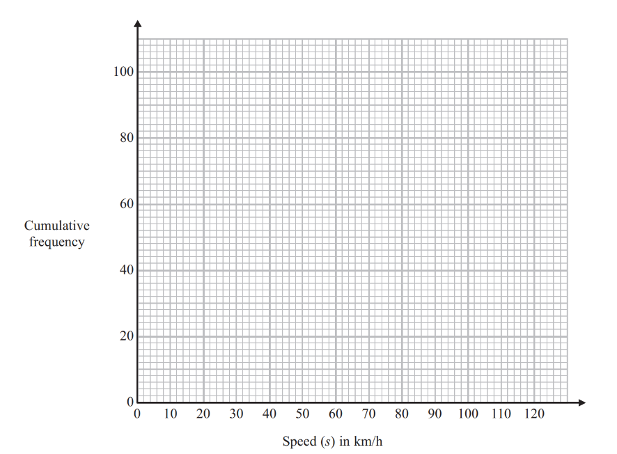

### 21((c)) — 2 marks — command: find — structured — from paper November 2012 · 1MA0/1H
Find an estimate for the number of lorries with a speed of more than $90$km/h.

## Q2 — easy — 4 marks · exam-questions

### 16((a)) — 2 marks — command: draw — structured — from paper November 2014 · 1MA0/1H
There are$200$workers at a factory. 
The cumulative frequency table gives information about their ages.

| **Age (**$a$** years)** | **Cumulative frequency** |
|---|---|
| `0 less than a less-than or slanted equal to 20` | $25$ |
| `0 less than a less-than or slanted equal to 30` | $70$ |
| `0 less than a less-than or slanted equal to 40` | $138$ |
| `0 less than a less-than or slanted equal to 50` | $175$ |
| `0 less than a less-than or slanted equal to 60` | $186$ |
| `0 less than a less-than or slanted equal to 70` | $194$ |
| `0 less than a less-than or slanted equal to 80` | $200$ |

On the grid, draw a cumulative frequency graph for this information.

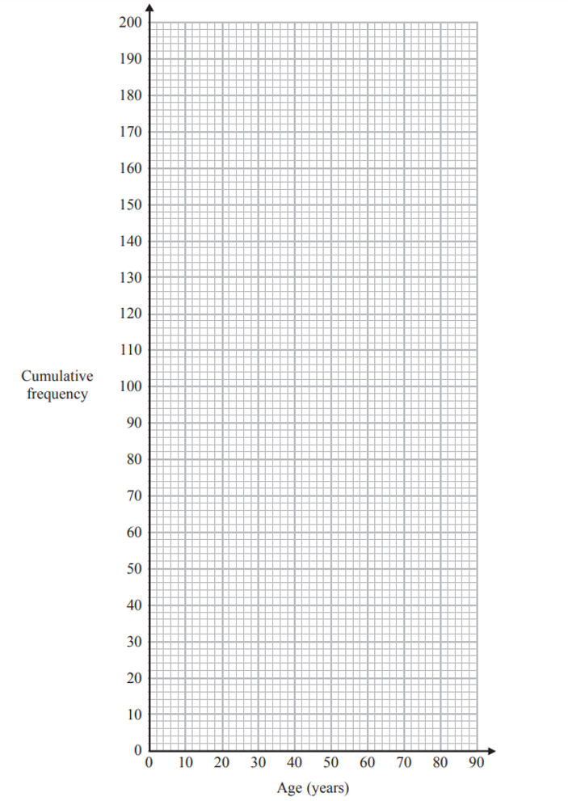

### 16((b)) — 2 marks — structured — from paper November 2014 · 1MA0/1H
Graham says,   
 "$10$% of workers at the factory are older than $65$"

Is Graham correct? 
You must show how you get your answer.

## Q3 — easy — 6 marks · exam-questions

### 15((a)) — 1 mark — command: complete — structured — from paper November 2015 · 1MA0/1H
Sue works for a company that delivers parcels.

One day the company delivered $80$parcels. The table shows information about the weights, in kg, of these parcels.

| **Weight ( **$w$** kg)** | **Frequency** |
|---|---|
| `0 less than w less-than or slanted equal to 1` | $19$ |
| `1 less than w less-than or slanted equal to 2` | $17$ |
| `2 less than w less-than or slanted equal to 3` | $15$ |
| `3 less than w less-than or slanted equal to 4` | $12$ |
| `4 less than w less-than or slanted equal to 5` | $10$ |
| `5 less than w less-than or slanted equal to 6` | $7$ |

Complete the cumulative frequency table.

| **Weight ( **$w$** kg)** | **Cumulative frequency** |
|---|---|
| `0 less than w less-than or slanted equal to 1` |   |
| `0 less than w less-than or slanted equal to 2` |   |
| `0 less than w less-than or slanted equal to 3` |   |
| `0 less than w less-than or slanted equal to 4` |   |
| `0 less than w less-than or slanted equal to 5` |   |
| `0 less than w less-than or slanted equal to 6` |   |

### 15((b)) — 2 marks — command: draw — structured — from paper November 2015 · 1MA0/1H
On the grid opposite, draw a cumulative frequency graph for your table.

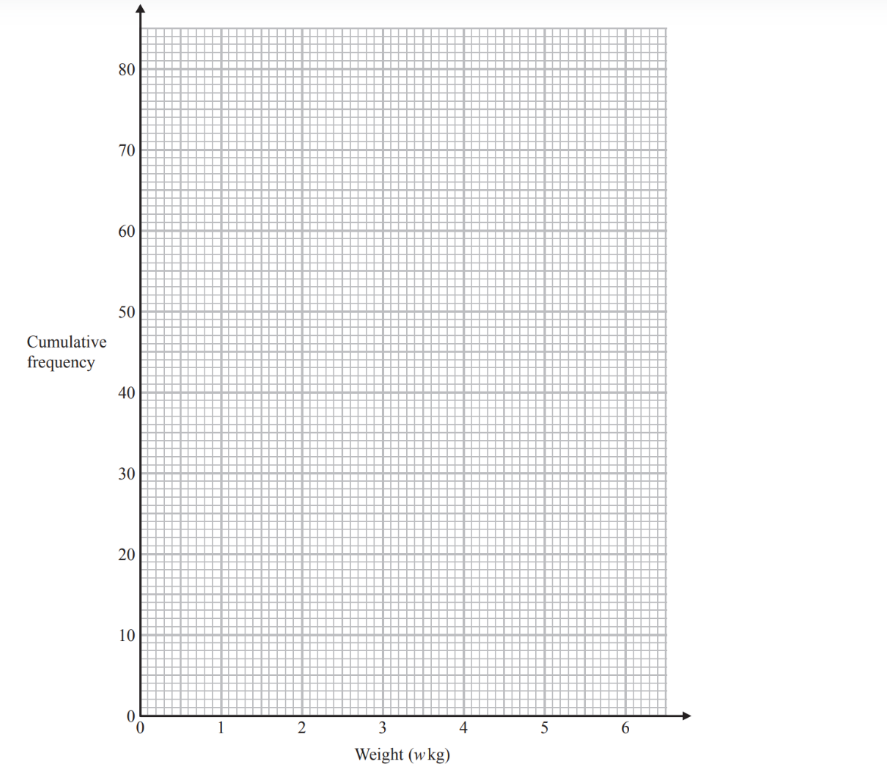

### 15((c)) — 3 marks — structured — from paper November 2015 · 1MA0/1H
Sue says,

"$75$ % of the parcels weigh less than $3.4$ kg."

Is Sue correct? 
You must show how you get your answer.

## Q4 — easy — 5 marks · exam-questions

### 16((a)) — 1 mark — command: complete — structured — from paper June 2017 · 1MA0/1H
The table gives information about the marks gained by some students in an exam.

| **Mark (**$m$**)** | **Frequency** |
|---|---|
| `0 less than m less-than or slanted equal to 20` | $40$ |
| `20 less than m less-than or slanted equal to 40` | $70$ |
| `40 less than m less-than or slanted equal to 60` | $60$ |
| `60 less than m less-than or slanted equal to 80` | $15$ |
| `80 less than m less-than or slanted equal to 100` | $10$ |
| `100 less than m less-than or slanted equal to 120` | $5$ |

Complete the cumulative frequency table for this information.

| **Mark (**$m$**)** | **Cumulative frequency** |
|---|---|
| `0 less than m less-than or slanted equal to 20` |   |
| `0 less than m less-than or slanted equal to 40` |   |
| `0 less than m less-than or slanted equal to 60` |   |
| `0 less than m less-than or slanted equal to 80` |   |
| `0 less than m less-than or slanted equal to 100` |   |
| `0 less than m less-than or slanted equal to 120` |   |

### 16((b)) — 2 marks — command: draw — structured — from paper June 2017 · 1MA0/1H
On the grid, draw a cumulative frequency graph for your table.

### 16((c)) — 2 marks — command: use — structured — from paper June 2017 · 1MA0/1H
Use your graph to find an estimate for the number of students who gained a mark of more than 54.

## Q5 — easy — 2 marks · exam-questions

### 8() — 2 marks — command: work_out — structured — from paper June 2017 · 1MA1/2H
The cumulative frequency graph shows some information about the heights, in cm, of 60 students.

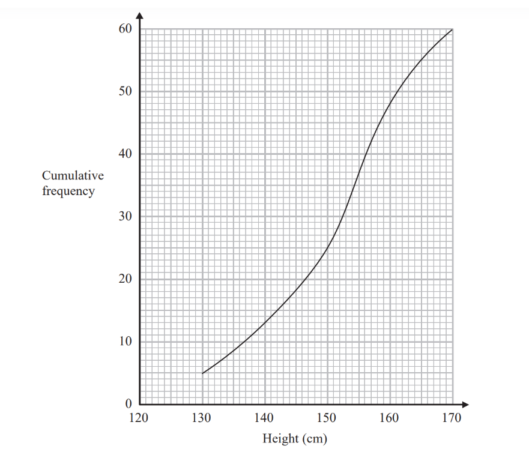

Work out an estimate for the number of these students with a height greater than 160 cm.

## Q6 — easy — 3 marks · exam-questions

### 16((a)) — 1 mark — command: use — structured — from paper June 2016 · 1MA0/2H
The cumulative frequency graph shows information about the weights of 60 apples.

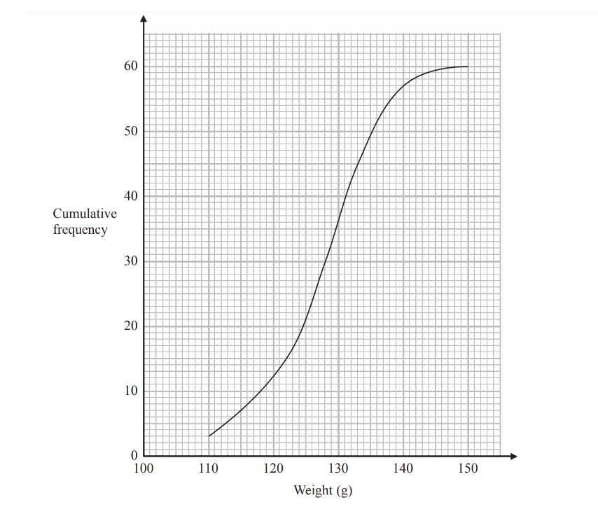

Use the graph to find an estimate for the median weight.

### 16((b)) — 2 marks — command: use — structured — from paper June 2016 · 1MA0/2H
Use the graph to find an estimate for the interquartile range of the weights.

## Q7 — easy — 6 marks · exam-questions

### 11((a)) — 1 mark — command: complete — structured — from paper June 2019 · 1MA1/2H
The grouped frequency table gives information about the times, in minutes, that $80$ office workers take to get to work.

| **Time (**$t$** minutes)** | **Frequency** |
|---|---|
| `0 less than t less-than or slanted equal to 20` | $5$ |
| `20 less than t less-than or slanted equal to 40` | $30$ |
| `40 less than t less-than or slanted equal to 60` | $20$ |
| `60 less than t less-than or slanted equal to 80` | $15$ |
| `80 less than t less-than or slanted equal to 100` | $8$ |
| `100 less than t less-than or slanted equal to 120` | $2$ |

Complete the cumulative frequency table.

| **Time (**$t$** minutes)** | **Cumulative frequency** |
|---|---|
| `0 less than t less-than or slanted equal to 20` |   |
| `0 less than t less-than or slanted equal to 40` |   |
| `0 less than t less-than or slanted equal to 60` |   |
| `0 less than t less-than or slanted equal to 80` |   |
| `0 less than t less-than or slanted equal to 100` |   |
| `0 less than t less-than or slanted equal to 120` |   |

### 11((b)) — 2 marks — command: draw — structured — from paper June 2019 · 1MA1/2H
On the grid, draw the cumulative frequency graph for this information.

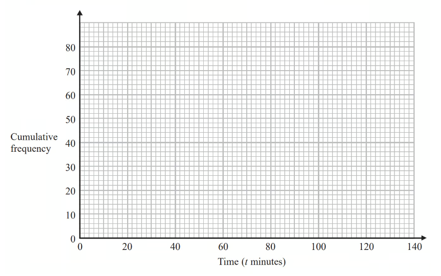

### 11((c)) — 3 marks — command: use — structured — from paper June 2019 · 1MA1/2H
Use your graph to find an estimate for the percentage of these office workers who take more than 90 minutes to get to work.

## Q8 — easy — 5 marks · exam-questions

### 11((a)) — 1 mark — command: complete — structured — from paper Nov 2020 · 4MA1/1HR
The frequency table gives information about the ages of the 80 people in a train carriage.

| **Age (**$a$**years)** | **Frequency** |
|---|---|
| `0 space less than space a space less-than or slanted equal to space 20` | 9 |
| `20 space less than space a space less-than or slanted equal to space 30` | 19 |
| `30 space less than space a space less-than or slanted equal to space 40` | 17 |
| `40 space less than space a space less-than or slanted equal to space 50` | 18 |
| `50 space less than space a space less-than or slanted equal to space 60` | 13 |
| `60 space less than space a space less-than or slanted equal to space 70` | 4 |

Complete the cumulative frequency table.

| **Age (**$a$** years)** | **Cumulative frequency** |
|---|---|
| `0 space less than space a space less-than or slanted equal to space 20` |   |
| `0 space less than space a space less-than or slanted equal to space 30` |   |
| `0 space less than space a space less-than or slanted equal to space 40` |   |
| `0 space less than space a space less-than or slanted equal to space 50` |   |
| `0 space less than space a space less-than or slanted equal to space 60` |   |
| `0 space less than space a space less-than or slanted equal to space 70` |   |

### 15((b)) — 2 marks — command: draw — structured — from paper Nov 2020 · 4MA1/1HR
On the grid, draw a cumulative frequency graph for your table.

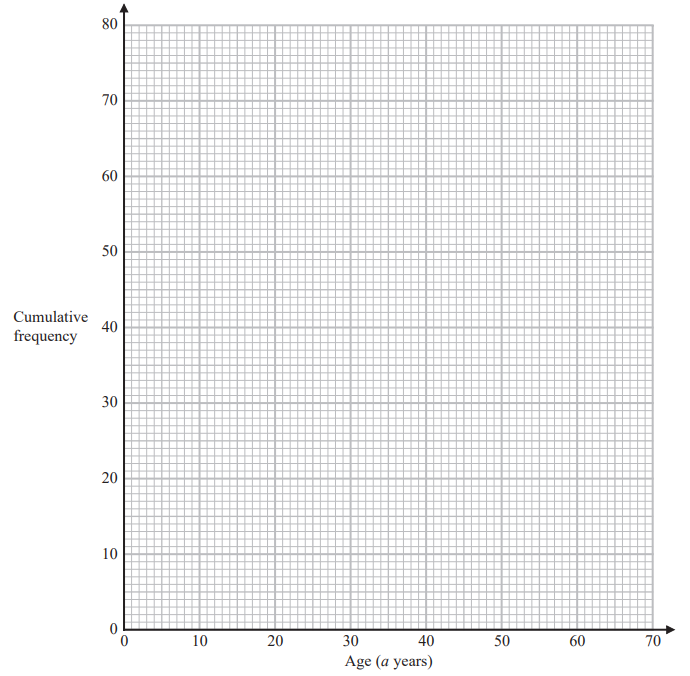

### 15((c)) — 2 marks — command: use — structured — from paper Nov 2020 · 4MA1/1HR
Use your graph to find an estimate for the median age of the people in the train carriage.

........................................... years

## Q9 — easy — 2 marks · exam-questions

### 7((a)) — 2 marks — command: use — structured — from paper 2019 March · 0580/42
20 students each record the mass, $p$ grams, of their pencil case. The table below shows the results.

| Mass ($p$ grams) | $0<p\leq50$ | $50<p\leq100$ | $100<p\leq125$ | $125<p\leq150$ | $150<p\leq200$ |
|---|---|---|---|---|---|
| Frequency | $2$ | $5$ | $4$ | $6$ | $3$ |

Use the frequency table to complete the cumulative frequency table.

| Mass ($p$ grams) | $p\leq50$ | $p\leq100$ | $p\leq125$ | $p\leq150$ | $p\leq200$ |
|---|---|---|---|---|---|
| Cumulative frequency |   |   |   |   | $20$ |

## Q10 — medium — 8 marks · exam-questions

### 13((a)) — 1 mark — command: complete — structured — from paper November 2016 · 1MA0/2H
Charlotte grows some potatoes.

The table shows information about the weights of her potatoes.

| ** Weight (**$w$** grams)** | **Frequency** |
|---|---|
| `100 less than w less-than or slanted equal to 120` | $5$ |
| `120 less than w less-than or slanted equal to 140` | $25$ |
| `140 less than w less-than or slanted equal to 160` | $30$ |
| `160 less than w less-than or slanted equal to 180` | $15$ |
| `180 less than w less-than or slanted equal to 200` | $5$ |

Complete the cumulative frequency table.

| ** Weight (**$w$** grams)** | **Cumulative frequency** |
|---|---|
| `100 less than w less-than or slanted equal to 120` |   |
| `100 less than w less-than or slanted equal to 140` |   |
| `100 less than w less-than or slanted equal to 160` |   |
| `100 less than w less-than or slanted equal to 180` |   |
| `100 less than w less-than or slanted equal to 200` |   |

### 13((b)) — 2 marks — command: draw — structured — from paper November 2016 · 1MA0/2H
On the grid opposite, draw a cumulative frequency graph for your table.

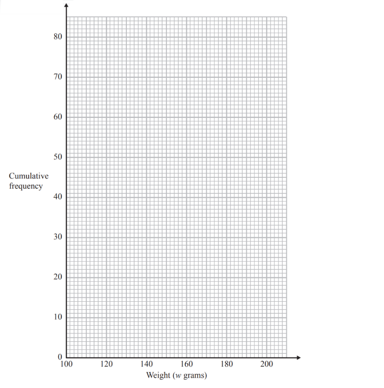

### 13((c)) — 2 marks — command: use — structured — from paper November 2016 · 1MA0/2H
Use your graph to find an estimate for the interquartile range.

### 13((d)) — 3 marks — command: use — structured — from paper November 2016 · 1MA0/2H
Use your graph to find an estimate for the percentage of Charlotte's potatoes with a weight less than 150 grams.

## Q11 — medium — 6 marks · exam-questions

### 21((a)) — 3 marks — command: draw — structured — from paper June 2013 · 1MA0/1H
The table below shows information about the heights of 60 students.

| **Height (**$x$** cm)** | **Number of students** |
|---|---|
| `140 less than x less-than or slanted equal to 150` | $4$ |
| `150 less than x less-than or slanted equal to 160` | $5$ |
| `160 less than x less-than or slanted equal to 170` | $16$ |
| `170 less than x less-than or slanted equal to 180` | $27$ |
| `180 less than x less-than or slanted equal to 190` | $5$ |
| `190 less than x less-than or slanted equal to 200` | $3$ |

On the grid opposite, draw a cumulative frequency graph for the information in the table.

### 21((b)) — 3 marks — command: find — structured — from paper June 2013 · 1MA0/1H
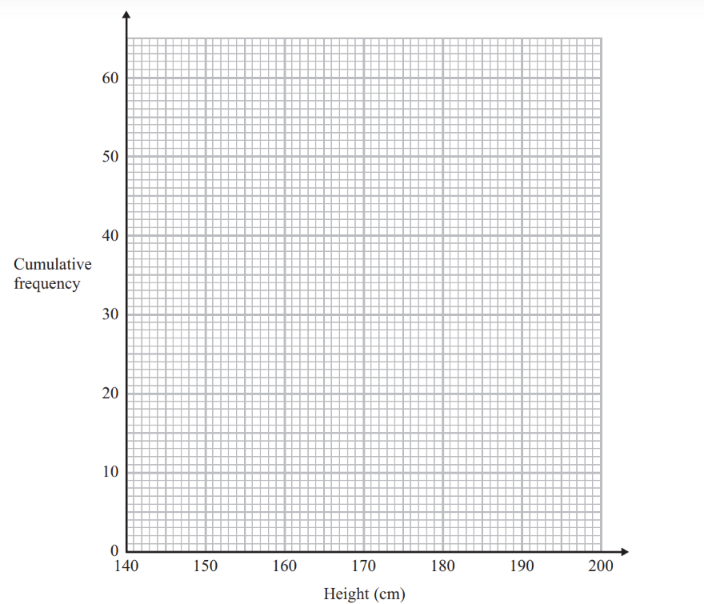

Find an estimate

i) for the median,

[2]

ii) for the interquartile range.

[1]

## Q12 — medium — 7 marks · exam-questions

### 14((a)) — 1 mark — command: complete — structured — from paper March 2013 · 1MA0/1H
The grouped frequency table shows information about the weekly wages of $80$ factory workers.

| **Weekly wage(**`bold £ bold italic x`**)** | **Frequency** |
|---|---|
| `100 less than x less-than or slanted equal to 200` | $8$ |
| `200 less than x less-than or slanted equal to 300` | $15$ |
| `300 less than x less-than or slanted equal to 400` | $30$ |
| `400 less than x less-than or slanted equal to 500` | $17$ |
| `500 less than x less-than or slanted equal to 600` | $7$ |
| `600 less than x less-than or slanted equal to 700` | $3$ |

Complete the cumulative frequency table.

| **Weekly wage(**`bold £ bold italic x`**)** | **Cumulative frequency** |
|---|---|
| `100 less than x less-than or slanted equal to 200` |   |
| `100 less than x less-than or slanted equal to 300` |   |
| `100 less than x less-than or slanted equal to 400` |   |
| `100 less than x less-than or slanted equal to 500` |   |
| `100 less than x less-than or slanted equal to 600` |   |
| `100 less than x less-than or slanted equal to 700` |   |

### 14((b)) — 2 marks — command: draw — structured — from paper March 2013 · 1MA0/1H
On the grid opposite, draw a cumulative frequency graph for your table.

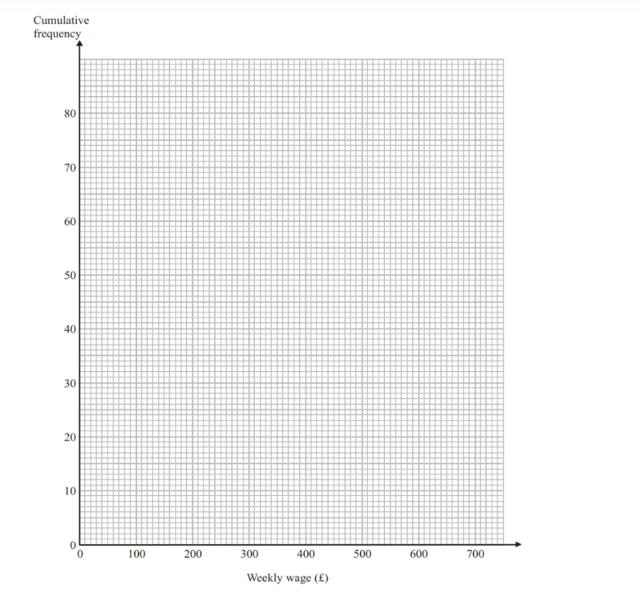

### 14((c)) — 2 marks — command: use — structured — from paper March 2013 · 1MA0/1H
Use your graph to find an estimate for the interquartile range.

### 14((d)) — 2 marks — command: use — structured — from paper March 2013 · 1MA0/1H
Use your graph to find an estimate for the number of workers with a weekly wage of more than £530.

## Q13 — medium — 6 marks · exam-questions

### 16((a)) — 1 mark — command: complete — structured — from paper June 2015 · 1MA0/1H
The table shows information about the times taken by $100$ people in a fun run.

| **Time ( **$t$** minutes)** | **Frequency** |
|---|---|
| `20 less than t less-than or slanted equal to 30` | $4$ |
| `30 less than t less-than or slanted equal to 40` | $16$ |
| `40 less than t less-than or slanted equal to 50` | $36$ |
| `50 less than t less-than or slanted equal to 60` | $24$ |
| `60 less than t less-than or slanted equal to 70` | $14$ |
| `70 less than t less-than or slanted equal to 80` | $6$ |

Complete the cumulative frequency table for this information.

| **Time ( **$t$** minutes)** | **Cumulative frequency** |
|---|---|
| `20 less than t less-than or slanted equal to 30` |   |
| `20 less than t less-than or slanted equal to 40` |   |
| `20 less than t less-than or slanted equal to 50` |   |
| `20 less than t less-than or slanted equal to 60` |   |
| `20 less than t less-than or slanted equal to 70` |   |
| `20 less than t less-than or slanted equal to 80` |   |

### 16((b)) — 2 marks — command: draw — structured — from paper June 2015 · 1MA0/1H
On the grid, draw a cumulative frequency graph for your table.

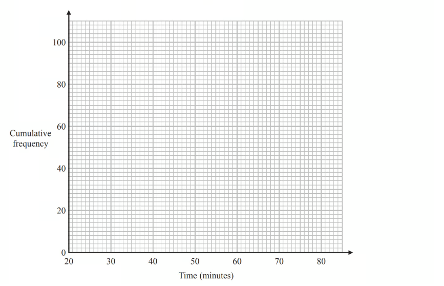

### 16((c)) — 1 mark — command: use — structured — from paper June 2015 · 1MA0/1H
Use your graph to find an estimate for the median time.

### 16((d)) — 2 marks — command: use — structured — from paper June 2015 · 1MA0/1H
Use your graph to find an estimate for the number of people who took longer than $63$minutes.

## Q14 — medium — 4 marks · exam-questions

### 11((a)) — 1 mark — command: use — structured — from paper November 2017 · 1MA1/3H
The cumulative frequency graph shows information about the weights of 60 potatoes.

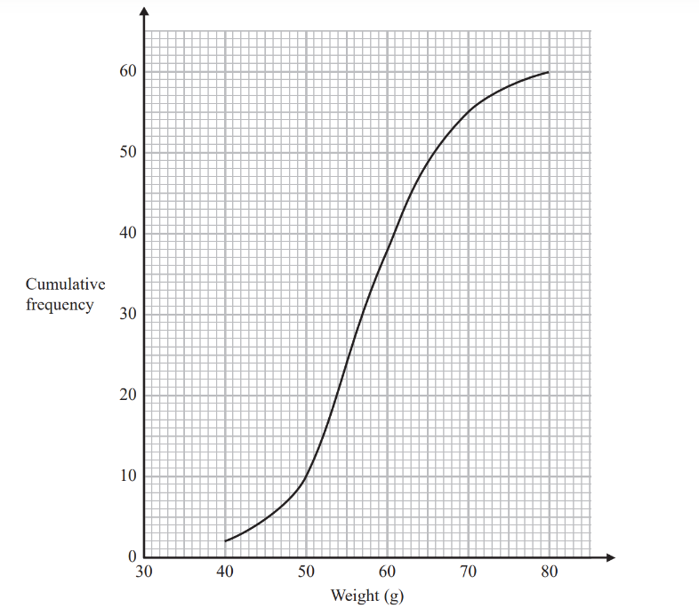

Use the graph to find an estimate for the median weight.

### 11((b)) — 1 mark — command: give — structured — from paper November 2017 · 1MA1/3H
Jamil says,    
"80 - 40 = 40 so the range of the weights is 40 g."

Is Jamil correct? 
You must give a reason for your answer.

### 11((c)) — 2 marks — command: prove — structured — from paper November 2017 · 1MA1/3H
Show that less than 25% of the potatoes have a weight greater than 65 g.

## Q15 — medium — 6 marks · exam-questions

### 7((a)) — 2 marks — command: plot — structured — from paper Sample 2015 · 1MA1/3H
The cumulative frequency table shows the marks some students got in a test.

| **Mark (**$m$**)** | **Cumulative frequency** |
|---|---|
| `0 less than m less-than or slanted equal to 10` | $8$ |
| `0 less than m less-than or slanted equal to 20` | $23$ |
| `0 less than m less-than or slanted equal to 30` | $48$ |
| `0 less than m less-than or slanted equal to 40` | $65$ |
| `0 less than m less-than or slanted equal to 50` | $74$ |
| `0 less than m less-than or slanted equal to 60` | $80$ |

On the grid, plot a cumulative frequency graph for this information.

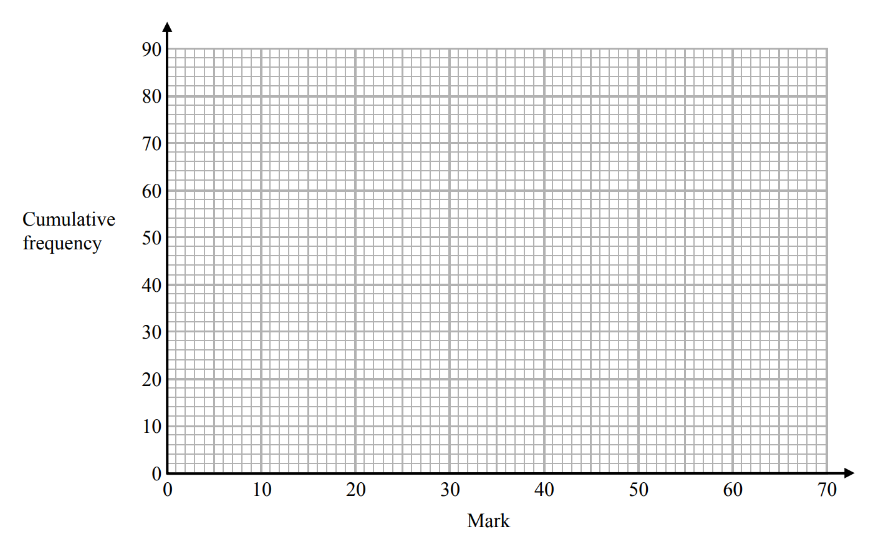

### 7((b)) — 1 mark — command: find — structured — from paper Sample 2015 · 1MA1/3H
Find the median mark.

### 7((c)) — 3 marks — command: estimate — structured — from paper Sample 2015 · 1MA1/3H
Students either pass the test or fail the test. 
The pass mark is set so that $3$ times as many students fail the test as pass the test.

Find an estimate for the lowest possible pass mark.

## Q16 — medium — 6 marks · exam-questions

### 12((a)) — 1 mark — command: complete — structured — from paper Jan 2022 · 4MA1/1H
The table gives information about the times, in minutes, taken by 80 customers to do their shopping in a supermarket.

| **Time taken (*****t *****minutes)** | **Frequency** |
|---|---|
| `0 less than t less-than or slanted equal to 10` | 7 |
| `10 less than t less-than or slanted equal to 20` | 26 |
| `20 less than t less-than or slanted equal to 30` | 24 |
| `30 less than t less-than or slanted equal to 40` | 14 |
| `40 less than t less-than or slanted equal to 50` | 7 |
| `50 less than t less-than or slanted equal to 60` | 2 |

Complete the cumulative frequency table.

| **Time taken (*****t *****minutes)** | **Cumulative frequency** |
|---|---|
| `0 less than t less-than or slanted equal to 10` |   |
| `0 less than t less-than or slanted equal to 20` |   |
| `0 less than t less-than or slanted equal to 30` |   |
| `0 less than t less-than or slanted equal to 40` |   |
| `0 less than t less-than or slanted equal to 50` |   |
| `0 less than t less-than or slanted equal to 60` |   |

### 12((b)) — 2 marks — command: draw — structured — from paper Jan 2022 · 4MA1/1H
On the grid, draw a cumulative frequency graph for your table.

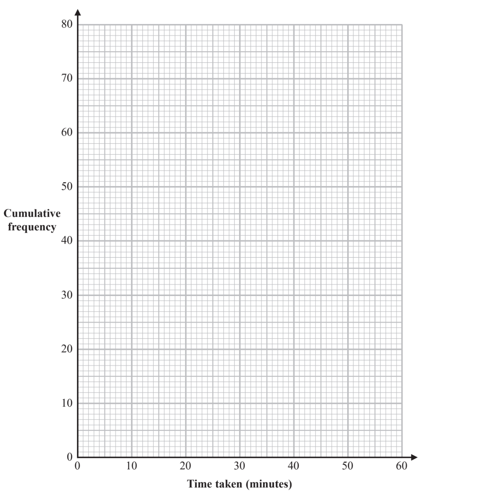

### 12((c)) — 1 mark — command: use — structured — from paper Jan 2022 · 4MA1/1H
Use your graph to find an estimate for the median time taken.

.................................... minutes

### 12((d)) — 2 marks — command: use — structured — from paper Jan 2022 · 4MA1/1H
One of the 80 customers is chosen at random.

Use your graph to find an estimate for the probability that the time taken by this customer was more than 42 minutes.

## Q17 — medium — 5 marks · exam-questions

### 11((a)) — 2 marks — command: find — structured — from paper Jan 2021 · 4MA1/1H
The cumulative frequency graph gives information about the weights, in grams, of 90 bags of sweets.

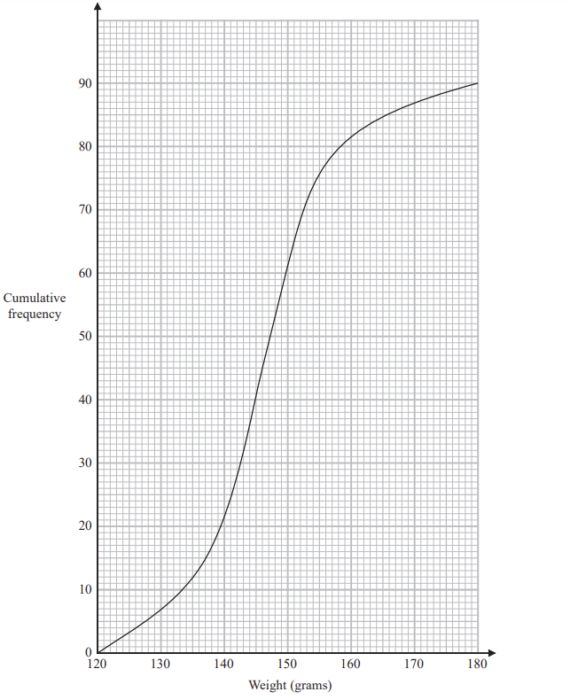

Find an estimate for the median of the weights of these bags of sweets.

...................................................... grams

### 11((b)) — 3 marks — command: find — structured — from paper Jan 2021 · 4MA1/1H
Roberto sells the bags of sweets to raise money for charity. 
Bags with a weight greater than $d$ grams are labelled large bags and sold for 3.75 euros each bag.

The total amount of money he receives by selling all the large bags is 93.75 euros.

Find the value of $d$.

## Q18 — medium — 6 marks · exam-questions

### 11((a)) — 1 mark — command: complete — structured — from paper Jan 2021 · 4MA1/1HR
The manager of a call centre asked the 120 people, who rang the call centre last week, how long they each waited before their call was answered.

The table gives information about their replies.

| **Time waited (**$t$** minutes)** | **Frequency** |
|---|---|
| `0 space less than space t space less-than or slanted equal to space 5` | 8 |
| `5 space less than space t space less-than or slanted equal to space 10` | 15 |
| `10 space less than space t space less-than or slanted equal to space 15` | 17 |
| `15 space less than space t space less-than or slanted equal to space 20` | 28 |
| `20 space less than space t space less-than or slanted equal to space 25` | 33 |
| `25 space less than space t space less-than or slanted equal to space 30` | 19 |

Complete the cumulative frequency table.

| **Time waited (**$t$** minutes)** | **Cumulative Frequency** |
|---|---|
| `0 space less than space t space less-than or slanted equal to space 5` |   |
| `0 space less than space t space less-than or slanted equal to space 10` |   |
| `0 space less than space t space less-than or slanted equal to space 15` |   |
| `0 space less than space t space less-than or slanted equal to space 20` |   |
| `0 space less than space t space less-than or slanted equal to space 25` |   |
| `0 space less than space t space less-than or slanted equal to space 30` |   |

### 11((b)) — 2 marks — command: draw — structured — from paper Jan 2021 · 4MA1/1HR
On the grid, draw a cumulative frequency graph for your table.

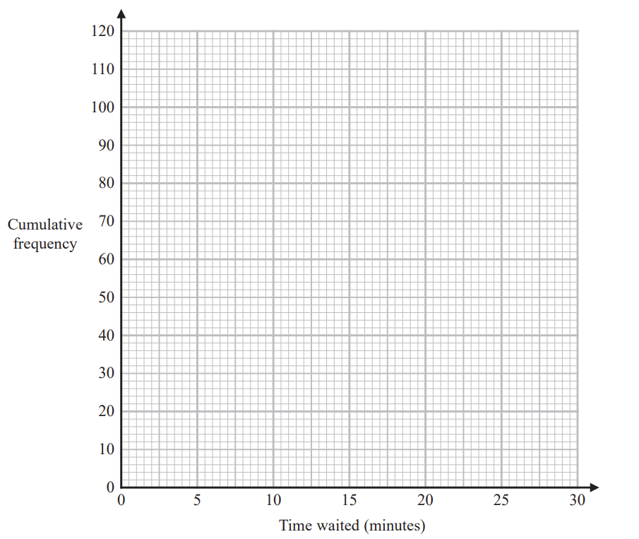

### 11((c)) — 1 mark — command: use — structured — from paper Jan 2021 · 4MA1/1HR
Use your graph to find an estimate for the median of the times waited.

...................................................... minutes

### 11((d)) — 2 marks — command: find — structured — from paper Jan 2021 · 4MA1/1HR
Using your graph, find an estimate for the percentage of the 120 people who said that they waited longer than 23 minutes before their call was answered. 
Show your working clearly.

......................................................%

## Q19 — medium — 5 marks · exam-questions

### 11((a)) — 1 mark — command: complete — structured — from paper Nov 2021 · 4MA1/1H
The table gives information about the times taken by 90 runners to complete a 10 km race.

| **Time (*****t *****minutes)** | **Frequency** |
|---|---|
| `25 space less than space t space less-than or slanted equal to space 35` | 12 |
| `35 space less than space t space less-than or slanted equal to space 45` | 24 |
| `45 space less than space t space less-than or slanted equal to space 55` | 28 |
| `55 space less than space t space less-than or slanted equal to space 65` | 12 |
| `65 space less than space t space less-than or slanted equal to space 75` | 10 |
| `75 space less than space t space less-than or slanted equal to space 85` | 4 |

Complete the cumulative frequency table.

| **Time (*****t *****minutes)** | **Cumulative frequency** |
|---|---|
| `25 space less than space t space less-than or slanted equal to space 35` | 12 |
| `25 space less than space t space less-than or slanted equal to space 45` |   |
| `25 space less than space t space less-than or slanted equal to space 55` |   |
| `25 space less than space t space less-than or slanted equal to space 65` |   |
| `25 space less than space t space less-than or slanted equal to space 75` |   |
| `25 space less than space t space less-than or slanted equal to space 85` |   |

### 11((b)) — 2 marks — command: draw — structured — from paper Nov 2021 · 4MA1/1H
On the grid below, draw a cumulative frequency graph for your table.

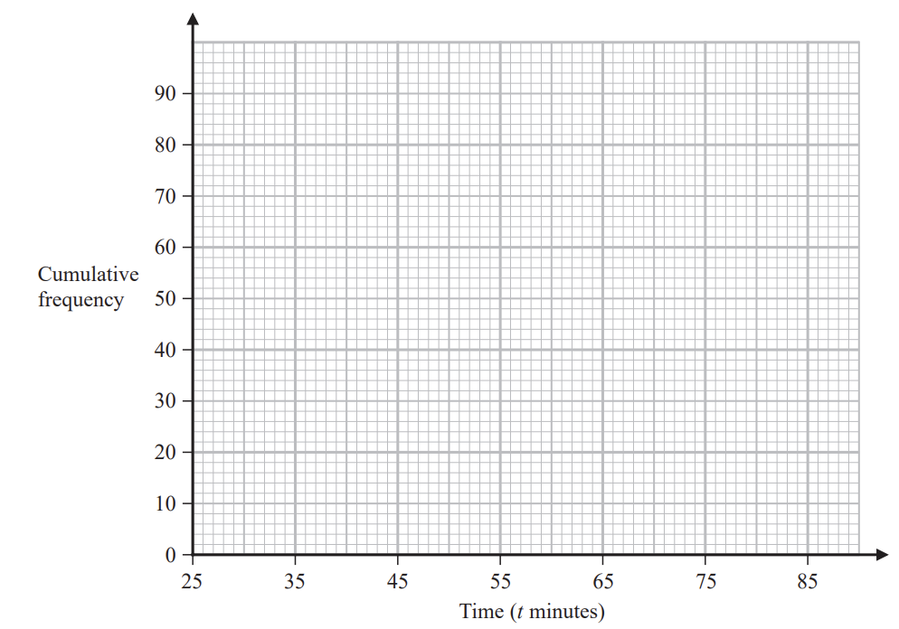

### 11((c)) — 2 marks — command: use — structured — from paper Nov 2021 · 4MA1/1H
Any runner who completed the race in a time T minutes such that `42 space less than space T space less-than or slanted equal to space 52` minutes was awarded a silver medal.

Use your graph to find an estimate for the number of runners who were awarded a silver medal.

....................................................... runners

## Q20 — medium — 7 marks · exam-questions

### 9((a)) — 1 mark — command: complete — structured — from paper Specimen paper · 4MA1/2H
The frequency table shows information about the ages of 60 people on a train.

| Age ($a$ years) | Frequency |
|---|---|
| `0 space less than space a space less-than or slanted equal to space 10` | 4 |
| `10 space less than space a space less-than or slanted equal to space 20` | 14 |
| `20 space less than space a space less-than or slanted equal to space 30` | 17 |
| `30 space less than space a space less-than or slanted equal to space 40` | 13 |
| `40 space less than space a space less-than or slanted equal to space 50` | 7 |
| `50 space less than space a space less-than or slanted equal to space 60` | 3 |
| `60 space less than space a space less-than or slanted equal to space 70` | 2 |

Complete the cumulative frequency table.

| Age ($a$ years) | Cumulative frequency |
|---|---|
| `0 space less than space a space less-than or slanted equal to space 10` |   |
| `0 space less than space a space less-than or slanted equal to space 20` |   |
| `0 space less than space a space less-than or slanted equal to space 30` |   |
| `0 space less than space a space less-than or slanted equal to space 40` |   |
| `0 space less than space a space less-than or slanted equal to space 50` |   |
| `0 space less than space a space less-than or slanted equal to space 60` |   |
| `0 space less than space a space less-than or slanted equal to space 70` |   |

### 9((b)) — 2 marks — command: sketch — structured — from paper Specimen paper · 4MA1/2H
On the grid, draw a cumulative frequency graph for your table.

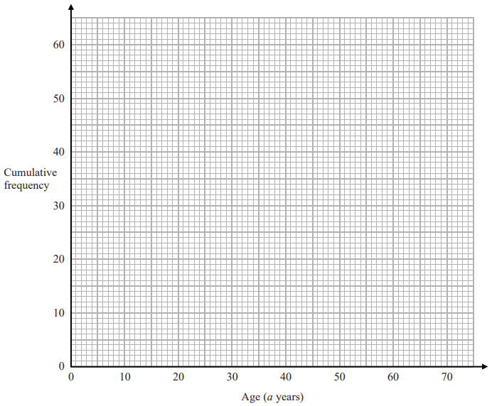

### 9((c)) — 2 marks — command: find — structured — from paper Specimen paper · 4MA1/2H
Use your graph to find an estimate for the interquartile range of the ages of the 60 people.

### 9((d)) — 2 marks — command: find — structured — from paper Specimen paper · 4MA1/2H
Use your graph to find an estimate for how many of the 60 people are more than 48 years of age.

## Q21 — medium — 4 marks · exam-questions

### 12((a)) — 1 mark — command: find — structured — from paper 2023 June · 4MA1/1H
The cumulative frequency graph shows information about the heights, in centimetres, of 50 plants in a flowerbed.

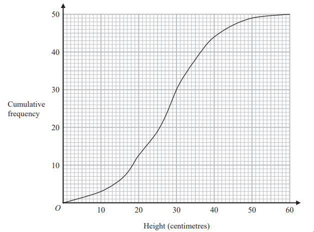

Use the graph to find an estimate for the median height of these plants.

### 12((b)) — 1 mark — command: find — structured — from paper 2023 June · 4MA1/1H
Use the graph to find the frequency for the class interval `30 less than Height less-than or slanted equal to 40`

### 12((c)) — 2 marks — command: find — structured — from paper 2023 June · 4MA1/1H
Use the graph to find an estimate for the number of plants with a height greater than 35 centimetres.

## Q22 — medium — 7 marks · exam-questions

### 1() — 1 mark — command: complete — structured
The frequency table shows information about the ages of 80 people at a concert.

| Age (a years) | Frequency |
|---|---|
| $10<a\leq20$ | 3 |
| $20<a\leq30$ | 17 |
| $30<a\leq40$ | 21 |
| $40<a\leq50$ | 7 |
| $50<a\leq60$ | 19 |
| $60<a\leq70$ | 13 |

Complete the cumulative frequency table.

| Age ($a$ years) | Cumulative frequency |
|---|---|
| $0<a\leq20$ |   |
| $0<a\leq30$ |   |
| $0<a\leq40$ |   |
| $0<a\leq50$ |   |
| $0<a\leq60$ |   |
| $0<a\leq70$ |   |

### 2() — 2 marks — command: draw — structured
On the grid, draw a cumulative frequency graph for your table

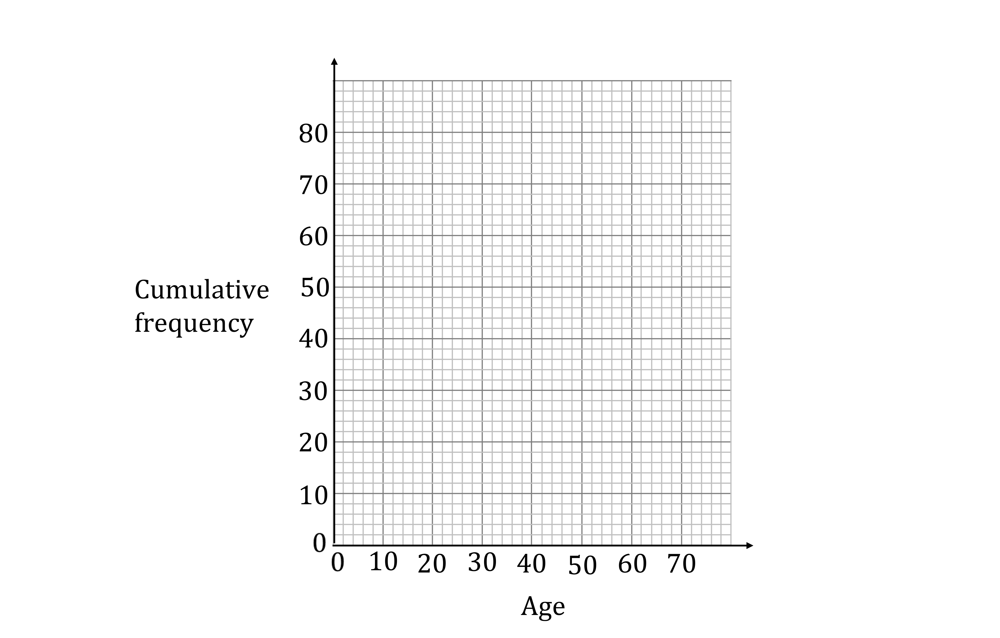

### 3() — 2 marks — command: estimate — structured
Use your graph to find an estimate for the interquartile range of the ages of the 80 people

### 4() — 2 marks — command: estimate — structured
Use your graph to find an estimate for how many of the 80 people are more than 62 years of age.

## Q23 — medium — 4 marks · exam-questions

### 13() — 1 mark — command: find — structured — from paper 2023 Nov · 4MA1/1H
The cumulative frequency graph gives information about the times, in seconds, that 80 adults took to log in to an online bank.

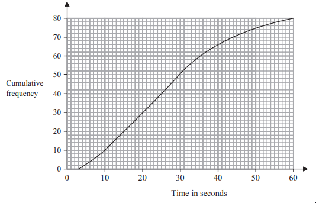

Find an estimate for the median time.

### 13((b)) — 3 marks — command: work_out — structured — from paper 2023 Nov · 4MA1-1H
Work out the percentage of these adults that took longer than 50 seconds to log in. Show your working clearly

## Q24 — hard — 6 marks · exam-questions

### 11((a)) — 2 marks — command: find — structured — from paper Spec2 2015 · 1MA1/2H
The cumulative frequency graphs show information about the times taken by 100 male runners and by 100 female runners to finish the London marathon.

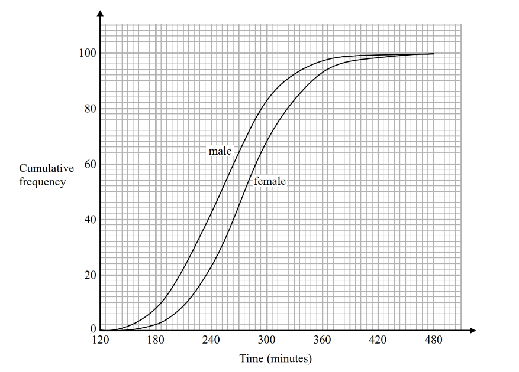

A male runner is chosen at random.

Find an estimate for the probability that this runner took less than 4 hours to finish the London marathon.

### 11((b)) — 4 marks — command: use — structured — from paper Spec2 2015 · 1MA1/2H
Use medians and interquartile ranges to compare the distribution of the times taken by the male runners with the distribution of the times taken by the female runners.

## Q25 — hard — 3 marks · exam-questions

### 14((e)) — 3 marks — command: use — structured — from paper Jan 2022 · 4MA1/2HR
A group of 60 students each sat an algebra test and a geometry test. 
Each test was marked out of 110

The cumulative frequency graph gives information about the marks gained by the 60 students in the algebra test.

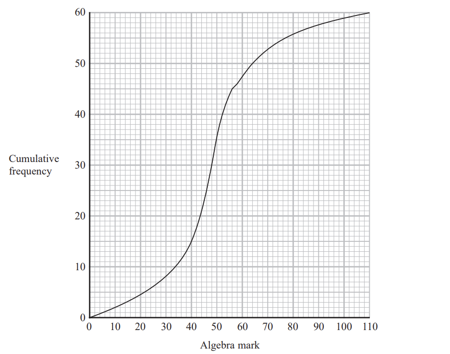

To be awarded a grade A in the algebra test, a student had to gain a mark greater than 64

Two students are to be selected at random from the 60 students in the group.

Use the graph to find an estimate for the probability that both of these students were awarded a grade A in the algebra test.

## Q26 — hard — 3 marks · exam-questions

### 11((b)) — 3 marks — command: find — structured — from paper Jan 2021 · 4MA1/1H
The cumulative frequency graph gives information about the weights, in grams, of 90 bags of sweets.

Roberto sells the bags of sweets to raise money for charity. 
Bags with a weight greater than $d$ grams are labelled large bags and sold for 3.75 euros each bag.

The total amount of money he receives by selling all the large bags is 93.75 euros.

Find the value of $d$.

## Q27 — hard — 3 marks · exam-questions

### 12((b)) — 3 marks — command: work_out — structured — from paper Jan 2020 · 4MA1/1H
A total of 80 national and international runners took part in a race. 
The cumulative frequency graph gives information about the times, in minutes, they took for the race.

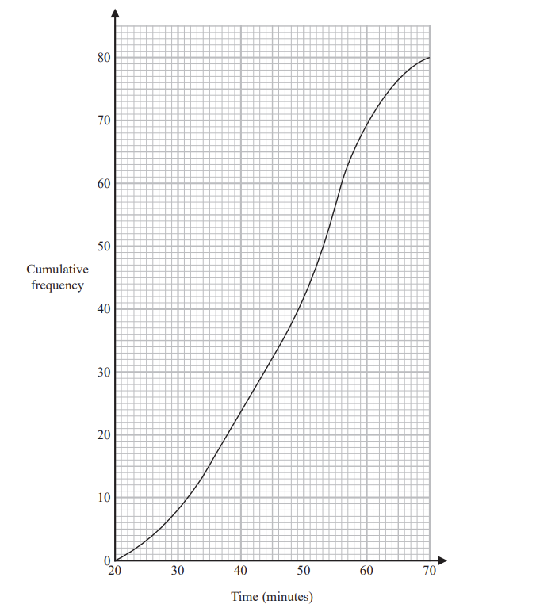

60% of the national runners took 50 minutes or less for the race. No international runner took 50 minutes or less for the race.

Work out an estimate for the number of national runners who took part in the race.

## Q28 — hard — 3 marks · exam-questions

### 10((b)) — 3 marks — command: evaluate — structured — from paper June 2018 · 4MA1/1H
The cumulative frequency graph shows information about the length, in minutes, of each of 80 films.

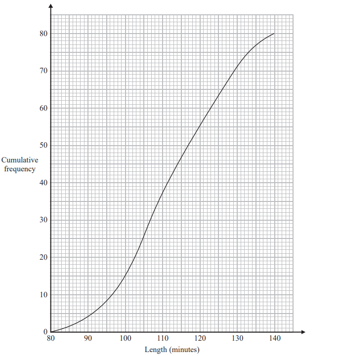

Clare says,

“More than 35% of these films are over 120 minutes long.”

Is Clare correct? 
Give a reason for your answer.

## Q29 — hard — 8 marks · exam-questions

### 14((a)) — 1 mark — command: use — structured — from paper Jan 2022 · 4MA1/2HR
A group of 60 students each sat an algebra test and a geometry test. 
Each test was marked out of 110

The cumulative frequency graph gives information about the marks gained by the 60 students in the algebra test.

Use the graph to find an estimate for the median mark in the algebra test.

### 14((b)) — 1 mark — command: use — structured — from paper Jan 2022 · 4MA1/2HR
Use the graph to find an estimate for the number of students who gained 58 marks or less in the algebra test.

### 14((c)) — 2 marks — command: use — structured — from paper Jan 2022 · 4MA1/2HR
Use the graph to find an estimate for the interquartile range of the marks gained in the algebra test.

### 14((d)) — 1 mark — command: give — structured — from paper Jan 2022 · 4MA1/2HR
The interquartile range of the marks gained in the geometry test is 9

Luis says

“The students’ marks are more spread out in the algebra test than in the geometry test.”

Is Luis correct? 
Give a reason for your answer.

### 14((e)) — 3 marks — command: use — structured — from paper Jan 2022 · 4MA1/2HR
To be awarded a grade A in the algebra test, a student had to gain a mark greater than 64

Two students are to be selected at random from the 60 students in the group.

Use the graph to find an estimate for the probability that both of these students were awarded a grade A in the algebra test.

## Q30 — hard — 7 marks · exam-questions

### 12((a)) — 2 marks — command: draw — structured — from paper June 2021 · 4MA1/2H
The cumulative frequency table gives information about the distance, in kilometres, that each of 80 workers travel from home to work at Office $A$.

| **Distance travelled (*****d***** km)** | **Cumulative frequency** |
|---|---|
| `0 space less than space d space less-than or slanted equal to space 5` | 17 |
| `0 space less than space d space less-than or slanted equal to 10` | 32 |
| `0 space less than space d space less-than or slanted equal to space 15` | 57 |
| `0 space less than space d space less-than or slanted equal to space 20` | 70 |
| `0 space less than space d space less-than or slanted equal to space 25` | 76 |
| `0 space less than space d space less-than or slanted equal to space 30` | 80 |

On the grid below, draw a cumulative frequency graph for the information in the table.

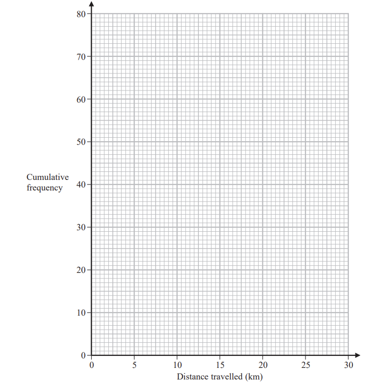

### 12((b)) — 1 mark — command: use — structured — from paper June 2021 · 4MA1/2H
Use your graph to find an estimate for the median distance travelled.

....................................................... km

### 12((c)) — 2 marks — command: use — structured — from paper June 2021 · 4MA1/2H
Use your graph to find an estimate for the interquartile range of the distances travelled.

....................................................... km

### 12((d)) — 2 marks — command: compare — structured — from paper June 2021 · 4MA1/2H
For Office $B$, the median distance workers travel from home to work is 15 km and the interquartile range is 5 km.

Use the information above to compare the distances that workers at Office $A$ and workers at Office $B$ travel from home to work. 
Write down **two **comparisons.

## Q31 — hard — 5 marks · exam-questions

### 12((a)) — 1 mark — command: use — structured — from paper Jan 2020 · 4MA1/1HR
The cumulative frequency graph gives information about the waiting times, in minutes, of people with appointments at Hospital A.

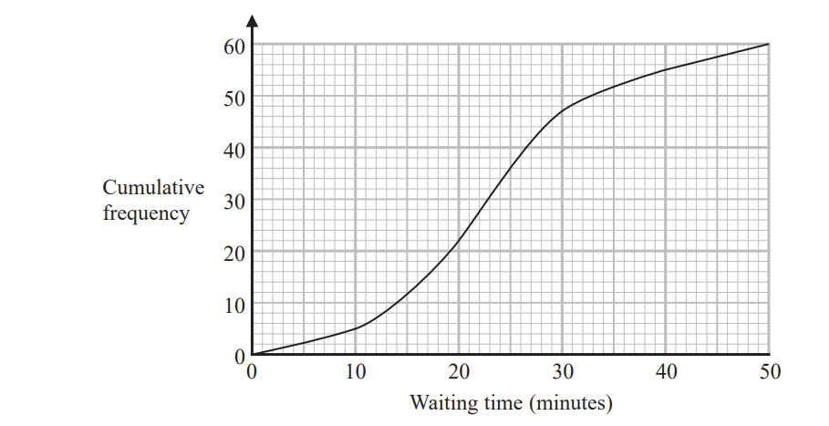

Use the graph to find an estimate of the median waiting time at Hospital A.

.........................minutes

### 12((b)) — 2 marks — command: use — structured — from paper Jan 2020 · 4MA1/1HR
Use the graph to find an estimate of the interquartile range of the waiting times at Hospital A.

............................... minutes

### 12((c)) — 2 marks — command: compare — structured — from paper Jan 2020 · 4MA1/1HR
At a different hospital, Hospital B, the median waiting time is 28 minutes and the interquartile range of the waiting times is 19 minutes.

Compare the waiting times at Hospital A with the waiting times at Hospital B.

## Q32 — hard — 5 marks · exam-questions

### 10((a)) — 2 marks — command: find — structured — from paper June 2018 · 4MA1/1H
The cumulative frequency graph shows information about the length, in minutes, of each of 80 films.

Use the graph to find an estimate for the interquartile range.

....................................................... minutes

### 10((b)) — 3 marks — command: give — structured — from paper June 2018 · 4MA1/1H
Clare says,

“More than 35% of these films are over 120 minutes long.”

Is Clare correct? 
Give a reason for your answer.

## Q33 — hard — 4 marks · exam-questions

### 17((a)) — 1 mark — command: estimate — structured — from paper Nov 2020 · 8300/2H
The cumulative frequency graph shows information about the masses of 200 apples.

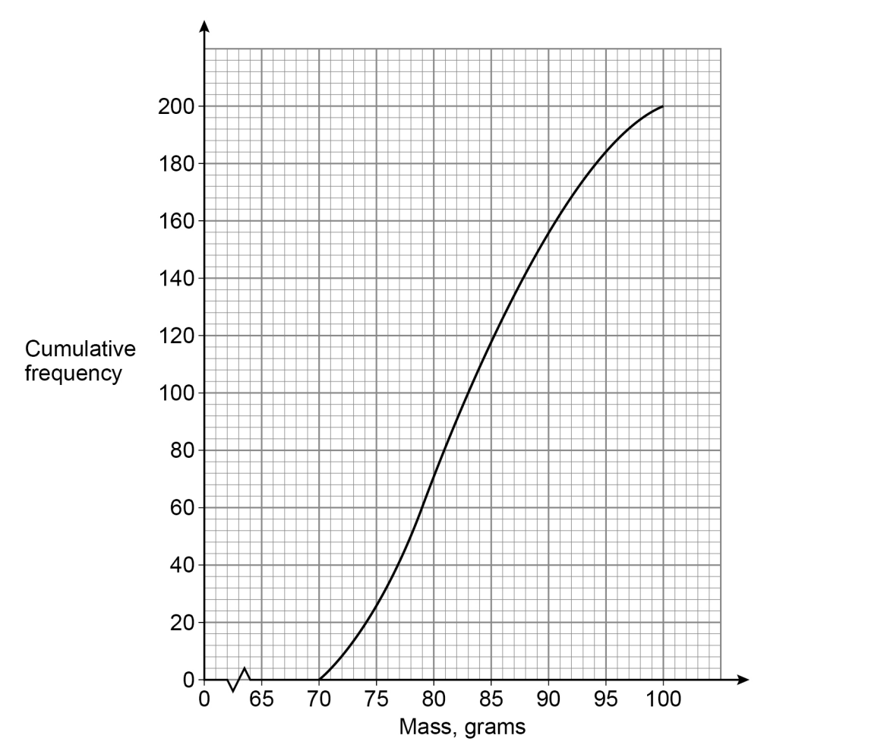

Estimate the median mass.

................................grams

### 17((b)) — 3 marks — command: estimate — structured — from paper Nov 2020 · 8300/2H
Apples with mass 90 grams or less cost 32p each.

Apples with mass more than 90 grams cost 39p each. Estimate the **total **cost of the 200 apples.

£...................................

## Q34 — hard — 5 marks · exam-questions

### 22((a)) — 3 marks — command: draw — structured — from paper Nov 2017 · 8300/1H
Here is some information about the miles per gallon of 60 cars.

| **Miles per gallon, **$x$ | **Frequency** |   |   |   |
|---|---|---|---|---|
| `40 space less than space x space less-than or slanted equal to space 50` | 6 |   |   |   |
| `50 space less than space x space less-than or slanted equal to space 60` | 16 |   |   |   |
| `60 space less than space x space less-than or slanted equal to space 70` | 28 |   |   |   |
| `70 space less than space x space less-than or slanted equal to space 80` | 10 |   |   |   |

Draw a cumulative frequency graph.

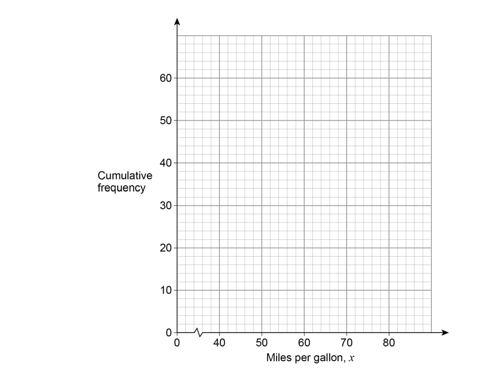

### 22((b)) — 2 marks — command: work_out — structured — from paper Nov 2017 · 8300/1H
Use the graph to work out the interquartile range.

...........................miles per gallon

## Q35 — hard — 5 marks · exam-questions

### 19((a)) — 3 marks — command: draw — structured — from paper June 2017 · 8300/1H
Here is some information about the marks of 60 students in a test.

| **Mark,** | **Frequency** |   |   |   |
|---|---|---|---|---|
|   | 9 |   |   |   |
| `50 space less than space m space less-than or slanted equal to space 60` | 16 |   |   |   |
| `60 space less than space m space less-than or slanted equal to space 70` | 20 |   |   |   |
| `70 space less than space m space less-than or slanted equal to space 80` | 8 |   |   |   |
| `80 space less than space m space less-than or slanted equal to space 90` | 7 |   |   |   |

On the grid, draw a cumulative frequency graph.

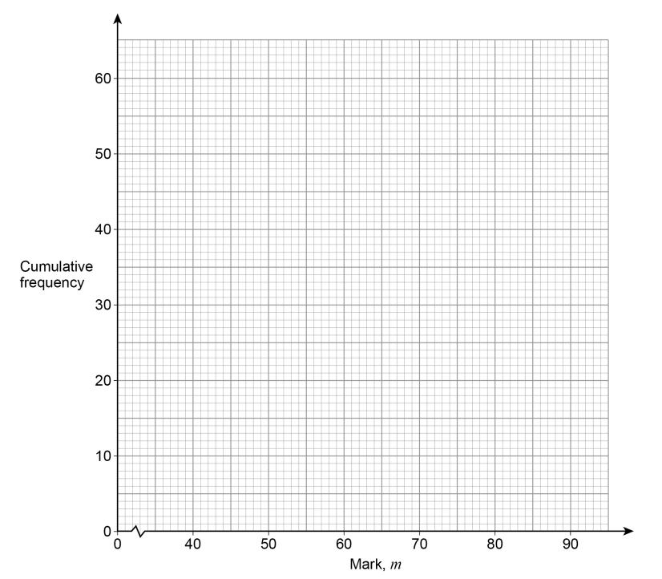

### 19((b)) — 2 marks — command: use — structured — from paper June 2017 · 8300/1H
Use your graph to estimate the lowest mark of the top 20% of students.

## Q36 — hard — 9 marks · exam-questions

### 12((a)) — 1 mark — command: use — structured — from paper Nov 2019 · J560/04
The cumulative frequency graph summarises the annual salary, p (£ thousands), of the 60 workers in a factory.

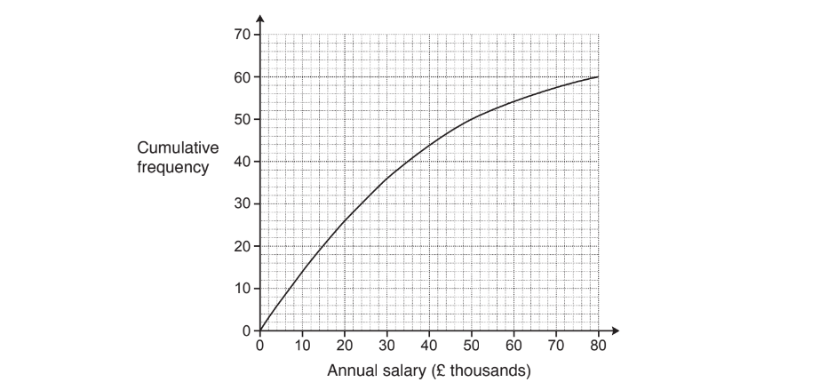

Use the graph to estimate the median annual salary.

£ ...................................... thousands

### 12((b)) — 2 marks — command: complete — structured — from paper Nov 2019 · J560/04
Complete this cumulative frequency table.

| **Annual salary,***** p*** **(£ thousands)** | **Cumulative** **frequency** |
|---|---|
| `p space less-than or slanted equal to space 10` |   |
| `p space less-than or slanted equal to space 20` |   |
| `p space less-than or slanted equal to space 30` |   |
| `p space less-than or slanted equal to space 50` |   |
| `p space less-than or slanted equal to space 80` |   |

### 12((c)) — 5 marks — command: calculate — structured — from paper Nov 2019 · J560/04
Use the information in the cumulative frequency table to calculate an estimate of the mean annual salary.

£ ...................................... thousands

### 12((d)) — 1 mark — command: explain — structured — from paper Nov 2019 · J560/04
Explain why your estimate of the median is more reliable than your estimate of the mean.

## Q37 — hard — 3 marks · exam-questions

### 13() — 3 marks — command: calculate — structured — from paper June 2019 · J560/04
The cumulative frequency graph shows the distribution of the heights of members of a rowing club.

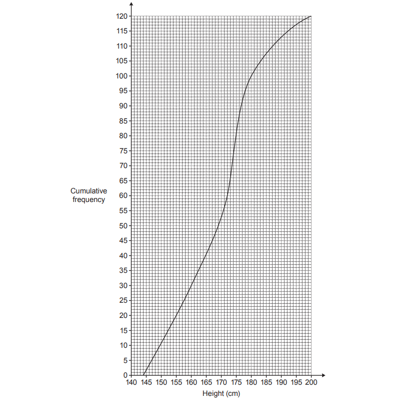

Calculate the percentage of the members who are at least 180 cm tall.

## Q38 — hard — 3 marks · exam-questions

### 15((b)) — 3 marks — command: find — structured — from paper Nov 2018 · J560/05
The cumulative frequency graph shows information about the marks scored by a group of 80 students in a test.

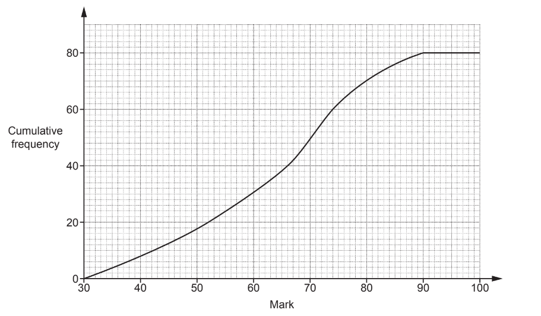

The ratio of the number of students passing the test compared to failing the test is 4 : 1.
 Find the minimum mark needed to pass the test.

## Q39 — hard — 9 marks · exam-questions

### 15((a)) — 3 marks — command: find — structured — from paper Nov 2017 · J560/05
Iqrah carries out a survey of 200 families in the **north** of England on their weekly spending on food.

The cumulative frequency diagram summarises the results.

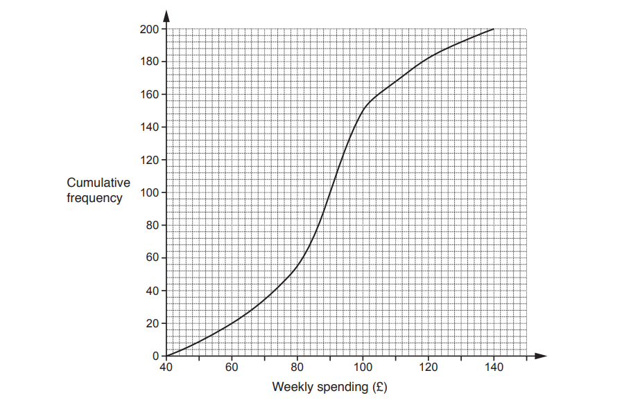

Find

i) the median,

£ ................. [1]

ii) the interquartile range.

£ ................. [2]

### 15((b)) — 2 marks — command: state — structured — from paper Nov 2017 · J560/05
Iqrah says

15% of these families spent over £120.

Is her statement correct? 
State the evidence you have used in making your decision.

### 15((c)) — 4 marks — command: compare — structured — from paper Nov 2017 · J560/05
In a survey of 200 families in the **south** of England, the median weekly amount spent on food was £84 and the interquartile range was £28.

Make two comparisons between the weekly amounts spent on food in the north of England and the south of England. State the evidence you have used in making your comparisons.

1 ....................

2 ....................
