# Mark Schemes — Histograms
**Statistics & Probability** · Edexcel IGCSE Maths A (4MA1) — 18/Higher

## Q1 — medium — 3 marks · exam-questions

### 24() — 3 marks
> *Add two columns to the table - one for class width and one for frequency density (**fd**). Class width is found by subtracting the lower class boundary from the higher class boundary.*

$\mathrm{Frequency} \mathrm{density}=\frac{\mathrm{Frequency}}{\mathrm{Class} \mathrm{width}}$

| **Height** **(*****h***** metres)** | **Frequency** | ***Class width*** | ***Frequency*** ***density (*******fd*******)*** |
|---|---|---|---|
| 0 < *h* ≤ 2 | 7 | *2 - 0 = 2* | *7 ÷ 2 = 3.5* |
| 2 < *h* ≤ 4 | 14 | *2* | *14 ÷ 2 = 7* |
| 4 < *h* ≤ 8 | 18 | *4* | *18 ÷ 4 = 4.5* |
| 8 < *h* ≤ 16 | 24 | *8* | *24 ÷ 8 = 3* |
| 16 < *h* ≤ 20 | 10 | *4* | *10 ÷ 4 = 2.5* |

*The height (**h**) axis (horizontal) needs to run from 0 to 20 (at least) so 5 'small squares' representing 2 metres.* 
*The frequency density (**fd**) axis needs to run from 0 to 7 (at least) so 5 'small squares' representing 1 will give a good sized histogram.*

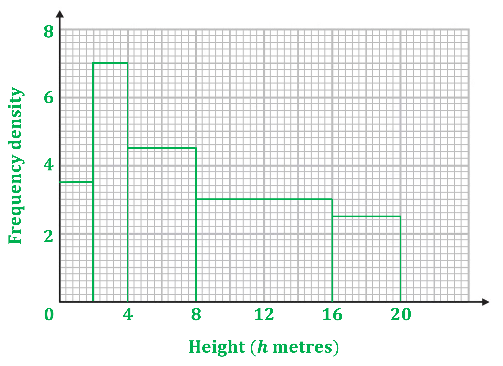

**2 correct blocks ****[1]** 
**4 correct blocks ****[1]** 
**Fully correct scaled/labelled diagram ****[1]**

## Q2 — medium — 3 marks · exam-questions

### 24() — 3 marks
> *Add two rows to the table - one for class width and one for frequency density (**fd**). *
*Class width is found by subtracting the lower class boundary from the higher class boundary.*

$\mathrm{Frequency} \mathrm{density}=\frac{\mathrm{Frequency}}{\mathrm{Class} \mathrm{width}}$

| **Time (*****t***** minutes)** | 0 < *t* ≤ 10 | 10 < *t* ≤ 15 | 15 < *t* ≤ 20 | 20 < *t* ≤ 30 | 30 < *t* ≤ 45 |
|---|---|---|---|---|---|
| **Number of calls** | 12 | 15 | 13 | 18 | 3 |
| ***Class width*** | *10 - 0 = 10* | *5* | *5* | *10* | *15* |
| ***Frequency density (*******fd*******)*** | *12 ÷ 10 = 1.2* | *3* | *2.6* | *1.8* | *0.2* |

> *The frequency density (**fd**) axis needs to run from 0 to 3 (at least) so 10 'small squares' representing 1 will give a good sized histogram.*

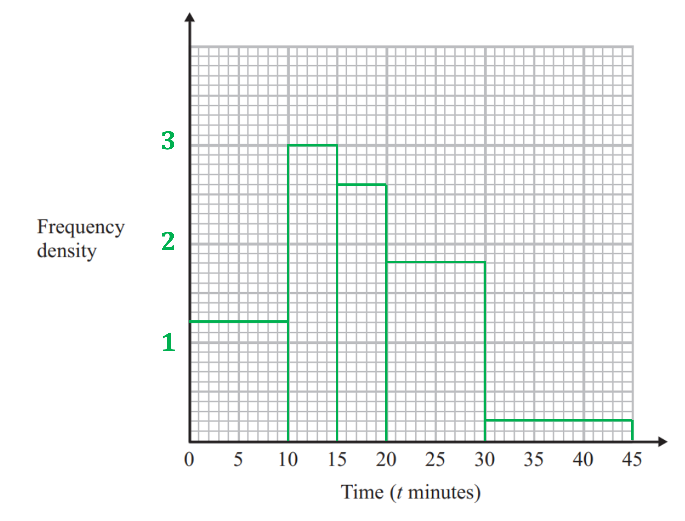

**3 correct blocks ****[1]** 
**4 correct blocks ****[1]** 
**Fully correct ****[1]**

## Q3 — medium — 3 marks · exam-questions

### 23() — 3 marks
> *Add two columns to the table - one for class width and one for frequency density (**fd**). *
*Class width is found by subtracting the lower class boundary from the higher class boundary.*

$\mathrm{Frequency} \mathrm{density}=\frac{\mathrm{Frequency}}{\mathrm{Class} \mathrm{width}}$

| **Time** **(*****t***** minutes)** | **Frequency** | ***Class width*** | ***Frequency*** ***density (*******fd*******)*** |
|---|---|---|---|
| 0 < *t* ≤ 5 | 8 | *5 - 0 = 5* | *8 ÷ 5 = 1.6* |
| 5 < *t* ≤ 15 | 32 | *10* | *32 ÷ 10 = 3.2* |
| 15 < *t* ≤ 30 | 36 | *15* | *2.4* |
| 30 < *t* ≤ 40 | 18 | *10* | *1.8* |
| 40 < *t* ≤ 60 | 6 | *20* | *0.3* |

> *The frequency density (**fd**) axis needs to run from 0 to 3.2 (at least) so 10 'small squares' representing 1 will give a good sized histogram.*

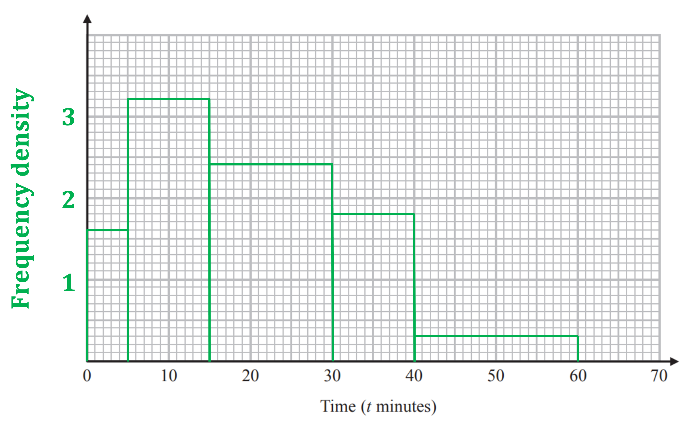

**2 correct blocks ****[1]** 
**4 correct blocks ****[1]** 
**Fully correct ****[1]**

## Q4 — medium — 2 marks · exam-questions

### 22() — 2 marks
*With histograms, **frequency density** is plotted, **not** frequency.* 
*It is the **area** of the bars (not the height) on a histogram that show frequency.*

**Bhavna has plotted each time interval against frequency, instead of frequency density (which she would need to work out) ****[1]**** **
**Bhavna has plotted the last time interval as 20 ≤ ****t**** < 50 instead of 20 ≤ ****t**** < 40 ****[1]**

## Q5 — medium — 7 marks · exam-questions

### 18((a)) — 4 marks
> *To estimate the mean, add two columns to the table - one for the midpoints of the class intervals and one for the product of the frequencies (**f**) and the midpoints (**x**).*
* If you can't spot them, find the midpoints by finding the mean of the class boundaries. *
*Add a total row too.*

| **Length of time (*****t***** hours)** | **Frequency (*****f*****)** | ***Midpoint (*******x*******)*** | ****fx**** |
|---|---|---|---|
| $0\leqt<10$ | 8 | $\frac{0+10}{2}=5$ | $8\times5=40$ |
| $10\leqt<15$ | 15 | $\frac{10+15}{2}=12.5$ | $15\times12.5=187.5$ |
| $15\leqt<20$ | 11 | *17.5* | *192.5* |
| $20\leqt<30$ | 10 | *25* | *250* |
| $30\leqt<50$ | 6 | *40* | *240* |
| ***Total*** | ***50*** | *-* | ***910*** |

**Midpoints**** [1]** 
**Finding fx**** [1]**

> *An estimate for the mean (*$\overline{x}$*) is given by the formula *$\overline{x}=\frac{Σfx}{Σf}$*.*

`table row cell x with bar on top end cell equals cell 910 over 50 end cell end table`

**[1]**

`table row cell x with bar on top end cell equals cell 18.2 end cell end table`

**An estimate for the mean length of time is 18.2 hours ****[1]**

### 18((b)) — 3 marks
> *Add two columns to the table - one for class width and one for frequency density (**fd**). *
*Class width is found by subtracting the lower class boundary from the higher class boundary.*

$\mathrm{Frequency} \mathrm{density}=\frac{\mathrm{Frequency}}{\mathrm{Class} \mathrm{width}}$

| **Length of time** **(*****t *****hours)** | **Frequency** | ***Class width*** | ***Frequency*** ***density (*******fd*******)*** |
|---|---|---|---|
| 0 ≤ *t* < 10 | 8 | *10 - 0 = 10* | *8 ÷ 10 = 0.8* |
| 10 ≤ *t* < 15 | 15 | *5* | *15 ÷ 5 = 3* |
| 15 ≤ t < 20 | 11 | *5* | *11 ÷ 5 = 2.2* |
| 20 ≤ *t* < 30 | 10 | *10* | *10 ÷ 10 = 1* |
| 30 ≤ t < 50 | 6 | *20* | *6 ÷ 20 = 0.3* |

> *The frequency density (**fd**) axis needs to run from 0 to 3 (at least) so 10 'small squares' representing 1 will give a good sized histogram.*

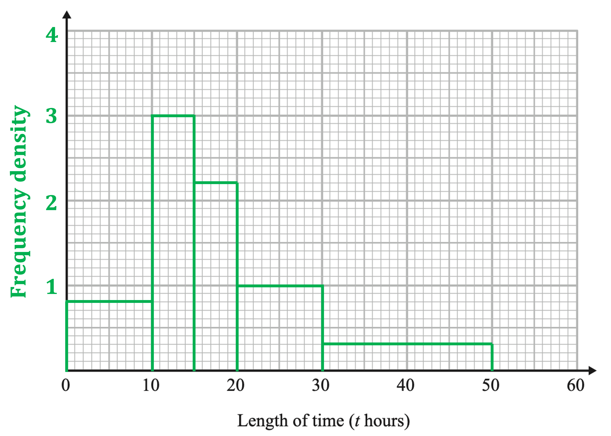

**2 correct blocks ****[1]**
**4 correct blocks ****[1]** 
**Fully correct scaled/labelled diagram ****[1]**

## Q6 — medium — 5 marks · exam-questions

### 14((a)) — 3 marks
*Work out the frequency densities using the formula *$\mathrm{frequency} \mathrm{density}=\frac{\mathrm{frequency}}{\mathrm{class} \mathrm{width}}$

| > *Minutes late (*$L$* minutes)* | > *Frequency* | ***Frequency density*** |
|---|---|---|
| `0 space less than space L space less-than or slanted equal to space 10` | > *8* | $\frac{8}{10}=0.8$ |
| `10 space less than space L space less-than or slanted equal to space 15` | > *13* | $\frac{13}{5}=2.6$ |
| `15 space less than space L space less-than or slanted equal to space 25` | > *19* | $\frac{19}{10}=1.9$ |
| `25 space less than space L space less-than or slanted equal to space 40` | > *24* | $\frac{24}{15}=1.6$ |
| `40 space less than space L space less-than or slanted equal to space 60` | > *6* | $\frac{6}{20}=0.3$ |

**at least 2 correct frequency densities**** [1]**

*Plot the histogram bars using their frequency densities*

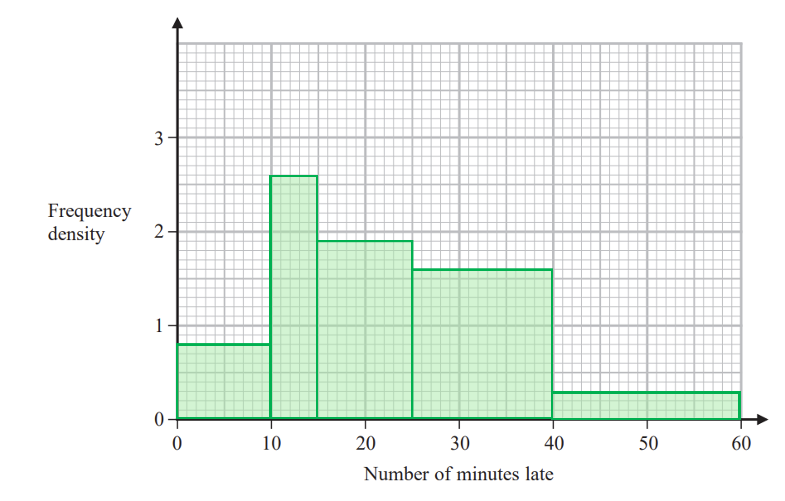

**at least 3 bars correct**** [1]**

**fully correct histogram**** [1]**

### 14((b)) — 2 marks
*Work out the number of flights less than 25 minutes late (for example, counting from the table)* * *

*8 + 13 + 19 = 40* * *

*Find the number of flights less than 5 minutes late using the histogram in part (a) (width × frequency density)* * *

*5 × 0.8 = 4* * *

*Estimate the probability that a flight was less than 5 minutes late, given that it was taken out of all the flights that were less than 25 minutes less (by dividing 4 by 40)* ** **

$\frac{4}{40}$

**either the numerator or denominator correct**** [1]**

$\frac{1}{10}$** [1]**

## Q7 — medium — 5 marks · exam-questions

### 21((a)) — 3 marks
*Work out the frequency densities using the formula *$\mathrm{frequency} \mathrm{density}=\frac{\mathrm{frequency}}{\mathrm{class} \mathrm{width}}$* *

| > *Height (*$h$* cm)* | > *Frequency* | ***Frequency density*** |
|---|---|---|
| `10 space less than space h space less-than or slanted equal to space 20` | > *35* | $\frac{35}{10}=3.5$ |
| `20 space less than space h space less-than or slanted equal to space 35` | > *45* | $\frac{45}{15}=3$ |
| `35 space less than space h space less-than or slanted equal to space 50` | > *75* | $\frac{75}{15}=5$ |
| `50 space less than space h space less-than or slanted equal to space 70` | > *40* | $\frac{40}{20}=2$ |
| `70 space less than space h space less-than or slanted equal to space 80` | > *8* | $\frac{8}{10}=0.8$ |

**at least 2 correct frequency densities**** [1]**

*Plot the histogram bars using their frequency densities Label your frequency density axis and scale*

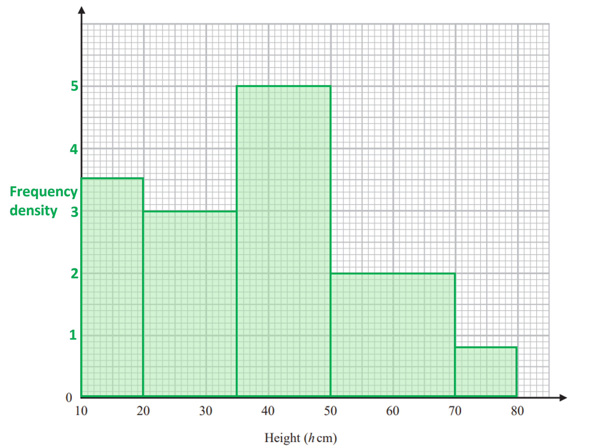

**at least 3 bars correct**** [1]**

**fully correct histogram with frequency density axis labelled and scale shown**** [1]**

### 21((b)) — 2 marks
*Use the histogram in part (a) to find the area of the bars greater than 40 (multiply the width by the frequency density)* *The 35 - 50 bar must be split into 40 - 50 (width 10)*

*10 × 5 + 20 × 2 + 10 × 0.8*

**correct method using histogram**** [1]**

**98** **[1]**

## Q8 — medium — 3 marks · exam-questions

### 19() — 3 marks
> *Work out the frequency densities using the formula *$\mathrm{frequency} \mathrm{density}=\frac{\mathrm{frequency}}{\mathrm{class} \mathrm{width}}$*  *

> * *

| > *Height (*$h$* metres)* | > *Frequency* | ***Frequency density*** |
|---|---|---|
| `0 space less than space h space less-than or slanted equal to space 20` | > *15* | $\frac{15}{20}=0.75$ |
| `20 space less than space h space less-than or slanted equal to space 35` | > *48* | $\frac{48}{15}=3.2$ |
| `35 space less than space h space less-than or slanted equal to space 40` | > *21* | $\frac{21}{5}=4.2$ |
| `40 space less than space h space less-than or slanted equal to space 50` | > *16* | $\frac{16}{10}=1.6$ |

**at least 2 correct frequency densities**** [1]**

*Plot the histogram bars using their frequency densities*

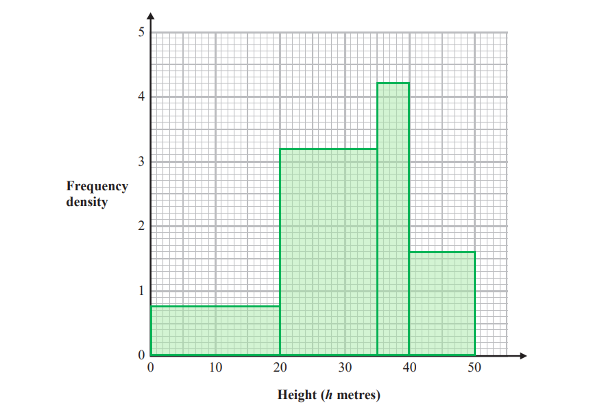

**at least 3 bars correct**** [1]**

**fully correct histogram**** [1]**

## Q9 — medium — 4 marks · exam-questions

### 21() — 4 marks
> *Add headings for the two extra columns in the table - one for class width and one for frequency density (**fd**). *
*Class width is found by subtracting the lower class boundary from the higher class boundary.*

$\mathrm{Frequency} \mathrm{density}=\frac{\mathrm{Frequency}}{\mathrm{Class} \mathrm{width}}$

| **Age, **$x$**(weeks)** | **Frequency** | ***Class width*** | ***Frequency*** ***density (*******fd*******)*** |
|---|---|---|---|
| `0 space less-than or slanted equal to space x space less than space 5` | 18 | *5 - 0 = 5* | *18 ÷ 5 = 3.6* |
| `5 space less-than or slanted equal to space x space less than space 10 space` | 23 | *5* | *23 ÷ 5 = 4.6* |
| `10 space less-than or slanted equal to space x space less than space 20` | 17 | *10* | *17 ÷ 10 = 1.7* |
| `20 space less-than or slanted equal to space x space less than space 50` | 21 | *30* | *21 ÷ 30 = 0.7* |

**Correct class widths**** [1] **
**Frequency divided by class width**** [1] **
**Three correct values for the frequency density**** [1]**

> *Draw rectangular bars using the age and frequency density columns. There should be no gaps between the bars.*

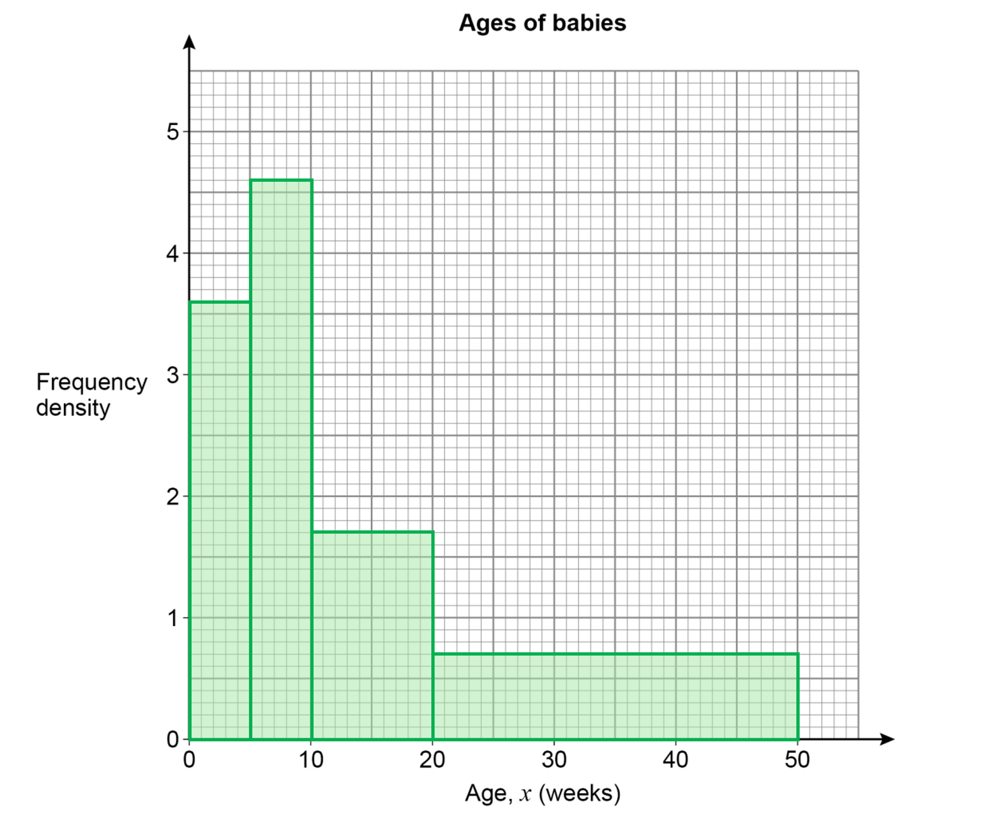

**[1]**

## Q10 — medium — 4 marks · exam-questions

### 13((b)) — 4 marks
> *Add a heading for the extra column in the table  frequency density (**fd**). Class width is found by subtracting the lower class boundary from the higher class boundary.*

$\mathrm{Frequency} \mathrm{density}=\frac{\mathrm{Frequency}}{\mathrm{Class} \mathrm{width}}$

| **Time, *****t***** (mins)** | **Frequency** | **Class width** | ***Frequency*** ***density (*******fd*******)*** |
|---|---|---|---|
| `0 space less-than or slanted equal to space t space less than space 30` | 24 | *30 - 0 = 30* | *24 ÷ 30 = 0.8* |
| `30 space less-than or slanted equal to space t space less than space 50` | 76 | *20* | *76 ÷ 20 = 3.8* |
| `50 space less-than or slanted equal to space t space less than space 60` | 52 | *10* | *52 ÷ 10 = 5.2* |
| `60 space less-than or slanted equal to space t space less than space 90` | 48 | *30* | *48 ÷ 30 = 1.6* |

**Frequency divided by class width**** [1] **
**Three correct values for the frequency density**** [1]**

> *Include a scale for the vertical axis, let each small square represent 0.1. Draw rectangular bars using the age and frequency density columns. There should be no gaps between the bars.*

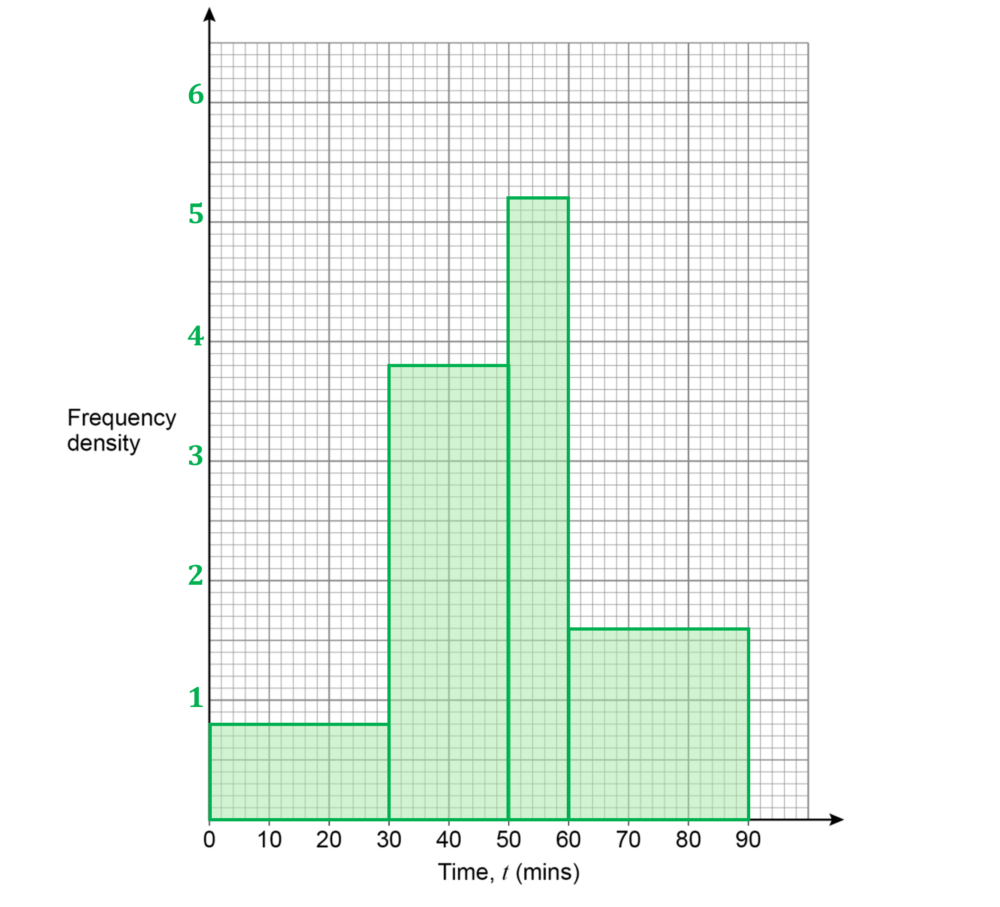

**At least 3 bars correct**** [1] **
**Fully correct with a correct scale**** [1]**

## Q11 — medium — 3 marks · exam-questions

### 18() — 3 marks
> *Add two extra columns in the table - one for class width and one for frequency density (**fd**). *
*Class width is found by subtracting the lower class boundary from the higher class boundary.*

$\mathrm{Frequency} \mathrm{density}=\frac{\mathrm{Frequency}}{\mathrm{Class} \mathrm{width}}$

| **Age, **$x$** (years)** | **Frequency** | ***Class width*** | ***Frequency*** ***density (*******fd*******)*** |
|---|---|---|---|
| `10 space less-than or slanted equal to space x space less than space 15` | 8 | *15 - 10 = 5* | *8 ÷ 5 = 1.6* |
| `15 space less-than or slanted equal to space x space less than space 25` | 24 | *10* | *24 ÷ 10 = 2.4* |
| `25 space less-than or slanted equal to space x space less than space 40` | 30 | *15* | *30 ÷ 15 = 2* |
| `40 space less-than or slanted equal to space x space less than space 70` | 39 | *30* | *39 ÷ 30 = 1.3* |

**Frequency divided by class width**** [1] **
**Three correct values for the frequency density**** [1]**

> *The vertical scale is 2 squares = 0.1 frequency density. Draw rectangular bars using the age and frequency density columns. There should be no gaps between the bars.*

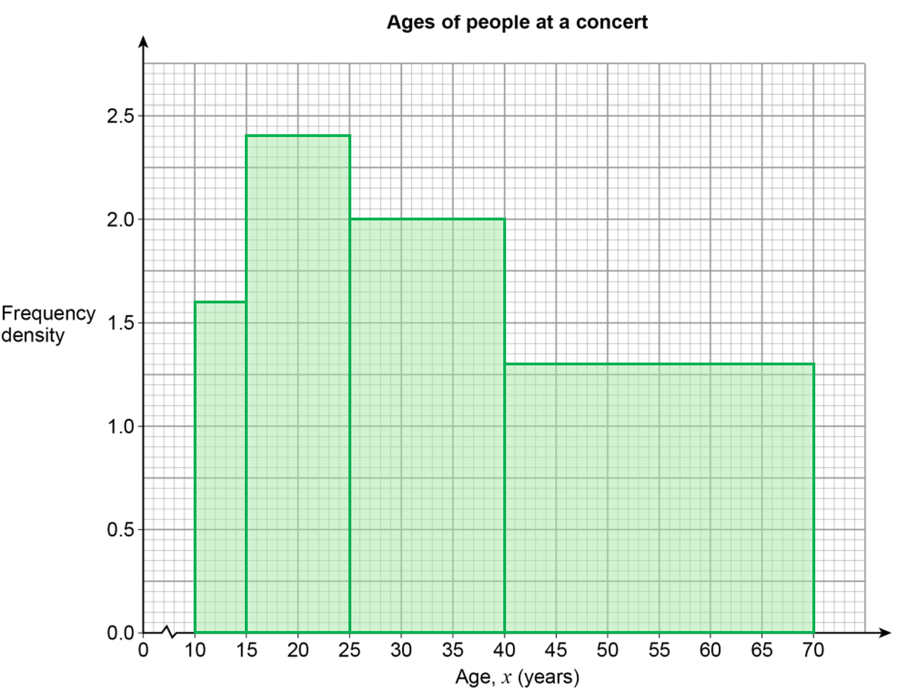

**[1]**

## Q12 — medium — 4 marks · exam-questions

### 19((a)) — 4 marks
> *Add two extra columns in the table - one for class width and one for frequency density (**fd**). *
*Class width is found by subtracting the lower class boundary from the higher class boundary.*

> $\mathrm{Frequency} \mathrm{density}=\frac{\mathrm{Frequency}}{\mathrm{Class} \mathrm{width}}$*.*

| **Time taken** **(**$t$** minutes)** | **Frequency** | ***Class width*** | ***Frequency*** ***density (*******fd*******)*** |
|---|---|---|---|
| `0 space less than space t space less-than or slanted equal to space 10` | 54 | *10 - 0 = 10* | *54 ÷ 10 = 5.4* |
| `10 space less than space t space less-than or slanted equal to space 20` | 50 | *10* | *50 ÷ 10 = 5* |
| `20 space less than space t space less-than or slanted equal to space 40` | 44 | *20* | *44 ÷ 20 = 2.2* |
| `40 space less than space t space less-than or slanted equal to space 80` | 20 | *40* | *20 ÷ 40 = 0.5* |

> *Create a vertical scale with 1 square representing 0.1 frequency density. Label the vertical axis "Frequency density". Draw rectangular bars using the age and frequency density columns. There should be no gaps between the bars.*

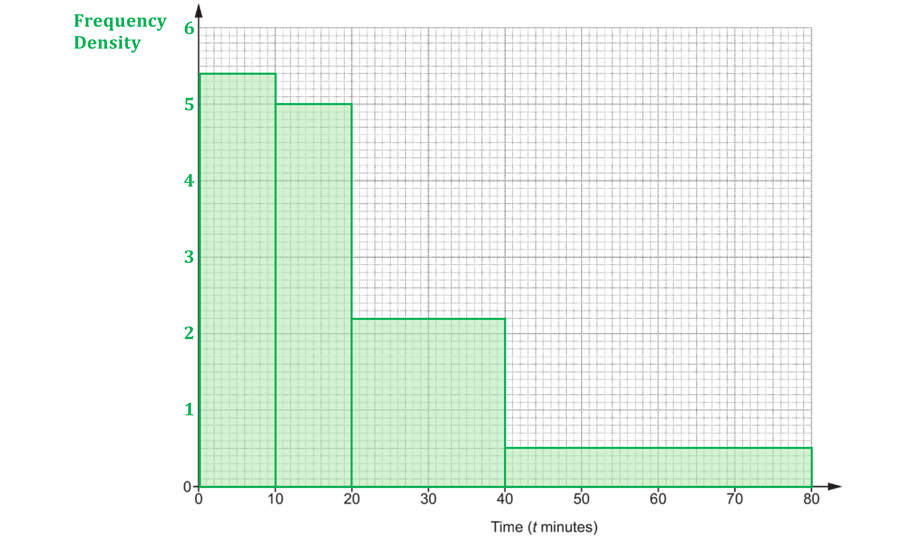

**2 correct bars**** [1] ****3 correct bars**** [1] **
**4 correct bars**** [1] **
**Vertical axis labelled with correct scale**** [1]**

## Q13 — hard — 4 marks · exam-questions

### 26((a)) — 2 marks
*The area of the bar is related to frequency on an histogram, *$\mathrm{Frequency}=\mathrm{Frequency} \mathrm{density}\times\mathrm{Class} \mathrm{width}$ 
*For the first bar the area is*

$0.4\times10=4$

> *So in this case frequency is **exactly** the area of the bar. To complete the table work out the area of each bar.*

`table row 10 less than cell p less or equal than 20 colon space space 0.9 cross times 10 equals 9 end cell row 20 less than cell p less or equal than 25 colon space space 1.6 cross times 5 equals 8 end cell row 25 less than cell p less or equal than 35 colon space space 1 cross times 10 equals 10 end cell row 35 less than cell p less or equal than 50 colon space space 0.8 cross times 15 equals 12 end cell end table`

| **Salary (*****p*****) in £1000s** | **Frequency** |
|---|---|
| 0 < *p* ≤ 10 | 4 |
| 10 < *p* ≤ 20 | **Final answer:** **9** |
| 20 < *p* ≤ 25 | **Final answer:** **8** |
| 25 < *p* ≤ 35 | **Final answer:** **10** |
| 35 < *p* ≤ 50 | **Final answer:** **12** |

**One correct**** [1]** 
**All frequencies correct**** [1]**

### 26((b)) — 2 marks
*The salaries are given in £1000s so we are looking for the proportion of people in the interval 40 < **p** ≤ 50.* 
*However, the histogram shows us a bar for 35 < **p** ≤ 50.* 
*So we can estimate the number of people in the interval 40 < p ≤ 50 by using two-thirds of the frequency for 35 < **p** ≤ 50.*

$\frac{2}{3}\times12=8$

**[1]**

> *We also need to find the number of people in the sample in total - to find this, add the frequencies together.*

$4+9+8+10+12=43$

> *Now we can write the final answer.*

**Proportion of people in the sample with a salary greater than £40 000 is**
** **$\frac{8}{43}$ **[1]**

## Q14 — hard — 3 marks · exam-questions

### 23() — 3 marks
i)`table row blank row blank end table`$\mathrm{Frequency} \mathrm{density}=\frac{\mathrm{Frequency}}{\mathrm{Class} \mathrm{width}}$

> *Use the first bar and frequency from the table to work out the frequency density scale.*

*For 0 < ***d*** ≤ 5, *$\mathrm{frequency} \mathrm{density}=\frac{30}{5}=6$

**[1]**

> *Label the frequency density axis to make other readings easier.*

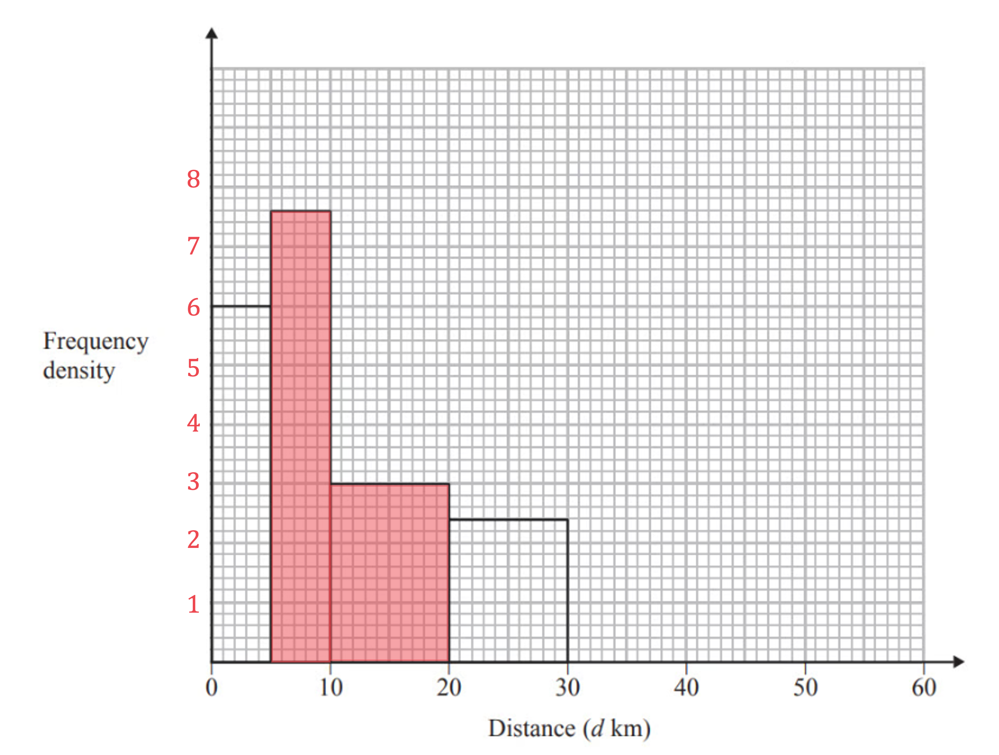

> *Find the missing frequencies from the table by finding the area of the bars for 5 < **d** ≤ 10 and 10 < **d** ≤ 20.*

`table row 5 less than cell d less or equal than 10 colon space space 7.6 cross times 5 equals 38 end cell row 10 less than cell d less or equal than 20 colon space space 3 cross times 10 equals 30 end cell end table`

| **Distance (*****d***** km)** | **Frequency** |
|---|---|
| 0 < *d* ≤ 5 | 30 |
| 5 < *d* ≤ 10 | **Final answer:** **38** |
| 10 < *d* ≤ 20 | **Final answer:** **30** |
| 20 < *d* ≤ 30 | 24 |
| 30 < *d* ≤ 50 | 16 |

**[1]**

ii)`table row blank row blank end table`*Use *$\mathrm{Frequency} \mathrm{density}=\frac{\mathrm{Frequency}}{\mathrm{Class} \mathrm{width}}$* for the interval 30 < **d** ≤ 50.*

$\frac{16}{50-30}=\frac{16}{20}=0.8$

> *Add the bar to the histogram.*

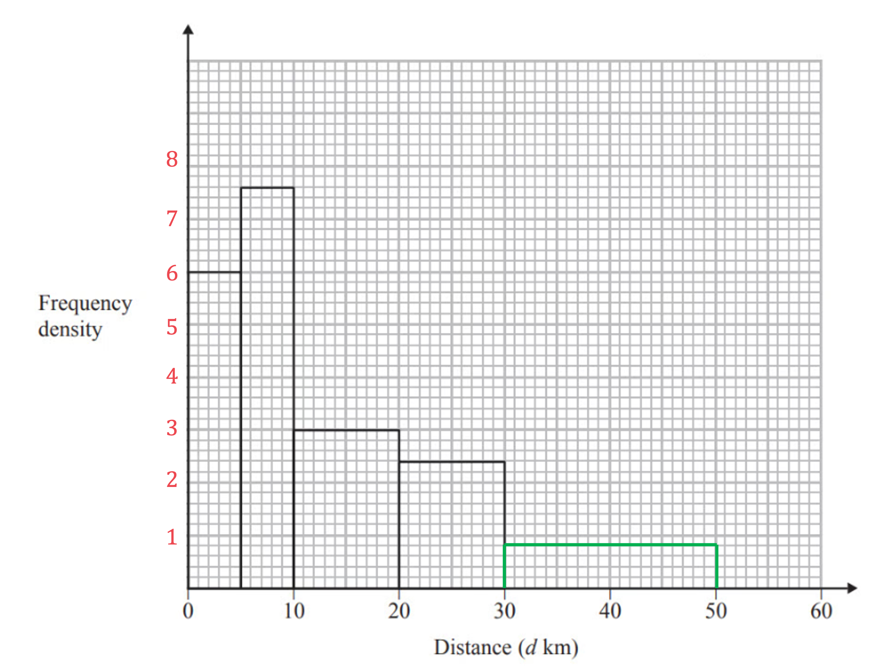

**[1]**

## Q15 — hard — 3 marks · exam-questions

### 16() — 3 marks
*On a histogram, the area is related to the frequency,  *$\mathrm{Frequency}=\mathrm{Frequency} \mathrm{density}\times\mathrm{Class} \mathrm{width}$ 
*There is a frequency of 20 for the £300 - £400 bar (as it appears on the histogram, but values are given in thousands of pounds).*

$\frac{20}{400-300}=\frac{20}{100}=0.2$

**[1]**

> *It will help to label the frequency density axis on the histogram.*

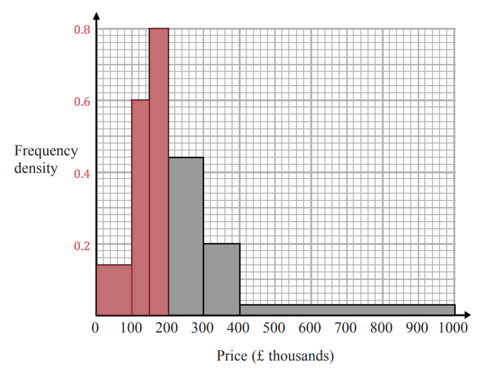

> *Add up the frequencies from the three bars up to a price of £200 000.*

$0.14\times100+0.6\times50+0.8\times50=84$

**At least two frequencies found**** [1]**

**84 houses in the village have a price under £200 000** **[1]**

## Q16 — hard — 3 marks · exam-questions

### 14((a)) — 3 marks
> *Add two columns to the table - one for class width, one for frequency density (**fd**).*

$\mathrm{Frequency} \mathrm{density}=\frac{\mathrm{Frequency}}{\mathrm{Class} \mathrm{width}}$

> *Add two columns to the table - one for class width, one for frequency density (**fd**).*

| **Speed (*****s***** km/h)** | **Frequency** | ***Class width*** | ****fd**** |
|---|---|---|---|
| 90 < *s* ≤ 100 | 13 | *100 - 90 = 10* | *13 ÷ 10 = 1.3* |
| 100 < *s* ≤ 105 | 16 | *5* | *3.2* |
| 105 < *s* ≤ 110 | 18 | *5* | *3.6* |
| 110 < *s* ≤ 120 | 22 | *10* | *2.2* |
| 120 < *s* ≤ 140 | 12 | *20* | *0.6* |

*The speed (horizontal) axis will need to run from 90 to 140 so use 5 'small squares' for 10 km/h.* 
*The frequency density (vertical) axis will need to run from 0 to 3.6 so 10 'small squares' for 1 will give a good sized histogram.*

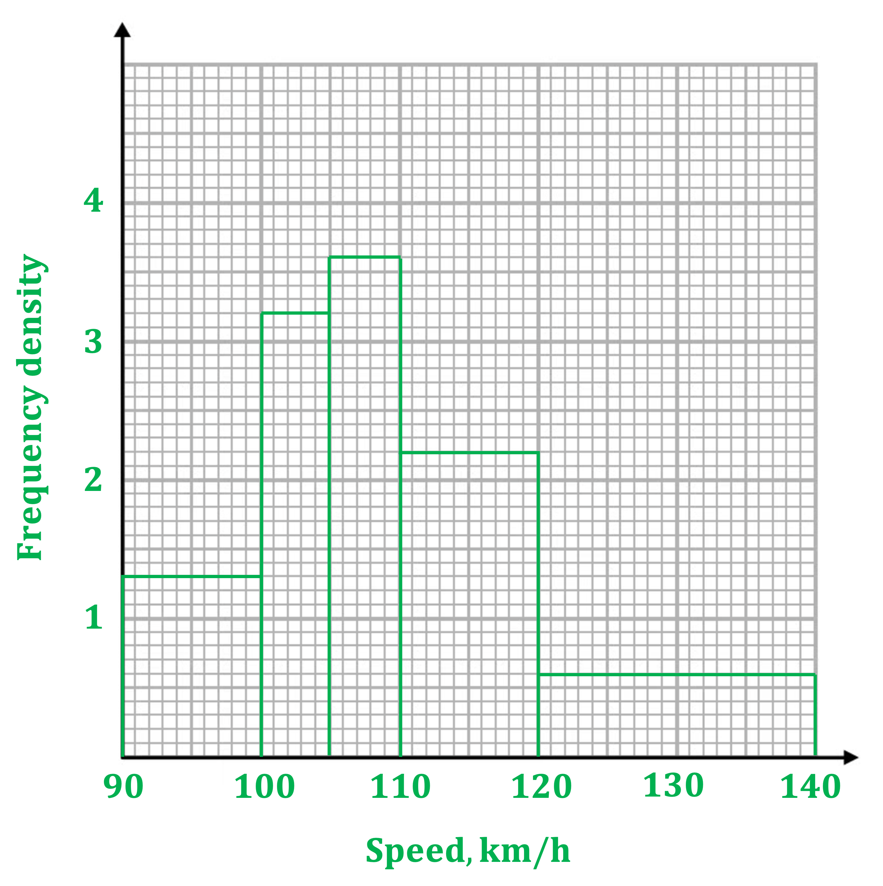

**Two correct bars ****[1]**** **
**Four correct bars ****[1]**** **
**Fully correct and labelled histogram ****[1]**

## Q17 — hard — 5 marks · exam-questions

### 22((a)) — 3 marks
> *Add two columns to the table - one for class width, one for frequency density (**fd**).*

$\mathrm{Frequency} \mathrm{density}=\frac{\mathrm{Frequency}}{\mathrm{Class} \mathrm{width}}$

| **Speed (*****s***** km/h)** | **Frequency** | ***Class width*** | ****fd**** |
|---|---|---|---|
| 60 < *s* ≤ 65 | 15 | *65 - 60 = 5* | *15 ÷ 5 = 3* |
| 65 < *s* ≤ 70 | 25 | *5* | *5* |
| 70 < *s* ≤ 80 | 36 | *10* | *3.6* |
| 80 < *s* ≤ 100 | 24 | *20* | *1.2* |

> *The frequency density (**fd**) axis will need to run from 0 to 5 so 10 'small squares' for 1 will give a good sized histogram.*

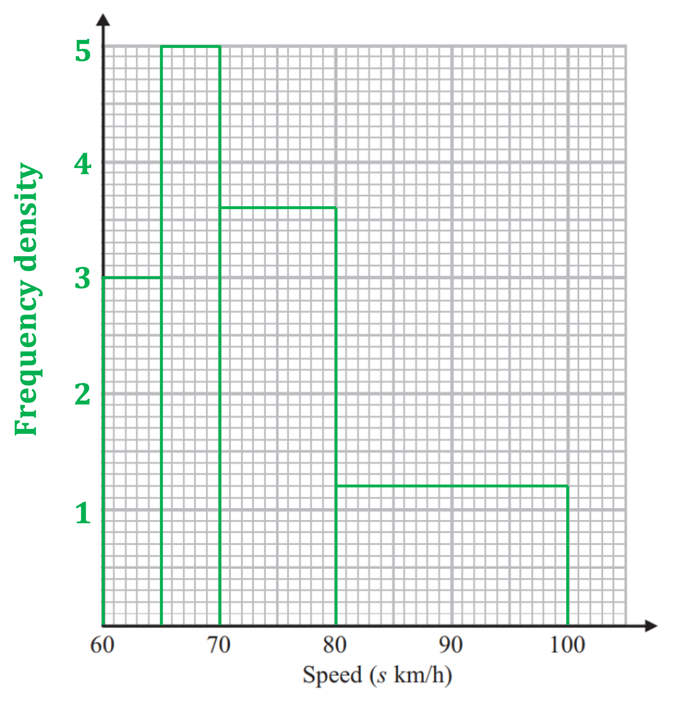

**Two correct bars of different widths ****[1]**** **
**Three correct bars ****[1]**** **
**Fully correct histogram ****[1]**

### 22((b)) — 2 marks
> *An estimate for the number of cars with a speed of more than 85 km/h will be given by the frequency represented by a bar from 85 to 100 on the speed axis, as shown below.*

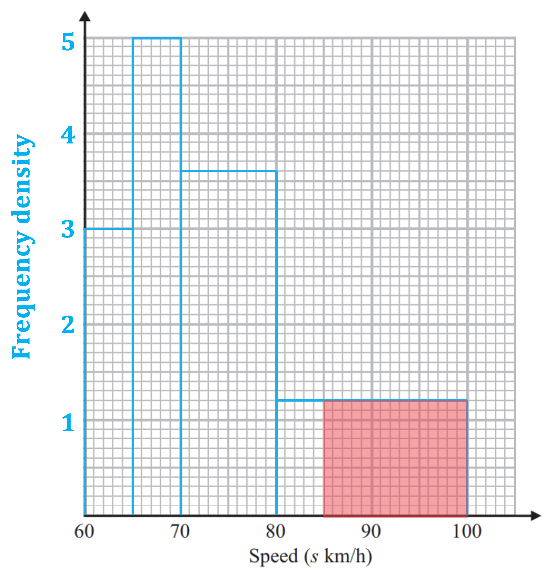

> *Since frequency is the area of bars,*

$1.2\times15=18$

**[1]**** **
**About 18 cars had a speed of more than 85 km/h** **[1]**

## Q18 — hard — 3 marks · exam-questions

### 13() — 3 marks
> *We can use the histogram to estimate the number of members aged 50 or above using*

$\mathrm{Frequency}=\mathrm{Frequency} \mathrm{density}\times\mathrm{Class} \mathrm{width}$

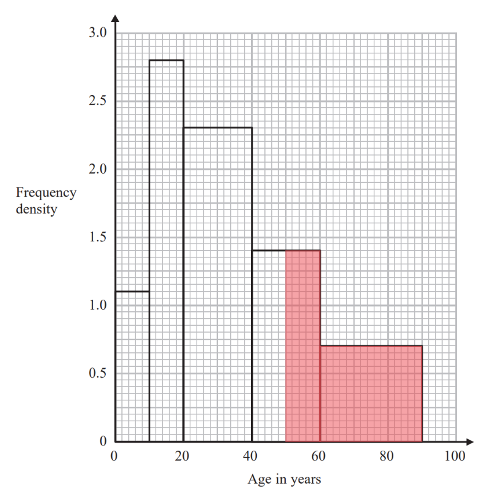

$\mathrm{Age}50-60:1.4\times10=14\,\mathrm{Age}60-90:0.7\times30=21$ 
*An estimate of the total number of members over 50 years of age is 14 + 21 = 35*

**[1]**

> *20% of those over 50 years of age are female.*

$35\times\frac{20}{100}=7$

**[1]**

**There are approximately 7 female members of the sports club who are over 50 years of age*** ***[1]**

## Q19 — hard — 4 marks · exam-questions

### 17((a)) — 2 marks
*The area of a bar is related to frequency on an histogram.* *The first bar has an area of*

$0.8\times5=4$

> *So in this case frequency is **exactly** the area of the bar. To complete the table work out the area of each bar.*

`table row 5 less than cell t less or equal than 15 colon space space 0.4 cross times 10 equals 4 end cell row 15 less than cell t less or equal than 25 colon space space 0.6 cross times 10 equals 6 end cell row 25 less than cell t less or equal than 30 colon space space 1 cross times 5 equals 5 end cell row 30 less than cell t less or equal than 50 colon space space 0.2 cross times 20 equals 4 end cell end table`

| **Time taken (*****t *****minutes)** | **Frequency** |
|---|---|
| 0 < *t* ≤ 5 | 4 |
| 15 < *t* ≤ 15 | **Final answer:** **4** |
| 15 < *t* ≤ 25 | **Final answer:** **6** |
| 25 < *t* ≤ 30 | **Final answer:** **5** |
| 30 < *t* ≤ 50 | **Final answer:** **4** |

**One correct frequency**** [1]**
 **All correct**** [1]**

### 17((b)) — 2 marks
> *The position of the lower quartile is the *`open parentheses fraction numerator n plus 1 over denominator 4 end fraction close parentheses to the power of th`* value. *$n$* is the total of the frequency column from the table.*

$n=4+4+6+5+4=23$

> *So the position of the lower quartile is*

$\frac{23+1}{4}=6$

**[1]**

*We need to find the 6**th** value.* *Looking at the frequencies from the frequency table we see that*

`table attributes columnalign right center left columnspacing 0px end attributes row cell 4 plus 4 end cell equals 8 end table` *So the 6**th** person is the 2**nd** person in the 5 < ***t*** ≤ 15 interval*

> *There are 4 people in this interval and to estimate a value within it we assume they are evenly spread across the interval. *
*So we want the person that is *`2 over 4 open parentheses equals 1 half close parentheses`* of the way through the 5 < **t** ≤ 15 interval.*

`5 plus 1 half cross times open parentheses 15 minus 5 close parentheses equals 10`

**An estimate of the lower quartile is 10 seconds*** ***[1]**

**As it is an estimate, **$\frac{n}{4}$** can be used to find the position of the lower quartile, so 9.375 is also accepted.**

## Q20 — hard — 3 marks · exam-questions

### 27() — 3 marks
*From rearranging the formula for frequency density,*  $\mathrm{Frequency}=\mathrm{Frequency} \mathrm{density}\times\mathrm{Class} \mathrm{width}$ *i.e. Frequency is the area (of each bar)*

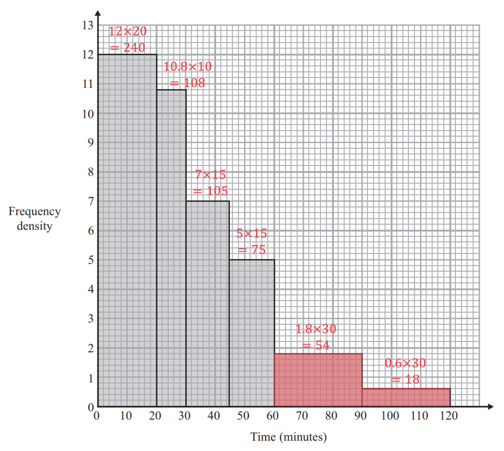

> *The percentage required will be given by*

`fraction numerator Number space of space passengers space who space had space to space wait space for space more space than space one space hour over denominator Total space number space of space passengers end fraction cross times 100 percent sign`

> *Remember 1 hour is 60 minutes!*

`fraction numerator 54 plus 18 over denominator 240 plus 108 plus 105 plus 75 plus 54 plus 18 end fraction cross times 100 percent sign equals 72 over 600 cross times 100 percent sign equals 12 percent sign`

**Total frequency or >60 min frequency ****[1]**** **
**Method to find percentage ****[1]**

**The percentage of passengers who had to wait for more than one hour is 12% (3 s.f)*** ***[1]**

## Q21 — hard — 3 marks · exam-questions

### 25() — 3 marks
*The width of the the 0 - 10 bar is 10 and the frequency is 14* *Work out the frequency density (*$\mathrm{frequency} \mathrm{density}=\frac{\mathrm{frequency}}{\mathrm{width}}$*)* * *

*frequency density = *$\frac{14}{10}=1.4$

**[1]*** *

*1 small square (in height) is 0.1 unit of frequency density* *Write the frequency-density scale on the diagram* * *

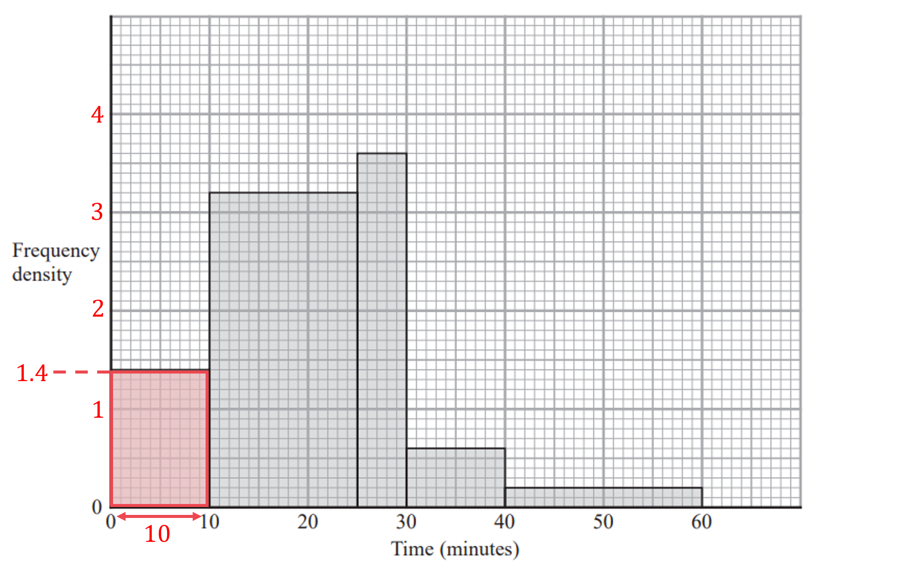

> * *

*The number of customers who had to wait less than 60 minutes is all the customers (no customer waited more than 60 minutes) Work out the frequencies (areas) of all the bars (by multiplying bar width by frequency density) and add them up* * *

*14 + 15 × 3.2 + 5 × 3.6 + 10 × 0.6 + 20 × 0.2*

**one error allowed ****[1]**

**90 ****[1]**

## Q22 — hard — 4 marks · exam-questions

### 1() — 4 marks
Find the number of squares in the 40 to 50 bar

- The horizontal scale is 1 square represents 2 years

$5\times22=110$

**[M1]**

Find the total number of squares in the histogram

`table row cell 20 space cross times space 10 space end cell equals cell space 200 end cell row cell 10 space cross times space 30 space end cell equals cell space 300 space end cell row cell 15 space cross times 3 space end cell equals cell space 45 end cell end table`

`table row cell 110 space plus space 200 space plus space 300 space plus space 45 space end cell equals cell space 655 space end cell end table`

**[M1]**

Use proportion to work out how many people are in the 40 to 50 category

- Area is proportion to frequency

$\frac{110}{655}\times6550=1100$

**[M1]**

**Final answer:** **1100**

**[A1]**

## Q23 — hard — 3 marks · exam-questions

### 22() — 3 marks
*Method 1 *
*Find the frequencies (areas) of all the bars (by multiplying their widths by their frequency densities)*

*2 × 2.5 + 3 × 4 + 5 × 3.4 + 5 × 2.2 + 15 × 1 *
*= 5 + 12 + 17 + 11 + 15 = 60*

**allow one error**** [1]**

*Find the frequency between 20 and 30 by splitting the 15 - 30 bar (to get a width from 20 to 30) *

*10 × 1 = 10*

**[1]**

*Find the proportion of customers who waited longer than 20 minutes (by dividing 10 by 60) *

$\frac{10}{60}$

$\frac{1}{6}$* ***[1]**

*Method 2* 
*Count the number of small squares in total (in all five bars)* * *

*100 + 240 + 340 + 220 + 300 = 1200 small squares in total*

**[1]**

*Count the number of small squares between 20 and 30 minutes* * *

*200 small squares*

**[1]**

*Find the proportion of customers who waited longer than 20 minutes (by dividing 100 by 600) *

$\frac{200}{1200}$

$\frac{1}{6}$* ***[1]**

## Q24 — hard — 3 marks · exam-questions

### 21() — 3 marks
*The width of the the 8 - 8.5 bar is 0.5 and the frequency is 16* *Work out the frequency density (*$\mathrm{frequency} \mathrm{density}=\frac{\mathrm{frequency}}{\mathrm{width}}$*)* * *

*frequency density = *$\frac{16}{0.5}=32$

**[1]*** *

*1 small square (in height) is 1 unit of frequency density* 
*Write the frequency-density scale on the diagram* * *

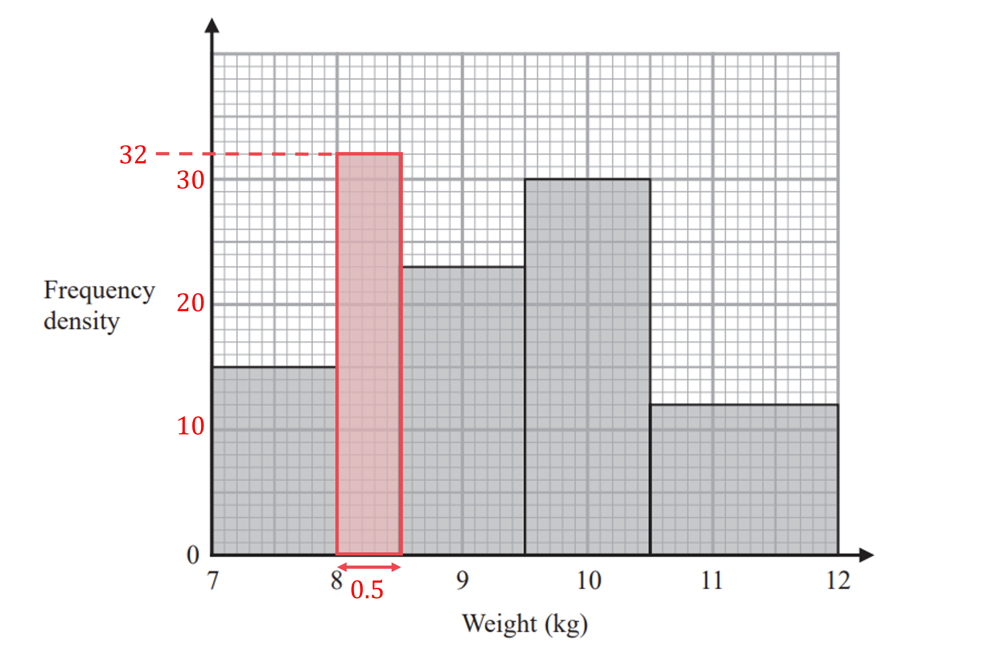

> * *

*Work out the frequencies (areas) of all the bars (by multiplying bar width by frequency density) and add them up* * *

*1 × 15 + 16 + 1 × 23 + 1 × 30 + 1.5 × 12*

**one error allowed ****[1]**

**102 ****[1]**

## Q25 — hard — 4 marks · exam-questions

### 25() — 4 marks
> *The frequency is the area. So find the frequency for each of the three bars by multiplying the class width by the frequency density.*

| *Height, cm* | *Frequency* |
|---|---|
| *150 cm ≤ height < 155 cm* | *5 × 2 = 10* |
| *155 cm ≤ height < 165 cm* | *10 × 3 = 30* |
| *165 cm ≤ height < 170 cm* | *5 × 4 = 20* |

**Finding at least one frequency**** [1]**

> *Subtract the frequencies from 74 to find the frequency of the final bar.*

*74 - 10 - 30 - 20 = 14*

**[1]**

> $\mathrm{Frequency} \mathrm{densit}y=\frac{\mathrm{Frequency}}{\mathrm{Class} \mathrm{width}}.$* Substitute 14 for the frequency and 10 for the class width to find the frequency density for the final bar.*

*14 ÷ 10 = 1.4*

**[1]**

> *Draw the rectangular bar on the diagram.*

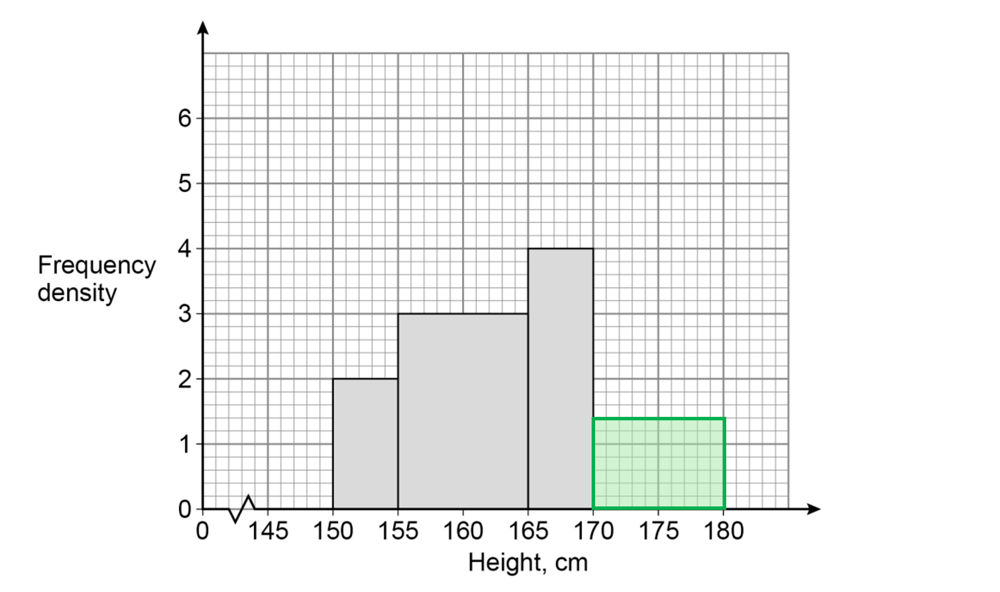

**[1]**

## Q26 — hard — 5 marks · exam-questions

### 23((a)) — 3 marks
> $\mathrm{Frequency} \mathrm{desnity}=\frac{\mathrm{Frequency}}{\mathrm{Class} \mathrm{width}}.$* Substitute 30 for the frequency and 20 for the class width.*

$\frac{30}{20}=1.5$

**[1]**

> *The height of the first bar is 1.5 so you can use this to complete the scale. Each square represents 0.1 frequency density.*

> *Find the frequency density for the class 65 ≤ **A** < 80.*

$\frac{12}{15}=0.8$

**[1]**

> *Complete the histogram by drawing the final bar. *

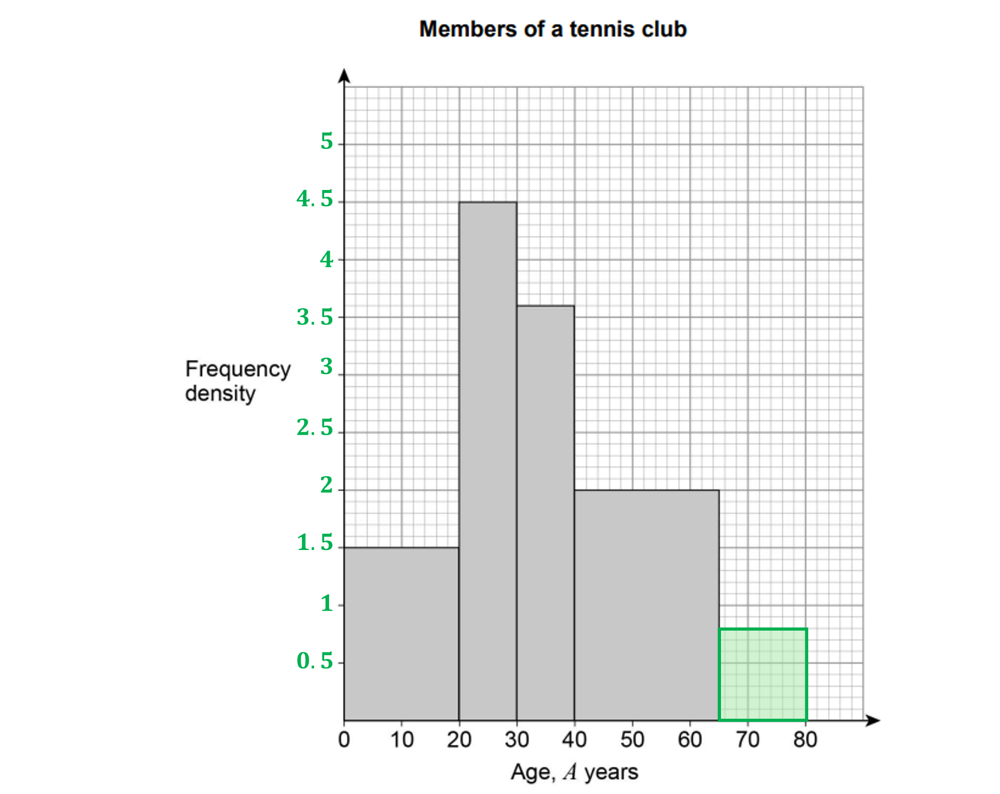

**[1]**

### 23((b)) — 2 marks
> *The frequency is the area. So find the frequency for each bar by multiplying the class width by the frequency density. Two of the frequencies are given in the question.*

| *Age (***A*** years)* | *Frequency* |
|---|---|
| *0 ≤ ***A*** < 20* | *30* |
| *20 ≤ ***A*** < 30* | *10 × 4.5 = 45* |
| *30 ≤ ***A*** < 40* | *10 × 3.6 = 36* |
| *40 ≤ ***A*** < 65* | *25 × 2 = 50* |
| *65 ≤ ***A*** < 80* | *12* |

**Finding at least one frequency**** [1]**

> *Add the frequencies together to find the total.*

*30 + 45 + 36 + 50 + 12 = 173*

**173 members*** ***[1]**

## Q27 — hard — 4 marks · exam-questions

### 22() — 4 marks
> $\mathrm{Frequency} \mathrm{density}=\frac{\mathrm{Frequency}}{\mathrm{Class} \mathrm{width}}$*. Substitute 22 for the frequency and 25 for the class width to find the frequency density of the class 40 ≤ age < 65.*

$\frac{22}{25}=0.88$

**[1]**

> *The height of the final bar is 0.88 which is 11 small squares. Find out how much frequency density one square represents.*

$\frac{0.88}{11}=0.08$

**[1]**

> *The bar for 25 ≤ age < 40 is 30 squares tall. Find the frequency density by multiplying this by 0.08.*

$30\times0.08=2.4$

> *Find the frequency by multiplying the frequency density by the class width.*

$2.4\times15=36$

**[1]**

**36 members*** ***[1]**

## Q28 — hard — 7 marks · exam-questions

### 15() — 4 marks
> *The frequency is equal to the area of the bars. Find the area of the two bars by multiplying the frequency density by the class width.*

*For 450 g to 700 g* 
*Area = 50 × 250 = 12 500*

**Multiplying the correct numbers**** [1]**

*For 300 g to 450 g* 
*Area = 70 × 150 = 10 500*

**Multiplying the correct numbers**** [1] **
**At least one frequency correct**** [1]**

> *Compare the areas.*

**Zoe is ****incorrect**** as there are ****2000 more**** parcels weighing between 450 g and 700 g than between 300 g and 450 g ****[1]**

### 15((b)) — 2 marks
> $\mathrm{Frequency} \mathrm{density}=\frac{\mathrm{Frequency}}{\mathrm{Class} \mathrm{width}}.$* Substitute 6500 for the frequency and 50 for the class width.*

$\frac{6500}{50}=130$

**[1]**

> *Draw a rectangular bar for between 50 and 100.*

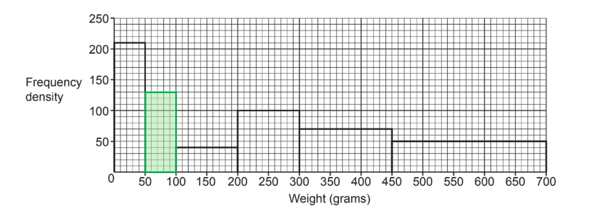

**[1]**

### 15((c)) — 1 marks
> *If a histogram uses rectangles then it is being assumed that the data is evenly distributed within each class.*

**Zoe's answer is unlikely to be reliable as the masses of the parcels ****may not be evenly distributed**** between 200 g and 300 g** **[1]**

## Q29 — hard — 5 marks · exam-questions

### 12() — 5 marks
> *The frequency is the area. So find the frequency for each of the three bars by multiplying the class width by the frequency density.*

| *Time taken (seconds)* | *Frequency* |
|---|---|
| *10 ≤ time < 25* | *15 × 0.8 = 12* |
| *25 ≤ time < 35* | *10 × 0.9 = 9* |
| *35 ≤ time < 50* | *15 × 0.2 = 3* |

**Finding at least two correct frequencies**** [1]**

> *Subtract the frequencies from 30 to find the frequency of the final bar.*

*30 - 12 - 9 - 3 = 6*

**All three correct frequencies used**** [1] **
**Subtracting from 30**** [1]**

> $\mathrm{Frequency} \mathrm{desnity}=\frac{\mathrm{Frequency}}{\mathrm{Class} \mathrm{width}}.$* Substitute 6 for the frequency and 10 for the class width to find the frequency density for the final bar.*

*6 ÷ 10 = 0.6*

**[1]**

> *Draw the rectangular bar on the diagram.*

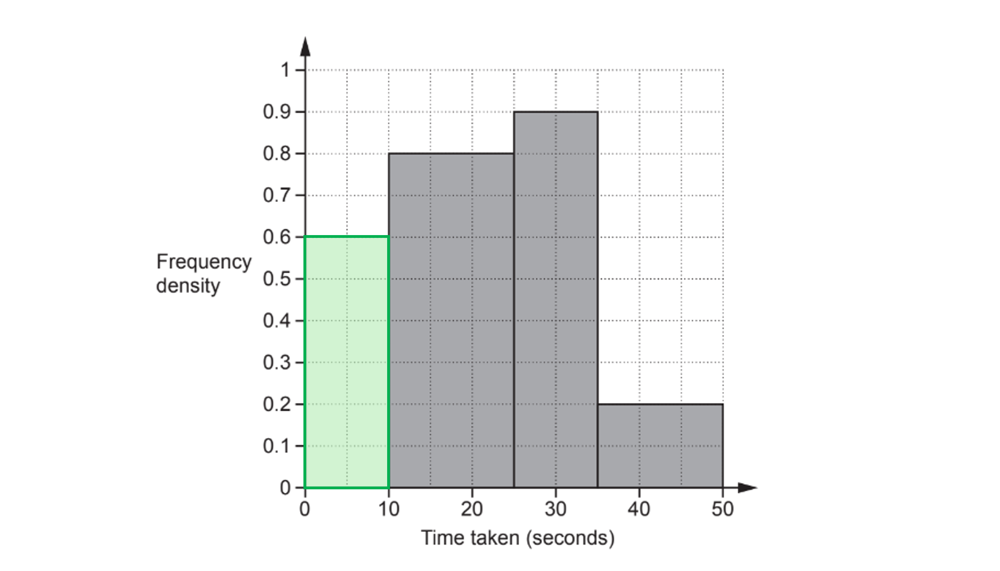

**[1]**

## Q30 — hard — 5 marks · exam-questions

### 10() — 5 marks
i) *The frequency is the area. So find the frequency for each bar by multiplying the class width by the frequency density.*

| *Health score* | *Frequency* |
|---|---|
| *0 ≤ health score < 30* | *30 × 0.2 = 6* |
| *30 ≤ health score < 40* | *10 × 0.3 = 3* |
| *40 ≤ health score <50* | *10 × 0.8 = 8* |
| *50 ≤ health score < 70* | *20 × 0.5 = 10* |
| *70 ≤ health score < 100* | *30 × 0.1 = 3* |

**Finding at least three correct frequencies**** [1]**

> *Add the frequencies together to find the total.*

*6 + 3 + 8 + 10 + 3 = 30*

**[1]**

> *Find the amount of people that had a score of 45 or more. To find the frequency of 45 to 50 use half the frequency of 40 to 50.*

*½ × 8 + 10 + 3 = 17*

**[1]**

> *Write this as a fraction of the total.*

** **$\frac{17}{30}$** ****[1]**

> * *

ii) *Half of the frequency for the group of 40 to 50 was used.*

**It has been assumed that the health scores in the group ****40 to 50**** are ****evenly distributed** **[1]**

## Q31 — hard — 4 marks · exam-questions

### 19() — 4 marks
> *Calculate the area of each 'bar' of the histogram*

> *The frequency density is not given, so just let each large square on the vertical axis be one unit (therefore each small square is 0.2 units)*

`table row cell 10 cross times 3.4 end cell equals 34 row cell 20 cross times 7.2 end cell equals 144 row cell 5 cross times 8.8 end cell equals 44 row cell 15 cross times 4 end cell equals 60 row cell 10 cross times 1.8 end cell equals 18 end table`

**[M1]**

> *Calculate the total area of all of the bars*

$34+144+44+60+18=300$

**[M1]**

> *The area of the 50-55 bar is 44, and the total area is 300*

> *Therefore *$\frac{44}{300}$* of the 150 people belong to that group*

$150\times\frac{44}{300}=22$

**[M1]**

**Final answer:** **22**

**[A1]**

## Q32 — hard — 4 marks · exam-questions

### 18() — 4 marks
> *You are told there are 140 people in total*

> *Use that and the frequencies in the table to calculate the total frequency for the two bars on the histogram*

*140 - 23 - 18 - 14 = 85*

> *So the area of the two bars on the histogram corresponds to a frequency of 85*

> *Calculate the area of those bars*

- *It's easiest to use 'numbers of big squares high' and 'numbers of big squares wide' for the dimensions of the bars*

$1\times2.5+1.5\times4=8.5$

**[M1]**

> *This means 8.5 large squares = 85 people, or*

*1 large square = 10 people*

**[M1]**

> **[exam-tip]**
> Because a large square has a width of 10 units on the horizontal axis, this also lets you work out the scale on the vertical axis.  Recall that
> 
> `table row cell Frequency space density space end cell equals cell space fraction numerator frequency over denominator class space width end fraction end cell end table`
> 
> A large square has a frequency of 10, and a class width of 10. So a height of one large square must correspond to a frequency density of $\frac{10}{10}=1$

> *On the histogram the bar for *$5<t\leq15$* has an area of 2.5 large squares*

$2.5\times10=25\mathrm{people}$

> *The bar for *$15<t\leq30$* has an area of 6 large squares*

$6\times10=60\mathrm{people}$

> *Calculate the frequency density for the data in the table*

> *First bar*

`table row cell Frequency space density space end cell equals cell space fraction numerator frequency over denominator class space width end fraction end cell row FD equals cell 23 over 5 end cell row FD equals cell 4.6 end cell end table`

> *Fourth bar*

$\mathrm{FD}=\frac{18}{10}\,\mathrm{FD}=1.8$

> *Fifth bar*

$\mathrm{FD}=\frac{14}{20}\,\mathrm{FD}=0.7$

> *Use this information to fill in the table and complete the histogram*

| Time (t minutes) | Frequency |
|---|---|
| `0 space less than space t space less-than or slanted equal to 5` | 23 |
| `5 space less than space t space less-than or slanted equal to 15` | **Final answer:** **25** |
| `15 space less than space t space less-than or slanted equal to 30` | **Final answer:** **60** |
| `30 space less than space t space less-than or slanted equal to 40` | 18 |
| `40 space less than space t space less-than or slanted equal to 60` | 14 |

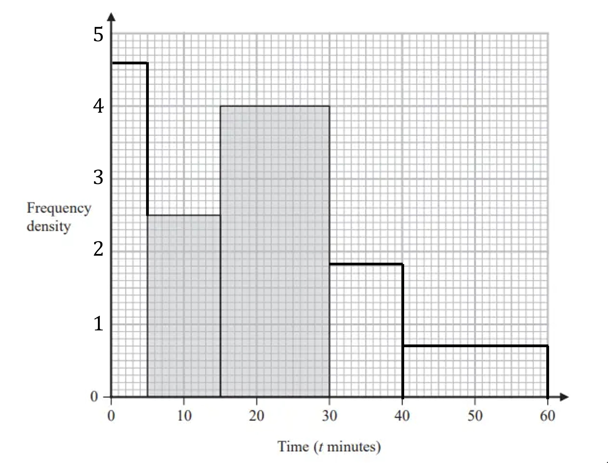

**[A1 A1]**

> **[mark-scheme]**
> **A1:** For getting four of the five missing bits of information correct. This would be some of the missing frequencies and bars.
> 
> **A1:** For completing all the of table and histogram correctly.

## Q33 — hard — 3 marks · exam-questions

### 17() — 3 marks
> *Use the formula *$\mathrm{frequency} \mathrm{density}=\frac{\mathrm{frequency}}{\mathrm{class} \mathrm{width}}$* to work out the frequency density scale*

$\mathrm{frequency} \mathrm{density}=\frac{24}{20}$

$\mathrm{frequency} \mathrm{density}=1.2$

**[M1]**

> *Add this to the graph and use it to fill in the rest of the numbers on the *$y$* axis*

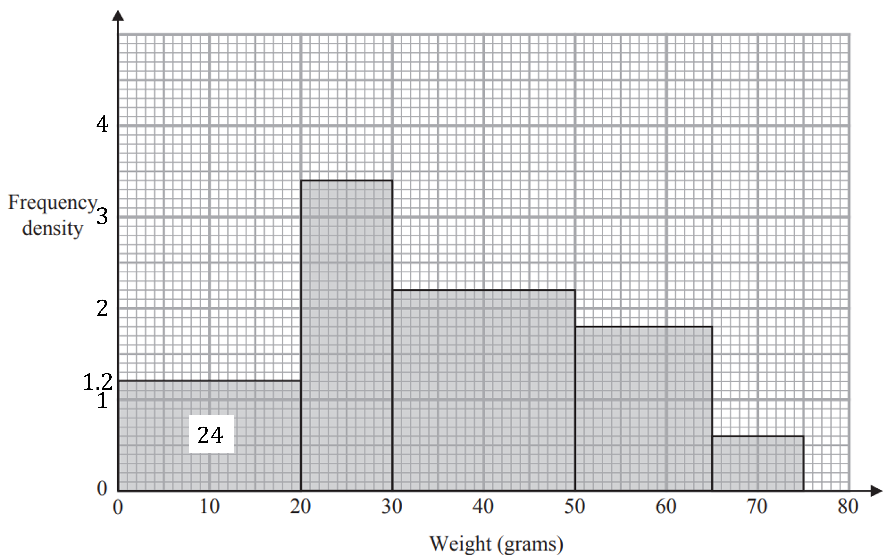

> *Draw dotted lines on the graph at *$35$* and *$55$*, and work out the area of the bars between them to find the frequency*

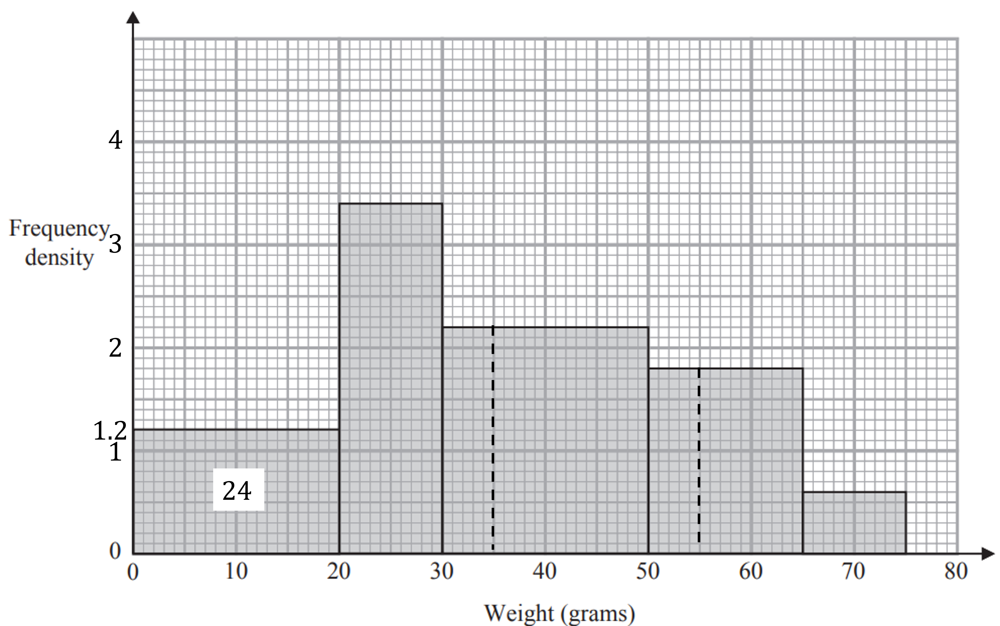

> *Use the formula to find the number of oranges weighing between *$35$* and *$50$* grams*

$15\times2.2=33$

> *Use the formula to find the number of oranges weighing between *$50$* and *$55$* grams*

$5\times1.8=9$

**[M1]**

> *Add these together *

$33+9=42$

$42$

**[A1]**

## Q34 — very_hard — 3 marks · exam-questions

### 23() — 3 marks
> *Use *$\mathrm{Frequency}=\mathrm{Frequency} \mathrm{density}\times\mathrm{Class} \mathrm{width}$* to work out the frequency of each bar on the histogram. *
*The last bar will need splitting at a weight of 100 grams.*

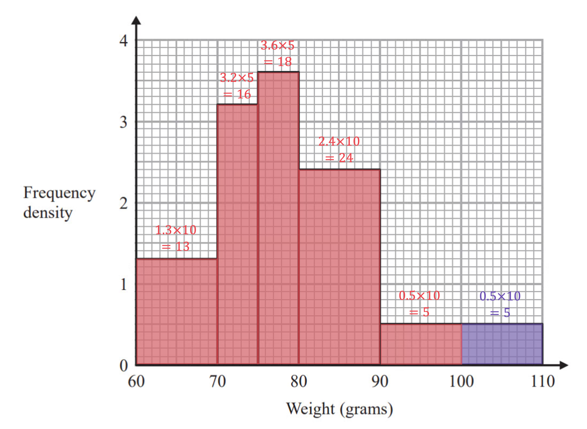

> *Work out the number of plums with a weight less than 100 grams, and the total number of plums.*

$<100:13+16+18+24+5=76\,\mathrm{Total}:76+5=81$

**One mark for each**** [2]**

> *Now write the proportion as a fraction.*

**The proportion of plums with a weight less than 100 grams is**** **$\frac{76}{81}$ **[1]**

**A decimal or percentage answer is also allowed (0.938 or 93.8% (3 s.f.)).**

## Q35 — very_hard — 5 marks · exam-questions

### 17((a)) — 3 marks
> *Add two columns to the table - one for class width, one for frequency density (**fd**).*

$\mathrm{Frequency} \mathrm{density}=\frac{\mathrm{Frequency}}{\mathrm{Class} \mathrm{width}}$

| **Height (*****h***** cm)** | **Frequency** | ***Class width*** | ****fd**** |
|---|---|---|---|
| 140 < *h* ≤ 150 | 15 | *150 - 140 = 10* | *15 ÷ 10 = 1.5* |
| 150 < *h* ≤ 155 | 30 | *5* | *6* |
| 155 < *h* ≤ 160 | 51 | *5* | *10.2* |
| 160 < *h* ≤ 165 | 36 | *5* | *7.2* |
| 165 < *h* ≤ 180 | 18 | *15* | *1.2* |

> *The height axis will need to run from 140 to 180 (cm) so 1 'small square' for 1 cm. *
*The frequency density axis will need to run from 0 to 10.2 (at least) so 10 'small squares' for 2 will give a good sized histogram.*

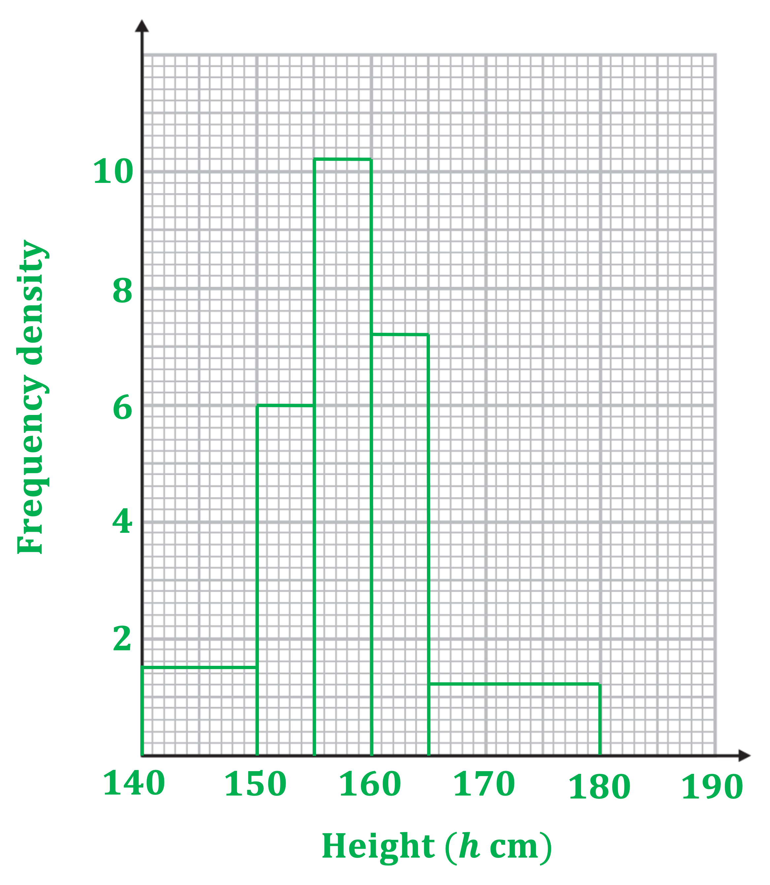

**Two correct bars of different widths ****[1]**
** Four correct bars and axes labelled ****[1]**** **
**Fully correct and labelled histogram ****[1]**

### 17((b)) — 2 marks
> *To estimate the number of students with a height between 150 cm and 170 cm we will need to sum the frequencies for the intervals 150 < h ≤ 155, 155 < h ≤ 160, 160 < h ≤ 165 and an estimate for the interval 165 < h ≤ 170.*

> *To estimate the number of students in the interval 165 < h ≤ 170 we assume the 18 students are evenly distributed across the 165 < h ≤ 180 interval.  Clearly, we need one-third of this interval.*

$\frac{1}{3}\times18=6$

**[1]**

> *The question states there are 150 students in total. *
*So the fraction required is given by*

`fraction numerator 30 plus 51 plus 36 plus 6 over denominator 150 end fraction equals 123 over 150 open parentheses equals 41 over 50 close parentheses`

**An estimate for the fraction of students who have a height between 150 cm and 170 cm is **$\frac{41}{50}$** ****[1]**

## Q36 — very_hard — 4 marks · exam-questions

### 19() — 4 marks
i) *First find the scale on the frequency density axis.* *The first bar, between 70 and 80 minutes (less than 80 minutes), represents 7 cyclists.*

$\mathrm{Frequency} \mathrm{density}=\frac{\mathrm{Frequency}}{\mathrm{Class} \mathrm{width}}$

$\mathrm{fd}=\frac{7}{80-70}=0.7$

**[1]**

> *Label the frequency density axis to help work out the required area.*

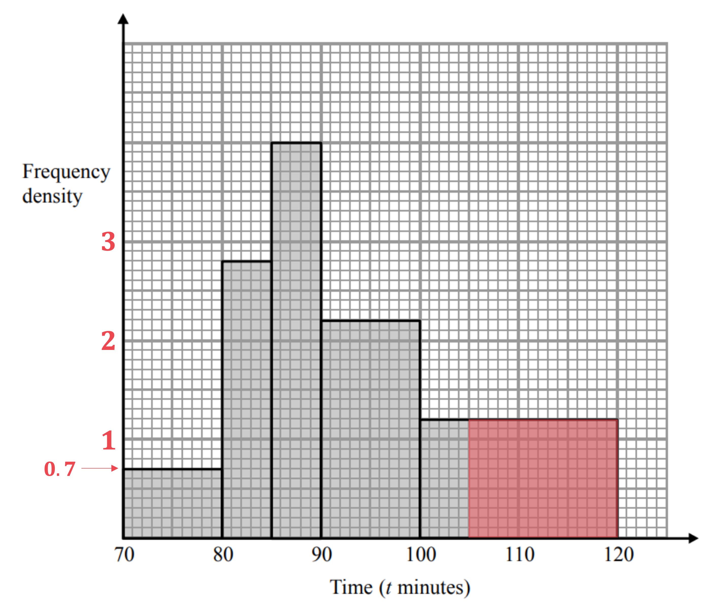

> *The area, and so frequency, of the number of cyclists taking more than 105 minutes is*

$1.2\times15=18$

**[1]**

**An estimate of the number of cyclists taking more than 105 minutes is 18** **[1]**

ii)

**The answer is only an estimate as we do not know the exact times the cyclists in the interval 100 < ****t**** ≤ 120 took but we assume that they are evenly distributed throughout the interval** **[1]**

## Q37 — very_hard — 4 marks · exam-questions

### 21() — 4 marks
*Pie charts show proportion.* 
*So first find the proportion of onions that are sent to a food processing factory from the histogram.* 
*Area on a histogram represents the frequency, i.e.  *$\mathrm{Frequency}=\mathrm{Frequency} \mathrm{density}\times\mathrm{Class} \mathrm{width}$

`table row cell For space 0 minus 60 colon space space 2 cross times 60 end cell equals 120 end table`

**[1]**

`table row cell For space 60 minus 90 colon space space 5 cross times 30 end cell equals 150 row cell For space 90 minus 120 colon space space 9 cross times 30 end cell equals 270 end table`
 `table row cell For space 120 minus 135 colon space space 6 cross times 15 end cell equals 90 row cell For space 135 minus 180 colon space space 2 cross times 45 end cell equals 90 end table` 
**The number of onions sent to a food processing factory is 150 + 270 = 420** 
*The number of onions in total is 120 +* **420*** + 90 + 90 = 720*

**[1]**

> *Now write the proportion of onions that are sent to a food processing factory as a fraction out of the total.*

`420 over 720 open parentheses equals 7 over 12 close parentheses`

**[1]**

> *The angle *$x^{\circ}$* on the pie chart will be this fraction of 360°.*

$x^{\circ}=\frac{7}{12}\times360^{\circ}=210^{\circ}$

$x^{\circ}=210^{\circ}$* ***[1]**

## Q38 — very_hard — 4 marks · exam-questions

### 21() — 4 marks
*From rearranging the formula for frequency density,*  $\mathrm{Frequency}=\mathrm{Frequency} \mathrm{density}\times\mathrm{Class} \mathrm{width}$ 
*i.e. Frequency is the area (of each bar).*

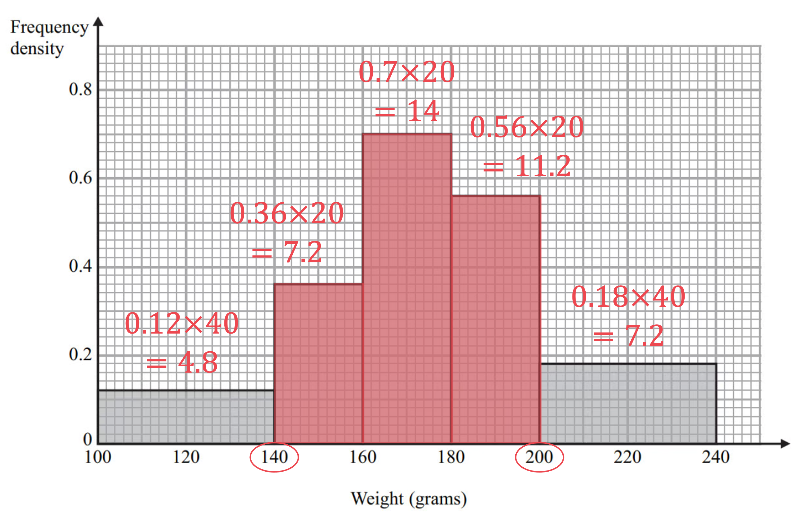

*The proportion required will be a fraction.* 
*The numerator will be the total of the frequencies of the bars between 140 and 200.* 
*The denominator will be the total frequency (of all the bars).*

$\frac{7.2+14+11.2}{4.8+7.2+14+11.2+7.2}=\frac{27}{37}$

**The proportion of apples in the sample with a weight between 140 grams and 200 grams is **$\frac{27}{37}$* ***[1]**

**For this question do not worry about frequencies not being whole numbers.**

## Q39 — very_hard — 6 marks · exam-questions

### 15((a)) — 3 marks
*The width of the the 0.5 - 2 bar is 1.5 and the frequency is 63* *Work out the frequency density (*$\mathrm{frequency} \mathrm{density}=\frac{\mathrm{frequency}}{\mathrm{width}}$*)* * *

*frequency density = *$\frac{63}{1.5}=42$

**[1]*** *

*1 small square in height is 1 unit of frequency density* 
*Write the frequency-density scale on the diagram* * *

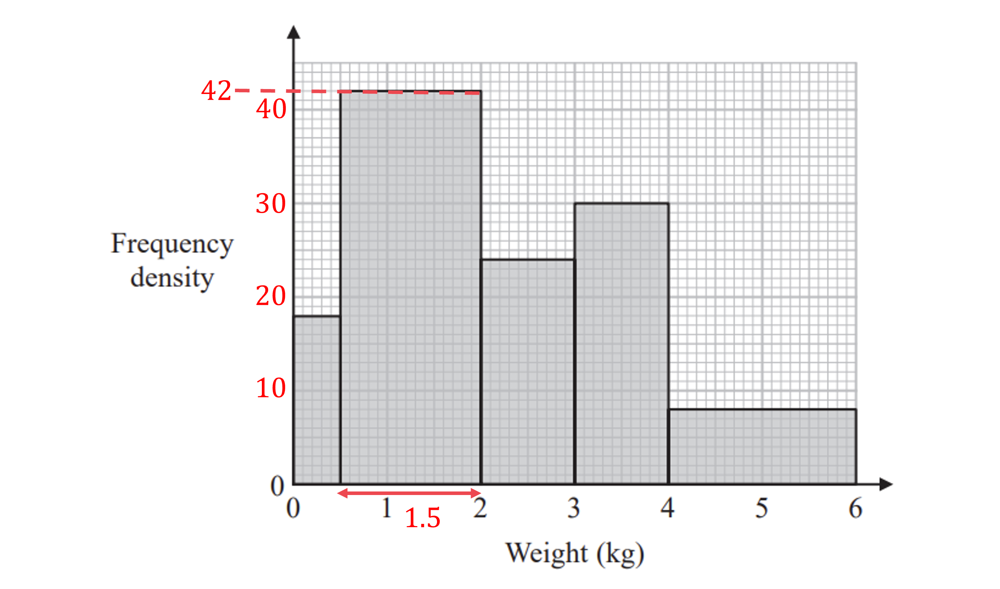

> * *

*Work out the frequencies (areas) of all the bars (by multiplying bar width by frequency density)* * *

*0.5 × 18 + 1.5 × 42 + 1 × 24 + 1 × 30 + 2 × 8*

**at least three bars correct ****[1]**

**142 parcels*** ***[1]**

### 15((b)) — 3 marks
*You need to know the number of parcels that weigh more than 2.25 kg* 
*Work this out by finding frequencies (areas) of the bars, splitting the 2 - 3 kg bar into 2.25 - 3 kg (width 0.75)* * *

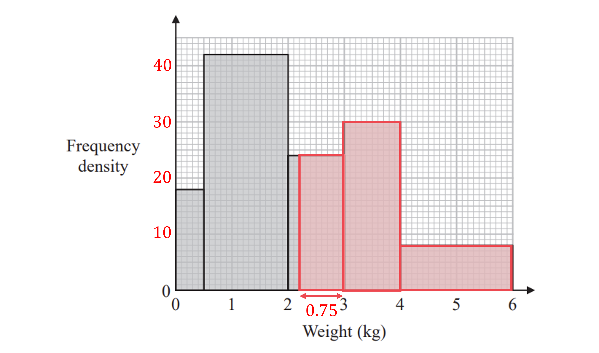

* 0.75 × 24 + 30 + 16 = 64*

**[1]**

*Find the probability the first parcel weight more than 2.25 kg by dividing 64 by the total number of parcels from part (a), 142* * *

*P(1st parcel weighs more than 2.25) = *$\frac{64}{142}$ * *

*After removing this parcel, there are 63 left that weigh over 2.25 out of the remaining 141* 
*Find the probability that the first parcel weighs more than 2.25 and the second parcel weighs more than 2.25 ("and" means ×)*

$\frac{64}{142}\times\frac{63}{141}$

**[1]**

$\frac{672}{3337}$**[1]**

**0.201 (or better) is accepted**

## Q40 — very_hard — 5 marks · exam-questions

### 18() — 5 marks
*The width of the the 0 - 2 bar is 2 and the frequency is 28* 
*Work out the frequency density (*$\mathrm{frequency} \mathrm{density}=\frac{\mathrm{frequency}}{\mathrm{width}}$*)* * *

*frequency density = *$\frac{28}{2}=14$

**[1]*** *

*35 small squares in height are 14 units of frequency density so 5 small squares in height are 2 units of frequency density* 
*Write the frequency-density scale on the diagram* * *

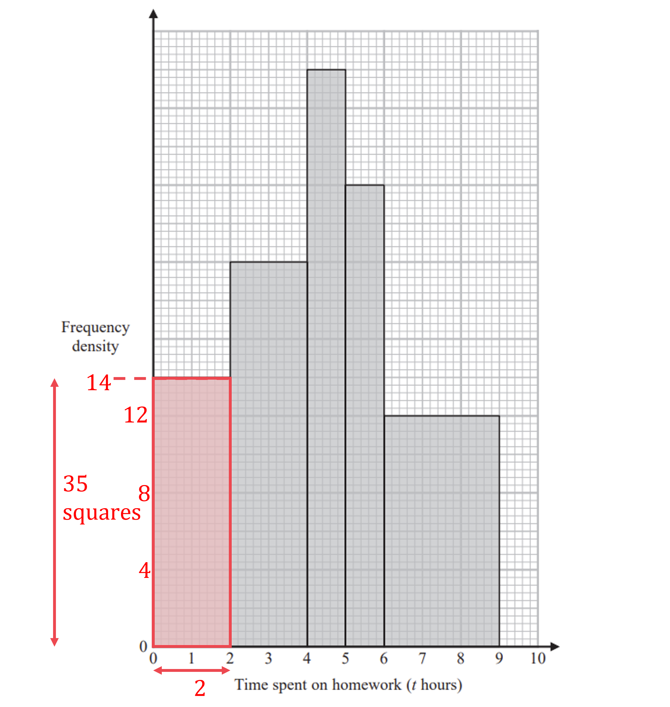

> * *

*Work out the frequencies (areas) of the other bars (by multiplying bar width by frequency density)* * *

*2 × 20,  1 × 30,  1 × 24,  3 × 12*

**at least three bars correct ****[1]**

*Fill in the table with these frequencies***  **

| > *Time spent on homework (**t** hours)* | > *Frequency* |
|---|---|
| > *0 < **t** ≤ 2* | > *28* |
| > *2 < **t** ≤ 4* | *40* |
| > *4 < **t** ≤ 5* | *30* |
| > *5 < **t** ≤ 6* | *24* |
| > *6 < **t** ≤ 9* | *36* |

*Work out an estimate of the mean time (the sum of the "midpoints × frequencies" divided by the sum of the "frequencies")*

$\frac{1\times28+3\times40+4.5\times30+5.5\times24+7.5\times36}{28+40+30+24+36}$

**numerator**** [1]**

**numerator and denominator**** [1]**

$\frac{685}{158}$

**4.32 hours ****[1]**

## Q41 — very_hard — 5 marks · exam-questions

### 18((c)) — 5 marks
*The width of the the 0 - 10 bar is 10 and the frequency is 40* *Work out the frequency density (*$\mathrm{frequency} \mathrm{density}=\frac{\mathrm{frequency}}{\mathrm{width}}$*)* * *

*frequency density = *$\frac{40}{10}=4$

**[1]*** *

*5 small squares in height are 1 unit of frequency density* 
*Write the frequency-density scale on the diagram* * *

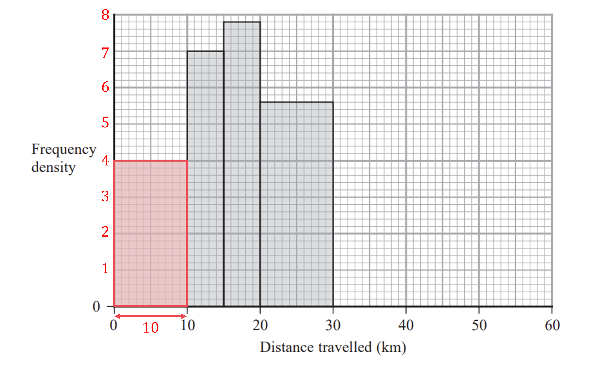

> * *

*Work out the frequencies (areas) of the other bars (by multiplying bar width by frequency density)* * *

*5 × 7 = 35 *
*5 × 7.8 = 39 *
*10 × 5.6 = 56*

**[1]**

*Work out the frequency density of the 30 - 60 bar* * *

*frequency density = *$\frac{30}{30}=1$*  *

*Draw this bar on to the diagram**  *

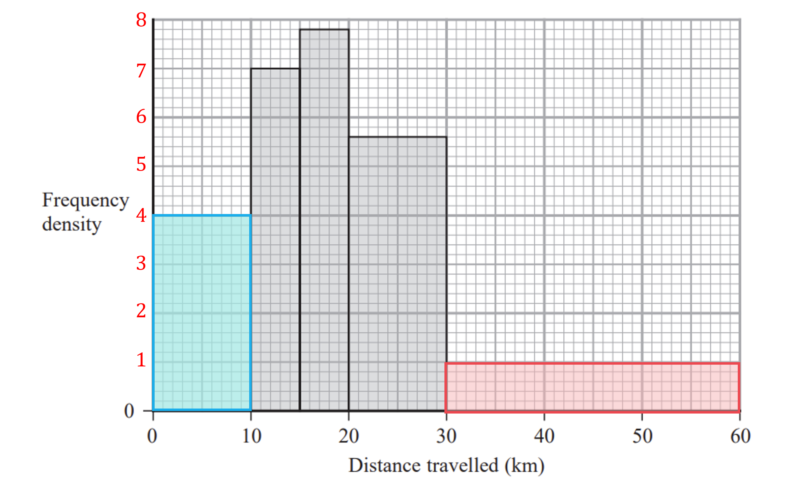

**[1]**

> *You need to know the number of people with distances greater than 25 km Work this out from the frequencies (areas) of the bars, splitting the 20 - 30 bar in half to get 25 - 30  *

*5 × 5.6 + 30 × 1 = 58*

**[1]**

> *Work out the number of people in total by summing the frequencies (areas) of the bars  *

*40 + 35 + 39 + 56 + 30 = 200*

> *Estimate the probability that a randomly chosen person has a distance greater than 25 (by dividing 58 by 200)  *

$\frac{58}{200}$

$\frac{29}{100}$* ***[1]**

**0.29 and 29% are also accepted**

## Q42 — very_hard — 5 marks · exam-questions

### 18((a)) — 3 marks
*Method 1 *
*Find the frequencies (areas) of all the bars (by multiplying their widths by their frequency densities)*

*0.7 × 10 + 3.4 × 5 + 1 × 9 + 2.5 × 6 + 4.8 × 15 *
*= 7 + 17 + 9 + 15 + 72 = 120*

**[1]**

*Find the frequency between 17 and 35 by splitting the 15 - 24 bar (to get a width from 17 to 24) and by splitting the 30 - 45 bar (to get a width from 30 to 35) *

*1 × 7 + 2.5 × 6 + 4.8 × 5 *
*= 7 + 15 + 24 = 46*

**[1]** * *

*Find the proportion of customers spending between 17 and 35 minutes (by dividing 46 by 120)*

$\frac{46}{120}$* ***[1]**

**Any equivalent fraction is accepted, or at least two decimal places needed: 0.38 **

*Method 2* 
*Count the number of small squares in total (in all five bars)* * *

*70 + 170 + 90 + 150 + 720 = 1200 small squares in total*

**[1]**

*Count the number of small squares between 17 and 35 minutes* * *

*240 + 150 + 70 = 460 small squares* * *

*Find the proportion of customers spending between 17 and 35 minutes (by dividing 460 by 1200)*

$\frac{460}{1200}$* ***[1]**

**Any equivalent fraction is accepted, or at least two decimal places needed: 0.38**

### 18((b)) — 2 marks
*The customer has been selected out of those who spent more than 30 minutes (not out of all customers)* 
*Work out the number who spent more than 30 minutes (by finding the area of the 30 - 45 bar)* * *

*15 × 4.8 = 72* * *

*Work out the number who spent more than 36 minutes (by splitting the 30 - 45 bar into 36 - 45)* * *

*9 × 4.8 = 43.2  *

*Find the probability that a customer spends more than 36 minutes, given that they are chosen out of all the customers who spent more than 30 minutes (by dividing 43.2 by 72)* * *

$\frac{43.2}{72}$

**either 72 as denominator or 43.2 as numerator**** [1]**

> *Simplify this fraction (for example, using a calculator)*

$\frac{3}{5}$* ***[1]**

**Or any equivalent value, e.g. 0.6**

## Q43 — very_hard — 3 marks · exam-questions

### 17((b)) — 3 marks
*No scale is given so this question can be done by looking at the relative areas (or, more simply, by counting squares) Count the number of small squares in total (in all six bars)* * *

*20 + 90 + 160 + 150 + 120 + 80 = 620 small squares in total*

**[1]**

*Count the number of small squares for ages greater than 55 ** *

*30 + 80 = 110 small squares*

**[1]**

*Estimate the probability that the person is over 55 (by dividing 110 by 620) *

$\frac{110}{620}$

$\frac{11}{62}$* ***[1]**

**Any equivalent fraction is accepted, or two decimal places, 0.18 (or better, 0.17741...)**

## Q44 — very_hard — 4 marks · exam-questions

### 20() — 4 marks
*Method 1* 
*Count the number of small squares in total (in all five bars)* * *

*there are 60 + 160 + 100 + 240 + 40 = 600 small squares in total*

**at least 2 correct**** [1] **
**all correct**** [1]**

*Find the number of small squares in 82.5 < **h** ≤ 85, by dividing the number in 75 < **h** ≤ 85 by 4* * *

*there are 240 ÷ 4 = 60 small squares in  82.5 < ***h*** ≤ 85* * *

*Find the number of small squares with heights greater than 82.5 cm (by adding the number in 82.5 < **h** ≤ 85 to the number in 85 < **h** ≤ 90)* * *

*there are 60 + 40 = 100 small squares for which ***h*** > 82.5* * *

*Find the probability of a height being greater than 82.5 cm by dividing 100 small squares by 600 small squares*

*100 ÷ 600*

**dividing your value by the total value**** [1]**

$\frac{1}{6}$ **[1]**

**This can also be done using the scale 20 small squares = 1 tomato plant**

*Method 2 *
*The area of the 75 < **h** ≤ 85 bar represents a frequency of 12 tomato plants* *Find the frequency density (the value on the **y**-axis) for the 75 < **h** ≤ 85 bar (by dividing 12 by the width of the bar, 10 cm)* * *

*the frequency density of the 75 < ***h*** ≤ 85 bar is 12 ÷ 10 = 1.2 on the ***y***-axis* * *

*The scale on the **y**-axis is 2 small squares = 0.1 frequency density* *Find the frequencies of all the bars (by multiplying their widths by their frequency densities)*

*5 × 0.6 + 10 × 0.6 + 5 × 1 + 10 × 1.2 + 5 × 0.4 = 3 + 8 + 5 + 12 + 2 = 30 tomato plants*

**at least 2 correct**** [1] **
**all correct**** [1]**

*Find the frequency in 82.5 < **h** ≤ 85, by dividing the frequency of the 75 < **h** ≤ 85 bar (12) by 4* * *

*there are 12 ÷ 4 = 3 tomato plants in  82.5 < ***h*** ≤ 85* * *

*Find the frequency of tomato plants with heights greater than 82.5 cm (by adding the frequency in 82.5 < **h** ≤ 85 to the frequency in 85 < **h** ≤ 90)* * *

*there are 3 + 2 = 5 tomato plants for which ***h*** > 82.5* * *

*Find the probability of a height being greater than 82.5 cm by dividing 5 tomato plants by 30 tomato plants*

*5 ÷ 30*

**dividing your value by the total value**** [1]**

$\frac{1}{6}$** ****[1]**

## Q45 — very_hard — 4 marks · exam-questions

### 25() — 4 marks
*Find the number of "medium" eggs from Farm A (by adding the frequencies in the first two rows)* * *

*there are 8 + 19 = 27 medium eggs at Farm A*

**[1]*** *

*Find the frequency of the 50 - 55 bar on the Farm B histogram (by multiplying width by frequency density)* * *

*5 × 1.0 = 5 eggs* * *

*53 - 55 is 40% of the 50 - 55 bar* *Find the frequency of 53 - 55 by multiplying the whole bar's 5 eggs by 40%* * *

*5 × 0.4 = 2 eggs*

**[1]*** *

*Find the frequency of the 55 - 65 bar on the Farm B histogram (by multiplying width by frequency density)* * *

*10 × 2.0 = 20 eggs* * *

*55 - 63 is 80% of the 55 - 65 bar* *Find the frequency of 55 - 63 by multiplying the whole bar's 20 eggs by 80%* * *

*20 × 0.8 = 16 eggs*

**[1]*** *

> *Find the total number of "medium" eggs at Farm B (by adding 2 and 16)*

*there are 2 + 16 = 18 medium eggs at Farm B* * *

*Calculate how many more medium eggs Farm B has compared to Farm A (by finding their difference)* * *

*27 - 18*

**Farm A has 9 more medium eggs than Farm B*** ***[1]**

## Q46 — very_hard — 6 marks · exam-questions

### 26() — 4 marks
> *You need to find the vertical scale. Let one square represent **x** frequency density.*

> *The frequency is given by the area of the bars so multiply the class width by the frequency density to find the frequency of each class.*

| *Speed (mph)* | *Frequency* |
|---|---|
| *15 ≤ speed < 30* | *15 × 25***x*** = 375***x** |
| *30 ≤ speed < 35* | *5 × 33***x*** = 165***x** |
| *35 ≤ speed < 5* | *15 × 4***x*** = 60***x** |

**Multiplying class width by frequency density**** [1]**

> *The total frequency is 480. Form an equation.*

`table row cell 375 x plus 165 x plus 60 x end cell equals 480 end table`

**[1]**

*Simplify* *and solve the equation to find the value of **x**.*

`table attributes columnalign right center left columnspacing 0px end attributes row cell 600 x end cell equals 480 row x equals cell 480 over 600 end cell row x equals cell 0.8 end cell end table`

**[1]**

> *Substitute **x** = 0.8 back into the expression for the frequency of the first bar.*

$375\times0.8=300$

**The first bar represents ****300 cars** **[1]**

### 26((b)) — 2 marks
> *Identify the part of the histogram you are interested in.*

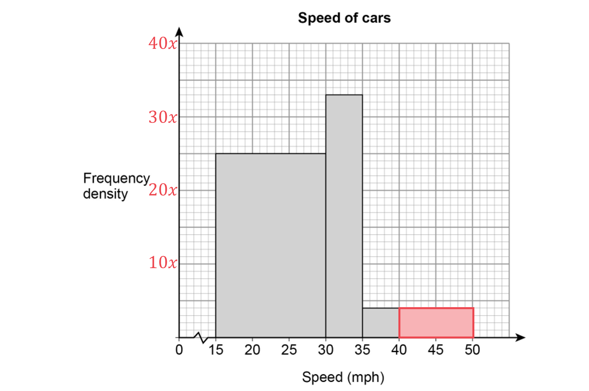

> *Find the area (frequency) by multiplying the class weight (40 to 50) by the frequency density.*

$10\times4x=40x$

**[1]**

> *Substitute the value of **x** into the expression.*

$40\times0.8=32$

**32 cars** **[1]**

## Q47 — very_hard — 4 marks · exam-questions

### 24() — 4 marks
> *The frequency is given by the area of the bars so multiply the class width by the frequency density to find the frequency of each class.*

| *Time (minutes)* | *Frequency* |
|---|---|
| *0 ≤ time < 5* | *5 × 1.6 = 8* |
| *5 ≤ time < 15* | *10 × 0.8 = 8* |
| *15 ≤ time < 25* | *10 × 1.2 = 12* |
| *25 ≤ time < 45* | *20 × 1.0 = 20* |

**At least two correct frequencies**** [1]**

> *Split the total area into 4 equal areas.*

*48 ÷ 4 =12*

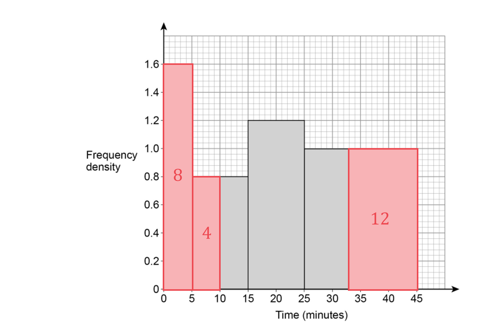

> *The lower quartile is the value of time that gives an area of 12 using rectangles starting from the left. *
*The first bar has an area of 8 so the lower quartile is 4 into the second bar. *
*The second bar has an area of 8 and 4 is half of that so the lower quartile is in the middle of that class.*

*Lower quartile = 10*

**[1]**

> *The upper quartile is the value of time that gives an area of 12 using rectangles starting from the right. *
*The last bar has an area of 20 so you need to use a rectangle of area 12 from the end and find the length.*
* The height is 1 so an area of 12 needs a length of 12. Therefore the upper quartile is 12 less than 45.*

*Upper quartile = 33*

**[1]**

> $\mathrm{Interquartile} \mathrm{range}=\mathrm{Upper} \mathrm{quartile}-\mathrm{Lower} \mathrm{quartile}.$* Substitute the quartiles into the formula.*

*IQR = 33 - 10*

**Interquartile range = 23 ****[1]**

## Q48 — very_hard — 8 marks · exam-questions

### 16((a)) — 1 marks
> *The inequality signs in the class group options for mass have 'equal to' on both sides, meaning there is more than one option for 5 kg, 10 kg etc.*

**There are overlapping intervals, for example 5 kg could go in two groups.**** [1]**

### 16((b)) — 2 marks
> *The frequency of a bar in a histogram is equal to its area. Find the area of the bars for 45 - 50 mins and for 50 - 70 mins.*

> *Area of the 45 - 50 minute bar, frequency density = 6.*

*45 -50 min = 5 × 6 = 30*

> *Area of the 50 - 70 minute bar, frequency density = 2.*

*50 -70 min = 20 × 2 = 40*

**Total frequency = (5 × 6) + (2 × 20)**** **
**Method for either area ****[1] **
**Adding both areas ****[1]**

### 16() — 5 marks
> *To calculate the estimate of the mean the number of students (frequency) for each group needs to be found from the histogram, by finding the area of each of the bars.*

> *Area of the 30 - 40 minute bar, frequency density = 1.*

*30 -40 min = 10 × 1 = 10*

> *Area of the 40 - 45 minute bar, frequency density = 4.*

*40 -45 min = 5 × 4 = 20*

> *The frequencies of each group are now known (the last two group frequencies were found in part (b)). Put these in a table and find the midpoint of each class group.*

> *To find the midpoints, add the upper and lower class boundaries, then divide by 2.*
* This is the same as finding the mean of the class boundaries.*

| *Time* | *30 -40* | *40 -45* | *45 -50* | *50 -70* |
|---|---|---|---|---|
| *Frequency (***f***)* | *10* | *20* | *30* | *40* |
| *Midpoint (***x***)* | *35* | *42.5* | *47.5* | *60* |

**Frequencies found**** [1] **
**Midpoints found**** [1]**

> *To estimate the mean, we now need to find the product of the frequencies (**f**) and the midpoints (**x**) for each group.*

> *Add these to the table. *

| *Time* | *30 -40* | *40 -45* | *45 -50* | *50 -70* |
|---|---|---|---|---|
| *Frequency (***f***)* | *10* | *20* | *30* | *40* |
| *Midpoint (***x***)* | *35* | *42.5* | *47.5* | *60* |
| **fx** | *350* | *850* | *1425* | *2400* |

**Finding fx**** [1]**

> *An estimate for the mean (*$\overline{x}$*) is given by the formula *$\overline{x}=\frac{Σfx}{Σf}$*, where *$Σfx$* is the total of the last row (**fx**) and *$Σf$* is the total of the second row (**f**).*

`table row cell x with bar on top space end cell equals cell space fraction numerator 350 space plus space 850 space plus space 1425 space plus space 2400 over denominator 10 space plus space 20 space plus space 30 plus space 40 end fraction end cell end table`

**[1]**

`table row cell x with bar on top space end cell equals cell space 5025 over 100 end cell end table`

**An estimate for the mean time taken is 50.25 minutes ****[1]**

## Q49 — very_hard — 5 marks · exam-questions

### 13((b)) — 5 marks
> *Find where the median would lie. Divide the total frequency by 2. As the data is grouped you do not need to add 1 first. If you do add one first you will not lose marks.*

*153 ÷ 2 = 76.5*

**[1]**

> *The frequency is given by the area of the bars so multiply the class width by the frequency density to find the frequency of a class. Keep track of the cumulative frequency as you want to find where the "76.5" value would lie.*

| *Height (cm)* | *Frequency* | *Cumulative frequency* |
|---|---|---|
| *140 ≤ height < 160* | *20 × 1.4 = 28* | *28* |
| *160 ≤ height < 170* | *10 × 7.4 = 74* | *102* |

**1 mark for each frequency**** [2]**

> *You can now identify where the median lies.*

*160 cm ≤ median height < 170 cm*

**[1]**

**The ****rowing club**** has the**** greater median height**** as it is ****172 cm**** and the median height for the ****swimming club**** is ****between 160 cm and 170 cm**** [1]**

## Q50 — very_hard — 8 marks · exam-questions

### 10((a)) — 4 marks
> *Add two extra columns in the table - one for class width and one for frequency density (**fd**). *
*Class width is found by subtracting the lower class boundary from the higher class boundary.*

> $\mathrm{Frequency} \mathrm{density}=\frac{\mathrm{Frequency}}{\mathrm{Class} \mathrm{width}}$*.*

| **Amount spent **`stretchy left parenthesis £ bold italic a stretchy right parenthesis` | **Frequency** | ***Class width*** | ***Frequency*** ***density (*******fd*******)*** |
|---|---|---|---|
| `0 less than a less-than or slanted equal to 5` | 35 | *5 - 0 = 5* | *35 ÷ 5 = 7* |
| `5 less than a less-than or slanted equal to 10` | 42 | *5* | *42 ÷ 5 = 8.4* |
| `10 less than a less-than or slanted equal to 15` | 20 | *5* | *20 ÷ 5 = 4* |
| `15 less than a less-than or slanted equal to 20` | 18 | *5* | *18 ÷ 5 = 3.6* |
| `20 less than a less-than or slanted equal to 30` | 14 | *10* | *14 ÷ 10 = 1.4* |
| `30 less than a less-than or slanted equal to 50` | 11 | *20* | *11 ÷ 20 = 0.55* |

**At least three correct values for frequency density**** [1]**

> *Create a vertical scale with 1 square representing 0.2 frequency density. Label the vertical axis "Frequency density". Draw rectangular bars using the age and frequency density columns. There should be no gaps between the bars.*

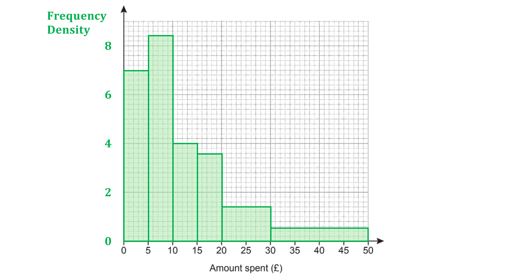

**Bars all the correct height**** [1] **
**Bars all the correct width**** [1] **
**Vertical axis labelled with correct scale**** [1]**

### 10((b)) — 4 marks
> *Find 25% of 140.*

$\frac{25}{100}\times140=35$

**[1]**

> *Find which class contains the amount that 25% spend more than.*

*11 + 14 = 25 customers spend more than £20* 
*11 + 14 + 18 = 43 customers spend more than £15* 
*Therefore the value is in between £15 and £20*

**[1]**

> *10 out of 18 people that spend £15 to £20 are in the top 25%. Use the histogram to find the width of a rectangle in the 15 - 20 bar that has an area of 10.*

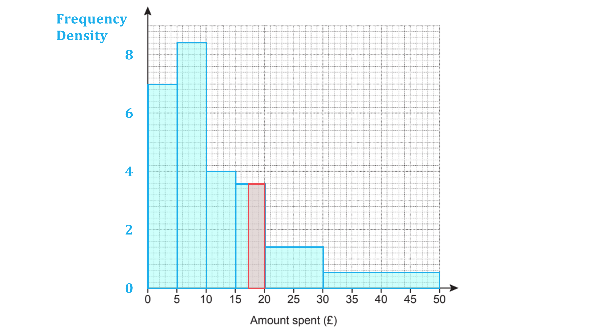

$\mathrm{Width}=\frac{10}{3.6}=2.77777...$

> *Subtract this from £20.*

$20-2.7777...=17.2222...$

**[1]**

> *Round to the nearest penny. State your reasoning.*

**Ana could use ****£17.22**** as ****roughly 25%**** of customers ****spent more ****than this**** ** **[1]** 
**Answers in the range £17 to £18 are accepted**
