# Exam Questions — Histograms
**Statistics & Probability** · Edexcel IGCSE Maths A (4MA1) — 18/Higher
> Source: [https://www.savemyexams.com/igcse/maths/edexcel/a/18/higher/topic-questions/6-statistics-and-probability/histograms/exam-questions/](https://www.savemyexams.com/igcse/maths/edexcel/a/18/higher/topic-questions/6-statistics-and-probability/histograms/exam-questions/) · 50 questions · total 211 marks

## Q1 — medium — 3 marks · exam-questions

### 24() — 3 marks — command: draw — structured — from paper November 2012 · 1MA0/2H
The table gives information about the heights, $h$ metres, of trees in a wood.

| **Height(**$h$** metres)** | **Frequency** |
|---|---|
| `0 less than h less-than or slanted equal to 2` | $7$ |
| `2 less than h less-than or slanted equal to 4` | $14$ |
| `4 less than h less-than or slanted equal to 8` | $18$ |
| `8 less than h less-than or slanted equal to 16` | $24$ |
| `16 less than h less-than or slanted equal to 20` | $10$ |

Draw a histogram to show this information.

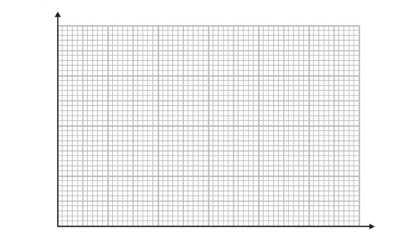

## Q2 — medium — 3 marks · exam-questions

### 24() — 3 marks — command: draw — structured — from paper June 2013 · 1MA0/1H
Bill works for a computer service centre.

The table shows some information about the length of time, $t$ minutes, of the phone calls Bill had.

| **Time( **$t$** minutes)** | `0 less than t less-than or slanted equal to 10` | `10 less than t less-than or slanted equal to 15` | `15 less than t less-than or slanted equal to 20` | `20 less than t less-than or slanted equal to 30` | `30 less than t less-than or slanted equal to 45` |
|---|---|---|---|---|---|
| **Number of calls** | $12$ | $15$ | $13$ | $18$ | $3$ |

On the grid, draw a histogram to show this information.

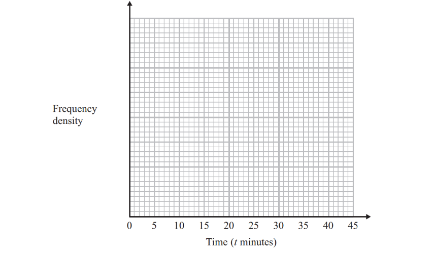

## Q3 — medium — 3 marks · exam-questions

### 23() — 3 marks — command: draw — structured — from paper June 2016 · 1MA0/2H
The table gives information about the lengths of time some people were in a supermarket.

| **Time( **$t$** minutes)** | **Frequency** |
|---|---|
| `0 less than t less-than or slanted equal to 5` | $8$ |
| `5 less than t less-than or slanted equal to 15` | $32$ |
| `15 less than t less-than or slanted equal to 30` | $36$ |
| `30 less than t less-than or slanted equal to 40` | $18$ |
| `40 less than t less-than or slanted equal to 60` | $6$ |

Draw a histogram for the information in the table.

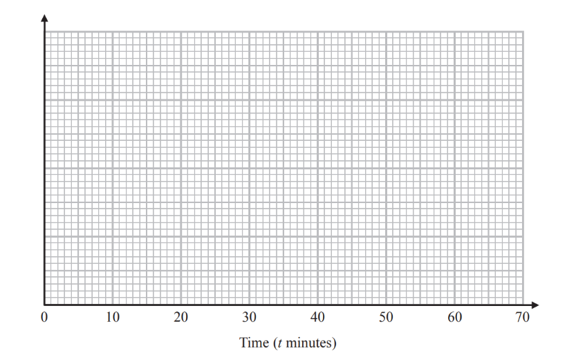

## Q4 — medium — 2 marks · exam-questions

### 22() — 2 marks — command: write — structured — from paper Sample 2015 · 1MA1/1H
Bhavna recorded the lengths of time, in hours, that some adults watched TV last week.

The table shows information about her results.

| **Length of time(**$t$** hours)** | **Frequency** |
|---|---|
| `0 less-than or slanted equal to t less than 10` | $6$ |
| `10 less-than or slanted equal to t less than 15` | $8$ |
| `15 less-than or slanted equal to t less than 20` | $15$ |
| `20 less-than or slanted equal to t less than 40` | $5$ |

Bhavna made some mistakes when she drew a histogram for this information.

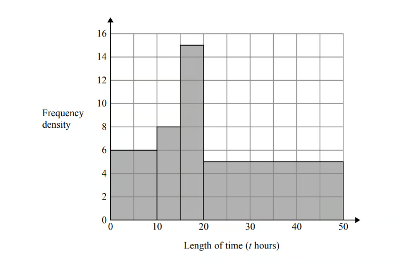

Write down **two** mistakes Bhavna made.

## Q5 — medium — 7 marks · exam-questions

### 18((a)) — 4 marks — command: work_out — structured — from paper 2014	November · 1MA0/2H
The table gives some information about the lengths of time, in hours, that some adults watched TV last week.

| **Length of time(**$t$** hours)** | **Frequency** |
|---|---|
| `0 less-than or slanted equal to t less than 10` | $8$ |
| `10 less-than or slanted equal to t less than 15` | $15$ |
| `15 less-than or slanted equal to t less than 20` | $11$ |
| `20 less-than or slanted equal to t less than 30` | $10$ |
| `30 less-than or slanted equal to t less than 50` | $6$ |

Work out an estimate for the mean length of time.

### 18((b)) — 3 marks — command: draw — structured — from paper 2014	November · 1MA0/2H
Draw a histogram for the information in the table.

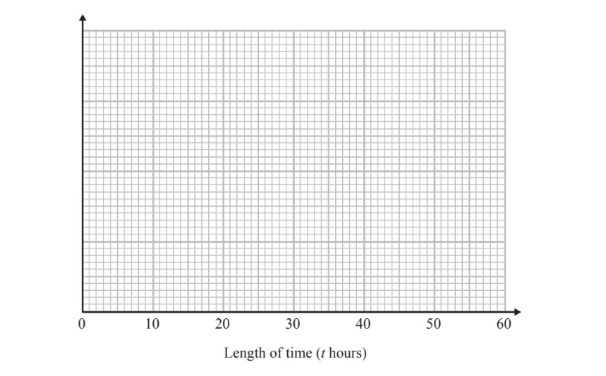

## Q6 — medium — 5 marks · exam-questions

### 14((a)) — 3 marks — command: draw — structured — from paper Nov 2021 · 4MA1/2H
Manuel collected information about the flights that arrived late at an airport last month.

The table gives information about the number of minutes that these flights were late.

| **Minutes late (**$L$** minutes)** | **Frequency** |
|---|---|
| `0 space less than space L space less-than or slanted equal to space 10` | 8 |
| `10 space less than space L space less-than or slanted equal to space 15` | 13 |
| `15 space less than space L space less-than or slanted equal to space 25` | 19 |
| `25 space less than space L space less-than or slanted equal to space 40` | 24 |
| `40 space less than space L space less-than or slanted equal to space 60` | 6 |

On the grid, draw a histogram for this information.

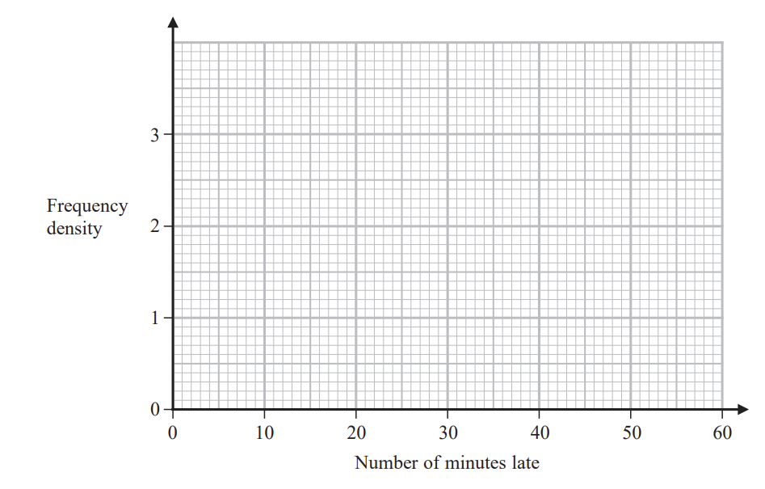

### 14((b)) — 2 marks — command: work_out — structured — from paper Nov 2021 · 4MA1/2H
Manuel selected at random a flight that was late by 25 minutes or less from his results.

Work out an estimate for the probability that this flight was late by 5 minutes or less.

## Q7 — medium — 5 marks · exam-questions

### 21((a)) — 3 marks — command: draw — structured — from paper Nov 2020 · 4MA1/1H
The table gives information about the heights, in centimetres, of some plants.

| **Height (**$h$** cm)** | **Frequency** |
|---|---|
| `10 space less than space h space less-than or slanted equal to space 20` | 35 |
| `20 space less than space h space less-than or slanted equal to space 35` | 45 |
| `35 space less than space h space less-than or slanted equal to space 50` | 75 |
| `50 space less than space h space less-than or slanted equal to space 70` | 40 |
| `70 space less than space h space less-than or slanted equal to space 80` | 8 |

On the grid, draw a histogram for this information.

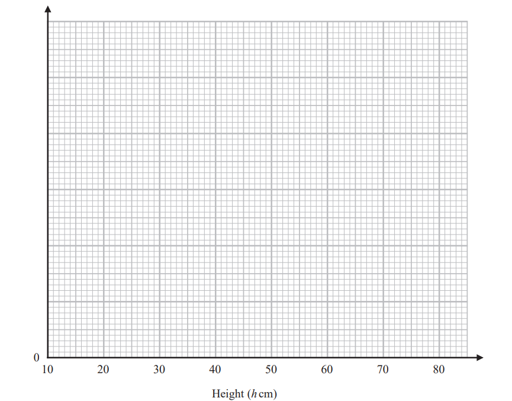

### 21((b)) — 2 marks — command: work_out — structured — from paper Nov 2020 · 4MA1/1H
Work out an estimate for the number of these plants with a height greater than $40\mathrm{cm}.$

## Q8 — medium — 3 marks · exam-questions

### 19() — 3 marks — command: draw — structured — from paper June 2019 · 4MA1/1H
The table gives information about the heights of some trees.

| **Height (**$h$** metres)** | **Frequency** |
|---|---|
| `0 space less than space h space less-than or slanted equal to space 20` | 15 |
| `20 space less than space h space less-than or slanted equal to space 35` | 48 |
| `35 space less than space h space less-than or slanted equal to space 40` | 21 |
| `40 space less than space h space less-than or slanted equal to space 50` | 16 |

On the grid, draw a histogram for this information.

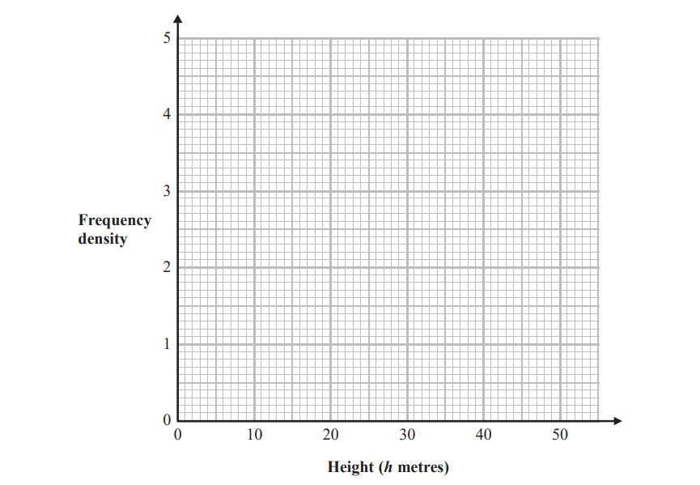

## Q9 — medium — 4 marks · exam-questions

### 21() — 4 marks — command: draw — structured — from paper Nov 2021 · 8300/3H
Here is some information about the ages of babies at a clinic.

| **Age, **$x$**(weeks)** | **Frequency** |   |   |
|---|---|---|---|
| `0 space less-than or slanted equal to space x space less than space 5` | 18 |   |   |
| `5 space less-than or slanted equal to space x space less than space 10 space` | 23 |   |   |
| `10 space less-than or slanted equal to space x space less than space 20` | 17 |   |   |
| `20 space less-than or slanted equal to space x space less than space 50` | 21 |   |   |

Draw a histogram to represent the information.

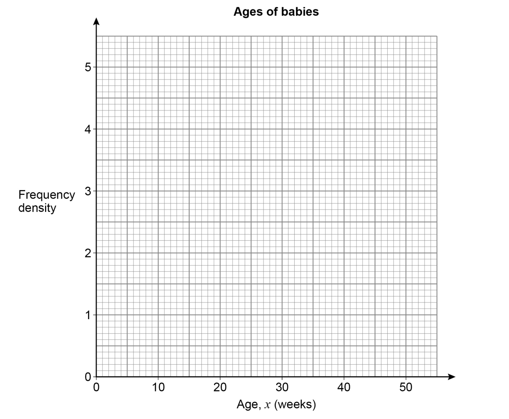

## Q10 — medium — 4 marks · exam-questions

### 13((b)) — 4 marks — command: draw — structured — from paper Nov 2019 · 8300/1H
200 people recorded the time they spent on social media one day.

The table shows the results.

| **Time, *****t***** (mins)** | **Frequency** | **Class width** |   |
|---|---|---|---|
| `0 space less-than or slanted equal to space t space less than space 30` | 24 |   |   |
| `30 space less-than or slanted equal to space t space less than space 50` | 76 |   |   |
| `50 space less-than or slanted equal to space t space less than space 60` | 52 |   |   |
| `60 space less-than or slanted equal to space t space less than space 90` | 48 |   |   |

Draw a histogram to represent the results.

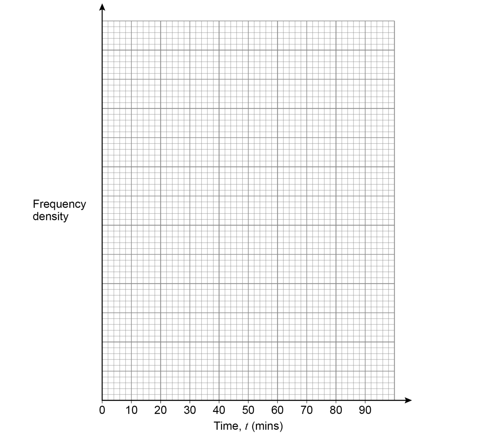

## Q11 — medium — 3 marks · exam-questions

### 18() — 3 marks — command: draw — structured — from paper Nov 2018 · 8300/3H
Here is some information about the ages of people at a concert.

| **Age, **$x$** (years)** | **Frequency** |
|---|---|
| `10 space less-than or slanted equal to space x space less than space 15` | 8 |
| `15 space less-than or slanted equal to space x space less than space 25` | 24 |
| `25 space less-than or slanted equal to space x space less than space 40` | 30 |
| `40 space less-than or slanted equal to space x space less than space 70` | 39 |

Draw a histogram to represent the information.

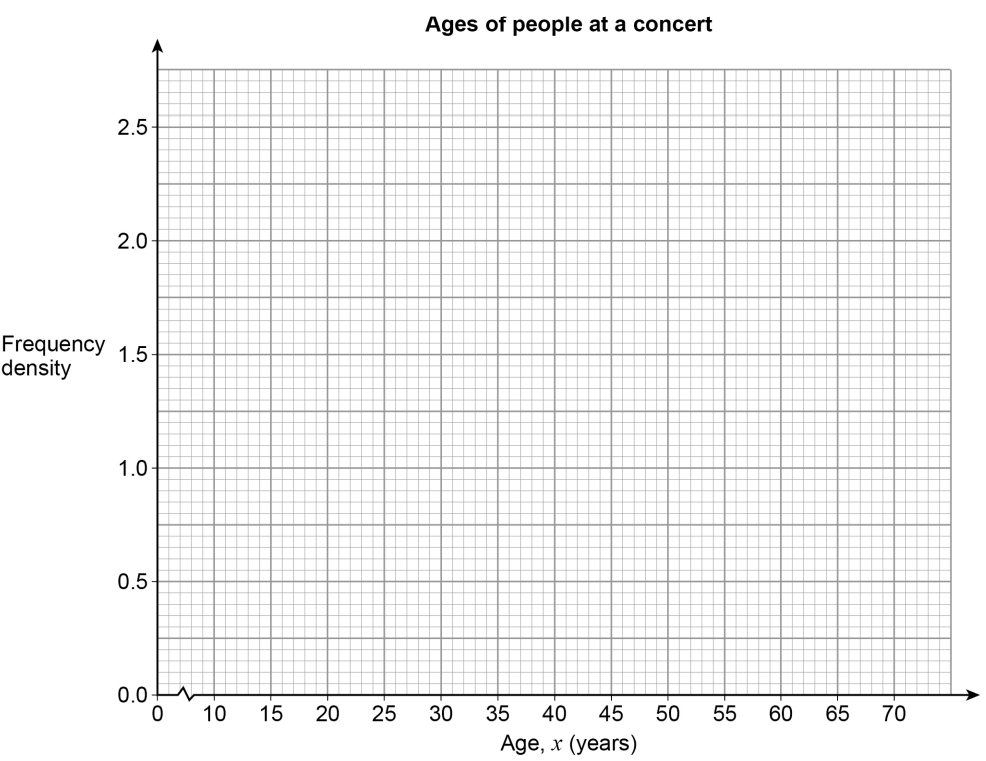

## Q12 — medium — 4 marks · exam-questions

### 19((a)) — 4 marks — command: draw — structured — from paper June 2018 · J560/05
Ceri records the time taken, $t$ minutes, to travel to school for a sample of 168 students at her Academy.

| **Time taken** **(**$t$** minutes)** | **Frequency** |
|---|---|
| `0 space less than space t space less-than or slanted equal to space 10` | 54 |
| `10 space less than space t space less-than or slanted equal to space 20` | 50 |
| `20 space less than space t space less-than or slanted equal to space 40` | 44 |
| `40 space less than space t space less-than or slanted equal to space 80` | 20 |

Draw a histogram to represent this information.

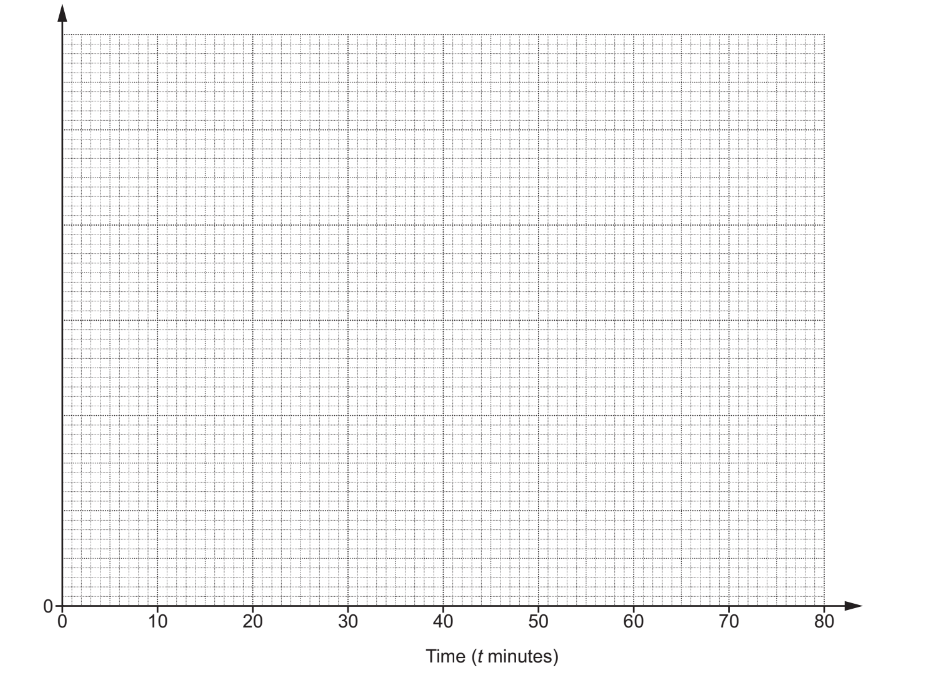

## Q13 — hard — 4 marks · exam-questions

### 26((a)) — 2 marks — command: use — structured — from paper June 2015 · 1MA0/2H
The histogram shows some information about the salaries of a sample of people.

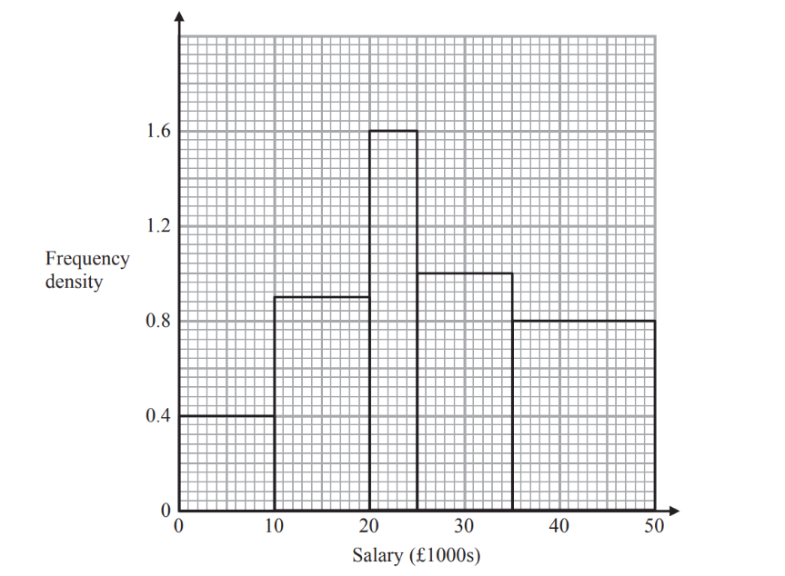

Use the histogram to complete the frequency table.

| **Salary (**$p$**) in £1000s** | **Frequency** |
|---|---|
| `0 less than p less-than or slanted equal to 10` | $4$ |
| `10 less than p less-than or slanted equal to 20` |   |
| `20 less than p less-than or slanted equal to 25` |   |
| `25 less than p less-than or slanted equal to 35` |   |
| `35 less than p less-than or slanted equal to 50` |   |

### 26((b)) — 2 marks — command: work_out — structured — from paper June 2015 · 1MA0/2H
Work out the proportion of people in the sample who have a salary greater than `£ 40 space 000`.

## Q14 — hard — 3 marks · exam-questions

### 23() — 3 marks — command: use — structured — from paper November 2016 · 1MA0/1H
The incomplete histogram and table give some information about the distances some people travel to work.

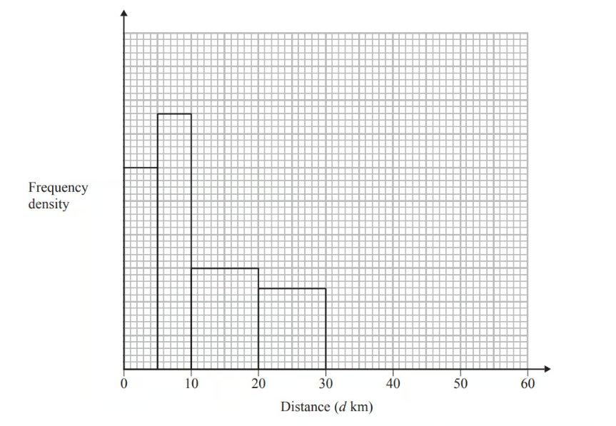

i) Use the information in the histogram to complete the frequency table.

| **Distance ( **$d$** km)** | **Frequency** |
|---|---|
| `0 space less than d less-than or slanted equal to 5` | $30$ |
| `5 less than d less-than or slanted equal to 10` |   |
| `10 less than d less-than or slanted equal to 20` |   |
| `20 less than d less-than or slanted equal to 30` | $24$ |
| `30 less than d less-than or slanted equal to 50` | $16$ |

[2]

ii) Use the information in the table to complete the histogram.

[1]

## Q15 — hard — 3 marks · exam-questions

### 16() — 3 marks — command: work_out — structured — from paper Spec1 2015 · 1MA1/2H
The histogram gives information about house prices in a village in 2015.

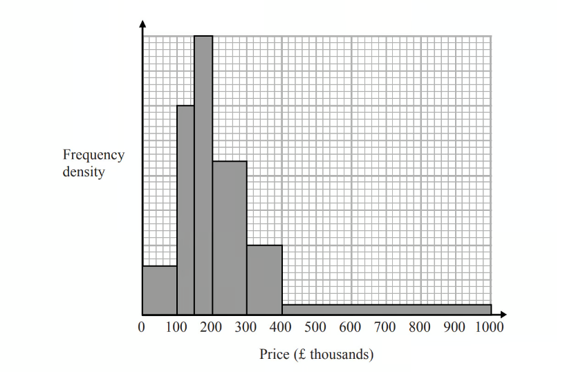

20 houses in the village have a price between £300000 and £400000. 
Work out the number of houses in the village with a price under £200000.

## Q16 — hard — 3 marks · exam-questions

### 14((a)) — 3 marks — command: draw — structured — from paper Spec2 2015 · 1MA1/3H
The table gives information about the speeds, in km/h, of $81$cars.

| **Speed (**$s$** km/h)** | **Frequency** |
|---|---|
| `90 less than s less-than or slanted equal to 100` | $13$ |
| `100 less than s less-than or slanted equal to 105` | $16$ |
| `105 less than s less-than or slanted equal to 110` | $18$ |
| `110 less than s less-than or slanted equal to 120` | $22$ |
| `120 less than s less-than or slanted equal to 140` | $12$ |

On the grid, draw a histogram for the information in the table.

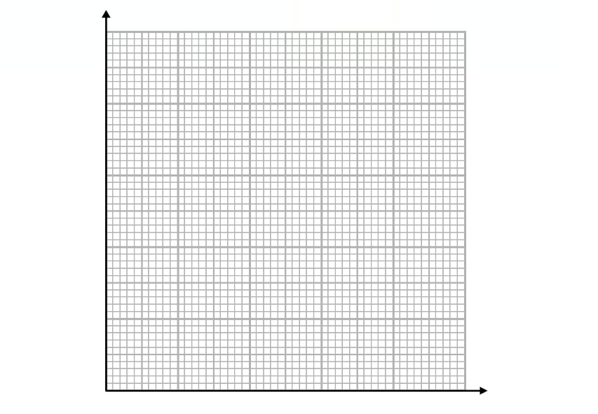

## Q17 — hard — 5 marks · exam-questions

### 22((a)) — 3 marks — command: draw — structured — from paper June 2012 · 1MA0/1H
The table gives some information about the speeds, in km/h, of $100$cars.

| **Speed( **$s$** km/h)** | **Frequency** |
|---|---|
| `60 space less than s less-than or slanted equal to 65` | $15$ |
| `65 less than s less-than or slanted equal to 70` | $25$ |
| `70 less than s less-than or slanted equal to 80` | $36$ |
| `80 less than s less-than or slanted equal to 100` | $24$ |

On the grid, draw a histogram for the information in the table.

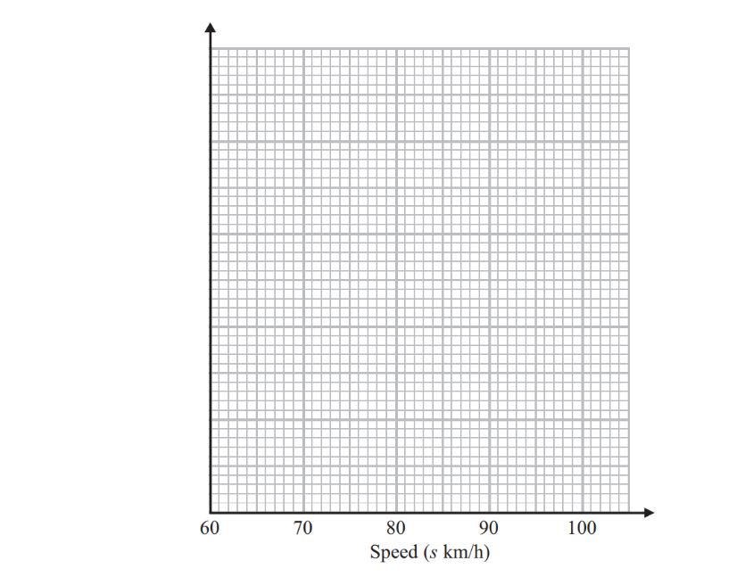

### 22((b)) — 2 marks — command: work_out — structured — from paper June 2012 · 1MA0/1H
Work out an estimate for the number of cars with a speed of more than $85$ km/h.

## Q18 — hard — 3 marks · exam-questions

### 13() — 3 marks — command: work_out — structured — from paper June 2017 · 1MA1/2H
The histogram shows some information about the ages of the 134 members of a sports club.

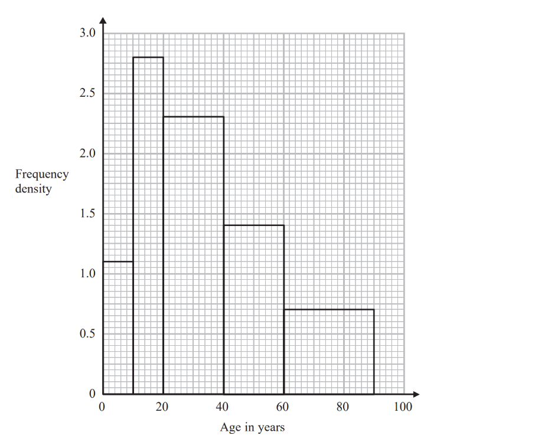

20% of the members of the sports club who are over 50 years of age are female.

Work out an estimate for the number of female members who are over 50 years of age.

## Q19 — hard — 4 marks · exam-questions

### 17((a)) — 2 marks — command: complete — structured — from paper June 2018 · 1MA1/2H
The histogram shows information about the times taken by some students to finish a puzzle.

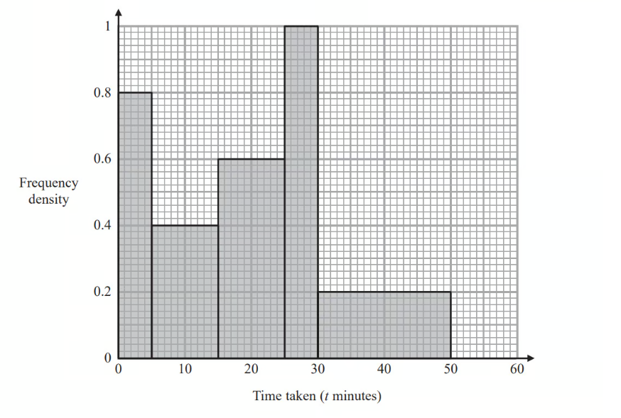

Complete the frequency table for this information.

| **Time taken (**$t$** minutes)** | **Frequency** |
|---|---|
| `0 less than t less-than or slanted equal to 5` | $4$ |
| `5 less than t less-than or slanted equal to 15` |   |
| `15 less than t less-than or slanted equal to 25` |   |
| `25 less than t less-than or slanted equal to 30` |   |
| `30 less than t less-than or slanted equal to 50` |   |

### 17((b)) — 2 marks — command: find — structured — from paper June 2018 · 1MA1/2H
Find an estimate for the lower quartile of the times taken to finish the puzzle.

## Q20 — hard — 3 marks · exam-questions

### 27() — 3 marks — command: work_out — structured — from paper November 2013 · 1MA0/2H
The histogram shows information about the times, in minutes, that some passengers had to wait at an airport.

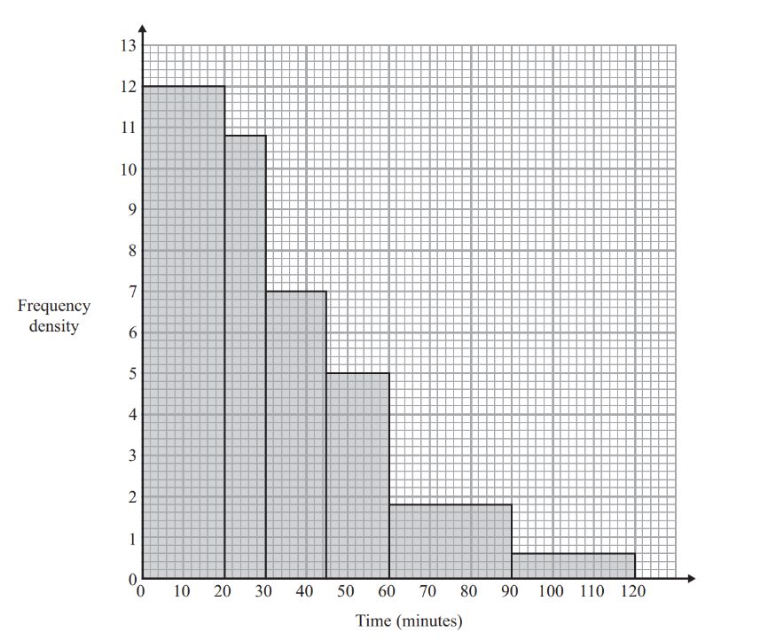

Work out the percentage of the passengers who had to wait for more than one hour.

## Q21 — hard — 3 marks · exam-questions

### 25() — 3 marks — command: work_out — structured — from paper Nov 2020 · 4MA1/2HR
The histogram gives information about the times, in minutes, some customers had to wait to be served in a restaurant.

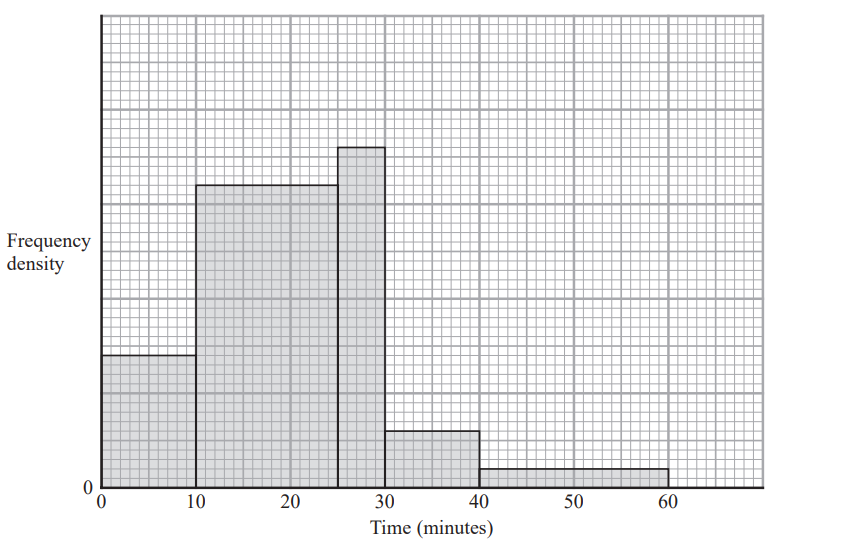

$14$ customers had to wait less than $10$ minutes to be served.

Work out the number of customers who had to wait less than $60$ minutes to be served.

## Q22 — hard — 4 marks · exam-questions

### 1() — 4 marks — command: work_out — structured
6550 people took part in a survey. The histogram shows information about the ages of these people.

Work out how many of the 6550 people are aged between 40 years and 50 years.

## Q23 — hard — 3 marks · exam-questions

### 22() — 3 marks — command: work_out — structured — from paper Jan 2019 · 4MA1/2H
The histogram shows information about the numbers of minutes some people waited to be served at a Post Office.

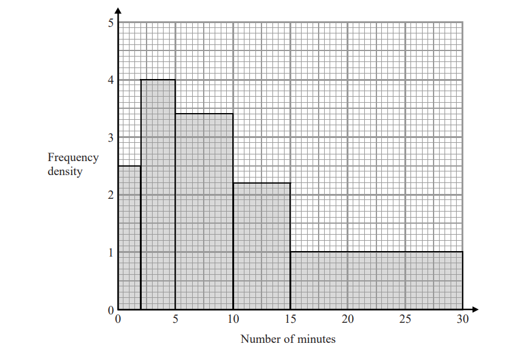

Work out an estimate for the proportion of these people who waited longer than $20$ minutes to be served.

## Q24 — hard — 3 marks · exam-questions

### 21() — 3 marks — command: work_out — structured — from paper Jan 2022 · 4MA1/1HR
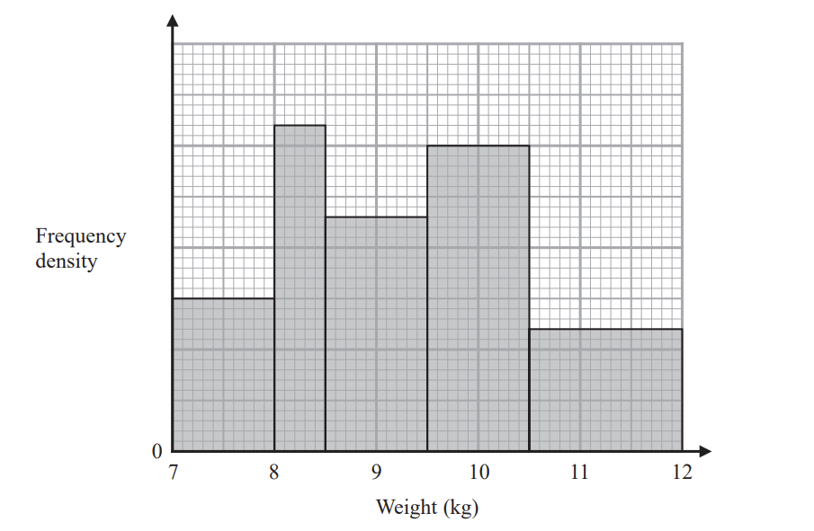

The histogram gives information about the weights, in kg, of all the watermelons in a field.

There are 16 watermelons with a weight between 8 kg and 8.5 kg

Work out the total number of watermelons in the field.

## Q25 — hard — 4 marks · exam-questions

### 25() — 4 marks — command: complete — structured — from paper Nov 2020 · 8300/1H
A histogram is drawn to represent the heights of a sample of women.

Three of the four bars are shown.

The bar for       170 cm ⩽ height < 180 cm      is missing.

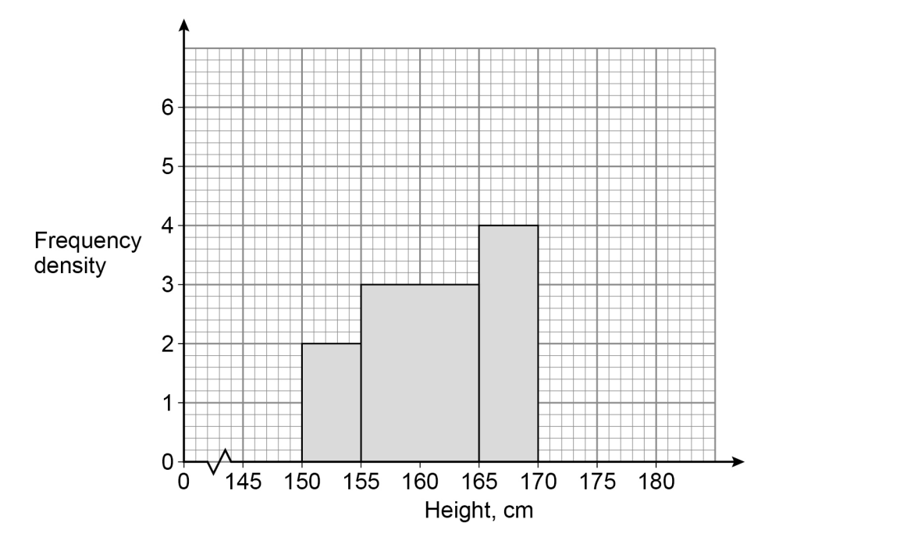

There are 74 women in the sample.

Complete the histogram.

## Q26 — hard — 5 marks · exam-questions

### 23((a)) — 3 marks — command: complete — structured — from paper Nov 2017 · 8300/2H
Here is some information about a tennis club.

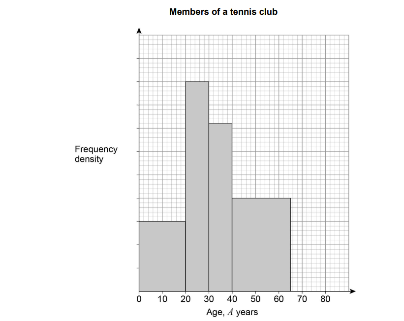

There are 30 members with $A<20$ 
There are 12 members with `65 space less-than or slanted equal to space A space less than space 80` 
There are no members with `A space greater-than or slanted equal to space 80`

Complete the histogram.

### 23((b)) — 2 marks — command: work_out — structured — from paper Nov 2017 · 8300/2H
Work out the total number of members of the club.

## Q27 — hard — 4 marks · exam-questions

### 22() — 4 marks — command: work_out — structured — from paper Specimen 2015 · 8300/2H
The histogram shows the ages, in years, of members of a chess club.

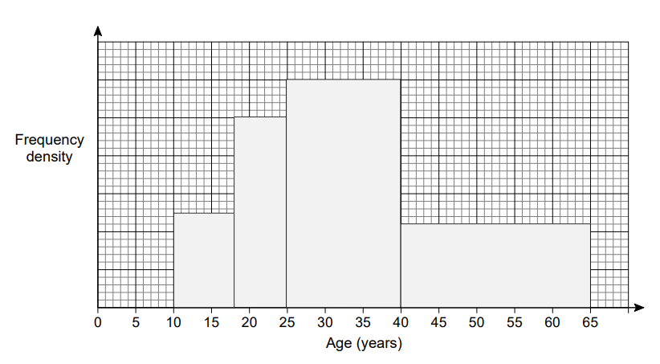

There are 22 members with ages in the range 40 ⩽ age < 65

Work out the number of members with ages in the range 25 ⩽ age < 40

## Q28 — hard — 7 marks · exam-questions

### 15() — 4 marks — command: explain — structured — from paper Nov 2019 · J560/06
The histogram shows information about the masses of some of the parcels handled by a delivery company in one month.

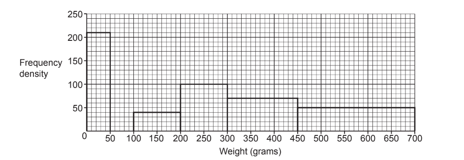

Zoe says

There are fewer parcels weighing between 450g and 700g than parcels weighing between 300g and 450g.

Is Zoe correct? 
Show how you decide.

### 15((b)) — 2 marks — command: complete — structured — from paper Nov 2019 · J560/06
The delivery company delivered 6500 parcels weighing between 50g and 100g.

Complete the histogram to show this information.

### 15((c)) — 1 mark — command: explain — structured — from paper Nov 2019 · J560/06
Zoe uses the histogram to calculate the number of parcels weighing between 200g and 250g.

Explain why Zoe’s answer is unlikely to be reliable.

## Q29 — hard — 5 marks · exam-questions

### 12() — 5 marks — command: complete — structured — from paper Nov 2018 · J560/04
30 students completed a puzzle and their times were recorded. 
All of the students completed the puzzle in less than 50 seconds. 
The histogram shows information about some of their times.

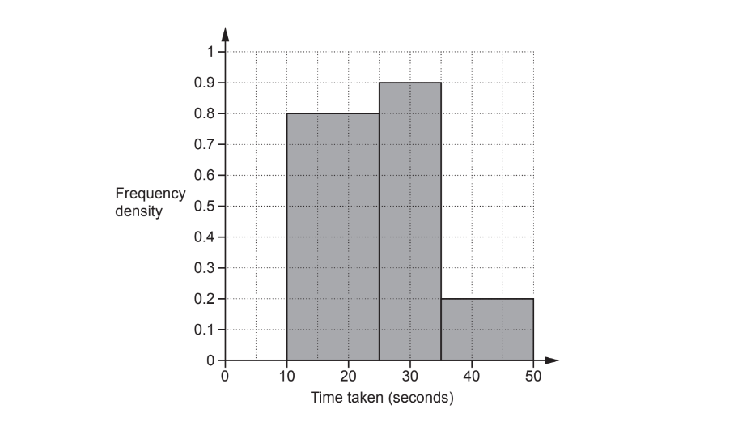

Complete the histogram for those completing the puzzle in less than 10 seconds.

## Q30 — hard — 5 marks · exam-questions

### 10() — 5 marks — command: estimate — structured — from paper Nov 2017 · J560/04
The histogram summarises a health score for a group of people.

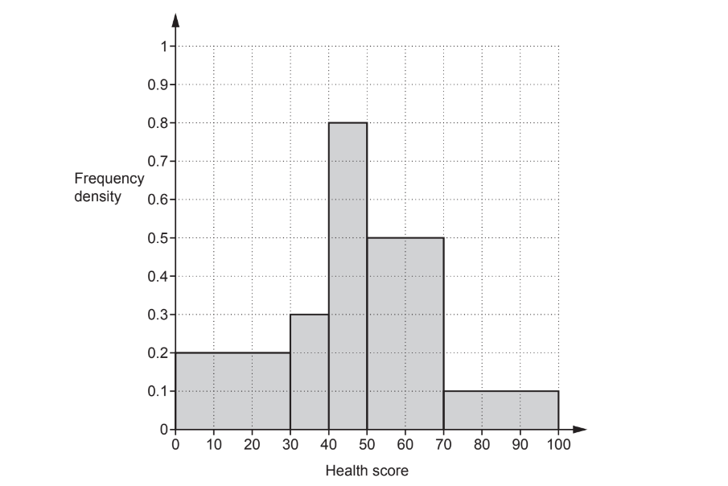

i) Estimate the fraction of the group who had a score of 45 or more.

[4]

ii) What assumption did you make in answering part **(i)**?

[1]

## Q31 — hard — 4 marks · exam-questions

### 19() — 4 marks — command: work_out — structured — from paper Specimen paper · 4MA1/1H
150 people took part in a survey. 
The histogram shows information about the ages of these people.

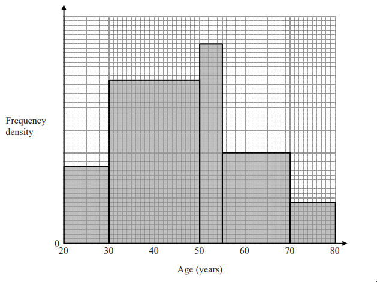

Work out how many of these 150 people are aged between 50 years and 55 years.

## Q32 — hard — 4 marks · exam-questions

### 18() — 4 marks — command: complete — structured — from paper 2023 June · 4MA1/1H
The incomplete table and incomplete histogram give information about the times, in minutes, that 140 people waited at a station for a train.

| Time (t minutes) | Frequency |
|---|---|
| `0 less than t less-than or slanted equal to 5` | 23 |
| `5 less than t less-than or slanted equal to 15` |   |
| `15 less than t less-than or slanted equal to 30` |   |
| `30 less than t less-than or slanted equal to 40` | 18 |
| `40 less than t less-than or slanted equal to 60` | 14 |

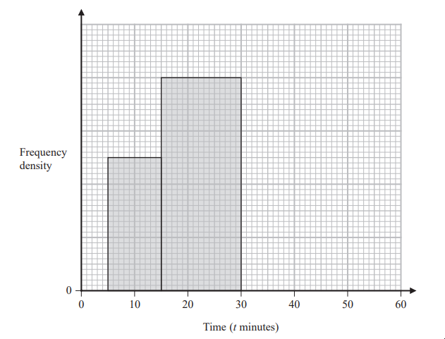

Complete the table and the histogram.

## Q33 — hard — 3 marks · exam-questions

### 17() — 3 marks — command: work_out — structured — from paper 2023 Nov · 4MA1/1H
The histogram gives information about the weights, in grams, of some oranges in a box.

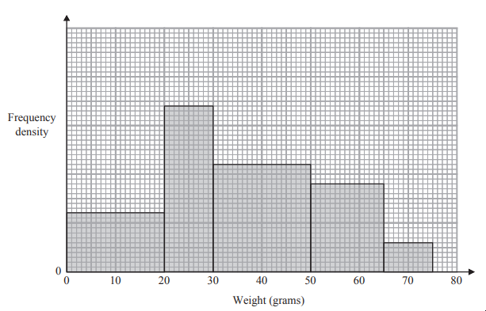

24 of these oranges weigh less than 20 grams.

Medium oranges weigh between 35 grams and 55 grams.

Work out an estimate for the number of medium oranges in the box.

## Q34 — very_hard — 3 marks · exam-questions

### 23() — 3 marks — command: work_out — structured — from paper June 2017 · 1MA0/2H
The histogram shows information about the weights, in grams, of some plums.

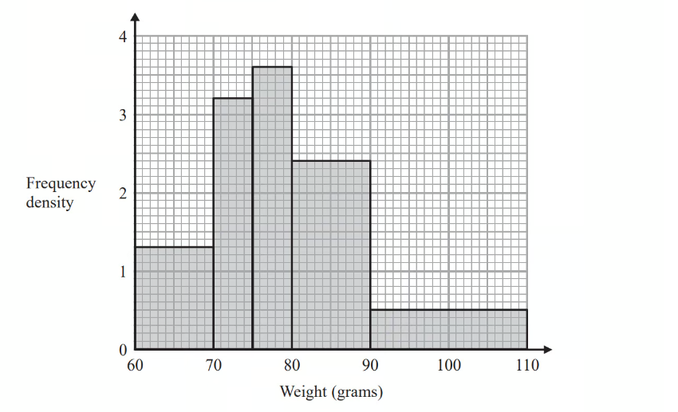

Work out an estimate for the proportion of these plums with a weight of less than 100 grams.

## Q35 — very_hard — 5 marks · exam-questions

### 17((a)) — 3 marks — command: draw — structured — from paper November 2017 · 1MA1/2H
The table gives information about the heights of$150$students.

| **Height( **$h$** cm)** | **Frequency** |
|---|---|
| `140 less than h less-than or slanted equal to 150` | $15$ |
| `150 less than h less-than or slanted equal to 155` | $30$ |
| `155 less than h less-than or slanted equal to 160` | $51$ |
| `160 less than h less-than or slanted equal to 165` | $36$ |
| `165 less than h less-than or slanted equal to 180` | $18$ |

On the grid, draw a histogram for this information.

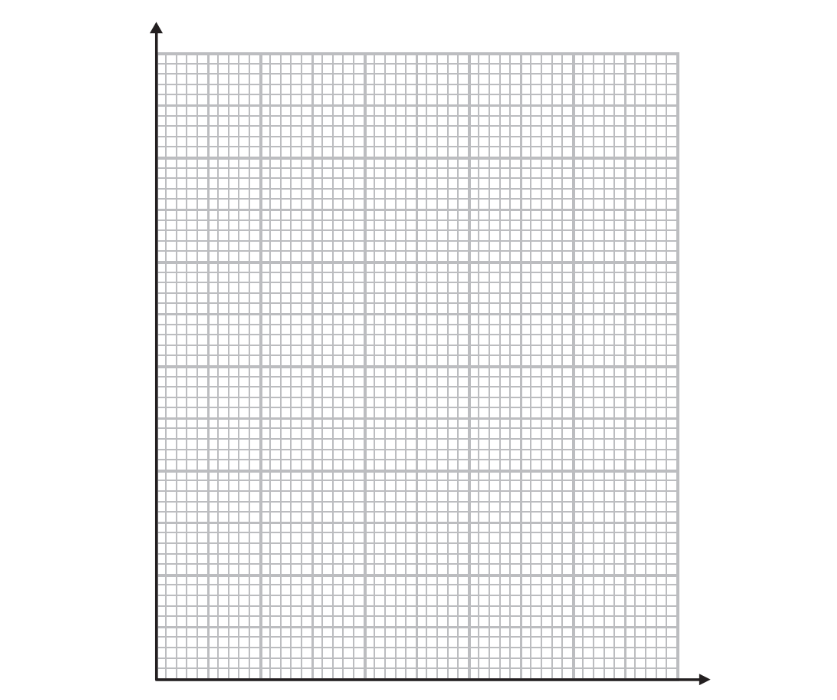

### 17((b)) — 2 marks — command: work_out — structured — from paper November 2017 · 1MA1/2H
Work out an estimate for the fraction of the students who have a height between$150$cm and$170$cm.

## Q36 — very_hard — 4 marks · exam-questions

### 19() — 4 marks — command: work_out — structured — from paper Spec2 2015 · 1MA1/1H
The histogram shows information about the time taken by cyclists to finish a cycle race.

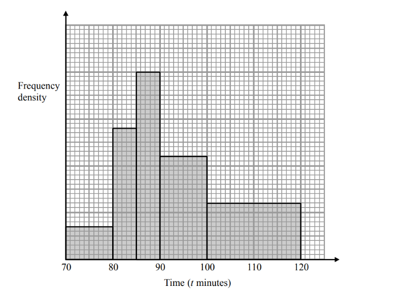

7 cyclists took 80 minutes or less to finish the race.

i) Work out an estimate for the number of cyclists who took more than 105 minutes to finish the race.

[3]

ii) Explain why your answer to part (i) is only an estimate.

[1]

## Q37 — very_hard — 4 marks · exam-questions

### 21() — 4 marks — command: work_out — structured — from paper June 2019 · 1MA1/3H
The histogram gives information about the distribution of the weights of some onions grown by a farmer.

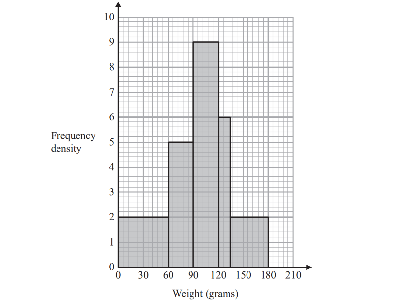

Onions less than 60 grams in weight are used for pickling. Onions greater than 120 grams in weight are sold at the market. The rest of the onions are sent to a food processing factory.

A pie chart is drawn using the information opposite to show what the farmer does with the onions he grows.

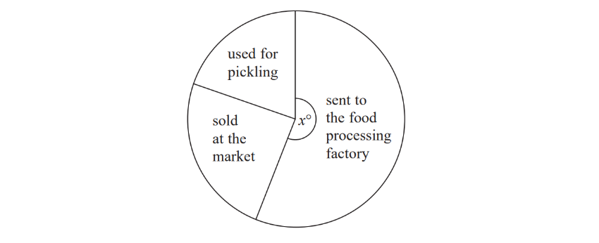

The angle of the sector for the onions sent to the food processing factory is $x^{\circ}$. 
Work out the value of $x$.

## Q38 — very_hard — 4 marks · exam-questions

### 21() — 4 marks — command: work_out — structured — from paper March 2013 · 1MA0/2H
The histogram shows some information about the weights of a sample of apples.

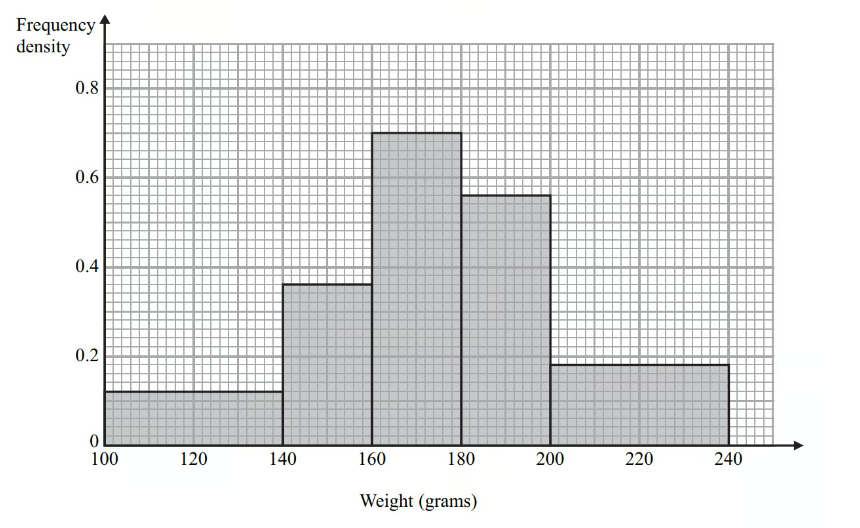

Work out the proportion of apples in the sample with a weight between 140 grams and 200 grams.

## Q39 — very_hard — 6 marks · exam-questions

### 15((a)) — 3 marks — command: work_out — structured — from paper Jan 2021 · 4MA1/2H
A postman records the weight of each parcel that he delivers. 

The histogram shows information about the weights of all the parcels that the postman delivered last Monday. No parcels weighed more than 6 $\mathrm{kg}$.

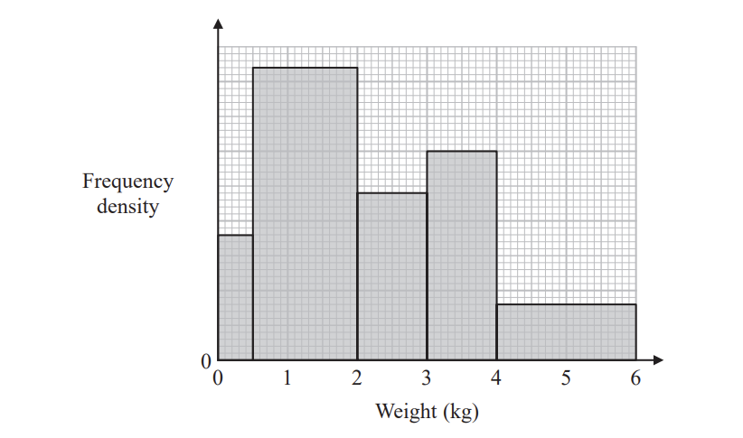

63 of the parcels that the postman delivered last Monday each had a weight between 0.5 $\mathrm{kg}$ and 2 $\mathrm{kg}$.

Work out the total number of parcels the postman delivered last Monday.

### 15((b)) — 3 marks — command: work_out — structured — from paper Jan 2021 · 4MA1/2H
The postman picks at random two of the records of the parcels he delivered last Monday.

Work out an estimate for the probability that each parcel weighed more than 2.25 $\mathrm{kg}$.

## Q40 — very_hard — 5 marks · exam-questions

### 18() — 5 marks — command: work_out — structured — from paper Jan 2021 · 4MA1/1HR
The histogram and the table give some information about the amounts of time, in hours, that Year 11 students at Bergdesh Academy spent, in total, on their homework last week. No student in Year 11 spent longer than 9 hours on their homework.

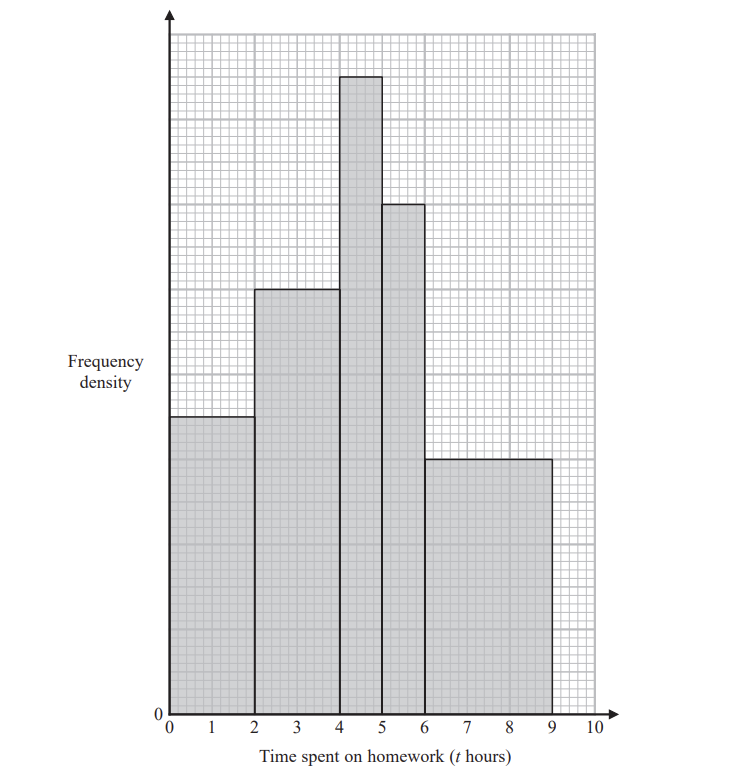

| **Time spent on homework** **(*****t *****hours)** | **Frequency** |
|---|---|
| `0 space less than space t space less-than or slanted equal to space 2` | 28 |
| `2 space less than space t space less-than or slanted equal to 4` |   |
| `4 space less than space t space less-than or slanted equal to space 5` |   |
| `5 space less than space t space less-than or slanted equal to space 6` |   |
| `6 space less than space t space less-than or slanted equal to space 9` |   |

Using the information in the histogram and in the table, work out an estimate for the mean amount of time the Year 11 students spent on their homework last week. 
Give your answer in hours correct to 3 significant figures.

...................................................... hours

## Q41 — very_hard — 5 marks · exam-questions

### 18((c)) — 5 marks — command: work_out — structured — from paper June 2021 · 4MA1/1H
The incomplete table and incomplete histogram give information about the distance travelled, in order to get to work, by each person working in a large store.

| **Distance (d km)** | **Frequency** |
|---|---|
| `0 space less-than or slanted equal to space d space less than space 10` | 40 |
| `10 space less-than or slanted equal to space d space less than space 15` |   |
| `15 space less-than or slanted equal to space d space less than space 20` |   |
| `20 space less-than or slanted equal to space d space less than space 30` |   |
| `30 space less-than or slanted equal to space d space less than space 60` | 30 |

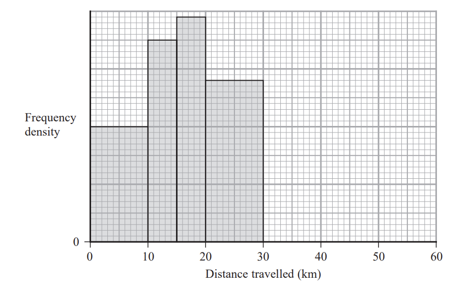

One of the people working in the store is chosen at random.

By completing the table and histogram, work out an estimate for the probability that the distance travelled by this person, in order to get to work, was greater than 25 km.

## Q42 — very_hard — 5 marks · exam-questions

### 18((a)) — 3 marks — command: work_out — structured — from paper Jan 2020 · 4MA1/2H
The histogram gives information about the times, in minutes, that some customers spent in a supermarket.

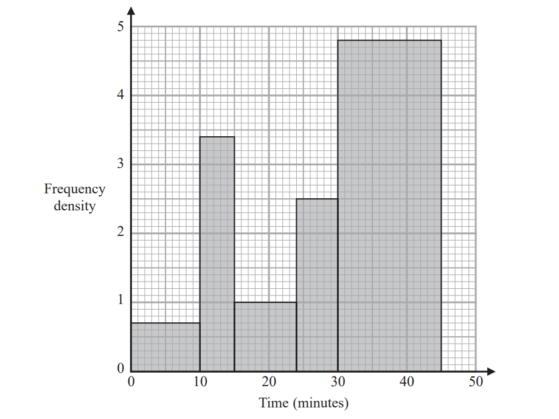

Work out an estimate for the proportion of these customers who spent between 17 minutes and 35 minutes in the supermarket.

### 18((b)) — 2 marks — command: find — structured — from paper Jan 2020 · 4MA1/2H
One of the customers is selected at random.

Given that this customer had spent more than 30 minutes in the supermarket,

find the probability that this customer spent more than 36 minutes in the supermarket.

## Q43 — very_hard — 3 marks · exam-questions

### 17((b)) — 3 marks — command: work_out — structured — from paper June 2019 · 4MA1/1HR
The histogram shows information about the ages of all the passengers travelling on a plane. 
No one on the plane is older than 80 years.

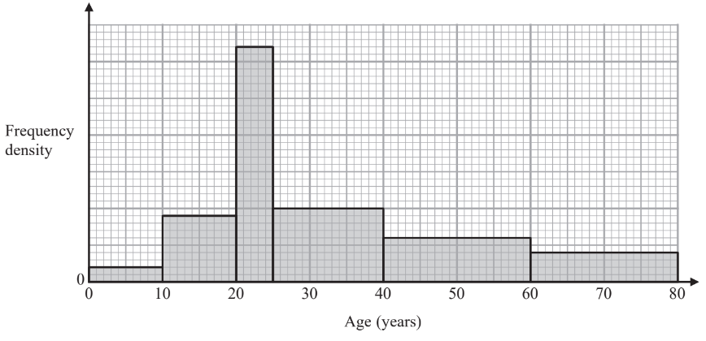

A passenger on the plane is picked at random.

Work out an estimate for the probability that this person is older than 55 years.

## Q44 — very_hard — 4 marks · exam-questions

### 20() — 4 marks — command: find — structured — from paper Jan 2022 · 4MA1/2H
The histogram gives information about the heights, $h$cm, of some tomato plants.

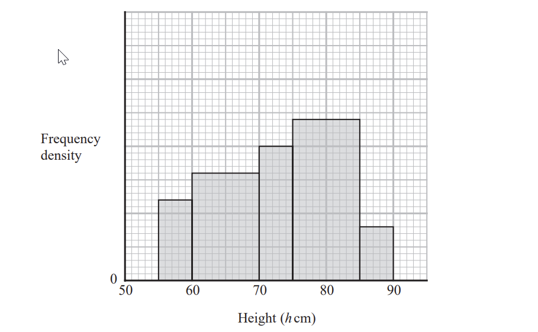

There are 12 tomato plants for which `75 space less than space h space less-than or slanted equal to space 85` 
One of the tomato plants is selected at random.

Find an estimate for the probability that this tomato plant has a height greater than 82.5 cm

## Q45 — very_hard — 4 marks · exam-questions

### 25() — 4 marks — command: estimate — structured — from paper June 2019 · 8300/2H
A sample of 50 eggs is taken from Farm A.

The table shows information about the masses of the eggs from Farm A.

**Farm A**

| **Mass, **$m$** (grams)** | **Frequency** |
|---|---|
| `53 space less than space m space less-than or slanted equal to space 58` | 8 |
| `58 space less than space m space less-than or slanted equal to space 63` | 19 |
| `63 space less than space m space less-than or slanted equal to space 68` | 15 |
| `68 space less than space m space less-than or slanted equal to space 73` | 8 |

A sample of 50 eggs is taken from Farm B. 
The histogram shows information about the masses of the eggs from Farm B.

**Farm B**

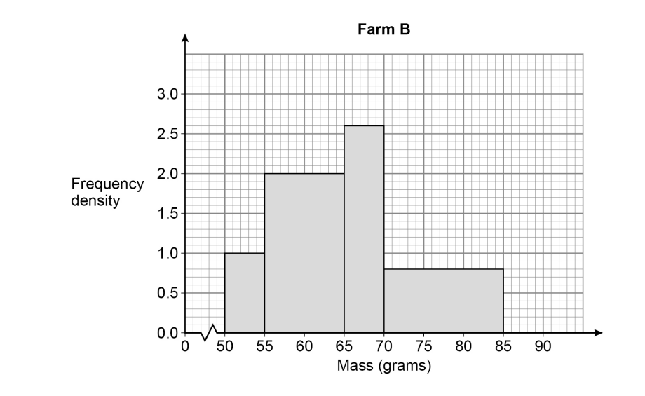

For medium eggs,   53 g < mass < 63 g

The Farm A sample has more medium eggs than the Farm B sample.

Using the table and the histogram, estimate how many more.

You **must **show your working.

## Q46 — very_hard — 6 marks · exam-questions

### 26() — 4 marks — command: how — structured — from paper June 2018 · 8300/3H
The histogram shows information about the speed of cars as they pass a checkpoint.

The scale on the frequency density axis is missing.

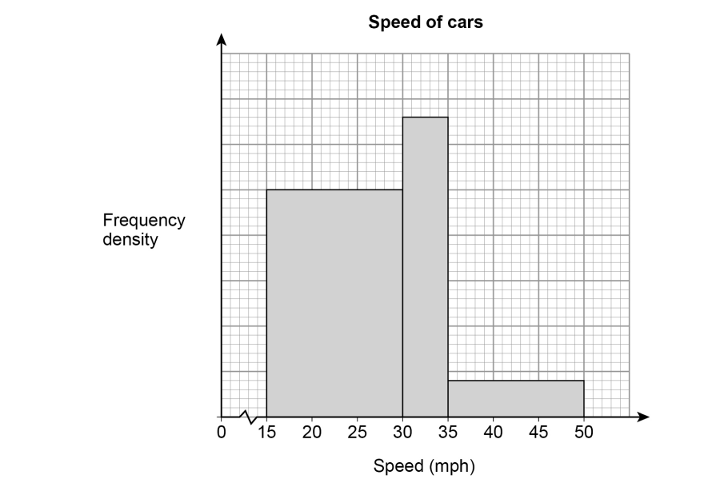

The histogram shows information about 480 cars.

How many cars does the first bar represent?

### 26((b)) — 2 marks — command: use — structured — from paper June 2018 · 8300/3H
Cars with a speed greater than 40 mph are over the speed limit.

Use the histogram to estimate the number of cars that are over the speed limit.

## Q47 — very_hard — 4 marks · exam-questions

### 24() — 4 marks — command: work_out — structured — from paper June 2017 · 8300/2H
48 students completed some homework.

This histogram shows information about the times taken.

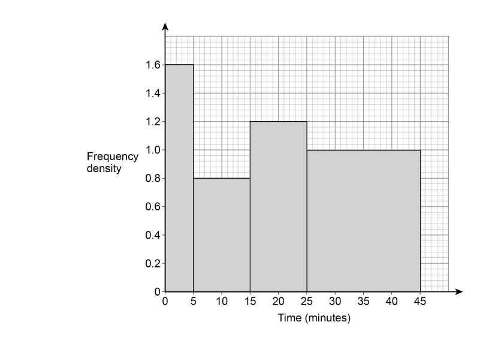

Work out an estimate of the interquartile range. 
You **must **show your working.

....................... minutes

## Q48 — very_hard — 8 marks · exam-questions

### 16((a)) — 1 mark — command: explain — structured — from paper Nov 2020 · J560/05
The masses, $m$ kg, of some parcels are shown below.

| 4 | 15 | 14 | 11 | 12 | 3 | 1 | 18 | 13 | 2 | 16 | 10 |
|---|---|---|---|---|---|---|---|---|---|---|---|

Jack constructs this grouped frequency table to record the masses.

| **Mass (m kg)** | **Tally** | **Frequency** |
|---|---|---|
| `0 less-than or slanted equal to m less-than or slanted equal to 5` |   |   |
| `5 less-than or slanted equal to m less-than or slanted equal to 10` |   |   |
| `10 less-than or slanted equal to m less-than or slanted equal to 15` |   |   |
| `15 less-than or slanted equal to m less-than or slanted equal to 20` |   |   |

Explain why Jack’s table is unsuitable to record the masses.

### 16((b)) — 2 marks — command: prove — structured — from paper Nov 2020 · J560/05
The histogram summarises the times taken, in minutes, by some students to complete a race.

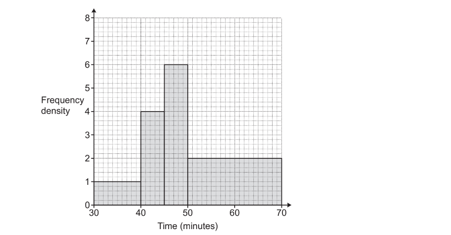

Show that 70 students took between 45 and 70 minutes to complete the race.

### 16() — 5 marks — command: calculate — structured — from paper Nov 2020 · J560/05
Calculate an estimate of the mean time taken to complete the race.

Show your working.

....................................................min

## Q49 — very_hard — 5 marks · exam-questions

### 13((b)) — 5 marks — command: which — structured — from paper June 2019 · J560/04
The histogram summarises the heights of the 153 members of a swimming club.

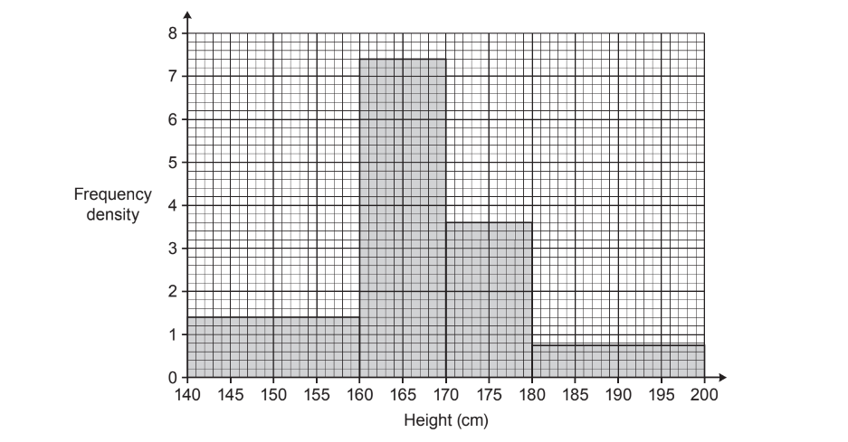

Members of a rowing club have a median height of 172 cm.

Which club has the greater median height? You must show all your working.

## Q50 — very_hard — 8 marks · exam-questions

### 10((a)) — 4 marks — command: draw — structured — from paper June 2017 · J560/06
Ana records the amount of money spent by 140 customers in her shop on one day

| **Amount spent **`stretchy left parenthesis £ bold italic a stretchy right parenthesis` | **Frequency** |
|---|---|
| `0 less than a less-than or slanted equal to 5` | 35 |
| `5 less than a less-than or slanted equal to 10` | 42 |
| `10 less than a less-than or slanted equal to 15` | 20 |
| `15 less than a less-than or slanted equal to 20` | 18 |
| `20 less than a less-than or slanted equal to 30` | 14 |
| `30 less than a less-than or slanted equal to 50` | 11 |

Draw a histogram to represent this information.

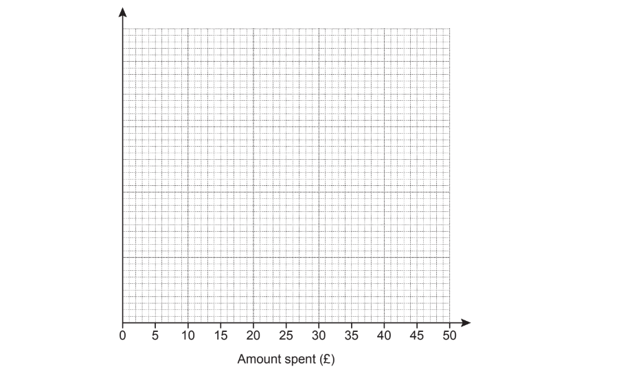

### 10((b)) — 4 marks — command: justify — structured — from paper June 2017 · J560/06
Ana wants to offer a discount to the customers who spend the most money in her shop.

| Voucher Save 10% when you spend more than £... |
|---|

She wants to give the discount to approximately 25% of her customers.

Suggest a suitable amount of money for Ana to use on her voucher.

Justify your decision.
