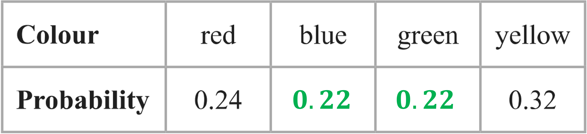
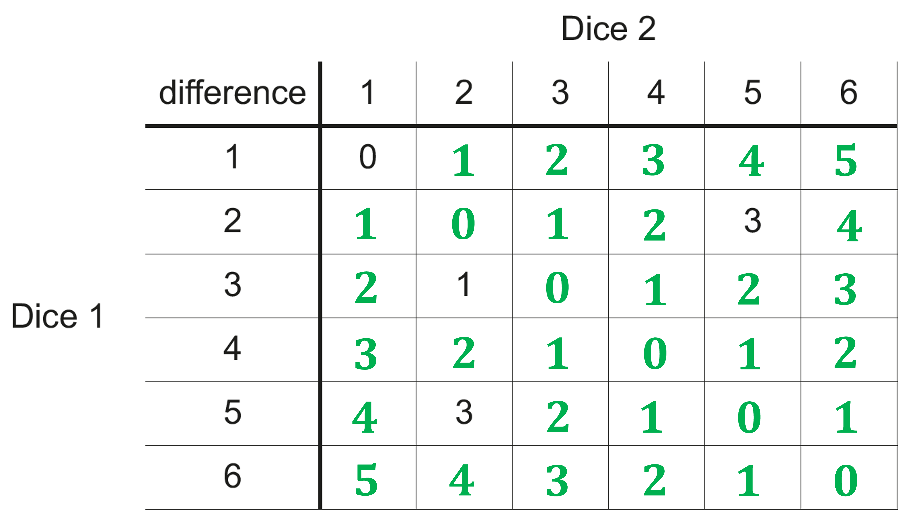
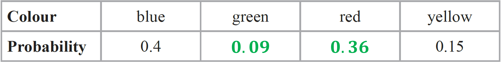

# Mark Schemes — Probability Toolkit
**Statistics & Probability** · Edexcel IGCSE Maths A (4MA1) — 18/Higher

## Q1 — easy — 2 marks · exam-questions

### 12() — 2 marks
> *We can estimate the number of times Megan will roll a 5 by multiplying the number of times she is going to roll the dice by the probability that the dice will land on a 5.*

*400 × 0.3*

**[1]**

**120****  [1]**

## Q2 — easy — 3 marks · exam-questions

### 5((a)) — 1 marks
> *We can use the fact that the total of all the probabilities must sum to 1. Here there are only two possibilities, grow and not grow, therefore subtract the 'grow' probability from 1 to get the 'not grow' probability:*

*1 − 0.75 = 0.25                          *

**0.25 *** ***[1]**

### 5((b)) — 2 marks
> *We can estimate the number of seeds that will grow by multiplying the number of seeds Jane plants by the probability that a seed will grow.*

*200 × 0.75*

**[1]**

**150****  [1]**

## Q3 — easy — 4 marks · exam-questions

### 5((a)) — 2 marks
> *We can use the fact that the total of all the probabilities must sum to 1. If we call the probability that the ball is blue "**B **", then*

*0.16 + 0.4 + ***B ***+ 0.24 = 1*

**[1]**

> *Solve for **B*

**B*** = 1 − (0.16 + 0.4 + 0.24) = 0.2*

**0.2***  ***[1]**

### 5((b)) — 2 marks
> *There are 125 counters in the bag. *
*The number of green counters in the bag is unknown, so call it **n**. The probability of taking a green counter is 0.16. *
*Use this to form an equation for the probability of taking a green counter:*

$\frac{n}{125}=0.16$

**[1]**

> *Solve for **n **by multiplying both sides by 125:*

`table row cell n space end cell equals cell space 125 space cross times space 0.16 end cell row cell n space end cell equals cell space 20 end cell end table`

**20 green counters **** ****[1]**

## Q4 — easy — 4 marks · exam-questions

### 4((a)) — 2 marks
> *There are 200 pens in the box. *
*The number of black pens in the box is unknown, so call it **n**. *
*The probability of taking a black pen is 0.3. *
*Use this to form an equation for the probability of taking a black pen:*

$\frac{n}{200}=0.3$

**[1]**

> *Solve for **n **by multiplying both sides by 200:*

`table row cell n space end cell equals cell space 200 cross times 0.3 end cell row cell n space end cell equals cell space 60 end cell end table`

**60 black pens****  ****[1]**

### 4((b)) — 2 marks
> *We can use the fact that the total of all the probabilities must sum to 1. If we call the probability that the pen is green "**G **", then*

*0.3 + 0.2 + 0.4 + ***G ***= 1*

**[1]**

> *Solve for **G*

**G ***= 1 − (0.3 + 0.2 + 0.4) = 0.1*

**0.1 *** ***[1]**

## Q5 — easy — 5 marks · exam-questions

### 4((a)) — 2 marks
> *We can use the fact that the total of all the probabilities must sum to 1. If we let "**E**" be the probability that the spinner lands on E, then*

*0.25 + 0.10 + 0.20 + 0.15 + ***E ***= 1*

**[1]**

> *Solve for **E*

**E*** = 1 − (0.25 + 0.10 + 0.20 + 0.15) = 0.3                         *

**0.3***  ***[1]**

### 4((b)) — 3 marks
> *The probability of landing on A or B is the sum of the probability of landing on A and the probability of landing on B*

*P(A or B) = 0.25 + 0.10 = 0.35*

**[1]**

> *We can estimate the number of times the spinner will land on A or B by multiplying the number of times Chris is going to spin the spinner by the probability that the spinner will land on A or B*

*60 × 0.35*

**[1]**

**21****  [1]**

## Q6 — easy — 2 marks · exam-questions

### 2() — 2 marks
> *We can estimate the number of times John will win by multiplying the number of times he is going to play by the probability that he wins.*

*300 × 0.65*

**[1]**

**195****  [1]**

## Q7 — easy — 4 marks · exam-questions

### 1((a)) — 2 marks
> *We can use the fact that the total of all the probabilities must sum to 1. If we call the probability of selecting Nilgiri "**N **", then*

*0.38 + 0.24 + ***N ***+ 0.16 = 1*

**[1]**

> *Solve for **N*

**N*** = 1 − (0.38 + 0.24 + 0.16) = 0.22*

**0.22***  ***[1]**

### 1((b)) — 2 marks
> *To find the probability of Darjeeling OR Rize, just add the two probabilities. (Remember that you can add like this as long as the probabilities are **mutually exclusive**.)*

*0.24 + 0.16*

**[1]**

**0.4***  ***[1]**

## Q8 — easy — 2 marks · exam-questions

### 1() — 2 marks
> *We can estimate the number of times the spinner will land on blue by multiplying the number of times Rayyan is going to spin the spinner by the probability that the spinner will land on blue.*

*280 × 0.4*

**[1]**

**112****  [1]**

## Q9 — easy — 3 marks · exam-questions

### 6() — 3 marks
> *We can use the fact that the total of all the probabilities must sum to 1. If we call the probability of selecting mint "**M **", then*

*0.35 + 0.32 + ***M ***+ 0.12 = 1*

**[1]**

> *Solve that equation for **M*

**M*** = 1 − (0.35 + 0.32 + 0.12) = 0.21*

> *To find the probability of strawberry OR mint, just add the two probabilities. (Remember that you can add like this as long as the probabilities are **mutually exclusive**.)*

*0.32 + 0.21*

**[1]**

**0.53***  ***[1]**

## Q10 — easy — 1 marks · exam-questions

### 12() — 1 marks
*The best estimate is the one coming from the most number of throws* *The last column has the most number of throws (250) so use its relative frequency*

**0.3** **[1]**

## Q11 — easy — 1 marks · exam-questions

### 13() — 1 marks
*Find the probability of getting tails (by subtracting 0.6 from 1) *

*1 - 0.6 = 0.4* * *

*Work out the expected number of tails by multiplying 500 by 0.4*

*500 × 0.4 = 200*

**the ****second ****option is therefore correct,**** 200** **[1]**

## Q12 — easy — 5 marks · exam-questions

### 4() — 1 marks
> *Fill in the table by adding the first card value (top row) to the second card value (first column)  *

|   |   | First card |   |   |   |   |
|---|---|---|---|---|---|---|
| Second  card | Total | 2 | 2 | 3 | 5 | 6 |
| 2 | 4 | 4 | 5 | 7 | 8 |   |
| 2 | 4 | 4 | 5 | **Final answer:** **7** | 8 |   |
| 3 | 5 | 5 | **Final answer:** **6** | 8 | 9 |   |
| 5 | 7 | **Final answer:** **7** | 8 | 10 | 11 |   |
| 6 | 8 | 8 | 9 | 11 | 12 |   |

**[1]**

### 4((a)) — 4 marks
*(i) **Count how many even numbers there are in the grid (not including the row headings and the column headings)* * *

*13 even numbers* * *

*13 possibilities out of all 25 possibilities in the grid are even* *Write this as a probability (13 divided by 25)*

**fraction with denominator of 25**** [1]**
** **$\frac{13}{25}$ **[1]**

*(ii) **Count how many numbers in the grid could be labelled "a multiple of 3 or 4" (not including the row headings and the column headings) Do not count multiples of both 3 and 4 twice* * *

*14 numbers* * *

*14 possibilities out of all 25 possibilities in the grid are a multiple of 3 or 4* *Write this as a probability (14 divided by 25)*

**fraction with denominator of 25**** [1]**
** **$\frac{14}{25}$ **[1]**

## Q13 — easy — 1 marks · exam-questions

### 3((a)) — 1 marks
*Find the angle in the pie chart for Vlad to be correct (by dividing 360 by 5)* * *

*360 ÷ 5 = 72°* * *

*For Vlad to be correct, the angle needs to be 72° but it looks to be smaller than that on the pie chart* * *

**The angle is not equal to 72°**** [1]**

**Accept also "the angle is too small", "the angle is less than a fifth", "the angle is 26-30 degrees", "the area is too small" or "the area is less than a fifth***"*

## Q14 — easy — 3 marks · exam-questions

### 3((a)) — 1 marks
*Fill in the table by multiplying the number on spinner A (top row) by the number on spinner B (first column)*

| Spinner B | Spinner A |   |   |
|---|---|---|---|
| x | 1 | 7 | 9 |
| 2 | 2 | 14 | 18 |
| 3 | 3 | 21 | 27 |
| 4 | 4 | 28 | **Final answer:** **36** |
| 5 | 5 | 35 | **Final answer:** **45** |

**[1]**

### 3((b)) — 2 marks
*There are 6 even numbers (2, 4, 14, 18, 28, 36) and 3 prime numbers (2, 3, 5) but 2 appears in both lists - Geoff has counted 2 twice* 
*The correct probability of being even or prime is 8 out of 12*

**Geoff counted 2 twice** **[1]** 
**the correct probability is **$\frac{8}{12}$**[1]**

**Accept "2 is both prime and even", "one number is prime and even", accept **$\frac{8}{12}$** in other forms**

## Q15 — easy — 4 marks · exam-questions

### 4((a)) — 1 marks
*If 12 out of 28 of Jeat's carrots grow, then the probability of one of his carrots growing is 12 divided by 28* * *

$\frac{12}{28}$ * *

*This can be simplified by dividing top-and-bottom by 4 *

$\frac{12}{28}=\frac{3}{7}$** **

$\frac{3}{7}$ **[1]**
 $\frac{12}{28}$** must be seen**

### 4() — 3 marks
*(i)  *$\frac{3}{7}$* of an amount of carrots needs to equal 10 000* 
      *Call the amount **x** and form an equation* * *

$\frac{3}{7}\timesx=10000$ * *

*Multiply both sides by 7 and divide both sides by 3* * *

$x=\frac{10000\times7}{3}$

**[1]**

*Work out this value* * *

$x=23333.333...$ * *

*Round this to the nearest whole number, as **x** is a number of carrots (so can't be a decimal)* * *

**23 333 carrots*** ***[1]**

**whole numbers from 23 000 to 23 334 (inclusive) are accepted (to guarantee at least 10 000 whole carrots, 23 334 carrots are needed as 23 333 are not quite enough)**

*(ii) **Comment on the fact that Jeat's garden and the farm are different environments or that Jeat's sample is too small to make big decisions from* * *

**The growing conditions on the farm may be different to the garden*** ***[1]**

**Accept also "Jeat's sample is too small" References to part (b)(i) not being an integer are not accepted**

## Q16 — easy — 4 marks · exam-questions

### 6((a)) — 4 marks
*(i) **Fill in the table by multiplying the number on the first spin (top row) by the number on the second spin (first column)*

| Second spin | First spin |   |   |   |   |
|---|---|---|---|---|---|
| x | 1 | 2 | 2 | 3 | 4 |
| 1 | 1 | **Final answer:** **2** | **Final answer:** **2** | **Final answer:** **3** | **Final answer:** **4** |
| 2 | **Final answer:** **2** | **Final answer:** **4** | 4 | **Final answer:** **6** | **Final answer:** **8** |
| 2 | **Final answer:** **2** | **Final answer:** **4** | **Final answer:** **4** | **Final answer:** **6** | **Final answer:** **8** |
| 3 | **Final answer:** **3** | **Final answer:** **6** | **Final answer:** **6** | **Final answer:** **9** | **Final answer:** **12** |
| 4 | **Final answer:** **4** | **Final answer:** **8** | **Final answer:** **8** | 12 | **Final answer:** **16** |

** complete with up to 5 errors**** [1] **
**complete and correct**** [1]**

*(i) **Count the number of possibilities in the grid that are multiples of 3 (do not include the first row and first column) *

*there are 9 multiples of 3 in the grid*

> *Work out the probability of choosing one of these 9 possibilities out of the total 25 possibilities (9 ÷ 25)*

** a fraction over 25**** [1]**

$\frac{9}{25}$** [1]**

## Q17 — medium — 3 marks · exam-questions

### 6() — 3 marks
> *We can use the fact that the total of all the probabilities must sum to 1. Subtract the 'female' probability from 1 to get the 'male' probability:*

$1-\frac{3}{5}=\frac{2}{5}$

**[1]**

> *There are 36 male teachers at the school. *
*The number of teachers at the school is unknown, so call it **N**. The probability of a teacher being male is 2/5. *
*Use this to form an equation for the probability of a teacher being male:  *

$\frac{36}{N}=\frac{2}{5}$

**[1]**

> *Solve for **N **by multiplying both sides by **N** and then dividing by 2/5:*

`table row cell 36 space end cell equals cell space 2 over 5 space cross times space N end cell row cell 36 space divided by space 2 over 5 space end cell equals cell space N end cell row cell 90 space end cell equals cell space N end cell end table`

**90 teachers****  ****[1]**

## Q18 — medium — 4 marks · exam-questions

### 8((a)) — 2 marks
> *We can use the fact that the total of all the probabilities must sum to 1. *
*Because the number of white counters and the number of black counters are the same, white and black will have the same probability. *
*Call both of those probabilities **'p'**  and then set up an equation with all the probabilities:*

$0.2+0.5+p+p=1$

**[1]**

> *Solve the equation to find the value of **p:*

`table row cell 0.7 space plus space 2 p space end cell equals cell space 1 end cell row cell 2 p space end cell equals cell space 1 space minus space 0.7 end cell row cell 2 p space end cell equals cell space 0.3 end cell row cell p space end cell equals cell space 0.3 space divided by space 2 end cell row cell p space end cell equals cell space 0.15 end cell end table`

**0.15****  ****[1]**

### 12((b)) — 2 marks
> *There are 240 counters in the bag. *
*The number of red counters is unknown, so call it **n**. *
*The probability of a counter being red is 0.2. *
*Use this to form an equation for the probability of a counter being red:  *

$\frac{n}{240}=0.2$

**[1]**

> *Solve for **n **by multiplying both sides by 240:*

`table row cell n space end cell equals cell space 240 space cross times space 0.2 end cell row cell n space end cell equals cell space 48 end cell end table`

**48 red counters**** ****[1]**

## Q19 — medium — 3 marks · exam-questions

### 4() — 3 marks
> *We can use the fact that the total of all the probabilities must sum to 1. Call the probability that she will win **'w'**. *
*Then set up an equation with all the probabilities and solve for **w**:*

`table row cell 0.32 space plus space 0.05 space plus space w space end cell equals cell space 1 end cell row cell w space end cell equals cell space 1 space minus space open parentheses 0.32 space plus space 0.05 close parentheses end cell row cell w space end cell equals cell space 0.63 end cell end table`*                         *

**[1]**

> *To find an estimate for the number of times Rhiana will win the game, multiply the number of times she is going to play the game by the probability that she will win:*

> `table row blank blank cell 200 space cross times space 0.63 end cell end table`*                            *

**[1]**

**126****  ****[1]**

## Q20 — medium — 5 marks · exam-questions

### 4((a)) — 3 marks
> *We can use the fact that the total of all the probabilities must sum to 1. *
*Because the probability of landing on 2 is the same as the probability of landing on 4, we can call both those probabilities **'p'** and then set up an equation with all the probabilities:*

$0.2+p+0.1+p=1$*                          *

**[1]**

> *Solve the equation to find the value of **p:*

> `table row cell 0.3 space plus space 2 p space end cell equals cell space 1 end cell row cell 2 p space end cell equals cell space 1 space minus space 0.3 end cell row cell 2 p space end cell equals cell space 0.7 end cell row cell p space end cell equals cell space 0.7 space divided by space 2 end cell end table`*              *

**[1]**

**0.35****  ****[1]**

### 4((b)) — 2 marks
> *To find an estimate for the number of times the spinner will land on 3, multiply the number of times Shunya is going to spin the spinner by the probability that the spinner will land on 3:*

> $200\times0.1$*                            *

**[1]**

**20****  ****[1]**

## Q21 — medium — 3 marks · exam-questions

### 8() — 3 marks
> *Divide the frequency for L by the number of times Carol spun the spinner, to find the relative frequency (or 'experimental probability') for L:*

$\frac{16}{80}=\frac{1}{5}$*                          *

**[1]**

> *To estimate the number of times Dan will get an L, multiply the number of times Dan spins the spinner by the relative frequency for L**:*

> `table row blank blank cell 300 space cross times space 1 fifth end cell end table`*              *

**[1]**

**60****  ****[1]**

## Q22 — medium — 7 marks · exam-questions

### 1() — 3 marks
Subtract the existing probabilities from 1

$1-0.18-0.4=0.42$

**[M1]**

Divide the leftover probability by 2

$0.42\div2$

**[M1]**

**Final answer:** **0.21**

**[A1]**

> **[mark-scheme]**
> **M1**: For subtracting the given probabilities from 1 to find the combined probability of black and white counters (0.42).
> 
> **M1**: For dividing the remaining probability by 2.
> 
> **A1**: For the correct answer of 0.21.

### 2() — 2 marks
Divide the frequency of reds by the probability

$54\div0.18$

**[M1]**

**Final answer:** **300**

**[A1]**

> **[mark-scheme]**
> **M1**: For a correct method. You can also use a ratio method by setting 0.18:1 equal to 54:*x* and solving for *x*.
> 
> **A1**: Correct answer.

### 3() — 2 marks
Work out how many white counters there were before

$0.21\times300=63\mathrm{counters}$

**[M1]**

Add the 7 counters and divide by the new total number of counters

$\frac{70}{307}$

**[A1]**

## Q23 — medium — 3 marks · exam-questions

### 1() — 3 marks
> *We can use the fact that the total of all the probabilities must sum to 1. *
*Call the probability of landing on 1 **'p'**. *
*Then set up and solve an equation with the total of all the probabilities:*

`table row cell p space plus space 0.17 space plus space 0.18 space plus space 0.09 space plus space 0.15 space plus space 0.1 space end cell equals cell space 1 end cell row cell p space end cell equals cell space 1 space minus space open parentheses 0.17 space plus space 0.18 space plus space 0.09 space plus space 0.15 space plus space 0.1 close parentheses end cell row cell p space end cell equals cell space 0.31 end cell end table`*                          *

**[1]**

> *The probability of landing on 1 OR 3 is the sum of the probability of landing on 1 and the probability of landing on 3.*
* To work out an estimate for the number of times the dice will land on 1 or 3, multiply that total probability by the number of times Neymar rolls the biased dice:  *

`200 space cross times space open parentheses 0.31 space plus space 0.18 close parentheses`

**[1]**

**98****  ****[1]**

## Q24 — medium — 2 marks · exam-questions

### 3() — 2 marks
> *We can use the fact that the total of all the probabilities must sum to 1. Because the probability of picking a blue counter is the same as the probability of picking a red counter, we can call both of these probabilities **'p' **.*
*Then set up an equation with all the probabilities:*

`table row cell 0.24 space plus space p space plus space p space plus space 0.32 space end cell equals cell space 1 end cell row cell space p space plus space p space end cell equals cell space 1 space minus space open parentheses 0.24 space plus space 0.32 close parentheses end cell end table`*                          *

**[1]**

> *Solve the equation to find the value of **p:*

`table row cell 2 p space end cell equals cell space 1 space minus space 0.56 end cell row cell 2 p space end cell equals cell space 0.44 end cell row cell p space end cell equals cell space 0.44 space divided by space 2 end cell row cell p space end cell equals cell space 0.22 end cell end table`

**   [1]**

## Q25 — medium — 3 marks · exam-questions

### 8((a)) — 1 marks
> *To determine experimental probabilities, an experiment should be repeated as many times as possible.  The more repetitions, the more reliable the results.*

**Mel's results will give the best estimate, because she dropped the drawing pin the greatest number of times****  ****[1]**

### 8((b)) — 2 marks
> *First find the relative frequencies (i.e., experimental probabilities) for 'point up' and 'point down', by dividing the total number of times the pin landed point up or point down by the total number of times it was dropped. *
*Then multiply those relative frequencies together to determine an estimate for the probability the pin will land point up the first time AND point down the second time. *
*Remember, with combined probabilities 'and' usually means 'multiply'.*

`straight P open parentheses point space up close parentheses space equals space fraction numerator 14 plus 27 plus 9 over denominator 31 plus 53 plus 16 plus 14 plus 27 plus 9 end fraction space equals space fraction numerator space 50 over denominator 150 end fraction equals space 1 third

straight P open parentheses point space down close parentheses space equals space fraction numerator 31 plus 53 plus 16 over denominator 31 plus 53 plus 16 plus 14 plus 27 plus 9 end fraction space equals space 100 over 150 space equals space 2 over 3

1 third space cross times space 2 over 3 space equals space 2 over 9`*                          *

**[1]**

$\frac{2}{9}$**  ****[1]**

## Q26 — medium — 4 marks · exam-questions

### 1((a)) — 2 marks
> *Subtract the probability from 1*

$1-0.2=0.8$

**[1]**

> *The probabilities of red and yellow are equal*

> *Halve the probability*

$0.8\div2=0.4$

| **Colour** | blue | red | yellow |
|---|---|---|---|
| **Probability** | 0.2 | **Final answer:** ** 0.4** | **Final answer:** **0.4** |

**[1]**

### 1((b)) — 2 marks
> *0.2 multiplied by the total number of cubes is 12*

> *Find the total number of cubes by dividing 12 by 0.2 which is the same as multiplying by 5*

$\frac{12}{0.2}=60$

**[1]**

**60 cubes** **[1]**

## Q27 — medium — 4 marks · exam-questions

### 1() — 2 marks
> *First list out all the possible factors.*

*Factors of 8: 1, 2, 4, 8* 
*Factors of 20: 1, 2, 4, 5, 10, 20*

> *The universal set states that only even numbers can be used, so list the even factors.*

*Set ***A***: 2, 4, 8* 
*Set ***B***: 2, 4, 10, 20*

**[1]**

> *Find the numbers that appear in **A** OR **B, *`open parentheses A union B close parentheses`*.*

**2, 4, 8, 10, 20***  ***[1]**

### 2() — 2 marks
> *From part (a) we know that:*

`A equals open curly brackets 2 comma space 4 comma space 8 close curly brackets space space space space space and space space space space space B equals open curly brackets 2 comma space 4 comma space 10 comma space 20 close curly brackets`

> $A\capB$* is the set of all numbers that are in *$A$* **AND in *$B$*.  *
*Therefore *`A intersection B equals open curly brackets 2 comma space 4 close curly brackets`*, which is a set with 2 elements so*

`straight n open parentheses A intersection B close parentheses space equals space 2`

**[1] **
**You would also get this mark for writing down **`A intersection B equals open curly brackets 2 comma space 4 close curly brackets`**, or for using '2' in the numerator of a probability fraction.**

> *The number chosen is from set *$B$*, which has 4 elements**. *
*So the probability is 2 (the number of elements in set *$A\capB$*) divided by 4 (the number of elements in set *$B$*).  *

$\frac{2}{4}$

$\frac{1}{2}$**  [1]**

**The question doesn't ask for the answer in lowest terms, so 2/4 would also get the mark here. **
**Decimal form 0.5 would also get the mark.**

## Q28 — medium — 4 marks · exam-questions

### 1() — 2 marks
> *List the factors of 100.*

*Factors of 100: 1, 2, 4, 5, 10, 20, 25, 50, 100*

**List any factors of 100 or multiples of 5  ****[1]**

> *List the factors of 100 that are also multiples of 5.*

**5, 10, 20, 25, 50, 100 *** ***[1]**

### 2() — 2 marks
> *From part (a) we know that:*

`A equals open curly brackets 1 comma space 2 comma space 4 comma space 5 comma space 10 comma space 20 comma space 25 comma space 50 comma space 100 close curly brackets space space space space space and space space space space space B equals open curly brackets 5 comma space 10 comma space 15 comma space 20 comma space 25 comma space... close curly brackets`

> *Start by identifying the numbers in set *$A$* which AREN'T in set *$B$*.*

$\mathrm{in}A\mathrm{and} \mathrm{not} \mathrm{in}B:1,2,4$

**[1] **
**You would also get this mark for writing down **`A intersection B to the power of apostrophe equals open curly brackets 1 comma space 2 comma space 4 close curly brackets`** or  **`straight n open parentheses A intersection B to the power of apostrophe close parentheses equals 3`**, or for using '3' in the numerator of a probability fraction.**

> *The number chosen is from set *$A$*, which has 9 elements**. *
*So the probability is 3 (the number of elements in set *$A$* but not in set *$B$*) divided by 9 (the number of elements in set *$A$*).  *

$\frac{3}{9}$

$\frac{1}{3}$**  [1]**

**The question doesn't ask for the answer in lowest terms, so 3/9 would also get the mark here.**

## Q29 — medium — 1 marks · exam-questions

### 3() — 1 marks
> *The probability of the friend spending more than 24 euros is equal to the number of friends who spent more than 24 euros divided by the total number of friends. *
*We know the total number of friends is 70. *
*The number who spent more than 24 euros is the sum of the  *$24<S\leq32$*  and  *$32<S\leq40$*  frequencies.*

`table row blank blank cell fraction numerator 25 space plus space 6 over denominator 70 end fraction end cell end table`

$\frac{31}{70}$**  ****[1]**

## Q30 — medium — 4 marks · exam-questions

### 2() — 4 marks
> *Start by finding out how many seconds are in 15 hours. *
*There are 60 minutes in an hour, so first multiply 15 by 60. *
*And there are 60 seconds in each minute, so multiply again by 60.*

$15\mathrm{hours}=15\times60\times60=54000\mathrm{seconds}$

**[1]**

> *In every 12 seconds, 5 cars are made. *
*Divide 54000 by 12 to find out how many blocks of 12 seconds there are in the 15 hours. *
*Then multiply that by 5 to find out how many toys are made in a 15-hour day.  *

$54000\div12=4500\,\,4500\times5=22500$

**[1]**

> *So the factory makes 22500 toy cars in a 15-hour day. *
*We can estimate the number of faulty cars by multiplying that total (22500) by the probability of a toy car being faulty.*

`table row cell 22500 space cross times space 0.002 space end cell equals cell space 45 end cell end table`

**[1]**

**45 faulty toy cars****  ****[1]**

## Q31 — medium — 6 marks · exam-questions

### 3((a)) — 3 marks
> *We can use the fact that the total of all the probabilities must sum to 1. *
*Because the number of green bricks and the number of orange bricks are the same, green and orange will have the same probability. *
*Call both of those probabilities **'p'**  and then set up an equation with all the probabilities:*

$0.26+0.3+p+p=1$

**[1]**

> *Solve the equation to find the value of **p:*

`table row cell 0.56 space plus space 2 p space end cell equals cell space 1 end cell row cell 2 p space end cell equals cell space 1 space minus space 0.56 end cell row cell 2 p space end cell equals cell space 0.44 end cell row cell p space end cell equals cell space 0.44 space divided by space 2 end cell end table`

**[1]**

**        **$p=0.22$

**0.22****  ****[1]**

### 3((b)) — 3 marks
> *Call the total number of bricks in the bag "**N **".*
* The probability of taking a red brick is equal to the number of red bricks divided by the total number of bricks. *
*We can use this to set up and solve an equation for **N.*

`table row cell 91 over N space end cell equals cell space 0.26 end cell row cell fraction numerator 91 over denominator 0.26 end fraction space end cell equals cell space N end cell row cell 350 space end cell equals cell space N end cell end table`

**[1]**

> *So there are 350 bricks in the bag. *
*Multiply that by the 'blue' probability to find the number of blue bricks.*

$350\times0.3=105\mathrm{blue} \mathrm{bricks}$

> *The number of layers in the tower will be the sum of the numbers of red and blue bricks, divided by the number of bricks per layer (4)*

`table row cell fraction numerator 91 space plus space 105 over denominator 4 end fraction space end cell equals cell space 49 end cell end table`

**[1]**

**        ****49 layers****  ****[1]**

## Q32 — medium — 2 marks · exam-questions

### 12((a)) — 2 marks
> *If you notice the patterns along the diagonals it can save you a bit of work having to do all the individual subtractions!*

**  [2]**

**1 mark for at least 10 entries correct, or 2 marks for all entries correct**

## Q33 — medium — 6 marks · exam-questions

### 3((a)) — 3 marks
> *Calculate the combined probability of green and orange, using the fact that mutually exclusive outcomes sum to 1*

`table row cell straight P open parentheses G space or space O close parentheses end cell equals cell 1 minus open parentheses straight P open parentheses R close parentheses plus straight P open parentheses B close parentheses close parentheses end cell row blank equals cell 1 minus open parentheses 0.26 plus 0.3 close parentheses end cell row blank equals cell 0.44 end cell end table`

**[M1]**

> *Given that the number of green and orange bricks are equal, the probabilities must be equal*

$0.44\div2=0.22$

**[M1]**

**Final answer:** **0.22**

**[A1]**

> **[mark-scheme]**
> **M1**: Awarded for correct calculation or value of 0.44 given.
> 
> **M1**: You will gain this mark for dividing your previously calculated value (either 0.44 or an incorrect value) by 2.
> 
> **A1**: Any form equivalent to 0.22 will gain this mark (e.g. $\frac{11}{50}$).

### 3((b)) — 3 marks
> *Work out the total number of bricks*

`straight P open parentheses R close parentheses equals 0.26 equals 91 over N`*, so *$N=\frac{91}{0.26}$

$91\div0.26=350$

**[M1]**

> *Work out the number of blue bricks*

$0.3\times350=105$

> *Work out the total number of red and blue bricks*

$91+105=196$

> *Work out the number of layers*

$196\div4=49$

**[M1]**

**Final answer:** **49 layers**

**[A1]**

## Q34 — medium — 3 marks · exam-questions

### 2() — 3 marks
> *The probabilities should add up to 1 so subtract the other probabilities to get the probability of spinning pink*

$1-0.32-0.13-0.28=0.27$

**[M1]**

> *Multiply the probability of pink by the number of spins*

$0.27\times200=54$

**[M1]**

**Final answer:** **54**

**[A1]**

## Q35 — medium — 4 marks · exam-questions

### 4((a)) — 2 marks
> *Probability adds up to *$1$* so work out the remaining probability*

$1-0.58=0.42$

**[M1]**

> *Form an equation*

$2x+x=0.42$

> *Collect like terms*

$3x=0.42$

> *Divide by *$3$

$x=0.14$

**[A1]**

> **[mark-scheme]**
> Working is not required, so correct answer scores full marks.

### 4((b)) — 2 marks
> *Multiply the probability by the number of trials*

$0.58\times250$

**[M1]**

$145$

**[A1]**

> **[mark-scheme]**
> Working is not required, so correct answer scores full marks.

## Q36 — hard — 2 marks · exam-questions

### 3() — 2 marks
> *We can use the fact that the total of all the probabilities must sum to 1 to find the probability of taking a blue or red counter. We also know the number of blue and red counters there are (3 + 7 = 10). *
*We don't know the total number of counters, so call that **'N'**. Then set up an equation for the probability of taking a blue or red counter and solve it to find the value of **N.*

`straight P open parentheses red space or space blue close parentheses space equals space 1 space minus space 2 over 7 space equals space 5 over 7

fraction numerator 3 plus 7 over denominator N end fraction space equals space 5 over 7
10 over N space equals space 5 over 7
10 space equals space 5 over 7 space cross times space N
10 space divided by space 5 over 7 space equals space N
N equals 14`*                          *

**[1]**

> *Now find the number of yellow counters by multiplying the total number of counters in the bag by the probability of taking a yellow counter:  *

$14\times\frac{2}{7}=4$

**4 yellow counters****  ****[1]**

## Q37 — hard — 5 marks · exam-questions

### 11((a)) — 2 marks
> *There are two multiples of 4 between 1 and 10 (4 and 8). *
*There are 10 possible outcomes on the dice. *
*Divide the ways of winning by the number of possible outcomes to find the probability of winning the game.*

`straight P open parentheses win close parentheses space equals space 2 over 10`*                          *

**[1]**

$\frac{2}{10}(or\frac{1}{5}\mathrm{or}0.2)$**  ****[1]**

### 11((b)) — 3 marks
> *First figure out the money received, by multiplying the number of times the game is played by the price to play. *
*Also find the expected number of winning tickets, by multiplying the number of times the game is played by the probability of winning.*

`Money space recieved space equals space 100 space cross times space 30 straight p space equals space 3000 straight p space equals space £ 30

Number space of space winning space tickets space equals space 100 space cross times space 2 over 10 space equals space 20`*                          *

**[1]**

> *The money raised may now be found by using the formula*

> *money raised = money received - winnings paid out  *

`£ 30 space minus space open parentheses 20 space cross times space £ 1 close parentheses`

**[1]**

**£10****  ****[1]**

## Q38 — hard — 3 marks · exam-questions

### 5() — 3 marks
> *We can use the fact that the total of all the probabilities must sum to 1. *
*The ratio of the probabilities for red and green will be the same as the ratio of red counters to green counters (i.e., 4:1). *
*So if the probability of taking a green counter is **'p'**, then the probability of taking a red counter will be **'4p'**. *
*Set up an equation with all the probabilities:*

`table row cell 0.4 space plus space p space plus space 4 p space plus space 0.15 space end cell equals cell space 1 end cell row cell space p space plus space 4 p space end cell equals cell space 1 space minus space open parentheses 0.4 space plus space 0.15 close parentheses end cell end table`*                          *

**[1]**

> *Solve the equation to find the values of **p** and 4**p:*

`table row cell 5 p space end cell equals cell space 0.45 end cell row cell p space end cell equals cell space 0.45 space divided by space 5 end cell row cell p space end cell equals cell space 0.09 end cell row blank blank blank row cell 4 p space end cell equals cell space 4 space cross times space 0.09 end cell row cell 4 p space end cell equals cell space 0.36 end cell end table`

**[1]**

**  ****[1]**

## Q39 — hard — 3 marks · exam-questions

### 9() — 3 marks
> *First we need to find the total number of people in the room. There are 5 girls in the room. *
*We don't know the total number of people in the room, so call that **'N'**. *
*The probability of selecting a girl is 1/3.*
*Use those numbers to set up an equation for the probability of selecting a girl, and solve it to find **N.*

`table row cell fraction numerator 5 space over denominator N end fraction space end cell equals cell space 1 third end cell row cell space 5 space end cell equals cell space 1 third space cross times space N end cell row cell 5 space divided by space 1 third space end cell equals cell space N end cell row cell 15 space end cell equals cell space N end cell end table`*          *

**[1]**

> *There are 5 girls and 6 boys in the room.  Use that and the value for **N** to find the number of adults in the room.*

`table row cell number space of space adults space end cell equals cell space 15 minus open parentheses 5 plus 6 close parentheses end cell row cell number space of space adults space end cell equals cell space 4 end cell end table`

**[1]**

> *Find the probability of selecting an adult by dividing the number of adults by the total number of people in the room.*

`table row cell straight P open parentheses select space an space adult close parentheses space end cell equals cell space 4 over 15 end cell end table`

$\frac{4}{15}$**  [1]**

## Q40 — hard — 3 marks · exam-questions

### 4() — 3 marks
> *Start by writing down the ratios you know directly from the question:*

`table row cell B space colon space Y space end cell equals cell space 2 space colon space 1 space space space and space space space G space colon space B space equals space 4 space colon space 1 end cell end table`*          *

**[1]**

> *There are twice as many blue cubes as yellow cubes. *
*There are four times as many green cubes as blue cubes. *
*That means there are  *$2\times4=8$* times as many green cubes as yellow cubes. *
*Use this to write down a single ratio for all three colours:*

`table row cell G space colon space B space colon space Y space end cell equals cell space 8 space colon space 2 space colon space 1 end cell end table`*          *

**[1]**

> *We can use the fact that the total of all the probabilities must sum to 1. *
*The ratio of the probabilities of choosing green, blue or yellow will be the same as the ratio of the numbers of green. blue and yellow cubes. *
*So if we call the probability of choosing yellow **'p'**, then the probability of choosing blue will be **'2p'** and the probability of choosing green will be **'8p'**. *
*Set up an equation with all the probabilities, and solve to find **p**.*

`table row cell p space plus space 2 p space plus space 8 p space end cell equals cell space 1 end cell row cell 11 p space end cell equals cell space 1 end cell row cell p space end cell equals cell space 1 over 11 end cell end table`

$\frac{1}{11}$**  [1]**

## Q41 — hard — 3 marks · exam-questions

### 10((a)) — 1 marks
> *We can use the fact that the total of all the probabilities must sum to 1. *
*Call the probability of getting a red counter "**R **". *
*Then write an equation with all the probabilities and solve to find the value of **R**.*

`table row cell 0.2 space plus space 0.35 space plus space 0.4 space plus space R space end cell equals cell space 1 end cell row cell R space end cell equals cell space 1 space minus space open parentheses 0.2 space plus space 0.35 space plus space 0.4 close parentheses end cell row cell R space end cell equals cell space 0.05 end cell end table`

**0.05***  ***[1]**

### 10((b)) — 2 marks
> *It is important to remember that the numbers of counters have to be whole numbers. *
*If you turn the probability for red into a fraction **in lowest terms **then the numerator is the least possible number of red counters, and the denominator is the least possible total number of counters.*

`table row cell straight P open parentheses red close parentheses space end cell equals cell space 0.05 space equals space 1 over 20 end cell end table`

**The numbers of counters must all be whole numbers.***  ***[1] **$P(\mathrm{red})=\frac{1}{20}$** and there is at least 1 red counter, therefore there must be at least 20 counters in the bag.***  ***[1]**

## Q42 — hard — 5 marks · exam-questions

### 6((a)) — 4 marks
> *We can use the fact that the total of all the probabilities must sum to 1. *
*The probability of taking a red counter is twice the probability of taking a white counter. *
*So if the probability of taking a white counter is '**p'**, then the probability of taking a red counter will be '2**p'**. *
*Set up an equation with all the probabilities:*

`table row cell 2 p space plus space p space plus space 0.45 space plus space 0.25 space end cell equals cell space 1 end cell row cell space 2 p space plus space p space end cell equals cell space 1 space minus space open parentheses 0.45 space plus space 0.25 close parentheses end cell end table`*                          *

**[1]**

> *Solve the equation to find the values of **p** and 2**p:*

> `table row cell 3 p space end cell equals cell space 0.3 end cell row cell p space end cell equals cell space 0.3 space divided by space 3 end cell row cell p space end cell equals cell space 0.1 end cell end table`* *`table row cell straight P open parentheses red close parentheses space end cell equals cell space 2 p space equals space 2 space cross times space 0.1 space equals space 0.2 end cell end table`

**[1]**

> *The ratio of the probability of taking a red counter to the probability of taking a blue counter is the same as the ratio of the number of red counters to the number of blue counters. There are 18 blue counters, and the probability of taking a blue counter is 0.45. *
*We don't know the number of red counters, so call that **n**. We know that the probability of taking a red counter is 0.2. *
*Write down the ratio, turn it into an equation with fractions, and solve for **n**.*

`table row cell n space colon space 18 space end cell equals cell space 0.2 space colon space 0.45 end cell row cell n over 18 space end cell equals cell space fraction numerator 0.2 over denominator 0.45 end fraction end cell row cell n space end cell equals cell space 18 space cross times space fraction numerator 0.2 over denominator 0.45 end fraction end cell row cell n space end cell equals cell space 8 end cell end table`

**[1]**

**8 red counters****  ****[1]**

### 6((b)) — 1 marks
> *The important facts here are that the number of silver marbles in the box must be a whole number, and that a probability of 0.5 means that half the marbles in the box must be silver.*

**A probability of 0.5 means that half of the marbles in the box are silver.  There must be a whole number of silver marbles, and half of an odd number is not a whole number.  Therefore there must be an even number of marbles in the box.****  ****[1]**

## Q43 — hard — 3 marks · exam-questions

### 16() — 3 marks
> *We can use the fact that the total of all the probabilities must sum to 1. The ratio of the probability of taking a red counter to the probability of taking a blue counter is the same as the ratio of the number of red counters to the number of blue counters. So call the probability of taking a red counter '3**p'**, which means that the probability of taking a blue counter will be '17**p'**. *
*Set up an equation with all the probabilities and solve to find the value of **p.*

`table row cell 3 p space plus space 17 p space plus space 0.2 space end cell equals cell space 1 end cell row cell space 20 p space plus space 0.2 space end cell equals cell space 1 end cell row cell 20 p space end cell equals cell space 1 space minus space 0.2 end cell row cell 20 p space end cell equals cell space 0.8 end cell row cell p space end cell equals cell space 0.8 space divided by space 20 end cell row cell p space end cell equals cell space 0.04 end cell end table`*                          *

**[1]**

> *Use the value of **p** to find the probability of taking a red counter**:*

`table row cell straight P open parentheses red close parentheses space end cell equals cell space 3 p end cell row cell straight P open parentheses red close parentheses space end cell equals cell space 3 space cross times space 0.04 end cell row cell straight P open parentheses red close parentheses space end cell equals cell space 0.12 end cell end table`

**[1]**

**0.12****  ****[1]**

## Q44 — hard — 5 marks · exam-questions

### 6((a)) — 1 marks
> *To determine experimental probabilities, an experiment should be repeated as many times as possible.  The more repetitions, the more reliable the results.*

**Sharif's results will give the best estimate, because he threw the coin the greatest number of times****  ****[1]**

### 6((b)) — 2 marks
> *Look at the results of heads versus tails for each of the friends, then use that to reach your conclusion.*

$\mathrm{Paul} \mathrm{heads}:\mathrm{tails}=80:40=2:1=\mathrm{twice} \mathrm{as} \mathrm{likely}\,\,\mathrm{Ben} \mathrm{heads}:\mathrm{tails}=34:8=17:4=\mathrm{more} \mathrm{than}4\mathrm{times} \mathrm{as} \mathrm{likely}\,\,\mathrm{Helen} \mathrm{heads}:\mathrm{tails}=66:12=33:6=\mathrm{more} \mathrm{than}5\mathrm{times} \mathrm{as} \mathrm{likely}\,\,\mathrm{Sharif} \mathrm{heads}:\mathrm{tails}=120:40=3:1=3\mathrm{times} \mathrm{as} \mathrm{likely}\,$*                          ***[1]**

**Paul's statement is true for his own results, but it is not true for the other friends' results.  Therefore Paul is not correct.****  ****[1]**

### 6((c)) — 2 marks
> *First find the relative frequency (i.e., experimental probability) for 'heads', by dividing the total number of times the coin landed on heads by the total number of times it was thrown. Then multiply that relative frequency by itself to determine an estimate for the probability the coin will land on heads the first time and then on heads again the second time.*

`straight P open parentheses heads close parentheses space equals space fraction numerator 34 plus 66 plus 80 plus 120 over denominator 34 plus 66 plus 80 plus 120 plus 8 plus 12 plus 40 plus 40 end fraction space equals space 300 over 400 space equals space 3 over 4

3 over 4 space cross times space 3 over 4 space equals space 9 over 16`*                          *

**[1]**

$\frac{9}{16}$**  ****[1]**

## Q45 — hard — 4 marks · exam-questions

### 3((a)) — 2 marks
> *The probability of taking a white fish is the number of white fish in the tank divided by the total number of fish in the tank. *
*Call the number of white fish in the tank "**W **". *
*Then you can set up an equation and solve to find the value of **W.*

`table row cell W over 54 space end cell equals cell space 4 over 9 end cell row cell W space end cell equals cell space 54 space cross times space 4 over 9 end cell end table`

**[1]**

`table row cell W space end cell equals cell space 24 end cell end table`**        **

**24 white fish****  ****[1]**

### 3((b)) — 2 marks
> *Call the number of new white fish that Jeevan adds to the tank "**n **".*
*That means there will now be 24 + **n  **white fish in the tank, and 54 + **n**  fish in total**.*
* **The probability of taking a white fish is the number of white fish divided by the total number of fish. *
*You can use this to set up an equation for **n.*

`table row cell fraction numerator 24 space plus space n over denominator 54 space plus space n end fraction space end cell equals cell space 1 half end cell end table`

**[1]**

> *Now solve to find the value of **n**.*

`table row cell 2 open parentheses 24 plus n close parentheses space end cell equals cell space 1 open parentheses 54 plus n close parentheses end cell row cell 48 space plus space 2 n space end cell equals cell space 54 space plus space n end cell row cell 2 n space minus space n space end cell equals cell space 54 space minus space 48 end cell row cell n space end cell equals cell space 6 end cell end table`

**Jeevan put 6 more white fish into the tank****  ****[1]**

## Q46 — hard — 4 marks · exam-questions

### 3() — 4 marks
> *First add the ratio numbers together to find out the total number of 'parts' that the ratio divides the counters into. Then divide 90 by that sum to find how many counters are in one part.*

$2+13=15\,\,90\div15=6$

**[1]**

> *So there are 6 counters in each part. *
*Multiply 6 by 2 (the 'red' number in the ratio) to find the number of red counters. *
*Multiply 6 by 13 (the 'blue' number in the ratio) to find the number of blue counters.*

$6\times2=12\mathrm{red} \mathrm{counters}\,\,6\times13=78\mathrm{blue} \mathrm{counters}$

**[1]**

> *Call the number of new red counters that Li adds to the bag "**n **". That means there will now be 12 + **n  **red counters in the bag, and 90 + **n**  red counters in total**. *
*The probability of taking a red counter is the number of red counters divided by the total number of counters. *
*You can use this to set up an equation that you can begin solving for **n.*

`table row cell fraction numerator 12 space plus space n over denominator 90 space plus space n end fraction space end cell equals cell space 1 third end cell row blank blank blank row cell 3 open parentheses 12 plus n close parentheses space end cell equals cell space 1 open parentheses 90 plus n close parentheses end cell row cell 36 space plus space 3 n space end cell equals cell space 90 space plus space n end cell row cell 3 n space minus space n space end cell equals cell space 90 space minus space 36 end cell row cell 2 n space end cell equals cell space 54 end cell end table`

**[1]**

> *Finish solving to find the value of **n**.*

`table row cell n space end cell equals cell space 54 space divided by space 2 end cell row cell n space end cell equals cell space 27 end cell end table`

**Li is going to put 27 more red counters into the bag****  ****[1]**

## Q47 — hard — 4 marks · exam-questions

### 5() — 4 marks
> *Use the fact that all probabilities must sum to 1 to set up an equation in **x**.*

`table row cell 2 x space plus space 0.18 space plus space 2 x space plus space 3 x space plus 0.26 space plus space x space end cell equals cell space 1 end cell end table`

**[1]**

> *Now collect terms and solve the equation to find the value of **x**.*

`table row cell 8 x space plus space 0.44 space end cell equals cell space 1 end cell row cell 8 x space end cell equals cell space 1 space minus space 0.44 end cell row cell 8 x space end cell equals cell space 0.56 end cell row cell x space end cell equals cell space 0.56 space divided by space 8 end cell row cell x space end cell equals cell space 0.07 end cell end table`

**[1]**

> *The probability of getting an even number is equal to the sum of the probabilities for 2, 4 and 6.*

`table row cell straight P open parentheses even close parentheses space end cell equals cell space 0.18 space plus space 3 x space plus space x end cell row blank equals cell space 0.18 space plus space 4 x end cell row blank equals cell space 0.18 space plus space 4 open parentheses 0.07 close parentheses end cell row blank equals cell space 0.46 end cell end table`

> *Now we can estimate the number of times Becky gets an even number by multiplying the number of times she is going to throw the dice by the probability that the dice will land on an even number.*

*200 × 0.46*

**[1]**

**92****  [1]**

## Q48 — hard — 5 marks · exam-questions

### 6() — 5 marks
> *The probability of taking a red sweet is the number of red sweets in the bag divided by the total number of sweets in the bag. *
*Call the total number of sweets in the bag "**N **".*
*Then you can set up an equation and solve to find the value of **N.*

`table row cell 28 over N space end cell equals cell space 0.35 end cell row cell fraction numerator 28 space over denominator 0.35 end fraction space end cell equals cell space N end cell row cell 80 space end cell equals cell space N end cell end table`

**[1]**

> *Now use the fact that all probabilities must sum up to 1. This means that the probability of pink OR white must be equal to 1 minus the probabilities for green and red.*

`table row cell straight P open parentheses pink space or space white close parentheses space end cell equals cell space 1 space minus space open parentheses 0.2 space plus space 0.35 close parentheses space equals space 0.45 end cell end table`

**[1]**

> *The ratio of the **number** of pink and white sweets is the same as the ratio of the **probabilities **of taking pink or white. Add the pink : white ratio numbers together. This gives the total number of 'parts' that the ratio divides 0.45 (the pink OR white probability) into. Then divide 0.45 by that sum to find out how much probability is in one part.*

$2+1=3\,\,0.45\div3=0.15$

**[1]**

> *So there is a probability of 0.15 in each part. *
*White sweets have one part of the ratio, so the probability of getting a white sweet is 0.15. *
*We also know from above that there are 80 sweets in the bag in total.*

> *Call the number of white sweets "**W **". *
*The probability of getting a white sweet is the number of white sweets divided by the total number of sweets in the bag. *
*Use this information to set up and solve an equation for **W**.*

`table row cell W over 80 space end cell equals cell space 0.15 end cell row cell W space end cell equals cell space 80 space cross times space 0.15 end cell end table`

**[1]**

`table row cell W space end cell equals cell space 12 end cell end table`

**12 white sweets****  ****[1]**

## Q49 — hard — 5 marks · exam-questions

### 6((a)) — 3 marks
> *We can use the fact that the total of all the probabilities must sum to 1. *
*The ratio of the probabilities for orange and pink is  3 : 1. *
*So if the probability of landing on pink is **'p'**, then the probability of landing on orange is '3**p **'. *
*Set up and begin to solve an equation with all the probabilities:*

`table row cell 0.20 space plus space 0.12 space plus space 0.08 space plus space 3 p space plus space p space end cell equals cell space 1 end cell row cell space 4 p space end cell equals cell space 1 space minus space open parentheses 0.20 space plus space 0.12 space plus space 0.08 close parentheses end cell row cell 4 p space end cell equals cell space 0.6 end cell end table`*                          *

**[1]**

> *Finish solving the equation to find the value of **p.*

$4p=0.6\,p=0.6\div4\,p=0.15$

**[1]**

> *The probability of landing on orange is 3**p**. *
*So multiply the value of **p** by 3 to find the probability of landing on orange.*

$3\times0.15$

**0.45****  ****[1]**

### 6((b)) — 2 marks
> *We can estimate the number of times the spinner lands on blue by multiplying the number of times Grace spins the arrow by the probability that it will land on blue.*

*150 × 0.12*

**[1]**

**18****  [1]**

## Q50 — hard — 4 marks · exam-questions

### 6() — 4 marks
> *We can use the fact that the total of all the probabilities must sum to 1. *
*The ratio of the probabilities for green and red is  2 : 1. *
*So if the probability of taking a red bead is **'p'**, then the probability of taking a green bead is '2**p **'. *
*Set up and begin to solve an equation with all the probabilities:*

`table row cell p space plus space 0.24 space plus space 2 p space plus space 0.31 space end cell equals cell space 1 end cell end table`*                          *

**[1]**

> *Collect terms and solve the equation to find the value of **p.*

`table attributes columnalign right center left columnspacing 0px end attributes row cell 3 p space plus space 0.55 space end cell equals cell space 1 end cell row cell 3 p space end cell equals cell space 1 space minus space 0.55 end cell row cell 3 p space end cell equals cell space 0.45 end cell row cell p space end cell equals cell space 0.45 space divided by space 3 end cell row cell p space end cell equals cell space 0.15 end cell end table`

**[1]**

> *We can estimate the number of times Sofia takes a red bead by multiplying the number of times she takes a bead from the bag by the probability of taking a red bead.*
*Remember that **p **is the probability of taking a red bead!*

*180 × 0.15*

**[1]**

**27 times****  [1]**

**It is important that she puts the bead back into the bag each time! If she didn't, the probability wouldn't stay as 0.15 every time she took a bead.**

## Q51 — hard — 4 marks · exam-questions

### 3() — 4 marks
> *We can use the fact that the total of all the probabilities must sum to 1. *
*Call the probability of landing on yellow "**p **"**.** *
*Then the probability of landing on brown is **p** + 0.06. *
*Set up and begin to solve an equation with all the probabilities:*

`table row cell 0.15 space plus space 0.26 space plus space 0.33 space plus space open parentheses p plus 0.06 close parentheses space plus space p space end cell equals cell space 1 end cell row cell 0.74 space plus space open parentheses p plus 0.06 close parentheses space plus space p space end cell equals cell space 1 end cell row cell open parentheses p plus 0.06 close parentheses space plus space p space end cell equals cell space 1 space minus space 0.74 end cell end table`*                          *

**[1]**

> *Collect terms and finish solving the equation to find the value of **p.*

`table row cell 2 p space plus space 0.06 space end cell equals cell space 0.26 end cell row cell 2 p space end cell equals cell space 0.26 space minus space 0.06 end cell row cell 2 p space end cell equals cell space 0.2 end cell row cell p space end cell equals cell space 0.2 space divided by space 2 end cell row cell p space end cell equals cell space 0.1 end cell end table`

**[1]**

> *We can estimate the number of times the spinner lands on yellow by multiplying the number of times Jennie spins it by the probability of landing on yellow. *
*Remember that **p **is the probability of landing on yellow!*

*150 × 0.1*

**[1]**

**15 times****  [1]**

## Q52 — hard — 3 marks · exam-questions

### 18() — 3 marks
> *Let '**B **', '**G **' and '**W **' refer to 'number of blue', 'number of green' and 'number of white'.*

> *First use 'there are four times as many blue discs as green discs' to write green : blue as a ratio.*

$G:B=1:4$

**[1]**

> *'Blue' appears in both ratios, so we can use that to connect them into a single three-term ratio. *
*To do that, the 'blue' numbers need to be the same in both ratios. So 'scale up' the **G** : **B** ratio by a factor of 3, and scale up the **B** : **W** ratio by a factor of 4. *
*Then join the two ratios together.*

`G space colon space B space equals space open parentheses 1 cross times 3 close parentheses space colon space open parentheses 4 cross times 3 close parentheses space equals space 3 space colon space 12

B space colon space W space equals space open parentheses 3 cross times 4 close parentheses space colon space open parentheses 5 cross times 4 close parentheses space equals space 12 space colon space 20

So space space G space colon space B space colon space W space equals space 3 space colon space 12 space colon space 20`

**[1]**

> *Now just work out the probability as if there were 3 green, 12 blue, and 20 white counters. *
*(Even if the numbers of counters were really 6/24/40, or 9/36/60, etc., the probability would work out the same!) *
*In that case there would be 12 + 30 blue or white counters, and 3 + 12 + 20 counters in total.*

$\frac{12+20}{3+12+20}=\frac{32}{35}$

$\frac{32}{35}$**  [1] **
**0.91(4...) or 91(.4...)%, or any equivalent fraction equal to 32/35, will also get the mark.**

## Q53 — hard — 4 marks · exam-questions

### 6() — 4 marks
> *The probability of picking a blue counter is the same as the proportion of  counters that are blue. *
*So start by finding 23/50 of 300, which will tell you how many blue counters there are.*

$300\times\frac{23}{50}=138$

**[1]**

> *So there are 138 blue counters. *
*Subtract that from 300 to find out how many red and white counters there are.*

$300-138=162$

**[1]**

> *There are 162 red and white counters. *
*Add up the numbers in the red : white ratio to find how many parts the ratio divides the 162 counters into. *
*Then divide 162 by that sum to find the number of counters in each part. *
*Finally multiply that by 2 (the 'red' number in the ratio) to find out how many red counters there are.*

$2+1=3\,\,162\div3=54\,\,54\times2=108$

**[1]**

**108 red counters****  [1]**
