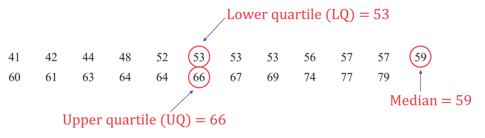
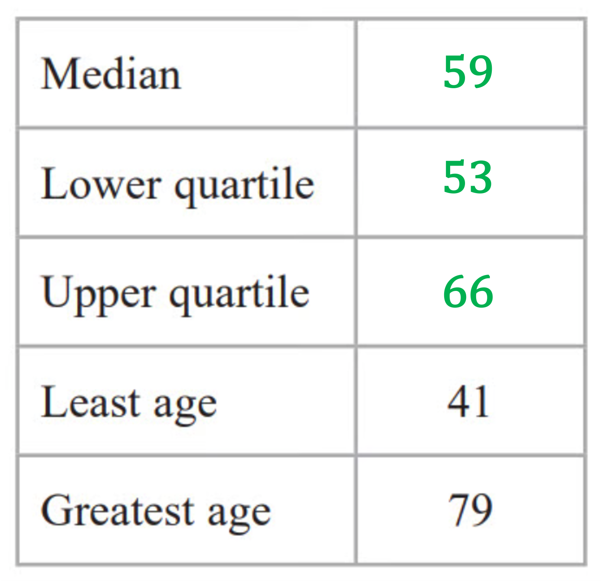
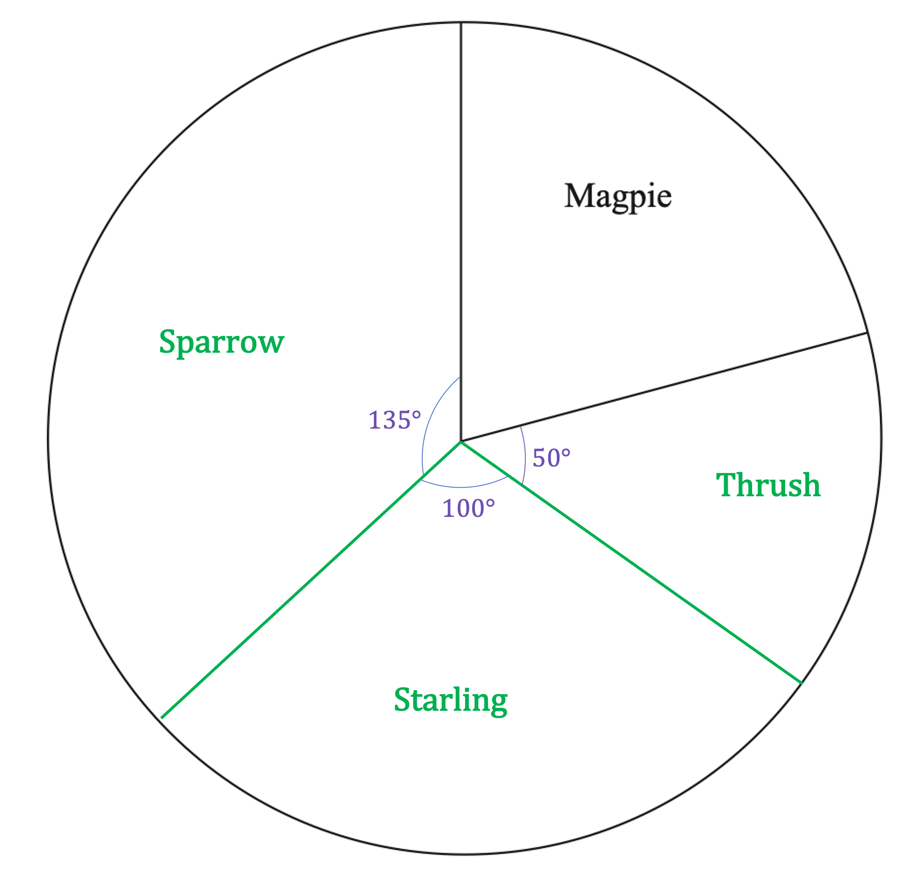
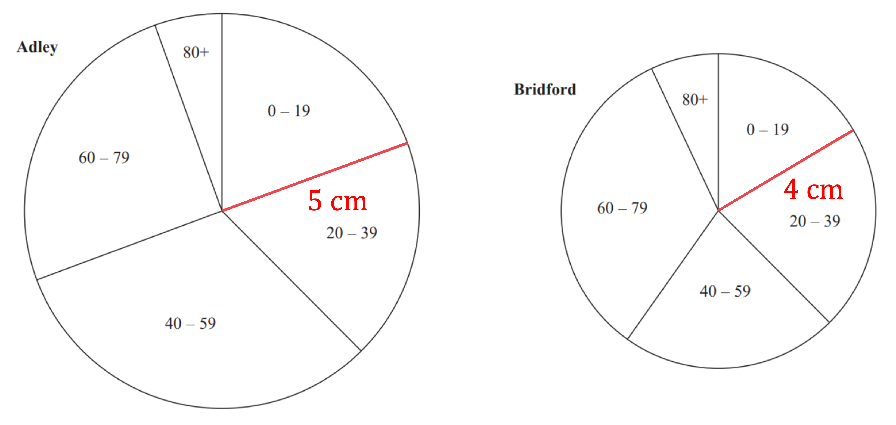
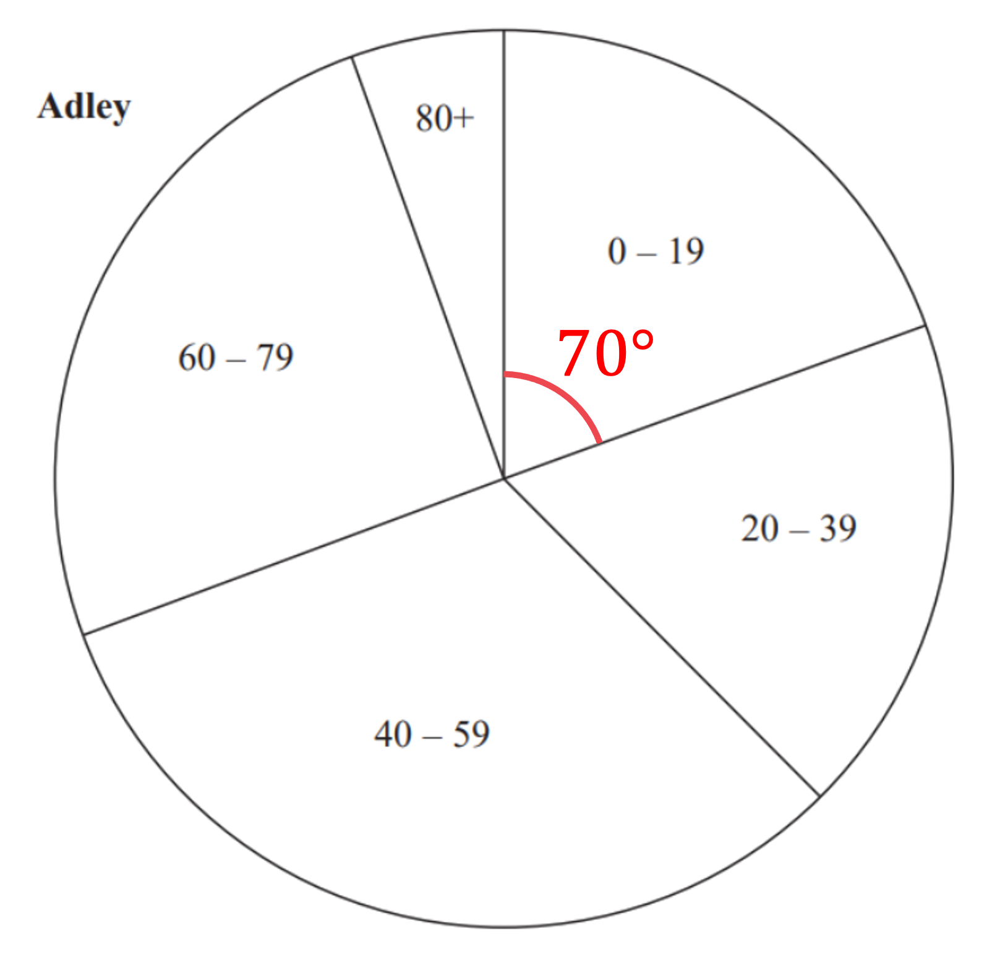
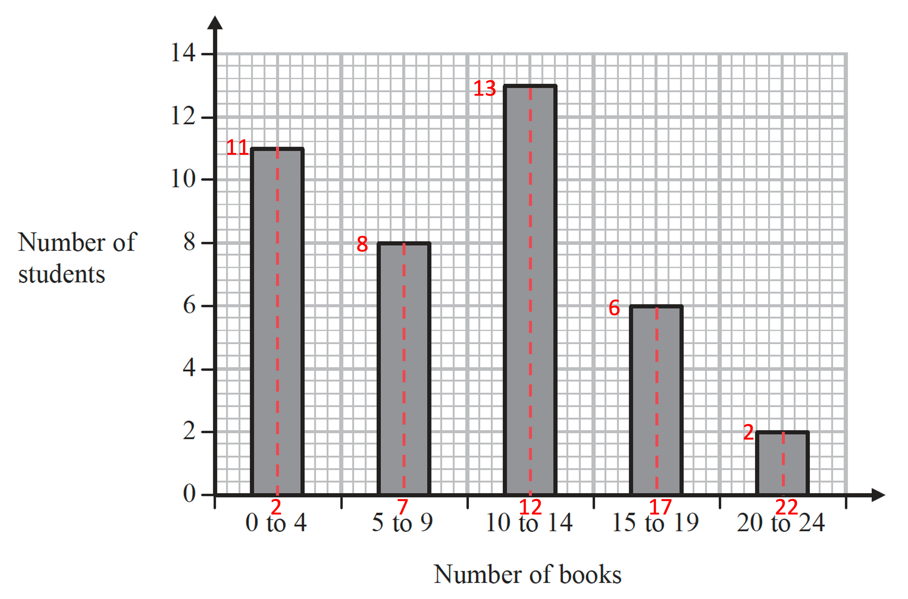

# Mark Schemes — Statistics Toolkit
**Statistics & Probability** · Edexcel IGCSE Maths A (4MA1) — 18/Higher

## Q1 — easy — 2 marks · exam-questions

### 12() — 2 marks
*There are 15 values* 
*The lower quartile is the *`open parentheses fraction numerator 15 plus 1 over denominator 4 end fraction close parentheses to the power of t h end exponent`* value, so the 4**th** value* * *

*lower quartile = 4* * *

*The upper quartile is the *`open parentheses 3 cross times fraction numerator 15 plus 1 over denominator 4 end fraction close parentheses to the power of t h end exponent`* value, so the 12**th** value* * *

*upper quartile = 13*

**both 4 and 13 selected ****[1]**

*The interquartile range is the upper quartile subtract the lower quartile*

*interquartile range = 13 - 4*

**9** **[1]**

## Q2 — easy — 2 marks · exam-questions

### 14() — 2 marks
*There are 11 values* 
*The lower quartile is the *`open parentheses fraction numerator 11 plus 1 over denominator 4 end fraction close parentheses to the power of t h end exponent`* value, so the 3**rd** value* * *

*lower quartile = 9* * *

*The upper quartile is the *`open parentheses 3 cross times fraction numerator 11 plus 1 over denominator 4 end fraction close parentheses to the power of t h end exponent`* value, so the 9**th** value* * *

*upper quartile = 16*

**both 9 and 16 selected ****[1]**

*The interquartile range is the upper quartile subtract the lower quartile*

*interquartile range = 16 - 9*

**7** **[1]**

## Q3 — easy — 2 marks · exam-questions

### 12() — 2 marks
*Write down a basic comparison of the medians and the IQRs (by saying which one is bigger)*

*the median for Science is greater than the median for Maths* 
*the IQR for Science is greater than the IQR for Maths*

**[1]**

*Now say what that means in context (by referring to the students and their marks)*

*medians refer to "on average"* 
*IQRs refer to "spread"*

**On average, the students have scored higher marks in Science than Maths     ** 
**The spread of marks in Science is greater than the spread of marks in Maths ****[1]**

**Another accepted way to say that Maths scores have a lower spread is "Maths scores are more consistent"**

## Q4 — easy — 1 marks · exam-questions

### 1() — 1 marks
> *The modal class is the interval of **p** which has the highest frequency  *

*the highest frequency is 19, when 0 < ***p ***≤ 1*

**0 < ****p**** ≤ 1**** ****[1]**

## Q5 — easy — 3 marks · exam-questions

### 7((b)) — 3 marks
*Find the lowest overall score in both classes (the smaller of the two lowest class scores)* * *

*lowest overall score is 33* * *

*The range is the difference between the highest and lowest values* *Find the highest score in Class A (by adding its range to its lowest score)* * *

*highest score in Class A = 39 + 57 = 96* * *

*Find the highest score in Class B (by adding its range to its lowest score)* * *

*highest score in Class B = 33 + 60 = 93*

**either class highest score correct**** [1]**

*Find the highest overall score in both classes (the larger of the two highest class scores)* *  *

*highest overall score is 96* * *

*Find the overall range (the highest overall score subtract the lowest overall score)*

*overall range = 96 - 33*

**subtracting 33 from your highest score**** [1]**

**63 ****[1]**

## Q6 — easy — 1 marks · exam-questions

### 2((a)) — 1 marks
> *The modal class is the interval of **s** which has the highest frequency  *

*the highest frequency is 23, when 70 < ***s ***≤ 80*

**70 < ****s**** ≤ 80**** ****[1]**

## Q7 — easy — 1 marks · exam-questions

### 6() — 1 marks
> *The modal class is the interval of **t** which has the highest frequency  *

*the highest frequency is 25, when 30 < ***t ***≤ 40*

**30 < ****t**** ≤ 40**** ****[1]**

## Q8 — easy — 4 marks · exam-questions

### 11() — 4 marks
*You need to work out the median and interquartile range of the Maths test results* 
*There are 15 values so the median is the *`open parentheses fraction numerator 15 plus 1 over denominator 2 end fraction close parentheses to the power of t h end exponent`* value (the 8th value)*

*median = 26*

**[1]**

*The lower quartile is the *`open parentheses fraction numerator 15 plus 1 over denominator 4 end fraction close parentheses to the power of t h end exponent`* value (the 4**th** value)* * *

*lower quartile = 20* * *

*The upper quartile is the *`open parentheses 3 cross times fraction numerator 15 plus 1 over denominator 4 end fraction close parentheses to the power of t h end exponent`* value (the 12**th** value)* * *

*upper quartile = 29*

*The interquartile range (IQR) is the upper quartile subtract the lower quartile*

*IQR = 29 - 20 = 9*

**[1]**

*Compare the medians and IQRs of the English test and the Maths test, using numbers in your answer*** **
*In particular, state in which test they did better "on average" (higher median) and which test had a greater "spread" of results (higher IQR)***  **

**The Maths test median, 26, is greater than the English test median, 21, so students did better in Maths on average**** [1]**

**The Maths test interquartile range, 9, is less than the English test interquartile range, 14, so there was a greater spread of results in the English test**** ****[1]**

**Another way to say the second comparison is that Maths results were more "consistent" than English results**

## Q9 — easy — 6 marks · exam-questions

### 8((a)) — 1 marks
*The foggy day is likely to make the visibility poor so fewer planes will land at that airport (for example, some flights may have been cancelled or redirected)*

**Day 8, as it had the lowest number of planes landing** **[1]**

### 8((b)) — 3 marks
*Find out how many planes land in 24 hours (a whole day) by multiplying 150 by *$\frac{24}{4}=6$ * *

*150 × 6 = 900 planes per day*

**[1]**

*Find out how many planes land in a year by multiplying 900 by 365 days in a year*

*900 × 365*

**[1]**

**328 500**** [1]**

**The answers 324 000, 327 600, 329400 and 333 000 are also accepted, depending on how you calculated a year**

### 8((c)) — 2 marks
> *Consider the first statement. Note that in the UK January is in winter.*

*Fewer landings in winter would make her prediction too low*

> *Consider the second statement.*

*Fewer landings at night would make her prediction too high*

**Both reasons given**** [1]**

**Her prediction could be too low or too high ****[1] **
**Must give reasons for both marks**

## Q10 — easy — 1 marks · exam-questions

### 15() — 1 marks
*The **first option can be eliminated**, as men had a lower average score (by comparing their medians)* * *

*The **third and fourth options can be eliminated**, as you are not given the highest or lowest scores (the range cannot be used to find them from this table)* * *

*Compare the interquartile ranges (IQR) and the ranges* * *

*the IQRs and ranges of men's scores are lower than those of women* * *

*A lower IQR, or lower range, means a lower spread of scores, so scores are "more consistent"*

**Men had more consistent scores than women** **[1]**

## Q11 — easy — 2 marks · exam-questions

### 20() — 2 marks
*The value 82 looks very high compared to the other numbers (an outlier)* 
*The mean requires adding up all the numbers up and dividing by 10 *

*the mean will be affected / skewed by the 82* * *

* The mode requires spotting the most occurring number* * *

*there is no mode as no number appears more than once* * *

*The median requires lining them up in order then picking the middle value*

*the middle value will not be affected / skewed by the 82 at the end*

**the median**** ****[1]**

**82 would skew the mean and there is no mode** **[1]**

## Q12 — easy — 3 marks · exam-questions

### 5() — 3 marks
*The mean, 10, is the sum of all six numbers divided by six, *$10=\frac{\mathrm{sum}}{6}$ 
*Find the sum of the six numbers* * *

*6 × 10 = 60* * *

*Subtract the four numbers given to find the sum of the missing two numbers* * *

*60 - 12 - 7 - 15 - 3 = 23*

**[1] **

*If 3 is the "lowest number", then the highest number must be 3 + 19 = 22 (from the range)* 
*22 would be a missing number, making the other missing number equal to 1 (they add to 23), but 1 is now lower than 3* * *

*3 cannot be the lowest number* * *

*This means the "lowest number" is one of the missing numbers* *So the two missing numbers sum to 23 and have a difference of 19* * *

*only 2 and 21 have a sum of 23 and difference of 19 * * *

**any two positive numbers than sum to 23**** [1]**

**Final answer:** **2 and 21**** [1]**

## Q13 — easy — 1 marks · exam-questions

### 6((b)) — 1 marks
*Multiply the midpoints by the number of trains and add these up* * *

*1× 12 + 3 × 0 + 5 × 7 + 7 × 0 + 9 × 0 + 11 × 1 = 58* * *

*Divide this by the total number of trains (12 + 7 + 1 = 20)*

$\frac{58}{20}$

**2.9 minutes**** [1]**

## Q14 — easy — 3 marks · exam-questions

### 14() — 3 marks
*The mean mass, 82 kg, is the sum of the 19 masses divided by 19, *$82=\frac{\mathrm{sum}}{19}$ 
*Work out the sum of the 19 masses* * *

*19 × 82 = 1558 kg*

**[1]**

*Add 93 kg to this sum* * *

*1558 + 93 = 1651 kg* * *

*There are now 20 players* *Divide this sum by 20 to get the new mean mass* * *

$\frac{1651}{20}$

**[1]**

**82.55 kg*** ***[1]**

**82.6 is also accepted**

## Q15 — easy — 4 marks · exam-questions

### 6() — 4 marks
*Before this data was grouped into a table, it would have been a list of 10 values *
*Imagine this list of values* 
*Only 1 value is between 0 and 20 while the other 9 values are over 20, so the mean cannot be less than 20*

**The mean could be less than 20 minutes: ****False** **[1]**

*If the 6 values between 20 and 40 are all near 40 and the 3 values between 40 and 60 are all near 60, the mean could be more than 40*

**The mean could be more than 40 minutes: ****True ****[1]**

*If the 6 values between 20 and 40 are all near 20 and the 3 values between 40 and 60 are all near 40, the mean could be less than 40*

**The mean could be less than 40 minutes: ****True ****[1]**

> *If the value between 0 and 20 is near to 0 and the highest value between 40 and 60 is near to 60, then the range is nearly 60  *

**The range could be more than 40 minutes: ****True**** ****[1]**

> *If the value between 0 and 20 is near to 20 and the highest value between 40 and 60 is near to 40, then the range is just over 20  *

**The range could be less than 40 minutes: ****True**** ****[1]**

> *If the value between 0 and 20 is near to 0 and the highest value between 40 and 60 is near to 60, then the range is nearly 60 but cannot exceed 60  *

**The range could be more than 60 minutes:**** False*** ***[1]**

**Note that using midpoints to calculate the mean only gives an estimate, not the actual mean**

## Q16 — easy — 2 marks · exam-questions

### 11() — 2 marks
> *Before this data was plotted on the chart, it would have been a list of 29 scores *
*For example, the score of 3 occurred 2 times, the score of 4 occurred 2 times, etc  *

*3, 3, 4, 4, 5, 5, 5, 5, 6, 6, 6, 6, 6, 6, 6, ...**  *

> *The median value is the *`open parentheses fraction numerator 29 plus 1 over denominator 2 end fraction close parentheses to the power of t h end exponent`* = 15**th** score  *

*the 15**th** score is 6*

**15th value identified ****[1]**

**Lucy's score is 6 ****[1]**

## Q17 — easy — 3 marks · exam-questions

### 1() — 3 marks
> *There are 4 numbers, call them **a, b, c, d*

> *For the mode to be 8, at least 2 of the numbers must be 8*

*8, 8,*** c, d**

> *For the mean to be 11, the sum of the numbers, when divided by 4 (as there are 4 numbers), must be 11*

$\frac{8+8+c+d}{4}=11$

> *Multiply both sides by 4 and simplify*

`table row cell 8 plus 8 plus c plus d end cell equals 44 row cell 16 plus space c plus d end cell equals 44 row cell c plus d end cell equals 28 end table`

> *The final fact is that the range (difference between largest and smallest number) is 7*

> *If we assume that 8 is the smallest number*

*8 + 7 = 15*

> *So the largest number could be 15*

> *As *$c+d=28$*, the final number could be 13, to sum to 28. This also does not change the fact that the range is 7, as the smallest is still 8, and the biggest is still 15.*

**8, 8, 13, 15**** ****[3]**

**1 mark for 1 condition met, 2 marks for 2 conditions met**

## Q18 — easy — 4 marks · exam-questions

### 6() — 4 marks
> *There are 4 numbers, call them **a, b, c, d*

> *For the mode to be 76, at least 2 of the numbers must be 76*

*76, 76, ***c, d**

> *For the mean to be 75, the sum of the numbers, when divided by 4 (as there are 4 numbers), must be 75*

$\frac{76+76+c+d}{4}=75$

> *Multiply both sides by 4 and simplify*

`table row cell 76 plus 76 plus c plus d end cell equals 300 row cell 152 plus space c plus d end cell equals 300 row cell c plus d end cell equals 148 end table`

> *The final fact is that the range (difference between largest and smallest number) is 10*

> *We could assume that c and d are the smallest and largest numbers respectively*

$d-c=10$

> *We can add the two equations, *$c+d=148$* and *$d-c=10$*, together*

`table row cell 2 d end cell equals 158 row d equals 79 end table`

> *As the range was 10*

$c=79-10=69$

**76, 76, 69, 79**** ****[4]**

**1 mark for range of 10 **
**1 mark for at least 2  values with a mode of 76 **
**1 mark for sum of 4 values equal to 300**

## Q19 — easy — 3 marks · exam-questions

### 2() — 3 marks
> *Multiply the midpoint of each group by the frequency*

$15\times5+45\times6+75\times8+105\times9+135\times2$

$=75+270+600+945+270$

**[M1 M1]**

> *Calculate the total*

**Final answer:** **2160**

**[A1]**

> **[mark-scheme]**
> **M1**: For at least four correct products. You do not need to add them for this mark.
> 
> **M1**: For adding together at least four correct products.
> 
> **A1**: Correct answer.

## Q20 — medium — 3 marks · exam-questions

### 6() — 3 marks
> *The **mean** is the **total** of the values divided by the **number** of values. *
*As a formula this may be written as *$\overline{x}=\frac{Σx}{n}$*.*

> *For this question*

> $\overline{x}=10$
* *$n=4$

> *Let the unknown number be *$x$*. Use the formula for the mean to set up an equation in *$x$*.*

`table row cell fraction numerator 12 plus 6 plus 15 plus x over denominator 4 end fraction end cell equals 10 end table`

**Correct equation ****[1]**

`table row cell x plus 33 end cell equals 40 row x equals cell 40 minus 33 end cell row x equals 7 end table`

**Method to solve the equation ****[1]**

**The number on the 4****th**** card is 7*** ***[1]**

## Q21 — medium — 2 marks · exam-questions

### 3((a)) — 1 marks
> *The position of the median is the *`open parentheses fraction numerator n plus 1 over denominator 2 end fraction close parentheses to the power of th`* value.*

$\frac{25+1}{2}=13$

> *So the dress size of the 13**th** woman is the median.  Looking at the frequencies we see that*

`table row cell 2 plus 9 end cell equals 11 row cell 11 plus 8 end cell equals 17 end table`

> *so the 13**th** woman will be in the "third row" and so have a dress size of 12.*

**The median dress size is 12** **[1]**

### 3((b)) — 1 marks
**Zoe is not correct as a woman could have both a shoe size of 7 and a dress size of 14.**
** These are not mutually exclusive so adding the probabilities is not appropriate ****[1]**

## Q22 — medium — 4 marks · exam-questions

### 1() — 4 marks
Find the median of the Geography test results

*7, 12, 13, 15 18, 19, 22, 22, 23, 29, 30, 31, 32, 34, 35*

*Median = 22*

Find the lower quartile and the upper quartile of the Geography test results

*LQ = Halfway of the first half of data = 15*
*UQ = Halfway of the second half of data = 31*

**[M1]**

Find the IQR

*31 - 15 = 16*

**[A1]**

Compare the IQR of Geography and History

**Final answer:** **Geography has a smaller IQR which means the Geography results are more consistent/History results are more spread out**

**[B1]**

Compare the medians

**Final answer:** **The median of Geography was 22 compared to the median of History which was 17, so Geography scores are higher on average**

**[B1]**

> **[exam-tip]**
> Make sure your answers are in context - you need to refer to the Geography/History tests in order to get both marks.

> **[mark-scheme]**
> **M1**: For finding at least one of:
> 
> - median
> - lower quartile
> - upper quartile
> 
> **A1**: For finding the IQR using your quartiles.
> 
> **B1**: Correct comparison of the IQRs.
> 
> **B1**: Correct comparison of the medians.

## Q23 — medium — 3 marks · exam-questions

### 3() — 3 marks
> *We can find the mean number of pairs of shoes sold per month using the time-series graph. *
*First read off the number of pairs of shoes sold in each month using the points on the graph.*
*Then, total these up and divide by the number of months.*

*Mean number of shoes sold per month *$=\frac{110+84+78+94+90+120}{6}=\frac{576}{6}=96$

**At least one correct reading from graph ****[1]** 
**Correct method to find the mean ****[1]**

> *Compare this result with the target given in the question.*

**The shoe shop did meet its sales target of selling a mean of 96 pairs of shoes per month*** ***[1]**

## Q24 — medium — 4 marks · exam-questions

### 11((a)) — 2 marks
> *the list of number sis already in order. To position of the median is given by*

`open parentheses fraction numerator n plus 1 over denominator 2 end fraction close parentheses to the power of th equals open parentheses fraction numerator 23 plus 1 over denominator 2 end fraction close parentheses to the power of th equals 24 to the power of th`

> *The positions of the lower quartile (LQ) and upper quartile (UQ) are given by*

*LQ: * `open parentheses fraction numerator n plus 1 over denominator 4 end fraction close parentheses to the power of th equals open parentheses fraction numerator 23 plus 1 over denominator 4 end fraction close parentheses to the power of th equals 6 to the power of th`* value UQ:  *`3 open parentheses fraction numerator n plus 1 over denominator 4 end fraction close parentheses to the power of th equals 3 open parentheses fraction numerator 23 plus 1 over denominator 4 end fraction close parentheses to the power of th equals 18 to the power of th`* value*

> *Counting carefully along the line of numbers we can find the values of the median and quartiles.*

> *And now we can complete the table.*

**One correct ****[1]**** **
**All three correct ****[1]**

### 11((b)) — 1 marks
> *Compare the medians.*

*70 (Coach B) > 59 (Coach A)*

**Richard is correct since the median age of people on coach A is 59 years, but 70 years on coach B.** 
**So on average, the people on coach A are younger. ****[1]**

### 11((c)) — 1 marks
*Compare the interquartile ranges for each coach (to measure spread).* *IQR = UQ - LQ.*

*Coach A: IQR = 66 - 53 = 13* 
*Coach B:  IQR = 73 - 54 = 19*

*19 (Coach B) > 13 (Coach A)*

**Richard is incorrect as the interquartile range for coach A (13 years) is less than the interquartile range for coach B (19 years).****  **
**Therefore, the people on coach B vary more in age. ****[1]**

## Q25 — medium — 3 marks · exam-questions

### 4() — 3 marks
> *First we need the total frequency so we can work out the angles required for each sector/bird.*

*15 + 10 + 20 + 27 = 72*

> *So 360° will represent 72 birds.  Divide 360° by 72 to find the number of degrees needed for one bird.*

*360° ÷ 72 = 5°*

> *Add another column to the table and find the angle for each bird by multiplying each frequency by 5°.*

| **Bird** | **Frequency** | ***Angle on pie chart*** |
|---|---|---|
| Magpie | 15 | *15 × 5° = 75°* |
| Thrush | 10 | *10 × 5° = 50°* |
| Starling | 20 | *20 × 5° = 100°* |
| Sparrow | 27 | *27 × 5° = 135°* |
| ***Total*** | ***72*** | ***360°*** |

**Correct calculation for one angle**** [1]** 
**One correct angle**** [1]**

> *Use protractor or angle measurer and ruler to carefully construct the pie chart - accuracy is important here.*

> *(Tip:  If you are using an angle measurer you could sum the angles up after each row and then mark all the angles in one go; these would be (75°), 125°, 225° and (360°) - it's a good way to check your calculations too!)*

**[1]**

## Q26 — medium — 3 marks · exam-questions

### 5((a)) — 3 marks
*There is more than one 8 (the mode)* 
*The median, 14, is the midpoint between the 3rd and 4th cards (so these cards cannot both be 8)* * *

*5,  8,  8,  ***x***,  ***y***,  24*

**[1]**

*If the midpoint between 8 and **x** is 14, then **x** is 20* * *

*5,  8,  8,  20,  ***y***,  24*

**[1]**

*y** cannot be 20 or 24, because 8 is meant to be the most occurring number (mode)* 
*The cards are in order of size, so **y **can be 21, 22 or 23* * *

**y*** is 21, 22 or 23*

**accepted answers are any out of "****5, 8, 8, 20, 21, 24****" or "****5, 8, 8, 20, 22, 24****" or "****5, 8, 8, 20, 23, 24****" ****[1]**

**You do not need to give all three possibilities**

## Q27 — medium — 3 marks · exam-questions

### 15() — 3 marks
*Write the list in ascending order*

*5,  5,  7,  8,  10,  12,  13,  14,  16,  21,  23*

**[1]**

*There are 11 values* *The lower quartile is the *`open parentheses fraction numerator 11 plus 1 over denominator 4 end fraction close parentheses to the power of t h end exponent`* value, so the 3**rd** value* * *

*lower quartile = 7* * *

*The upper quartile is the *`open parentheses 3 cross times fraction numerator 11 plus 1 over denominator 4 end fraction close parentheses to the power of t h end exponent`* value, so the 9**th** value* * *

*upper quartile = 16*

**both 7 and 16 identified ****[1]**

*The interquartile range is the upper quartile subtract the lower quartile*

*interquartile range = 16 - 7*

**9** **[1]**

## Q28 — medium — 4 marks · exam-questions

### 5() — 4 marks
*80 is the most occurring number (the mode), so at least one other 80 is needed* * *

*68,  72,  75,  77,  80,  80*

**another 80 seen**** [1]**

*For a list of 8 results, the median, 74, is the *`open parentheses fraction numerator 8 plus 1 over denominator 2 end fraction close parentheses to the power of t h end exponent`* = 4.5th value (the midpoint between the 4th and 5th value)* 
*74 is not the midpoint of 72 and 75, so the value 73 is needed (there cannot be two 74s in the middle, as this would conflict with 80 being the mode)* * *

*68,  72,  73,  75,  77,  80,  80*

**73 seen**** [1]**

*The current range is 80 - 68 = 12, but the range is meant to be 16* *80 - 16 = 64 is needed on the left to give the correct range and keep the median between 73 and 75 (adding 84 to the right shifts the median to between 75 and 77)* * *

*80 - 16*

**correctly using the range**** [1]**

> *Answer the question by writing out the marks for these three tests*

**64, 73, 80*** ***[1]**

## Q29 — medium — 4 marks · exam-questions

### 2() — 4 marks
*The mode is the most occurring number, so **a** = 7* ** **

*7, 7, ***b***, ***c**

**[1]**

> *There are four values, so the median, 8.5,  is the midpoint between the 2nd value, 7,  and the 3rd value, **b *
*7 + 1.5 = 8.5, so 8.5 + 1.5 = 10*

*7, 7, 10, ***c**

**[1]**

*The mean of the four numbers is 9, so the sum of the four numbers divided by 4 equals 9* ** **

$\frac{7+7+10+c}{4}=9$

**[1]**

*Multiply both sides by 4 and use that 7 + 7 + 10 = 24* * *

`table row cell 7 plus 7 plus 10 plus c end cell equals 36 row cell 24 plus c end cell equals 36 end table` * *

*Solve the equation to find **c** (by subtracting 24 from both sides)* ** **

$c=36-24$

**a**** = 7, ****b ****= 10, ****c**** = 12 ****[1]**

## Q30 — medium — 4 marks · exam-questions

### 18((a)) — 3 marks
*Write the list in ascending order*

*35,  37,  38,  39,  41,  42,  43,  44,  45,  47,  47*

**[1]**

*There are 11 values* 
*The lower quartile is the *`open parentheses fraction numerator 11 plus 1 over denominator 4 end fraction close parentheses to the power of t h end exponent`* value, so the 3**rd** value* * *

*lower quartile = 38* * *

*The upper quartile is the *`open parentheses 3 cross times fraction numerator 11 plus 1 over denominator 4 end fraction close parentheses to the power of t h end exponent`* value, so the 9**th** value* * *

*upper quartile = 45*

**both 38 and 45 identified ****[1]**

*The interquartile range is the upper quartile subtract the lower quartile*

*interquartile range = 45 - 38*

**7** **[1]**

### 18((b)) — 1 marks
*Results being "more consistent" means having less spread* *The interquartile range (IQR) measures how spread out the values are, so choose the month with the lowest IQR* * *

*January IQR = 7 < May IQR = 12* * *

**January, as the interquartile range is lower (7 < 12)*** ***[1]**

## Q31 — medium — 1 marks · exam-questions

### 9() — 1 marks
*Investigate a value of **n**, for example **n** = 5 *
*Write out 5 consecutive numbers* * *

*1, 2, 3, 4, 5* * *

*Find the range of these numbers (highest - lowest)* * *

*range = 5 - 1 = 4* * *

*The range of 5 consecutive numbers is 4 (which is 1 less than 5)* *So the range of **n** consecutive numbers is **n** - 1*

**n ****- 1** **[1]**

## Q32 — medium — 1 marks · exam-questions

### 7() — 1 marks
*Of the 40 people, the median is the *`open parentheses fraction numerator 40 plus 1 over denominator 2 end fraction close parentheses to the power of t h end exponent`* = 20.5**th** person's time* 
*20.5 is between 20 and 21, so it's easier to find the class interval in which the *
*20th person and the 21st person lie*

**t*** ≤ 5 has 3 people* 
**t*** ≤ 10 has 3 + 9 = 12 people*
 **t*** ≤ 15 has 3 + 9 + 11 = 23 people*

*The 20th person and 21st person lie in the 10 < **t** ≤ 15 class interval*

**10 < ****t**** ≤ 15** **[1]**

## Q33 — medium — 3 marks · exam-questions

### 7() — 3 marks
*The mean mark of boys, 68.5, is the sum of the boys' marks divided by 102, *$68.5=\frac{\mathrm{boys} \mathrm{sum}}{102}$ 
*Find the sum of the boys' marks (by multiplying 68.5 by 102)* * *

*68.5 × 102 = 6987*

**[1]**

> *The mean mark of girls, 72.4, is the sum of the girls' marks divided by 85, *$72.4=\frac{\mathrm{girls} \mathrm{sum}}{85}$

*Find the sum of the girls' marks (by multiplying 72.4 by 85)* * *

*72.4 × 85 = 6154* * *

*The mean mark of all students is the sum of all the students' marks, 6987 + 6154, divided by 187, from 102 + 85* * *

$\frac{6987+6154}{102+85}\,=\frac{13141}{187}\,=70.27...$

**first line of working correct**** [1] **

*This mean mark is greater than the pass mark of 70* * *

**Yes, ****the mean mark of all students, ****70.27 ****(to 2 dp), is greater than the pass mark, 70*** ***[1]**

**Rounding 70.3, or better accuracy, is accepted**

## Q34 — medium — 3 marks · exam-questions

### 12() — 3 marks
> *Before this data was put into a table, it would have been a list of 26 values *
*For example, 1 bedroom occurred 7 times, 2 bedrooms occurred "**a**" times, 5 bedrooms occurred 8 times, etc  *

*1, 1, 1, 1, 1, 1, 1, 2, 2, ... 2, 3, 3, ..., 3, 4, 4, ..., 4, 5, 5, 5, 5, 5, 5, 5, 5**  *

*The median value is the *`open parentheses fraction numerator 26 plus 1 over denominator 2 end fraction close parentheses to the power of t h end exponent`* = 13.5**th** score, the midpoint of the 13**th** and 14**th** value *
*If the median is 3.5, then the first half of the list is 1, 1, ..., 3, 3 and the second half of the list is 4, 4, ..., 5, 5 *
*The second half of the list has 13 values, made up of **c** lots of 4 and 8 lots of 5 *** **

** **`table row cell c plus 8 end cell equals 13 row c equals 5 end table`

**[1]**

> *The first half of the list has 13 values, made up of 7 lots of 1, **a** lots of 2 and **b** lots of 3  *

`table row cell 7 plus a plus b end cell equals 13 row cell a plus b end cell equals 6 end table`

**[1]*** *

> *a**, **b** and **c** are all integers and you're told they are all different This means **a** and **b** cannot both be 3 and neither **a** nor **b** can be 5 (because **c** = 5)  *

**a*** and ***b*** can only take the values of 2 and 4, or 4 and 2, or 0 and 6  *

*Be careful, as **b** cannot equal 0, otherwise there are no 3s in the list (you need at least one 3 for the median to be 3.5)**  *

**any out of ****a**** = 2, ****b**** = 4, ****c ****= 5,**** or ****a**** = 4, ****b**** = 2, ****c ****= 5, ****or ****a**** = 0, ****b**** = 6, ****c ****= 5 ****[1]**** **

## Q35 — medium — 3 marks · exam-questions

### 13() — 3 marks
> *Fill in the midpoints of the time intervals*

| > *Time, t (mins)* | > *Frequency* | > *Midpoint* |   |
|---|---|---|---|
| `0 space less-than or slanted equal to space t space less than space 30` | > *24* | *15* |   |
| `30 space less-than or slanted equal to space t space less than space 50` | > *76* | *40* |   |
| `50 space less-than or slanted equal to space t space less than space 60` | > *52* | *55* |   |
| `60 space less-than or slanted equal to space t space less than space 90` | > *48* | *75* |   |
|   | > *Total = 200* |   |   |

> *Multiply the frequencies by the midpoints to fill in the final column*

| > *Time, t (mins)* | > *Frequency* | > *Midpoint* |   |
|---|---|---|---|
| `0 space less-than or slanted equal to space t space less than space 30` | > *24* | > *15* | *24 × 15 = 360* |
| `30 space less-than or slanted equal to space t space less than space 50` | > *76* | > *40* | *76 × 40 = 3040* |
| `50 space less-than or slanted equal to space t space less than space 60` | > *52* | > *55* | *52 × 55 = 2860* |
| `60 space less-than or slanted equal to space t space less than space 90` | > *48* | > *75* | *48 × 75 = 3600* |
|   | > *Total = 200* |   |   |

**[1]**

> *Calculate the sum of the final column*

| > *Time, t (mins)* | > *Frequency* | > *Midpoint* |   |
|---|---|---|---|
| `0 space less-than or slanted equal to space t space less than space 30` | > *24* | > *15* | > *24 × 15 = 360* |
| `30 space less-than or slanted equal to space t space less than space 50` | > *76* | > *40* | > *76 × 40 = 3040* |
| `50 space less-than or slanted equal to space t space less than space 60` | > *52* | > *55* | > *52 × 55 = 2860* |
| `60 space less-than or slanted equal to space t space less than space 90` | > *48* | > *75* | > *48 × 75 = 3600* |
|   | > *Total = 200* |   | *Total = 9860* |

*Work out an estimate of the mean time by dividing the final column total by the total of the frequencies*

$\frac{9860}{200}$

**[1]**

**49.3 ****mins**** ****[1]**

## Q36 — medium — 3 marks · exam-questions

### 8() — 3 marks
> *Fill in the midpoints of the intervals  *

| > *Distance, *$x$* (miles)* | > *Frequency* | ***Midpoint*** |   |
|---|---|---|---|
| `0 space less than space x space less-than or slanted equal to space 5` | > *20* | *2.5* |   |
| `5 space less than space x space less-than or slanted equal to space 10` | > *48* | *7.5* |   |
| `10 space less than space x space less-than or slanted equal to space 15` | > *30* | *12.5* |   |
| `15 space less than space x space less-than or slanted equal to space 20` | > *22* | *17.5* |   |
|   | > *Total = 120* |   |   |

> *Multiply the frequencies by the midpoints to fill in the final column  *

| > *Distance, *$x$* (miles)* | > *Frequency* | > *Midpoint* |   |
|---|---|---|---|
| `0 space less than space x space less-than or slanted equal to space 5` | > *20* | > *2.5* | *20 × 2.5 = 50* |
| `5 space less than space x space less-than or slanted equal to space 10` | > *48* | > *7.5* | *48 × 7.5 = 360* |
| `10 space less than space x space less-than or slanted equal to space 15` | > *30* | > *12.5* | *30 × 12.5 = 375* |
| `15 space less than space x space less-than or slanted equal to space 20` | > *22* | > *17.5* | *22 × 17.5 = 385* |
|   | > *Total = 120* |   |   |

> *Calculate the sum of the final column  *

| > *Distance, *$x$* (miles)* | > *Frequency* | > *Midpoint* |   |
|---|---|---|---|
| `0 space less than space x space less-than or slanted equal to space 5` | > *20* | > *2.5* | > *20 × 2.5 = 50* |
| `5 space less than space x space less-than or slanted equal to space 10` | > *48* | > *7.5* | > *48 × 7.5 = 360* |
| `10 space less than space x space less-than or slanted equal to space 15` | > *30* | > *12.5* | > *30 × 12.5 = 375* |
| `15 space less than space x space less-than or slanted equal to space 20` | > *22* | > *17.5* | > *22 × 17.5 = 385* |
|   | > *Total = 120* |   | *Total = 1170* |

**[1]**

*Work out an estimate of the mean by dividing the final column total by the total of the frequencies*

$\frac{1170}{120}$

**[1]**

**9.75 ****miles**** ****[1]**

## Q37 — medium — 5 marks · exam-questions

### 3((a)) — 4 marks
> *Fill in the midpoints of the intervals  *

| *Time taken* *(*$t$* minutes)* | *Number of* *customers* | *midpoints* |   |
|---|---|---|---|
| `0 space less than space t space less-than or slanted equal to space 3` | > *6* | *1.5* |   |
| `3 less than space t space less-than or slanted equal to space 6` | > *10* | *4.5* |   |
| `6 space less than space t space less-than or slanted equal to space 9` | > *6* | *7.5* |   |
| `9 space less than space t space less-than or slanted equal to space 12` | > *2* | *10.5* |   |
| `12 space less than space t space less-than or slanted equal to space 15` | > *1* | *13.5* |   |

**at least 4 correct**** [1]**

> *Multiply the frequencies (Number of customers) by the midpoints to fill in the final column  *

| *Time taken* *(*$t$* minutes)* | *Number of* *customers* | > *midpoints* |   |
|---|---|---|---|
| `0 space less than space t space less-than or slanted equal to space 3` | > *6* | > *1.5* | *6 × 1.5 = 9* |
| `3 less than space t space less-than or slanted equal to space 6` | > *10* | > *4.5* | *10 × 4.5 = 45* |
| `6 space less than space t space less-than or slanted equal to space 9` | > *6* | > *7.5* | *6 × 7.5 = 45* |
| `9 space less than space t space less-than or slanted equal to space 12` | > *2* | > *10.5* | *2 × 10.5 = 21* |
| `12 space less than space t space less-than or slanted equal to space 15` | > *1* | > *13.5* | *1 × 13.5 = 13.5* |

**at least 4 correct ****[1]**

> *Calculate the sum of the second and fourth columns  *

| *Time taken* *(*$t$* minutes)* | *Number of* *customers* | > *midpoints* |   |
|---|---|---|---|
| `0 space less than space t space less-than or slanted equal to space 3` | > *6* | > *1.5* | > *6 × 1.5 = 9* |
| `3 less than space t space less-than or slanted equal to space 6` | > *10* | > *4.5* | > *10 × 4.5 = 45* |
| `6 space less than space t space less-than or slanted equal to space 9` | > *6* | > *7.5* | > *6 × 7.5 = 45* |
| `9 space less than space t space less-than or slanted equal to space 12` | > *2* | > *10.5* | > *2 × 10.5 = 21* |
| `12 space less than space t space less-than or slanted equal to space 15` | > *1* | > *13.5* | > *1 × 13.5 = 13.5* |
|   | *Total = 25* | > * * | *Total = 133.5* |

*Work out an estimate of the mean time by dividing the final column total by the total of the frequencies (Number of customers)*

$\frac{133.5}{25}$

**[1]**

**5.34 ****minutes**** ****[1]**

### 3((b)) — 1 marks
*The exact value of the mean can only be calculated from a list of all the exact times taken* 
*The times, however, have been "grouped" together into a table, so their exact values have been lost*

**Exact times for each customer are not recorded ****[1]**

**Saying "because midpoints are used", or any other comments about the method in part (a), are not accepted **

## Q38 — medium — 5 marks · exam-questions

### 2() — 5 marks
*i) Use the first empty column to write in the midpoint of the grouped data for speed* *Use the second empty column to calculate the frequency (number of vehicles) multiplied by the midpoint*

| **Speed (s mph)** | **Number of** **vehicles** | *Midpoint* | *Frequency × Midpoint* |
|---|---|---|---|
| `0 space less than space s space less-than or slanted equal to 20` | 5 | *10* | *5 × 10 = 50* |
| `20 space less than space s space less-than or slanted equal to 40` | 8 | *30* | *8 × 30 = 240* |
| `40 space less than space s space less-than or slanted equal to 50` | 37 | *45* | *37 × 45 = 1665* |
| `50 space less than space s space less-than or slanted equal to 60` | 47 | *55* | *47 × 55 = 2585* |
| `60 space less than space s space less-than or slanted equal to 80` | 3 | *70* | *3 × 70 = 210* |

**Midpoints ****[1]*** *
**Frequency × Midpoints**** [1]**

> *Now find the sum of the Frequency × Midpoint column, this is equivalent to the speeds of every vehicle added up*

*50 + 240 + 1665 + 2585 + 210 = 4750*

> *Divide this by the total number of vehicles, which is the sum of the Number of Vehicles column*

*Total vehicles = 5 + 8 + 37 + 47 + 3 = 100*

*Mean = *$\frac{4750}{100}$* *

**[1]**

**47.5 mph** **[1]**

> *ii)  *

**We cannot know the exact value of the mean as the data is grouped****; for example the 5 vehicles in the **$0<s\leq20\mathrm{mph}$** group could be 5 vehicles at 1mph, or 5 at 20 mph, or an even spread throughout the group. ****When we use the midpoint, we are assuming the data is evenly spread through the group; which it may not be.** **[1]**

## Q39 — medium — 4 marks · exam-questions

### 19((b)) — 1 marks
**It is ****not possible**** to determine if Ceri is ****correct or not      ****The longest time lies ****between 40 and 80**** but the ****exact value is not known**** [1]**

### 19((c)) — 3 marks
i) *Ceri could have halved the frequency of 20 to 40 to get the frequency of 30 to 40. Add this to the frequency of 40 to 80 to get the number of people that took more than 30 minutes.*

$\frac{44}{2}+20=42$

**[1]**

> *Write this as a percentage of the total.*

`42 over 168 cross times 100 percent sign equals 25 percent sign`

**25%**** of all of the students at this Academy took ****more than 30 minutes** **[1]**

ii)

**Ceri is assuming that the times in the interval **$20<t\leq40$** are**** evenly distributed ****[1] **
**It is also acceptable to state that the sample may not be representative of the Academy's distribution **

## Q40 — medium — 3 marks · exam-questions

### 7() — 3 marks
> *Calculate the total number of runs played in the 7 games of cricket by multiplying the number of games by the mean*

$7\times42=294$

**[M1]**

> *Calculate the total number of runs required in 8 games of cricket to give a mean of 50*

$8\times50=400$

> *Calculate the difference between the total number of runs in 7 games of cricket and in 8 games of cricket*

$400-294=106$

**[M1]**

**Final answer:** **106**

**[A1]**

> **[mark-scheme]**
> **M1**: Calculating the total number of runs in 7 games of cricket *or* 8 games of cricket will get the first mark (e.g. $7\times42$ *or* $8\times50$).
> 
> **M1**: Awarded for the correct subtraction calculation for calculating the difference between total runs for 7 and 8 games.
> 
> **A1**: Correct answer of 106.

## Q41 — medium — 4 marks · exam-questions

### 11() — 4 marks
> **[exam-tip]**
> The question does not tell you to calculate the median and interquartile range for the 'maths test results', but it does ask you to 'compare' the data for both sets of test results.
> 
> The median and interquartile range have been provided for the English test results. This is a hint that you should calculate these values for the maths results as well, so comparisons can be made directly.

> *Calculate the median for the maths tests results (the data is already in ascending order so you just need to work out the value that lies in the middle)*

*18** **18** **19** **20** **24** **25** **25** 26 **28** **28** **29** **29** **29** **30** **30*

*Median=26*

**[M1]**

> *Work out the lower quartile (LQ), by finding the 'middle value' of the data points that lie below the median*

*18**  **18**  **19**  20  **24**  **25**  **25*

*Lower quartile=20*

> *Work out the upper quartile (UQ), by finding the 'middle value' of the data points that lie above the median*

*28**  **28**  **29**  29  **29**  **30**  **30*

*Upper quartile=29*

> *Calculate the interquartile range (IQR), by subtracting the lower quartile from the upper quartile*

$29-20=9$

**[A1]**

> *Write two sentences that compare the median and IQR for the English and Maths results*

**Final answer:** **The median for Maths (26) was higher than the median for English (21) therefore the maths results were higher on average.**

**[B1]**

**Final answer:** **The IQR for English (14) was higher than the IQR for maths (9) therefore the English results were more spread out.**

**[B1]**

> **[mark-scheme]**
> **M1**: This mark is awarded for working out the correct value of the median *or *the upper quartile *or *the lower quartile.
> 
> **A1**: You need to correctly calculate both the median as 26 and the IQR as 9 to gain this mark.
> 
> **B1**: You need to give a correct comparison of the median for English and Maths to gain this mark (e.g. the Maths results were higher on average *or* the English results were lower on average).
> 
> **B1**: You need to give a correct comparison of the IQR for English and Maths to gain this mark (e.g. the Maths results were less spread out *or* the Maths results were more consistent)

> **[exam-tip]**
> In order to gain both the B1 marks, you need to make sure that at least one of your comparisons refers to the context of the question. For example, the statement below will only gain one of the B1 marks:
> 
> 'The median for maths was higher and the interquartile range for English was higher'.
> 
> This is because the statement about the median does not refer to the maths results being higher on average, or the statement about the IQR for English being higher does not refer to the English results being more spread out.

## Q42 — medium — 2 marks · exam-questions

### 10() — 2 marks
> *Find the median (middle) of the list, the 8th number*

*7    10    14    15    16    17     18    **<u>19</u>**    20     20     23    25    30    39    40*

*Median = 19*

> *Then find the middle of the numbers below 19 for the lower quartile*

*7    10    14    **<u>15</u>**    16    17     18*

*Lower quartile = 15*

> *Then find the middle of the numbers above 19 for the upper quartile*

*20     20     23    **<u>25</u>**    30    39    40*

*Upper quartile = 25*

**[M1]**

> *Subtract the lower quartile from the upper quartile to find the interquartile range*

*25 - 15*

**Final answer:** **10**

**[A1]**

## Q43 — medium — 4 marks · exam-questions

### 10() — 4 marks
> *Calculate how many points team A scored in total in their 11 games*

$17\times11=187$

> *Calculate how many points team B scored in total in their 9 games*

$18\times9=162$

**[M1]**

> *Calculate how many points team A scored in total after 12 games to get a mean of 18.5, and subtract the points from the first 11 games to get how many they scored in the 12th game*

$18.5\times12-187=35$

> *Calculate how many points team B scored in total after 10 games to get a mean of 18.5, and subtract the points from the first 9 games to get how many they scored in the 10th game*

$18.5\times10-162=23$

**[M1]**

> *Calculate the difference in the two scores*

$35-23=12$

**[M1]**

**Final answer:** **12**

**[A1]**

## Q44 — medium — 4 marks · exam-questions

### 1((a)) — 1 marks
> *The modal class is the one with the highest frequency*

$25<m\leq30$

**[B1]**

### 1((b)) — 3 marks
> *Multiply the midpoint of each interval by the frequency and add together*

$2.5\times8+7.5\times2+12.5\times6+17.5\times4+22.5\times12+27.5\times8=945$

**[M1 M1]**

$945$

**[A1]**

> **[mark-scheme]**
> **M1: **For products using the frequency and a consistent value within the range, and an attempt to add. Or the correct products using midpoints without addition.
> 
> **M1: **For correct products using midpoints and adding.
> 
> **A1: **Correct answer.

## Q45 — medium — 2 marks · exam-questions

### 13() — 2 marks
> *The** **interquartile range (IQR) is the difference between the upper quartile (UQ) and the lower quartile (LQ)*

> *8 is the median so find the median of the lower half and the upper half*

`1 space space space space space 2 space space space space space circle enclose 4 space space space space space 6 space space space space space 6 space space space space space space circle enclose 8 space space space space space 11 space space space space space 12 space space space space circle enclose 13 space end enclose space space space 14 space space space space 17`

**[M1]**

$\mathrm{IQR}=\mathrm{UQ}-\mathrm{LQ}$

$\mathrm{IQR}=13-4=9$

$9$

**[A1]**

## Q46 — hard — 3 marks · exam-questions

### 13() — 3 marks
> *In this case, the mean score will be given by the formula*

`Mean space score space open parentheses x with bar on top close parentheses equals fraction numerator Total space points space open parentheses T close parentheses over denominator Number space of space games space open parentheses n close parentheses end fraction`

> *From the first piece of information*

`table attributes columnalign right center left columnspacing 0px end attributes row 35 equals cell T over 10 end cell row T equals 350 end table`

**[1]**

> *Now looking at the 11 games, and calling the number of points scored in the 11th game *$x$*,*

$33=\frac{350+x}{11}$

> *Solve this equation to find *$x$*.*

`table attributes columnalign right center left columnspacing 0px end attributes row 363 equals cell 350 plus x end cell row x equals cell 363 minus 350 end cell end table`

**[1]**

`table row x equals 13 end table`

**The team scored 13 points in the 11th game ****[1]**

## Q47 — hard — 3 marks · exam-questions

### 13() — 3 marks
> *In this case, the mean number of sweets per box will be given by the formula*

`Mean space number space of space sweets space open parentheses x with bar on top close parentheses equals fraction numerator Total space number space of space sweets space open parentheses S close parentheses over denominator Number space of space packets space and backslash or space boxes space open parentheses n close parentheses end fraction`

> *The first piece of information concerns all 30 of the packets and boxes combined.*

`table attributes columnalign right center left columnspacing 0px end attributes row 14 equals cell T over 30 end cell row T equals 420 end table`

**[1]**

> *The second piece of information conerns just the 18 packets of sweets.*

`table row 10 equals cell T over 18 end cell row T equals 180 end table`

**[1]**

> *Subtract to find the total number of sweets in the boxes only.*

$420-180=240$

> *So the boxes contain a total of 240 sweets; there are 12 boxes, so we can find the mean.*

`table row cell x with bar on top end cell equals cell 240 over 12 equals 20 end cell end table`

**The mean number of sweets in the boxes is 20 ****[1]**

## Q48 — hard — 3 marks · exam-questions

### 16() — 3 marks
> *In this case, the mean age will be given by the formula*

`Mean space age space open parentheses x with italic bar on top close parentheses equals fraction numerator Total space of space the space ages space open parentheses T close parentheses over denominator Number space of space children space open parentheses n close parentheses end fraction`

> *From the first piece of information*

`table row 7 equals cell T over 15 end cell row T equals 105 end table`

**[1]**

> *Using the information about just the boys*

`table row 5 equals cell T over 9 end cell row T equals 45 end table`

> *Subtract to find the total of the girls' ages.*

`table attributes columnalign right center left columnspacing 0px end attributes row cell 105 minus 45 end cell equals 60 end table`

*We now know the total of the girls' ages, and the number of girls (**15 - 9 = 6**), so we can find the mean.*

`table row cell x with bar on top end cell equals cell 60 over 6 end cell end table`

**[1]**

`table row cell x with bar on top end cell equals 10 end table`

**The mean age of the girls is 10 years ****[1]**

## Q49 — hard — 3 marks · exam-questions

### 7() — 3 marks
> *In this case, the mean mark will be given by the formula*

`Mean space mark space open parentheses x with bar on top close parentheses equals fraction numerator Total space of space the space marks space open parentheses T close parentheses over denominator Number space of space boys space and backslash or space girls space open parentheses n close parentheses end fraction`

> *From the first piece of information*

`table row 60 equals cell fraction numerator T over denominator 10 plus 20 end fraction end cell row T equals cell 60 cross times 30 end cell row T equals 1800 end table`

**[1]**

> *Using the information about just the girls*

`table row 54 equals cell T over 20 end cell row T equals 1080 end table`

> *Subtract to find the total of the boys' marks.*

`table row cell 1800 minus 1080 end cell equals 720 end table`

> *We now know the total of the boys' marks, and the number of boys is given in the question, so we can find the mean.*

`table row cell x with bar on top end cell equals cell 720 over 10 end cell end table`

**[1]**

`table row cell x with bar on top end cell equals 72 end table`

**The mean mark for the boys is 72 ****[1]**

## Q50 — hard — 4 marks · exam-questions

### 1() — 4 marks
Multiply the mean by the number of games to calculate the total points for the first 3 games

$3\times63=189$

Multiply the mean by the numbers of games to calculate the total points for the next 7 games

$7\times84=588$

**[M1]**

Multiply the mean by the total number of games to get the total number of points

$11\times76=836$

**[M1]**

Find the difference between the number of points in 10 games and 11 games

`836 space minus space open parentheses 588 plus 189 close parentheses space equals space 59 space`

**[M1]**

**Final answer:** **59 points**

**[A1]**

> **[mark-scheme]**
> **M1: **For finding the total number of points for either the first 3 games or the next 7 games.
> 
> **M1: **For finding the total number of points for all 11 games.
> 
> **M1: **For subtracting the number of points for the first 10 games away from all 11 games.
> 
> **A1: **Correct answer.

## Q51 — hard — 3 marks · exam-questions

### 9() — 3 marks
> *In this case, the mean score will be given by the formula*

`Mean space score space open parentheses x with bar on top close parentheses equals fraction numerator Total space points space open parentheses T close parentheses over denominator Number space of space games space open parentheses n close parentheses end fraction`

> *From the first piece of information*

`table row 33 equals cell T over 11 end cell row T equals 363 end table`

**[1]**

> *Similarly, from the second piece of information*

`table row cell 33 plus 2 end cell equals cell T over 10 end cell row T equals 350 end table`

> *The difference between the two points' totals will be the number of points scored in the 11**th** game.*

> * *$363-350=13$

**Jordan is correct, the Walkden Reds must've scored 13 points in their 11****th**** game ****[1]**

## Q52 — hard — 2 marks · exam-questions

### 13() — 2 marks
> *In this case, the mean mark will be given by the formula*

`Meam space mark space open parentheses x with bar on top close parentheses equals fraction numerator Total space marks space open parentheses T close parentheses over denominator Number space of space boys space and backslash or space girls space open parentheses n close parentheses end fraction`

> *From the first piece of information regarding the girls*

`table row 70 equals cell T over 10 end cell row T equals 700 end table`

> *From the second piece of information regarding the boys*

`table attributes columnalign right center left columnspacing 0px end attributes row 80 equals cell T over 15 end cell row T equals 1200 end table`

> *Adding these will give us the total score for the whole class.  i.e. the boys and girls combined. *
*We can also work out the total number of boys and girls in the whole class.*

`table row cell 700 plus 1200 end cell equals 1900 row cell 10 plus 15 end cell equals 25 end table`

> *We can now find the mean for the whole class.*

`table row cell x with bar on top end cell equals cell 1900 over 25 end cell row cell x with bar on top end cell equals 76 end table`

**Correct mean**** [1]**

**The mean mark (for the whole class) is 76% and so is greater than 75%  ****[1]**

## Q53 — hard — 4 marks · exam-questions

### 13() — 4 marks
> *To estimate the mean, we first need to add two columns to the table - one for the midpoints of the class intervals and one for the product of the frequencies (**f**) and the midpoints (**x**).*

> *To find the midpoints, add the upper and lower class boundaries, then divide by 2. *
*This is the same as finding the mean of the class boundaries.*

> *Add a total row too, we will need the total of the frequency column (given in the question, 40) and the total of the **fx** column.*

| **Time taken (*****m***** minutes)** | **Frequency (*****f*****)** | ***Midpoint (*******x*******)*** | ****fx**** |
|---|---|---|---|
| $0<m\leq10$ | 3 | $\frac{0+10}{2}=5$ | $3\times5=15$ |
| $10<m\leq20$ | 8 | $\frac{10+20}{2}=15$ | $8\times15=120$ |
| $20<m\leq30$ | 11 | *25* | *275* |
| $30<m\leq40$ | 9 | *35* | *315* |
| $40<m\leq50$ | 9 | *45* | *405* |
| ***Total*** | ***40*** | *-* | ***1130*** |

**Correct midpoints**** [1]** 
**Finding fx**** [1]**

> *An estimate for the mean (*$\overline{x}$*) is given by the formula *$\overline{x}=\frac{Σfx}{Σf}$*.*

`table row cell x with bar on top end cell equals cell 1130 over 40 end cell end table`

**[1]**

`table row cell x with bar on top end cell equals cell 28.25 end cell end table`

**An estimate for the mean time taken is 28.25 minutes ****[1]**

## Q54 — hard — 4 marks · exam-questions

### 14() — 4 marks
> *To estimate the mean, we first need to add two columns to the table - one for the midpoints of the class intervals and one for the product of the frequencies (**f**) and the midpoints (**x**).*

> *To find the midpoints, add the upper and lower class boundaries, then divide by 2. *
*This is finding the mean of the class boundaries.*

> *Also add a total row to the table, we will need the total of the frequency column (given in the question, 40) and the total of the **fx** column.*

| **Time taken (*****t***** minutes)** | **Frequency (*****f*****)** | ***Midpoint (*******x*******)*** | ****fx**** |
|---|---|---|---|
| $60<m\leq90$ | 10 | $\frac{60+90}{2}=75$ | $10\times75=750$ |
| $90<m\leq120$ | 14 | $\frac{90+120}{2}=105$ | $14\times105=1470$ |
| $120<m\leq150$ | 9 | *135* | *1215* |
| $150<m\leq180$ | 5 | *165* | *825* |
| $180<m\leq210$ | 2 | *195* | *390* |
| ***Total*** | ***40*** | *-* | ***4650*** |

**Correct midpoints**** [1]** 
**Finding fx**** [1]**

> *An estimate for the mean (*$\overline{x}$*) is given by the formula *$\overline{x}=\frac{Σfx}{Σf}$*.*

`table row cell x with bar on top end cell equals cell 4650 over 40 end cell end table`

**[1]**

`table row cell x with bar on top end cell equals cell 116.25 end cell end table`

**An estimate for the mean time is 116.25 minutes ****[1]**

## Q55 — hard — 4 marks · exam-questions

### 10() — 4 marks
> *To estimate the mean, we first need to add two columns to the table - one for the midpoints of the class intervals and one for the product of the frequencies (**f**) and the midpoints (**x**).*

> *If you can't spot them, you can find the midpoints by adding the upper and lower class boundaries and dividing the result by 2. This is the same as finding the mean of the class boundaries.*

> *Add a total row too, we will need the total of the frequency column (given in the question, 50) and the total of the **fx** column.*

| **Height (*****h***** metres)** | **Frequency (*****f*****)** | ***Midpoint (*******x*******)*** | ****fx**** |
|---|---|---|---|
| $0<h\leq4$ | 8 | $\frac{0+4}{2}=2$ | $8\times2=16$ |
| $4<h\leq8$ | 21 | $\frac{4+8}{2}=6$ | $21\times6=126$ |
| $8<m\leq12$ | 12 | *10* | *120* |
| $12<m\leq16$ | 7 | *14* | *98* |
| $16<m\leq20$ | 2 | *18* | *36* |
| ***Total*** | ***50*** | *-* | ***396*** |

**Correct midpoints**** [1]** 
**Finding fx**** [1]**

> *An estimate for the mean (*$\overline{x}$*) is given by the formula *$\overline{x}=\frac{Σfx}{Σf}$*.*

`table row cell x with bar on top end cell equals cell 396 over 50 end cell end table`

**[1]**

`table row cell x with bar on top end cell equals cell 7.92 end cell end table`

**An estimate for the mean height of the trees is 7.92 metres ****[1]**

## Q56 — hard — 5 marks · exam-questions

### 12((a)) — 1 marks
> *The median is the *`open parentheses fraction numerator n plus 1 over denominator 2 end fraction close parentheses to the power of th`* value.  In this case*

$n=35$

*Median is the *`open parentheses fraction numerator 35 plus 1 over denominator 2 end fraction close parentheses to the power of th equals 18 to the power of th`* value*

> *From the frequency column we can see that*

*11 + 9 = 20*

> *So the median, the 18**th** value, must be included in the second row of the data.*

**The median lies in the class interval **$1.40\leqh<1.50$* ***[1]**

### 12((b)) — 4 marks
> *To estimate the mean, we first need to add two columns to the table - one for the midpoints of the class intervals and one for the product of the frequencies (**f**) and the midpoints (**x**).*

> *To find the midpoints, add the upper and lower class boundaries, then divide by 2. *
*This is the same as finding the mean of the class boundaries.*

> *Add a total row too, we will need the total of the frequency column (given in the question, 35) and the total of the **fx** column.*

| **Height (*****h***** metres)** | **Frequency (*****f*****)** | ***Midpoint (*******x*******)*** | ****fx**** |
|---|---|---|---|
| $1.30<h\leq1.40$ | 11 | $\frac{1.30+1.40}{2}=1.35$ | $11\times1.35=14.85$ |
| $1.40<h\leq1.50$ | 9 | $\frac{1.40+1.50}{2}=1.45$ | $9\times2.45=13.05$ |
| $1.50<h\leq1.60$ | 7 | *1.55* | *10.85* |
| $1.60<h\leq1.70$ | 6 | *1.65* | *9.9* |
| $1.70<h\leq1.80$ | 2 | *1.75* | *3.5* |
| ***Total*** | ***35*** | *-* | ***52.15*** |

**Correct midpoints**** [1]** 
**Finding fx**** [1]**

> *An estimate for the mean (*$\overline{x}$*) is given by the formula *$\overline{x}=\frac{Σfx}{Σf}$*.*

`table row cell x with bar on top end cell equals cell fraction numerator 52.15 over denominator 35 end fraction end cell end table`

**[1]**

`table row cell x with bar on top end cell equals cell 1.49 end cell end table`

**An estimate for the mean height is 1.49 metres ****[1]**

## Q57 — hard — 4 marks · exam-questions

### 5((a)) — 3 marks
> *To estimate the mean, we first need to add two columns to the table - one for the midpoints of the class intervals and one for the product of the frequencies (**f**) and the midpoints (**x**).*

> *To find the midpoints, add the upper and lower class boundaries, then divide by 2. *
*This is the same as finding the mean of the class boundaries.*

> *Add a total row too, we will need the total of the frequency column (given in the question, 20) and the total of the **fx** column.*

| **Weekly earnings (£*****x*****)** | **Frequency (*****f*****)** | ***Midpoint (*******x*******)*** | ****fx**** |
|---|---|---|---|
| $150<x\leq250$ | 1 | $\frac{150+250}{2}=200$ | $1\times200=200$ |
| $250<x\leq350$ | 11 | $\frac{250+350}{2}=300$ | $11\times300=3300$ |
| $350<x\leq450$ | 5 | *400* | *2000* |
| $450<x\leq550$ | 0 | *500* | *0* |
| $550<x\leq650$ | 3 | *600* | *1800* |
| ***Total*** | ***20*** | *-* | ***7300*** |

**Using fx to find Σfx**** [1]**

> *An estimate for the mean (*$\overline{x}$*) is given by the formula *$\overline{x}=\frac{Σfx}{Σf}$*.*

`table row cell x with bar on top end cell equals cell 7300 over 20 end cell end table`

**[1]**

`table row cell x with bar on top end cell equals 365 end table`

**An estimate for the mean weekly earnings is £365 ****[1]**

### 5((b)) — 1 marks
> *Looking at the table of data, there are 3 values (*$550<x\leq650$*) that are much higher than the others.*

**I do agree with Nadiya as the high values (outliers) will make the mean higher than would accurately represent the average weekly earnings of the 20 people ****[1]**

## Q58 — hard — 4 marks · exam-questions

### 5((a)) — 1 marks
> *The modal class interval is the class interval with the highest frequency (most common).*

*The highest frequency is 12 which is the class interval *$22\leqf<24$

**The modal class interval is **$22\leqf<24$ **[1]**

**A common mistake is to write down the mode as 12.**

### 5((b)) — 3 marks
> *To estimate the mean, we first need to add two columns to the table - one for the midpoints of the class intervals and one for the product of the frequencies (**f**) and the midpoints (**x**).*

> *To find the midpoints, add the upper and lower class boundaries, then divide by 2. *
*This is the same as finding the mean of the class boundaries.*

> *Add a total row too, we will need the total of the frequency column (given in the question, 40) and the total of the **fx** column.*

| **Foot length (*****f***** cm)** | **Frequency (*****f*****)** | ***Midpoint (*******x*******)*** | ****fx**** |
|---|---|---|---|
| $16\leqf<18$ | 3 | $\frac{16+18}{2}=17$ | $3\times17=51$ |
| $18\leqf<20$ | 6 | $\frac{18+20}{2}=19$ | $6\times19=114$ |
| $20\leqf<22$ | 10 | *21* | *210* |
| $22\leqf<24$ | 12 | *23* | *276* |
| $24\leqf<26$ | 9 | *25* | *225* |
| ***Total*** | ***40*** | *-* | ***876*** |

**Finding fx using midpoints**** [1]**

> *An estimate for the mean (*$\overline{x}$*) is given by the formula *$\overline{x}=\frac{Σfx}{Σf}$*.*

`table row cell x with bar on top end cell equals cell 876 over 40 end cell end table`

**[1]**

`table row cell x with bar on top end cell equals cell 21.9 end cell end table`

**An estimate for the mean foot lengith is 21.9 cm ****[1]**

## Q59 — hard — 5 marks · exam-questions

### 4((a)) — 3 marks
> *To estimate the mean, we first need to add two columns to the table - one for the midpoints of the class intervals and one for the product of the frequencies (**f**) and the midpoints (**x**).*

> *To find the midpoints, add the upper and lower class boundaries, then divide by 2. *
*This is the same as finding the mean of the class boundaries.*

> *Add a total row too, we will need the total of the frequency column (given in the question, 50) and the total of the **fx** column.*

| **Belt size** | **Waist (*****w***** inches)** | **Frequency (*****f*****)** | ***Midpoint (*******x*******)*** | ****fx**** |
|---|---|---|---|---|
| Small | $0<m\leq10$ | 24 | $\frac{28+32}{2}=30$ | $24\times30=720$ |
| Medium | $10<m\leq20$ | 12 | $\frac{32+36}{2}=34$ | $12\times34=408$ |
| Large | $20<m\leq30$ | 8 | *38* | *304* |
| Extra large | $30<m\leq40$ | 6 | *42* | *252* |
| ***Total*** | ***-*** | ***50*** | *-* | ***1684*** |

**Finding fx using midpoints**** [1]**

> *An estimate for the mean (*$\overline{x}$*) is given by the formula *$\overline{x}=\frac{Σfx}{Σf}$*.*

`table row cell x with bar on top end cell equals cell 1684 over 50 end cell end table`

**[1]**

`table row cell x with bar on top end cell equals cell 33.68 end cell end table`

**An estimate for the mean waist size is 33.68 inches ****[1]**

### 4((b)) — 2 marks
> *Consider the proportion of the belts, out of the 50 customers, were small.*

*24 belts sold were small* 
*50 customers in total*
 `24 over 50 equals 0.48 equals 48 percent sign`

> *Compare this to the proportion of size small belts Jenny is going to order.*

`table row cell 3 over 4 end cell equals cell 75 percent sign end cell row cell 75 percent sign end cell greater than cell 48 percent sign end cell end table`

**Method of comparison of proportions**** [1]**

**The manager is correct as the proportion of small belts Jenny was going to order (75%) is far greater than** **the proportion of small belts sold to the 50 customers (48%)** **[1]**

## Q60 — hard — 1 marks · exam-questions

### 20() — 1 marks
> *In this case, the mean mark will be given by the formula*

`Mean space mark space open parentheses x with bar on top close parentheses equals fraction numerator Total space marks space for space group space open parentheses T close parentheses over denominator Number space of space students space in space group space open parentheses n close parentheses end fraction`

> *From the first piece of information*

`table row cell 67.8 end cell equals cell T subscript A over 25 end cell row cell T subscript A end cell equals cell 67.8 cross times 25 equals 1695 end cell end table`

**[1]**

> *For all students across both classes*

`table row cell 72.0 end cell equals cell T subscript T over 55 end cell row cell T subscript T end cell equals 3960 end table`

> *We can now find the total marks for class B by subtracting the total marks for group A from the total marks acorss both classes.*

$T_{B}=T_{T}-T_{A}=3960-1695=2265$

**[1]**

> *Finally we can find the mean for class B using the mean mark formula.*

$\mathrm{Mean} \mathrm{mark} \mathrm{for} \mathrm{class}B=\frac{2265}{30}=75.5$

**The mean mark for the students in class B is 75.5 ****[1]**

## Q61 — hard — 3 marks · exam-questions

### 11() — 3 marks
> *As the diagrams are drawn accurately we can measure the radius of each pie chart and use these to find the ratio of the areas (and so the populations) of Adley and Bridford.*

> *The area of a circle is given by the formula *$A=πr^{2}$*.*

*Area of Adley pie chart*`equals straight pi open parentheses 5 close parentheses squared equals 25 straight pi`

**[1]**

*Area of Bridford pie chart*`equals straight pi open parentheses 4 close parentheses squared equals 16 straight pi`

> *So the ratio of the populations of Adley to Bridford (*$A:B$*) is*

$A:B=25π:16π=25:16$

> *and so the fraction of people living in Adley is*

$\frac{25}{25+16}=\frac{25}{41}$

> *Measure the angle of the 0 - 19 category on the Adley pie chart so we can work out the fraction of people living in Adley who are aged 0 - 19.*

$\frac{70}{360}=\frac{7}{36}$

> *To find the proportion of people (out of the two towns) who live in Adley **AND** are aged 0 - 19 we need to find the product of these two fractions.*

$\frac{25}{41}\times\frac{7}{36}=\frac{175}{1476}$

**[1]**

*This is an awkward fraction so the answer is best given as a percentage.* *To change *$\frac{175}{1476}$* to a percentage use your calculator to convert it to a decimal, and then multiply by 100.*

`175 over 1476 cross times 100 percent sign equals 11.856 space...`

> *Round your final answer to a sensible degree of accuracy, three significant figures is often used.*

**Proportion of people living in Adley and aged 0 - 19 years is 11.9% (3 s.f.)** **[1]**

## Q62 — hard — 4 marks · exam-questions

### 11() — 4 marks
> *Start by finding the mean of Set A.*

$\mathrm{mean} \mathrm{of} \mathrm{Set}A=\frac{200+160+104+100}{4}=\frac{564}{4}=141$

**[1]**

> *Now turn the ratio statement about Set A and Set B into an equation. Rearrange the equation to make 'mean of Set B' the subject. Then substitute to find the value of the mean of Set B.*

$\frac{\mathrm{mean} \mathrm{of} \mathrm{Set}B}{\mathrm{mean} \mathrm{of} \mathrm{Set}A}=\frac{8}{3}\,\,\mathrm{mean} \mathrm{of} \mathrm{Set}B=\frac{8}{3}\times\mathrm{mean} \mathrm{of} \mathrm{set}A=\frac{8}{3}\times141=376$

**[1]**

> *Now set up an equation for the mean of Set B, and begin to solve it for **x**.*

$\frac{270+400+483+300+x}{5}=376\,\,270+400+483+300+x=376\times5$

**[1]**

> *Finish solving to find the value of **x**.*

$1453+x=1880\,\,x=1880-1453$

**Final answer:** **x**** = 427****  [1]**

## Q63 — hard — 3 marks · exam-questions

### 4((a)) — 2 marks
> *From the bar chart you can see that 2 students bought 20 to 24 books, and the total number of students, 40, is given in the question. Calculate 2 out of 40 as a percentage.*

`2 over 40 cross times 100 percent sign`

**[1]**

**Answer = 5%**** [1]**

### 4((b)) — 1 marks
> *The actual number of books bought by each student can only be estimated by taking the midpoint of each bar; this is why it is an **estimate** of the mean.*

> *The heights of each bar (the frequencies) and the midpoints of the number of books bought are marked on the diagram below.*

**correct frequencies or correct midpoints seen**** [1]**

> *Estimate the total number of books bought by multiplying the frequencies by the corresponding midpoints and add the resulting products (the square brackets in the calculation below are not necessary; they are just there to make the process easier to follow). *

`open square brackets 11 cross times 2 close square brackets plus open square brackets 8 cross times 7 close square brackets plus open square brackets 13 cross times 12 close square brackets plus open square brackets 6 cross times 17 close square brackets plus open square brackets 2 cross times 22 close square brackets`

**multiplying at least 4 frequencies by midpoints correctly**** [1]**

> *Find the mean by dividing the result by the total number of students, 40.*

*mean*`equals fraction numerator open square brackets 11 cross times 2 close square brackets plus open square brackets 8 cross times 7 close square brackets plus open square brackets 13 cross times 12 close square brackets plus open square brackets 6 cross times 17 close square brackets plus open square brackets 2 cross times 22 close square brackets over denominator 40 end fraction equals 380 over 40`

**dividing the sum by 40**** [1]**

**Answer = 9.5**** **
**correct answer with the working above clearly shown ****[1]**

## Q64 — hard — 3 marks · exam-questions

### 8() — 3 marks
> *Work out the total number of goals scored in the first 8 matches*

$8\times6=48$

> *Work out the total number of goals scored in all 10 matches*

$10\times7=70$

**[M1]**

> *Calculate the difference to work out how many goals were scored in the final 2 matches*

$70-48=22$

**[M1]**

> *Divide by 2 to work out how many goals were scored in each of the final matches*

$22\div2=11$

$11$

**[A1]**
