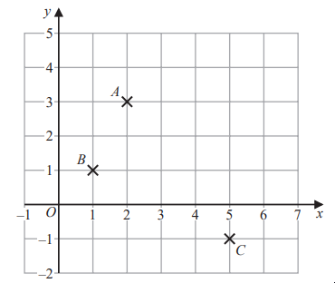

# Exam Questions — Coordinate Geometry
**Algebra** · Edexcel IGCSE Maths A (Modular) (4XMAF/4XMAH) — 24/Foundation Unit 1
> Source: [https://www.savemyexams.com/igcse/maths/edexcel/a-modular/24/foundation-unit-1/topic-questions/algebra/coordinate-geometry/exam-questions/](https://www.savemyexams.com/igcse/maths/edexcel/a-modular/24/foundation-unit-1/topic-questions/algebra/coordinate-geometry/exam-questions/) · 2 questions · total 8 marks

## Q1 — easy — 5 marks · exam-questions

### 5((a)) — 1 mark — command: write — structured — from paper 2023 June · 4MA1/2F
The diagram shows three points, $A,B$ and $C$, marked on a grid.

Write down the coordinates of point $A$

### 5((b)) — 1 mark — command: place — structured — from paper 2023 June · 4MA1/2F
On the grid, mark with a cross (×) the point $D$ so that $ABCD$ is a rectangle.

### 5((c)) — 2 marks — command: find — structured — from paper 2023 June · 4MA1/2F
Find the coordinates of the midpoint of $AC$

### 5((d)) — 1 mark — command: draw — structured — from paper 2023 June · 4MA1/2F
On the grid, draw the line with equation $y=4$

## Q2 — easy — 3 marks · exam-questions

### 4((a)) — 1 mark — command: write — structured — from paper 2023 Nov · 4MA1/1F
The diagram shows three points, $A,B$ and $C$, marked on a grid.

Write down the coordinates of point $A$

### 4((b)) — 1 mark — command: write — structured — from paper 2023 Nov  · 4MA1/1F
Write down the coordinates of point $B$

### 4((c)) — 1 mark — command: label — structured — from paper 2023 Nov · 4MA1/1F
$M$ is the midpoint of the line $AC$

On the grid, mark with a cross (×) the point $M$
Label the point $M$
