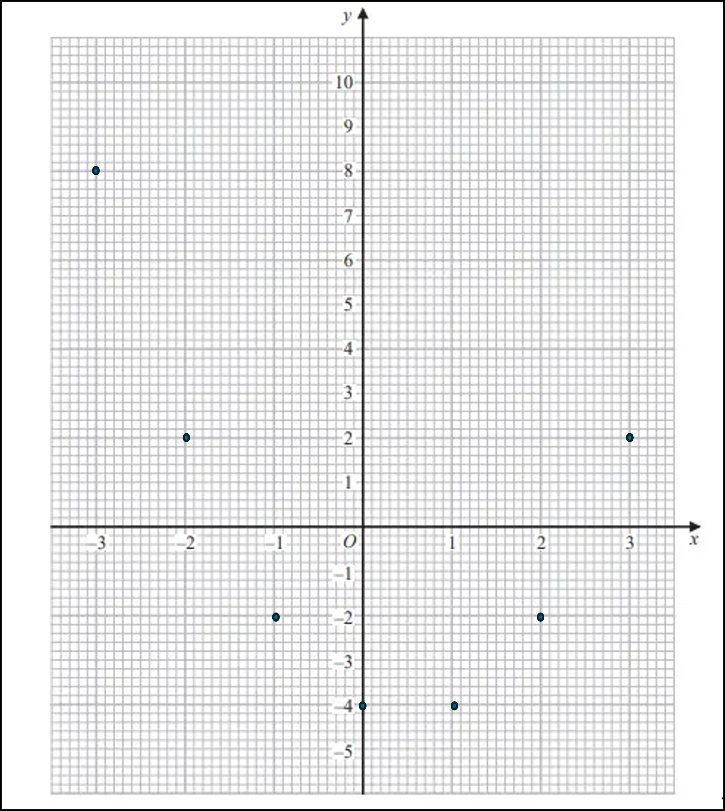

# Mark Schemes — Graphs of Functions
**Algebra** · Edexcel IGCSE Maths A (Modular) (4XMAF/4XMAH) — 24/Foundation Unit 1

## Q1 — medium — 4 marks · exam-questions

### 20((a)) — 2 marks
> *Substitute the *$x$* values into the equation to calculate the *$y$* values (be careful when squaring negative numbers!)*

`open parentheses negative 3 close parentheses squared minus open parentheses negative 3 close parentheses minus 4 equals 8`

`open parentheses negative 1 close parentheses squared minus open parentheses negative 1 close parentheses minus 4 equals negative 2`

$0^{2}-0-4=-4$

$2^{2}-2-4=-2$

$3^{2}-3-4=2$

| $x$ | -3 | -2 | -1 | 0 | 1 | 2 | 3 |
|---|---|---|---|---|---|---|---|
| $y$ | **Final answer:** **8** | 2 | **Final answer:** **-2** | **Final answer:** **-4** | -4 | **Final answer:** **-2** | **Final answer:** **2** |

**[B1 B1]**

> **[mark-scheme]**
> **B1**: For 3 or 4 correct values.
> 
> **B1**: For having all the correct values.

### 20((b)) — 2 marks
> *Plot your coordinates from a) onto the axes*

**[M1]**

> *Join your points with a smooth curve*

**[A1]**
