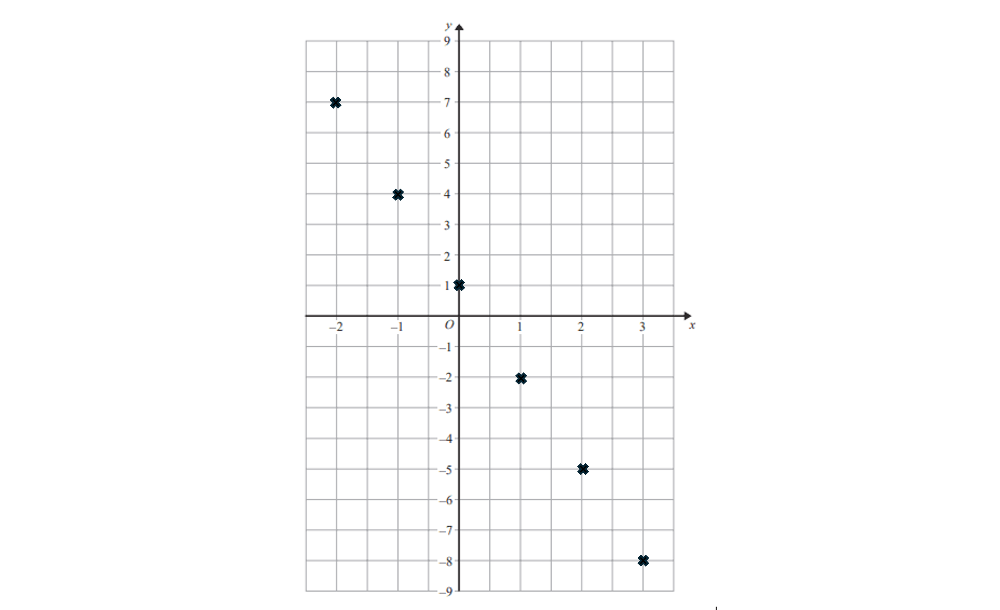
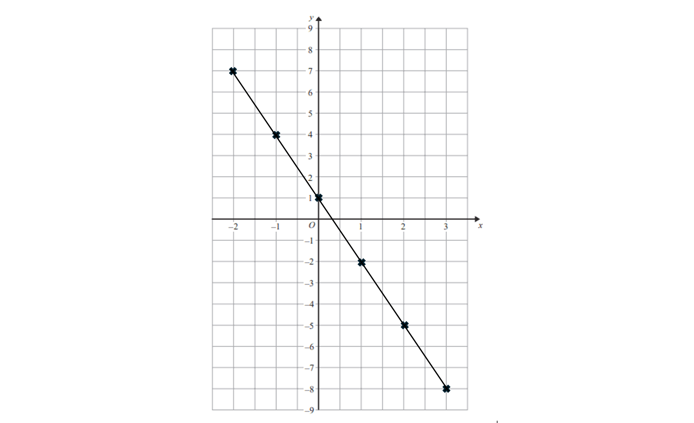
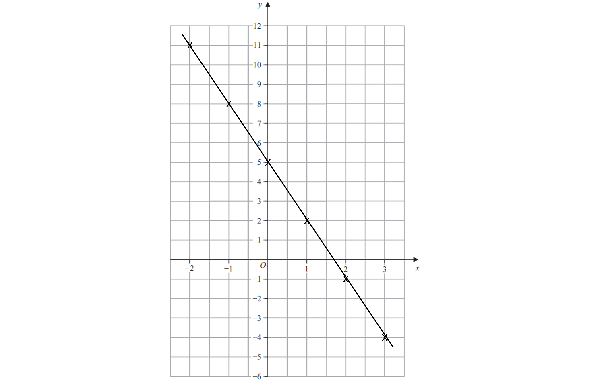

# Mark Schemes — Linear Graphs
**Algebra** · Edexcel IGCSE Maths A (Modular) (4XMAF/4XMAH) — 24/Foundation Unit 1

## Q1 — medium — 2 marks · exam-questions

### 25() — 2 marks
> *Work out the gradient between the points*

$\frac{y_{2}-y_{1}}{x_{2}-x_{1}}=\frac{-3-0}{0-2}=\frac{3}{2}$

**[B1]**

> *The y-intercept is given in the question *`open parentheses 0 comma space minus 3 close parentheses`

$y=\frac{3}{2}x-3$

**[B1]**

## Q2 — medium — 3 marks · exam-questions

### 12() — 3 marks
> *Draw an **x, y** table of values for values of **x **from -2 to 3*

| **x** | **y** |
|---|---|
| *-2* |   |
| *-1* |   |
| *0* |   |
| *1* |   |
| *2* |   |
| *3* |   |

> *Substitute each value of** x** into the function *$y=1-3x$* to work out the value of **y*

| **x** | **y** |
|---|---|
| *-2* | *1-3(-2)=1+6*  *             =7* |
| *-1* | *1-3(-1)=1+3*  *            =4* |
| *0* | *1-3(0)=1-0*  *          =1* |
| *1* | *1-3(1)=1-3*  *             =-2* |
| *2* | *1-3(2)=1-6*  *              =-5* |
| *3* | *1-3(3)=1-9*  *               =-8* |

**[B1]**

> *Plot the **x, y **values as pairs of coordinates on the coordinate grid*

*Plot (-2, 7), (-1, 4), (0, 1), (1, -2), (2, -5), (3, -8)*

**[B1]**

> *Join the points together with a straight line*

**[B1]**

## Q3 — medium — 3 marks · exam-questions

### 12() — 3 marks
> *Create a table of values*

| ***x*** | *-2* | *-1* | *0* | *1* | *2* | *3* |
|---|---|---|---|---|---|---|
| ***y*** | *11* | *8* | *5* | *2* | *-1* | *-4* |

> *Plot the points on the axes and join with a straight line*

**[B1 B1 B1]**

> **[mark-scheme]**
> **B1: **For at least 2 correct points, or for a straight line with a negative gradient through (0,5), or for a straight line with a gradient of -3.
> 
> **B1: **For points plotted correctly but not joined, or for a straight line through at least 3 correct points.
> 
> **B1: **For all points correct and joined with a straight line.
