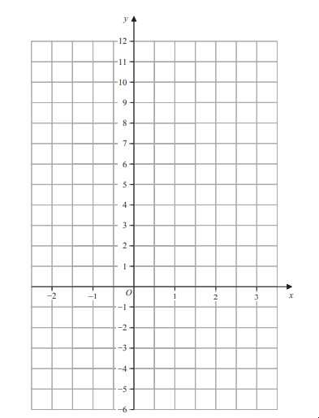

# Exam Questions — Linear Graphs
**Algebra** · Edexcel IGCSE Maths A (Modular) (4XMAF/4XMAH) — 24/Foundation Unit 1
> Source: [https://www.savemyexams.com/igcse/maths/edexcel/a-modular/24/foundation-unit-1/topic-questions/algebra/linear-graphs/exam-questions/](https://www.savemyexams.com/igcse/maths/edexcel/a-modular/24/foundation-unit-1/topic-questions/algebra/linear-graphs/exam-questions/) · 3 questions · total 8 marks

## Q1 — medium — 2 marks · exam-questions

### 25() — 2 marks — command: find — structured — from paper 2023 nov · 4MA1/2F
A straight line passes through the points with coordinates (0, –3) and (2, 0)
Find an equation of the line.

## Q2 — medium — 3 marks · exam-questions

### 12() — 3 marks — command: draw — structured — from paper Specimen paper · 4MA1/1F
On the grid, draw the graph of $y=1--3x$ for values of $x$ from –2 to 3

## Q3 — medium — 3 marks · exam-questions

### 12() — 3 marks — command: draw — structured — from paper 2023 Nov · 4MA1/1F
On the grid below, draw the graph of $y=5-3x$ for values of $x$ from − 2 to 3

